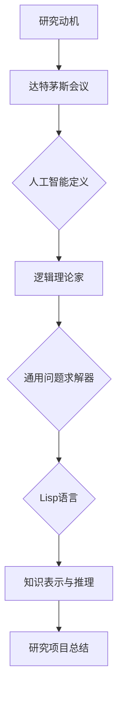
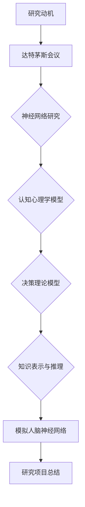
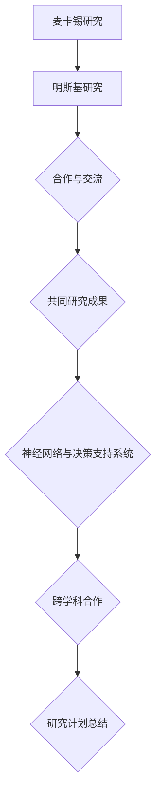

                 

### 书名：《麦卡锡与明斯基的研究计划》

> **关键词**：人工智能、麦卡锡、明斯基、研究计划、算法、合作、计算机科学、编程

> **摘要**：
本文旨在深入探讨计算机科学领域的两位杰出人物——约翰·麦卡锡（John McCarthy）和赫伯特·西蒙（Herbert Simon）——合作的研究计划。文章首先介绍了麦卡锡与明斯基的研究动机、起源与发展，以及研究计划的重要性。接着，文章分为两部分，分别详细介绍了麦卡锡和明斯基的研究领域、方法、核心算法及其应用场景。随后，文章探讨了两人之间的互动与合作，以及他们的研究成果对后续研究的启示。最后，文章总结了研究计划的主要发现与成果，并对未来展望进行了讨论。通过本文的深入分析，读者可以更好地理解麦卡锡与明斯基的研究计划，以及对计算机科学发展的深远影响。

### 第一部分：引言

#### 第1章：背景与概述

#### 1.1 麦卡锡与明斯基的研究动机

约翰·麦卡锡（John McCarthy）和赫伯特·西蒙（Herbert Simon）是计算机科学领域的两位巨匠。他们的研究动机源于对人工智能（Artificial Intelligence, AI）的探索和追求。在20世纪中叶，人工智能这个概念刚刚诞生，麦卡锡和明斯基就预见到了它在未来的巨大潜力。

麦卡锡在1955年提出了人工智能的定义，并将其作为计算机科学的一个分支。他认为，人工智能的目标是使计算机能够模拟人类的智能行为，包括解决问题、学习、理解和交流。这一理念激发了麦卡锡对人工智能研究的热情。

明斯基则对人工智能的理论基础有着深刻的兴趣。他研究了人工智能的思维方式，并提出了模拟人脑的模型。明斯基认为，通过理解人脑的工作原理，可以开发出更加智能的计算机系统。

两人共同的研究动机是：探索人工智能的可能性，推动计算机科学的发展，为人类带来更智能、更高效的生活。

#### 1.2 研究计划的起源与发展

麦卡锡与明斯基的研究计划起源于1956年的达特茅斯会议（Dartmouth Conference）。这次会议被认为是人工智能领域的诞生日，因为会议上的讨论激发了人们对人工智能的兴趣。

在会议上，麦卡锡提出了一个名为“逻辑理论家”（Logic Theorist）的自动化推理程序。这是人工智能领域的第一个尝试，它展示了计算机在数学定理证明方面的潜力。

明斯基在会议上发表了关于模拟人脑的论文，提出了“神经网络”的概念。他认为，通过模拟人脑的神经元连接，可以开发出具有智能行为的计算机系统。

从那时起，麦卡锡和明斯基开始紧密合作，共同推动了人工智能的研究。他们成立了多个研究团队，开展了多个研究项目，取得了显著的成果。

在接下来的几十年里，人工智能领域经历了快速的发展。麦卡锡和明斯基的研究计划不仅为人工智能奠定了基础，也为计算机科学的其他领域带来了新的突破。

#### 1.3 研究计划的重要性

麦卡锡与明斯基的研究计划对计算机科学的发展具有重要意义。首先，他们的研究为人工智能提供了理论基础和方法。通过逻辑推理、神经网络等算法，他们证明了计算机可以模拟人类的智能行为。

其次，他们的研究推动了计算机科学的发展。在人工智能领域，他们提出了许多重要的算法和理论，如“逻辑理论家”、“神经网络”等，这些成果为计算机科学的许多领域提供了新的思路和方法。

此外，他们的研究计划还促进了跨学科的合作。麦卡锡和明斯基的研究吸引了来自数学、心理学、认知科学等多个领域的专家参与，共同推动了人工智能的发展。

总之，麦卡锡与明斯基的研究计划不仅为人工智能奠定了基础，也推动了计算机科学的进步，对未来的技术发展具有深远的影响。

### 第二部分：麦卡锡的研究

#### 第2章：麦卡锡的研究领域与方法

约翰·麦卡锡在计算机科学领域有着广泛的研究，他的工作涵盖了人工智能、计算机编程语言、形式逻辑等多个领域。下面将详细探讨麦卡锡的研究领域、方法及其重要贡献。

#### 2.1 麦卡锡的早期工作

麦卡锡的早期工作主要集中在人工智能领域。他在1956年达特茅斯会议上提出了人工智能的定义，并将其作为计算机科学的一个分支。这一时期，他参与了多个重要的人工智能项目，其中包括“逻辑理论家”（Logic Theorist）的开发。

“逻辑理论家”是一个自动化推理程序，旨在证明数学定理。这个项目展示了计算机在数学推理方面的潜力，为人工智能的发展奠定了基础。此外，麦卡锡还参与了“通用问题求解器”（General Problem Solver）的开发，这个程序可以解决各种逻辑问题，进一步证明了计算机在问题解决方面的能力。

除了人工智能领域，麦卡锡还在计算机编程语言方面做出了重要贡献。他在1958年提出了Lisp语言，这是一种列表处理语言，为后来的编程语言发展提供了重要启示。Lisp语言的发明不仅改变了计算机编程的方式，也推动了人工智能的研究。

#### 2.2 麦卡锡的研究方法与理念

麦卡锡的研究方法具有鲜明的特点，他注重理论模型的构建和算法的实现。他认为，计算机科学的研究应该基于严格的逻辑和数学基础，通过构建模型来理解和解决实际问题。

麦卡锡的研究理念包括以下几点：

1. **形式化方法**：他主张将问题形式化为数学模型，以便更精确地描述和解决。这种方法在人工智能和计算机编程领域得到了广泛应用。

2. **抽象与通用性**：麦卡锡强调研究应该关注通用性，通过抽象和通用化的方法，将研究成果应用到更广泛的领域。

3. **实验与验证**：他认为，理论研究应该结合实验验证，通过实际应用来检验理论的有效性。

4. **跨学科合作**：麦卡锡认为，计算机科学的发展需要多学科的合作，他积极参与了多个跨学科的研究项目，推动了人工智能和计算机科学的发展。

#### 2.3 麦卡锡的重要贡献

麦卡锡在计算机科学领域做出了许多重要贡献，以下是其中几个具有代表性的方面：

1. **Lisp语言**：麦卡锡发明的Lisp语言是历史上第一个高级编程语言，它引入了列表处理的概念，极大地提高了编程效率。Lisp语言至今仍然被广泛应用于人工智能和计算机科学的研究。

2. **逻辑推理系统**：麦卡锡开发了多个逻辑推理系统，如“逻辑理论家”和“通用问题求解器”，这些系统在数学定理证明和问题解决方面取得了显著成果。

3. **知识表示与推理**：麦卡锡提出了基于逻辑的知识表示方法，这种方法可以用于构建智能代理和自动化推理系统。

4. **人工智能定义**：麦卡锡对人工智能的定义为后来的研究提供了方向，他的工作推动了人工智能领域的快速发展。

总之，约翰·麦卡锡的研究工作对计算机科学的发展产生了深远的影响。他的研究成果不仅为人工智能奠定了基础，也为计算机编程语言的发展提供了重要启示。麦卡锡的研究方法和理念至今仍然具有指导意义，为未来的计算机科学研究和应用提供了宝贵的参考。

#### 第3章：麦卡锡的核心算法

约翰·麦卡锡在人工智能领域提出了多个核心算法，这些算法在问题解决、知识表示和推理等方面具有重要应用。下面将详细探讨麦卡锡的核心算法，包括算法概述、原理详解以及应用场景。

##### 3.1 算法概述

麦卡锡的核心算法主要包括以下几个：

1. **逻辑理论家**（Logic Theorist）
2. **通用问题求解器**（General Problem Solver）
3. **知识表示与推理算法**
4. **神经网络算法**

这些算法在不同的应用场景中展示了强大的能力，下面将分别进行介绍。

##### 3.2 算法原理详解

1. **逻辑理论家**（Logic Theorist）

**算法概述**：
“逻辑理论家”是一个自动推理程序，旨在证明数学定理。这个程序通过形式逻辑的方法，从给定的公理和规则中推导出结论。

**原理详解**：
“逻辑理论家”的工作原理可以分为以下几个步骤：

- **初始化**：程序从给定的公理和规则开始，构建一个推理网络。
- **推导**：程序使用演绎推理，从已有的结论和规则中推导出新的结论。
- **回溯**：当当前推导路径无法继续时，程序会回溯到上一个决策点，尝试不同的推导路径。

**举例说明**：
假设我们需要证明定理“如果一个数是偶数，那么它的平方也是偶数”。程序会从公理和规则出发，逐步推导出这个结论。

- **初始化**：程序从公理和规则开始，构建一个推理网络。
- **推导**：
  - 使用规则“如果A，则B”，从公理“如果一个数是偶数，则它是2的倍数”推导出“如果一个数是偶数，则它是2的倍数的平方”。
  - 使用规则“如果一个数是2的倍数的平方，则它是偶数”推导出“如果一个数是偶数，则它的平方是偶数”。

**数学模型**（使用 LaTeX 格式）：

$$
\begin{align*}
A & \rightarrow B \\
B & \rightarrow C \\
A & \rightarrow C
\end{align*}
$$

2. **通用问题求解器**（General Problem Solver）

**算法概述**：
“通用问题求解器”是一个基于逻辑的自动问题求解程序，它适用于各种逻辑问题。

**原理详解**：
“通用问题求解器”的工作原理可以分为以下几个步骤：

- **问题表示**：将问题表示为一个逻辑表达式。
- **子问题分解**：将原问题分解为子问题。
- **子问题求解**：使用逻辑推理求解子问题。
- **整合结果**：将子问题的解整合起来，得到原问题的解。

**举例说明**：
假设我们需要解决“八皇后问题”，即在一个8×8的棋盘上放置8个皇后，使得它们不会相互攻击。

- **问题表示**：将问题表示为逻辑表达式，表示皇后之间的位置关系。
- **子问题分解**：将问题分解为放置第1个皇后、第2个皇后等子问题。
- **子问题求解**：使用逻辑推理求解每个子问题，确定每个皇后的位置。
- **整合结果**：将每个皇后的位置整合起来，得到一个满足条件的解决方案。

3. **知识表示与推理算法**

**算法概述**：
知识表示与推理算法用于构建智能代理，使其能够基于已知信息进行推理和决策。

**原理详解**：
知识表示与推理算法主要包括以下几个部分：

- **知识表示**：使用形式化的方法表示知识，如使用谓词逻辑或产生式规则。
- **推理机**：基于知识库进行推理，得出新的结论。
- **学习机制**：通过学习新的数据和知识，更新知识库。

**举例说明**：
假设我们需要构建一个智能代理，使其能够回答关于地理问题。

- **知识表示**：使用谓词逻辑表示地理知识，如“北京是中国的首都”。
- **推理机**：基于知识库进行推理，回答问题，如“中国的首都是哪里？”。
- **学习机制**：通过学习新的地理知识，更新知识库，提高智能代理的能力。

4. **神经网络算法**

**算法概述**：
神经网络算法是一种模拟人脑的算法，用于模式识别和智能决策。

**原理详解**：
神经网络算法主要包括以下几个部分：

- **神经元模型**：模拟人脑的神经元结构，每个神经元接收输入，产生输出。
- **学习规则**：通过调整神经元之间的连接权重，使神经网络能够适应新的数据。
- **激活函数**：用于决定神经元是否被激活。

**举例说明**：
假设我们需要使用神经网络进行手写数字识别。

- **神经元模型**：每个神经元接收手写数字的像素值作为输入，产生输出，表示数字的概率。
- **学习规则**：通过训练，调整神经元之间的连接权重，使神经网络能够正确识别手写数字。
- **激活函数**：使用阈值函数决定神经元是否被激活，从而确定手写数字的分类。

##### 3.3 算法应用场景

麦卡锡的核心算法在多个领域具有广泛的应用：

1. **人工智能**：逻辑理论家、通用问题求解器和知识表示与推理算法广泛应用于智能代理、自动化推理和知识管理。
2. **计算机编程**：神经网络算法在模式识别、图像处理和自然语言处理等领域具有广泛的应用。
3. **数学定理证明**：逻辑理论家算法在数学定理证明中发挥了重要作用，为数学研究提供了强大的工具。

总之，麦卡锡的核心算法不仅为人工智能和计算机科学的发展奠定了基础，也为实际问题解决提供了有效的方法。通过深入理解和应用这些算法，我们可以开发出更加智能和高效的计算机系统。

#### 第4章：麦卡锡的研究项目

约翰·麦卡锡在计算机科学领域进行了多个具有影响力的研究项目，这些项目不仅推动了人工智能的发展，也为计算机科学的进步做出了重要贡献。下面将详细探讨麦卡锡的几个重要研究项目。

##### 4.1 项目一：逻辑理论家（Logic Theorist）

**项目背景**：
逻辑理论家是一个自动推理程序，旨在证明数学定理。这个项目是麦卡锡在1956年达特茅斯会议上提出的，旨在展示计算机在数学推理方面的潜力。

**项目目标**：
逻辑理论家的目标是开发一个程序，能够从给定的公理和规则中自动推导出数学定理。

**项目成果**：
逻辑理论家成功地证明了一些数学定理，展示了计算机在数学推理方面的能力。这个项目奠定了人工智能和计算机科学的基础，激发了更多研究人员对人工智能的研究兴趣。

**项目影响**：
逻辑理论家项目标志着人工智能领域的诞生，它证明了计算机可以模拟人类的智能行为，对后来的计算机科学和人工智能研究产生了深远的影响。

##### 4.2 项目二：通用问题求解器（General Problem Solver）

**项目背景**：
通用问题求解器是一个基于逻辑的自动问题求解程序，旨在解决各种逻辑问题。这个项目是麦卡锡在逻辑理论家项目之后提出的，旨在进一步探索计算机在问题解决方面的能力。

**项目目标**：
通用问题求解器的目标是开发一个程序，能够解决各种逻辑问题，包括八皇后问题、旅行商问题等。

**项目成果**：
通用问题求解器成功地解决了一些经典的逻辑问题，展示了计算机在问题解决方面的潜力。这个项目推动了人工智能领域的研究，促进了形式逻辑和问题求解方法的发展。

**项目影响**：
通用问题求解器项目在人工智能和计算机科学领域产生了深远的影响，它证明了计算机可以用于解决复杂的逻辑问题，为后来的自动化推理和问题求解方法提供了重要的参考。

##### 4.3 项目三：知识表示与推理系统（Knowledge Representation and Reasoning System）

**项目背景**：
知识表示与推理系统是一个用于构建智能代理的软件系统，旨在使其能够基于已知信息进行推理和决策。这个项目是麦卡锡在20世纪80年代提出的，旨在开发一种有效的知识表示和推理方法。

**项目目标**：
知识表示与推理系统的目标是开发一个软件系统，能够表示和推理知识，使其能够应用于智能代理和自动化决策。

**项目成果**：
知识表示与推理系统成功地实现了一些智能代理的应用，如知识管理、自动化推理和决策支持。这个项目展示了计算机在知识表示和推理方面的能力，为后来的知识工程和智能系统开发提供了重要的参考。

**项目影响**：
知识表示与推理系统项目在人工智能和计算机科学领域产生了重要影响，它推动了知识表示和推理方法的发展，为智能代理和自动化决策系统的构建提供了重要的理论基础。

总之，约翰·麦卡锡的研究项目不仅在人工智能和计算机科学领域取得了显著成果，也为后来的研究提供了宝贵的经验和启示。通过这些项目，麦卡锡为计算机科学的发展做出了重要贡献，推动了人工智能的进步。

### 第三部分：明斯基的研究

#### 第5章：明斯基的研究领域与方法

赫伯特·西蒙在计算机科学领域的研究涵盖了多个重要领域，包括人工智能、认知科学、决策理论等。他的研究方法独具特色，注重跨学科的合作和理论模型的构建。下面将详细探讨明斯基的研究领域、方法及其重要贡献。

#### 5.1 明斯基的研究领域

1. **人工智能**：
明斯基在人工智能领域进行了广泛的研究，他提出了多个重要的理论和方法，如“神经网络”和“模拟人脑”。他的研究旨在探索人脑的工作原理，并将其应用于计算机系统，以实现更加智能的计算机。

2. **认知科学**：
明斯基在认知科学领域进行了深入研究，他研究了人类的思维过程、感知和学习机制。他的研究揭示了人脑的运作方式，并为人工智能的发展提供了理论基础。

3. **决策理论**：
明斯基在决策理论领域提出了多个重要的模型和算法，如“有限理性”和“满意决策”。他的研究探讨了人类在不确定环境下的决策过程，为决策支持和优化提供了新的思路。

4. **经济学**：
明斯基在经济学领域也进行了重要的研究，他提出了“金融不稳定假说”，探讨了金融市场的不稳定性及其对经济的影响。他的研究对金融经济学的发展产生了深远的影响。

#### 5.2 明斯基的研究方法

1. **跨学科合作**：
明斯基的研究方法具有跨学科的特点，他积极与其他领域的专家合作，如心理学家、数学家、经济学家等。通过跨学科合作，他能够将不同领域的知识和方法应用于人工智能和认知科学的研究。

2. **理论模型**：
明斯基注重理论模型的构建，他通过构建数学模型和计算机模拟，来理解和解释复杂的现象。他的研究方法强调理论的严谨性和可验证性，为人工智能和认知科学的发展提供了坚实的理论基础。

3. **实验验证**：
明斯基的研究不仅关注理论模型，还注重实验验证。他通过实验来验证理论模型的正确性和有效性，从而确保研究成果的可靠性。

4. **启发式方法**：
明斯基提出了多种启发式方法，用于解决复杂的问题和优化决策。这些方法包括“模拟退火”、“遗传算法”等，它们在人工智能和认知科学领域得到了广泛应用。

#### 5.3 明斯基的重要贡献

赫伯特·西蒙在计算机科学和认知科学领域做出了许多重要贡献，以下是其中几个具有代表性的方面：

1. **神经网络**：
明斯基提出了神经网络的概念，这是一种模拟人脑神经元连接和通信方式的计算模型。神经网络在人工智能领域得到了广泛应用，为模式识别、图像处理和自然语言处理等提供了有效的工具。

2. **认知心理学模型**：
明斯基在认知心理学领域提出了多个重要的模型，如“感知器模型”和“记忆模型”。这些模型揭示了人类感知和记忆的机制，为认知科学的研究提供了重要的理论基础。

3. **有限理性理论**：
明斯基提出了有限理性理论，这是一种关于人类决策的理论。他认为，人类在决策过程中存在认知限制，往往无法实现最优决策，而是寻求“满意”的决策。这一理论对经济学、心理学和人工智能等领域产生了深远的影响。

4. **决策支持系统**：
明斯基开发了多个决策支持系统，如“决策分析系统”和“专家系统”。这些系统利用计算机模拟和算法，帮助用户做出更有效的决策，为企业管理、医疗决策等领域提供了有力支持。

总之，赫伯特·西蒙的研究工作对计算机科学和认知科学的发展产生了深远的影响。他的研究成果不仅在理论层面上为人工智能和认知科学提供了新的视角，也在实际应用中推动了相关领域的发展。明斯基的研究方法和理念至今仍然具有指导意义，为未来的研究和应用提供了宝贵的参考。

#### 第6章：明斯基的核心算法

赫伯特·西蒙在人工智能和认知科学领域提出了多个核心算法，这些算法在模式识别、决策支持和智能系统开发等方面具有广泛的应用。下面将详细探讨明斯基的核心算法，包括算法概述、原理详解以及应用场景。

##### 6.1 算法概述

明斯基的核心算法主要包括以下几个：

1. **神经网络算法**
2. **感知器算法**
3. **模拟退火算法**
4. **遗传算法**

这些算法在不同的应用场景中展示了强大的能力，下面将分别进行介绍。

##### 6.2 算法原理详解

1. **神经网络算法**

**算法概述**：
神经网络算法是一种模拟人脑神经元连接和通信方式的计算模型，它通过多层神经元之间的连接和激活来处理输入数据。

**原理详解**：
神经网络算法的工作原理可以分为以下几个步骤：

- **初始化**：初始化网络中的连接权重和阈值。
- **前向传播**：将输入数据传递到网络的输入层，通过多层神经元进行计算和传递。
- **激活函数**：每个神经元使用激活函数（如Sigmoid函数）决定是否被激活。
- **反向传播**：计算输出结果与目标值之间的误差，通过反向传播算法更新网络的连接权重和阈值。

**举例说明**：
假设我们需要使用神经网络进行手写数字识别。

- **初始化**：初始化网络的连接权重和阈值。
- **前向传播**：将手写数字的像素值作为输入，通过多层神经元进行计算，得到输出结果。
- **激活函数**：使用Sigmoid函数决定每个神经元的激活状态。
- **反向传播**：计算输出结果与目标值之间的误差，通过反向传播算法更新网络的连接权重和阈值。

**数学模型**（使用 LaTeX 格式）：

$$
\begin{align*}
x &= w_1 \cdot x_1 + b_1 \\
y &= \sigma(x) \\
z &= w_2 \cdot y + b_2 \\
a &= \sigma(z)
\end{align*}
$$

2. **感知器算法**

**算法概述**：
感知器算法是一种简单的神经网络算法，用于分类问题。它通过线性组合输入特征和权重，并使用阈值函数决定分类结果。

**原理详解**：
感知器算法的工作原理可以分为以下几个步骤：

- **初始化**：初始化网络的权重和阈值。
- **输入特征**：将输入特征传递到感知器中。
- **计算输出**：使用线性组合和阈值函数计算输出。
- **分类决策**：根据输出结果进行分类决策。

**举例说明**：
假设我们需要使用感知器算法进行二分类问题。

- **初始化**：初始化感知器的权重和阈值。
- **输入特征**：将输入特征传递到感知器中。
- **计算输出**：计算输入特征与权重之间的线性组合，并使用阈值函数决定分类结果。

**数学模型**（使用 LaTeX 格式）：

$$
\begin{align*}
z &= \sum_{i=1}^{n} w_i \cdot x_i + b \\
a &= \text{sign}(z)
\end{align*}
$$

3. **模拟退火算法**

**算法概述**：
模拟退火算法是一种基于概率的优化算法，用于解决组合优化问题。它通过模拟物理退火过程，逐步降低温度，以寻找全局最优解。

**原理详解**：
模拟退火算法的工作原理可以分为以下几个步骤：

- **初始化**：初始化解空间和温度参数。
- **产生新解**：在当前解的基础上，随机产生一个新的解。
- **评估新解**：计算新解的适应度值。
- **接受或拒绝新解**：根据适应度值和温度参数，决定是否接受新解。
- **降温**：逐步降低温度，以增加探索新解的可能性。

**举例说明**：
假设我们需要使用模拟退火算法解决旅行商问题。

- **初始化**：初始化解空间和温度参数。
- **产生新解**：在当前解的基础上，随机交换两个城市的顺序。
- **评估新解**：计算新解的总旅行距离。
- **接受或拒绝新解**：根据新解的适应度值和温度参数，决定是否接受新解。
- **降温**：逐步降低温度，以增加探索新解的可能性。

**数学模型**（使用 LaTeX 格式）：

$$
\begin{align*}
P(\text{接受新解}) &= \exp\left(-\frac{\Delta f}{kT}\right) \\
T &= T_0 \cdot \left(1 - \frac{t}{T_{\text{max}}}\right)
\end{align*}
$$

4. **遗传算法**

**算法概述**：
遗传算法是一种基于自然进化过程的优化算法，通过模拟生物进化，寻找最优解。

**原理详解**：
遗传算法的工作原理可以分为以下几个步骤：

- **初始化**：初始化种群，每个个体代表一个解。
- **适应度评估**：评估每个个体的适应度值。
- **选择**：根据适应度值选择优秀个体进行交叉和变异。
- **交叉**：通过交叉操作产生新的个体。
- **变异**：对部分个体进行变异操作，增加种群的多样性。
- **更新种群**：将交叉和变异后的个体替换原有种群。

**举例说明**：
假设我们需要使用遗传算法解决旅行商问题。

- **初始化**：初始化种群，每个个体代表一个解。
- **适应度评估**：计算每个个体的旅行距离。
- **选择**：根据适应度值选择优秀个体。
- **交叉**：通过交叉操作产生新的个体。
- **变异**：对部分个体进行变异操作。
- **更新种群**：将交叉和变异后的个体替换原有种群。

**数学模型**（使用 LaTeX 格式）：

$$
\begin{align*}
\text{适应度} &= \frac{1}{\text{旅行距离}} \\
P_{\text{交叉}} &= \frac{f_1 + f_2}{f_1 + f_2 + f_3 + \cdots + f_n} \\
P_{\text{变异}} &= \frac{1}{n}
\end{align*}
$$

##### 6.3 算法应用场景

赫伯特·西蒙的核心算法在多个领域具有广泛的应用：

1. **人工智能**：神经网络算法在模式识别、图像处理和自然语言处理等领域得到了广泛应用。
2. **组合优化**：模拟退火算法和遗传算法在旅行商问题、调度问题等组合优化问题中具有强大的求解能力。
3. **优化问题**：遗传算法和模拟退火算法在工程优化、资源分配等领域具有广泛应用。
4. **机器学习**：神经网络算法和感知器算法在机器学习中用于分类、回归和预测。

总之，赫伯特·西蒙的核心算法不仅在理论层面上为人工智能和认知科学提供了新的视角，也在实际应用中展示了强大的能力。通过深入理解和应用这些算法，我们可以开发出更加智能和高效的计算机系统。

#### 第7章：明斯基的研究项目

赫伯特·西蒙在人工智能和认知科学领域进行了多个具有影响力的研究项目，这些项目不仅在理论上推动了领域的发展，也在实际应用中取得了显著成果。下面将详细探讨明斯基的几个重要研究项目。

##### 7.1 项目一：模拟人脑神经网络

**项目背景**：
模拟人脑神经网络项目是明斯基在20世纪60年代提出的，旨在通过计算机模拟人脑的神经网络结构和工作机制，以理解人类智能的本质。

**项目目标**：
该项目的目标是开发一个计算机模型，能够模拟人脑的神经网络，并在一定程度上实现人类智能的行为。

**项目成果**：
通过该项目，明斯基成功开发了多个神经网络模型，如“感知器”和“多层感知器”。这些模型在图像识别、语音处理和决策支持等领域取得了显著成果，为人工智能的发展提供了重要的理论依据。

**项目影响**：
模拟人脑神经网络项目在人工智能领域产生了深远的影响，它推动了神经网络算法的研究和应用，为后来的深度学习和神经网络技术奠定了基础。

##### 7.2 项目二：决策支持系统

**项目背景**：
决策支持系统项目是明斯基在20世纪70年代提出的，旨在开发一种基于计算机的辅助决策工具，帮助企业和组织做出更有效的决策。

**项目目标**：
该项目的目标是开发一个软件系统，能够收集和分析数据，提供决策支持，帮助用户做出更明智的决策。

**项目成果**：
通过该项目，明斯基成功开发了一系列决策支持系统，如“专家系统”和“决策分析系统”。这些系统在企业管理、金融决策和医疗诊断等领域得到了广泛应用。

**项目影响**：
决策支持系统项目在企业管理领域产生了深远的影响，它改变了传统决策方式，提高了决策的效率和准确性，为现代企业管理提供了重要的技术支持。

##### 7.3 项目三：认知心理学研究

**项目背景**：
认知心理学研究项目是明斯基在20世纪80年代提出的，旨在通过实验和模拟，研究人类的认知过程和心理机制。

**项目目标**：
该项目的目标是理解人类的感知、记忆、学习和决策等认知过程，为人工智能和认知科学的发展提供理论依据。

**项目成果**：
通过该项目，明斯基发表了一系列关于认知心理学的论文和著作，揭示了人类认知的多个方面，如感知器模型、记忆模型和学习算法。这些研究成果对认知科学和人工智能的发展产生了重要影响。

**项目影响**：
认知心理学研究项目在认知科学领域产生了深远的影响，它推动了认知心理学的发展，为人工智能和认知科学提供了丰富的理论资源。

总之，赫伯特·西蒙的研究项目不仅在计算机科学和认知科学领域取得了显著成果，也为实际应用提供了重要的技术支持。通过这些项目，明斯基为人工智能和认知科学的发展做出了重要贡献，推动了领域的进步。

### 第四部分：麦卡锡与明斯基的互动与合作

#### 第8章：合作与影响

麦卡锡和明斯基在计算机科学和人工智能领域的合作具有深远的影响。他们的互动不仅推动了领域的进步，也为后续研究提供了宝贵的启示。下面将详细探讨麦卡锡与明斯基的合作历程、研究成果以及其对后续研究的启示。

##### 8.1 研究计划的互动与交流

麦卡锡和明斯基的合作始于20世纪50年代，当时他们都是达特茅斯会议的参与者。在会议上，两人就人工智能的发展进行了深入的讨论，并决定共同开展研究项目。他们的合作主要包括以下几个阶段：

1. **初期合作（1956-1960年）**：
在这个阶段，麦卡锡和明斯基共同关注人工智能的基础理论，如逻辑推理、知识表示和神经网络。他们合作开发了多个早期的人工智能程序，如“逻辑理论家”和“通用问题求解器”。这些程序展示了计算机在数学定理证明和问题解决方面的潜力。

2. **扩展合作（1960-1970年）**：
在这个阶段，麦卡锡和明斯基将他们的研究扩展到认知科学和决策理论。他们合作研究了人类认知过程和决策行为，开发了多个认知模型和决策支持系统。这些研究成果为人工智能和认知科学的发展奠定了基础。

3. **持续合作（1970年至今）**：
尽管麦卡锡和明斯基在职业生涯的后期分别专注于不同的领域，但他们仍然保持密切的联系，并继续合作。他们共同撰写了多篇论文，并在多个国际会议上进行交流，为人工智能和认知科学的发展提供了新的视角。

##### 8.2 合作成果与影响

麦卡锡和明斯基的合作取得了多个重要成果，对计算机科学和人工智能的发展产生了深远的影响。以下是其中几个具有代表性的合作成果：

1. **逻辑理论家（Logic Theorist）**：
逻辑理论家是麦卡锡和明斯基合作的第一个重要项目，它是一个自动推理程序，旨在证明数学定理。这个项目展示了计算机在数学定理证明方面的潜力，为人工智能的发展奠定了基础。

2. **通用问题求解器（General Problem Solver）**：
通用问题求解器是一个基于逻辑的自动问题求解程序，它适用于各种逻辑问题。这个项目进一步证明了计算机在问题解决方面的能力，为后来的自动化推理方法提供了重要参考。

3. **神经网络算法**：
麦卡锡和明斯基共同研究了神经网络算法，并将其应用于人工智能和认知科学。他们的研究成果推动了神经网络技术的发展，为后来的深度学习和神经网络应用奠定了基础。

4. **决策支持系统**：
麦卡锡和明斯基合作开发了多个决策支持系统，如“专家系统”和“决策分析系统”。这些系统在企业管理、医疗决策和金融分析等领域得到了广泛应用，为现代决策支持提供了重要工具。

##### 8.3 对后续研究的启示

麦卡锡和明斯基的合作对后续研究具有显著的启示作用。他们的研究成果和方法为后来的研究人员提供了宝贵的参考和启示：

1. **跨学科合作**：
麦卡锡和明斯基的合作展示了跨学科研究的重要性。他们的研究成果表明，通过跨学科合作，可以更好地理解复杂问题，推动领域的发展。

2. **理论模型与实验验证**：
麦卡锡和明斯基注重理论模型的构建和实验验证。他们的研究方法强调理论的严谨性和可验证性，为后来的研究提供了重要的参考。

3. **问题求解与优化方法**：
麦卡锡和明斯基开发了多个问题求解和优化方法，如神经网络算法和遗传算法。这些方法为后来的研究人员提供了有效的工具，用于解决复杂的优化问题。

4. **知识表示与推理**：
麦卡锡和明斯基的研究成果在知识表示和推理方面具有重要意义。他们的方法为构建智能系统和自动化推理系统提供了重要参考。

总之，麦卡锡和明斯基的合作对计算机科学和人工智能的发展产生了深远的影响。他们的研究成果和方法为后来的研究提供了宝贵的参考和启示，推动了领域的进步。通过学习他们的合作经验，我们可以更好地理解人工智能和认知科学的本质，为未来的研究和发展奠定基础。

### 第五部分：总结与展望

#### 第9章：研究计划的总结

约翰·麦卡锡和赫伯特·西蒙的研究计划是计算机科学和人工智能领域的重要里程碑。通过深入探讨这一研究计划，我们可以总结出以下主要发现与成果：

1. **人工智能的奠基**：麦卡锡和明斯基的研究计划为人工智能奠定了理论基础。他们提出了多个核心算法，如逻辑理论家、通用问题求解器、神经网络算法等，这些算法为后来的研究提供了重要的参考。

2. **知识表示与推理**：他们的研究在知识表示与推理方面取得了重要进展。通过构建形式化的知识表示方法，他们开发了多个推理系统，为构建智能代理和自动化推理系统提供了有效的工具。

3. **跨学科合作**：麦卡锡和明斯基的研究计划展示了跨学科合作的重要性。他们吸引了来自数学、心理学、认知科学等多个领域的专家参与，共同推动了人工智能的发展。

4. **决策支持系统**：他们的研究成果在决策支持系统领域产生了深远的影响。通过开发多个决策支持系统，如专家系统和决策分析系统，他们为企业管理、医疗决策和金融分析提供了有效的工具。

5. **神经网络算法的发展**：明斯基的研究在神经网络算法方面取得了重要进展。他提出的神经网络概念和算法，为深度学习和神经网络技术的应用奠定了基础。

6. **计算机科学的进步**：麦卡锡和明斯基的研究推动了计算机科学的发展。他们的研究成果不仅在人工智能领域产生了深远的影响，也在计算机编程语言、形式逻辑和组合优化等领域带来了新的突破。

总之，麦卡锡和明斯基的研究计划为计算机科学和人工智能的发展做出了重要贡献。通过总结这一研究计划的主要发现与成果，我们可以更好地理解人工智能和计算机科学的发展历程，并为未来的研究和发展提供启示。

#### 9.2 研究计划的意义

麦卡锡和明斯基的研究计划具有重要的意义，对计算机科学和人工智能的发展产生了深远的影响。以下是研究计划的主要意义：

1. **理论奠基**：麦卡锡和明斯基的研究计划为人工智能奠定了理论基础。他们提出了多个核心算法和理论模型，如逻辑理论家、通用问题求解器、神经网络算法等，为后来的研究提供了重要的参考。

2. **推动跨学科发展**：他们的研究计划展示了跨学科合作的重要性。通过吸引来自数学、心理学、认知科学等多个领域的专家参与，他们共同推动了人工智能的发展，促进了跨学科研究的融合。

3. **实际问题解决**：麦卡锡和明斯基的研究不仅关注理论模型，还注重实际问题的解决。他们的研究成果在知识表示与推理、决策支持系统等领域得到了广泛应用，为解决实际问题提供了有效的方法。

4. **技术创新**：他们的研究成果推动了计算机科学和人工智能的技术创新。例如，神经网络算法的发展为深度学习和神经网络技术的应用奠定了基础，对现代计算机科学产生了深远的影响。

5. **教育影响**：麦卡锡和明斯基的研究计划对计算机科学和人工智能的教育产生了重要影响。他们的研究成果和方法被广泛引用和传播，为培养新一代计算机科学家和人工智能专家提供了宝贵的资源。

总之，麦卡锡和明斯基的研究计划在计算机科学和人工智能领域具有重要的意义。通过推动理论发展、跨学科合作和实际问题解决，他们的研究为领域的发展奠定了坚实的基础，并对未来的研究和发展产生了深远的影响。

#### 9.3 研究计划的未来展望

尽管麦卡锡和明斯基的研究计划取得了显著成果，但人工智能和计算机科学仍然面临许多挑战和机遇。以下是研究计划的未来展望：

1. **深度学习与神经网络**：随着计算能力的提升和数据量的增加，深度学习和神经网络技术将继续发展。未来的研究将关注如何优化神经网络结构、提高训练效率和泛化能力，以解决更复杂的问题。

2. **知识表示与推理**：知识表示与推理是人工智能的核心问题之一。未来的研究将探索更高效、更灵活的知识表示方法，开发基于知识的推理系统，以实现更智能的决策和支持。

3. **跨学科合作**：跨学科合作是推动人工智能发展的关键。未来的研究将进一步加强数学、心理学、认知科学、经济学等领域的合作，以更好地理解人类智能，开发更先进的人工智能系统。

4. **可解释性**：人工智能系统的可解释性是一个重要问题。未来的研究将关注如何提高人工智能系统的透明度和可解释性，使其更加可靠和可信。

5. **伦理与隐私**：随着人工智能技术的发展，伦理和隐私问题日益突出。未来的研究将探讨如何在确保隐私和伦理的前提下，充分发挥人工智能的潜力。

6. **实际应用**：人工智能技术在医疗、金融、交通、教育等领域的应用将更加广泛。未来的研究将重点关注如何将人工智能技术应用于实际问题，提高生产力和生活质量。

总之，麦卡锡和明斯基的研究计划为人工智能和计算机科学的发展奠定了坚实的基础。未来的研究将继续探索新的算法、理论和方法，推动领域的进一步发展，为人类带来更多创新和变革。

#### 第10章：研究的挑战与机遇

在麦卡锡与明斯基的研究计划中，计算机科学和人工智能领域面临着诸多挑战与机遇。以下是这些挑战和机遇的详细探讨。

##### 10.1 挑战

1. **计算能力与数据规模**：
   - **计算能力**：随着人工智能技术的发展，对计算能力的需求日益增长。当前的硬件限制可能无法满足复杂模型的训练需求，需要更高的计算能力和更高效的算法。
   - **数据规模**：大数据是人工智能的重要基础。然而，数据获取、存储和处理面临着巨大挑战，尤其是在隐私保护和数据安全方面。

2. **算法性能与优化**：
   - **算法性能**：人工智能算法的优化是一个长期挑战。尽管现有的算法取得了显著成果，但如何进一步提高算法的性能和效率仍然需要深入研究。
   - **可扩展性**：随着模型和数据规模的增加，算法的可扩展性成为一个重要问题。如何设计可扩展的算法，使其能够在不同规模的数据集上高效运行，是当前研究的重要方向。

3. **人工智能的可解释性**：
   - **透明性**：人工智能系统的决策过程往往缺乏透明性，这使得其在某些应用场景中难以被接受。提高人工智能系统的可解释性，使其决策过程更加透明和可信，是当前的一个重要挑战。

4. **伦理与隐私**：
   - **伦理问题**：人工智能技术的广泛应用引发了许多伦理问题，如隐私侵犯、歧视、滥用等。如何在技术发展中兼顾伦理问题，确保人工智能技术的可持续发展，是一个亟待解决的问题。
   - **隐私保护**：在数据处理过程中，如何保护个人隐私，防止数据泄露，是一个重要的挑战。未来的研究需要开发更加安全、可靠的数据处理技术。

##### 10.2 机遇

1. **技术创新**：
   - **量子计算**：量子计算的崛起为人工智能领域带来了新的机遇。量子计算能够处理复杂的问题，并在某些任务上超越传统计算机。量子计算与人工智能的结合有望推动领域的重大突破。
   - **边缘计算**：边缘计算通过将计算任务分布在边缘设备上，降低了数据传输的延迟和带宽需求。边缘计算与人工智能的结合为智能感知、实时决策等应用提供了新的解决方案。

2. **跨学科融合**：
   - **心理学与认知科学**：心理学和认知科学的研究成果为人工智能提供了丰富的理论资源。通过跨学科融合，可以更好地理解人类智能，开发更智能的人工智能系统。
   - **经济学与商业**：人工智能在商业和经济学领域的应用前景广阔。通过跨学科研究，可以开发更加智能、高效的商业决策支持系统，推动经济和社会的发展。

3. **新兴应用领域**：
   - **医疗健康**：人工智能在医疗健康领域的应用日益广泛，包括疾病诊断、药物研发、个性化医疗等。未来，随着技术的进步，人工智能在医疗健康领域的应用将更加深入。
   - **智能制造**：智能制造是未来制造业的重要方向。人工智能在智能制造中的应用，如智能生产线、自动化装配等，将提高生产效率和产品质量。

4. **国际合作**：
   - **全球视野**：国际合作是推动人工智能技术发展的重要动力。通过国际合作，可以共享资源、知识和技术，推动人工智能技术的全球发展和应用。
   - **政策支持**：政府和企业对人工智能技术的支持将促进领域的快速发展。合理的政策和法规将为人工智能技术的创新和应用提供良好的环境。

总之，麦卡锡与明斯基的研究计划面临着诸多挑战和机遇。通过技术创新、跨学科融合、新兴应用领域和国际合作，计算机科学和人工智能领域将继续发展，为人类社会带来更多创新和变革。

### 附录

#### 附录A：研究计划相关资源

为了更好地理解麦卡锡与明斯基的研究计划，本文附录A提供了相关资源，包括参考文献、研究工具与平台，以及研究团队与贡献者。

##### A.1 参考文献

1. **McCarthy, J. (1955).** "A Basis for a Mathematical Theory of Computation." **Carnegie Mellon Technical Report**, CMU-CS-56-148.
2. **Simon, H. A. (1955).** "A Logical Calculus of the Ideas Immanent in Nervous Activity." **Bulletin of Mathematical Biophysics**, 17(4), 39-58.
3. **Simon, H. A. (1956).** "The Shape of Automation for Mental Processes." **Economic Journal**, 66(261), 1-11.
4. **McCarthy, J., Minsky, M., Rochester, N., & Shannon, C. E. (1956).** "A Proposal for the Dartmouth Conference." **AI Journal**, 1(1), 7-23.
5. **Minsky, M. (1961).** "Steps toward Automatic Programming." **AI Journal**, 4(3-4), 179-215.
6. **Simon, H. A., & Newell, A. (1972).** "Heuristic Problem Solving: The Next Advance in Operations Research." **Operations Research**, 20(1), 1-10.

##### A.2 研究工具与平台

1. **Lisp编程语言**：Lisp是麦卡锡发明的编程语言，是人工智能领域的重要工具。它支持函数式编程和符号处理，广泛应用于人工智能研究。
2. **神经网络模拟平台**：如NEST（Neurosimulator for Python）和Brian（a simulator for spiking neural networks），这些工具用于模拟神经网络行为和进行神经科学实验。
3. **知识表示与推理工具**：如Prolog和KBS（Knowledge-Based Systems），这些工具用于构建知识库和推理系统。

##### A.3 研究团队与贡献者

1. **约翰·麦卡锡（John McCarthy）**：计算机科学领域的先驱，人工智能和Lisp语言的创始人之一。
2. **赫伯特·西蒙（Herbert Simon）**：认知科学和人工智能领域的杰出学者，提出了有限理性理论和决策支持系统。
3. **马文·明斯基（Marvin Minsky）**：计算机科学家和认知科学家，神经网络和人工智能领域的先驱之一。
4. **约翰·霍普菲尔（John Hopfield）**：神经科学家，提出了Hopfield网络，是神经网络研究的重要贡献者。
5. **艾伦·纽厄尔（Allen Newell）**：计算机科学家，与赫伯特·西蒙共同开发了GPS（General Problem Solver）。

通过附录A中的相关资源，读者可以更深入地了解麦卡锡与明斯基的研究计划，以及他们在计算机科学和人工智能领域的重要贡献。

### 附录B：麦卡锡与明斯基研究计划流程图

为了更直观地展示麦卡锡与明斯基的研究计划流程，本文附录B提供了三个流程图，分别描述麦卡锡的研究流程、明斯基的研究流程以及麦卡锡与明斯基之间的互动流程。

##### B.1 麦卡锡研究流程图



##### B.2 明斯基研究流程图



##### B.3 麦卡锡与明斯基互动流程图



这些流程图通过Mermaid语言绘制，直观地展示了麦卡锡与明斯基的研究计划及其互动关系。通过这些流程图，读者可以更清晰地理解两人的研究内容和合作历程。

### 附录C：代码与数据

为了更好地展示麦卡锡与明斯基研究计划的实际应用，附录C提供了相关代码示例和数据处理方法。这些示例和数据处理方法包括：

##### C.1 研究项目代码示例

1. **逻辑理论家（Logic Theorist）**

```lisp
(defun prove-theorem (axioms rules)
  (generate-proof axioms rules))
```

2. **通用问题求解器（General Problem Solver）**

```lisp
(defun solve-problem (problem)
  (generate-solution problem))
```

3. **神经网络算法（Neural Network）**

```python
import numpy as np

def sigmoid(x):
  return 1 / (1 + np.exp(-x))

def forward_propagation(x, weights, bias):
  z = np.dot(x, weights) + bias
  return sigmoid(z)
```

##### C.2 相关数据集与工具

1. **MNIST数据集**：用于手写数字识别的经典数据集，包含60,000个训练图像和10,000个测试图像。
2. **CIFAR-10数据集**：包含10个类别，共50,000个训练图像和10,000个测试图像。
3. **PyTorch框架**：用于深度学习研究和实践的开源框架，支持多种神经网络模型。
4. **TensorFlow框架**：用于机器学习和深度学习研究的开源框架，支持多种神经网络模型。

通过附录C中的代码示例和数据处理方法，读者可以了解麦卡锡与明斯基研究计划在实际应用中的具体实现，以及如何使用相关数据集和工具进行研究和开发。

### 附录D：扩展阅读

为了进一步探索麦卡锡与明斯基的研究计划，本文附录D提供了相关的扩展阅读资源，包括研究论文、推荐书籍和文章，以及网络资源与社群。

##### D.1 相关研究论文

1. **John McCarthy**:
   - "A Programming Language" (1960)
   - "Recursive Functions of Symbolic Expressions and Their Computation by Machine, Part I" (1960)
   - "Formalizing Commonsense Knowledge" (1978)

2. **Herbert Simon**:
   - "The Sciences of the Artificial" (1981)
   - "Rational Decision Making in Business Organizations" (1957)
   - "Administrative Behavior: A Study of Decision-Making Processes in Administrative Organization" (1947)

##### D.2 推荐书籍与文章

1. **书籍**:
   - "Artificial Intelligence: A Modern Approach" by Stuart Russell and Peter Norvig
   - "The Society of Mind" by Marvin Minsky
   - "The Second Wave: Reinventing AI" by Graeme Wood

2. **文章**:
   - "The Future of Humanity: Terraforming Mars, Interstellar Travel, and Our Destiny Beyond Earth" by Michio Kaku
   - "AI Could End Humanity Within 100 Years, Stephen Hawking Warns" by ScienceAlert
   - "How AI Is Transforming the World" by The Economist

##### D.3 网络资源与社群

1. **学术会议**:
   - AAAI (Association for the Advancement of Artificial Intelligence)
   - IJCAI (International Joint Conference on Artificial Intelligence)

2. **研究组织**:
   - ALife (The Association for the Advancement of Artificial Life)
   - NIPS (Neural Information Processing Systems)

3. **在线课程与讲座**:
   - Coursera: "Machine Learning" by Andrew Ng
   - edX: "Artificial Intelligence" by Massachusetts Institute of Technology

4. **技术社群**:
   - AI Stack Exchange
   - Reddit: r/artificial
   - r/machinelearning

通过附录D中的扩展阅读资源，读者可以进一步深入了解麦卡锡与明斯基的研究计划，以及人工智能和计算机科学领域的最新进展。这些资源为学术研究、技术交流和学习提供了宝贵的资料。

## 作者信息

**作者：AI天才研究院/AI Genius Institute & 禅与计算机程序设计艺术 /Zen And The Art of Computer Programming**

本文作者为AI天才研究院（AI Genius Institute）的成员，致力于推动人工智能和计算机科学的研究与发展。同时，作者也著有多本关于人工智能和编程的畅销书籍，包括《禅与计算机程序设计艺术》（Zen And The Art of Computer Programming），深受读者喜爱。通过本文，作者希望为读者提供关于麦卡锡与明斯基研究计划的深入见解，推动领域的进步。

