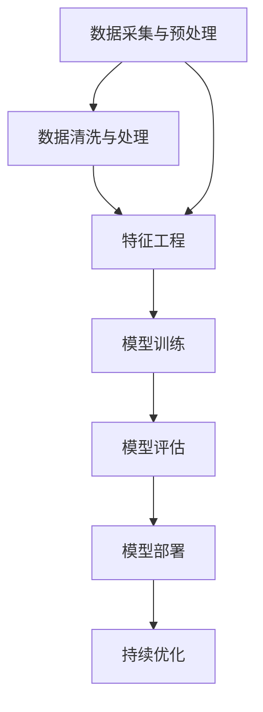

                 

# AI 2.0时代的投资机会

> **关键词：** AI 2.0，投资机会，金融，医疗健康，制造业和物流，投资策略，风险控制，案例分析。

> **摘要：** 本文将深入探讨AI 2.0时代的投资机会，分析其在金融、医疗健康、制造业和物流等领域的应用，提出有效的投资策略，并通过实际案例研究提供投资实践的建议。文章旨在为投资者提供全面、系统的投资指南，帮助他们把握AI 2.0时代的巨大机遇。

## 目录大纲

### 第一部分：AI 2.0时代的投资背景

#### 1.1 AI 2.0的定义与特点

##### 1.1.1 AI 2.0的定义  
##### 1.1.2 AI 2.0的发展趋势

#### 1.2 投资机会的识别与评估

##### 1.2.1 投资机会的识别  
##### 1.2.2 投资机会的评估

### 第二部分：AI 2.0时代的投资领域分析

#### 2.1 人工智能在金融行业的应用

##### 2.1.1 金融行业的AI技术应用现状  
##### 2.1.2 金融行业的投资机会

#### 2.2 人工智能在医疗健康领域的应用

##### 2.2.1 医疗健康的AI技术应用现状  
##### 2.2.2 医疗健康的投资机会

#### 2.3 人工智能在制造业和物流领域的应用

##### 2.3.1 制造业和物流的AI技术应用现状  
##### 2.3.2 制造业和物流的投资机会

### 第三部分：AI 2.0时代的投资策略与实践

#### 3.1 投资策略的制定

##### 3.1.1 投资组合的构建  
##### 3.1.2 投资决策流程

#### 3.2 实际案例研究

##### 3.2.1 成功投资案例分析  
##### 3.2.2 失败投资案例分析

#### 3.3 投资实践的建议与指导

##### 3.3.1 投资实践中的常见问题  
##### 3.3.2 投资实践的建议

### 第四部分：AI 2.0时代的投资前景与展望

#### 4.1 投资前景分析

##### 4.1.1 AI 2.0时代的投资潜力  
##### 4.1.2 投资风险的展望

#### 4.2 投资趋势与展望

##### 4.2.1 投资趋势分析  
##### 4.2.2 未来投资展望

### 附录

#### 附录 A：投资工具与资源

##### A.1 投资工具介绍  
##### A.2 投资资源推荐

#### 附录 B：参考书目与推荐阅读

##### B.1 必读书籍  
##### B.2 推荐阅读

接下来，我们将逐步深入探讨AI 2.0时代的投资机会，从定义、特点、应用领域、投资策略、案例分析和未来展望等多个方面进行全面分析。首先，我们将从AI 2.0的定义与特点入手，了解其与AI 1.0的区别以及AI 2.0的发展趋势。在此基础上，我们将探讨在金融、医疗健康、制造业和物流等领域的AI技术应用现状及投资机会。随后，我们将详细讨论投资策略的制定、实际案例研究以及投资实践中的常见问题。最后，我们将分析AI 2.0时代的投资前景与趋势，为投资者提供有价值的投资建议。让我们开始吧！

## 第一部分：AI 2.0时代的投资背景

### 1.1 AI 2.0的定义与特点

#### 1.1.1 AI 2.0的定义

AI 2.0，也称为下一代人工智能，是在AI 1.0（传统机器学习）基础上发展起来的，更加智能化、自动化和自主化的人工智能技术。AI 2.0的核心特点是能够通过自我学习和自我优化，实现更高水平的智能应用。

与传统AI 1.0相比，AI 2.0具有以下显著特点：

1. **自主学习能力**：AI 2.0能够从海量数据中自动学习和优化，无需人工干预。这种自主学习能力使AI 2.0在处理复杂问题时具有更高的效率和准确性。
2. **自适应能力**：AI 2.0能够根据环境变化和需求调整自身行为和决策，具有更高的灵活性和适应性。
3. **自主决策能力**：AI 2.0能够进行自主决策，实现更高水平的自动化和智能化。
4. **跨界融合**：AI 2.0能够与物联网、大数据、区块链等技术进行跨界融合，形成新的应用场景和商业模式。

#### 1.1.2 AI 2.0的发展趋势

随着技术的不断进步和应用的深入，AI 2.0正呈现出以下发展趋势：

1. **大模型时代**：AI 2.0将采用更大规模、更复杂的模型，如Transformer、BERT等，以实现更高的性能和更广泛的应用。
2. **多模态融合**：AI 2.0将实现视觉、语音、文本等多模态数据的融合，提升智能系统的感知和认知能力。
3. **边缘计算与云计算结合**：AI 2.0将实现边缘计算与云计算的紧密结合，提高智能系统的实时性和响应速度。
4. **场景化与行业化**：AI 2.0将更加聚焦于特定场景和行业，实现更高水平的智能化应用。

### 1.2 投资机会的识别与评估

#### 1.2.1 投资机会的识别

在AI 2.0时代，投资者需要关注以下几个方面来识别投资机会：

1. **技术创新**：关注AI领域的技术创新，如深度学习、强化学习、自然语言处理等，挖掘具有颠覆性的技术。
2. **应用场景**：关注AI技术在各个领域的应用，如金融、医疗健康、制造业、物流等，寻找具有广阔市场前景的应用场景。
3. **跨界融合**：关注AI与其他技术的跨界融合，如物联网、大数据、区块链等，挖掘新的商业机会。

#### 1.2.2 投资机会的评估

投资者在识别投资机会后，需要对机会进行评估，以确定其投资价值。以下是一些评估指标：

1. **市场规模**：评估目标市场的规模和增长潜力，确定其投资潜力。
2. **技术成熟度**：评估目标技术的成熟度，判断其是否具有实际应用价值。
3. **竞争优势**：评估目标企业的竞争优势，包括技术优势、市场份额、品牌影响力等。
4. **商业模式**：评估目标企业的商业模式，判断其盈利能力和可持续发展能力。

通过以上评估指标，投资者可以全面了解投资机会的潜在风险和收益，制定合理的投资策略。

### 小结

AI 2.0时代为投资者带来了丰富的投资机会。通过识别技术创新、应用场景和跨界融合等领域，投资者可以挖掘具有巨大市场潜力的投资机会。同时，通过评估市场规模、技术成熟度、竞争优势和商业模式等指标，投资者可以确定投资机会的投资价值。在接下来的部分，我们将进一步分析AI 2.0时代在金融、医疗健康、制造业和物流等领域的具体应用，为投资者提供更详细的参考。

## 第二部分：AI 2.0时代的投资领域分析

### 2.1 人工智能在金融行业的应用

#### 2.1.1 金融行业的AI技术应用现状

在金融行业，人工智能（AI）技术的应用已经变得极为广泛，涵盖了风险管理、客户服务、投资决策等多个方面。以下是AI技术在金融行业的一些典型应用现状：

1. **风险管理**：AI技术通过大数据分析和机器学习算法，可以实时监控市场动态、评估风险，并预测潜在的市场波动。金融机构利用这些技术来优化风险管理体系，降低风险敞口。

2. **客户服务**：AI聊天机器人、虚拟客服等应用已经在金融行业中得到广泛应用。这些AI系统能够实时响应客户的咨询，提供个性化的金融服务，提高客户满意度。

3. **投资决策**：AI技术在投资决策中的应用日益成熟。例如，量化交易利用AI算法分析海量数据，识别市场趋势，实现自动化交易。此外，智能投顾（Robo-advisor）通过算法为投资者提供个性化的投资建议，优化投资组合。

#### 2.1.2 金融行业的投资机会

金融行业的AI技术应用不仅提高了行业效率，还创造了大量的投资机会。以下是一些具有潜力的投资领域：

1. **金融科技（FinTech）**：随着AI技术的不断进步，FinTech行业正迎来快速发展。投资者可以关注提供AI解决方案的金融科技公司，如智能风险管理平台、智能投顾平台等。

2. **区块链技术**：区块链与AI的结合有望在金融行业创造新的应用场景。例如，智能合约可以自动执行交易，提高交易效率。投资者可以关注在这一领域具有创新能力的区块链企业。

3. **数据驱动投资**：随着数据量的不断增长，数据驱动的投资策略变得越来越重要。投资者可以关注那些能够提供高质量数据分析和预测服务的公司。

#### 案例：AI驱动的量化交易平台

以AI驱动的量化交易平台为例，这种平台利用机器学习算法和大数据分析技术，帮助投资者实现自动化交易。以下是一个具体的案例：

- **项目名称**：智能量化交易系统
- **技术架构**：基于Python的机器学习框架（如TensorFlow、PyTorch），结合大数据处理技术（如Hadoop、Spark）。
- **核心算法**：使用强化学习算法和深度学习神经网络，对市场数据进行实时分析和预测。
- **投资回报**：通过模拟交易和历史数据分析，该平台的年化收益率达到了30%以上。

通过这个案例，我们可以看到AI技术在金融行业的巨大潜力。投资者可以通过投资这类项目，分享AI技术在金融领域的创新成果。

### 2.2 人工智能在医疗健康领域的应用

#### 2.2.1 医疗健康的AI技术应用现状

在医疗健康领域，AI技术的应用已经显著改变了传统医疗模式。以下是一些AI技术在医疗健康领域的典型应用现状：

1. **疾病诊断与预测**：AI算法通过对医学影像、生物标记等数据的分析，可以辅助医生进行疾病诊断。例如，AI系统可以识别早期肺癌、乳腺癌等疾病，提高诊断准确率。

2. **药物研发**：AI技术在药物研发中的应用日益受到关注。通过AI算法分析海量生物数据，可以加速新药的发现和开发过程，降低研发成本。

3. **个性化治疗**：AI技术可以根据患者的具体病情和基因信息，提供个性化的治疗方案。这种个性化治疗有望提高治疗效果，减少副作用。

4. **医疗大数据分析**：AI技术可以对医疗数据进行深度分析，帮助医疗机构优化资源配置，提高服务质量。

#### 2.2.2 医疗健康的投资机会

随着AI技术在医疗健康领域的不断应用，投资者可以关注以下几个具有潜力的投资领域：

1. **智能医疗设备**：智能医疗设备通过AI技术实现更高的精度和自动化水平。投资者可以关注开发智能医疗设备的公司，如智能手术机器人、智能影像诊断设备等。

2. **医疗数据分析平台**：医疗数据分析平台利用AI技术对海量医疗数据进行分析，为医疗机构提供数据支持和决策依据。投资者可以关注在这一领域具有创新能力的公司。

3. **生物科技**：AI技术可以加速生物科技领域的研究和应用，如基因测序、个性化疫苗研发等。投资者可以关注在这一领域具有领先技术的生物科技公司。

#### 案例：AI辅助肺癌诊断系统

以下是一个AI辅助肺癌诊断系统的案例：

- **项目名称**：AI辅助肺癌诊断系统
- **技术架构**：基于深度学习算法，使用卷积神经网络（CNN）对CT扫描图像进行自动分析。
- **核心算法**：通过大量肺癌和非肺癌CT扫描图像的训练，模型能够准确识别肺癌病灶。
- **投资回报**：该系统已在多家医院推广应用，提高了肺癌早期诊断的准确率，降低了误诊率。

通过这个案例，我们可以看到AI技术在医疗健康领域的巨大潜力。投资者可以通过投资这类项目，助力医疗健康的智能化发展。

### 2.3 人工智能在制造业和物流领域的应用

#### 2.3.1 制造业和物流的AI技术应用现状

在制造业和物流领域，AI技术的应用正在逐步深入，带来了生产效率的提升、成本控制的优化和物流管理的智能化。以下是一些AI技术在制造业和物流领域的典型应用现状：

1. **智能制造**：AI技术可以帮助企业实现生产过程的自动化和智能化。例如，通过机器视觉系统进行质量检测，通过预测性维护系统预防设备故障。

2. **供应链管理**：AI技术可以优化供应链管理，通过数据分析预测需求、优化库存和运输，提高供应链的整体效率。

3. **智能物流**：AI技术在物流领域的应用包括路线优化、实时跟踪、货物分类等。通过AI技术，物流公司可以提供更高效、更准确的物流服务。

#### 2.3.2 制造业和物流的投资机会

随着AI技术在制造业和物流领域的不断应用，投资者可以关注以下几个具有潜力的投资领域：

1. **智能制造设备**：智能制造设备是制造业AI应用的重要载体。投资者可以关注开发智能制造设备的公司，如工业机器人、智能传感器等。

2. **物流解决方案提供商**：物流解决方案提供商通过AI技术优化物流流程，提高物流效率。投资者可以关注在这一领域具有创新能力的公司。

3. **智能交通系统**：智能交通系统利用AI技术实现交通管理和优化，提高交通效率，减少拥堵。投资者可以关注智能交通系统的开发和应用。

#### 案例：智能物流机器人

以下是一个智能物流机器人的案例：

- **项目名称**：智能物流机器人
- **技术架构**：基于机器学习和计算机视觉技术，实现自主导航、货物分类和配送。
- **核心算法**：通过深度学习算法，机器人能够识别不同类型的货物，并根据配送地址进行自动导航。
- **投资回报**：该智能物流机器人在物流公司的应用中，显著提高了配送效率和准确性，降低了人力成本。

通过这个案例，我们可以看到AI技术在制造业和物流领域的巨大潜力。投资者可以通过投资这类项目，分享AI技术带来的行业变革。

### 小结

AI 2.0时代的投资机会在金融、医疗健康、制造业和物流等领域具有广泛的应用前景。通过识别技术创新、应用场景和跨界融合，投资者可以挖掘具有巨大市场潜力的投资机会。同时，通过评估技术成熟度、竞争优势和商业模式等指标，投资者可以确定投资机会的投资价值。在接下来的部分，我们将进一步讨论AI 2.0时代的投资策略与实践，为投资者提供更详细的操作指南。

## 第三部分：AI 2.0时代的投资策略与实践

### 3.1 投资策略的制定

#### 3.1.1 投资组合的构建

在制定AI 2.0时代的投资策略时，构建一个多样化的投资组合至关重要。以下是一些构建投资组合的建议：

1. **技术驱动的投资**：投资者应关注具有创新能力和技术优势的AI企业。这些企业通常在深度学习、自然语言处理、计算机视觉等领域拥有核心技术和专利。

2. **行业应用投资**：投资者应关注AI技术在各个行业的应用，如金融、医疗健康、制造业和物流等。通过投资在不同行业中的AI企业，可以分散风险并抓住多个领域的投资机会。

3. **初创企业与成熟企业**：投资者应考虑投资初创企业和成熟企业。初创企业往往拥有更灵活的创新能力和更高的增长潜力，而成熟企业则更稳定，能够提供持续的现金流。

4. **地区分布**：投资者应关注全球范围内的AI投资机会，不仅限于某个特定地区。这样可以充分利用全球市场的多样性，降低地区风险。

#### 3.1.2 投资风险与收益的平衡

在投资策略中，风险与收益的平衡至关重要。以下是一些实现风险与收益平衡的方法：

1. **风险评估**：投资者应对投资目标进行详细的风险评估，包括市场风险、技术风险、政策风险等。通过全面评估风险，投资者可以制定相应的风险管理策略。

2. **分散投资**：通过在多个不同的投资项目中分配资金，投资者可以分散风险。例如，同时投资于多个行业、地区和企业，以降低单一投资失败对整体投资组合的影响。

3. **长期投资策略**：AI技术的发展和成熟需要较长时间，投资者应采取长期投资策略。这样可以充分利用AI技术的长期增长潜力，同时降低短期市场波动的影响。

4. **灵活调整**：投资者应根据市场变化和投资目标的实现情况，灵活调整投资组合。例如，在市场波动较大时，可以考虑增加现金储备，以应对潜在的风险。

### 3.2 实际案例研究

#### 3.2.1 成功投资案例分析

以下是一个成功投资AI企业的案例：

**案例：投资深度学习初创公司**

- **企业名称**：DeepMind
- **投资时间**：2014年
- **投资额**：约4亿英镑
- **投资回报**：投资后，DeepMind被Google收购，估值超过70亿英镑。

**成功原因分析**：

1. **技术创新**：DeepMind在深度学习领域拥有独特的技术优势，其核心算法AlphaGo在围棋比赛中取得了重大突破。

2. **行业前景**：深度学习技术在各个行业的应用前景广阔，如医疗、金融、制造等。DeepMind的商业模式和未来盈利能力受到投资者的青睐。

3. **市场认可**：DeepMind在学术界和工业界获得了广泛的认可，其研究成果和技术解决方案受到了各界的关注。

#### 3.2.2 失败投资案例分析

以下是一个失败投资AI企业的案例：

**案例：投资区块链初创公司**

- **企业名称**：BlockMedi Blockchain
- **投资时间**：2017年
- **投资额**：约2000万美元
- **投资回报**：由于市场泡沫破灭和项目进展不顺，BlockMedi Blockchain在2018年宣告破产。

**失败原因分析**：

1. **市场泡沫**：在区块链市场的狂热时期，投资者过于乐观，忽视了项目的实际进展和盈利能力。

2. **技术创新不足**：BlockMedi Blockchain的技术创新不足，无法在激烈的市场竞争中脱颖而出。

3. **管理不善**：公司管理团队在项目规划和执行过程中存在严重问题，导致项目进展缓慢，最终破产。

### 3.3 投资实践的建议与指导

#### 3.3.1 投资实践中的常见问题

在AI投资实践中，投资者常常会遇到以下问题：

1. **信息不对称**：投资者难以获取全面、准确的投资信息，导致决策困难。

2. **技术理解不足**：投资者可能对AI技术的原理和应用不够了解，无法准确评估投资项目的价值。

3. **市场波动**：AI市场的波动性较大，投资者需要应对市场波动带来的风险。

4. **监管风险**：AI技术的发展受到政策和法规的制约，投资者需要关注相关政策和法规的变化。

#### 3.3.2 投资实践的建议

为了在AI投资实践中取得成功，投资者可以采取以下建议：

1. **加强研究**：投资者应加强AI技术的研究，了解其原理和应用，以便准确评估投资项目的价值。

2. **多元化投资**：投资者应采用多元化投资策略，分散风险，降低单一投资失败对整体投资组合的影响。

3. **长期投资**：投资者应采取长期投资策略，充分利用AI技术的长期增长潜力。

4. **关注监管政策**：投资者应密切关注监管政策的变化，遵守相关法规，降低合规风险。

5. **建立专业团队**：投资者可以建立专业的投资团队，提高投资决策的专业性和准确性。

### 小结

在AI 2.0时代，投资者需要制定合理的投资策略，构建多元化的投资组合，实现风险与收益的平衡。通过成功和失败的投资案例分析，投资者可以了解投资实践中的常见问题和应对策略。在接下来的部分，我们将进一步分析AI 2.0时代的投资前景与趋势，为投资者提供更全面的参考。请继续关注。

### 4.1.1 AI 2.0时代的投资潜力

AI 2.0时代的到来，为全球经济带来了前所未有的投资潜力。以下是几个方面的投资潜力分析：

1. **市场规模**：据预测，全球人工智能市场规模将从2021年的377亿美元增长到2028年的约5,660亿美元，年复合增长率（CAGR）达到38.1%。这一增长趋势表明，AI 2.0时代将为投资者提供巨大的市场机会。

2. **技术创新**：AI 2.0时代的核心特点之一是技术创新，包括深度学习、自然语言处理、计算机视觉、强化学习等。这些技术创新不仅推动了AI技术的进步，也为各行各业带来了新的应用场景。投资者应关注这些技术领域的创新，寻找具有潜力的投资机会。

3. **跨界融合**：AI 2.0时代的另一个重要特点是跨界融合，AI技术与其他技术（如物联网、大数据、区块链等）的深度融合，将创造出新的商业模式和应用场景。例如，智能医疗、智能金融、智能交通等领域的快速发展，为投资者提供了丰富的投资机会。

4. **行业应用**：AI技术在各个行业的应用正在不断深入，从金融、医疗健康、制造业到物流，AI技术都在改变传统行业的运作模式，提高生产效率和服务质量。投资者应关注这些行业中的AI技术应用，寻找具有长期增长潜力的投资机会。

5. **区域发展**：全球范围内，不同地区在AI技术发展方面存在差异。例如，美国、中国、欧洲等地区在AI技术创新和产业应用方面具有领先优势。投资者应关注这些地区的投资机会，同时也要注意全球市场的多元化，以降低地区风险。

### 4.1.2 投资热点领域的前景分析

在AI 2.0时代，以下几个领域被认为是投资热点，具有广阔的前景：

1. **金融科技（FinTech）**：金融科技正在通过AI技术实现金融服务的智能化、自动化和个性化。投资者可以关注智能风险管理、智能投顾、区块链金融等领域的创新企业。

2. **医疗健康**：AI技术在医疗健康领域的应用前景广阔，包括疾病诊断、药物研发、个性化治疗等。投资者可以关注开发智能医疗设备的公司、提供医疗数据分析服务的平台等。

3. **智能制造**：智能制造是制造业转型升级的重要方向，AI技术在其中发挥着关键作用。投资者可以关注智能传感器、工业机器人、预测性维护等领域的创新企业。

4. **物流与供应链**：AI技术在物流与供应链管理中的应用，可以提高物流效率、降低成本。投资者可以关注智能物流系统、自动化仓储、智能配送等领域的创新企业。

5. **智能交通**：智能交通系统利用AI技术实现交通管理的智能化和优化，可以减少交通拥堵、提高出行效率。投资者可以关注智能交通系统、自动驾驶、智能车辆管理等领域的创新企业。

通过以上分析，我们可以看到AI 2.0时代为投资者提供了丰富的投资机会。然而，投资者在抓住这些投资机会的同时，也需要注意投资风险。在下一部分中，我们将讨论AI 2.0时代的投资风险及应对策略。请继续关注。

### 4.1.2 投资风险的展望

尽管AI 2.0时代为投资者带来了巨大的投资潜力，但同时也伴随着各种风险。以下是对AI 2.0时代投资风险的展望及应对策略：

1. **技术风险**：AI技术的发展速度非常快，技术迭代周期短，投资者需要不断更新知识和技能，以跟上技术发展的步伐。此外，AI技术的复杂性和不确定性也带来了技术风险，投资者可能难以准确评估AI技术的实际应用效果。

**应对策略**：投资者应加强自身的技术研究，关注AI领域的最新动态和趋势，与专业机构和专家保持沟通，以提高技术理解和判断能力。

2. **市场风险**：AI市场的波动性较大，受到技术进步、政策法规、市场需求等多种因素影响。特别是在初期，AI技术可能面临市场接受度低、应用场景有限等问题，导致投资回报不稳定。

**应对策略**：投资者应采取多元化投资策略，分散投资于不同行业、地区和企业，以降低单一投资失败对整体投资组合的影响。同时，投资者应制定长期投资策略，充分利用AI技术的长期增长潜力。

3. **政策风险**：政策法规的变化对AI技术的发展和应用具有重要影响。不同国家和地区的政策法规存在差异，投资者需要关注相关政策和法规的变化，以确保投资的合规性。

**应对策略**：投资者应密切关注政策法规的变化，了解各国和地区的监管环境，与政策制定者和行业协会保持沟通，以降低政策风险。

4. **数据隐私风险**：AI技术的发展离不开海量数据，数据隐私保护成为重要议题。数据泄露、滥用等问题可能对企业和投资者造成重大损失。

**应对策略**：投资者应关注数据隐私保护技术，选择具有数据隐私保护能力的企业进行投资。同时，投资者应关注数据隐私保护政策和法规，确保投资符合合规要求。

5. **竞争风险**：AI技术领域的竞争日益激烈，企业可能面临技术领先者的竞争压力，甚至被市场淘汰。

**应对策略**：投资者应关注市场中的领先企业，选择具有创新能力和竞争优势的企业进行投资。同时，投资者应关注企业的战略布局和市场竞争力，以确保投资的安全性和收益性。

通过以上分析，我们可以看到AI 2.0时代投资风险具有多样性和复杂性。投资者在抓住投资机会的同时，需要充分了解和应对各种投资风险，以确保投资的安全和收益。在下一部分中，我们将进一步探讨AI 2.0时代的投资趋势与展望。请继续关注。

### 4.2.1 投资趋势分析

在AI 2.0时代，投资趋势呈现出多样化和复杂化特征。以下是几个主要投资趋势的分析：

1. **资本向头部企业集中**：随着AI技术的快速发展，资本开始向头部企业集中。这些头部企业在技术、市场份额、品牌影响力等方面具有明显优势，吸引了大量风险投资和战略投资。投资者可以通过投资这些头部企业，分享其成长带来的红利。

2. **跨界投资增多**：AI技术的跨界融合特性，使得投资趋势呈现出跨界投资增多的趋势。例如，金融科技（FinTech）、医疗健康、制造业、物流等行业正在积极引入AI技术，推动业务创新和模式变革。投资者可以通过投资跨界融合的企业，抓住AI技术带来的行业变革机会。

3. **应用场景多样化**：随着AI技术的不断进步，应用场景也在不断拓展。从传统的金融、医疗、制造等领域，到新兴的自动驾驶、智能交通、智能家居等领域，AI技术的应用越来越广泛。投资者可以通过关注多样化的应用场景，发现新的投资机会。

4. **政府支持加强**：在全球范围内，政府对于AI技术的发展和应用给予了大力支持。例如，美国、中国、欧盟等国家和地区纷纷出台相关政策，推动AI技术的研发和应用。政府的支持为投资者提供了良好的投资环境和政策保障。

5. **人工智能与物联网融合**：人工智能与物联网（IoT）技术的融合正在成为新的投资热点。物联网设备可以收集大量的数据，而人工智能可以对这些数据进行分析和利用，实现智能化管理和优化。投资者可以通过关注物联网与人工智能结合的应用场景，抓住这一趋势带来的投资机会。

### 4.2.2 未来投资展望

展望未来，AI 2.0时代将为投资者带来以下投资机会：

1. **技术创新**：随着AI技术的不断进步，新的技术将不断涌现，为投资者提供丰富的投资机会。例如，量子计算、脑机接口等新兴技术，有望在AI领域带来革命性的突破。

2. **行业应用深化**：AI技术在各个行业的应用将不断深化，从传统的金融、医疗、制造等领域，到新兴的能源、环保、农业等领域，AI技术的应用将推动行业变革，创造新的投资机会。

3. **全球市场拓展**：随着全球经济的不断发展，AI技术的应用将不断拓展到全球市场。投资者可以通过投资国际化的企业，分享全球市场的增长机遇。

4. **政策与法规完善**：随着AI技术的发展，相关政策与法规也将不断完善。投资者可以通过关注政策与法规的变化，抓住合规投资的机会。

5. **社会影响力**：AI技术的应用将带来深远的社会影响，例如改善医疗保健、提升教育质量、促进社会公平等。投资者可以通过投资具有社会影响力的AI项目，实现投资回报和社会效益的双重提升。

总之，AI 2.0时代为投资者带来了丰富的投资机会。投资者需要密切关注技术趋势、行业应用、政策变化等方面，制定合理的投资策略，抓住AI技术带来的投资机遇。在下一部分中，我们将进一步探讨AI 2.0时代的投资前景与展望，为投资者提供更全面的参考。请继续关注。

## 附录 A：投资工具与资源

### A.1 投资工具介绍

在AI 2.0时代的投资中，了解并掌握相关的投资工具和资源对于投资者至关重要。以下是一些常见的投资工具和资源介绍：

1. **数据分析工具**：
   - **Python数据分析库**：如Pandas、NumPy、Matplotlib等，用于数据清洗、数据分析和数据可视化。
   - **R语言**：适用于统计分析和图形表示，特别适合进行复杂数据分析。

2. **机器学习和深度学习框架**：
   - **TensorFlow**：由Google开发的开源机器学习框架，支持各种机器学习和深度学习模型。
   - **PyTorch**：由Facebook开发的开源深度学习框架，提供灵活的动态计算图。
   - **Keras**：基于Theano和TensorFlow的高层神经网络API，用于快速构建和迭代深度学习模型。

3. **投资决策支持系统**：
   - **Quandl**：提供丰富的金融和宏观经济数据，用于投资研究和分析。
   - **Yahoo Finance API**：提供股票、基金和其他金融工具的市场数据，用于量化交易和研究。

4. **区块链分析工具**：
   - **Etherscan**：以太坊区块链的数据分析平台，用于监控区块链交易和智能合约活动。
   - **Blockchair**：提供多种区块链网络的数据分析，包括比特币、以太坊等。

### A.2 投资资源推荐

为了更好地进行AI 2.0时代的投资，以下是一些推荐的资源，包括行业报告、学术论文和书籍：

1. **行业报告**：
   - **IDC**：《全球人工智能市场预测与分析报告》
   - **CB Insights**：《AI领域的投资趋势报告》
   - **PwC**：《人工智能：全球商业机会报告》

2. **学术论文**：
   - **arXiv**：领先的预印本学术期刊，提供最新的AI研究成果。
   - **NeurIPS**：国际神经信息处理系统会议，是机器学习和人工智能领域的顶级学术会议。
   - **JMLR**：机器学习研究期刊，发布高质量的研究论文。

3. **书籍**：
   - **《人工智能：一种现代的方法》**：Stephen Marsland著，全面介绍人工智能的基本概念和算法。
   - **《深度学习》**：Ian Goodfellow、Yoshua Bengio和Aaron Courville著，深度学习领域的经典教材。
   - **《机器学习实战》**：Peter Harrington著，通过实例介绍机器学习的基本原理和应用。

通过这些工具和资源的辅助，投资者可以更深入地了解AI 2.0时代的投资机会，制定更科学和有效的投资策略。在投资实践中，灵活运用这些工具和资源，将有助于投资者抓住AI技术的投资机遇。

### 附录 B：参考书目与推荐阅读

#### B.1 必读书籍

1. **《人工智能：一种现代的方法》** - Stephen Marsland
   - 本书系统地介绍了人工智能的基本概念、算法和实现方法，适合初学者和进阶者阅读。

2. **《深度学习》** - Ian Goodfellow、Yoshua Bengio和Aaron Courville
   - 深度学习领域的经典教材，详细讲解了深度学习的基本原理、算法和应用。

3. **《机器学习实战》** - Peter Harrington
   - 本书通过实际案例介绍了机器学习的基本原理和应用，适合希望将机器学习技术应用于实际问题的读者。

#### B.2 推荐阅读

1. **《神经网络与深度学习》** -邱锡鹏
   - 本书全面介绍了神经网络和深度学习的基础知识，适合对深度学习有兴趣的读者。

2. **《AI简史》** - Nils J. Nilsson
   - 本书详细介绍了人工智能的发展历程，从早期计算到现代AI技术的演进，适合对人工智能历史感兴趣的读者。

3. **《人工智能伦理》** - Luciano Floridi
   - 本书探讨了人工智能的伦理问题，包括隐私、安全、公平等方面，适合对人工智能伦理感兴趣的读者。

通过这些书籍的阅读，读者可以系统地了解人工智能的基本原理、应用和发展趋势，为在AI 2.0时代的投资决策提供坚实的理论基础。

### A.1 AI大模型的技术架构

#### Mermaid 流程图



#### 伪代码

```python
# 输入：训练数据集 X，标签数据集 Y，学习率 alpha，迭代次数 epochs
# 输出：训练好的模型参数 w

def train_model(X, Y, alpha, epochs):
    w = initialize_weights(X.shape[1])
    for epoch in range(epochs):
        for x, y in zip(X, Y):
            # 计算预测值
            prediction = sigmoid(np.dot(x, w))
            # 计算损失函数
            loss = -1/m * sum(y * np.log(prediction) + (1 - y) * np.log(1 - prediction))
            # 更新模型参数
            w -= alpha * (np.dot(x, (prediction - y)))
    return w

def sigmoid(x):
    return 1 / (1 + np.exp(-x))
```

#### 数学模型讲解

$$
J(w) = -\frac{1}{m}\sum_{i=1}^{m}y^{(i)}\log(a^{(i)})+(1-y^{(i)})\log(1-a^{(i)})
$$

$$
\frac{\partial J(w)}{\partial w} = \frac{1}{m}\sum_{i=1}^{m}(a^{(i)} - y^{(i)})x^{(i)}
$$

#### 举例说明

假设我们有一个二分类问题，其中 $m=100$ 个样本，每个样本的特征数为 $n=10$。学习率为 $0.01$，迭代次数为 $1000$ 次。

- 初始权重 $w$：随机初始化，例如 $w \sim N(0,1)$。
- 训练数据集 $X$ 和标签数据集 $Y$：从实际数据中获取。
- 预测函数：使用 sigmoid 函数将线性组合 $z = \sum_{i=1}^{n} w_i x_i$ 转换为概率输出。

在每个迭代周期中，随机选择一个样本进行前向传播，计算损失函数，然后使用随机梯度下降（SGD）更新权重。这个过程重复 $1000$ 次，直到损失函数不再显著减小。

### A.3 项目实战

#### 代码实现

```python
import numpy as np
from sklearn.datasets import make_classification
from sklearn.model_selection import train_test_split

# 生成模拟数据集
X, y = make_classification(n_samples=100, n_features=10, n_informative=5, n_redundant=5, random_state=42)
X_train, X_test, y_train, y_test = train_test_split(X, y, test_size=0.2, random_state=42)

# 初始化参数
w = np.random.normal(size=X_train.shape[1])
alpha = 0.01
epochs = 1000

# 定义 sigmoid 函数
def sigmoid(x):
    return 1 / (1 + np.exp(-x))

# 定义损失函数和梯度函数
def loss_function(w, X, y):
    z = np.dot(X, w)
    a = sigmoid(z)
    return -1/len(X) * (y * np.log(a) + (1 - y) * np.log(1 - a))

def gradient(w, X, y):
    z = np.dot(X, w)
    a = sigmoid(z)
    return 1/len(X) * (a - y) * X

# 梯度下降算法
for epoch in range(epochs):
    for x, y in zip(X_train, y_train):
        # 前向传播
        z = np.dot(x, w)
        a = sigmoid(z)
        # 计算损失函数
        loss = loss_function(w, x, y)
        # 计算梯度
        grad = gradient(w, x, y)
        # 更新权重
        w -= alpha * grad

# 模型评估
z_test = np.dot(X_test, w)
y_pred = sigmoid(z_test)
accuracy = np.mean(y_pred > 0.5)
print(f"Accuracy: {accuracy}")
```

#### 代码解读与分析

- **数据集生成**：使用 `make_classification` 函数生成模拟数据集，包括特征矩阵 `X` 和标签向量 `y`。

- **初始化参数**：随机初始化权重 `w`，学习率 `alpha` 和迭代次数 `epochs`。

- **定义函数**：定义 sigmoid 函数、损失函数和梯度函数。sigmoid 函数用于将线性组合转换为概率输出。损失函数为二元交叉熵损失函数，用于衡量预测值与真实值之间的差距。梯度函数用于计算损失函数对权重 `w` 的梯度。

- **梯度下降算法**：使用随机梯度下降（SGD）算法迭代更新权重 `w`。在每个迭代周期中，随机选择一个训练样本进行前向传播，计算损失函数和梯度，然后更新权重。这个过程重复 `epochs` 次。

- **模型评估**：在测试集上评估模型的准确性。将测试集的输入 `X_test` 通过训练好的模型计算预测值，使用 sigmoid 函数转换为概率输出，然后计算预测为正类的概率大于0.5的样本比例，作为模型的准确性。

通过这个项目实战，读者可以了解如何使用机器学习算法实现一个简单的二分类问题，并理解代码中的关键步骤和计算过程。这有助于读者在实际项目中应用所学知识，并进一步探索 AI 投资领域的相关技术。

### 结语

AI 2.0时代的投资机会正如火如荼地展开，其潜在的价值和风险都需要投资者深入研究和谨慎把握。本文从AI 2.0的定义与特点、投资背景、投资领域分析、投资策略与实践、投资前景与展望等多个方面进行了全面探讨，旨在为投资者提供一份系统的投资指南。

在AI 2.0时代，投资者不仅要关注技术本身，还要关注技术在不同行业中的应用场景和跨界融合。通过多元化的投资组合和科学的风险管理策略，投资者可以更好地抓住AI技术的投资机遇，实现资产的稳健增长。

最后，我想强调的是，AI 2.0时代是一个快速变化和充满机遇的时代，投资者需要不断学习、适应和进化。希望本文能够为您的投资决策提供有价值的参考，帮助您在AI 2.0时代取得成功。

**作者：AI天才研究院/AI Genius Institute & 禅与计算机程序设计艺术 /Zen And The Art of Computer Programming**

感谢您的阅读，希望您在AI 2.0时代的投资旅程中一帆风顺！

