                 

# AI 2.0 时代的未来趋势

> **关键词：** AI 2.0、深度学习、强化学习、大规模预训练模型、社会影响、政策与法律框架

> **摘要：** 本文将深入探讨AI 2.0时代的未来趋势，从基础理论到应用前景，再到社会影响和政策法规，为读者呈现一幅全面而清晰的未来图景。我们将通过逐步分析，揭示AI 2.0技术如何改变我们的世界。

---

## 《AI 2.0时代的未来趋势》目录大纲

- **第一部分：AI 2.0基础与前沿技术**

  - 第1章: AI 2.0 概述
  - 第2章: AI 2.0 的核心技术
  - 第3章: AI 2.0 的数学基础

- **第二部分：AI 2.0在各领域的应用**

  - 第4章: AI 2.0 在医疗健康领域的应用
  - 第5章: AI 2.0 在金融领域的应用
  - 第6章: AI 2.0 在工业制造领域的应用

- **第三部分：AI 2.0时代的未来趋势分析**

  - 第7章: AI 2.0 时代的商业机会
  - 第8章: AI 2.0 时代的社会影响
  - 第9章: AI 2.0 时代的政策与法律框架
  - 第10章: AI 2.0 时代的未来展望

- **附录**

  - 附录 A: AI 2.0 相关资源与工具

---

## 第一部分：AI 2.0基础与前沿技术

### 第1章: AI 2.0 概述

#### 1.1 AI 2.0 的定义与发展

AI 2.0，也被称为第二代人工智能，是对传统AI技术的一种升级和扩展。它强调人工智能的自主性和适应性，不仅仅限于执行预设的任务，而是能够通过学习、进化来适应复杂多变的环境。

AI 2.0的发展离不开深度学习、强化学习等前沿技术的突破。这些技术的进步使得AI系统具备了更强的学习能力、推理能力和决策能力。与传统的基于规则的方法相比，AI 2.0能够通过自我学习和不断优化来提升性能。

#### 1.2 AI 2.0 与传统AI的区别

传统AI主要是基于规则和符号推理的，它依赖于人类专家的知识和经验来设计系统。而AI 2.0则更加注重数据驱动的方法，通过大规模的数据集进行训练，使得系统能够自主学习并提高性能。

在应用层面，传统AI通常应用于结构化数据，如图像识别、语音识别等。而AI 2.0则能够处理更复杂的非结构化数据，如图像、语音、自然语言文本等，这使得AI 2.0在各个领域的应用潜力更大。

#### 1.3 AI 2.0 的影响与挑战

AI 2.0的影响深远，不仅改变了科技产业，也深刻影响了社会、经济和文化。然而，AI 2.0的快速发展也带来了诸多挑战，如数据隐私、伦理道德、就业问题等。

在接下来的章节中，我们将进一步探讨AI 2.0的核心技术，包括深度学习、强化学习、大规模预训练模型等，以及它们在数学基础方面的应用。

---

### 第2章: AI 2.0 的核心技术

#### 2.1 深度学习与神经网络基础

##### 2.1.1 神经网络的基本结构

神经网络是深度学习的基础。一个基本的神经网络由输入层、隐藏层和输出层组成。每个神经元都接收前一层神经元的输出，通过权重和偏置进行加权求和，最后通过激活函数输出结果。

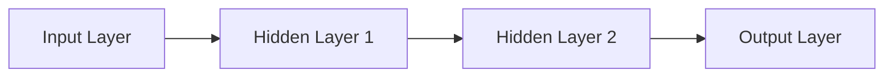

##### 2.1.2 常见的深度学习架构

深度学习的架构多种多样，包括卷积神经网络（CNN）、循环神经网络（RNN）、生成对抗网络（GAN）等。每种架构都有其特定的应用场景和优势。

- **卷积神经网络（CNN）**：适用于图像识别、图像生成等领域。它通过卷积层、池化层等结构来提取图像的特征。
- **循环神经网络（RNN）**：适用于序列数据，如语音识别、机器翻译等。它通过隐藏状态来处理长距离依赖问题。
- **生成对抗网络（GAN）**：适用于图像生成、数据增强等领域。它由生成器和判别器组成，通过对抗训练来生成逼真的数据。

##### 2.1.3 深度学习优化算法

深度学习的训练过程通常需要大量的计算资源和时间。优化算法如梯度下降（Gradient Descent）、Adam优化器等，通过调整参数来最小化损失函数，从而提高模型的性能。

```python
# 梯度下降算法伪代码
while not converged:
    gradients = compute_gradients(model)
    update_parameters(model, gradients)
```

#### 2.2 强化学习与博弈论

##### 2.2.1 强化学习的原理与应用

强化学习是一种通过奖励信号来训练智能体的方法。智能体在环境中采取行动，通过观察环境的反馈来学习最优策略。

强化学习的核心算法包括Q学习、SARSA、深度强化学习等。它广泛应用于游戏、机器人控制、推荐系统等领域。

```python
# Q学习算法伪代码
Q[s, a] = Q[s, a] + alpha * (reward + gamma * max(Q[s', a']) - Q[s, a])
```

##### 2.2.2 博弈论的基本概念

博弈论研究的是在具有冲突和合作的情境下，个体如何做出决策。它包括策略、博弈形式、纳什均衡等概念。

博弈论与强化学习的结合，使得AI系统能够在复杂的多方博弈中找到最优策略。

##### 2.2.3 强化学习与博弈论的融合

强化学习与博弈论的融合，使得AI系统在博弈中能够更加灵活地应对各种情况。它不仅能够学习到最优策略，还能够预测对手的行为，从而在博弈中取得优势。

```python
# 强化学习与博弈论的融合伪代码
while not converged:
    action = select_action(strategy)
    reward = receive_reward(action)
    strategy = update_strategy(strategy, reward)
```

#### 2.3 大规模预训练模型

##### 2.3.1 预训练的概念与意义

预训练是指在大量数据集上进行模型训练，使模型在特定任务上具有较好的性能。大规模预训练模型通过在大量无标签数据上进行预训练，然后在特定任务上进行微调，从而提高了模型的泛化能力和性能。

##### 2.3.2 自监督学习方法

自监督学习是一种通过未标注的数据进行训练的方法。在预训练过程中，模型需要预测数据中的某些部分，如掩码、分类标签等，从而学习到数据的潜在特征。

##### 2.3.3 迁移学习与微调技术

迁移学习是一种将预训练模型的知识迁移到新任务上的方法。微调技术通过对预训练模型进行少量调整，使其在新任务上达到良好的性能。

```python
# 微调技术伪代码
pretrained_model = load_pretrained_model()
for layer in pretrained_model.layers:
    layer.trainable = False
model = compile_model(pretrained_model, num_classes)
model.fit(x_train, y_train)
```

在下一章中，我们将探讨AI 2.0的数学基础，包括概率论、统计学、信息论等。

---

### 第3章: AI 2.0 的数学基础

#### 3.1 概率论与统计学

##### 3.1.1 概率论的基本概念

概率论是研究随机事件及其概率的数学分支。基本概念包括概率空间、随机变量、条件概率、贝叶斯定理等。

- **概率空间**：一个概率空间由一个样本空间、一个事件集合和一个概率函数组成。
- **随机变量**：随机变量是样本空间到实数集的映射。
- **条件概率**：在给定某一事件发生的条件下，另一事件的概率。
- **贝叶斯定理**：通过已知条件概率和边缘概率，求解后验概率的一种方法。

##### 3.1.2 统计学的基本概念

统计学是研究如何通过数据进行分析和推断的数学分支。基本概念包括数据集、统计量、假设检验、置信区间等。

- **数据集**：一组样本的集合。
- **统计量**：从数据集中提取的用于描述数据特性的量。
- **假设检验**：通过样本数据来检验某个假设是否成立。
- **置信区间**：在给定置信水平下，估计参数的取值范围。

##### 3.1.3 概率论与统计学的结合

概率论与统计学的结合，使得我们能够通过概率模型对现实问题进行分析和预测。例如，贝叶斯网络就是一种将概率论和统计学结合的图模型，用于处理不确定性和推理问题。

```latex
P(A|B) = \frac{P(B|A)P(A)}{P(B)}
```

#### 3.2 信息论与数据压缩

##### 3.2.1 信息论的基本概念

信息论是研究信息传输、处理和存储的数学分支。基本概念包括信息、熵、信息增益、条件熵等。

- **信息**：描述不确定性的量度。
- **熵**：系统的混乱程度或不确定性程度。
- **信息增益**：通过某个特征来减少目标变量不确定性的程度。
- **条件熵**：在给定某个变量的条件下，另一个变量的不确定性程度。

##### 3.2.2 数据压缩的基本原理

数据压缩的目的是减少数据的大小，以便更高效地存储和传输。基本原理包括熵编码、字典编码、预测编码等。

- **熵编码**：基于数据的统计特性，将数据转换为更紧凑的格式。
- **字典编码**：通过建立一个字典，将重复的子串映射为索引，从而减少数据的大小。
- **预测编码**：通过预测数据中的下一个值，然后将预测误差编码，从而减少数据的大小。

##### 3.2.3 信息论在实际应用中的价值

信息论在人工智能领域有广泛的应用，如机器学习中的特征选择、数据压缩、通信系统的设计等。

- **特征选择**：通过信息论方法，选择对目标变量影响最大的特征。
- **数据压缩**：通过信息论方法，将数据压缩到更小的规模，以便更高效地存储和传输。
- **通信系统的设计**：通过信息论方法，设计最优的通信系统，以最大化信息传输速率。

在下一章中，我们将探讨AI 2.0在各领域的应用，包括医疗健康、金融、工业制造等。

---

### 第4章: AI 2.0 在各领域的应用

#### 4.1 AI 2.0 在医疗健康领域的应用

AI 2.0技术在医疗健康领域的应用日益广泛，从诊断到治疗，再到医疗服务的优化，AI 2.0正在深刻改变医疗行业。

##### 4.1.1 诊断与预测

AI 2.0技术在医疗诊断中具有显著的优势。通过深度学习和卷积神经网络，AI系统可以分析医学图像，如X光片、CT扫描、MRI等，从而辅助医生进行疾病诊断。例如，在肺癌筛查中，AI系统可以通过分析肺部CT扫描图像，识别出早期肺癌的微小病变。

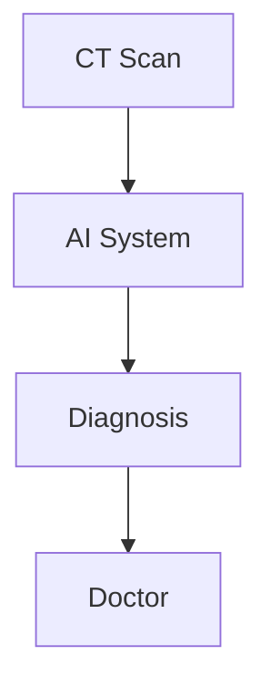

此外，AI 2.0技术还可以用于疾病预测。通过分析大量的医疗数据，如患者病史、基因信息、生活方式等，AI系统可以预测患者未来患病的风险，从而为医生提供重要的参考信息。

```python
# 疾病预测伪代码
risk_score = model.predict(patient_data)
if risk_score > threshold:
    alert_doctor(patient_id)
```

##### 4.1.2 治疗与康复

AI 2.0技术不仅在疾病诊断中发挥作用，还在治疗和康复中具有重要意义。通过个性化医疗方案的设计，AI系统可以根据患者的具体情况进行精准治疗。例如，在癌症治疗中，AI系统可以根据患者的基因信息、肿瘤类型等，推荐最优的治疗方案。

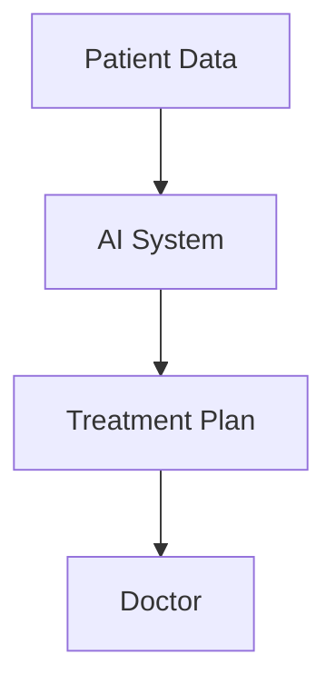

在康复阶段，AI 2.0技术可以辅助医生制定个性化的康复计划，通过实时监控患者的健康状况，调整康复方案，从而提高康复效果。

```python
# 康复计划伪代码
rehabilitation_plan = model.recommend_plan(patient_data)
while patient_not_recovered:
    update_rehabilitation_plan(rehabilitation_plan, patient_data)
```

##### 4.1.3 医疗服务的优化

AI 2.0技术还可以用于优化医疗服务流程，提高医疗效率。通过自然语言处理和知识图谱技术，AI系统可以自动处理医疗文档，提取关键信息，从而提高医生的诊断效率。

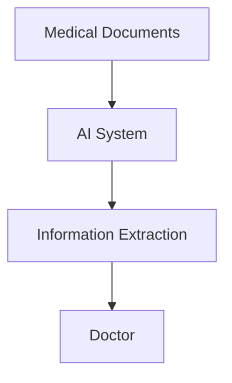

此外，AI 2.0技术可以用于优化医疗资源的分配，通过预测患者流量，为医院提供更好的排班和资源调配策略，从而提高医疗服务的效率和质量。

```python
# 资源优化伪代码
schedule = model.optimize_schedule(hospital_data)
hospital.follow_schedule(schedule)
```

#### 4.2 AI 2.0 在金融领域的应用

AI 2.0技术在金融领域的应用同样具有重要意义，从风险评估到量化交易，再到智能投顾，AI 2.0正在引领金融行业的变革。

##### 4.2.1 风险评估与控制

在金融领域，风险评估和控制是至关重要的。AI 2.0技术可以通过分析大量的金融数据，包括市场趋势、交易行为、公司财务状况等，预测市场的波动和风险，从而帮助金融机构制定更加精准的风险管理策略。

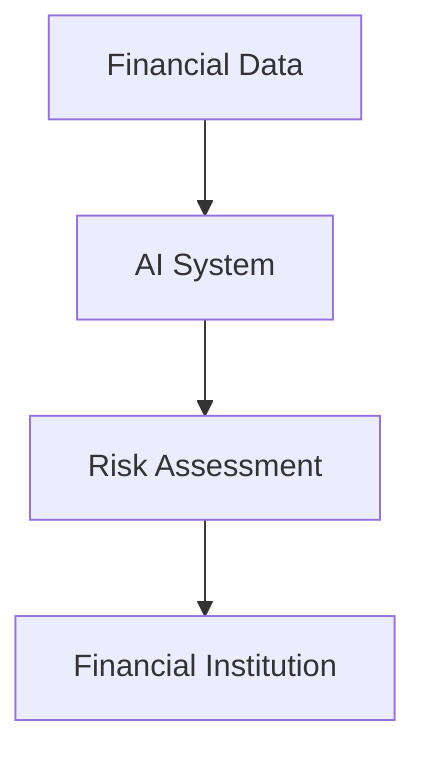

AI 2.0技术还可以用于信用评分，通过对个人的信用历史、行为习惯等进行分析，预测个人的信用风险，从而为金融机构提供信用评估依据。

```python
# 信用评分伪代码
credit_score = model.evaluate_credit_history(credit_history)
if credit_score > threshold:
    approve_loan(loan_application)
```

##### 4.2.2 量化交易

量化交易是金融领域的重要研究方向，它通过建立数学模型和算法，实现自动化交易。AI 2.0技术在这方面具有显著的优势，通过深度学习和强化学习，AI系统可以自动分析市场数据，制定交易策略，实现自动化交易。

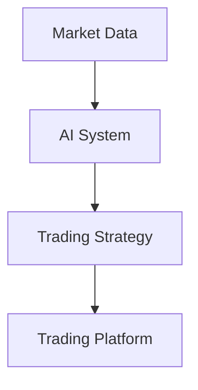

AI 2.0技术在量化交易中的应用，不仅提高了交易的效率和精度，还降低了交易的成本和风险。

##### 4.2.3 智能投顾

智能投顾是金融领域的一个新兴服务，它通过AI技术，为投资者提供个性化的投资建议。AI 2.0技术可以通过分析投资者的风险偏好、财务状况、投资目标等，制定个性化的投资组合，从而实现更好的投资回报。

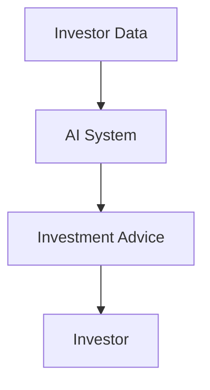

智能投顾不仅提高了投资者的投资效率，还降低了投资的风险，成为金融行业的一个重要趋势。

#### 4.3 AI 2.0 在工业制造领域的应用

AI 2.0技术在工业制造领域的应用同样具有重要意义，从生产优化到质量控制，再到设备维护，AI 2.0正在推动工业制造的智能化转型。

##### 4.3.1 生产优化

在工业制造中，生产优化是提高生产效率和降低成本的关键。AI 2.0技术可以通过分析生产数据，包括设备状态、生产流程、原材料等，优化生产计划，提高生产效率。

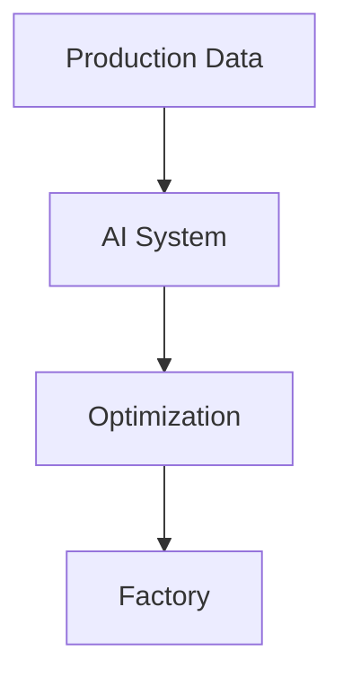

AI 2.0技术还可以用于生产过程控制，通过实时监测生产数据，调整生产参数，实现自动化控制，提高生产稳定性。

```python
# 生产优化伪代码
production_plan = model.optimize_production(production_data)
factory.follow_plan(production_plan)
```

##### 4.3.2 质量控制

质量控制是确保产品质量的重要环节。AI 2.0技术可以通过分析生产数据和质量数据，识别生产过程中的质量问题，从而实现实时质量控制。

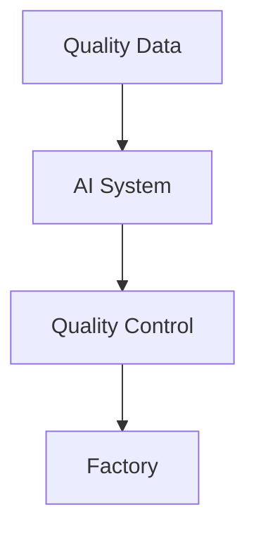

AI 2.0技术还可以用于产品质量预测，通过分析历史数据，预测产品质量的分布和趋势，从而为生产决策提供依据。

```python
# 质量控制伪代码
quality_prediction = model.predict_quality(production_data)
if quality_prediction < threshold:
    alert_quality_issue()
```

##### 4.3.3 设备维护

设备维护是保障生产顺利进行的重要措施。AI 2.0技术可以通过监测设备状态，预测设备故障，实现预防性维护，降低设备故障率和停机时间。

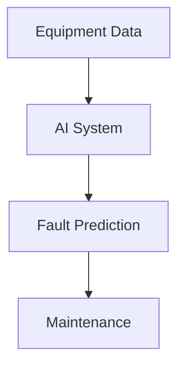

AI 2.0技术还可以用于设备优化，通过分析设备运行数据，优化设备参数，提高设备性能和效率。

```python
# 设备维护伪代码
maintenance_plan = model.optimize_maintenance(equipment_data)
factory.follow_plan(maintenance_plan)
```

### 第5章: AI 2.0 时代的商业机会

#### 5.1 AI 2.0 时代的商业变革

AI 2.0技术的快速发展，为商业领域带来了前所未有的变革机会。首先，AI 2.0技术将大幅提升企业的运营效率。通过自动化和智能化，企业可以在生产、物流、销售等各个环节实现高效运作，降低成本，提高利润。

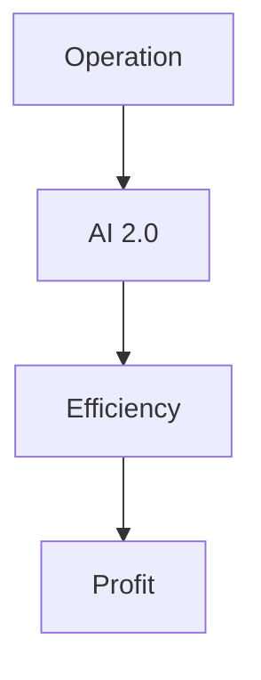

其次，AI 2.0技术将改变企业的商业模式。传统商业模式依赖于人力和资源，而AI 2.0技术可以实现数据驱动和智能决策，使企业能够更加灵活地应对市场变化，开拓新的商业机会。

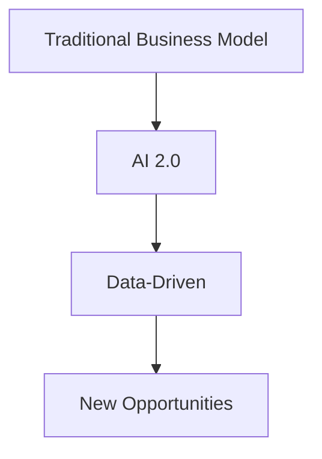

#### 5.2 AI 2.0 时代的创业机会

AI 2.0时代的创业机会丰富多彩。以下是一些热门的创业领域：

1. **人工智能平台开发**：提供通用或垂直领域的AI解决方案，帮助企业实现智能化转型。
2. **AI + 机器人**：开发智能机器人，应用于工业制造、医疗护理、家庭服务等场景。
3. **AI + 游戏**：结合深度学习和强化学习，开发智能游戏系统，提升用户体验。
4. **AI + 健康医疗**：利用AI技术进行疾病诊断、个性化治疗等，改善医疗服务质量。
5. **AI + 金融**：开发智能投资顾问、量化交易系统等，提高金融服务的效率和安全性。

#### 5.3 AI 2.0 时代的创业成功的要素

创业成功的要素包括：

1. **技术创新**：拥有独特的技术优势，能够解决用户痛点。
2. **团队协作**：建立高效的团队，实现技术创新和市场拓展的有机结合。
3. **市场定位**：准确把握市场需求，提供符合用户期望的产品或服务。
4. **资本运作**：合理运用资本，实现快速成长和市场份额的扩大。

在下一章中，我们将探讨AI 2.0时代的社会影响，包括对劳动力市场、伦理道德等方面的影响。

### 第6章: AI 2.0 时代的社会影响

#### 6.1 AI 2.0 对劳动力市场的影响

AI 2.0技术的快速发展，将对劳动力市场产生深远影响。一方面，AI 2.0技术将提高生产效率和降低成本，从而创造更多的就业机会。另一方面，AI 2.0技术也将改变就业结构，一些传统职业可能会被取代，而新的职业岗位将不断涌现。

##### 6.1.1 职业岗位的变革

AI 2.0技术的应用，将引发职业岗位的变革。一些重复性、低技能的岗位可能会被自动化取代，如生产线工人、客服代表等。而一些需要高技能和创造力的岗位，如数据科学家、AI工程师、AI产品经理等，将迎来更多的发展机会。

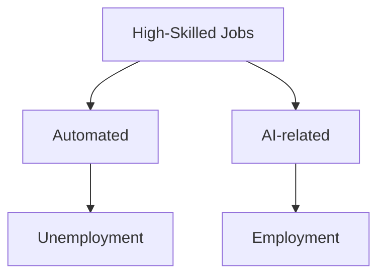

##### 6.1.2 劳动力需求的调整

随着AI 2.0技术的发展，劳动力市场的需求也将发生调整。企业将更加重视员工的创新能力、跨领域技能和适应性。同时，教育和培训也将变得更加重要，以适应不断变化的劳动力市场需求。

##### 6.1.3 教育体系的变革

AI 2.0时代的教育体系也将面临变革。教育内容将更加注重培养学生的创造性思维、批判性思维和跨领域知识。同时，在线教育、远程教育等新型教育模式也将得到广泛应用，以适应不同学生的学习需求。

#### 6.2 AI 2.0 对伦理道德的挑战

AI 2.0技术的快速发展，也带来了伦理道德的挑战。以下是一些主要的伦理道德问题：

##### 6.2.1 伦理道德的基本原则

在AI 2.0时代，我们需要遵循以下伦理道德基本原则：

- **公正性**：确保AI系统的决策不会歧视任何群体。
- **透明性**：确保AI系统的决策过程可以被理解和审查。
- **责任性**：明确AI系统的责任归属，确保责任可以被追究。
- **安全性**：确保AI系统不会对人类造成伤害。

##### 6.2.2 AI 2.0 可能引发的伦理问题

AI 2.0技术可能引发的伦理问题包括：

- **隐私侵犯**：AI系统在处理个人数据时，可能会侵犯个人隐私。
- **算法偏见**：AI系统可能会在决策过程中产生偏见，导致不公平的结果。
- **自动化战争**：AI技术在军事领域的应用，可能引发自动化战争的伦理问题。
- **人工智能失控**：如果AI系统失控，可能会对人类造成不可预测的风险。

##### 6.2.3 伦理道德的解决方案

为了应对AI 2.0时代的伦理道德挑战，我们需要采取以下解决方案：

- **制定伦理规范**：制定适用于AI系统的伦理规范，确保AI系统的决策符合伦理标准。
- **加强监管**：加强对AI系统的监管，确保AI系统的透明性和安全性。
- **公众参与**：鼓励公众参与AI系统的设计和应用，提高公众对AI技术的理解和信任。

在下一章中，我们将探讨AI 2.0时代的政策与法律框架，包括政策的发展趋势、法律框架的构建等方面。

### 第7章: AI 2.0 时代的政策与法律框架

#### 7.1 AI 2.0 政策的发展趋势

随着AI 2.0技术的快速发展，各国政府纷纷出台相关政策，以推动AI技术的发展和应用，并确保其安全性、透明性和公平性。以下是一些主要的政策发展趋势：

##### 7.1.1 政策的制定与执行

- **推动技术创新**：政府通过资金支持、税收优惠等政策，鼓励企业研发和创新，推动AI技术的发展。
- **加强人才培养**：政府通过教育投入、人才培养计划等，提高劳动力市场的AI技能水平，为AI技术的发展提供人才支持。
- **规范市场行为**：政府通过立法和监管，规范AI技术的研发和应用，确保其安全性和透明性。

##### 7.1.2 政策的影响与挑战

- **技术创新的加速**：政府的支持政策将加速AI技术的发展和创新，推动产业升级和经济增长。
- **数据隐私与安全**：AI技术的发展带来了大量个人数据的处理和使用，政府需要制定相关法律法规，保护个人隐私和数据安全。
- **公平与包容**：政府需要确保AI技术的发展不会加剧社会不平等，而是促进公平与包容。

##### 7.1.3 政策的完善与调整

- **持续评估**：政府需要持续评估AI技术的应用效果和潜在风险，根据实际情况调整政策。
- **国际合作**：各国政府需要加强国际合作，共同制定全球性的AI政策和标准，推动AI技术的健康发展。

#### 7.2 AI 2.0 法律框架的构建

为了应对AI 2.0技术的快速发展，各国正在积极探索和完善AI法律框架。以下是一些主要的法律框架构建方向：

##### 7.2.1 法律的基本原则

- **透明性**：确保AI系统的决策过程可以被理解和审查。
- **责任性**：明确AI系统的责任归属，确保责任可以被追究。
- **公平性**：确保AI系统的决策不会歧视任何群体。
- **安全性**：确保AI系统的安全性和可靠性。

##### 7.2.2 AI 2.0 可能引发的法律问题

- **责任归属**：在AI系统发生事故或造成损失时，如何确定责任归属？
- **隐私保护**：AI系统在处理个人数据时，如何保护个人隐私？
- **算法偏见**：AI系统在决策过程中如何避免产生偏见，确保公平性？
- **自动化决策**：如何确保自动化决策系统的透明性和可解释性？

##### 7.2.3 法律框架的完善与实施

- **立法**：各国需要制定和完善AI相关法律法规，明确AI系统的责任归属、隐私保护等关键问题。
- **监管**：政府需要加强对AI系统的监管，确保其透明性、安全性和公平性。
- **国际合作**：各国需要加强国际合作，共同制定全球性的AI法律框架和标准。

在下一章中，我们将探讨AI 2.0时代的未来展望，包括技术发展趋势、社会形态等方面。

### 第8章: AI 2.0 时代的未来展望

#### 8.1 AI 2.0 的技术发展趋势

随着AI 2.0技术的不断发展，未来几年将出现以下技术发展趋势：

##### 8.1.1 技术创新的驱动因素

- **大数据和云计算**：大数据和云计算为AI技术的发展提供了丰富的数据资源和强大的计算能力，推动了AI技术的进步。
- **量子计算**：量子计算具有超越经典计算机的潜力，未来将实现AI技术的重大突破。
- **边缘计算**：边缘计算将计算能力从云端转移到网络边缘，实现实时处理和分析，满足对实时性和低延迟的高要求。

##### 8.1.2 技术突破的可能性

- **通用人工智能（AGI）**：通用人工智能是指具有与人类相似智能水平的人工智能系统。虽然目前还处于研究阶段，但随着技术的不断进步，实现通用人工智能的可能性正在逐步增加。
- **自我进化**：自我进化是指AI系统能够在不需要人类干预的情况下，通过学习、优化和自我调整，不断提高自身性能。未来，自我进化的AI系统将成为AI技术的重要方向。

##### 8.1.3 技术发展的潜在影响

- **经济和社会变革**：AI技术的发展将深刻改变经济和社会结构，推动产业升级和经济增长，同时也带来新的就业机会和挑战。
- **人类生活质量的提升**：AI技术将在医疗、教育、交通、家居等领域得到广泛应用，提高人类生活质量，带来更加便捷和智能的生活方式。

#### 8.2 AI 2.0 时代的未来社会形态

随着AI 2.0技术的不断发展，未来社会将呈现以下形态：

##### 8.2.1 社会结构的变化

- **智能化社会**：AI 2.0技术的广泛应用将使社会逐渐实现智能化，智能设备和系统将在各个领域发挥作用，提高生产效率和生活质量。
- **去中心化**：随着区块链技术的发展，未来的社会将更加去中心化，信息传播和资源共享将更加自由和高效。

##### 8.2.2 生活方式的变革

- **个性化服务**：AI 2.0技术将使个性化服务成为主流，人们可以根据自己的需求和偏好，享受定制化的产品和服务。
- **远程工作和学习**：随着AI 2.0技术的发展，远程工作和学习将变得更加普及，人们可以更加灵活地安排工作和学习时间。

##### 8.2.3 社会治理的挑战与机遇

- **社会治理的变革**：AI 2.0技术将给社会治理带来新的挑战和机遇。政府需要制定相应的政策和法律，确保AI技术的安全、透明和公平。
- **公共安全**：AI 2.0技术将在公共安全领域发挥重要作用，如智能安防、智能交通等，但同时也需要防范AI技术被滥用和恶意攻击。

在下一章中，我们将总结AI 2.0时代的未来趋势，并对文章进行总结和展望。

### 总结与展望

AI 2.0时代的未来趋势令人激动，它不仅将推动技术创新，还将在经济、社会和文化等各个方面带来深远影响。通过对AI 2.0基础与前沿技术的深入分析，我们看到了深度学习、强化学习、大规模预训练模型等技术的巨大潜力。这些技术不仅提高了AI系统的学习能力和决策能力，还为各个领域的应用提供了强大的支持。

在医疗健康领域，AI 2.0技术将极大地提高诊断和治疗的效率，改善患者的治疗体验。在金融领域，AI 2.0技术将提升风险管理能力和投资回报率，为金融行业的创新提供新的动力。在工业制造领域，AI 2.0技术将实现生产优化、质量控制和设备维护的智能化，提高生产效率和质量。

然而，AI 2.0时代也带来了新的挑战。劳动力市场的变革将引发职业岗位的调整和劳动力需求的调整。伦理道德的挑战要求我们在技术创新的同时，关注社会公平和道德责任。政策与法律框架的构建也至关重要，它将为AI技术的发展提供保障，确保其安全、透明和公平。

展望未来，AI 2.0技术将继续推动社会进步和经济发展。随着技术的不断突破，我们有望实现通用人工智能，进一步拓展AI技术的应用领域。智能化社会和去中心化将成为未来社会的主要特征，人们的生活方式将发生深刻变革。同时，社会治理也将面临新的挑战和机遇。

总之，AI 2.0时代充满了机遇和挑战。只有通过技术创新、政策保障和社会协同，我们才能充分利用AI技术的潜力，实现可持续发展和社会和谐。让我们共同期待AI 2.0时代的到来，共创美好未来。

### 附录 A: AI 2.0 相关资源与工具

#### A.1 主流AI框架与工具

以下是目前主流的AI框架与工具，它们在AI开发中发挥着重要作用：

- **TensorFlow**：由Google开发的开源深度学习框架，广泛应用于各种AI项目。
- **PyTorch**：由Facebook开发的开源深度学习框架，以其灵活性和易用性受到开发者喜爱。
- **Keras**：一个基于TensorFlow和Theano的高层神经网络API，用于快速构建和迭代深度学习模型。

#### A.2 AI研究论文与报告

以下是一些重要的AI研究论文与报告，它们为我们理解AI技术的发展提供了宝贵资源：

- **“Deep Learning” by Ian Goodfellow, Yoshua Bengio, and Aaron Courville**：深度学习的经典教材，全面介绍了深度学习的理论基础和应用。
- **“Reinforcement Learning: An Introduction” by Richard S. Sutton and Andrew G. Barto**：强化学习的权威教材，涵盖了强化学习的基本概念和算法。
- **“Generative Adversarial Networks” by Ian Goodfellow et al.**：生成对抗网络的创始性论文，推动了GAN技术的发展。

#### A.3 开源社区与论坛

以下是一些重要的开源社区与论坛，它们为AI开发者提供了交流和学习的机会：

- **AI Stack Overflow**：AI开发者的问题和解答社区，涵盖各种AI技术的应用和问题。
- **GitHub**：许多AI项目开源在GitHub上，开发者可以获取代码、贡献代码和参与讨论。
- **Reddit**：Reddit上的AI相关讨论区，包括深度学习、强化学习等话题。

通过利用这些资源和工具，开发者可以更好地掌握AI技术，推动AI技术的发展和应用。同时，开源社区和论坛也为开发者提供了交流和学习的机会，促进了知识的共享和技术的进步。作者：AI天才研究院/AI Genius Institute & 禅与计算机程序设计艺术 /Zen And The Art of Computer Programming。

