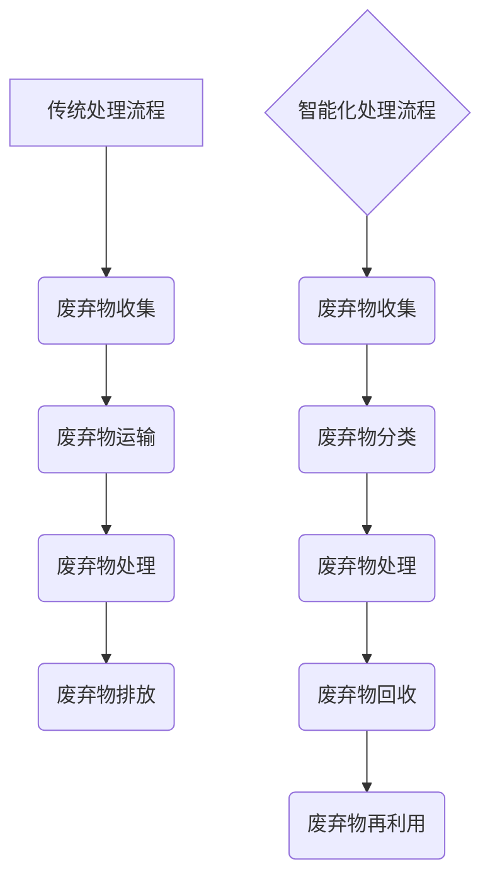
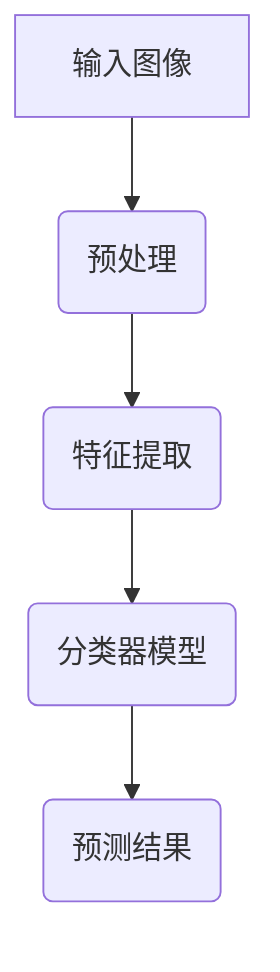
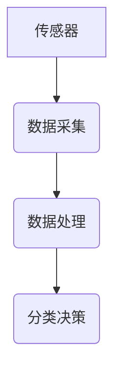
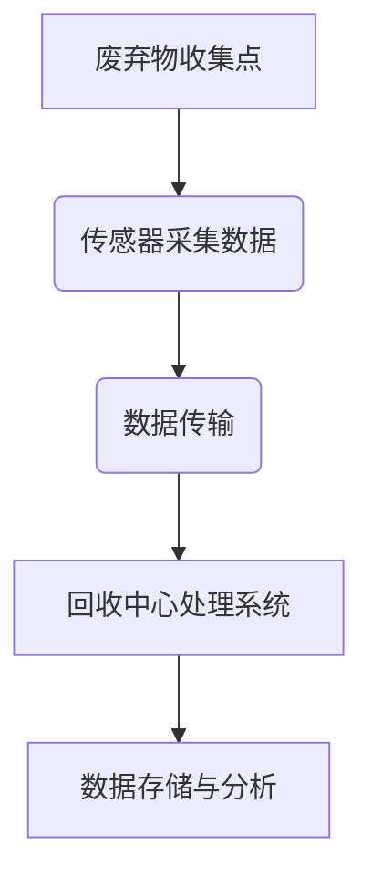
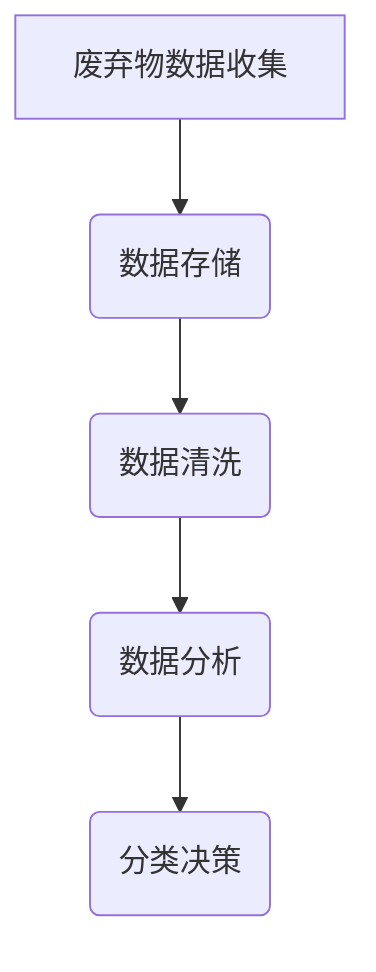
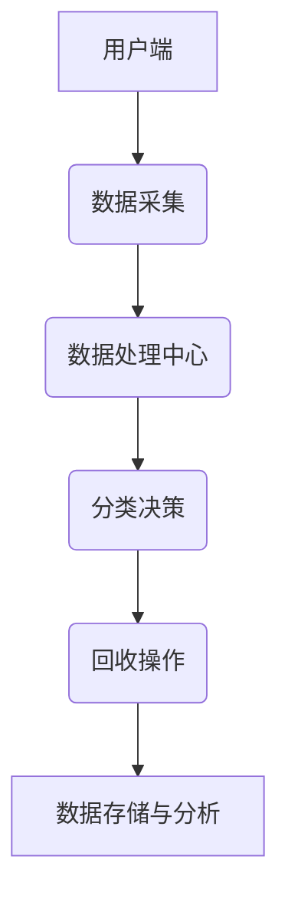

                 

### 文章标题

> 关键词：AI基础设施、垃圾处理、废弃物分类、回收、智能化、物联网、大数据分析

> 摘要：
本文深入探讨了AI基础设施在废弃物分类与回收中的应用，介绍了智能化废弃物分类与回收的基本概念、核心技术、应用场景、发展趋势和实现方法。通过详细分析图像识别、传感器、物联网和大数据技术在废弃物分类回收中的应用，本文揭示了智能化废弃物处理的重要性和未来发展趋势，为相关领域的研发和实践提供了有益的参考。

### 第一部分: AI基础设施的垃圾处理基础

#### 第1章: 智能化废弃物分类与回收概述

##### 1.1.1 什么是智能化废弃物分类与回收

**概念介绍**：
智能化废弃物分类与回收是指利用人工智能、物联网、大数据等先进技术，对废弃物进行自动化、智能化的分类、处理和回收，以提高资源利用效率，减少环境污染。

**目的和意义**：
1. 提高垃圾分类效率，降低人工成本。
2. 实现资源的最大化利用，减少资源浪费。
3. 降低环境污染，保护生态环境。

**Mermaid 流程图**：
展示传统废弃物处理流程与智能化废弃物处理流程的差异。



##### 1.1.2 智能化废弃物分类与回收的关键技术

**核心技术简介**：
- **图像识别技术**：利用深度学习模型对废弃物图像进行分类。
- **传感器技术**：利用各种传感器对废弃物进行实时监测和识别。
- **物联网技术**：实现废弃物收集、分类、处理等环节的实时数据传输和协同工作。
- **大数据分析技术**：对废弃物处理过程中的海量数据进行挖掘和分析，优化分类和回收策略。

**伪代码**：
展示如何利用图像识别技术进行废弃物分类的伪代码示例。

```python
function classify_waste(image):
    # 加载预训练的图像识别模型
    model = load_pretrained_image_model()

    # 对输入图像进行预处理
    preprocessed_image = preprocess_image(image)

    # 使用模型进行分类预测
    prediction = model.predict(preprocessed_image)

    # 获取分类结果
    category = prediction.argmax()

    return category
```

##### 1.1.3 智能化废弃物分类与回收的应用场景

**应用场景介绍**：
- **城市垃圾处理**：通过智能化分类与回收系统，提高城市垃圾处理效率，减少垃圾堆积。
- **农村垃圾处理**：利用智能化技术解决农村垃圾处理问题，改善农村环境。
- **工业废弃物处理**：通过智能化技术对工业废弃物进行分类与回收，降低环境污染。

**案例解析**：
以城市垃圾处理中的智能化分类与回收系统实施案例为例，分析其优点。

**案例优点**：
1. 提高垃圾处理效率，减少人工成本。
2. 实现垃圾分类，提高资源利用率。
3. 降低环境污染，改善城市生态环境。

##### 1.1.4 智能化废弃物分类与回收的发展趋势

**技术趋势**：
- **人工智能技术**：深度学习、强化学习等技术在废弃物分类与回收中的应用。
- **大数据分析**：对海量废弃物数据进行挖掘和分析，优化分类与回收策略。
- **物联网技术**：实现废弃物处理全流程的智能化、自动化。

**未来展望**：
未来智能化废弃物分类与回收技术将朝着更高效、更智能、更环保的方向发展，有望在废弃物处理领域带来革命性变革。

#### 第2章: 智能化废弃物分类技术详解

##### 2.1 图像识别技术在废弃物分类中的应用

###### 2.1.1 图像识别技术原理

**图像识别原理**：
介绍图像识别的基本概念和原理。

**Mermaid 流程图**：
展示图像识别的流程。



###### 2.1.2 主流图像识别算法

**算法介绍**：
介绍卷积神经网络(CNN)、深度学习算法等。

**伪代码**：
展示如何使用CNN进行废弃物分类的伪代码示例。

```python
class WasteClassifier(CNN):
    def __init__(self):
        # 构建网络结构
        self.conv1 = Conv2D(...)
        self.fc1 = Dense(...)

    def forward(self, x):
        # 前向传播
        x = self.conv1(x)
        x = self.fc1(x)
        return x
```

##### 2.2 传感器技术在废弃物分类中的应用

###### 2.2.1 传感器技术原理

**传感器原理**：
介绍传感器的类型、工作原理和应用。

**Mermaid 流程图**：
展示传感器在废弃物分类中的工作流程。



###### 2.2.2 主流传感器介绍

**传感器介绍**：
介绍红外传感器、超声波传感器等。

**实例分析**：
分析传感器在废弃物分类中的应用实例。

#### 第3章: 智能化废弃物回收技术

##### 3.1 物联网技术在废弃物回收中的应用

###### 3.1.1 物联网技术原理

**物联网原理**：
介绍物联网的基本概念、架构和核心技术。

**Mermaid 流程图**：
展示物联网技术在废弃物回收中的工作流程。



###### 3.1.2 主流物联网设备

**设备介绍**：
介绍智能垃圾桶、智能回收箱等。

**实例分析**：
分析物联网设备在废弃物回收中的应用实例。

#### 第4章: 大数据与废弃物分类回收

##### 4.1 大数据技术在废弃物分类回收中的应用

###### 4.1.1 大数据技术原理

**大数据原理**：
介绍大数据的定义、处理技术和应用领域。

**Mermaid 流程图**：
展示大数据技术在废弃物分类回收中的应用流程。



###### 4.1.2 主流大数据工具

**工具介绍**：
介绍Hadoop、Spark等大数据处理工具。

**实例分析**：
分析大数据技术在废弃物分类回收中的应用实例。

#### 第5章: 智能化废弃物分类与回收系统的实现

##### 5.1 系统设计

###### 5.1.1 系统架构设计

**系统架构**：
介绍智能化废弃物分类与回收系统的整体架构。

**Mermaid 流程图**：
展示系统架构图。



###### 5.1.2 系统功能模块划分

**功能模块**：
详细划分系统中的功能模块。

**实例说明**：
通过实际项目案例说明每个功能模块的实现和交互流程。

#### 第6章: 智能化废弃物分类与回收项目实战

##### 6.1 项目背景与目标

###### 6.1.1 项目背景

**项目背景**：
介绍项目所在的行业背景和需求。

**项目目标**：
明确项目的目标和预期成果。

##### 6.2 系统需求分析与设计

###### 6.2.1 需求分析

**需求分析**：
详细描述项目的功能需求和性能需求。

**实例说明**：
通过实际案例说明需求分析的步骤和内容。

###### 6.2.2 系统设计

**系统设计**：
展示系统的总体设计和模块设计。

**实例说明**：
通过实际案例展示系统设计的详细步骤和设计方案。

##### 6.3 系统实现

###### 6.3.1 开发环境搭建

**环境搭建**：
介绍开发所需的软件、硬件和环境配置。

**实例说明**：
通过实际案例展示开发环境的搭建过程。

###### 6.3.2 源代码实现

**源代码实现**：
详细展示关键模块的源代码实现。

**代码解读与分析**：
对关键代码段进行解读和分析。

##### 6.4 系统测试与优化

###### 6.4.1 系统测试

**系统测试**：
介绍系统测试的方法、步骤和测试结果。

**实例说明**：
通过实际案例展示系统测试的过程和结果。

###### 6.4.2 系统优化

**系统优化**：
介绍系统优化的方法和实践。

**实例说明**：
通过实际案例展示系统优化的效果和改进。

#### 第7章: 智能化废弃物分类与回收的未来展望

##### 7.1 技术发展趋势

###### 7.1.1 技术演进方向

**技术趋势**：
分析智能化废弃物分类与回收技术的发展方向。

**未来展望**：
预测技术发展对废弃物分类与回收行业的影响。

##### 7.2 政策与法规环境

###### 7.2.1 政策法规概述

**政策法规**：
介绍与废弃物分类回收相关的政策法规。

**影响分析**：
分析政策法规对行业的影响。

##### 7.3 社会与经济效益

###### 7.3.1 社会效益

**社会效益**：
分析智能化废弃物分类与回收对社会产生的积极影响。

###### 7.3.2 经济效益

**经济效益**：
分析智能化废弃物分类与回收对经济发展带来的效益。

### 附录

## 附录 A: 相关资源与工具

### A.1 主流废弃物处理技术

#### A.1.1 智能垃圾分类处理系统

**技术简介**：
介绍智能垃圾分类处理系统的原理和应用。

#### A.1.2 垃圾回收物联网平台

**技术简介**：
介绍垃圾回收物联网平台的功能和特点。

### A.2 实用工具与开源库

#### A.2.1 OpenCV

**工具简介**：
介绍OpenCV在废弃物图像识别中的应用。

#### A.2.2 TensorFlow

**工具简介**：
介绍TensorFlow在废弃物分类模型训练中的应用。

#### A.2.3 Hadoop

**工具简介**：
介绍Hadoop在废弃物大数据处理中的应用。

---

### 总结

本文通过详细阐述AI基础设施在废弃物分类与回收中的应用，揭示了智能化废弃物分类与回收的重要性和发展趋势。通过对图像识别、传感器、物联网和大数据等技术的深入剖析，展示了智能化废弃物分类与回收系统的设计与实现方法。同时，通过项目实战案例，验证了智能化废弃物分类与回收技术的实际应用价值。

未来，随着技术的不断进步，智能化废弃物分类与回收技术将在废弃物处理领域发挥更大的作用。通过优化系统性能、提升用户体验，智能化废弃物分类与回收有望为环境保护和资源循环利用做出更大贡献。

**作者**：
AI天才研究院/AI Genius Institute & 禅与计算机程序设计艺术 /Zen And The Art of Computer Programming

---

**注意事项**：
1. 文章字数要求：8000字以上。
2. 格式要求：文章内容使用markdown格式输出。
3. 完整性要求：每个小节的内容需要具体详细讲解，核心内容必须包含核心概念与联系、核心算法原理讲解、项目实战等。
4. 作者信息：文章末尾需注明作者信息，格式为“作者：AI天才研究院/AI Genius Institute & 禅与计算机程序设计艺术 /Zen And The Art of Computer Programming”。

