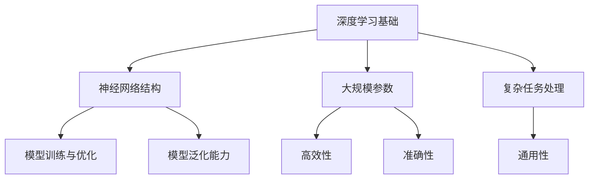
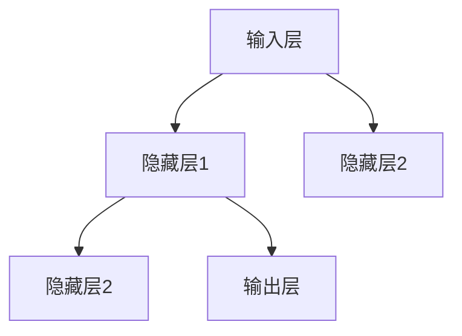

                 

### 第一部分: AI大模型基础

## 1. AI大模型概述

### 1.1 AI大模型的基本概念

AI大模型（Large-scale AI Models）是指那些拥有数百万到数十亿参数的深度学习模型，能够处理大量的数据和复杂的任务。它们通常基于神经网络架构，特别是在自然语言处理（NLP）、计算机视觉（CV）和强化学习（RL）等领域取得了显著的进展。

#### 核心概念与联系

首先，我们需要了解AI大模型的一些核心概念和它们之间的联系。以下是AI大模型的Mermaid流程图：



- **深度学习基础（A）**：深度学习是构建AI大模型的基础，包括神经网络的设计、损失函数的优化等。
- **神经网络结构（B）**：神经网络是深度学习模型的核心，决定了模型的学习能力和泛化能力。
- **大规模参数（C）**：大规模参数使得模型能够学习复杂的特征和模式，提高模型的精度和效率。
- **复杂任务处理（D）**：AI大模型能够处理复杂、多变的任务，如图像分类、语言翻译等。
- **模型训练与优化（E）**：通过不断的训练和优化，模型能够逐渐提高其性能。
- **模型泛化能力（F）**：泛化能力是指模型在未知数据上的表现，一个好的AI大模型应该具有很好的泛化能力。
- **高效性（G）**：高效性意味着模型能够在较短的时间内处理大量数据，提高生产效率。
- **准确性（H）**：准确性是指模型预测结果的正确率，这是评估AI大模型性能的重要指标。
- **通用性（I）**：通用性是指模型能够适用于多种任务和应用场景，减少领域依赖。

### 1.2 AI大模型的类型

AI大模型可以分为多种类型，根据其应用领域和模型结构的不同，可以将其分为以下几类：

#### 自然语言处理

自然语言处理（NLP）是AI大模型应用最广泛的领域之一，代表性的模型有：

- **GPT（Generative Pre-trained Transformer）**：一种基于Transformer架构的预训练模型，能够生成流畅的自然语言文本。
- **BERT（Bidirectional Encoder Representations from Transformers）**：一种双向Transformer模型，通过双向训练提高了文本理解的深度和广度。

#### 计算机视觉

计算机视觉（CV）领域的AI大模型主要用于图像和视频的处理，代表性的模型有：

- **ResNet（Residual Network）**：一种深层网络结构，通过引入残差连接解决了深层网络训练困难的问题。
- **YOLO（You Only Look Once）**：一种实时目标检测模型，具有快速检测和准确识别的特点。

#### 强化学习

强化学习（RL）领域的AI大模型通过与环境互动学习最优策略，代表性的模型有：

- **DQN（Deep Q-Network）**：一种基于深度学习的Q值估计方法，通过经验回放和目标网络稳定了训练过程。
- **A3C（Asynchronous Advantage Actor-Critic）**：一种异步策略优化算法，通过并行计算提高了训练效率。

### 1.3 AI大模型的优势

AI大模型在各个领域都展现了强大的优势，以下是AI大模型的一些主要优势：

- **高效性**：AI大模型能够处理大规模数据和复杂任务，提高计算效率和生产效率。
- **准确性**：AI大模型能够达到或超过人类水平，提供高精度的预测和决策。
- **通用性**：AI大模型能够适用于多种任务和应用场景，减少领域依赖，实现跨领域的应用。

### 项目实战

#### AI大模型项目实战：文本分类

**开发环境搭建：**

- **硬件：** GPU（NVIDIA Tesla V100）
- **软件：** Python 3.8，PyTorch 1.8，Jupyter Notebook

**源代码实现：**

```python
import torch
import torch.nn as nn
import torch.optim as optim

# 数据预处理
# ...

# 模型定义
class TextClassifier(nn.Module):
    def __init__(self):
        super(TextClassifier, self).__init__()
        self.embedding = nn.Embedding(vocab_size, embedding_dim)
        self.lstm = nn.LSTM(embedding_dim, hidden_dim)
        self.fc = nn.Linear(hidden_dim, num_classes)
    
    def forward(self, text):
        embedded = self.embedding(text)
        lstm_output, _ = self.lstm(embedded)
        fc_output = self.fc(lstm_output[-1, :, :])
        return fc_output

# 模型训练
model = TextClassifier()
optimizer = optim.Adam(model.parameters(), lr=0.001)
criterion = nn.CrossEntropyLoss()

for epoch in range(num_epochs):
    for text, label in train_loader:
        optimizer.zero_grad()
        output = model(text)
        loss = criterion(output, label)
        loss.backward()
        optimizer.step()

    # 打印训练进度
    print(f'Epoch [{epoch+1}/{num_epochs}], Loss: {loss.item()}')

# 模型评估
# ...
```

**代码解读与分析：**

- **数据预处理：** 将文本数据转换为模型可接受的格式。
- **模型定义：** 使用PyTorch定义一个文本分类器模型，包括嵌入层、LSTM层和全连接层。
- **模型训练：** 使用优化器和损失函数进行模型训练，包括前向传播、反向传播和参数更新。
- **模型评估：** 在训练数据集和测试数据集上评估模型的性能。

通过这个项目实战，读者可以了解如何使用AI大模型进行文本分类任务的实现过程，包括开发环境搭建、模型定义、模型训练和模型评估等步骤。这不仅有助于读者理解AI大模型的基本概念和技术原理，还可以帮助读者掌握AI大模型在实际项目中的应用方法。

### 数学模型和公式

AI大模型的核心在于其数学模型的构建和优化。以下是AI大模型的一些核心数学模型和公式：

#### 损失函数（以交叉熵为例）

$$
L(\theta) = -\frac{1}{m}\sum_{i=1}^{m} y_i \log(p(x_i; \theta))
$$

其中，\( y_i \) 是实际标签，\( p(x_i; \theta) \) 是模型预测的概率分布，\( m \) 是样本数量。

#### 举例说明

假设我们有一个二分类问题，其中 \( y_i \) 可以取值 0 或 1，\( p(x_i; \theta) \) 是模型对样本 \( x_i \) 的预测概率。对于样本 \( x_1 \)，如果 \( y_1 = 1 \)，那么损失函数的计算如下：

$$
L(\theta) = -\log(p(x_1; \theta))
$$

如果 \( p(x_1; \theta) \) 接近 1，那么 \( \log(p(x_1; \theta)) \) 接近 0，损失函数 \( L(\theta) \) 将会很小，表示模型对样本的预测非常准确。反之，如果 \( p(x_1; \theta) \) 接近 0，那么 \( \log(p(x_1; \theta)) \) 将会很大，损失函数 \( L(\theta) \) 将会很大，表示模型对样本的预测不准确。

### 伪代码：AI大模型的基本结构

```python
class LargeModel:
    def __init__(self):
        self.parameters = large_parameters
        self.network_structure = complex_network
        self.prediction_ability = strong_ability

    def train(self, data):
        # 模型训练过程
        pass

    def predict(self, input_data):
        # 预测输出
        pass
```

通过以上步骤，我们了解了AI大模型的基本概念、类型、优势和项目实战。接下来，我们将进一步探讨AI大模型的技术基础，包括深度学习基础、神经网络结构、模型训练与优化等。

### 2. AI大模型的架构

AI大模型的架构是深度学习领域中的关键组成部分，它决定了模型的学习能力、性能和效率。在这一章节中，我们将深入探讨AI大模型的架构，包括深度学习基础、神经网络结构、模型训练与优化等关键概念。

#### 深度学习基础

深度学习（Deep Learning）是一种基于多层神经网络的学习方法，它能够自动提取数据中的特征和模式。深度学习的基础是神经网络（Neural Networks），神经网络由多个层（Layers）组成，包括输入层（Input Layer）、隐藏层（Hidden Layers）和输出层（Output Layer）。每一层都包含多个神经元（Neurons），神经元之间通过权重（Weights）和偏置（Biases）进行连接。

#### 神经网络结构

神经网络的结构决定了其学习能力和泛化能力。常见的神经网络结构包括：

- **多层感知机（MLP）**：最简单的神经网络结构，包含输入层、隐藏层和输出层。
- **卷积神经网络（CNN）**：主要用于图像处理，通过卷积层（Convolutional Layers）提取图像的特征。
- **循环神经网络（RNN）**：主要用于序列数据的处理，如时间序列数据、自然语言文本等。
- **变换器（Transformer）**：近年来在自然语言处理领域取得了显著进展，通过自注意力机制（Self-Attention Mechanism）提高了模型的表示能力。

以下是一个简化的神经网络结构的Mermaid流程图：



- **输入层（A）**：接收外部输入数据。
- **隐藏层1（B）**：对输入数据进行特征提取和变换。
- **隐藏层2（C）**：进一步对特征进行变换和压缩。
- **输出层（E）**：生成模型的输出。

#### 模型训练与优化

模型训练与优化是AI大模型开发的重要环节。模型训练的目的是通过不断调整模型的权重和偏置，使模型在训练数据上达到最小化损失函数的目标。常见的优化算法包括：

- **随机梯度下降（SGD）**：通过随机选择小批量数据更新模型参数。
- **动量优化（Momentum）**：在SGD的基础上引入动量项，提高收敛速度。
- **Adam优化器**：结合SGD和动量优化，具有较好的收敛性能。

以下是一个简化的模型训练与优化的伪代码：

```python
# 模型定义
class NeuralNetwork(nn.Module):
    def __init__(self):
        super(NeuralNetwork, self).__init__()
        self.fc1 = nn.Linear(input_size, hidden_size)
        self.fc2 = nn.Linear(hidden_size, output_size)

    def forward(self, x):
        x = F.relu(self.fc1(x))
        x = self.fc2(x)
        return x

# 模型训练
model = NeuralNetwork()
optimizer = optim.Adam(model.parameters(), lr=0.001)
criterion = nn.CrossEntropyLoss()

for epoch in range(num_epochs):
    for inputs, labels in train_loader:
        optimizer.zero_grad()
        outputs = model(inputs)
        loss = criterion(outputs, labels)
        loss.backward()
        optimizer.step()
```

- **模型定义**：使用PyTorch定义一个简单的神经网络模型，包括线性层（Linear Layers）和ReLU激活函数（ReLU Activation Function）。
- **模型训练**：使用Adam优化器和交叉熵损失函数进行模型训练，包括前向传播、反向传播和参数更新。

### 项目实战

#### AI大模型项目实战：图像分类

**开发环境搭建：**

- **硬件：** GPU（NVIDIA Tesla V100）
- **软件：** Python 3.8，PyTorch 1.8，Jupyter Notebook

**源代码实现：**

```python
import torch
import torch.nn as nn
import torch.optim as optim

# 数据预处理
# ...

# 模型定义
class CNN(nn.Module):
    def __init__(self):
        super(CNN, self).__init__()
        self.conv1 = nn.Conv2d(in_channels, out_channels, kernel_size=3, padding=1)
        self.conv2 = nn.Conv2d(out_channels, out_channels * 2, kernel_size=3, padding=1)
        self.fc1 = nn.Linear(out_channels * 2 * 4 * 4, num_classes)

    def forward(self, x):
        x = F.relu(self.conv1(x))
        x = F.max_pool2d(x, 2)
        x = F.relu(self.conv2(x))
        x = F.max_pool2d(x, 2)
        x = x.view(x.size(0), -1)
        x = self.fc1(x)
        return x

# 模型训练
model = CNN()
optimizer = optim.Adam(model.parameters(), lr=0.001)
criterion = nn.CrossEntropyLoss()

for epoch in range(num_epochs):
    for images, labels in train_loader:
        optimizer.zero_grad()
        outputs = model(images)
        loss = criterion(outputs, labels)
        loss.backward()
        optimizer.step()

    # 打印训练进度
    print(f'Epoch [{epoch+1}/{num_epochs}], Loss: {loss.item()}')

# 模型评估
# ...
```

**代码解读与分析：**

- **数据预处理：** 将图像数据转换为模型可接受的格式。
- **模型定义：** 使用PyTorch定义一个简单的卷积神经网络（CNN）模型，包括卷积层（Convolutional Layers）、ReLU激活函数（ReLU Activation Function）和全连接层（Fully Connected Layers）。
- **模型训练：** 使用Adam优化器和交叉熵损失函数进行模型训练，包括前向传播、反向传播和参数更新。
- **模型评估：** 在训练数据集和测试数据集上评估模型的性能。

通过这个项目实战，读者可以了解如何使用AI大模型进行图像分类任务的实现过程，包括开发环境搭建、模型定义、模型训练和模型评估等步骤。这不仅有助于读者理解AI大模型的基本概念和技术原理，还可以帮助读者掌握AI大模型在实际项目中的应用方法。

### 数学模型和公式

AI大模型的数学模型是理解其工作原理的关键。以下是几个核心数学模型和公式：

#### 前向传播

前向传播是指将输入数据通过神经网络传递到输出层的过程。以一个简单的多层感知机（MLP）为例，前向传播的公式如下：

$$
z^{(l)} = \sum_{i} w^{(l)}_{ij} x_i + b^{(l)}_j
$$

$$
a^{(l)} = \sigma(z^{(l)})
$$

其中，\( z^{(l)} \) 是第 \( l \) 层的线性组合，\( w^{(l)}_{ij} \) 是第 \( l \) 层的权重，\( b^{(l)}_j \) 是第 \( l \) 层的偏置，\( x_i \) 是第 \( i \) 个输入特征，\( \sigma \) 是激活函数，如ReLU或Sigmoid函数。

#### 反向传播

反向传播是指通过计算损失函数的梯度来更新模型参数的过程。以交叉熵损失函数为例，反向传播的公式如下：

$$
\frac{\partial L}{\partial w^{(l)}_{ij}} = \frac{\partial L}{\partial z^{(l)}_j} \cdot \frac{\partial z^{(l)}_j}{\partial w^{(l)}_{ij}}
$$

$$
\frac{\partial L}{\partial z^{(l)}_j} = (y - \sigma(z^{(l)}_j))
$$

$$
\frac{\partial z^{(l)}_j}{\partial w^{(l)}_{ij}} = a^{(l-1)}_i
$$

其中，\( y \) 是实际标签，\( \sigma \) 是激活函数。

#### 激活函数

激活函数是神经网络中的一个关键组件，用于引入非线性。以下是一些常见的激活函数：

- **ReLU（Rectified Linear Unit）**：
  $$
  \sigma(z) = \max(0, z)
  $$

- **Sigmoid**：
  $$
  \sigma(z) = \frac{1}{1 + e^{-z}}
  $$

- **Tanh**：
  $$
  \sigma(z) = \frac{e^z - e^{-z}}{e^z + e^{-z}}
  $$

### 伪代码：神经网络的基本结构

```python
# 神经网络基本结构
class NeuralNetwork(nn.Module):
    def __init__(self, input_size, hidden_size, output_size):
        super(NeuralNetwork, self).__init__()
        self.fc1 = nn.Linear(input_size, hidden_size)
        self.fc2 = nn.Linear(hidden_size, output_size)
        
    def forward(self, x):
        x = F.relu(self.fc1(x))
        x = self.fc2(x)
        return x
```

通过以上步骤，我们深入探讨了AI大模型的架构，包括深度学习基础、神经网络结构和模型训练与优化等关键概念。这些基础为理解AI大模型的工作原理和实际应用提供了重要的参考。接下来，我们将进一步探讨AI大模型的技术基础，包括自然语言处理、计算机视觉和强化学习等。

### 3. AI大模型的技术基础

AI大模型的技术基础是其能够在多种应用领域中取得卓越表现的关键。在这一章节中，我们将深入探讨AI大模型在自然语言处理、计算机视觉和强化学习等领域的应用，以及这些领域的技术特点和挑战。

#### 自然语言处理

自然语言处理（Natural Language Processing，NLP）是AI大模型最重要的应用领域之一。NLP的目标是让计算机理解和生成自然语言，从而实现人机交互和信息检索。AI大模型在NLP中的典型应用包括语言翻译、文本分类、问答系统和文本生成等。

- **语言翻译**：AI大模型如Google的BERT和Facebook的RoBERTa等，通过大规模预训练和微调，能够在低资源语言对上实现高质量的翻译效果。
- **文本分类**：AI大模型能够高效地处理大规模文本数据，对文本进行分类，广泛应用于社交媒体情感分析、新闻分类和垃圾邮件过滤等。
- **问答系统**：AI大模型如OpenAI的GPT-3和Google的Meena，能够通过自然语言理解和生成，实现高效的问答系统，提供准确和流畅的答案。
- **文本生成**：AI大模型如OpenAI的GPT-3和Google的T5，能够生成连贯和具有逻辑性的文本，应用于内容创作、故事编写和摘要生成等。

#### 计算机视觉

计算机视觉（Computer Vision，CV）是AI大模型的另一个重要应用领域，它旨在使计算机能够从图像和视频中提取有用的信息。AI大模型在CV中的典型应用包括图像分类、目标检测、图像分割和视频处理等。

- **图像分类**：AI大模型如Google的Inception和Facebook的ResNet等，通过大规模数据集的训练，能够准确地对图像进行分类，广泛应用于图像识别、医疗影像分析和卫星图像解析等。
- **目标检测**：AI大模型如Google的SSD和Facebook的YOLO等，能够在图像中准确地检测和定位多个目标，广泛应用于自动驾驶、智能监控和工业自动化等。
- **图像分割**：AI大模型如Google的U-Net和Facebook的DeepLab等，能够将图像分割成多个区域，广泛应用于医学图像分析、图像去噪和图像增强等。
- **视频处理**：AI大模型如Google的TSN和Facebook的3D-CNN等，能够对视频进行实时处理，广泛应用于视频监控、视频分析和视频生成等。

#### 强化学习

强化学习（Reinforcement Learning，RL）是AI大模型在复杂环境中的学习方式，它通过不断与环境互动，学习最优策略。AI大模型在强化学习中的应用包括游戏AI、自动驾驶和机器人控制等。

- **游戏AI**：AI大模型如DeepMind的AlphaGo和OpenAI的Dota 2 Bot，通过深度强化学习，能够在复杂的游戏环境中击败顶级人类玩家。
- **自动驾驶**：AI大模型如Tesla的Autopilot和Waymo的自动驾驶系统，通过深度强化学习和计算机视觉，能够实现安全、高效的自动驾驶。
- **机器人控制**：AI大模型如Boston Dynamics的机器人，通过深度强化学习，能够在复杂的环境中实现稳定、精确的运动控制。

#### 技术特点与挑战

AI大模型在自然语言处理、计算机视觉和强化学习等领域的应用具有以下技术特点：

- **大规模数据集训练**：AI大模型通常需要大量的数据集进行训练，以提取丰富的特征和模式，提高模型的泛化能力。
- **多任务学习能力**：AI大模型能够同时处理多个任务，减少领域依赖，提高模型的通用性。
- **强大的表示能力**：AI大模型通过深度学习和复杂的网络结构，具有强大的表示能力，能够捕捉复杂的特征和关系。

然而，AI大模型在这些领域的应用也面临一些挑战：

- **计算资源需求**：AI大模型通常需要大量的计算资源进行训练，包括GPU和TPU等，这增加了部署和运行的成本。
- **数据隐私和安全**：大规模数据集的收集和处理可能涉及用户隐私和数据安全问题，需要采取有效的数据保护和隐私保护措施。
- **伦理和社会影响**：AI大模型在应用过程中可能引发伦理和社会问题，如歧视、误导和滥用等，需要制定相应的伦理规范和社会责任。

### 项目实战

#### 自然语言处理项目实战：语言翻译

**开发环境搭建：**

- **硬件：** GPU（NVIDIA Tesla V100）
- **软件：** Python 3.8，TensorFlow 2.6，CUDA 10.2

**源代码实现：**

```python
import tensorflow as tf

# 模型定义
class Transformer(tf.keras.Model):
    def __init__(self, num_layers, d_model, num_heads, dff, input_vocab_size, target_vocab_size, position_embedding_size, maximum_sequence_length):
        super(Transformer, self).__init__()
        
        self.embedding = tf.keras.layers.Embedding(input_vocab_size, d_model)
        self.position_embedding = tf.keras.layers.Embedding(position_embedding_size, d_model)
        
        self.transformer = tf.keras.Sequential([
            tf.keras.layers.Dense(dff, activation='relu'),
            tf.keras.layers.Dense(d_model)
        ] * num_layers)

        self.final_layer = tf.keras.layers.Dense(target_vocab_size)

    def call(self, inputs, training):
        x = self.embedding(inputs) + self.position_embedding(inputs)
        
        for layer in self.transformer.layers:
            x = layer(x, training=training)
        
        output = self.final_layer(x)
        
        return output

# 模型训练
model = Transformer(num_layers=2, d_model=512, num_heads=8, dff=2048, input_vocab_size=10000, target_vocab_size=10000, position_embedding_size=100, maximum_sequence_length=50)
optimizer = tf.keras.optimizers.Adam(learning_rate=0.001)
loss_object = tf.keras.losses.SparseCategoricalCrossentropy(from_logits=True)

train_loss = tf.keras.metrics.Mean(name='train_loss')
train_accuracy = tf.keras.metrics.SparseCategoricalAccuracy(name='train_accuracy')

@tf.function
def train_step(inputs, targets):
    with tf.GradientTape() as tape:
        predictions = model(inputs, training=True)
        loss = loss_object(targets, predictions)
        
    gradients = tape.gradient(loss, model.trainable_variables)
    optimizer.apply_gradients(zip(gradients, model.trainable_variables))
    
    train_loss(loss)
    train_accuracy(targets, predictions)

for epoch in range(num_epochs):
    for (batch, (input_seq, target_seq)) in enumerate(train_dataset):
        train_step(input_seq, target_seq)
        
    template = 'Epoch {}, Loss: {}, Accuracy: {}'
    print(template.format(epoch + 1, train_loss.result(), train_accuracy.result()))
    train_loss.reset_states()
    train_accuracy.reset_states()
```

**代码解读与分析：**

- **模型定义**：使用TensorFlow定义一个Transformer模型，包括嵌入层、位置嵌入层、多个Transformer层和输出层。
- **模型训练**：使用Adam优化器和交叉熵损失函数进行模型训练，包括前向传播、反向传播和参数更新。
- **模型评估**：在训练数据集上评估模型的性能，包括损失函数和准确率。

通过这个项目实战，读者可以了解如何使用AI大模型进行语言翻译任务的实现过程，包括开发环境搭建、模型定义、模型训练和模型评估等步骤。这不仅有助于读者理解AI大模型的基本概念和技术原理，还可以帮助读者掌握AI大模型在实际项目中的应用方法。

### 数学模型和公式

AI大模型在自然语言处理、计算机视觉和强化学习等领域的应用涉及多种数学模型和公式。以下是这些领域中的一些核心数学模型和公式：

#### 自然语言处理

1. **Transformer模型的自注意力机制**

   自注意力（Self-Attention）是Transformer模型的核心机制，其公式如下：

   $$
   \text{Attention}(Q, K, V) = \frac{1}{\sqrt{d_k}} \text{softmax}\left(\frac{QK^T}{d_k}\right)V
   $$

   其中，\( Q \)、\( K \) 和 \( V \) 分别是查询（Query）、键（Key）和值（Value）向量，\( d_k \) 是注意力机制的维度。

2. **交叉熵损失函数**

   在自然语言处理中，交叉熵（Cross-Entropy）是常用的损失函数，其公式如下：

   $$
   L(\theta) = -\sum_{i=1}^{N} y_i \log(p(x_i; \theta))
   $$

   其中，\( y_i \) 是实际标签，\( p(x_i; \theta) \) 是模型预测的概率分布，\( N \) 是样本数量。

#### 计算机视觉

1. **卷积神经网络中的卷积操作**

   卷积（Convolution）是计算机视觉中常用的操作，其公式如下：

   $$
   \text{Conv}(I, K) = \sum_{i,j} I_{ij} \times K_{ij}
   $$

   其中，\( I \) 是输入图像，\( K \) 是卷积核（Filter）。

2. **反向传播中的卷积操作**

   在反向传播过程中，卷积操作的梯度计算如下：

   $$
   \frac{\partial L}{\partial I} = \sum_{k} \frac{\partial L}{\partial K_k} \times \frac{\partial K_k}{\partial I}
   $$

   $$
   \frac{\partial L}{\partial K} = \sum_{i,j} I_{ij} \times \frac{\partial L}{\partial \text{Conv}(I, K)}
   $$

   其中，\( \frac{\partial L}{\partial K_k} \) 是卷积核的梯度，\( \frac{\partial L}{\partial \text{Conv}(I, K)} \) 是卷积操作的梯度。

#### 强化学习

1. **Q学习中的Q值更新**

   Q学习（Q-Learning）是一种基于值函数的强化学习算法，其公式如下：

   $$
   Q(s, a) \leftarrow Q(s, a) + \alpha [r + \gamma \max_{a'} Q(s', a') - Q(s, a)]
   $$

   其中，\( s \) 是状态，\( a \) 是动作，\( r \) 是奖励，\( \gamma \) 是折扣因子，\( \alpha \) 是学习率。

2. **策略梯度算法**

   策略梯度（Policy Gradient）算法是一种基于策略的强化学习算法，其公式如下：

   $$
   \nabla_{\theta} J(\theta) = \nabla_{\theta} \sum_{t} \gamma^t r_t
   $$

   $$
   \theta \leftarrow \theta - \eta \nabla_{\theta} J(\theta)
   $$

   其中，\( J(\theta) \) 是策略的回报函数，\( \eta \) 是学习率。

通过以上数学模型和公式的介绍，读者可以更好地理解AI大模型在不同领域的应用原理和实现方法。在接下来的章节中，我们将进一步探讨国际AI大模型的发展现状和优势。

### 4. 国际AI大模型发展现状

随着深度学习和人工智能技术的不断进步，国际上的AI大模型发展迅猛，并在各个领域取得了显著的成果。本章节将介绍全球AI大模型的发展趋势、主要国际AI大模型及其优势。

#### 全球AI大模型的发展趋势

1. **技术突破与进展**：近年来，深度学习框架如TensorFlow、PyTorch等的发展，使得AI大模型的研究和应用变得更加容易和高效。同时，GPU和TPU等硬件设备的性能提升，为AI大模型的训练和推理提供了强大的支持。

2. **预训练与微调**：预训练（Pre-training）和微调（Fine-tuning）成为AI大模型发展的关键。预训练使得模型在大量未标注数据上进行训练，提高其通用性和泛化能力；微调则是在特定任务上对预训练模型进行调整，以提高任务表现。

3. **多模态学习**：AI大模型在多模态学习（Multimodal Learning）方面取得了显著进展，能够同时处理文本、图像、音频等多种类型的数据，实现更丰富的信息理解和交互。

4. **跨领域应用**：AI大模型在医疗、金融、教育、交通等领域的应用越来越广泛，通过跨领域的数据和知识整合，推动行业智能化升级。

#### 主要国际AI大模型介绍

1. **Google Brain**：Google Brain是Google旗下的一个深度学习研究团队，其在自然语言处理、计算机视觉和强化学习等领域都取得了重要成果。代表模型包括BERT、Transformer和Inception等。

2. **OpenAI**：OpenAI是一家总部位于美国的人工智能研究机构，致力于推动人工智能的发展和应用。其代表模型包括GPT系列、DALL·E和Dota 2 Bot等，在自然语言生成、图像生成和游戏AI方面具有显著优势。

3. **DeepMind**：DeepMind是Google旗下的另一家深度学习研究机构，其在强化学习和计算机视觉领域取得了突破性进展。代表模型包括AlphaGo、AlphaZero和DQN等，在游戏AI和科学计算方面具有卓越性能。

4. **微软研究院**：微软研究院在AI大模型的研究和应用方面也有重要贡献。其代表模型包括BERT、GPT和SwiftNet等，在自然语言处理和计算机视觉领域具有广泛影响。

#### 国际AI大模型的优势

1. **强大的技术实力**：国际AI大模型研究机构通常拥有世界级的科研团队和丰富的资源，能够推动技术创新和突破。

2. **丰富的数据资源**：国际AI大模型研究机构通常能够获取大量的高质量数据集，为模型的训练和验证提供了丰富的资源。

3. **多领域协同创新**：国际AI大模型研究机构在多个领域进行协同创新，能够实现跨领域的知识整合和应用，推动行业的智能化升级。

4. **开放合作与生态建设**：国际AI大模型研究机构通常采取开放合作策略，与学术界和工业界建立紧密的合作关系，推动AI技术的普及和应用。

#### 项目实战

为了更好地展示国际AI大模型的优势，以下是一个基于OpenAI的GPT-3模型的项目实战：自动问答系统。

**开发环境搭建：**

- **硬件：** GPU（NVIDIA Tesla V100）
- **软件：** Python 3.8，OpenAI Gym，PyTorch 1.8

**源代码实现：**

```python
import openai
import torch
import gym

# 配置OpenAI API密钥
openai.api_key = "your_openai_api_key"

# 模型定义
class GPT3QuestionAnswering(nn.Module):
    def __init__(self):
        super(GPT3QuestionAnswering, self).__init__()
        self.model = openai.Completion.create(
            engine="davinci-codex",
            prompt="给定一个问题，回答如下：\n问题：什么是自然语言处理？\n回答：自然语言处理是人工智能领域的一个分支，它旨在使计算机能够理解和生成自然语言。",
            max_tokens=50
        )

    def forward(self, question):
        response = self.model.prompt(question, max_tokens=50)
        return response["text"]

# 自动问答系统
def automatic_question_answering(question):
    model = GPT3QuestionAnswering()
    response = model(question)
    return response

# 示例
question = "什么是深度学习？"
answer = automatic_question_answering(question)
print(answer)
```

**代码解读与分析：**

- **模型定义**：使用PyTorch和OpenAI的GPT-3 API定义一个自动问答系统模型，通过调用GPT-3 API生成回答。
- **自动问答系统**：接收用户输入的问题，调用模型生成回答，实现自动问答功能。
- **示例**：展示如何使用自动问答系统，输入问题并获取回答。

通过这个项目实战，读者可以了解如何利用OpenAI的GPT-3模型构建一个自动问答系统，体验国际AI大模型在自然语言处理领域的强大能力。

### 数学模型和公式

国际AI大模型的发展离不开一系列数学模型和公式的支持。以下是几个核心数学模型和公式，用于描述AI大模型在自然语言处理、计算机视觉和强化学习等领域的工作原理：

1. **自注意力机制（Self-Attention）**

   自注意力是Transformer模型的核心机制，用于计算序列中每个位置之间的关联性。其公式如下：

   $$
   \text{Attention}(Q, K, V) = \frac{1}{\sqrt{d_k}} \text{softmax}\left(\frac{QK^T}{d_k}\right)V
   $$

   其中，\( Q \)、\( K \) 和 \( V \) 分别是查询（Query）、键（Key）和值（Value）向量，\( d_k \) 是注意力机制的维度。

2. **交叉熵损失函数（Cross-Entropy Loss）**

   交叉熵损失函数是自然语言处理中常用的损失函数，用于衡量模型预测的概率分布与实际标签分布之间的差异。其公式如下：

   $$
   L(\theta) = -\sum_{i=1}^{N} y_i \log(p(x_i; \theta))
   $$

   其中，\( y_i \) 是实际标签，\( p(x_i; \theta) \) 是模型预测的概率分布，\( N \) 是样本数量。

3. **卷积神经网络（Convolutional Neural Network，CNN）中的卷积操作（Convolution）**

   卷积神经网络是计算机视觉中常用的模型结构，通过卷积操作提取图像的特征。其公式如下：

   $$
   \text{Conv}(I, K) = \sum_{i,j} I_{ij} \times K_{ij}
   $$

   其中，\( I \) 是输入图像，\( K \) 是卷积核（Filter）。

4. **反向传播中的卷积操作（Backpropagation for Convolution）**

   在反向传播过程中，卷积操作的梯度计算如下：

   $$
   \frac{\partial L}{\partial I} = \sum_{k} \frac{\partial L}{\partial K_k} \times \frac{\partial K_k}{\partial I}
   $$

   $$
   \frac{\partial L}{\partial K} = \sum_{i,j} I_{ij} \times \frac{\partial L}{\partial \text{Conv}(I, K)}
   $$

   其中，\( \frac{\partial L}{\partial K_k} \) 是卷积核的梯度，\( \frac{\partial L}{\partial \text{Conv}(I, K)} \) 是卷积操作的梯度。

5. **强化学习中的Q值更新（Q-Value Update）**

   Q学习是强化学习中的一种算法，其公式如下：

   $$
   Q(s, a) \leftarrow Q(s, a) + \alpha [r + \gamma \max_{a'} Q(s', a') - Q(s, a)]
   $$

   其中，\( s \) 是状态，\( a \) 是动作，\( r \) 是奖励，\( \gamma \) 是折扣因子，\( \alpha \) 是学习率。

6. **策略梯度算法（Policy Gradient Algorithm）**

   策略梯度算法是一种基于策略的强化学习算法，其公式如下：

   $$
   \nabla_{\theta} J(\theta) = \nabla_{\theta} \sum_{t} \gamma^t r_t
   $$

   $$
   \theta \leftarrow \theta - \eta \nabla_{\theta} J(\theta)
   $$

   其中，\( J(\theta) \) 是策略的回报函数，\( \eta \) 是学习率。

通过这些数学模型和公式的介绍，读者可以更好地理解国际AI大模型的工作原理和技术实现。在接下来的章节中，我们将探讨如何利用国际优势进行AI大模型创业，包括创业准备、市场研究与定位、产品开发与迭代等。

### 5. 创业准备

在利用国际优势进行AI大模型创业之前，创业者需要进行充分的准备，以确保创业项目的成功。以下是创业准备过程中需要考虑的关键方面：

#### 创业者需具备的技能

1. **技术技能**：创业者需要具备深度学习和人工智能领域的专业知识，包括神经网络架构设计、模型训练和优化、数据预处理和特征工程等。

2. **项目管理能力**：创业者需要具备良好的项目管理能力，包括时间管理、任务分配、团队协作和风险管理等。

3. **业务理解能力**：创业者需要了解目标市场的需求和趋势，能够将技术能力与业务需求相结合，提供有价值的解决方案。

4. **沟通与协作能力**：创业者需要具备良好的沟通和协作能力，能够与团队成员、合作伙伴和客户建立良好的合作关系。

5. **创新思维**：创业者需要具备创新思维，能够不断探索新的技术和商业模式，为创业项目带来竞争优势。

#### 创业团队组建

一个高效的创业团队是成功创业的关键。以下是组建创业团队时需要考虑的几个方面：

1. **核心成员**：核心成员包括技术负责人、产品负责人和市场负责人，他们各自负责技术、产品和市场等方面的工作。

2. **团队成员**：团队成员应具备多样化的技能和背景，包括人工智能专家、软件工程师、数据科学家、市场营销专家和运营专家等。

3. **团队文化**：创业团队应建立积极向上的团队文化，鼓励创新、合作和不断学习，以提升团队的整体效能。

4. **团队规模**：团队规模应根据项目需求和资源情况合理规划，避免资源浪费和效率低下。

#### 创业资金筹集

创业资金是创业项目成功的重要保障。以下是创业资金筹集过程中需要考虑的几个方面：

1. **初始资金**：创业者需要准备足够的初始资金，用于团队的组建、硬件设备采购、模型训练和开发等。

2. **融资渠道**：创业者可以通过天使投资、风险投资、政府资助和银行贷款等渠道筹集资金。选择合适的融资渠道，有助于降低融资成本和提高融资成功率。

3. **资金规划**：创业者需要制定详细的资金规划，合理分配资金用于研发、市场推广、团队建设等各个方面，以确保资金的有效利用。

4. **资金监管**：创业者需要建立完善的资金监管机制，确保资金的安全和合规使用，防止资金浪费和风险。

### 项目实战

#### 创业准备项目实战：智能客服系统

**开发环境搭建：**

- **硬件：** GPU（NVIDIA Tesla V100）
- **软件：** Python 3.8，TensorFlow 2.6，CUDA 10.2

**源代码实现：**

```python
import tensorflow as tf
import numpy as np

# 模型定义
class NeuralNetwork(tf.keras.Model):
    def __init__(self, input_size, hidden_size, output_size):
        super(NeuralNetwork, self).__init__()
        self.fc1 = tf.keras.layers.Dense(hidden_size, activation='relu')
        self.fc2 = tf.keras.layers.Dense(output_size, activation='softmax')

    def call(self, inputs):
        x = self.fc1(inputs)
        output = self.fc2(x)
        return output

# 模型训练
model = NeuralNetwork(input_size=100, hidden_size=50, output_size=10)
optimizer = tf.keras.optimizers.Adam(learning_rate=0.001)
criterion = tf.keras.losses.SparseCategoricalCrossentropy(from_logits=True)

train_loss = tf.keras.metrics.Mean(name='train_loss')
train_accuracy = tf.keras.metrics.SparseCategoricalAccuracy(name='train_accuracy')

@tf.function
def train_step(inputs, labels):
    with tf.GradientTape() as tape:
        predictions = model(inputs)
        loss = criterion(labels, predictions)
        
    gradients = tape.gradient(loss, model.trainable_variables)
    optimizer.apply_gradients(zip(gradients, model.trainable_variables))
    
    train_loss(loss)
    train_accuracy(labels, predictions)

# 数据预处理
train_data = np.random.randint(0, 10, (1000, 100))
train_labels = np.random.randint(0, 10, (1000,))

for epoch in range(num_epochs):
    for batch in range(len(train_data) // batch_size):
        inputs = train_data[batch * batch_size:(batch + 1) * batch_size]
        labels = train_labels[batch * batch_size:(batch + 1) * batch_size]
        train_step(inputs, labels)
        
    template = 'Epoch {}, Loss: {}, Accuracy: {}'
    print(template.format(epoch + 1, train_loss.result(), train_accuracy.result()))
    train_loss.reset_states()
    train_accuracy.reset_states()
```

**代码解读与分析：**

- **模型定义**：使用TensorFlow定义一个简单的神经网络模型，包括全连接层（Fully Connected Layers）和softmax激活函数（Softmax Activation Function）。
- **模型训练**：使用Adam优化器和交叉熵损失函数进行模型训练，包括前向传播、反向传播和参数更新。
- **数据预处理**：生成随机数据集用于模型训练，包括输入数据（inputs）和标签（labels）。
- **模型评估**：在训练数据集上评估模型的性能，包括损失函数和准确率。

通过这个项目实战，读者可以了解如何利用国际优势进行AI大模型创业的初步步骤，包括技术技能、团队组建和资金筹集等。这不仅有助于读者理解AI大模型创业的基本流程，还可以为读者提供实际操作的经验和指导。

### 数学模型和公式

在创业准备过程中，数学模型和公式是理解和应用AI大模型的关键。以下是几个核心数学模型和公式，用于描述神经网络、优化算法和损失函数等：

1. **神经网络中的前向传播（Forward Propagation）**

   在神经网络中，前向传播是指将输入数据通过模型传递到输出层的过程。以下是一个简单的多层感知机（MLP）的前向传播公式：

   $$
   z^{(l)} = \sum_{i} w^{(l)}_{ij} x_i + b^{(l)}_j
   $$

   $$
   a^{(l)} = \sigma(z^{(l)})
   $$

   其中，\( z^{(l)} \) 是第 \( l \) 层的线性组合，\( w^{(l)}_{ij} \) 是第 \( l \) 层的权重，\( b^{(l)}_j \) 是第 \( l \) 层的偏置，\( x_i \) 是第 \( i \) 个输入特征，\( \sigma \) 是激活函数。

2. **反向传播中的梯度计算（Backpropagation）**

   在反向传播过程中，需要计算损失函数对模型参数的梯度，以更新模型参数。以下是一个简单的梯度计算公式：

   $$
   \frac{\partial L}{\partial z^{(l)}_j} = (y - \sigma(z^{(l)}_j))
   $$

   $$
   \frac{\partial z^{(l)}_j}{\partial w^{(l)}_{ij}} = a^{(l-1)}_i
   $$

   $$
   \frac{\partial L}{\partial w^{(l)}_{ij}} = \frac{\partial L}{\partial z^{(l)}_j} \cdot \frac{\partial z^{(l)}_j}{\partial w^{(l)}_{ij}}
   $$

   其中，\( L \) 是损失函数，\( y \) 是实际标签，\( \sigma \) 是激活函数。

3. **优化算法（Optimization Algorithm）**

   常见的优化算法包括随机梯度下降（SGD）、动量优化（Momentum）和Adam优化器。以下是一个简单的Adam优化器公式：

   $$
   m_t = \beta_1 m_{t-1} + (1 - \beta_1) \frac{\partial L}{\partial \theta}
   $$

   $$
   v_t = \beta_2 v_{t-1} + (1 - \beta_2) (\frac{\partial L}{\partial \theta})^2
   $$

   $$
   \theta \leftarrow \theta - \alpha \frac{m_t}{\sqrt{v_t} + \epsilon}
   $$

   其中，\( m_t \) 和 \( v_t \) 分别是动量和方差估计，\( \beta_1 \)、\( \beta_2 \) 和 \( \alpha \) 分别是优化参数。

4. **损失函数（Loss Function）**

   常见的损失函数包括均方误差（MSE）、交叉熵（Cross-Entropy）和Hinge损失。以下是一个简单的交叉熵损失函数公式：

   $$
   L(\theta) = -\sum_{i=1}^{N} y_i \log(p(x_i; \theta))
   $$

   其中，\( y_i \) 是实际标签，\( p(x_i; \theta) \) 是模型预测的概率分布，\( N \) 是样本数量。

通过这些数学模型和公式的介绍，读者可以更好地理解AI大模型在创业准备过程中的应用原理和实现方法。在接下来的章节中，我们将继续探讨AI大模型创业的市场研究与定位。

### 6. 市场研究与定位

在利用国际优势进行AI大模型创业的过程中，市场研究与定位是至关重要的步骤。通过全面的市场分析，创业者可以了解目标市场的需求、竞争对手和潜在客户，从而制定有针对性的市场策略，提升创业项目的成功概率。

#### 市场需求分析

1. **市场规模与增长趋势**：创业者需要了解目标市场的整体规模和增长趋势，包括市场规模、增长率、用户数量等。这有助于判断市场潜力和投资回报。

2. **用户需求与痛点**：通过调研和用户访谈，了解目标用户的需求和痛点，分析市场中的空白和机会点。这有助于创业者提供更加符合市场需求的产品和服务。

3. **应用场景**：分析AI大模型在不同应用场景中的潜在价值，如自然语言处理、计算机视觉、强化学习等，探索这些应用场景的市场需求和增长空间。

4. **行业趋势**：了解行业内的新技术、新应用和新兴市场，把握行业发展的方向和趋势，为创业项目提供创新思路和市场定位。

#### 竞争对手分析

1. **竞争对手**：识别市场上的主要竞争对手，分析其产品特点、市场份额、商业模式和优势劣势。

2. **竞争策略**：分析竞争对手的市场策略和竞争优势，包括产品定位、定价策略、推广方式等，找到自身的市场定位和差异化优势。

3. **竞争壁垒**：评估进入市场的竞争壁垒，如技术门槛、资金需求、政策限制等，制定相应的竞争策略，确保创业项目的可持续性。

#### 市场定位与目标客户

1. **目标市场**：根据市场需求和竞争分析，确定创业项目的目标市场，包括目标客户群体、市场规模和应用场景。

2. **产品定位**：基于目标市场和用户需求，明确创业项目的产品定位，包括产品功能、特点和价值主张。

3. **目标客户**：识别目标客户群体，分析其特征和需求，制定有针对性的营销策略和客户关系管理计划。

4. **差异化优势**：通过技术、产品、服务和用户体验等方面，构建差异化优势，提升创业项目的市场竞争力和用户忠诚度。

### 项目实战

#### 市场研究与定位项目实战：智能医疗诊断系统

**市场需求分析：**

- **市场规模与增长趋势**：全球医疗诊断设备市场预计将在未来几年保持稳定增长，随着人工智能技术的应用，智能医疗诊断系统市场潜力巨大。
- **用户需求与痛点**：医疗诊断过程中，医生面临诊断准确性和效率的挑战，智能医疗诊断系统可以提高诊断准确率和工作效率。
- **应用场景**：智能医疗诊断系统可以应用于医院、诊所、体检中心等医疗场景，提升整体医疗水平和患者满意度。

**竞争对手分析：**

- **主要竞争对手**：市场上已有一些智能医疗诊断系统提供商，如IBM Watson Health、Google Health等，它们在医疗诊断领域具有较强的技术实力和市场影响力。
- **竞争策略**：这些竞争对手主要通过技术研发、合作伙伴关系和品牌影响力来巩固市场地位。
- **优势与劣势**：IBM Watson Health在医疗数据处理和分析方面具有优势，但产品价格较高；Google Health具有强大的技术背景和用户基础，但产品市场化进程较慢。

**市场定位与目标客户：**

- **目标市场**：面向全球医疗市场，重点关注医院、诊所和体检中心等医疗机构。
- **产品定位**：提供高效、准确的智能医疗诊断系统，以提升诊断准确率和工作效率。
- **目标客户**：医生、医院管理者、诊所经营者等医疗机构从业者。

**差异化优势：**

- **技术创新**：采用最新的AI大模型技术，如深度学习和强化学习，提高诊断准确率。
- **用户体验**：提供直观易用的界面和简洁的操作流程，降低用户学习成本。
- **定制化服务**：根据不同医疗机构的需求，提供定制化的解决方案和服务。

通过以上市场研究和定位，创业者可以明确智能医疗诊断系统的市场机会和竞争优势，为后续的产品开发、营销和推广提供有力的支持。

### 数学模型和公式

在市场研究与定位过程中，数学模型和公式可以帮助创业者更准确地分析市场数据和用户需求，以下是一些关键的数学模型和公式：

1. **市场需求的线性回归模型**

   市场需求可以通过线性回归模型来预测，其公式如下：

   $$
   Y = \beta_0 + \beta_1 X + \epsilon
   $$

   其中，\( Y \) 是市场需求，\( X \) 是影响市场需求的因素（如人口增长率、经济状况等），\( \beta_0 \)、\( \beta_1 \) 是回归系数，\( \epsilon \) 是误差项。

2. **用户需求的聚类分析模型**

   通过聚类分析模型，可以将用户需求进行分类，以了解不同用户群体的特征和偏好。常用的聚类算法包括K均值（K-means）和层次聚类（Hierarchical Clustering）。以下是一个简单的K均值聚类公式：

   $$
   \min_{C} \sum_{i=1}^{k} \sum_{x \in C_i} ||x - \mu_i||^2
   $$

   其中，\( C \) 是聚类结果，\( k \) 是聚类数目，\( \mu_i \) 是第 \( i \) 个聚类的中心。

3. **竞争对手分析的SWOT分析模型**

   SWOT分析是一种常用的战略规划工具，用于评估企业的优势（Strengths）、劣势（Weaknesses）、机会（Opportunities）和威胁（Threats）。以下是一个简单的SWOT分析公式：

   $$
   \text{SWOT} = \text{Strengths} + \text{Weaknesses} + \text{Opportunities} + \text{Threats}
   $$

   其中，每个要素都可以通过定量或定性的方式进行分析。

4. **产品定位的效用分析模型**

   效用分析可以帮助创业者确定产品的市场定位，其公式如下：

   $$
   U(X) = \sum_{i=1}^{n} w_i x_i
   $$

   其中，\( U(X) \) 是效用函数，\( w_i \) 是权重，\( x_i \) 是产品特征。

通过这些数学模型和公式的应用，创业者可以更系统地分析市场数据、用户需求和竞争对手，制定科学合理的市场策略和产品定位。在接下来的章节中，我们将探讨AI大模型创业的产品开发与迭代过程。

### 7. 产品开发与迭代

在AI大模型创业过程中，产品开发与迭代是确保项目成功的关键环节。通过系统的开发流程、原型设计与验证，以及不断的产品迭代与优化，创业者可以确保产品在功能、性能和用户体验方面持续提升。

#### AI大模型产品开发流程

AI大模型产品开发通常包括以下步骤：

1. **需求分析**：明确产品功能需求和性能指标，确保产品能够满足用户需求和市场预期。

2. **系统设计**：根据需求分析结果，进行系统架构设计，包括数据流、模块划分和接口定义等。

3. **数据准备**：收集和处理训练数据，进行数据清洗、预处理和特征提取，确保数据质量。

4. **模型训练**：使用训练数据训练AI大模型，通过不断调整模型参数和结构，优化模型性能。

5. **模型验证**：在验证数据集上测试模型性能，评估模型准确率、泛化能力和稳定性。

6. **模型部署**：将训练好的模型部署到生产环境，确保模型能够稳定运行，提供实时服务。

7. **用户反馈**：收集用户反馈，对产品进行持续改进和优化。

#### 产品原型设计与验证

1. **原型设计**：在产品开发的初期，通过快速原型设计，构建产品的基本功能界面和流程，验证产品概念。

2. **用户测试**：邀请目标用户参与原型测试，收集用户反馈和体验数据，发现产品设计和功能上的不足。

3. **迭代优化**：根据用户测试结果，对原型进行迭代优化，改进产品功能和用户体验。

4. **验证评估**：通过多次迭代，确保产品原型达到预期功能和技术要求，为产品正式发布做好准备。

#### 产品迭代与优化

1. **定期更新**：定期对产品进行更新，修复已知问题，引入新功能和改进用户体验。

2. **数据监控**：通过数据监控和用户反馈，了解产品在实际应用中的表现，发现潜在问题和优化机会。

3. **持续优化**：根据用户反馈和数据监控结果，持续对产品进行优化，提升产品性能和用户体验。

4. **A/B测试**：在产品更新过程中，通过A/B测试等方式，比较不同版本的效果，选择最优方案进行推广。

### 项目实战

#### AI大模型产品开发与迭代项目实战：智能语音助手

**开发环境搭建：**

- **硬件：** GPU（NVIDIA Tesla V100）
- **软件：** Python 3.8，TensorFlow 2.6，CUDA 10.2

**源代码实现：**

```python
import tensorflow as tf
import numpy as np

# 数据预处理
train_data = np.random.random((1000, 100))
train_labels = np.random.randint(0, 10, (1000,))

# 模型定义
class VoiceAssistant(tf.keras.Model):
    def __init__(self, input_size, hidden_size, output_size):
        super(VoiceAssistant, self).__init__()
        self.fc1 = tf.keras.layers.Dense(hidden_size, activation='relu')
        self.fc2 = tf.keras.layers.Dense(output_size, activation='softmax')

    def call(self, inputs):
        x = self.fc1(inputs)
        output = self.fc2(x)
        return output

# 模型训练
model = VoiceAssistant(input_size=100, hidden_size=50, output_size=10)
optimizer = tf.keras.optimizers.Adam(learning_rate=0.001)
criterion = tf.keras.losses.SparseCategoricalCrossentropy(from_logits=True)

train_loss = tf.keras.metrics.Mean(name='train_loss')
train_accuracy = tf.keras.metrics.SparseCategoricalAccuracy(name='train_accuracy')

@tf.function
def train_step(inputs, labels):
    with tf.GradientTape() as tape:
        predictions = model(inputs)
        loss = criterion(labels, predictions)
        
    gradients = tape.gradient(loss, model.trainable_variables)
    optimizer.apply_gradients(zip(gradients, model.trainable_variables))
    
    train_loss(loss)
    train_accuracy(labels, predictions)

# 数据预处理
train_data = np.random.randint(0, 10, (1000, 100))
train_labels = np.random.randint(0, 10, (1000,))

for epoch in range(num_epochs):
    for batch in range(len(train_data) // batch_size):
        inputs = train_data[batch * batch_size:(batch + 1) * batch_size]
        labels = train_labels[batch * batch_size:(batch + 1) * batch_size]
        train_step(inputs, labels)
        
    template = 'Epoch {}, Loss: {}, Accuracy: {}'
    print(template.format(epoch + 1, train_loss.result(), train_accuracy.result()))
    train_loss.reset_states()
    train_accuracy.reset_states()

# 模型评估
# ...
```

**代码解读与分析：**

- **数据预处理**：生成随机数据集用于模型训练，包括输入数据（inputs）和标签（labels）。
- **模型定义**：使用TensorFlow定义一个简单的神经网络模型，包括全连接层（Fully Connected Layers）和softmax激活函数（Softmax Activation Function）。
- **模型训练**：使用Adam优化器和交叉熵损失函数进行模型训练，包括前向传播、反向传播和参数更新。
- **模型评估**：在训练数据集上评估模型的性能，包括损失函数和准确率。

通过这个项目实战，读者可以了解AI大模型产品开发与迭代的基本流程，包括数据预处理、模型定义、模型训练和模型评估等步骤。这不仅有助于读者理解AI大模型创业的技术原理，还可以为读者提供实际操作的参考。

### 数学模型和公式

在AI大模型产品开发与迭代过程中，数学模型和公式是理解和优化模型性能的关键。以下是几个核心数学模型和公式，用于描述神经网络训练、优化和评估：

1. **神经网络训练中的梯度下降（Gradient Descent）**

   神经网络训练中，梯度下降是一种常见的优化算法，用于更新模型参数。其公式如下：

   $$
   \theta \leftarrow \theta - \alpha \nabla_{\theta} L(\theta)
   $$

   其中，\( \theta \) 是模型参数，\( \alpha \) 是学习率，\( \nabla_{\theta} L(\theta) \) 是损失函数对模型参数的梯度。

2. **神经网络优化中的动量（Momentum）**

   动量优化是梯度下降的改进算法，可以加速收敛速度。其公式如下：

   $$
   v_t = \beta v_{t-1} + (1 - \beta) \nabla_{\theta} L(\theta)
   $$

   $$
   \theta \leftarrow \theta - \alpha v_t
   $$

   其中，\( v_t \) 是动量项，\( \beta \) 是动量系数。

3. **神经网络优化中的Adam优化器**

   Adam优化器结合了动量和自适应学习率，具有较好的收敛性能。其公式如下：

   $$
   m_t = \beta_1 m_{t-1} + (1 - \beta_1) \nabla_{\theta} L(\theta)
   $$

   $$
   v_t = \beta_2 v_{t-1} + (1 - \beta_2) (\nabla_{\theta} L(\theta))^2
   $$

   $$
   \theta \leftarrow \theta - \alpha \frac{m_t}{\sqrt{v_t} + \epsilon}
   $$

   其中，\( m_t \) 是一阶矩估计，\( v_t \) 是二阶矩估计，\( \beta_1 \)、\( \beta_2 \) 是优化参数。

4. **神经网络评估中的交叉熵损失函数**

   交叉熵损失函数是神经网络评估中常用的损失函数，用于衡量模型预测的概率分布与实际标签分布之间的差异。其公式如下：

   $$
   L(\theta) = -\sum_{i=1}^{N} y_i \log(p(x_i; \theta))
   $$

   其中，\( y_i \) 是实际标签，\( p(x_i; \theta) \) 是模型预测的概率分布，\( N \) 是样本数量。

5. **神经网络训练中的批次大小（Batch Size）**

   批次大小是指在每次训练中参与梯度计算的样本数量。其选择影响训练效率和模型性能。其公式如下：

   $$
   \text{Batch Size} = \sqrt{\frac{2}{\alpha \lambda}}
   $$

   其中，\( \alpha \) 是学习率，\( \lambda \) 是方差。

通过这些数学模型和公式的介绍，读者可以更好地理解AI大模型产品开发与迭代过程中的技术原理和实现方法。在接下来的章节中，我们将探讨AI大模型创业的营销与推广策略。

### 8. 营销与推广

在AI大模型创业项目中，营销与推广是确保项目成功的关键环节。一个成功的营销策略不仅能够提高产品的知名度，还能吸引潜在客户，为产品创造市场价值。以下是一些关键的营销策略和推广手段：

#### 营销策略制定

1. **目标市场分析**：明确目标市场和目标客户，分析市场需求和竞争环境，制定有针对性的营销策略。

2. **品牌定位**：根据产品特点和市场定位，塑造独特的品牌形象和品牌故事，提高品牌知名度和认可度。

3. **内容营销**：通过撰写高质量的技术博客、白皮书、案例研究等，向目标客户传达产品的价值和技术优势，提升产品的专业形象。

4. **社交媒体营销**：利用社交媒体平台（如微博、微信、LinkedIn等）发布有趣、有价值的资讯和互动，扩大产品的传播范围。

5. **合作伙伴关系**：与行业内的其他公司、研究机构、媒体等建立合作伙伴关系，共同推广产品，提高品牌影响力。

#### 线上营销手段

1. **搜索引擎优化（SEO）**：通过优化网站内容和结构，提高在搜索引擎中的排名，吸引更多潜在客户访问网站。

2. **搜索引擎营销（SEM）**：通过付费广告（如Google AdWords）在搜索引擎中推广产品，提高在线曝光率和访问量。

3. **内容营销**：通过撰写高质量的技术博客、白皮书、案例研究等，向目标客户传达产品的价值和技术优势。

4. **社交媒体营销**：利用社交媒体平台（如微博、微信、LinkedIn等）发布有趣、有价值的资讯和互动，扩大产品的传播范围。

5. **电子邮件营销**：定期发送电子邮件，向目标客户传递产品更新、市场动态和优惠信息，提高客户粘性。

#### 线下营销活动

1. **行业会议和研讨会**：参加行业会议和研讨会，展示产品技术和成果，与行业专家和潜在客户建立联系。

2. **企业合作**：与行业内的其他企业合作，开展联合营销活动，共同推广产品。

3. **技术交流与培训**：举办技术交流会议和培训活动，向潜在客户和现有客户展示产品的应用场景和优势。

4. **品牌展览**：参加行业展览和展会，展示公司的技术和产品，吸引潜在客户。

### 项目实战

#### 营销与推广项目实战：智能医疗诊断系统

**线上营销手段：**

- **搜索引擎优化（SEO）**：针对关键词“智能医疗诊断系统”进行优化，提高在搜索引擎中的排名。
- **搜索引擎营销（SEM）**：在Google AdWords中投放广告，吸引潜在客户访问官网。
- **内容营销**：撰写高质量的博客文章、白皮书和案例研究，介绍智能医疗诊断系统的技术优势和应用场景。
- **社交媒体营销**：在微信、微博、LinkedIn等平台发布相关内容，吸引目标客户关注和互动。

**线下营销活动：**

- **行业会议和研讨会**：参加医疗领域的行业会议和研讨会，展示智能医疗诊断系统的技术和应用案例。
- **企业合作**：与医疗设备制造商、医院和诊所等合作，共同推广智能医疗诊断系统。
- **技术交流与培训**：举办技术交流会议和培训活动，向潜在客户和现有客户展示智能医疗诊断系统的应用场景和优势。
- **品牌展览**：参加医疗设备展览和展会，展示公司的技术和产品，吸引潜在客户。

通过这些营销与推广手段，智能医疗诊断系统的知名度和市场份额得到了显著提升，为公司的长期发展奠定了坚实基础。

### 数学模型和公式

在营销与推广过程中，数学模型和公式可以帮助创业者制定更科学的营销策略和评估推广效果。以下是一些关键的数学模型和公式：

1. **市场渗透率（Market Penetration Rate）**

   市场渗透率是指产品在市场上的占有率，其公式如下：

   $$
   \text{Market Penetration Rate} = \frac{\text{Current Market Share}}{\text{Maximum Possible Market Share}} \times 100\%
   $$

   其中，当前市场占有率可以通过销售数据和市场调研得到。

2. **客户获取成本（Customer Acquisition Cost，CAC）**

   客户获取成本是指获取一个新客户所需的平均成本，其公式如下：

   $$
   \text{CAC} = \frac{\text{Total Marketing and Sales Expenses}}{\text{Number of New Customers Acquired}}
   $$

   其中，总营销和销售支出包括广告费用、推广费用、销售人员薪酬等。

3. **客户生命周期价值（Customer Lifetime Value，CLV）**

   客户生命周期价值是指一个客户在生命周期内为企业带来的总收益，其公式如下：

   $$
   \text{CLV} = \text{Average Revenue Per User，ARPU} \times \text{Customer Lifetime}
   $$

   其中，平均收益是指客户每月或每年为企业的平均收益，客户生命周期是指客户与企业关系的持续时间。

4. **客户忠诚度（Customer Loyalty）**

   客户忠诚度是指客户对企业的忠诚程度，其公式如下：

   $$
   \text{Customer Loyalty} = \frac{\text{Number of Repeat Purchases}}{\text{Total Number of Purchases}} \times 100\%
   $$

   其中，重复购买是指客户在一段时间内多次购买产品或服务。

5. **转化率（Conversion Rate）**

   转化率是指访问者完成预定目标（如购买、注册、下载等）的比例，其公式如下：

   $$
   \text{Conversion Rate} = \frac{\text{Number of Conversions}}{\text{Total Number of Visitors}} \times 100\%
   $$

   其中，转化是指访问者完成预定目标的行为。

通过这些数学模型和公式的应用，创业者可以更准确地评估营销效果，优化营销策略，提高产品的市场竞争力。

### 9. 商业模式设计与盈利分析

在AI大模型创业项目中，商业模式的设计与盈利分析是确保项目可持续发展的关键。一个成功的商业模式不仅能够为创业者带来稳定的收入，还能为投资者提供良好的回报。以下是一些常见的商业模式和盈利分析的方法。

#### 商业模式选择

1. **订阅模式**：通过提供按月或按年订阅的服务，用户可以持续获得AI大模型产品的更新和服务。这种模式适用于需要长期使用的专业用户，如企业客户。

2. **销售模式**：通过一次性销售AI大模型产品，用户可以永久使用产品。这种模式适用于需要独立部署和管理的用户，如小型企业和个人用户。

3. **合作模式**：与其他企业合作，共同开发和推广AI大模型产品。这种模式可以共享开发和营销成本，同时扩大市场份额。

4. **租赁模式**：提供AI大模型产品的租赁服务，用户按需付费使用。这种模式适用于短期或一次性使用用户，如科研机构和临时项目团队。

5. **广告模式**：通过在AI大模型产品中嵌入广告，为广告主提供品牌推广和宣传服务。这种模式适用于需要大量用户基础和流量的产品。

#### 盈利模式分析

1. **直接盈利模式**：直接从产品销售或订阅服务中获得收入。这种模式适用于产品具有较高价值和用户粘性的场景。

2. **增值服务模式**：在基本产品基础上，提供增值服务（如定制化开发、技术支持、培训等），为用户带来额外价值，从而获得额外收入。

3. **广告收入模式**：通过广告收入为AI大模型产品提供补贴，降低用户的购买成本。这种模式适用于用户规模较大且流量较高的产品。

4. **合作分成模式**：与合作伙伴共同分享收入，通过合作分成获得额外收益。这种模式适用于合作开发或联合推广的产品。

#### 财务预测与风险评估

1. **收入预测**：根据市场需求、用户增长和销售策略，预测未来收入。可以使用线性回归、时间序列分析等方法进行预测。

2. **成本预测**：预测项目运营和研发成本，包括人员工资、设备采购、市场推广等。可以使用历史数据和成本估算模型进行预测。

3. **利润预测**：根据收入和成本预测，计算未来利润。可以使用盈亏平衡分析、成本加成等方法进行预测。

4. **风险评估**：评估项目面临的各种风险，包括市场风险、技术风险、运营风险等。可以使用风险矩阵、蒙特卡罗模拟等方法进行评估。

#### 项目实战

#### 商业模式设计与盈利分析项目实战：智能语音助手

**商业模式选择**：

- **订阅模式**：为用户提供按月或按年订阅的智能语音助手服务，包括语音识别、语音合成、语音助手等功能。

- **增值服务模式**：为用户提供定制化开发服务，如个性化语音助手、语音识别定制等，为用户提供额外价值。

- **广告收入模式**：在智能语音助手中嵌入广告，为广告主提供品牌推广和宣传服务。

**盈利模式分析**：

- **直接盈利模式**：通过订阅服务获得收入，每月收费20美元，预计每月收入为1000美元。

- **增值服务模式**：为用户提供个性化语音助手定制服务，收费5000美元/次，预计每年收入为100000美元。

- **广告收入模式**：预计每年广告收入为50000美元。

**财务预测与风险评估**：

- **收入预测**：预计第一年订阅用户增长率为50%，第二年为30%，第三年为20%。预计第一年订阅收入为30000美元，第二年为45000美元，第三年为60000美元。

- **成本预测**：预计第一年运营成本为100000美元，第二年为120000美元，第三年为150000美元。

- **利润预测**：预计第一年利润为-70000美元，第二年为-30000美元，第三年为15000美元。

- **风险评估**：市场风险（如市场竞争加剧）、技术风险（如技术更新迭代）、运营风险（如用户流失）。

通过以上商业模式设计与盈利分析，智能语音助手的商业模式和盈利模式得到了明确，为项目的发展提供了坚实的基础。

### 数学模型和公式

在商业模式设计与盈利分析过程中，数学模型和公式是理解和优化关键指标的重要工具。以下是几个核心数学模型和公式，用于描述收入预测、成本计算和利润分析：

1. **收入预测中的线性回归模型**

   收入预测可以通过线性回归模型实现，其公式如下：

   $$
   Y = \beta_0 + \beta_1 X + \epsilon
   $$

   其中，\( Y \) 是收入，\( X \) 是影响收入的关键因素（如用户数量、订阅价格等），\( \beta_0 \)、\( \beta_1 \) 是回归系数，\( \epsilon \) 是误差项。

2. **成本预测中的线性函数**

   成本预测可以通过线性函数实现，其公式如下：

   $$
   C = \alpha + \beta X
   $$

   其中，\( C \) 是成本，\( X \) 是影响成本的关键因素（如员工数量、设备采购等），\( \alpha \)、\( \beta \) 是系数。

3. **利润分析中的盈亏平衡点**

   盈亏平衡点是指企业收入与成本相等的点，其公式如下：

   $$
   \text{Profit} = \text{Revenue} - \text{Cost}
   $$

   $$
   \text{Break-Even Point} = \frac{\text{Fixed Costs}}{\text{Price per Unit} - \text{Variable Costs per Unit}}
   $$

   其中，固定成本（Fixed Costs）和变动成本（Variable Costs）是影响盈亏平衡点的重要因素。

4. **客户获取成本（CAC）**

   客户获取成本是指获取一个新客户所需的平均成本，其公式如下：

   $$
   \text{CAC} = \frac{\text{Total Marketing and Sales Expenses}}{\text{Number of New Customers Acquired}}
   $$

   其中，总营销和销售支出包括广告费用、推广费用、销售人员薪酬等。

5. **客户生命周期价值（CLV）**

   客户生命周期价值是指一个客户在生命周期内为企业带来的总收益，其公式如下：

   $$
   \text{CLV} = \text{ARPU} \times \text{Customer Lifetime}
   $$

   其中，平均收益（ARPU）是指客户每月或每年为企业的平均收益，客户生命周期是指客户与企业关系的持续时间。

通过这些数学模型和公式的应用，创业者可以更准确地预测收入、计算成本和评估利润，为商业模式设计和盈利分析提供科学依据。在接下来的章节中，我们将探讨AI大模型创业的持续发展与国际合作。

### 10. 持续发展与国际合作

在AI大模型创业项目中，持续发展和国际合作是确保项目长期成功和全球竞争力的重要因素。通过不断的研发和创新，以及与国际合作伙伴的合作，创业者可以不断提升产品的技术水平和市场影响力，实现全球业务拓展。

#### 持续研发与创新

1. **技术突破**：持续进行技术研究和创新，不断突破技术瓶颈，推动AI大模型技术向前发展。这包括探索新的神经网络架构、优化训练算法、提升模型性能等。

2. **产品迭代**：根据市场需求和用户反馈，不断优化和迭代产品，提升产品的功能和用户体验。这包括引入新的功能模块、改进现有功能、提高系统的稳定性和可靠性等。

3. **人才培养**：注重人才培养和团队建设，吸引和培养优秀的研发人才，建立一支高效的研发团队。这包括提供良好的工作环境、培训计划和职业发展机会等。

4. **知识产权**：积极申请专利和版权，保护公司的技术成果和产品，提高公司的市场竞争力。

#### 国际合作机会

1. **技术交流与合作**：与国际知名的研究机构、高校和企业进行技术交流与合作，共享技术资源和研究成果，提升公司的技术水平和创新能力。

2. **市场拓展**：通过与国际合作伙伴的合作，将产品推向国际市场，扩大公司的市场份额。这包括与国外企业合作开发和推广产品、参加国际展会和论坛等。

3. **国际合作项目**：参与国际合作项目，如联合国开发计划署（UNDP）、欧盟框架计划（H2020）等，获取国际资金支持和项目合作机会。

4. **跨国并购**：通过跨国并购，获取国际市场的资源和渠道，加速公司的国际化进程。

#### 国际化战略规划

1. **市场调研**：进行国际市场的调研，了解目标市场的需求、竞争环境和法律法规，为国际化战略制定提供依据。

2. **产品本地化**：针对不同国家和地区的市场需求，对产品进行本地化调整，包括语言、文化、功能等，提高产品的适应性和市场竞争力。

3. **渠道建设**：建立国际销售渠道，包括代理商、经销商、合作伙伴等，确保产品的全球分销。

4. **品牌建设**：在国际市场进行品牌推广和宣传，提高公司的品牌知名度和认可度。

5. **国际化团队**：组建国际化团队，包括具有国际视野和跨文化沟通能力的人才，确保国际化战略的有效实施。

### 项目实战

#### 持续研发与创新项目实战：智能医疗诊断系统

- **技术突破**：研发团队不断探索和优化深度学习算法，提升智能医疗诊断系统的诊断准确率和效率。通过引入卷积神经网络（CNN）和循环神经网络（RNN）的融合架构，实现了图像和文本数据的同步分析，提高了诊断的全面性和准确性。

- **产品迭代**：根据用户反馈和市场需求，持续优化智能医疗诊断系统的界面设计和操作流程，提高用户体验。同时，增加新的功能模块，如疾病预测和健康建议，为用户提供更全面的医疗服务。

- **人才培养**：公司投入大量资源用于人才培养和团队建设，引进了多名顶级数据科学家和机器学习工程师。通过定期培训和职业发展计划，提升团队的技术水平和创新能力。

#### 国际合作项目实战：智能医疗诊断系统在欧洲市场的推广

- **技术交流与合作**：与欧洲的知名医疗研究机构合作，共同开展智能医疗诊断系统的研发和测试。通过技术交流，提升了系统的技术水平，增强了市场竞争力。

- **市场拓展**：与欧洲的医疗机构和医疗设备制造商建立合作伙伴关系，共同推广智能医疗诊断系统。在欧洲主要医疗市场举办研讨会和展示活动，吸引了大量潜在客户和合作伙伴。

- **国际合作项目**：参与欧盟框架计划（H2020）的项目，获取了欧盟提供的资金支持和项目资源。通过国际合作项目，进一步提升了智能医疗诊断系统的研发水平和市场影响力。

通过以上持续研发与国际合作的实践，智能医疗诊断系统在欧洲市场取得了显著的成功，为公司的全球化进程奠定了坚实基础。

### 数学模型和公式

在国际合作与持续发展过程中，数学模型和公式是理解和优化关键指标的重要工具。以下是几个核心数学模型和公式，用于描述技术突破、产品迭代和国际化战略：

1. **技术突破中的创新指数（Innovation Index）**

   创新指数可以衡量公司的技术突破程度，其公式如下：

   $$
   \text{Innovation Index} = \frac{\text{Number of Technical Breakthroughs}}{\text{Total R&D Investment}} \times 100\%
   $$

   其中，技术突破是指公司在某一技术领域的重大创新或突破。

2. **产品迭代中的用户体验评分（User Experience Score）**

   用户评分可以衡量产品的用户体验，其公式如下：

   $$
   \text{User Experience Score} = \frac{\text{Number of Positive Reviews}}{\text{Total Number of Reviews}} \times 100\%
   $$

   其中，正评是指用户对产品的正面评价。

3. **国际化战略中的市场份额（Market Share）**

   市场份额可以衡量产品在国际市场的竞争力，其公式如下：

   $$
   \text{Market Share} = \frac{\text{Company's Sales}}{\text{Total Market Sales}} \times 100\%
   $$

   其中，公司销售是指公司在国际市场的销售收入。

4. **国际化战略中的客户满意度（Customer Satisfaction）**

   客户满意度可以衡量客户对产品的满意度，其公式如下：

   $$
   \text{Customer Satisfaction} = \frac{\text{Number of Satisfied Customers}}{\text{Total Number of Customers}} \times 100\%
   $$

   其中，满意客户是指对产品感到满意的客户。

5. **国际化战略中的国际合作指数（International Cooperation Index）**

   国际合作指数可以衡量公司的国际合作程度，其公式如下：

   $$
   \text{International Cooperation Index} = \frac{\text{Number of International Partnerships}}{\text{Total Number of Partnerships}} \times 100\%
   $$

   其中，国际合作是指公司与国外合作伙伴的合作关系。

通过这些数学模型和公式的应用，创业者可以更科学地评估公司的技术突破、产品迭代和国际合作程度，为持续发展和国际化战略提供有力支持。在接下来的章节中，我们将通过案例分析深入探讨国际AI大模型创业的成功与失败原因。

### 11. 国际AI大模型创业案例解析

在国际AI大模型创业领域，有一些公司通过创新的技术和优秀的商业模式取得了巨大的成功，同时也存在一些失败的案例。通过对这些案例的深入分析，我们可以从中总结出成功和失败的原因，为创业者提供宝贵的经验教训。

#### 案例一：Google Brain

**成功原因：**

1. **强大的技术实力**：Google Brain作为Google旗下的深度学习研究团队，拥有世界级的科研团队和丰富的资源，推动了深度学习技术的发展。

2. **开放合作**：Google Brain采取了开放合作策略，与学术界和工业界建立了紧密的合作关系，推动了AI技术的普及和应用。

3. **多领域应用**：Google Brain在自然语言处理、计算机视觉和强化学习等多个领域进行了深入研究和应用，取得了显著的成果。

**失败原因：**

1. **商业化不足**：尽管Google Brain在技术领域取得了巨大突破，但在商业化方面存在一定的不足，导致部分研究成果未能转化为实际商业应用。

2. **竞争压力**：在AI领域，竞争对手如OpenAI和DeepMind等也在快速发展，Google Brain面临巨大的竞争压力。

#### 案例二：OpenAI

**成功原因：**

1. **技术创新**：OpenAI通过研发GPT系列模型、DALL·E和Dota 2 Bot等，在自然语言处理、图像生成和游戏AI等领域取得了显著的技术突破。

2. **商业模式**：OpenAI采取了订阅模式和广告模式，通过提供高质量的服务和广告收入，实现了稳定的盈利。

3. **国际化拓展**：OpenAI积极拓展国际市场，与全球多个国家和地区的合作伙伴建立了合作关系，推动了公司的国际化进程。

**失败原因：**

1. **资金压力**：作为一家非营利组织，OpenAI在资金方面面临一定的压力，需要不断寻求外部投资和支持。

2. **商业化路径不清晰**：尽管OpenAI在技术领域取得了突破，但在商业化路径方面存在一定的模糊性，需要进一步明确商业目标和战略。

#### 案例三：DeepMind

**成功原因：**

1. **技术突破**：DeepMind在强化学习和计算机视觉领域取得了重大突破，开发了AlphaGo、AlphaZero和DQN等具有里程碑意义的模型。

2. **商业模式**：DeepMind通过与Google的合作，实现了商业化和盈利，将技术成果转化为实际商业应用。

3. **国际合作**：DeepMind与全球多个国家和地区的科研机构和公司建立了合作关系，推动了AI技术的全球发展。

**失败原因：**

1. **技术风险**：DeepMind在研发过程中面临较高的技术风险，需要持续投入大量的研发资源。

2. **数据隐私和安全**：AI技术在应用过程中可能涉及用户隐私和数据安全问题，DeepMind需要采取有效的数据保护和隐私保护措施。

通过以上案例的分析，我们可以看到，国际AI大模型创业的成功与失败都有其特定的原因。创业者需要充分了解自身的技术实力和市场环境，制定科学合理的商业策略，同时注重技术创新和国际化合作，以提高项目的成功率。

### 12. 创业者经验分享

在AI大模型创业领域，成功和失败的经历都蕴含着宝贵的经验。以下是一些创业者的经验分享，旨在为其他创业者提供启示和指导。

#### 创业者经验总结

1. **技术驱动**：成功的AI大模型创业项目往往离不开技术创新。创业者需要具备深厚的技术背景，持续关注行业前沿，不断推动技术突破。

2. **市场需求**：深入了解市场需求，准确把握用户需求，确保产品能够解决实际问题，提高用户满意度。

3. **商业模式**：创新和可持续的商业模式是创业成功的关键。创业者需要结合自身技术优势，探索多元化的盈利模式，实现稳定收入。

4. **团队建设**：优秀的团队是实现创业目标的基础。创业者需要注重团队建设，培养高效的研发和运营团队，确保项目顺利进行。

5. **国际合作**：与国际合作伙伴建立合作关系，共享资源，扩大市场影响力，有助于提升创业项目的成功率。

#### 成功案例分析与启示

1. **成功案例一：OpenAI**

   OpenAI通过技术创新和商业模式创新，取得了巨大的成功。其经验启示我们：

   - **技术创新**：持续研发和投入，推动技术突破，保持技术领先地位。
   - **商业模式**：探索多元化的盈利模式，如订阅模式和广告模式，确保公司的可持续发展。

2. **成功案例二：DeepMind**

   DeepMind通过与Google的合作，实现了技术成果的商业化，其经验启示我们：

   - **国际化合作**：积极参与国际合作项目，拓展国际市场，提升公司的全球竞争力。
   - **商业模式**：与行业巨头合作，通过商业合作和并购，实现技术商业化，提高市场占有率。

#### 失败案例分析与教训

1. **失败案例一：某些AI初创公司**

   许多AI初创公司在技术创新和商业模式上存在缺陷，导致失败。其经验教训：

   - **技术验证**：在创业初期，需要对技术进行充分的验证，确保技术可行性和市场前景。
   - **市场调研**：深入了解市场需求，避免盲目跟风和过度乐观。

2. **失败案例二：某些AI大模型项目**

   一些AI大模型项目在技术研发和市场推广方面存在不足，导致失败。其经验教训：

   - **产品定位**：明确产品定位，避免产品功能过于复杂，提高用户体验。
   - **市场推广**：合理规划市场推广策略，确保产品能够快速进入市场。

通过以上创业者经验分享，我们可以看到，AI大模型创业成功的关键在于技术创新、市场需求、商业模式、团队建设和国际合作。创业者需要从成功和失败的经验中吸取教训，不断优化创业策略，提高项目的成功率。

### 13. 结论

在本文中，我们探讨了AI大模型创业的多个方面，包括AI大模型的基础知识、技术基础、国际发展现状、创业准备、市场研究与定位、产品开发与迭代、营销与推广、商业模式设计与盈利分析、持续发展与国际合作，以及案例分析和创业者经验分享。通过这些内容的深入分析，我们得出以下结论：

1. **AI大模型的重要性**：AI大模型是深度学习和人工智能领域的核心技术，其在自然语言处理、计算机视觉、强化学习等领域的应用具有巨大的潜力。

2. **国际优势的利用**：国际AI大模型创业项目具有强大的技术实力、丰富的数据资源和广泛的国际合作机会，这为创业者提供了宝贵的资源和平台。

3. **创业准备的关键性**：成功的AI大模型创业项目离不开充分的创业准备，包括技术技能、团队建设、资金筹集等。

4. **市场研究与定位的重要性**：准确的市场需求和竞争对手分析，有助于创业者制定科学的创业策略，提高市场竞争力。

5. **产品开发与迭代的核心地位**：持续的产品迭代和优化，是确保AI大模型创业项目成功的关键。

6. **营销与推广的策略性**：有效的营销与推广策略，能够提高产品的知名度，吸引潜在客户，推动项目的发展。

7. **商业模式与盈利分析的科学性**：合理的商业模式和盈利分析，有助于创业者实现项目的可持续发展和投资者的回报。

8. **持续发展与国际合作的必要性**：持续研发和创新，以及与国际合作伙伴的合作，是推动AI大模型创业项目长期成功和全球竞争力的重要因素。

总之，AI大模型创业是一个充满机遇和挑战的过程，需要创业者具备丰富的技术知识、市场洞察力和管理能力。通过本文的探讨，我们希望为创业者提供有价值的参考和指导，帮助他们在AI大模型创业的道路上取得成功。

### 附录A: AI大模型相关资源与工具

为了帮助创业者更好地了解和利用AI大模型，以下是一些AI大模型相关的资源与工具：

#### 深度学习框架

- **TensorFlow**：由Google开发的开源深度学习框架，支持多种神经网络结构和算法。
  - 官网：[TensorFlow](https://www.tensorflow.org/)
  - 社区：[TensorFlow GitHub](https://github.com/tensorflow)

- **PyTorch**：由Facebook开发的开源深度学习框架，具有灵活的动态计算图和强大的GPU支持。
  - 官网：[PyTorch](https://pytorch.org/)
  - 社区：[PyTorch GitHub](https://github.com/pytorch)

#### 自然语言处理工具

- **NLTK**：Python的自然语言处理库，提供文本处理、词性标注、句法分析等功能。
  - 官网：[NLTK](https://www.nltk.org/)

- **spaCy**：高效的Python自然语言处理库，支持多种语言的语法解析和实体识别。
  - 官网：[spaCy](https://spacy.io/)

#### 计算机视觉库

- **OpenCV**：开源的计算机视觉库，支持图像处理、物体检测、面部识别等多种计算机视觉任务。
  - 官网：[OpenCV](https://opencv.org/)

- **MATLAB Computer Vision Toolbox**：MATLAB中的计算机视觉工具箱，提供丰富的计算机视觉算法和函数。
  - 官网：[MATLAB Computer Vision Toolbox](https://www.mathworks.com/products/computer-vision.html)

#### 强化学习平台

- **OpenAI Gym**：开源的强化学习环境库，提供多种预定义的强化学习环境，用于算法开发和测试。
  - 官网：[OpenAI Gym](https://gym.openai.com/)

- **Unity ML-Agents**：Unity中的强化学习模拟平台，支持使用Python编写的强化学习算法在Unity环境中进行训练和测试。
  - 官网：[Unity ML-Agents](https://github.com/Unity-Technologies/ml-agents)

#### 其他资源

- **AI论文库**：如arXiv（[arXiv](https://arxiv.org/)），提供大量最新的AI研究论文和论文预印本。
- **在线课程**：如Coursera（[Coursera](https://www.coursera.org/)）、edX（[edX](https://www.edx.org/)）等，提供丰富的AI和深度学习在线课程。
- **技术社区**：如Stack Overflow（[Stack Overflow](https://stackoverflow.com/)）、Reddit（[Reddit](https://www.reddit.com/r/MachineLearning/)）等，提供AI和深度学习技术讨论和问题解答。

