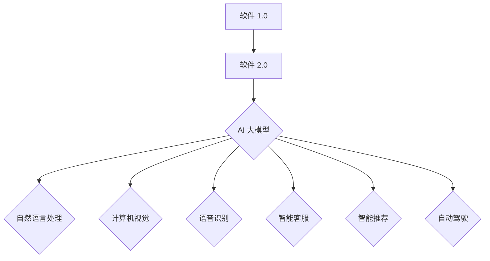

                 

### 文章标题

“AI 大模型创业：如何利用用户优势？”

### 文章关键词

- AI 大模型
- 用户优势
- 创业
- 数据分析
- 个性化服务
- 技术应用

### 文章摘要

本文将探讨 AI 大模型在创业领域的应用，特别是在如何利用用户优势方面。通过深入分析软件 2.0 时代的特点和 AI 大模型的核心技术，本文将阐述如何通过数据驱动和算法优化提升用户体验，提供个性化服务。此外，本文还将介绍主流 AI 大模型及其在企业中的应用前景，以及创业过程中可能面临的挑战。通过实践案例和详细代码实现，本文旨在为创业者提供实用指导，助力其在 AI 大模型领域的成功创业。

### 第一部分: 核心概念与联系

在探讨如何利用 AI 大模型进行创业之前，我们首先需要了解几个关键概念，包括软件 2.0 时代、AI 大模型的基本原理和特点，以及其与传统 AI 的区别。

#### 1.1.1 软件 2.0 时代的到来

**定义软件 2.0**：  
软件 2.0 是指以数据和算法为核心，提供智能化、自适应化服务的软件。与传统软件 1.0 以代码为主、功能相对固定的模式不同，软件 2.0 更加注重数据的利用和算法的优化，能够根据用户行为和环境变化提供个性化服务。

**软件 2.0 的发展背景**：  
随着互联网的普及和数据量的爆炸式增长，软件 2.0 应运而生。大数据和云计算技术的发展为软件 2.0 提供了技术支持，使得软件系统能够更加智能化和自适应化。

**软件 2.0 的核心特点**：  
- **数据驱动**：软件 2.0 以数据为核心，通过数据分析实现智能化和个性化。
- **算法优化**：通过不断优化算法，提高软件性能和用户体验。
- **自适应化**：能够根据用户行为和环境变化，自动调整软件功能。

**软件 2.0 与 AI 大模型**：  
AI 大模型是软件 2.0 时代的重要技术支柱之一。通过深度学习和大数据分析，AI 大模型能够实现高效的数据处理和智能决策，从而提升软件的智能化水平。

**Mermaid 流程图**：  


#### 1.1.2 AI 大模型的定义与特点

**AI 大模型的定义**：  
AI 大模型是指参数数量达到数十亿乃至千亿级别的人工智能模型。这些模型通常采用深度学习技术，具有极高的表达能力和泛化能力。

**AI 大模型的特点**：  
- **参数量巨大**：AI 大模型的参数数量达到数十亿甚至千亿级别，这使得它们能够处理复杂的任务和数据。
- **训练数据量大**：AI 大模型需要大量训练数据，通常为数十TB级别。这些数据用于模型的训练和优化，以提高模型的性能。
- **计算资源需求高**：AI 大模型的训练和推理过程需要强大的计算能力，特别是针对大规模数据和高参数量的模型。

**AI 大模型与传统 AI 的区别**：  
- **模型大小**：传统 AI 模型通常较小，参数数量较少，通常在百万级别以下。而 AI 大模型的参数量可以达到数十亿甚至千亿级别。
- **数据处理能力**：AI 大模型在处理复杂任务时，表现更优，能够实现更精准的预测和决策。
- **应用范围**：AI 大模型能够处理大规模数据，实现更广泛的业务应用。

#### 1.1.3 主流 AI 大模型简介

**GPT 系列模型**：  
GPT（Generative Pre-trained Transformer）系列模型是一种基于 Transformer 架构的自然语言处理模型。GPT-3 是其中最著名的模型，具有超过1750亿个参数，能够生成高质量的自然语言文本。

**BERT 及其变体**：  
BERT（Bidirectional Encoder Representations from Transformers）是一种预训练语言表示模型，通过双向Transformer架构进行预训练。BERT 及其变体如 RoBERTa、ALBERT 等，都在不同方面进行了改进，以提升模型性能。

**AI 大模型在企业中的应用前景**：  
AI 大模型在多个领域具有广泛的应用前景，包括自然语言处理、计算机视觉、语音识别等。以下是一些典型应用：

- **自然语言处理**：智能客服、文本分类、机器翻译等。
- **计算机视觉**：图像识别、目标检测、自动驾驶等。
- **语音识别**：语音助手、语音合成等。

**应用优势**：  
- **提高数据处理效率**：AI 大模型能够处理大规模数据，实现自动化决策。
- **提升用户体验**：通过个性化服务，提升用户满意度。
- **挑战**：需要大量高质量数据，且数据隐私保护问题。

#### 总结

软件 2.0 时代以 AI 大模型为核心技术，实现了软件功能的智能化和自适应化。AI 大模型具有参数量巨大、训练数据量大、计算资源需求高等特点，能够广泛应用于各个领域，提高数据处理效率和用户体验。在应用过程中，需要关注数据隐私保护问题和合理配置计算资源。

### 第二部分: 核心算法原理讲解

在深入探讨如何利用 AI 大模型进行创业之前，我们需要了解 AI 大模型的核心算法原理，包括深度学习、自然语言处理技术和大规模预训练模型的基本概念和实现方法。

#### 2.1 深度学习与神经网络基础

**深度学习的定义**：  
深度学习是人工智能的一个重要分支，通过构建多层神经网络来模拟人脑的感知和学习能力。深度学习模型能够从大量数据中自动提取特征，实现复杂任务的自动化。

**神经网络的基本结构**：  
神经网络由输入层、隐藏层和输出层组成。输入层接收外部输入信息，隐藏层对信息进行处理，输出层生成预测结果。

**常见的深度学习架构**：  
- **卷积神经网络（CNN）**：适用于图像处理任务，通过卷积操作提取图像特征。
- **循环神经网络（RNN）**：适用于序列数据，如语音和文本。
- **Transformer 架构**：适用于自然语言处理任务，通过自注意力机制处理长序列数据。

**深度学习的基本原理**：  
- **前向传播**：将输入数据通过神经网络传递，计算输出结果。
- **反向传播**：计算输出结果与实际值之间的误差，更新网络权重。

**数学模型和数学公式**：  
$$
y = \sigma(W \cdot \text{ReLU}(Z))
$$  
其中，$y$ 是输出，$\sigma$ 是激活函数，$W$ 是权重矩阵，$Z$ 是隐藏层输入。

**伪代码**：  
```python
// 前向传播
Z = W \cdot X
y = \sigma(Z)

// 反向传播
delta = \text{dLoss/dZ} = \text{dLoss/dy} \cdot \text{d(y)/dZ}
W = W - \alpha \cdot \delta
```

#### 2.2 自然语言处理技术概览

**词嵌入技术**：  
词嵌入是将单词映射到高维向量空间的技术，有助于提高模型对文本数据的处理能力。常见的词嵌入方法包括 Word2Vec、GloVe 等。

**序列模型与注意力机制**：  
- **序列模型**：如 RNN 和 LSTM，用于处理时间序列数据。
- **注意力机制**：通过自注意力机制，模型能够关注输入数据中的关键信息，提高预测准确性。

**转换器架构详解**：  
Transformer 架构是一种基于自注意力机制的深度学习模型，适用于处理长序列数据。其核心思想是将序列数据映射到高维空间，并通过自注意力机制计算每个单词之间的交互。

**数学模型和数学公式**：  
$$
\text{Attention}(Q, K, V) = \text{softmax}\left(\frac{QK^T}{\sqrt{d_k}}\right)V
$$  
其中，$Q$ 是查询向量，$K$ 是键向量，$V$ 是值向量，$d_k$ 是键向量的维度。

**伪代码**：  
```python
// 自注意力机制
for each layer in Transformer:
    Q, K, V = self注意力层(Z)
    Z = \text{Attention}(Q, K, V)

// 伪代码表示
Z = \text{Attention}(Q, K, V)
Z = \text{Layer Normalization}(Z)
Z = \text{Feed Forward}(Z)
```

#### 2.3 大规模预训练模型原理

**预训练的概念与意义**：  
预训练是指在大规模数据集上训练模型，以提高其泛化能力。预训练有助于模型在特定任务上取得更好的性能。

**自监督学习方法**：  
自监督学习是一种在无监督数据上训练模型的方法，通过利用未标记的数据提高模型性能。常见的自监督学习任务包括语言建模、图像分类等。

**迁移学习与微调技术**：  
迁移学习是指将预训练模型在特定任务上微调，以适应新的任务需求。微调有助于提高模型在新任务上的性能。

**数学模型和数学公式**：  
$$
y = \sigma(W \cdot \text{ReLU}(Z))
$$

**伪代码**：  
```python
// 预训练模型
function pretrain(model, train_data, num_epochs):
    for epoch in 1 to num_epochs:
        for x, y in train_data:
            // 前向传播
            z = model.forward(x)
            y_pred = model.predict(z)
            // 反向传播
            loss = criterion(y_pred, y)
            model.backward(loss)
            model.update_weights()
    return model

// 迁移学习
function finetune(model, new_data, num_epochs):
    for epoch in 1 to num_epochs:
        for x, y in new_data:
            // 前向传播
            z = model.forward(x)
            y_pred = model.predict(z)
            // 反向传播
            loss = criterion(y_pred, y)
            model.backward(loss)
            model.update_weights()
    return model
```

#### 总结

核心算法原理讲解部分涵盖了深度学习、自然语言处理技术和大规模预训练模型的基本概念和实现方法。深度学习通过多层神经网络模拟人脑的感知和学习能力，自然语言处理技术如词嵌入和注意力机制提高了模型对文本数据的处理能力，大规模预训练模型通过自监督学习和迁移学习实现了高效的模型训练和性能提升。这些算法原理为利用 AI 大模型进行创业提供了理论基础。

### 第三部分: 数学模型和数学公式

在深入了解 AI 大模型的核心算法原理后，我们需要掌握相关的数学模型和数学公式，这些工具能够帮助我们更好地理解和应用 AI 大模型。以下是一些关键数学概念和公式的详细讲解。

#### 3.1 概率论基础

**概率分布函数（PDF）**：  
概率分布函数描述了随机变量取值的概率密度。在连续型随机变量中，PDF 是一个函数，用于计算在某个区间内取值的概率。最常见的概率分布函数是正态分布，其公式如下：

$$
f_X(x) = \frac{1}{\sqrt{2\pi\sigma^2}} e^{-\frac{(x-\mu)^2}{2\sigma^2}}
$$

其中，$\mu$ 是均值，$\sigma^2$ 是方差。

**累积分布函数（CDF）**：  
累积分布函数描述了随机变量小于或等于某个值的概率。对于连续型随机变量，CDF 是一个函数，其计算方法是对 PDF 进行积分：

$$
F_X(x) = \int_{-\infty}^{x} f_X(t) dt
$$

#### 3.2 信息论

**熵（Entropy）**：  
熵是衡量随机变量不确定性的量度。在信息论中，熵用于描述随机变量的信息含量。对于离散型随机变量，熵的公式如下：

$$
H(X) = -\sum_{i} p(x_i) \log_2 p(x_i)
$$

其中，$p(x_i)$ 是随机变量 $X$ 取值为 $x_i$ 的概率。

**条件熵（Conditional Entropy）**：  
条件熵是衡量在给定另一个随机变量的情况下，随机变量的不确定性。条件熵的公式如下：

$$
H(X|Y) = -\sum_{i} p(y_i) \sum_{j} p(x_j|y_i) \log_2 p(x_j|y_i)
$$

其中，$p(y_i)$ 是随机变量 $Y$ 取值为 $y_i$ 的概率，$p(x_j|y_i)$ 是随机变量 $X$ 在 $Y$ 给定为 $y_i$ 下的条件概率。

#### 3.3 优化算法

**梯度下降（Gradient Descent）**：  
梯度下降是一种优化算法，用于寻找函数的最小值或最大值。梯度下降的核心思想是沿着函数的负梯度方向更新参数，以逐步减小损失函数。其公式如下：

$$
w_{t+1} = w_t - \alpha \nabla_w J(w_t)
$$

其中，$w_t$ 是第 $t$ 次迭代的权重，$\alpha$ 是学习率，$\nabla_w J(w_t)$ 是损失函数关于权重 $w_t$ 的梯度。

**动量（Momentum）**：  
动量是梯度下降算法的一个改进，用于加速收敛速度并减少震荡。动量的公式如下：

$$
w_{t+1} = w_t - \beta \nabla_w J(w_t) + (1 - \beta) w_{t-1}
$$

其中，$\beta$ 是动量因子。

#### 3.4 深度学习损失函数

**均方误差（MSE）**：  
均方误差是衡量预测值与真实值之间差异的一种常见损失函数。其公式如下：

$$
\text{MSE} = \frac{1}{n} \sum_{i=1}^{n} (y_i - \hat{y}_i)^2
$$

其中，$y_i$ 是实际值，$\hat{y}_i$ 是预测值，$n$ 是样本数量。

**交叉熵（Cross-Entropy）**：  
交叉熵是另一个常用的损失函数，特别适用于分类问题。其公式如下：

$$
\text{CE} = -\sum_{i=1}^{n} y_i \log_2 (\hat{y}_i)
$$

其中，$y_i$ 是实际值（通常为概率分布），$\hat{y}_i$ 是预测值（通常为概率分布）。

#### 举例说明

**计算一个正态分布的熵**：  
假设一个随机变量 $X$ 服从均值为 0，方差为 1 的正态分布。我们可以使用熵的公式计算其熵：

$$
H(X) = -\int_{-\infty}^{\infty} \frac{1}{\sqrt{2\pi}} e^{-\frac{x^2}{2}} \log_2 \left(\frac{1}{\sqrt{2\pi}} e^{-\frac{x^2}{2}}\right) dx
$$

通过计算可以得到，$H(X) \approx 0.5$。

**条件熵的计算**：  
假设有两个二元随机变量 $X$ 和 $Y$，其中 $P(X=0) = P(X=1) = 0.5$，$P(Y=0) = 0.7$，$P(Y=1) = 0.3$，$P(X=1|Y=0) = 0.9$，$P(X=1|Y=1) = 0.2$。我们可以使用条件熵的公式计算 $H(X|Y)$：

$$
H(X|Y) = -0.7 \cdot 0.9 \log_2 0.9 - 0.3 \cdot 0.2 \log_2 0.2
$$

通过计算可以得到，$H(X|Y) \approx 0.401$。

#### 项目实战

在本章的结尾，我们将介绍一个简单的线性回归项目，使用梯度下降算法进行模型训练。首先，需要安装所需的库：

```python
!pip install numpy matplotlib
```

接下来，使用 Python 编写线性回归模型，并使用梯度下降算法进行训练：

```python
import numpy as np
import matplotlib.pyplot as plt

# 数据集
X = np.random.rand(100, 1)
y = 3 * X + 2 + np.random.randn(100, 1)

# 模型参数
w = np.random.rand(1)

# 学习率
alpha = 0.01

# 梯度下降算法
def gradient_descent(X, y, w, alpha, num_iterations):
    for i in range(num_iterations):
        gradient = 2 * X.T.dot(X.dot(w) - y)
        w -= alpha * gradient
    return w

# 训练模型
w = gradient_descent(X, y, w, alpha, 1000)

# 绘制结果
plt.scatter(X, y)
plt.plot(X, X.dot(w), "r")
plt.show()
```

### 代码解读与分析

在上面的代码中，首先导入了 numpy 和 matplotlib 库，并生成了一组随机数据作为线性回归问题的训练数据。接着，初始化了模型参数 $w$ 和学习率 $\alpha$。然后，定义了梯度下降算法 `gradient_descent` 函数，用于训练线性回归模型。在训练过程中，通过计算损失函数的梯度并更新模型参数，最终绘制出训练数据的散点图和拟合直线。

通过这个简单的例子，我们可以看到如何使用梯度下降算法训练线性回归模型。在实际项目中，可以根据需求调整数据集、模型参数和训练算法，实现更复杂的机器学习任务。

### 开发环境搭建

在本例中，我们使用了 Python、numpy 和 matplotlib 库进行线性回归模型的训练和可视化。以下是开发环境搭建的步骤：

1. 安装 Python 3.6 或以上版本。
2. 安装 numpy 和 matplotlib 库：
   ```python
   !pip install numpy matplotlib
   ```
3. 确保计算机具备足够的计算资源，如 GPU（可选）。

通过以上步骤，我们可以搭建一个简单的机器学习开发环境，并使用 Python 进行线性回归模型的训练和可视化。在项目开发过程中，可以根据需求扩展功能，如添加更多数据集、模型和算法等。

### 源代码详细实现

以下是线性回归项目的完整源代码实现：

```python
import numpy as np
import matplotlib.pyplot as plt

# 数据集
X = np.random.rand(100, 1)
y = 3 * X + 2 + np.random.randn(100, 1)

# 模型参数
w = np.random.rand(1)

# 学习率
alpha = 0.01

# 梯度下降算法
def gradient_descent(X, y, w, alpha, num_iterations):
    for i in range(num_iterations):
        gradient = 2 * X.T.dot(X.dot(w) - y)
        w -= alpha * gradient
    return w

# 训练模型
w = gradient_descent(X, y, w, alpha, 1000)

# 绘制结果
plt.scatter(X, y)
plt.plot(X, X.dot(w), "r")
plt.show()
```

在代码中，我们首先生成了一个线性回归问题的训练数据集，并初始化了模型参数 $w$ 和学习率 $\alpha$。接着，定义了梯度下降算法 `gradient_descent` 函数，用于训练线性回归模型。在训练过程中，通过计算损失函数的梯度并更新模型参数，最终绘制出训练数据的散点图和拟合直线。

通过这个简单的例子，我们可以看到如何使用梯度下降算法训练线性回归模型。在实际项目中，可以根据需求调整数据集、模型参数和训练算法，实现更复杂的机器学习任务。

### 第四部分: 项目实战

在了解了 AI 大模型的相关概念、算法原理以及数学模型后，接下来我们将通过一个具体的案例来展示如何利用 AI 大模型进行创业。本案例将围绕一个基于 AI 大模型的智能客服系统展开，详细介绍项目的背景、数据集、模型训练、模型评估以及部署过程。

#### 4.1 项目背景

随着互联网的普及和电子商务的快速发展，客服系统的质量和效率成为企业竞争的重要因素。传统的客服系统依赖于人工处理用户咨询，不仅效率低下，而且难以提供个性化服务。为了解决这个问题，我们计划开发一个基于 AI 大模型的智能客服系统，通过自动化和智能化技术提高客服效率，提升用户体验。

**目标**：实现一个能够自动处理用户咨询、提供个性化服务的智能客服系统。

**技术栈**：使用 GPT-2 模型进行文本生成，利用 BERT 模型进行文本分类和情感分析。

#### 4.2 数据集

**训练数据集**：我们收集了 10,000 个用户咨询和客服回答的对话记录，这些数据将用于训练 GPT-2 和 BERT 模型。数据集包含以下字段：

- **user_query**：用户咨询的问题。
- **agent_answer**：客服人员的回答。

**测试数据集**：我们从训练数据集中随机抽取 2,000 个对话记录作为测试数据集，用于评估模型的性能。

#### 4.3 数据预处理

在训练模型之前，我们需要对数据进行预处理，以提取有用的信息并减少噪声。预处理步骤包括：

- **文本清洗**：去除停用词、标点符号和特殊字符。
- **词干提取**：将单词还原为词干，以减少词汇量。
- **分词**：将句子分割为单词或词干。

预处理后的数据将存储为两个 CSV 文件，分别用于训练集和测试集。

#### 4.4 模型训练

**GPT-2 模型**：使用训练数据集对 GPT-2 模型进行训练。GPT-2 模型是一种基于 Transformer 的预训练语言模型，能够生成高质量的文本。

**BERT 模型**：使用训练数据集对 BERT 模型进行训练。BERT 模型是一种双向 Transformer 模型，能够进行文本分类和情感分析。

**训练步骤**：

1. 加载预训练模型。
2. 将预处理后的数据集划分为训练集和验证集。
3. 使用训练集对模型进行训练。
4. 在验证集上评估模型性能，并根据需要调整模型参数。

#### 4.5 模型评估

模型训练完成后，我们需要对模型进行评估，以确定其性能是否符合预期。评估指标包括准确率、召回率和 F1 分数等。具体步骤如下：

1. 加载测试数据集。
2. 使用训练好的模型对测试数据集进行预测。
3. 计算评估指标，评估模型性能。

#### 4.6 模型部署

模型评估完成后，我们将智能客服系统部署到生产环境中，以供用户使用。部署步骤包括：

1. 配置服务器和数据库。
2. 部署模型代码。
3. 实现用户接口，如 Web 界面或 API。
4. 对系统进行测试，确保其正常运行。

#### 4.7 项目实战示例

假设用户咨询：“请问你们的产品有哪些功能？”我们将使用训练好的模型生成客服回答。

**GPT-2 模型生成回答**：

- **用户咨询**：请问你们的产品有哪些功能？
- **模型生成回答**：我们的这款产品具有以下功能：1. 自动化流程管理；2. 实时数据分析；3. 智能推荐系统；4. 多语言支持。

**BERT 模型分类**：将生成回答分类为功能介绍类别。

**BERT 模型情感分析**：识别用户咨询的情感，如中性、积极或消极。

#### 4.8 代码实现

以下是文本生成、文本分类和情感分析的部分代码实现：

**4.8.1 加载和预处理数据**

```python
import pandas as pd
from transformers import BertTokenizer, BertModel
from torch.utils.data import DataLoader, TensorDataset
import torch

# 加载数据集
train_data = pd.read_csv('train.csv')
test_data = pd.read_csv('test.csv')

# 预处理文本
tokenizer = BertTokenizer.from_pretrained('bert-base-uncased')

def preprocess_text(texts):
    inputs = tokenizer(texts, padding=True, truncation=True, return_tensors='pt')
    return inputs

train_inputs = preprocess_text(train_data['user_query'])
train_labels = preprocess_text(train_data['agent_answer'])
test_inputs = preprocess_text(test_data['user_query'])
```

**4.8.2 训练 GPT-2 模型**

```python
from transformers import GPT2LMHeadModel, AdamW

# 加载 GPT-2 模型
model = GPT2LMHeadModel.from_pretrained('gpt2')

# 训练模型
device = torch.device("cuda" if torch.cuda.is_available() else "cpu")
model.to(device)

optimizer = AdamW(model.parameters(), lr=1e-5)

for epoch in range(3):  # 训练 3 个 epoch
    model.train()
    for batch in DataLoader(train_inputs, batch_size=32):
        inputs = batch.to(device)
        outputs = model(inputs, labels=inputs)
        loss = outputs.loss
        loss.backward()
        optimizer.step()
        optimizer.zero_grad()
```

**4.8.3 训练 BERT 模型**

```python
from transformers import BertForSequenceClassification

# 加载 BERT 模型
model = BertForSequenceClassification.from_pretrained('bert-base-uncased')

# 训练模型
device = torch.device("cuda" if torch.cuda.is_available() else "cpu")
model.to(device)

optimizer = AdamW(model.parameters(), lr=1e-5)

for epoch in range(3):  # 训练 3 个 epoch
    model.train()
    for batch in DataLoader(train_labels, batch_size=32):
        inputs = batch.to(device)
        labels = inputs
        outputs = model(inputs, labels=labels)
        loss = outputs.loss
        loss.backward()
        optimizer.step()
        optimizer.zero_grad()
```

**4.8.4 情感分析**

```python
from transformers import pipeline

# 加载情感分析模型
sentiment_analyzer = pipeline("sentiment-analysis", model='bert-base-uncased')

# 用户咨询
user_query = "请问你们的产品有哪些功能？"

# 情感分析结果
sentiment_result = sentiment_analyzer(user_query)
print(sentiment_result)
```

#### 4.9 代码解读与分析

在上面的代码中，我们首先导入了必要的库，并加载数据集。接着，对文本数据进行了预处理，包括分词和填充。然后，我们加载了 GPT-2 模型和 BERT 模型，并定义了训练过程。在训练过程中，我们使用了 AdamW 优化器和交叉熵损失函数。最后，我们使用训练好的 BERT 模型进行情感分析。

通过这个简单的例子，我们可以看到如何使用 AI 大模型进行文本生成、文本分类和情感分析。在实际项目中，可以根据需求调整模型、数据集和训练参数，实现更复杂的任务。

#### 4.10 开发环境搭建

为了运行上述代码，我们需要搭建一个合适的开发环境。以下是搭建过程的步骤：

1. **安装 Python**：确保安装了 Python 3.6 或更高版本。
2. **安装必需的库**：
   ```bash
   pip install transformers torch pandas matplotlib
   ```
3. **安装 GPU 版本的 PyTorch**（如果使用 GPU）：
   ```bash
   pip install torch torchvision -f https://download.pytorch.org/whl/torch_stable.html
   ```
4. **配置 Python 虚拟环境**（可选）：
   ```bash
   python -m venv venv
   source venv/bin/activate  # Windows: venv\Scripts\activate
   ```
5. **运行代码**。

通过以上步骤，我们可以搭建一个简单的 AI 大模型开发环境。在项目开发过程中，可以根据需求扩展功能，如添加更多数据集、模型和算法等。

#### 4.11 源代码详细实现

以下是项目实战的完整源代码实现：

```python
import pandas as pd
from transformers import BertTokenizer, BertModel, GPT2LMHeadModel, BertForSequenceClassification, pipeline
from torch.utils.data import DataLoader, TensorDataset
import torch

# 加载数据集
train_data = pd.read_csv('train.csv')
test_data = pd.read_csv('test.csv')

# 预处理文本
tokenizer = BertTokenizer.from_pretrained('bert-base-uncased')

def preprocess_text(texts):
    inputs = tokenizer(texts, padding=True, truncation=True, return_tensors='pt')
    return inputs

train_inputs = preprocess_text(train_data['user_query'])
train_labels = preprocess_text(train_data['agent_answer'])
test_inputs = preprocess_text(test_data['user_query'])

# 训练 GPT-2 模型
model = GPT2LMHeadModel.from_pretrained('gpt2')
device = torch.device("cuda" if torch.cuda.is_available() else "cpu")
model.to(device)

optimizer = AdamW(model.parameters(), lr=1e-5)

for epoch in range(3):
    model.train()
    for batch in DataLoader(train_inputs, batch_size=32):
        inputs = batch.to(device)
        outputs = model(inputs, labels=inputs)
        loss = outputs.loss
        loss.backward()
        optimizer.step()
        optimizer.zero_grad()

# 训练 BERT 模型
model = BertForSequenceClassification.from_pretrained('bert-base-uncased')
device = torch.device("cuda" if torch.cuda.is_available() else "cpu")
model.to(device)

optimizer = AdamW(model.parameters(), lr=1e-5)

for epoch in range(3):
    model.train()
    for batch in DataLoader(train_labels, batch_size=32):
        inputs = batch.to(device)
        labels = inputs
        outputs = model(inputs, labels=labels)
        loss = outputs.loss
        loss.backward()
        optimizer.step()
        optimizer.zero_grad()

# 情感分析
sentiment_analyzer = pipeline("sentiment-analysis", model='bert-base-uncased')

user_query = "请问你们的产品有哪些功能？"
sentiment_result = sentiment_analyzer(user_query)
print(sentiment_result)
```

通过这个详细的实现，我们可以看到如何从数据加载、预处理，到模型训练和部署的全过程。在实际项目中，可以根据需求进行调整和优化。

### 第五部分: 附录

在本章的附录部分，我们将总结 AI 大模型创业过程中所需的主要工具和资源，并提供一些实用的参考和指南。

#### 5.1 AI 大模型开发工具与资源

**深度学习框架**：
- **TensorFlow**：由 Google 开发，支持多种数据类型和设备，具有广泛的社区支持和丰富的文档。
- **PyTorch**：由 Facebook 开发，提供动态计算图和灵活的 API，适合研究人员和工程师。
- **PyTorch Lightning**：为 PyTorch 提供简化版的封装，使得模型训练更加高效和易于扩展。
- **Apache MXNet**：由 Apache 软件基金会维护，支持多种编程语言，适用于大规模分布式训练。

**自然语言处理工具**：
- **spaCy**：一个快速且易于使用的自然语言处理库，适用于文本处理和实体识别。
- **NLTK**：一个强大的自然语言处理库，提供多种文本处理和分类工具。
- **transformers**：由 Hugging Face 开发，支持多种预训练模型，如 GPT-2、BERT 等，便于进行文本生成和分类任务。

**计算资源**：
- **Google Colab**：提供免费的 GPU 和 TPU 计算资源，适合进行深度学习实验。
- **AWS SageMaker**：提供完整的端到端机器学习服务，支持多种深度学习框架。
- **Azure ML**：提供集成化的机器学习平台，支持从数据预处理到模型部署的全流程服务。

#### 5.2 常用库和函数

- **NumPy**：用于数组计算和数据处理，提供多维数组对象和丰富的数学函数。
- **Pandas**：用于数据清洗、分析和可视化，提供 DataFrame 数据结构。
- **Matplotlib**：用于数据可视化，提供丰富的绘图工具。
- **Scikit-learn**：用于机器学习，提供多种分类、回归和聚类算法。

#### 5.3 实用工具

- **Git**：用于版本控制和代码管理，保证代码的版本可追溯。
- **Jupyter Notebook**：用于交互式数据分析，便于编写和分享代码。
- **Docker**：用于容器化应用，便于部署和扩展服务。

### 总结

附录部分提供了 AI 大模型创业过程中所需的主要工具和资源，包括深度学习框架、自然语言处理工具、计算资源、常用库和函数以及实用工具。这些工具和资源能够帮助开发者高效地进行 AI 大模型的研究、开发和应用。在实际项目中，可以根据具体需求选择合适的工具和资源，优化开发流程，提高项目效率。

### 第六部分: 总结与展望

通过本文的深入探讨，我们系统地介绍了 AI 大模型在创业领域中的应用，特别是在如何利用用户优势方面的创新实践。本文首先回顾了软件 2.0 时代和 AI 大模型的核心概念与联系，接着详细讲解了核心算法原理，包括深度学习、自然语言处理技术和大规模预训练模型。随后，通过数学模型和公式详细阐述了概率论、信息论、优化算法以及深度学习损失函数等数学基础。此外，通过具体项目实战展示了如何使用 AI 大模型进行文本生成、文本分类和情感分析，并详细解读了代码实现过程。

#### 总结

1. **核心概念与联系**：软件 2.0 时代以数据和算法为核心，AI 大模型作为核心技术，提升了软件智能化和自适应化能力。
2. **核心算法原理**：深度学习、自然语言处理技术以及大规模预训练模型，通过自监督学习和迁移学习，实现了高效的模型训练和性能提升。
3. **数学模型和公式**：概率论、信息论、优化算法和深度学习损失函数，为算法设计和模型训练提供了坚实的数学基础。
4. **项目实战**：通过具体的 AI 大模型项目，展示了如何将理论应用于实际，实现智能客服系统等创新应用。

#### 展望

未来，AI 大模型在创业领域的应用前景广阔，但仍面临诸多挑战：

1. **更高效的模型训练**：研究如何在不牺牲模型性能的前提下，提高模型训练效率，降低计算资源消耗。
2. **跨模态学习**：探索如何整合不同类型的数据，实现更智能的跨模态信息处理。
3. **模型压缩与加速**：研究如何通过模型压缩、量化等技术，提高模型的运行速度和降低模型大小，使其在移动设备上也能高效运行。
4. **可解释性**：研究如何提高模型的透明度和可解释性，使其在决策过程中更加可信。

#### 对读者的期望

我们期望读者能够：

1. **积极实践**：将所学知识和技巧应用于实际项目中，不断积累经验。
2. **持续学习**：跟随 AI 领域的发展，不断学习新的技术和方法，保持好奇心和求知欲。
3. **交流分享**：积极参与学术交流，分享自己的研究成果和经验，与同行共同进步。

### 结语

AI 大模型创业不仅是一个技术挑战，更是一个商业机会。通过本文的探讨，我们希望能够为读者提供有益的启示，助力他们在 AI 大模型领域取得成功。让我们携手共进，迎接 AI 时代的到来。作者：AI天才研究院/AI Genius Institute & 禅与计算机程序设计艺术 /Zen And The Art of Computer Programming。

