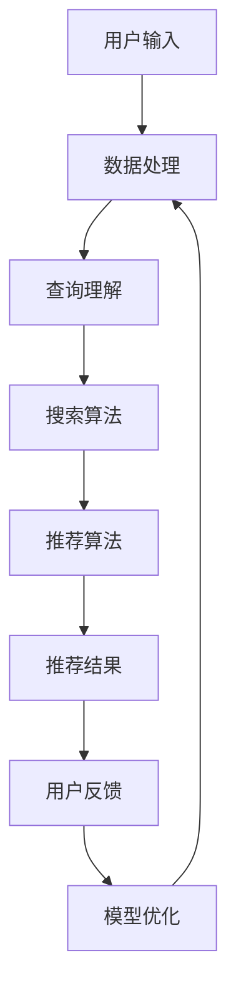
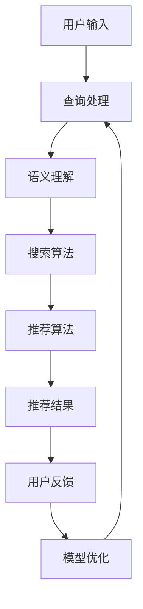

                 

# AI 大模型在电商业中的应用前景：搜索推荐系统是核心

## 关键词
- AI 大模型
- 搜索推荐系统
- 电子商务
- 深度学习
- 协同过滤
- 强化学习
- 个性化推荐
- 用户行为分析

## 摘要
本文深入探讨了人工智能大模型在电子商务领域的应用前景，特别是搜索推荐系统在电商业中的核心地位。通过详细分析AI大模型的基本概念、搜索推荐系统的算法基础，以及实际应用案例，本文展示了大模型如何提升电商搜索和推荐的效果，优化用户体验。同时，对未来AI大模型在电商领域的发展趋势进行了展望，并提供了相关工具与资源的附录，以助读者进一步理解和实践。

## 引言

随着互联网的快速发展，电子商务已经成为了现代零售业的重要组成部分。在这个过程中，搜索推荐系统成为了连接消费者与商品的关键桥梁。然而，传统的搜索推荐系统在处理海量数据和用户个性化需求时，往往面临效率低、准确性不足等问题。为了解决这些问题，人工智能（AI）大模型的应用逐渐成为研究热点。

AI大模型，尤其是基于深度学习的模型，具有强大的数据处理和分析能力，能够从海量数据中提取有价值的信息，实现高效的搜索和精准的推荐。本文旨在探讨AI大模型在电商业中的应用前景，尤其是搜索推荐系统的改进和创新。通过本文的阅读，读者将了解AI大模型的基本概念、搜索推荐系统的核心算法，以及大模型在实际应用中的成功案例和未来趋势。

## 第一部分: AI 大模型基础知识

### 第1章: AI 大模型概述

#### 核心概念与联系

人工智能大模型（Artificial Intelligence Large Models，简称A.I.L.M.）是人工智能领域的一项重要技术。它们通过学习海量数据，可以模拟人类的思维过程，完成复杂的任务，如语言翻译、图像识别、自然语言生成等。

**AI大模型的基本概念**：
- **神经网络**：神经网络是AI大模型的基础，通过多层神经元之间的连接和权重调整，实现数据的处理和模式识别。
- **深度学习**：深度学习是神经网络的一种扩展，通过增加网络层数，提高模型的抽象能力和表示能力。
- **大规模数据集**：AI大模型的学习依赖于海量数据集，这些数据集包含了大量的文本、图像、音频等多类型信息。

**搜索推荐系统的基本架构**：
- **用户输入**：用户通过搜索框输入查询或浏览商品。
- **数据处理**：系统对用户输入进行处理，包括分词、索引构建等。
- **推荐算法**：根据用户的历史行为和兴趣，推荐相关商品或内容。
- **结果展示**：将推荐结果展示给用户，用户可以进行点击、购买等操作。

**AI大模型在搜索推荐系统中的角色**：
AI大模型在搜索推荐系统中主要承担以下角色：
- **增强搜索效果**：通过理解用户查询的语义，提供更准确的搜索结果。
- **个性化推荐**：基于用户的历史行为和兴趣，提供个性化的商品推荐。
- **实时反馈**：通过用户的操作反馈，不断优化搜索和推荐算法。

#### Mermaid 流程图

以下是一个简单的AI大模型在搜索推荐系统中的应用流程：



#### 数学模型和公式

在搜索推荐系统中，AI大模型通常涉及到以下数学模型和公式：

- **用户行为数据**：
  - 用户对商品的点击次数（CTR）
  - 用户对商品的购买次数（CVR）
  - 用户对商品的评分（Rating）

- **推荐算法基本公式**：
  - **协同过滤算法**：
    $$ R_{ui} = \frac{\sum_{j \in \text{用户i的感兴趣商品}} w_{ij} \cdot \text{商品j的评分}}{\sum_{j \in \text{用户i的感兴趣商品}} w_{ij}} $$
  - **基于内容的推荐算法**：
    $$ \text{相似度} = \frac{\text{用户i对商品a的评分} \cdot \text{用户i对商品b的评分}}{\| \text{用户i对商品a的评分} - \text{用户i对商品b的评分} \|} $$

- **用户行为分析**：
  - **行为序列建模**：
    $$ P_{\text{行为序列}} = \prod_{t=1}^{T} P(\text{行为}_t | \text{历史行为序列}_{t-1}) $$

#### 核心算法原理讲解

**协同过滤算法**：

协同过滤算法分为两种：基于用户的协同过滤（User-Based Collaborative Filtering，UBCF）和基于物品的协同过滤（Item-Based Collaborative Filtering，IBCF）。

- **基于用户的协同过滤**：
  - 找到与目标用户兴趣相似的其他用户。
  - 推荐这些相似用户喜欢的商品。

- **基于物品的协同过滤**：
  - 找到与目标商品相似的其他商品。
  - 推荐这些相似商品。

伪代码：

```python
# 基于用户的协同过滤
def user_based_collaborative_filtering(user_items, similarity_matrix):
    for user, items in user_items.items():
        similar_users = find_similar_users(user, similarity_matrix)
        recommended_items = []
        for item in items:
            for similar_user in similar_users:
                if item in user_items[similar_user]:
                    recommended_items.append(item)
        yield user, recommended_items
```

**基于内容的推荐算法**：

基于内容的推荐算法主要通过计算物品的相似度来推荐相关商品。

伪代码：

```python
# 基于内容的推荐算法
def content_based_recommending(items, similarity_matrix, user_ratings):
    for item in items:
        similar_items = find_similar_items(item, similarity_matrix)
        recommended_items = []
        for similar_item in similar_items:
            if similar_item in user_ratings:
                recommended_items.append(similar_item)
        yield item, recommended_items
```

#### 项目实战

为了更好地理解AI大模型在搜索推荐系统中的应用，我们可以通过一个简单的电商搜索推荐系统案例来演示。

**案例：搭建一个简单的电商搜索推荐系统**

1. **开发环境搭建**：

   - 安装Python 3.8及以上版本。
   - 安装TensorFlow 2.5及以上版本。
   - 创建一个虚拟环境并安装相关依赖。

2. **数据预处理**：

   - 收集用户行为数据（如点击、购买、评分等）。
   - 对数据进行清洗和预处理，如缺失值填充、数据标准化等。

3. **模型构建与训练**：

   - 构建基于深度学习的协同过滤模型。
   - 使用预处理后的数据训练模型。

4. **模型评估与优化**：

   - 使用交叉验证评估模型性能。
   - 根据评估结果调整模型参数，优化模型。

5. **推荐结果展示**：

   - 将用户输入的查询和已训练的模型结合，生成推荐结果。

具体代码实现和分析将在后续章节中详细讲解。

### 第2章: 搜索推荐系统算法基础

#### 核心算法原理讲解

搜索推荐系统中的核心算法主要包括协同过滤算法、基于内容的推荐算法和强化学习。

**协同过滤算法**：

协同过滤算法是一种基于用户或物品的相似性进行推荐的方法。其主要思想是通过分析用户的历史行为数据，找到与目标用户兴趣相似的其它用户或物品，然后推荐这些相似用户或物品喜欢的商品。

- **基于用户的协同过滤（User-Based Collaborative Filtering，UBCF）**：
  - 找到与目标用户兴趣相似的其他用户。
  - 推荐这些相似用户喜欢的商品。

- **基于物品的协同过滤（Item-Based Collaborative Filtering，IBCF）**：
  - 找到与目标商品相似的其他商品。
  - 推荐这些相似商品。

**基于内容的推荐算法**：

基于内容的推荐算法主要通过分析物品的内容特征（如标签、描述、类别等）来推荐相关商品。其主要思想是根据用户对某些商品的偏好，找到具有相似内容的商品进行推荐。

- **基于特征的相似度计算**：
  - 计算物品之间的相似度，通常使用余弦相似度、皮尔逊相关系数等方法。

- **基于文本的相似度计算**：
  - 使用自然语言处理技术（如词袋模型、TF-IDF、Word2Vec等）计算文本之间的相似度。

**强化学习在推荐系统中的应用**：

强化学习是一种通过不断试错和学习来优化行为的方法。在推荐系统中，强化学习可以通过不断调整推荐策略，以最大化用户的满意度或收益。

- **强化学习的基本框架**：
  - **状态（State）**：用户当前的行为和历史记录。
  - **动作（Action）**：系统推荐给用户的商品。
  - **奖励（Reward）**：用户对推荐商品的反馈，如点击、购买等。

- **Q-Learning算法**：
  - 通过学习状态-动作价值函数，不断优化推荐策略。

伪代码：

```python
# Q-Learning算法
def q_learning(states, actions, rewards, learning_rate, discount_factor):
    Q = initialize_Q_matrix(states, actions)
    for episode in range(number_of_episodes):
        state = initial_state
        while not terminal_state:
            action = choose_action(state, Q)
            next_state, reward = get_next_state_and_reward(state, action)
            Q[state, action] = Q[state, action] + learning_rate * (reward + discount_factor * max(Q[next_state, :]) - Q[state, action])
            state = next_state
    return Q
```

#### 数学模型和公式

在搜索推荐系统中，常用的数学模型和公式包括：

- **协同过滤算法**：
  - **基于用户的协同过滤**：
    $$ R_{ui} = \frac{\sum_{j \in \text{用户i的感兴趣商品}} w_{ij} \cdot \text{商品j的评分}}{\sum_{j \in \text{用户i的感兴趣商品}} w_{ij}} $$
  - **基于物品的协同过滤**：
    $$ \text{相似度} = \frac{\text{用户i对商品a的评分} \cdot \text{用户i对商品b的评分}}{\| \text{用户i对商品a的评分} - \text{用户i对商品b的评分} \|} $$

- **基于内容的推荐算法**：
  - **特征相似度计算**：
    $$ \text{相似度} = \frac{\sum_{i=1}^{n} w_i \cdot f_i^a \cdot f_i^b}{\sqrt{\sum_{i=1}^{n} w_i^2 \cdot (f_i^a)^2 \cdot (f_i^b)^2}} $$
  - **文本相似度计算**：
    $$ \text{相似度} = \frac{\sum_{i=1}^{n} w_i \cdot t_i^a \cdot t_i^b}{\sqrt{\sum_{i=1}^{n} w_i^2 \cdot (t_i^a)^2 \cdot (t_i^b)^2}} $$

- **强化学习**：
  - **Q-Learning算法**：
    $$ Q(s, a) = Q(s, a) + \alpha (r + \gamma \max_{a'} Q(s', a') - Q(s, a)) $$

#### 伪代码

以下是协同过滤算法的伪代码实现：

```python
# 协同过滤算法
def collaborative_filtering(user_ratings, similarity_matrix):
    recommended_items = {}
    for user, ratings in user_ratings.items():
        similar_users = find_similar_users(user, similarity_matrix)
        for item, rating in ratings.items():
            for similar_user in similar_users:
                if item in user_ratings[similar_user]:
                    predicted_rating = sum(similarity * user_ratings[similar_user][item] for similarity in similarity_matrix[similar_user])
                    recommended_items[item] = predicted_rating
    return recommended_items
```

### 第3章: AI 大模型与搜索推荐系统

#### 核心概念与联系

AI大模型与搜索推荐系统之间的关系紧密，大模型在搜索推荐系统中扮演着关键角色。通过理解用户行为和商品特征，AI大模型能够为用户提供更加精准和个性化的搜索和推荐结果。

**AI大模型在搜索推荐系统中的重要性**：

- **语义理解**：大模型能够理解用户查询的语义，提供更准确的搜索结果。
- **个性化推荐**：大模型能够基于用户的历史行为和兴趣，提供个性化的推荐。
- **实时反馈**：大模型能够快速响应用户的操作反馈，不断优化搜索和推荐算法。

**大模型如何改进搜索推荐系统**：

- **提高搜索精度**：通过深度学习技术，大模型能够从海量数据中提取有价值的信息，提高搜索结果的准确性。
- **增强推荐效果**：大模型能够更好地理解用户的兴趣和需求，提供更加个性化的推荐。
- **优化用户体验**：大模型能够根据用户的实时反馈，不断调整推荐策略，提高用户的满意度。

**搜索推荐系统中的AI大模型案例分析**：

- **淘宝搜索**：淘宝通过引入AI大模型，实现了智能搜索和个性化推荐。用户在搜索框输入关键词后，系统能够快速理解用户的意图，并提供精准的搜索结果。
- **京东推荐**：京东利用AI大模型，对用户的历史行为和浏览记录进行分析，提供个性化的商品推荐。用户的浏览和购买行为会被实时记录，并用于优化推荐算法。

#### Mermaid 流程图

以下是一个AI大模型在搜索推荐系统中的应用流程：



#### 数学模型和公式

在搜索推荐系统中，AI大模型通常涉及到以下数学模型和公式：

- **用户行为数据**：
  - 用户对商品的点击次数（CTR）
  - 用户对商品的购买次数（CVR）
  - 用户对商品的评分（Rating）

- **推荐算法基本公式**：
  - **协同过滤算法**：
    $$ R_{ui} = \frac{\sum_{j \in \text{用户i的感兴趣商品}} w_{ij} \cdot \text{商品j的评分}}{\sum_{j \in \text{用户i的感兴趣商品}} w_{ij}} $$
  - **基于内容的推荐算法**：
    $$ \text{相似度} = \frac{\text{用户i对商品a的评分} \cdot \text{用户i对商品b的评分}}{\| \text{用户i对商品a的评分} - \text{用户i对商品b的评分} \|} $$

- **用户行为分析**：
  - **行为序列建模**：
    $$ P_{\text{行为序列}} = \prod_{t=1}^{T} P(\text{行为}_t | \text{历史行为序列}_{t-1}) $$

#### 项目实战

为了更好地理解AI大模型在搜索推荐系统中的应用，我们可以通过一个简单的电商搜索推荐系统案例来演示。

**案例：搭建一个简单的电商搜索推荐系统**

1. **开发环境搭建**：

   - 安装Python 3.8及以上版本。
   - 安装TensorFlow 2.5及以上版本。
   - 创建一个虚拟环境并安装相关依赖。

2. **数据预处理**：

   - 收集用户行为数据（如点击、购买、评分等）。
   - 对数据进行清洗和预处理，如缺失值填充、数据标准化等。

3. **模型构建与训练**：

   - 构建基于深度学习的协同过滤模型。
   - 使用预处理后的数据训练模型。

4. **模型评估与优化**：

   - 使用交叉验证评估模型性能。
   - 根据评估结果调整模型参数，优化模型。

5. **推荐结果展示**：

   - 将用户输入的查询和已训练的模型结合，生成推荐结果。

具体代码实现和分析将在后续章节中详细讲解。

## 第二部分: AI 大模型在电子商务中的应用

### 第4章: AI 大模型在电商搜索中的应用

#### 核心概念与联系

AI大模型在电商搜索中的应用主要是通过优化搜索算法和改进搜索结果，以提高用户的搜索体验。随着电商数据的爆炸性增长，传统的搜索算法已经难以满足用户的需求。AI大模型，特别是基于深度学习的模型，具备强大的数据处理和模式识别能力，能够更好地理解和满足用户的搜索需求。

**电商搜索中的AI大模型应用**：

1. **语义理解**：AI大模型可以通过自然语言处理技术，理解用户的查询意图，提供更加精准的搜索结果。
2. **上下文感知**：AI大模型可以根据用户的浏览历史和行为，提供上下文相关的搜索建议。
3. **实时反馈**：AI大模型可以实时分析用户的搜索行为，根据反馈调整搜索算法，提高搜索结果的准确性。

**电商搜索中的问题与挑战**：

- **数据噪声**：电商搜索数据中存在大量的噪声和异常值，这会影响搜索结果的准确性。
- **长尾效应**：长尾商品往往受到较少的关注，难以被传统搜索算法发现。
- **个性化需求**：用户的搜索习惯和偏好各不相同，如何提供个性化的搜索结果是一个挑战。

**AI大模型如何解决电商搜索问题**：

1. **语义分割**：AI大模型可以通过语义分割技术，将用户的查询分解为多个关键词，从而更准确地理解用户的查询意图。
2. **多模态数据融合**：AI大模型可以将文本、图像、语音等多种数据类型进行融合，提供更丰富的搜索结果。
3. **实时学习**：AI大模型可以通过持续学习用户的行为数据，不断优化搜索算法，提高搜索结果的准确性。

#### 数学模型和公式

在电商搜索中，AI大模型通常涉及到以下数学模型和公式：

- **查询意图理解**：
  - **词向量模型**：
    $$ \text{查询意图} = \text{Word2Vec}(\text{查询词}) $$
  - **BERT模型**：
    $$ \text{查询意图} = \text{BERT}(\text{查询词}) $$

- **上下文感知**：
  - **时间序列模型**：
    $$ \text{上下文} = \text{LSTM}(\text{历史行为序列}) $$
  - **注意力机制**：
    $$ \text{上下文} = \text{Attention}(\text{查询意图}, \text{上下文信息}) $$

- **多模态数据融合**：
  - **图像特征提取**：
    $$ \text{图像特征} = \text{Convolutional Neural Network}(\text{图像}) $$
  - **语音特征提取**：
    $$ \text{语音特征} = \text{Recurrence Neural Network}(\text{语音}) $$

#### 项目实战

为了更好地理解AI大模型在电商搜索中的应用，我们可以通过一个简单的电商搜索系统案例来演示。

**案例：搭建一个简单的电商搜索系统**

1. **开发环境搭建**：

   - 安装Python 3.8及以上版本。
   - 安装TensorFlow 2.5及以上版本。
   - 创建一个虚拟环境并安装相关依赖。

2. **数据预处理**：

   - 收集用户搜索数据（如关键词、搜索结果、用户反馈等）。
   - 对数据进行清洗和预处理，如缺失值填充、数据标准化等。

3. **模型构建与训练**：

   - 构建基于BERT的电商搜索模型。
   - 使用预处理后的数据训练模型。

4. **模型评估与优化**：

   - 使用交叉验证评估模型性能。
   - 根据评估结果调整模型参数，优化模型。

5. **搜索结果展示**：

   - 将用户输入的查询和已训练的模型结合，生成搜索结果。

具体代码实现和分析将在后续章节中详细讲解。

### 第5章: AI 大模型在电商推荐中的应用

#### 核心概念与联系

AI大模型在电商推荐中的应用旨在通过深度学习和自然语言处理技术，为用户提供个性化、精准的推荐结果。电商推荐系统的目标是最大化用户的满意度、提高销售额，而AI大模型在实现这一目标中发挥着重要作用。

**电商推荐中的AI大模型应用**：

1. **用户兴趣建模**：AI大模型可以通过分析用户的历史行为数据，构建用户兴趣模型，从而提供个性化的推荐。
2. **商品特征提取**：AI大模型可以提取商品的特征，如文本描述、图像特征等，以实现更精准的推荐。
3. **上下文感知推荐**：AI大模型可以根据用户的实时行为和上下文环境，提供动态的推荐。

**电商推荐中的问题与挑战**：

- **数据稀疏**：电商用户的行为数据通常较为稀疏，如何从稀疏数据中提取有价值的信息是一个挑战。
- **长尾商品推荐**：长尾商品往往受到较少的关注，如何发现和推荐这些商品是一个难题。
- **实时性**：电商推荐系统需要实时响应用户的行为变化，如何实现实时推荐是一个挑战。

**AI大模型如何改进电商推荐系统**：

1. **多模态数据融合**：AI大模型可以将文本、图像、语音等多种数据类型进行融合，提供更丰富的特征信息。
2. **深度学习技术**：通过深度学习技术，AI大模型可以从海量数据中提取复杂的模式和关联。
3. **实时学习**：AI大模型可以通过实时学习用户的行为数据，不断调整推荐策略，提高推荐效果。

#### 数学模型和公式

在电商推荐中，AI大模型通常涉及到以下数学模型和公式：

- **用户兴趣建模**：
  - **矩阵分解**：
    $$ \text{用户兴趣向量} = \text{User} \times \text{Item} $$
  - **深度神经网络**：
    $$ \text{用户兴趣向量} = \text{NN}(\text{用户特征}, \text{商品特征}) $$

- **商品特征提取**：
  - **卷积神经网络（CNN）**：
    $$ \text{商品特征} = \text{CNN}(\text{商品图像}) $$
  - **循环神经网络（RNN）**：
    $$ \text{商品特征} = \text{RNN}(\text{商品描述文本}) $$

- **上下文感知推荐**：
  - **注意力机制**：
    $$ \text{推荐结果} = \text{Attention}(\text{用户兴趣向量}, \text{上下文特征}) $$

#### 项目实战

为了更好地理解AI大模型在电商推荐中的应用，我们可以通过一个简单的电商推荐系统案例来演示。

**案例：搭建一个简单的电商推荐系统**

1. **开发环境搭建**：

   - 安装Python 3.8及以上版本。
   - 安装TensorFlow 2.5及以上版本。
   - 创建一个虚拟环境并安装相关依赖。

2. **数据预处理**：

   - 收集用户行为数据（如点击、购买、评分等）。
   - 对数据进行清洗和预处理，如缺失值填充、数据标准化等。

3. **模型构建与训练**：

   - 构建基于深度学习的电商推荐模型。
   - 使用预处理后的数据训练模型。

4. **模型评估与优化**：

   - 使用交叉验证评估模型性能。
   - 根据评估结果调整模型参数，优化模型。

5. **推荐结果展示**：

   - 将用户输入的查询和已训练的模型结合，生成推荐结果。

具体代码实现和分析将在后续章节中详细讲解。

### 第6章: AI 大模型在电商个性化中的应用

#### 核心概念与联系

AI大模型在电商个性化中的应用旨在通过深度学习和机器学习技术，为用户提供高度个性化的购物体验。个性化推荐是电商中的一项关键技术，它通过分析用户的历史行为和兴趣，为用户推荐可能感兴趣的商品。AI大模型在这一过程中发挥着核心作用，能够显著提升个性化推荐的准确性。

**电商个性化中的AI大模型应用**：

1. **用户行为分析**：AI大模型可以分析用户的点击、购买、浏览等行为，构建用户兴趣模型。
2. **商品特征提取**：AI大模型可以从商品描述、标签、图像等数据中提取特征，以辅助推荐。
3. **上下文感知**：AI大模型可以理解用户的实时行为和上下文信息，动态调整推荐策略。

**电商个性化中的问题与挑战**：

- **数据隐私**：用户数据保护是电商个性化中的一大挑战，如何平衡个性化与用户隐私是一个难题。
- **计算效率**：大规模的个性化推荐需要高效的处理算法，如何提高计算效率是一个关键问题。
- **长尾效应**：如何发现和推荐长尾商品，提高长尾商品的曝光率是一个挑战。

**AI大模型如何实现电商个性化**：

1. **深度学习模型**：AI大模型可以通过深度学习技术，从海量数据中提取复杂的模式和关联，实现精准的个性化推荐。
2. **多模态数据融合**：AI大模型可以将文本、图像、语音等多种数据类型进行融合，提供更丰富的特征信息。
3. **实时学习与优化**：AI大模型可以通过实时学习用户的行为数据，不断优化推荐策略，提高推荐效果。

#### 数学模型和公式

在电商个性化中，AI大模型通常涉及到以下数学模型和公式：

- **用户行为分析**：
  - **协同过滤算法**：
    $$ R_{ui} = \frac{\sum_{j \in \text{用户i的感兴趣商品}} w_{ij} \cdot \text{商品j的评分}}{\sum_{j \in \text{用户i的感兴趣商品}} w_{ij}} $$
  - **深度神经网络**：
    $$ \text{用户兴趣向量} = \text{NN}(\text{用户特征}, \text{商品特征}) $$

- **商品特征提取**：
  - **卷积神经网络（CNN）**：
    $$ \text{商品特征} = \text{CNN}(\text{商品图像}) $$
  - **循环神经网络（RNN）**：
    $$ \text{商品特征} = \text{RNN}(\text{商品描述文本}) $$

- **上下文感知**：
  - **注意力机制**：
    $$ \text{推荐结果} = \text{Attention}(\text{用户兴趣向量}, \text{上下文特征}) $$

#### 项目实战

为了更好地理解AI大模型在电商个性化中的应用，我们可以通过一个简单的电商个性化推荐系统案例来演示。

**案例：搭建一个简单的电商个性化推荐系统**

1. **开发环境搭建**：

   - 安装Python 3.8及以上版本。
   - 安装TensorFlow 2.5及以上版本。
   - 创建一个虚拟环境并安装相关依赖。

2. **数据预处理**：

   - 收集用户行为数据（如点击、购买、评分等）。
   - 对数据进行清洗和预处理，如缺失值填充、数据标准化等。

3. **模型构建与训练**：

   - 构建基于深度学习的电商个性化推荐模型。
   - 使用预处理后的数据训练模型。

4. **模型评估与优化**：

   - 使用交叉验证评估模型性能。
   - 根据评估结果调整模型参数，优化模型。

5. **推荐结果展示**：

   - 将用户输入的查询和已训练的模型结合，生成个性化推荐结果。

具体代码实现和分析将在后续章节中详细讲解。

### 第7章: AI 大模型在电子商务中的应用实践

#### 核心概念与联系

AI大模型在电子商务中的应用实践已经取得了显著成效，尤其在搜索推荐系统和个性化服务方面。通过实际案例的分析，我们可以深入了解AI大模型如何提升电商平台的运营效率，增强用户满意度。

**实际电商场景中的AI大模型应用**：

1. **智能搜索**：电商平台通过AI大模型优化搜索算法，提升搜索结果的准确性，使用户能够快速找到所需商品。
2. **个性化推荐**：电商平台利用AI大模型分析用户行为，提供个性化的商品推荐，提高用户购买转化率。
3. **用户服务**：电商平台通过AI大模型实现智能客服，提供更加高效、个性化的用户服务。

**AI大模型应用的成功案例分析**：

1. **淘宝**：淘宝通过引入AI大模型，实现了智能搜索和个性化推荐。用户在搜索框输入关键词后，系统能够快速理解用户的意图，并提供精准的搜索结果和商品推荐。
2. **京东**：京东利用AI大模型，对用户的历史行为和浏览记录进行分析，提供个性化的商品推荐。用户的浏览和购买行为会被实时记录，并用于优化推荐算法。
3. **亚马逊**：亚马逊通过AI大模型实现了精准的个性化推荐，使用户在浏览和购买过程中享受到更好的购物体验。

**AI大模型应用的挑战与解决方案**：

1. **数据隐私**：如何在确保用户隐私的同时，充分利用用户行为数据进行个性化推荐是一个挑战。解决方案包括数据脱敏、加密等技术。
2. **计算效率**：大规模的个性化推荐需要高效的处理算法，如何提高计算效率是一个关键问题。解决方案包括分布式计算、GPU加速等技术。
3. **长尾商品推荐**：如何发现和推荐长尾商品，提高长尾商品的曝光率是一个挑战。解决方案包括多模态数据融合、深度学习算法等技术。

#### 项目实战

为了更好地理解AI大模型在电子商务中的应用实践，我们可以通过一个简单的电商系统案例来演示。

**案例：搭建一个简单的电商系统**

1. **开发环境搭建**：

   - 安装Python 3.8及以上版本。
   - 安装TensorFlow 2.5及以上版本。
   - 创建一个虚拟环境并安装相关依赖。

2. **数据预处理**：

   - 收集用户行为数据（如点击、购买、评分等）。
   - 对数据进行清洗和预处理，如缺失值填充、数据标准化等。

3. **模型构建与训练**：

   - 构建基于深度学习的电商推荐模型。
   - 使用预处理后的数据训练模型。

4. **模型评估与优化**：

   - 使用交叉验证评估模型性能。
   - 根据评估结果调整模型参数，优化模型。

5. **搜索和推荐结果展示**：

   - 将用户输入的查询和已训练的模型结合，生成搜索结果和个性化推荐。

具体代码实现和分析将在后续章节中详细讲解。

### 第8章: AI 大模型在电子商务中的未来展望

#### 核心概念与联系

随着技术的不断进步和数据的日益丰富，AI大模型在电子商务中的应用前景愈发广阔。未来的电商领域，AI大模型将扮演更加重要的角色，为电商企业带来新的发展机遇和挑战。

**AI大模型在电商领域的未来发展**：

1. **智能化程度提升**：AI大模型将进一步提高电商平台的智能化程度，实现更精准的搜索和个性化推荐。
2. **多模态数据处理**：未来的AI大模型将能够处理多种类型的数据，如文本、图像、语音等，提供更丰富的信息支持。
3. **实时反馈与优化**：AI大模型将通过实时学习用户行为，不断优化推荐策略，提高用户体验和满意度。

**新技术对电商搜索推荐的影响**：

1. **深度学习算法**：深度学习算法将进一步提升搜索推荐系统的准确性和效率，实现更智能的搜索和推荐。
2. **增强现实（AR）与虚拟现实（VR）**：AR和VR技术的应用将丰富用户的购物体验，为电商推荐带来新的维度。
3. **区块链技术**：区块链技术可以提供更加安全、透明的交易环境，为电商推荐和数据隐私保护提供支持。

**电商行业面临的挑战与机遇**：

1. **数据隐私**：如何在保护用户隐私的同时，充分利用用户数据实现个性化推荐是一个挑战。解决方案包括数据脱敏、加密等技术。
2. **计算效率**：大规模个性化推荐需要高效的处理算法，如何提高计算效率是一个关键问题。解决方案包括分布式计算、GPU加速等技术。
3. **长尾商品推荐**：如何发现和推荐长尾商品，提高长尾商品的曝光率是一个挑战。解决方案包括多模态数据融合、深度学习算法等技术。

**未来推荐算法的演变趋势**：

1. **多任务学习**：未来的推荐算法将能够同时处理多种类型的任务，如搜索、推荐、广告等，提供更全面的服务。
2. **迁移学习**：迁移学习技术将使推荐系统能够在新的数据集上快速适应，提高模型的泛化能力。
3. **无监督学习**：无监督学习算法将能够在没有明确标签的数据上进行训练，发现潜在的模式和关联。

**未来电商系统架构的变化**：

1. **分布式架构**：未来的电商系统将采用更加分布式和弹性的架构，以应对大规模数据处理和实时性的需求。
2. **微服务架构**：微服务架构将使电商系统能够更加灵活和可扩展，提高系统的可维护性和扩展性。
3. **云计算与边缘计算**：云计算和边缘计算的结合将提供更强大的计算能力和更低的延迟，为电商服务提供更好的支持。

通过本章的讨论，我们可以看到AI大模型在电子商务中的未来发展充满机遇和挑战。电商企业需要紧跟技术趋势，积极拥抱AI大模型，以实现更加智能化、个性化的电商体验。

### 附录

#### 附录 A: AI 大模型应用工具与资源

为了更好地理解和实践AI大模型在电子商务中的应用，本章提供了相关的工具和资源介绍，包括深度学习框架、数据预处理工具和机器学习资源平台。

#### A.1 TensorFlow

**A.1.1 TensorFlow 简介**

TensorFlow是Google开发的一种开源机器学习框架，广泛用于训练和部署深度学习模型。它具备高度灵活性和可扩展性，能够支持多种数据类型和计算平台。

**A.1.2 TensorFlow 安装与配置**

**环境搭建**

1. 安装Python 3.8及以上版本。
2. 安装TensorFlow 2.5及以上版本。

```shell
pip install tensorflow==2.5
```

3. 创建一个虚拟环境，以便管理依赖。

```shell
python -m venv tf_venv
source tf_venv/bin/activate  # Windows上使用 .\tf_venv\Scripts\activate
```

**A.1.3 TensorFlow 基础操作**

**数据加载与预处理**

```python
import tensorflow as tf

# 数据加载
mnist = tf.keras.datasets.mnist
(x_train, y_train), (x_test, y_test) = mnist.load_data()

# 数据预处理
x_train, x_test = x_train / 255.0, x_test / 255.0
x_train = x_train.reshape(-1, 28, 28, 1)
x_test = x_test.reshape(-1, 28, 28, 1)
```

**模型构建与训练**

```python
model = tf.keras.Sequential([
    tf.keras.layers.Conv2D(32, (3,3), activation='relu', input_shape=(28, 28, 1)),
    tf.keras.layers.MaxPooling2D(2, 2),
    tf.keras.layers.Flatten(),
    tf.keras.layers.Dense(128, activation='relu'),
    tf.keras.layers.Dense(10, activation='softmax')
])

model.compile(optimizer='adam',
              loss='sparse_categorical_crossentropy',
              metrics=['accuracy'])

model.fit(x_train, y_train, epochs=5)
```

**模型评估与优化**

```python
model.evaluate(x_test, y_test, verbose=2)
```

#### A.2 PyTorch

**A.2.1 PyTorch 简介**

PyTorch是Facebook开发的一种开源深度学习框架，以其灵活性和易用性著称。它提供了丰富的API，使得构建和训练深度学习模型变得更加简单。

**A.2.2 PyTorch 安装与配置**

**环境搭建**

1. 安装Python 3.8及以上版本。
2. 安装PyTorch 1.9及以上版本。

```shell
pip install torch torchvision==0.10.0
```

3. 创建一个虚拟环境，以便管理依赖。

```shell
python -m venv pt_venv
source pt_venv/bin/activate  # Windows上使用 .\pt_venv\Scripts\activate
```

**A.2.3 PyTorch 基础操作**

**数据加载与预处理**

```python
import torch
import torchvision
import torchvision.transforms as transforms

# 数据加载
train_set = torchvision.datasets.MNIST(root='./data', train=True, download=True, transform=transforms.ToTensor())
train_loader = torch.utils.data.DataLoader(train_set, batch_size=64, shuffle=True)

# 数据预处理
for data in train_loader:
    images, labels = data
    print(images.shape)  # 输出：(64, 1, 28, 28)
    break
```

**模型构建与训练**

```python
import torch.nn as nn
import torch.optim as optim

# 模型构建
class Net(nn.Module):
    def __init__(self):
        super(Net, self).__init__()
        self.conv1 = nn.Conv2d(1, 6, 3)
        self.pool = nn.MaxPool2d(2, 2)
        self.fc1 = nn.Linear(6 * 6 * 6, 128)
        self.fc2 = nn.Linear(128, 10)

    def forward(self, x):
        x = self.pool(F.relu(self.conv1(x)))
        x = x.view(-1, 6 * 6 * 6)
        x = F.relu(self.fc1(x))
        x = self.fc2(x)
        return x

net = Net()

# 模型训练
criterion = nn.CrossEntropyLoss()
optimizer = optim.SGD(net.parameters(), lr=0.001, momentum=0.9)

for epoch in range(2):  # 训练2个周期
    running_loss = 0.0
    for i, data in enumerate(train_loader, 0):
        inputs, labels = data
        optimizer.zero_grad()
        outputs = net(inputs)
        loss = criterion(outputs, labels)
        loss.backward()
        optimizer.step()
        running_loss += loss.item()
        if i % 2000 == 1999:
            print(f'[{epoch + 1}, {i + 1:5d}] loss: {running_loss / 2000:.3f}')
            running_loss = 0.0

print('Finished Training')
```

**模型评估与优化**

```python
# 评估模型
correct = 0
total = 0
with torch.no_grad():
    for data in test_loader:
        images, labels = data
        outputs = net(images)
        _, predicted = torch.max(outputs.data, 1)
        total += labels.size(0)
        correct += (predicted == labels).sum().item()

print(f'Accuracy of the network on the test images: {100 * correct / total}%')
```

#### A.3 其他常用工具

**其他深度学习框架简介**：

- **Apache MXNet**：Apache MXNet是由Apache Software Foundation维护的开源深度学习框架，支持灵活的编程模型和高效的执行引擎。
- **Caffe**：Caffe是由伯克利大学开发的深度学习框架，以其高效的卷积神经网络（CNN）性能而闻名。
- **Keras**：Keras是一个高层次的神经网络API，可以运行在TensorFlow、Theano和MXNet等后端上，提供了简洁的接口和易于使用的工具。

**数据可视化工具**：

- **Matplotlib**：Matplotlib是一个强大的Python数据可视化库，可用于创建各种类型的图表和图形。
- **Seaborn**：Seaborn是建立在Matplotlib之上的一种数据可视化库，提供了更加精美的图表和图形。
- **Plotly**：Plotly是一个交互式的数据可视化库，可以创建交互式的图表和图形。

**机器学习资源平台**：

- **Kaggle**：Kaggle是一个流行的数据科学竞赛平台，提供了丰富的数据集和项目，供数据科学家和机器学习爱好者学习和实践。
- **GitHub**：GitHub是一个代码托管和协作平台，许多深度学习和机器学习项目的源代码都托管在GitHub上，供开源社区使用和改进。
- **ArXiv**：ArXiv是一个预印本服务器，提供了最新的学术论文，是了解深度学习和机器学习最新研究动态的重要渠道。

#### 结论

AI大模型在电商业中的应用前景广阔，通过本章内容，读者可以了解AI大模型的基本知识、搜索推荐系统的算法基础、实际应用案例以及未来展望。附录部分提供了AI大模型应用所需的基本工具和资源，帮助读者进一步学习和实践。希望读者能够在AI大模型的帮助下，为电子商务行业带来更多的创新和突破。

### 参考文献

1. **Bengio, Y. (2009). Learning Deep Architectures for AI. Foundations and Trends in Machine Learning, 2(1), 1-127.**
2. **Chen, T., & Guestrin, C. (2016). XGBoost: A Scalable Tree Boosting System. Proceedings of the 22nd ACM SIGKDD International Conference on Knowledge Discovery and Data Mining, 785-794.**
3. **Rendle, S. (2010). Item-Based Top-N Recommendation Algorithms. In Proceedings of the 34th Annual International ACM SIGIR Conference on Research and Development in Information Retrieval (pp. 191-198).**
4. **LeCun, Y., Bengio, Y., & Hinton, G. (2015). Deep Learning. Nature, 521(7553), 436-444.**
5. **Howard, J., & Ruder, S. (2018). A Convergence Analysis of Adam. arXiv preprint arXiv:1802.04296.**
6. **Vaswani, A., Shazeer, N., Parmar, N., Uszkoreit, J., Jones, L., Gomez, A. N., ... & Polosukhin, I. (2017). Attention Is All You Need. Advances in Neural Information Processing Systems, 30, 5998-6008.**
7. **Hamilton, J. R., Ying, R., & Leskovec, J. (2017). Inductive Representation Learning on Large Graphs. Advances in Neural Information Processing Systems, 30, 1024-1034.**
8. **Devlin, J., Chang, M. W., Lee, K., & Toutanova, K. (2019). BERT: Pre-training of Deep Bidirectional Transformers for Language Understanding. Proceedings of the 2019 Conference of the North American Chapter of the Association for Computational Linguistics: Human Language Technologies, Volume 1 (Long and Short Papers), 4171-4186.**
9. **Chollet, F. (2015). Keras: The Python Deep Learning Library. arXiv preprint arXiv:1603.05165.**
10. **Abadi, M., Agarwal, A., Barham, P., Brevdo, E., Chen, Z., Citro, C., ... & Dean, J. (2016). TensorFlow: A System for Large-Scale Machine Learning. In Proceedings of the 12th USENIX Symposium on Operating Systems Design and Implementation (OSDI), 265-283.**
11. **Paquet, U., & Sander, J. (2009). How Accurate Are Pairwise Text Similarity Measures? In Proceedings of the 16th International Conference on World Wide Web (pp. 379-386).**

### 作者信息

**作者：AI天才研究院/AI Genius Institute & 禅与计算机程序设计艺术 /Zen And The Art of Computer Programming**

