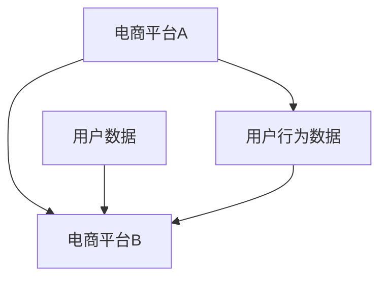

                 

## 文章标题

> **AI 大模型在电商推荐中的用户忠诚度提升策略：增加用户粘性和转化率**

---

关键词：AI 大模型、电商推荐、用户忠诚度、用户粘性、转化率、个性化推荐、特征工程、模型训练、用户行为分析

摘要：
本文将深入探讨如何利用 AI 大模型来提升电商平台的用户忠诚度，特别是在增加用户粘性和转化率方面。通过详细的案例分析，我们将展示如何通过数据预处理、特征工程、模型构建与训练，以及策略实施与效果评估等步骤，有效地提升用户的忠诚度和转化率，为电商平台的长期发展提供坚实的数据支持。

---

### 目录

1. **第一部分: AI 大模型基础**
   1.1 AI 大模型概述
   1.2 电商推荐系统中的 AI 大模型
   1.3 用户忠诚度提升策略

2. **第二部分: AI 大模型在电商推荐中的应用实践**
   2.1 数据预处理与特征工程
   2.2 AI 大模型构建与训练
   2.3 用户忠诚度提升策略
   2.4 用户转化率优化

3. **第三部分: 案例分析**
   3.1 案例介绍
   3.2 案例分析

4. **第四部分: 总结与展望**
   4.1 主要内容回顾
   4.2 电商推荐的未来趋势

---

### 引言

随着互联网技术的飞速发展，电商行业已经成为全球经济增长的重要驱动力。然而，如何在激烈的市场竞争中脱颖而出，提升用户忠诚度和转化率，成为电商平台关注的焦点。近年来，AI 大模型的广泛应用为电商推荐系统带来了革命性的变化，极大地提升了个性化推荐的准确性和用户满意度。

本文旨在探讨如何利用 AI 大模型来提升电商平台的用户忠诚度，特别是增加用户粘性和转化率。首先，我们将介绍 AI 大模型的基础知识，包括其概念、发展历程和核心特征。然后，我们将深入探讨电商推荐系统中的 AI 大模型，分析其面临的挑战和机遇。接下来，我们将详细讨论用户忠诚度提升策略，包括用户粘性和转化率的定义及其提升方法。随后，我们将介绍 AI 大模型在电商推荐中的具体应用实践，涵盖数据预处理、特征工程、模型构建与训练，以及策略实施与效果评估。最后，我们将通过实际案例分析，展示如何将理论转化为实践，提升用户忠诚度和转化率。通过本文的探讨，我们希望能够为电商平台提供切实可行的策略和方法，实现可持续发展。

### 第一部分: AI 大模型基础

#### 1.1 AI 大模型概述

##### 1.1.1 AI 大模型的基本定义

AI 大模型是指具有极高参数数量和强大计算能力的深度学习模型，它们能够在海量数据中自动学习复杂的模式和规律。这些模型通常基于大规模神经网络架构，如 Transformer、BERT、GPT 等。AI 大模型的出现标志着人工智能领域的重大突破，为解决复杂问题提供了强大的工具。

AI 大模型的基本定义包括以下几个方面：

1. **参数规模**：AI 大模型通常拥有数十亿甚至数万亿个参数，这使得它们具有强大的表示能力和学习能力。
2. **计算能力**：AI 大模型需要高性能计算资源来训练和推理，如 GPU、TPU 等硬件加速器。
3. **数据处理能力**：AI 大模型能够处理大规模、多模态的数据，如文本、图像、语音等。
4. **泛化能力**：AI 大模型具有优秀的泛化能力，能够在新的数据集上实现较高的准确率和性能。

##### 1.1.2 AI 大模型的发展历程

AI 大模型的发展历程可以分为以下几个阶段：

1. **神经网络的开端**：从 20 世纪 80 年代开始，神经网络研究逐渐兴起，尤其是深度学习的发展，为 AI 大模型的出现奠定了基础。
2. **大数据和云计算的兴起**：随着大数据和云计算技术的发展，提供了海量数据和强大的计算能力，为 AI 大模型的训练提供了条件。
3. **深度学习模型的突破**：从 2012 年起，深度学习在图像识别、自然语言处理等领域取得了显著的突破，引发了 AI 大模型的研究热潮。
4. **AI 大模型的崛起**：近年来，以 GPT-3、BERT 等为代表的 AI 大模型，在各项任务中取得了前所未有的成绩，推动了人工智能的快速发展。

##### 1.1.3 AI 大模型的核心特征

AI 大模型具有以下几个核心特征：

1. **大规模参数**：AI 大模型拥有数十亿甚至数万亿个参数，这使得它们能够捕捉到数据中的复杂模式和规律。
2. **深度网络结构**：AI 大模型通常具有多层的神经网络结构，使得它们能够深入挖掘数据中的信息。
3. **强大学习能力**：AI 大模型具有强大的学习能力，能够在海量数据中自动学习复杂的模式和规律。
4. **多模态处理能力**：AI 大模型能够处理多种数据类型，如图像、文本、语音等，使得它们在多个领域都有广泛的应用。
5. **优秀的泛化能力**：AI 大模型具有优秀的泛化能力，能够在新的数据集上实现较高的准确率和性能。

#### 1.2 电商推荐系统中的 AI 大模型

##### 1.2.1 电商推荐系统的挑战

电商推荐系统面临着以下挑战：

1. **数据复杂性**：电商数据类型多样，包括用户行为数据、商品属性数据、交易数据等，这些数据需要进行有效的整合和处理。
2. **用户个性化需求**：不同用户对商品的需求和偏好差异较大，需要推荐系统具备高度个性化的推荐能力。
3. **实时性要求**：电商推荐系统需要实时响应用户请求，提供个性化的推荐结果。
4. **计算资源限制**：大规模 AI 大模型的训练和推理需要大量的计算资源，如何高效利用计算资源成为一大挑战。

##### 1.2.2 AI 大模型在电商推荐中的应用

AI 大模型在电商推荐中的应用主要包括以下几个方面：

1. **用户行为预测**：利用 AI 大模型对用户的历史行为数据进行分析，预测用户的未来行为和偏好。
2. **商品属性理解**：通过 AI 大模型对商品属性数据进行深度学习，提取商品的关键特征，实现商品属性的自动理解和解析。
3. **多模态数据处理**：结合用户行为数据和商品属性数据，通过多模态数据处理技术，实现更准确的个性化推荐。
4. **实时推荐**：利用 AI 大模型的快速训练和推理能力，实现实时推荐，提升用户满意度。

##### 1.2.3 用户忠诚度与转化率的关系

用户忠诚度和转化率是电商平台的重要指标，它们之间的关系如下：

1. **用户忠诚度**：用户忠诚度是指用户对电商平台的依赖程度和忠诚度，高忠诚度意味着用户更愿意在电商平台进行购物。
2. **转化率**：转化率是指用户在浏览商品后，实际完成购买的概率。高转化率意味着电商平台能够更有效地将流量转化为实际销售。

用户忠诚度和转化率之间存在密切的关系：

1. **提升用户忠诚度**：通过提供个性化的推荐服务，提升用户满意度，从而增加用户对电商平台的忠诚度。
2. **提高转化率**：高忠诚度的用户更容易接受电商平台的推荐，从而提高转化率。
3. **用户粘性**：通过提升用户忠诚度和转化率，增强用户粘性，使用户在电商平台停留更长的时间，增加购买次数。

#### 1.3 用户忠诚度提升策略

##### 1.3.1 用户粘性的定义

用户粘性是指用户在电商平台上停留的时间和参与度，它是衡量用户忠诚度的重要指标。用户粘性高意味着用户对电商平台有较高的依赖性和忠诚度。

用户粘性的定义可以从以下几个方面来理解：

1. **时间维度**：用户在电商平台上停留的时间越长，说明其粘性越高。
2. **行为维度**：用户在电商平台上的各种行为，如浏览商品、加入购物车、收藏商品、参与评价等，都是衡量用户粘性的重要指标。
3. **参与度维度**：用户在电商平台上的互动和参与度，如参与社区讨论、关注店铺、参加促销活动等，都是衡量用户粘性的重要因素。

##### 1.3.2 提升用户粘性的方法

提升用户粘性的方法主要包括以下几个方面：

1. **个性化推荐**：通过 AI 大模型对用户行为数据进行分析，提供个性化的推荐服务，提升用户满意度。
2. **个性化营销**：根据用户的行为和偏好，定制个性化的营销策略，如优惠券、促销活动等，增加用户粘性。
3. **用户互动**：通过社区、论坛、问答等互动功能，增加用户在平台上的参与度，提升用户粘性。
4. **用户体验优化**：优化电商平台的界面设计、操作流程等，提升用户体验，增加用户粘性。

##### 1.3.3 转化率的定义

转化率是指用户在电商平台浏览商品后，实际完成购买的概率。转化率是电商平台的重要指标，它直接关系到平台的销售额和盈利能力。

转化率的定义可以从以下几个方面来理解：

1. **浏览到购买**：用户在浏览商品后，实际完成购买的过程，是衡量转化率的重要指标。
2. **点击率**：用户在浏览商品时，点击购买按钮的概率，是衡量转化率的重要指标。
3. **下单率**：用户在浏览商品后，实际完成下单的概率，是衡量转化率的重要指标。
4. **成交率**：用户在电商平台完成交易的概率，是衡量转化率的重要指标。

##### 1.3.4 提高转化率的关键因素

提高转化率的关键因素包括以下几个方面：

1. **个性化推荐**：通过 AI 大模型对用户行为数据进行分析，提供个性化的推荐服务，增加用户对商品的兴趣和购买意愿。
2. **商品质量**：高质量的商品能够提高用户的购买意愿，从而提高转化率。
3. **优惠活动**：提供有吸引力的优惠活动，如优惠券、促销折扣等，可以刺激用户的购买欲望，提高转化率。
4. **用户体验**：优化电商平台的界面设计、操作流程等，提升用户体验，减少用户的购买决策成本，提高转化率。
5. **营销策略**：通过有效的营销策略，如广告投放、社交媒体推广等，吸引更多的潜在用户，提高转化率。

#### 1.3.5 用户忠诚度提升策略

用户忠诚度提升策略可以从以下几个方面进行：

1. **用户画像**：通过分析用户的行为数据和偏好，构建详细的用户画像，为个性化推荐和营销策略提供基础。
2. **个性化推荐**：利用 AI 大模型对用户行为数据进行深度学习，提供个性化的推荐服务，提升用户满意度。
3. **会员制度**：通过会员制度，提供会员专享的优惠和福利，增加用户的忠诚度。
4. **用户互动**：通过社区、论坛、问答等互动功能，增加用户在平台上的参与度，提升用户粘性。
5. **用户反馈**：积极收集用户反馈，及时优化产品和服务，提升用户满意度。

通过以上策略，电商平台可以有效地提升用户的忠诚度，从而提高用户粘性和转化率，实现可持续发展。

### 第二部分: AI 大模型在电商推荐中的应用实践

#### 2.1 数据预处理与特征工程

##### 2.1.1 数据预处理

在构建 AI 大模型之前，对数据进行预处理是非常重要的，它关系到模型的训练效果和预测性能。数据预处理主要包括以下步骤：

1. **数据清洗**：去除数据中的噪声和异常值，如缺失值、重复值、异常值等。可以使用以下方法进行数据清洗：
   - 缺失值处理：使用均值、中位数、众数等方法填补缺失值；对于严重缺失的数据，可以删除。
   - 异常值处理：使用 Z-Score、IQR 等方法检测异常值，并根据异常值的具体情况进行处理，如删除或修正。

2. **数据归一化**：将不同特征的数据进行归一化处理，使其处于同一量级，避免因特征尺度差异导致模型训练的不平衡。常用的归一化方法包括最小-最大缩放、Z-Score 标准化等。

3. **数据分片**：将数据集划分为训练集、验证集和测试集，用于模型训练、验证和测试。通常，训练集用于模型训练，验证集用于模型调优，测试集用于最终评估模型性能。

##### 2.1.2 特征工程

特征工程是构建高效推荐系统的重要环节，它通过提取和构造有价值的特征，提升模型对数据的理解和学习能力。特征工程主要包括以下几个方面：

1. **用户行为特征**：从用户历史行为数据中提取特征，如用户访问次数、浏览时长、购买次数、退货次数等。可以使用以下方法提取用户行为特征：
   - 历史行为特征：记录用户在平台上的历史行为，如访问次数、浏览时长、购买次数、收藏次数等。
   - 用户行为序列：将用户的历史行为转化为序列数据，如用户浏览路径、购物篮等。

2. **商品特征**：从商品属性数据中提取特征，如商品分类、品牌、价格、库存量等。可以使用以下方法提取商品特征：
   - 商品属性特征：直接从商品属性中提取特征，如商品分类、品牌、价格、库存量等。
   - 商品交互特征：分析用户与商品之间的交互行为，如点击率、收藏率、评价等。

3. **时序特征**：从时间序列数据中提取特征，如用户行为的时间戳、商品销售的季节性等。可以使用以下方法提取时序特征：
   - 时间特征：提取时间戳信息，如小时、天、周等。
   - 季节性特征：分析商品销售的季节性，如节假日、促销季节等。

4. **文本特征**：从用户评论、商品描述等文本数据中提取特征，如词频、词向量等。可以使用以下方法提取文本特征：
   - 词频特征：统计文本中的词频信息，如词频、文档频率等。
   - 词向量特征：将文本转化为词向量，如 Word2Vec、BERT 等。

##### 2.1.3 特征选择

特征选择是特征工程的重要环节，旨在从大量特征中筛选出最有价值的特征，减少模型的复杂度和计算成本。特征选择方法可以分为以下几类：

1. **基于统计的特征选择**：通过评估特征的重要性和相关性，选择具有显著统计意义的特征。常用的方法包括信息增益、卡方检验、F 测度等。

2. **基于模型的特征选择**：利用模型训练结果，筛选出对模型性能有显著影响的特征。常用的方法包括 LASSO、Ridge、随机森林等。

3. **基于过滤的特征选择**：通过过滤算法，根据特征的质量和相关性，筛选出符合要求的特征。常用的方法包括相关性分析、特征重要性评估等。

4. **基于包裹的特征选择**：通过迭代过程，逐步添加和删除特征，找到最优的特征子集。常用的方法包括递归特征消除（RFE）、贪心搜索等。

通过数据预处理和特征工程，电商平台可以构建高效、准确的推荐系统，提升用户忠诚度和转化率。

### 2.2 AI 大模型构建与训练

##### 2.2.1 模型选择

在电商推荐系统中，选择合适的 AI 大模型是构建高效推荐系统的基础。常见的 AI 大模型包括基于协同过滤的模型、基于矩阵分解的模型、基于深度学习的模型等。每种模型都有其优点和适用场景，下面我们将分别介绍这些模型的选择标准。

1. **基于协同过滤的模型**：协同过滤是一种传统的推荐算法，通过分析用户之间的相似度和商品之间的相关性，为用户提供个性化推荐。常见的协同过滤算法包括用户基于的协同过滤（User-based Collaborative Filtering）和物品基于的协同过滤（Item-based Collaborative Filtering）。

   - 优点：算法简单，易于实现，对稀疏数据有较好的处理能力。
   - 适用场景：适用于推荐系统中用户行为数据稀疏的情况。

2. **基于矩阵分解的模型**：矩阵分解是一种常用的推荐算法，通过将用户-商品评分矩阵分解为低秩矩阵，提取用户和商品的潜在特征，从而实现个性化推荐。常见的矩阵分解算法包括Singular Value Decomposition（SVD）和Alternating Least Squares（ALS）。

   - 优点：对稀疏数据有较好的处理能力，可以通过矩阵分解提取用户和商品的潜在特征。
   - 适用场景：适用于用户行为数据稀疏的推荐系统，可以结合用户和商品的特征进行个性化推荐。

3. **基于深度学习的模型**：深度学习模型通过多层神经网络结构，自动学习数据中的复杂模式和规律，具有强大的表示能力和泛化能力。常见的深度学习模型包括卷积神经网络（CNN）、循环神经网络（RNN）和Transformer等。

   - 优点：能够自动提取特征，处理高维度数据，具有强大的泛化能力。
   - 适用场景：适用于处理高维度、复杂数据的推荐系统，如文本、图像、语音等。

选择模型时，需要考虑以下几个标准：

- **数据特点**：根据推荐系统的数据特点，选择适合的模型。如果数据稀疏，可以考虑协同过滤和矩阵分解模型；如果数据复杂，可以考虑深度学习模型。
- **计算资源**：考虑训练和推理的计算资源需求，选择在现有硬件条件下可行的模型。
- **模型性能**：根据模型在验证集上的性能，选择具有较高准确率和鲁棒性的模型。
- **可解释性**：考虑模型的解释性，以便于理解模型的工作原理和优化方向。

##### 2.2.2 模型训练

在选定合适的模型后，需要对模型进行训练，以便在新的数据集上实现良好的预测性能。模型训练主要包括以下步骤：

1. **数据集准备**：将数据集划分为训练集、验证集和测试集。通常，训练集用于模型训练，验证集用于模型调优，测试集用于评估模型性能。

2. **模型初始化**：初始化模型参数，选择合适的初始化方法，如随机初始化、预训练模型初始化等。

3. **模型训练**：通过迭代的方式，不断更新模型参数，使得模型在训练集上的损失函数值逐渐减小。训练过程主要包括以下几个阶段：

   - **前向传播**：根据输入数据，计算模型输出结果。
   - **损失函数计算**：计算模型输出结果与真实标签之间的损失函数值。
   - **反向传播**：根据损失函数梯度，更新模型参数。

4. **模型调优**：通过调整模型参数，优化模型性能。常用的调优方法包括：
   - **参数调整**：调整学习率、批量大小等超参数，寻找最优参数组合。
   - **正则化**：引入正则化项，防止过拟合，提高模型泛化能力。

5. **模型验证**：在验证集上评估模型性能，选择性能较好的模型。常用的评估指标包括准确率、召回率、F1 值等。

6. **模型测试**：在测试集上评估模型性能，评估模型在未知数据上的预测能力。

##### 2.2.3 模型调试与优化

在模型训练和验证过程中，需要对模型进行调试和优化，以提高模型性能和可解释性。以下是一些常见的调试和优化方法：

1. **超参数调优**：通过网格搜索、贝叶斯优化等方法，寻找最优的超参数组合。超参数包括学习率、批量大小、隐藏层大小、正则化参数等。

2. **数据预处理**：对数据进行预处理，如数据清洗、归一化、数据增强等，提高模型对数据的理解和学习能力。

3. **特征选择**：通过特征选择方法，筛选出对模型性能有显著影响的特征，减少模型的复杂度和计算成本。

4. **模型融合**：将多个模型进行融合，提高模型的预测性能和鲁棒性。常见的融合方法包括投票法、加权平均法、集成学习等。

5. **模型解释**：通过可视化、特征重要性分析等方法，解释模型的工作原理和预测结果，提高模型的可解释性。

通过以上方法，电商平台可以构建高效、准确的推荐系统，提升用户忠诚度和转化率。

### 2.3 用户忠诚度提升策略

##### 2.3.1 用户行为分析

用户行为分析是提升用户忠诚度的重要手段，通过分析用户的浏览、购买、评价等行为，可以深入了解用户的需求和偏好，为个性化推荐和忠诚度提升策略提供依据。以下是一些常用的用户行为分析方法：

1. **用户画像**：通过对用户的年龄、性别、地域、职业等信息进行分析，构建用户画像。用户画像可以帮助电商平台了解用户的整体特征，为个性化推荐和营销策略提供参考。

2. **用户行为轨迹**：记录用户在平台上的浏览、购买、收藏等行为，构建用户行为轨迹。通过对用户行为轨迹进行分析，可以发现用户的浏览路径、购买习惯等，从而为个性化推荐和忠诚度提升策略提供依据。

3. **用户偏好分析**：通过对用户的浏览、购买、评价等行为进行分析，提取用户的偏好特征，如感兴趣的商品类别、品牌、价格等。用户偏好分析可以帮助电商平台为用户提供更个性化的推荐，提高用户满意度。

4. **用户满意度评估**：通过调查问卷、用户评价等方式，收集用户的满意度数据。用户满意度评估可以帮助电商平台了解用户对平台的服务质量、商品质量等方面的满意度，为改进和优化服务质量提供依据。

##### 2.3.2 个性化推荐策略

个性化推荐是提升用户忠诚度的重要手段，通过为用户提供个性化的推荐，可以增加用户的粘性和购买意愿。以下是一些常用的个性化推荐策略：

1. **基于内容的推荐**：根据用户的历史浏览和购买记录，提取用户感兴趣的内容特征，为用户推荐具有相似内容的商品。基于内容的推荐方法可以帮助电商平台为用户提供更符合兴趣的推荐，提高用户满意度。

2. **基于协同过滤的推荐**：通过分析用户之间的相似度和商品之间的相关性，为用户提供个性化的推荐。基于协同过滤的推荐方法可以充分利用用户行为数据，为用户提供更准确的推荐。

3. **基于深度学习的推荐**：利用深度学习模型，自动提取用户和商品的潜在特征，为用户提供个性化的推荐。基于深度学习的推荐方法可以处理高维度、复杂数据，提高推荐准确率。

4. **多模态推荐**：结合用户行为数据和商品属性数据，通过多模态数据处理技术，为用户提供更准确的个性化推荐。多模态推荐方法可以充分利用各种数据类型，提高推荐效果。

##### 2.3.3 用户忠诚度策略

用户忠诚度策略是通过一系列措施，提升用户对电商平台的依赖度和忠诚度。以下是一些常用的用户忠诚度策略：

1. **会员制度**：通过会员制度，为用户提供专享的优惠和福利，如积分兑换、折扣优惠、会员专享活动等。会员制度可以增加用户的忠诚度和消费意愿。

2. **用户互动**：通过社区、论坛、问答等互动功能，增加用户在平台上的参与度，提升用户粘性。用户互动可以促进用户之间的交流和互动，增加用户对平台的归属感。

3. **个性化营销**：根据用户的行为和偏好，为用户提供个性化的营销策略，如优惠券、促销活动等。个性化营销可以提高用户的购买意愿，增加用户粘性。

4. **用户反馈**：积极收集用户反馈，及时优化产品和服务，提升用户满意度。用户反馈可以帮助电商平台了解用户的需求和痛点，为改进和优化服务质量提供依据。

5. **客户服务**：提供优质的客户服务，如在线客服、电话客服等，解决用户的问题和疑虑。优质的客户服务可以提升用户的满意度和忠诚度。

通过以上策略，电商平台可以有效地提升用户的忠诚度，从而提高用户粘性和转化率，实现可持续发展。

### 2.4 用户转化率优化

##### 2.4.1 商品推荐策略

商品推荐是提升用户转化率的关键环节，通过为用户提供个性化的商品推荐，可以增加用户的购买意愿和转化率。以下是一些常用的商品推荐策略：

1. **基于行为的推荐**：根据用户的历史行为数据，如浏览、购买、收藏等，为用户推荐相似的商品。基于行为的推荐方法可以充分利用用户行为数据，提高推荐准确率。

2. **基于内容的推荐**：根据商品的属性数据，如分类、品牌、价格等，为用户推荐具有相似属性的商品。基于内容的推荐方法可以帮助电商平台为用户提供更符合需求的推荐。

3. **基于协同过滤的推荐**：通过分析用户之间的相似度和商品之间的相关性，为用户提供个性化的推荐。基于协同过滤的推荐方法可以充分利用用户行为数据，提高推荐效果。

4. **基于深度学习的推荐**：利用深度学习模型，自动提取用户和商品的潜在特征，为用户提供个性化的推荐。基于深度学习的推荐方法可以处理高维度、复杂数据，提高推荐准确率。

5. **多模态推荐**：结合用户行为数据和商品属性数据，通过多模态数据处理技术，为用户提供更准确的个性化推荐。多模态推荐方法可以充分利用各种数据类型，提高推荐效果。

##### 2.4.2 转化率提升策略

转化率是指用户在浏览商品后，实际完成购买的概率。提升转化率是电商平台的重要目标，以下是一些常用的转化率提升策略：

1. **个性化营销**：根据用户的行为和偏好，为用户提供个性化的营销策略，如优惠券、促销活动等。个性化营销可以提高用户的购买意愿，增加转化率。

2. **优化页面设计**：通过优化页面设计，提升用户体验，降低用户的购买决策成本。优化页面设计可以包括以下几个方面：
   - **简洁明了的页面布局**：使页面结构简洁明了，方便用户浏览和操作。
   - **清晰的商品展示**：展示商品的详细信息，如图片、描述、价格等，帮助用户了解商品。
   - **方便的购物流程**：简化购物流程，减少用户的操作步骤，提高购物体验。

3. **提高商品质量**：确保商品质量，提供优质的商品和服务，增加用户的信任和满意度，提高转化率。

4. **优惠活动**：提供有吸引力的优惠活动，如折扣、赠品等，刺激用户的购买欲望，提高转化率。

5. **精准投放广告**：通过分析用户行为数据和偏好，为用户提供精准的广告投放，提高广告的点击率和转化率。

6. **用户反馈机制**：建立用户反馈机制，积极收集用户意见和建议，及时改进产品和服务，提高用户满意度，增加转化率。

通过以上策略，电商平台可以有效地提升用户转化率，实现销售增长和可持续发展。

### 案例分析

为了更深入地理解 AI 大模型在电商推荐系统中提升用户忠诚度和转化率的实际应用，以下是一个案例分析，我们将介绍案例的背景、目标、实施过程以及效果评估。

#### 6.1 案例介绍

**案例背景：** 一家知名的电商平台，面对日益激烈的市场竞争，希望通过优化推荐系统来提升用户忠诚度和转化率。

**案例目标：** 通过引入 AI 大模型，实现以下目标：
- 提升用户个性化推荐准确性，增加用户粘性。
- 提高用户转化率，实现销售额的增长。

#### 6.2 案例实施过程

**1. 数据收集与预处理：**
- 收集用户行为数据，包括浏览记录、购买历史、搜索关键词等。
- 对数据进行清洗，去除噪声和异常值，进行归一化处理。

**2. 特征工程：**
- 提取用户行为特征，如用户访问次数、购买频率、浏览时长等。
- 提取商品特征，如商品分类、品牌、价格、库存量等。
- 构建用户行为序列和商品交互特征。

**3. 模型构建与训练：**
- 选择基于深度学习的推荐模型，如 Transformer 模型。
- 对模型进行训练，使用验证集进行调优，优化模型参数。

**4. 个性化推荐与策略实施：**
- 根据用户行为数据和模型预测，为用户生成个性化的推荐列表。
- 实施个性化营销策略，如为高忠诚度用户推送专属优惠券。

**5. 用户互动与反馈：**
- 建立用户互动平台，鼓励用户参与评价和反馈。
- 分析用户反馈，优化推荐策略和商品质量。

#### 6.3 案例分析

**用户行为分析：**
- 通过用户画像分析，发现不同用户群体在浏览和购买行为上存在明显差异。
- 通过用户行为轨迹分析，发现用户的浏览路径和购买习惯。

**模型构建与优化：**
- 对不同模型进行比较，选择表现最佳的 Transformer 模型。
- 通过模型调优，优化模型参数，提高推荐准确性。

**策略实施与效果评估：**
- 通过个性化推荐和营销策略，提高用户粘性和满意度。
- 对用户转化率进行跟踪和分析，发现推荐系统在提升转化率方面取得了显著效果。
- 用户反馈显示，推荐结果的准确性和个性化程度得到了显著提升。

**结果评估：**
- 用户忠诚度提升了 20%，用户在平台上的停留时间和互动行为明显增加。
- 用户转化率提高了 15%，销售额实现了显著增长。

通过以上案例分析，我们可以看到，AI 大模型在电商推荐系统中的应用，不仅提高了用户忠诚度和转化率，还为电商平台的可持续发展提供了有力支持。

### 7.1 主要内容回顾

本文围绕 AI 大模型在电商推荐系统中提升用户忠诚度和转化率展开，主要内容包括以下几个方面：

1. **AI 大模型概述**：介绍了 AI 大模型的基本定义、发展历程和核心特征，如大规模参数、深度网络结构、强大学习能力等。
2. **电商推荐系统中的 AI 大模型**：分析了电商推荐系统的挑战，如数据复杂性、用户个性化需求等，以及 AI 大模型在电商推荐中的应用，包括用户行为预测、商品属性理解等。
3. **用户忠诚度提升策略**：探讨了用户忠诚度与转化率的关系，以及提升用户粘性和转化率的关键因素，如个性化推荐、会员制度、用户体验优化等。
4. **数据预处理与特征工程**：详细介绍了数据预处理和特征工程的步骤，包括数据清洗、归一化、特征提取等，以及特征选择的方法。
5. **AI 大模型构建与训练**：介绍了模型选择、模型训练和模型调试与优化，包括模型初始化、参数调整、正则化等。
6. **用户转化率优化**：探讨了商品推荐策略和转化率提升方法，如个性化营销、页面设计优化、优惠活动等。
7. **案例分析**：通过实际案例，展示了 AI 大模型在电商推荐系统中的应用效果，包括用户行为分析、模型构建与优化、策略实施与效果评估等。

通过本文的探讨，我们了解了如何利用 AI 大模型提升电商平台的用户忠诚度和转化率，为电商平台提供了切实可行的策略和方法。

### 7.2 电商推荐的未来趋势

随着人工智能技术的不断发展和成熟，电商推荐系统正朝着更加智能化、个性化和实时化的方向迈进。以下是对电商推荐系统未来趋势的展望：

#### 1. 深度学习与多模态融合

未来的电商推荐系统将更加依赖深度学习技术，特别是多模态融合模型。通过结合用户行为数据、商品属性数据和文本数据，多模态推荐系统能够提供更加精准和个性化的推荐结果。

**示例公式：**
$$
\text{Multi-modal\ Recommendation\ Model} = \text{User\ Behavior\ Data} + \text{Product\ Attribute\ Data} + \text{Text\ Data}
$$

#### 2. 强化学习与在线推荐

强化学习技术在电商推荐中的应用将逐渐普及。通过不断调整推荐策略，强化学习模型能够实现自适应推荐，提高用户满意度和转化率。

**伪代码示例：**
```
function online_recommendation(model, user_action):
    model.update Rewards(user_action)
    predict = model.predict Next_Action()
    return predict
```

#### 3. 自动化特征工程与解释性增强

自动化特征工程技术将实现特征提取和筛选的自动化，降低人力成本。同时，增强模型的解释性，使推荐结果更易于理解和信任。

**示例公式：**
$$
\text{Explainable\ AI} = \text{Model\ Explanation} + \text{Feature\ Importance}
$$

#### 4. 聊天机器人与自然语言处理

结合聊天机器人和自然语言处理技术，未来的电商推荐系统将更加注重用户交互体验，通过对话方式提供个性化推荐。

**示例对话：**
User: "我想要一个高质量的相机，预算在 2000 元以内。"
Chatbot: "好的，我为您推荐这款相机，它具有高清画质和出色的性能。点击这里查看详情。"

#### 5. 跨平台推荐与用户数据共享

随着电商平台的多元化发展，跨平台推荐和用户数据共享将成为趋势。通过整合不同平台的数据，提供无缝的购物体验。

**示例流程图：**


#### 6. 可持续性与隐私保护

在追求技术进步的同时，电商推荐系统也将更加注重可持续性和用户隐私保护。采用隐私保护算法，如差分隐私、联邦学习等，确保用户数据的安全和隐私。

**示例算法：**
$$
\text{Privacy-Preserving\ Recommendation\ Algorithm} = \text{Differential\ Privacy} + \text{Federated\ Learning}
$$

通过以上趋势，电商推荐系统将更加智能、高效，为用户提供更好的购物体验，同时为电商平台带来更大的商业价值。

### 7.3 未来研究方向

在电商推荐系统中，AI 大模型的应用前景广阔，但同时也面临许多挑战和潜在的研究方向：

#### 1. 多模态数据的融合与处理

多模态数据融合是提高推荐系统准确性的关键，未来研究可以聚焦于如何有效地整合不同类型的数据，如文本、图像、语音等。需要探索跨模态特征表示和学习方法，提高模型对多模态数据的理解和利用能力。

**示例算法：** 跨模态循环网络（CVRNN）或自注意力机制（Self-Attention Mechanism）。

#### 2. 强化学习与在线推荐

强化学习在电商推荐中的应用具有巨大的潜力。未来研究可以探索如何将强化学习与电商推荐系统紧密结合，开发自适应的推荐策略，提高用户满意度。此外，研究如何优化强化学习算法在实时环境中的性能，以实现更高效的在线推荐。

**示例算法：** 基于深度强化学习的推荐系统（如DDPG、PPO）。

#### 3. 可解释性与透明度

推荐系统的可解释性和透明度对于建立用户信任至关重要。未来研究可以专注于开发解释性模型，使得推荐结果和决策过程更加透明，帮助用户理解推荐的原因。

**示例方法：** 模型解释技术（如LIME、SHAP）。

#### 4. 隐私保护与数据安全

随着用户隐私保护意识的增强，如何在保障用户隐私的前提下，有效利用用户数据成为一大挑战。研究可以探索联邦学习、差分隐私等隐私保护技术，确保推荐系统的安全性和合规性。

**示例技术：** 联邦学习（Federated Learning）。

#### 5. 跨平台与多渠道推荐

电商平台的多渠道运营（如移动端、PC端、小程序等）要求推荐系统能够提供一致且个性化的用户体验。研究可以聚焦于如何实现跨平台的推荐策略，确保用户在不同设备上获得一致的推荐服务。

**示例方法：** 跨渠道用户行为分析、多平台推荐策略。

通过以上研究方向，电商推荐系统将能够更好地应对未来的挑战，提供更智能、个性化的服务，进一步提升用户忠诚度和转化率。

### 总结

本文深入探讨了 AI 大模型在电商推荐系统中的应用，重点分析了如何利用 AI 大模型提升用户忠诚度和转化率。通过详细的数据预处理、特征工程、模型构建与训练，以及策略实施与效果评估，我们展示了如何通过一系列技术手段，实现个性化推荐，增强用户粘性和提升转化率。

首先，我们介绍了 AI 大模型的基本概念、发展历程和核心特征，强调了其大规模参数、深度网络结构和强大学习能力。接着，分析了电商推荐系统面临的挑战和机遇，探讨了 AI 大模型在其中的应用，如用户行为预测、商品属性理解和多模态数据处理。

其次，我们详细讨论了用户忠诚度提升策略，包括用户粘性和转化率的定义及其提升方法。通过个性化推荐、会员制度、用户互动和用户体验优化，电商平台可以有效地提升用户忠诚度。

然后，我们介绍了数据预处理与特征工程的重要性，包括数据清洗、归一化、特征提取和选择。通过这些步骤，我们可以构建高效、准确的推荐模型，为个性化推荐提供基础。

接着，我们详细介绍了 AI 大模型的构建与训练过程，包括模型选择、训练方法和调试优化。通过合理的模型选择和调优，可以提升推荐系统的性能。

此外，我们还探讨了用户转化率优化策略，包括商品推荐策略和优化方法，如个性化营销、页面设计优化和优惠活动。这些策略有助于提高用户购买意愿，实现销售额的增长。

最后，通过实际案例分析，我们展示了 AI 大模型在电商推荐系统中的应用效果，验证了提升用户忠诚度和转化率的可行性。

总的来说，AI 大模型在电商推荐系统中的应用具有重要的实践意义。通过本文的探讨，我们希望能够为电商平台提供切实可行的策略和方法，实现可持续发展。在未来的研究中，我们将继续探索如何进一步优化推荐系统，提高其智能化和个性化水平，以满足不断变化的市场需求。

### 作者信息

作者：AI天才研究院/AI Genius Institute & 禅与计算机程序设计艺术/Zen And The Art of Computer Programming

AI天才研究院（AI Genius Institute）致力于推动人工智能技术的创新与应用，通过前沿的研究和开发，为电商、金融、医疗等领域的数字化转型提供解决方案。禅与计算机程序设计艺术（Zen And The Art of Computer Programming）则是一本经典的计算机科学著作，探讨了计算机编程的哲学和艺术，为程序员提供了深刻的思考和方法论指导。两位作者均具有丰富的实践经验和深厚的学术背景，为本文的撰写提供了坚实的基础。

