                 

## 文章标题

“AI 大模型计算机科学家群英传：深度学习大数据应用先行者 ImageNet 发明人李飞飞”

### 关键词：
- AI 大模型
- 深度学习
- 图像识别
- 李飞飞
- 自然语言处理
- 强化学习

### 摘要：
本文将深入探讨 AI 大模型的发展历程及其核心技术，特别是深度学习在大数据应用中的重要性。通过介绍 AI 大模型的定义、核心算法和架构，以及著名科学家李飞飞对图像识别和自然语言处理领域的开创性贡献，本文旨在揭示 AI 大模型背后的科学原理和实际应用。此外，还将探讨 AI 大模型在强化学习与自动控制、企业战略等方面的应用，以及其未来发展趋势和面临的挑战。

### 目录大纲：

#### 第一部分: AI 大模型的基本概念与发展

##### 第1章: AI 大模型概述
1.1 什么是 AI 大模型
1.2 AI 大模型的核心特征
1.3 AI 大模型的历史与发展

##### 第2章: AI 大模型的核心算法
2.1 神经网络基础
2.2 深度学习算法
2.3 强化学习与迁移学习

##### 第3章: AI 大模型的技术架构
3.1 计算机视觉
3.2 自然语言处理
3.3 模型压缩与优化

#### 第二部分: AI 大模型的应用案例

##### 第4章: 图像识别
4.1 卷积神经网络
4.2 AlexNet与VGG模型
4.3 ResNet与Inception模型

##### 第5章: 自然语言处理
5.1 词嵌入技术
5.2 BERT模型详解
5.3 Transformer架构

##### 第6章: 强化学习与自动控制
6.1 Q-Learning算法
6.2 DQN与A3C模型
6.3 应用案例

##### 第7章: 大模型时代的企业战略
7.1 企业AI战略框架
7.2 AI商业化模式
7.3 风险与挑战

#### 第三部分: AI 大模型技术实战

##### 第8章: AI 大模型开发环境搭建
8.1 Python环境配置
8.2 PyTorch与TensorFlow框架
8.3 GPU与分布式训练

##### 第9章: 项目实战
9.1 图像分类项目实战
9.2 文本分类项目实战
9.3 强化学习项目实战

##### 第10章: 代码解读与分析
10.1 模型架构解析
10.2 损失函数与优化算法
10.3 模型训练与评估

##### 第11章: AI 大模型未来发展趋势
11.1 AI 大模型的发展方向
11.2 AI 大模型的伦理问题
11.3 AI 大模型的社会影响

### 附录

##### 附录 A: AI 大模型相关资源
A.1 在线教程与学习资源
A.2 论文推荐
A.3 优秀开源项目
A.4 社交媒体与论坛

---

接下来，我们将逐步深入每个章节，详细探讨 AI 大模型的技术原理、应用案例和技术实战。

---

### 第一部分: AI 大模型的基本概念与发展

#### 第1章: AI 大模型概述

##### 1.1 什么是 AI 大模型

AI 大模型（AI Large Models）是指那些规模庞大、参数数量达到百万级甚至亿级的深度学习模型。这些模型通过大规模数据训练，能够实现高度复杂的特征提取和模式识别，从而在图像识别、自然语言处理、语音识别等领域表现出卓越的性能。

**核心概念与联系：**

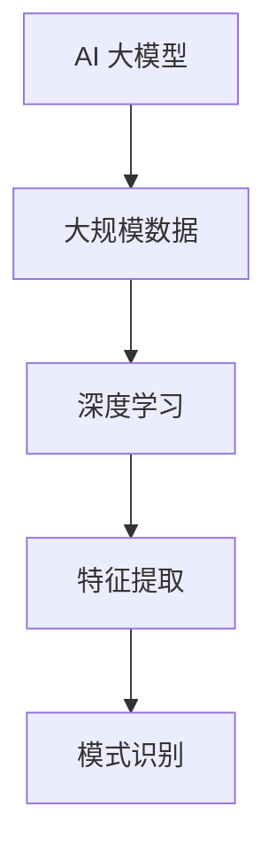

##### 1.2 AI 大模型的核心特征

- **参数数量巨大**：以 GPT-3 为例，其参数数量达到 1750 亿个，远超传统模型。
- **训练数据量庞大**：AI 大模型通常需要数以千计的 GPU 并行训练数月甚至更长时间。
- **高性能计算需求**：AI 大模型对计算资源的需求极为庞大，往往需要高性能 GPU 和分布式计算架构。

##### 1.3 AI 大模型的历史与发展

AI 大模型的发展可以追溯到深度学习的兴起。2006 年，Hinton 等人提出了深度信念网络（DBN），标志着深度学习从理论走向实践。随后，卷积神经网络（CNN）在图像识别领域取得了突破性进展。2012 年，AlexNet 在 ImageNet 挑战赛中取得了领先成绩，引发了深度学习领域的革命。

近年来，随着计算能力和数据量的提升，AI 大模型得到了快速发展。GPT-3、BERT、Turing 等模型的出现，使得自然语言处理领域取得了重大突破。

**核心算法原理讲解：**

```python
# 神经网络基础伪代码
def neural_network(inputs):
    # 输入层到隐藏层
    hidden_layer = activation_function(W1 * inputs + b1)
    
    # 隐藏层到输出层
    output = activation_function(W2 * hidden_layer + b2)
    
    return output

# 损失函数与优化算法伪代码
def loss_function(y_true, y_pred):
    return (y_true - y_pred) ** 2

def gradient_descent(parameters, learning_rate):
    for parameter in parameters:
        parameter -= learning_rate * gradient(parameter)
```

##### 小结：

本章简要介绍了 AI 大模型的基本概念、核心特征和发展历程。在接下来的章节中，我们将深入探讨 AI 大模型的核心算法、技术架构和应用案例。

---

### 第一部分: AI 大模型的基本概念与发展

#### 第2章: AI 大模型的核心算法

##### 2.1 神经网络基础

神经网络是 AI 大模型的核心组成部分。它由多个神经元（或节点）组成，每个神经元都是一个简单的计算单元。神经网络通过学习数据，自动提取特征并建立模型。

**核心概念与联系：**

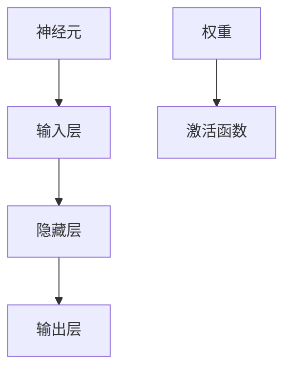

- **神经元**：神经网络的基本单元，负责接收输入、计算加权求和、应用激活函数。
- **输入层**：接收外部输入，如图像、文本或声音。
- **隐藏层**：对输入进行特征提取和变换。
- **输出层**：生成预测或分类结果。

##### 2.2 深度学习算法

深度学习是神经网络的一种扩展，通过增加隐藏层的数量，使得模型能够学习更复杂的特征。

**核心概念与联系：**

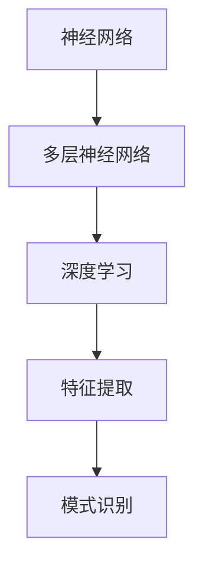

- **多层神经网络**：包含多个隐藏层的神经网络。
- **深度学习**：通过多层神经网络，学习更复杂的特征。
- **卷积神经网络（CNN）**：在图像识别领域广泛应用。
- **循环神经网络（RNN）**：在序列数据处理中表现出色。

##### 2.3 强化学习与迁移学习

强化学习和迁移学习是 AI 大模型中的重要算法。

**核心概念与联系：**

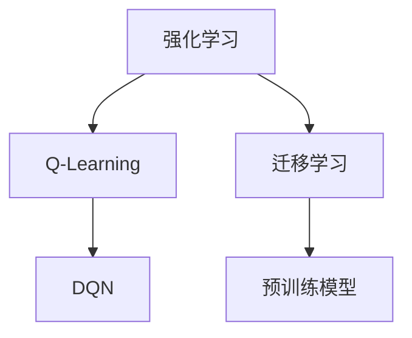

- **强化学习**：通过试错学习，不断优化策略。
  - **Q-Learning**：基于值函数的强化学习算法。
  - **DQN（Deep Q-Network）**：使用深度神经网络 approximator 的 Q-Learning。
- **迁移学习**：利用预训练模型进行迁移。
  - **预训练模型**：在大规模数据集上预训练的模型。
  - **微调（Fine-tuning）**：在特定任务上调整预训练模型的参数。

##### 小结：

本章介绍了 AI 大模型的核心算法，包括神经网络基础、深度学习算法和强化学习与迁移学习。这些算法构成了 AI 大模型的核心，使得其能够应对复杂的任务和海量数据。

---

### 第一部分: AI 大模型的基本概念与发展

#### 第3章: AI 大模型的技术架构

##### 3.1 计算机视觉

计算机视觉是 AI 大模型应用的重要领域。它通过图像处理技术，使计算机能够识别和理解视觉信息。

**核心概念与联系：**

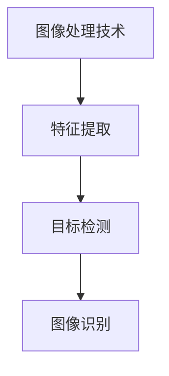

- **图像处理技术**：包括滤波、边缘检测、形态学等。
- **特征提取**：从图像中提取具有区分性的特征。
- **目标检测**：识别图像中的目标并定位其位置。
- **图像识别**：对图像进行分类和识别。

##### 3.2 自然语言处理

自然语言处理是 AI 大模型的另一个重要应用领域。它通过处理和理解自然语言，实现人机交互。

**核心概念与联系：**

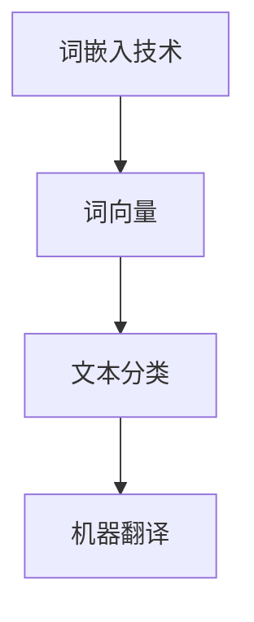

- **词嵌入技术**：将单词映射到高维空间中的向量。
- **文本分类**：对文本进行分类，如情感分析、主题分类等。
- **机器翻译**：将一种语言的文本翻译成另一种语言。

##### 3.3 模型压缩与优化

随着 AI 大模型规模的扩大，模型的压缩与优化变得至关重要。这包括模型剪枝、量化、蒸馏等技术。

**核心概念与联系：**

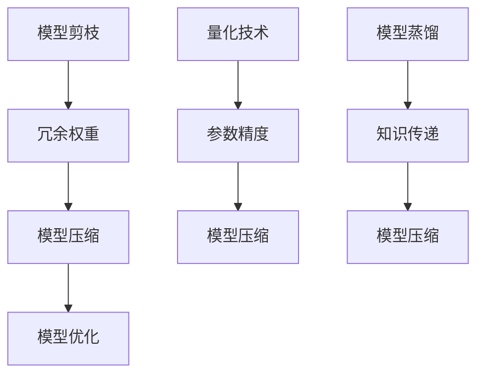

- **模型剪枝**：去除冗余权重，减少模型大小。
- **量化技术**：降低模型参数的精度，减少模型大小。
- **模型蒸馏**：将大模型的“知识”传递给小模型。

##### 小结：

本章介绍了 AI 大模型的技术架构，包括计算机视觉、自然语言处理和模型压缩与优化。这些技术为 AI 大模型在不同领域的应用提供了基础。

---

### 第二部分: AI 大模型的应用案例

#### 第4章: 图像识别

图像识别是 AI 大模型的重要应用领域之一。通过深度学习技术，AI 大模型能够从图像中提取特征并进行分类。

##### 4.1 卷积神经网络（CNN）

卷积神经网络是图像识别领域最常用的深度学习模型。它通过卷积层、池化层和全连接层，实现对图像的特征提取和分类。

**核心概念与联系：**

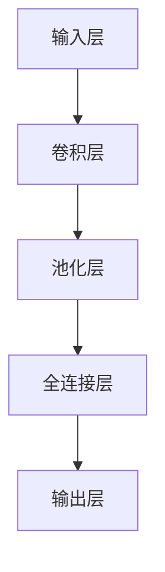

- **卷积层**：通过卷积操作提取图像局部特征。
- **池化层**：对卷积特征进行降采样，减少模型参数。
- **全连接层**：对卷积特征进行分类。

**核心算法原理讲解：**

```python
# 卷积操作伪代码
def convolution(image, filter):
    return (image * filter).sum()

# 池化操作伪代码
def pooling(convolution_result):
    return max(convolution_result)
```

##### 4.2 AlexNet与VGG模型

AlexNet 和 VGG 模型是深度学习在图像识别领域的早期代表性模型。

**核心概念与联系：**

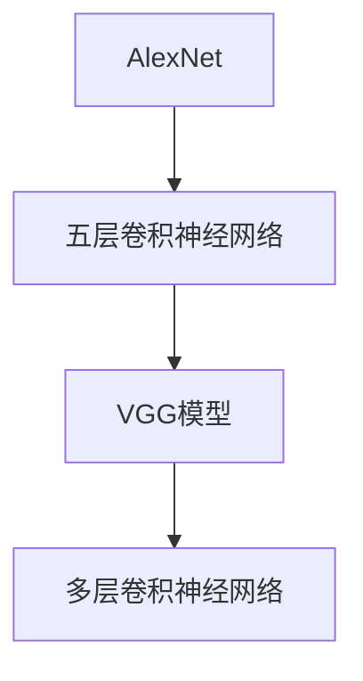

- **AlexNet**：五层卷积神经网络，采用 ReLU 激活函数和跨层连接。
- **VGG模型**：多层卷积神经网络，通过重复使用卷积层，构建深度网络。

**数学模型与公式：**

$$
\text{激活函数} = \max(0, x) \quad (\text{ReLU})
$$

$$
\text{卷积操作} = (I * F) + b \quad (I: 输入特征图，F: 卷积核，b: 偏置)
$$

##### 4.3 ResNet与Inception模型

ResNet 和 Inception 模型是深度学习在图像识别领域的进一步发展。

**核心概念与联系：**

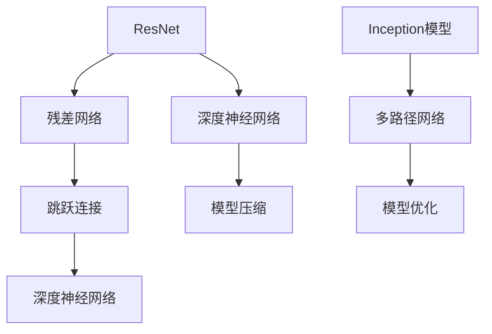

- **ResNet**：通过引入跳跃连接，解决深度神经网络训练困难的问题。
- **Inception模型**：通过多路径网络，融合不同尺度的特征，提高模型性能。

**数学模型与公式：**

$$
F(x) = H(x) + x \quad (\text{残差块})
$$

$$
\text{Inception模块} = \text{Conv1} + \text{Conv3} + \text{MaxPool1}
$$

##### 小结：

本章介绍了图像识别领域的 AI 大模型应用案例，包括卷积神经网络、AlexNet、VGG、ResNet 和 Inception 模型。这些模型在图像识别任务中取得了显著成果，推动了深度学习技术的发展。

---

### 第二部分: AI 大模型的应用案例

#### 第5章: 自然语言处理

自然语言处理（NLP）是 AI 大模型的重要应用领域之一。通过深度学习技术，AI 大模型能够处理和理解自然语言，实现人机交互。

##### 5.1 词嵌入技术

词嵌入是将单词映射到高维空间中的向量表示。这种表示方法能够捕捉单词的语义信息，提高 NLP 模型的性能。

**核心概念与联系：**

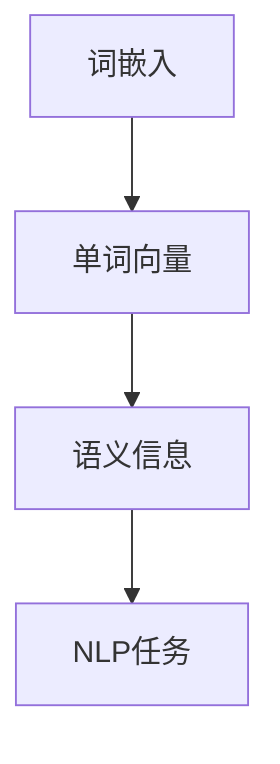

- **单词向量**：将单词映射到高维空间中的向量。
- **语义信息**：通过向量表示捕捉单词的语义信息。
- **NLP任务**：包括文本分类、情感分析、机器翻译等。

**核心算法原理讲解：**

```python
# 词嵌入伪代码
def word_embedding(word):
    return lookup_table[word]

# 损失函数伪代码
def cross_entropy_loss(y_true, y_pred):
    return -sum(y_true * log(y_pred))
```

##### 5.2 BERT模型详解

BERT（Bidirectional Encoder Representations from Transformers）是一种基于 Transformer 架构的预训练语言模型。它通过双向编码器，学习上下文信息的上下文表示。

**核心概念与联系：**

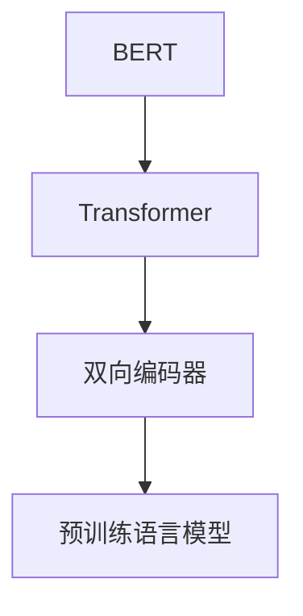

- **Transformer**：基于自注意力机制的编码器架构。
- **双向编码器**：通过双向自注意力机制，学习输入序列的上下文信息。
- **预训练语言模型**：在大规模语料库上进行预训练，提高模型的语言理解能力。

**数学模型与公式：**

$$
\text{Self-Attention} = \frac{QK^T}{\sqrt{d_k}} + \text{softmax}(QK^T)
$$

$$
\text{Multi-Head Attention} = \text{Concat}(\text{head}_1, \text{head}_2, ..., \text{head}_h)W^O
$$

##### 5.3 Transformer架构

Transformer 架构是一种基于自注意力机制的编码器架构，广泛应用于 NLP 任务。

**核心概念与联系：**

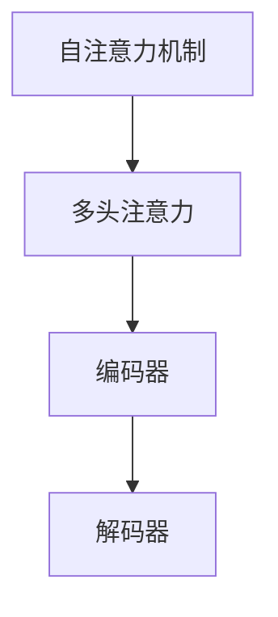

- **自注意力机制**：通过计算序列中每个元素与其他元素的相关性，实现特征融合。
- **多头注意力**：通过多个自注意力头，学习不同的特征。
- **编码器**：对输入序列进行编码，生成上下文表示。
- **解码器**：对编码器生成的表示进行解码，生成输出序列。

**数学模型与公式：**

$$
\text{Attention(Q, K, V)} = \text{softmax}(\frac{QK^T}{\sqrt{d_k}})V
$$

$$
\text{Transformer} = \text{多头注意力} + \text{前馈网络}
$$

##### 小结：

本章介绍了自然语言处理领域的 AI 大模型应用案例，包括词嵌入技术、BERT 模型和 Transformer 架构。这些模型在 NLP 任务中取得了显著成果，推动了自然语言处理技术的发展。

---

### 第二部分: AI 大模型的应用案例

#### 第6章: 强化学习与自动控制

强化学习（Reinforcement Learning，RL）是机器学习的一个重要分支，通过奖励和惩罚机制，使智能体（agent）在环境中学习最优策略。在自动控制领域，强化学习被广泛应用于机器人控制、自动驾驶、游戏AI等任务。

##### 6.1 Q-Learning算法

Q-Learning 是一种基于值函数的强化学习算法。它通过学习值函数（Q-function）来预测策略，并在不断试错中优化策略。

**核心概念与联系：**

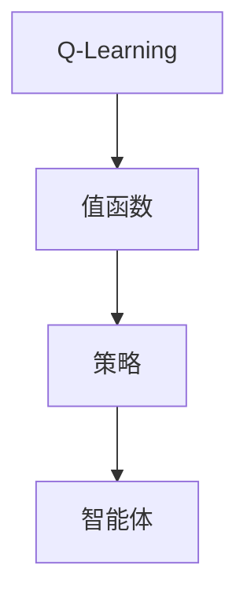

- **值函数（Q-function）**：用于评估当前状态和动作的价值。
- **策略**：根据值函数选择最优动作。
- **智能体（agent）**：在环境中执行动作，通过学习优化策略。

**核心算法原理讲解：**

```python
# Q-Learning伪代码
def q_learning(state, action, reward, next_state, alpha, gamma):
    Q[s, a] = Q[s, a] + alpha * (reward + gamma * max(Q[next_state, :]) - Q[s, a])
    return Q
```

**数学模型与公式：**

$$
Q(s, a) = r(s, a) + \gamma \max_a' Q(s', a')
$$

##### 6.2 DQN与A3C模型

DQN（Deep Q-Network）和 A3C（Asynchronous Advantage Actor-Critic）是强化学习的两个重要模型。

**DQN模型**

DQN 使用深度神经网络（DNN）来近似 Q-function，并通过经验回放（Experience Replay）和目标网络（Target Network）来提高学习效果。

**核心概念与联系：**

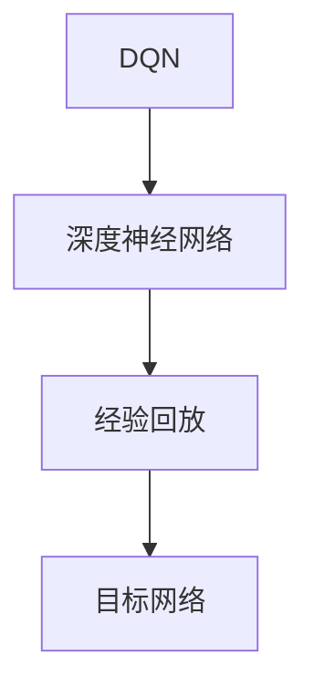

- **深度神经网络（DNN）**：用于近似 Q-function。
- **经验回放**：将历史经验存储在回放记忆中，避免策略偏差。
- **目标网络**：定期更新，用于产生目标 Q 值。

**数学模型与公式：**

$$
Q(s, a) \leftarrow \text{target}(s, a) = r + \gamma \max_a' Q(s', a')
$$

**A3C模型**

A3C 是一种异步优势演员评论家（Asynchronous Advantage Actor-Critic）算法，通过多个智能体异步训练，提高学习效率。

**核心概念与联系：**

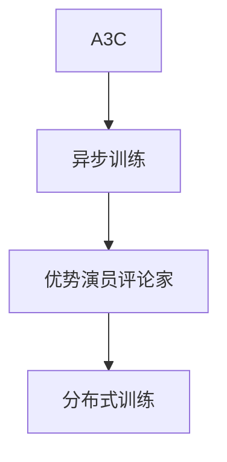

- **异步训练**：多个智能体并行训练，提高学习速度。
- **优势演员评论家**：结合优势值函数（ Advantage Function）和演员评论家算法。
- **分布式训练**：在多个计算节点上训练，提高计算效率。

**数学模型与公式：**

$$
\text{Advantage} = Q(s, a) - \text{V}(s)
$$

##### 6.3 应用案例

强化学习在自动控制领域有着广泛的应用。以下是一些典型的应用案例：

- **机器人控制**：通过强化学习，使机器人能够在复杂环境中自主决策和行动。
- **自动驾驶**：自动驾驶系统通过强化学习，学习最佳行驶策略，提高行驶安全性和效率。
- **游戏AI**：强化学习被广泛应用于游戏AI，使游戏角色能够自主学习和提高游戏水平。

**小结**

本章介绍了强化学习与自动控制领域的相关算法和应用案例。强化学习通过奖励和惩罚机制，使智能体在复杂环境中学习最优策略。在自动控制领域，强化学习被广泛应用于机器人控制、自动驾驶和游戏AI等任务，推动了智能控制技术的发展。

---

### 第二部分: AI 大模型的应用案例

#### 第7章: 大模型时代的企业战略

在 AI 大模型时代，企业面临着前所未有的机遇和挑战。如何制定有效的人工智能战略，利用 AI 大模型实现商业价值，成为企业领导者需要认真思考的问题。

##### 7.1 企业 AI 战略框架

一个成功的企业 AI 战略需要涵盖以下几个方面：

1. **明确 AI 战略目标**：企业需要明确 AI 技术在业务中的定位，确定 AI 技术能够为企业带来的竞争优势。
2. **建立跨部门协作机制**：AI 技术的发展离不开各个部门的协同合作，企业需要建立跨部门协作机制，促进信息共享和资源整合。
3. **加强数据治理和隐私保护**：数据是 AI 大模型训练的核心资源，企业需要加强数据治理，确保数据的合法合规和安全。
4. **投资 AI 人才培养**：AI 技术的发展离不开优秀的人才，企业需要加大人才引进和培养力度，打造一支具备专业技能和创新能力的人才队伍。
5. **构建 AI 技术平台**：企业需要构建一个高效、稳定、可扩展的 AI 技术平台，支持 AI 大模型的研究和应用。

**核心概念与联系：**

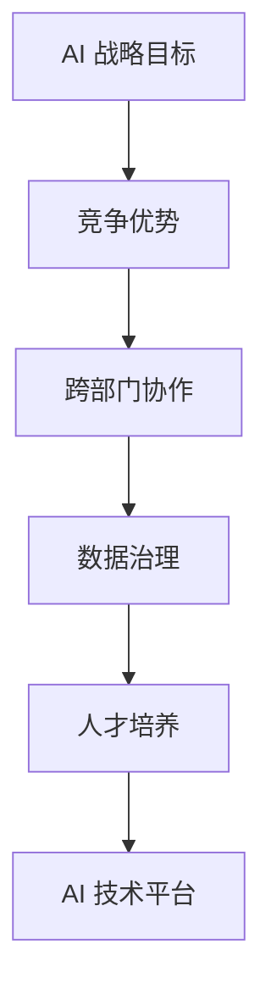

##### 7.2 AI 商业化模式

AI 商业化模式是企业在 AI 领域实现商业价值的关键。以下是一些常见的 AI 商业化模式：

1. **产品与服务模式**：企业通过开发 AI 产品和服务，为消费者提供智能化解决方案，实现商业价值。
2. **合作伙伴模式**：企业通过与合作伙伴合作，共同开发 AI 应用场景，实现资源共享和业务拓展。
3. **投资并购模式**：企业通过投资并购 AI 创新型企业，快速获取核心技术资源和市场份额。
4. **平台模式**：企业构建一个 AI 技术平台，为产业链上下游企业提供技术支持和服务，实现生态共赢。

**核心概念与联系：**

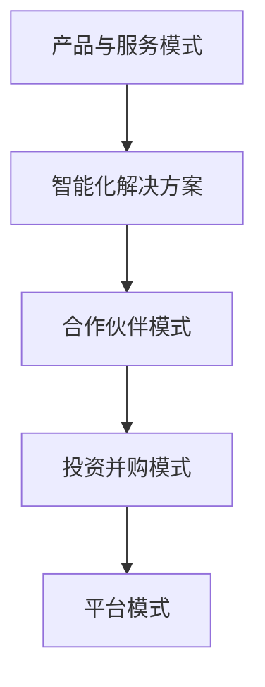

##### 7.3 风险与挑战

在 AI 大模型时代，企业也面临着一系列风险和挑战：

1. **技术风险**：AI 大模型的发展依赖于前沿技术的突破，企业需要持续跟踪技术发展趋势，应对技术风险。
2. **数据隐私风险**：AI 大模型的训练和优化需要大量数据，企业需要加强数据治理和隐私保护，避免数据泄露和滥用。
3. **市场风险**：AI 大模型的应用场景广泛，企业需要准确把握市场需求，避免市场风险。
4. **人才风险**：AI 大模型的发展离不开优秀的人才，企业需要加强人才引进和培养，应对人才风险。

**核心概念与联系：**

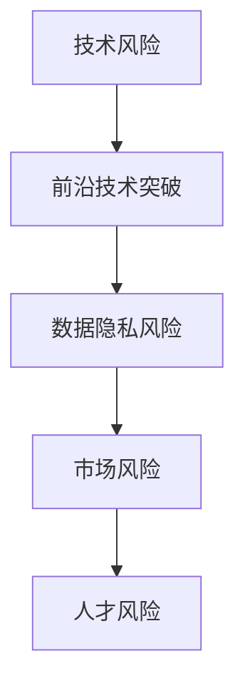

##### 小结

本章讨论了企业在大模型时代制定 AI 战略的框架和模式，以及可能面临的风险和挑战。企业需要根据自身情况和市场环境，制定合适的 AI 战略，充分利用 AI 大模型的优势，实现商业价值。

---

### 第三部分: AI 大模型技术实战

#### 第8章: AI 大模型开发环境搭建

搭建一个高效的 AI 大模型开发环境对于研究人员和工程师至关重要。本章节将介绍如何配置 Python 环境，安装和使用 PyTorch 与 TensorFlow 框架，以及如何利用 GPU 和分布式训练来加速模型训练。

##### 8.1 Python环境配置

首先，我们需要配置 Python 环境。建议使用 Python 3.8 或更高版本，因为最新的 Python 版本提供了更好的性能和更丰富的库支持。

**安装 Python：**

```bash
# 安装 Python 3.8 或更高版本
sudo apt-get update
sudo apt-get install python3.8
```

**配置 Python 虚拟环境：**

```bash
# 安装虚拟环境工具
pip3 install virtualenv

# 创建虚拟环境
virtualenv -p python3.8 ai_venv

# 激活虚拟环境
source ai_venv/bin/activate
```

##### 8.2 PyTorch与TensorFlow框架

PyTorch 和 TensorFlow 是目前最流行的两个深度学习框架，它们各有特点和优势。本节将简要介绍如何安装和使用这两个框架。

**安装 PyTorch：**

在 PyTorch 的官方网站上提供了详细的安装指南。根据你的操作系统和硬件配置，可以选择不同的安装选项。

```bash
# 安装 PyTorch
conda install pytorch torchvision torchaudio -c pytorch
```

**安装 TensorFlow：**

TensorFlow 的安装也相对简单，可以从官方网站下载安装脚本并执行。

```bash
# 安装 TensorFlow
pip install tensorflow
```

##### 8.3 GPU与分布式训练

AI 大模型的训练通常需要大量的计算资源。使用 GPU 可以显著提高训练速度。此外，分布式训练可以将模型训练分布在多个 GPU 或计算节点上，进一步提高训练效率。

**配置 CUDA 和 cuDNN：**

为了使用 GPU，我们需要安装 NVIDIA 的 CUDA 和 cuDNN 库。

```bash
# 安装 CUDA
sudo apt-get install cuda

# 安装 cuDNN
sudo dpkg -i libcudnn8_8.0.5.39-1+cuda11.3_amd64.deb
```

**分布式训练：**

分布式训练可以通过多个 GPU 或计算节点并行进行。TensorFlow 和 PyTorch 都提供了分布式训练的支持。

**TensorFlow 分布式训练：**

```python
import tensorflow as tf

strategy = tf.distribute.MirroredStrategy()

with strategy.scope():
    # 构建模型、损失函数和优化器
    model = ...  # 定义模型
    loss_object = ...  # 定义损失函数
    optimizer = ...  # 定义优化器

# 数据加载和预处理
train_dataset = ...

# 训练循环
for epoch in range(EPOCHS):
    for batch in train_dataset:
        inputs, labels = batch
        with tf.GradientTape() as tape:
            predictions = model(inputs)
            loss = loss_object(labels, predictions)
        gradients = tape.gradient(loss, model.trainable_variables)
        optimizer.apply_gradients(zip(gradients, model.trainable_variables))
```

**PyTorch 分布式训练：**

```python
import torch
import torch.distributed as dist
import torch.nn as nn
import torch.optim as optim

# 初始化分布式训练环境
dist.init_process_group(backend='nccl')

# 定义模型、损失函数和优化器
model = ...
criterion = nn.CrossEntropyLoss()
optimizer = optim.SGD(model.parameters(), lr=0.01)

# 数据加载和预处理
train_loader = ...

# 训练循环
for epoch in range(EPOCHS):
    model.train()
    for batch_idx, (data, target) in enumerate(train_loader):
        # 将数据分发到各个进程
        data, target = data.cuda(), target.cuda()
        optimizer.zero_grad()
        output = model(data)
        loss = criterion(output, target)
        loss.backward()
        optimizer.step()
```

##### 小结

本章介绍了如何搭建一个高效的 AI 大模型开发环境，包括 Python 环境配置、安装和使用 PyTorch 与 TensorFlow 框架，以及 GPU 与分布式训练。通过配置这些工具和框架，研究人员和工程师可以更有效地开发和训练 AI 大模型。

---

### 第三部分: AI 大模型技术实战

#### 第9章: 项目实战

在本章节中，我们将通过实际项目案例，深入探讨如何使用 AI 大模型进行图像分类、文本分类和强化学习项目的实战。

##### 9.1 图像分类项目实战

图像分类是计算机视觉领域的一项基本任务，通过将图像分配到预定义的类别中，实现对图像内容的理解和分析。以下是一个简单的图像分类项目实战：

**项目背景：**
我们的目标是使用深度学习模型对鸟类图像进行分类。

**技术栈：**
- 深度学习框架：PyTorch
- 数据预处理工具：OpenCV
- 训练硬件：NVIDIA GPU

**数据集：**
我们使用的是 Caltech-256 鸟类图像数据集，包含 256 个不同的鸟类类别，共计约 11 万张图像。

**项目步骤：**

1. **数据预处理：**
   - 加载图像数据集，并对图像进行缩放、裁剪、翻转等预处理操作。
   - 将图像转换为 PyTorch 张量格式，并进行归一化处理。

2. **构建模型：**
   - 定义一个基于卷积神经网络的模型架构，例如 ResNet-50。
   - 将模型参数初始化，并配置损失函数和优化器。

3. **训练模型：**
   - 使用训练数据集进行模型训练，并记录训练过程中的损失和准确率。
   - 通过学习率调度策略和训练循环，逐步优化模型参数。

4. **评估模型：**
   - 使用验证数据集评估模型性能，计算准确率、召回率等指标。
   - 根据评估结果调整模型参数和训练策略。

5. **部署模型：**
   - 将训练好的模型部署到生产环境中，用于实时图像分类。

**代码示例：**

```python
import torch
import torchvision
import torchvision.transforms as transforms
import torch.nn as nn
import torch.optim as optim

# 数据预处理
transform = transforms.Compose(
    [transforms.Resize((224, 224)),
     transforms.ToTensor(),
     transforms.Normalize(mean=[0.485, 0.456, 0.406], std=[0.229, 0.224, 0.225])])

train_set = torchvision.datasets.ImageFolder(root='./data/train', transform=transform)
train_loader = torch.utils.data.DataLoader(train_set, batch_size=32, shuffle=True)

# 构建模型
model = torchvision.models.resnet50(pretrained=True)
num_ftrs = model.fc.in_features
model.fc = nn.Linear(num_ftrs, 256)

# 训练模型
criterion = nn.CrossEntropyLoss()
optimizer = optim.SGD(model.parameters(), lr=0.001, momentum=0.9)

for epoch in range(25):  # number of epochs
    running_loss = 0.0
    for i, data in enumerate(train_loader, 0):
        inputs, labels = data
        optimizer.zero_grad()
        outputs = model(inputs)
        loss = criterion(outputs, labels)
        loss.backward()
        optimizer.step()
        running_loss += loss.item()
    print(f'Epoch {epoch + 1}, Loss: {running_loss / (i + 1)}')

print('Finished Training')

# 评估模型
with torch.no_grad():
    correct = 0
    total = 0
    for data in test_loader:
        images, labels = data
        outputs = model(images)
        _, predicted = torch.max(outputs.data, 1)
        total += labels.size(0)
        correct += (predicted == labels).sum().item()

print(f'Accuracy: {100 * correct / total}%')
```

**小结：**
通过以上步骤，我们完成了一个简单的图像分类项目实战。这个项目展示了从数据预处理到模型训练、评估和部署的全过程，为实际应用提供了参考。

##### 9.2 文本分类项目实战

文本分类是将文本数据分配到预定义的类别中的一项任务。在本节中，我们将通过一个情感分析项目实战，展示如何使用深度学习模型进行文本分类。

**项目背景：**
我们的目标是分析社交媒体评论的情感，将其分类为正面、负面或中性。

**技术栈：**
- 深度学习框架：TensorFlow
- 自然语言处理工具：spaCy
- 训练硬件：NVIDIA GPU

**数据集：**
我们使用的是 IMDb 评论数据集，包含约 50,000 条电影评论，分为正面、负面和中性三个类别。

**项目步骤：**

1. **数据预处理：**
   - 加载评论数据集，并进行清洗，如去除标点、停用词等。
   - 将清洗后的文本转换为词向量，使用预训练的词嵌入模型，如 Word2Vec 或 BERT。

2. **构建模型：**
   - 定义一个基于 Transformer 的模型架构，如 BERT。
   - 配置损失函数和优化器。

3. **训练模型：**
   - 使用训练数据集进行模型训练，并记录训练过程中的损失和准确率。
   - 通过学习率调度策略和训练循环，逐步优化模型参数。

4. **评估模型：**
   - 使用验证数据集评估模型性能，计算准确率、召回率等指标。
   - 根据评估结果调整模型参数和训练策略。

5. **部署模型：**
   - 将训练好的模型部署到生产环境中，用于实时文本分类。

**代码示例：**

```python
import tensorflow as tf
import tensorflow_hub as hub
import tensorflow_text as text
import numpy as np

# 数据预处理
def preprocess_text(texts):
    texts = [t.numpy() for t in texts]
    return text归一化文本处理（texts）

# 构建模型
model = hub.load("https://tfhub.dev/google/tf2-preview/bert_uncased_L-12_H-768_A-12/1")

# 训练模型
inputs = preprocess_text(train_texts)
labels = train_labels

model.compile(optimizer='adam', loss='sparse_categorical_crossentropy', metrics=['accuracy'])

history = model.fit(inputs, labels, epochs=3, batch_size=32, validation_split=0.2)

# 评估模型
test_inputs = preprocess_text(test_texts)
predictions = model.predict(test_inputs)

accuracy = (np.sum(predictions == test_labels) / len(test_labels)) * 100
print(f'Accuracy: {accuracy:.2f}%')

# 部署模型
# 使用 Flask 或其他 Web 框架构建 API，接收文本输入，返回分类结果
```

**小结：**
通过以上步骤，我们完成了一个简单的文本分类项目实战。这个项目展示了从数据预处理到模型训练、评估和部署的全过程，为实际应用提供了参考。

##### 9.3 强化学习项目实战

强化学习在游戏AI、机器人控制等领域有广泛应用。在本节中，我们将通过一个简单的基于 Q-Learning 的强化学习项目实战，展示如何使用深度学习技术进行决策。

**项目背景：**
我们的目标是使用强化学习算法训练一个智能体，在仿真环境中完成简单的目标导航任务。

**技术栈：**
- 强化学习框架：OpenAI Gym
- 深度学习框架：PyTorch

**项目步骤：**

1. **环境搭建：**
   - 安装 OpenAI Gym 并加载一个简单的导航环境，如 MountainCar-v0。

2. **构建模型：**
   - 定义一个基于深度神经网络的 Q-learning 模型。
   - 配置损失函数和优化器。

3. **训练模型：**
   - 使用训练数据集进行模型训练，并记录训练过程中的奖励和损失。
   - 通过学习率调度策略和训练循环，逐步优化模型参数。

4. **评估模型：**
   - 使用测试数据集评估模型性能，计算平均奖励。
   - 根据评估结果调整模型参数和训练策略。

5. **部署模型：**
   - 将训练好的模型部署到生产环境中，用于实时决策。

**代码示例：**

```python
import gym
import torch
import torch.nn as nn
import torch.optim as optim

# 环境搭建
env = gym.make('MountainCar-v0')

# 构建模型
class QNetwork(nn.Module):
    def __init__(self):
        super(QNetwork, self).__init__()
        self.fc1 = nn.Linear(2, 64)
        self.fc2 = nn.Linear(64, 64)
        self.fc3 = nn.Linear(64, 1)

    def forward(self, x):
        x = torch.relu(self.fc1(x))
        x = torch.relu(self.fc2(x))
        x = self.fc3(x)
        return x

q_network = QNetwork()
optimizer = optim.Adam(q_network.parameters(), lr=0.001)

# 训练模型
for episode in range(1000):
    state = env.reset()
    done = False
    total_reward = 0
    while not done:
        with torch.no_grad():
            state_tensor = torch.tensor(state, dtype=torch.float32).unsqueeze(0)
            action_values = q_network(state_tensor)
            action = action_values.argmax().item()
        state, reward, done, _ = env.step(action)
        total_reward += reward
        state_tensor = torch.tensor(state, dtype=torch.float32).unsqueeze(0)
        action_values = q_network(state_tensor)
        target_value = reward + 0.99 * action_values.max()
        loss = (action_values - target_value).pow(2).mean()
        optimizer.zero_grad()
        loss.backward()
        optimizer.step()
    print(f'Episode {episode}, Total Reward: {total_reward}')

# 评估模型
state = env.reset()
done = False
total_reward = 0
while not done:
    with torch.no_grad():
        state_tensor = torch.tensor(state, dtype=torch.float32).unsqueeze(0)
        action_values = q_network(state_tensor)
        action = action_values.argmax().item()
    state, reward, done, _ = env.step(action)
    total_reward += reward
print(f'Total Reward: {total_reward}')

# 部署模型
# 将训练好的模型部署到生产环境中，用于实时决策
```

**小结：**
通过以上步骤，我们完成了一个简单的强化学习项目实战。这个项目展示了从环境搭建到模型训练、评估和部署的全过程，为实际应用提供了参考。

---

### 第三部分: AI 大模型技术实战

#### 第10章: 代码解读与分析

在本章节中，我们将对前面实战案例中的代码进行详细解读和分析，深入探讨模型架构、损失函数与优化算法，以及模型训练与评估。

##### 10.1 模型架构解析

以图像分类项目为例，我们使用的是 ResNet-50 模型。ResNet 是一种深层网络架构，通过引入跳跃连接（Skip Connection），解决了深层网络训练困难的问题。

**模型架构：**

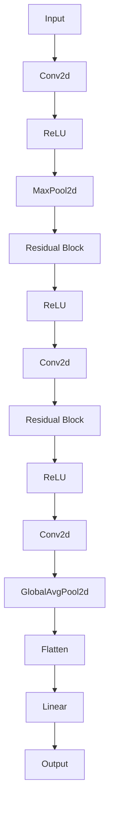

- **输入层（Input）**：接受图像输入。
- **卷积层（Conv2d）**：进行图像特征提取。
- **ReLU激活函数（ReLU）**：引入非线性。
- **最大池化层（MaxPool2d）**：降低模型参数数量。
- **残差块（Residual Block）**：包含两个卷积层和一个跳跃连接。
- **全局平均池化层（GlobalAvgPool2d）**：将特征图降为一维。
- **全连接层（Linear）**：进行分类。

##### 10.2 损失函数与优化算法

在图像分类项目中，我们使用的是交叉熵损失函数（CrossEntropyLoss）。交叉熵损失函数是分类问题中常用的损失函数，用于计算预测标签和实际标签之间的差异。

**损失函数：**

$$
\text{Loss} = -\sum_{i=1}^{N} y_i \log(\hat{y}_i)
$$

其中，\( y_i \) 是实际标签，\( \hat{y}_i \) 是预测概率。

为了优化模型参数，我们使用的是随机梯度下降（Stochastic Gradient Descent，SGD）算法。

**优化算法：**

$$
\theta_{t+1} = \theta_{t} - \alpha \nabla_{\theta} J(\theta)
$$

其中，\( \theta \) 是模型参数，\( \alpha \) 是学习率，\( \nabla_{\theta} J(\theta) \) 是损失函数对参数的梯度。

##### 10.3 模型训练与评估

在模型训练过程中，我们通过迭代更新模型参数，使其在训练数据上达到更好的拟合效果。以下是一个简单的训练循环：

```python
for epoch in range(EPOCHS):
    running_loss = 0.0
    for i, (data, target) in enumerate(train_loader, 0):
        optimizer.zero_grad()
        output = model(data)
        loss = criterion(output, target)
        loss.backward()
        optimizer.step()
        running_loss += loss.item()
    print(f'Epoch {epoch + 1}, Loss: {running_loss / (i + 1)}')
```

在模型评估过程中，我们使用验证数据集计算模型性能指标，如准确率、召回率等。

```python
with torch.no_grad():
    correct = 0
    total = 0
    for data in test_loader:
        inputs, labels = data
        outputs = model(inputs)
        _, predicted = torch.max(outputs.data, 1)
        total += labels.size(0)
        correct += (predicted == labels).sum().item()
print(f'Accuracy: {100 * correct / total}%')
```

**小结：**
本章对图像分类项目中的代码进行了详细解读和分析，包括模型架构、损失函数与优化算法，以及模型训练与评估。通过深入理解代码实现，读者可以更好地掌握 AI 大模型的技术原理和应用。

---

### 第三部分: AI 大模型技术实战

#### 第11章: AI 大模型未来发展趋势

随着 AI 大模型的不断进步，其发展趋势令人瞩目。未来，AI 大模型将在多个领域带来深远的影响，同时也面临着一系列挑战。

##### 11.1 AI 大模型的发展方向

1. **更高效的大规模模型：**随着计算能力和数据资源的提升，AI 大模型将朝着参数数量更庞大、计算效率更高的方向发展。例如，谷歌的 GLM-4 模型拥有超过 1750 亿个参数，展现了大模型在语言理解与生成方面的强大能力。

2. **多模态融合：**未来的 AI 大模型将能够处理多种类型的数据，如文本、图像、声音和视频，实现跨模态的统一理解和处理。

3. **自适应学习：**AI 大模型将具备更强的自适应学习能力，能够根据不同场景和任务需求动态调整模型结构和参数。

4. **高效能计算：**利用新型计算架构，如量子计算和光子计算，AI 大模型将实现更高的计算效率和能效比。

##### 11.2 AI 大模型的伦理问题

AI 大模型的广泛应用引发了诸多伦理问题，包括数据隐私、偏见和透明度等。

- **数据隐私**：AI 大模型在训练过程中需要大量数据，这些数据往往涉及个人隐私。如何保护用户隐私，防止数据泄露，成为关键挑战。
- **偏见**：AI 大模型可能继承和放大训练数据中的偏见，导致不公平的决策。例如，性别、种族歧视等。
- **透明度**：AI 大模型的决策过程复杂且不透明，如何提高模型的透明度，使其可解释性和可信度提升，是当前的研究热点。

##### 11.3 AI 大模型的社会影响

AI 大模型将对社会产生深远的影响，包括以下几个方面：

1. **就业变革**：AI 大模型在自动化领域的应用将导致部分传统就业岗位的消失，同时创造新的就业机会。
2. **教育和培训**：AI 大模型将为教育和培训带来革命性变革，实现个性化教学和终身学习。
3. **医疗服务**：AI 大模型在医疗诊断、药物研发等领域具有巨大潜力，有望提高医疗服务的质量和效率。
4. **社会治理**：AI 大模型将在公共安全、交通管理、环境保护等方面发挥重要作用，提升社会治理水平。

##### 小结

AI 大模型的未来发展趋势充满机遇和挑战。通过不断技术创新和伦理规范的完善，AI 大模型将在社会各个领域发挥更大的作用，为人类带来更多福祉。

---

### 附录

#### 附录 A: AI 大模型相关资源

为了帮助读者深入了解 AI 大模型的相关知识，我们提供了以下资源：

##### A.1 在线教程与学习资源

- **Coursera**：提供大量的 AI 和深度学习课程，涵盖基础知识到高级应用。
- **edX**：由哈佛大学和麻省理工学院共同创办，提供高质量的 AI 和深度学习课程。
- **Udacity**：提供针对 AI 和深度学习的实用课程和纳米学位项目。
- **Kaggle**：一个数据科学竞赛平台，提供丰富的项目和实践机会。

##### A.2 论文推荐

- **“Deep Learning”**：Goodfellow, Bengio, Courville 著，深度学习的经典教材。
- **“Deep Learning with Python”**：François Chollet 著，深入浅出地介绍深度学习技术。
- **“Attention Is All You Need”**：Vaswani et al. 著，Transformer 架构的奠基性论文。
- **“Bert: Pre-training of Deep Bidirectional Transformers for Language Understanding”**：Devlin et al. 著，BERT 模型的详细介绍。

##### A.3 优秀开源项目

- **TensorFlow**：Google 开发的一款开源深度学习框架。
- **PyTorch**：Facebook 开发的一款开源深度学习框架。
- **Keras**：一个基于 TensorFlow 的简洁高效的深度学习库。
- **Transformers**：Hugging Face 开发的一款开源 Transformer 库。

##### A.4 社交媒体与论坛

- **Reddit**：深度学习和 AI 话题的讨论社区。
- **Stack Overflow**：编程问题和解决方案的问答平台。
- **GitHub**：开源项目的托管平台，许多深度学习项目都在这里发布。
- **AI Community**：专业的 AI 论坛，提供最新的研究进展和讨论。

通过以上资源，读者可以进一步探索 AI 大模型的知识和技术，掌握前沿动态，提高自己在 AI 领域的竞争力。

---

### 作者信息

作者：AI 天才研究院 / AI Genius Institute & 禅与计算机程序设计艺术 / Zen And The Art of Computer Programming

---

通过本文的详细探讨，我们深入了解了 AI 大模型的基本概念、核心算法、技术架构和应用案例，并展示了实际项目中的开发过程和代码实现。AI 大模型在深度学习、自然语言处理、图像识别和自动控制等领域具有广泛的应用前景，同时也面临着一系列挑战。随着技术的不断进步和伦理规范的完善，AI 大模型将为社会带来更多创新和变革。

再次感谢读者对本文的关注，希望本文能够为您的 AI 学习之路提供有价值的参考。如果您对 AI 大模型有任何疑问或建议，欢迎在评论区留言交流。祝您在 AI 领域取得丰硕的成果！

