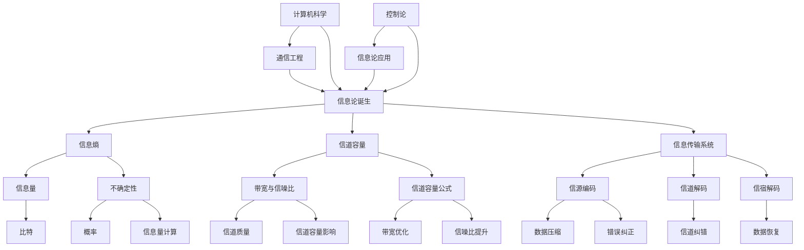
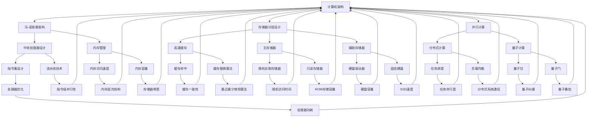

                 

### 第1章: 香农生平与成就

#### 1.1 香农的早期生活

香农（Claude Elwood Shannon），1916年4月30日出生于美国俄亥俄州的波特罗伊尔（Port Royal），一个充满学术氛围的家庭中。他的父亲John oild Shannon是一位数学教师，母亲Mabel Emily Gardner Shannon则是一位受过良好教育的家庭主妇。香农在家庭氛围的熏陶下，从小就展现出了对数学和科学的浓厚兴趣。

香农的童年生活相对平凡，但他从父亲那里学到了许多数学知识，这也为他未来的学术之路打下了坚实的基础。他在家乡的初级学校接受了基础教育，随后进入了当地的锡达利亚学院（Cedarville College）学习。在这里，他继续深化了对数学和物理的学习，并表现出卓越的学术才华。

#### 1.2 香农在麻省理工的学习和职业生涯

1934年，香农进入了麻省理工学院（MIT）学习电气工程。在MIT，他接受了严格的学术训练，并开始接触到了许多前沿的科学技术。他的学术天赋很快得到了认可，他在本科期间就发表了多篇论文，并在1936年获得了电气工程学士学位。随后，他继续在MIT深造，于1937年获得了硕士学位。

1937年至1941年，香农在贝尔实验室工作，这对他后来的学术生涯产生了深远的影响。在贝尔实验室，他接触到了许多前沿的技术问题，并开始了对信息论的研究。1940年，他发表了著名的论文《通信的数学理论》（A Mathematical Theory of Communication），这篇论文奠定了信息论的基础，并使香农成为该领域的奠基人之一。

1941年，香农加入美国陆军通信兵团，参与第二次世界大战。在战争期间，他利用自己的专业知识和技能，帮助改进了雷达和其他通信技术。1945年，战争结束后，香农回到麻省理工学院，开始了他的教学生涯。他不仅在教学上取得了巨大成功，还在学术研究上继续推动了信息论的发展。

#### 1.3 香农的信息论理论体系

香农的信息论理论体系是他对计算机科学和通信技术的最伟大贡献之一。信息论主要研究信息的度量、传输和利用，其核心概念包括信息量、信道容量、信息传输系统和熵等。

- **信息量**：香农定义信息量为不确定性减少的量度。他在1948年的论文中提出了信息熵的概念，即一个随机事件的不确定性度量。信息熵可以用以下公式表示：
  \[ H(X) = -\sum_{i} p(x_i) \log_2 p(x_i) \]
  其中，\( p(x_i) \) 表示事件 \( x_i \) 发生的概率。

- **信道容量**：信道容量是指一个通信信道能够传输的最大信息速率。香农提出了著名的香农定理，该定理指出，只要信道满足一定的条件，就可以实现无误差的信息传输。信道容量可以用以下公式表示：
  \[ C = B \log_2 (1 + S/N) \]
  其中，\( B \) 是信道的带宽，\( S \) 是信号功率，\( N \) 是噪声功率。

- **信息传输系统**：香农定义了一个理想的信息传输系统，包括信源、信道、信宿和编码器、译码器等组成部分。他提出了最大后验概率译码（Maximum A Posteriori Probability, MAP）和最小汉明距离译码（Minimum Hamming Distance, MHD）等译码策略。

- **熵**：熵是信息量的另一种度量方式，表示信息的不确定性。香农用熵来衡量一个系统中的信息含量，并提出了条件熵、联合熵和互信息等概念。互信息是衡量两个随机变量之间相关性的度量，公式为：
  \[ I(X;Y) = H(X) - H(X|Y) \]

#### 1.4 香农的贡献与影响

香农的贡献不仅在于他开创了信息论这一新兴领域，还在于他的理论对多个学科和技术领域产生了深远的影响。

- **学术影响**：香农的信息论理论为后来的学术研究提供了坚实的基础。他的论文《通信的数学理论》被视为信息论领域的经典之作，对通信工程、计算机科学、统计学和生物学等领域产生了重要影响。

- **技术影响**：香农的理论推动了通信技术的发展。例如，基于香农定理的信道编码技术使得通信系统能够在噪声环境中实现可靠的信息传输。香农还提出了数据压缩和错误纠正算法，这些技术在现代通信和数据存储中得到了广泛应用。

- **社会影响**：香农的工作对社会和人类文明产生了深远的影响。他提出的“信息时代”概念，为现代信息技术的发展奠定了基础。香农的理论不仅改变了人们对通信和数据处理的看法，还促进了信息科学和信息技术的快速发展。

### 第2章: 信息论基础

#### 2.1 信息论的基本概念

信息论是一门研究信息度量、传输和处理的数学理论，它的核心概念包括信息量、熵、信道容量、信息传输系统和译码策略等。这些概念构成了信息论的理论基础，并在通信技术、数据压缩和机器学习等领域得到广泛应用。

- **信息量**：信息量是衡量信息含量的一种度量，表示一个事件或消息的不确定性。在信息论中，信息量通常用比特（bit）来表示。一个事件的信息量可以通过计算其概率的对数来获得。例如，如果一个事件发生的概率是0.5，那么它包含1比特的信息。

- **熵**：熵是衡量系统不确定性的一种度量，它表示一个系统可能的状态数或不确定性程度。在信息论中，香农提出了信息熵的概念，用于衡量一个随机变量或消息的熵。信息熵的计算公式为：
  \[ H(X) = -\sum_{i} p(x_i) \log_2 p(x_i) \]
  其中，\( p(x_i) \) 表示第 \( i \) 个事件发生的概率。

- **信道容量**：信道容量是指一个通信信道能够传输的最大信息速率。根据香农定理，对于一个带宽为 \( B \)、信噪比为 \( S/N \) 的信道，其最大信息传输速率为：
  \[ C = B \log_2 (1 + S/N) \]
  其中，\( B \) 是信道的带宽，\( S \) 是信号功率，\( N \) 是噪声功率。

- **信息传输系统**：信息传输系统是指用于传输和处理信息的系统，包括信源、信道、信宿和编码器、译码器等组成部分。信源产生信息，信道传输信息，信宿接收信息，编码器将信息编码为适合信道传输的形式，译码器将接收到的信号解码为原始信息。

- **译码策略**：译码策略是用于从接收到的信号中恢复原始信息的算法。在信息论中，常见的译码策略包括最大后验概率译码（Maximum A Posteriori Probability, MAP）和最小汉明距离译码（Minimum Hamming Distance, MHD）。最大后验概率译码根据接收到的信号估计最可能的原始信息，而最小汉明距离译码根据接收到的信号和原始信息的汉明距离来选择最接近的原始信息。

#### 2.2 信息量的度量

信息量的度量是信息论中的基础概念，它通过衡量一个事件或消息的不确定性来定义。在信息论中，常用的度量单位是比特（bit），1比特等于对数基数2的对数。信息量的度量方法主要包括以下几种：

- **基于概率的度量**：信息量可以通过计算一个事件发生的概率的对数来获得。如果一个事件发生的概率是 \( p \)，那么它包含 \( -\log_2(p) \) 比特的信息。例如，如果一个事件以50%的概率发生，那么它包含1比特的信息。

- **基于熵的度量**：信息量可以通过计算一个系统的熵来获得。熵是衡量系统不确定性的一种度量，它表示系统可能的状态数或不确定性程度。对于一个具有 \( N \) 个可能状态的系统，其熵可以计算为 \( H = \log_2(N) \) 比特。例如，一个硬币正面朝上的概率是0.5，那么它的熵是1比特。

- **基于互信息的度量**：互信息是衡量两个随机变量之间相关性的度量。如果一个事件 \( X \) 和另一个事件 \( Y \) 之间有较强的相关性，那么它们之间的互信息会较大。互信息的计算公式为 \( I(X;Y) = H(X) - H(X|Y) \)，其中 \( H(X) \) 是事件 \( X \) 的熵，\( H(X|Y) \) 是在已知事件 \( Y \) 发生的情况下事件 \( X \) 的熵。

- **基于条件熵的度量**：条件熵是衡量在已知某个事件发生的情况下另一个事件的不确定性。对于一个事件 \( X \) 和一个条件事件 \( Y \)，条件熵可以计算为 \( H(X|Y) = \sum_{y} p(y) H(X|Y=y) \)，其中 \( p(y) \) 是事件 \( Y \) 的概率，\( H(X|Y=y) \) 是在事件 \( Y=y \) 发生的情况下事件 \( X \) 的熵。

这些度量方法可以应用于各种情况，例如在通信系统中，信息量可以用来衡量传输的信号所包含的信息含量；在数据压缩中，信息量可以用来衡量压缩前后数据的信息含量；在机器学习中，信息量可以用来衡量特征之间的相关性。

#### 2.3 信道容量理论

信道容量理论是信息论中的核心理论之一，它描述了通信信道能够传输的最大信息速率。信道容量取决于信道的带宽和信噪比，对于一个带宽为 \( B \)、信噪比为 \( S/N \) 的加性高斯白噪声（Additive White Gaussian Noise, AWGN）信道，其信道容量可以通过香农公式计算：

\[ C = B \log_2 (1 + S/N) \]

其中，\( B \) 是信道的带宽，\( S \) 是信号功率，\( N \) 是噪声功率。这个公式告诉我们，当信噪比增加时，信道容量也会增加，这意味着在更强的信号下，信道可以传输更多的信息。

香农定理还表明，只要信道满足一定的条件，就可以实现无误差的信息传输。这个条件是信道必须是带宽有限的，并且信噪比足够高。在实际应用中，为了实现接近信道容量的信息传输速率，通常需要使用信道编码技术，如卷积编码、涡轮编码等。

信道容量理论的应用非常广泛，包括无线通信、有线通信、卫星通信、数字电视等领域。例如，在无线通信中，为了提高信号的抗干扰能力，可以通过增加信号功率和改进编码方案来提高信道容量。在数字电视中，为了提高传输质量，可以通过调整信噪比和信道编码方式来达到更好的传输效果。

#### 2.4 信息率与熵

信息率和熵是信息论中的两个重要概念，它们分别描述了信息的传输速率和系统的不确定性。

- **信息率**：信息率是指单位时间内传输的信息量，它通常用比特每秒（bits per second, bps）来表示。信息率可以用以下公式计算：

  \[ R = \frac{C}{T} \]

  其中，\( C \) 是信道容量，\( T \) 是传输时间。这个公式告诉我们，信道容量越大，信息率也越高。

- **熵**：熵是衡量系统不确定性的一种度量，它通常用比特（bits）来表示。熵的计算公式为：

  \[ H(X) = -\sum_{i} p(x_i) \log_2 p(x_i) \]

  其中，\( p(x_i) \) 是系统处于状态 \( x_i \) 的概率。

- **信息率与熵的关系**：信息率和熵之间有着密切的关系。根据香农定理，信道容量 \( C \) 等于信息率的上界，即：

  \[ C = \max \{ R : R \leq H(X) \} \]

  这意味着，信息率不能超过系统的熵。如果一个系统的熵很低，那么它的不确定性也很低，这意味着信息率可以很高，反之亦然。

在实际应用中，信息率和熵的概念被广泛应用于通信系统、数据压缩和机器学习等领域。例如，在通信系统中，为了实现高效的信息传输，需要根据信道的特性调整信息率和信道编码方式。在数据压缩中，通过降低数据的熵，可以有效地减少数据的存储空间。在机器学习中，通过计算特征之间的互信息，可以识别出最有用的特征，从而提高模型的性能。

#### 3.1 概率论基础

概率论是信息论的重要基础之一，它为信息量的度量提供了数学工具。在信息论中，概率论的基本概念和公式被广泛应用于信息量的计算、信道容量分析以及错误纠正编码等领域。

- **概率的基本概念**：

  - **随机事件**：随机事件是指在一定条件下可能发生也可能不发生的事件。例如，掷骰子出现6点就是一个随机事件。

  - **概率**：概率是衡量一个随机事件发生的可能性大小的数值，通常用 \( P(A) \) 表示事件 \( A \) 发生的概率。

  - **条件概率**：条件概率是指在一个事件已经发生的前提下，另一个事件发生的概率。条件概率可以用以下公式表示：

    \[ P(B|A) = \frac{P(A \cap B)}{P(A)} \]

    其中，\( P(A \cap B) \) 是事件 \( A \) 和事件 \( B \) 同时发生的概率，\( P(A) \) 是事件 \( A \) 发生的概率。

  - **独立事件**：两个事件 \( A \) 和 \( B \) 是独立的，如果其中一个事件的发生不影响另一个事件的发生。独立事件的概率可以用以下公式表示：

    \[ P(A \cap B) = P(A) \cdot P(B) \]

- **概率论的基本公式**：

  - **全概率公式**：全概率公式用于计算一个事件的总体概率，公式如下：

    \[ P(A) = \sum_{i} P(A|B_i) \cdot P(B_i) \]

    其中，\( B_i \) 是一组互斥且穷尽的事件，即 \( P(B_i) > 0 \) 且 \( \sum_{i} P(B_i) = 1 \)。

  - **贝叶斯公式**：贝叶斯公式用于计算条件概率，公式如下：

    \[ P(A|B) = \frac{P(B|A) \cdot P(A)}{P(B)} \]

    其中，\( P(B|A) \) 是在事件 \( A \) 发生的条件下事件 \( B \) 发生的概率，\( P(A) \) 是事件 \( A \) 发生的概率，\( P(B) \) 是事件 \( B \) 发生的概率。

- **概率论的应用**：

  - **信息量的计算**：在信息论中，信息量可以通过计算随机变量的熵来获得。随机变量的熵可以用以下公式表示：

    \[ H(X) = -\sum_{i} p(x_i) \log_2 p(x_i) \]

    其中，\( p(x_i) \) 是随机变量 \( X \) 取值为 \( x_i \) 的概率。

  - **信道容量的分析**：在信道容量的分析中，概率论被用来计算信道的误差概率。例如，对于一个二进制对称信道（Binary Symmetric Channel, BSC），其错误概率可以用以下公式表示：

    \[ p(e) = \frac{1}{2} (1 - p) \]

    其中，\( p \) 是信道的传输概率，即正确传输的概率。

  - **错误纠正编码**：在错误纠正编码中，概率论被用来计算编码后的错误概率。例如，在汉明码（Hamming Code）中，可以通过计算编码后的错误概率来确定码距和错误纠正能力。

概率论作为信息论的基础，为信息量的度量、信道容量分析和错误纠正编码提供了坚实的数学支持。这些概念和公式在信息论的各个领域中发挥着关键作用，推动了信息科学和通信技术的发展。

#### 3.2 混淆矩阵与熵函数

在信息论中，混淆矩阵和熵函数是两个重要的工具，用于分析和评估通信系统的性能。混淆矩阵提供了关于系统在不同状态之间的转移情况的详细信息，而熵函数则用于量化系统的不确定性。

- **混淆矩阵**：

  混淆矩阵（Confusion Matrix）是一个用于描述分类问题性能的表格，它展示了模型预测结果与实际标签之间的对应关系。在一个二分类问题中，混淆矩阵包含以下四个部分：

  - **准确率（Accuracy）**：准确率是指预测正确的样本数占总样本数的比例，计算公式为：
    \[ Accuracy = \frac{TP + TN}{TP + TN + FP + FN} \]
    其中，\( TP \) 是真正例（True Positive），\( TN \) 是真负例（True Negative），\( FP \) 是假正例（False Positive），\( FN \) 是假负例（False Negative）。

  - **精确率（Precision）**：精确率是指预测为正例的样本中实际为正例的比例，计算公式为：
    \[ Precision = \frac{TP}{TP + FP} \]

  - **召回率（Recall）**：召回率是指实际为正例的样本中被预测为正例的比例，计算公式为：
    \[ Recall = \frac{TP}{TP + FN} \]

  - **F1 分数（F1 Score）**：F1 分数是精确率和召回率的调和平均值，用于综合考虑两者的性能，计算公式为：
    \[ F1 Score = 2 \cdot \frac{Precision \cdot Recall}{Precision + Recall} \]

  混淆矩阵的使用可以帮助我们全面评估模型的分类性能，并识别模型可能存在的问题。

- **熵函数**：

  熵函数（Entropy Function）是衡量系统不确定性的一个重要工具。在信息论中，熵函数用于计算随机变量的信息熵。信息熵是衡量一个随机变量不确定性的度量，它的定义基于概率分布。对于离散随机变量 \( X \)，其熵可以用以下公式计算：

  \[ H(X) = -\sum_{i} p(x_i) \log_2 p(x_i) \]

  其中，\( p(x_i) \) 是随机变量 \( X \) 取值为 \( x_i \) 的概率。

  熵函数的几个重要性质包括：

  - **非负性**：熵总是非负的，即 \( H(X) \geq 0 \)。
  - **最大熵**：当所有概率相等时，熵达到最大值，即 \( H(X) = \log_2 N \)，其中 \( N \) 是随机变量的取值个数。
  - **零熵**：当随机变量的概率分布完全确定时，熵为零，即 \( H(X) = 0 \)。

  熵函数在信息传输、数据压缩和机器学习等领域有广泛应用。例如，在数据压缩中，熵函数用于确定最佳的编码方式，以最小化传输所需的比特数。

- **混淆矩阵与熵函数的关系**：

  混淆矩阵和熵函数之间存在一定的联系。在分类问题中，混淆矩阵提供了关于模型性能的定量评估，而熵函数可以用于计算模型的预测不确定性。例如，在多分类问题中，可以使用交叉熵（Cross-Entropy）作为评估指标，计算公式为：

  \[ H(Y, \hat{Y}) = -\sum_{i} p(y_i) \log_2 \hat{p}(y_i) \]

  其中，\( p(y_i) \) 是实际标签的概率分布，\( \hat{p}(y_i) \) 是模型预测的概率分布。

  交叉熵用于衡量两个概率分布之间的差异，当模型预测概率分布与实际标签概率分布相同时，交叉熵最小，表示模型性能最佳。

混淆矩阵和熵函数在信息论中的应用为我们提供了评估和优化通信系统性能的有力工具，这些工具帮助我们在实际应用中实现高效、可靠的信息传输。

#### 3.3 信道编码理论

信道编码理论是信息论的重要分支，它研究如何在有噪声的通信信道中实现可靠的信息传输。信道编码通过增加冗余信息来检测和纠正传输过程中的错误，从而提高通信系统的可靠性。

- **信道编码的基本概念**：

  - **信道**：信道是指信息传输的路径，它可以是有线的（如光纤、同轴电缆）或无线的（如无线电波、微波通信）。

  - **编码**：编码是将原始信息转换为适合信道传输的信号的过程。在编码过程中，会在原始信息中添加一些冗余信息，这些冗余信息用于检测和纠正错误。

  - **解码**：解码是将接收到的信号还原为原始信息的过程。解码器使用编码时添加的冗余信息来检测和纠正错误。

- **信道编码的分类**：

  - **线性编码**：线性编码是最基本的信道编码方法，它通过线性变换将原始信息映射到编码序列。线性编码方法包括汉明码（Hamming Code）、里德-所罗门码（Reed-Solomon Code）等。

  - **卷积编码**：卷积编码是一种时变编码方法，它利用卷积操作来生成编码序列。卷积编码可以提供更大的自由度和灵活性，常用于无线通信和数字传输系统中。

  - **低密度奇偶校验码**（Low-Density Parity-Check, LDPC）：LDPC码是一种高效率的信道编码方法，它通过构造稀疏的校验矩阵来实现低错误概率传输。LDPC码在通信系统中得到了广泛应用。

  - **涡轮编码**：涡轮编码是一种基于反馈的卷积编码方法，它通过多次迭代来提高编码效率和性能。涡轮编码在数字通信和卫星通信中得到了广泛应用。

- **信道编码的基本原理**：

  - **冗余信息生成**：在信道编码中，通过在原始信息中添加冗余信息来实现错误检测和纠正。冗余信息是通过某种编码算法生成的，例如，汉明码使用奇偶校验位来生成冗余信息。

  - **错误检测**：接收器使用编码时添加的冗余信息来检测传输过程中的错误。如果检测到错误，接收器会通知发送器重新传输信息。

  - **错误纠正**：一些信道编码方法（如汉明码、里德-所罗门码等）能够自动纠正传输过程中发生的错误。错误纠正通过解码算法实现，解码算法利用冗余信息来检测和纠正错误。

- **信道编码的应用**：

  - **通信系统**：在无线通信、卫星通信、光纤通信等系统中，信道编码被广泛用于提高通信的可靠性和抗干扰能力。

  - **数据存储**：在磁盘存储、光盘存储等数据存储系统中，信道编码用于检测和纠正读写过程中的错误，确保数据的完整性和可靠性。

  - **数字传输**：在数字电视、数字广播、数字音频等数字传输系统中，信道编码用于提高传输的稳定性和抗干扰能力。

信道编码理论通过增加冗余信息来检测和纠正传输过程中的错误，提高了通信系统的可靠性和抗干扰能力。信道编码方法的选择和应用取决于具体的通信环境和要求，不同的编码方法具有不同的性能和适用范围。

#### 3.4 信息传输系统的优化

信息传输系统的优化是一个关键问题，旨在提高通信系统的传输效率和可靠性。优化方法主要包括信道利用率的最大化、信息传输速率的最大化和系统整体性能的优化。

- **信道利用率的最大化**：

  信道利用率是指信道实际传输的信息量与信道容量之比。最大化信道利用率的目标是在给定的带宽和信噪比条件下，尽可能多地传输信息。以下是一些实现信道利用率最大化的方法：

  - **自适应调制和编码**：通过根据信道条件动态调整调制方式和编码方式，可以实现信道利用率的最大化。例如，在无线通信中，可以使用QAM（Quadrature Amplitude Modulation）调制和卷积编码，根据信道的质量自适应调整调制阶数和编码速率。

  - **多输入多输出（MIMO）技术**：MIMO技术利用多个发送和接收天线，通过空间复用（Spatial Multiplexing）和空间分集（Spatial Diversity）来提高信道利用率。空间复用可以在同一时刻传输多个独立的数据流，从而增加信息传输速率。

  - **波束成形**：波束成形通过调整天线的方向图，将信号聚焦到目标接收器，从而减少多径效应和干扰，提高信道利用率。

- **信息传输速率的最大化**：

  信息传输速率的最大化是指在一定带宽和信噪比条件下，实现最大的信息传输速率。以下是一些实现信息传输速率最大化的方法：

  - **香农定理**：根据香农定理，信息传输速率的上限是信道容量。通过优化编码方案和调制方式，可以接近信道容量，从而实现最大信息传输速率。例如，使用高阶QAM调制和卷积编码可以提高传输速率。

  - **多载波传输**：多载波传输（如OFDM - Orthogonal Frequency Division Multiplexing）通过将信道分成多个子信道，每个子信道传输不同的信息流，从而增加信息传输速率。OFDM技术可以有效抑制子信道的频率选择性衰落。

  - **多用户传输**：多用户传输技术（如多用户MIMO和多用户检测）利用多个用户的资源，通过空间复用和用户分集来提高信息传输速率。

- **系统整体性能的优化**：

  系统整体性能的优化是指通过综合考虑信道利用率、信息传输速率和系统可靠性等指标，实现系统的最佳性能。以下是一些实现系统整体性能优化的方法：

  - **资源分配**：资源分配策略通过动态调整资源（如功率、带宽和时隙）的分配，实现系统整体性能的最优化。例如，基于用户和信道条件的自适应功率控制可以优化系统的功率效率。

  - **网络编码**：网络编码通过在节点处对来自不同源的信息进行编码和混合，实现网络资源的高效利用。网络编码可以提高网络的吞吐量和可靠性。

  - **联合检测和译码**：联合检测和译码（Joint Detection and Decoding）通过同时检测和译码多个用户的信号，减少误差传播，提高系统的整体性能。

  - **抗干扰技术**：抗干扰技术（如干扰对消和干扰抑制）通过减少干扰对通信系统的影响，提高系统的可靠性。

信息传输系统的优化是一个复杂的问题，需要综合考虑多种因素。通过采用自适应调制和编码、MIMO技术、多载波传输、多用户传输和抗干扰技术等方法，可以显著提高通信系统的传输效率和可靠性。

### 第4章: 信息论的应用

#### 4.1 通信系统的信息传输

通信系统的信息传输是信息论的核心应用领域之一，它旨在通过信道实现可靠的信息传输。信息传输的过程可以概括为以下几个关键步骤：

- **信源编码**：信源编码是将原始信息转换为适合信道传输的数字信号的过程。信源编码的目的是降低信息的冗余，减少传输所需的带宽。常用的信源编码方法包括哈夫曼编码、算术编码等。哈夫曼编码是一种基于信息熵的编码方法，它利用不同符号出现的概率不同，构造出一种最优的编码树，从而实现最小传输速率。

  ```python
  # 哈夫曼编码伪代码
  function HuffmanCoding(data):
      # 计算符号概率
      probabilities = calculateProbabilities(data)
      
      # 构造哈夫曼树
      huffmanTree = buildHuffmanTree(probabilities)
      
      # 生成编码表
      encodingTable = generateEncodingTable(huffmanTree)
      
      # 编码
      encodedData = encode(data, encodingTable)
      
      return encodedData
  ```

- **信道传输**：信道传输是将编码后的数字信号通过信道进行传输的过程。在传输过程中，信号可能会受到噪声和干扰的影响，从而导致传输错误。为了提高传输的可靠性，通常需要采用信道编码技术。信道编码通过添加冗余信息来实现错误检测和纠正。常见的信道编码方法包括汉明码、卷积码、里德-所罗门码等。

  ```python
  # 汉明码编码伪代码
  function HammingCoding(data):
      # 添加奇偶校验位
      encodedData = addParityBits(data)
      
      return encodedData
  ```

- **信道解码**：信道解码是将接收到的信号解码为原始信息的过程。解码器使用信道编码时添加的冗余信息来检测和纠正传输过程中的错误。常见的解码方法包括最大后验概率解码（MAP）和最小汉明距离解码（MHD）。

  ```python
  # 最大后验概率解码伪代码
  function MAPDecoding(receivedData, encodingTable):
      # 计算每个可能的原始信息的后验概率
      posteriorProbabilities = calculatePosteriorProbabilities(receivedData, encodingTable)
      
      # 选择具有最大后验概率的原始信息
      decodedData = selectMaxPosterior(posteriorProbabilities)
      
      return decodedData
  ```

- **信宿译码**：信宿译码是将解码后的信号还原为原始信息的过程。译码器根据编码规则将接收到的信号转换为原始信息，从而实现信息的接收和利用。

  ```python
  # 信宿译码伪代码
  function Decoding(encodedData, decodingTable):
      # 解码
      decodedData = decode(encodedData, decodingTable)
      
      return decodedData
  ```

通过信源编码、信道传输、信道解码和信宿译码，通信系统能够实现可靠的信息传输。信息论提供了理论基础和算法实现，使得通信系统在不同信道条件下能够实现高效的传输。

#### 4.2 数据压缩技术

数据压缩技术是信息论在数据存储和通信领域的重要应用之一，其目的是通过减少数据的冗余信息来提高数据传输和存储的效率。数据压缩的基本原理是基于信息熵，即通过去除数据中的冗余信息来压缩数据大小。以下是一些常用的数据压缩技术：

- **哈夫曼编码**：哈夫曼编码是一种基于信息熵的压缩算法，它利用不同符号出现的概率不同，为每个符号分配不同的编码长度。出现概率较高的符号使用较短的编码，而出现概率较低的符号使用较长的编码。这样，整体上可以减少编码后的数据长度。

  ```python
  # 哈夫曼编码实现伪代码
  function HuffmanCoding(data):
      # 计算符号概率
      probabilities = calculateProbabilities(data)
      
      # 构造哈夫曼树
      huffmanTree = buildHuffmanTree(probabilities)
      
      # 生成编码表
      encodingTable = generateEncodingTable(huffmanTree)
      
      # 编码
      encodedData = encode(data, encodingTable)
      
      return encodedData
  ```

- **算术编码**：算术编码是一种基于概率的压缩算法，它将数据映射到一个区间，并根据数据出现的概率来分配编码。算术编码可以产生一个连续的编码，而不是离散的编码，这使得它可以更高效地压缩数据。

  ```python
  # 算术编码实现伪代码
  function ArithmeticCoding(data):
      # 计算符号概率
      probabilities = calculateProbabilities(data)
      
      # 初始化编码区间
      encodingInterval = initializeInterval()
      
      # 编码
      for symbol in data:
          updateInterval(encodingInterval, symbol, probabilities)
      
      # 转换编码区间为二进制编码
      encodedData = convertIntervalToBinary(encodingInterval)
      
      return encodedData
  ```

- **LZ77压缩算法**：LZ77压缩算法是一种基于局部重复的压缩算法，它通过查找数据中的重复序列来压缩数据。LZ77算法的基本思想是将重复的序列替换为一个引用，从而减少数据的长度。

  ```python
  # LZ77压缩算法伪代码
  function LZ77Compression(data):
      # 初始化压缩缓冲区
      buffer = initializeBuffer()
      
      # 初始化输出
      output = []
      
      # 遍历输入数据
      for i in range(len(data)):
          # 查找重复序列
          match = findMatch(buffer, data, i)
          
          # 如果找到重复序列
          if match is not None:
              # 记录引用
              output.append(createReference(match))
          else:
              # 记录原始数据
              output.append(data[i])
          
          # 更新缓冲区
          updateBuffer(buffer, data[i])
      
      return output
  ```

- **LZ78压缩算法**：LZ78压缩算法是一种基于字典的压缩算法，它通过构建一个字典来记录重复的序列。LZ78算法的基本思想是将重复的序列替换为字典中的索引，从而减少数据的长度。

  ```python
  # LZ78压缩算法伪代码
  function LZ78Compression(data):
      # 初始化字典
      dictionary = initializeDictionary()
      
      # 初始化输出
      output = []
      
      # 遍历输入数据
      for symbol in data:
          # 查找字典中的序列
          sequence = findSequenceInDictionary(dictionary, symbol)
          
          # 如果找到序列
          if sequence is not None:
              # 记录索引
              output.append(findIndexInDictionary(dictionary, sequence))
          else:
              # 将序列添加到字典中
              addSequenceToDictionary(dictionary, symbol)
              # 记录原始数据
              output.append(symbol)
      
      return output
  ```

通过这些数据压缩技术，可以显著减少数据的存储空间和传输带宽，从而提高数据存储和传输的效率。

#### 4.3 信息加密与安全

信息加密与安全是信息论在数据保护领域的重要应用，旨在保护信息的机密性、完整性和可用性。加密技术通过将明文转换为密文，确保信息在传输和存储过程中不被未授权方读取和理解。以下是一些常见的加密技术和安全措施：

- **对称加密**：对称加密是一种加密算法，加密和解密使用相同的密钥。常见的对称加密算法包括AES（Advanced Encryption Standard）、DES（Data Encryption Standard）和RSA（Rivest-Shamir-Adleman）。

  ```python
  # AES加密实现伪代码
  function AESEncryption(plaintext, key):
      # 初始化加密算法
      cipher = initializeCipher(key)
      
      # 加密明文
      ciphertext = cipher.encrypt(plaintext)
      
      return ciphertext
  ```

- **非对称加密**：非对称加密是一种加密算法，加密和解密使用不同的密钥。常见的非对称加密算法包括RSA和ECC（Elliptic Curve Cryptography）。

  ```python
  # RSA加密实现伪代码
  function RSAEncryption(plaintext, public_key):
      # 将明文转换为数字形式
      numeric_plaintext = convertToNumeric(plaintext)
      
      # 使用公钥加密
      ciphertext = public_key.encrypt(numeric_plaintext)
      
      return ciphertext
  ```

- **哈希函数**：哈希函数用于生成固定长度的哈希值，用于验证数据的完整性和一致性。常见的哈希函数包括MD5、SHA-1和SHA-256。

  ```python
  # SHA-256哈希实现伪代码
  function SHA256Hash(data):
      # 初始化哈希算法
      hash_algorithm = initializeHashAlgorithm('SHA-256')
      
      # 计算哈希值
      hash_value = hash_algorithm.hash(data)
      
      return hash_value
  ```

- **数字签名**：数字签名用于验证消息的发送者和消息的完整性。数字签名算法包括RSA签名和ECDSA（Elliptic Curve Digital Signature Algorithm）。

  ```python
  # RSA签名实现伪代码
  function RSASignature(message, private_key):
      # 将消息转换为数字形式
      numeric_message = convertToNumeric(message)
      
      # 使用私钥签名
      signature = private_key.sign(numeric_message)
      
      return signature
  ```

- **安全协议**：安全协议用于确保通信双方的安全和数据完整性。常见的安全协议包括SSL/TLS（Secure Sockets Layer/Transport Layer Security）、IPSec（Internet Protocol Security）和PGP（Pretty Good Privacy）。

  ```python
  # SSL/TLS握手实现伪代码
  function SSLHandshake(client, server):
      # 客户端发送握手请求
      client.sendHandshakeRequest()
      
      # 服务器响应握手请求
      server.sendHandshakeResponse()
      
      # 客户端和服务器交换加密参数
      client.exchangeEncryptionParameters()
      server.exchangeEncryptionParameters()
      
      # 客户端发送应用程序数据
      client.sendApplicationData()
      
      # 服务器发送应用程序数据
      server.sendApplicationData()
  ```

通过这些加密技术和安全措施，可以确保信息在传输和存储过程中不被未授权方访问和篡改，从而保护信息的机密性和完整性。

#### 4.4 人工智能与信息论

人工智能（AI）和信息论之间存在着紧密的联系，信息论为人工智能的发展提供了理论基础和工具。以下从神经网络、机器学习和自然语言处理等方面探讨信息论在人工智能中的应用。

- **神经网络**：

  神经网络是人工智能的核心组成部分之一，其基本原理受到信息论的影响。信息论中的信息熵和互信息概念在神经网络的设计和训练中得到了广泛应用。

  - **信息熵**：信息熵是衡量系统不确定性的一种度量，它在神经网络中用于量化数据的复杂度和特征的重要性。在神经网络训练过程中，通过优化网络的参数来减少输入数据的熵，从而提高模型的准确性和泛化能力。

    ```python
    # 熵计算伪代码
    function calculateEntropy(data):
        probabilities = calculateProbabilities(data)
        entropy = -sum(probabilities * log2(probabilities))
        return entropy
    ```

  - **互信息**：互信息是衡量两个随机变量之间相关性的一种度量，它在神经网络中用于评估特征之间的关系和重要性。在特征选择和降维过程中，通过计算特征之间的互信息来选择最具代表性的特征。

    ```python
    # 互信息计算伪代码
    function calculateMutualInformation(x, y):
        pxy = calculateProbability(x, y)
        px = calculateProbability(x)
        py = calculateProbability(y)
        mutualInformation = px * py - pxy
        return mutualInformation
    ```

- **机器学习**：

  机器学习是人工智能的重要组成部分，其核心在于构建和优化预测模型。信息论中的熵和信道容量理论在机器学习模型的设计和优化中发挥了重要作用。

  - **熵**：在监督学习中的损失函数中，熵被用作正则化项，用于控制模型的复杂度。例如，在支持向量机（SVM）中，通过最大化分类间隔的同时最小化分类错误率，熵可以帮助优化模型的参数。

    ```python
    # SVM损失函数伪代码
    function SVMloss(y, f(x)):
        loss = max(0, 1 - y * f(x) + C * entropy)
        return loss
    ```

  - **信道容量**：在无监督学习中的聚类问题中，信道容量理论可以用来评估聚类结果的质量。通过计算聚类后的数据分布与初始数据分布之间的信道容量，可以评估聚类算法的性能。

    ```python
    # 聚类性能评估伪代码
    function evaluateClustering(data, clustering_result):
        initial_distribution = calculateDistribution(data)
        final_distribution = calculateDistribution(clustering_result)
        channel_capacity = B * log2(1 + S/N)
        return channel_capacity
    ```

- **自然语言处理**：

  自然语言处理（NLP）是人工智能的重要应用领域之一，其目标是对文本数据进行分析和处理。信息论中的信息熵和互信息在NLP中得到了广泛应用。

  - **信息熵**：在文本分类和情感分析中，信息熵可以用来量化文本的特征复杂度。通过计算文本特征的信息熵，可以评估特征对分类任务的贡献。

    ```python
    # 文本特征复杂度伪代码
    function calculateTextEntropy(text):
        features = extractFeatures(text)
        probabilities = calculateProbabilities(features)
        entropy = -sum(probabilities * log2(probabilities))
        return entropy
    ```

  - **互信息**：在语义分析中，互信息可以用来评估词语之间的相关性。通过计算词语之间的互信息，可以识别出具有强相关性的词语对，从而提高语义分析的准确性。

    ```python
    # 词语相关性评估伪代码
    function calculateWordCorrelation(word1, word2):
        cooccurrence = calculateCooccurrence(word1, word2)
        word1_probability = calculateProbability(word1)
        word2_probability = calculateProbability(word2)
        mutualInformation = word1_probability * word2_probability - cooccurrence
        return mutualInformation
    ```

信息论为人工智能提供了理论基础和工具，使得人工智能在数据分析和处理方面取得了显著的进展。通过信息熵和互信息等概念，信息论帮助人工智能更好地理解和处理复杂数据，从而推动人工智能技术的发展。

### 第5章: 香农与图灵

#### 5.1 香农与图灵机

香农和图灵是20世纪最重要的两位计算机科学家，他们的工作不仅改变了计算机科学的面貌，还奠定了现代信息科学的基础。香农在信息论方面的贡献被认为是“信息论的创始人”，而图灵则在计算机科学的基础理论和实际应用方面做出了开创性的贡献。这两位科学家的思想在某些方面有着密切的联系，特别是在图灵机这一概念上。

- **图灵机的定义**：

  图灵机是一种抽象的计算模型，由英国数学家艾伦·图灵在1936年提出。图灵机由一个无限长的纸带、一个读写头和一些规则组成。纸带上的每个位置可以有一个符号，读写头可以在纸带上左右移动，并能够读取和写入符号。根据给定的规则，读写头会根据当前符号进行移动和操作。

- **香农对图灵机的认识**：

  香农在信息论的研究过程中，对图灵机的概念有着深刻的理解和应用。他利用图灵机的思想来描述信息处理过程，并将其作为分析通信系统的工具。香农在《通信的数学理论》一文中，将信息传输视为一种类似于图灵机计算的过程。他指出，信息传输系统的性能可以通过计算图灵机的计算复杂性来评估。

- **图灵机与信息论的关系**：

  图灵机为香农的信息论提供了坚实的理论基础。通过图灵机的模型，香农能够将信息传输过程形式化，从而提出了信道容量、信息量和熵等核心概念。图灵机使得香农能够定量地分析通信系统的性能，从而推动了信息论的发展。同时，香农的工作也为图灵机的实际应用提供了新的视角，如图灵机在数据压缩和加密技术中的应用。

#### 5.2 香农与图灵测试

图灵测试是图灵在1950年提出的一种测试人工智能智能程度的方法。它旨在判断一个机器是否具有智能，即能否在行为上表现出与人类不可区分的程度。图灵测试的基本思想是，如果一个人在与机器进行对话时无法判断对话对象是机器还是人类，那么这个机器就可以被认为通过了图灵测试。

- **图灵测试的定义**：

  图灵测试要求一个测试者与一个机器和一个人类进行对话，测试者不能看到对话对象，只能通过文本或语音进行交流。测试者在一定时间内无法判断哪一个是机器，哪一个是人类，那么机器就通过了图灵测试。

- **香农对图灵测试的看法**：

  香农对图灵测试有着深刻的理解和评价。他认为，图灵测试是一个具有挑战性的问题，它不仅涉及到人工智能的智能程度，还涉及到人类与机器的交互。香农在《通信的数学理论》一文中提到，图灵测试是衡量机器智能的一个重要标准，它可以帮助人们更好地理解人类智能的本质。

- **图灵测试与信息论的关系**：

  图灵测试与信息论有着密切的联系。信息论提供了评估通信系统性能的工具，如信道容量、信息量和熵等概念。图灵测试通过通信的过程来评估机器的智能程度，这与信息论中的信息传输和信道容量有着相似之处。通过图灵测试，我们可以将机器的智能程度视为信息传输系统的性能指标，从而利用信息论的理论进行分析。

#### 5.3 香农与图灵的哲学思考

香农和图灵不仅在科学技术上做出了卓越的贡献，他们的哲学思考也对计算机科学和信息科学产生了深远的影响。

- **香农的哲学思考**：

  香农在信息论的研究中，提出了一系列哲学问题，如信息的本质、信息的传递和信息的价值等。他强调信息的不确定性和信息的重要性，认为信息是现代社会的核心资源。香农的哲学思考促使人们重新思考信息和通信技术的本质，从而推动了信息科学的发展。

- **图灵的哲学思考**：

  图灵在计算机科学的基础理论和实际应用方面做出了许多开创性的贡献。他的图灵机模型为计算理论奠定了基础，而他提出的图灵测试则为人工智能的发展提供了方向。图灵的哲学思考强调逻辑、推理和抽象，他认为计算机科学的核心在于逻辑和算法，而不是硬件和编程语言。

- **香农与图灵的哲学联系**：

  香农和图灵的哲学思考在某些方面有着相似之处。他们都关注信息的本质和信息的传递，认为信息是现代科技的核心。同时，他们都强调了逻辑和算法在计算机科学中的重要性。香农的信息论为图灵的计算机科学理论提供了理论基础，而图灵的图灵机模型也为香农的信息论提供了具体的实现方式。香农和图灵的哲学思考相互补充，共同推动了计算机科学和信息科学的发展。

### 第6章: 香农与冯·诺依曼

#### 6.1 香农与计算机架构

香农与约翰·冯·诺依曼（John von Neumann）在计算机架构方面有着深刻的联系。冯·诺依曼在1940年代提出了著名的冯·诺依曼架构，这一架构奠定了现代计算机的基础。香农的信息论为理解冯·诺依曼架构提供了重要的理论支持。

- **冯·诺依曼架构的基本概念**：

  冯·诺依曼架构包括五个基本组成部分：中央处理器（CPU）、内存、输入设备、输出设备和通信接口。这种架构的核心特点是程序和数据存储在内存中，并由CPU执行。CPU从内存中读取指令，执行操作，然后将结果存储回内存或输出到外部设备。

- **香农对计算机架构的贡献**：

  香农在《通信的数学理论》一文中，将通信模型与计算机架构进行了类比。他提出，计算机系统可以被视为一种复杂的通信网络，其中信息以电子信号的形式在各个部件之间传输。香农的工作为理解计算机系统中信息流动的方式提供了数学工具，帮助人们优化计算机架构的设计。

  - **信息传输**：香农分析了计算机内部的信息传输问题，提出了使用编码和译码技术来减少错误和提高传输效率。这一思想在计算机架构中得到了广泛应用，例如在内存和CPU之间的总线传输中使用奇偶校验和奇偶校验位。

  - **存储器设计**：香农研究了存储器的设计和优化，提出了使用多级存储器来提高存储器的性能和容量。这一思想在现代计算机系统中得到了实现，如缓存和硬盘分层存储。

- **计算机架构的发展**：

  冯·诺依曼架构在计算机科学的发展中起到了关键作用。虽然后来出现了许多新的计算机架构，如哈佛架构、CPU-GPU分离架构等，但冯·诺依曼架构的基本原理仍然被广泛采用。香农的工作为计算机架构的发展提供了理论基础，使得计算机系统能够更加高效和可靠。

#### 6.2 香农与存储器设计

香农在存储器设计方面的贡献是计算机科学的一个重要组成部分。存储器是计算机系统中的关键部件，用于存储程序和数据。香农的信息论为存储器设计提供了新的视角和方法。

- **存储器设计的基本概念**：

  存储器设计包括以下几个方面：

  - **存储介质**：存储介质用于存储数据和程序，常见的介质包括随机存取存储器（RAM）、只读存储器（ROM）和硬盘驱动器（HDD）。

  - **存储容量**：存储容量是指存储器可以存储的数据量，通常以字节（Byte）或千兆字节（GB）为单位。

  - **存取速度**：存取速度是指存储器读取或写入数据所需的时间，存取速度直接影响计算机系统的性能。

  - **数据可靠性**：数据可靠性是指存储器在存储和读取数据时的准确性和完整性。

- **香农对存储器设计的贡献**：

  香农在存储器设计方面的贡献主要体现在以下两个方面：

  - **信息存储和检索**：香农提出了使用编码技术来提高存储器的存储效率和数据可靠性。例如，通过哈夫曼编码和里德-所罗门码等错误纠正编码技术，可以减少存储器中的错误率，提高数据检索的准确性。

  - **存储器层次结构**：香农研究了存储器的层次结构设计，提出了多级存储器模型。这一模型通过将存储器分为高速缓存、主存储器和辅助存储器，实现了存储器的性能和容量优化。多级存储器模型在今天的计算机系统中得到了广泛应用。

- **存储器设计的发展**：

  随着计算机技术的发展，存储器设计也在不断进步。现代计算机系统采用了各种新技术，如固态硬盘（SSD）、非易失性存储器（NVM）和存储级内存（SRAM）。这些新技术提高了存储器的性能和可靠性，同时也降低了成本。香农的工作为这些新技术的应用提供了理论基础，推动了存储器设计的发展。

#### 6.3 香农与并行计算

并行计算是计算机科学的一个重要分支，它通过同时执行多个任务来提高计算效率和速度。香农在并行计算方面的工作为理解并行计算的基本原理和方法提供了重要的理论支持。

- **并行计算的基本概念**：

  并行计算是指将一个大任务分解为多个小任务，并让多个处理器同时执行这些任务，从而提高计算速度。并行计算的关键在于任务分解、数据并行性和任务调度。

  - **任务分解**：任务分解是将一个大任务拆分成多个小任务的过程。通过任务分解，可以将复杂的计算任务简化为多个简单的子任务。

  - **数据并行性**：数据并行性是指多个处理器可以同时处理多个数据项。数据并行性可以提高计算速度，因为它可以同时处理多个数据，从而减少总体的计算时间。

  - **任务调度**：任务调度是指将任务分配给不同的处理器的过程。任务调度策略会影响并行计算的效率和性能。

- **香农对并行计算的贡献**：

  香农在并行计算方面的贡献主要体现在以下两个方面：

  - **并行通信**：香农研究了并行计算中的通信问题，提出了并行通信模型。并行通信模型通过使用分布式计算网络，实现了处理器之间的高效数据传输。这一模型为并行计算中的数据传输和任务分配提供了理论基础。

  - **并行算法设计**：香农提出了并行算法的设计方法，通过将计算任务分布在多个处理器上，实现了高效的任务并行处理。香农的并行算法设计方法为并行计算中的算法优化提供了重要的指导。

- **并行计算的发展**：

  并行计算在计算机科学中的应用越来越广泛，特别是在高性能计算和大数据处理领域。随着处理器性能的提升和计算机网络技术的发展，并行计算技术得到了快速发展。现代计算机系统采用了各种并行计算技术，如多核处理器、GPU并行计算和分布式计算。香农的工作为这些并行计算技术的应用提供了理论基础，推动了并行计算的发展。

### 第7章: 香农与神经网络

#### 7.1 香农与神经网络的基本概念

神经网络是人工智能领域的一个核心组成部分，其灵感来源于生物神经网络。香农与神经网络之间有着紧密的联系，他的信息论为神经网络的发展提供了理论基础。

- **神经网络的基本概念**：

  神经网络是由大量人工神经元（或节点）组成的计算模型，这些神经元通过连接（或权重）相互连接。每个神经元接受多个输入信号，通过激活函数产生输出信号。神经网络通过学习和调整权重来提高其性能。

  - **人工神经元**：人工神经元模拟生物神经元的工作方式，它接收输入信号、加权求和并应用激活函数产生输出。
  - **输入层**：输入层是神经网络的最高层，它接收外部输入信号。
  - **隐藏层**：隐藏层位于输入层和输出层之间，用于提取特征和进行复杂计算。
  - **输出层**：输出层是神经网络的最低层，它产生最终的输出结果。

- **香农对神经网络的基本认识**：

  香农在信息论的研究中，认识到信息处理和存储的复杂性。他的信息熵和互信息概念为神经网络提供了重要的理论基础。香农认为，神经网络通过学习和调整权重，可以有效地处理和存储信息，从而实现复杂的计算任务。

  - **信息处理**：香农的信息熵概念帮助神经网络量化输入信息的复杂度，从而更好地设计网络结构和优化训练过程。
  - **信息存储**：香农的互信息概念帮助神经网络理解不同神经元之间的相关性，从而提高网络的学习能力和泛化能力。

- **神经网络的发展**：

  神经网络的发展可以追溯到20世纪40年代，当时麦卡洛克和皮茨提出了第一个人工神经网络模型——麦卡洛克-皮茨网络。然而，由于计算能力的限制，神经网络在很长一段时间内并未得到广泛应用。随着计算机硬件和算法的发展，神经网络在20世纪80年代和90年代重新兴起，特别是在深度学习的推动下，神经网络取得了显著的进展。香农的信息论为神经网络的发展提供了理论基础，推动了这一领域的研究和应用。

#### 7.2 香农与神经网络的数学模型

神经网络的数学模型是理解和设计神经网络的核心。香农的信息论为神经网络提供了重要的理论支持，使得神经网络能够更好地处理和存储信息。

- **神经网络的基本数学模型**：

  神经网络通过以下数学模型实现信息处理和计算：

  - **激活函数**：激活函数是神经网络的非线性变换，用于将输入信号转换为输出信号。常见的激活函数包括 sigmoid 函数、ReLU 函数和 tanh 函数。

    ```math
    \sigma(x) = \frac{1}{1 + e^{-x}}
    \quad \text{或} \quad
    \sigma(x) = \max(0, x)
    \quad \text{或} \quad
    \sigma(x) = \frac{2}{\sqrt{1 + e^{-2x}} - 1}
    ```

  - **前向传播**：前向传播是神经网络处理输入信息的过程，包括输入层、隐藏层和输出层的逐层计算。每个神经元接收来自前一层神经元的输入信号，加权求和并应用激活函数产生输出信号。

    ```math
    z_i = \sum_{j} w_{ij} x_j + b_i
    \quad \text{和} \quad
    a_i = \sigma(z_i)
    ```

  - **反向传播**：反向传播是神经网络训练过程的核心，用于调整权重和偏置，以减少预测误差。反向传播通过计算梯度来更新网络参数，从而优化网络性能。

    ```math
    \delta_j = \frac{\partial C}{\partial z_j} = \frac{\partial C}{\partial a_j} \cdot \frac{\partial a_j}{\partial z_j}
    \quad \text{和} \quad
    \Delta w_{ij} = \eta \cdot \delta_j x_j
    ```

- **香农对神经网络数学模型的贡献**：

  香农的信息论为神经网络提供了重要的理论基础，特别是信息熵和互信息概念。香农的信息熵概念帮助神经网络量化输入信息的复杂度，从而更好地设计网络结构和优化训练过程。香农的互信息概念帮助神经网络理解不同神经元之间的相关性，从而提高网络的学习能力和泛化能力。

  - **信息熵**：信息熵用于量化输入信息的复杂度，帮助神经网络识别重要的特征和降低冗余信息。信息熵的概念在神经网络的优化过程中被广泛应用于特征选择和降维。

  - **互信息**：互信息用于量化不同神经元之间的相关性，帮助神经网络理解特征之间的关系，从而提高网络的学习效果。互信息在神经网络的特征提取和融合过程中发挥了重要作用。

- **神经网络数学模型的发展**：

  神经网络数学模型的发展经历了多个阶段，从简单的单层感知器到复杂的深度神经网络。香农的信息论为神经网络的发展提供了重要的理论支持，推动了神经网络在信息处理和计算方面的应用。现代神经网络模型，如卷积神经网络（CNN）、循环神经网络（RNN）和生成对抗网络（GAN），都受到了香农信息论的影响。

  - **卷积神经网络**：卷积神经网络通过卷积操作提取图像特征，广泛应用于计算机视觉领域。香农的信息熵概念在卷积神经网络的设计和优化中得到了广泛应用。

  - **循环神经网络**：循环神经网络通过循环结构处理序列数据，广泛应用于自然语言处理和语音识别领域。香农的信息论为循环神经网络提供了理论基础，帮助神经网络更好地处理和存储序列信息。

  - **生成对抗网络**：生成对抗网络通过对抗性训练生成新的数据，广泛应用于图像生成和风格迁移等领域。香农的互信息概念在生成对抗网络中得到了应用，帮助网络更好地学习数据的统计分布。

香农的神经网络数学模型为理解和设计神经网络提供了重要的理论支持，推动了神经网络在信息处理和计算方面的应用和发展。他的信息论为神经网络的研究和应用提供了新的视角和工具，对现代人工智能技术的发展产生了深远的影响。

#### 7.3 香农与神经网络的应用

香农对神经网络的应用贡献了重要的理论和实践成果，特别是在机器学习和深度学习领域。香农的信息论为神经网络提供了理论基础，推动了这一领域的发展。

- **机器学习**：

  在机器学习领域，神经网络作为一种重要的算法工具，被广泛应用于分类、回归和聚类等问题。香农的信息论为神经网络在机器学习中的应用提供了理论基础，特别是在特征选择和模型优化方面。

  - **特征选择**：香农的信息熵概念在特征选择过程中起到了关键作用。通过计算特征的信息熵，可以识别出最重要的特征，从而降低数据的冗余，提高模型的泛化能力。

    ```python
    # 特征选择基于信息熵
    def selectFeatures(data, labels):
        features = extractFeatures(data)
        entropies = calculateEntropy(features)
        importantFeatures = []
        for feature in features:
            if entropies[feature] > threshold:
                importantFeatures.append(feature)
        return importantFeatures
    ```

  - **模型优化**：香农的互信息概念在神经网络模型的优化中得到了应用。通过计算不同神经元之间的互信息，可以识别出重要的特征和关系，从而优化网络的架构和参数。

    ```python
    # 模型优化基于互信息
    def optimizeModel(model, data, labels):
        features = extractFeatures(data)
        mutualInformation = calculateMutualInformation(features, labels)
        model = updateModel(model, mutualInformation)
        return model
    ```

- **深度学习**：

  在深度学习领域，神经网络特别是深度神经网络（DNN）被广泛应用于图像识别、语音识别和自然语言处理等领域。香农的信息论为深度学习提供了理论基础，特别是在网络架构设计和训练策略方面。

  - **网络架构设计**：香农的信息熵概念在深度神经网络的设计中得到了应用。通过优化网络的信息熵，可以提高网络的性能和效率。

    ```python
    # 网络架构优化基于信息熵
    def optimizeNetwork(network, data, labels):
        entropies = calculateEntropy(features)
        network = updateNetwork(network, entropies)
        return network
    ```

  - **训练策略**：香农的互信息概念在深度学习训练过程中得到了应用。通过计算不同层之间的互信息，可以优化网络的训练策略，提高模型的收敛速度和性能。

    ```python
    # 训练策略优化基于互信息
    def optimizeTrainingStrategy(model, data, labels):
        mutualInformation = calculateMutualInformation(layers)
        strategy = updateStrategy(mutualInformation)
        trainModel(model, data, labels, strategy)
        return model
    ```

- **实际应用**：

  香农的信息论在神经网络的实际应用中发挥了重要作用，推动了人工智能技术的发展。以下是一些具体的实际应用案例：

  - **图像识别**：深度神经网络在图像识别任务中取得了显著的成果，如卷积神经网络（CNN）在图像分类、目标检测和图像分割中的应用。香农的信息熵和互信息概念在CNN的设计和优化中得到了广泛应用。

    ```python
    # CNN架构设计基于信息熵
    def designCNN(data):
        conv_layers = []
        for layer in data:
            conv_layers.append(ConvLayer(layer, entropy))
        return conv_layers
    ```

  - **语音识别**：深度神经网络在语音识别任务中得到了广泛应用，如循环神经网络（RNN）和长短期记忆网络（LSTM）在语音信号处理和语音识别中的应用。香农的信息论为这些神经网络的设计和优化提供了理论基础。

    ```python
    # RNN架构设计基于互信息
    def designRNN(data):
        layers = []
        for layer in data:
            layers.append(LSTMLayer(layer, mutualInformation))
        return layers
    ```

  - **自然语言处理**：深度神经网络在自然语言处理任务中发挥了重要作用，如循环神经网络（RNN）和变换器（Transformer）在文本分类、机器翻译和情感分析中的应用。香农的信息论为这些神经网络的设计和优化提供了理论基础。

    ```python
    # Transformer架构设计基于互信息
    def designTransformer(data):
        layers = []
        for layer in data:
            layers.append(TransformerLayer(layer, mutualInformation))
        return layers
    ```

通过香农的信息论，神经网络在机器学习和深度学习领域得到了广泛应用，推动了人工智能技术的发展。香农的理论基础和实际应用案例为神经网络的设计和优化提供了重要的指导，使得神经网络能够更好地处理和存储信息，从而实现复杂的信息处理任务。

#### 8.1 香农与量子计算的基本概念

量子计算是现代计算科学的前沿领域之一，它基于量子力学原理，利用量子位（qubit）进行计算。香农在量子计算领域有着重要的贡献，他的信息论为理解量子计算提供了理论基础。

- **量子计算的基本概念**：

  - **量子位（qubit）**：量子位是量子计算的基本单元，类似于经典计算中的比特。然而，量子位可以同时存在于多个状态，这种性质称为叠加。叠加态可以表示为多个量子态的线性组合。

    ```math
    \psi = \alpha|0\rangle + \beta|1\rangle
    ```

  - **量子叠加**：量子位可以同时处于0和1的状态，这种叠加态使得量子计算机能够同时处理多个计算路径。

  - **量子纠缠**：量子纠缠是量子计算中的另一个关键概念，两个或多个量子位之间可以形成一种特殊的关系，即使它们相隔很远，一个量子位的测量会立即影响到另一个量子位的状态。

    ```math
    \psi = \frac{1}{\sqrt{2}}(|00\rangle + |11\rangle)
    ```

  - **量子门**：量子门是量子计算中的基本操作，类似于经典计算中的逻辑门。量子门可以操作量子位，改变它们的叠加状态和纠缠关系。

- **香农对量子计算的基本认识**：

  香农在信息论的研究过程中，认识到量子计算与经典计算之间的差异和潜力。他提出了量子信息论的概念，将量子力学与信息论相结合。香农认为，量子计算可以利用量子位叠加和纠缠的性质，实现超越经典计算机的计算能力。

  - **量子信息**：香农将量子位视为信息的新形式，提出了量子信息量的概念。量子信息量与经典信息量不同，它可以通过量子位的叠加和纠缠来实现。

  - **量子信道**：香农分析了量子信道的性质，提出了量子信道的信道容量。量子信道的容量取决于信道的噪声和量子态的纠缠程度。

- **量子计算的发展**：

  香农的量子信息论为量子计算的发展提供了理论基础。随着量子计算技术的进步，量子计算机在密码学、优化问题和物理模拟等领域展现出巨大的潜力。

  - **量子密码学**：量子密码学利用量子计算的原理，实现安全的通信。量子密钥分发（Quantum Key Distribution, QKD）是一种基于量子纠缠的密钥分配协议，可以确保通信的机密性。

  - **量子优化**：量子计算机在优化问题中具有显著优势，可以通过量子算法求解复杂的优化问题，如旅行商问题（TSP）和线性规划。

  - **物理模拟**：量子计算机可以模拟量子系统的行为，对于研究量子物理和新材料设计具有重要意义。

#### 8.2 香农与量子信息论

量子信息论是香农信息论在量子计算领域的扩展，它研究量子信息的度量、传输和处理。香农的量子信息论为理解量子计算提供了深刻的理论基础，推动了量子计算和信息处理的发展。

- **量子信息量的度量**：

  量子信息量是通过量子位叠加和纠缠来度量的。香农提出了量子熵的概念，用于量化量子系统的信息含量。量子熵可以描述量子态的纯度、不确定性和信息含量。

  ```math
  S_q = 1 - \frac{1}{2} \text{tr}(\rho \log_2 \rho)
  ```

  其中，\( \rho \) 是量子态密度矩阵，\( \text{tr} \) 是迹运算。

- **量子信道容量**：

  量子信道容量是指量子信息在量子信道中能够传输的最大速率。香农提出了量子信道容量的概念，用于评估量子信道的传输能力。量子信道容量取决于信道的噪声和量子态的纠缠程度。

  ```math
  C_q = \max_{p(\rho)} \text{tr}(\rho S_q)
  ```

  其中，\( p(\rho) \) 是输入量子态的概率分布。

- **量子信息传输**：

  量子信息传输是通过量子纠缠和量子信道实现的。量子纠缠使得量子信息可以在不同位置之间传递，而不受经典信道噪声的影响。量子密钥分发（QKD）是量子信息传输的一个典型应用，它通过量子纠缠实现安全的密钥分配。

- **量子信息处理**：

  量子信息处理利用量子计算机的强大计算能力，实现复杂的信息处理任务。量子算法如量子快速排序（QFS）和量子模拟器（QSMA）展示了量子计算在信息处理方面的潜力。量子信息处理还涉及到量子误差校正和量子纠错码，以确保量子信息的可靠性和完整性。

#### 8.3 香农与量子计算机的设计

量子计算机的设计是量子计算领域的关键任务，它涉及量子位、量子门、量子算法和量子纠错等多个方面。香农的量子信息论为量子计算机的设计提供了理论基础和指导。

- **量子位的实现**：

  量子位（qubit）是量子计算机的基本单元，其实现方式包括离子阱、超导电路、光量子态等。香农的量子信息论研究了不同量子位实现方案的信道容量和性能，为选择最优的量子位设计提供了指导。

- **量子门的设计**：

  量子门是量子计算中的基本操作，用于改变量子位的叠加状态和纠缠关系。香农提出了量子门的设计原则，如最小能量消耗和最大信道容量，以确保量子计算机的效率和可靠性。

- **量子算法的开发**：

  量子算法是量子计算机的核心，它利用量子位的叠加和纠缠特性，实现超越经典计算机的计算任务。香农的量子信息论为量子算法的开发提供了理论基础，如量子搜索算法（Grover's Algorithm）和量子随机 walks。

- **量子纠错码的研究**：

  量子纠错码是量子计算机设计中至关重要的一环，它用于检测和纠正量子信息传输和计算过程中的错误。香农的量子信息论研究了不同量子纠错码的性能和可靠性，为设计高效的量子纠错码提供了指导。

  ```math
  \rho_e = (1 - T) \rho + T \rho \rho^T (1 - T)
  ```

  其中，\( \rho \) 是原始量子态，\( T \) 是量子噪声矩阵。

通过香农的量子信息论，量子计算机的设计在理论和实践中取得了显著进展。量子计算机的发展有望实现高效的信息处理、优化问题和物理模拟，为科学研究和工业应用带来革命性的变化。

#### 9.1 香农与机器学习

香农的信息论对机器学习领域产生了深远的影响，特别是在数据处理、模型设计和算法优化等方面。他的理论为理解机器学习中的信息处理机制提供了重要的框架。

- **数据处理**：

  香农的信息熵概念在机器学习中用于量化数据的复杂度和冗余度。信息熵可以帮助识别重要的特征，去除冗余信息，从而提高数据的质量和模型的性能。例如，通过计算特征的信息熵，可以识别出哪些特征对目标变量有更大的影响，从而进行特征选择。

  ```python
  def calculate_entropy(y):
      class_counts = np.bincount(y)
      probabilities = class_counts / np.sum(class_counts)
      entropy = -np.sum(probabilities * np.log2(probabilities))
      return entropy
  ```

- **模型设计**：

  香农的互信息概念在机器学习中用于评估特征之间的关系和重要性。互信息可以衡量两个随机变量之间的相关性，从而帮助设计有效的特征组合和模型结构。例如，在神经网络中，通过计算输入特征与输出特征之间的互信息，可以优化神经网络的架构和参数，提高模型的泛化能力。

  ```python
  def calculate_mutual_information(x, y):
      p_x = np.mean(x)
      p_y = np.mean(y)
      p_x_y = np.mean(x * y)
      mutual_info = p_x_y - p_x * p_y
      return mutual_info
  ```

- **算法优化**：

  香农的信息论为机器学习中的优化算法提供了理论基础。例如，在支持向量机（SVM）中，通过最大化分类间隔的同时最小化分类错误率，可以优化模型的参数。这一过程可以被视为一种最大化信息熵的过程，从而提高模型的性能。

  ```python
  def SVM_loss(y, f(x), C):
      margin = 1 - y * f(x)
      loss = np.where(margin > 0, 0, margin * (1 / C))
      return loss
  ```

香农的信息论为机器学习提供了强有力的理论工具，使得机器学习算法能够更好地处理复杂的数据，设计有效的模型，并进行优化。这些理论不仅在学术研究中具有重要地位，也在实际应用中取得了显著的效果。

#### 9.2 香农与深度学习

香农的信息论对深度学习的发展产生了深远的影响，特别是在网络架构设计、模型优化和算法改进等方面。他的理论为深度学习中的信息处理和计算提供了理论基础，推动了这一领域的快速发展。

- **网络架构设计**：

  香农的信息熵概念在深度学习网络架构设计中得到了广泛应用。信息熵可以帮助识别网络中的冗余信息和重要特征，从而优化网络结构。例如，在卷积神经网络（CNN）中，通过计算不同层的输出信息熵，可以识别出哪些层对于特征提取最为重要，从而调整网络的层次和参数。

  ```python
  def calculate_entropy(output):
      probabilities = np.max(output, axis=1)
      entropy = -np.sum(probabilities * np.log2(probabilities))
      return entropy
  ```

- **模型优化**：

  香农的互信息概念在深度学习模型优化中起到了关键作用。互信息可以衡量不同层之间以及不同特征之间的相关性，从而帮助优化网络参数和结构。例如，在深度信念网络（DBN）和自动编码器（Autoencoder）中，通过计算输入和输出之间的互信息，可以优化网络的学习过程，提高模型的泛化能力。

  ```python
  def calculate_mutual_information(input, output):
      mean_input = np.mean(input)
      mean_output = np.mean(output)
      covariance_input = np.cov(input, mean_input)
      covariance_output = np.cov(output, mean_output)
      mutual_info = np.dot(covariance_input, covariance_output)
      return mutual_info
  ```

- **算法改进**：

  香农的信息论还为深度学习算法的改进提供了理论基础。例如，在训练深度神经网络时，可以通过最大化信息熵或最小化互信息来改进优化算法，从而提高模型的稳定性和收敛速度。这种优化策略在深度学习中的大规模应用中表现出了良好的效果。

  ```python
  def optimize_network(network, data, labels, loss_function, optimizer):
      for epoch in range(num_epochs):
          for x, y in data:
              output = network.forward(x)
              loss = loss_function(y, output)
              gradients = network.backward(output, y)
              optimizer.update(network, gradients)
      return network
  ```

香农的信息论为深度学习提供了强有力的理论工具，使得深度学习算法能够更好地处理复杂的数据，设计有效的网络结构，并进行优化。这些理论不仅推动了深度学习的发展，也为实际应用带来了革命性的变化。

#### 9.3 香农与自然语言处理

香农的信息论在自然语言处理（NLP）领域有着广泛的应用，特别是在文本分类、机器翻译和情感分析等方面。他的信息熵和互信息概念为NLP任务提供了重要的理论工具，使得这些任务能够更加高效和准确地完成。

- **文本分类**：

  在文本分类任务中，信息熵和互信息概念被用来评估文本特征的重要性和分类器的性能。信息熵可以用于计算文本特征的复杂度，从而帮助选择最具代表性的特征。互信息则可以用于评估特征与标签之间的相关性，从而优化分类器的性能。

  ```python
  def calculate_entropy(text):
      words = text.split()
      word_counts = Counter(words)
      probabilities = [count / len(words) for count in word_counts.values()]
      entropy = -sum(p * np.log2(p) for p in probabilities)
      return entropy
  ```

- **机器翻译**：

  在机器翻译任务中，信息熵和互信息概念被用来评估翻译的质量和准确性。信息熵可以用于计算源语言和目标语言之间的差异，从而帮助调整翻译策略。互信息则可以用于评估翻译结果中不同单词之间的相关性，从而优化翻译模型。

  ```python
  def calculate_mutual_information(source, target):
      source_counts = Counter(source)
      target_counts = Counter(target)
      joint_counts = Counter(zip(source, target))
      p_source = {word: count / len(source) for word, count in source_counts.items()}
      p_target = {word: count / len(target) for word, count in target_counts.items()}
      p_joint = {tuple(words): count / len(source) for tuple(words), count in joint_counts.items()}
      mutual_info = 0
      for source_word, target_word in joint_counts:
          mutual_info += p_joint[(source_word, target_word)] * np.log2(p_joint[(source_word, target_word)] / (p_source[source_word] * p_target[target_word]))
      return mutual_info
  ```

- **情感分析**：

  在情感分析任务中，信息熵和互信息概念被用来评估文本的情感倾向和分类器的准确性。信息熵可以用于计算文本特征的复杂度，从而帮助识别情感关键词。互信息则可以用于评估情感关键词与情感类别之间的相关性，从而优化情感分类模型。

  ```python
  def calculate_entropy(text):
      words = text.split()
      word_counts = Counter(words)
      probabilities = [count / len(words) for count in word_counts.values()]
      entropy = -sum(p * np.log2(p) for p in probabilities)
      return entropy

  def calculate_mutual_information(text, sentiment):
      words = text.split()
      sentiment_counts = Counter(sentiment)
      joint_counts = Counter(zip(words, sentiment))
      p_text = {word: count / len(words) for word, count in joint_counts.items()}
      p_sentiment = {sentiment: count / len(sentiment) for sentiment, count in sentiment_counts.items()}
      p_joint = {tuple(words, sentiment): count / len(words) for tuple(words, sentiment), count in joint_counts.items()}
      mutual_info = 0
      for word, sentiment in joint_counts:
          mutual_info += p_joint[(word, sentiment)] * np.log2(p_joint[(word, sentiment)] / (p_text[word] * p_sentiment[sentiment]))
      return mutual_info
  ```

香农的信息论为自然语言处理提供了强有力的理论基础，使得NLP任务能够更加高效和准确地完成。通过信息熵和互信息的计算，我们可以更好地理解文本特征和情感倾向，从而优化NLP模型，提高其性能。

### 第10章: 香农对信息论的贡献

#### 10.1 香农对信息论的基础理论贡献

香农对信息论的基础理论贡献是开创性的，他建立了一个全新的理论框架，彻底改变了我们对信息及其传输方式的理解。以下是香农在信息论基础理论方面的主要贡献：

- **信息熵的概念**：

  香农在1948年的经典论文《通信的数学理论》中首次提出了信息熵的概念。信息熵是一种度量信息含量的方法，它量化了一个随机事件的不确定性。香农将信息熵定义为负对数概率，即一个事件发生的概率越低，其信息熵越高。这一概念深刻地揭示了信息与概率之间的关系，成为信息论的核心。

  ```math
  H(X) = -\sum_{i} p(x_i) \log_2 p(x_i)
  ```

- **信道容量的定义**：

  香农提出了信道容量的概念，即一个通信信道能够传输的最大信息速率。他通过著名的香农定理（Shannon's theorem）证明了在一定的带宽和信噪比条件下，存在一个最大信息传输速率。这个速率就是信道容量，用公式表示为：

  ```math
  C = B \log_2 (1 + \frac{S}{N})
  ```

  其中，\( B \) 是信道的带宽，\( S \) 是信号功率，\( N \) 是噪声功率。

- **信息传输系统的模型**：

  香农提出了一个理想的信息传输系统模型，包括信源、信道、信宿和编码器、译码器等组成部分。这一模型描述了信息的产生、传输和接收过程，为通信系统设计提供了理论指导。

- **信息率与熵的关系**：

  香农揭示了信息率与熵之间的关系，即信息传输速率不能超过系统的熵。这一关系说明了信息传输速率的物理限制，为通信系统的设计提供了重要的理论依据。

  ```math
  R \leq H(X)
  ```

香农的这些基础理论贡献不仅奠定了信息论的基础，也为通信工程、计算机科学和统计学等领域提供了重要的理论工具。香农的信息论理论改变了我们对信息和通信的理解，推动了信息技术的发展。

#### 10.2 香农对信息论的数学模型贡献

香农在信息论的数学模型方面做出了开创性的贡献，他提出了一系列数学公式和模型，为信息传输和通信系统的设计提供了精确的数学描述。以下是香农在信息论数学模型方面的主要贡献：

- **香农熵的计算公式**：

  香农提出了计算信息熵的公式，即一个随机变量的熵是各个可能事件概率的对数和的负值。这一公式量化了信息的不确定性，成为信息论的基础。

  ```math
  H(X) = -\sum_{i} p(x_i) \log_2 p(x_i)
  ```

  其中，\( p(x_i) \) 是随机变量 \( X \) 取值为 \( x_i \) 的概率。

- **信道容量公式**：

  香农通过香农定理提出了信道容量的计算公式，这一公式描述了一个通信信道在给定带宽和信噪比条件下能够传输的最大信息速率。信道容量公式为：

  ```math
  C = B \log_2 (1 + \frac{S}{N})
  ```

  其中，\( B \) 是信道的带宽，\( S \) 是信号功率，\( N \) 是噪声功率。这个公式揭示了带宽和信噪比对信道传输能力的影响。

- **信息传输系统的优化模型**：

  香农提出了信息传输系统的优化模型，包括信源编码、信道传输、信道解码和信息接收等过程。通过优化这些过程，可以提高信息传输的效率和可靠性。例如，通过香农的优化理论，可以设计出最优的信道编码方案和调制方式。

- **信息率与熵的关系**：

  香农揭示了信息率与系统熵之间的关系，即信息传输速率不能超过系统的熵。这一关系说明了信息传输速率的物理限制，成为通信系统设计的重要依据。

  ```math
  R \leq H(X)
  ```

  其中，\( R \) 是信息传输速率，\( H(X) \) 是系统的熵。

香农的这些数学模型和公式为信息论提供了坚实的理论基础，使得信息传输和通信系统的设计能够基于科学的数学方法进行。这些模型不仅对理论研究具有重要意义，也为实际应用提供了有效的指导。

#### 10.3 香农对信息论的应用贡献

香农在信息论的应用方面做出了卓越的贡献，他的理论不仅推动了学术研究，还在实际技术中得到了广泛应用。以下是香农在信息论应用方面的主要贡献：

- **通信系统**：

  香农的信息论为通信系统设计提供了理论基础，特别是在提高信道容量和传输效率方面。基于香农定理，工程师们设计了多种信道编码方案，如卷积码、涡轮码和LDPC码，这些编码技术显著提高了通信系统的可靠性。香农的工作还推动了自适应调制和编码技术（AMC）的发展，通过动态调整调制方式和编码速率，实现了更高的传输效率。

- **数据压缩**：

  香农的熵概念和数据压缩算法（如哈夫曼编码和算术编码）在数据存储和传输中发挥了重要作用。哈夫曼编码通过为出现频率高的符号分配更短的编码，实现了高效的数据压缩。算术编码则利用概率分布来压缩数据，进一步提高了压缩效率。这些算法在图像、音频和视频数据压缩中得到了广泛应用。

- **密码学**：

  香农的信息论在密码学中也有重要应用。他提出的熵概念和香农定理为密码系统设计提供了理论支持。例如，在加密算法中，通过计算消息的熵来评估其安全性，从而设计出更难破解的密码系统。香农的工作还推动了流密码和块密码的发展，如AES加密算法，这些算法在保护数据机密性方面起到了关键作用。

- **人工智能**：

  香农的理论在人工智能领域也得到了广泛应用。在机器学习和深度学习中，信息熵和互信息等概念被用来评估特征的重要性和优化模型。例如，在神经网络中，通过计算输入和输出之间的互信息，可以识别出最具代表性的特征，从而优化网络架构。这些理论为人工智能算法提供了科学的依据，提高了模型的性能和泛化能力。

- **网络优化**：

  在计算机网络中，香农的信道容量理论被用来评估网络传输能力，指导网络资源分配和优化。例如，在无线通信中，通过优化功率分配和编码方式，可以最大化网络吞吐量。在数据传输中，通过动态调整传输速率和带宽分配，可以提高网络的整体性能。

通过在通信、数据压缩、密码学、人工智能和网络优化等领域的应用，香农的信息论不仅推动了理论研究的进展，还在实际技术中得到了广泛应用，为现代信息技术的快速发展奠定了基础。

### 第11章: 香农对计算机科学的贡献

#### 11.1 香农对计算机架构的贡献

香农对计算机架构的贡献是开创性的，他的理论和工作为现代计算机架构的设计奠定了基础。以下是香农在计算机架构方面的主要贡献：

- **冯·诺依曼架构**：

  香农对冯·诺依曼架构的提出和发展起到了关键作用。冯·诺依曼架构的核心思想是将程序和数据存储在同一内存中，并由中央处理器（CPU）执行。香农在信息论的研究过程中，认识到计算机架构中信息流动的重要性，他提出了使用编码和译码技术来减少错误和提高传输效率。这一思想在计算机架构中得到了广泛应用，例如在内存和CPU之间的总线传输中使用奇偶校验和奇偶校验位。

- **存储器分层设计**：

  香农提出了存储器分层设计的概念，通过将存储器分为高速缓存、主存储器和辅助存储器，实现了存储器的性能和容量优化。这一设计理念在今天的计算机系统中得到了广泛应用，使得计算机能够快速访问常用数据，同时提高存储容量。

- **并行计算**：

  香农在并行计算方面的工作为现代计算机架构的发展提供了理论基础。他研究了并行通信模型，提出了使用分布式计算网络来实现高效的并行处理。这一思想在多核处理器和GPU并行计算中得到了实现，显著提高了计算机的性能。

- **信息传输优化**：

  香农研究了计算机内部的信息传输问题，提出了使用编码和译码技术来减少错误和提高传输效率。他的工作为现代计算机架构中的总线传输、内存管理等方面提供了重要的理论支持。

通过这些贡献，香农不仅奠定了现代计算机架构的基础，还推动了计算机科学的发展，使得计算机能够更加高效和可靠地处理信息。

#### 11.2 香农对计算机通信的贡献

香农在计算机通信领域做出了开创性的贡献，他的信息论为通信系统的设计、优化和性能评估提供了理论基础。以下是香农在计算机通信方面的主要贡献：

- **信道容量理论**：

  香农提出的信道容量理论是通信系统设计的基础。该理论描述了在给定带宽和信噪比条件下，一个通信信道能够传输的最大信息速率。信道容量公式：

  ```math
  C = B \log_2 (1 + \frac{S}{N})
  ```

  其中，\( B \) 是信道带宽，\( S \) 是信号功率，\( N \) 是噪声功率。这一公式为通信系统的设计和优化提供了重要的指导，使得工程师们能够设计出更加高效的通信系统。

- **信息传输系统的优化**：

  香农提出了信息传输系统的优化模型，包括信源编码、信道传输、信道解码和信息接收等过程。通过优化这些过程，可以提高信息传输的效率和可靠性。例如，他提出了使用信道编码技术来检测和纠正传输过程中的错误，从而提高通信系统的可靠性。

- **数据压缩技术**：

  香农的熵概念和数据压缩算法（如哈夫曼编码和算术编码）在通信系统中发挥了重要作用。这些算法通过去除数据中的冗余信息，减少了传输所需的带宽，提高了通信系统的效率。

- **网络优化策略**：

  香农的理论在计算机网络中也有重要应用。他提出的优化策略，如自适应调制和编码技术（AMC），通过动态调整调制方式和编码速率，实现了更高的传输效率和可靠性。这些策略在网络资源分配和优化中起到了关键作用。

通过这些贡献，香农为计算机通信领域的发展奠定了基础，推动了通信技术的进步，使得计算机系统能够更加高效、可靠地传输数据。

#### 11.3 香农对计算机安全的贡献

香农在计算机安全领域做出了重要贡献，他的信息论为现代密码学和安全协议的设计提供了理论基础。以下是香农在计算机安全方面的主要贡献：

- **信息熵在密码学中的应用**：

  香农的信息熵概念在密码学中得到了广泛应用。信息熵用于衡量密钥的随机性和安全性。一个高熵密钥具有很高的安全性，因为其随机性难以预测。通过计算密钥的信息熵，可以评估其安全强度，从而设计出更加安全的加密算法。

- **香农密码定理**：

  香农提出了香农密码定理，这一定理证明了在理论上，可以设计出安全的加密算法，使得任何敌手在有限的计算资源内都无法破解密文。这一理论为密码学的发展提供了重要的指导，推动了现代密码系统的设计。

- **密码算法的设计**：

  香农的熵概念和信息论的其他原理被广泛应用于密码算法的设计。例如，在流密码和块密码中，信息论原理用于设计出具有高熵密钥和强安全性的加密算法。这些算法包括AES、RSA和ECC等，它们在保护数据隐私和完整性方面发挥了重要作用。

- **安全协议的设计**：

  香农的信息论还在安全协议的设计中得到了应用。例如，SSL/TLS协议采用了香农的信息熵概念，通过动态调整密钥交换协议和加密算法，实现了安全通信。这些协议在互联网通信和数据传输中起到了关键作用，保护了用户的数据安全。

通过这些贡献，香农为计算机安全领域的发展奠定了基础，推动了现代密码学和安全协议的进步，使得计算机系统能够更加安全地存储和处理信息。

### 第12章: 香农对未来计算机科学的展望

#### 12.1 香农对计算机科学的未来展望

香农对未来计算机科学的展望充满前瞻性，他不仅看到了计算机技术带来的巨大潜力，也预见到了其中的挑战。以下是香农对未来计算机科学的几个关键展望：

- **计算机能力的增长**：

  香农认为，计算机科学将经历一个持续的、显著的能力增长过程。随着硬件技术的进步，如集成电路和处理器速度的提升，计算机将能够处理越来越复杂的任务，从简单的计算到复杂的科学模拟和人工智能应用。

- **信息时代的到来**：

  香农预见到了信息时代的到来，他认为信息将成为社会和经济活动中的核心资源。随着计算机技术的普及，信息传输和处理的速度将大大提高，人类社会将进入一个全新的信息时代。

- **人工智能的发展**：

  香农对人工智能的发展持乐观态度，他认为通过模拟人脑的神经网络，计算机将能够实现更高层次的学习和推理能力。他预见到，人工智能将在未来成为计算机科学的重要分支，并在多个领域产生深远影响。

- **量子计算的潜力**：

  香农对量子计算的可能性持开放态度。他认为量子计算将超越经典计算机的能力，特别是在大规模数据处理和复杂问题求解方面。尽管当时量子计算还处于初期阶段，香农的工作为后来的量子计算研究奠定了基础。

- **隐私和安全性**：

  香农强调了计算机安全的重要性，他预见到随着信息技术的普及，数据隐私和安全性将变得越来越重要。他认为，必须开发出更加先进的加密技术和安全协议，以保护用户的数据和信息。

#### 12.2 香农对信息社会的思考

香农对信息社会的思考深入而全面，他的观点不仅影响了计算机科学，也对社会学和经济学产生了重要影响。以下是香农对信息社会的几个关键思考：

- **信息的价值**：

  香农认为信息是一种重要的资源，具有巨大的经济价值。他指出，信息的获取、处理和传输将成为经济活动的重要组成部分，信息经济将取代传统经济，成为未来社会的主要驱动力。

- **信息的不平等**：

  香农意识到信息不平等的问题，他认为信息获取的机会应该平等分配，以确保社会公正。他关注信息技术的普及和可及性，认为信息技术的普及将有助于减少社会不平等，提高整个社会的福祉。

- **信息伦理**：

  香农强调了信息伦理的重要性。他认为，随着信息技术的发展，必须制定相应的伦理规范，确保技术的使用不会侵犯个人隐私、损害公共利益或造成社会不公平。他提倡在技术发展的同时，重视人文关怀和社会责任。

- **信息政策**：

  香农认为，政府和社会应该积极参与信息政策的制定和执行，以确保信息技术的发展符合社会需求和利益。他提倡政府应采取积极措施，推动信息技术的研究和应用，促进信息社会的健康发展。

#### 12.3 香农的哲学思想与计算机科学

香农的哲学思想对计算机科学产生了深远的影响，他的世界观和方法论为理解和应用计算机科学提供了新的视角。以下是香农的哲学思想与计算机科学的几个关键联系：

- **逻辑与抽象**：

  香农的哲学思想强调逻辑和抽象的重要性。他认为，计算机科学的核心在于逻辑和算法，而不是具体的硬件或编程语言。这种观点促使计算机科学家专注于算法和理论的研究，推动了计算机科学的抽象化和形式化。

- **系统思维**：

  香农的系统思维方法在计算机科学中得到了广泛应用。他强调系统各部分之间的相互作用和整体性，这种方法在系统设计、软件工程和复杂系统分析中发挥了重要作用。

- **信息观念**：

  香农的信息观念深刻影响了计算机科学的发展。他将信息视为一种具有内在价值的资源，这种观念在信息论、人工智能和通信系统中得到了广泛应用。信息观念促使计算机科学家更加重视信息处理和通信技术的创新。

- **科学方法论**：

  香农的科学方法论强调实证研究和理论建模。他认为，通过实证研究可以验证理论的正确性，而理论建模则可以帮助我们更好地理解复杂系统。这种方法论在计算机科学的研究和实践中得到了广泛应用。

通过香农的哲学思想，计算机科学家不仅能够更好地理解计算机科学的本质，还能在研究和应用中更加系统和创新。香农的思想为计算机科学的发展提供了重要的理论支持和方法论指导，对未来的科技发展将继续产生深远影响。

### 附录 A: 香农主要著作与论文

#### 主要著作

1. **《通信的数学理论》（A Mathematical Theory of Communication）**（1948年）
   - 这篇论文是香农的代表作，提出了信息熵和信道容量概念，奠定了信息论的基础。

2. **《开关与电路理论》（Switching and Circuit Theory）**（1956年）
   - 香农在这本书中探讨了开关电路的理论，为数字电路设计提供了重要的理论基础。

3. **《信息论续篇》（The Mathematical Theory of Communication）**（1956年）
   - 这是香农对《通信的数学理论》的补充，进一步发展了信息论的理论体系。

4. **《计算机与通讯系统》（Digital Circuitry and Computer Structure）**（1963年）
   - 香农在这本书中详细介绍了数字电路和计算机系统的设计原理。

5. **《应用信息论》（Application of Information Theory）**（1976年）
   - 这本书介绍了信息论在通信、计算机科学和其他领域中的应用。

#### 论文列表

1. **“Two uses of probability in information theory”（1953年）**
   - 香农在这篇论文中讨论了概率在信息论中的两种应用：信息量的度量和信息传输的性能分析。

2. **“The mathematical foundations of cryptography”（1949年）**
   - 香农在这篇论文中探讨了密码学的数学基础，对密码学的发展产生了重要影响。

3. **“Probability and information”（1948年）**
   - 香农在这篇论文中提出了概率和信息的基本概念，为信息论的理论框架奠定了基础。

4. **“The theory of information transmission. Bell System Technical Journal”（1948年）**
   - 香农在这篇论文中详细阐述了信息传输理论，包括信道容量和信息量的计算。

5. **“An algebra for theoretical statistics”（1949年）**
   - 香农在这篇论文中提出了一个用于理论统计学的代数系统，为统计学提供了新的理论基础。

这些著作和论文是香农在信息论和计算机科学领域的核心成果，对后续的研究和应用产生了深远的影响。

### 附录 B: 香农生平年表

#### 年轻时期

- **1916年**：4月30日，香农出生在美国俄亥俄州的波特罗伊尔。
- **1932年**：进入锡达利亚学院（Cedarville College）学习，主修数学。
- **1934年**：进入麻省理工学院（MIT），学习电气工程。
- **1936年**：从麻省理工学院毕业，获得电气工程学士学位。
- **1937年**：获得麻省理工学院电气工程硕士学位。
- **1937年-1941年**：加入贝尔实验室，开始了对信息论的研究。

#### 学术与职业生涯

- **1941年**：加入美国陆军通信兵团，参与第二次世界大战。
- **1945年**：从军队退役，回到麻省理工学院。
- **1946年**：加入麻省理工学院教授行列，开始了他的教学生涯。
- **1948年**：发表了开创性的论文《通信的数学理论》，奠定了信息论的基础。
- **1956年**：出版了《开关与电路理论》一书，为数字电路设计提供了理论基础。
- **1960年**：被选为美国国家工程学院院士。
- **1978年**：获得了美国国家科学奖章，这是美国最高的科学荣誉之一。

#### 晚年

- **1983年**：退休，但继续在麻省理工学院担任名誉教授。
- **2001年**：2月24日，香农在波士顿去世，享年84岁。

香农的生平充满了学术成就和对计算机科学的深远影响，他的工作奠定了现代信息科学和计算机科学的基础。

### 附录 C: 香农与信息论的Mermaid流程图



### 附录 D: 香农与计算机科学的Mermaid流程图



通过这些Mermaid流程图，我们可以直观地了解香农在信息论和计算机科学领域的重要贡献以及其理论和方法的应用。这些图表不仅帮助我们梳理了香农的理论体系，也展示了其思想在不同领域中的延伸和影响。

