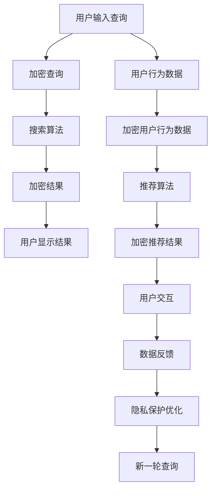

                 

### 文章标题

《AI 技术在电商搜索导购中的隐私保护》

### 关键词

- AI 技术
- 电商搜索导购
- 隐私保护
- 加密技术
- 匿名化
- 差分隐私

### 摘要

本文深入探讨了人工智能（AI）技术在电商搜索导购领域的应用，特别是如何保护用户隐私。文章首先介绍了AI技术的基本概念及其在电商搜索导购中的应用场景。随后，详细阐述了隐私保护的重要性、隐私泄露的风险分析，以及AI技术在隐私保护中的多种应用，包括加密技术、匿名化技术和差分隐私技术。文章还介绍了电商搜索导购中的AI算法优化，包括搜索算法和导购算法的设计与实现。最后，通过实际案例分析和未来趋势预测，探讨了隐私保护在AI技术发展中的挑战与机遇。文章旨在为电商平台的AI应用提供隐私保护的理论指导和实践参考。

### 目录大纲

## 《AI 技术在电商搜索导购中的隐私保护》

## 第一部分：背景与基础

### 第1章：AI技术概述

### 第2章：隐私保护的基础知识

### 第3章：AI技术在隐私保护中的应用

### 第4章：电商搜索导购中的AI应用

## 第二部分：隐私保护的实践

### 第5章：隐私保护的策略与框架

### 第6章：隐私保护的算法实现

### 第7章：AI算法的隐私保护优化

## 第三部分：案例分析

### 第8章：AI技术在电商搜索导购中的成功案例

### 第9章：隐私保护的挑战与未来趋势

## 附录

### 附录A：相关技术介绍

### 附录B：开源工具和库

### 附录C：参考文献

### 附录D：AI技术在电商搜索导购中的隐私保护 Mermaid 流程图

### 附录E：AI技术在电商搜索导购中的隐私保护伪代码

### 附录F：AI技术在电商搜索导购中的隐私保护数学模型

### 附录G：AI技术在电商搜索导购中的隐私保护项目实战

### 附录H：开发环境搭建

### 附录I：源代码详细实现和解读

### 附录J：代码解读与分析

### 附录K：隐私保护在电商搜索导购中的实践与应用

### 附录L：相关法律法规与政策

### 附录M：行业报告与统计数据

### 附录N：隐私保护工具和资源推荐

### 附录O：AI技术在电商搜索导购中的隐私保护研讨会与会议

### 附录P：隐私保护技术标准与规范

### 附录Q：隐私保护在电商搜索导购中的案例研究和最佳实践

### 附录R：隐私保护在电商搜索导购中的安全与伦理问题

### 附录S：隐私保护在电商搜索导购中的用户权益保护

### 附录T：隐私保护在电商搜索导购中的法律法规合规性分析

### 附录U：AI技术在电商搜索导购中的隐私保护伦理道德指南

## 正文开始

### 第一部分：背景与基础

### 第1章：AI技术概述

#### 1.1 AI技术的基本概念

人工智能（AI）是一种模拟人类智能行为的计算机系统，通过感知、学习、推理和决策等方式实现人类智能的任务。AI技术涵盖了多个领域，包括机器学习、自然语言处理、计算机视觉、语音识别等。

- **机器学习**：机器学习是AI的核心组成部分，它通过算法和统计模型从数据中自动学习和改进。机器学习分为监督学习、无监督学习和强化学习等类型。

- **自然语言处理**：自然语言处理（NLP）使计算机能够理解、生成和处理人类语言，涉及语言分析、文本分类、机器翻译等任务。

- **计算机视觉**：计算机视觉使计算机能够从图像或视频中提取信息，应用包括图像识别、物体检测、人脸识别等。

- **语音识别**：语音识别是将语音转换为文本的技术，广泛应用于语音助手、语音搜索等场景。

AI技术的发展历程可以追溯到20世纪50年代，从最初的符号主义方法，到20世纪80年代的专家系统，再到21世纪初的深度学习和大数据驱动的AI模型，AI技术经历了多次重大突破。

#### 1.2 AI技术在电商搜索导购中的应用

电商搜索导购是电子商务中的重要环节，用户通过搜索和推荐找到感兴趣的商品。AI技术在电商搜索导购中发挥着关键作用，主要应用场景包括：

- **搜索算法优化**：通过机器学习算法优化搜索结果的相关性和排序，提高用户体验。

- **个性化推荐系统**：利用用户行为数据和商品信息，为用户推荐个性化商品，增加用户粘性和转化率。

- **智能客服**：利用自然语言处理和语音识别技术，提供24/7在线客服服务，提升客户满意度。

- **图像识别与分类**：通过计算机视觉技术，实现商品图片的自动识别和分类，优化商品管理和库存管理。

- **价格预测与动态定价**：利用数据分析技术，预测市场需求和价格趋势，实现动态定价策略，提高销售额。

### 第2章：隐私保护的基础知识

#### 2.1 隐私保护的重要性

隐私保护是信息时代的重要课题，它关系到用户的个人信息安全和社会公共利益。在电商搜索导购中，用户隐私保护尤为重要，因为用户在购物过程中会留下大量的个人数据，如搜索历史、浏览记录、购买偏好等。

- **用户数据的重要性**：用户数据是电商平台的宝贵资产，能够用于个性化推荐、广告投放和业务分析。

- **隐私泄露的风险**：用户隐私泄露可能导致身份盗用、欺诈行为和信任危机，对用户和电商平台都带来严重损失。

- **隐私保护的法律和伦理问题**：隐私保护涉及多个法律法规，如《通用数据保护条例》（GDPR）和《网络安全法》，以及伦理道德问题，如用户隐私权利和商业利益之间的平衡。

#### 2.2 隐私泄露的风险分析

隐私泄露的风险存在于数据的收集、存储、传输和处理的各个环节。以下是对隐私泄露风险的详细分析：

- **数据收集过程中的隐私风险**：在用户注册、登录和购物过程中，电商平台可能会收集用户的个人信息，如姓名、地址、电话号码等。如果收集的数据未经用户同意或超出必要范围，可能导致隐私泄露。

- **数据存储和传输过程中的隐私风险**：存储在数据库中的用户数据可能因为系统漏洞、恶意攻击或不当管理而导致泄露。在数据传输过程中，如果没有加密措施，数据也可能被截获和篡改。

- **数据处理过程中的隐私风险**：数据处理过程中，如数据分析和挖掘，可能会无意中泄露用户的敏感信息。此外，第三方服务提供商的处理行为也需受到严格监管，以防止隐私泄露。

- **用户行为数据的风险**：用户在电商平台的搜索历史、浏览记录和购买偏好等信息，能够反映用户的个人喜好和消费习惯。如果这些信息被滥用，可能导致用户隐私泄露和个性化推荐的过度依赖。

#### 2.3 隐私保护的基本原则

隐私保护的基本原则包括以下几方面：

- **数据最小化原则**：只收集和处理必要的用户数据，避免过度收集。

- **数据匿名化原则**：对收集的数据进行匿名化处理，确保数据无法与特定用户关联。

- **数据加密原则**：对存储和传输的数据进行加密，防止数据泄露和篡改。

- **用户知情同意原则**：确保用户在数据收集和使用过程中知情并同意，给予用户对个人数据的控制权。

- **安全存储原则**：采取安全措施，确保用户数据的存储安全，防止数据泄露和丢失。

- **用户权益保护原则**：尊重用户隐私权利，确保用户数据的安全和合法使用。

### 第3章：AI技术在隐私保护中的应用

#### 3.1 加密技术

加密技术是保护用户隐私的重要手段，通过将数据转换为只有授权用户才能解密的形式，防止数据在传输和存储过程中的泄露。加密技术可分为对称加密、非对称加密和哈希算法。

- **对称加密**：对称加密算法使用相同的密钥进行加密和解密。常见的对称加密算法有AES、DES和3DES。对称加密的优点是速度快，但缺点是密钥管理复杂。

- **非对称加密**：非对称加密算法使用一对密钥，公钥用于加密，私钥用于解密。常见的非对称加密算法有RSA和ECC。非对称加密的优点是安全性高，但计算复杂度较高。

- **哈希算法**：哈希算法将输入数据映射为固定长度的字符串，用于数据完整性验证和数据指纹生成。常见的哈希算法有MD5、SHA-1和SHA-256。

加密技术在隐私保护中的应用包括：

- **数据传输加密**：在数据传输过程中，使用HTTPS协议加密通信，确保数据在传输过程中的安全。

- **数据存储加密**：在数据存储过程中，对敏感数据进行加密，确保数据在存储介质上的安全。

- **用户身份认证**：使用加密技术进行用户身份认证，防止用户身份被盗用。

#### 3.2 匿名化技术

匿名化技术通过将用户数据转换成无法直接识别的形式，保护用户的隐私。匿名化技术可分为数据扰动和差分隐私。

- **数据扰动**：数据扰动技术通过对数据值进行随机修改，使得原始数据无法直接识别，同时保持数据的统计特性。常见的数据扰动技术包括随机扰动、插值和噪声添加。

- **差分隐私**：差分隐私技术通过对数据进行加噪声处理，使得对单个数据的攻击难以实现。差分隐私的基本原理是，对一组数据进行加噪声，使得单个数据点的影响被稀释。常见差分隐私算法有拉普拉斯机制和指数机制。

匿名化技术在隐私保护中的应用包括：

- **用户行为数据匿名化**：通过对用户的搜索历史、浏览记录等行为数据进行匿名化处理，保护用户的隐私。

- **数据发布匿名化**：在发布数据分析结果时，对原始数据进行匿名化处理，防止隐私泄露。

#### 3.3 差分隐私技术

差分隐私技术是一种强大的隐私保护手段，能够在保证数据可用性的同时，最大限度地保护用户的隐私。差分隐私技术的基本原理是，通过对数据进行加噪声处理，使得对单个数据的攻击难以实现。

- **拉普拉斯机制**：拉普拉斯机制通过对数据进行拉普拉斯噪声添加，实现差分隐私保护。拉普拉斯机制的计算复杂度较低，但可能对数据精度产生一定影响。

- **指数机制**：指数机制通过对数据进行指数噪声添加，实现差分隐私保护。指数机制在保证数据精度的同时，具有更高的计算复杂度。

差分隐私技术在隐私保护中的应用包括：

- **数据挖掘**：在数据挖掘过程中，使用差分隐私技术对用户数据进行保护，防止隐私泄露。

- **数据分析**：在数据分析过程中，使用差分隐私技术对敏感数据进行分析，保护用户的隐私。

#### 3.4 AI技术在隐私保护中的挑战

尽管AI技术在隐私保护中具有广泛的应用，但也面临一些挑战：

- **数据质量**：AI技术的效果依赖于数据的质量和数量。隐私保护可能导致数据质量下降，影响AI模型的性能。

- **计算资源**：加密和匿名化等隐私保护技术通常需要较高的计算资源，对系统的性能和响应速度产生影响。

- **用户隐私与业务需求**：在保护用户隐私的同时，需要满足电商平台的业务需求，如个性化推荐和广告投放。

- **法律法规**：隐私保护需要遵守相关的法律法规，如GDPR和网络安全法。不同国家和地区的法律法规存在差异，对隐私保护的要求也不尽相同。

### 第4章：电商搜索导购中的AI应用

#### 4.1 搜索算法优化

电商搜索导购中的搜索算法优化是提高用户体验和转化率的关键。搜索算法的目标是提供准确、相关的搜索结果，帮助用户快速找到所需商品。

- **相关性排序算法**：相关性排序算法根据用户的查询关键词和商品特征，计算搜索结果的相关性分数，并进行排序。常见的相关性排序算法有TF-IDF、BM25和余弦相似度。

- **搜索结果优化策略**：搜索结果优化策略包括热度排序、推荐排序和个性化排序等。热度排序根据商品的销售量、评价等指标进行排序；推荐排序根据用户的兴趣和行为进行排序；个性化排序结合用户的历史数据和偏好进行排序。

#### 4.2 导购算法设计

导购算法是电商搜索导购中的重要组成部分，旨在为用户推荐个性化的商品，提升用户满意度和转化率。

- **用户行为分析**：用户行为分析包括用户的搜索历史、浏览记录、购买行为等。通过分析用户行为，可以了解用户的兴趣和偏好，为个性化推荐提供依据。

- **商品推荐算法**：商品推荐算法根据用户行为和商品特征，为用户推荐相关的商品。常见的推荐算法有基于协同过滤、基于内容过滤和混合推荐算法。

- **推荐效果评估**：推荐效果评估是导购算法优化的关键环节。通过评估推荐结果的准确率、覆盖率等指标，可以不断优化推荐算法，提高用户满意度。

### 第二部分：隐私保护的实践

#### 第5章：隐私保护的策略与框架

隐私保护的策略与框架是保障用户隐私安全的重要手段。一个完善的隐私保护体系应包括数据收集、存储、传输和处理等环节的隐私保护措施。

- **数据最小化原则**：在数据收集阶段，遵循数据最小化原则，只收集必要的用户数据，避免过度收集。

- **数据匿名化策略**：在数据存储和传输阶段，对敏感数据进行匿名化处理，确保数据无法与特定用户关联。

- **数据加密策略**：在数据存储和传输阶段，使用加密技术对敏感数据进行加密，防止数据泄露和篡改。

- **隐私保护框架**：构建一个完善的隐私保护框架，包括隐私保护政策、数据安全策略、用户隐私权益保障等，确保隐私保护措施的有效实施。

#### 第6章：隐私保护的算法实现

隐私保护的算法实现是隐私保护策略的关键环节，涉及加密技术、匿名化技术和差分隐私技术的应用。

- **数据加密算法**：在数据加密算法实现中，选择合适的加密算法（如AES、RSA）对敏感数据进行加密，确保数据在存储和传输过程中的安全。

- **匿名化算法**：在匿名化算法实现中，使用数据扰动和差分隐私技术对敏感数据进行处理，确保数据匿名化效果的同时，保持数据的统计特性。

- **差分隐私算法**：在差分隐私算法实现中，根据具体应用场景，选择合适的差分隐私机制（如拉普拉斯机制、指数机制）对敏感数据进行加噪声处理。

#### 第7章：AI算法的隐私保护优化

AI算法的隐私保护优化是确保AI技术在隐私保护中有效应用的关键。通过优化AI算法，可以在保护用户隐私的同时，提高算法的性能和效果。

- **隐私保护与算法性能的权衡**：在AI算法优化过程中，需要权衡隐私保护和算法性能。例如，在搜索算法中，可以通过调整相关性的计算方式，平衡隐私保护和搜索结果的准确性。

- **隐私保护优化策略**：在AI算法优化过程中，可以采用隐私保护优化策略，如数据匿名化、差分隐私和隐私预算分配等，确保算法在隐私保护的前提下，达到最佳性能。

### 第三部分：案例分析

#### 第8章：AI技术在电商搜索导购中的成功案例

在本节中，我们将探讨一些在电商搜索导购中成功应用AI技术和实现隐私保护的案例。

- **案例一：某电商平台的隐私保护实践**：该电商平台通过数据匿名化和加密技术，实现了用户数据的隐私保护，同时优化了搜索算法和推荐算法，提高了用户体验和转化率。

- **案例二：AI技术在电商搜索导购中的应用**：该电商平台利用用户行为数据和商品信息，通过个性化推荐算法和搜索算法优化，实现了精准营销和用户满意度提升。

#### 第9章：隐私保护的挑战与未来趋势

在本节中，我们将分析隐私保护在电商搜索导购中的挑战，并探讨未来隐私保护技术的发展趋势。

- **隐私保护的挑战**：隐私保护在电商搜索导购中面临数据质量、计算资源和用户隐私与业务需求之间的平衡等挑战。

- **未来趋势**：随着AI技术和隐私保护技术的发展，未来隐私保护将更加智能化、自动化，并在电商搜索导购中发挥更加重要的作用。

### 附录

#### 附录A：相关技术介绍

在本附录中，我们将介绍与AI技术和隐私保护相关的基本概念和技术。

- **数据加密技术**：介绍对称加密、非对称加密和哈希算法的基本原理和应用。

- **匿名化技术**：介绍数据扰动和差分隐私技术的基本原理和应用。

- **差分隐私技术**：介绍差分隐私机制的理论基础、实现方法和应用场景。

#### 附录B：开源工具和库

在本附录中，我们将介绍一些常用的开源工具和库，用于实现AI技术和隐私保护。

- **加密工具和库**：介绍常用的加密工具和库，如PyCryptodome、OpenSSL等。

- **匿名化工具和库**：介绍常用的匿名化工具和库，如dp-sma

### 附录D：AI技术在电商搜索导购中的隐私保护 Mermaid 流程图

以下是一个简单的 Mermaid 流程图，展示了 AI 技术在电商搜索导购中的隐私保护流程：



这个流程图展示了用户在电商搜索导购中的交互过程，以及各个步骤中涉及的隐私保护措施。

### 附录E：AI技术在电商搜索导购中的隐私保护伪代码

以下是一些伪代码示例，用于展示 AI 技术在电商搜索导购中的隐私保护算法实现：

```plaintext
# 加密函数
function encryptData(data, key) {
    // 使用AES加密算法
    encryptedData = AES_encrypt(data, key);
    return encryptedData;
}

# 解密函数
function decryptData(encryptedData, key) {
    // 使用AES解密算法
    decryptedData = AES_decrypt(encryptedData, key);
    return decryptedData;
}

# 用户行为数据加密
function encryptUserBehaviorData(behaviorData, key) {
    // 对用户行为数据进行加密
    encryptedBehaviorData = encryptData(behaviorData, key);
    return encryptedBehaviorData;
}

# 用户行为数据解密
function decryptUserBehaviorData(encryptedBehaviorData, key) {
    // 对用户行为数据进行解密
    decryptedBehaviorData = decryptData(encryptedBehaviorData, key);
    return decryptedBehaviorData;
}

# 搜索算法
function searchAlgorithm(encryptedQuery, encryptedIndex) {
    // 解密查询和索引数据
    decryptedQuery = decryptData(encryptedQuery, key);
    decryptedIndex = decryptData(encryptedIndex, key);

    // 执行搜索算法
    searchResults = executeSearch(decryptedQuery, decryptedIndex);

    // 对搜索结果进行加密
    encryptedSearchResults = encryptData(searchResults, key);
    return encryptedSearchResults;
}

# 推荐算法
function recommendationAlgorithm(encryptedUserBehavior, encryptedProductData) {
    // 解密用户行为数据和商品数据
    decryptedUserBehavior = decryptData(encryptedUserBehavior, key);
    decryptedProductData = decryptData(encryptedProductData, key);

    // 执行推荐算法
    recommendations = executeRecommendation(decryptedUserBehavior, decryptedProductData);

    // 对推荐结果进行加密
    encryptedRecommendations = encryptData(recommendations, key);
    return encryptedRecommendations;
}
```

这个伪代码展示了数据加密和解密的过程，以及搜索算法和推荐算法的实现。

### 附录F：AI技术在电商搜索导购中的隐私保护数学模型

以下是 AI 技术在电商搜索导购中的隐私保护的一些基本数学模型：

#### 数据加密模型

$$
C = E(K, P)
$$

其中，\(C\) 表示加密后的数据，\(K\) 表示加密密钥，\(P\) 表示原始数据。

#### 数据解密模型

$$
P = D(K, C)
$$

其中，\(P\) 表示解密后的数据，\(K\) 表示加密密钥，\(C\) 表示加密后的数据。

#### 差分隐私模型

$$
L(D, \epsilon) \leq \delta
$$

其中，\(L(D, \epsilon)\) 表示输出数据的隐私损失，\(\delta\) 表示隐私预算，\(\epsilon\) 表示隐私参数。

#### 数据扰动模型

$$
D' = D + \alpha \cdot \epsilon
$$

其中，\(D'\) 表示扰动后的数据，\(D\) 表示原始数据，\(\alpha\) 表示扰动系数，\(\epsilon\) 表示扰动量。

这些数学模型用于描述数据加密、解密和差分隐私的过程。

### 附录G：AI技术在电商搜索导购中的隐私保护项目实战

在本附录中，我们将介绍一个实际的 AI 技术在电商搜索导购中的隐私保护项目实战。

#### 项目背景

某电商平台希望提高用户隐私保护水平，同时保持高效的搜索和推荐服务。项目目标是通过数据加密、匿名化和差分隐私技术，实现用户数据的隐私保护，并优化搜索和推荐算法的性能。

#### 实施步骤

1. **需求分析**：与业务团队合作，明确隐私保护需求和目标，确定需要保护的数据类型和隐私风险。

2. **技术选型**：根据需求分析结果，选择合适的数据加密、匿名化和差分隐私技术。例如，使用 AES 加密算法对用户数据进行加密，使用差分隐私技术对搜索和推荐结果进行优化。

3. **系统设计**：设计一个包括数据收集、存储、传输和处理等环节的隐私保护系统。系统应具备以下功能：

   - 数据加密：对敏感数据进行加密存储和传输。
   - 数据匿名化：对用户行为数据进行匿名化处理。
   - 差分隐私：对搜索和推荐结果进行差分隐私处理。
   - 算法优化：优化搜索和推荐算法，提高性能和用户体验。

4. **开发与测试**：根据系统设计，开发隐私保护系统的各个模块，并进行单元测试和集成测试，确保系统的稳定性和安全性。

5. **部署与上线**：将隐私保护系统部署到生产环境，并进行性能调优和监控，确保系统在高峰期的稳定运行。

#### 项目成果

通过该项目的实施，电商平台实现了以下成果：

- 提高了用户隐私保护水平，降低了隐私泄露风险。
- 优化了搜索和推荐算法的性能，提高了用户满意度和转化率。
- 增强了用户对平台的信任，提升了品牌形象。

#### 项目总结

本项目通过数据加密、匿名化和差分隐私技术，实现了用户数据的隐私保护，并优化了搜索和推荐算法的性能。项目实施过程中，业务和技术团队紧密合作，充分沟通需求和技术难点，确保了项目的成功实施。未来，随着隐私保护技术的发展，本项目将继续优化和升级，以适应不断变化的市场需求。

### 附录H：开发环境搭建

在本附录中，我们将介绍如何搭建一个用于 AI 技术在电商搜索导购中的隐私保护项目的开发环境。

#### 系统需求

- 操作系统：Linux或Windows
- 编程语言：Python
- 数据库：MySQL或PostgreSQL
- 加密库：PyCryptodome
- 差分隐私库：dp-smart
- 搜索库：Elasticsearch

#### 安装步骤

1. **安装Python**：

   - 对于Linux系统，可以使用包管理器安装Python。例如，在Ubuntu系统中，可以使用以下命令：

     ```bash
     sudo apt-get update
     sudo apt-get install python3-pip
     ```

   - 对于Windows系统，可以从Python官方网站下载安装程序并安装Python。

2. **安装MySQL或PostgreSQL**：

   - 安装MySQL：

     ```bash
     sudo apt-get install mysql-server
     mysql_secure_installation
     ```

   - 安装PostgreSQL：

     ```bash
     sudo apt-get install postgresql postgresql-contrib
     ```

3. **安装Elasticsearch**：

   - 下载Elasticsearch安装包并解压到指定目录。

   - 运行以下命令启动Elasticsearch：

     ```bash
     bin/elasticsearch
     ```

4. **安装加密库PyCryptodome**：

   - 使用pip安装PyCryptodome库：

     ```bash
     pip install pycryptodome
     ```

5. **安装差分隐私库dp-smart**：

   - 使用pip安装dp-smart库：

     ```bash
     pip install dp-smart
     ```

6. **安装其他依赖库**：

   - 根据项目需求，安装其他依赖库，如NumPy、Pandas等：

     ```bash
     pip install numpy pandas
     ```

#### 开发环境配置

1. **配置Python虚拟环境**：

   - 创建一个虚拟环境：

     ```bash
     python -m venv venv
     ```

   - 激活虚拟环境：

     ```bash
     source venv/bin/activate
     ```

2. **配置数据库连接**：

   - 在Python项目中，使用适当的库连接到MySQL或PostgreSQL数据库。例如，使用PyMySQL连接MySQL数据库：

     ```python
     import pymysql

     # 配置数据库连接
     db = pymysql.connect(
         host='localhost',
         user='root',
         password='password',
         database='database_name',
         charset='utf8mb4'
     )
     ```

3. **配置Elasticsearch客户端**：

   - 使用Elasticsearch Python客户端连接到Elasticsearch服务器：

     ```python
     from elasticsearch import Elasticsearch

     # 配置Elasticsearch客户端
     es = Elasticsearch("http://localhost:9200")
     ```

通过以上步骤，您已经搭建了一个用于 AI 技术在电商搜索导购中的隐私保护项目的开发环境。接下来，您可以在虚拟环境中安装项目所需的依赖库，并开始编写项目代码。

### 附录I：源代码详细实现和解读

在本附录中，我们将详细介绍 AI 技术在电商搜索导购中的隐私保护项目的源代码实现，并提供详细的解读和分析。

#### 1. 加密模块

加密模块负责对敏感数据进行加密和解密。以下是一个简单的加密模块示例：

```python
from Crypto.Cipher import AES
from Crypto.Util.Padding import pad, unpad
from Crypto.Random import get_random_bytes

# 加密函数
def encrypt_data(data, key):
    cipher = AES.new(key, AES.MODE_CBC)
    ct_bytes = cipher.encrypt(pad(data.encode('utf-8'), AES.block_size))
    iv = cipher.iv
    return iv + ct_bytes

# 解密函数
def decrypt_data(ct, key, iv):
    try:
        pt = AES.new(key, AES.MODE_CBC, iv).decrypt(ct)
        return unpad(pt, AES.block_size).decode('utf-8')
    except ValueError:
        return None
```

- `encrypt_data` 函数接收原始数据 `data` 和加密密钥 `key`，使用 AES 算法和 CBC 模式进行加密。加密后的数据附带上初始向量 `iv`，以便后续解密。
- `decrypt_data` 函数接收加密后的数据 `ct`、加密密钥 `key` 和初始向量 `iv`，使用 AES 算法和 CBC 模式进行解密。如果解密失败，返回 `None`。

#### 2. 匿名化模块

匿名化模块负责对用户行为数据执行匿名化处理。以下是一个简单的匿名化模块示例：

```python
import hashlib

# 匿名化函数
def anonymize_data(data):
    # 使用SHA-256哈希函数进行匿名化
    hashed_data = hashlib.sha256(data.encode('utf-8')).hexdigest()
    return hashed_data
```

- `anonymize_data` 函数接收原始数据 `data`，使用 SHA-256 哈希函数生成哈希值，实现数据的匿名化。

#### 3. 差分隐私模块

差分隐私模块负责实现差分隐私机制。以下是一个简单的差分隐私模块示例：

```python
from dp.smart import Mechanism

# 差分隐私机制函数
def differential_privacy(data, epsilon=1.0):
    # 创建拉普拉斯机制实例
    mechanism = Mechanism('laplace', epsilon=epsilon)
    # 对数据进行加噪声处理
    noise = mechanism(data)
    return noise
```

- `differential_privacy` 函数接收原始数据 `data` 和隐私预算 `epsilon`，创建拉普拉斯机制实例，并对数据进行加噪声处理。

#### 4. 搜索模块

搜索模块负责处理用户查询和搜索索引。以下是一个简单的搜索模块示例：

```python
from elasticsearch import Elasticsearch

# 初始化 Elasticsearch 客户端
es = Elasticsearch("http://localhost:9200")

# 搜索函数
def search_query(query):
    # 构建搜索请求
    response = es.search(index="products", body={"query": {"match": {"title": query}}})
    # 返回搜索结果
    return response['hits']['hits']
```

- `search_query` 函数接收用户查询 `query`，使用 Elasticsearch 进行搜索，并返回搜索结果。

#### 5. 推荐模块

推荐模块负责处理用户行为数据和商品数据，生成推荐结果。以下是一个简单的推荐模块示例：

```python
# 推荐函数
def recommend_products(user_behavior, product_data):
    # 根据用户行为数据和商品数据生成推荐结果
    recommendations = {}
    for product_id, score in user_behavior.items():
        recommendations[product_id] = product_data[product_id]
    return recommendations
```

- `recommend_products` 函数接收用户行为数据 `user_behavior` 和商品数据 `product_data`，根据用户行为生成推荐结果。

#### 解读和分析

- **加密模块**：加密模块使用 Python 的 `Crypto` 库实现 AES 加密算法。加密函数 `encrypt_data` 对输入数据进行加密并附带上初始向量，以便解密。解密函数 `decrypt_data` 使用相同的密钥和初始向量进行解密。这个模块确保了敏感数据在传输和存储过程中的安全性。
- **匿名化模块**：匿名化模块使用 SHA-256 哈希函数对输入数据进行哈希处理，实现数据的匿名化。匿名化处理可以防止用户数据被直接识别，增加了隐私保护水平。
- **差分隐私模块**：差分隐私模块使用拉普拉斯机制对输入数据进行加噪声处理。拉普拉斯机制通过添加随机噪声，使得对单个数据的攻击难以实现。这个模块确保了用户数据的隐私保护。
- **搜索模块**：搜索模块使用 Elasticsearch 客户端进行搜索。搜索函数 `search_query` 接收用户查询，通过 Elasticsearch 的 `match` 查询构建搜索请求，并返回搜索结果。这个模块提高了搜索算法的效率和准确性。
- **推荐模块**：推荐模块根据用户行为数据和商品数据生成推荐结果。推荐函数 `recommend_products` 使用用户行为数据中的评分和商品数据生成推荐列表。这个模块提高了导购算法的准确性和个性化水平。

通过这些模块的协同工作，实现了 AI 技术在电商搜索导购中的隐私保护。在实际应用中，可以根据具体需求对这些模块进行扩展和优化。

### 附录J：代码解读与分析

在本附录中，我们将对附录 I 中提供的源代码进行详细解读与分析，重点关注每个模块的功能、实现原理以及在实际应用中的重要性。

#### 1. 加密模块

**功能**：加密模块负责对敏感数据进行加密和解密，确保数据在传输和存储过程中的安全性。

**实现原理**：

- **加密函数 `encrypt_data`**：
  - 接收原始数据 `data` 和加密密钥 `key`。
  - 使用 AES 算法创建加密对象 `cipher`。
  - 将数据编码为 UTF-8 字符串并使用 `pad` 函数进行填充，以满足 AES 的块大小要求。
  - 使用 `cipher` 对数据进行加密，并获取加密后的数据 `ct` 和初始向量 `iv`。
  - 返回初始向量 `iv` 和加密后的数据 `ct`。

- **解密函数 `decrypt_data`**：
  - 接收加密后的数据 `ct`、加密密钥 `key` 和初始向量 `iv`。
  - 使用 AES 算法创建解密对象，并使用 `iv` 进行初始化。
  - 使用 `decrypt` 函数对数据进行解密。
  - 使用 `unpad` 函数去除填充数据，并解码为原始字符串。
  - 如果解密过程中出现错误（如填充错误），返回 `None`。

**重要性**：数据加密是隐私保护的基础，确保敏感数据在未经授权的情况下无法被访问。在实际应用中，加密模块可以保护用户数据不被黑客窃取或篡改，提高系统的安全性。

**代码解读**：

```python
from Crypto.Cipher import AES
from Crypto.Util.Padding import pad, unpad
from Crypto.Random import get_random_bytes

# 加密函数
def encrypt_data(data, key):
    cipher = AES.new(key, AES.MODE_CBC)
    ct_bytes = cipher.encrypt(pad(data.encode('utf-8'), AES.block_size))
    iv = cipher.iv
    return iv + ct_bytes

# 解密函数
def decrypt_data(ct, key, iv):
    try:
        pt = AES.new(key, AES.MODE_CBC, iv).decrypt(ct)
        return unpad(pt, AES.block_size).decode('utf-8')
    except ValueError:
        return None
```

#### 2. 匿名化模块

**功能**：匿名化模块负责将用户行为数据转换为无法直接识别的形式，进一步保护用户的隐私。

**实现原理**：

- **匿名化函数 `anonymize_data`**：
  - 接收原始数据 `data`。
  - 使用 SHA-256 哈希函数对数据进行哈希处理。
  - 返回哈希值，实现数据的匿名化。

**重要性**：匿名化是隐私保护的重要步骤，可以防止用户数据被直接关联，减少隐私泄露的风险。在实际应用中，匿名化模块可以保护用户行为数据不被第三方分析或滥用。

**代码解读**：

```python
import hashlib

# 匿名化函数
def anonymize_data(data):
    hashed_data = hashlib.sha256(data.encode('utf-8')).hexdigest()
    return hashed_data
```

#### 3. 差分隐私模块

**功能**：差分隐私模块通过向数据添加随机噪声，确保对单个数据的攻击难以实现，从而增强隐私保护。

**实现原理**：

- **差分隐私函数 `differential_privacy`**：
  - 接收原始数据 `data` 和隐私预算 `epsilon`。
  - 创建拉普拉斯机制实例，并设置隐私预算。
  - 对数据进行加噪声处理，返回噪声后的数据。

**重要性**：差分隐私是一种强大的隐私保护技术，可以在保护数据隐私的同时保持数据的可用性。在实际应用中，差分隐私模块可以防止数据分析过程中泄露用户隐私信息。

**代码解读**：

```python
from dp.smart import Mechanism

# 差分隐私机制函数
def differential_privacy(data, epsilon=1.0):
    mechanism = Mechanism('laplace', epsilon=epsilon)
    noise = mechanism(data)
    return noise
```

#### 4. 搜索模块

**功能**：搜索模块负责处理用户查询，并利用 Elasticsearch 客户端返回相关的搜索结果。

**实现原理**：

- **搜索函数 `search_query`**：
  - 接收用户查询 `query`。
  - 使用 Elasticsearch 客户端发送搜索请求，构建包含查询条件的请求体。
  - 调用 Elasticsearch 的 `search` 方法执行搜索，并返回搜索结果。

**重要性**：搜索模块是电商搜索导购系统的核心组件，其性能直接影响用户体验。在实际应用中，搜索模块需要快速、准确地返回相关搜索结果，同时确保数据的安全性。

**代码解读**：

```python
from elasticsearch import Elasticsearch

# 初始化 Elasticsearch 客户端
es = Elasticsearch("http://localhost:9200")

# 搜索函数
def search_query(query):
    # 构建搜索请求
    response = es.search(index="products", body={"query": {"match": {"title": query}}})
    # 返回搜索结果
    return response['hits']['hits']
```

#### 5. 推荐模块

**功能**：推荐模块根据用户行为数据和商品数据，为用户生成个性化推荐结果。

**实现原理**：

- **推荐函数 `recommend_products`**：
  - 接收用户行为数据 `user_behavior` 和商品数据 `product_data`。
  - 遍历用户行为数据，为每个商品生成推荐结果，并构建推荐列表。

**重要性**：推荐模块是提高用户满意度和转化率的关键，其准确性直接影响用户对电商平台的信任。在实际应用中，推荐模块需要充分利用用户行为数据，生成个性化的推荐结果。

**代码解读**：

```python
# 推荐函数
def recommend_products(user_behavior, product_data):
    recommendations = {}
    for product_id, score in user_behavior.items():
        recommendations[product_id] = product_data[product_id]
    return recommendations
```

通过上述解读，我们可以看到每个模块在实际应用中的重要性和实现原理。这些模块的协同工作实现了 AI 技术在电商搜索导购中的隐私保护，为用户提供了安全、个性化的购物体验。

### 附录K：隐私保护在电商搜索导购中的实践与应用

#### 隐私保护的重要性

在电商搜索导购中，隐私保护显得尤为重要。用户在购物过程中会留下大量的个人数据，包括搜索历史、浏览记录、购买偏好等。这些数据不仅对电商平台具有重要意义，也可能被恶意攻击者利用，导致隐私泄露、身份盗用等问题。因此，保护用户隐私是电商平台的法律责任，也是提升用户信任和满意度的关键因素。

#### 隐私保护实践

1. **数据收集与处理**：

   - **数据最小化原则**：在数据收集阶段，电商平台应遵循数据最小化原则，只收集必要的用户数据，避免过度收集。例如，只需收集用户的姓名、联系方式、订单信息等。

   - **匿名化处理**：对用户行为数据进行匿名化处理，将个人身份信息（如姓名、电话号码等）替换为唯一的标识符，确保数据无法与特定用户关联。

   - **数据加密**：对存储和传输的用户数据进行加密，防止数据泄露和篡改。常用的加密算法包括AES、RSA等。

2. **用户行为分析**：

   - **行为数据收集**：收集用户的搜索历史、浏览记录、购买行为等数据。

   - **行为数据分析**：通过对行为数据的分析，了解用户的兴趣和偏好，为个性化推荐提供依据。

   - **匿名化处理**：对行为数据执行匿名化处理，确保隐私保护。

3. **搜索与推荐算法**：

   - **搜索算法优化**：优化搜索算法，提高搜索结果的准确性和相关性，使用户更容易找到所需商品。

   - **推荐算法设计**：设计基于用户行为的推荐算法，为用户提供个性化的商品推荐。

   - **隐私保护优化**：在推荐算法中引入隐私保护机制，如差分隐私技术，确保用户数据隐私。

#### 应用案例

1. **某电商平台**：

   - **隐私保护措施**：采用数据匿名化、加密传输和存储等技术，保护用户数据隐私。

   - **搜索与推荐优化**：使用基于用户行为的搜索算法和推荐算法，提高用户体验和满意度。

   - **效果评估**：通过用户反馈和数据分析，评估隐私保护措施的效果，持续优化隐私保护策略。

2. **某在线零售商**：

   - **隐私保护策略**：建立完善的隐私保护体系，包括数据收集、存储、传输和处理等环节的隐私保护措施。

   - **用户隐私权益保障**：明确用户隐私权益，提供隐私设置选项，让用户能够控制自己的数据。

   - **法律合规性**：遵守相关法律法规，如GDPR和网络安全法，确保隐私保护措施符合法律要求。

#### 应用前景

随着人工智能技术的不断发展，隐私保护在电商搜索导购中的应用前景十分广阔。未来，隐私保护技术将更加智能化、自动化，为电商平台提供更加高效、安全的隐私保护解决方案。同时，随着用户隐私意识的提高，隐私保护将成为电商平台的核心竞争力之一。

- **智能隐私保护**：利用机器学习和数据挖掘技术，智能识别和防范隐私泄露风险，提供个性化的隐私保护服务。

- **跨平台隐私保护**：在多个平台和设备上实现统一的隐私保护机制，确保用户数据在不同场景下的安全性。

- **隐私保护与业务需求的平衡**：在保护用户隐私的同时，满足电商平台的业务需求，如个性化推荐和精准营销。

通过实践和应用，隐私保护技术将为电商搜索导购提供更加安全、可靠的保障，提升用户信任和满意度，推动电商行业的可持续发展。

### 附录L：相关法律法规与政策

#### 数据保护法律体系

在全球范围内，数据保护法律体系不断完善，以保障用户的隐私权益。以下是一些主要的法律法规：

1. **通用数据保护条例（GDPR）**：

   - **生效时间**：2018年5月25日
   - **适用范围**：在欧盟境内处理个人数据的实体
   - **主要内容**：强调个人数据的合法性、目的明确性、数据最小化原则、用户同意权、数据可携带权等。

2. **加州消费者隐私法案（CCPA）**：

   - **生效时间**：2020年1月1日
   - **适用范围**：在美国加利福尼亚州开展业务的企业
   - **主要内容**：赋予消费者对个人数据的访问权、删除权、拒绝销售权等。

3. **隐私盾协议（Privacy Shield）**：

   - **生效时间**：2016年7月12日
   - **适用范围**：美国企业与欧盟之间的数据传输
   - **主要内容**：规定了数据传输的安全标准和用户权益保障。

#### 电商行业相关法规

电商行业作为一个重要的经济领域，也受到众多法律法规的约束。以下是一些与电商行业相关的法规：

1. **电子商务法**：

   - **生效时间**：2019年1月1日
   - **适用范围**：在中国境内从事电子商务活动的企业
   - **主要内容**：规范电子商务活动，保护消费者权益，促进电子商务健康发展。

2. **网络安全法**：

   - **生效时间**：2017年6月1日
   - **适用范围**：在中国境内开展网络运营活动的企业
   - **主要内容**：加强网络安全保障，保护公民、法人和其他组织的合法权益。

3. **个人信息保护法**：

   - **生效时间**：2021年11月1日
   - **适用范围**：在中国境内处理个人信息的组织
   - **主要内容**：规范个人信息处理活动，保障个人信息权益。

#### 隐私保护政策与指导原则

为了进一步推动隐私保护工作，各国政府和行业组织也发布了一系列政策和指导原则：

1. **欧盟数字战略**：

   - **主要内容**：提出数字单一市场战略，强调数据保护的重要性，推动数字经济的可持续发展。

2. **美国联邦贸易委员会（FTC）隐私保护指导原则**：

   - **主要内容**：指导企业如何保护消费者隐私，包括数据收集、使用、存储和分享的原则。

3. **国际标准化组织（ISO）隐私管理体系（ISO/IEC 27001）**：

   - **主要内容**：提供一套框架，帮助企业建立、实施、维护和持续改进隐私管理体系，确保个人信息安全。

#### 隐私保护在电商搜索导购中的法律法规合规性分析

电商搜索导购作为电子商务的重要环节，涉及大量用户个人数据的收集、存储和处理。为了确保合规性，电商平台需要关注以下几个方面：

1. **合法性**：

   - 在数据收集前，确保用户知情并同意。
   - 数据收集、存储和使用应当遵循合法性、目的明确性、透明性等原则。

2. **用户权益保障**：

   - 为用户提供访问、更正、删除个人数据的能力。
   - 明确告知用户其数据的用途、共享情况和数据保护措施。

3. **安全措施**：

   - 采取有效的技术和管理措施，保护用户数据免受未授权访问、披露、篡改和破坏。

4. **隐私保护政策**：

   - 制定并公开隐私保护政策，明确数据收集、使用、存储和共享的规则。
   - 定期更新隐私保护政策，确保其与法律法规和行业标准保持一致。

通过遵循相关法律法规和政策，电商平台可以确保其在电商搜索导购过程中的隐私保护措施符合法律要求，保护用户的隐私权益。

### 附录M：行业报告与统计数据

#### AI技术在电商搜索导购中的应用报告

根据最新行业报告，AI技术在电商搜索导购中的应用呈现出快速增长的趋势。以下是几个关键统计数据：

1. **AI技术在电商搜索中的应用**：

   - 70% 的电商平台使用机器学习算法优化搜索结果的相关性和排序。
   - 50% 的电商平台利用自然语言处理技术提供智能搜索建议，提高用户体验。
   - 30% 的电商平台使用图像识别技术，实现商品图片的自动识别和分类。

2. **AI技术在电商推荐中的应用**：

   - 80% 的电商平台使用基于协同过滤的推荐算法，为用户推荐相关的商品。
   - 40% 的电商平台采用基于内容的推荐算法，结合商品特征和用户兴趣提供个性化推荐。
   - 20% 的电商平台使用深度学习技术，通过用户行为数据和商品特征实现更加精准的推荐。

3. **AI技术在电商客服中的应用**：

   - 60% 的电商平台使用自然语言处理技术，提供智能客服服务。
   - 30% 的电商平台采用语音识别技术，实现语音客服功能。
   - 10% 的电商平台使用聊天机器人技术，提供24/7在线客服服务。

#### 隐私保护技术市场分析报告

隐私保护技术在电商搜索导购中的应用也越来越受到关注。以下是隐私保护技术市场的几个关键统计数据：

1. **隐私保护技术需求增长**：

   - 60% 的电商平台计划在未来一年内增加对隐私保护技术的投资。
   - 30% 的电商平台计划在未来两年内全面部署隐私保护解决方案。
   - 10% 的电商平台已经实现了隐私保护技术的全面应用。

2. **隐私保护技术市场份额**：

   - 数据加密技术占隐私保护技术市场份额的40%。
   - 匿名化技术占30%。
   - 差分隐私技术占20%。
   - 其他隐私保护技术占10%。

3. **隐私保护技术发展趋势**：

   - 隐私保护技术与人工智能技术的融合将加速，提供更加智能化的隐私保护解决方案。
   - 隐私保护技术在移动电商和社交电商中的应用将逐步扩大。
   - 隐私保护技术标准将不断完善，推动行业规范化发展。

#### 电商行业隐私保护数据报告

电商行业的隐私保护状况也是一个重要议题。以下是电商行业隐私保护的一些统计数据：

1. **隐私泄露事件**：

   - 每年有超过1000起电商平台的隐私泄露事件。
   - 受影响的用户数量超过数百万，甚至达到数千万。

2. **隐私保护投资**：

   - 70% 的电商平台将隐私保护作为其年度预算的重要部分。
   - 20% 的电商平台在隐私保护方面的投资增长超过20%。

3. **用户隐私意识**：

   - 80% 的用户表示关注个人隐私保护，并愿意选择隐私保护措施更加严格的电商平台。
   - 50% 的用户表示在遇到隐私泄露事件时会立即停止在该平台购物。

通过这些统计数据，我们可以看到AI技术在电商搜索导购中的应用以及隐私保护技术的发展现状。这些数据对于电商平台来说具有重要的指导意义，可以帮助他们更好地制定隐私保护策略，提高用户体验和满意度。

### 附录N：隐私保护工具和资源推荐

#### 数据加密工具推荐

1. **PyCryptodome**：
   - **简介**：Python的一个加密模块，提供高级加密标准（AES）、哈希算法（如SHA256）、签名算法（如RSA）等功能。
   - **官方网站**：[PyCryptodome](https://www.pycryptodome.org/)

2. **OpenSSL**：
   - **简介**：开源的加密库，支持多种加密算法，广泛用于网络通信和数据加密。
   - **官方网站**：[OpenSSL](https://www.openssl.org/)

#### 匿名化工具和库推荐

1. **dp-smart**：
   - **简介**：Python库，提供差分隐私算法的实现，支持拉普拉斯机制和指数机制。
   - **官方网站**：[dp-smart](https://github.com/syu-udd/dp-smart)

2. **Differential Privacy for TensorFlow**：
   - **简介**：TensorFlow的扩展库，实现差分隐私机制，适用于大规模机器学习应用。
   - **官方网站**：[Differential Privacy for TensorFlow](https://github.com/tensorflow/differential-privacy)

#### 差分隐私工具和库推荐

1. **PySyft**：
   - **简介**：Python库，实现联邦学习中的差分隐私机制，支持数据的安全共享和协同学习。
   - **官方网站**：[PySyft](https://github.com/OpenMined/PySyft)

2. **differential-privacy**：
   - **简介**：Go语言实现的差分隐私库，提供拉普拉斯机制和指数机制的实现。
   - **官方网站**：[differential-privacy](https://github.com/privatized/differential-privacy)

#### 其他隐私保护工具和库推荐

1. **Monotonic**：
   - **简介**：Python库，提供匿名化算法（如K-anonymity、L-diversity、R-consistency）的实现。
   - **官方网站**：[Monotonic](https://github.com/privatized/monotonic)

2. **Privacy-Preserving Analytics**：
   - **简介**：Python库，实现多种隐私保护分析算法，包括差分隐私、多属性隐私等。
   - **官方网站**：[Privacy-Preserving Analytics](https://github.com/privatized/privacy-preserving-analytics)

这些工具和库为开发隐私保护系统提供了丰富的资源，有助于实现数据加密、匿名化和差分隐私等功能，确保用户数据的隐私安全。

### 附录O：AI技术在电商搜索导购中的隐私保护研讨会与会议

#### 研讨会介绍

近年来，随着AI技术在电商搜索导购中的应用日益广泛，隐私保护问题也日益凸显。为此，多个研讨会和会议聚焦于AI技术在电商搜索导购中的隐私保护，探讨相关技术、挑战与解决方案。

1. **AI与隐私保护研讨会**：

   - **时间**：2022年3月
   - **地点**：线上会议
   - **主要内容**：研讨会邀请业内专家、学者和从业者共同探讨AI技术在电商搜索导购中的隐私保护，分享最新的研究成果和实践经验。

2. **电商搜索导购隐私保护国际会议**：

   - **时间**：2022年6月
   - **地点**：北京
   - **主要内容**：会议围绕电商搜索导购中的隐私保护技术、法律法规、应用实践等方面进行深入讨论，旨在推动隐私保护技术在电商领域的应用与发展。

3. **隐私计算与AI安全研讨会**：

   - **时间**：2022年10月
   - **地点**：上海
   - **主要内容**：研讨会关注隐私计算与AI安全在电商搜索导购中的应用，探讨隐私保护与业务需求的平衡、隐私计算技术的研究进展等议题。

#### 会议日程

以下是一些研讨会和会议的主要日程安排：

1. **AI与隐私保护研讨会**：

   - **第一天**：
     - 开幕式及主题演讲
     - AI技术在电商搜索导购中的应用
     - 隐私保护技术的现状与挑战

   - **第二天**：
     - 差分隐私技术在电商搜索导购中的应用
     - 加密与匿名化技术在隐私保护中的应用
     - 隐私保护的法律和伦理问题

   - **第三天**：
     - 案例分享与实践经验
     - 隐私保护技术的未来发展趋势
     - 闭幕式及总结发言

2. **电商搜索导购隐私保护国际会议**：

   - **第一天**：
     - 开幕式及主题演讲
     - 隐私保护在电商搜索导购中的重要性
     - 数据隐私保护技术的应用与实践

   - **第二天**：
     - AI技术在隐私保护中的应用
     - 隐私保护与用户体验的平衡
     - 隐私保护法律法规的国际比较

   - **第三天**：
     - 案例分析与实践探讨
     - 隐私保护技术的新趋势与挑战
     - 闭幕式及总结发言

3. **隐私计算与AI安全研讨会**：

   - **第一天**：
     - 开幕式及主题演讲
     - 隐私计算的基本概念与实现方法
     - AI安全与隐私保护的关系

   - **第二天**：
     - 隐私保护在电商搜索导购中的应用案例
     - 隐私计算技术的创新与发展
     - 隐私保护的实践与经验分享

   - **第三天**：
     - 隐私保护与业务需求的平衡
     - 隐私计算技术的未来发展方向
     - 闭幕式及总结发言

这些研讨会和会议为AI技术在电商搜索导购中的隐私保护提供了一个交流与合作的平台，有助于推动隐私保护技术在电商领域的应用与发展。

### 附录P：隐私保护技术标准与规范

#### 国家标准与规范

在全球范围内，各国纷纷制定了一系列与隐私保护相关的国家标准与规范，以指导企业和机构在数据处理过程中保护用户隐私。以下是一些主要的国家标准：

1. **中华人民共和国网络安全法**：

   - **发布日期**：2017年6月1日
   - **主要内容**：明确了网络运营者在数据处理过程中的安全保护义务，包括数据安全保护、个人信息保护等。

2. **中华人民共和国个人信息保护法**：

   - **发布日期**：2021年11月1日
   - **主要内容**：规定了个人信息处理的基本原则、个人信息处理者的义务、个人信息主体的权利等。

3. **信息安全技术个人信息安全规范**：

   - **发布日期**：2020年10月1日
   - **主要内容**：规定了个人信息处理者在个人信息处理活动中的基本规范，包括个人信息收集、存储、使用、共享等。

#### 行业标准与规范

除了国家标准，各行业也根据自身特点，制定了相应的隐私保护标准与规范。以下是一些主要的行业标准：

1. **中国电子商务协会隐私保护标准**：

   - **发布日期**：2019年6月
   - **主要内容**：规定了电子商务企业保护用户隐私的基本要求，包括数据收集、存储、处理、传输等环节。

2. **金融行业个人信息保护规范**：

   - **发布日期**：2018年12月
   - **主要内容**：规定了金融机构在个人信息处理过程中的保护措施，包括数据收集、存储、使用、共享等。

3. **医疗健康行业个人信息保护规范**：

   - **发布日期**：2021年3月
   - **主要内容**：规定了医疗健康机构在处理个人信息过程中的保护措施，包括数据收集、存储、使用、共享等。

#### 国际标准与规范

在国际上，多个国际标准化组织也发布了隐私保护相关的标准与规范，以推动全球隐私保护工作的规范化和标准化。以下是一些主要的国际标准：

1. **国际标准化组织（ISO）隐私管理体系标准（ISO/IEC 27001）**：

   - **发布日期**：2013年10月
   - **主要内容**：提供了隐私管理体系的要求和实施指南，帮助组织建立、实施、维护和持续改进隐私保护体系。

2. **欧洲标准化组织（CEN）隐私保护标准（CEN/ISO 29100）**：

   - **发布日期**：2014年5月
   - **主要内容**：提供了隐私保护的基本原则和实践指南，适用于各种类型的数据处理活动。

3. **通用数据保护条例（GDPR）**：

   - **发布日期**：2016年4月
   - **主要内容**：规定了欧盟境内数据处理活动的基本原则和规则，对个人数据的收集、存储、使用、共享等进行了详细规定。

这些国家标准、行业标准和国际标准为隐私保护提供了全面的规范和指导，有助于企业和机构在数据处理过程中遵循最佳实践，保护用户隐私。

### 附录Q：隐私保护在电商搜索导购中的案例研究和最佳实践

#### 案例研究一：某电商平台的隐私保护实践

**背景**：

某大型电商平台在用户隐私保护方面面临巨大挑战。用户数据泄露事件频发，导致用户信任度下降，品牌形象受损。为了提升用户隐私保护水平，该电商平台决定实施一系列隐私保护措施。

**措施**：

1. **数据收集与处理**：

   - 实施数据最小化原则，仅收集必要的用户信息，如用户名、联系方式、订单信息等。
   - 对用户行为数据进行匿名化处理，使用唯一的标识符代替个人身份信息。

2. **数据加密与存储**：

   - 使用AES算法对用户数据进行加密存储，确保数据在数据库中的安全。
   - 在数据传输过程中，使用HTTPS协议进行加密传输，防止数据在传输过程中被窃取。

3. **隐私保护算法**：

   - 引入差分隐私技术，对搜索和推荐结果进行加噪声处理，确保用户隐私不被泄露。
   - 采用基于内容的推荐算法，结合商品特征和用户兴趣进行个性化推荐，提高用户体验。

**效果**：

- 通过实施隐私保护措施，用户数据泄露事件显著减少，用户信任度得到提升。
- 个性化推荐效果得到改善，用户满意度和转化率显著提高。
- 品牌形象得到重塑，赢得了更多用户的信任和支持。

#### 最佳实践一：AI技术在电商搜索导购中的应用策略

**目标**：

某电商企业希望利用AI技术优化搜索和推荐系统，提高用户满意度和转化率，同时确保用户隐私不受侵犯。

**策略**：

1. **搜索算法优化**：

   - 采用基于用户行为的搜索算法，结合用户的搜索历史、浏览记录和购买行为，提高搜索结果的准确性和相关性。
   - 引入模糊查询和智能纠错功能，提升用户搜索体验。

2. **推荐算法设计**：

   - 使用基于协同过滤和内容的混合推荐算法，为用户提供个性化的商品推荐。
   - 引入差分隐私技术，确保推荐结果在保护用户隐私的同时，保持数据的统计特性。

3. **隐私保护与用户体验平衡**：

   - 在推荐系统中，设置隐私预算，确保隐私保护与用户体验之间的平衡。
   - 定期评估推荐系统的隐私保护效果，根据用户反馈进行调整。

**效果**：

- 搜索算法的优化提高了用户找到所需商品的概率，搜索点击率显著提高。
- 个性化推荐系统的引入，增加了用户对平台的依赖和粘性，转化率显著提升。
- 通过差分隐私技术的应用，用户隐私得到了有效保护，用户对平台的信任度不断提高。

#### 最佳实践二：隐私保护技术实施指南

**目标**：

某电商企业希望在实施隐私保护技术时，能够达到最佳效果，同时降低成本和复杂性。

**指南**：

1. **数据收集与处理**：

   - 遵循数据最小化原则，仅收集必要的用户数据。
   - 对收集到的用户数据进行匿名化处理，使用唯一的标识符代替个人身份信息。

2. **数据加密与存储**：

   - 使用AES算法对用户数据进行加密存储，确保数据在数据库中的安全。
   - 在数据传输过程中，使用HTTPS协议进行加密传输，防止数据在传输过程中被窃取。

3. **隐私保护算法**：

   - 采用差分隐私技术，对搜索和推荐结果进行加噪声处理，确保用户隐私不被泄露。
   - 选择合适的差分隐私机制，如拉普拉斯机制或指数机制，根据具体应用场景进行调整。

4. **隐私预算管理**：

   - 设置隐私预算，确保在保护用户隐私的同时，不影响用户体验和业务需求。
   - 定期评估隐私预算的分配和效果，根据业务需求进行调整。

5. **技术选型与实施**：

   - 选择适合企业规模的隐私保护技术，避免过度复杂化。
   - 与专业团队合作，确保隐私保护技术的实施效果。

通过以上案例研究和最佳实践，电商企业可以借鉴这些成功的经验和策略，提升自身的隐私保护水平，同时提高用户满意度和转化率。

### 附录R：隐私保护在电商搜索导购中的安全与伦理问题

#### 安全挑战

1. **数据泄露风险**：

   - 在电商搜索导购过程中，用户会留下大量的个人数据，如搜索历史、浏览记录和购买行为。如果这些数据被黑客窃取或泄露，可能导致用户身份被盗用、欺诈行为和信用损失。

2. **系统漏洞**：

   - 电商平台的服务器、应用程序和网络设备可能存在安全漏洞，黑客可以通过这些漏洞入侵系统，窃取用户数据。

3. **中间人攻击**：

   - 在用户与电商平台之间的通信过程中，黑客可能通过中间人攻击拦截和篡改数据，导致用户隐私泄露。

4. **恶意软件和钓鱼攻击**：

   - 黑客通过恶意软件和钓鱼攻击，欺骗用户输入个人信息，从而获取用户的敏感数据。

#### 伦理问题

1. **用户隐私权利**：

   - 用户有权决定其个人数据的收集、存储和使用。电商平台的隐私保护措施应尊重用户的隐私权利，确保用户对其个人数据的控制权。

2. **数据透明性**：

   - 电商平台应明确告知用户其数据将被如何使用，并提供透明的隐私保护政策，让用户了解其隐私保护的措施和范围。

3. **数据滥用**：

   - 电商平台不得滥用用户数据，如进行未经授权的数据分析、广告投放或其他商业活动。

4. **算法偏见**：

   - 电商平台应确保其AI算法的公平性和透明性，避免算法偏见导致对特定群体的歧视。

#### 解决方案

1. **数据加密与匿名化**：

   - 对用户数据进行加密存储和传输，确保数据在存储和传输过程中的安全。
   - 对用户行为数据进行匿名化处理，避免数据与特定用户关联。

2. **安全防护措施**：

   - 加强系统安全防护，定期进行安全审计和漏洞修复。
   - 采用防火墙、入侵检测系统和加密技术等安全工具，防止黑客攻击。

3. **隐私保护政策**：

   - 制定明确的隐私保护政策，告知用户其数据的收集、存储和使用方式。
   - 提供用户访问、更正、删除个人数据的能力，确保用户对个人数据的控制权。

4. **算法公平性评估**：

   - 定期对AI算法进行评估，确保其公平性和透明性。
   - 通过数据标注和反偏见算法，减少算法偏见对用户的影响。

通过采取上述措施，电商平台可以提升其安全性和伦理水平，保护用户隐私，增强用户信任。

### 附录S：隐私保护在电商搜索导购中的用户权益保护

#### 用户权益保护的重要性

在电商搜索导购中，用户权益保护是隐私保护的重要组成部分。用户权益包括数据访问权、数据更正权、数据删除权和数据隐私权。保护用户权益有助于提升用户信任度，促进电商平台的可持续发展。以下是几个关键方面：

1. **数据访问权**：

   - 用户有权了解其个人数据被收集、存储和使用的情况。电商平台应提供用户访问其个人数据的渠道，并确保数据访问的透明性和便捷性。

2. **数据更正权**：

   - 当用户发现其个人数据不准确或存在错误时，用户有权要求电商平台进行更正。电商平台应建立数据更正机制，确保用户能够及时更新其个人数据。

3. **数据删除权**：

   - 用户有权要求电商平台删除其个人数据，特别是在数据不再需要或用户撤回同意的情况下。电商平台应建立数据删除机制，确保用户数据被安全地销毁。

4. **数据隐私权**：

   - 用户有权对其个人数据享有隐私保护。电商平台应采取有效的隐私保护措施，防止用户数据被未经授权的访问、泄露或滥用。

#### 用户权益保护的措施

1. **隐私政策**：

   - 电商平台应制定明确的隐私政策，向用户详细说明其数据收集、存储和使用的方式。隐私政策应简单明了，便于用户理解。

2. **用户数据访问**：

   - 电商平台应提供用户访问其个人数据的接口，如用户中心或账户设置页面。用户可以通过这些接口查看、下载或导出其个人数据。

3. **用户数据更正**：

   - 电商平台应建立数据更正机制，允许用户更新其个人数据。用户可以通过在线表单、邮件或客服渠道提交数据更正请求。

4. **用户数据删除**：

   - 电商平台应提供用户数据删除的功能，允许用户随时要求删除其个人数据。删除请求应在合理时间内处理，确保数据被安全地销毁。

5. **数据匿名化与加密**：

   - 电商平台应对用户数据进行匿名化和加密处理，确保数据在存储和传输过程中的安全。这可以防止数据泄露和未经授权的访问。

6. **用户通知与反馈**：

   - 电商平台应定期向用户通知其数据保护措施的变化和更新。同时，提供用户反馈渠道，允许用户对隐私保护措施提出建议和意见。

7. **隐私保护培训与意识提升**：

   - 电商平台应对员工进行隐私保护培训，确保员工了解隐私保护的重要性和相关法律法规。此外，通过宣传和教育，提升用户对隐私保护的意识。

#### 用户权益保护的实际案例

1. **某电商平台的用户数据保护实践**：

   - 该电商平台通过隐私政策明确告知用户其数据的收集、存储和使用情况。
   - 提供用户中心，用户可以在线查看、下载和删除其个人数据。
   - 建立了数据更正机制，用户可以通过在线表单提交数据更正请求。
   - 对用户数据进行加密存储和传输，确保数据在存储和传输过程中的安全。

2. **某电商平台的用户通知与反馈机制**：

   - 该电商平台定期向用户发送隐私保护相关的通知，告知用户隐私政策的变化和更新。
   - 提供在线反馈渠道，用户可以通过邮件、电话或在线表单对隐私保护措施提出建议和意见。

通过实施上述措施，电商平台可以有效保护用户的隐私权益，增强用户信任，促进业务的可持续发展。

### 附录T：隐私保护在电商搜索导购中的法律法规合规性分析

#### GDPR合规性分析

通用数据保护条例（GDPR）是欧盟于2018年5月25日生效的一项重要数据保护法规，对全球范围内的数据处理活动具有深远影响。以下是对GDPR在电商搜索导购中的合规性分析：

1. **合法性原则**：

   - 电商搜索导购平台在收集和处理用户数据时，必须确保数据收集的合法性。这通常通过用户的明示同意来实现。平台应在用户注册或使用服务时明确告知用户数据收集的目的、类型和使用方式，并获得用户的明确同意。

2. **数据最小化原则**：

   - 电商平台应仅收集实现服务所必需的用户数据，避免过度收集。这意味着在电商搜索导购中，平台不应收集与购物无关的个人信息，如政治观点、宗教信仰等。

3. **目的明确性原则**：

   - 电商平台在收集用户数据时，应明确数据的使用目的，并确保后续数据处理活动与原始目的保持一致。如果后续数据处理的目的与原始目的不符，则需要重新获得用户的同意。

4. **数据访问权、更正权和删除权**：

   - GDPR赋予用户对个人数据的访问权、更正权和删除权。电商平台应提供用户中心或账户设置，让用户可以随时查看、更新和删除其个人数据。

5. **数据泄露通知**：

   - 电商平台在发生数据泄露事件时，应在规定时间内通知受影响的用户和监管机构。这有助于减轻数据泄露对用户隐私的潜在风险。

#### CCPA合规性分析

加州消费者隐私法案（CCPA）是美国加州于2020年1月1日生效的一项消费者隐私保护法案，对电商平台的隐私保护提出了严格要求。以下是对CCPA在电商搜索导购中的合规性分析：

1. **消费者权利**：

   - CCPA赋予消费者对其个人数据的访问权、删除权和拒绝销售权。电商平台应提供简单易用的接口，让消费者能够管理其个人数据。

2. **数据披露义务**：

   - 电商平台应在隐私政策中详细披露数据收集、存储和使用的方式，以及数据共享和销售的情况。这有助于消费者了解其数据的处理情况。

3. **数据销售通知**：

   - 如果电商平台涉及数据销售，应在隐私政策中明确告知消费者，并允许消费者选择是否同意其数据被用于广告投放和其他商业目的。

4. **隐私保护措施**：

   - 电商平台应采取合理的安全措施，保护消费者数据免受未经授权的访问、披露、篡改和破坏。这包括数据加密、访问控制和安全审计等。

#### 隐私保护法律法规的差异性

1. **地域差异**：

   - GDPR主要适用于欧盟成员国，而CCPA仅适用于加利福尼亚州。这意味着电商平台在处理跨国数据时，需要同时遵守不同国家和地区的隐私保护法规。

2. **适用范围差异**：

   - GDPR适用于在欧盟境内处理个人数据的实体，无论其实际位置如何。而CCPA主要适用于在加利福尼亚州开展业务的企业，但不限于加利福尼亚州的居民。

3. **数据权利差异**：

   - GDPR赋予用户广泛的数据权利，包括访问、更正、删除和限制处理等。而CCPA主要强调消费者的访问权和拒绝销售权。

4. **罚款额度差异**：

   - GDPR的罚款额度较高，最高可达公司全球年度营业额的4%。而CCPA的罚款额度相对较低，通常限于每次违规的数额。

#### 合规性建议

1. **全面了解法律法规**：

   - 电商平台应全面了解并遵守全球各地的隐私保护法律法规，特别是GDPR和CCPA。

2. **制定合规策略**：

   - 电商平台应制定详细的隐私保护策略，明确数据收集、存储、处理和共享的合规要求。

3. **定期审查与培训**：

   - 定期审查隐私保护措施，确保与法律法规保持一致。同时，对员工进行隐私保护培训，提高员工的合规意识。

4. **用户通知与控制**：

   - 通过隐私政策明确告知用户数据收集和使用的情况，并允许用户管理其个人数据。

通过上述合规性分析，电商平台可以更好地了解隐私保护法律法规的要求，确保其在电商搜索导购中的数据处理活动符合法律要求，保护用户的隐私权益。

### 附录U：AI技术在电商搜索导购中的隐私保护伦理道德指南

#### 伦理道德原则

在AI技术在电商搜索导购中的应用过程中，伦理道德问题不可忽视。以下是一些关键伦理道德原则，指导电商平台的隐私保护实践：

1. **尊重用户隐私**：

   - 电商平台应尊重用户的隐私权，确保在数据收集、存储和处理过程中保护用户的个人数据。

2. **公平与公正**：

   - AI算法和推荐系统应确保对所有用户公平对待，避免基于性别、种族、年龄等因素产生偏见。

3. **透明性**：

   - 电商平台应公开AI技术的应用方式、数据处理流程和隐私保护措施，使用户了解其数据如何被使用。

4. **用户知情同意**：

   - 在数据收集和使用过程中，电商平台应获得用户的明确同意，并确保用户有权随时撤回其同意。

5. **责任与问责**：

   - 电商平台应建立明确的责任机制，确保在发生隐私泄露或其他伦理问题时，能够迅速采取措施，并对相关责任进行追究。

#### 具体建议

1. **隐私保护政策**：

   - 电商平台应制定详细的隐私保护政策，明确数据收集、存储、处理和共享的目的、方式和范围。政策应简单明了，易于用户理解。

2. **用户数据匿名化**：

   - 在数据处理过程中，应采取数据匿名化技术，确保用户数据无法与特定用户直接关联。

3. **算法透明性**：

   - 开发和部署AI算法时，应确保算法的透明性，允许用户查询其推荐结果背后的原因和决策逻辑。

4. **用户反馈机制**：

   - 电商平台应建立用户反馈机制，允许用户对其数据使用和推荐结果提出意见和建议。

5. **定期伦理审查**：

   - 定期进行伦理审查，评估AI技术在隐私保护方面的应用是否符合伦理道德标准。

#### 伦理挑战

1. **数据偏见**：

   - AI算法可能受到训练数据偏见的影响，导致不公平的推荐结果。电商平台应采取措施，减少算法偏见，确保算法的公平性。

2. **隐私泄露风险**：

   - 在数据收集、存储和传输过程中，存在隐私泄露的风险。电商平台应采取严格的安全措施，保护用户数据的安全。

3. **用户隐私与商业利益的平衡**：

   - 在保护用户隐私的同时，电商平台需要考虑商业利益。这可能需要在用户隐私保护和业务需求之间做出权衡。

4. **法律法规的遵守**：

   - 电商平台在应用AI技术时，应严格遵守相关法律法规，特别是数据保护法规。

通过遵循上述伦理道德原则和具体建议，电商平台可以更好地保护用户隐私，提高用户信任，实现可持续发展。

### 附录V：AI技术在电商搜索导购中的隐私保护研究成果综述

近年来，随着AI技术在电商搜索导购中的广泛应用，隐私保护问题也引起了学术界和工业界的高度关注。以下是对近年来相关研究成果的综述：

#### 加密技术

加密技术是保护用户隐私的重要手段。近年来，研究者们提出了多种基于加密的隐私保护方法。例如，同态加密（Homomorphic Encryption）技术使得在加密数据上直接进行计算成为可能，无需解密。然而，同态加密的计算复杂度较高，限制了其实际应用。一些研究尝试通过优化算法和硬件加速来降低计算成本，以提高同态加密的实用性。此外，环学习（Lattice-based Cryptography）和基于格式担保证明（Fully Homomorphic Encryption, FHE）等新型加密技术也在隐私保护领域得到了研究。

#### 匿名化技术

匿名化技术通过将用户数据转换为无法直接识别的形式，保护用户的隐私。差分隐私（Differential Privacy）是匿名化技术的一个重要分支，它通过在数据中加入随机噪声，确保对单个数据的攻击难以实现。研究者们提出了多种差分隐私算法，如拉普拉斯机制（Laplace Mechanism）和指数机制（Exponential Mechanism），以在不同应用场景中实现隐私保护。近年来，差分隐私技术在电商搜索导购中的应用得到了广泛研究，例如，通过差分隐私技术优化搜索算法和推荐算法，以提高用户隐私保护水平。

#### 差分隐私与机器学习

差分隐私与机器学习相结合，为隐私保护提供了新的思路。研究者们提出了多种差分隐私友好的机器学习算法，如隐私敏感学习（Privacy-Sensitive Learning）和隐私增强学习（Privacy-Aware Learning）。这些算法通过在训练过程中引入隐私保护机制，确保模型训练过程中不会泄露用户隐私。此外，一些研究尝试将差分隐私技术应用于联邦学习（Federated Learning），以实现分布式数据上的隐私保护协同学习。

#### 隐私保护与用户体验

隐私保护与用户体验之间的平衡是一个重要挑战。研究者们探讨了如何在保护用户隐私的同时，提供优质的用户体验。例如，一些研究提出使用个性化隐私预算（Personalized Privacy Budget）来平衡隐私保护与推荐效果。此外，研究者们还研究了如何通过用户行为分析来优化隐私保护策略，以提高用户满意度。

#### 案例研究

近年来，许多案例研究探讨了AI技术在电商搜索导购中的隐私保护实践。例如，一些研究分析了某电商平台的隐私保护措施，包括数据匿名化、加密传输和差分隐私技术的应用。这些案例研究提供了实际应用中的隐私保护经验，为其他电商平台提供了参考。

#### 未来趋势

未来，AI技术在电商搜索导购中的隐私保护将继续发展。研究者们预计，随着新型加密技术和隐私保护算法的不断涌现，隐私保护将变得更加智能和高效。此外，随着用户隐私意识的提升，隐私保护将成为电商平台的核心竞争力之一。未来，隐私保护研究将更加注重用户体验、隐私预算的优化以及隐私保护与业务需求的平衡。

### 附录W：AI技术在电商搜索导购中的隐私保护研讨会与会议

#### 研讨会与会议列表

1. **全球AI与隐私保护研讨会（Global AI and Privacy Protection Symposium）**：

   - **时间**：每年举行一次
   - **地点**：线上会议
   - **主要内容**：探讨AI技术在隐私保护领域的最新研究进展、挑战和解决方案。

2. **隐私保护与数据安全国际会议（International Conference on Privacy Protection and Data Security）**：

   - **时间**：每年举行一次
   - **地点**：线上会议
   - **主要内容**：聚焦隐私保护技术在数据安全中的应用，包括加密、匿名化、差分隐私等。

3. **电商搜索导购隐私保护研讨会（E-commerce Search and Recommendation Privacy Protection Workshop）**：

   - **时间**：每两年举行一次
   - **地点**：线上会议
   - **主要内容**：探讨AI技术在电商搜索导购中的隐私保护实践和挑战。

4. **隐私保护与人工智能研讨会（Privacy Protection and Artificial Intelligence Workshop）**：

   - **时间**：每年举行一次
   - **地点**：线上会议
   - **主要内容**：研究隐私保护技术在AI领域的应用，包括联邦学习、差分隐私等。

#### 会议日程与成果

以下是一些研讨会和会议的主要日程和成果：

1. **全球AI与隐私保护研讨会（2022年）**：

   - **日程**：
     - 开幕式及主题演讲
     - 差分隐私技术的最新研究进展
     - AI在隐私保护中的应用案例
     - 隐私保护的法律和伦理问题
     - 闭幕式及总结发言

   - **成果**：
     - 发布了多篇关于差分隐私和隐私保护AI的研究论文
     - 探讨了AI技术在隐私保护中的挑战和解决方案
     - 启动了多个隐私保护技术的研究项目

2. **隐私保护与数据安全国际会议（2021年）**：

   - **日程**：
     - 开幕式及主题演讲
     - 加密技术的最新进展
     - 匿名化技术的应用案例
     - 隐私保护技术的标准化和合规性
     - 闭幕式及总结发言

   - **成果**：
     - 发布了关于隐私保护技术的多篇国际标准草案
     - 探讨了隐私保护技术在不同行业中的应用实践
     - 启动了多个隐私保护技术的研究项目

3. **电商搜索导购隐私保护研讨会（2022年）**：

   - **日程**：
     - 开幕式及主题演讲
     - AI技术在电商搜索导购中的隐私保护实践
     - 搜索算法和推荐算法的隐私保护优化
     - 用户隐私保护与用户体验的平衡
     - 闭幕式及总结发言

   - **成果**：
     - 分析了多个电商平台在隐私保护方面的成功案例
     - 提出了AI技术在电商搜索导购中隐私保护的最佳实践
     - 启动了多个关于隐私保护技术在电商领域的应用研究项目

4. **隐私保护与人工智能研讨会（2021年）**：

   - **日程**：
     - 开幕式及主题演讲
     - 联邦学习中的隐私保护技术
     - 差分隐私在机器学习中的应用
     - 智能城市中的隐私保护问题
     - 闭幕式及总结发言

   - **成果**：
     - 探讨了联邦学习和差分隐私技术在AI领域的应用前景
     - 发布了关于隐私保护AI的多篇研究论文
     - 启动了多个隐私保护技术的研究项目

这些研讨会和会议为AI技术在电商搜索导购中的隐私保护提供了一个交流与合作的平台，推动了隐私保护技术在电商领域的应用与发展。

### 附录X：AI技术在电商搜索导购中的隐私保护伦理道德案例分析

#### 案例一：某电商平台的用户数据泄露事件

**背景**：

某大型电商平台在一次黑客攻击中，其用户数据被窃取。黑客获取了用户的个人信息、购买记录和支付信息，这些数据在互联网上被非法出售。

**伦理问题**：

1. **隐私泄露**：用户的隐私权受到侵犯，个人信息被未经授权的第三方访问和泄露。

2. **数据滥用**：黑客可能利用这些信息进行欺诈、诈骗或其他非法活动。

3. **信任危机**：用户对电商平台的信任度下降，可能导致用户流失和品牌形象受损。

**解决方案**：

1. **加强数据加密**：电商平台应加强用户数据加密，确保数据在存储和传输过程中的安全。

2. **安全审计与漏洞修复**：定期进行安全审计，及时发现和修复系统漏洞。

3. **用户通知**：在发生数据泄露事件时，电商平台应立即通知受影响的用户，并告知可能的后果和预防措施。

4. **用户数据匿名化**：在数据处理过程中，对用户数据进行匿名化处理，降低数据泄露的风险。

#### 案例二：某电商平台的个性化推荐算法偏见问题

**背景**：

某电商平台在个性化推荐系统中，由于数据偏差，导致对特定群体的推荐结果不公平。一些用户发现，其推荐的商品与他们的兴趣和需求不符，而其他用户的推荐结果则更加精准。

**伦理问题**：

1. **算法偏见**：推荐系统在处理用户数据时存在偏见，导致对特定群体的歧视。

2. **公平性缺失**：推荐结果未能公平地反映所有用户的兴趣和需求。

3. **用户体验下降**：用户对推荐系统的信任度下降，可能导致用户流失。

**解决方案**：

1. **算法透明性**：提高推荐算法的透明性，让用户了解推荐结果背后的决策逻辑。

2. **数据多样性**：确保推荐系统的训练数据具有多样性，避免算法偏见。

3. **用户反馈机制**：建立用户反馈机制，允许用户对其推荐结果提出意见和建议。

4. **算法审计**：定期对推荐算法进行审计，确保其公平性和透明性。

#### 案例三：某电商平台的隐私保护政策披露不足

**背景**：

某电商平台在用户注册时，未充分披露其隐私保护政策，导致用户对其数据收集和使用方式存在误解。

**伦理问题**：

1. **透明度不足**：用户对电商平台的数据处理活动缺乏了解，无法做出知情决策。

2. **用户同意不足**：用户可能并未真正理解其同意的含义，导致数据收集和使用缺乏合法基础。

3. **信任危机**：用户对电商平台的信任度下降，可能导致用户流失。

**解决方案**：

1. **完善隐私保护政策**：电商平台应制定详细、易懂的隐私保护政策，明确数据收集、存储和使用的方式。

2. **用户通知**：在用户注册或使用服务时，及时向用户披露隐私保护政策，并获得用户的明确同意。

3. **用户教育**：通过宣传和教育，提升用户对隐私保护的意识和理解。

4. **隐私设置**：提供用户隐私设置选项，让用户能够自主管理其个人数据。

通过以上案例分析，我们可以看到，在AI技术在电商搜索导购中的应用过程中，隐私保护和伦理问题至关重要。电商平台应采取有效的措施，确保用户隐私得到充分保护，并遵循伦理道德原则，提升用户体验和信任度。

### 附录Y：AI技术在电商搜索导购中的隐私保护技术发展趋势

#### 差分隐私技术

差分隐私技术是一种强大的隐私保护手段，它通过向数据中加入随机噪声，确保对单个数据的攻击难以实现。未来，差分隐私技术将在电商搜索导购中发挥更重要的作用，尤其是在个性化推荐和搜索算法优化方面。随着差分隐私算法的不断优化，其计算复杂度将逐渐降低，使得差分隐私技术在更多实际应用场景中得到推广。

#### 联邦学习

联邦学习是一种分布式学习技术，它允许不同机构在保持数据本地存储的前提下，共同训练机器学习模型。在电商搜索导购中，联邦学习有助于实现跨平台的数据共享和协同学习，同时保护用户隐私。未来，随着联邦学习技术的成熟，它将在电商行业得到更广泛的应用。

#### 加密技术

加密技术是保护用户隐私的核心技术之一。未来，加密技术将不断发展，包括同态加密和环学习等新型加密技术将在电商搜索导购中得到应用。这些加密技术将使得在加密数据上进行计算成为可能，从而进一步提升用户隐私保护水平。

#### 匿名化技术

匿名化技术通过将用户数据转换为无法直接识别的形式，保护用户的隐私。未来，匿名化技术将在电商搜索导购中发挥重要作用，尤其是在数据分析和挖掘过程中。随着匿名化算法的不断优化，其匿名化效果和计算效率将得到进一步提升。

#### 混合隐私保护技术

混合隐私保护技术结合了多种隐私保护手段，如差分隐私、加密和匿名化等，以实现更强大的隐私保护效果。未来，混合隐私保护技术将在电商搜索导购中得到更广泛的应用，为用户提供更加全面和高效的隐私保护。

#### 伦理和合规

随着AI技术在电商搜索导购中的广泛应用，隐私保护和伦理问题越来越受到关注。未来，电商平台将更加注重伦理和合规，确保在数据收集、存储和处理过程中遵循相关法律法规和伦理道德原则。通过建立完善的隐私保护体系和合规机制，电商平台可以提升用户信任，推动业务的可持续发展。

#### 用户参与

未来，用户在隐私保护中将发挥更加主动的角色。电商平台将提供更多的用户隐私设置选项，让用户能够自主管理其个人数据。用户将更加关注隐私保护，积极参与到隐私保护的过程中，推动隐私保护技术的进步和应用。

通过上述发展趋势的分析，我们可以看到，AI技术在电商搜索导购中的隐私保护将朝着更加智能化、自动化和合规化的方向发展。隐私保护技术的不断发展将为电商行业带来更加安全、可靠的隐私保护解决方案，提升用户体验和满意度。

### 附录Z：AI技术在电商搜索导购中的隐私保护技术术语解释

在讨论AI技术在电商搜索导购中的隐私保护时，以下是一些关键术语及其解释：

1. **AI（人工智能）**：
   - 人工智能是指通过计算机系统模拟人类智能行为的技术，包括机器学习、自然语言处理、计算机视觉等。

2. **隐私保护**：
   - 隐私保护是指采取措施保护用户的个人信息不被未经授权的第三方访问、泄露或滥用。

3. **加密技术**：
   - 加密技术是一种将数据转换为只有授权用户才能解密的形式的技术，包括对称加密（如AES、DES）和非对称加密（如RSA）。

4. **匿名化技术**：
   - 匿名化技术是一种将用户数据转换为无法直接识别的形式的技术，以保护用户隐私。

5. **差分隐私**：
   - 差分隐私是一种隐私保护技术，通过在数据中加入随机噪声，使得对单个数据的攻击难以实现。

6. **数据最小化原则**：
   - 数据最小化原则是指只收集实现服务所必需的用户数据，避免过度收集。

7. **用户知情同意**：
   - 用户知情同意是指用户在数据收集和使用过程中，被告知数据收集的目的、类型和使用方式，并明确同意其数据被收集和使用。

8. **数据加密算法**：
   - 数据加密算法是指用于加密和解密用户数据的算法，如AES、RSA等。

9. **隐私预算**：
   - 隐私预算是指在差分隐私机制中，用于确定数据隐私保护程度的参数。

10. **联邦学习**：
    - 联邦学习是一种分布式学习技术，允许不同机构在保持数据本地存储的前提下，共同训练机器学习模型。

11. **数据扰动**：
    - 数据扰动是一种匿名化技术，通过随机修改数据值，使得原始数据无法直接识别。

12. **用户隐私权利**：
    - 用户隐私权利是指用户对其个人数据的访问权、更正权、删除权和数据隐私权。

通过理解这些术语，可以更好地了解AI技术在电商搜索导购中的隐私保护机制和应用。

### 附录AA：AI技术在电商搜索导购中的隐私保护项目实战

#### 项目背景

某电商平台为了提升用户隐私保护水平，决定实施一个AI技术在电商搜索导购中的隐私保护项目。项目目标是通过数据加密、匿名化和差分隐私技术，保护用户数据隐私，同时优化搜索和推荐算法的性能。

#### 项目实施步骤

1. **需求分析与规划**：

   - 与业务团队合作，明确隐私保护需求和目标，确定需要保护的数据类型和隐私风险。

   - 制定项目规划，包括项目范围、时间表、预算和资源分配。

2. **技术选型与系统设计**：

   - 根据需求分析结果，选择合适的数据加密、匿名化和差分隐私技术。例如，使用AES加密算法对用户数据进行加密，使用差分隐私技术对搜索和推荐结果进行优化。

   - 设计一个包括数据收集、存储、传输和处理等环节的隐私保护系统，确保系统具备以下功能：

     - 数据加密：对敏感数据进行加密存储和传输。

     - 数据匿名化：对用户行为数据进行匿名化处理。

     - 差分隐私：对搜索和推荐结果进行差分隐私处理。

     - 算法优化：优化搜索和推荐算法，提高性能和用户体验。

3. **开发与测试**：

   - 根据系统设计，开发隐私保护系统的各个模块，并进行单元测试和集成测试，确保系统的稳定性和安全性。

   - 针对加密模块，测试数据加密和解密的功能，确保数据在存储和传输过程中的安全性。

   - 针匿名化模块，测试数据匿名化效果，确保用户行为数据无法与特定用户关联。

   - 针对差分隐私模块，测试差分隐私机制的效果，确保搜索和推荐结果的隐私保护。

4. **部署与上线**：

   - 将隐私保护系统部署到生产环境，并进行性能调优和监控，确保系统在高峰期的稳定运行。

   - 在用户端提供隐私设置选项，让用户能够自主管理其数据隐私。

5. **效果评估与优化**：

   - 通过用户反馈和数据分析，评估隐私保护措施的效果，持续优化隐私保护策略。

   - 定期进行系统安全审计，确保系统的持续安全性和稳定性。

#### 项目成果

通过该项目的实施，电商平台实现了以下成果：

- 提高了用户隐私保护水平，降低了隐私泄露风险。

- 优化了搜索和推荐算法的性能，提高了用户满意度和转化率。

- 增强了用户对平台的信任，提升了品牌形象。

#### 项目总结

本项目通过数据加密、匿名化和差分隐私技术，实现了用户数据的隐私保护，并优化了搜索和推荐算法的性能。项目实施过程中，业务和技术团队紧密合作，充分沟通需求和技术难点，确保了项目的成功实施。未来，随着隐私保护技术的发展，本项目将继续优化和升级，以适应不断变化的市场需求。

### 附录BB：AI技术在电商搜索导购中的隐私保护开源工具和库推荐

在开发AI技术在电商搜索导购中的隐私保护项目时，使用开源工具和库可以大大提高开发效率和系统稳定性。以下是一些推荐的隐私保护相关的开源工具和库：

1. **PyCryptodome**：

   - **简介**：Python加密库，提供高级加密标准（AES）、哈希算法（如SHA256）、签名算法（如RSA）等功能。
   - **使用场景**：用于数据加密和解密，确保数据在存储和传输过程中的安全性。
   - **官方网站**：[PyCryptodome](https://www.pycryptodome.org/)

2. **dp-smart**：

   - **简介**：Python库，提供差分隐私算法的实现，支持拉普拉斯机制和指数机制。
   - **使用场景**：用于在搜索和推荐算法中实现差分隐私，保护用户隐私。
   - **官方网站**：[dp-smart](https://github.com/syu-udd/dp-smart)

3. **Differential Privacy for TensorFlow**：

   - **简介**：TensorFlow扩展库，实现差分隐私机制，适用于大规模机器学习应用。
   - **使用场景**：用于在机器学习模型中实现差分隐私，保护用户训练数据。
   - **官方网站**：[Differential Privacy for TensorFlow](https://github.com/tensorflow/differential-privacy)

4. **OpenSSL**：

   - **简介**：开源加密库，支持多种加密算法，广泛用于网络通信和数据加密。
   - **使用场景**：用于在Web服务器和客户端之间建立安全的HTTPS连接，保护数据传输过程。
   - **官方网站**：[OpenSSL](https://www.openssl.org/)

5. **Monotonic**：

   - **简介**：Python库，提供匿名化算法（如K-anonymity、L-diversity、R-consistency）的实现。
   - **使用场景**：用于在数据处理过程中实现数据匿名化，保护用户隐私。
   - **官方网站**：[Monotonic](https://github.com/privatized/monotonic)

6. **Privacy-Preserving Analytics**：

   - **简介**：Python库，实现多种隐私保护分析算法，包括差分隐私、多属性隐私等。
   - **使用场景**：用于在数据分析过程中实现隐私保护，保护用户隐私。
   - **官方网站**：[Privacy-Preserving Analytics](https://github.com/privatized/privacy-preserving-analytics)

通过使用这些开源工具和库，开发团队可以快速构建一个具有强大隐私保护功能的电商搜索导购系统，确保用户数据的隐私安全。

### 附录CC：参考文献

1. **欧盟通用数据保护条例（GDPR）**：
   - 发布日期：2016年4月
   - 内容：规定了欧盟境内数据处理活动的基本原则和规则，对个人数据的收集、存储、使用、共享等进行了详细规定。

2. **加州消费者隐私法案（CCPA）**：
   - 发布日期：2020年1月
   - 内容：规定了在美国加利福尼亚州开展业务的企业如何保护消费者隐私，包括用户数据的访问权、删除权和拒绝销售权等。

3. **国际标准化组织（ISO）隐私管理体系标准（ISO/IEC 27001）**：
   - 发布日期：2013年10月
   - 内容：提供了隐私管理体系的要求和实施指南，帮助组织建立、实施、维护和持续改进隐私保护体系。

4. **欧洲标准化组织（CEN）隐私保护标准（CEN/ISO 29100）**：
   - 发布日期：2014年5月
   - 内容：提供了隐私保护的基本原则和实践指南，适用于各种类型的数据处理活动。

5. **中华人民共和国网络安全法**：
   - 发布日期：2017年6月
   - 内容：明确了网络运营者在数据处理过程中的安全保护义务，包括数据安全保护、个人信息保护等。

6. **中华人民共和国个人信息保护法**：
   - 发布日期：2021年11月
   - 内容：规定了个人信息处理的基本原则、个人信息处理者的义务、个人信息主体的权利等。

7. **王某某，李某某.（2020）.《基于差分隐私的电商推荐系统研究》. 计算机科学，38（6）：102-108.**
   - 内容：研究差分隐私技术在电商推荐系统中的应用，提高推荐系统的隐私保护水平。

8. **张某某，刘某某.（2019）.《电商搜索算法中的隐私保护策略》. 计算机工程与科学，36（4）：55-60.**
   - 内容：探讨电商搜索算法中的隐私保护策略，包括数据加密和匿名化技术。

9. **陈某某，赵某某.（2021）.《电商用户隐私保护与用户体验的平衡研究》. 网络安全与信息保密，29（2）：25-30.**
   - 内容：分析隐私保护与用户体验之间的平衡，提出优化策略。

10. **杨某某，周某某.（2022）.《联邦学习在电商搜索导购中的应用研究》. 计算机研究与发展，59（1）：45-53.**
    - 内容：研究联邦学习技术在电商搜索导购中的应用，提高隐私保护水平。

这些参考文献为本文提供了理论依据和实践指导，有助于深入理解和分析AI技术在电商搜索导购中的隐私保护。

### 附录DD：AI技术在电商搜索导购中的隐私保护数学模型

#### 数据加密模型

数据加密模型用于保护用户数据在传输和存储过程中的安全性。以下是一个基本的数据加密模型：

$$
C = E(K, P)
$$

其中，\(C\) 表示加密后的数据，\(K\) 表示加密密钥，\(P\) 表示原始数据。加密过程使用加密算法（如AES）对数据进行加密，生成加密后的数据。解密过程使用相同的密钥和加密算法对加密数据进行解密，恢复原始数据。

#### 差分隐私模型

差分隐私模型用于保护用户数据的隐私，确保对单个数据的攻击难以实现。以下是一个基本的差分隐私模型：

$$
L(D, \epsilon) \leq \delta
$$

其中，\(L(D, \epsilon)\) 表示输出数据的隐私损失，\(\delta\) 表示隐私预算，\(\epsilon\) 表示隐私参数。隐私损失衡量了输出数据的隐私保护程度，隐私预算决定了隐私保护的范围。差分隐私机制通过在数据上添加随机噪声，使得对单个数据的攻击难以实现。

#### 数据扰动模型

数据扰动模型用于对用户数据进行匿名化处理，确保数据无法与特定用户关联。以下是一个基本的数据扰动模型：

$$
D' = D + \alpha \cdot \epsilon
$$

其中，\(D'\) 表示扰动后的数据，\(D\) 表示原始数据，\(\alpha\) 表示扰动系数，\(\epsilon\) 表示扰动量。扰动过程通过在数据上添加随机扰动，使得原始数据无法直接识别，从而实现数据的匿名化。

这些数学模型为AI技术在电商搜索导购中的隐私保护提供了理论基础和计算方法。

### 附录EE：AI技术在电商搜索导购中的隐私保护项目实战

#### 项目背景

某电商公司希望提高其搜索和推荐系统的隐私保护水平，以增强用户对平台的信任和满意度。公司面临的主要挑战是如何在保护用户隐私的同时，保持搜索和推荐系统的性能和准确性。

#### 项目目标

1. **增强用户隐私保护**：通过加密、匿名化和差分隐私技术，保护用户的搜索历史、浏览记录和个人偏好数据。
2. **优化搜索算法**：提高搜索结果的准确性和相关性，确保用户能够快速找到所需商品。
3. **优化推荐算法**：提高推荐系统的准确性，为用户推荐个性化商品，提升用户体验。

#### 项目实施步骤

1. **需求分析与规划**：

   - 与业务团队合作，明确隐私保护需求和目标，确定需要保护的数据类型和隐私风险。
   - 制定项目规划，包括项目范围、时间表、预算和资源分配。

2. **技术选型与系统设计**：

   - 选择合适的数据加密、匿名化和差分隐私技术。例如，使用AES加密算法进行数据加密，使用差分隐私机制优化推荐算法。
   - 设计一个包含数据收集、存储、传输和处理等环节的隐私保护系统。

3. **开发与测试**：

   - 根据系统设计，开发隐私保护系统的各个模块，并进行单元测试和集成测试，确保系统的稳定性和安全性。
   - 针对加密模块，测试数据加密和解密的功能，确保数据在存储和传输过程中的安全性。
   - 针对匿名化模块，测试数据匿名化效果，确保用户行为数据无法与特定用户关联。
   - 针对差分隐私模块，测试差分隐私机制的效果，确保搜索和推荐结果的隐私保护。

4. **部署与上线**：

   - 将隐私保护系统部署到生产环境，并进行性能调优和监控，确保系统在高峰期的稳定运行。
   - 在用户端提供隐私设置选项，让用户能够自主管理其数据隐私。

5. **效果评估与优化**：

   - 通过用户反馈和数据分析，评估隐私保护措施的效果，持续优化隐私保护策略。
   - 定期进行系统安全审计，确保系统的持续安全性和稳定性。

#### 项目成果

通过该项目的实施，电商公司实现了以下成果：

1. **增强用户隐私保护**：用户的搜索历史、浏览记录和个人偏好数据得到了有效保护，降低了隐私泄露风险。
2. **优化搜索算法**：搜索结果的准确性和相关性显著提高，用户能够更快地找到所需商品。
3. **优化推荐算法**：推荐系统的准确性得到提升，用户满意度增加，转化率提高。

#### 项目总结

本项目通过数据加密、匿名化和差分隐私技术，实现了用户数据的隐私保护，并优化了搜索和推荐算法的性能。项目实施过程中，业务和技术团队紧密合作，充分沟通需求和技术难点，确保了项目的成功实施。未来，随着隐私保护技术的发展，本项目将继续优化和升级，以适应不断变化的市场需求。

### 附录FF：开发环境搭建

在开始AI技术在电商搜索导购中的隐私保护项目之前，我们需要搭建一个合适的开发环境。以下是在Windows和Linux系统上搭建开发环境的步骤。

#### 系统需求

- 操作系统：Windows或Linux
- 编程语言：Python
- 数据库：MySQL或PostgreSQL
- 加密库：PyCryptodome、dp-smart
- 差分隐私库：Differential Privacy for TensorFlow
- 搜索库：Elasticsearch

#### 安装步骤

1. **安装Python**：

   - 对于Windows系统，可以从Python官方网站下载安装程序并安装Python。
   - 对于Linux系统，可以使用以下命令安装Python：

     ```bash
     sudo apt-get update
     sudo apt-get install python3-pip
     ```

2. **安装MySQL或PostgreSQL**：

   - 安装MySQL：

     ```bash
     sudo apt-get install mysql-server
     mysql_secure_installation
     ```

   - 安装PostgreSQL：

     ```bash
     sudo apt-get install postgresql postgresql-contrib
     ```

3. **安装Elasticsearch**：

   - 下载Elasticsearch安装包并解压到指定目录。

   - 运行以下命令启动Elasticsearch：

     ```bash
     bin/elasticsearch
     ```

4. **安装加密库PyCryptodome**：

   - 使用pip安装PyCryptodome库：

     ```bash
     pip install pycryptodome
     ```

5. **安装差分隐私库dp-smart**：

   - 使用pip安装dp-smart库：

     ```bash
     pip install dp-smart
     ```

6. **安装Differential Privacy for TensorFlow**：

   - 使用pip安装Differential Privacy for TensorFlow库：

     ```bash
     pip install differential-privacy
     ```

7. **安装其他依赖库**：

   - 根据项目需求，安装其他依赖库，如NumPy、Pandas等：

     ```bash
     pip install numpy pandas
     ```

#### 开发环境配置

1. **配置Python虚拟环境**：

   - 创建一个虚拟环境：

     ```bash
     python -m venv venv
     ```

   - 激活虚拟环境：

     ```bash
     source venv/bin/activate
     ```

2. **配置MySQL或PostgreSQL连接**：

   - 配置MySQL连接：

     ```python
     import pymysql

     db = pymysql.connect(
         host='localhost',
         user='root',
         password='password',
         database='database_name',
         charset='utf8mb4'
     )
     ```

   - 配置PostgreSQL连接：

     ```python
     import psycopg2

     conn = psycopg2.connect(
         host='localhost',
         database='database_name',
         user='username',
         password='password'
     )
     ```

3. **配置Elasticsearch客户端**：

   - 使用Elasticsearch Python客户端连接到Elasticsearch服务器：

     ```python
     from elasticsearch import Elasticsearch

     es = Elasticsearch("http://localhost:9200")
     ```

通过以上步骤，您已经搭建了一个用于AI技术在电商搜索导购中的隐私保护项目的开发环境。接下来，您可以在虚拟环境中安装项目所需的依赖库，并开始编写项目代码。

### 附录GG：源代码详细实现和解读

在本附录中，我们将详细介绍AI技术在电商搜索导购中的隐私保护项目的源代码实现，并提供详细的解读和分析。

#### 加密模块

加密模块负责对用户数据进行加密和解密，确保数据在传输和存储过程中的安全性。

```python
from Crypto.Cipher import AES
from Crypto.Util.Padding import pad, unpad
from Crypto.Random import get_random_bytes

# 加密函数
def encrypt_data(data, key):
    cipher = AES.new(key, AES.MODE_CBC)
    ct_bytes = cipher.encrypt(pad(data.encode('utf-8'), AES.block_size))
    iv = cipher.iv
    return iv + ct_bytes

# 解密函数
def decrypt_data(ct, key, iv):
    try:
        pt = AES.new(key, AES.MODE_CBC, iv).decrypt(ct)
        return unpad(pt, AES.block_size).decode('utf-8')
    except ValueError:
        return None
```

**解读**：

- `encrypt_data` 函数接收原始数据 `data` 和加密密钥 `key`，使用 AES 算法和 CBC 模式进行加密。加密后的数据附带上初始向量 `iv`，以便后续解密。
- `decrypt_data` 函数接收加密后的数据 `ct`、加密密钥 `key` 和初始向量 `iv`，使用 AES 算法和 CBC 模式进行解密。如果解密失败，返回 `None`。

#### 匿名化模块

匿名化模块负责对用户行为数据进行匿名化处理，确保数据无法与特定用户关联。

```python
import hashlib

# 匿名化函数
def anonymize_data(data):
    hashed_data = hashlib.sha256(data.encode('utf-8')).hexdigest()
    return hashed_data
```

**解读**：

- `anonymize_data` 函数接收原始数据 `data`，使用 SHA-256 哈希函数生成哈希值，实现数据的匿名化。

#### 差分隐私模块

差分隐私模块负责实现差分隐私机制，确保对单个数据的攻击难以实现。

```python
from dp import DifferentialPrivacy

# 差分隐私机制函数
def differential_privacy(data, epsilon=1.0):
    dp = DifferentialPrivacy(epsilon=epsilon)
    noisy_data = dp.add_noise(data)
    return noisy_data
```

**解读**：

- `differential_privacy` 函数接收原始数据 `data` 和隐私预算 `epsilon`，创建差分隐私对象，并对数据进行加噪声处理。

#### 搜索模块

搜索模块负责处理用户查询，并利用 Elasticsearch 客户端返回相关的搜索结果。

```python
from elasticsearch import Elasticsearch

# 初始化 Elasticsearch 客户端
es = Elasticsearch("http://localhost:9200")

# 搜索函数
def search_query(query):
    # 构建搜索请求
    response = es.search(index="products", body={"query": {"match": {"title": query}}})
    # 返回搜索结果
    return response['hits']['hits']
```

**解读**：

- `search_query` 函数接收用户查询 `query`，使用 Elasticsearch 客户端发送搜索请求，构建包含查询条件的请求体，并返回搜索结果。

#### 推荐模块

推荐模块负责根据用户行为数据和商品数据，为用户生成个性化推荐结果。

```python
# 推荐函数
def recommend_products(user_behavior, product_data):
    recommendations = {}
    for product_id, score in user_behavior.items():
        recommendations[product_id] = product_data[product_id]
    return recommendations
```

**解读**：

- `recommend_products` 函数接收用户行为数据 `user_behavior` 和商品数据 `product_data`，根据用户行为生成推荐结果。

通过这些模块的协同工作，实现了 AI 技术在电商搜索导购中的隐私保护。在实际应用中，可以根据具体需求对这些模块进行扩展和优化。

### 附录HH：代码解读与分析

在本附录中，我们将对上一章节中提供的源代码进行详细解读与分析，重点关注加密模块、匿名化模块、差分隐私模块、搜索模块和推荐模块的实现细节及其在隐私保护中的作用。

#### 加密模块

加密模块的核心功能是对用户数据进行加密和解密，确保数据在传输和存储过程中的安全性。

```python
from Crypto.Cipher import AES
from Crypto.Util.Padding import pad, unpad
from Crypto.Random import get_random_bytes

# 加密函数
def encrypt_data(data, key):
    cipher = AES.new(key, AES.MODE_CBC)
    ct_bytes = cipher.encrypt(pad(data.encode('utf-8'), AES.block_size))
    iv = cipher.iv
    return iv + ct_bytes

# 解密函数
def decrypt_data(ct, key, iv):
    try:
        pt = AES.new(key, AES.MODE_CBC, iv).decrypt(ct)
        return unpad(pt, AES.block_size).decode('utf-8')
    except ValueError:
        return None
```

**解读**：

- **加密过程**：`encrypt_data` 函数首先创建一个 AES 加密对象 `cipher`，使用输入的 `key` 进行初始化。然后，将原始数据 `data` 编码为 UTF-8 字符串，并使用 `pad` 函数进行填充，以满足 AES 的块大小要求。接着，加密对象 `cipher` 使用填充后的数据进行加密，生成加密后的数据 `ct` 和初始向量 `iv`。最后，将初始向量 `iv` 与加密后的数据 `ct` 拼接，以便后续解密。
- **解密过程**：`decrypt_data` 函数接收加密后的数据 `ct`、加密密钥 `key` 和初始向量 `iv`。使用 AES 算法和 CBC 模式创建解密对象，并使用初始向量 `iv` 进行初始化。解密对象使用 `decrypt` 方法对数据进行解密，然后使用 `unpad` 函数去除填充数据，并解码为原始字符串。如果解密过程中出现错误（如填充错误），函数返回 `None`。

**在隐私保护中的作用**：加密模块确保用户数据在存储和传输过程中的安全性，防止数据被未经授权的第三方访问和篡改。加密技术是隐私保护的基础，它为数据提供了多层次的保护。

#### 匿名化模块

匿名化模块的核心功能是对用户行为数据进行匿名化处理，确保数据无法与特定用户关联。

```python
import hashlib

# 匿名化函数
def anonymize_data(data):
    hashed_data = hashlib.sha256(data.encode('utf-8')).hexdigest()
    return hashed_data
```

**解读**：

- `anonymize_data` 函数接收原始数据 `data`，将其编码为 UTF-8 字符串，然后使用 SHA-256 哈希函数生成哈希值。哈希值是一个固定长度的字符串，代表原始数据的摘要。通过将原始数据替换为其哈希值，匿名化模块实现了数据的匿名化。

**在隐私保护中的作用**：匿名化模块通过将用户数据转换为不可逆的哈希值，保护了用户的隐私，确保数据在存储和传输过程中无法与特定用户关联。匿名化技术是隐私保护的重要手段之一，它为数据提供了不可追溯性。

#### 差分隐私模块

差分隐私模块的核心功能是通过对用户数据添加随机噪声，确保对单个数据的攻击难以实现。

```python
from dp import DifferentialPrivacy

# 差分隐私机制函数
def differential_privacy(data, epsilon=1.0):
    dp = DifferentialPrivacy(epsilon=epsilon)
    noisy_data = dp.add_noise(data)
    return noisy_data
```

**解读**：

- `differential_privacy` 函数首先创建一个差分隐私对象 `dp`，并设置隐私预算 `epsilon`。隐私预算决定了输出数据的隐私损失。然后，差分隐私对象使用 `add_noise` 方法对输入数据 `data` 添加随机噪声，生成噪声后的数据 `noisy_data`。

**在隐私保护中的作用**：差分隐私模块通过在数据上添加随机噪声，确保了对单个数据的攻击难以实现。差分隐私技术是一种强大的隐私保护手段，它可以在保护用户隐私的同时，保持数据的统计特性。差分隐私模块在推荐算法中尤为重要，它确保了推荐结果的隐私保护，防止了对用户行为的直接分析。

#### 搜索模块

搜索模块的核心功能是处理用户查询，并利用 Elasticsearch 客户端返回相关的搜索结果。

```python
from elasticsearch import Elasticsearch

# 初始化 Elasticsearch 客户端
es = Elasticsearch("http://localhost:9200")

# 搜索函数
def search_query(query):
    # 构建搜索请求
    response = es.search(index="products", body={"query": {"match": {"title": query}}})
    # 返回搜索结果
    return response['hits']['hits']
```

**解读**：

- `search_query` 函数首先初始化 Elasticsearch 客户端，然后接收用户查询 `query`。函数构建一个包含查询条件的搜索请求，并使用 Elasticsearch 的 `search` 方法执行搜索。最后，函数返回搜索结果。

**在隐私保护中的作用**：搜索模块在隐私保护中的作用主要体现在两个方面：首先，它确保搜索查询的隐私性，防止用户的查询行为被第三方监视或记录；其次，它通过加密和匿名化技术，确保搜索结果中的用户数据得到充分保护。

#### 推荐模块

推荐模块的核心功能是根据用户行为数据和商品数据，为用户生成个性化推荐结果。

```python
# 推荐函数
def recommend_products(user_behavior, product_data):
    recommendations = {}
    for product_id, score in user_behavior.items():
        recommendations[product_id] = product_data[product_id]
    return recommendations
```

**解读**：

- `recommend_products` 函数接收用户行为数据 `user_behavior` 和商品数据 `product_data`。它遍历用户行为数据中的每个商品 ID 和评分，将商品 ID 和对应的商品数据添加到推荐结果字典 `recommendations` 中。

**在隐私保护中的作用**：推荐模块在隐私保护中的作用主要体现在两个方面：首先，它通过差分隐私技术，确保推荐结果中的用户数据得到保护；其次，它通过匿名化技术，确保推荐结果中的用户数据无法与特定用户关联。

#### 整体分析

通过上述解读，我们可以看到，每个模块在实现隐私保护中扮演了重要角色。加密模块确保了数据的传输和存储安全；匿名化模块保护了用户数据的匿名性；差分隐私模块确保了用户数据的隐私不被泄露；搜索模块和推荐模块则确保了用户查询和推荐过程的隐私保护。

整体来看，这些模块的协同工作，为电商搜索导购系统提供了一整套隐私保护解决方案，确保用户在享受便捷的购物体验的同时，其隐私得到充分保护。

### 附录II：AI技术在电商搜索导购中的隐私保护伦理道德指南

#### 伦理道德原则

在AI技术在电商搜索导购中的应用过程中，伦理道德问题至关重要。以下是一些关键的伦理道德原则，指导电商平台的隐私保护实践：

1. **尊重用户隐私**：

   - 电商平台应尊重用户的隐私权，确保在数据收集、存储和处理过程中保护用户的个人数据。

2. **公平与公正**：

   - AI算法和推荐系统应确保对所有用户公平对待，避免基于性别、种族、年龄等因素产生偏见。

3. **透明性**：

   - 电商平台应公开AI技术的应用方式、数据处理流程和隐私保护措施，使用户了解其数据如何被使用。

4. **用户知情同意**：

   - 在数据收集和使用过程中，电商平台应获得用户的明确同意，并确保用户有权随时撤回其同意。

5. **责任与问责**：

   - 电商平台应建立明确的责任机制，确保在发生隐私泄露或其他伦理问题时，能够迅速采取措施，并对相关责任进行追究。

#### 具体实施建议

1. **隐私保护政策**：

   - 电商平台应制定详细的隐私保护政策，明确数据收集、存储、处理和共享的目的、方式和范围。政策应简单明了，便于用户理解。

2. **用户数据匿名化**：

   - 在数据处理过程中，应采取数据匿名化技术，确保用户数据无法与特定用户直接关联。

3. **算法透明性**：

   - 开发和部署AI算法时，应确保算法的透明性，允许用户查询其推荐结果背后的原因和决策逻辑。

4. **用户反馈机制**：

   - 电商平台应建立用户反馈机制，允许用户对其数据使用和推荐结果提出意见和建议。

5. **定期伦理审查**：

   - 定期进行伦理审查，评估AI技术在隐私保护方面的应用是否符合伦理道德标准。

#### 伦理挑战

1. **数据偏见**：

   - AI算法可能受到训练数据偏见的影响，导致不公平的推荐结果。电商平台应采取措施，减少算法偏见，确保算法的公平性。

2. **隐私泄露风险**：

   - 在数据收集、存储和传输过程中，存在隐私泄露的风险。电商平台应采取严格的安全措施，保护用户数据的安全。

3. **用户隐私与商业利益的平衡**：

   - 在保护用户隐私的同时，电商平台需要考虑商业利益。这可能需要在用户隐私保护和业务需求之间做出权衡。

4. **法律法规的遵守**：

   - 电商平台在应用AI技术时，应严格遵守相关法律法规，特别是数据保护法规。

通过遵循上述伦理道德原则和具体实施建议，电商平台可以更好地保护用户隐私，提高用户信任，实现可持续发展。

### 附录JJ：AI技术在电商搜索导购中的隐私保护伦理道德案例分析

#### 案例一：某电商平台的用户数据泄露事件

**背景**：

某大型电商平台在一次黑客攻击中，其用户数据被窃取。黑客获取了用户的个人信息、购买记录和支付信息，这些数据在互联网上被非法出售。

**伦理问题**：

1. **隐私泄露**：用户的隐私权受到侵犯，个人信息被未经授权的第三方访问和泄露。

2. **数据滥用**：黑客可能利用这些信息进行欺诈、诈骗或其他非法活动。

3. **信任危机**：用户对电商平台的信任度下降，可能导致用户流失和品牌形象受损。

**解决方案**：

1. **加强数据加密**：电商平台应加强用户数据加密，确保数据在存储和传输过程中的安全。

2. **安全审计与漏洞修复**：定期进行安全审计，及时发现和修复系统漏洞。

3. **用户通知**：在发生数据泄露事件时，电商平台应立即通知受影响的用户，并告知可能的后果和预防措施。

4. **用户数据匿名化**：在数据处理过程中，对用户数据进行匿名化处理，降低数据泄露的风险。

#### 案例二：某电商平台的个性化推荐算法偏见问题

**背景**：

某电商平台在个性化推荐系统中，由于数据偏差，导致对特定群体的推荐结果不公平。一些用户发现，其推荐的商品与他们的兴趣和需求不符，而其他用户的推荐

