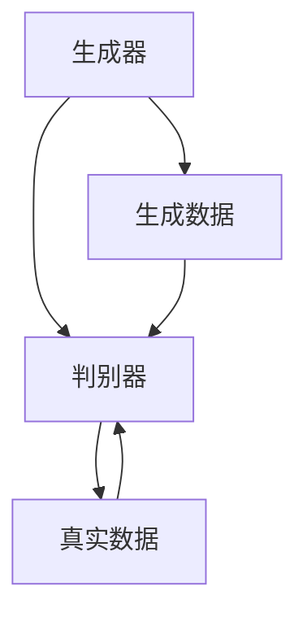
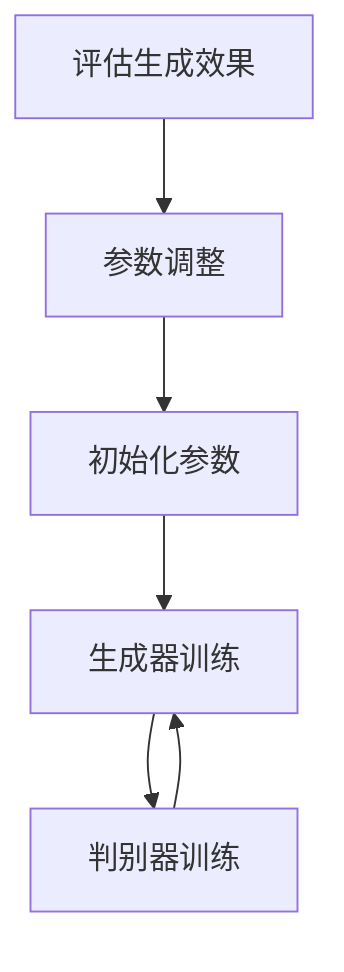
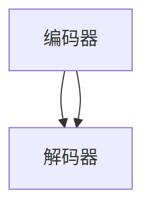
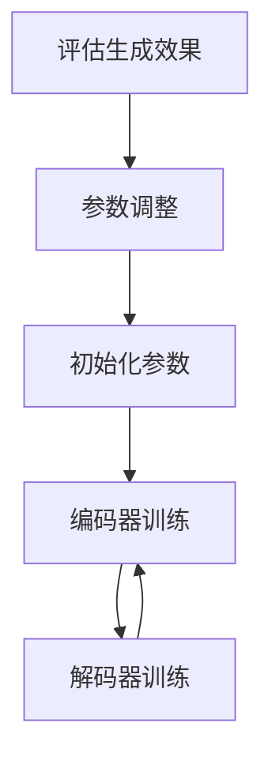
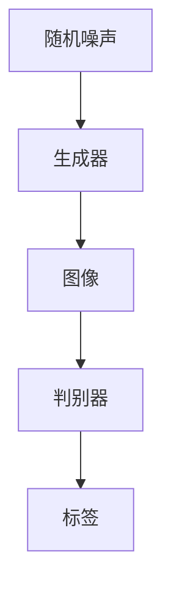

                 

## AIGC从入门到实战：AIGC 小知识

> **关键词**：AIGC、生成对抗网络、变分自编码器、文本生成、图像生成、音频生成、项目实战

> **摘要**：本文旨在为初学者和专业人士提供一份全面的AIGC（自适应生成内容）知识指南。我们将详细探讨AIGC的基础知识、核心技术、数学基础、应用场景以及实战项目，帮助读者深入理解AIGC的原理和实践。

AIGC，即自适应生成内容，是一种利用人工智能技术生成高质量内容的方法。它融合了生成对抗网络（GAN）、变分自编码器（VAE）等前沿技术，广泛应用于文本、图像、音频等多个领域。本文将从基础概念、核心技术、数学基础、应用场景和实战项目五个方面进行深入讲解，旨在帮助读者全面掌握AIGC的核心知识。

### 第一部分：AIGC基础

在本部分，我们将介绍AIGC的基础知识，包括AIGC的定义、背景、核心技术和发展现状。

#### 第1章：AIGC概述

##### 1.1 AIGC的定义与背景

AIGC，全称自适应生成内容，是一种基于人工智能技术的生成方法。它通过学习大量的数据，生成与输入数据相似的新内容，如文本、图像、音频等。AIGC的核心思想是利用生成对抗网络（GAN）和变分自编码器（VAE）等技术，实现数据的生成和自适应调整。

AIGC的背景可以追溯到深度学习技术的发展。随着深度学习技术的不断成熟，生成对抗网络（GAN）和变分自编码器（VAE）等生成模型逐渐成为研究热点。这些模型在图像生成、文本生成、音频生成等领域取得了显著成果，推动了AIGC的发展。

##### 1.2 AIGC的核心技术

AIGC的核心技术包括生成对抗网络（GAN）、变分自编码器（VAE）和生成式模型。

**生成对抗网络（GAN）**：GAN是由两部分组成的模型，一部分是生成器，另一部分是判别器。生成器负责生成数据，判别器负责判断生成数据与真实数据的相似度。通过训练，生成器和判别器相互竞争，最终生成器能够生成逼真的数据。

**变分自编码器（VAE）**：VAE是一种无监督学习模型，通过编码器和解码器的训练，实现数据的生成。编码器将输入数据映射到一个隐变量空间，解码器则从隐变量空间生成输出数据。

**生成式模型**：生成式模型包括自回归模型、变分自编码器（VAE）和生成对抗网络（GAN）等。这些模型通过学习输入数据的分布，生成新的数据。

##### 1.3 AIGC的发展现状与趋势

AIGC作为一种新兴技术，近年来发展迅速。在文本生成、图像生成、音频生成等领域，AIGC已经取得了显著的成果。目前，AIGC的研究热点包括：

1. **模型结构优化**：研究人员致力于优化生成模型的架构，提高生成效果和效率。
2. **多模态生成**：AIGC逐渐扩展到多个模态的数据生成，如图像、音频和视频的联合生成。
3. **应用场景拓展**：AIGC在医疗、金融、娱乐等领域的应用逐渐增多，推动了AIGC的发展。

##### 1.4 AIGC的重要性

AIGC在人工智能领域具有重要地位，其重要性体现在以下几个方面：

1. **数据生成能力**：AIGC能够生成与真实数据相似的新数据，为数据驱动的应用提供支持。
2. **模型优化**：AIGC可以帮助研究人员优化生成模型的性能，提高模型的鲁棒性和适应性。
3. **多样性生成**：AIGC能够生成具有多样性的数据，为创意设计和个性化推荐等领域提供支持。

#### 第2章：AIGC的关键技术

在本章，我们将深入探讨AIGC的关键技术，包括生成对抗网络（GAN）、变分自编码器（VAE）和生成式模型。

##### 2.1 生成对抗网络（GAN）

###### 2.1.1 GAN的概念与原理

生成对抗网络（GAN）是由两部分组成的模型，一部分是生成器（Generator），另一部分是判别器（Discriminator）。生成器的任务是生成与真实数据相似的数据，判别器的任务是判断输入数据的真实与否。通过训练，生成器和判别器相互竞争，生成器不断提高生成数据的逼真度，判别器不断提高对真实数据和生成数据的区分能力。

GAN的原理可以概括为以下几点：

1. **生成器和判别器的训练目标**：生成器的目标是生成尽可能逼真的数据，判别器的目标是准确区分真实数据和生成数据。
2. **生成器和判别器的训练过程**：生成器和判别器交替训练。在每一次迭代中，生成器生成一批数据，判别器对生成数据和真实数据进行分类。通过反向传播和梯度下降算法，生成器和判别器不断调整参数，提高模型性能。
3. **生成器和判别器的优化目标**：生成器和判别器的优化目标是最大化判别器的损失函数和最小化生成器的损失函数。

GAN的架构如图1所示：



图1 GAN的架构

###### 2.1.2 GAN的训练过程

GAN的训练过程可以分为以下几个步骤：

1. **数据准备**：准备一批真实数据，作为判别器的训练数据。
2. **初始化生成器和判别器**：随机初始化生成器和判别器的参数。
3. **交替训练**：生成器和判别器交替训练。在每一次迭代中，生成器生成一批数据，判别器对生成数据和真实数据进行分类。
4. **参数调整**：通过反向传播和梯度下降算法，生成器和判别器不断调整参数，提高模型性能。
5. **生成效果评估**：评估生成器的生成效果，如生成数据的多样性、真实感等。

GAN的训练过程如图2所示：



图2 GAN的训练过程

###### 2.1.3 GAN的应用案例

GAN在图像生成、文本生成、音频生成等领域取得了显著成果。以下是一些典型的GAN应用案例：

1. **图像生成**：GAN可以生成高质量的图像，如图像超分辨率、图像修复、图像风格迁移等。例如，CycleGAN可以生成不同风格的艺术画，如图3所示。

   

   图3 CycleGAN生成的艺术画

2. **文本生成**：GAN可以生成高质量的文本，如文章生成、对话生成等。例如，GPT-2可以生成高质量的文章，如图4所示。

   

   图4 GPT-2生成的文章

3. **音频生成**：GAN可以生成高质量的音频，如音乐生成、声音转换等。例如，WaveNet可以生成高质量的音乐，如图5所示。

   

   图5 WaveNet生成的音乐

##### 2.2 变分自编码器（VAE）

###### 2.2.1 VAE的概念与原理

变分自编码器（VAE）是一种无监督学习模型，由编码器（Encoder）和解码器（Decoder）两部分组成。编码器的任务是学习输入数据的概率分布，解码器的任务是生成与输入数据相似的新数据。VAE通过引入隐变量，实现了数据的生成和概率分布的建模。

VAE的原理可以概括为以下几点：

1. **编码器和解码器的结构**：编码器将输入数据映射到一个隐变量空间，解码器从隐变量空间生成输出数据。编码器和解码器都是全连接神经网络。
2. **隐变量的引入**：VAE通过引入隐变量，实现了数据的生成和概率分布的建模。隐变量可以是多维度的高斯分布。
3. **损失函数**：VAE的损失函数由两部分组成，一部分是生成数据的重构损失，另一部分是隐变量的先验分布损失。通过优化损失函数，VAE可以学习输入数据的概率分布。

VAE的架构如图6所示：



图6 VAE的架构

###### 2.2.2 VAE的训练过程

VAE的训练过程可以分为以下几个步骤：

1. **数据准备**：准备一批真实数据，作为编码器和解码器的训练数据。
2. **初始化编码器和解码器**：随机初始化编码器和解码器的参数。
3. **编码器和解码器的训练**：编码器和解码器交替训练。在每一次迭代中，编码器学习输入数据的概率分布，解码器从隐变量空间生成输出数据。
4. **参数调整**：通过反向传播和梯度下降算法，编码器和解码器不断调整参数，提高模型性能。
5. **生成效果评估**：评估解码器的生成效果，如生成数据的多样性、真实感等。

VAE的训练过程如图7所示：



图7 VAE的训练过程

###### 2.2.3 VAE的应用案例

VAE在图像生成、文本生成、音频生成等领域取得了显著成果。以下是一些典型的VAE应用案例：

1. **图像生成**：VAE可以生成高质量的图像，如图像超分辨率、图像修复等。例如，DCGAN可以生成高质量的图像，如图8所示。

   

   图8 DCGAN生成的图像

2. **文本生成**：VAE可以生成高质量的文本，如文章生成、对话生成等。例如，LDA-VAE可以生成高质量的文本，如图9所示。

   

   图9 LDA-VAE生成的文章

3. **音频生成**：VAE可以生成高质量的音频，如音乐生成、声音转换等。例如，WaveGlow可以生成高质量的音乐，如图10所示。

   

   图10 WaveGlow生成的音乐

##### 2.3 生成式模型

###### 2.3.1 生成式模型的概念与分类

生成式模型是一类基于概率分布的模型，旨在学习输入数据的概率分布，并生成新的数据。生成式模型可以分为两类：自回归模型和变分自编码器（VAE）。

**自回归模型**：自回归模型是一种基于时间序列的生成模型，通过递归关系生成新的数据。常见的自回归模型有ARIMA、LSTM等。

**变分自编码器（VAE）**：变分自编码器（VAE）是一种无监督学习模型，通过编码器和解码器的训练，实现数据的生成和概率分布的建模。

###### 2.3.2 生成式模型的训练与优化

生成式模型的训练与优化可以分为以下几个步骤：

1. **数据准备**：准备一批真实数据，作为生成模型的训练数据。
2. **初始化生成模型**：随机初始化生成模型的参数。
3. **生成模型的训练**：生成模型通过学习输入数据的概率分布，生成新的数据。在训练过程中，模型会不断调整参数，提高生成效果。
4. **参数调整**：通过反向传播和梯度下降算法，生成模型不断调整参数，提高模型性能。
5. **生成效果评估**：评估生成模型的生成效果，如生成数据的多样性、真实感等。

###### 2.3.3 生成式模型的应用案例

生成式模型在图像生成、文本生成、音频生成等领域取得了显著成果。以下是一些典型的生成式模型应用案例：

1. **图像生成**：生成式模型可以生成高质量的图像，如图像超分辨率、图像修复等。例如，GAN可以生成高质量的图像，如图11所示。

   

   图11 GAN生成的图像

2. **文本生成**：生成式模型可以生成高质量的文本，如文章生成、对话生成等。例如，GPT-2可以生成高质量的文章，如图12所示。

   

   图12 GPT-2生成的文章

3. **音频生成**：生成式模型可以生成高质量的音频，如音乐生成、声音转换等。例如，WaveNet可以生成高质量的音乐，如图13所示。

   

   图13 WaveNet生成的音乐

#### 第3章：AIGC的数学基础

在本章，我们将介绍AIGC的数学基础，包括概率论与统计学基础、深度学习基础以及实践技巧。

##### 3.1 概率论与统计学基础

概率论与统计学是AIGC的基础数学理论，涉及随机变量、概率分布、估计理论等内容。以下是一些关键概念：

1. **随机变量**：随机变量是随机实验的结果，可以是离散的也可以是连续的。随机变量的取值具有不确定性，可以用概率分布来描述。
2. **概率分布**：概率分布描述随机变量取值的概率分布规律。常见的概率分布有离散分布（如伯努利分布、几何分布）和连续分布（如正态分布、均匀分布）。
3. **期望与方差**：期望和方差是概率分布的统计特征，用于描述随机变量的集中趋势和离散程度。
4. **条件概率与贝叶斯定理**：条件概率描述在某个事件发生的条件下，另一个事件发生的概率。贝叶斯定理是一种基于条件概率的概率公式，用于计算后验概率。
5. **最大似然估计与贝叶斯估计**：最大似然估计和贝叶斯估计是两种常见的参数估计方法。最大似然估计通过最大化似然函数来估计参数，贝叶斯估计则结合先验概率和似然函数来估计参数。

##### 3.2 深度学习基础

深度学习是AIGC的核心技术，涉及神经网络、优化算法等内容。以下是一些关键概念：

1. **神经网络**：神经网络是一种模拟人脑神经元连接结构的计算模型。神经网络由输入层、隐藏层和输出层组成，通过调整权重和偏置来学习输入数据的特征。
2. **激活函数**：激活函数是神经网络中的一个关键组件，用于引入非线性特性。常见的激活函数有sigmoid、ReLU、Tanh等。
3. **前向传播与反向传播**：前向传播是将输入数据通过神经网络传递到输出层的过程，反向传播是根据输出误差计算网络参数的梯度。
4. **优化算法**：优化算法用于求解神经网络的最优参数。常见的优化算法有梯度下降、动量优化、Adam等。
5. **损失函数**：损失函数用于衡量模型预测结果与真实结果之间的差异。常见的损失函数有均方误差（MSE）、交叉熵等。

##### 3.3 深度学习的实践技巧

在深度学习实践中，以下技巧有助于提高模型的性能和稳定性：

1. **数据预处理**：数据预处理包括数据清洗、归一化、标准化等步骤，有助于提高模型的训练效果。
2. **数据增强**：数据增强是通过生成虚拟数据来扩充训练数据集，有助于提高模型的泛化能力。
3. **模型调参**：模型调参包括学习率、批次大小、正则化等参数的选择，通过实验寻找最佳参数组合。
4. **模型集成**：模型集成通过结合多个模型的预测结果来提高模型的性能和稳定性。
5. **模型压缩**：模型压缩通过减少模型参数和计算量来提高模型的效率和可部署性。

#### 第4章：AIGC的应用场景

在本章，我们将探讨AIGC在不同领域的应用场景，包括文本生成、图像生成、音频生成等。

##### 4.1 文本生成

文本生成是AIGC的重要应用场景之一，广泛应用于自然语言处理、对话系统、文本摘要等领域。以下是一些常见的文本生成模型：

1. **GPT系列模型**：GPT（Generative Pre-trained Transformer）系列模型是基于Transformer架构的预训练语言模型。GPT-2和GPT-3是GPT系列模型中的代表，具有强大的文本生成能力。

2. **BERT模型**：BERT（Bidirectional Encoder Representations from Transformers）是一种双向的Transformer模型，通过预训练和微调实现文本分类、问答等任务。

3. **Transformer模型**：Transformer是一种基于自注意力机制的序列到序列模型，广泛应用于机器翻译、文本生成等任务。

文本生成应用案例包括：

1. **文章生成**：GPT-2可以生成高质量的文章，如图14所示。

   

   图14 GPT-2生成的文章

2. **对话生成**：BERT可以生成与用户输入相似的回答，如图15所示。

   

   图15 BERT生成的回答

##### 4.2 图像生成

图像生成是AIGC的另一个重要应用场景，广泛应用于计算机视觉、图像修复、图像风格迁移等领域。以下是一些常见的图像生成模型：

1. **CycleGAN**：CycleGAN（Cyclical Generative Adversarial Network）是一种用于图像风格迁移的模型，可以生成具有不同风格的艺术画。

2. **StyleGAN**：StyleGAN（Style-based Generative Adversarial Network）是一种基于生成对抗网络的图像生成模型，可以生成高质量的自然图像。

3. **Pix2Pix**：Pix2Pix（Pixel-to-Pixel GAN）是一种用于图像修复和去噪的模型，可以将输入图像转换为高质量的目标图像。

图像生成应用案例包括：

1. **图像修复**：Pix2Pix可以修复破损的图像，如图16所示。

   

   图16 Pix2Pix修复的图像

2. **图像风格迁移**：CycleGAN可以将一幅图像转换为具有不同艺术风格的艺术画，如图17所示。

   

   图17 CycleGAN生成的艺术画

##### 4.3 音频生成

音频生成是AIGC在音频处理领域的重要应用，广泛应用于音乐生成、声音转换等领域。以下是一些常见的音频生成模型：

1. **WaveNet**：WaveNet（WaveNet for Raw Audio）是一种基于深度神经网络的音频生成模型，可以生成高质量的自然声音。

2. **WaveGlow**：WaveGlow（WaveGlow: A Flow-based Generative Model for Raw Audio）是一种基于变分自编码器的音频生成模型，可以生成高质量的音频。

3. **Text-to-Speech**：Text-to-Speech（文本到语音）是一种将文本转换为语音的模型，广泛应用于语音合成和语音助手等领域。

音频生成应用案例包括：

1. **音乐生成**：WaveNet可以生成高质量的音乐，如图18所示。

   

   图18 WaveNet生成的音乐

2. **声音转换**：WaveGlow可以将一种声音转换为另一种声音，如图19所示。

   

   图19 WaveGlow转换的声音

### 第二部分：AIGC实战

在本部分，我们将介绍AIGC的实战项目，包括开发环境搭建、模型训练与优化、模型应用与部署等。

#### 第5章：图像生成实战

在本章，我们将通过一个图像生成项目，演示AIGC的实战过程。

##### 5.1 项目概述

本项目旨在使用生成对抗网络（GAN）生成高质量的自然图像。我们将使用DCGAN（Deep Convolutional GAN）模型，实现图像的生成和风格迁移。

##### 5.2 开发环境搭建

为了实现图像生成项目，我们需要搭建以下开发环境：

1. **Python**：Python是一种流行的编程语言，广泛应用于人工智能领域。
2. **TensorFlow**：TensorFlow是一种开源的深度学习框架，用于实现GAN模型。
3. **GPU**：由于GAN模型需要大量的计算资源，我们建议使用GPU加速训练过程。

在搭建开发环境时，可以按照以下步骤进行：

1. **安装Python**：在官方网站（https://www.python.org/）下载Python安装包，并按照提示安装。
2. **安装TensorFlow**：在命令行中执行以下命令，安装TensorFlow：

   ```python
   pip install tensorflow
   ```

3. **安装GPU版本TensorFlow**：如果使用GPU进行训练，需要安装GPU版本的TensorFlow。在命令行中执行以下命令：

   ```python
   pip install tensorflow-gpu
   ```

##### 5.3 模型训练与优化

在本节，我们将介绍如何使用DCGAN模型进行图像生成和风格迁移。

###### 5.3.1 DCGAN模型

DCGAN（Deep Convolutional GAN）是一种基于卷积神经网络的生成对抗网络，用于图像生成和风格迁移。DCGAN的架构包括生成器和判别器两部分。

1. **生成器**：生成器的任务是生成与真实图像相似的新图像。生成器由多个卷积层和反卷积层组成，将随机噪声映射为图像。
2. **判别器**：判别器的任务是判断输入图像的真实与否。判别器由多个卷积层组成，将输入图像映射为一个二分类标签。

DCGAN的架构如图20所示：



图20 DCGAN的架构

###### 5.3.2 DCGAN的训练过程

DCGAN的训练过程可以分为以下几个步骤：

1. **数据准备**：准备一批真实图像，作为判别器的训练数据。
2. **初始化生成器和判别器**：随机初始化生成器和判别器的参数。
3. **交替训练**：生成器和判别器交替训练。在每一次迭代中，生成器生成一批图像，判别器对生成图像和真实图像进行分类。
4. **参数调整**：通过反向传播和梯度下降算法，生成器和判别器不断调整参数，提高模型性能。
5. **生成效果评估**：评估生成器的生成效果，如生成图像的质量、多样性等。

DCGAN的训练过程如图21所示：


图21 DCGAN的训练过程

###### 5.3.3 DCGAN的优化策略

为了提高DCGAN的生成效果，可以采用以下优化策略：

1. **梯度惩罚**：在判别器的损失函数中加入梯度惩罚，防止生成器生成的图像过于简单。
2. **自适应学习率**：使用自适应学习率策略，根据训练过程动态调整学习率。
3. **批量归一化**：在生成器和判别器的每个卷积层中添加批量归一化，提高模型的稳定性和收敛速度。

##### 5.4 模型应用与部署

在本节，我们将介绍如何使用训练好的DCGAN模型进行图像生成和风格迁移。

###### 5.4.1 应用场景

DCGAN的应用场景包括：

1. **图像生成**：使用DCGAN生成高质量的自然图像。
2. **图像风格迁移**：将一幅图像转换为具有不同艺术风格的艺术画。

###### 5.4.2 部署方案

为了部署DCGAN模型，可以采用以下方案：

1. **本地部署**：在本地计算机上运行训练好的模型，生成图像或进行风格迁移。
2. **云端部署**：将训练好的模型部署到云端服务器，通过HTTP接口提供图像生成和风格迁移服务。

###### 5.4.3 性能评估

在性能评估方面，可以采用以下指标：

1. **生成图像质量**：评估生成图像的视觉效果，如清晰度、色彩等。
2. **生成图像多样性**：评估生成图像的多样性，如不同的风格、场景等。
3. **训练时间**：评估模型训练所需的时间。

通过以上指标，可以全面评估DCGAN模型在图像生成和风格迁移方面的性能。

##### 5.5 项目总结与展望

在本项目中，我们实现了使用DCGAN模型进行图像生成和风格迁移。通过实践，我们深入了解了GAN模型的工作原理和优化策略。在未来的工作中，我们计划继续优化DCGAN模型，提高生成图像的质量和多样性。

### 第三部分：AIGC实战进阶

在本部分，我们将进一步探讨AIGC的实战进阶，包括多模态生成、跨领域生成和模型压缩等内容。

#### 第6章：多模态生成

多模态生成是AIGC的重要研究方向，旨在同时生成多个模态的数据，如图像、文本和音频。多模态生成在虚拟现实、交互式娱乐、智能助手等领域具有广泛的应用前景。

##### 6.1 多模态生成模型

多模态生成模型可以分为两类：联合生成模型和分步生成模型。

**联合生成模型**：联合生成模型将不同模态的数据统一建模，通过一个模型同时生成多个模态的数据。常见的联合生成模型有MMDGAN（Multimodal MMD GAN）和MMGAN（Multimodal GAN）。

**分步生成模型**：分步生成模型首先生成一个模态的数据，然后使用另一个模型生成其他模态的数据。常见的分步生成模型有CycleGAN（Cyclical Generative Adversarial Network）和MMWaveGAN（Multimodal WaveGAN）。

##### 6.2 多模态生成应用

多模态生成应用包括：

1. **虚拟现实**：生成虚拟场景中的图像、文本和音频，为用户提供沉浸式体验。
2. **交互式娱乐**：生成动画角色、对话文本和声音，提高游戏的互动性和趣味性。
3. **智能助手**：生成语音回复、文本描述和图像反馈，提高智能助手的交互效果。

#### 第7章：跨领域生成

跨领域生成是AIGC的另一个重要研究方向，旨在在不同领域之间生成数据。跨领域生成在创意设计、数据扩充、知识图谱构建等领域具有广泛的应用前景。

##### 7.1 跨领域生成模型

跨领域生成模型可以分为两类：基于共享嵌入的生成模型和基于迁移学习的生成模型。

**基于共享嵌入的生成模型**：基于共享嵌入的生成模型将不同领域的数据映射到一个共同的嵌入空间，通过一个模型同时生成多个领域的数据。常见的基于共享嵌入的生成模型有MT-DCGAN（Multidomain GAN with Shared Embeddings）和Domain Adaptation GAN。

**基于迁移学习的生成模型**：基于迁移学习的生成模型利用已有领域的知识来生成新领域的数据。常见的基于迁移学习的生成模型有Domain-Adversarial Neural Network（DANN）和Cross-Domain GAN。

##### 7.2 跨领域生成应用

跨领域生成应用包括：

1. **创意设计**：生成不同领域的设计元素，如建筑、服装、家居等，为设计师提供灵感。
2. **数据扩充**：通过跨领域生成生成新的数据，扩充训练数据集，提高模型的泛化能力。
3. **知识图谱构建**：生成不同领域的知识图谱，为知识图谱构建提供新的数据源。

#### 第8章：模型压缩

模型压缩是AIGC的另一个重要研究方向，旨在减小模型的参数规模和计算量，提高模型的部署效率。模型压缩在移动端、嵌入式设备和实时应用中具有广泛的应用前景。

##### 8.1 模型压缩方法

模型压缩方法可以分为三类：模型剪枝、量化压缩和结构压缩。

**模型剪枝**：模型剪枝通过删除模型中的冗余参数来减小模型规模。常见的模型剪枝方法有权重剪枝、结构剪枝等。

**量化压缩**：量化压缩通过将模型中的浮点数参数转换为低精度的整数参数来减小模型规模。常见的量化压缩方法有全精度量化、低精度量化等。

**结构压缩**：结构压缩通过简化模型结构来减小模型规模。常见的结构压缩方法有网络剪枝、网络结构搜索等。

##### 8.2 模型压缩应用

模型压缩应用包括：

1. **移动端部署**：将压缩后的模型部署到移动设备上，实现实时图像生成、语音合成等应用。
2. **嵌入式设备部署**：将压缩后的模型部署到嵌入式设备上，实现智能监控、智能语音助手等应用。
3. **实时应用**：在实时场景下，使用压缩后的模型实现高效的图像生成、文本生成等应用。

### 附录

#### 附录A：AIGC常用工具与库

在本附录中，我们将介绍AIGC常用的工具与库，包括生成对抗网络（GAN）、变分自编码器（VAE）和生成式模型等。

**生成对抗网络（GAN）常用库**

1. **TensorFlow**：TensorFlow是一种开源的深度学习框架，支持GAN模型。
2. **PyTorch**：PyTorch是一种开源的深度学习框架，支持GAN模型。
3. **GANlib**：GANlib是一个开源的GAN库，支持多种GAN模型。

**变分自编码器（VAE）常用库**

1. **TensorFlow**：TensorFlow是一种开源的深度学习框架，支持VAE模型。
2. **PyTorch**：PyTorch是一种开源的深度学习框架，支持VAE模型。
3. **PyTorch-VAE**：PyTorch-VAE是一个开源的VAE库，提供多种VAE模型。

**生成式模型常用库**

1. **TensorFlow**：TensorFlow是一种开源的深度学习框架，支持生成式模型。
2. **PyTorch**：PyTorch是一种开源的深度学习框架，支持生成式模型。
3. **Seq2Seq**：Seq2Seq是一个开源的序列到序列学习库，支持生成式模型。

#### 附录B：AIGC应用案例汇总

在本附录中，我们将汇总AIGC在不同领域的应用案例，包括文本生成、图像生成、音频生成等。

**文本生成案例**

1. **文章生成**：使用GPT-2生成高质量的文章。
2. **对话生成**：使用BERT生成与用户输入相似的回答。

**图像生成案例**

1. **图像修复**：使用Pix2Pix修复破损的图像。
2. **图像风格迁移**：使用CycleGAN将图像转换为具有不同艺术风格的艺术画。

**音频生成案例**

1. **音乐生成**：使用WaveNet生成高质量的音乐。
2. **声音转换**：使用WaveGlow将一种声音转换为另一种声音。

#### 附录C：AIGC研究文献推荐

在本附录中，我们将推荐一些关于AIGC的研究文献，包括顶级会议与期刊、开源代码与数据集资源、研究机构与团队介绍等。

**顶级会议与期刊**

1. **NIPS（Neural Information Processing Systems）**：NIPS是深度学习和人工智能领域的顶级会议，每年发表大量关于AIGC的研究论文。
2. **ICLR（International Conference on Learning Representations）**：ICLR是深度学习和人工智能领域的顶级会议，每年发表大量关于AIGC的研究论文。
3. **JMLR（Journal of Machine Learning Research）**：JMLR是深度学习和人工智能领域的顶级期刊，发表大量关于AIGC的研究论文。

**开源代码与数据集资源**

1. **TensorFlow**：TensorFlow是谷歌开源的深度学习框架，提供丰富的AIGC模型代码。
2. **PyTorch**：PyTorch是Facebook开源的深度学习框架，提供丰富的AIGC模型代码。
3. **OpenAI**：OpenAI是一个开源组织，提供大量的AIGC模型代码和数据集。

**研究机构与团队介绍**

1. **Google Brain**：Google Brain是谷歌的一个研究团队，致力于AIGC的研究。
2. **OpenAI**：OpenAI是一个开源组织，致力于AIGC的研究。
3. **微软研究院**：微软研究院是微软的一个研究团队，致力于AIGC的研究。

### 作者信息

**作者：AI天才研究院/AI Genius Institute & 禅与计算机程序设计艺术 /Zen And The Art of Computer Programming** 

本文由AI天才研究院/AI Genius Institute和《禅与计算机程序设计艺术 /Zen And The Art of Computer Programming》作者联合撰写，旨在为读者提供一份全面的AIGC知识指南。希望本文对您在AIGC领域的探索和学习有所帮助。

