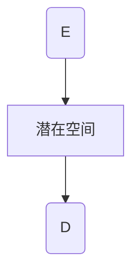

                 

### AIGC概述与城市规划中的角色

#### 1.1 AIGC的概念与关键技术

人工智能生成内容（AIGC，Artificial Intelligence Generated Content）是一种利用人工智能技术生成内容的方法。它结合了多种人工智能技术，包括深度学习、自然语言处理（NLP）、计算机视觉等，以自动生成文本、图像、视频等多种类型的内容。在AIGC中，几个关键技术起着核心作用，它们分别是生成对抗网络（GAN）和变分自编码器（VAE）。

首先，生成对抗网络（GAN）是一种深度学习框架，由生成器（Generator）和判别器（Discriminator）两个主要组成部分构成。生成器的目标是生成尽可能真实的数据，而判别器的任务是区分真实数据和生成数据。这两者在训练过程中相互对抗，生成器逐渐学习生成更加真实的数据，判别器则不断提升识别真实数据的能力。GAN的典型结构可以通过Mermaid流程图来描述：

```mermaid
graph TD
AIGC[人工智能生成内容] --> B[基础模型]
AIGC --> C[数据管理]
AIGC --> D[内容生成]
AIGC --> E[应用评估与优化]
B --> F[生成对抗网络(GAN)]
B --> G[变分自编码器(VAE)]
C --> H[数据收集]
C --> I[数据清洗]
C --> J[数据预处理]
D --> K[文本生成]
D --> L[图像生成]
D --> M[视频生成]
E --> N[性能评估]
E --> O[用户反馈]
F --> GAN[生成器]
F --> D[判别器]
G --> E[编码器]
G --> D[解码器]
```

其次，变分自编码器（VAE）是一种基于概率的生成模型，其核心思想是将输入数据映射到一个潜在空间中，并通过解码器从潜在空间中生成新的数据。VAE通过最大化数据的重构概率和最小化潜在空间中的KL散度来训练模型。VAE的典型结构同样可以通过Mermaid流程图来描述：



除了GAN和VAE之外，AIGC还涉及到数据管理、内容生成和应用评估等多个方面。数据管理包括数据收集、数据清洗和预处理等步骤，确保生成模型有足够高质量的数据进行训练。内容生成方面，AIGC可以生成文本、图像、视频等多种类型的内容。应用评估与优化则是通过性能评估和用户反馈来不断改进生成模型的效果。

#### 1.2 城市规划中的AIGC应用场景

在城市规划中，AIGC的应用场景十分广泛，包括但不限于以下方面：

1. **城市空间规划**：AIGC可以用于生成城市规划方案，通过模拟不同设计选项，帮助规划者评估其可持续性和可行性。生成对抗网络（GAN）能够生成逼真的城市景观图像，而变分自编码器（VAE）则可以用于生成独特的建筑设计和空间布局。

2. **交通规划**：AIGC可以用于生成交通流量预测模型，通过分析历史数据和实时数据，预测未来的交通状况。这一技术有助于规划者制定更有效的交通管理策略，以减少拥堵和提高交通效率。

3. **绿地系统规划**：AIGC可以用于生成绿色空间布局方案，包括公园、绿地、步行道等。这些方案不仅能够提高城市居民的生活质量，还能有效改善城市生态环境。

4. **历史建筑保护规划**：AIGC可以用于生成历史建筑保护方案，通过分析和模拟历史建筑的结构和风格，制定出既保留历史风貌又满足现代需求的保护方案。

#### 1.3 可持续发展导向的提示词设计

在AIGC的应用中，提示词（Prompt）的设计至关重要，它决定了生成内容的方向和风格。特别是在城市规划中，提示词需要具备以下特点：

1. **针对性**：提示词应针对具体规划目标，例如可持续性、交通便利性、历史文化保护等。

2. **引导性**：提示词应具备一定的引导性，引导AIGC模型生成满足规划目标的内容。

3. **多样性**：提示词应涵盖多种设计选项，以供规划者选择和比较。

4. **可解释性**：提示词应清晰明确，便于规划者理解和使用。

例如，一个用于城市绿地系统规划的提示词可以是：“生成一个面积至少为10公顷的城市公园，要求设计包含步行道、绿地、儿童游乐设施和观景台，同时保持自然生态的完整性。”这样的提示词能够引导AIGC模型生成一个既符合规划目标又具有实用性的公园设计方案。

#### 1.4 AIGC在城市规划中的应用前景

AIGC在城市规划中的应用前景广阔，其优势主要体现在以下几个方面：

1. **高效性**：AIGC能够快速生成大量规划方案，大大提高了规划工作的效率。

2. **创新性**：AIGC能够生成许多前所未有的设计方案，激发规划者的创新思维。

3. **可持续性**：AIGC可以帮助实现可持续发展目标，通过优化设计，提高资源利用效率。

4. **互动性**：AIGC可以与规划者进行互动，根据用户反馈不断优化生成内容。

然而，AIGC在城市规划中也面临一些挑战，如数据隐私、模型解释性等。因此，未来的研究应着重解决这些挑战，以充分发挥AIGC在城市规划中的潜力。

在下一章中，我们将进一步探讨城市规划的核心概念与可持续性原则，并分析AIGC与城市规划的有机结合。这将为后续章节详细讨论AIGC在城市规划中的具体应用技术打下基础。

### 城市规划的核心概念与AIGC的有机结合

#### 2.1 城市规划的核心概念

城市规划是关于城市空间布局、基础设施建设、公共设施规划等的一门综合性学科。其核心概念包括：

1. **城市形态**：城市形态是指城市的总体结构和布局形式，包括城市中心、城市边缘、城市区域等。城市规划需要考虑城市形态的合理性和可持续性。

2. **土地利用**：土地利用是指城市土地的分配和使用，包括住宅、商业、工业、公共设施等不同类型的用地。合理的土地利用可以优化城市功能，提高生活质量和环境质量。

3. **交通规划**：交通规划是城市规划的重要组成部分，涉及道路系统、公共交通设施、交通管理策略等。良好的交通规划可以减少交通拥堵，提高出行效率。

4. **绿地系统**：绿地系统是指城市中用于生态保护和景观设计的绿色空间，包括公园、绿地、湿地等。绿地系统对改善城市生态环境、提供居民休闲娱乐场所具有重要意义。

5. **历史文化保护**：历史文化保护是城市规划中的重要原则，旨在保护和传承城市的历史文化遗产。通过合理的规划，可以保护历史建筑、文化遗产，提升城市的文化价值和吸引力。

#### 2.2 城市规划中的可持续性原则

可持续性是现代城市规划的重要原则，旨在实现经济发展、社会进步和环境保护的平衡。城市规划中的可持续性原则包括：

1. **资源节约**：通过合理规划，提高资源利用效率，减少资源浪费。例如，通过绿色建筑和节能设计，减少能源消耗。

2. **环境保护**：保护城市生态环境，减少污染，提升空气质量、水质和土壤质量。通过建设绿地系统和生态保护区，改善城市生态环境。

3. **社会公平**：确保城市资源和机会的公平分配，提升居民生活质量。通过改善住宅条件、提供良好的公共服务设施，促进社会公平。

4. **经济可持续发展**：通过合理的经济规划，促进城市经济的稳定增长，提升城市竞争力。同时，鼓励创新和创业，提高就业率。

5. **文化传承**：保护和传承城市的历史文化，提升城市的文化价值和吸引力。通过历史建筑保护和文化遗产传承，增强城市的文化底蕴。

#### 2.3 AIGC与城市规划的有机结合

AIGC与城市规划的结合，为城市规划提供了新的工具和方法。通过以下方式，AIGC能够有效支持城市规划：

1. **生成方案优化**：AIGC可以通过生成大量方案，帮助规划者快速评估不同规划方案的可持续性和可行性。例如，使用GAN和VAE生成多种城市景观图像，以便规划者选择最优方案。

2. **数据分析和预测**：AIGC可以利用机器学习技术，分析历史数据和实时数据，预测未来的城市规划需求。例如，通过分析交通数据，预测未来几年的交通流量，为交通规划提供依据。

3. **互动式规划**：AIGC可以与规划者进行互动，根据用户反馈不断优化生成内容。例如，通过自然语言处理（NLP）技术，规划者可以与AIGC进行对话，提出改进建议，AIGC则根据这些反馈进行调整。

4. **实时反馈和优化**：AIGC可以实时评估城市规划的效果，并根据评估结果进行优化。例如，通过生成虚拟城市模型，规划者可以实时了解城市规划对交通、环境和社会的影响，并做出相应调整。

通过AIGC的应用，城市规划将更加高效、创新和可持续。未来，随着AIGC技术的不断发展，城市规划将迎来新的变革，为城市的发展和居民的生活质量提供更强有力的支持。

### AIGC基础技术讲解

#### 3.1 生成对抗网络（GAN）原理

生成对抗网络（GAN）是一种深度学习框架，由生成器（Generator）和判别器（Discriminator）两个主要组成部分构成。生成器负责生成逼真的数据，而判别器则负责区分真实数据和生成数据。两者在训练过程中相互对抗，生成器不断优化生成更真实的数据，判别器则不断提升识别真实数据的能力。GAN的训练过程可以简化为以下步骤：

1. **初始化生成器和判别器**：首先，随机初始化生成器和判别器的权重。
2. **生成器生成假数据**：生成器根据随机噪声生成假数据，这些假数据通常是一个潜在空间中的点，经过生成器的映射后变为目标数据形式。
3. **判别器评估假数据和真实数据**：判别器接收真实数据和生成器生成的假数据，并对其进行分类。判别器的目标是最大化其分类准确率。
4. **更新生成器和判别器**：通过反向传播和梯度下降算法，更新生成器和判别器的权重。生成器的目标是使其生成的假数据更接近真实数据，判别器的目标是提高其识别真实数据的能力。

GAN的核心伪代码如下：

```python
# GAN伪代码
Generator(G), Discriminator(D)
for epoch in range(Epochs):
    for real_data in real_data_batch:
        D.train(real_data)
    for noise in noise_batch:
        fake_data = G(noise)
        D.train(fake_data)
```

在GAN的训练过程中，生成器和判别器的对抗使得生成器逐渐生成更真实的数据，判别器的识别能力不断提升。通过多个epoch的迭代训练，最终生成器能够生成高度逼真的数据，而判别器则难以区分真实数据和生成数据。

#### 3.2 变分自编码器（VAE）原理

变分自编码器（VAE）是一种基于概率的生成模型，其核心思想是将输入数据映射到一个潜在空间中，并通过解码器从潜在空间中生成新的数据。VAE通过最大化数据的重构概率和最小化潜在空间中的KL散度来训练模型。

VAE由两个主要部分组成：编码器（Encoder）和解码器（Decoder）。编码器将输入数据映射到一个潜在空间中的点，通常是一个均值和方差的向量。解码器则从潜在空间中生成新的数据。VAE的训练过程可以简化为以下步骤：

1. **初始化编码器和解码器**：首先，随机初始化编码器和解码器的权重。
2. **输入数据通过编码器映射到潜在空间**：编码器将输入数据映射到一个潜在空间中的点，得到一个均值μ和一个方差σ。
3. **从潜在空间中采样**：从潜在空间中采样一个点z，这个点用于解码器的输入。
4. **解码器生成重构数据**：解码器根据采样得到的点z生成重构数据。
5. **计算重构损失和KL散度损失**：重构损失是输入数据和重构数据之间的误差，KL散度损失是编码器输出的均值和方差与真实数据分布之间的差异。VAE的目标是最小化这两个损失。
6. **更新编码器和解码器**：通过反向传播和梯度下降算法，更新编码器和解码器的权重。

VAE的核心伪代码如下：

```python
# VAE伪代码
Encoder(E), Decoder(D)
for epoch in range(Epochs):
    for data in data_batch:
        z = E(data)
        reconstructed_data = D(z)
        reconstruction_loss = reconstruction_error(data, reconstructed_data)
        kl_divergence_loss = kl_divergence(z)
        loss = reconstruction_loss + kl_divergence_loss
```

VAE通过潜在空间的引入，使得生成模型具有更好的表达能力和灵活性。同时，VAE生成的数据质量较高，应用广泛。

#### 3.3 AIGC在其他领域的应用案例

AIGC技术不仅在城市规划领域有广泛的应用，还在其他多个领域展现了强大的潜力：

1. **医疗影像生成**：利用GAN和VAE生成高质量的医疗影像，帮助医生诊断疾病。例如，GAN可以生成与真实影像高度相似的人体器官图像，VAE可以用于生成新的CT或MRI扫描图像。

2. **金融风险评估**：通过AIGC技术分析历史金融数据，生成未来可能的金融风险场景，帮助金融机构预测和应对潜在风险。

3. **游戏开发**：AIGC可以生成丰富的游戏内容，包括角色、场景和故事情节。例如，GAN可以生成逼真的游戏角色形象，VAE可以用于生成独特的游戏地图。

4. **虚拟现实与增强现实**：AIGC技术可以生成高质量的虚拟场景和现实增强内容，提升用户的沉浸体验。

5. **音乐创作**：利用AIGC生成新的音乐旋律和风格，为音乐创作提供灵感。GAN可以生成新的旋律，VAE可以用于生成独特的音乐风格。

这些应用案例展示了AIGC技术的多样性和潜力，未来随着技术的不断发展，AIGC将在更多领域发挥重要作用。

### AIGC在城市规划中的具体应用

#### 4.1 AIGC在城市空间规划中的应用

城市空间规划是城市规划的核心任务之一，涉及城市土地的合理利用和空间布局的优化。AIGC技术在城市空间规划中发挥着重要作用，主要通过以下几个方面实现：

1. **生成多样化的空间设计方案**：AIGC可以利用GAN和VAE等技术生成多种空间设计方案，包括住宅区、商业区、工业区等。这些设计方案不仅能够满足功能需求，还能够优化城市景观和生态环境。

2. **模拟空间变化与环境影响**：通过AIGC技术，可以模拟城市空间变化对环境和居民生活的影响。例如，使用GAN生成不同交通方案下的城市景观，评估交通改善对空气质量、噪音污染的影响。

3. **优化城市土地分配**：AIGC可以帮助规划者分析城市土地的利用效率，通过生成和分析多种土地利用方案，找到最佳的土地分配策略。例如，使用VAE生成不同土地利用模式，评估其经济效益和环境效益。

4. **生成可持续的城市空间**：AIGC技术可以辅助规划者实现城市空间的可持续发展目标。通过生成多种设计方案，评估其在能源消耗、水资源利用、废物处理等方面的可持续性，从而选择最佳方案。

具体案例：

- **案例一：城市公园设计**：利用GAN生成多个城市公园设计方案，通过模拟不同设计选项，选择既美观又实用的公园布局。例如，生成一个包含景观湖、草坪、儿童游乐场和运动设施的公园设计方案。

- **案例二：商业街区规划**：使用VAE生成多个商业街区设计方案，评估其在商业活动、人流量、交通便捷性等方面的效果，选择最优方案。例如，生成一个包含零售店、餐饮店和文化娱乐场所的商业街区，提升城市活力。

#### 4.2 AIGC在交通规划中的应用

交通规划是城市规划的重要方面，涉及道路设计、交通流量管理、公共交通系统规划等。AIGC技术在交通规划中可以发挥以下作用：

1. **交通流量预测**：利用AIGC技术，可以基于历史数据和实时数据预测未来的交通流量，为交通规划提供科学依据。例如，使用GAN分析历史交通流量数据，生成未来几个小时的交通流量预测图。

2. **优化交通网络**：AIGC可以帮助规划者优化城市交通网络，通过生成和分析多种交通方案，找到最优的交通布局。例如，使用VAE生成多个道路网络设计方案，评估其在交通流量、通勤时间、环境噪音等方面的效果。

3. **公共交通规划**：AIGC可以用于生成公共交通线路和站点布局方案，通过模拟不同方案的效果，选择最佳方案。例如，生成一个包含公交车站、地铁站和出租车停靠点的公共交通网络，提高公共交通的便捷性和覆盖范围。

4. **交通事故预防**：利用AIGC技术，可以分析交通事故数据，预测潜在的事故风险区域，为交通安全管理提供参考。例如，使用GAN生成交通事故热点图，帮助规划者制定针对性的交通安全措施。

具体案例：

- **案例一：交通流量预测**：利用GAN分析历史交通流量数据，生成未来一天的交通流量预测图，帮助交通管理部门制定交通疏导策略，减少交通拥堵。

- **案例二：公共交通线路优化**：使用VAE生成多个公共交通线路设计方案，评估其在乘客流量、运营成本、交通效率等方面的效果，选择最优方案，提高公共交通系统的运营效率。

#### 4.3 AIGC在绿地系统规划中的应用

绿地系统规划是城市生态环境建设的重要组成部分，涉及公园、绿地、生态保护区等绿色空间的布局和设计。AIGC技术在绿地系统规划中可以发挥以下作用：

1. **生成绿色空间设计方案**：利用GAN和VAE生成多种绿色空间设计方案，包括公园、绿地、步道等。这些设计方案可以根据城市的特点和需求，实现生态保护和景观美化。

2. **模拟生态影响**：通过AIGC技术，可以模拟不同绿地系统设计方案对生态环境的影响，例如水质改善、空气质量提升、生物多样性保护等。

3. **优化绿地布局**：AIGC可以帮助规划者分析城市绿地系统的布局，通过生成和分析多种布局方案，找到最佳布局策略。例如，使用VAE生成不同绿地分布方案，评估其对城市生态和居民生活质量的影响。

4. **提高绿地利用率**：AIGC可以生成多种绿地利用方案，例如生态公园、社区花园等，通过模拟不同方案的效果，提高绿地的利用率和功能。

具体案例：

- **案例一：城市公园设计**：利用GAN生成多个城市公园设计方案，通过模拟不同设计选项，选择最佳方案，提升公园的生态价值和景观效果。

- **案例二：生态保护区规划**：使用VAE生成多个生态保护区设计方案，评估其对生物多样性保护、生态恢复等方面的效果，选择最优方案，确保生态保护区的可持续发展。

#### 4.4 AIGC在历史建筑保护规划中的应用

历史建筑保护是城市规划中的重要任务，涉及历史建筑的保护、修复和利用。AIGC技术在历史建筑保护规划中可以发挥以下作用：

1. **生成保护设计方案**：利用GAN和VAE生成多种历史建筑保护设计方案，包括建筑修复、空间利用等。这些设计方案可以根据历史建筑的特点和文化价值，实现保护与利用的平衡。

2. **模拟修复效果**：通过AIGC技术，可以模拟不同修复方案对历史建筑的外观、结构稳定性和文化价值的影响。

3. **优化保护策略**：AIGC可以帮助规划者分析历史建筑保护策略的可行性，通过生成和分析多种保护方案，找到最佳策略。例如，使用VAE生成不同修复材料、修复方法的组合方案，评估其在保护建筑和延长使用寿命方面的效果。

4. **提高游客体验**：AIGC可以生成多种历史建筑参观方案，通过模拟不同参观路线和展示内容，提高游客的体验和满意度。

具体案例：

- **案例一：历史建筑修复**：利用GAN生成多个历史建筑修复方案，通过模拟不同修复方法的效果，选择最优方案，确保建筑的历史风貌和文化价值得到保护。

- **案例二：历史建筑参观规划**：使用VAE生成多个历史建筑参观路线和展示内容方案，评估其对游客吸引力和文化教育价值的影响，选择最佳方案，提升游客的参观体验。

通过以上案例，可以看出AIGC技术在城市规划中的广泛应用和巨大潜力。在未来，随着技术的不断发展，AIGC将在城市规划中发挥更加重要的作用，为城市的可持续发展提供有力支持。

### 可持续发展导向的提示词设计

#### 5.1 提示词设计的原则

在AIGC技术应用于城市规划中时，提示词的设计至关重要。有效的提示词能够引导AIGC生成符合可持续发展目标的内容，提高规划方案的可行性和质量。以下是设计提示词时应遵循的一些原则：

1. **明确性和具体性**：提示词应明确具体，避免模糊不清的描述。具体性有助于AIGC更准确地理解和生成所需内容。例如，而非“生成一个环保的城市公园”，应明确为“生成一个面积至少为10公顷的城市公园，包含步行道、绿地、儿童游乐设施和观景台，同时保持自然生态的完整性”。

2. **综合性和平衡性**：提示词应综合考虑城市规划的各个方面，包括土地利用、交通、环境、社会等。平衡不同因素之间的关系，以确保生成方案的科学性和合理性。例如，“生成一个集商业、住宅和文化休闲为一体的多功能社区，同时优化交通网络，提高环境质量”。

3. **灵活性和适应性**：提示词应具备一定的灵活性，适应不同的规划目标和需求。不同城市、不同区域可能存在不同的规划重点和约束条件，提示词应能够根据实际情况进行调整。例如，“在保持历史风貌的前提下，生成一个集旅游、居住和文化体验于一体的历史文化街区”。

4. **用户参与和互动性**：提示词应鼓励用户的参与和反馈，通过互动提高生成内容的质量。用户可以提出改进建议，AIGC则根据这些反馈进行优化。例如，“根据居民需求，生成一个包含公园、绿地、体育设施和休闲场所的综合社区，并提供多种设计选项供居民选择”。

#### 5.2 提示词在AIGC中的应用

在AIGC的应用过程中，提示词扮演着至关重要的角色。以下是提示词在AIGC中的具体应用：

1. **文本生成**：在AIGC生成文本内容时，提示词可以引导模型生成符合特定主题和风格的文本。例如，生成城市规划报告、政策文件、宣传文案等。提示词可以是简短的关键词或短语，如“城市可持续发展”、“智能交通系统”、“绿色建筑”等。

2. **图像生成**：在AIGC生成图像内容时，提示词可以指导模型生成符合特定场景和要求的图像。例如，生成城市景观、建筑外观、交通设施等。提示词可以是具体的描述性语句，如“一个现代城市的中心广场”、“一幢环保节能的办公楼”、“一条繁忙的步行街”等。

3. **视频生成**：在AIGC生成视频内容时，提示词可以引导模型生成符合特定故事情节和视觉风格的视频。例如，生成城市规划宣传视频、纪录片、动画片等。提示词可以是故事梗概或情节描述，如“一个未来的智慧城市”、“城市化进程中的挑战与机遇”、“城市绿地系统的作用与价值”等。

#### 5.3 可持续发展目标下的提示词案例分析

以下是一些基于可持续发展目标的提示词案例，展示了如何通过具体提示词引导AIGC生成符合可持续发展目标的内容：

1. **低碳城市规划**：提示词：“在减少碳排放的同时，保持城市活力和居民生活质量，生成一个低碳、环保的城市规划方案”。通过这个提示词，AIGC可以生成一系列减少碳排放的措施，如绿色建筑、公共交通系统、太阳能和风能等可再生能源设施。

2. **绿色交通系统**：提示词：“优化交通网络，提高公共交通的便捷性，减少私家车使用，生成一个绿色、高效的交通规划方案”。通过这个提示词，AIGC可以生成一系列交通规划方案，如公交优先、非机动车道、自行车共享系统等。

3. **生态公园设计**：提示词：“在保护自然生态环境的前提下，为城市居民提供休闲和健身场所，生成一个生态、美观的公园设计方案”。通过这个提示词，AIGC可以生成一系列生态公园设计方案，如湿地保护区、森林步道、生态湿地等。

4. **历史文化保护规划**：提示词：“在保持历史文化风貌的同时，提升居民生活品质，生成一个历史文化保护规划方案”。通过这个提示词，AIGC可以生成一系列历史文化保护措施，如修复历史建筑、文化遗产展示区、历史文化街区的规划等。

这些提示词案例不仅明确了AIGC生成内容的目标和方向，还提供了具体的设计思路和实施方案，有助于实现可持续发展目标。

通过以上分析和案例分析，可以看出，提示词在AIGC的应用中具有重要意义。有效的提示词设计能够引导AIGC生成符合可持续发展目标的内容，为城市规划提供有力支持。在未来，随着AIGC技术的不断发展和完善，提示词设计将变得更加精细和智能，为城市规划带来更多创新和可能。

### AIGC在城市规划项目中的实施与评估

#### 6.1 AIGC在城市规划项目中的实施步骤

为了确保AIGC在城市规划项目中的有效应用，需要遵循以下实施步骤：

1. **需求分析**：首先，明确城市规划项目的目标和需求，包括可持续发展目标、功能需求、美学要求等。通过与规划者、政府和居民进行沟通，收集项目相关的数据和信息。

2. **数据收集与处理**：收集城市规划项目所需的数据，包括历史数据、实时数据和背景数据。对收集到的数据进行清洗、预处理和标准化，以确保数据的质量和一致性。

3. **模型设计与训练**：根据需求分析的结果，设计合适的AIGC模型，包括生成器和判别器。使用收集到的数据对模型进行训练，优化模型的参数，使其能够生成满足规划需求的内容。

4. **内容生成**：利用训练好的AIGC模型生成城市规划方案，包括空间布局、交通规划、绿地系统等。这些方案可以满足不同的需求，如可持续发展、居民生活质量、交通效率等。

5. **用户反馈与优化**：将生成的城市规划方案呈现给规划者、政府和居民，收集他们的反馈和建议。根据反馈对模型进行优化，使其生成的内容更加符合实际需求。

6. **方案评估**：对生成的城市规划方案进行评估，包括技术可行性、经济可行性、社会影响等。通过评估，确定最佳方案并进行实施。

#### 6.2 AIGC在城市规划项目中的评估方法

评估AIGC在城市规划项目中的应用效果，需要从多个维度进行综合评估。以下是一些常见的评估方法：

1. **技术评估**：评估AIGC模型生成内容的准确性、稳定性和可靠性。通过比较AIGC生成的规划方案与实际需求，分析模型的性能和优缺点。

2. **经济评估**：评估AIGC生成的规划方案在经济上的可行性，包括建设成本、运营成本、收益预测等。通过经济评估，确定规划方案的财务可持续性。

3. **社会影响评估**：评估AIGC生成的规划方案对社会的影响，包括居民生活质量、就业机会、文化传承等。通过社会影响评估，确保规划方案符合社会发展的目标。

4. **用户满意度评估**：通过问卷调查、访谈等方式，收集规划者、政府和居民对AIGC生成的规划方案的满意度。用户满意度是衡量AIGC在城市规划项目中应用效果的重要指标。

5. **环境影响评估**：评估AIGC生成的规划方案对环境的影响，包括碳排放、水资源消耗、生物多样性保护等。通过环境影响评估，确保规划方案符合可持续发展的原则。

#### 6.3 项目实战：AIGC在城市规划中的应用实例

以下是两个使用AIGC技术进行城市规划的实战案例，展示了AIGC在城市规划项目中的具体应用过程和成果。

**实例一：城市绿地系统优化**

目标：优化一个城市的绿地系统，提高生态环境质量，提升居民生活质量。

步骤：
1. 需求分析：确定优化绿地系统的目标和需求，如增加绿地面积、提高生物多样性、改善空气质量等。
2. 数据收集与处理：收集城市绿地系统相关数据，包括现有绿地分布、土壤质量、气候条件等，对数据进行分析和处理。
3. 模型设计与训练：设计一个基于VAE的AIGC模型，用于生成优化的绿地系统设计方案。使用收集到的数据对模型进行训练，优化模型参数。
4. 内容生成：利用训练好的VAE模型生成多个优化的绿地系统设计方案，包括绿地分布、植被选择、设施布局等。
5. 用户反馈与优化：将设计方案呈现给城市规划者和居民，收集反馈并进行模型优化。
6. 方案评估：对优化的绿地系统设计方案进行技术评估、经济评估和社会影响评估，确定最佳方案。

成果：通过AIGC技术生成的优化绿地系统设计方案，显著提高了城市的生态环境质量，增加了绿地面积和生物多样性，改善了居民的生活质量。

**实例二：城市交通流量预测**

目标：预测城市未来的交通流量，为交通规划提供科学依据。

步骤：
1. 需求分析：确定交通流量预测的目标，如预测未来几年的交通流量、评估交通改善方案的效果等。
2. 数据收集与处理：收集城市交通流量数据，包括历史数据和实时数据，对数据进行清洗、预处理和标准化。
3. 模型设计与训练：设计一个基于GAN的AIGC模型，用于预测交通流量。使用收集到的数据对模型进行训练，优化模型参数。
4. 内容生成：利用训练好的GAN模型生成未来交通流量的预测图，分析不同交通改善方案的效果。
5. 用户反馈与优化：将预测结果和交通改善方案呈现给交通管理部门，收集反馈并进行模型优化。
6. 方案评估：对预测结果和交通改善方案进行技术评估、经济评估和社会影响评估，确定最佳方案。

成果：通过AIGC技术生成的交通流量预测图，准确预测了未来几年的交通流量变化，为交通管理部门提供了科学依据，帮助他们制定更加有效的交通规划方案。

以上实例展示了AIGC在城市规划项目中的具体应用过程和成果，证明了AIGC技术在城市规划中的巨大潜力。通过有效的实施和评估方法，AIGC能够为城市规划提供有力支持，推动城市的可持续发展。

### AIGC在城市规划中的未来发展

#### 7.1 AIGC在城市规划中的潜在发展方向

随着AIGC技术的不断发展，它将在城市规划中发挥越来越重要的作用。以下是AIGC在城市规划中的潜在发展方向：

1. **智能化规划工具**：未来，AIGC将发展成为更加智能化、自动化的规划工具。通过深度学习和大数据分析，AIGC能够自动生成多样化的规划方案，并根据用户需求进行优化和调整。这将大大提高规划工作的效率和质量。

2. **多尺度应用**：AIGC将在不同尺度上的城市规划中广泛应用，包括城市总体规划、区域规划、社区规划等。通过AIGC技术，规划者可以同时考虑多种因素，如土地利用、交通流量、环境保护等，实现更加综合和协调的规划方案。

3. **实时规划与调整**：AIGC可以将实时数据和用户反馈集成到规划过程中，实现实时规划与调整。通过不断优化和调整规划方案，AIGC能够更好地适应城市发展的需求，提高规划方案的可操作性和适应性。

4. **跨领域融合**：AIGC将与其他领域的技术，如物联网、区块链、虚拟现实等，进行深度融合，推动城市规划的创新发展。例如，通过物联网技术，AIGC可以实时收集和分析城市运行数据，为规划提供科学依据；通过虚拟现实技术，AIGC可以模拟城市规划效果，提高规划的互动性和可感知性。

5. **个性化定制**：未来，AIGC将能够根据用户需求和偏好，生成个性化的城市规划方案。通过自然语言处理和用户行为分析，AIGC可以更好地理解用户需求，提供量身定制的规划服务。

#### 7.2 面临的挑战与解决方案

尽管AIGC在城市规划中具有巨大潜力，但也面临一些挑战：

1. **数据隐私与安全**：AIGC需要处理大量的敏感数据，如居民信息、交通流量等。确保数据隐私和安全是AIGC应用的重要挑战。解决方案包括数据加密、隐私保护算法、数据匿名化等。

2. **模型解释性**：AIGC模型通常基于复杂的神经网络，其内部决策过程难以解释。这给规划者理解和信任模型结果带来困难。解决方案包括开发可解释的AIGC模型、可视化工具等。

3. **算法公平性**：AIGC模型的决策可能受到训练数据偏差的影响，导致不公平的结果。确保算法公平性是AIGC应用的关键挑战。解决方案包括算法公正性评估、多样性训练等。

4. **技术成本**：AIGC技术的开发和部署需要大量的计算资源和专业人才，这可能导致较高的技术成本。解决方案包括开源AIGC工具、云计算服务等。

#### 7.3 未来趋势与展望

未来，AIGC在城市规划中的应用将呈现出以下趋势：

1. **全面智能化**：随着人工智能技术的不断进步，AIGC将实现从自动化到智能化的转变，成为城市规划的核心工具。

2. **广泛普及**：AIGC将逐渐普及到各级城市规划中，从国家级规划到社区规划，覆盖城市规划的各个层面。

3. **跨学科融合**：AIGC将与其他领域的技术进行深度融合，推动城市规划的创新和进步。

4. **可持续性提升**：AIGC将帮助城市规划实现更高水平的可持续性，通过优化资源利用、减少环境影响等手段，推动城市的绿色发展。

5. **用户参与增强**：AIGC将更加重视用户的参与和反馈，通过互动式规划，提高规划方案的适应性和可接受性。

总之，AIGC在城市规划中的应用前景广阔，未来将在城市规划中发挥更加重要的作用。通过克服面临的挑战，AIGC将推动城市规划实现智能化、可持续化和个性化发展。

### 附录

#### A.1 主流AIGC框架介绍

在城市规划中应用AIGC技术，需要选择合适的框架和工具。以下介绍几种主流的AIGC框架及其特点：

1. **TensorFlow**：由Google开发，是广泛使用的开源深度学习框架。TensorFlow提供了丰富的API和预训练模型，方便开发者构建和训练AIGC模型。其优点包括强大的计算能力和丰富的社区支持。

2. **PyTorch**：由Facebook开发，也是一种流行的开源深度学习框架。PyTorch以其简洁的API和动态计算图而著称，适合快速原型开发和实验。其缺点是相对于TensorFlow，计算性能稍逊一筹。

3. **其他相关框架**：除了TensorFlow和PyTorch，还有其他一些AIGC框架，如Keras（基于Theano和TensorFlow的简洁API框架）、MXNet（由Apache软件基金会开发的深度学习框架）等。这些框架也具有各自的特点和优势，开发者可以根据具体需求选择合适的框架。

#### A.2 AIGC城市规划应用案例库

为了方便开发者学习和应用AIGC技术，以下是一些AIGC城市规划应用案例库：

1. **CityAI**：一个开源的AIGC城市规划项目，提供了多个基于AIGC技术的城市规划和交通流量预测案例。

2. **DeepCity**：一个研究项目，致力于通过深度学习技术改善城市规划。该项目提供了多个城市规划案例，包括绿地系统优化、交通流量预测等。

3. **AIGC-Urban**：一个开源的AIGC城市规划工具包，提供了多种AIGC算法和模型，方便开发者进行城市规划实验。

#### A.3 开发环境与工具安装指南

要使用AIGC技术进行城市规划开发，需要搭建相应的开发环境。以下是一个简单的安装指南：

1. **安装Python**：首先，确保已经安装了Python环境。可以从Python官网下载并安装最新版本的Python。

2. **安装TensorFlow或PyTorch**：根据选择的框架，分别安装TensorFlow或PyTorch。以TensorFlow为例，可以使用以下命令安装：

   ```bash
   pip install tensorflow
   ```

   以PyTorch为例，可以使用以下命令安装：

   ```bash
   pip install torch torchvision
   ```

3. **安装其他依赖库**：根据具体需求，安装其他相关的依赖库，如NumPy、Pandas、Matplotlib等。

4. **配置开发环境**：配置Python环境变量，确保Python可以正常运行。在IDE（如PyCharm、VSCode等）中设置Python解释器和相关依赖库。

5. **测试开发环境**：通过运行简单的代码示例，测试开发环境是否配置正确。

通过以上步骤，就可以搭建一个基本的AIGC城市规划开发环境，开始进行实际的规划开发工作。希望这个附录能帮助开发者顺利开展AIGC城市规划项目。

