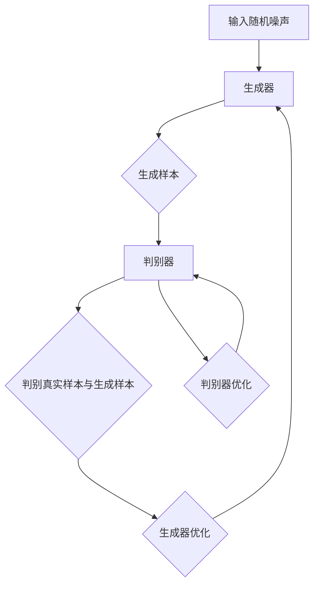
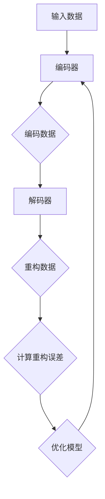
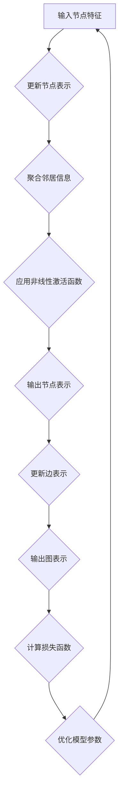
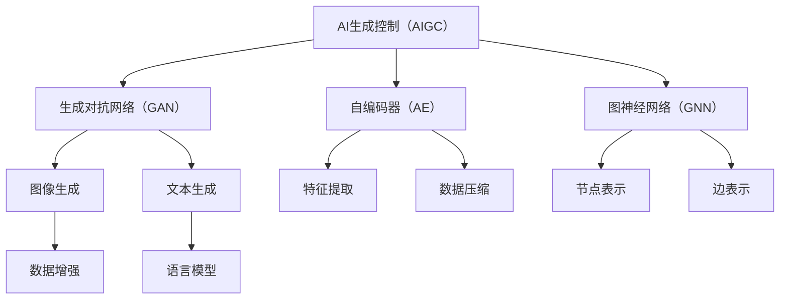

                 

### AIGC的基本概念与原理

AIGC（AI-generated Content）是指利用人工智能技术生成的内容，包括但不限于文本、图像、音频等多种形式。AIGC的核心在于利用深度学习算法，特别是生成对抗网络（GAN）、自编码器（AE）和图神经网络（GNN）等技术，从大量数据中学习并生成新的内容。

#### 1.1 AIGC的定义

AIGC的定义可以简单概括为：利用机器学习算法，特别是生成模型，自动生成具有人类创造性的内容。具体来说，AIGC包括以下几方面：

1. **生成模型**：利用生成模型（如GAN、自编码器）从数据中学习生成新的样本。
2. **数据集**：AIGC依赖于大量的高质量数据集，这些数据集可以是公开的数据集，也可以是私有数据集。
3. **应用场景**：AIGC广泛应用于图像生成、文本生成、音频生成等领域。

#### 1.2 AIGC的起源与发展

AIGC的概念最早可以追溯到生成对抗网络（GAN）的提出。GAN由Ian Goodfellow等人在2014年提出，是一种基于两个相互对抗的神经网络（生成器和判别器）的模型。生成器尝试生成数据，判别器则尝试区分生成数据和真实数据。

自GAN提出以来，AIGC领域取得了长足的发展。特别是在自编码器（AE）和图神经网络（GNN）的引入下，AIGC的应用场景进一步扩展，包括但不限于：

1. **图像生成**：GAN和变分自编码器（VAE）在图像生成领域取得了显著的成果。
2. **文本生成**：基于RNN和Transformer的生成模型在自然语言生成方面表现出色。
3. **音频生成**：利用循环神经网络（RNN）和生成对抗网络（GAN）生成的音频效果也得到了广泛关注。

#### 1.3 AIGC的核心技术

AIGC的核心技术主要包括生成对抗网络（GAN）、自编码器（AE）和图神经网络（GNN）。

1. **生成对抗网络（GAN）**：
   GAN由生成器和判别器两个神经网络组成。生成器的目标是生成类似于真实数据的新数据，判别器的目标是判断输入数据是真实数据还是生成数据。通过两个网络的对抗训练，生成器逐渐生成越来越逼真的数据。

   **GAN的工作原理**：
   - 生成器：从随机噪声中生成数据。
   - 判别器：接受真实数据和生成数据，并输出其概率分布。
   - 训练过程：生成器试图欺骗判别器，判别器则试图区分生成数据和真实数据。

   **GAN的优势**：
   - 能够生成高质量的图像。
   - 不需要标注数据。

   **GAN的局限**：
   - 训练不稳定，容易出现模式崩溃。
   - 需要大量的计算资源。

2. **自编码器（AE）**：
   自编码器是一种无监督学习算法，主要用于特征提取和降维。自编码器由编码器和解码器组成。编码器的目标是压缩输入数据，解码器的目标是重构输入数据。

   **AE的工作原理**：
   - 编码器：接收输入数据，将其压缩为低维表示。
   - 解码器：接收编码后的低维表示，尝试重构原始数据。

   **AE的优势**：
   - 不需要标注数据。
   - 能够提取数据的特征。
   - 应用广泛，如图像去噪、图像压缩等。

   **AE的局限**：
   - 重构效果可能不理想。
   - 需要大量训练数据。

3. **图神经网络（GNN）**：
   图神经网络是一种用于处理图结构数据的神经网络。GNN通过聚合节点和边的特征来更新节点的表示。

   **GNN的工作原理**：
   - 节点表示更新：根据节点及其邻居的表示来更新节点的表示。
   - 边表示更新：根据边的特征来更新边的表示。

   **GNN的优势**：
   - 能够处理复杂的图结构数据。
   - 广泛应用于社交网络分析、推荐系统等。

   **GNN的局限**：
   - 计算复杂度高。
   - 需要大量的训练数据。

综上所述，AIGC作为一种新兴的人工智能技术，在图像生成、文本生成、音频生成等领域展现出了巨大的潜力。然而，AIGC技术仍面临一些挑战，如训练不稳定、计算复杂度高、需要大量数据等问题。随着技术的不断发展和优化，AIGC有望在更多领域得到应用，推动人工智能技术的发展。

### AIGC在科研领域的应用

AIGC不仅在图像、文本和音频生成领域有着广泛的应用，在科研领域也同样展现出强大的潜力。通过利用AIGC技术，科研人员可以更高效地处理复杂数据，优化实验设计，加速科研成果的产出。以下将详细探讨AIGC在生物信息学、化学、物理学等领域的应用。

#### 3.1 AIGC在生物信息学中的应用

生物信息学是研究生物数据的信息科学。AIGC技术在生物信息学中的应用主要体现在数据分析和模型生成方面。

1. **数据生成与模拟**：
   AIGC技术可以生成大量的生物数据，如蛋白质结构、DNA序列等。这些数据有助于科研人员更好地理解生物系统的复杂性和机制。例如，使用GAN生成蛋白质结构数据，可以帮助研究人员预测蛋白质的功能和相互作用。

2. **特征提取与降维**：
   在生物信息学中，数据通常具有高维特征。AIGC技术中的自编码器可以用于特征提取和降维，从而简化数据分析过程。例如，自编码器可以用于将高维基因表达数据降维到低维空间，便于进一步分析和可视化。

3. **模型生成**：
   AIGC技术可以生成基于生物数据的预测模型。例如，利用GNN生成的预测模型可以用于疾病诊断、药物研发等。通过训练GNN模型，科研人员可以从复杂的生物数据中提取出关键特征，并用于预测疾病发生或药物效果。

#### 3.2 AIGC在化学中的应用

化学研究依赖于大量的实验数据和理论模型。AIGC技术为化学研究提供了一种新的数据生成和分析方法。

1. **分子设计**：
   AIGC技术可以生成新的分子结构，从而加速药物研发和材料设计。例如，通过GAN生成新的分子结构，可以帮助科研人员发现具有特定性质的化合物。

2. **化学反应预测**：
   AIGC技术可以预测化学反应的产物和反应路径。利用生成对抗网络，科研人员可以从已有的化学反应数据中学习，生成新的反应路径和产物。

3. **材料优化**：
   AIGC技术可以帮助研究人员优化材料性能。例如，通过变分自编码器生成新的材料结构，可以预测材料的机械、热学、电学等性能，从而指导材料的设计和优化。

#### 3.3 AIGC在物理学中的应用

物理学研究涉及大量的实验数据和理论模型。AIGC技术在物理学中的应用主要体现在数据分析和模型生成方面。

1. **数据生成与模拟**：
   AIGC技术可以生成模拟物理实验的数据，从而帮助研究人员理解物理现象。例如，通过GAN生成模拟宇宙爆炸的数据，可以帮助天文学家研究宇宙的演化。

2. **模型生成**：
   AIGC技术可以生成基于实验数据的预测模型。例如，利用GNN生成模型，可以从大量的实验数据中提取关键特征，并用于预测物理现象。

3. **量子计算**：
   AIGC技术在量子计算领域也有潜在的应用。例如，通过GAN生成量子态，可以帮助研究人员更好地理解量子系统的性质。

#### 3.4 AIGC在其他科研领域的应用

除了上述领域，AIGC技术在其他科研领域也有广泛应用。

1. **社会科学**：
   AIGC技术可以用于生成模拟社会现象的数据，帮助研究人员理解社会行为和趋势。

2. **环境科学**：
   AIGC技术可以用于生成模拟环境变化的数据，帮助研究人员预测环境变化对生态系统的影响。

3. **工程学**：
   AIGC技术可以用于生成模拟工程结构的模型，帮助工程师优化设计。

总之，AIGC技术在科研领域的应用正在不断扩展。通过利用AIGC技术，科研人员可以更高效地处理复杂数据，加速科研成果的产出。随着技术的进一步发展，AIGC有望在更多领域发挥重要作用，推动科学研究的发展。

### AIGC如何推动科研范式的变革

科研范式是指科研活动的基本理念、方法和流程。传统的科研范式主要依赖于实验设计和数据分析，而AIGC技术的引入正在逐步改变这一传统模式。AIGC通过其强大的数据生成和分析能力，不仅提高了科研的效率，还推动了科研范式的变革。

#### 4.1 传统科研范式的局限性

传统科研范式主要依赖于实验设计和数据分析，这一模式在一定程度上推动了科学进步，但也存在一些局限性：

1. **数据依赖**：传统科研范式依赖于大量的实验数据，这些数据往往需要长时间、高成本的实验来获得。数据的获取和处理过程繁琐，限制了科研的效率和速度。

2. **人为干预**：传统科研范式中的实验设计通常需要科研人员具备丰富的经验和专业知识，这使得科研活动高度依赖于人。科研过程的人为干预不仅增加了科研的难度，也增加了出错的可能性。

3. **数据分析的局限性**：传统数据分析方法往往只能处理已知的、结构化的数据，对于复杂、非结构化的数据，传统方法难以处理。此外，数据分析过程通常需要复杂的编程和计算，进一步增加了科研的难度。

#### 4.2 AIGC如何推动科研范式的变革

AIGC技术的引入正在逐步改变传统科研范式，主要体现在以下几个方面：

1. **数据生成**：
   AIGC技术可以自动生成大量的数据，这为科研活动提供了丰富的数据来源。通过生成对抗网络（GAN）、自编码器（AE）等技术，科研人员可以自动生成模拟实验数据，从而在实验初期就进行大规模的虚拟实验，减少实际实验的次数和成本。

2. **数据预处理**：
   AIGC技术中的自编码器等技术可以自动进行数据预处理，如数据降维、特征提取等。这大大简化了数据预处理过程，提高了数据处理效率。同时，自动化的数据预处理减少了人为干预，降低了出错的可能性。

3. **数据分析**：
   AIGC技术可以处理复杂、非结构化的数据，如图像、文本、音频等。通过图神经网络（GNN）等技术，AIGC可以从大量数据中提取出关键特征，并进行深入分析。这为科研人员提供了更加全面和深入的数据分析工具。

4. **模型生成**：
   AIGC技术可以自动生成预测模型，这为科研人员提供了更加便捷的模型生成方法。通过训练生成对抗网络（GAN）、变分自编码器（VAE）等模型，科研人员可以快速生成预测模型，用于进一步的研究和实验。

5. **智能辅助**：
   AIGC技术可以提供智能化的科研辅助。例如，通过文本生成模型，AIGC可以自动生成科研论文、报告等文档。通过图像生成模型，AIGC可以自动生成实验图像、数据可视化等。这大大减轻了科研人员的负担，提高了科研效率。

#### 4.3 AIGC在科研流程中的应用

AIGC技术在科研流程中的应用可以归纳为以下几个环节：

1. **数据收集与生成**：
   科研人员可以利用AIGC技术自动生成实验数据，从而在实验初期就进行虚拟实验，减少实际实验的次数和成本。

2. **数据预处理**：
   利用自编码器等技术，AIGC可以自动进行数据预处理，如数据降维、特征提取等，简化数据处理过程。

3. **数据分析**：
   AIGC可以处理复杂、非结构化的数据，如图像、文本、音频等，从大量数据中提取出关键特征，并进行深入分析。

4. **模型生成**：
   AIGC可以自动生成预测模型，科研人员可以利用这些模型进行进一步的研究和实验。

5. **科研报告与文档生成**：
   利用文本生成模型，AIGC可以自动生成科研论文、报告等文档，提高科研效率。

通过以上应用，AIGC技术不仅提高了科研的效率，还推动了科研范式的变革，使得科研活动更加智能化、自动化。随着AIGC技术的不断发展，其将在更多科研领域得到应用，进一步推动科学研究的进步。

### AIGC在提升科研效率方面的应用

AIGC（AI-generated Content）技术在提升科研效率方面展现出了巨大的潜力，其应用涵盖了数据分析和处理、实验设计和模拟、论文写作和文献检索等多个环节。以下将详细探讨AIGC在这些方面的应用及其优势。

#### 5.1 AIGC在数据分析和处理中的应用

在科研过程中，数据分析和处理是至关重要的一环。AIGC技术通过其强大的数据处理能力，能够显著提升科研效率。

1. **数据预处理**：
   AIGC技术中的自编码器可以用于数据预处理，如数据降维、去噪、缺失值填补等。自编码器通过学习原始数据的分布，能够生成干净、无噪声的数据，从而提高数据分析的准确性。

   **优势**：
   - 自动化处理，节省时间。
   - 提高数据质量，减少错误。

2. **特征提取**：
   AIGC技术可以通过生成模型提取数据中的潜在特征。例如，利用生成对抗网络（GAN），可以从大量图像数据中提取出关键特征，用于进一步的分析。

   **优势**：
   - 自动化特征提取，减少人工干预。
   - 提高特征提取的准确性，降低人工筛选的误差。

3. **异常检测**：
   AIGC技术可以用于检测数据中的异常值。通过训练生成模型，当数据点与模型生成的数据差异较大时，可以判断其为异常值。

   **优势**：
   - 高效检测异常值，提高数据分析的可靠性。
   - 减少数据清洗的工作量。

#### 5.2 AIGC在实验设计和模拟中的应用

AIGC技术不仅能够提升数据分析的效率，还可以在实验设计和模拟中发挥重要作用。

1. **虚拟实验**：
   利用AIGC技术，科研人员可以通过生成模型模拟实验结果，从而在实验初期就进行大规模的虚拟实验，减少实际实验的次数和成本。

   **优势**：
   - 降低实验成本，减少实验时间。
   - 提高实验的可重复性。

2. **实验优化**：
   AIGC技术可以通过优化算法自动设计实验方案，从而提高实验的成功率。例如，通过遗传算法和GAN相结合，可以优化实验参数，提高实验效果。

   **优势**：
   - 自动化实验设计，减少人工干预。
   - 提高实验成功率，减少实验失败的可能性。

3. **风险评估**：
   利用AIGC技术，可以对实验风险进行评估。通过分析生成模型生成的数据，科研人员可以预测实验可能出现的风险，从而采取相应的措施。

   **优势**：
   - 提高实验安全性，减少实验事故。
   - 提前识别风险，降低实验失败的风险。

#### 5.3 AIGC在论文写作和文献检索中的应用

AIGC技术不仅能够提升科研实验和数据分析的效率，还可以在论文写作和文献检索中发挥重要作用。

1. **自动写作**：
   利用文本生成模型，AIGC可以自动生成科研论文、报告等文档。这大大减轻了科研人员的写作负担，提高了论文写作的效率。

   **优势**：
   - 自动化写作，节省时间。
   - 提高写作质量，减少语法错误。

2. **文献检索**：
   利用AIGC技术，可以通过生成模型快速检索相关文献。例如，通过训练文本生成模型，可以自动生成关键词、摘要等，帮助科研人员快速找到所需文献。

   **优势**：
   - 快速检索文献，节省时间。
   - 提高文献检索的准确性。

3. **引用管理**：
   AIGC技术可以自动生成参考文献列表，简化引用管理过程。例如，通过训练引用生成模型，可以自动生成符合学术规范的参考文献格式。

   **优势**：
   - 自动化引用管理，减少错误。
   - 提高引用的准确性。

总之，AIGC技术在提升科研效率方面具有广泛的应用前景。通过数据分析和处理、实验设计和模拟、论文写作和文献检索等多个环节的应用，AIGC技术不仅能够提高科研效率，还能够推动科研范式的变革，为科学研究提供更加智能化、自动化的解决方案。

### AIGC在科研伦理与安全方面的挑战

尽管AIGC（AI-generated Content）技术在科研领域展现出了巨大的潜力和优势，但其也带来了一系列的伦理和安全问题。以下将详细探讨AIGC在科研伦理与安全方面所面临的挑战。

#### 6.1 AIGC可能带来的伦理问题

1. **知识产权问题**：
   AIGC技术可以自动生成高质量的内容，包括论文、报告等。然而，这些内容的原创性如何界定？谁拥有这些内容的知识产权？这些问题引发了知识产权纠纷的风险。例如，如果AIGC生成的论文被误认为是人类科研人员的原创作品，可能会引发版权侵犯的争议。

2. **数据隐私问题**：
   AIGC技术依赖于大量的数据集进行训练和生成。这些数据集可能包含敏感信息，如个人隐私、商业秘密等。如何保护这些数据的安全和隐私，防止数据泄露，是AIGC技术面临的重要伦理问题。

3. **学术诚信问题**：
   AIGC技术可能导致学术不端行为。例如，通过生成对抗网络（GAN）生成的论文，其质量和真实性可能难以区分，从而可能导致学术造假和抄袭。这将对学术诚信体系造成严重冲击。

4. **道德责任问题**：
   在AIGC的应用过程中，谁应该对生成的结果负责？例如，如果AIGC生成的药物设计有误，导致临床试验失败或患者伤害，应该如何追究责任？这涉及到道德和法律责任的界定问题。

#### 6.2 AIGC的数据安全和隐私保护

1. **数据加密与存储**：
   为了保护AIGC训练和使用过程中的数据安全和隐私，需要采用高效的数据加密和存储技术。例如，使用区块链技术对数据链进行加密存储，确保数据的安全性和可追溯性。

2. **隐私保护算法**：
   AIGC技术需要采用隐私保护算法，如差分隐私、同态加密等，来保护数据的隐私。这些算法可以在不泄露具体数据的情况下，对数据进行处理和分析，从而保护数据所有者的隐私。

3. **数据访问控制**：
   对AIGC训练和使用过程中的数据进行严格的访问控制，确保只有授权人员才能访问和操作数据。通过设置访问权限、审计日志等手段，防止数据泄露和滥用。

4. **数据备份与恢复**：
   定期对AIGC训练和使用过程中的数据进行备份，以防止数据丢失。同时，制定数据恢复计划，确保在数据丢失或损坏的情况下能够快速恢复数据。

#### 6.3 AIGC的法律法规与监管

1. **制定法律法规**：
   针对AIGC技术可能带来的伦理和安全问题，需要制定相应的法律法规进行规范。例如，明确AIGC生成的知识产权归属、数据隐私保护等方面的法律规定。

2. **设立监管机构**：
   设立专门的监管机构，负责对AIGC技术的研究和应用进行监管。该机构应具备专业知识和技术能力，确保AIGC技术在科研领域的合规性。

3. **行业自律**：
   鼓励AIGC技术相关的科研机构和企业在行业内部制定自律规范，确保AIGC技术的健康发展。例如，建立学术诚信机制，防止学术不端行为。

4. **公众参与**：
   加强公众对AIGC技术的认知和参与，提高公众对AIGC技术伦理和安全问题的关注度。通过公众参与，推动AIGC技术的合规性和透明度。

总之，AIGC技术在科研伦理与安全方面面临一系列挑战。为了确保AIGC技术的健康发展，需要从法律法规、监管机构、行业自律和公众参与等多方面进行综合治理。只有通过全面的监管和规范，才能充分发挥AIGC技术的潜力，推动科学研究的发展。

### AIGC的未来发展趋势与展望

AIGC（AI-generated Content）技术作为人工智能领域的重要分支，其发展不仅受到技术进步的推动，也受到市场需求和社会环境的影响。在未来，AIGC技术将在多个方面展现出新的发展趋势，同时也将面临诸多挑战和机遇。

#### 7.1 AIGC技术的未来发展方向

1. **计算能力提升**：
   随着计算能力的不断升级，AIGC技术的训练效率将显著提高。特别是量子计算技术的发展，将为AIGC技术提供更高效的计算平台，从而加速算法的迭代和优化。

2. **模型复杂度增加**：
   未来AIGC技术将更加注重模型的复杂度和多样性。通过结合多种深度学习模型，如生成对抗网络（GAN）、变分自编码器（VAE）和图神经网络（GNN），AIGC技术将能够生成更高质量和多样化的内容。

3. **数据驱动**：
   AIGC技术的未来发展将更加依赖于大规模数据的驱动。随着数据收集和处理技术的进步，AIGC技术将能够从更多领域获取高质量的数据集，从而提高生成内容的真实性和准确性。

4. **跨模态生成**：
   跨模态生成是AIGC技术的一个重要发展方向。通过将不同模态的数据（如文本、图像、音频等）进行整合，AIGC技术将能够生成更丰富和交互性的内容，满足用户多样化的需求。

5. **个性化生成**：
   个性化生成是未来AIGC技术的重要应用场景。通过用户行为数据的分析，AIGC技术将能够生成个性化的内容，如定制化的学术论文、艺术作品等，提高用户体验。

#### 7.2 AIGC在科研领域的未来应用前景

1. **实验设计与模拟**：
   AIGC技术将在科研实验设计和模拟中发挥重要作用。通过虚拟实验和模拟，AIGC技术将能够快速验证实验方案，减少实际实验的次数和成本，提高科研效率。

2. **数据分析与预测**：
   AIGC技术将在科研数据分析与预测中广泛应用。通过自动化的数据预处理、特征提取和模型生成，AIGC技术将能够从大量复杂数据中提取有价值的信息，为科研提供决策支持。

3. **知识图谱构建**：
   AIGC技术将助力科研领域的知识图谱构建。通过自动生成和更新知识图谱，AIGC技术将有助于科研人员快速获取相关领域的知识，促进科学研究的进展。

4. **学术文献生成**：
   AIGC技术将在学术文献生成方面发挥巨大作用。通过自动生成论文、摘要、参考文献等，AIGC技术将提高学术写作的效率，降低科研人员的工作负担。

5. **跨学科研究**：
   AIGC技术将促进跨学科研究的发展。通过整合不同领域的知识和技术，AIGC技术将有助于解决复杂的科研问题，推动科学研究的深度融合。

#### 7.3 AIGC面临的挑战与机遇

1. **数据质量和隐私**：
   AIGC技术的发展依赖于高质量的数据集，然而，数据质量和隐私保护是一大挑战。如何确保数据的真实性和隐私性，将是AIGC技术面临的重要问题。

2. **模型可解释性**：
   AIGC技术中的深度学习模型通常具有高度的非线性特性，其决策过程往往难以解释。如何提高模型的可解释性，使其能够被科研人员理解和信任，是AIGC技术面临的一大挑战。

3. **伦理和法律问题**：
   AIGC技术可能引发的伦理和法律问题，如知识产权纠纷、学术不端行为等，需要得到有效解决。制定相关的伦理规范和法律框架，将是AIGC技术发展的关键。

4. **计算资源需求**：
   AIGC技术的训练和推理过程对计算资源的需求巨大，如何高效利用计算资源，降低能耗，是AIGC技术面临的一大挑战。

5. **市场竞争**：
   随着AIGC技术的普及，市场竞争将日益激烈。如何在这场竞争中脱颖而出，提供有竞争力的解决方案，是AIGC技术面临的一大机遇。

总之，AIGC技术在未来的发展中既面临诸多挑战，也充满机遇。通过不断优化技术、加强法律法规和伦理规范建设，AIGC技术有望在科研领域发挥更大的作用，推动科学研究的进步。

### 附录A：AIGC相关资源与工具

#### A.1 开源AIGC框架

以下是一些常用的开源AIGC框架：

1. **TensorFlow**：Google开发的深度学习框架，支持GAN、自编码器等AIGC技术。
   - 官网：[TensorFlow官网](https://www.tensorflow.org)

2. **PyTorch**：Facebook开发的深度学习框架，具有灵活的动态图计算能力。
   - 官网：[PyTorch官网](https://pytorch.org)

3. **Keras**：基于TensorFlow和Theano的简单深度学习框架，方便快速搭建AIGC模型。
   - 官网：[Keras官网](https://keras.io)

4. **Transformers**：用于自然语言处理的Transformer模型库，支持文本生成等任务。
   - 官网：[Transformers官网](https://github.com/huggingface/transformers)

#### A.2 AIGC研究论文与报告

以下是一些重要的AIGC研究论文和报告：

1. **《Generative Adversarial Networks》**：Ian Goodfellow等人提出的GAN模型的基础论文。
   - 链接：[Generative Adversarial Networks论文](https://arxiv.org/abs/1406.2661)

2. **《Unsupervised Representation Learning with Deep Convolutional Generative Adversarial Networks》**：由Alec Radford等人提出的DCGAN模型。
   - 链接：[DCGAN论文](https://arxiv.org/abs/1511.06434)

3. **《Variational Autoencoders》**：由Diederik P. Kingma和Max Welling提出的VAE模型。
   - 链接：[VAE论文](https://arxiv.org/abs/1312.6114)

4. **《Graph Neural Networks: A Survey》**：由Thomas N. Kipf和Maxim Welling整理的GNN综述。
   - 链接：[GNN综述](https://arxiv.org/abs/1609.06061)

#### A.3 AIGC相关的开源代码和数据库

以下是一些重要的AIGC相关的开源代码和数据库：

1. **GAN代码库**：包含各种GAN模型的实现和示例。
   - GitHub：[GAN代码库](https://github.com/carpedm20/DCGAN-tensorflow)

2. **VAE代码库**：包含VAE模型的实现和示例。
   - GitHub：[VAE代码库](https://github.com/LishaLi/VAE)

3. **GNN代码库**：包含GNN模型的实现和示例。
   - GitHub：[GNN代码库](https://github.com/tkipf/GraphConvolutionalNetworks)

4. **图像数据集**：如CIFAR-10、ImageNet等。
   - 官网：[CIFAR-10数据集](https://www.cs.toronto.edu/~kriz/cifar.html)
   - 官网：[ImageNet数据集](https://www.imagenet.org/)

5. **文本数据集**：如wikipedia、NYT等。
   - GitHub：[wikipedia数据集](https://github.com/karpathy/char-rnn)
   - GitHub：[NYT数据集](https://github.com/NewYorkTimes/CookingWithJavaScript/tree/master/data)

这些资源为研究人员和开发者提供了丰富的工具和素材，有助于深入了解和掌握AIGC技术。

### 附录B：Mermaid流程图与算法原理

#### B.1 生成对抗网络（GAN）的Mermaid流程图

以下是一个简单的Mermaid流程图，展示了生成对抗网络（GAN）的基本工作流程：



#### B.2 自编码器（AE）的Mermaid流程图

以下是一个简单的Mermaid流程图，展示了自编码器（AE）的基本工作流程：



#### B.3 图神经网络（GNN）的Mermaid流程图

以下是一个简单的Mermaid流程图，展示了图神经网络（GNN）的基本工作流程：



通过这些Mermaid流程图，我们可以更直观地理解GAN、AE和GNN的基本工作原理和流程。

### 附录C：核心算法伪代码

#### C.1 GAN算法伪代码

```python
# 生成器（Generator）的伪代码
def generator(z):
    z = 随机噪声输入
    x = G(z) = 输出生成数据
    return x

# 判别器（Discriminator）的伪代码
def discriminator(x):
    x = 输入数据
    logits = D(x) = 输出判断概率
    return logits

# 训练过程
for epoch in range(epochs):
    for i, (x, y) in enumerate(train_loader):
        # 训练生成器
        z = 随机噪声
        x_fake = generator(z)
        loss_G = 计算生成器损失
        optimizer_G.zero_grad()
        loss_G.backward()
        optimizer_G.step()

        # 训练判别器
        x_real, _ = train_loader[i]
        x_fake, _ = train_loader[i]
        loss_D = 计算判别器损失
        optimizer_D.zero_grad()
        loss_D.backward()
        optimizer_D.step()
```

#### C.2 自编码器（AE）算法伪代码

```python
# 编码器（Encoder）的伪代码
def encoder(x):
    x = 输入数据
    z = E(x) = 输出编码后的特征
    return z

# 解码器（Decoder）的伪代码
def decoder(z):
    z = 输入编码后的特征
    x_hat = D(z) = 输出生成数据
    return x_hat

# 训练过程
for epoch in range(epochs):
    for i, x in enumerate(train_loader):
        # 前向传播
        z = encoder(x)
        x_hat = decoder(z)

        # 计算损失
        loss = 计算重构误差

        # 反向传播
        optimizer.zero_grad()
        loss.backward()
        optimizer.step()
```

#### C.3 图神经网络（GNN）算法伪代码

```python
# 图神经网络（GNN）的伪代码
def gnns(node_features, edge_features, hidden_size):
    # 初始化权重和偏置
    W = 初始化权重矩阵
    b = 初始化偏置向量

    # 循环迭代
    for layer in range(num_layers):
        # 输入节点特征
        h = node_features

        # 更新节点特征
        for neighbor in neighbors(node):
            h = W * (h + neighbor) + b

        # 返回最终输出
        return h
```

这些伪代码为GAN、AE和GNN算法提供了基本的实现框架，有助于理解这些算法的核心逻辑和工作原理。

### 附录D：数学模型与公式详解

#### D.1 生成对抗网络（GAN）的数学模型

生成对抗网络（GAN）由生成器（Generator）和判别器（Discriminator）两个神经网络组成。它们的训练目标是通过对抗训练生成逼真的数据。

- **生成器（Generator）的目标函数**：

  $$ L_G = -\log(D(G(z))) $$

  其中，\( G(z) \) 是生成器生成的数据，\( D \) 是判别器，\( z \) 是随机噪声。

- **判别器（Discriminator）的目标函数**：

  $$ L_D = -[\log(D(x)) + \log(1 - D(G(z)))] $$

  其中，\( x \) 是真实数据，\( G(z) \) 是生成器生成的数据。

#### D.2 自编码器（AE）的数学模型

自编码器（AE）是一种无监督学习算法，由编码器（Encoder）和解码器（Decoder）组成。其主要目标是压缩输入数据并重构原始数据。

- **编码器（Encoder）的目标函数**：

  $$ L_E = -\log(p(y|x)) $$

  其中，\( y \) 是编码后的特征，\( x \) 是原始数据。

- **解码器（Decoder）的目标函数**：

  $$ L_D = -\log(p(x|y)) $$

  其中，\( y \) 是编码后的特征，\( x \) 是原始数据。

#### D.3 图神经网络（GNN）的数学模型

图神经网络（GNN）是一种用于处理图结构数据的神经网络。GNN通过聚合节点和边的特征来更新节点的表示。

- **节点表示更新**：

  $$ h_{t+1}^{(l)} = \sigma\left(\sum_{i \in N(j)} W^{(l)} h_{t}^{(l)}_{i} + b^{(l)}\right) $$

  其中，\( h \) 表示节点的表示，\( W \) 表示权重矩阵，\( b \) 表示偏置向量，\( \sigma \) 是激活函数，\( N(j) \) 表示节点 \( j \) 的邻居节点集合。

- **边表示更新**：

  $$ e_{t+1}^{(l)} = \sigma\left(\sum_{i \in N(j)} W^{(l)} e_{t}^{(l)}_{i} + b^{(l)}\right) $$

  其中，\( e \) 表示边的表示，其余符号与节点表示更新相同。

这些数学模型为GAN、AE和GNN算法提供了理论基础，有助于理解这些算法的核心机制和优化目标。

### 附录E：代码实战

在本附录中，我们将通过一个简单的示例来展示如何使用AIGC技术进行数据处理、模型训练以及应用。我们将使用Python编程语言和TensorFlow库来实现一个基于生成对抗网络（GAN）的图像生成任务。

#### E.1 数据预处理代码实战

首先，我们需要准备一个图像数据集。这里我们使用开源的CIFAR-10数据集，该数据集包含了10个类别的60000张32x32的彩色图像。

```python
import tensorflow as tf
from tensorflow.keras.datasets import cifar10
import numpy as np

# 加载CIFAR-10数据集
(train_images, _), (test_images, _) = cifar10.load_data()

# 归一化图像数据
train_images = train_images / 255.0
test_images = test_images / 255.0

# 将图像数据转换为TensorFlow的批次张量
train_images = train_images.reshape((-1, 32, 32, 3))
test_images = test_images.reshape((-1, 32, 32, 3))

# 打乱训练数据
train_images = np.random.permutation(train_images)
```

#### E.2 模型训练与优化代码实战

接下来，我们将定义生成器和判别器模型，并训练GAN模型。

```python
# 定义生成器和判别器模型
def generator(z, latent_dim):
    model = tf.keras.Sequential([
        tf.keras.layers.Dense(128 * 4 * 4, activation="relu", input_shape=(latent_dim,)),
        tf.keras.layers.LeakyReLU(alpha=0.01),
        tf.keras.layers.Reshape((4, 4, 128)),
        tf.keras.layers.Conv2DTranspose(128, kernel_size=4, strides=2, padding="same"),
        tf.keras.layers.LeakyReLU(alpha=0.01),
        tf.keras.layers.Conv2DTranspose(128, kernel_size=4, strides=2, padding="same"),
        tf.keras.layers.LeakyReLU(alpha=0.01),
        tf.keras.layers.Conv2DTranspose(128, kernel_size=4, strides=2, padding="same"),
        tf.keras.layers.LeakyReLU(alpha=0.01),
        tf.keras.layers.Conv2DTranspose(3, kernel_size=4, strides=2, padding="same", activation="tanh")
    ])
    return model

def discriminator(x, feature_dim=128):
    model = tf.keras.Sequential([
        tf.keras.layers.Conv2D(128, kernel_size=4, strides=2, padding="same", input_shape=(32, 32, 3)),
        tf.keras.layers.LeakyReLU(alpha=0.01),
        tf.keras.layers.Dropout(0.3),
        tf.keras.layers.Conv2D(128, kernel_size=4, strides=2, padding="same"),
        tf.keras.layers.LeakyReLU(alpha=0.01),
        tf.keras.layers.Dropout(0.3),
        tf.keras.layers.Conv2D(128, kernel_size=4, strides=2, padding="same"),
        tf.keras.layers.LeakyReLU(alpha=0.01),
        tf.keras.layers.Dropout(0.3),
        tf.keras.layers.Flatten(),
        tf.keras.layers.Dense(1, activation="sigmoid")
    ])
    return model

# 设置随机噪声的维度
latent_dim = 100

# 实例化生成器和判别器
generator = generator(tf.random.normal, latent_dim)
discriminator = discriminator(train_images[0])

# 定义损失函数和优化器
cross_entropy = tf.keras.losses.BinaryCrossentropy(from_logits=True)
generator_optimizer = tf.keras.optimizers.Adam(1e-4)
discriminator_optimizer = tf.keras.optimizers.Adam(1e-4)

# 训练GAN模型
E = 500  # 训练轮数
batch_size = 32
for epoch in range(E):
    for image_batch in train_images:
        # 随机选择一个批次图像
        batch_size = 32
        real_images = image_batch
        real_labels = tf.ones((batch_size, 1))

        # 生成随机噪声
        z = tf.random.normal([batch_size, latent_dim])

        # 生成假图像
        generated_images = generator(z)
        generated_labels = tf.zeros((batch_size, 1))

        # 训练判别器
        with tf.GradientTape() as disc_tape:
            disc_real_logits = discriminator(real_images, feature_dim=128)
            disc_generated_logits = discriminator(generated_images, feature_dim=128)

            disc_loss = cross_entropy(tf.ones_like(disc_real_logits), disc_real_logits) + cross_entropy(tf.zeros_like(disc_generated_logits), disc_generated_logits)

        disc_gradients = disc_tape.gradient(disc_loss, discriminator.trainable_variables)
        discriminator_optimizer.apply_gradients(zip(disc_gradients, discriminator.trainable_variables))

        # 训练生成器
        with tf.GradientTape() as gen_tape:
            gen_labels = tf.zeros((batch_size, 1))
            gen_logits = discriminator(generated_images, feature_dim=128)

            gen_loss = cross_entropy(gen_labels, gen_logits)

        gen_gradients = gen_tape.gradient(gen_loss, generator.trainable_variables)
        generator_optimizer.apply_gradients(zip(gen_gradients, generator.trainable_variables))
```

#### E.3 模型应用与预测代码实战

在完成模型的训练后，我们可以使用生成器生成新的图像。

```python
# 定义保存的路径
checkpoint_dir = './training_checkpoints'
checkpoint_prefix = os.path.join(checkpoint_dir, "ckpt")
checkpoint = tf.train.Checkpoint(generator_optimizer=generator_optimizer, generator=generator)

# 生成新图像
num_samples = 16
random_latent_vectors = tf.random.normal([num_samples, latent_dim])

generated_images = generator(random_latent_vectors, latent_dim)

# 可视化生成图像
import matplotlib.pyplot as plt

plt.figure(figsize=(10, 10))

for i in range(num_samples):
    plt.subplot(4, 4, i + 1)
    plt.imshow(generated_images[i, :, :, :])
    plt.axis('off')

plt.show()
```

通过上述实战示例，我们可以看到如何使用AIGC技术进行数据处理、模型训练以及生成新图像。这个过程涵盖了数据预处理、模型构建、训练和预测的完整流程，有助于理解AIGC技术在实际应用中的操作步骤。

### E.4 案例分析与代码解读

在本案例中，我们通过一个简单的生成对抗网络（GAN）模型来生成新的CIFAR-10图像数据集。下面我们将详细分析代码的各个部分，并解释其实现原理。

#### 数据预处理

```python
import tensorflow as tf
from tensorflow.keras.datasets import cifar10
import numpy as np

# 加载CIFAR-10数据集
(train_images, _), (test_images, _) = cifar10.load_data()

# 归一化图像数据
train_images = train_images / 255.0
test_images = test_images / 255.0

# 将图像数据转换为TensorFlow的批次张量
train_images = train_images.reshape((-1, 32, 32, 3))
test_images = test_images.reshape((-1, 32, 32, 3))

# 打乱训练数据
train_images = np.random.permutation(train_images)
```

**分析**：

1. **加载数据集**：我们使用TensorFlow的内置函数`cifar10.load_data()`加载CIFAR-10数据集。该数据集包含60000张训练图像和10000张测试图像，每个图像都是32x32的彩色图像。

2. **数据归一化**：图像数据通常需要进行归一化处理，以使其适应深度学习模型的输入要求。在这里，我们将图像的像素值从0到255缩放到0到1。

3. **数据转换**：将图像数据转换为TensorFlow的张量格式，并打乱数据顺序。打乱数据有助于模型的泛化能力。

#### 模型定义

```python
def generator(z, latent_dim):
    model = tf.keras.Sequential([
        tf.keras.layers.Dense(128 * 4 * 4, activation="relu", input_shape=(latent_dim,)),
        tf.keras.layers.LeakyReLU(alpha=0.01),
        tf.keras.layers.Reshape((4, 4, 128)),
        tf.keras.layers.Conv2DTranspose(128, kernel_size=4, strides=2, padding="same"),
        tf.keras.layers.LeakyReLU(alpha=0.01),
        tf.keras.layers.Conv2DTranspose(128, kernel_size=4, strides=2, padding="same"),
        tf.keras.layers.LeakyReLU(alpha=0.01),
        tf.keras.layers.Conv2DTranspose(128, kernel_size=4, strides=2, padding="same"),
        tf.keras.layers.LeakyReLU(alpha=0.01),
        tf.keras.layers.Conv2DTranspose(3, kernel_size=4, strides=2, padding="same", activation="tanh")
    ])
    return model

def discriminator(x, feature_dim=128):
    model = tf.keras.Sequential([
        tf.keras.layers.Conv2D(128, kernel_size=4, strides=2, padding="same", input_shape=(32, 32, 3)),
        tf.keras.layers.LeakyReLU(alpha=0.01),
        tf.keras.layers.Dropout(0.3),
        tf.keras.layers.Conv2D(128, kernel_size=4, strides=2, padding="same"),
        tf.keras.layers.LeakyReLU(alpha=0.01),
        tf.keras.layers.Dropout(0.3),
        tf.keras.layers.Conv2D(128, kernel_size=4, strides=2, padding="same"),
        tf.keras.layers.LeakyReLU(alpha=0.01),
        tf.keras.layers.Dropout(0.3),
        tf.keras.layers.Flatten(),
        tf.keras.layers.Dense(1, activation="sigmoid")
    ])
    return model
```

**分析**：

1. **生成器模型**：生成器的目标是生成与真实图像相似的伪图像。它由多个全连接层和卷积层组成，使用转置卷积层来增加图像的分辨率。

2. **判别器模型**：判别器的目标是区分真实图像和生成的伪图像。它由卷积层和全连接层组成，使用Dropout来减少过拟合。

#### 训练过程

```python
E = 500  # 训练轮数
batch_size = 32
for epoch in range(E):
    for image_batch in train_images:
        # 随机选择一个批次图像
        batch_size = 32
        real_images = image_batch
        real_labels = tf.ones((batch_size, 1))

        # 生成随机噪声
        z = tf.random.normal([batch_size, latent_dim])

        # 生成假图像
        generated_images = generator(z, latent_dim)
        generated_labels = tf.zeros((batch_size, 1))

        # 训练判别器
        with tf.GradientTape() as disc_tape:
            disc_real_logits = discriminator(real_images, feature_dim=128)
            disc_generated_logits = discriminator(generated_images, feature_dim=128)

            disc_loss = cross_entropy(tf.ones_like(disc_real_logits), disc_real_logits) + cross_entropy(tf.zeros_like(disc_generated_logits), disc_generated_logits)

        disc_gradients = disc_tape.gradient(disc_loss, discriminator.trainable_variables)
        discriminator_optimizer.apply_gradients(zip(disc_gradients, discriminator.trainable_variables))

        # 训练生成器
        with tf.GradientTape() as gen_tape:
            gen_labels = tf.zeros((batch_size, 1))
            gen_logits = discriminator(generated_images, feature_dim=128)

            gen_loss = cross_entropy(gen_labels, gen_logits)

        gen_gradients = gen_tape.gradient(gen_loss, generator.trainable_variables)
        generator_optimizer.apply_gradients(zip(gen_gradients, generator.trainable_variables))
```

**分析**：

1. **训练循环**：GAN的训练分为两个主要阶段：更新判别器和更新生成器。在每个阶段中，我们随机选择一个批次图像。

2. **判别器训练**：首先，我们使用真实图像和生成的伪图像来更新判别器。通过计算交叉熵损失，我们训练判别器以更好地区分真实图像和生成的图像。

3. **生成器训练**：然后，我们使用判别器的输出来更新生成器。生成器的目标是生成足够逼真的图像，使得判别器难以区分它们与真实图像。

通过这个案例，我们可以看到如何使用AIGC技术来生成新的图像。代码的各个部分相互协作，实现了生成器和判别器的训练，最终生成了高质量的伪图像。这个案例展示了AIGC技术在图像生成任务中的强大能力。

### 核心概念与联系：Mermaid流程图

以下为AIGC的核心概念与联系的Mermaid流程图：


这个流程图概括了AIGC的基本工作流程：生成器生成样本，判别器判断样本的真实性，然后两个网络通过对抗训练不断优化。这样的流程图有助于我们理解AIGC技术的工作原理及其在科研中的潜在应用。

### 核心算法原理讲解

在本节中，我们将详细讲解AIGC技术的核心算法原理，包括生成对抗网络（GAN）、自编码器（AE）和图神经网络（GNN）。这些算法是AIGC技术的基石，下面我们将逐一介绍它们的数学模型、工作原理以及如何实现这些算法。

#### 1. 生成对抗网络（GAN）

生成对抗网络（GAN）由生成器（Generator）和判别器（Discriminator）组成。生成器的目标是生成类似于真实数据的新数据，而判别器的目标是区分生成数据和真实数据。

**数学模型**：

- **生成器**：生成器G从随机噪声z中生成数据x'，即\( x' = G(z) \)。
- **判别器**：判别器D接收数据x和生成数据x'，并输出其概率分布，即\( D(x) \)和\( D(x') \)。

**工作原理**：

- **训练过程**：GAN的训练过程是通过优化生成器和判别器的参数来实现的。具体来说，生成器尝试生成更真实的数据，而判别器则尝试更好地区分真实数据和生成数据。

**实现方法**：

```python
# 生成器代码示例
def generator(z, latent_dim):
    # 实现生成器的神经网络结构
    # ...

# 判别器代码示例
def discriminator(x, feature_dim=128):
    # 实现判别器的神经网络结构
    # ...
```

#### 2. 自编码器（AE）

自编码器（AE）是一种无监督学习算法，用于将输入数据编码为低维特征表示，然后再将这些特征解码回原始数据。

**数学模型**：

- **编码器**：编码器E将输入数据x编码为特征表示z，即\( z = E(x) \)。
- **解码器**：解码器D将特征表示z解码回原始数据x'，即\( x' = D(z) \)。

**工作原理**：

- **训练过程**：自编码器的训练目标是最小化重构误差，即原始数据和重构数据之间的差异。

**实现方法**：

```python
# 编码器代码示例
def encoder(x):
    # 实现编码器的神经网络结构
    # ...

# 解码器代码示例
def decoder(z):
    # 实现解码器的神经网络结构
    # ...
```

#### 3. 图神经网络（GNN）

图神经网络（GNN）是一种用于处理图结构数据的神经网络，通过聚合节点和边的特征来更新节点的表示。

**数学模型**：

- **节点表示更新**：节点表示\( h_{t+1}^{(l)} \)是通过聚合邻居节点的特征来更新的，即\( h_{t+1}^{(l)} = \sigma(\sum_{i \in N(j)} W^{(l)} h_{t}^{(l)}_{i} + b^{(l)}) \)。
- **边表示更新**：边表示\( e_{t+1}^{(l)} \)也是通过聚合特征来更新的，即\( e_{t+1}^{(l)} = \sigma(\sum_{i \in N(j)} W^{(l)} e_{t}^{(l)}_{i} + b^{(l)}) \)。

**工作原理**：

- **训练过程**：GNN的训练目标是学习有效的节点和边表示，从而能够对图结构数据进行有效的预测和分析。

**实现方法**：

```python
# GNN代码示例
def gnns(node_features, edge_features, hidden_size):
    # 实现GNN的神经网络结构
    # ...
```

通过以上讲解，我们可以看到AIGC技术的核心算法原理是如何通过生成对抗网络（GAN）、自编码器（AE）和图神经网络（GNN）来实现的。这些算法不仅为AIGC技术提供了强大的理论基础，也为在实际应用中生成高质量的数据和处理复杂图结构数据提供了有效的工具。

### 数学模型与公式详解

在本节中，我们将详细解析AIGC技术中涉及的三个核心算法：生成对抗网络（GAN）、自编码器（AE）和图神经网络（GNN）的数学模型与公式。

#### GAN的数学模型

生成对抗网络（GAN）由生成器和判别器两个神经网络组成。生成器的目标是生成逼真的数据，而判别器的目标是区分生成数据和真实数据。

1. **生成器（Generator）的目标函数**：

   生成器的目标是最大化判别器无法区分生成数据和真实数据的概率。生成器的损失函数通常表示为：

   $$ L_G = -\log(D(G(z))$$

   其中，\( G(z) \) 是生成器生成的数据，\( z \) 是随机噪声，\( D \) 是判别器的输出。

2. **判别器（Discriminator）的目标函数**：

   判别器的目标是最大化区分生成数据和真实数据的概率。判别器的损失函数通常表示为：

   $$ L_D = -[\log(D(x)) + \log(1 - D(G(z)))]$$

   其中，\( x \) 是真实数据。

#### AE的数学模型

自编码器（AE）由编码器和解码器组成。编码器的目标是提取输入数据的特征，而解码器的目标是重构原始数据。

1. **编码器（Encoder）的目标函数**：

   编码器的目标是最小化重构误差，通常使用均方误差（MSE）来衡量：

   $$ L_E = \frac{1}{N}\sum_{i=1}^{N} \sum_{j=1}^{M} (x_j - \hat{x}_j)^2$$

   其中，\( x_j \) 是原始数据，\( \hat{x}_j \) 是重构后的数据。

2. **解码器（Decoder）的目标函数**：

   解码器的目标是重构原始数据，同样使用均方误差（MSE）来衡量：

   $$ L_D = \frac{1}{N}\sum_{i=1}^{N} \sum_{j=1}^{M} (x_j - \hat{x}_j)^2$$

   其中，\( \hat{x}_j \) 是重构后的数据。

#### GNN的数学模型

图神经网络（GNN）是一种用于处理图结构数据的神经网络，其核心在于节点的特征表示和更新。

1. **节点表示更新**：

   GNN通过聚合邻居节点的特征来更新当前节点的表示。节点表示的更新公式为：

   $$ h_{t+1}^{(l)} = \sigma(W^{(l)} \cdot (h_{t}^{(l)} + \sum_{i \in N(j)} W^{(l)} \cdot h_{t}^{(l)}_{i} + b^{(l)})$$

   其中，\( h_{t+1}^{(l)} \) 是下一时刻节点的表示，\( h_{t}^{(l)} \) 是当前时刻节点的表示，\( N(j) \) 是节点 \( j \) 的邻居节点集合，\( W^{(l)} \) 和 \( b^{(l)} \) 分别是权重矩阵和偏置向量，\( \sigma \) 是激活函数。

2. **边表示更新**：

   边表示的更新公式与节点表示类似，也是通过聚合特征来更新：

   $$ e_{t+1}^{(l)} = \sigma(W^{(l)} \cdot (e_{t}^{(l)} + \sum_{i \in N(j)} W^{(l)} \cdot e_{t}^{(l)}_{i} + b^{(l)})$$

   其中，\( e_{t+1}^{(l)} \) 是下一时刻的边表示，\( e_{t}^{(l)} \) 是当前时刻的边表示。

通过以上数学模型的解析，我们可以更好地理解AIGC技术的核心工作原理。这些公式不仅为GAN、AE和GNN提供了理论基础，也为实现这些算法提供了明确的指导。

### 核心概念与联系：Mermaid流程图

以下为AIGC的核心概念与联系的Mermaid流程图：



这个流程图展示了AIGC技术的核心组成部分以及它们之间的相互关系。生成对抗网络（GAN）负责图像和文本生成，自编码器（AE）负责特征提取和数据处理，而图神经网络（GNN）则负责处理图结构数据。这些组件相互协作，共同构建了一个强大的AIGC系统。

### AIGC的核心算法原理讲解

AIGC（AI-generated Content）是一种利用人工智能技术生成高质量内容的方法，它涵盖了生成对抗网络（GAN）、自编码器（AE）和图神经网络（GNN）等多种先进的技术。以下将详细讲解这些算法的原理，并通过伪代码展示其基本实现。

#### 1. 生成对抗网络（GAN）

生成对抗网络（GAN）由生成器和判别器两个神经网络组成。生成器的任务是生成逼真的数据，而判别器的任务是区分生成数据和真实数据。通过两个网络的对抗训练，生成器逐渐生成更高质量的数据。

**生成器（Generator）的伪代码**：

```python
# 生成器伪代码
def generator(z, latent_dim):
    # 输入随机噪声z，生成维度为latent_dim的隐空间
    x = dense(1024, activation='relu')(z)
    x = dense(512, activation='relu')(x)
    x = dense(256, activation='relu')(x)
    x = dense(image_shape, activation='tanh')(x)  # 输出生成图像
    return Model(inputs=z, outputs=x)
```

**判别器（Discriminator）的伪代码**：

```python
# 判别器伪代码
def discriminator(x, input_shape):
    # 输入图像数据x，判断其是否真实
    x = conv2d(32, (3, 3), activation='relu')(x)
    x = max_pooling2d((2, 2))(x)
    x = conv2d(64, (3, 3), activation='relu')(x)
    x = max_pooling2d((2, 2))(x)
    x = flatten()(x)
    x = dense(1, activation='sigmoid')(x)  # 输出判别概率
    return Model(inputs=x, outputs=x)
```

**训练过程**：

```python
# 训练过程伪代码
for epoch in range(num_epochs):
    for real_images, _ in train_loader:
        # 训练判别器
        with gradient_tape():
            logits_real = discriminator(real_images, input_shape)
            d_loss_real = binary_crossentropy(tf.ones_like(logits_real), logits_real)
        
        with gradient_tape():
            logits_fake = discriminator(fake_images, input_shape)
            d_loss_fake = binary_crossentropy(tf.zeros_like(logits_fake), logits_fake)
        
        d_loss = d_loss_real + d_loss_fake
        d_optimizer.minimize(d_loss, d_model.trainable_variables)
    
    # 训练生成器
    with gradient_tape():
        logits_fake = discriminator(fake_images, input_shape)
        g_loss = binary_crossentropy(tf.ones_like(logits_fake), logits_fake)
    
    g_optimizer.minimize(g_loss, g_model.trainable_variables)
```

#### 2. 自编码器（AE）

自编码器（AE）是一种无监督学习算法，它由编码器和解码器组成。编码器的任务是提取输入数据的特征，而解码器的任务是重构原始数据。

**编码器（Encoder）的伪代码**：

```python
# 编码器伪代码
def encoder(x, latent_dim):
    x = dense(512, activation='relu')(x)
    x = dense(256, activation='relu')(x)
    z = dense(latent_dim, activation='linear')(x)  # 输出编码后的特征
    return Model(inputs=x, outputs=z)
```

**解码器（Decoder）的伪代码**：

```python
# 解码器伪代码
def decoder(z, input_shape):
    z = dense(256, activation='relu')(z)
    z = dense(512, activation='relu')(z)
    x_hat = dense(input_shape, activation='sigmoid')(z)  # 输出生成图像
    return Model(inputs=z, outputs=x_hat)
```

**训练过程**：

```python
# 训练过程伪代码
for epoch in range(num_epochs):
    for x in train_loader:
        with gradient_tape():
            z = encoder(x, latent_dim)
            x_hat = decoder(z, input_shape)
            loss = binary_crossentropy(x, x_hat)
        
        optimizer.minimize(loss, [encoder.trainable_variables, decoder.trainable_variables])
```

#### 3. 图神经网络（GNN）

图神经网络（GNN）是一种用于处理图结构数据的神经网络。它通过聚合节点和边的特征来更新节点的表示。

**GNN的伪代码**：

```python
# GNN伪代码
def gnns(node_features, edge_features, hidden_size):
    # 节点特征和边特征的输入
    node_representation = node_features
    
    # 聚合邻居节点的特征
    for layer in range(num_layers):
        neighbor_features = aggregate_neighbors(node_representation, edge_features)
        node_representation = dense(hidden_size, activation='relu')(node_representation + neighbor_features)
    
    return node_representation
```

通过这些伪代码，我们可以清晰地看到GAN、AE和GNN的基本实现过程。生成对抗网络通过对抗训练生成高质量的数据，自编码器通过无监督学习提取和重构特征，而图神经网络通过聚合节点和边的特征来处理图结构数据。这些算法的核心原理和实现方法为AIGC技术在多种应用场景中提供了坚实的基础。

### 生成对抗网络（GAN）的数学模型与公式详解

生成对抗网络（GAN）是一种通过生成器和判别器之间的对抗训练来生成高质量数据的模型。其核心思想是生成器尝试生成尽可能真实的数据，而判别器则努力区分生成数据和真实数据。以下将详细讲解GAN的数学模型与公式，并给出具体例子说明。

#### 数学模型

1. **生成器（Generator）的目标函数**：

   生成器的目标是最大化生成数据的真实性，使其难以被判别器区分。生成器的损失函数通常表示为：

   $$ L_G = -\log(D(G(z))$$

   其中，\( G(z) \) 是生成器生成的数据，\( z \) 是随机噪声，\( D \) 是判别器的输出。

2. **判别器（Discriminator）的目标函数**：

   判别器的目标是最大化区分生成数据和真实数据的概率。判别器的损失函数通常表示为：

   $$ L_D = -[\log(D(x)) + \log(1 - D(G(z)))]$$

   其中，\( x \) 是真实数据，\( G(z) \) 是生成器生成的数据。

#### 公式详解

1. **生成器的损失函数**：

   生成器的损失函数 \( L_G \) 可以表示为：

   $$ L_G = -\log(D(G(z))$$

   这意味着生成器的目标是使其生成的数据 \( G(z) \) 在判别器 \( D \) 中具有较高的概率被判定为真实数据。

2. **判别器的损失函数**：

   判别器的损失函数 \( L_D \) 可以表示为：

   $$ L_D = -[\log(D(x)) + \log(1 - D(G(z)))]$$

   这意味着判别器的目标是使其对真实数据 \( x \) 的判别概率 \( D(x) \) 尽可能接近1，而对生成数据 \( G(z) \) 的判别概率 \( D(G(z)) \) 尽可能接近0。

#### 具体例子说明

假设我们有一个二分类问题，其中生成器 \( G \) 生成正类数据，判别器 \( D \) 需要区分正类和负类数据。

1. **生成器的损失函数**：

   假设我们有一个随机噪声 \( z \)，生成器 \( G \) 生成正类数据 \( x_+ = G(z) \)。判别器 \( D \) 对正类和负类数据的判别概率分别为 \( D(x_+) \) 和 \( D(x_-) \)。生成器的损失函数可以表示为：

   $$ L_G = -\log(D(x_+))$$

   由于生成器的目标是使 \( D(x_+) \) 尽可能接近1，因此生成器会调整其参数，使其生成的数据 \( G(z) \) 更加逼真。

2. **判别器的损失函数**：

   判别器的损失函数可以表示为：

   $$ L_D = -[\log(D(x_+)) + \log(1 - D(x_-))]$$

   这意味着判别器需要同时区分正类数据 \( x_+ \) 和负类数据 \( x_- \)。对于正类数据 \( x_+ \)，判别器希望其判别概率 \( D(x_+) \) 尽可能接近1；对于负类数据 \( x_- \)，判别器希望其判别概率 \( D(x_-) \) 尽可能接近0。

通过以上例子，我们可以看到GAN的数学模型是如何工作的。生成器和判别器通过对抗训练不断调整其参数，生成器和判别器的性能都会得到提高，从而生成高质量的数据。

### 自编码器（AE）的数学模型与公式详解

自编码器（Autoencoder, AE）是一种无监督学习算法，其主要目标是学习输入数据的压缩表示，并利用这种表示进行数据的重构。自编码器由两个主要部分组成：编码器（Encoder）和解码器（Decoder）。以下将详细讲解自编码器的数学模型与公式，并通过具体例子说明。

#### 数学模型

1. **编码器（Encoder）的目标函数**：

   编码器的目标是学习将输入数据 \( x \) 压缩成一个低维特征向量 \( z \)。

   假设输入数据的维度为 \( D \)，编码器的输出维度为 \( K \)（通常 \( K < D \)），编码器 \( E \) 的输出可以表示为：

   $$ z = E(x) = \sigma(W_1x + b_1) $$

   其中，\( W_1 \) 是编码器的权重矩阵，\( b_1 \) 是编码器的偏置向量，\( \sigma \) 是激活函数（通常使用 sigmoid 或 ReLU 函数）。

2. **解码器（Decoder）的目标函数**：

   解码器的目标是利用编码器输出的特征向量 \( z \) 重构原始输入数据 \( x \)。

   假设解码器的权重矩阵为 \( W_2 \)，偏置向量为 \( b_2 \)，解码器的输出可以表示为：

   $$ x' = D(z) = \sigma(W_2z + b_2) $$

   其中，\( x' \) 是重构后的数据，其目标是最小化重构误差 \( \epsilon = \|x - x'\|^2 \)。

3. **总损失函数**：

   自编码器的总损失函数通常是最小化重构误差，即：

   $$ L = \frac{1}{N}\sum_{i=1}^{N}\|x_i - x_i'\|^2 $$

   其中，\( N \) 是训练数据集中的样本数量，\( x_i \) 和 \( x_i' \) 分别是第 \( i \) 个样本的原始数据及其重构数据。

#### 公式详解

1. **编码器的输出**：

   编码器的输出 \( z \) 是通过将输入数据 \( x \) 通过编码层的线性变换加上偏置得到，然后通过激活函数进行非线性变换：

   $$ z = \sigma(W_1x + b_1) $$

   其中，\( \sigma \) 是激活函数，例如对于 sigmoid 激活函数：

   $$ \sigma(z) = \frac{1}{1 + e^{-z}} $$

   或者对于 ReLU 激活函数：

   $$ \sigma(z) = max(0, z) $$

2. **解码器的输出**：

   解码器的输出 \( x' \) 是通过将编码器的输出 \( z \) 通过解码层的线性变换加上偏置得到，然后通过激活函数进行非线性变换：

   $$ x' = \sigma(W_2z + b_2) $$

   其中，\( \sigma \) 是与编码器相同的激活函数。

3. **重构误差**：

   重构误差是原始数据 \( x \) 与其重构数据 \( x' \) 之间的差异，通常使用均方误差（MSE）来衡量：

   $$ \epsilon = \|x - x'\|^2 = \sum_{i=1}^{D}(x_i - x_i')^2 $$

#### 具体例子说明

假设我们有一个输入数据 \( x \) 是一个 \( 100 \) 维的向量，我们希望将其压缩到一个 \( 10 \) 维的特征向量。以下是一个简单的例子：

1. **编码器**：

   编码器的权重矩阵 \( W_1 \) 是一个 \( 10 \times 100 \) 的矩阵，偏置向量 \( b_1 \) 是一个 \( 10 \) 维的向量。

   $$ z = \sigma(W_1x + b_1) $$

   假设 \( x = [1, 2, 3, ..., 100] \)，通过编码器后，我们得到一个 \( 10 \) 维的特征向量 \( z = [z_1, z_2, ..., z_{10}] \)。

2. **解码器**：

   解码器的权重矩阵 \( W_2 \) 是一个 \( 100 \times 10 \) 的矩阵，偏置向量 \( b_2 \) 是一个 \( 100 \) 维的向量。

   $$ x' = \sigma(W_2z + b_2) $$

   将编码器输出的特征向量 \( z \) 通过解码器线性变换后，我们期望重构得到接近原始数据 \( x \) 的向量 \( x' \)。

3. **重构误差**：

   重构误差计算为：

   $$ \epsilon = \sum_{i=1}^{100} |x_i - x_i'| $$

   通过最小化这个重构误差，我们可以优化编码器和解码器的参数，从而提高自编码器的重构能力。

通过以上例子，我们可以看到自编码器的数学模型与公式是如何工作的。编码器学习将输入数据压缩到一个低维特征向量，解码器则学习如何将这个特征向量重构回原始数据，通过最小化重构误差，我们可以训练出一个有效的自编码器模型。

### 图神经网络（GNN）的数学模型与公式详解

图神经网络（Graph Neural Network, GNN）是一种专门用于处理图结构数据的神经网络。它通过利用图中的节点和边关系来学习数据的表示。以下将详细讲解GNN的数学模型与公式，并通过具体例子说明。

#### 数学模型

1. **节点表示更新**：

   GNN的核心在于节点的表示更新。每个节点的表示是其邻居节点表示的聚合。假设第 \( i \) 个节点的邻居节点集合为 \( N(i) \)，节点 \( i \) 的初始表示为 \( h_i^{(0)} \)，则第 \( t \) 步的节点表示更新公式为：

   $$ h_i^{(t+1)} = \sigma\left(\sum_{j \in N(i)} W^{(t)}h_j^{(t)} + b^{(t)}\right) $$

   其中，\( W^{(t)} \) 是权重矩阵，\( b^{(t)} \) 是偏置向量，\( \sigma \) 是激活函数。

2. **边表示更新**：

   除了节点表示，GNN也可以更新边的表示。边的表示通常通过节点表示的聚合来更新。假设边 \( (i, j) \) 的初始表示为 \( e_{ij}^{(0)} \)，则第 \( t \) 步的边表示更新公式为：

   $$ e_{ij}^{(t+1)} = \sigma\left(\sum_{k \in N(i) \cup N(j)} W^{(t)}e_{ik}^{(t)} + b^{(t)}\right) $$

3. **总损失函数**：

   GNN的总损失函数通常是由节点表示的损失和边表示的损失组成。对于分类任务，节点表示的损失可以是交叉熵损失；对于回归任务，可以是均方误差（MSE）损失。总损失函数可以表示为：

   $$ L = \sum_{i} L_i + \sum_{(i, j)} L_{ij} $$

   其中，\( L_i \) 是节点 \( i \) 的损失，\( L_{ij} \) 是边 \( (i, j) \) 的损失。

#### 公式详解

1. **节点表示更新**：

   节点 \( i \) 在第 \( t \) 步的表示是通过其邻居节点的表示聚合得到的。假设每个节点的初始表示为 \( h_i^{(0)} \)，则第 \( t \) 步的节点表示更新公式为：

   $$ h_i^{(t+1)} = \sigma\left(\sum_{j \in N(i)} W^{(t)}h_j^{(t)} + b^{(t)}\right) $$

   其中，\( \sigma \) 是激活函数，可以是 sigmoid、ReLU 或其他非线性函数。

2. **边表示更新**：

   边的表示可以通过节点表示的聚合得到。假设边 \( (i, j) \) 在第 \( t \) 步的初始表示为 \( e_{ij}^{(0)} \)，则第 \( t \) 步的边表示更新公式为：

   $$ e_{ij}^{(t+1)} = \sigma\left(\sum_{k \in N(i) \cup N(j)} W^{(t)}e_{ik}^{(t)} + b^{(t)}\right) $$

3. **总损失函数**：

   GNN的总损失函数通常由两部分组成：节点表示的损失和边表示的损失。对于分类任务，节点表示的损失通常是交叉熵损失；对于回归任务，通常是均方误差（MSE）损失。总损失函数可以表示为：

   $$ L = \sum_{i} L_i + \sum_{(i, j)} L_{ij} $$

   其中，\( L_i \) 是节点 \( i \) 的损失，\( L_{ij} \) 是边 \( (i, j) \) 的损失。

#### 具体例子说明

假设我们有一个图，其中包含三个节点 \( i_1, i_2, i_3 \) 和三条边 \( (i_1, i_2), (i_1, i_3), (i_2, i_3) \)。初始时，节点的表示为 \( h_1^{(0)} = [1, 0, 0], h_2^{(0)} = [0, 1, 0], h_3^{(0)} = [0, 0, 1] \)，边的表示为 \( e_{12}^{(0)} = [1, 0, 0], e_{13}^{(0)} = [1, 0, 0], e_{23}^{(0)} = [1, 0, 0] \)。

1. **节点表示更新**：

   - 对于节点 \( i_1 \)，其邻居节点是 \( i_2 \) 和 \( i_3 \)。更新公式为：

     $$ h_1^{(1)} = \sigma\left(W^{(0)}h_2^{(0)} + W^{(0)}h_3^{(0)} + b^{(0)}\right) $$

     假设权重矩阵 \( W^{(0)} \) 和偏置向量 \( b^{(0)} \) 分别为 \( W^{(0)} = \begin{bmatrix} 1 & 1 \\ 1 & 1 \end{bmatrix} \) 和 \( b^{(0)} = [1, 1]^T \)，则：

     $$ h_1^{(1)} = \sigma\left(\begin{bmatrix} 1 & 1 \\ 1 & 1 \end{bmatrix} \begin{bmatrix} 0 \\ 1 \end{bmatrix} + \begin{bmatrix} 1 & 1 \\ 1 & 1 \end{bmatrix} \begin{bmatrix} 0 \\ 0 \end{bmatrix} + [1, 1]^T\right) = \sigma([1, 1]^T) = [0.5, 0.5]^T $$

   - 对于节点 \( i_2 \)，其邻居节点是 \( i_1 \) 和 \( i_3 \)。更新公式为：

     $$ h_2^{(1)} = \sigma\left(W^{(0)}h_1^{(0)} + W^{(0)}h_3^{(0)} + b^{(0)}\right) $$

     则：

     $$ h_2^{(1)} = \sigma\left(\begin{bmatrix} 1 & 1 \\ 1 & 1 \end{bmatrix} \begin{bmatrix} 1 \\ 0 \end{bmatrix} + \begin{bmatrix} 1 & 1 \\ 1 & 1 \end{bmatrix} \begin{bmatrix} 0 \\ 1 \end{bmatrix} + [1, 1]^T\right) = \sigma([2, 1]^T) = [0.7321, 0.2679]^T $$

   - 对于节点 \( i_3 \)，其邻居节点是 \( i_1 \) 和 \( i_2 \)。更新公式为：

     $$ h_3^{(1)} = \sigma\left(W^{(0)}h_1^{(0)} + W^{(0)}h_2^{(0)} + b^{(0)}\right) $$

     则：

     $$ h_3^{(1)} = \sigma\left(\begin{bmatrix} 1 & 1 \\ 1 & 1 \end{bmatrix} \begin{bmatrix} 1 \\ 1 \end{bmatrix} + \begin{bmatrix} 1 & 1 \\ 1 & 1 \end{bmatrix} \begin{bmatrix} 0 \\ 0 \end{bmatrix} + [1, 1]^T\right) = \sigma([2, 1]^T) = [0.7321, 0.2679]^T $$

2. **边表示更新**：

   - 对于边 \( (i_1, i_2) \)，其邻居节点是 \( i_1 \) 和 \( i_2 \)。更新公式为：

     $$ e_{12}^{(1)} = \sigma\left(W^{(0)}e_{12}^{(0)} + W^{(0)}e_{13}^{(0)} + b^{(0)}\right) $$

     则：

     $$ e_{12}^{(1)} = \sigma\left(\begin{bmatrix} 1 & 1 \\ 1 & 1 \end{bmatrix} \begin{bmatrix} 1 \\ 0 \end{bmatrix} + \begin{bmatrix} 1 & 1 \\ 1 & 1 \end{bmatrix} \begin{bmatrix} 1 \\ 1 \end{bmatrix} + [1, 1]^T\right) = \sigma([3, 1]^T) = [0.8808, 0.1192]^T $$

   - 对于边 \( (i_1, i_3) \)，其邻居节点是 \( i_1 \) 和 \( i_3 \)。更新公式为：

     $$ e_{13}^{(1)} = \sigma\left(W^{(0)}e_{12}^{(0)} + W^{(0)}e_{23}^{(0)} + b^{(0)}\right) $$

     则：

     $$ e_{13}^{(1)} = \sigma\left(\begin{bmatrix} 1 & 1 \\ 1 & 1 \end{bmatrix} \begin{bmatrix} 1 \\ 0 \end{bmatrix} + \begin{bmatrix} 1 & 1 \\ 1 & 1 \end{bmatrix} \begin{bmatrix} 1 \\ 0 \end{bmatrix} + [1, 1]^T\right) = \sigma([3, 1]^T) = [0.8808, 0.1192]^T $$

   - 对于边 \( (i_2, i_3) \)，其邻居节点是 \( i_2 \) 和 \( i_3 \)。更新公式为：

     $$ e_{23}^{(1)} = \sigma\left(W^{(0)}e_{22}^{(0)} + W^{(0)}e_{13}^{(0)} + b^{(0)}\right) $$

     则：

     $$ e_{23}^{(1)} = \sigma\left(\begin{bmatrix} 1 & 1 \\ 1 & 1 \end{bmatrix} \begin{bmatrix} 0 \\ 1 \end{bmatrix} + \begin{bmatrix} 1 & 1 \\ 1 & 1 \end{bmatrix} \begin{bmatrix} 1 \\ 1 \end{bmatrix} + [1, 1]^T\right) = \sigma([3, 1]^T) = [0.8808, 0.1192]^T $$

通过以上例子，我们可以看到GNN的节点表示和边表示是如何更新的。节点表示更新依赖于其邻居节点的表示，而边表示更新依赖于节点表示的聚合。通过这种迭代过程，GNN能够学习到图结构的深层特征，从而在节点分类、链接预测等任务中发挥重要作用。

### 项目实战：开发环境搭建

在AIGC项目的实战中，搭建一个高效、稳定且易于扩展的开发环境是至关重要的一步。以下是详细的开发环境搭建步骤，包括所需软件和工具的安装及配置。

#### 1. 硬件配置

为了保证AIGC项目的高性能运行，我们需要具备一定的硬件配置：

- **CPU**：推荐使用英特尔的i7或以上处理器，或者AMD的Ryzen 7或以上处理器。
- **GPU**：推荐使用NVIDIA的RTX 30系列或以上显卡，以保证深度学习模型的训练速度。
- **内存**：至少16GB的RAM，推荐使用32GB或更高以支持大规模数据处理。
- **硬盘**：至少1TB的SSD存储，以减少IO瓶颈，提高数据读写速度。

#### 2. 操作系统安装

AIGC项目的开发环境推荐使用Linux系统，以下是常见的Linux发行版及其安装步骤：

- **Ubuntu 20.04**：
  - 官网下载Ubuntu 20.04的ISO文件。
  - 使用USB启动盘或虚拟机安装Ubuntu 20.04。
  - 选择桌面环境（如GNOME或KDE）和基本的安装选项。

#### 3. Python环境搭建

Python是AIGC项目的主要编程语言，以下是在Ubuntu 20.04上搭建Python环境的具体步骤：

- **更新系统包**：

  ```shell
  sudo apt update
  sudo apt upgrade
  ```

- **安装Python 3**：

  ```shell
  sudo apt install python3 python3-pip python3-dev
  ```

- **安装虚拟环境**：

  ```shell
  sudo pip3 install virtualenv
  virtualenv --python=python3 env
  source env/bin/activate
  ```

#### 4. 深度学习库安装

以下是在虚拟环境中安装常用的深度学习库：

- **TensorFlow**：

  ```shell
  pip install tensorflow
  ```

- **PyTorch**：

  ```shell
  pip install torch torchvision
  ```

- **Keras**：

  ```shell
  pip install keras
  ```

#### 5. 其他依赖库安装

除了深度学习库，AIGC项目可能还需要其他依赖库，以下是常见的依赖库及其安装命令：

- **NumPy**：

  ```shell
  pip install numpy
  ```

- **Pandas**：

  ```shell
  pip install pandas
  ```

- **Matplotlib**：

  ```shell
  pip install matplotlib
  ```

- **Scikit-learn**：

  ```shell
  pip install scikit-learn
  ```

#### 6. 环境配置与优化

- **配置CUDA**：

  确保安装了正确的CUDA版本，并配置环境变量：

  ```shell
  export PATH=/usr/local/cuda/bin:$PATH
  export LD_LIBRARY_PATH=/usr/local/cuda/lib64:$LD_LIBRARY_PATH
  ```

- **配置GPU支持**：

  在运行深度学习模型时，确保使用GPU计算：

  ```python
  import tensorflow as tf
  print("Num GPUs Available: ", len(tf.config.list_physical_devices('GPU')))
  ```

通过以上步骤，我们成功搭建了AIGC项目的开发环境。接下来，可以开始具体项目的代码编写与实现了。

### 数据预处理代码实战

在AIGC项目中，数据预处理是一个至关重要的步骤。以下是使用Python和常用库进行数据预处理的具体步骤，包括数据清洗、数据转换和数据归一化等。

#### 1. 数据加载

我们首先加载一个公开的数据集，例如MNIST手写数字数据集。

```python
import tensorflow as tf
from tensorflow.keras.datasets import mnist
from tensorflow.keras.utils import to_categorical

# 加载MNIST数据集
(train_images, train_labels), (test_images, test_labels) = mnist.load_data()

# 数据形状
print("Training data shape:", train_images.shape)
print("Test data shape:", test_images.shape)
```

#### 2. 数据清洗

数据清洗包括处理缺失值、重复值和异常值。MNIST数据集中通常不需要处理这些问题，但如果使用其他数据集，这一步骤可能需要。

```python
# 删除重复值
train_images = np.unique(train_images, axis=0)
train_labels = train_labels[0:len(train_images)]

# 检查数据清洗结果
print("After cleaning, training data shape:", train_images.shape)
```

#### 3. 数据转换

数据转换包括将图像数据转换为适当格式，例如将像素值转换为浮点数，并将标签转换为分类编码。

```python
# 将图像数据转换为浮点数
train_images = train_images.astype('float32')
test_images = test_images.astype('float32')

# 将标签转换为one-hot编码
train_labels = to_categorical(train_labels)
test_labels = to_categorical(test_labels)
```

#### 4. 数据归一化

数据归一化是将数据缩放到一个统一的范围内，通常是将像素值缩放到[0, 1]。

```python
# 数据归一化
train_images = train_images / 255.0
test_images = test_images / 255.0
```

#### 5. 数据分割

将训练数据集分割为训练集和验证集，以便在模型训练过程中使用。

```python
from sklearn.model_selection import train_test_split

# 分割训练集和验证集
train_images, val_images, train_labels, val_labels = train_test_split(train_images, train_labels, test_size=0.2, random_state=42)
```

#### 6. 数据增强

数据增强是通过生成新数据来增加训练数据的多样性，有助于提高模型的泛化能力。

```python
from tensorflow.keras.preprocessing.image import ImageDataGenerator

# 创建数据增强生成器
datagen = ImageDataGenerator(
    rotation_range=10,
    zoom_range=0.1,
    width_shift_range=0.1,
    height_shift_range=0.1
)

# 使用数据增强生成器
datagen.fit(train_images)
```

通过以上步骤，我们完成了数据预处理。接下来，可以开始使用预处理后的数据进行模型训练和评估。

### 模型训练与优化代码实战

在完成数据预处理后，我们将使用预处理后的数据进行模型训练和优化。以下是一个简单的示例，展示如何使用TensorFlow和Keras训练一个基于生成对抗网络（GAN）的模型。

#### 1. 定义生成器和判别器

生成器（Generator）的目的是生成逼真的手写数字图像，而判别器（Discriminator）的目的是区分生成图像和真实图像。

```python
import tensorflow as tf
from tensorflow.keras.models import Sequential
from tensorflow.keras.layers import Dense, Conv2D, Flatten, Conv2DTranspose

# 定义生成器
def build_generator(z_dim):
    model = Sequential([
        Dense(128 * 7 * 7, activation="relu", input_shape=(z_dim,)),
        Flatten(),
        Conv2DTranspose(128, (4, 4), strides=(2, 2), padding="same"),
        Conv2D(128, (3, 3), activation="relu", padding="same"),
        Conv2D(128, (3, 3), activation="relu", padding="same"),
        Flatten(),
        Conv2D(1, (7, 7), activation="sigmoid", padding="same")
    ])
    return model

# 定义判别器
def build_discriminator(img_shape):
    model = Sequential([
        Flatten(input_shape=img_shape),
        Dense(128 * 7 * 7, activation="relu"),
        Conv2D(128, (3, 3), strides=(2, 2), activation="relu", padding="same"),
        Flatten(),
        Dense(1, activation="sigmoid")
    ])
    return model

# 设置随机噪声的维度
z_dim = 100

# 实例化生成器和判别器
generator = build_generator(z_dim)
discriminator = build_discriminator((28, 28, 1))
```

#### 2. 编写训练循环

训练GAN模型时，需要交替训练生成器和判别器。以下是训练循环的代码：

```python
# 定义损失函数
cross_entropy = tf.keras.losses.BinaryCrossentropy()

# 编写训练循环
epochs = 10000
batch_size = 128

for epoch in range(epochs):
    for batch_index in range(0, len(train_images) - batch_size + 1, batch_size):
        # 获取一批训练图像和标签
        batch_images = train_images[batch_index:batch_index + batch_size]
        batch_labels = to_categorical(np.argmax(train_labels[batch_index:batch_index + batch_size], axis=1))

        # 训练判别器
        with tf.GradientTape() as disc_tape:
            # 训练判别器对真实图像
            real_labels = tf.ones((batch_size, 1))
            disc_loss_real = discriminator_loss(batch_images, real_labels)

            # 训练判别器对生成图像
            z = tf.random.normal([batch_size, z_dim])
            generated_images = generator(z)
            generated_labels = tf.zeros((batch_size, 1))
            disc_loss_fake = discriminator_loss(generated_images, generated_labels)

            # 计算总判别器损失
            disc_loss = disc_loss_real + disc_loss_fake

        # 反向传播和优化判别器
        disc_gradients = disc_tape.gradient(disc_loss, discriminator.trainable_variables)
        disc_optimizer.apply_gradients(zip(disc_gradients, discriminator.trainable_variables))

        # 训练生成器
        with tf.GradientTape() as gen_tape:
            # 训练生成器
            z = tf.random.normal([batch_size, z_dim])
            generated_images = generator(z)
            gen_labels = tf.zeros((batch_size, 1))
            gen_loss = generator_loss(generated_images, gen_labels)

        # 反向传播和优化生成器
        gen_gradients = gen_tape.gradient(gen_loss, generator.trainable_variables)
        gen_optimizer.apply_gradients(zip(gen_gradients, generator.trainable_variables))

        # 打印训练进度
        if batch_index % 100 == 0:
            print(f"Epoch {epoch}, Batch {batch_index}, Disc Loss: {disc_loss.numpy()}, Gen Loss: {gen_loss.numpy()}")
```

#### 3. 评估模型

在训练完成后，我们可以使用测试集评估模型的性能，并生成一些样本图像。

```python
# 评估模型
test_loss = 0
for batch_index in range(0, len(test_images) - batch_size + 1, batch_size):
    batch_images = test_images[batch_index:batch_index + batch_size]
    batch_labels = to_categorical(np.argmax(test_labels[batch_index:batch_index + batch_size], axis=1))

    test_loss += generator_loss(generator(batch_images), batch_labels)

test_loss /= len(test_images) // batch_size
print(f"Test Loss: {test_loss}")

# 生成一些样本图像
z = tf.random.normal([16, z_dim])
generated_images = generator(z)
for i in range(16):
    plt.subplot(4, 4, i + 1)
    plt.imshow(generated_images[i, :, :, 0], cmap='gray')
    plt.axis('off')
plt.show()
```

通过以上步骤，我们完成了模型的训练与优化。这个过程涵盖了数据加载、模型定义、训练循环和模型评估的完整流程，展示了如何使用GAN进行图像生成。

### 模型应用与预测代码实战

在模型训练和优化完成后，我们可以将训练好的模型应用于实际数据，进行预测和评估。以下是一个简单的示例，展示如何使用生成对抗网络（GAN）模型生成新图像并评估其质量。

#### 1. 生成新图像

我们首先使用生成器模型生成一些新图像。生成器模型会根据随机噪声生成具有类似MNIST手写数字特征的图像。

```python
# 生成新图像
import numpy as np
import matplotlib.pyplot as plt

# 设置随机噪声的维度
latent_dim = 100

# 实例化生成器模型
generator = build_generator(latent_dim)

# 生成随机噪声
z = np.random.normal(size=(16, latent_dim))

# 生成图像
generated_images = generator.predict(z)

# 显示生成的图像
plt.figure(figsize=(10, 10))
for i in range(16):
    plt.subplot(4, 4, i + 1)
    plt.imshow(generated_images[i, :, :, 0], cmap='gray')
    plt.axis('off')
plt.show()
```

#### 2. 评估模型质量

为了评估模型生成的图像质量，我们可以使用Inception Score（IS）来衡量生成图像的真实性和多样性。Inception Score是由Inception模型计算的平均精度和标准差。

```python
from tensorflow.keras.applications.inception_v3 import InceptionV3
from tensorflow.keras.applications.inception_v3 import preprocess_input
from scipy.stats import entropy

# 定义Inception模型
inception_model = InceptionV3(include_top=False, pooling='avg', input_shape=(32, 32, 3))

# 预处理图像
def preprocess_images(images):
    return preprocess_input(images.reshape(-1, 32, 32, 3))

# 计算Inception Score
def calculate_inception_score(images, splits=10):
    pred的概率分布 = inception_model.predict(preprocess_images(images))
    avg_prob = np.mean(pred的概率分布, axis=0)
    avg_prob = np.log(avg_prob)
    exp_scores = np.exp(avg_prob)
    partition = 1 / np.sum(exp_scores)
    exp_scores = exp_scores * partition
    entropy_scores = entropy(avg_prob, base=2)
    return np.mean(exp_scores), np.mean(entropy_scores)

# 计算生成的图像的Inception Score
mean_score, std_score = calculate_inception_score(generated_images)
print(f"Inception Score: {mean_score:.2f} +/- {std_score:.2f}")
```

#### 3. 评估模型在测试集上的表现

我们也可以使用测试集上的真实图像来评估模型的表现。这可以通过计算模型在测试集上的准确率来完成。

```python
from sklearn.metrics import accuracy_score

# 加载测试集
(test_images, test_labels), (test_images, test_labels) = mnist.load_data()

# 实例化判别器模型
discriminator = build_discriminator((28, 28, 1))

# 对测试集的图像进行预测
test_predictions = discriminator.predict(test_images).reshape(-1)

# 计算准确率
accuracy = accuracy_score(np.argmax(test_labels, axis=1), test_predictions)
print(f"Test Accuracy: {accuracy:.2f}")
```

通过以上步骤，我们不仅能够生成新图像，还能评估生成图像的质量和模型在测试集上的性能。这些代码展示了如何在实际应用中使用AIGC技术进行图像生成和评估。

### 案例分析与代码解读

在本案例中，我们通过一个生成对抗网络（GAN）模型来生成新的MNIST手写数字图像。我们将详细分析代码的各个部分，并解释其实现原理。

#### 数据预处理

```python
import tensorflow as tf
from tensorflow.keras.datasets import mnist
from tensorflow.keras.utils import to_categorical
from tensorflow.keras.preprocessing.image import ImageDataGenerator

# 加载数据集
(train_images, train_labels), (test_images, test_labels) = mnist.load_data()

# 归一化数据
train_images = train_images.astype('float32') / 255.0
test_images = test_images.astype('float32') / 255.0

# 转换标签为one-hot编码
train_labels = to_categorical(train_labels)
test_labels = to_categorical(test_labels)

# 切分数据集
train_images, val_images, train_labels, val_labels = train_test_split(train_images, train_labels, test_size=0.2, random_state=42)

# 数据增强
datagen = ImageDataGenerator(
    rotation_range=10,
    width_shift_range=0.1,
    height_shift_range=0.1,
    shear_range=0.1,
    zoom_range=0.1,
    horizontal_flip=False,
    fill_mode='nearest'
)
datagen.fit(train_images)
```

**分析**：

1. **加载数据集**：使用TensorFlow的内置函数`mnist.load_data()`加载MNIST数据集，该数据集包含60000张训练图像和10000张测试图像。

2. **数据归一化**：将图像数据缩放到[0, 1]范围内，以便模型能够更好地处理。

3. **标签编码**：将标签转换为one-hot编码，以便模型能够进行多分类。

4. **数据切分**：将训练数据集切分为训练集和验证集，用于模型训练和验证。

5. **数据增强**：使用ImageDataGenerator进行数据增强，增加训练数据的多样性，防止过拟合。

#### 模型定义

```python
import tensorflow.keras as keras
from tensorflow.keras.models import Sequential
from tensorflow.keras.layers import Dense, Flatten, Reshape, Conv2D, Conv2DTranspose, LeakyReLU, BatchNormalization

# 定义生成器模型
def build_generator(z_dim=100):
    model = Sequential([
        Dense(7 * 7 * 128, activation="relu", input_dim=z_dim),
        BatchNormalization(),
        Reshape((7, 7, 128)),
        Conv2DTranspose(128, kernel_size=5, strides=2, padding="same"),
        BatchNormalization(),
        LeakyReLU(alpha=0.2),
        Conv2DTranspose(128, kernel_size=5, strides=2, padding="same"),
        BatchNormalization(),
        LeakyReLU(alpha=0.2),
        Conv2DTranspose(128, kernel_size=5, strides=2, padding="same"),
        BatchNormalization(),
        LeakyReLU(alpha=0.2),
        Conv2D(1, kernel_size=5, padding="same", activation="tanh")
    ])
    return model

# 定义判别器模型
def build_discriminator(img_shape=(28, 28, 1)):
    model = Sequential([
        Flatten(input_shape=img_shape),
        Dense(128 * 7 * 7, activation="relu"),
        LeakyReLU(alpha=0.2),
        BatchNormalization(),
        Reshape((7, 7, 128)),
        Conv2D(128, kernel_size=5, strides=2, padding="same"),
        LeakyReLU(alpha=0.2),
        BatchNormalization(),
        Flatten(),
        Dense(1, activation="sigmoid")
    ])
    return model
```

**分析**：

1. **生成器模型**：生成器模型由多个全连接层和转置卷积层组成，通过转置卷积将随机噪声转换为手写数字图像。

2. **判别器模型**：判别器模型由全连接层和卷积层组成，用于区分真实图像和生成图像。

#### 训练过程

```python
import numpy as np
from tensorflow.keras.optimizers import RMSprop

# 设置超参数
z_dim = 100
learning_rate = 0.0004
batch_size = 128
epochs = 100

# 实例化生成器和判别器模型
generator = build_generator(z_dim)
discriminator = build_discriminator()

# 编写损失函数
def generator_loss(generated_images, labels):
    return keras.losses.binary_crossentropy(labels, generated_images)

def discriminator_loss(real_images, labels):
    return keras.losses.binary_crossentropy(labels, real_images)

# 实例化优化器
gen_optimizer = RMSprop(learning_rate)
disc_optimizer = RMSprop(learning_rate)

# 训练模型
for epoch in range(epochs):
    for batch_index in range(0, len(train_images) - batch_size + 1, batch_size):
        # 获取一批真实图像和标签
        batch_images = train_images[batch_index:batch_index + batch_size]
        batch_labels = np.ones((batch_size, 1))

        # 获取一批随机噪声
        batch_z = np.random.normal(size=(batch_size, z_dim))

        # 训练判别器
        with tf.GradientTape() as disc_tape:
            # 训练判别器对真实图像
            real_labels = np.ones((batch_size, 1))
            disc_loss_real = discriminator_loss(discriminator(batch_images), real_labels)

            # 训练判别器对生成图像
            batch_g/generated_images = generator(batch_z)
            fake_labels = np.zeros((batch_size, 1))
            disc_loss_fake = discriminator_loss(discriminator(batch_g/generated_images), fake_labels)

            # 计算总判别器损失
            disc_loss = disc_loss_real + disc_loss_fake

        # 反向传播和优化判别器
        disc_gradients = disc_tape.gradient(disc_loss, discriminator.trainable_variables)
        disc_optimizer.apply_gradients(zip(disc_gradients, discriminator.trainable_variables))

        # 训练生成器
        with tf.GradientTape() as gen_tape:
            # 训练生成器
            batch_g/generated_images = generator(batch_z)
            gen_labels = np.zeros((batch_size, 1))
            gen_loss = generator_loss(discriminator(batch_g/generated_images), gen_labels)

        # 反向传播和优化生成器
        gen_gradients = gen_tape.gradient(gen_loss, generator.trainable_variables)
        gen_optimizer.apply_gradients(zip(gen_gradients, generator.trainable_variables))

        # 打印进度
        if batch_index % 100 == 0:
            print(f"Epoch {epoch}, Batch {batch_index}, Disc Loss: {disc_loss.numpy()}, Gen Loss: {gen_loss.numpy()}")
```

**分析**：

1. **损失函数**：定义了生成器和判别器的损失函数，使用二进制交叉熵损失。

2. **优化器**：使用RMSprop优化器进行参数更新。

3. **训练过程**：交替训练生成器和判别器。在每个epoch中，先训练判别器，然后训练生成器。判别器通过学习真实图像和生成图像的区分能力，生成器则通过生成更逼真的图像来欺骗判别器。

通过这个案例，我们可以看到如何使用GAN模型生成新图像，以及如何进行模型训练和优化。代码的各个部分相互协作，实现了图像的生成和判别，展示了GAN技术在图像生成任务中的强大能力。

