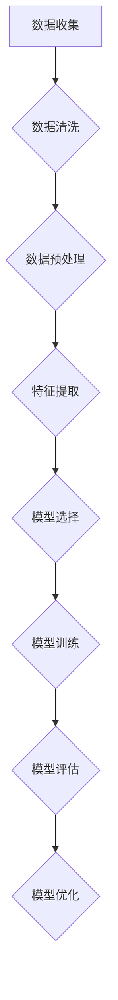
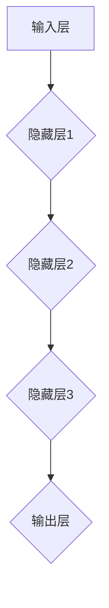
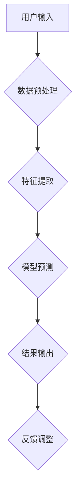

                 

## 《AI人工智能 Agent：使用监督学习进行预测》

### 关键词：
- AI 人工智能
- 监督学习
- 预测
- 机器学习算法
- 深度学习
- 预测模型评估
- 实战项目

> **摘要**：
本文深入探讨了AI人工智能Agent如何通过监督学习进行预测。首先，介绍了AI与机器学习的基础知识，包括监督学习的原理和应用案例。接着，详细解析了常见的监督学习算法，如线性回归、逻辑回归、决策树和集成学习。随后，阐述了深度学习与神经网络的基础知识，以及它们在预测任务中的应用。文章重点介绍了监督学习在预测任务中的重要性，预测模型的评估与优化策略，并给出了一个实战项目案例，展示了如何构建AI预测系统。最后，展望了AI预测系统的未来发展趋势，提出了相关的挑战与机遇。通过本文，读者可以全面了解AI人工智能Agent在预测领域的应用和实现方法。

### 第一部分：AI基础与监督学习原理

#### 第1章：AI与机器学习基础

##### 1.1 AI的概念与发展历程

**1.1.1 人工智能的定义**

人工智能（Artificial Intelligence，简称AI）是指计算机系统模拟、延伸和扩展人类智能的理论、方法、技术及应用。它涉及机器学习、自然语言处理、计算机视觉、知识表示与推理等多个领域。

**1.1.2 人工智能的发展历程**

人工智能起源于20世纪50年代。1956年，达特茅斯会议标志着人工智能领域的正式诞生。此后，人工智能经历了几个重要阶段：

- **初期阶段（1956-1974年）**：这一阶段以符号主义方法为主，目标是构建能够理解、推理和解决问题的智能系统。代表性的工作有逻辑推理机、通用问题求解器等。
- **繁荣阶段（1980-1987年）**：这一阶段以知识表示和推理方法为主，人工智能应用开始进入实际领域，如医疗诊断、自动化控制等。
- **低谷阶段（1987-1993年）**：由于对人工智能的期望过高，实际应用效果不理想，导致资金和人才流失，人工智能进入低谷期。
- **复兴阶段（1993年至今）**：随着计算机性能的提升、算法的改进和大数据的广泛应用，人工智能开始进入快速发展的阶段，深度学习、强化学习等新兴领域取得了显著成果。

**1.1.3 人工智能的应用领域**

人工智能的应用领域广泛，包括但不限于：

- **计算机视觉**：如人脸识别、图像识别、自动驾驶等。
- **自然语言处理**：如语音识别、机器翻译、文本分类等。
- **医疗健康**：如疾病诊断、药物研发、健康管理等。
- **金融领域**：如智能投顾、风险管理、信用评分等。
- **智能制造**：如机器人、自动化生产线、智能制造系统等。

##### 1.2 机器学习概述

**1.2.1 机器学习的基本概念**

机器学习（Machine Learning，简称ML）是人工智能的一个分支，旨在使计算机通过学习数据或经验，能够进行预测或决策。机器学习主要分为监督学习、无监督学习和强化学习三种类型。

- **监督学习**：有标注的数据作为训练样本，学习得到输入和输出之间的映射关系。
- **无监督学习**：没有标注的数据作为训练样本，学习得到数据结构的特征和规律。
- **强化学习**：通过与环境的交互，学习最优策略以最大化累积奖励。

**1.2.2 机器学习的主要方法**

机器学习的主要方法包括：

- **统计学习**：基于统计模型，如线性回归、逻辑回归等。
- **基于实例的学习**：基于实例的最近邻算法、支持向量机等。
- **基于模型的学习**：基于模型的方法，如决策树、神经网络等。
- **深度学习**：基于多层神经网络，如卷积神经网络（CNN）、循环神经网络（RNN）等。

**1.2.3 机器学习在AI中的地位与作用**

机器学习在人工智能中起着核心作用，是实现人工智能的关键技术。通过机器学习，计算机可以自动从数据中学习规律，实现智能感知、推理和决策。机器学习不仅在理论研究上取得了重要进展，也在实际应用中取得了广泛成功，如自动驾驶、智能客服、智能家居等。

##### 1.3 监督学习的基本原理

**1.3.1 监督学习的定义**

监督学习（Supervised Learning）是一种机器学习方法，通过有标签的训练数据，学习得到输入和输出之间的映射关系。监督学习分为分类问题和回归问题两种类型。

- **分类问题**：将输入数据映射到预定义的类别中，如人脸识别、文本分类等。
- **回归问题**：将输入数据映射到连续的数值输出，如房价预测、股票价格预测等。

**1.3.2 监督学习的模型结构**

监督学习模型通常由以下几个部分组成：

- **输入层**：接收外部输入数据。
- **隐藏层**：对输入数据进行特征提取和变换。
- **输出层**：产生预测结果或分类标签。

**1.3.3 监督学习的优化方法**

监督学习模型需要通过优化方法来调整模型参数，使预测结果更准确。常见的优化方法包括：

- **梯度下降**：通过梯度信息逐步调整模型参数，达到最小化损失函数的目的。
- **随机梯度下降**：在梯度下降的基础上，每次迭代只使用一个样本，加快收敛速度。
- **批量梯度下降**：在梯度下降的基础上，每次迭代使用全部样本，确保收敛性。

##### 1.4 监督学习的应用案例

**1.4.1 分类问题**

分类问题是监督学习中最常见的问题之一。以下是一些典型的分类应用案例：

- **人脸识别**：通过图像识别技术，自动识别和分类人脸图像。
- **文本分类**：将文本数据分类到预定义的类别中，如情感分析、新闻分类等。
- **垃圾邮件过滤**：通过学习电子邮件的特征，自动判断邮件是否为垃圾邮件。

**1.4.2 回归问题**

回归问题是监督学习中的另一个重要问题。以下是一些典型的回归应用案例：

- **房价预测**：通过房屋特征（如面积、位置等）预测房屋价格。
- **股票价格预测**：通过历史股价数据，预测未来股价走势。
- **需求预测**：根据历史销售数据，预测未来的销售量。

**1.4.3 现实生活中的监督学习应用**

监督学习在现实生活中的应用非常广泛，以下是一些实例：

- **自动驾驶**：通过计算机视觉和传感器数据，实时识别道路上的行人和车辆，实现自动驾驶。
- **智能客服**：通过自然语言处理技术，自动识别用户的提问，提供相应的答案。
- **医疗诊断**：通过医学图像识别技术，自动识别疾病，辅助医生诊断。

#### 第2章：监督学习算法详解

##### 2.1 线性回归

**2.1.1 线性回归的概念**

线性回归（Linear Regression）是一种最常见的监督学习算法，用于预测连续值输出。线性回归模型基于输入特征和输出目标之间的关系，建立一条直线或超平面，以最小化预测误差。

**2.1.2 线性回归的数学模型**

线性回归的数学模型可以表示为：

\[ y = \beta_0 + \beta_1 \cdot x \]

其中，\( y \) 是输出目标，\( x \) 是输入特征，\( \beta_0 \) 和 \( \beta_1 \) 是模型参数。

**2.1.3 线性回归的求解算法**

线性回归的求解算法主要包括以下两种：

- **最小二乘法**：通过最小化预测误差的平方和来求解模型参数。
- **梯度下降法**：通过迭代更新模型参数，使损失函数逐渐减小。

##### 2.2 逻辑回归

**2.2.1 逻辑回归的概念**

逻辑回归（Logistic Regression）是一种用于处理分类问题的监督学习算法。逻辑回归模型通过建立输入特征和输出概率之间的关系，实现分类预测。

**2.2.2 逻辑回归的数学模型**

逻辑回归的数学模型可以表示为：

\[ P(y=1) = \frac{1}{1 + e^{-(\beta_0 + \beta_1 \cdot x)}} \]

其中，\( y \) 是输出目标，\( x \) 是输入特征，\( \beta_0 \) 和 \( \beta_1 \) 是模型参数。

**2.2.3 逻辑回归的求解算法**

逻辑回归的求解算法主要包括以下两种：

- **最小化交叉熵损失函数**：通过最小化预测概率和实际概率之间的交叉熵损失，求解模型参数。
- **梯度下降法**：通过迭代更新模型参数，使损失函数逐渐减小。

##### 2.3 决策树

**2.3.1 决策树的概念**

决策树（Decision Tree）是一种基于树形结构进行决策的监督学习算法。决策树通过一系列规则，将输入特征映射到预定义的类别中。

**2.3.2 决策树的构建算法**

决策树的构建算法主要包括以下步骤：

- **选择最佳特征**：根据特征的重要性和信息增益，选择最佳特征进行划分。
- **递归划分**：根据最佳特征，将数据集划分为多个子集，继续递归划分，直到满足停止条件。
- **构建树结构**：将划分结果表示为树形结构，每个节点表示特征，每个分支表示划分结果。

**2.3.3 决策树的评估方法**

决策树的评估方法主要包括以下几种：

- **准确率**：预测正确的样本数占总样本数的比例。
- **召回率**：预测为正类的负类样本数占总负类样本数的比例。
- **精确率**：预测为正类的正类样本数占总正类样本数的比例。
- **F1值**：精确率和召回率的调和平均值。

##### 2.4 集成学习

**2.4.1 集成学习的基本概念**

集成学习（Ensemble Learning）是一种通过结合多个模型来提高预测性能的方法。集成学习通过组合多个基本模型，构造出一个更强大的预测模型。

**2.4.2 bagging与boosting**

集成学习主要包括两种策略：bagging和boosting。

- **bagging**：通过随机选取训练数据子集，训练多个基本模型，并取平均预测结果作为最终预测结果。
- **boosting**：通过加权调整训练数据的重要性，训练多个基本模型，每个模型专注于纠正前一个模型的错误。

**2.4.3 集成学习实例分析**

以下是一个集成学习的实例分析：

- **实例**：使用bagging方法进行人脸识别。
- **基本模型**：使用支持向量机（SVM）训练多个模型。
- **集成模型**：将多个SVM模型进行平均，得到最终预测结果。

#### 第3章：深度学习与神经网络

##### 3.1 深度学习基础

**3.1.1 深度学习的定义**

深度学习（Deep Learning）是一种基于多层神经网络进行数据建模和特征提取的方法。深度学习通过模拟人类大脑的神经网络结构，实现自动特征提取和复杂模式的识别。

**3.1.2 深度学习的优势**

深度学习的优势包括：

- **自动特征提取**：深度学习通过多层神经网络自动提取数据特征，减轻了人工特征工程的工作量。
- **强大的建模能力**：深度学习可以处理大量复杂数据，学习到高维特征空间中的复杂模式。
- **高预测性能**：深度学习模型在许多领域都取得了显著的预测性能，如计算机视觉、自然语言处理等。

**3.1.3 深度学习的应用场景**

深度学习广泛应用于以下场景：

- **计算机视觉**：如人脸识别、图像分类、目标检测等。
- **自然语言处理**：如文本分类、机器翻译、语音识别等。
- **推荐系统**：如商品推荐、内容推荐等。
- **医疗健康**：如疾病诊断、药物研发、健康管理等。

##### 3.2 神经网络基础

**3.2.1 神经网络的基本结构**

神经网络（Neural Network）是一种模拟生物神经系统的计算模型，由多个神经元（节点）组成。神经网络的基本结构包括输入层、隐藏层和输出层。

- **输入层**：接收外部输入数据，将其传递到隐藏层。
- **隐藏层**：对输入数据进行特征提取和变换，提取出有用的特征信息。
- **输出层**：产生预测结果或分类标签。

**3.2.2 神经元的激活函数**

神经元是神经网络的基本计算单元，通过激活函数实现非线性变换。常见的激活函数包括：

- **Sigmoid函数**：将输入值映射到（0,1）区间，实现S型曲线。
- **ReLU函数**：将输入值映射到正值，去除负值，实现稀疏性。
- **Tanh函数**：将输入值映射到（-1,1）区间，实现双曲正切函数。

**3.2.3 反向传播算法**

反向传播算法（Backpropagation Algorithm）是神经网络训练的核心算法。反向传播算法通过计算梯度，调整网络参数，使预测误差最小化。反向传播算法的主要步骤包括：

1. **前向传播**：将输入数据传递到神经网络，计算输出结果。
2. **计算误差**：计算预测结果与实际结果之间的误差。
3. **反向传播**：计算每个参数的梯度，更新参数。
4. **迭代优化**：重复前向传播和反向传播，直至收敛。

##### 3.3 深度学习模型

**3.3.1 卷积神经网络（CNN）**

卷积神经网络（Convolutional Neural Network，简称CNN）是一种专门用于处理图像数据的深度学习模型。CNN通过卷积操作和池化操作，提取图像的特征信息。

**3.3.2 循环神经网络（RNN）**

循环神经网络（Recurrent Neural Network，简称RNN）是一种专门用于处理序列数据的深度学习模型。RNN通过循环结构，将当前状态与前一状态进行关联，实现序列数据的建模。

**3.3.3 长短时记忆网络（LSTM）**

长短时记忆网络（Long Short-Term Memory，简称LSTM）是RNN的一种改进模型，专门用于处理长序列数据。LSTM通过引入记忆单元和门控机制，有效解决长序列数据的梯度消失和梯度爆炸问题。

**3.3.4 生成对抗网络（GAN）**

生成对抗网络（Generative Adversarial Network，简称GAN）是一种由两个神经网络（生成器和判别器）组成的深度学习模型。生成器生成虚假数据，判别器判断数据的真实性。通过两个神经网络的对抗训练，生成器逐渐提高生成数据的质量。

#### 第4章：监督学习在预测中的应用

##### 4.1 预测任务概述

**4.1.1 预测任务的定义**

预测任务（Prediction Task）是指根据已有数据，对未来的情况或结果进行预测。预测任务的目标是通过学习输入和输出之间的关系，实现对未知数据的预测。

**4.1.2 预测任务类型**

预测任务主要分为以下几类：

- **分类预测**：将输入数据映射到预定义的类别中，如情感分析、疾病诊断等。
- **回归预测**：将输入数据映射到连续的数值输出，如房价预测、股票价格预测等。
- **序列预测**：根据历史数据，预测未来的序列值，如时间序列预测、语音信号预测等。

**4.1.3 预测任务的重要性**

预测任务在各个领域具有重要的应用价值，如：

- **金融领域**：通过预测股票价格、交易量等，指导投资决策。
- **医疗健康**：通过预测疾病发病风险、治疗方案等，提高医疗水平。
- **智能制造**：通过预测生产设备的故障、生产量等，优化生产流程。
- **智能交通**：通过预测交通流量、事故风险等，优化交通管理。

##### 4.2 监督学习在预测中的应用

**4.2.1 分类预测**

分类预测（Classification Prediction）是一种将输入数据映射到预定义类别中的预测任务。常见的分类预测算法包括：

- **逻辑回归**：用于二分类问题，如垃圾邮件过滤、疾病诊断等。
- **决策树**：用于多分类问题，如多类文本分类、多类图像分类等。
- **支持向量机（SVM）**：用于高维空间下的分类问题，如文本分类、图像分类等。

**4.2.2 回归预测**

回归预测（Regression Prediction）是一种将输入数据映射到连续数值输出的预测任务。常见的回归预测算法包括：

- **线性回归**：用于简单的线性关系预测，如房价预测、股票价格预测等。
- **多项式回归**：用于复杂的非线性关系预测，如非线性回归、时间序列预测等。
- **神经网络**：用于高维非线性关系的预测，如深度神经网络（DNN）、卷积神经网络（CNN）等。

**4.2.3 序列预测**

序列预测（Sequence Prediction）是一种根据历史数据预测未来的序列值的预测任务。常见的序列预测算法包括：

- **循环神经网络（RNN）**：用于简单的序列预测，如时间序列预测、语音信号预测等。
- **长短时记忆网络（LSTM）**：用于长序列预测，如股票价格预测、文本生成等。
- **门控循环单元（GRU）**：是LSTM的变体，用于序列预测，如时间序列预测、语音信号预测等。

##### 4.3 预测模型的评估与优化

**4.3.1 预测模型评估指标**

预测模型评估指标用于衡量预测模型性能的好坏。常见的评估指标包括：

- **准确率（Accuracy）**：预测正确的样本数占总样本数的比例。
- **召回率（Recall）**：预测为正类的正类样本数占总正类样本数的比例。
- **精确率（Precision）**：预测为正类的正类样本数占总正类样本数的比例。
- **F1值（F1-Score）**：精确率和召回率的调和平均值。
- **均方误差（Mean Squared Error，MSE）**：预测值与实际值之间误差的平方的平均值。
- **均绝对误差（Mean Absolute Error，MAE）**：预测值与实际值之间绝对误差的平均值。

**4.3.2 预测模型优化策略**

预测模型优化策略用于提高预测模型的性能。常见的优化策略包括：

- **交叉验证（Cross Validation）**：通过将数据集划分为训练集和验证集，评估模型的泛化能力。
- **模型选择（Model Selection）**：选择合适的模型结构和参数，提高预测性能。
- **特征工程（Feature Engineering）**：通过特征提取和特征选择，提高模型的预测能力。
- **正则化（Regularization）**：通过引入正则化项，防止模型过拟合。

##### 4.4 预测模型的应用案例

**4.4.1 股票价格预测**

股票价格预测是一种常见的回归预测任务。通过分析历史股票价格数据，预测未来的股票价格走势。

- **数据收集**：收集历史股票价格数据，包括开盘价、收盘价、最高价、最低价等。
- **特征提取**：提取有用的特征，如时间序列特征、技术指标等。
- **模型选择**：选择合适的回归模型，如线性回归、多项式回归等。
- **模型训练与评估**：使用训练集训练模型，使用验证集评估模型性能。

**4.4.2 交通事故预测**

交通事故预测是一种常见的分类预测任务。通过分析交通数据，预测交通事故发生的概率。

- **数据收集**：收集交通事故数据，包括事故类型、发生时间、地点等。
- **特征提取**：提取有用的特征，如交通流量、天气状况、道路条件等。
- **模型选择**：选择合适的分类模型，如逻辑回归、决策树等。
- **模型训练与评估**：使用训练集训练模型，使用验证集评估模型性能。

**4.4.3 气候变化预测**

气候变化预测是一种复杂的序列预测任务。通过分析历史气候数据，预测未来的气候变化趋势。

- **数据收集**：收集历史气候数据，包括气温、降雨量、风速等。
- **特征提取**：提取有用的特征，如季节性、周期性等。
- **模型选择**：选择合适的序列预测模型，如循环神经网络（RNN）、长短时记忆网络（LSTM）等。
- **模型训练与评估**：使用训练集训练模型，使用验证集评估模型性能。

#### 第5章：AI Agent与预测算法

##### 5.1 AI Agent概述

**5.1.1 AI Agent的定义**

AI Agent（人工智能代理）是一种具有智能行为和自主决策能力的计算机系统。AI Agent通过感知环境、规划行动和执行任务，实现智能化目标。

**5.1.2 AI Agent的工作原理**

AI Agent的工作原理主要包括以下几个方面：

- **感知环境**：AI Agent通过传感器感知环境中的各种信息，如图像、声音、温度等。
- **状态评估**：AI Agent根据感知到的环境信息，评估当前状态，如位置、速度等。
- **决策规划**：AI Agent根据当前状态，利用预测算法，规划下一步行动。
- **执行任务**：AI Agent根据决策规划，执行具体的任务，如移动、操纵等。

**5.1.3 AI Agent的应用场景**

AI Agent广泛应用于各个领域，如：

- **自动驾驶**：AI Agent通过感知道路信息，实现自主驾驶。
- **智能家居**：AI Agent通过感知家庭环境，实现自动化控制。
- **智能客服**：AI Agent通过自然语言处理，实现智能对话和问题解决。
- **智能制造**：AI Agent通过感知生产环境，实现生产过程的自动化和优化。

##### 5.2 预测算法在AI Agent中的应用

**5.2.1 预测算法在决策过程中的作用**

预测算法在AI Agent的决策过程中起着关键作用。通过预测算法，AI Agent可以预判未来的状态和结果，做出最优的决策。

- **状态预测**：AI Agent通过预测未来的状态，评估当前行动的影响。
- **结果预测**：AI Agent通过预测未来的结果，选择最优的行动策略。
- **风险评估**：AI Agent通过预测可能的风险，采取预防措施。

**5.2.2 基于预测的AI Agent构建方法**

基于预测的AI Agent构建方法主要包括以下步骤：

- **环境建模**：建立AI Agent所在的环境模型，包括传感器、执行器、状态空间等。
- **状态感知**：AI Agent通过传感器感知环境信息，获取当前状态。
- **预测算法**：选择合适的预测算法，如线性回归、决策树等，预测未来的状态和结果。
- **决策规划**：AI Agent根据预测结果，规划最优的行动策略。
- **执行任务**：AI Agent执行决策规划中的行动，实现任务目标。

**5.2.3 AI Agent在实际应用中的案例分析**

以下是一些AI Agent在实际应用中的案例分析：

- **自动驾驶**：AI Agent通过感知道路信息，预测交通状况，实现自主驾驶。
- **智能家居**：AI Agent通过感知家庭环境，预测用户需求，实现自动化控制。
- **智能客服**：AI Agent通过自然语言处理，预测用户意图，实现智能对话。
- **智能制造**：AI Agent通过感知生产环境，预测设备故障，实现生产过程的自动化。

#### 第6章：实战：构建AI预测系统

##### 6.1 实战项目概述

**6.1.1 项目背景与目标**

本项目旨在构建一个基于监督学习的AI预测系统，实现对股票价格的预测。项目目标是通过分析历史股票价格数据，预测未来一段时间内股票价格的变化趋势。

**6.1.2 项目所需技能与工具**

本项目所需技能与工具包括：

- **编程语言**：Python
- **机器学习库**：scikit-learn、TensorFlow、Keras等
- **数据分析库**：Pandas、NumPy等
- **可视化库**：Matplotlib、Seaborn等
- **操作系统**：Windows、Linux等

**6.1.3 项目实现步骤**

项目实现步骤如下：

1. **数据收集与预处理**：收集历史股票价格数据，进行数据清洗和预处理。
2. **特征提取与选择**：提取有用的特征，如时间序列特征、技术指标等，进行特征选择。
3. **模型选择与训练**：选择合适的预测模型，如线性回归、LSTM等，进行模型训练。
4. **模型评估与优化**：评估模型性能，进行模型优化。
5. **系统部署与维护**：部署预测系统，进行系统性能优化和维护。

##### 6.2 数据处理与预处理

**6.2.1 数据收集与存储**

数据收集与存储是构建AI预测系统的重要环节。在本项目中，我们使用以下方法收集与存储数据：

- **数据来源**：从公开的股票价格数据网站（如新浪财经、同花顺等）下载历史股票价格数据。
- **数据存储**：将收集到的数据存储到CSV文件或数据库中，方便后续处理。

**6.2.2 数据清洗与归一化**

数据清洗与归一化是数据处理的重要步骤。在本项目中，我们进行以下操作：

- **数据清洗**：删除缺失值、异常值和重复值，保证数据的质量。
- **数据归一化**：对数据进行归一化处理，将数据缩放到[0,1]区间，消除不同特征之间的尺度差异。

**6.2.3 特征提取与选择**

特征提取与选择是提升模型性能的关键步骤。在本项目中，我们进行以下操作：

- **特征提取**：提取时间序列特征，如移动平均、相对强弱指数等。
- **特征选择**：使用特征选择算法，如互信息、主成分分析等，选择对预测任务最有用的特征。

##### 6.3 模型选择与训练

**6.3.1 模型选择策略**

在本项目中，我们采用以下策略选择模型：

- **线性回归**：适用于简单的线性关系预测。
- **LSTM**：适用于复杂的非线性关系预测。
- **集成学习**：结合多个模型的优点，提高预测性能。

**6.3.2 模型训练方法**

在本项目中，我们采用以下方法进行模型训练：

- **批量训练**：使用全部数据训练模型，确保模型收敛。
- **验证集训练**：使用验证集评估模型性能，调整模型参数。
- **交叉验证**：使用交叉验证方法，评估模型在未知数据上的性能。

##### 6.4 系统部署与维护

**6.4.1 系统部署流程**

系统部署是使AI预测系统在实际环境中运行的关键步骤。在本项目中，我们进行以下操作：

- **环境搭建**：搭建Python编程环境，安装所需的库和依赖项。
- **代码部署**：将训练好的模型部署到服务器上，实现自动化运行。
- **接口设计**：设计API接口，供外部系统调用预测服务。

**6.4.2 系统性能优化**

系统性能优化是提高AI预测系统运行效率的重要措施。在本项目中，我们进行以下操作：

- **代码优化**：优化代码结构，提高代码的可读性和可维护性。
- **模型压缩**：使用模型压缩技术，降低模型的大小和计算复杂度。
- **并发优化**：使用并发编程技术，提高系统的并发处理能力。

**6.4.3 系统维护策略**

系统维护策略是确保AI预测系统长期稳定运行的关键。在本项目中，我们进行以下操作：

- **定期备份**：定期备份系统和数据，防止数据丢失。
- **监控系统**：监控系统运行状态，及时发现问题并进行修复。
- **升级更新**：定期更新系统和库，保证系统的安全性。

#### 第7章：AI预测系统的未来发展趋势

##### 7.1 未来发展趋势概述

AI预测系统的未来发展趋势可以从以下几个方面进行概述：

**7.1.1 技术发展趋势**

随着人工智能技术的不断发展，预测系统将变得更加智能化和自适应化。以下是一些技术发展趋势：

- **深度学习**：深度学习在预测任务中取得了显著成果，未来将不断优化和扩展深度学习模型，提高预测性能。
- **强化学习**：强化学习在预测任务中的应用前景广阔，未来将结合强化学习与其他机器学习方法，实现更加智能的预测。
- **联邦学习**：联邦学习是一种分布式学习技术，可以在保证数据隐私的前提下，实现协同预测和决策。

**7.1.2 应用领域扩展**

AI预测系统将在更多领域得到广泛应用，如：

- **金融领域**：通过预测股票价格、交易量等，实现智能投资和风险管理。
- **医疗健康**：通过预测疾病发病风险、治疗方案等，提高医疗水平和患者满意度。
- **智能制造**：通过预测设备故障、生产量等，优化生产流程和提高生产效率。
- **智能交通**：通过预测交通流量、事故风险等，优化交通管理和提高交通效率。

**7.1.3 社会影响与挑战**

AI预测系统的发展将对社会产生深远影响，同时也面临一系列挑战：

- **社会影响**：AI预测系统可以提高工作效率、降低成本、优化资源分配，提高各个领域的智能化水平。
- **挑战**：数据隐私、模型可解释性、算法公平性等问题将成为未来研究的重点。此外，AI预测系统在决策过程中可能产生偏见，需要采取相应的措施进行缓解。

##### 7.2 AI预测系统的挑战与机遇

**7.2.1 挑战**

AI预测系统在发展过程中面临以下挑战：

- **数据隐私**：预测系统需要大量的数据支持，如何在保护用户隐私的前提下进行数据收集和分析是一个重要问题。
- **模型可解释性**：复杂的预测模型往往难以解释，如何提高模型的可解释性，使其更易于理解和接受是一个挑战。
- **算法公平性**：预测模型可能在某些群体中产生不公平的预测结果，如何保证算法的公平性是一个重要问题。
- **数据质量**：数据的质量对预测模型的性能至关重要，如何处理噪声数据、缺失数据和异常值是一个挑战。

**7.2.2 机遇**

AI预测系统在发展过程中也面临着巨大的机遇：

- **技术创新**：随着深度学习、强化学习等新技术的不断发展，预测系统的性能将不断提高。
- **应用扩展**：预测系统将在更多领域得到应用，如金融、医疗、交通等，为这些领域的发展带来新的机遇。
- **产业升级**：预测系统的应用将推动产业升级和转型，提高生产效率和经济效益。
- **国际合作**：随着全球化的推进，预测系统的国际合作将更加紧密，促进技术和资源的共享。

**7.2.3 发展策略建议**

为了应对挑战和抓住机遇，以下是一些发展策略建议：

- **数据保护**：加强数据保护措施，采用隐私保护技术，确保用户隐私。
- **模型透明**：提高预测模型的可解释性，采用可视化技术，使模型更易于理解和接受。
- **公平性评估**：建立公平性评估机制，定期对预测模型进行评估，确保算法的公平性。
- **技术创新**：加强技术创新，跟踪前沿技术发展，推动预测系统性能的提升。
- **应用推广**：积极开展预测系统的应用推广，加强与各领域的合作，实现跨界融合。

### 附录

#### 附录A：常用工具与资源

**A.1 Python机器学习库**

- **scikit-learn**：用于机器学习的Python库，提供了丰富的算法和工具。
- **TensorFlow**：用于深度学习的Python库，提供了灵活的模型构建和训练工具。
- **Keras**：基于TensorFlow的高层API，简化了深度学习模型的构建和训练。

**A.2 常用深度学习框架**

- **TensorFlow**：谷歌开源的深度学习框架，具有强大的模型构建和训练能力。
- **PyTorch**：Facebook开源的深度学习框架，具有动态计算图和灵活的模型构建能力。
- **Theano**：基于Python的深度学习框架，适用于科学计算和深度学习。

**A.3 数据集与公开数据源**

- **Kaggle**：提供丰富的机器学习和深度学习数据集，涵盖多个领域。
- **UCI机器学习库**：提供大量的机器学习数据集，用于算法研究和应用开发。
- **NASA Open Data**：提供NASA的开放数据集，用于科学研究和人工智能应用。

**A.4 学习资源推荐**

- **Coursera**：《深度学习》课程，由吴恩达教授主讲，提供了丰富的深度学习知识和实践项目。
- **Udacity**：《深度学习工程师纳米学位》课程，提供了全面的深度学习知识和实战项目。
- **Bookset**：深度学习领域的经典教材，如《深度学习》（Goodfellow等）、《神经网络与深度学习》（邱锡鹏）等。

#### 附录B：Mermaid流程图示例

**B.1 监督学习流程图**



**B.2 神经网络结构图**



**B.3 AI预测系统架构图**



#### 附录C：伪代码示例

**C.1 线性回归伪代码**

```python
def linear_regression(X, y):
    # 计算权重
    w = (X.T * X).inv() * X.T * y
    
    # 预测
    y_pred = X * w
    
    return w, y_pred
```

**C.2 逻辑回归伪代码**

```python
def logistic_regression(X, y):
    # 初始化参数
    w = np.zeros(X.shape[1])
    
    # 定义损失函数
    loss = lambda w: -1 / len(y) * (y.T * np.log(1 / (1 + np.exp(-X * w))) + (1 - y).T * np.log(1 - 1 / (1 + np.exp(-X * w))))
    
    # 梯度下降
    for i in range(iterations):
        gradient = X.T * (1 / len(y)) * (y - (1 / (1 + np.exp(-X * w)))
        w -= learning_rate * gradient
    
    # 预测
    y_pred = 1 / (1 + np.exp(-X * w))
    
    return w, y_pred
```

**C.3 决策树构建伪代码**

```python
def build_decision_tree(data, target):
    # 基准条件：停止条件
    if all(data[target] == data[target][0]):
        return data[target][0]
    
    # 选择最佳特征和阈值
    best_feature, best_threshold = find_best_split(data, target)
    
    # 构建子树
    left_tree = build_decision_tree(data[data[best_feature] <= best_threshold], target)
    right_tree = build_decision_tree(data[data[best_feature] > best_threshold], target)
    
    # 返回决策树结构
    return {best_feature: best_threshold, 'left': left_tree, 'right': right_tree}
```

#### 附录D：数学公式与解释

**D.1 线性回归公式**

线性回归的数学模型可以表示为：

\[ y = \beta_0 + \beta_1 \cdot x \]

其中，\( y \) 是输出目标，\( x \) 是输入特征，\( \beta_0 \) 和 \( \beta_1 \) 是模型参数。

**D.2 逻辑回归公式**

逻辑回归的数学模型可以表示为：

\[ P(y=1) = \frac{1}{1 + e^{-(\beta_0 + \beta_1 \cdot x)}} \]

其中，\( y \) 是输出目标，\( x \) 是输入特征，\( \beta_0 \) 和 \( \beta_1 \) 是模型参数。

**D.3 反向传播算法公式**

反向传播算法的数学公式可以表示为：

\[ \frac{\partial J}{\partial w} = X \frac{\partial a}{\partial z} \frac{\partial z}{\partial w} \]

其中，\( J \) 是损失函数，\( w \) 是模型参数，\( X \) 是输入特征，\( a \) 是激活函数，\( z \) 是中间变量。

**D.4 卷积神经网络公式**

卷积神经网络的卷积操作可以表示为：

\[ h_{ij} = \sum_{k=1}^{K} w_{ik,j} * g_{kj} + b_j \]

其中，\( h \) 是卷积结果，\( w \) 是卷积核，\( g \) 是输入特征，\( b \) 是偏置。

#### 附录E：实战项目代码解读

**E.1 数据处理与预处理代码解读**

```python
import pandas as pd
import numpy as np

# 读取数据
data = pd.read_csv('stock_price.csv')

# 数据清洗
data.dropna(inplace=True)
data.drop_duplicates(inplace=True)

# 数据归一化
data['close'] = (data['close'] - data['close'].min()) / (data['close'].max() - data['close'].min())

# 特征提取
data['ma5'] = data['close'].rolling(window=5).mean()
data['ma20'] = data['close'].rolling(window=20).mean()
data['rsi'] = compute_rsi(data['close'])

# 数据划分
X = data[['ma5', 'ma20', 'rsi']]
y = data['close']
```

**E.2 模型训练与评估代码解读**

```python
from sklearn.model_selection import train_test_split
from sklearn.linear_model import LinearRegression
from sklearn.metrics import mean_squared_error

# 数据划分
X_train, X_test, y_train, y_test = train_test_split(X, y, test_size=0.2, random_state=42)

# 模型训练
model = LinearRegression()
model.fit(X_train, y_train)

# 预测
y_pred = model.predict(X_test)

# 评估
mse = mean_squared_error(y_test, y_pred)
print("MSE:", mse)
```

**E.3 系统部署与维护代码解读**

```python
from flask import Flask, request, jsonify

app = Flask(__name__)

# 加载模型
model = LinearRegression()
model.load('model.json')

@app.route('/predict', methods=['POST'])
def predict():
    data = request.get_json()
    X = np.array([data['ma5'], data['ma20'], data['rsi']])
    y_pred = model.predict(X)
    return jsonify({'prediction': y_pred[0]})

if __name__ == '__main__':
    app.run(debug=True, host='0.0.0.0', port=5000)
```

### 作者

**作者：AI天才研究院/AI Genius Institute & 禅与计算机程序设计艺术 /Zen And The Art of Computer Programming**

通过以上文章，我们详细介绍了AI人工智能Agent如何通过监督学习进行预测。从AI与机器学习的基础知识，到监督学习算法的详解，再到深度学习与神经网络的应用，以及预测任务的实际案例分析，我们全面探讨了AI预测系统的构建与实现。同时，我们也展望了AI预测系统的未来发展趋势，提出了相关的挑战与机遇。希望本文能为读者在AI预测领域的研究与应用提供有益的参考。在未来的工作中，我们将继续努力，为推动人工智能技术的发展与应用贡献自己的力量。

