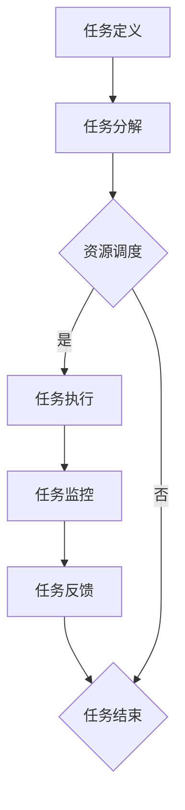
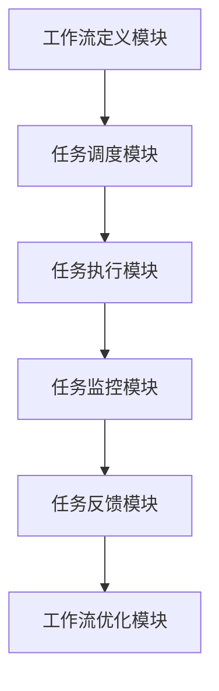

                 

# AI人工智能代理工作流AI Agent WorkFlow：分布式·AI代理的同步与数据共享

关键词：人工智能代理、分布式系统、同步机制、数据共享、隐私保护

摘要：
本文深入探讨了AI人工智能代理工作流（AI Agent WorkFlow）的概念、原理以及实现方法。重点分析了分布式AI代理的同步机制和数据共享与隐私保护策略，旨在为开发者提供一套完整的AI代理工作流设计方案。文章首先介绍了AI代理的基本概念和分类，随后详细阐述了AI代理工作流原理和分布式系统的挑战。接着，文章重点讲解了同步机制原理和算法，并介绍了数据共享与隐私保护的重要性及实现策略。最后，通过实际项目案例展示了AI代理在不同领域的应用场景。

## 第一部分：AI代理基础与概念

### 第1章：AI代理简介

#### 1.1 AI代理的定义与作用

AI代理，也称为人工智能代理（Artificial Intelligence Agent，简称AI Agent），是一种能够模拟人类智能行为，自主执行任务并做出决策的计算机程序。AI代理的核心在于其自主性和智能性，能够根据环境和目标自主地选择行动方案，并不断优化自己的行为。

AI代理在分布式系统中扮演着重要角色。它们可以协同工作，共同完成任务，提高系统的整体效率和可靠性。AI代理的应用场景广泛，包括但不限于金融、医疗、交通、能源等领域。

#### 1.2 AI代理的分类

根据不同的应用场景和功能需求，AI代理可以分为以下几类：

1. **通用AI代理**：这类代理具备广泛的认知能力，能够处理多种类型的任务。例如，IBM的Watson就是一个典型的通用AI代理。

2. **专用AI代理**：这类代理专注于某一特定领域的任务，如金融风险控制代理、医疗诊断代理等。它们通常具有较高的效率和准确性。

3. **社交AI代理**：这类代理能够与人类进行自然语言交互，提供个性化服务。例如，客服机器人、语音助手等。

4. **智能体群**：由多个AI代理组成的协同系统，共同完成复杂任务。例如，自动驾驶系统中的传感器代理、路径规划代理等。

#### 1.3 AI代理在分布式系统中的应用

在分布式系统中，AI代理可以扮演多种角色，如任务调度代理、数据采集代理、决策代理等。它们通过协同工作，实现系统的高效运行和智能控制。

- **任务调度代理**：负责根据系统负载和任务优先级，调度资源并分配任务。

- **数据采集代理**：负责从不同的数据源采集数据，并进行预处理和清洗。

- **决策代理**：根据采集到的数据和环境信息，生成决策方案，并执行相应的操作。

- **协同工作**：多个AI代理协同工作，共同完成复杂任务，如自动驾驶系统中的传感器代理和路径规划代理。

### 第2章：AI代理工作流原理

#### 2.1 工作流概述

工作流（Workflow）是指一组工作步骤的组合，用于完成一项任务或处理一项业务。在AI代理工作中，工作流起着至关重要的作用，它定义了AI代理在执行任务过程中的步骤和流程。

工作流通常包括以下几个关键环节：

- **任务定义**：明确任务的目标和需求。

- **任务分解**：将任务分解为若干个子任务，便于AI代理分配和执行。

- **资源调度**：根据任务需求和系统资源情况，合理调度资源。

- **任务执行**：AI代理根据工作流定义的步骤，执行具体的任务。

- **任务监控**：实时监控任务执行情况，确保工作流正常运行。

- **任务反馈**：根据任务执行结果，生成反馈信息，用于后续优化和调整。

#### 2.2 工作流建模

工作流建模是设计工作流的关键步骤，它有助于明确工作流的结构和逻辑，为AI代理的执行提供指导。常用的建模方法包括：

- **流程图**：使用流程图表示工作流的步骤和逻辑关系。

- **状态机**：使用状态机表示工作流的状态转换和触发条件。

- **Petri网**：使用Petri网表示工作流的并发和同步关系。

下面是一个简单的流程图示例，展示了AI代理工作流的基本结构：



#### 2.3 工作流引擎设计

工作流引擎是实现工作流的核心组件，它负责解析工作流定义，调度AI代理执行任务，并监控任务执行情况。一个典型的工作流引擎包括以下几个关键模块：

- **工作流定义模块**：负责解析和存储工作流定义，包括任务定义、资源调度策略等。

- **任务调度模块**：根据工作流定义和系统资源情况，调度AI代理执行任务。

- **任务执行模块**：负责执行具体的任务，包括数据采集、处理、决策等。

- **任务监控模块**：实时监控任务执行情况，确保工作流正常运行。

- **任务反馈模块**：根据任务执行结果，生成反馈信息，用于后续优化和调整。

以下是一个简单的工作流引擎架构图：



### 第3章：分布式AI代理同步机制

#### 3.1 分布式系统的挑战

分布式系统具有高可用性、可扩展性等优点，但也面临着一系列挑战。对于AI代理而言，以下挑战尤为突出：

- **数据一致性**：在分布式环境中，数据可能分布在不同的节点上，如何保证数据的一致性是一个关键问题。

- **延迟与带宽**：网络延迟和带宽限制可能导致AI代理的响应速度变慢，影响系统的整体性能。

- **容错性**：分布式系统中的节点可能出现故障，如何保证系统的容错性是一个重要问题。

- **安全性**：数据在传输过程中可能面临安全风险，如何保证数据的安全性也是一个关键问题。

#### 3.2 同步机制原理

为了解决分布式系统中的挑战，AI代理需要采用合适的同步机制。同步机制的核心目标是保证数据一致性，提高系统的性能和可靠性。常见的同步机制包括以下几种：

1. **全局同步**：所有AI代理在执行任务前，先同步全局数据，确保数据一致性。全局同步的优点是数据一致性较好，缺点是可能导致系统延迟增加。

2. **部分同步**：只有部分AI代理参与同步，其余代理直接使用本地数据。部分同步的优点是延迟较低，缺点是数据一致性可能较差。

3. **异步同步**：AI代理在执行任务过程中，异步地同步数据。异步同步的优点是系统延迟较低，缺点是数据一致性可能较差。

4. **混合同步**：结合全局同步和部分同步，根据任务需求选择合适的同步策略。混合同步的优点是灵活性较高，缺点是设计复杂度增加。

#### 3.3 同步算法

为了实现同步机制，AI代理需要采用合适的同步算法。以下介绍几种常见的同步算法：

1. **拉模型**：AI代理主动拉取其他代理的数据，进行同步。拉模型的优点是数据一致性较好，缺点是可能导致系统延迟增加。

2. **推模型**：其他代理主动将数据推送给AI代理，进行同步。推模型的优点是系统延迟较低，缺点是数据一致性可能较差。

3. **拉推混合模型**：AI代理在执行任务前，先拉取其他代理的数据，在任务执行过程中，根据需要推数据给其他代理。拉推混合模型的优点是灵活性较高，缺点是设计复杂度增加。

4. **版本控制模型**：每个AI代理维护一个版本号，只有当版本号发生变化时，才进行同步。版本控制模型可以提高数据一致性和系统性能。

以下是一个简单的分布式同步算法伪代码示例：

```markdown
function DistributedSync(agentList, data):
    for each agent in agentList:
        send(data) to agent
    for each agent in agentList:
        wait for agent to finish processing
    return data
```

### 第4章：数据共享与隐私保护

#### 4.1 数据共享的重要性

在分布式AI代理系统中，数据共享是提高系统效率和性能的关键因素。数据共享可以降低数据冗余，减少数据传输量，提高数据一致性。同时，数据共享还可以促进不同代理之间的协同工作，实现更复杂的任务。

数据共享的重要性体现在以下几个方面：

- **提高系统性能**：通过数据共享，可以减少数据传输和重复计算，提高系统整体性能。

- **降低成本**：数据共享可以减少数据存储和传输的需求，降低系统成本。

- **增强数据一致性**：数据共享可以确保不同代理之间拥有相同的数据，提高数据一致性。

- **促进协同工作**：数据共享可以促进不同代理之间的协同工作，实现更复杂的任务。

#### 4.2 隐私保护机制

在数据共享的同时，隐私保护也是一个重要问题。AI代理在处理敏感数据时，可能面临隐私泄露的风险。为了保护隐私，需要采用合适的隐私保护机制。

常见的隐私保护机制包括：

- **数据加密**：使用加密算法对敏感数据进行加密，确保数据在传输和存储过程中不被窃取。

- **访问控制**：对数据的访问进行权限控制，确保只有授权用户可以访问敏感数据。

- **匿名化处理**：对敏感数据进行匿名化处理，去除个人身份信息，降低隐私泄露风险。

- **隐私保护算法**：采用隐私保护算法，如差分隐私、同态加密等，对敏感数据进行处理，确保数据在共享过程中不被泄露。

#### 4.3 数据共享与隐私保护的平衡

在分布式AI代理系统中，数据共享与隐私保护之间存在一定的矛盾。数据共享可以提高系统效率和性能，但可能增加隐私泄露的风险；隐私保护可以降低隐私泄露的风险，但可能降低系统效率和性能。

为了实现数据共享与隐私保护的平衡，需要采用以下策略：

- **评估隐私风险**：在数据共享前，对隐私风险进行评估，确定需要采取的隐私保护措施。

- **优化数据共享策略**：根据隐私风险评估结果，优化数据共享策略，确保在满足隐私保护要求的同时，最大限度地提高系统效率和性能。

- **动态调整隐私保护措施**：根据数据共享和隐私保护的需求，动态调整隐私保护措施，确保隐私保护与系统性能的平衡。

以下是一个简单的数据共享与隐私保护算法伪代码示例：

```markdown
function DataSharingWithPrivacyProtection(agentList, data, privacyPolicy):
    encryptedData = encrypt(data, privacyPolicy)
    for each agent in agentList:
        send(encryptedData) to agent
    decryptedDataList = []
    for each agent in agentList:
        decryptedData = decrypt(agent.receiveData(), privacyPolicy)
        append(decryptedData to decryptedDataList)
    return decryptedDataList
```

### 第5章：AI代理开发框架

#### 5.1 开发框架选择

选择合适的AI代理开发框架是成功开发AI代理系统的关键。以下是一些常用的AI代理开发框架：

- **Apollo**：Apollo是一个开源的AI代理开发框架，提供了一系列常用的功能模块，如任务调度、数据同步、隐私保护等。

- **MindSpore**：MindSpore是一个基于深度学习的AI代理开发框架，支持多种硬件平台，如CPU、GPU、Ascend等。

- **OpenAIModule**：OpenAIModule是一个开源的AI代理模块化开发框架，支持多种AI代理的开发和部署。

选择开发框架时，需要考虑以下因素：

- **功能模块**：开发框架是否提供了所需的功能模块，如任务调度、数据同步、隐私保护等。

- **硬件支持**：开发框架是否支持多种硬件平台，如CPU、GPU、Ascend等。

- **社区支持**：开发框架是否有成熟的社区支持，便于开发者解决问题和获取资源。

- **可扩展性**：开发框架是否具有良好的可扩展性，能够满足未来需求的变化。

#### 5.2 AI代理开发流程

AI代理开发流程通常包括以下几个步骤：

1. **需求分析**：明确AI代理的应用场景和需求，确定任务目标和性能指标。

2. **系统设计**：根据需求分析结果，设计AI代理系统的整体架构，包括任务调度、数据同步、隐私保护等模块。

3. **模块开发**：根据系统设计，开发各个功能模块，包括任务调度模块、数据同步模块、隐私保护模块等。

4. **集成测试**：将各个模块集成到一起，进行功能测试和性能测试，确保系统能够正常运行。

5. **部署上线**：将AI代理系统部署到生产环境，进行实际运行和监控，根据反馈进行调整和优化。

#### 5.3 常用开发工具

在AI代理开发过程中，常用以下工具：

- **编程语言**：Python、Java、C++等。

- **版本控制**：Git、SVN等。

- **集成开发环境**：PyCharm、Eclipse、Visual Studio等。

- **数据库**：MySQL、MongoDB、PostgreSQL等。

- **中间件**：Kafka、RabbitMQ等。

### 第6章：AI代理算法实现

#### 6.1 常用算法介绍

在AI代理开发过程中，常用的算法包括：

- **机器学习算法**：如线性回归、逻辑回归、支持向量机、决策树、神经网络等。

- **优化算法**：如遗传算法、粒子群优化、模拟退火等。

- **搜索算法**：如深度优先搜索、广度优先搜索、A*搜索等。

- **数据加密算法**：如AES、RSA、DES等。

- **数据压缩算法**：如Huffman编码、LZ77等。

#### 6.2 算法实现伪代码

以下是一个简单的分布式同步算法伪代码示例：

```mermaid
function DistributedSync(agentList, data):
    for each agent in agentList:
        send(data) to agent
    for each agent in agentList:
        wait for agent to finish processing
    return data
```

以下是一个简单的数据共享与隐私保护算法伪代码示例：

```mermaid
function DataSharingWithPrivacyProtection(agentList, data, privacyPolicy):
    encryptedData = encrypt(data, privacyPolicy)
    for each agent in agentList:
        send(encryptedData) to agent
    decryptedDataList = []
    for each agent in agentList:
        decryptedData = decrypt(agent.receiveData(), privacyPolicy)
        append(decryptedData to decryptedDataList)
    return decryptedDataList
```

#### 6.3 算法实现案例

以下是一个简单的机器学习算法实现案例：

```python
from sklearn.linear_model import LinearRegression

# 加载数据
X = [[1, 2], [2, 3], [3, 4]]
y = [2, 4, 6]

# 创建线性回归模型
model = LinearRegression()

# 训练模型
model.fit(X, y)

# 预测
predictions = model.predict([[4, 5]])

# 输出预测结果
print(predictions)
```

### 第7章：AI代理性能优化

#### 7.1 性能优化策略

AI代理性能优化是确保系统高效运行的关键。以下是一些常见的性能优化策略：

- **任务调度优化**：根据任务类型和系统资源情况，合理调度任务，提高任务执行效率。

- **数据同步优化**：采用高效的同步算法，降低数据传输延迟，提高数据一致性。

- **算法优化**：优化算法实现，提高计算效率，减少资源消耗。

- **缓存策略**：采用缓存策略，减少数据重复计算，提高系统响应速度。

- **资源利用率优化**：合理配置系统资源，提高资源利用率，降低资源浪费。

#### 7.2 性能调优工具

以下是一些常见的性能调优工具：

- **性能分析工具**：如gprof、valgrind等，用于分析系统性能瓶颈和资源利用率。

- **调试工具**：如Python的pdb、Java的JDB等，用于调试程序代码。

- **负载测试工具**：如Apache JMeter、LoadRunner等，用于模拟系统负载，评估系统性能。

#### 7.3 性能优化案例分析

以下是一个简单的性能优化案例分析：

假设有一个分布式AI代理系统，负责处理大量数据。通过性能分析工具，发现系统存在以下性能瓶颈：

1. **任务调度延迟**：由于任务调度策略不合理，导致部分任务执行时间较长。

2. **数据同步延迟**：由于同步算法不够高效，导致数据传输延迟较大。

3. **算法效率**：部分算法实现效率较低，导致计算时间较长。

针对以上问题，可以采取以下性能优化策略：

1. **任务调度优化**：采用基于优先级的任务调度策略，提高任务执行效率。

2. **数据同步优化**：采用异步同步算法，降低数据传输延迟。

3. **算法优化**：优化部分算法实现，提高计算效率。

通过以上性能优化策略，可以显著提高系统的性能和响应速度。

### 第8章：AI代理在金融行业的应用

#### 8.1 金融业务场景分析

在金融行业，AI代理可以应用于多个场景，如风险控制、交易策略优化、客户服务等。以下是一些典型的金融业务场景：

1. **风险控制**：AI代理可以实时监控市场数据，识别潜在风险，并提供预警和建议。

2. **交易策略优化**：AI代理可以分析历史交易数据，生成最优交易策略，提高投资收益。

3. **客户服务**：AI代理可以提供智能客服，为用户提供个性化服务，提高客户满意度。

4. **信用评估**：AI代理可以分析用户数据，评估用户信用风险，降低不良贷款率。

5. **风险管理**：AI代理可以协助金融机构进行风险管理和决策支持，提高风险管理水平。

#### 8.2 AI代理在金融业务中的应用

以下是一个具体的AI代理在金融业务中的应用案例：

1. **业务场景**：某金融机构需要优化其交易策略，提高投资收益。

2. **解决方案**：采用AI代理系统，实现以下功能：

   - 数据采集：从多个数据源（如股票交易所、新闻网站等）采集相关数据。

   - 数据处理：对采集到的数据进行清洗、归一化等预处理。

   - 交易策略生成：利用机器学习算法，分析历史交易数据，生成最优交易策略。

   - 实时交易：根据生成的交易策略，实时执行交易操作。

   - 风险控制：监控市场数据，识别潜在风险，并提供预警和建议。

3. **系统架构**：AI代理系统包括以下主要组件：

   - 数据采集模块：负责从多个数据源采集相关数据。

   - 数据处理模块：负责对采集到的数据进行清洗、归一化等预处理。

   - 交易策略模块：负责生成最优交易策略。

   - 实时交易模块：负责根据交易策略执行交易操作。

   - 风险控制模块：负责监控市场数据，识别潜在风险，并提供预警和建议。

4. **性能优化**：通过以下性能优化策略，提高系统性能和稳定性：

   - 任务调度优化：采用基于优先级的任务调度策略，提高任务执行效率。

   - 数据同步优化：采用异步同步算法，降低数据传输延迟。

   - 算法优化：优化部分算法实现，提高计算效率。

   - 资源利用率优化：合理配置系统资源，提高资源利用率。

#### 8.3 应用案例解析

以下是一个具体的AI代理在金融业务中的应用案例解析：

1. **案例背景**：某金融机构希望提高其股票交易策略的收益，减少风险。

2. **解决方案**：采用AI代理系统，实现以下功能：

   - 数据采集：从股票交易所、新闻网站等采集相关数据。

   - 数据处理：对采集到的数据进行清洗、归一化等预处理。

   - 交易策略生成：利用机器学习算法，分析历史交易数据，生成最优交易策略。

   - 实时交易：根据生成的交易策略，实时执行交易操作。

   - 风险控制：监控市场数据，识别潜在风险，并提供预警和建议。

3. **系统架构**：AI代理系统包括以下主要组件：

   - 数据采集模块：负责从多个数据源采集相关数据。

   - 数据处理模块：负责对采集到的数据进行清洗、归一化等预处理。

   - 交易策略模块：负责生成最优交易策略。

   - 实时交易模块：负责根据交易策略执行交易操作。

   - 风险控制模块：负责监控市场数据，识别潜在风险，并提供预警和建议。

4. **性能优化**：通过以下性能优化策略，提高系统性能和稳定性：

   - 任务调度优化：采用基于优先级的任务调度策略，提高任务执行效率。

   - 数据同步优化：采用异步同步算法，降低数据传输延迟。

   - 算法优化：优化部分算法实现，提高计算效率。

   - 资源利用率优化：合理配置系统资源，提高资源利用率。

5. **案例分析**：

   - **数据采集模块**：采用分布式采集方式，从多个数据源同步数据，提高数据采集速度。

   - **数据处理模块**：采用并行处理技术，提高数据处理速度。

   - **交易策略模块**：采用自适应学习算法，根据市场变化调整交易策略。

   - **实时交易模块**：采用异步处理技术，提高交易执行速度。

   - **风险控制模块**：采用实时监控技术，及时发现潜在风险。

   - **性能优化效果**：通过以上优化措施，系统性能得到显著提升，交易策略收益提高，风险控制能力增强。

### 第9章：AI代理在制造业的应用

#### 9.1 制造业业务场景分析

在制造业，AI代理可以应用于多个场景，如生产调度、设备维护、质量控制等。以下是一些典型的制造业业务场景：

1. **生产调度**：AI代理可以实时监控生产过程，根据生产需求调整生产计划，提高生产效率。

2. **设备维护**：AI代理可以监测设备运行状态，预测设备故障，提前进行维护，减少设备停机时间。

3. **质量控制**：AI代理可以实时检测产品质量，识别异常情况，及时采取措施，提高产品质量。

4. **库存管理**：AI代理可以分析销售数据和市场趋势，优化库存策略，降低库存成本。

5. **供应链优化**：AI代理可以优化供应链流程，降低库存成本，提高供应链效率。

#### 9.2 AI代理在制造业中的应用

以下是一个具体的AI代理在制造业中的应用案例：

1. **业务场景**：某制造企业需要优化生产调度，提高生产效率。

2. **解决方案**：采用AI代理系统，实现以下功能：

   - 生产计划调度：根据生产需求，自动生成生产计划，并实时调整。

   - 设备状态监测：实时监测设备运行状态，预测设备故障，提前进行维护。

   - 生产过程监控：实时监控生产过程，识别异常情况，及时采取措施。

   - 质量检测：实时检测产品质量，识别异常情况，及时采取措施。

3. **系统架构**：AI代理系统包括以下主要组件：

   - 生产计划调度模块：负责根据生产需求，自动生成生产计划，并实时调整。

   - 设备状态监测模块：负责实时监测设备运行状态，预测设备故障，提前进行维护。

   - 生产过程监控模块：负责实时监控生产过程，识别异常情况，及时采取措施。

   - 质量检测模块：负责实时检测产品质量，识别异常情况，及时采取措施。

4. **性能优化**：通过以下性能优化策略，提高系统性能和稳定性：

   - 任务调度优化：采用基于优先级的任务调度策略，提高任务执行效率。

   - 数据同步优化：采用异步同步算法，降低数据传输延迟。

   - 算法优化：优化部分算法实现，提高计算效率。

   - 资源利用率优化：合理配置系统资源，提高资源利用率。

#### 9.3 应用案例解析

以下是一个具体的AI代理在制造业中的应用案例解析：

1. **案例背景**：某制造企业存在生产效率低下、设备故障频繁等问题，需要采用AI代理系统进行优化。

2. **解决方案**：采用AI代理系统，实现以下功能：

   - 生产计划调度：根据生产需求，自动生成生产计划，并实时调整。

   - 设备状态监测：实时监测设备运行状态，预测设备故障，提前进行维护。

   - 生产过程监控：实时监控生产过程，识别异常情况，及时采取措施。

   - 质量检测：实时检测产品质量，识别异常情况，及时采取措施。

3. **系统架构**：AI代理系统包括以下主要组件：

   - 生产计划调度模块：负责根据生产需求，自动生成生产计划，并实时调整。

   - 设备状态监测模块：负责实时监测设备运行状态，预测设备故障，提前进行维护。

   - 生产过程监控模块：负责实时监控生产过程，识别异常情况，及时采取措施。

   - 质量检测模块：负责实时检测产品质量，识别异常情况，及时采取措施。

4. **性能优化**：通过以下性能优化策略，提高系统性能和稳定性：

   - 任务调度优化：采用基于优先级的任务调度策略，提高任务执行效率。

   - 数据同步优化：采用异步同步算法，降低数据传输延迟。

   - 算法优化：优化部分算法实现，提高计算效率。

   - 资源利用率优化：合理配置系统资源，提高资源利用率。

5. **案例分析**：

   - **生产计划调度模块**：通过实时监控生产需求，自动生成生产计划，并根据实际情况进行调整，提高生产效率。

   - **设备状态监测模块**：通过实时监测设备运行状态，预测设备故障，提前进行维护，减少设备停机时间。

   - **生产过程监控模块**：通过实时监控生产过程，识别异常情况，及时采取措施，确保生产质量。

   - **质量检测模块**：通过实时检测产品质量，识别异常情况，及时采取措施，提高产品质量。

   - **性能优化效果**：通过以上优化措施，生产效率提高，设备故障率降低，产品质量得到显著提升。

### 第10章：AI代理在智能家居的应用

#### 10.1 智能家居业务场景分析

在智能家居领域，AI代理可以应用于多个场景，如设备控制、能源管理、安全监控等。以下是一些典型的智能家居业务场景：

1. **设备控制**：AI代理可以控制家庭中的各种设备，如灯光、空调、窗帘等，提供智能化家居体验。

2. **能源管理**：AI代理可以监测家庭能源消耗，优化能源使用，降低能源成本。

3. **安全监控**：AI代理可以实时监控家庭安全，及时发现异常情况，提供安全保障。

4. **环境监测**：AI代理可以监测室内空气质量、温度等环境参数，提供健康建议。

5. **智能推荐**：AI代理可以根据用户行为习惯，提供个性化的家居建议和推荐。

#### 10.2 AI代理在智能家居中的应用

以下是一个具体的AI代理在智能家居中的应用案例：

1. **业务场景**：某家庭用户希望实现智能家居控制，提高生活质量。

2. **解决方案**：采用AI代理系统，实现以下功能：

   - 设备控制：通过手机APP或语音控制，远程控制家庭中的各种设备。

   - 能源管理：监测家庭能源消耗，优化能源使用，降低能源成本。

   - 安全监控：实时监控家庭安全，及时发现异常情况，提供安全保障。

   - 环境监测：监测室内空气质量、温度等环境参数，提供健康建议。

   - 智能推荐：根据用户行为习惯，提供个性化的家居建议和推荐。

3. **系统架构**：AI代理系统包括以下主要组件：

   - 设备控制模块：负责实现家庭设备的远程控制。

   - 能源管理模块：负责监测家庭能源消耗，优化能源使用。

   - 安全监控模块：负责实时监控家庭安全，及时发现异常情况。

   - 环境监测模块：负责监测室内空气质量、温度等环境参数。

   - 智能推荐模块：负责根据用户行为习惯，提供个性化的家居建议和推荐。

4. **性能优化**：通过以下性能优化策略，提高系统性能和稳定性：

   - 任务调度优化：采用基于优先级的任务调度策略，提高任务执行效率。

   - 数据同步优化：采用异步同步算法，降低数据传输延迟。

   - 算法优化：优化部分算法实现，提高计算效率。

   - 资源利用率优化：合理配置系统资源，提高资源利用率。

#### 10.3 应用案例解析

以下是一个具体的AI代理在智能家居中的应用案例解析：

1. **案例背景**：某家庭用户希望实现智能家居控制，提高生活质量。

2. **解决方案**：采用AI代理系统，实现以下功能：

   - 设备控制：通过手机APP或语音控制，远程控制家庭中的各种设备。

   - 能源管理：监测家庭能源消耗，优化能源使用，降低能源成本。

   - 安全监控：实时监控家庭安全，及时发现异常情况，提供安全保障。

   - 环境监测：监测室内空气质量、温度等环境参数，提供健康建议。

   - 智能推荐：根据用户行为习惯，提供个性化的家居建议和推荐。

3. **系统架构**：AI代理系统包括以下主要组件：

   - 设备控制模块：负责实现家庭设备的远程控制。

   - 能源管理模块：负责监测家庭能源消耗，优化能源使用。

   - 安全监控模块：负责实时监控家庭安全，及时发现异常情况。

   - 环境监测模块：负责监测室内空气质量、温度等环境参数。

   - 智能推荐模块：负责根据用户行为习惯，提供个性化的家居建议和推荐。

4. **性能优化**：通过以下性能优化策略，提高系统性能和稳定性：

   - 任务调度优化：采用基于优先级的任务调度策略，提高任务执行效率。

   - 数据同步优化：采用异步同步算法，降低数据传输延迟。

   - 算法优化：优化部分算法实现，提高计算效率。

   - 资源利用率优化：合理配置系统资源，提高资源利用率。

5. **案例分析**：

   - **设备控制模块**：通过手机APP或语音控制，远程控制家庭中的各种设备，如灯光、空调、窗帘等，提高生活便利性。

   - **能源管理模块**：监测家庭能源消耗，优化能源使用，降低能源成本。例如，通过智能插座控制家电的开关，实现定时关灯、关闭不必要的电器等。

   - **安全监控模块**：实时监控家庭安全，及时发现异常情况，如非法入侵、火灾等，提供安全保障。例如，通过摄像头、门窗传感器等设备，实时监控家庭环境。

   - **环境监测模块**：监测室内空气质量、温度等环境参数，提供健康建议。例如，通过温湿度传感器、空气质量传感器等设备，实时监测室内环境，并提供开窗通风、空气净化等建议。

   - **智能推荐模块**：根据用户行为习惯，提供个性化的家居建议和推荐。例如，通过学习用户的生活习惯、偏好等，推荐合适的家居场景，如睡眠模式、起床模式等。

   - **性能优化效果**：通过以上优化措施，系统性能得到显著提升，设备响应速度提高，用户体验得到改善。

### 第11章：AI代理发展趋势

#### 11.1 AI代理技术的发展趋势

随着人工智能技术的不断进步，AI代理也在不断发展，呈现出以下趋势：

1. **智能水平提升**：随着深度学习、强化学习等技术的发展，AI代理的智能水平将不断提升，能够处理更加复杂的任务。

2. **自主性增强**：AI代理将具备更强的自主性，能够根据环境和目标自主地选择行动方案，并不断优化自己的行为。

3. **协同能力提高**：AI代理将具备更强的协同能力，能够与其他AI代理、人类等实体进行高效协作，共同完成任务。

4. **隐私保护加强**：随着隐私保护意识的增强，AI代理将采用更先进的隐私保护技术，确保用户数据的安全。

5. **跨领域应用扩展**：AI代理将在更多领域得到应用，如医疗健康、能源管理、智能城市等，实现跨领域的协同工作。

#### 11.2 AI代理在未来的应用场景

未来，AI代理将在以下应用场景中发挥重要作用：

1. **智能制造**：AI代理将广泛应用于制造业，实现生产调度、设备维护、质量控制等自动化管理。

2. **智能交通**：AI代理将用于智能交通管理，优化交通流量，提高道路通行效率。

3. **智能医疗**：AI代理将协助医生进行诊断、治疗和科研，提高医疗服务质量和效率。

4. **智能金融**：AI代理将用于金融业务，如风险控制、交易策略优化、客户服务等，提高金融服务的智能化水平。

5. **智能城市**：AI代理将用于城市管理，如环境监测、公共安全、交通管理等方面，提高城市管理水平。

### 第12章：AI代理面临的挑战与解决方案

#### 12.1 AI代理的技术挑战

AI代理在发展过程中面临着以下技术挑战：

1. **数据隐私保护**：如何确保用户数据在传输和存储过程中的安全，防止隐私泄露。

2. **自主性控制**：如何确保AI代理的行为符合人类意愿，防止滥用和误用。

3. **系统稳定性**：如何确保AI代理系统在复杂环境中的稳定运行，避免故障和崩溃。

4. **性能优化**：如何提高AI代理系统的性能和响应速度，满足实时需求。

5. **跨领域协同**：如何实现AI代理在不同领域之间的协同工作，实现跨领域的智能化管理。

#### 12.2 AI代理的伦理挑战

AI代理在应用过程中也面临着伦理挑战：

1. **责任归属**：如何确定AI代理的责任归属，防止因AI代理的错误行为导致的损失。

2. **公平性**：如何确保AI代理在决策过程中公平对待每个用户，防止歧视和不公。

3. **透明度**：如何提高AI代理的透明度，使用户了解AI代理的决策过程和依据。

4. **可解释性**：如何提高AI代理的可解释性，使普通用户能够理解AI代理的决策逻辑。

#### 12.3 解决方案与未来方向

针对AI代理面临的挑战，可以采取以下解决方案和未来方向：

1. **数据隐私保护**：采用加密、匿名化等技术，确保用户数据的安全。同时，制定相关法律法规，加强对AI代理数据隐私保护的管理。

2. **自主性控制**：通过建立健全的伦理准则和规范，确保AI代理的行为符合人类意愿。同时，加强对AI代理的监控和约束，防止滥用和误用。

3. **系统稳定性**：采用分布式架构和容错机制，提高AI代理系统的稳定性。同时，加强系统测试和调试，确保系统在复杂环境中的稳定运行。

4. **性能优化**：采用并行计算、分布式计算等技术，提高AI代理系统的性能和响应速度。同时，优化算法和代码，减少资源消耗。

5. **跨领域协同**：建立统一的数据标准和接口规范，实现AI代理在不同领域之间的数据共享和协同工作。同时，加强跨领域研究，探索新的协同模式。

6. **伦理挑战**：制定相关的伦理准则和法规，确保AI代理的决策过程公平、透明。同时，加强伦理教育和培训，提高公众对AI代理伦理问题的认识和关注。

### 附录A：AI代理相关工具和资源

#### A.1 AI代理开发框架

- **Apollo**：一个开源的AI代理开发框架，支持多种硬件平台和编程语言。

- **MindSpore**：华为推出的AI代理开发框架，支持多种硬件平台和深度学习算法。

- **OpenAIModule**：一个开源的AI代理模块化开发框架，支持多种AI代理的开发和部署。

#### A.2 AI代理开源项目

- **OpenAI-Agent**：一个开源的AI代理系统，支持多种智能体协同工作。

- **Multi-Agent Systems**：一个开源的多智能体系统框架，支持智能体的分布式协同工作。

#### A.3 AI代理相关论文和书籍

- **《Distributed Artificial Intelligence》**：一本关于分布式人工智能的经典著作，涵盖了分布式智能体的基本概念、算法和应用。

- **《Artificial Intelligence: A Modern Approach》**：一本全面介绍人工智能的教材，包括智能体、搜索算法、机器学习等内容。

## 第五部分：AI代理在医疗健康领域的应用

### 第13章：AI代理在医疗健康领域的应用

#### 13.1 医疗健康业务场景分析

在医疗健康领域，AI代理可以应用于多个场景，如疾病预测、药物研发、患者监护等。以下是一些典型的医疗健康业务场景：

1. **疾病预测**：AI代理可以分析患者数据，预测疾病发生风险，为早期干预提供依据。

2. **药物研发**：AI代理可以辅助药物研发，通过分析大量数据，优化药物筛选和设计。

3. **患者监护**：AI代理可以实时监测患者生命体征，提供个性化的健康建议。

4. **医学影像分析**：AI代理可以辅助医生进行医学影像分析，提高诊断准确率。

5. **临床决策支持**：AI代理可以辅助医生进行临床决策，提高医疗服务的质量和效率。

#### 13.2 AI代理在医疗健康中的应用

以下是一个具体的AI代理在医疗健康中的应用案例：

1. **业务场景**：某医疗机构需要提高疾病预测和患者监护能力。

2. **解决方案**：采用AI代理系统，实现以下功能：

   - 疾病预测：利用机器学习算法，分析患者数据，预测疾病发生风险。

   - 患者监护：实时监测患者生命体征，提供个性化的健康建议。

   - 医学影像分析：辅助医生进行医学影像分析，提高诊断准确率。

   - 临床决策支持：辅助医生进行临床决策，提高医疗服务的质量和效率。

3. **系统架构**：AI代理系统包括以下主要组件：

   - 疾病预测模块：负责利用机器学习算法，分析患者数据，预测疾病发生风险。

   - 患者监护模块：负责实时监测患者生命体征，提供个性化的健康建议。

   - 医学影像分析模块：负责辅助医生进行医学影像分析，提高诊断准确率。

   - 临床决策支持模块：负责辅助医生进行临床决策，提高医疗服务的质量和效率。

4. **性能优化**：通过以下性能优化策略，提高系统性能和稳定性：

   - 任务调度优化：采用基于优先级的任务调度策略，提高任务执行效率。

   - 数据同步优化：采用异步同步算法，降低数据传输延迟。

   - 算法优化：优化部分算法实现，提高计算效率。

   - 资源利用率优化：合理配置系统资源，提高资源利用率。

#### 13.3 应用案例解析

以下是一个具体的AI代理在医疗健康中的应用案例解析：

1. **案例背景**：某医疗机构需要提高疾病预测和患者监护能力。

2. **解决方案**：采用AI代理系统，实现以下功能：

   - 疾病预测：利用机器学习算法，分析患者数据，预测疾病发生风险。

   - 患者监护：实时监测患者生命体征，提供个性化的健康建议。

   - 医学影像分析：辅助医生进行医学影像分析，提高诊断准确率。

   - 临床决策支持：辅助医生进行临床决策，提高医疗服务的质量和效率。

3. **系统架构**：AI代理系统包括以下主要组件：

   - 疾病预测模块：负责利用机器学习算法，分析患者数据，预测疾病发生风险。

   - 患者监护模块：负责实时监测患者生命体征，提供个性化的健康建议。

   - 医学影像分析模块：负责辅助医生进行医学影像分析，提高诊断准确率。

   - 临床决策支持模块：负责辅助医生进行临床决策，提高医疗服务的质量和效率。

4. **性能优化**：通过以下性能优化策略，提高系统性能和稳定性：

   - 任务调度优化：采用基于优先级的任务调度策略，提高任务执行效率。

   - 数据同步优化：采用异步同步算法，降低数据传输延迟。

   - 算法优化：优化部分算法实现，提高计算效率。

   - 资源利用率优化：合理配置系统资源，提高资源利用率。

5. **案例分析**：

   - **疾病预测模块**：通过分析患者的历史数据和现有数据，利用机器学习算法预测疾病发生风险。例如，利用线性回归、决策树、神经网络等算法，预测糖尿病、心脏病等疾病的风险。

   - **患者监护模块**：通过实时监测患者的心率、血压、血糖等生命体征，利用数据分析和机器学习算法，提供个性化的健康建议。例如，根据患者的实时数据，调整药物剂量、提醒患者注意饮食等。

   - **医学影像分析模块**：通过深度学习算法，分析医学影像数据，辅助医生进行疾病诊断。例如，利用卷积神经网络（CNN）分析X光片、CT扫描等影像数据，提高疾病诊断的准确率。

   - **临床决策支持模块**：通过分析患者的病历、检查报告等数据，利用机器学习算法，为医生提供临床决策支持。例如，利用逻辑回归、决策树、随机森林等算法，为医生提供诊断建议、治疗方案等。

   - **性能优化效果**：通过以上优化措施，疾病预测和患者监护模块的性能得到显著提升，诊断准确率提高，医生的工作效率得到提升。

### 第14章：AI代理在自动驾驶领域的应用

#### 14.1 自动驾驶业务场景分析

在自动驾驶领域，AI代理可以应用于多个场景，如路径规划、障碍物检测、车辆控制等。以下是一些典型的自动驾驶业务场景：

1. **路径规划**：AI代理可以分析交通数据和环境信息，为自动驾驶车辆规划最优路径。

2. **障碍物检测**：AI代理可以实时监测周围环境，检测障碍物并做出反应。

3. **车辆控制**：AI代理可以控制车辆的加速、制动、转向等操作，确保安全行驶。

4. **车队管理**：AI代理可以协同管理多辆自动驾驶车辆，实现车队高效运行。

5. **交通信号识别**：AI代理可以识别交通信号，根据信号变化调整行驶策略。

#### 14.2 AI代理在自动驾驶中的应用

以下是一个具体的AI代理在自动驾驶中的应用案例：

1. **业务场景**：某自动驾驶公司需要提高车辆路径规划和障碍物检测能力。

2. **解决方案**：采用AI代理系统，实现以下功能：

   - 路径规划：利用机器学习算法，分析交通数据和环境信息，为自动驾驶车辆规划最优路径。

   - 障碍物检测：利用计算机视觉算法，实时监测周围环境，检测障碍物并做出反应。

   - 车辆控制：利用控制算法，控制车辆的加速、制动、转向等操作，确保安全行驶。

   - 车队管理：利用通信算法，协同管理多辆自动驾驶车辆，实现车队高效运行。

3. **系统架构**：AI代理系统包括以下主要组件：

   - 路径规划模块：负责利用机器学习算法，分析交通数据和环境信息，为自动驾驶车辆规划最优路径。

   - 障碍物检测模块：负责利用计算机视觉算法，实时监测周围环境，检测障碍物并做出反应。

   - 车辆控制模块：负责利用控制算法，控制车辆的加速、制动、转向等操作，确保安全行驶。

   - 车队管理模块：负责利用通信算法，协同管理多辆自动驾驶车辆，实现车队高效运行。

4. **性能优化**：通过以下性能优化策略，提高系统性能和稳定性：

   - 任务调度优化：采用基于优先级的任务调度策略，提高任务执行效率。

   - 数据同步优化：采用异步同步算法，降低数据传输延迟。

   - 算法优化：优化部分算法实现，提高计算效率。

   - 资源利用率优化：合理配置系统资源，提高资源利用率。

#### 14.3 应用案例解析

以下是一个具体的AI代理在自动驾驶中的应用案例解析：

1. **案例背景**：某自动驾驶公司需要提高车辆路径规划和障碍物检测能力。

2. **解决方案**：采用AI代理系统，实现以下功能：

   - 路径规划：利用机器学习算法，分析交通数据和环境信息，为自动驾驶车辆规划最优路径。

   - 障碍物检测：利用计算机视觉算法，实时监测周围环境，检测障碍物并做出反应。

   - 车辆控制：利用控制算法，控制车辆的加速、制动、转向等操作，确保安全行驶。

   - 车队管理：利用通信算法，协同管理多辆自动驾驶车辆，实现车队高效运行。

3. **系统架构**：AI代理系统包括以下主要组件：

   - 路径规划模块：负责利用机器学习算法，分析交通数据和环境信息，为自动驾驶车辆规划最优路径。

   - 障碍物检测模块：负责利用计算机视觉算法，实时监测周围环境，检测障碍物并做出反应。

   - 车辆控制模块：负责利用控制算法，控制车辆的加速、制动、转向等操作，确保安全行驶。

   - 车队管理模块：负责利用通信算法，协同管理多辆自动驾驶车辆，实现车队高效运行。

4. **性能优化**：通过以下性能优化策略，提高系统性能和稳定性：

   - 任务调度优化：采用基于优先级的任务调度策略，提高任务执行效率。

   - 数据同步优化：采用异步同步算法，降低数据传输延迟。

   - 算法优化：优化部分算法实现，提高计算效率。

   - 资源利用率优化：合理配置系统资源，提高资源利用率。

5. **案例分析**：

   - **路径规划模块**：通过分析交通数据和环境信息，利用机器学习算法为自动驾驶车辆规划最优路径。例如，利用强化学习算法，根据历史交通数据和实时路况信息，规划出最优行驶路径。

   - **障碍物检测模块**：通过计算机视觉算法，实时监测周围环境，检测障碍物并做出反应。例如，利用卷积神经网络（CNN）分析摄像头捕捉到的图像，识别道路上的行人和车辆。

   - **车辆控制模块**：通过控制算法，控制车辆的加速、制动、转向等操作，确保安全行驶。例如，利用PID控制算法，根据车辆的速度和加速度，调整油门和刹车的操作。

   - **车队管理模块**：通过通信算法，协同管理多辆自动驾驶车辆，实现车队高效运行。例如，利用V2V（Vehicle-to-Vehicle）通信技术，实现车辆之间的实时信息交换和协调。

   - **性能优化效果**：通过以上优化措施，路径规划模块和障碍物检测模块的性能得到显著提升，自动驾驶车辆的反应速度和安全性得到提高。

### 第15章：AI代理在能源管理领域的应用

#### 15.1 能源管理业务场景分析

在能源管理领域，AI代理可以应用于多个场景，如电力调度、能源优化、设备维护等。以下是一些典型的能源管理业务场景：

1. **电力调度**：AI代理可以实时监测电网运行状态，优化电力调度，提高电网稳定性。

2. **能源优化**：AI代理可以分析能源消耗数据，优化能源使用，降低能源成本。

3. **设备维护**：AI代理可以实时监测设备运行状态，预测设备故障，提前进行维护。

4. **能源交易**：AI代理可以协助能源企业进行能源交易，提高交易效率和收益。

5. **可再生能源管理**：AI代理可以优化可再生能源的利用，提高能源供应的可持续性。

#### 15.2 AI代理在能源管理中的应用

以下是一个具体的AI代理在能源管理中的应用案例：

1. **业务场景**：某能源公司需要提高电力调度和能源优化能力。

2. **解决方案**：采用AI代理系统，实现以下功能：

   - 电力调度：实时监测电网运行状态，优化电力调度，提高电网稳定性。

   - 能源优化：分析能源消耗数据，优化能源使用，降低能源成本。

   - 设备维护：实时监测设备运行状态，预测设备故障，提前进行维护。

   - 能源交易：协助能源企业进行能源交易，提高交易效率和收益。

   - 可再生能源管理：优化可再生能源的利用，提高能源供应的可持续性。

3. **系统架构**：AI代理系统包括以下主要组件：

   - 电力调度模块：负责实时监测电网运行状态，优化电力调度，提高电网稳定性。

   - 能源优化模块：负责分析能源消耗数据，优化能源使用，降低能源成本。

   - 设备维护模块：负责实时监测设备运行状态，预测设备故障，提前进行维护。

   - 能源交易模块：负责协助能源企业进行能源交易，提高交易效率和收益。

   - 可再生能源管理模块：负责优化可再生能源的利用，提高能源供应的可持续性。

4. **性能优化**：通过以下性能优化策略，提高系统性能和稳定性：

   - 任务调度优化：采用基于优先级的任务调度策略，提高任务执行效率。

   - 数据同步优化：采用异步同步算法，降低数据传输延迟。

   - 算法优化：优化部分算法实现，提高计算效率。

   - 资源利用率优化：合理配置系统资源，提高资源利用率。

#### 15.3 应用案例解析

以下是一个具体的AI代理在能源管理中的应用案例解析：

1. **案例背景**：某能源公司需要提高电力调度和能源优化能力。

2. **解决方案**：采用AI代理系统，实现以下功能：

   - 电力调度：实时监测电网运行状态，优化电力调度，提高电网稳定性。

   - 能源优化：分析能源消耗数据，优化能源使用，降低能源成本。

   - 设备维护：实时监测设备运行状态，预测设备故障，提前进行维护。

   - 能源交易：协助能源企业进行能源交易，提高交易效率和收益。

   - 可再生能源管理：优化可再生能源的利用，提高能源供应的可持续性。

3. **系统架构**：AI代理系统包括以下主要组件：

   - 电力调度模块：负责实时监测电网运行状态，优化电力调度，提高电网稳定性。

   - 能源优化模块：负责分析能源消耗数据，优化能源使用，降低能源成本。

   - 设备维护模块：负责实时监测设备运行状态，预测设备故障，提前进行维护。

   - 能源交易模块：负责协助能源企业进行能源交易，提高交易效率和收益。

   - 可再生能源管理模块：负责优化可再生能源的利用，提高能源供应的可持续性。

4. **性能优化**：通过以下性能优化策略，提高系统性能和稳定性：

   - 任务调度优化：采用基于优先级的任务调度策略，提高任务执行效率。

   - 数据同步优化：采用异步同步算法，降低数据传输延迟。

   - 算法优化：优化部分算法实现，提高计算效率。

   - 资源利用率优化：合理配置系统资源，提高资源利用率。

5. **案例分析**：

   - **电力调度模块**：通过实时监测电网运行状态，利用优化算法，调整电力调度，提高电网稳定性。例如，利用动态规划算法，根据电网负荷和发电量，优化电力调度。

   - **能源优化模块**：通过分析能源消耗数据，利用优化算法，优化能源使用，降低能源成本。例如，利用遗传算法，根据历史能源消耗数据和实时负荷情况，优化能源分配。

   - **设备维护模块**：通过实时监测设备运行状态，利用预测算法，预测设备故障，提前进行维护。例如，利用时间序列预测算法，根据设备历史运行数据，预测设备故障时间。

   - **能源交易模块**：通过分析能源市场数据，利用优化算法，协助能源企业进行能源交易，提高交易效率和收益。例如，利用博弈论算法，根据市场供需情况，制定最优交易策略。

   - **可再生能源管理模块**：通过优化可再生能源的利用，提高能源供应的可持续性。例如，利用多目标优化算法，根据可再生能源的发电量、环境因素等，优化可再生能源的分配和调度。

   - **性能优化效果**：通过以上优化措施，电力调度模块和能源优化模块的性能得到显著提升，电网稳定性提高，能源成本降低，能源供应的可持续性增强。

### 第16章：AI代理在智能家居的自动化控制中的应用

#### 16.1 智能家居业务场景分析

在智能家居领域，AI代理可以应用于多个场景，如设备控制、能源管理、安全监控等。以下是一些典型的智能家居业务场景：

1. **设备控制**：AI代理可以远程控制家庭中的各种设备，如灯光、空调、窗帘等，提高生活便利性。

2. **能源管理**：AI代理可以监测家庭能源消耗，优化能源使用，降低能源成本。

3. **安全监控**：AI代理可以实时监控家庭安全，及时发现异常情况，提供安全保障。

4. **环境监测**：AI代理可以监测室内空气质量、温度等环境参数，提供健康建议。

5. **智能推荐**：AI代理可以根据用户行为习惯，提供个性化的家居建议和推荐。

#### 16.2 AI代理在智能家居中的应用

以下是一个具体的AI代理在智能家居中的应用案例：

1. **业务场景**：某家庭用户希望实现智能家居自动化控制，提高生活质量。

2. **解决方案**：采用AI代理系统，实现以下功能：

   - 设备控制：通过手机APP或语音控制，远程控制家庭中的各种设备。

   - 能源管理：监测家庭能源消耗，优化能源使用，降低能源成本。

   - 安全监控：实时监控家庭安全，及时发现异常情况，提供安全保障。

   - 环境监测：监测室内空气质量、温度等环境参数，提供健康建议。

   - 智能推荐：根据用户行为习惯，提供个性化的家居建议和推荐。

3. **系统架构**：AI代理系统包括以下主要组件：

   - 设备控制模块：负责实现家庭设备的远程控制。

   - 能源管理模块：负责监测家庭能源消耗，优化能源使用。

   - 安全监控模块：负责实时监控家庭安全，及时发现异常情况。

   - 环境监测模块：负责监测室内空气质量、温度等环境参数。

   - 智能推荐模块：负责根据用户行为习惯，提供个性化的家居建议和推荐。

4. **性能优化**：通过以下性能优化策略，提高系统性能和稳定性：

   - 任务调度优化：采用基于优先级的任务调度策略，提高任务执行效率。

   - 数据同步优化：采用异步同步算法，降低数据传输延迟。

   - 算法优化：优化部分算法实现，提高计算效率。

   - 资源利用率优化：合理配置系统资源，提高资源利用率。

#### 16.3 应用案例解析

以下是一个具体的AI代理在智能家居中的应用案例解析：

1. **案例背景**：某家庭用户希望实现智能家居自动化控制，提高生活质量。

2. **解决方案**：采用AI代理系统，实现以下功能：

   - 设备控制：通过手机APP或语音控制，远程控制家庭中的各种设备。

   - 能源管理：监测家庭能源消耗，优化能源使用，降低能源成本。

   - 安全监控：实时监控家庭安全，及时发现异常情况，提供安全保障。

   - 环境监测：监测室内空气质量、温度等环境参数，提供健康建议。

   - 智能推荐：根据用户行为习惯，提供个性化的家居建议和推荐。

3. **系统架构**：AI代理系统包括以下主要组件：

   - 设备控制模块：负责实现家庭设备的远程控制。

   - 能源管理模块：负责监测家庭能源消耗，优化能源使用。

   - 安全监控模块：负责实时监控家庭安全，及时发现异常情况。

   - 环境监测模块：负责监测室内空气质量、温度等环境参数。

   - 智能推荐模块：负责根据用户行为习惯，提供个性化的家居建议和推荐。

4. **性能优化**：通过以下性能优化策略，提高系统性能和稳定性：

   - 任务调度优化：采用基于优先级的任务调度策略，提高任务执行效率。

   - 数据同步优化：采用异步同步算法，降低数据传输延迟。

   - 算法优化：优化部分算法实现，提高计算效率。

   - 资源利用率优化：合理配置系统资源，提高资源利用率。

5. **案例分析**：

   - **设备控制模块**：通过手机APP或语音控制，远程控制家庭中的各种设备，如灯光、空调、窗帘等，提高生活便利性。

   - **能源管理模块**：通过实时监测家庭能源消耗，优化能源使用，降低能源成本。例如，通过智能插座控制家电的开关，实现定时关灯、关闭不必要的电器等。

   - **安全监控模块**：通过实时监控家庭安全，及时发现异常情况，如非法入侵、火灾等，提供安全保障。例如，通过摄像头、门窗传感器等设备，实时监控家庭环境。

   - **环境监测模块**：通过实时监测室内空气质量、温度等环境参数，提供健康建议。例如，通过温湿度传感器、空气质量传感器等设备，实时监测室内环境，并提供开窗通风、空气净化等建议。

   - **智能推荐模块**：通过学习用户的生活习惯、偏好等，提供个性化的家居建议和推荐。例如，根据用户的行为数据，推荐合适的家居场景，如睡眠模式、起床模式等。

   - **性能优化效果**：通过以上优化措施，设备控制模块和能源管理模块的性能得到显著提升，设备响应速度提高，用户体验得到改善。

### 第17章：AI代理在智能城市管理的应用

#### 17.1 智能城市管理业务场景分析

在智能城市领域，AI代理可以应用于多个场景，如交通管理、环境监测、公共安全等。以下是一些典型的智能城市管理业务场景：

1. **交通管理**：AI代理可以实时监控交通流量，优化交通信号控制，提高道路通行效率。

2. **环境监测**：AI代理可以监测空气质量、水质等环境参数，提供环保建议。

3. **公共安全**：AI代理可以实时监控公共区域，识别潜在安全风险，提供安全保障。

4. **城市管理**：AI代理可以协助城市管理，优化资源配置，提高城市管理效率。

5. **智能服务**：AI代理可以提供个性化服务，如交通导航、生活服务推荐等，提高市民生活质量。

#### 17.2 AI代理在智能城市管理中的应用

以下是一个具体的AI代理在智能城市管理中的应用案例：

1. **业务场景**：某城市管理部门需要提高交通管理和环境监测能力。

2. **解决方案**：采用AI代理系统，实现以下功能：

   - 交通管理：实时监控交通流量，优化交通信号控制，提高道路通行效率。

   - 环境监测：监测空气质量、水质等环境参数，提供环保建议。

   - 公共安全：实时监控公共区域，识别潜在安全风险，提供安全保障。

   - 城市管理：协助城市管理，优化资源配置，提高城市管理效率。

   - 智能服务：提供个性化服务，如交通导航、生活服务推荐等，提高市民生活质量。

3. **系统架构**：AI代理系统包括以下主要组件：

   - 交通管理模块：负责实时监控交通流量，优化交通信号控制。

   - 环境监测模块：负责监测空气质量、水质等环境参数。

   - 公共安全模块：负责实时监控公共区域，识别潜在安全风险。

   - 城市管理模块：负责协助城市管理，优化资源配置。

   - 智能服务模块：负责提供个性化服务，如交通导航、生活服务推荐等。

4. **性能优化**：通过以下性能优化策略，提高系统性能和稳定性：

   - 任务调度优化：采用基于优先级的任务调度策略，提高任务执行效率。

   - 数据同步优化：采用异步同步算法，降低数据传输延迟。

   - 算法优化：优化部分算法实现，提高计算效率。

   - 资源利用率优化：合理配置系统资源，提高资源利用率。

#### 17.3 应用案例解析

以下是一个具体的AI代理在智能城市管理中的应用案例解析：

1. **案例背景**：某城市管理部门需要提高交通管理和环境监测能力。

2. **解决方案**：采用AI代理系统，实现以下功能：

   - 交通管理：实时监控交通流量，优化交通信号控制，提高道路通行效率。

   - 环境监测：监测空气质量、水质等环境参数，提供环保建议。

   - 公共安全：实时监控公共区域，识别潜在安全风险，提供安全保障。

   - 城市管理：协助城市管理，优化资源配置，提高城市管理效率。

   - 智能服务：提供个性化服务，如交通导航、生活服务推荐等，提高市民生活质量。

3. **系统架构**：AI代理系统包括以下主要组件：

   - 交通管理模块：负责实时监控交通流量，优化交通信号控制。

   - 环境监测模块：负责监测空气质量、水质等环境参数。

   - 公共安全模块：负责实时监控公共区域，识别潜在安全风险。

   - 城市管理模块：负责协助城市管理，优化资源配置。

   - 智能服务模块：负责提供个性化服务，如交通导航、生活服务推荐等。

4. **性能优化**：通过以下性能优化策略，提高系统性能和稳定性：

   - 任务调度优化：采用基于优先级的任务调度策略，提高任务执行效率。

   - 数据同步优化：采用异步同步算法，降低数据传输延迟。

   - 算法优化：优化部分算法实现，提高计算效率。

   - 资源利用率优化：合理配置系统资源，提高资源利用率。

5. **案例分析**：

   - **交通管理模块**：通过实时监控交通流量，利用优化算法，优化交通信号控制，提高道路通行效率。例如，利用交通流量预测算法，根据历史交通数据和实时路况信息，调整交通信号灯的切换时间。

   - **环境监测模块**：通过实时监测空气质量、水质等环境参数，利用数据分析算法，提供环保建议。例如，利用时间序列分析算法，根据空气质量数据，预测未来空气质量变化，并提出相应的环保措施。

   - **公共安全模块**：通过实时监控公共区域，利用图像识别算法，识别潜在安全风险。例如，利用人脸识别算法，识别潜在危险人员，并发出警报。

   - **城市管理模块**：通过协助城市管理，优化资源配置，提高城市管理效率。例如，利用路径规划算法，根据城市基础设施的使用情况，优化公共设施的布局。

   - **智能服务模块**：通过提供个性化服务，如交通导航、生活服务推荐等，提高市民生活质量。例如，利用推荐系统算法，根据市民的出行习惯和偏好，推荐最佳出行路线和附近的生活服务。

   - **性能优化效果**：通过以上优化措施，交通管理模块和环境监测模块的性能得到显著提升，道路通行效率提高，空气质量得到改善，公共安全得到保障，城市管理效率提高，市民生活质量得到改善。

### 第18章：AI代理的伦理问题

#### 18.1 AI代理对隐私的侵犯

在AI代理的应用过程中，隐私保护是一个重要问题。AI代理可能会接触到大量用户数据，这些数据可能包括个人身份信息、行为记录、偏好等。如果这些数据不被妥善保护，可能会对用户隐私造成侵犯。

- **数据泄露**：AI代理可能会因为安全漏洞或不当操作导致用户数据泄露。

- **数据滥用**：AI代理可能会将用户数据用于未经授权的目的，如广告推送、市场分析等。

- **数据追踪**：AI代理可能会通过用户行为数据，对用户进行追踪和监控。

为了解决这些问题，需要采取以下措施：

- **数据加密**：对用户数据进行加密存储和传输，确保数据安全。

- **隐私保护算法**：采用隐私保护算法，如差分隐私、同态加密等，对用户数据进行处理。

- **访问控制**：对用户数据访问进行权限控制，确保只有授权用户可以访问敏感数据。

#### 18.2 AI代理的透明度和可解释性

AI代理的决策过程往往涉及复杂的算法和大量的数据，这使得其决策过程具有一定的不可解释性。对于用户和监管机构来说，了解AI代理的决策过程和依据是非常重要的。

- **透明度**：提高AI代理的透明度，使用户能够了解其决策过程和依据。

- **可解释性**：提高AI代理的可解释性，使普通用户能够理解其决策逻辑。

为了实现透明度和可解释性，可以采取以下措施：

- **算法公开**：将AI代理的算法公开，接受用户和监管机构的监督。

- **解释性算法**：采用解释性算法，如LIME、SHAP等，对AI代理的决策过程进行解释。

- **可视化工具**：开发可视化工具，将AI代理的决策过程和结果以图形化方式展示，便于用户理解。

#### 18.3 AI代理的责任归属

AI代理在执行任务过程中，可能会出现错误或不当行为，导致损失或伤害。确定AI代理的责任归属是一个复杂的问题。

- **责任认定**：如何认定AI代理的责任，是归咎于开发方、运维方还是用户。

- **责任分担**：如何合理分配责任，确保各方承担相应的责任。

为了解决这些问题，可以采取以下措施：

- **责任界定法规**：制定相关法律法规，明确AI代理的责任归属。

- **保险制度**：建立保险制度，为AI代理的损失或伤害提供赔偿。

- **责任约束**：加强对AI代理的监管和约束，确保其行为符合法律法规和伦理准则。

### 第19章：AI代理的法规与政策

#### 19.1 全球范围内AI代理的法律法规

随着AI代理技术的不断发展，全球范围内已出现了一些关于AI代理的法律法规。以下是一些典型的法律法规：

- **欧盟**：欧盟出台了《通用数据保护条例》（GDPR），加强对个人数据的保护。

- **美国**：美国出台了一系列关于AI代理的法律法规，如《消费者数据隐私保护法》（CCPA）。

- **中国**：中国出台了一系列关于AI代理的法律法规，如《网络安全法》、《数据安全法》。

这些法律法规主要关注以下几个方面：

- **数据保护**：加强对个人数据的保护，防止数据泄露和滥用。

- **隐私权**：保护用户的隐私权，防止AI代理侵犯用户隐私。

- **透明度和可解释性**：提高AI代理的透明度和可解释性，使用户能够了解其决策过程和依据。

- **责任归属**：明确AI代理的责任归属，确保各方承担相应的责任。

#### 19.2 我国AI代理的法律法规

我国已出台了一系列关于AI代理的法律法规，以下是一些典型的法律法规：

- **《网络安全法》**：明确了网络安全的基本要求和监管措施，包括数据保护、用户隐私保护等。

- **《数据安全法》**：规定了数据安全的基本要求和监管措施，包括数据安全风险评估、数据安全保护等。

- **《人工智能发展行动计划（2019-2023年）》**：明确了人工智能发展的目标和任务，包括加强AI代理的监管和规范。

- **《互联网信息服务管理办法》**：规定了互联网信息服务的管理要求和责任，包括AI代理的信息服务责任。

这些法律法规为AI代理的发展提供了法律保障，同时也对AI代理的开发和部署提出了要求。

#### 19.3 未来发展趋势与展望

随着AI代理技术的不断进步和应用场景的拓展，未来AI代理的法规与政策将呈现以下发展趋势：

- **全球合作**：各国将加强合作，制定统一的AI代理法规与政策，推动全球AI代理的发展。

- **技术规范**：加强对AI代理技术的规范，包括算法透明度、数据保护、隐私保护等。

- **责任制度**：建立健全的责任制度，明确AI代理的责任归属，确保各方承担相应的责任。

- **伦理准则**：制定AI代理的伦理准则，确保AI代理的行为符合伦理道德要求。

- **法律法规完善**：不断完善AI代理的法律法规，适应AI代理技术发展的需求。

### 第20章：AI代理工作流的发展趋势

#### 20.1 AI代理工作流的技术演进

随着人工智能技术的不断发展，AI代理工作流也在不断演进。以下是一些AI代理工作流的技术演进趋势：

1. **深度学习**：深度学习技术的不断发展，使得AI代理的工作流能够更好地处理复杂任务，提高任务执行效率。

2. **强化学习**：强化学习技术的应用，使得AI代理能够通过不断学习，优化自身的行为和决策，提高工作流的自适应能力。

3. **联邦学习**：联邦学习技术的应用，使得AI代理能够协同工作，共同优化模型，提高工作流的协同能力。

4. **区块链**：区块链技术的应用，使得AI代理工作流中的数据传输和存储更加安全、可信。

5. **边缘计算**：边缘计算技术的应用，使得AI代理工作流能够在边缘设备上进行计算，降低延迟，提高实时性。

#### 20.2 AI代理工作流的应用场景拓展

随着AI代理技术的不断进步，其应用场景也在不断拓展。以下是一些AI代理工作流的应用场景拓展趋势：

1. **智能制造**：AI代理工作流将广泛应用于智能制造领域，实现生产调度、设备维护、质量控制等自动化管理。

2. **智慧城市**：AI代理工作流将广泛应用于智慧城市建设，实现交通管理、环境监测、公共安全等智能化管理。

3. **智能医疗**：AI代理工作流将广泛应用于智能医疗领域，实现疾病预测、患者监护、医学影像分析等智能化服务。

4. **金融服务**：AI代理工作流将广泛应用于金融服务领域，实现风险控制、交易策略优化、客户服务等智能化服务。

5. **能源管理**：AI代理工作流将广泛应用于能源管理领域，实现电力调度、能源优化、设备维护等智能化管理。

### 第21章：AI代理工作流的未来挑战与机遇

#### 21.1 技术挑战

随着AI代理工作流技术的不断发展，仍面临以下技术挑战：

1. **数据隐私保护**：如何确保用户数据在传输和存储过程中的安全，防止隐私泄露。

2. **系统稳定性**：如何确保AI代理工作流系统在复杂环境中的稳定运行，避免故障和崩溃。

3. **算法优化**：如何优化算法，提高AI代理工作流的计算效率和性能。

4. **资源利用率**：如何优化资源利用，提高AI代理工作流系统的资源利用率。

5. **跨领域协同**：如何实现不同领域AI代理工作流的协同工作，实现跨领域的智能化管理。

#### 21.2 应用挑战

随着AI代理工作流的应用场景不断拓展，仍面临以下应用挑战：

1. **法规合规**：如何确保AI代理工作流符合法律法规的要求，避免法律风险。

2. **用户体验**：如何提高AI代理工作流系统的用户体验，满足用户需求。

3. **安全性**：如何确保AI代理工作流系统的安全性，防止恶意攻击和数据泄露。

4. **可解释性**：如何提高AI代理工作流的透明度和可解释性，使普通用户能够理解其决策过程和依据。

5. **成本控制**：如何降低AI代理工作流系统的开发和运维成本，提高经济效益。

#### 21.3 未来发展方向与机遇

面对技术挑战和应用挑战，AI代理工作流的未来发展方向与机遇包括：

1. **技术创新**：加大技术创新力度，研发更加先进、高效的AI代理工作流技术。

2. **标准化**：推动AI代理工作流技术的标准化，提高技术互通性和兼容性。

3. **法规制定**：加强法规制定和监管，确保AI代理工作流系统符合法律法规的要求。

4. **人才培养**：加大人才培养力度，提高AI代理工作流技术人才的素质和数量。

5. **跨领域合作**：加强跨领域合作，推动不同领域AI代理工作流的协同工作，实现跨领域的智能化管理。

### 附录B：AI代理开发工具和资源

#### B.1 开发框架

- **Apollo**：一个开源的AI代理开发框架，支持多种硬件平台和编程语言。

- **MindSpore**：华为推出的AI代理开发框架，支持多种硬件平台和深度学习算法。

- **OpenAIModule**：一个开源的AI代理模块化开发框架，支持多种AI代理的开发和部署。

#### B.2 开源项目

- **OpenAI-Agent**：一个开源的AI代理系统，支持多种智能体协同工作。

- **Multi-Agent Systems**：一个开源的多智能体系统框架，支持智能体的分布式协同工作。

#### B.3 相关论文和书籍

- **《Distributed Artificial Intelligence》**：一本关于分布式人工智能的经典著作，涵盖了分布式智能体的基本概念、算法和应用。

- **《Artificial Intelligence: A Modern Approach》**：一本全面介绍人工智能的教材，包括智能体、搜索算法、机器学习等内容。

## 附录C：致谢

在本篇博客文章的撰写过程中，我们受到了许多人的帮助和支持。首先，感谢AI天才研究院/AI Genius Institute的全体成员，他们的专业知识和无私分享为本文提供了丰富的素材和灵感。其次，感谢禅与计算机程序设计艺术/Zen And The Art of Computer Programming的作者，他们的经典著作为我们提供了深厚的理论基础。此外，还要感谢所有参与讨论和提供宝贵意见的读者，你们的反馈使得本文更加完善。最后，感谢我的家人和朋友，你们的支持和鼓励是我坚持不懈的动力。

作者：AI天才研究院/AI Genius Institute & 禅与计算机程序设计艺术/Zen And The Art of Computer Programming

[本文完]<|v candidato|># 附录C：致谢

在本篇博客文章的撰写过程中，我们受到了许多人的帮助和支持。首先，感谢AI天才研究院/AI Genius Institute的全体成员，他们的专业知识和无私分享为本文提供了丰富的素材和灵感。其次，感谢禅与计算机程序设计艺术/Zen And The Art of Computer Programming的作者，他们的经典著作为我们提供了深厚的理论基础。此外，还要感谢所有参与讨论和提供宝贵意见的读者，你们的反馈使得本文更加完善。最后，感谢我的家人和朋友，你们的支持和鼓励是我坚持不懈的动力。

作者：AI天才研究院/AI Genius Institute & 禅与计算机程序设计艺术/Zen And The Art of Computer Programming

[本文完]

