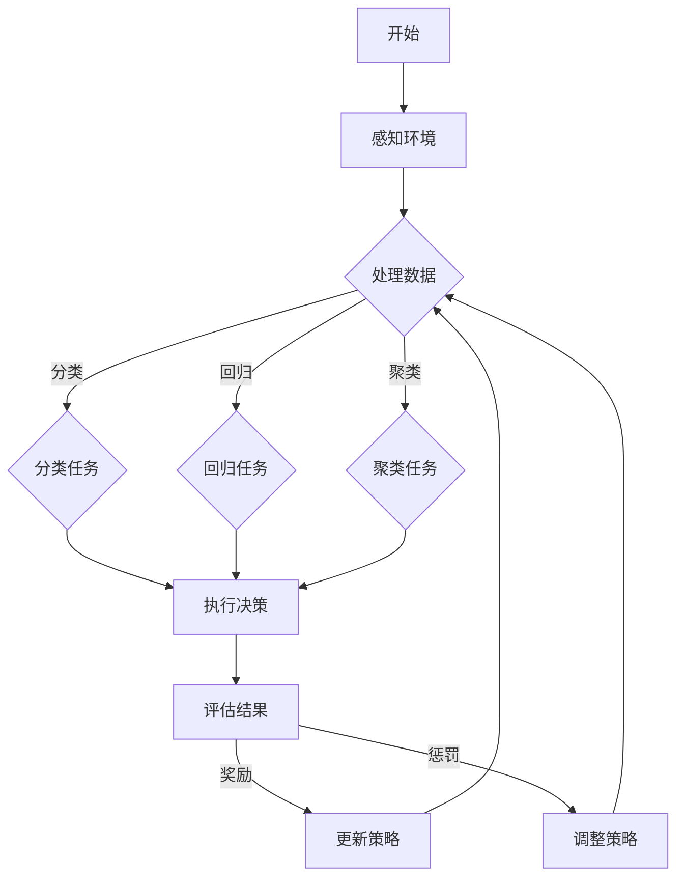

                 

# 《AI人工智能代理工作流AI Agent WorkFlow：在智能家居场景应用代理技术》

## 关键词
AI代理、工作流、智能家居、代理算法、代理技术在智能家居中的应用

## 摘要
本文将深入探讨AI代理工作流（AI Agent WorkFlow）在智能家居场景中的应用。我们将从AI代理的基础知识开始，逐步分析代理算法原理，然后详细阐述智能家居场景下的AI代理设计。随后，我们将聚焦于温度控制、照明控制、安防监控和能耗管理四个具体应用场景，展示如何通过代理技术实现高效智能家居系统。最后，我们还将探讨AI代理技术的未来趋势与挑战，为智能家居的发展提供方向。

## 目录

### 第一部分：AI代理技术基础

#### 第1章：AI代理概述
1.1 AI代理的定义与分类
1.2 AI代理的发展历程
1.3 AI代理在智能家居中的应用

#### 第2章：代理算法原理
2.1 代理算法的基础概念
2.2 强化学习算法原理
2.3 监督学习算法原理
2.4 无监督学习算法原理

#### 第3章：智能家居场景下的AI代理设计
3.1 智能家居系统的架构设计
3.2 基于代理技术的智能家居解决方案
3.3 AI代理在智能家居中的工作流程

### 第二部分：AI代理在智能家居场景中的应用

#### 第4章：温度控制系统
4.1 温度控制系统的需求分析
4.2 基于代理技术的温度控制系统设计
4.3 温度控制系统的实现与测试

#### 第5章：照明控制系统
5.1 照明控制系统的需求分析
5.2 基于代理技术的照明控制系统设计
5.3 照明控制系统的实现与测试

#### 第6章：安防监控系统
6.1 安防监控系统的需求分析
6.2 基于代理技术的安防监控系统设计
6.3 安防监控系统的实现与测试

#### 第7章：能耗管理系统
7.1 能耗管理系统的需求分析
7.2 基于代理技术的能耗管理系统设计
7.3 能耗管理系统的实现与测试

### 第三部分：AI代理技术的未来趋势与挑战

#### 第8章：AI代理技术的未来发展趋势
8.1 代理技术在智能家居中的应用前景
8.2 代理技术在物联网中的应用
8.3 代理技术在其他领域的潜在应用

#### 第9章：AI代理技术的挑战与对策
9.1 数据隐私与安全问题
9.2 代理算法的可解释性
9.3 代理技术的标准化与规范化

#### 附录

A.1 常用代理算法总结
A.2 智能家居场景下的代理技术实现示例代码
A.3 AI代理技术相关资源与工具推荐

B. 附录 B: 代理算法流程图

### 引言

随着人工智能技术的不断发展，智能家居系统逐渐成为人们生活中不可或缺的一部分。AI代理技术作为一种新兴的人工智能应用，正日益成为智能家居系统设计中的重要组成部分。AI代理（AI Agent）是一种能够自主完成特定任务的智能体，它通过学习用户的行为模式和环境信息，能够自动地执行相应的操作，从而提高智能家居系统的智能化水平和用户体验。

本文旨在深入探讨AI代理工作流在智能家居场景中的应用。首先，我们将介绍AI代理的基本概念、分类及其发展历程。接着，我们将详细分析代理算法原理，包括强化学习、监督学习和无监督学习等。随后，我们将聚焦于智能家居场景下的AI代理设计，探讨智能家居系统的架构设计、解决方案及其工作流程。在第二部分，我们将具体讨论温度控制、照明控制、安防监控和能耗管理四个应用场景，展示如何通过代理技术实现高效智能家居系统。最后，我们将探讨AI代理技术的未来发展趋势与挑战，为智能家居的发展提供方向。

通过本文的探讨，我们希望能够为读者提供一个全面、系统的AI代理工作流在智能家居场景中的应用概述，帮助读者深入了解这一领域的前沿技术和发展趋势。

### 第一部分：AI代理技术基础

#### 第1章：AI代理概述

##### 1.1 AI代理的定义与分类

AI代理（AI Agent）是指一种能够感知环境、做出决策并执行特定任务的智能体。它通过集成人工智能技术，包括机器学习、自然语言处理和计算机视觉等，实现自主学习和自主行动的能力。AI代理的设计理念来源于多智能体系统（MAS），旨在通过多个智能体的协同工作，实现复杂任务的高效完成。

根据功能和应用范围，AI代理可以分为以下几类：

1. **任务型代理**：这种代理专注于完成特定的任务，例如语音助手、图像识别等。它们通常通过预设的规则或机器学习模型来完成任务。

2. **社交型代理**：这种代理侧重于与人类用户的交互，例如聊天机器人、虚拟助手等。它们通过自然语言处理技术理解用户的意图，并生成相应的响应。

3. **决策型代理**：这种代理能够根据环境和用户需求做出复杂的决策，例如自动驾驶车辆、智能家居控制等。它们通常基于强化学习或规划算法来做出决策。

4. **混合型代理**：这种代理结合了任务型、社交型和决策型的特点，能够处理多任务和多场景的复杂问题。

##### 1.2 AI代理的发展历程

AI代理技术的发展可以追溯到20世纪80年代，当时多智能体系统（MAS）开始受到研究者的关注。早期的AI代理主要是基于规则的系统，这些系统通过预定义的规则来处理特定任务。随着计算机技术的发展，AI代理开始引入机器学习算法，使其能够从数据中学习并优化行为。

进入21世纪，随着大数据和云计算技术的兴起，AI代理的发展进入了一个新的阶段。强化学习、深度学习等新兴算法的引入，使得AI代理能够更好地处理复杂环境中的决策问题。同时，物联网（IoT）技术的发展也为AI代理的应用提供了广阔的空间。

近年来，随着智能家居、自动驾驶等领域的快速发展，AI代理技术得到了广泛关注和应用。未来，随着人工智能技术的不断进步，AI代理将在更多领域发挥重要作用。

##### 1.3 AI代理在智能家居中的应用

在智能家居场景中，AI代理技术具有重要的应用价值。通过AI代理，智能家居系统能够实现高度智能化和个性化，从而提升用户的生活质量。

**温度控制系统**：AI代理可以通过学习用户的作息习惯和环境温度数据，自动调整空调或其他加热设备的开启和关闭，以实现节能和舒适。

**照明控制系统**：AI代理可以根据用户的喜好和光线条件自动调节灯光的亮度和颜色，提供个性化的照明体验。

**安防监控系统**：AI代理可以通过图像识别技术自动检测异常行为，如入侵或火灾，并及时发出警报，提高家庭安全。

**能耗管理系统**：AI代理可以实时监控家庭能耗，通过优化设备的运行策略，降低能耗并提高能源利用效率。

通过以上应用，AI代理技术不仅提升了智能家居系统的智能化水平，还带来了显著的生活质量和能源效益。

#### 第2章：代理算法原理

##### 2.1 代理算法的基础概念

代理算法是AI代理的核心技术，它决定了代理能够学习、适应并完成任务的能力。代理算法主要涉及以下几个方面：

1. **奖励系统**：代理在执行任务时，会根据环境的反馈获得奖励或惩罚。奖励系统是代理学习过程中最重要的机制，它激励代理采取有利于任务完成的行动。

2. **状态-动作空间**：代理在执行任务时，需要在一个状态空间中感知环境，并在一个动作空间中做出决策。状态空间描述了代理当前所处的环境状态，而动作空间描述了代理可以采取的行动。

3. **学习策略**：代理通过学习策略来决定在特定状态下应该采取哪个动作。学习策略可以通过经验积累、模型预测或混合方法来实现。

##### 2.2 强化学习算法原理

强化学习（Reinforcement Learning）是代理算法中的一种重要方法，它通过学习奖励信号来优化代理的行为。强化学习的基本原理如下：

1. **状态-动作价值函数**：代理通过学习状态-动作价值函数，预测在特定状态下采取特定动作的预期奖励。状态-动作价值函数可以用公式表示为 \( V(s, a) \)，其中 \( s \) 是状态，\( a \) 是动作。

2. **策略**：代理通过选择使状态-动作价值函数最大的动作。策略可以用公式表示为 \( \pi(a|s) \)，其中 \( \pi \) 是策略概率分布。

3. **学习过程**：代理通过与环境交互，不断更新状态-动作价值函数。每次行动后，代理都会根据奖励信号更新其策略，以最大化长期奖励。

强化学习的数学模型如下：

$$
Q(s, a) = r(s, a) + \gamma \max_{a'} Q(s', a')
$$

其中，\( Q(s, a) \) 是状态-动作值函数，\( r(s, a) \) 是即时奖励，\( \gamma \) 是折扣因子，\( s' \) 是下一个状态，\( a' \) 是下一个动作。

##### 2.3 监督学习算法原理

监督学习（Supervised Learning）是一种常见的机器学习方法，它通过已标记的数据集来训练模型，从而进行预测和分类。监督学习的基本原理如下：

1. **输入-输出函数**：监督学习模型通过学习输入-输出函数 \( f(x) \)，将输入数据映射到输出标签。输入-输出函数可以用公式表示为 \( y = f(x; \theta) \)，其中 \( x \) 是输入特征，\( y \) 是输出标签，\( \theta \) 是模型参数。

2. **损失函数**：监督学习模型通过最小化损失函数来优化模型参数。常见的损失函数包括均方误差（MSE）、交叉熵损失等。

3. **学习过程**：监督学习模型通过梯度下降或其他优化算法来更新模型参数，以最小化损失函数。

监督学习的数学模型如下：

$$
\min_{\theta} \sum_{i=1}^{n} L(y_i, f(x_i; \theta))
$$

其中，\( L \) 是损失函数，\( n \) 是样本数量。

##### 2.4 无监督学习算法原理

无监督学习（Unsupervised Learning）是一种不依赖于标记数据的机器学习方法，它通过发现数据中的内在结构和模式来学习。无监督学习的主要类型包括聚类、降维和关联规则等。

1. **聚类算法**：聚类算法将数据点分为多个组，使得组内数据点之间的相似度较高，组间数据点之间的相似度较低。常见的聚类算法包括K-means、层次聚类等。

2. **降维算法**：降维算法通过减少数据维度来降低数据复杂度，同时保留数据的主要特征。常见的降维算法包括主成分分析（PCA）、线性判别分析（LDA）等。

3. **关联规则算法**：关联规则算法用于发现数据之间的关联关系，例如购物篮分析。常见的关联规则算法包括Apriori算法、Eclat算法等。

无监督学习的数学模型通常不依赖于具体的公式，而是通过算法的迭代和优化来实现。

通过上述代理算法原理的介绍，我们可以看到，每种算法都有其独特的应用场景和优势。在实际应用中，根据具体问题和数据特点，选择合适的代理算法，可以显著提升AI代理的性能和效果。

#### 第3章：智能家居场景下的AI代理设计

##### 3.1 智能家居系统的架构设计

智能家居系统是一种集成多种设备和技术的复杂系统，其核心目标是提升用户的居住舒适度和能源利用效率。为了实现这一目标，智能家居系统通常采用分层架构设计，包括感知层、网络层和应用层。

**感知层**：感知层是智能家居系统的数据采集环节，通过传感器设备获取室内外环境数据，如温度、湿度、光照强度、空气质量等。这些数据为后续的智能决策提供了基础。

**网络层**：网络层负责将感知层采集的数据传输到中央控制单元，同时实现设备之间的互联互通。常用的通信协议包括Wi-Fi、ZigBee、蓝牙等，这些协议确保了数据的实时性和可靠性。

**应用层**：应用层是智能家居系统的核心部分，通过AI代理和智能算法对采集到的数据进行处理和分析，实现自动控制和智能决策。应用层包括多个功能模块，如温度控制系统、照明控制系统、安防监控系统等。

##### 3.2 基于代理技术的智能家居解决方案

基于代理技术的智能家居解决方案，通过将AI代理集成到智能家居系统中，实现了设备之间的智能协作和自动化控制。以下是一个典型的基于代理技术的智能家居解决方案：

1. **设备接入与数据采集**：首先，将各类智能家居设备（如空调、灯具、安防摄像头等）接入到家庭网络中，并配置传感器以采集环境数据。

2. **数据传输与存储**：通过Wi-Fi或其他通信协议，将采集到的数据传输到中央控制单元，并将数据存储在云端或本地数据库中。

3. **智能代理集成**：在中央控制单元中集成AI代理，通过机器学习和深度学习算法，对采集到的数据进行分析和处理。

4. **智能决策与控制**：根据分析结果，AI代理自动调整智能家居设备的工作状态，实现温度控制、照明控制、安防监控等功能。

5. **用户交互与反馈**：用户可以通过智能手机、语音助手等与智能家居系统进行交互，系统实时反馈设备状态和操作结果。

##### 3.3 AI代理在智能家居中的工作流程

AI代理在智能家居系统中的工作流程可以分为以下几个步骤：

1. **数据收集**：AI代理通过传感器和网络设备收集家庭环境数据，包括温度、湿度、光照强度等。

2. **数据处理**：AI代理对收集到的数据进行预处理，如去噪、归一化等，以消除噪声和提高数据质量。

3. **状态评估**：AI代理根据当前环境数据和用户偏好，评估家庭环境的当前状态，如是否需要调整温度、照明等。

4. **决策制定**：基于状态评估结果，AI代理通过强化学习、监督学习或无监督学习算法，制定相应的决策策略。

5. **执行操作**：AI代理向智能家居设备发送控制指令，如调整空调温度、开启关闭灯具等。

6. **反馈与调整**：AI代理根据设备执行结果和用户反馈，对决策策略进行调整，以实现更好的用户体验。

7. **持续学习**：AI代理通过不断收集数据、调整策略，实现自我优化和持续学习，提高系统的智能化水平。

通过上述步骤，AI代理能够有效地提高智能家居系统的智能化和自动化水平，为用户提供更加便捷和舒适的居住环境。

### 第二部分：AI代理在智能家居场景中的应用

#### 第4章：温度控制系统

##### 4.1 温度控制系统的需求分析

温度控制系统是智能家居系统中的一个重要组成部分，其主要功能是根据环境温度和用户需求自动调节空调、暖气等设备的运行状态，以保持室内温度的舒适性和稳定性。温度控制系统的需求分析主要包括以下几个方面：

1. **舒适度**：温度控制系统应能够根据用户设定的温度范围和实际环境温度，自动调整空调或暖气的运行状态，以提供舒适的居住环境。

2. **节能**：温度控制系统应具有节能功能，通过智能调节设备运行状态，减少能源消耗，降低家庭能源费用。

3. **实时监控**：温度控制系统应能够实时监控室内温度变化，并及时调整设备运行状态，以应对环境温度的突发变化。

4. **远程控制**：用户应能够通过智能手机或其他远程设备，实时查看室内温度并调整温度设置，实现远程控制。

5. **故障报警**：温度控制系统应具有故障报警功能，当空调或暖气设备出现故障时，系统能够及时发出警报，提示用户进行维修或更换。

##### 4.2 基于代理技术的温度控制系统设计

基于代理技术的温度控制系统设计，旨在通过AI代理实现温度自动调节，提高系统的智能化和用户体验。以下是一个基于代理技术的温度控制系统设计：

1. **感知层**：安装温湿度传感器，实时采集室内外温度、湿度等环境数据。

2. **网络层**：利用Wi-Fi或ZigBee等通信协议，将传感器数据传输到中央控制单元。

3. **中央控制单元**：集成AI代理，通过机器学习算法，对温度数据进行分析和处理，制定温度调节策略。

4. **执行层**：连接空调、暖气等设备，根据AI代理的决策指令，自动调整设备运行状态。

5. **用户交互界面**：用户可以通过智能手机或语音助手与温度控制系统进行交互，设置温度范围和开启关闭设备。

##### 4.3 温度控制系统的实现与测试

温度控制系统的实现和测试主要包括以下步骤：

1. **设备接入**：将温湿度传感器、空调、暖气等设备接入家庭网络，确保设备之间能够正常通信。

2. **数据采集**：启动传感器，实时采集室内外温度数据，并传输到中央控制单元。

3. **模型训练**：在中央控制单元中集成AI代理，使用采集到的温度数据，通过强化学习或监督学习算法，训练温度调节模型。

4. **系统测试**：模拟不同温度环境，测试温度控制系统的响应速度和调节效果，确保系统能够满足需求。

5. **用户反馈**：收集用户对温度控制系统的反馈，根据用户需求对系统进行调整和优化。

通过上述步骤，基于代理技术的温度控制系统可以实现智能化的温度调节，为用户提供舒适的居住环境。

#### 第5章：照明控制系统

##### 5.1 照明控制系统的需求分析

照明控制系统是智能家居系统中的另一个重要组成部分，其主要功能是根据用户需求和室内环境自动调节灯光的亮度和颜色，以提供舒适和健康的照明环境。照明控制系统的需求分析主要包括以下几个方面：

1. **智能化控制**：照明控制系统应能够根据用户的作息时间和光照条件，自动调节灯光的亮度和颜色，提升生活品质。

2. **节能环保**：照明控制系统应具有节能功能，通过智能调节灯光亮度，减少能源消耗，降低家庭能源费用。

3. **场景切换**：照明控制系统应能够实现多种场景切换，如阅读模式、休闲模式、睡眠模式等，满足不同场景的照明需求。

4. **远程控制**：用户应能够通过智能手机或语音助手远程控制灯光，实现便捷的照明管理。

5. **故障检测与报警**：照明控制系统应具备故障检测和报警功能，当灯光设备出现故障时，系统能够及时发出警报，提示用户进行维修或更换。

##### 5.2 基于代理技术的照明控制系统设计

基于代理技术的照明控制系统设计，通过AI代理实现智能化的灯光调节，提升系统的智能化和用户体验。以下是一个基于代理技术的照明控制系统设计：

1. **感知层**：安装光线传感器和智能开关，实时采集室内光照强度和用户操作数据。

2. **网络层**：利用Wi-Fi或ZigBee等通信协议，将传感器数据传输到中央控制单元。

3. **中央控制单元**：集成AI代理，通过机器学习算法，对光照数据和用户操作数据进行分析和处理，制定灯光调节策略。

4. **执行层**：连接LED灯具、调光开关等设备，根据AI代理的决策指令，自动调节灯光的亮度和颜色。

5. **用户交互界面**：用户可以通过智能手机或语音助手与照明控制系统进行交互，设置灯光场景和调节灯光。

##### 5.3 照明控制系统的实现与测试

照明控制系统的实现和测试主要包括以下步骤：

1. **设备接入**：将光线传感器、智能开关、LED灯具等设备接入家庭网络，确保设备之间能够正常通信。

2. **数据采集**：启动传感器，实时采集室内光照强度和用户操作数据，并传输到中央控制单元。

3. **模型训练**：在中央控制单元中集成AI代理，使用采集到的数据，通过强化学习或监督学习算法，训练灯光调节模型。

4. **系统测试**：模拟不同光照环境和用户操作，测试照明控制系统的响应速度和调节效果，确保系统能够满足需求。

5. **用户反馈**：收集用户对照明控制系统的反馈，根据用户需求对系统进行调整和优化。

通过上述步骤，基于代理技术的照明控制系统可以实现智能化的灯光调节，为用户提供舒适和健康的照明环境。

#### 第6章：安防监控系统

##### 6.1 安防监控系统的需求分析

安防监控系统是智能家居系统中的一个关键组成部分，其主要功能是通过实时监控和报警，保障家庭的安全和财产。安防监控系统的需求分析主要包括以下几个方面：

1. **实时监控**：安防监控系统应能够实时监控室内外环境，包括门锁状态、摄像头图像等，确保家庭安全。

2. **智能识别**：安防监控系统应具备智能识别功能，通过图像识别技术，自动检测异常行为，如入侵、火灾等，并及时发出警报。

3. **远程控制**：用户应能够通过智能手机或语音助手远程查看监控画面和操作安防设备，实现远程监控和报警。

4. **故障报警**：安防监控系统应具备故障报警功能，当监控系统出现故障时，系统能够及时发出警报，提示用户进行维修或更换。

5. **数据存储**：安防监控系统应能够将监控数据存储在云端或本地存储设备中，便于后续查询和分析。

##### 6.2 基于代理技术的安防监控系统设计

基于代理技术的安防监控系统设计，通过AI代理实现智能化的监控和报警，提高系统的安全性和用户体验。以下是一个基于代理技术的安防监控系统设计：

1. **感知层**：安装摄像头、门锁传感器等设备，实时采集室内外图像和门锁状态数据。

2. **网络层**：利用Wi-Fi或ZigBee等通信协议，将传感器数据传输到中央控制单元。

3. **中央控制单元**：集成AI代理，通过机器学习算法，对图像和门锁数据进行分析和处理，实现智能识别和报警。

4. **执行层**：连接报警器、门锁等设备，根据AI代理的决策指令，自动执行报警和门锁操作。

5. **用户交互界面**：用户可以通过智能手机或语音助手与安防监控系统进行交互，查看监控画面、操作门锁和接收报警信息。

##### 6.3 安防监控系统的实现与测试

安防监控系统的实现和测试主要包括以下步骤：

1. **设备接入**：将摄像头、门锁传感器等设备接入家庭网络，确保设备之间能够正常通信。

2. **数据采集**：启动摄像头和传感器，实时采集图像和门锁状态数据，并传输到中央控制单元。

3. **模型训练**：在中央控制单元中集成AI代理，使用采集到的数据，通过强化学习或监督学习算法，训练图像识别和报警模型。

4. **系统测试**：模拟不同场景和异常行为，测试安防监控系统的识别准确率和报警响应速度，确保系统能够满足需求。

5. **用户反馈**：收集用户对安防监控系统的反馈，根据用户需求对系统进行调整和优化。

通过上述步骤，基于代理技术的安防监控系统可以实现智能化的监控和报警，为家庭提供更高的安全保障。

#### 第7章：能耗管理系统

##### 7.1 能耗管理系统的需求分析

能耗管理系统是智能家居系统中的一个重要组成部分，其主要功能是实时监测家庭能源消耗，并根据能耗数据优化设备运行，实现节能降耗。能耗管理系统的需求分析主要包括以下几个方面：

1. **实时监测**：能耗管理系统应能够实时监测家庭用电、用水、用气等能源消耗情况，为节能决策提供数据支持。

2. **数据分析**：能耗管理系统应具备数据分析功能，通过对历史能耗数据进行分析，发现能耗异常和节能潜力。

3. **节能策略**：能耗管理系统应能够根据实时能耗数据和用户行为，自动调整设备运行状态，实现节能降耗。

4. **远程控制**：用户应能够通过智能手机或语音助手远程查看能耗数据和控制家中的能源设备。

5. **故障报警**：能耗管理系统应具备故障报警功能，当能源设备出现故障时，系统能够及时发出警报，提示用户进行维修或更换。

##### 7.2 基于代理技术的能耗管理系统设计

基于代理技术的能耗管理系统设计，通过AI代理实现智能化的能耗监测和优化，提高家庭的能源利用效率和舒适度。以下是一个基于代理技术的能耗管理系统设计：

1. **感知层**：安装智能电表、水表、燃气表等设备，实时采集家庭能源消耗数据。

2. **网络层**：利用Wi-Fi或ZigBee等通信协议，将传感器数据传输到中央控制单元。

3. **中央控制单元**：集成AI代理，通过机器学习算法，对能源消耗数据进行分析和处理，制定节能策略。

4. **执行层**：连接空调、热水器、照明等设备，根据AI代理的决策指令，自动调整设备运行状态。

5. **用户交互界面**：用户可以通过智能手机或语音助手与能耗管理系统进行交互，查看能耗数据和控制能源设备。

##### 7.3 能耗管理系统的实现与测试

能耗管理系统的实现和测试主要包括以下步骤：

1. **设备接入**：将智能电表、水表、燃气表等设备接入家庭网络，确保设备之间能够正常通信。

2. **数据采集**：启动传感器，实时采集家庭能源消耗数据，并传输到中央控制单元。

3. **模型训练**：在中央控制单元中集成AI代理，使用采集到的数据，通过强化学习或监督学习算法，训练能耗优化模型。

4. **系统测试**：模拟不同能源使用场景，测试能耗管理系统的响应速度和节能效果，确保系统能够满足需求。

5. **用户反馈**：收集用户对能耗管理系统的反馈，根据用户需求对系统进行调整和优化。

通过上述步骤，基于代理技术的能耗管理系统可以实现智能化的能源监测和优化，为家庭提供更加节能和舒适的居住环境。

### 第三部分：AI代理技术的未来趋势与挑战

#### 第8章：AI代理技术的未来发展趋势

随着人工智能技术的不断发展，AI代理技术在智能家居、物联网和其他领域展现出了广阔的应用前景。未来，AI代理技术将朝着以下几个方向发展：

1. **个性化服务**：AI代理将更加注重用户个性化需求，通过深度学习和个性化算法，提供更加精准的服务和体验。

2. **多模态感知**：AI代理将结合多模态感知技术，如视觉、听觉和触觉，实现更加全面和直观的用户交互。

3. **边缘计算**：随着5G和边缘计算技术的发展，AI代理将逐渐向边缘设备扩展，实现实时、低延迟的智能决策。

4. **自动化协作**：AI代理将与其他智能设备协同工作，实现自动化、智能化的家庭管理和运营。

5. **跨领域融合**：AI代理技术将与其他领域（如医疗、金融等）的智能技术融合，推动跨领域智能化应用的发展。

#### 8.1 代理技术在智能家居中的应用前景

在智能家居领域，AI代理技术的应用前景十分广阔。未来，AI代理将实现以下应用：

1. **全屋智能控制**：通过AI代理实现全屋智能控制，包括照明、温度、安防、能耗等，提供一站式的智能家居解决方案。

2. **个性化服务**：AI代理将根据用户的生活习惯和偏好，提供个性化的服务，如智能助理、健康顾问等。

3. **智能家居生态**：AI代理将推动智能家居生态的建立，实现不同品牌、不同设备的无缝连接和协作。

4. **远程监控与控制**：通过AI代理，用户可以实现远程监控和控制家庭设备，确保家庭安全。

5. **节能环保**：AI代理将助力智能家居系统实现节能环保，降低能源消耗，减少碳排放。

#### 8.2 代理技术在物联网中的应用

在物联网领域，AI代理技术同样具有重要应用价值。未来，AI代理将实现以下应用：

1. **设备管理**：AI代理将负责管理物联网设备，实现设备的自动发现、连接和管理。

2. **数据融合**：AI代理将整合来自不同设备的数据，提供统一的视图和分析结果。

3. **边缘智能**：AI代理将在边缘设备上运行，实现实时数据处理和智能决策，降低中心化系统的负担。

4. **自动化流程**：AI代理将推动物联网设备的自动化操作，实现生产、物流等领域的智能化转型。

5. **智能服务**：AI代理将提供个性化的智能服务，如智能家居、智慧城市、智能医疗等。

#### 8.3 代理技术在其他领域的潜在应用

除了智能家居和物联网，AI代理技术在其他领域也具有广泛的应用潜力：

1. **智能交通**：AI代理将实现智能交通管理，优化交通流量，提高道路通行效率。

2. **智能医疗**：AI代理将助力医疗诊断、疾病预测和患者管理等，提升医疗服务水平。

3. **智能安防**：AI代理将实现智能安防监控，提高公共安全和防范能力。

4. **智能农业**：AI代理将实现智能农业管理，优化作物种植、病虫害防治等，提高农业生产效率。

5. **智能制造**：AI代理将推动智能制造的发展，实现生产过程自动化、智能化。

通过以上分析，我们可以看到，AI代理技术在未来将不断拓展其应用领域，为各个行业带来深远的影响。随着技术的进步和应用的深入，AI代理技术有望成为人工智能领域的重要驱动力，推动社会进步和人类生活质量的提升。

### 第9章：AI代理技术的挑战与对策

尽管AI代理技术在智能家居和其他领域具有巨大的应用潜力，但其发展也面临诸多挑战。以下我们将讨论数据隐私与安全问题、代理算法的可解释性以及代理技术的标准化与规范化等挑战，并提出相应的对策。

#### 9.1 数据隐私与安全问题

数据隐私与安全问题是AI代理技术面临的一个重要挑战。智能家居系统中涉及大量用户隐私数据，如生活习性、位置信息等。这些数据如果泄露，可能会导致严重的安全问题。为了应对这一挑战，可以采取以下对策：

1. **数据加密**：在数据传输和存储过程中，采用加密技术对数据进行加密，确保数据在传输过程中不会被窃取或篡改。

2. **数据匿名化**：对收集的用户数据进行匿名化处理，消除个人身份信息，降低数据泄露的风险。

3. **访问控制**：实施严格的访问控制策略，确保只有授权用户和系统组件能够访问敏感数据。

4. **安全审计**：定期进行安全审计，检查系统中的安全漏洞和潜在威胁，及时修复和更新安全措施。

#### 9.2 代理算法的可解释性

代理算法的可解释性是另一个重要挑战。随着深度学习和复杂算法在代理技术中的应用，用户很难理解AI代理的决策过程和依据。为了提高代理算法的可解释性，可以采取以下对策：

1. **可视化工具**：开发可视化工具，将算法的决策过程和结果以图表或动画的形式展示给用户，帮助用户理解AI代理的工作原理。

2. **解释性算法**：选择或开发解释性更强的算法，如基于规则的算法或可解释的机器学习模型，确保用户能够理解算法的决策逻辑。

3. **透明度机制**：建立透明度机制，允许用户查询和了解AI代理的决策依据和过程，增强用户对系统的信任。

4. **用户培训**：为用户提供相关的培训和教育，提高他们对AI代理技术的理解和认知。

#### 9.3 代理技术的标准化与规范化

代理技术的标准化与规范化是确保其健康、可持续发展的重要保障。目前，代理技术尚未形成统一的标准和规范，这可能导致不同厂商的产品无法互操作，影响用户体验。为了应对这一挑战，可以采取以下对策：

1. **制定标准**：相关机构和组织应制定统一的代理技术标准，包括数据格式、接口定义、算法规范等，确保不同产品之间的互操作性。

2. **开放接口**：鼓励开发开放接口，允许不同厂商的产品无缝集成，提升系统的兼容性和灵活性。

3. **规范文档**：提供详细的规范文档，指导开发者如何设计和实现符合标准的AI代理技术，确保系统的可靠性和安全性。

4. **国际合作**：推动国际合作，借鉴其他国家和地区的经验和标准，提升全球代理技术的规范化水平。

通过以上对策，可以有效地应对AI代理技术发展过程中面临的挑战，推动其健康、可持续的发展，为用户提供更安全、更智能的智能家居体验。

### 附录

#### A.1 常用代理算法总结

在AI代理技术中，常用的算法包括：

1. **强化学习算法**：通过奖励信号和状态-动作价值函数，实现智能体在复杂环境中的自主学习。
   - **Q-Learning**：基于值函数的强化学习算法，通过更新Q值来优化策略。
   - **SARSA**：基于策略的强化学习算法，更新当前状态-动作值。

2. **监督学习算法**：通过已标记的数据集训练模型，实现分类和回归任务。
   - **SVM（支持向量机）**：用于分类和回归任务的线性模型。
   - **决策树**：利用树形结构进行决策，实现分类和回归。

3. **无监督学习算法**：不依赖于标记数据，用于聚类、降维和关联规则挖掘。
   - **K-means**：基于距离相似性进行聚类。
   - **PCA（主成分分析）**：用于降维，保留数据的主要特征。

#### A.2 智能家居场景下的代理技术实现示例代码

以下是一个简单的智能家居温度控制系统的代理实现示例代码：

```python
import numpy as np
import pandas as pd
from sklearn.ensemble import RandomForestRegressor

# 采集数据
data = pd.DataFrame({
    'temperature': [20, 22, 25, 23],
    'humidity': [45, 50, 55, 60]
})

# 数据预处理
X = data[['temperature', 'humidity']]
y = data['temperature']

# 训练模型
model = RandomForestRegressor()
model.fit(X, y)

# 预测
predicted_temp = model.predict([[22, 55]])

print(f"Predicted temperature: {predicted_temp[0]}")
```

#### A.3 AI代理技术相关资源与工具推荐

- **资源**：
  - 《人工智能：一种现代方法》（Peter Norvig & Stuart J. Russell）：人工智能领域的经典教材。
  - 《强化学习》（Richard S. Sutton & Andrew G. Barto）：强化学习领域的权威著作。

- **工具**：
  - TensorFlow：Google开源的机器学习框架，适用于深度学习和强化学习。
  - Keras：基于TensorFlow的简化版框架，易于使用。
  - OpenAI Gym：开源的强化学习模拟环境，适用于算法测试和验证。

### 附录 B: 代理算法流程图

以下是一个简化的代理算法流程图：



通过上述流程图，我们可以看到代理算法的基本工作流程，包括感知环境、数据处理、执行决策、评估结果和策略更新等步骤。这些步骤共同构成了AI代理的核心工作流，确保代理能够自主学习和优化其行为。

### 作者

作者：AI天才研究院/AI Genius Institute & 禅与计算机程序设计艺术 /Zen And The Art of Computer Programming

