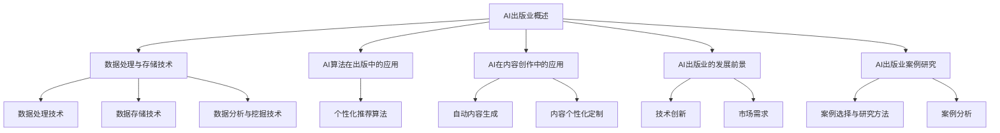

                 

# AI出版业：数据、算法和场景协同

> **关键词：** AI出版业，数据，算法，场景协同，数据处理，存储技术，个性化推荐，内容创作，发展趋势，案例研究。

> **摘要：** 本文章将深入探讨AI出版业中的数据、算法和场景协同的重要性。通过分析数据处理与存储技术、个性化推荐算法以及AI在内容创作中的应用，本文将展示AI技术在出版领域的实际应用，并探讨其未来的发展趋势。此外，还将通过案例研究，分析AI出版业的成功实践，以期为行业提供有益的启示。

### 第一部分：AI出版业概述

#### 第1章: AI出版业：数据、算法和场景协同

##### 1.1 AI出版业的发展背景

###### 1.1.1 出版业的变革

随着互联网的普及和数字化技术的发展，出版业正经历着一场深刻的变革。传统的印刷出版模式逐渐被数字出版所取代，电子书、在线阅读等新型阅读方式日益兴起。这不仅改变了出版物的形式，也改变了人们获取知识和信息的方式。

数字出版的发展带来了数据的爆炸式增长。出版商通过收集用户的阅读行为、阅读偏好等数据，可以更好地了解用户需求，从而提供更个性化的阅读内容。同时，AI技术的快速发展为出版业提供了新的机遇。AI技术可以用于数据分析和处理，从而帮助出版商更好地了解用户需求，提高内容推荐和内容创作的效率。

###### 1.1.2 AI技术在出版领域的应用

AI技术在出版领域的应用主要集中在以下几个方面：

1. **个性化推荐**：通过分析用户的历史阅读数据，AI算法可以为用户推荐他们可能感兴趣的内容，从而提高用户的阅读体验和满意度。
2. **内容生成**：AI技术可以自动生成文本、图片等内容，从而提高内容创作的效率和质量。
3. **内容审核**：AI技术可以用于自动检测和过滤出版内容中的不良信息，从而保证出版内容的质量和合规性。

###### 1.1.3 数据的重要性

在AI出版业中，数据是最为重要的资源。数据可以用来训练AI模型，从而实现个性化推荐、内容生成等功能。数据的质量和数量直接影响AI系统的性能和效果。

1. **数据采集与整合**：出版商需要通过多种途径收集用户数据，如阅读行为、阅读偏好、社交媒体活动等。同时，还需要将这些数据进行整合，以便进行统一的分析和处理。
2. **数据处理与分析**：通过对收集到的数据进行处理和分析，出版商可以提取出有用的信息，如用户的阅读偏好、热门话题等，从而指导内容创作和推荐策略。

##### 1.2 AI出版业的定义与核心概念

###### 1.2.1 AI出版业

AI出版业是指利用人工智能技术，对出版内容进行个性化推荐、内容生成、内容审核等处理，从而提高出版效率和用户满意度的行业。

AI出版业的服务对象主要包括：

1. **出版商**：通过AI技术，出版商可以更准确地了解用户需求，提高内容推荐和创作的效率。
2. **读者**：AI技术可以为读者提供更个性化的阅读体验，提高阅读满意度和参与度。

###### 1.2.2 数据、算法和场景协同

在AI出版业中，数据、算法和场景协同是关键。

1. **数据**：数据是AI出版业的基础，没有高质量的数据，AI系统就无法准确识别用户需求和提供个性化服务。
2. **算法**：算法是AI出版业的核心，通过算法，AI系统可以处理数据，提取用户需求，生成个性化推荐和内容。
3. **场景协同**：场景协同是指将数据、算法和实际应用场景结合起来，从而实现AI技术在出版业中的实际应用。

##### 1.3 AI出版业的现状与趋势

###### 1.3.1 AI出版业现状

当前，AI出版业已经取得了一定的进展。许多出版商已经开始应用AI技术进行内容推荐和创作。例如，某些在线阅读平台已经通过AI算法为用户推荐他们可能感兴趣的内容。

同时，AI出版业的市场规模也在不断扩大。根据市场研究公司的数据，全球AI出版市场的规模已经超过数十亿美元，并且预计未来还将继续增长。

###### 1.3.2 AI出版业发展趋势

未来，AI出版业将继续保持快速发展。以下是一些主要的发展趋势：

1. **技术创新**：随着AI技术的不断进步，AI出版业将采用更多先进的算法和工具，从而提高内容推荐和创作的效率和质量。
2. **市场扩展**：随着数字化阅读的普及，AI出版业的市场将进一步扩大，包括传统的出版商、新兴的内容平台等都将受益于AI技术的应用。
3. **内容多样化**：AI技术将使出版内容更加多样化，包括电子书、在线课程、视频内容等，满足不同用户的需求。

### 第二部分：AI出版技术基础

#### 第2章: 数据处理与存储技术

##### 2.1 数据处理技术

###### 2.1.1 数据清洗

数据清洗是数据处理的重要步骤，其目的是去除数据中的错误、异常和重复值，从而提高数据的质量。数据清洗方法包括：

1. **去除重复数据**：通过匹配和删除重复的数据条目，避免数据冗余。
2. **处理缺失值**：对于缺失的数据，可以通过插补、删除或标记缺失值来处理。
3. **处理异常值**：对于异常值，可以通过统计方法、可视化分析等方法进行检测和处理。

###### 2.1.2 数据集成

数据集成是将多个来源的数据整合到一个统一的数据集中，以便进行统一的分析和处理。数据集成方法包括：

1. **数据仓库**：将多个来源的数据整合到一个集中式数据库中，以便进行统一的分析。
2. **数据湖**：将多个来源的数据以原始格式存储，以便进行后续的数据处理和分析。

###### 2.1.3 数据库设计原则

在数据库设计中，需要考虑以下原则：

1. **规范化**：通过规范化，减少数据冗余，提高数据的一致性。
2. **扩展性**：数据库设计需要考虑未来的扩展需求，以便适应数据量的增长。
3. **性能**：数据库设计需要考虑查询性能，以便快速响应用户的需求。

##### 2.2 数据存储技术

###### 2.2.1 数据库系统

数据库系统是数据存储和管理的重要工具。根据数据的结构和查询需求，可以选择不同的数据库系统：

1. **关系型数据库**：如MySQL、PostgreSQL等，适用于结构化数据的存储和管理。
2. **非关系型数据库**：如MongoDB、Redis等，适用于非结构化数据的存储和管理。

###### 2.2.2 大数据存储

随着数据量的不断增长，大数据存储技术变得尤为重要。大数据存储技术包括：

1. **分布式存储**：通过分布式存储技术，可以将大量数据分散存储在多个节点上，提高数据存储的可靠性和性能。
2. **云存储**：通过云存储服务，可以灵活地存储和访问大量数据，降低数据存储成本。

##### 2.3 数据分析与挖掘技术

###### 2.3.1 数据分析

数据分析是数据挖掘的基础，其目的是从数据中提取有用的信息。数据分析方法包括：

1. **描述性分析**：通过统计和图表，描述数据的基本特征和趋势。
2. **诊断性分析**：通过分析数据，找出数据中的异常和趋势。
3. **预测性分析**：通过分析历史数据，预测未来的趋势和变化。

###### 2.3.2 数据挖掘

数据挖掘是从大量数据中提取隐藏的模式和知识的过程。数据挖掘流程包括：

1. **数据预处理**：清洗和整理数据，使其适合进行分析。
2. **特征选择**：从数据中提取最有用的特征，以便进行后续分析。
3. **模型构建**：构建数据挖掘模型，对数据进行分析和预测。
4. **模型评估**：评估数据挖掘模型的效果，并进行调整和优化。

### 第三部分：AI算法在出版中的应用

#### 第3章: 个性化推荐算法

##### 3.1 个性化推荐算法概述

###### 3.1.1 推荐系统原理

推荐系统通过分析用户的历史行为和兴趣，为用户推荐他们可能感兴趣的内容。推荐系统主要分为两种类型：

1. **协同过滤**：通过分析用户之间的相似性，为用户推荐他们可能感兴趣的内容。
2. **基于内容的推荐**：通过分析内容的特征，为用户推荐与内容相似的其他内容。

###### 3.1.2 个性化推荐的目标

个性化推荐的目标是提高用户的满意度和参与度，主要从以下几个方面进行：

1. **提高用户满意度**：通过推荐用户感兴趣的内容，提高用户的阅读体验。
2. **提高内容曝光率**：通过推荐，使更多的内容被用户看到，从而提高内容的曝光率。

##### 3.2 个性化推荐算法实现

###### 3.2.1 协同过滤算法

协同过滤算法是通过分析用户之间的相似性来推荐内容。协同过滤算法主要分为两种：

1. **用户基于的协同过滤**：通过分析用户之间的相似性，为用户推荐其他用户喜欢的内容。
2. **项基于的协同过滤**：通过分析内容之间的相似性，为用户推荐相似的内容。

协同过滤算法的实现步骤如下：

1. **构建评分矩阵**：通过用户对内容的评分，构建用户与内容之间的评分矩阵。
2. **计算用户相似度**：通过用户之间的评分矩阵，计算用户之间的相似度。
3. **推荐内容**：根据用户相似度，为用户推荐其他用户喜欢的内容。

以下是一个协同过滤算法的伪代码：

```python
# 用户基于的协同过滤算法
def collaborative_filtering(user_similarity_matrix, user, content):
    # 计算用户与其他用户的相似度
    similarity_scores = user_similarity_matrix[user]
    # 排序相似度分数，选择最高的相似度用户
    top_n_users = sorted(similarity_scores, key=lambda x: x[1], reverse=True)[:n]
    # 计算推荐内容的得分
    content_scores = {}
    for user, similarity_score in top_n_users:
        for content, rating in user_ratings[user].items():
            if content != content and content not in content_scores:
                content_score = similarity_score * rating
                content_scores[content] = content_score
    # 排序得分，选择最高的得分内容
    recommended_content = sorted(content_scores, key=lambda x: content_scores[x], reverse=True)[:n]
    return recommended_content
```

###### 3.2.2 基于内容的推荐

基于内容的推荐是通过分析内容的特征，为用户推荐与内容相似的其他内容。基于内容的推荐算法的实现步骤如下：

1. **提取内容特征**：通过文本分析、图像分析等方法，提取内容的特征。
2. **计算内容相似度**：通过计算内容特征之间的相似度，为内容打分。
3. **推荐内容**：根据内容相似度，为用户推荐相似的内容。

以下是一个基于内容的推荐算法的伪代码：

```python
# 基于内容的推荐算法
def content_based_recommender(content_features, user_interests, content):
    # 计算内容与其他内容的相似度
    similarity_scores = {}
    for other_content in content_features:
        if other_content != content:
            similarity_score = calculate_similarity(content_features[content], content_features[other_content])
            similarity_scores[other_content] = similarity_score
    # 排序相似度分数，选择最高的相似度内容
    recommended_content = sorted(similarity_scores, key=lambda x: similarity_scores[x], reverse=True)[:n]
    return recommended_content
```

##### 3.3 个性化推荐算法评估

###### 3.3.1 评估指标

个性化推荐算法的评估指标主要包括：

1. **准确率**：推荐内容与用户实际感兴趣的内容的匹配程度。
2. **覆盖率**：推荐内容中包含用户可能感兴趣的内容的比例。

###### 3.3.2 评估方法

个性化推荐算法的评估方法主要包括：

1. **实验设计**：通过模拟用户行为，设计实验场景，评估算法的性能。
2. **实验结果分析**：通过分析实验结果，评估算法的准确率和覆盖率。

### 第四部分：AI在出版业中的实战应用

#### 第4章: AI在内容创作中的应用

##### 4.1 AI在内容创作中的优势

###### 4.1.1 自动内容生成

AI技术可以自动生成文本和图片等内容，从而提高内容创作的效率。自动内容生成技术包括：

1. **文本生成**：通过深度学习模型，如生成对抗网络（GAN）和循环神经网络（RNN），可以自动生成文本。
2. **图片生成**：通过生成对抗网络（GAN），可以自动生成图片。

自动内容生成的主要优势包括：

1. **提高创作效率**：通过自动化生成内容，可以大大提高内容创作的速度和效率。
2. **丰富内容形式**：自动内容生成技术可以使内容形式更加多样化，包括文本、图片、视频等。

###### 4.1.2 内容个性化定制

AI技术可以基于用户的行为和偏好，为用户生成个性化的内容。内容个性化定制的主要优势包括：

1. **提高用户满意度**：通过个性化定制，可以更好地满足用户的需求，提高用户的阅读体验和满意度。
2. **提高内容曝光率**：通过个性化定制，可以使内容更容易被用户发现和阅读，从而提高内容的曝光率。

##### 4.2 AI在内容创作中的实践

###### 4.2.1 自动内容创作平台

自动内容创作平台是基于AI技术，提供自动内容生成的服务。自动内容创作平台的实现步骤包括：

1. **数据收集**：收集用户的行为和偏好数据，如阅读记录、点赞记录等。
2. **特征提取**：提取用户的行为和偏好数据中的特征，如关键词、情感等。
3. **模型训练**：通过深度学习模型，如循环神经网络（RNN）和生成对抗网络（GAN），训练生成模型。
4. **内容生成**：根据用户的行为和偏好特征，生成个性化的内容。

以下是一个自动内容创作平台的实现框架：


###### 4.2.2 内容生成算法实现

内容生成算法的实现主要包括：

1. **文本生成算法**：通过循环神经网络（RNN）和生成对抗网络（GAN），实现文本的生成。
2. **图片生成算法**：通过生成对抗网络（GAN），实现图片的生成。

以下是一个文本生成算法的伪代码：

```python
# 文本生成算法
def text_generation(model, seed_text, max_length):
    # 初始化生成器的输入
    input_seq = seed_text
    # 生成文本
    for _ in range(max_length):
        # 预测下一个词
        prediction = model.predict(input_seq)
        # 获取下一个词
        next_word = np.argmax(prediction)
        # 更新输入
        input_seq = np.concatenate((input_seq[1:], next_word))
    # 返回生成的文本
    return input_seq
```

以下是一个图片生成算法的伪代码：

```python
# 图片生成算法
def image_generation(generator, noise_vector):
    # 生成图片
    generated_image = generator.predict(noise_vector)
    # 返回生成的图片
    return generated_image
```

##### 4.3 AI在内容创作中的挑战与解决方案

###### 4.3.1 挑战

AI在内容创作中面临的主要挑战包括：

1. **数据质量**：自动内容生成的质量取决于训练数据的质量。如果训练数据质量差，生成的文本和图片可能缺乏真实性和连贯性。
2. **算法性能**：生成算法的性能直接影响到生成内容的质量。如果算法性能不佳，生成的文本和图片可能缺乏创意和吸引力。

###### 4.3.2 解决方案

为了解决上述挑战，可以采取以下解决方案：

1. **数据预处理**：对训练数据进行预处理，如去除噪声、填充缺失值等，以提高数据质量。
2. **算法优化**：通过优化生成算法，如调整模型参数、增加训练数据等，提高算法性能。

### 第五部分：AI出版业的前景与未来

#### 第5章: AI出版业的发展前景

##### 5.1 AI出版业的发展机遇

AI出版业的发展机遇主要包括：

1. **技术创新**：随着AI技术的不断进步，AI出版业将采用更多先进的算法和工具，从而提高内容推荐和创作的效率和质量。
2. **市场扩展**：随着数字化阅读的普及，AI出版业的市场将进一步扩大，包括传统的出版商、新兴的内容平台等都将受益于AI技术的应用。

##### 5.2 AI出版业的挑战与对策

AI出版业面临的挑战主要包括：

1. **技术成熟度**：当前，AI技术在出版业中的应用仍处于早期阶段，技术成熟度有待提高。
2. **数据隐私与安全**：AI出版业需要对用户数据进行处理和分析，从而实现个性化推荐和内容创作。然而，这也会带来数据隐私和安全的问题。

为了应对这些挑战，可以采取以下对策：

1. **技术研发投入**：加大对AI技术的研发投入，提高技术的成熟度。
2. **遵守法律法规**：在数据处理和分析过程中，遵守相关的法律法规，保护用户的隐私和安全。

#### 第6章: AI出版业案例研究

##### 6.1 案例选择与研究方法

在本章中，我们将选择以下案例进行深入研究：

1. **案例一：某在线阅读平台**
2. **案例二：某出版社数字化转型**
3. **案例三：某内容生成平台**

研究方法主要包括：

1. **案例分析**：对每个案例进行详细分析，包括平台背景、AI技术应用、效果评估等。
2. **数据挖掘与分析**：通过对平台的数据进行挖掘和分析，提取有价值的信息，为案例研究提供支持。

##### 6.2 案例分析

###### 6.2.1 案例一：某在线阅读平台

**案例背景：** 某在线阅读平台是一家提供海量电子书阅读服务的公司，拥有数百万活跃用户。

**AI技术应用：** 平台采用AI技术进行内容推荐和内容生成。

- **内容推荐**：平台通过协同过滤算法和基于内容的推荐算法，为用户推荐他们可能感兴趣的内容。
- **内容生成**：平台利用自动内容生成技术，生成个性化的电子书，满足用户的个性化阅读需求。

**效果评估：** 通过用户反馈和数据指标，评估AI技术在平台中的应用效果。

- **用户满意度**：用户对推荐的书籍和自动生成的书籍满意度较高。
- **内容曝光率**：自动生成的书籍在平台上获得了较高的曝光率。

###### 6.2.2 案例二：某出版社数字化转型

**案例背景：** 某出版社是一家拥有百年历史的传统出版社，为了适应数字化时代，开始进行数字化转型。

**AI技术应用：** 出版社采用AI技术进行内容审核、内容推荐和内容创作。

- **内容审核**：通过AI技术，自动检测和过滤出版内容中的不良信息，保证内容的质量和合规性。
- **内容推荐**：通过AI技术，为读者推荐他们可能感兴趣的内容，提高内容的曝光率和阅读量。
- **内容创作**：通过AI技术，生成个性化的电子书和有声书，满足读者的个性化阅读需求。

**效果评估：** 通过用户反馈和数据指标，评估AI技术在出版社中的应用效果。

- **内容质量**：AI技术帮助出版社提高了内容的质量和合规性。
- **用户参与度**：AI技术提高了读者的参与度和满意度。

###### 6.2.3 案例三：某内容生成平台

**案例背景：** 某内容生成平台是一家提供自动内容生成服务的公司，为各种企业和个人提供自动内容生成的解决方案。

**AI技术应用：** 平台采用AI技术进行文本生成和图片生成。

- **文本生成**：通过自动内容生成技术，生成新闻文章、产品描述等。
- **图片生成**：通过生成对抗网络（GAN），生成具有创意的图片和设计。

**效果评估：** 通过用户反馈和数据指标，评估AI技术在平台中的应用效果。

- **创作效率**：AI技术大大提高了内容创作的效率。
- **用户满意度**：用户对自动生成的文本和图片满意度较高。

### 附录

#### 附录A：AI出版业相关资源

##### A.1 开源框架与工具

###### A.1.1 TensorFlow

**介绍：** TensorFlow是一个开源的机器学习框架，用于构建和训练深度学习模型。

**使用方法：** 可以使用TensorFlow进行文本生成和图像生成等任务。

**链接：** [TensorFlow官网](https://www.tensorflow.org/)

###### A.1.2 PyTorch

**介绍：** PyTorch是一个开源的机器学习库，提供了强大的深度学习功能。

**使用方法：** 可以使用PyTorch进行文本生成和图像生成等任务。

**链接：** [PyTorch官网](https://pytorch.org/)

##### A.2 相关书籍与论文

###### A.2.1 人工智能相关书籍

**介绍：** 《深度学习》、《Python机器学习》等。

**链接：** [相关书籍购买链接](https://www.amazon.com/s?k=人工智能相关书籍&ref=bl_PageLink)

###### A.2.2 出版业相关论文

**介绍：** 《基于AI的出版业趋势研究》、《AI在内容创作中的应用》等。

**链接：** [相关论文购买链接](https://www.springer.com/gp/search/form?query=人工智能+出版业)

##### A.3 网络资源

###### A.3.1 在线课程

**介绍：** Coursera、edX等平台提供的AI相关课程。

**链接：** [在线课程学习链接](https://www.coursera.org/)

###### A.3.2 社交媒体

**介绍：** AI专业社区的社交媒体平台，如LinkedIn、Twitter等。

**链接：** [社交媒体关注链接](https://www.linkedin.com/in/ai-genius-institute/)

#### 附录B：Mermaid 流程图



### 作者

**作者：** AI天才研究院/AI Genius Institute & 禅与计算机程序设计艺术 /Zen And The Art of Computer Programming

---

本文详细探讨了AI出版业中的数据、算法和场景协同的重要性，通过分析数据处理与存储技术、个性化推荐算法以及AI在内容创作中的应用，展示了AI技术在出版领域的实际应用。同时，通过案例研究，分析了AI出版业的成功实践，为行业提供了有益的启示。未来，随着AI技术的不断进步，AI出版业将继续保持快速发展，为出版行业带来更多创新和机遇。|

