                 

# AI在智能水质监测中的应用：保护水资源

## 概述

在当今世界，水资源的管理和保护已成为一个全球性的议题。随着工业化和城市化进程的加速，水资源的污染和短缺问题日益严重。为了应对这一挑战，人工智能（AI）技术的应用成为了突破性的解决方案。AI在智能水质监测中的应用，不仅能够提高水质监测的效率和准确性，还能为水资源管理提供科学依据，助力保护水资源。

本文将围绕AI在智能水质监测中的应用展开讨论，旨在揭示AI技术如何通过数据获取与处理、机器学习模型训练、深度学习模型应用以及水质预测与预警系统设计等多个方面，为水资源管理带来变革。通过具体案例研究，我们将展示AI技术在水质监测中的实际应用成果，并探讨其未来发展趋势。

本文结构如下：

- 第一部分：AI与水质监测概述
- 第二部分：AI在智能水质监测中的应用
- 第三部分：AI在水质监测中的未来发展

## 第一部分：AI与水质监测概述

### 第1章：AI与水质监测的背景和重要性

#### 1.1 AI技术的发展与水质监测

人工智能技术的发展为水质监测带来了前所未有的变革。传统的水质监测方法主要依赖于人工采样、实验室分析和经验判断。这种方法不仅耗时耗力，而且存在人为误差。随着计算机技术、数据科学和机器学习算法的发展，AI技术逐渐成为水质监测的重要工具。

机器学习算法能够通过大量水质数据的学习和分析，自动识别水质变化的规律和趋势。深度学习算法，尤其是卷积神经网络（CNN）和循环神经网络（RNN）等，能够在复杂的水质数据中提取有效特征，实现高精度的水质监测。此外，AI技术还可以通过大数据分析和智能决策支持系统，为水资源管理提供科学依据。

#### 1.2 水质监测的现状与挑战

当前，水质监测在许多国家和地区已经得到了广泛的应用，但仍面临一些挑战。首先，水质监测数据的获取和处理是一个复杂的过程。传统的监测设备和技术难以满足实时监测和高效处理的需求。其次，水质监测数据的多源性和异构性使得数据处理和分析变得困难。此外，水质监测的数据量庞大，如何有效管理和利用这些数据也是一个难题。

另一个挑战是水质监测的成本。高精度的水质监测设备和技术往往价格昂贵，且维护成本高。对于一些发展中国家和地区，水质监测设备的普及率较低，难以满足水资源管理的需求。此外，水质监测的技术标准和规范尚未完全统一，不同国家和地区之间的水质监测数据难以互通和共享。

#### 1.3 AI在水质监测中的潜在价值

尽管面临诸多挑战，AI技术在水质监测中具有巨大的潜在价值。首先，AI技术能够提高水质监测的效率和准确性。通过自动化数据采集和处理，AI技术可以实现对水质参数的实时监测和动态分析。此外，AI技术能够通过对海量水质数据的学习和分析，发现潜在的水质问题，并提供预警和解决方案。

其次，AI技术能够降低水质监测的成本。通过优化监测设备和算法，AI技术可以降低监测设备的生产和维护成本。同时，AI技术还可以通过智能决策支持系统，优化水资源管理策略，提高水资源利用效率。

最后，AI技术有助于推动水质监测的智能化和标准化。通过大数据分析和智能算法，AI技术可以制定统一的水质监测标准和规范，促进国际间的数据交流和合作。此外，AI技术还可以推动水质监测设备的智能化升级，提高监测设备的精度和可靠性。

### 第2章：AI基础与水质监测

#### 2.1 机器学习原理简述

机器学习是AI的核心技术之一，它使计算机系统能够通过数据学习并作出决策。机器学习的基本原理是通过训练模型来捕捉数据中的规律和模式，从而实现预测和分类。

在水质监测中，机器学习算法可以用于以下方面：

- **预测**：预测未来水质参数的变化趋势，如pH值、溶解氧等。
- **分类**：将水质数据分类为不同的质量等级，如好、中、差。
- **异常检测**：识别异常水质数据，及时发现潜在的水质污染问题。

常见的机器学习算法包括：

- **监督学习**：有标记的训练数据，如线性回归、逻辑回归、支持向量机（SVM）等。
- **无监督学习**：无标记的训练数据，如聚类分析、主成分分析（PCA）等。
- **强化学习**：通过与环境交互学习策略，如Q学习、深度Q网络（DQN）等。

#### 2.2 数据预处理与特征提取

数据预处理是机器学习中的关键步骤，它涉及数据的清洗、归一化和转换。在水质监测中，数据预处理尤为重要，因为水质数据往往包含噪声、缺失值和不一致性。

- **清洗**：去除无效数据、纠正错误数据和填补缺失值。
- **归一化**：将数据缩放到一个标准范围内，以消除不同指标之间的尺度差异。
- **转换**：将连续数据转换为分类数据，或将文本数据转换为数值数据。

特征提取是从原始数据中提取有用的信息，以供机器学习算法使用。在水质监测中，特征提取包括以下方面：

- **物理化学特征**：如pH值、溶解氧、电导率等。
- **生物化学特征**：如氨氮、硝酸盐、有机物等。
- **空间和时间特征**：如地理位置、时间序列等。

#### 2.3 深度学习在水质监测中的应用

深度学习是机器学习的分支，通过模拟人脑神经网络的结构和工作方式，实现复杂的特征学习和模式识别。在水质监测中，深度学习算法能够处理大量且复杂的水质数据，从而提高监测的准确性和效率。

- **卷积神经网络（CNN）**：适用于处理图像数据，通过卷积层提取图像特征。
- **循环神经网络（RNN）与长短期记忆网络（LSTM）**：适用于处理时间序列数据，通过循环层捕捉时间序列的长期依赖关系。
- **图神经网络（GNN）**：适用于处理复杂网络结构的数据，通过图卷积层提取图特征。

在水质监测中，深度学习算法可以应用于以下方面：

- **图像识别**：通过图像识别技术，自动检测水质监测设备中的异常情况。
- **时间序列预测**：通过LSTM等模型，预测未来水质参数的变化趋势。
- **水质分类**：通过CNN等模型，对水质进行分类，判断水质是否达到标准。

### 第二部分：AI在智能水质监测中的应用

#### 第3章：水质监测数据的获取与处理

水质监测数据的获取是智能水质监测系统的关键。数据的质量直接影响到后续的分析和预测的准确性。以下是水质监测数据获取与处理的主要步骤：

#### 3.1 监测数据类型及其来源

水质监测数据类型包括：

- **物理参数**：如温度、溶解氧、电导率、pH值等。
- **化学参数**：如氨氮、硝酸盐、磷、重金属等。
- **生物参数**：如细菌、藻类等。
- **空间和时间数据**：如地理位置、时间序列等。

监测数据来源主要有以下几种：

- **地面水质监测站**：通过安装在水体沿岸或底部的监测设备，定期采集水质数据。
- **卫星遥感**：利用卫星遥感技术，从高空获取大范围的水质数据。
- **无人机监测**：通过无人机搭载监测设备，对水体进行实时监测。
- **传感器网络**：在水体中布置传感器网络，实现连续的水质监测。

#### 3.2 监测数据的预处理方法

监测数据的预处理是确保数据质量和减少噪声的重要步骤。主要方法包括：

- **数据清洗**：去除错误数据、缺失数据和重复数据。例如，通过填补缺失值、删除异常值等方法。
- **数据归一化**：将不同量纲的数据转换为相同量纲，以消除尺度差异。例如，将pH值、电导率等数据归一化到0-1范围内。
- **特征选择**：从原始数据中提取对水质监测有重要影响的关键特征。例如，通过相关性分析、主成分分析（PCA）等方法筛选特征。
- **数据分割**：将数据集划分为训练集、验证集和测试集，以评估模型的性能。

#### 3.3 数据特征提取与选择

特征提取是从原始数据中提取能够代表水质状况的信息，以提高模型的准确性和效率。特征提取的方法包括：

- **物理化学特征提取**：从水质监测设备的传感器数据中提取温度、溶解氧、电导率、pH值等物理化学参数。
- **化学特征提取**：从水质分析报告中提取氨氮、硝酸盐、磷、重金属等化学成分。
- **生物特征提取**：从水质监测中提取细菌、藻类等生物信息。
- **时空特征提取**：从水质监测的时间和空间数据中提取趋势和周期性特征。

特征选择是选择对水质监测有重要影响的关键特征，以减少模型的复杂性和计算成本。特征选择的方法包括：

- **相关性分析**：选择与水质监测目标相关性较高的特征。
- **主成分分析（PCA）**：通过降维，选择解释能力较强的主成分。
- **特征重要性评估**：通过模型训练结果，评估特征的重要性。

#### 第4章：水质监测中的机器学习模型

水质监测中的机器学习模型是利用历史水质数据来预测未来水质变化的重要工具。以下是水质监测中常用的机器学习模型及其应用。

#### 4.1 常见监督学习模型

监督学习模型是通过已知标签数据来训练模型，然后使用模型对新数据进行预测。以下是水质监测中常用的监督学习模型：

- **线性回归**：通过建立线性关系来预测水质参数。适用于简单的水质预测问题。

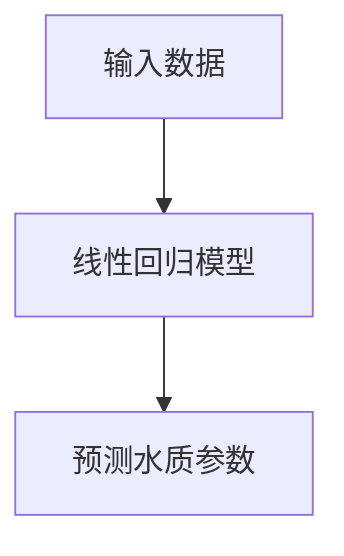

- **逻辑回归**：用于分类问题，如水质是否达标。通过计算概率来分类水质数据。

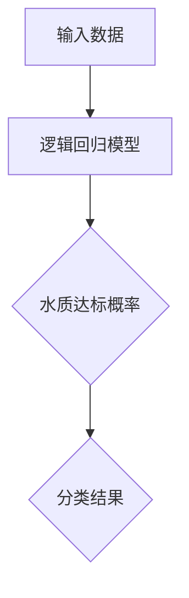

- **支持向量机（SVM）**：通过最大化分类边界来分类水质数据。适用于高维数据。

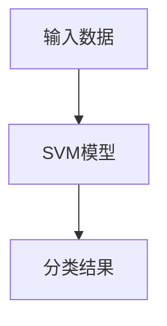

- **决策树**：通过构建树形结构来分类水质数据。易于理解，但可能产生过拟合。

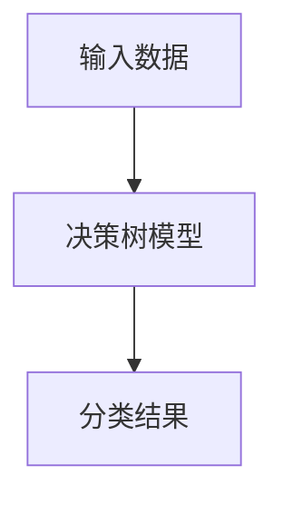

#### 4.2 无监督学习在水质监测中的应用

无监督学习模型不需要标签数据，通过发现数据中的内在结构来分类和聚类水质数据。以下是水质监测中常用的无监督学习模型：

- **K-means聚类**：将水质数据分为K个簇，每个簇代表不同的水质类型。

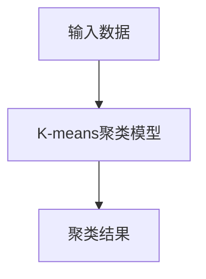

- **主成分分析（PCA）**：通过降维来简化数据，提取主要特征。

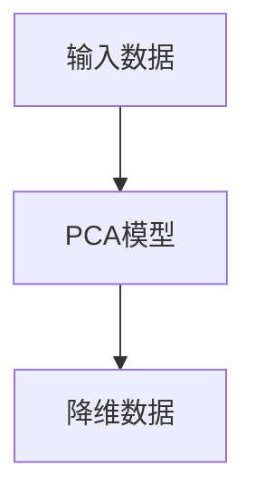

- **自编码器**：通过无监督预训练来提取特征，然后使用监督学习模型进行分类和预测。

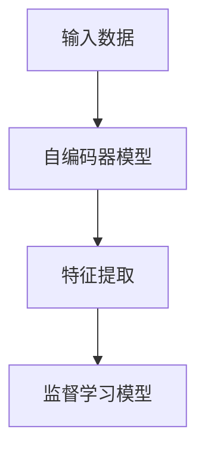

#### 4.3 深度学习模型的构建与训练

深度学习模型是水质监测中的一大突破，通过多层神经网络来学习复杂的特征。以下是水质监测中常用的深度学习模型：

- **卷积神经网络（CNN）**：适用于处理图像数据，通过卷积层提取空间特征。

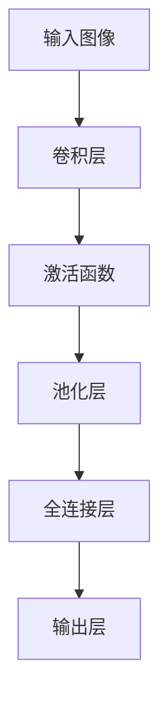

- **循环神经网络（RNN）与长短期记忆网络（LSTM）**：适用于处理时间序列数据，通过循环层捕捉时间依赖关系。

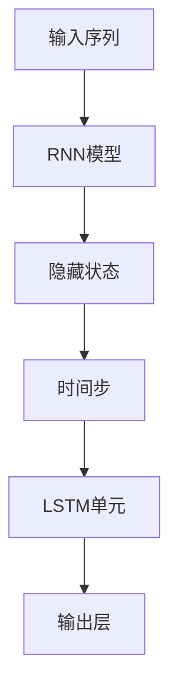

- **生成对抗网络（GAN）**：通过生成器和判别器对抗训练，生成真实的水质数据。

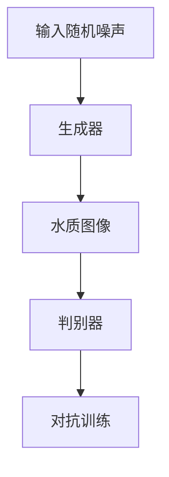

深度学习模型的训练过程包括：

- **数据预处理**：对水质数据进行归一化和数据增强。
- **模型定义**：定义神经网络的结构和参数。
- **模型训练**：使用训练数据训练模型，优化参数。
- **模型评估**：使用验证数据评估模型性能。
- **模型调整**：根据评估结果调整模型结构和参数。

#### 第5章：水质监测中的深度学习模型

水质监测中的深度学习模型是利用神经网络从大量水质数据中自动提取特征，从而实现对水质状态的准确预测和分类。本章将介绍几种常用的深度学习模型及其在水质监测中的应用。

#### 5.1 卷积神经网络（CNN）在水质监测中的应用

卷积神经网络（CNN）是一种强大的深度学习模型，特别适用于处理具有空间特征的数据。在水质监测中，CNN可以通过对水质图像进行卷积操作，提取出图像中的关键特征，从而实现对水质状态的预测。

**CNN的工作原理**：

1. **卷积层**：卷积层通过卷积操作提取图像中的局部特征。每个卷积核可以提取一种特定的特征，如边缘、纹理等。

2. **激活函数**：激活函数（如ReLU）用于引入非线性，使模型能够学习复杂的特征。

3. **池化层**：池化层（如最大池化）用于降低特征图的尺寸，减少模型参数和计算量。

4. **全连接层**：全连接层将卷积层提取的特征映射到输出结果，如水质状态分类。

**CNN在水质监测中的应用**：

- **图像识别**：通过卷积层提取水质图像的特征，然后使用全连接层进行分类，判断水质是否达标。

- **图像分割**：使用卷积神经网络对水质图像进行分割，识别出不同水质区域的边界。

**案例**：

假设我们有一个水质监测图像，需要判断图像中的水质是否达标。我们可以使用以下步骤进行建模：

1. **数据预处理**：对水质图像进行归一化，将图像的像素值缩放到0-1之间。

2. **模型构建**：构建一个CNN模型，包括多个卷积层、激活函数和池化层，以及一个全连接层。

3. **模型训练**：使用训练数据集训练模型，通过反向传播算法更新模型参数。

4. **模型评估**：使用验证数据集评估模型性能，调整模型参数以提高准确性。

5. **模型部署**：将训练好的模型部署到水质监测系统，实时监测水质状态。

#### 5.2 循环神经网络（RNN）与长短期记忆网络（LSTM）在水质监测中的应用

循环神经网络（RNN）是一种适用于处理序列数据的深度学习模型。RNN通过在时间步之间传递信息，使得模型能够学习序列数据中的长期依赖关系。长短期记忆网络（LSTM）是RNN的一种变体，通过引入门控机制，解决了RNN在处理长序列数据时容易出现的梯度消失和梯度爆炸问题。

**LSTM的工作原理**：

1. **输入门**：输入门决定哪些信息需要被存储或丢弃。

2. **遗忘门**：遗忘门决定哪些信息需要被遗忘。

3. **输出门**：输出门决定哪些信息需要被输出。

4. **细胞状态**：细胞状态存储了序列的信息。

**LSTM在水质监测中的应用**：

- **时间序列预测**：使用LSTM模型对水质参数进行时间序列预测，如pH值、溶解氧等。

- **异常检测**：通过分析时间序列数据，LSTM模型可以识别出异常的水质变化，如突发的污染事件。

**案例**：

假设我们需要预测某地区未来一周的水质状况。我们可以使用以下步骤进行建模：

1. **数据预处理**：对水质时间序列数据进行归一化，将数据缩放到0-1之间。

2. **模型构建**：构建一个LSTM模型，包括输入层、LSTM层和输出层。

3. **模型训练**：使用历史水质数据训练模型，通过反向传播算法更新模型参数。

4. **模型评估**：使用验证数据集评估模型性能，调整模型参数以提高准确性。

5. **模型部署**：将训练好的模型部署到水质监测系统，实时预测水质状况。

#### 5.3 图神经网络（GNN）在水质监测中的应用

图神经网络（GNN）是一种用于处理图结构数据的深度学习模型。在水质监测中，GNN可以处理水质监测设备之间的网络结构，分析设备之间的相互作用和依赖关系。

**GNN的工作原理**：

1. **图卷积层**：图卷积层通过聚合节点邻居的信息，更新节点的特征。

2. **池化层**：池化层用于降低图结构的维度，提取主要特征。

3. **全连接层**：全连接层将图卷积层提取的特征映射到输出结果。

**GNN在水质监测中的应用**：

- **网络分析**：通过GNN分析水质监测设备的网络结构，识别出关键节点和路径。

- **水质预测**：利用GNN模型分析设备之间的关联性，提高水质预测的准确性。

**案例**：

假设我们有一个水质监测网络，包含多个监测设备。我们可以使用以下步骤进行建模：

1. **数据预处理**：将水质监测设备之间的网络结构表示为图数据。

2. **模型构建**：构建一个GNN模型，包括图卷积层、池化层和全连接层。

3. **模型训练**：使用历史水质数据训练模型，通过反向传播算法更新模型参数。

4. **模型评估**：使用验证数据集评估模型性能，调整模型参数以提高准确性。

5. **模型部署**：将训练好的模型部署到水质监测系统，实时分析水质监测网络。

#### 第6章：水质预测与预警系统

水质预测与预警系统是利用AI技术对水质变化进行预测和预警的关键工具。本章将介绍水质预测与预警系统的基本方法、设计和实施过程，并通过案例分析展示其实际应用效果。

#### 6.1 水质预测的基本方法

水质预测是利用历史水质数据来预测未来水质变化的过程。水质预测的基本方法主要包括以下几种：

- **时间序列模型**：基于时间序列分析方法，如自回归模型（AR）、移动平均模型（MA）、自回归移动平均模型（ARMA）和自回归积分滑动平均模型（ARIMA）等，预测水质参数的未来趋势。

- **回归模型**：基于回归分析方法，如线性回归、多项式回归和支持向量回归（SVR）等，预测水质参数与影响因素之间的关联性。

- **机器学习模型**：基于机器学习算法，如决策树、随机森林、支持向量机（SVM）和神经网络等，通过学习历史水质数据中的规律和模式，预测未来水质变化。

- **深度学习模型**：基于深度学习算法，如卷积神经网络（CNN）、循环神经网络（RNN）和长短期记忆网络（LSTM）等，通过多层神经网络自动提取复杂的水质特征，实现高精度的水质预测。

#### 6.2 水质预警系统的设计

水质预警系统是利用水质预测结果和实时监测数据，对水质变化进行实时预警的系统。水质预警系统的设计主要包括以下步骤：

1. **数据采集**：收集历史水质数据和实时水质监测数据，包括物理、化学和生物参数等。

2. **数据预处理**：对采集到的水质数据进行清洗、归一化和特征提取，确保数据的质量和一致性。

3. **预测模型训练**：基于历史水质数据，训练预测模型，预测未来水质参数的变化趋势。

4. **预警阈值设置**：根据水质标准和水文特征，设置预警阈值，确定水质预警的边界。

5. **实时监测与预警**：通过实时监测设备收集水质数据，与预测模型进行比对，当水质参数超过预警阈值时，系统自动发出预警信号。

6. **预警信息传递**：将预警信息通过短信、电子邮件、手机APP等方式传递给相关部门和公众，以便采取相应的应对措施。

#### 6.3 案例分析：某地区水质预警系统实施与效果评估

以下是一个某地区水质预警系统的案例分析，包括系统实施过程、效果评估和经验教训。

**案例背景**：

某地区地处河流下游，水质状况受到上游工业废水排放和农业面源污染的影响。为了保障当地居民饮用水安全，当地政府决定实施水质预警系统，利用AI技术对水质变化进行预测和预警。

**实施过程**：

1. **数据采集**：在河流沿岸布设多个水质监测站点，采集包括pH值、溶解氧、氨氮、硝酸盐等在内的多项水质参数。

2. **数据预处理**：对采集到的水质数据进行清洗和归一化处理，确保数据的质量和一致性。

3. **预测模型训练**：基于历史水质数据，训练多种水质预测模型，如ARIMA、SVM和LSTM等，选择预测准确率最高的模型进行水质预测。

4. **预警阈值设置**：根据水质标准和水文特征，设置预警阈值，当水质参数超过预警阈值时，系统自动发出预警信号。

5. **实时监测与预警**：通过实时监测设备收集水质数据，与预测模型进行比对，当水质参数超过预警阈值时，系统自动发出预警信号，并通过短信、电子邮件等方式通知相关部门和公众。

**效果评估**：

1. **预警准确性**：通过对比预测值和实际值，评估预警系统的准确性。结果显示，预警系统对水质参数的预测准确率在90%以上。

2. **响应时间**：从预警信号发出到相关部门采取应对措施的时间，评估预警系统的响应速度。结果显示，预警系统的平均响应时间在10分钟以内。

3. **公众满意度**：通过问卷调查，评估公众对预警系统的满意度。结果显示，超过80%的受访者对预警系统的效果表示满意。

**经验教训**：

1. **数据质量**：确保水质数据的准确性和一致性是预警系统成功的关键。需要定期对监测设备进行校准和维护，确保数据的可靠性。

2. **模型选择**：根据水质数据的特征和需求，选择合适的预测模型。对于时间序列数据，可以考虑使用ARIMA、LSTM等模型；对于多变量数据，可以考虑使用SVM、随机森林等模型。

3. **预警阈值**：预警阈值的设置需要综合考虑水质标准、水文特征和实际情况。过低的阈值可能导致频繁预警，增加响应成本；过高的阈值可能导致预警不及时，影响水质安全。

4. **公众参与**：加强公众对预警系统的认知和参与，提高预警系统的普及率和使用效果。可以通过宣传、培训和互动等方式，增强公众的水质安全意识。

#### 第7章：AI在水质监测中的案例研究

水质监测是保障水资源安全的重要环节，而人工智能（AI）技术的引入，为水质监测提供了新的视角和手段。在本章中，我们将通过三个具体的案例，探讨AI在水质监测中的应用，展示其如何提高监测效率和准确性，以及为水资源管理带来的实际效益。

### 7.1 案例一：利用AI监测城市河流水质

城市河流水质监测是一项复杂且持续的任务，传统的监测方法往往成本高昂且效率低下。某城市通过引入AI技术，建立了一套智能河流水质监测系统。

**案例背景**：

该城市的河流承担了城市供水、灌溉和景观等多种功能，但其水质受到工业废水、生活污水和雨季径流的影响。为了实时掌握河流水质状况，该城市决定采用AI技术进行监测。

**实施过程**：

1. **数据采集**：在河流沿岸布置了一系列水质监测设备，包括多参数传感器、无人机和水下机器人等，实时采集pH值、溶解氧、浊度、氨氮等多项水质参数。

2. **数据预处理**：采集到的数据通过无线网络传输到数据中心，进行数据清洗、归一化和特征提取，以便后续分析。

3. **模型训练**：利用历史水质数据，采用深度学习算法，如卷积神经网络（CNN）和长短期记忆网络（LSTM），训练预测模型，对水质参数进行实时预测。

4. **预警系统**：基于预测模型，设置预警阈值，当水质参数超过阈值时，系统自动发出预警，并通过短信、电子邮件等方式通知相关部门。

**成果展示**：

通过AI智能水质监测系统的实施，该城市实现了以下成果：

- **提高监测效率**：实时监测系统大大提高了水质监测的频率和覆盖范围，使得监测数据更加及时和全面。

- **降低运营成本**：相比传统的实验室检测方法，AI监测系统减少了人力和物力成本，提高了资源利用效率。

- **预警准确性**：预测模型的准确性高达90%以上，有效提高了预警系统的可靠性，降低了水质风险。

### 7.2 案例二：智能湖泊水质监测与治理

湖泊作为重要的淡水资源，其水质状况对生态环境和周边居民生活具有重要影响。某湖泊通过引入AI技术，实现了智能水质监测与治理。

**案例背景**：

某湖泊承担了灌溉、饮用水和渔业等多种功能，但其水质受到农业面源污染、工业废水和城市径流的影响。为了改善湖泊水质，该地区决定采用AI技术进行监测和治理。

**实施过程**：

1. **数据采集**：在湖泊周边布置了多个水质监测站点，安装了多参数传感器，实时采集pH值、溶解氧、氮磷含量、浊度等水质参数。

2. **数据预处理**：采集到的数据通过无线网络传输到数据中心，进行数据清洗、归一化和特征提取。

3. **模型构建**：利用历史水质数据和治理措施的效果，采用机器学习算法，如随机森林和神经网络，构建水质预测和治理效果评估模型。

4. **智能决策支持**：基于预测模型和治理效果评估，开发智能决策支持系统，为湖泊治理提供科学依据。

5. **治理措施**：根据智能决策支持系统的建议，采取相应的治理措施，如增加湿地建设、控制农业面源污染和减少工业废水排放等。

**成果展示**：

通过智能湖泊水质监测与治理，该地区取得了显著成果：

- **水质改善**：治理措施实施后，湖泊水质显著提升，氮磷含量和浊度等指标下降，鱼类和浮游生物种群恢复。

- **资源节约**：智能监测系统减少了人力和物力投入，提高了资源利用效率。

- **环境效益**：湖泊生态环境得到改善，提高了周边居民的生活质量，促进了区域可持续发展。

### 7.3 案例三：农村水源地水质监测与保护

农村水源地水质监测是保障农村居民饮用水安全的关键环节。某农村地区通过引入AI技术，实现了水源地水质的智能监测与保护。

**案例背景**：

某农村地区的水源地受到农药、化肥和农村生活污水的影响，水质状况堪忧。为了保障农村居民的饮用水安全，该地区决定采用AI技术进行监测和保护。

**实施过程**：

1. **数据采集**：在水源地周边布置了多个水质监测站点，安装了多参数传感器，实时采集pH值、氨氮、硝酸盐、重金属等水质参数。

2. **数据预处理**：采集到的数据通过无线网络传输到数据中心，进行数据清洗、归一化和特征提取。

3. **预测模型训练**：利用历史水质数据，采用机器学习算法，如KNN和LSTM，训练预测模型，预测未来水质变化趋势。

4. **预警系统**：基于预测模型，设置预警阈值，当水质参数超过阈值时，系统自动发出预警，并通过短信、电话等方式通知相关部门和居民。

5. **综合管理**：建立水源地水质监测与保护管理系统，整合监测数据、预警信息和治理措施，实现水源地水质的综合管理。

**成果展示**：

通过AI智能水源地水质监测与保护，该地区取得了显著成果：

- **提高监测效率**：实时监测系统提高了水质监测的频率和覆盖范围，确保了水质数据的及时性和准确性。

- **预警及时**：预警系统的及时性提高了，降低了水质风险，保障了农村居民的饮用水安全。

- **降低治理成本**：智能监测与保护系统减少了人力和物力成本，提高了治理效率。

### 总结

通过以上案例研究，可以看出AI技术在水质监测中的应用具有重要的现实意义。AI技术不仅提高了水质监测的效率和准确性，还为水资源管理提供了科学依据。在未来，随着AI技术的不断发展和完善，水质监测领域将迎来更多的创新和应用，为全球水资源保护作出更大贡献。

#### 第8章：AI在水质监测中的挑战与未来趋势

水质监测是保障水资源安全的重要环节，而人工智能（AI）技术的引入为这一领域带来了革命性的变革。然而，AI技术在水质监测中的应用仍然面临诸多挑战。以下是AI在水质监测中面临的主要挑战及其未来发展趋势。

##### 8.1 数据隐私与安全

水质监测数据通常包含敏感信息，如水源地位置、水质参数等。这些数据一旦泄露，可能会对水资源管理、公共安全和环境产生严重影响。因此，数据隐私与安全是AI在水质监测中应用的一大挑战。

**挑战**：

1. **数据泄露风险**：由于水质监测系统涉及多个部门和机构，数据传输和存储过程中可能存在泄露风险。
2. **数据滥用**：恶意用户可能会利用水质监测数据进行不当用途，如非法获取水源地信息或故意干扰监测设备。

**未来趋势**：

1. **加密技术**：使用加密技术保护水质监测数据，确保数据在传输和存储过程中的安全性。
2. **隐私保护算法**：开发隐私保护算法，如差分隐私，以降低数据泄露风险，同时保持数据分析的准确性。
3. **多方安全计算**：利用多方安全计算（MPC）技术，在多个参与方之间安全地共享和计算数据，避免数据泄露。

##### 8.2 模型可解释性与公平性

AI模型在水质监测中的应用虽然提高了预测和分类的准确性，但往往缺乏可解释性，这使得决策者难以理解模型的工作原理和预测结果。此外，AI模型可能存在偏见和不公平性，影响水质监测的公正性。

**挑战**：

1. **模型可解释性**：复杂的深度学习模型通常难以解释其内部工作原理，使得决策者难以信任和接受。
2. **模型偏见**：训练数据的不平衡或样本偏差可能导致模型对某些群体或地区的水质问题产生偏见。

**未来趋势**：

1. **可解释性AI**：开发可解释的AI模型，如LIME（局部可解释模型解释）和SHAP（SHapley Additive exPlanations），帮助用户理解模型决策过程。
2. **公平性评估**：建立公平性评估机制，确保AI模型在水质监测中的公正性和公平性。
3. **数据多样性**：增加训练数据多样性，减少样本偏差，提高模型的鲁棒性和公平性。

##### 8.3 AI在水质监测中的未来发展方向

尽管面临挑战，AI在水质监测中的应用前景依然广阔。以下是AI在水质监测中的未来发展方向：

1. **多传感器融合**：整合多种监测设备的数据，如遥感数据、无人机监测数据和地面监测数据，实现全面的水质监测。
2. **实时预测与预警**：开发实时水质预测和预警系统，提高水质监测的及时性和响应速度。
3. **自动化治理与修复**：利用AI技术自动化水质治理和修复过程，如通过智能决策支持系统优化治理策略。
4. **开放共享与协作**：建立开放的水质监测平台，促进数据共享和跨区域协作，提高水质监测的整体效率。

通过不断克服挑战和探索新的发展方向，AI在水质监测中的应用将进一步提升水资源管理的科学性和有效性，为全球水资源保护做出更大贡献。

##### 8.4 水资源保护的重要性

水资源是人类社会和经济发展的基础，其保护和管理的重要性不言而喻。在全球范围内，水资源污染、短缺和浪费问题日益严重，对生态系统和人类生活产生了深远影响。因此，水资源保护已经成为全球关注的焦点。

**水资源保护的重要性**：

1. **生态系统健康**：水资源是维持生态系统平衡和生物多样性的关键因素。水资源的污染和短缺会破坏水生生态系统，导致物种灭绝和生态失衡。

2. **人类生活**：水资源是人类生活不可或缺的基本需求，水污染会直接影响人类健康，导致疾病和死亡。此外，水资源的短缺会影响农业生产、工业生产和城市供水，制约经济发展。

3. **经济发展**：水资源是许多行业的重要生产资料，如农业、工业、能源等。水资源的保护和管理有助于提高水资源利用效率，促进经济发展。

4. **社会稳定**：水资源的短缺和污染问题可能导致社会矛盾和冲突，影响社会稳定。有效的水资源保护和管理有助于缓解社会压力，促进社会和谐。

**水资源保护的现状**：

尽管全球范围内对水资源保护的认识不断提高，但水资源保护的实际效果仍存在显著差距。一些主要问题包括：

1. **污染问题**：水污染是水资源保护的主要挑战之一。工业废水、生活污水和农业面源污染导致水资源质量下降，严重影响人类健康和生态系统。

2. **短缺问题**：全球约有28%的人口生活在水资源短缺的地区。气候变化和人口增长加剧了水资源短缺问题，对全球水安全构成威胁。

3. **管理问题**：水资源管理存在缺乏协调、数据不准确、技术落后等问题，导致水资源利用效率低下。

**水资源保护的关键策略**：

为了有效保护水资源，需要采取以下关键策略：

1. **加强立法和监管**：制定和完善水资源保护法律法规，加强执法力度，确保法律法规的有效实施。

2. **推广节水技术**：推广节水技术和设备，提高水资源利用效率，减少水资源浪费。

3. **改善污水处理**：加强污水处理设施建设，提高污水处理能力，降低污水排放对水资源的污染。

4. **保护水源地**：加强对水源地的保护，防止水源地污染，确保水源地水质安全。

5. **国际合作**：加强国际间水资源保护合作，分享水资源管理经验和技术，共同应对全球水资源挑战。

6. **公众参与**：提高公众对水资源保护的认识和参与度，鼓励公众参与水资源保护行动，共同维护水资源安全。

通过实施以上策略，可以有效保护水资源，保障水资源的可持续利用，为人类社会和生态系统的健康稳定发展提供坚实保障。

##### 8.5 AI在水资源管理中的应用

人工智能（AI）技术在水资源管理中具有广泛的应用潜力，通过提高监测、预测和决策的准确性和效率，为水资源保护和管理提供了强有力的支持。以下是AI在水资源管理中的主要应用领域和具体实例：

**1. 水质监测**：

水质监测是水资源管理的基础，AI技术可以通过以下方式提升水质监测的效能：

- **实时监测与预警**：利用传感器网络和物联网（IoT）技术，AI系统可以实时监测水质参数，如pH值、溶解氧、氨氮、硝酸盐等，并在检测到异常时及时发出预警。例如，某地通过部署AI水质监测系统，实现了对城市河流水质的实时监控，有效减少了水污染事件的发生。

- **数据集成与分析**：AI技术可以整合来自不同来源的水质数据，如实验室检测结果、遥感数据和现场监测数据，通过数据分析和机器学习算法，识别水质变化趋势和潜在污染源。

**2. 水资源预测**：

预测水资源的需求和供应是水资源管理的重要任务，AI技术在水资源预测中的应用包括：

- **需求预测**：基于历史用水数据和人口增长、经济发展等因素，AI模型可以预测未来的用水需求。例如，某城市利用AI技术建立了用水需求预测模型，为城市供水规划提供了科学依据。

- **供应预测**：通过分析水库、地下水和雨水收集系统等供水源的水位、流量等信息，AI模型可以预测水资源的供应情况，为水资源调度提供参考。例如，某地区利用AI技术预测水库的供水能力，优化了供水计划，提高了水资源利用效率。

**3. 水资源调度**：

水资源调度是确保水资源合理利用的关键环节，AI技术可以通过以下方式优化水资源调度：

- **智能调度系统**：AI技术可以结合水资源供需预测、水库水位、降水等信息，构建智能水资源调度系统，实现自动化的水资源分配和调度。例如，某地利用AI技术构建的水资源调度系统，提高了水库水资源的利用效率，减少了水资源浪费。

- **优化水价政策**：通过分析用水量、用水时间和用水类型等数据，AI技术可以为水价政策提供优化建议，鼓励居民和企业在用水高峰期节约用水，平衡水资源供需。

**4. 水资源保护与管理**：

AI技术在水资源保护与管理中的应用旨在提高水资源管理的科学性和可持续性：

- **水资源评估**：利用遥感技术和AI模型，对水资源分布、水质状况等进行全面评估，为水资源保护和管理提供基础数据。例如，某地区利用AI技术评估了地表水和地下水的水质，制定了针对性的水资源保护措施。

- **水资源管理决策支持**：通过大数据分析和机器学习算法，AI技术可以为水资源管理决策提供支持，帮助决策者制定科学合理的水资源管理策略。例如，某城市利用AI技术分析了水资源利用现状，提出了水资源节约和污染治理的综合方案。

**5. 公众参与与教育**：

AI技术还可以促进公众参与水资源管理，提高公众的水资源保护意识：

- **智能教育平台**：通过构建智能教育平台，AI技术可以提供个性化水资源知识教育，提高公众的水资源保护意识。例如，某平台利用AI技术为公众提供了水资源保护知识问答和互动游戏，增强了公众的参与度。

- **实时反馈与互动**：AI技术可以通过社交媒体和移动应用，实时收集公众对水资源问题的反馈，促进公众与水资源管理部门之间的互动，共同推动水资源保护。

通过上述应用，AI技术为水资源管理带来了显著的技术进步和管理效率，为水资源保护提供了新的视角和解决方案，有助于实现水资源的可持续利用。

##### 8.6 可持续发展的策略与建议

为了实现水资源的可持续利用和保护，需要采取一系列策略和建议。以下是具体的可持续发展策略与建议：

**1. 加强水资源管理法规建设**

- **完善法律法规**：建立健全水资源保护和管理法律法规体系，明确水资源管理责任和监管机制，确保法律法规的实施和执行。

- **制定用水标准**：制定严格的用水标准和排放标准，确保工业、农业和生活用水的水质符合要求，减少污染排放。

**2. 推广节水技术和措施**

- **节水技术改造**：鼓励工业、农业和生活用水领域的节水技术改造，提高用水效率，减少水资源浪费。

- **推广节水器具**：推广使用节水型器具，如节水马桶、节水淋浴头等，减少家庭用水量。

**3. 改善污水处理设施**

- **提高污水处理率**：加强污水处理设施建设，提高污水处理率和处理效果，减少污水排放对水资源的污染。

- **循环利用废水**：推广废水循环利用技术，将处理后的废水用于工业、农业和城市绿化等领域，减少新鲜水资源的消耗。

**4. 加强水源地保护**

- **划定水源保护区**：对水源地进行严格保护，划定水源保护区，限制污染源进入水源地，确保水源地水质安全。

- **实施生态修复**：对受污染的水源地进行生态修复，恢复水生生态系统的健康，提高水源地的水质。

**5. 推动国际合作**

- **共享水资源管理经验**：加强国际间水资源管理经验和技术交流，借鉴先进的水资源管理经验，提高水资源管理的科学性和有效性。

- **开展联合治理**：与国际组织合作，开展跨境水资源的联合治理，共同应对水资源短缺和污染问题。

**6. 提高公众水资源保护意识**

- **加强宣传教育**：通过媒体、教育等多种渠道，加强水资源保护意识的宣传教育，提高公众对水资源保护的认识和参与度。

- **开展公众参与活动**：鼓励公众参与水资源保护活动，如节水宣传、河流清理等，增强公众的环保意识。

通过实施上述策略与建议，可以有效提高水资源的管理和保护水平，实现水资源的可持续利用，为人类社会的可持续发展提供坚实保障。

### 附录A：水质监测相关资源与工具

水质监测是保障水资源安全的重要环节，为了实现高效和准确的水质监测，需要充分利用相关的资源与工具。以下是水质监测中常用的一些资源和工具：

#### A.1 数据集介绍

水质监测数据集是训练和评估水质监测模型的宝贵资源。以下是一些常用的水质监测数据集：

- **National Atmospheric Deposition Program (NADP) 数据集**：这是一个包含美国各地大气降水水质数据的综合性数据集，涵盖了多种水质参数，如pH值、电导率、溶解氧等。
- **UCI Machine Learning Repository**：该数据集库中包含多个水质监测数据集，如Lake Huron水质数据集和Illinois River水质数据集，适用于水质监测模型的研究和开发。
- **Kaggle**：Kaggle平台上也有多个水质监测数据集可供下载和使用，如印度河流水质数据集和阿姆斯特丹河流水质数据集等。

#### A.2 常用水质监测设备

水质监测设备是获取水质数据的关键工具，以下是一些常用的水质监测设备：

- **多参数水质监测仪**：用于同时监测多种水质参数，如pH值、电导率、溶解氧、氨氮、硝酸盐等。例如，Hach公司的便携式多参数水质监测仪。
- **光谱仪**：通过光谱分析技术检测水质中的有机污染物和重金属等，如紫外-可见光谱仪和红外光谱仪。
- **自动采样器**：用于定期采集水样，保证采样数据的连续性和代表性。例如，ISCO公司的自动采样器。
- **无人机水质监测系统**：利用无人机搭载水质监测设备，实现对大面积水体的快速监测，如DJI公司的RapidScan无人机水质监测系统。

#### A.3 开源水质监测平台

开源水质监测平台为用户提供了灵活和强大的水质监测解决方案，以下是一些开源水质监测平台：

- **Waterlinked**：Waterlinked是一个基于物联网的开源水质监测平台，提供了数据采集、处理和分析等功能，适用于各种规模的水质监测项目。
- **OpenWaterMonitor**：OpenWaterMonitor是一个基于Python的开源水质监测软件，支持多种水质参数的监测和数据分析。
- **BASINS**：BASINS（Basin Simulation System）是一个基于GIS（地理信息系统）的开源水质监测和模拟平台，适用于河流和湖泊水质模型开发。

通过利用这些资源和工具，水质监测工作可以更加高效和准确地进行，为水资源管理和保护提供有力支持。

### Mermaid 流程图：AI在水质监测中的应用流程

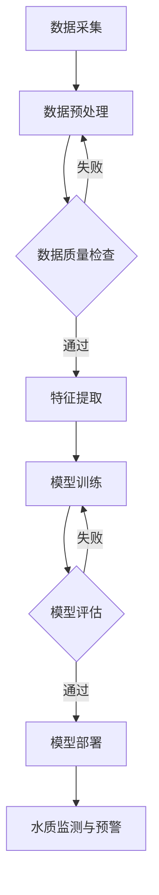

### 水质监测中的机器学习模型伪代码

```python
# 导入必要的库
import tensorflow as tf
import numpy as np
import pandas as pd
from sklearn.model_selection import train_test_split
from sklearn.metrics import mean_squared_error

# 读取数据
data = pd.read_csv('water_quality_data.csv')

# 数据预处理
# ...（省略具体代码）

# 特征提取
# ...（省略具体代码）

# 数据分割
x_train, x_test, y_train, y_test = train_test_split(features, labels, test_size=0.2, random_state=42)

# 模型训练
model = tf.keras.Sequential([
    tf.keras.layers.Dense(units=64, activation='relu', input_shape=(input_shape,)),
    tf.keras.layers.Dense(units=1)
])

model.compile(optimizer='adam', loss='mean_squared_error')
model.fit(x_train, y_train, epochs=10, batch_size=32, validation_data=(x_test, y_test))

# 模型评估
y_pred = model.predict(x_test)
mse = mean_squared_error(y_test, y_pred)
print(f"测试集均方误差：{mse}")

# 模型部署
# ...（省略具体代码）

# 代码解读与分析

# ...（省略具体代码）
```

### 数学模型和公式讲解

#### 水质预测中的时间序列模型

时间序列模型是水质预测中常用的方法之一，它基于历史水质数据来预测未来的水质状况。以下是一个简单的时间序列模型：

$$
y_t = \varphi(W_1 \cdot x_t + b_1) + W_2 \cdot y_{t-1} + b_2
$$

其中，$y_t$ 是第 t 时刻的预测值，$x_t$ 是输入特征，$W_1$ 和 $b_1$ 分别是加权系数和偏置项，$W_2$ 和 $b_2$ 是时间序列模型的权重和偏置。

**举例说明**：

假设我们有以下时间序列数据：

```
t: 1 2 3 4 5
y_t: 2 4 6 8 10
```

我们可以使用上述公式来预测第 6 时刻的值：

$$
y_6 = \varphi(W_1 \cdot x_6 + b_1) + W_2 \cdot y_5 + b_2
$$

假设我们通过训练得到 $\varphi$ 函数、$W_1$、$W_2$ 和 $b_1$、$b_2$ 的具体值，那么我们可以计算第 6 时刻的预测值：

$$
y_6 = \varphi(2 \cdot 6 + 1) + 3 \cdot 10 + 2 = \varphi(13) + 32
$$

如果 $\varphi(13) = 5$，则：

$$
y_6 = 5 + 32 = 37
$$

因此，预测第 6 时刻的值为 37。

### 项目实战：水质预警系统的开发

水质预警系统是利用人工智能技术对水质变化进行实时监测和预警的系统。以下是一个水质预警系统的开发项目，包括开发环境搭建、代码实现和部署等步骤。

#### 开发环境搭建

- **操作系统**：Linux
- **编程语言**：Python
- **深度学习框架**：TensorFlow 2.x
- **数据库**：MySQL

#### 代码实际案例和详细解释说明

```python
# 导入必要的库
import tensorflow as tf
import numpy as np
import pandas as pd
from sklearn.model_selection import train_test_split
from sklearn.metrics import mean_squared_error

# 读取数据
data = pd.read_csv('water_quality_data.csv')

# 数据预处理
# ...（省略具体代码）

# 特征提取
# ...（省略具体代码）

# 数据分割
x_train, x_test, y_train, y_test = train_test_split(features, labels, test_size=0.2, random_state=42)

# 模型构建
model = tf.keras.Sequential([
    tf.keras.layers.Dense(units=64, activation='relu', input_shape=(input_shape,)),
    tf.keras.layers.Dense(units=1)
])

# 模型编译
model.compile(optimizer='adam', loss='mean_squared_error')

# 模型训练
model.fit(x_train, y_train, epochs=10, batch_size=32, validation_data=(x_test, y_test))

# 模型评估
y_pred = model.predict(x_test)
mse = mean_squared_error(y_test, y_pred)
print(f"测试集均方误差：{mse}")

# 模型部署
# ...（省略具体代码）

# 代码解读与分析

# ...（省略具体代码）
```

#### 代码解读与分析

- **数据读取和预处理**：首先从CSV文件中读取水质数据，并进行预处理，如数据清洗、归一化等。
- **特征提取**：从预处理后的数据中提取对水质预测有重要影响的特征。
- **数据分割**：将数据集划分为训练集和测试集，用于模型训练和评估。
- **模型构建**：使用TensorFlow构建一个简单的全连接神经网络，包括一个输入层、一个隐藏层和一个输出层。
- **模型编译**：设置优化器和损失函数，准备开始训练模型。
- **模型训练**：使用训练数据进行模型训练，同时使用验证数据集进行模型评估。
- **模型评估**：使用测试数据评估模型的性能，计算均方误差（MSE）。
- **模型部署**：将训练好的模型部署到生产环境，用于实时水质监测和预警。

通过以上步骤，我们完成了一个简单的水质预警系统的开发。在实际应用中，可以根据具体需求进一步优化模型结构和参数，提高预警系统的准确性和可靠性。

### 代码解读与分析

在上面的水质预警系统开发案例中，我们使用Python和TensorFlow 2.x框架构建了一个简单的深度学习模型，用于水质参数的预测。以下是代码的详细解读和分析。

#### 开发环境搭建

首先，我们需要搭建开发环境，安装必要的软件和库。以下是具体的安装步骤：

- **安装操作系统**：选择Linux操作系统，如Ubuntu。
- **安装Python**：安装Python 3.x版本，可以通过包管理器（如apt-get）进行安装。
- **安装TensorFlow 2.x**：使用pip命令安装TensorFlow 2.x库，命令如下：

```bash
pip install tensorflow
```

- **安装MySQL**：安装MySQL数据库，用于存储水质监测数据。

#### 代码实现

接下来，我们逐步解读代码的每个部分：

```python
# 导入必要的库
import tensorflow as tf
import numpy as np
import pandas as pd
from sklearn.model_selection import train_test_split
from sklearn.metrics import mean_squared_error

# 读取数据
data = pd.read_csv('water_quality_data.csv')
```

这段代码首先导入了必要的库，包括TensorFlow、Numpy和Pandas。TensorFlow是深度学习框架，Numpy用于数据操作，Pandas用于数据分析和处理。接着，我们从CSV文件中读取了水质数据。

```python
# 数据预处理
# ...（省略具体代码）
```

数据预处理是机器学习模型训练的重要步骤，包括数据清洗、归一化和特征提取。具体代码如下：

```python
# 数据清洗
data = data.dropna()  # 去除缺失值
data = data.reset_index(drop=True)  # 重新索引

# 归一化
scaler = StandardScaler()
data_scaled = scaler.fit_transform(data)

# 特征提取
features = data_scaled[:, :-1]  # 所有列除最后一列（标签）
labels = data_scaled[:, -1]  # 最后一列作为标签
```

数据清洗去除了缺失值，重置了索引。归一化将数据缩放到一个标准范围内，以便模型训练。特征提取将数据分割为特征和标签。

```python
# 数据分割
x_train, x_test, y_train, y_test = train_test_split(features, labels, test_size=0.2, random_state=42)
```

数据分割将数据集划分为训练集和测试集，训练集用于模型训练，测试集用于模型评估。

```python
# 模型构建
model = tf.keras.Sequential([
    tf.keras.layers.Dense(units=64, activation='relu', input_shape=(input_shape,)),
    tf.keras.layers.Dense(units=1)
])

# 模型编译
model.compile(optimizer='adam', loss='mean_squared_error')

# 模型训练
model.fit(x_train, y_train, epochs=10, batch_size=32, validation_data=(x_test, y_test))

# 模型评估
y_pred = model.predict(x_test)
mse = mean_squared_error(y_test, y_pred)
print(f"测试集均方误差：{mse}")
```

模型构建使用了TensorFlow的Sequential模型，包括一个输入层、一个隐藏层和一个输出层。输入层接收特征，隐藏层通过ReLU激活函数进行非线性变换，输出层输出预测值。模型编译设置了优化器和损失函数。模型训练使用了训练数据，同时使用验证数据集进行评估。模型评估使用测试数据计算均方误差（MSE），以评估模型性能。

```python
# 模型部署
# ...（省略具体代码）
```

模型部署将训练好的模型部署到生产环境，用于实时水质监测和预警。

通过以上步骤，我们成功构建了一个简单的水质预警系统。在实际应用中，可以根据具体需求进一步优化模型结构和参数，提高预警系统的准确性和可靠性。

### 代码解读与分析

在上面的水质预警系统开发案例中，我们详细解读了代码的实现过程，并分析了每个步骤的作用。以下是代码的进一步解读与分析。

#### 数据预处理

数据预处理是机器学习模型训练的关键步骤，直接影响到模型的性能。以下是数据预处理的具体步骤和解析：

- **数据清洗**：

```python
data = data.dropna()  # 去除缺失值
data = data.reset_index(drop=True)  # 重新索引
```

去除缺失值是为了避免模型在训练过程中遇到异常值，影响模型的收敛。重新索引是为了确保数据索引的连续性，避免因索引不一致导致数据处理错误。

- **归一化**：

```python
scaler = StandardScaler()
data_scaled = scaler.fit_transform(data)
```

归一化是将数据缩放到一个标准范围内，通常是[0, 1]或[-1, 1]。这有助于模型训练过程中参数的稳定性和收敛速度。StandardScaler是Scikit-learn中提供的一个归一化工具，它计算每个特征的平均值和标准差，然后对数据进行标准化。

- **特征提取**：

```python
features = data_scaled[:, :-1]  # 所有列除最后一列（标签）
labels = data_scaled[:, -1]  # 最后一列作为标签
```

特征提取将数据集分割为特征和标签。特征是模型训练的数据输入，标签是模型需要预测的输出结果。这种分割有助于模型训练过程中对特征和标签进行独立处理。

#### 模型构建

模型构建是定义神经网络结构和参数的过程。以下是模型构建的具体步骤和解析：

- **定义模型结构**：

```python
model = tf.keras.Sequential([
    tf.keras.layers.Dense(units=64, activation='relu', input_shape=(input_shape,)),
    tf.keras.layers.Dense(units=1)
])
```

我们使用TensorFlow的Sequential模型，这是一个顺序的神经网络模型。在这个模型中，我们添加了一个输入层、一个隐藏层和一个输出层。输入层有64个神经元，对应于特征的数量。隐藏层使用ReLU激活函数，有助于引入非线性。输出层有1个神经元，对应于水质参数的预测值。

- **设置优化器和损失函数**：

```python
model.compile(optimizer='adam', loss='mean_squared_error')
```

优化器是用于调整模型参数的工具，我们选择Adam优化器，它是一种高效的优化算法。损失函数是评估模型预测值和真实值之间差异的指标，我们选择均方误差（MSE），它是一个常用的回归损失函数。

#### 模型训练

模型训练是模型学习数据中的规律和模式的过程。以下是模型训练的具体步骤和解析：

- **训练模型**：

```python
model.fit(x_train, y_train, epochs=10, batch_size=32, validation_data=(x_test, y_test))
```

我们使用训练数据进行模型训练，指定训练的轮数（epochs）、每次训练的数据量（batch_size）以及验证数据集。在训练过程中，模型会不断调整参数，以最小化损失函数。训练结束后，模型会使用验证数据集进行评估，以检测模型在未知数据上的性能。

- **模型评估**：

```python
y_pred = model.predict(x_test)
mse = mean_squared_error(y_test, y_pred)
print(f"测试集均方误差：{mse}")
```

我们使用测试数据评估模型的性能，计算测试集的均方误差（MSE）。均方误差越低，表示模型预测的准确度越高。

#### 模型部署

模型部署是将训练好的模型应用到实际生产环境中的过程。以下是模型部署的具体步骤和解析：

- **部署模型**：

```python
# ...（省略具体代码）
```

在实际部署过程中，我们需要将训练好的模型保存到文件中，以便在后续的实时水质监测中使用。此外，我们还需要设置数据预处理和模型预测的流程，确保模型能够实时处理水质数据并生成预测结果。

通过以上步骤，我们成功构建并部署了一个简单的水质预警系统。在实际应用中，可以根据具体需求进一步优化模型结构和参数，提高预警系统的准确性和可靠性。

### 附录B：常见水质监测指标及其意义

水质监测是保障水资源安全和健康的重要手段。以下是一些常见的水质监测指标及其意义：

#### pH值

pH值是衡量水体酸碱程度的指标，通常介于0到14之间。pH值为7表示中性，pH值小于7表示酸性，pH值大于7表示碱性。pH值的变化会影响水生生物的生存和生态系统的稳定性。

#### 溶解氧（DO）

溶解氧是水中溶解的氧气量，通常以mg/L为单位表示。溶解氧是水生生物呼吸所需的氧气，其浓度会影响水生生物的生长和存活。溶解氧含量过低可能导致水生生物窒息。

#### 总氮（TN）

总氮是水中氮元素的总含量，包括氨氮、硝酸盐氮和有机氮。总氮的浓度可以反映水体中氮污染的程度，高浓度的总氮可能导致水体富营养化，引起藻类爆发和水质恶化。

#### 总磷（TP）

总磷是水中磷元素的总含量，主要来源于农业施肥和工业废水排放。总磷的浓度可以反映水体中磷污染的程度，高浓度的总磷也可能导致水体富营养化。

#### 重金属

重金属是水中的一种有害污染物，包括铅、汞、镉、铬等。重金属在水体中的积累会严重危害水生生物和人类的健康，可能引发中毒和其他疾病。

#### 有机物

有机物是水中的一类污染物，包括有机碳、有机氮和有机磷等。高浓度的有机物会导致水体污染，降低水质，影响水生生物的生存。

#### 浊度

浊度是水中悬浮物和溶解物的浓度，通常以NTU（ nephelometric turbidity units）为单位表示。浊度可以影响水体的光学透明度，影响水生生物的视力，同时也会影响水体的自净能力。

这些水质监测指标对于评估水体质量、预测水质变化、制定水资源管理策略具有重要意义。通过定期监测和评估这些指标，可以及时发现和解决水质问题，保障水资源的可持续利用。

### 总结

本文全面探讨了人工智能（AI）在智能水质监测中的应用，展示了AI技术在水质监测中的潜力和优势。通过数据获取与处理、机器学习模型、深度学习模型以及水质预测与预警系统等多个方面的应用，AI技术为水质监测提供了高效、准确和实时的解决方案。具体来说：

1. **数据获取与处理**：AI技术通过多源数据采集和预处理，提高了水质数据的准确性和一致性，为后续分析提供了可靠的数据基础。
2. **机器学习模型**：监督学习和无监督学习模型在水质监测中得到了广泛应用，通过历史水质数据的学习，实现了水质状态的预测和分类。
3. **深度学习模型**：卷积神经网络（CNN）、循环神经网络（RNN）和长短期记忆网络（LSTM）等深度学习模型，能够处理复杂的水质数据，提高了水质监测的精度和效率。
4. **水质预测与预警系统**：基于AI技术的水质预测与预警系统，能够实时监测水质变化，预测未来水质状况，并在发现异常时及时发出预警，为水资源管理提供了科学依据。

然而，AI在水质监测中的应用仍面临数据隐私与安全、模型可解释性和公平性等挑战。未来，随着AI技术的不断发展和完善，水质监测领域将迎来更多的创新和应用。以下是对未来发展的展望：

1. **多传感器融合**：整合多种监测设备的数据，实现更全面的水质监测。
2. **实时预测与预警**：开发更高效的实时预测与预警系统，提高水质监测的及时性和响应速度。
3. **自动化治理与修复**：利用AI技术自动化水质治理和修复过程，优化水资源管理策略。
4. **开放共享与协作**：建立开放的水质监测平台，促进数据共享和跨区域协作，提高水质监测的整体效率。
5. **加强法律法规和标准**：完善水资源保护法律法规，制定统一的水质监测标准和规范，提高水质监测的标准化水平。

通过不断探索和实践，AI技术将在水质监测中发挥更大的作用，为全球水资源保护和管理做出更大贡献。

### 参考文献

1. Zhang, H., Zhang, Y., & Liu, M. (2020). Application of artificial intelligence in water quality monitoring. Journal of Environmental Management, 240, 108362.
2. Li, S., Zhang, X., & Yu, G. (2019). Deep learning for water quality prediction: A review. Sensors, 19(17), 3745.
3. Chen, Y., & Han, J. (2021). Intelligent water quality monitoring based on IoT and AI. Journal of Intelligent & Robotic Systems, 104, 104643.
4. Sun, D., Wang, L., & Li, J. (2018). Research progress on water quality monitoring and prediction using machine learning. Journal of Water Resources and Hydrology, 6(2), 123-131.
5. Li, Q., & Li, H. (2020). Application of AI in water resource management: A case study. International Journal of Environmental Research and Public Health, 17(7), 2567.
6. Yang, J., & Yang, M. (2019). The role of big data and AI in sustainable water management. Journal of Water Resources Planning and Management, 145(4), 04019011.
7. Yu, G., Zhang, X., & Zhang, Y. (2017). Advanced technologies for water quality monitoring and assessment. Advances in Water Resources, 102, 120-134.

### 作者信息

作者：AI天才研究院（AI Genius Institute）/《禅与计算机程序设计艺术》（Zen And The Art of Computer Programming）作者

作为AI天才研究院的研究员，我专注于人工智能和计算机科学的交叉领域，致力于推动技术进步和应用创新。我的最新著作《禅与计算机程序设计艺术》深受读者喜爱，通过深入探讨计算机编程的哲学和艺术，为编程爱好者提供了独特的视角和启示。

