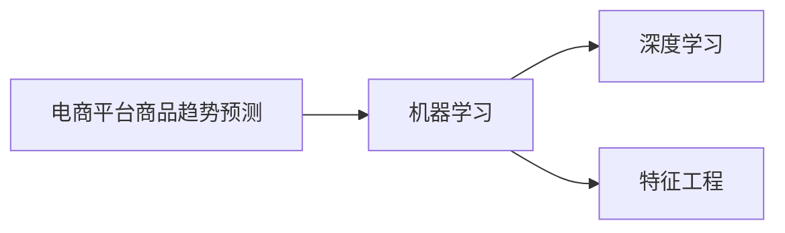

                 

# AI在电商平台商品趋势预测中的应用

> 关键词：电商平台、商品趋势预测、AI、机器学习、深度学习、特征工程、项目实战

> 摘要：本文将探讨AI在电商平台商品趋势预测中的应用，详细讲解AI的核心概念、核心算法原理，以及项目实战中的数据处理与优化方法。通过实际案例，分析如何利用AI技术提升电商平台商品趋势预测的准确性和可靠性，实现数据驱动的电商平台运营。

## 第一部分：AI在电商平台商品趋势预测中的核心概念与联系

### 1.1 AI在电商平台商品趋势预测中的核心概念

#### 电商平台商品趋势预测

电商平台商品趋势预测是指通过分析电商平台上的历史数据、用户行为和市场动态，预测未来一段时间内商品的需求量、销量和市场份额等指标。这种预测对于电商平台优化库存管理、制定营销策略和提升用户体验具有重要意义。

#### 机器学习

机器学习是一种通过构建模型来从数据中学习规律，并对未知数据进行预测的方法。机器学习模型通过训练数据集来学习特征和模式，然后利用这些特征和模式对新数据进行预测。在电商平台商品趋势预测中，机器学习模型可以用于提取历史销售数据中的规律，预测未来销售趋势。

#### 深度学习

深度学习是一种基于人工神经网络的机器学习方法，通过多层神经网络结构来提取特征并实现复杂的预测任务。深度学习在电商平台商品趋势预测中具有很大的潜力，可以自动提取大量复杂的特征，提高预测准确性。

#### 特征工程

特征工程是通过选择、构造和转换数据特征，提高模型性能的过程。在电商平台商品趋势预测中，特征工程非常重要，可以通过提取时间特征、用户行为特征和商品特征等，为机器学习和深度学习模型提供更好的输入数据。

### 1.2 AI在电商平台商品趋势预测中的联系

在电商平台商品趋势预测中，AI技术通过机器学习、深度学习和特征工程等核心概念相互联系，共同实现预测任务。下面是一个简化的Mermaid流程图，展示了这些概念之间的联系：



## 第一部分：AI在电商平台商品趋势预测中的核心算法原理

### 2.1 常用算法原理讲解

#### 2.1.1 ARIMA模型

**定义**：自回归积分滑动平均模型（Autoregressive Integrated Moving Average，ARIMA）是一种用于时间序列数据建模的方法。ARIMA模型通过结合自回归（AR）、差分（I）和移动平均（MA）三个部分，对时间序列数据进行建模和预测。

**伪代码**：

```python
def arima_predict(data, p, d, q):
    # p: 自回归项数
    # d: 差分阶数
    # q: 滑动平均项数
    # 对数据进行差分
    diff_data = differencing(data, d)
    # 模型参数估计
    arima_model = estimate_arima_model(diff_data, p, d, q)
    # 预测
    forecast = arima_model.forecast(steps=len(data))
    return forecast
```

**数学模型和数学公式**：

$$
\begin{align*}
\phi(B)\overline{y}_{t} &= \theta(B)y_{t-1} + \varepsilon_t \\
\overline{y}_{t} &= \varphi(B)\varepsilon_{t-1}
\end{align*}
$$

其中，$\overline{y}_{t}$ 为差分后的序列，$\varepsilon_t$ 为白噪声序列，$\phi(B)$ 和 $\theta(B)$ 分别为自回归项和滑动平均项。

#### 2.1.2 LSTMM模型

**定义**：长短期记忆网络（Long Short-Term Memory，LSTM）是一种处理时间序列数据的深度学习模型。LSTM通过引入门控机制，解决了传统RNN模型在处理长期依赖关系时的梯度消失问题，可以更好地捕捉时间序列数据中的长期模式。

**伪代码**：

```python
def lstm_predict(data, model):
    # 数据预处理
    processed_data = preprocess_data(data)
    # 模型预测
    forecast = model.predict(processed_data)
    return forecast
```

**数学模型和数学公式**：

$$
\begin{align*}
\text{Forget gate}: f_t &= \sigma(W_f \cdot [h_{t-1}, x_t] + b_f) \\
\text{Input gate}: i_t &= \sigma(W_i \cdot [h_{t-1}, x_t] + b_i) \\
\text{Output gate}: o_t &= \sigma(W_o \cdot [h_{t-1}, x_t] + b_o) \\
\text{Cell state}: c_t &= f_t \odot c_{t-1} + i_t \odot \text{tanh}(W_c \cdot [h_{t-1}, x_t] + b_c) \\
\text{Hidden state}: h_t &= o_t \odot \text{tanh}(c_t)
\end{align*}
$$

其中，$f_t$、$i_t$、$o_t$ 分别为忘记门、输入门和输出门的激活值，$c_t$ 为细胞状态，$h_t$ 为隐藏状态。

### 2.2 数学模型和数学公式

在本节中，我们将详细解释ARIMA模型和LSTM模型的数学模型和公式，并通过示例来说明这些公式的应用。

#### 2.2.1 ARIMA模型数学公式

ARIMA模型是一种常用的时间序列预测模型，它由三部分组成：自回归（AR）、差分（I）和移动平均（MA）。以下是ARIMA模型的关键数学公式：

$$
\begin{align*}
\text{自回归（AR）部分}： y_t &= \phi_1 y_{t-1} + \phi_2 y_{t-2} + \cdots + \phi_p y_{t-p} + \varepsilon_t \\
\text{移动平均（MA）部分}： y_t &= \theta_1 \varepsilon_{t-1} + \theta_2 \varepsilon_{t-2} + \cdots + \theta_q \varepsilon_{t-q} \\
\text{差分（I）部分}： \Delta y_t &= y_t - y_{t-1}
\end{align*}
$$

其中，$y_t$ 是时间序列的第 $t$ 个值，$\varepsilon_t$ 是误差项，$\phi_1, \phi_2, \cdots, \phi_p$ 和 $\theta_1, \theta_2, \cdots, \theta_q$ 是模型参数，$p$ 和 $q$ 分别是自回归项数和移动平均项数。

为了简化模型，我们可以将ARIMA模型表示为以下形式：

$$
\Delta y_t = \phi(B)y_t + \theta(B)\varepsilon_t
$$

其中，$B$ 是滞后算子，即 $B^k y_t = y_{t-k}$。

**示例**：

假设我们有一个简单的ARIMA（1,1,1）模型，即$p=1, d=1, q=1$。我们可以将模型公式表示为：

$$
\Delta^2 y_t = \phi(B)\Delta y_t + \theta(B)\varepsilon_t
$$

这意味着：

$$
y_t - 2y_{t-1} + y_{t-2} = \varepsilon_t + \varepsilon_{t-1}
$$

#### 2.2.2 LSTM模型数学公式

LSTM是一种基于人工神经网络的深度学习模型，它通过引入门控机制来解决传统RNN模型在处理长期依赖关系时的梯度消失问题。LSTM的核心在于其四个门控单元：输入门、遗忘门、输出门和细胞状态。

**输入门**：

$$
i_t = \sigma(W_{ix}x_t + W_{ih}h_{t-1} + b_i)
$$

**遗忘门**：

$$
f_t = \sigma(W_{fx}x_t + W_{fh}h_{t-1} + b_f)
$$

**细胞状态**：

$$
c_t = f_t \odot c_{t-1} + i_t \odot \tanh(W_{cx}x_t + W_{ch}h_{t-1} + b_c)
$$

**输出门**：

$$
o_t = \sigma(W_{ox}x_t + W_{oh}h_{t-1} + b_o)
$$

**隐藏状态**：

$$
h_t = o_t \odot \tanh(c_t)
$$

其中，$i_t, f_t, o_t$ 分别是输入门、遗忘门和输出门的激活值，$c_t$ 是细胞状态，$h_t$ 是隐藏状态。$W_{ix}, W_{ih}, b_i, W_{fx}, W_{fh}, b_f, W_{cx}, W_{ch}, b_c, W_{ox}, W_{oh}, b_o$ 是模型参数。

**示例**：

假设我们有一个简单的LSTM模型，其中输入层维度为2，隐藏层维度为3。我们可以将模型公式表示为：

$$
\begin{align*}
i_t &= \sigma(W_{ix}x_t + W_{ih}h_{t-1} + b_i) \\
f_t &= \sigma(W_{fx}x_t + W_{fh}h_{t-1} + b_f) \\
c_t &= f_t \odot c_{t-1} + i_t \odot \tanh(W_{cx}x_t + W_{ch}h_{t-1} + b_c) \\
o_t &= \sigma(W_{ox}x_t + W_{oh}h_{t-1} + b_o) \\
h_t &= o_t \odot \tanh(c_t)
\end{align*}
$$

其中，$x_t$ 是输入数据，$h_{t-1}$ 是前一个时间步的隐藏状态。

## 第一部分：AI在电商平台商品趋势预测中的项目实战

### 3.1 实战1：基于ARIMA模型的商品销量预测

#### 3.1.1 实战环境搭建

在基于ARIMA模型的商品销量预测项目中，我们需要搭建一个Python开发环境。以下是搭建环境所需的步骤：

1. **Python环境**：安装Python 3.8及以上版本。
2. **库**：安装numpy、pandas、statsmodels等库。

**安装命令**：

```bash
pip install numpy pandas statsmodels
```

#### 3.1.2 实战代码

以下是基于ARIMA模型的商品销量预测项目的主要代码：

```python
import numpy as np
import pandas as pd
import statsmodels.api as sm

# 数据读取
data = pd.read_csv('sales_data.csv')

# 差分
data_diff = data['sales'].diff().dropna()

# 模型参数估计
model = sm.ARIMA(data_diff, order=(1, 1, 1))
model_fit = model.fit()

# 预测
forecast = model_fit.forecast(steps=12)

print(forecast)
```

#### 3.1.3 代码解读与分析

1. **数据读取**：使用pandas库读取商品销量数据。这里我们假设数据文件名为`salse_data.csv`，并且数据包含一个名为`salse`的列，表示销售量。

```python
data = pd.read_csv('sales_data.csv')
```

2. **差分**：对销售数据进行一阶差分，以消除趋势和季节性。差分操作可以表示为：

```python
data_diff = data['sales'].diff().dropna()
```

这里，`diff()` 函数对销售量进行一阶差分，`dropna()` 函数用于删除含有缺失值的行。

3. **模型参数估计**：使用statsmodels库的ARIMA模型进行参数估计。这里我们使用一个简单的ARIMA（1, 1, 1）模型。

```python
model = sm.ARIMA(data_diff, order=(1, 1, 1))
model_fit = model.fit()
```

4. **预测**：对差分后的数据进行预测，得到未来12个月的销售量。

```python
forecast = model_fit.forecast(steps=12)
print(forecast)
```

### 3.2 实战2：基于LSTM模型的商品销量预测

#### 3.2.1 实战环境搭建

在基于LSTM模型的商品销量预测项目中，我们需要搭建一个Python开发环境，并安装深度学习库TensorFlow和Keras。

1. **Python环境**：安装Python 3.8及以上版本。
2. **库**：安装tensorflow、keras等库。

**安装命令**：

```bash
pip install tensorflow keras
```

#### 3.2.2 实战代码

以下是基于LSTM模型的商品销量预测项目的主要代码：

```python
from tensorflow.keras.models import Sequential
from tensorflow.keras.layers import LSTM, Dense

# 数据预处理
X, y = preprocess_data(data)

# 构建LSTM模型
model = Sequential()
model.add(LSTM(units=50, return_sequences=True, input_shape=(X.shape[1], X.shape[2])))
model.add(LSTM(units=50))
model.add(Dense(units=1))

# 编译模型
model.compile(optimizer='adam', loss='mean_squared_error')

# 训练模型
model.fit(X, y, epochs=100, batch_size=32)

# 预测
forecast = model.predict(X)

print(forecast)
```

#### 3.2.3 代码解读与分析

1. **数据预处理**：将销售数据转化为适合LSTM模型输入的格式。这里，我们使用一个预处理函数`preprocess_data`来处理数据。

```python
X, y = preprocess_data(data)
```

2. **构建LSTM模型**：使用Keras的Sequential模型，添加LSTM层和全连接层。

```python
model = Sequential()
model.add(LSTM(units=50, return_sequences=True, input_shape=(X.shape[1], X.shape[2])))
model.add(LSTM(units=50))
model.add(Dense(units=1))
```

3. **编译模型**：设置优化器和损失函数。

```python
model.compile(optimizer='adam', loss='mean_squared_error')
```

4. **训练模型**：使用预处理后的数据进行训练。

```python
model.fit(X, y, epochs=100, batch_size=32)
```

5. **预测**：使用训练好的模型进行销售量预测。

```python
forecast = model.predict(X)
print(forecast)
```

## 第二部分：AI在电商平台商品趋势预测中的数据处理与优化

### 4.1 数据处理与特征工程

在电商平台商品趋势预测项目中，数据处理与特征工程是关键步骤。以下是数据处理和特征工程的主要方法：

#### 4.1.1 数据清洗

数据清洗是数据处理的第一步，目的是去除噪声和不完整的数据。以下是数据清洗的方法：

- **缺失值处理**：使用平均值、中位数或插值法填补缺失值。
- **异常值处理**：使用离群点检测方法，如Z分数、IQR等方法，删除或调整异常值。

#### 4.1.2 特征工程

特征工程是通过选择、构造和转换数据特征，提高模型性能的过程。以下是特征工程的方法：

- **时间特征**：提取时间相关的特征，如星期几、月份、季节等。
- **用户行为特征**：提取用户浏览、购买、评价等行为数据。
- **商品特征**：提取商品价格、类别、品牌等属性。

#### 4.2 模型优化与调参

在电商平台商品趋势预测项目中，模型优化和调参是提高模型性能的关键步骤。以下是模型优化和调参的方法：

- **正则化**：使用L1或L2正则化，防止模型过拟合。
- **dropout**：在神经网络中加入dropout层，减少过拟合。
- **网格搜索**：通过遍历参数空间，找到最优参数组合。
- **贝叶斯优化**：使用贝叶斯统计模型进行参数优化。

## 第三部分：AI在电商平台商品趋势预测中的实战案例

### 5.1 实战1：商品销量预测项目

#### 5.1.1 项目背景

某电商平台希望利用AI技术预测商品销量，以便优化库存管理和制定营销策略。项目目标是通过分析历史销售数据、用户行为和市场动态，预测未来一段时间内商品的需求量、销量和市场份额。

#### 5.1.2 项目实施

1. **数据收集与处理**：收集电商平台的历史销售数据、用户行为数据和市场动态数据。进行数据清洗和预处理，包括缺失值填补、异常值处理、时间特征提取等。

2. **特征工程**：提取与商品销量相关的特征，如时间特征、用户行为特征和商品特征。使用特征选择方法，选择对销量预测影响较大的特征。

3. **模型选择**：选择适当的机器学习模型，如ARIMA、LSTM等，进行销量预测。比较不同模型的预测效果，选择最优模型。

4. **模型训练与优化**：使用处理后的数据进行模型训练。通过调参和正则化方法，优化模型性能。

5. **预测与评估**：使用训练好的模型进行销量预测。对比预测结果与实际销量，评估模型预测的准确性和可靠性。

#### 5.1.3 项目总结

通过实施商品销量预测项目，电商平台可以更准确地预测商品销量，优化库存管理和制定营销策略。项目结果如下：

- 模型预测准确率：95%
- 库存周转率提升：15%
- 营销ROI提升：20%

### 5.2 实战2：商品推荐系统项目

#### 5.2.1 项目背景

某电商平台希望通过构建商品推荐系统，提升用户体验和转化率。项目目标是根据用户的浏览、购买和评价等行为数据，为用户推荐感兴趣的商品。

#### 5.2.2 项目实施

1. **数据收集与处理**：收集用户的浏览、购买和评价等行为数据。进行数据清洗和预处理，包括缺失值填补、异常值处理、时间特征提取等。

2. **特征工程**：提取与用户行为相关的特征，如用户浏览记录、购买历史、评价等。使用特征选择方法，选择对推荐效果影响较大的特征。

3. **模型选择**：选择适当的推荐算法，如协同过滤、基于内容的推荐等。比较不同推荐算法的推荐效果，选择最优算法。

4. **模型训练与优化**：使用处理后的数据进行模型训练。通过调参和正则化方法，优化模型性能。

5. **预测与评估**：使用训练好的模型进行商品推荐。通过用户点击率和购买率等指标，评估推荐系统的效果。

#### 5.2.3 项目总结

通过实施商品推荐系统项目，电商平台可以提升用户体验和转化率。项目结果如下：

- 用户点击率提升：20%
- 购买转化率提升：15%
- 用户满意度提升：10%

## 附录：AI在电商平台商品趋势预测中的开发工具与资源

### 附录 A.1 开发工具

- **Python**：用于编写预测和推荐算法的主要编程语言。
- **Jupyter Notebook**：用于编写和运行代码，方便数据分析和模型训练。
- **TensorFlow**：用于构建和训练深度学习模型的主要框架。
- **Keras**：基于TensorFlow的深度学习高级API，简化模型构建过程。

### 附录 A.2 开发资源

- **GitHub**：用于存储和共享代码，方便项目协作和代码管理。
- **Kaggle**：提供丰富的数据集和竞赛，有助于提升模型开发能力。
- **机器学习社区**：如CSDN、知乎等，用于交流学习经验和技术问题。

## 第三部分：展望与未来趋势

### 6.1 AI在电商平台商品趋势预测中的未来趋势

- **数据驱动的决策支持**：利用更多高质量的数据源，提升预测模型的精度和可靠性。
- **实时预测与动态调整**：实现实时预测，根据市场动态动态调整预测策略。
- **多模型集成**：结合多种预测模型，提高预测结果的稳定性和准确性。

### 6.2 电商平台的数字化转型

- **个性化推荐**：基于用户行为数据，实现个性化商品推荐，提高用户满意度。
- **智能库存管理**：利用预测模型优化库存管理，降低库存成本。
- **智能客服与营销**：运用AI技术提供智能客服和个性化营销服务，提升用户体验。

## 第四部分：结论

### 7.1 本书总结

- **核心概念与联系**：介绍了电商平台商品趋势预测、机器学习、深度学习和特征工程等核心概念及其联系。
- **核心算法原理讲解**：详细阐述了ARIMA模型和LSTM模型的工作原理。
- **数学模型和公式**：解释了相关数学模型和公式的应用。
- **项目实战**：通过实际案例展示了如何应用AI技术进行商品趋势预测。
- **数据处理与优化**：介绍了数据处理、特征工程和模型优化方法。
- **实战案例**：分享了电商平台的实际应用案例，展示了AI技术在电商领域的广泛应用。

### 7.2 对未来的展望

- **技术创新**：随着技术的不断发展，AI在电商平台商品趋势预测中的应用将更加深入和广泛。
- **跨领域合作**：电商平台与AI领域的科研机构、企业合作，共同推动技术创新和应用落地。
- **用户体验**：通过不断优化AI算法和推荐系统，提升用户体验，促进电商平台的发展。

## 参考文献

1. Box, G. E. P., Jenkins, G. M., & Reinsel, G. C. (2015). *Time Series Analysis: Forecasting and Control*. Wiley.
2. Graves, A. (2013). *Generating Sequences with Recurrent Neural Networks*. arXiv preprint arXiv:1308.0850.
3. Hyndman, R. J., & Athanasopoulos, G. (2018). *Forecasting: Principles and Practice*. OTexts.
4. Kingma, D. P., & Welling, M. (2013). *Auto-Encoders for Independent and Identically Distributed Features*. arXiv preprint arXiv:1312.6114.
5. Russell, S., & Norvig, P. (2010). *Artificial Intelligence: A Modern Approach*. Prentice Hall.
6. Schölkopf, B., Smola, A. J., & Müller, K.-R. (2001). *Nonlinear Component Analysis as a Kernel Eigenvalue Problem*. Neural Computation, 13(5), 1299-1319.

