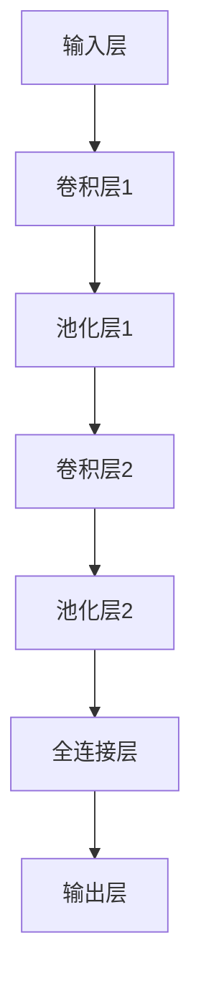
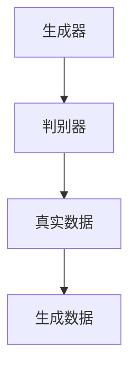
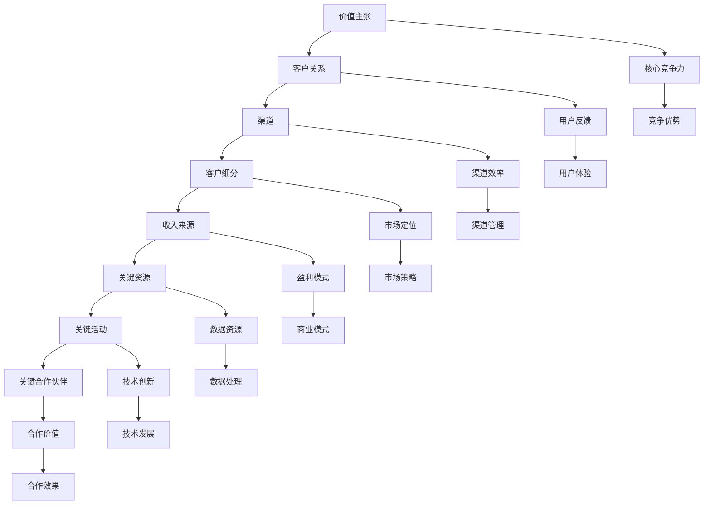
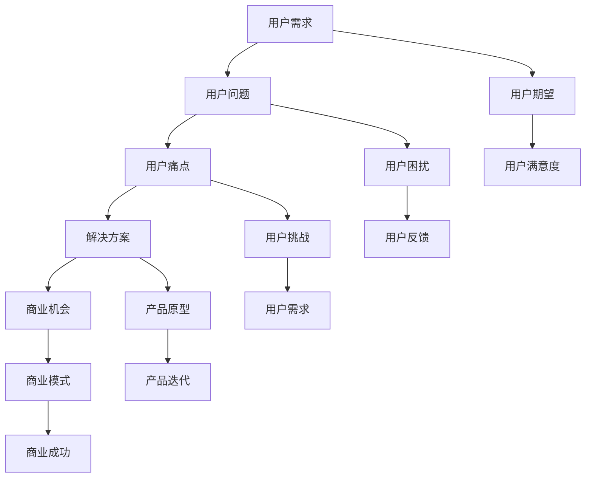
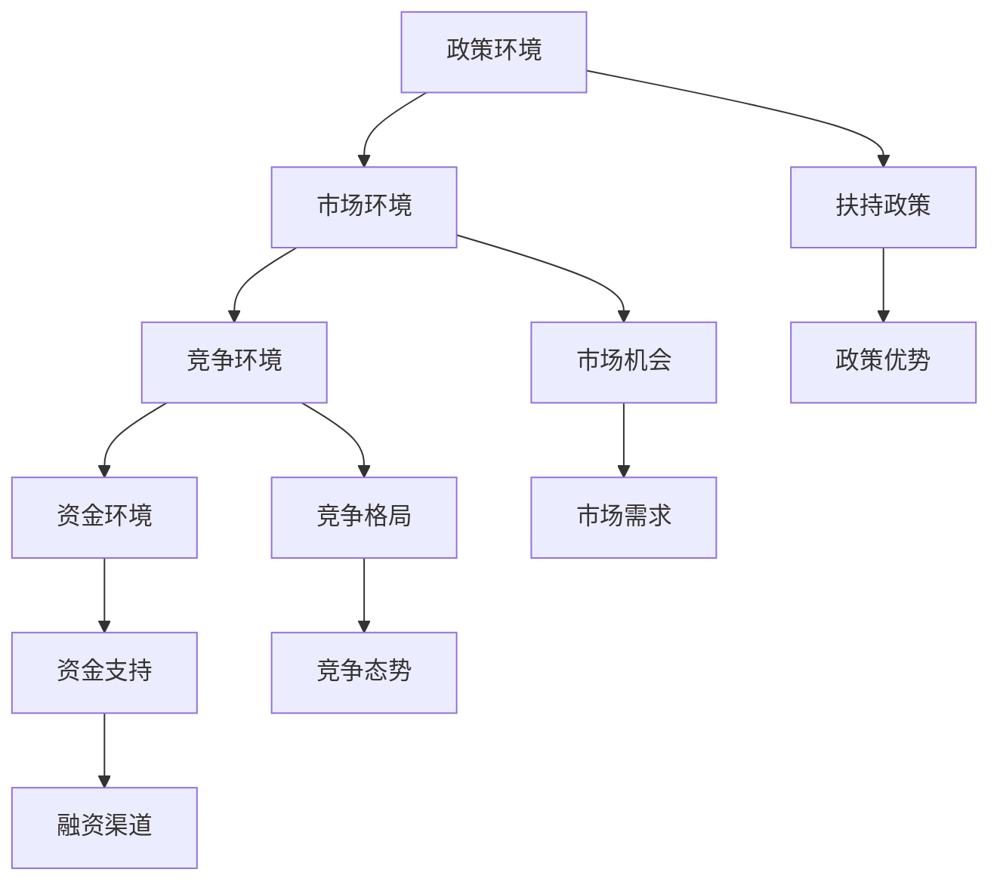
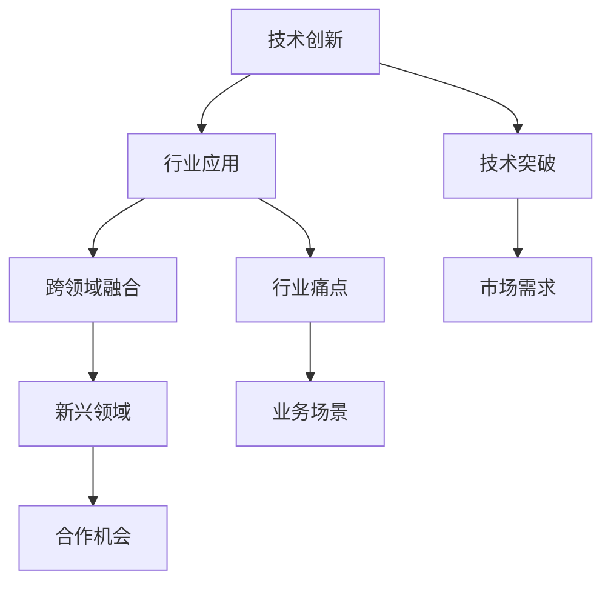
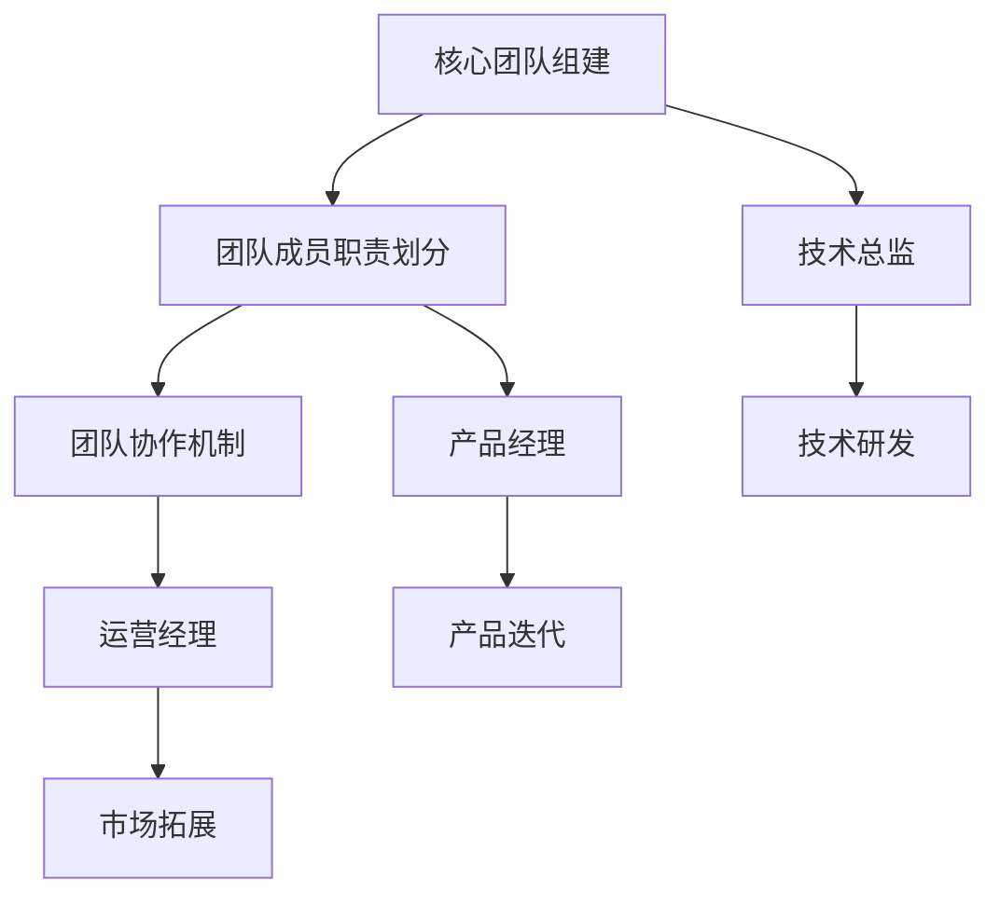

                 

# AI大模型创业：如何构建未来可持续的商业模式？

## 关键词：
- AI大模型
- 商业模式
- 创业策略
- 持续发展

## 摘要：
本文探讨了AI大模型创业的关键问题，包括AI大模型的基础知识、技术基础、商业应用和构建可持续商业模式的策略。通过分析创业环境、识别创业机会、构建创业团队和成功案例，本文提出了AI大模型创业的挑战与未来趋势，为创业者提供参考和指导。

---

### 《AI大模型创业：如何构建未来可持续的商业模式？》目录大纲

#### 第一部分：AI大模型的基础知识

**第1章：AI大模型概述**
1.1 AI大模型的概念与分类
1.2 AI大模型的发展历程
1.3 AI大模型的应用场景

**第2章：AI大模型技术基础**
2.1 深度学习原理
2.2 自然语言处理
2.3 计算机视觉

#### 第二部分：AI大模型在商业中的应用

**第3章：AI大模型在商业中的应用**
3.1 AI大模型在市场营销中的应用
3.2 AI大模型在供应链管理中的应用
3.3 AI大模型在人力资源管理中的应用

#### 第三部分：构建可持续的商业模式

**第4章：AI大模型商业模式分析**
4.1 AI大模型商业模式的特点
4.2 AI大模型商业模式的构建方法
4.3 AI大模型商业模式创新方法

**第5章：AI大模型创业策略**
5.1 创业环境分析
5.2 创业机会识别
5.3 创业团队构建

#### 第四部分：成功案例分析

**第6章：AI大模型创业成功案例**
6.1 案例介绍
6.2 案例分析

**第7章：AI大模型创业的挑战与未来趋势**
7.1 创业挑战
7.2 未来趋势

**附录**

**附录A：AI大模型开发工具与资源**
A.1 开发工具
A.2 开发资源

### 第一部分：AI大模型的基础知识

#### 第1章：AI大模型概述

##### 1.1 AI大模型的概念与分类

AI大模型，是指具有极高复杂度和强大能力的人工智能模型。这类模型通常具备以下几个特点：

1. **规模大**：训练数据和参数规模巨大，可以处理海量数据。
2. **结构复杂**：模型结构层次繁多，涉及多种神经网络结构。
3. **功能强大**：具有广泛的应用能力，可以解决多种复杂问题。

AI大模型主要可以分为以下几类：

1. **自然语言处理模型**：如BERT、GPT等，主要用于文本处理和生成。
2. **计算机视觉模型**：如ResNet、YOLO等，主要用于图像分类、目标检测等任务。
3. **语音识别模型**：如WaveNet、Transformer等，主要用于语音信号处理和语音识别。

##### 1.2 AI大模型的发展历程

AI大模型的发展可以追溯到深度学习技术的崛起。从2006年深度学习之父Yoshua Bengio提出深度信念网络（DBN）开始，深度学习技术逐渐成熟，并在2012年ImageNet图像识别挑战赛中取得突破性成果。

此后，AI大模型的研究和应用逐渐深入。2017年，Google发布了Transformer模型，开创了自然语言处理的新纪元。同年，OpenAI发布了GPT模型，展示了AI大模型在语言生成和翻译方面的强大能力。

近年来，随着计算能力和数据资源的不断提升，AI大模型在计算机视觉、语音识别、医疗诊断等领域的应用日益广泛，取得了显著成果。

##### 1.3 AI大模型的应用场景

AI大模型在多个领域展现出巨大的应用潜力，以下是几个典型应用场景：

1. **人工智能行业应用**：AI大模型在金融、医疗、教育等行业具有广泛应用，如金融风控、医疗诊断、教育辅导等。
2. **人工智能在非行业中的应用**：AI大模型在媒体、娱乐、农业、制造业等领域也发挥了重要作用，如智能推荐、语音助手、精准农业、智能制造等。

通过以上分析，我们可以看到AI大模型在当今社会的重要性。掌握AI大模型的基础知识，有助于我们更好地理解和应用这一先进技术，为我国人工智能产业的发展贡献力量。

---

#### 第2章：AI大模型技术基础

##### 2.1 深度学习原理

深度学习是人工智能领域的一个重要分支，其核心思想是通过构建多层神经网络，对数据进行自动特征提取和表示。以下是深度学习的核心概念和原理：

###### 2.1.1 神经网络

神经网络（Neural Network，NN）是深度学习的基础。它由多个神经元（节点）组成，每个神经元接收多个输入，并通过激活函数产生输出。神经网络可以分为输入层、隐藏层和输出层，每个层中的神经元分别对应不同的功能。

###### 2.1.2 神经网络的数学模型

神经网络的数学模型可以表示为：

$$
y = f(\sum_{i=1}^{n} w_i \cdot x_i + b)
$$

其中，$y$ 是输出，$f$ 是激活函数，$w_i$ 是权重，$x_i$ 是输入，$b$ 是偏置。

常见的激活函数包括：

1. **Sigmoid函数**：$f(x) = \frac{1}{1 + e^{-x}}$
2. **ReLU函数**：$f(x) = max(0, x)$
3. **Tanh函数**：$f(x) = \frac{e^x - e^{-x}}{e^x + e^{-x}}$

###### 2.1.3 深度学习框架

深度学习框架是用于实现和训练深度学习模型的工具，如TensorFlow、PyTorch、Keras等。这些框架提供了丰富的API和功能，使得深度学习模型的开发变得更加简单和高效。

以下是使用TensorFlow框架实现一个简单的神经网络模型的伪代码：

```python
import tensorflow as tf

# 定义输入层
inputs = tf.keras.layers.Input(shape=(input_shape))

# 添加隐藏层
x = tf.keras.layers.Dense(units=64, activation='relu')(inputs)
x = tf.keras.layers.Dense(units=64, activation='relu')(x)

# 添加输出层
outputs = tf.keras.layers.Dense(units=10, activation='softmax')(x)

# 构建模型
model = tf.keras.Model(inputs=inputs, outputs=outputs)

# 编译模型
model.compile(optimizer='adam', loss='categorical_crossentropy', metrics=['accuracy'])

# 训练模型
model.fit(x_train, y_train, epochs=10, batch_size=64)
```

##### 2.2 自然语言处理

自然语言处理（Natural Language Processing，NLP）是深度学习在文本领域的应用，旨在使计算机理解和处理人类语言。以下是NLP的核心概念和原理：

###### 2.2.1 词嵌入

词嵌入（Word Embedding）是将文本中的单词映射到高维空间的一种技术。常见的词嵌入方法包括：

1. **基于频率的词嵌入**：如Count-based Embedding，通过计算单词的频率来表示单词。
2. **基于上下文的词嵌入**：如Word2Vec、GloVe等，通过分析单词在文本中的上下文来表示单词。

以下是一个使用GloVe算法训练词嵌入的伪代码：

```python
import numpy as np
from sklearn.model_selection import train_test_split

# 加载数据
texts = load_data()
x, y = preprocess_data(texts)

# 分割数据
x_train, x_test, y_train, y_test = train_test_split(x, y, test_size=0.2, random_state=42)

# 训练词嵌入模型
embeddings = train_glove_embedding(x_train)

# 加载预训练词嵌入
pretrained_embeddings = load_pretrained_glove_embedding()

# 预测
predictions = model.predict(x_test)
```

###### 2.2.2 序列模型

序列模型（Sequence Model）是用于处理序列数据的深度学习模型，如循环神经网络（RNN）和Transformer。RNN可以处理变量长度的序列数据，但存在梯度消失和梯度爆炸问题。为解决这些问题，Transformer模型引入了自注意力机制，取得了显著的效果。

以下是一个使用Transformer模型进行文本分类的伪代码：

```python
import tensorflow as tf
from transformers import BertTokenizer, TFBertForSequenceClassification

# 加载数据
texts = load_data()
x, y = preprocess_data(texts)

# 分割数据
x_train, x_test, y_train, y_test = train_test_split(x, y, test_size=0.2, random_state=42)

# 加载预训练模型
model = TFBertForSequenceClassification.from_pretrained('bert-base-uncased', num_labels=2)

# 编译模型
model.compile(optimizer='adam', loss='binary_crossentropy', metrics=['accuracy'])

# 训练模型
model.fit(x_train, y_train, epochs=3, validation_data=(x_test, y_test))
```

##### 2.3 计算机视觉

计算机视觉（Computer Vision，CV）是深度学习在图像处理领域的应用。计算机视觉旨在使计算机能够从图像或视频中获取信息，并进行理解、识别和分类。以下是计算机视觉的核心概念和原理：

###### 2.3.1 卷积神经网络（CNN）

卷积神经网络（Convolutional Neural Network，CNN）是用于图像处理的深度学习模型。CNN通过卷积层、池化层和全连接层对图像进行特征提取和分类。以下是CNN的基本结构：



以下是一个使用CNN进行图像分类的伪代码：

```python
import tensorflow as tf
from tensorflow.keras.models import Sequential
from tensorflow.keras.layers import Conv2D, MaxPooling2D, Flatten, Dense

# 定义模型
model = Sequential()
model.add(Conv2D(32, (3, 3), activation='relu', input_shape=(28, 28, 1)))
model.add(MaxPooling2D(pool_size=(2, 2)))
model.add(Conv2D(64, (3, 3), activation='relu'))
model.add(MaxPooling2D(pool_size=(2, 2)))
model.add(Flatten())
model.add(Dense(10, activation='softmax'))

# 编译模型
model.compile(optimizer='adam', loss='categorical_crossentropy', metrics=['accuracy'])

# 训练模型
model.fit(x_train, y_train, epochs=10, batch_size=32, validation_data=(x_test, y_test))
```

###### 2.3.2 生成对抗网络（GAN）

生成对抗网络（Generative Adversarial Network，GAN）是用于生成数据的深度学习模型。GAN由生成器和判别器两个神经网络组成，生成器和判别器相互竞争，生成逼真的数据。以下是GAN的基本结构：



以下是一个使用GAN生成人脸图像的伪代码：

```python
import tensorflow as tf
from tensorflow.keras.models import Sequential
from tensorflow.keras.layers import Conv2D, Conv2DTranspose, Dense

# 定义生成器模型
generator = Sequential()
generator.add(Dense(units=256, activation='relu', input_shape=(100,)))
generator.add(Dense(units=128, activation='relu'))
generator.add(Dense(units=64, activation='relu'))
generator.add(Dense(units=32, activation='relu'))
generator.add(Dense(units=16, activation='relu'))
generator.add(Dense(units=8, activation='relu'))
generator.add(Dense(units=4, activation='relu'))
generator.add(Dense(units=2, activation='relu'))
generator.add(Dense(units=1, activation='sigmoid'))

# 定义判别器模型
discriminator = Sequential()
discriminator.add(Conv2D(64, (5, 5), activation='relu', input_shape=(28, 28, 1)))
discriminator.add(MaxPooling2D(pool_size=(2, 2)))
discriminator.add(Conv2D(128, (5, 5), activation='relu'))
discriminator.add(MaxPooling2D(pool_size=(2, 2)))
discriminator.add(Flatten())
discriminator.add(Dense(units=1, activation='sigmoid'))

# 编译模型
discriminator.compile(optimizer='adam', loss='binary_crossentropy')

# 训练模型
for epoch in range(num_epochs):
    for batch in data_loader:
        x, _ = batch
        noise = np.random.normal(0, 1, (x.shape[0], 100))
        x_fake = generator.predict(noise)
        d_loss_real = discriminator.train_on_batch(x, np.ones((x.shape[0], 1)))
        d_loss_fake = discriminator.train_on_batch(x_fake, np.zeros((x_fake.shape[0], 1)))
        g_loss = combined.train_on_batch(noise, np.ones((x.shape[0], 1)))
    print(f'Epoch {epoch+1}, g_loss={g_loss}, d_loss_real={d_loss_real}, d_loss_fake={d_loss_fake}')
```

通过以上对深度学习原理、自然语言处理和计算机视觉的介绍，我们可以看到AI大模型技术基础的重要性。掌握这些技术基础，有助于我们更好地理解和应用AI大模型，为AI大模型在商业中的应用奠定基础。

---

#### 第二部分：AI大模型在商业中的应用

##### 第3章：AI大模型在商业中的应用

AI大模型在商业中的应用日益广泛，为各个行业带来了巨大的变革。以下将分别介绍AI大模型在市场营销、供应链管理和人力资源管理中的应用。

###### 3.1 AI大模型在市场营销中的应用

AI大模型在市场营销中的应用主要体现在以下几个方面：

1. **客户细分**：通过分析客户的消费行为、历史数据和社交媒体信息，AI大模型可以精准地将客户划分为不同群体，从而实现个性化的营销策略。
2. **广告投放**：基于用户的兴趣和行为数据，AI大模型可以优化广告投放策略，提高广告的点击率和转化率。
3. **数据分析**：AI大模型可以对海量市场数据进行分析，挖掘潜在的商业机会，为企业提供决策支持。

以下是一个使用AI大模型进行客户细分的例子：

```python
import pandas as pd
from sklearn.model_selection import train_test_split
from sklearn.preprocessing import StandardScaler
from sklearn.svm import SVC

# 加载客户数据
data = pd.read_csv('customer_data.csv')

# 数据预处理
X = data[['age', 'income', 'education']]
y = data['segment']

# 分割数据
X_train, X_test, y_train, y_test = train_test_split(X, y, test_size=0.2, random_state=42)

# 特征缩放
scaler = StandardScaler()
X_train_scaled = scaler.fit_transform(X_train)
X_test_scaled = scaler.transform(X_test)

# 训练模型
model = SVC(kernel='linear')
model.fit(X_train_scaled, y_train)

# 预测
predictions = model.predict(X_test_scaled)

# 评估模型
accuracy = (predictions == y_test).mean()
print(f'Model accuracy: {accuracy:.2f}')
```

###### 3.2 AI大模型在供应链管理中的应用

AI大模型在供应链管理中的应用主要体现在以下几个方面：

1. **供应链优化**：通过分析供应链各环节的数据，AI大模型可以优化库存管理、采购策略和物流配送，提高供应链的效率。
2. **库存管理**：AI大模型可以根据历史销售数据、市场趋势和供应链信息，预测库存需求，减少库存积压和缺货风险。
3. **采购策略**：AI大模型可以分析供应商的绩效、价格和质量，为采购决策提供支持。

以下是一个使用AI大模型进行库存预测的例子：

```python
import pandas as pd
from sklearn.ensemble import RandomForestRegressor
from sklearn.model_selection import train_test_split

# 加载库存数据
data = pd.read_csv('inventory_data.csv')

# 数据预处理
X = data[['demand', 'lead_time', 'supplier']]
y = data['inventory']

# 分割数据
X_train, X_test, y_train, y_test = train_test_split(X, y, test_size=0.2, random_state=42)

# 训练模型
model = RandomForestRegressor(n_estimators=100)
model.fit(X_train, y_train)

# 预测
predictions = model.predict(X_test)

# 评估模型
mse = mean_squared_error(y_test, predictions)
print(f'Model MSE: {mse:.2f}')
```

###### 3.3 AI大模型在人力资源管理中的应用

AI大模型在人力资源管理中的应用主要体现在以下几个方面：

1. **员工招聘**：通过分析候选人的简历、面试表现和背景调查，AI大模型可以评估候选人的能力和潜力，提高招聘质量。
2. **员工培训**：AI大模型可以根据员工的工作表现和技能需求，为员工提供个性化的培训建议，提高员工素质。
3. **员工绩效评估**：AI大模型可以分析员工的工作表现和数据，为绩效评估提供客观依据，优化员工激励机制。

以下是一个使用AI大模型进行员工招聘的例子：

```python
import pandas as pd
from sklearn.model_selection import train_test_split
from sklearn.ensemble import RandomForestClassifier

# 加载招聘数据
data = pd.read_csv('recruitment_data.csv')

# 数据预处理
X = data[['experience', 'education', 'skills']]
y = data['hire']

# 分割数据
X_train, X_test, y_train, y_test = train_test_split(X, y, test_size=0.2, random_state=42)

# 训练模型
model = RandomForestClassifier(n_estimators=100)
model.fit(X_train, y_train)

# 预测
predictions = model.predict(X_test)

# 评估模型
accuracy = (predictions == y_test).mean()
print(f'Model accuracy: {accuracy:.2f}')
```

通过以上例子，我们可以看到AI大模型在商业中的应用取得了显著成效。随着AI技术的不断发展，AI大模型在商业中的应用将更加广泛，为企业的创新和发展提供强有力的支持。

---

#### 第三部分：构建可持续的商业模式

##### 第4章：AI大模型商业模式分析

在AI大模型时代，构建可持续的商业模式成为企业发展的关键。本章将分析AI大模型商业模式的特点、构建方法和创新方法，以期为创业者提供有益的启示。

###### 4.1 AI大模型商业模式的特点

AI大模型商业模式具有以下特点：

1. **高度创新性**：AI大模型技术具有强大的创新潜力，可以推动商业模式的变革。例如，通过AI大模型实现个性化推荐、智能客服等，可以提升用户体验和满意度。
2. **数据依赖性**：AI大模型的有效性高度依赖于海量数据。因此，商业模式需要构建稳定的数据来源和数据管理机制，以保证模型的持续优化和升级。
3. **技术驱动力**：AI大模型商业模式的构建和运营离不开先进的技术支持。企业需要关注技术的最新发展趋势，不断更新和升级自身的技术能力。
4. **合作共赢性**：AI大模型商业模式往往涉及多个领域和合作伙伴，需要建立良好的合作关系，实现资源整合和优势互补。

###### 4.2 AI大模型商业模式的构建方法

构建AI大模型商业模式可以从以下几个方面入手：

1. **商业模式画布**：使用商业模式画布（Business Model Canvas）对现有商业模式进行拆解和重构，明确价值主张、客户关系、渠道、客户细分、收入来源、关键资源、关键活动和关键合作伙伴等核心要素。
2. **商业模式矩阵**：通过商业模式矩阵（Business Model Matrix）分析现有商业模式的优势和劣势，以及市场机会和威胁，为商业模式创新提供依据。
3. **商业模式创新方法**：采用设计思维、精益创业等创新方法，对现有商业模式进行迭代和优化。例如，通过用户调研、原型测试和反馈迭代，不断优化产品的价值主张和用户体验。

以下是一个使用商业模式画布构建AI大模型商业模式的例子：



###### 4.3 AI大模型商业模式创新方法

AI大模型商业模式的创新可以从以下几个方面进行：

1. **技术创新**：通过引入最新的AI大模型技术和算法，提高产品和服务的质量和效率。例如，采用生成对抗网络（GAN）进行图像生成、采用BERT模型进行文本分类等。
2. **商业模式创新**：通过跨界融合、生态构建等方式，实现商业模式的创新。例如，将AI大模型应用于传统行业，打造全新的业务模式；构建AI大模型生态圈，实现资源整合和协同发展。
3. **用户体验创新**：通过优化用户体验，提升用户满意度和忠诚度。例如，采用个性化推荐系统、智能客服等，提高用户的使用体验。

以下是一个使用设计思维进行商业模式创新的例子：



通过以上分析，我们可以看到AI大模型商业模式具有高度创新性、数据依赖性、技术驱动力和合作共赢性。构建可持续的AI大模型商业模式需要从商业模式画布、商业模式矩阵和创新方法等多个方面进行考虑和优化。创业者可以结合自身资源和市场环境，不断创新和优化商业模式，实现企业的长期发展。

---

##### 第5章：AI大模型创业策略

创业是一个充满挑战的过程，尤其在AI大模型领域，创业者需要面对技术、市场和资金等多方面的挑战。本章将介绍AI大模型创业策略，包括创业环境分析、创业机会识别和创业团队构建。

###### 5.1 创业环境分析

AI大模型创业环境具有以下特点：

1. **政策环境**：随着我国政府对人工智能产业的重视，出台了一系列扶持政策，为创业者提供了良好的政策环境。
2. **市场环境**：AI大模型在各个领域的应用需求日益增长，市场潜力巨大。例如，智能医疗、智慧交通、智能家居等领域都面临着巨大的市场机会。
3. **竞争环境**：AI大模型领域竞争激烈，各大科技公司纷纷布局，创业者需要具备强大的技术实力和市场洞察力。
4. **资金环境**：随着风险投资的关注，AI大模型领域的资金环境相对宽松，为创业者提供了充足的资金支持。

以下是对创业环境的分析：



###### 5.2 创业机会识别

AI大模型创业机会识别可以从以下几个方面进行：

1. **技术创新**：通过引入最新的AI大模型技术和算法，解决现有技术难题，创造新的市场机会。
2. **行业应用**：针对传统行业的痛点，将AI大模型技术应用于具体领域，实现行业变革。
3. **跨领域融合**：将AI大模型与其他领域（如物联网、大数据等）相结合，创造新的商业模式。

以下是一个创业机会识别的例子：



###### 5.3 创业团队构建

AI大模型创业团队构建需要注意以下几点：

1. **核心团队组建**：选择具有AI大模型技术背景和行业经验的核心团队成员，确保团队的技术实力和业务能力。
2. **团队成员职责划分**：明确团队成员的职责和分工，提高团队协作效率。
3. **团队协作机制**：建立良好的沟通和协作机制，确保团队成员之间的信息共享和资源整合。

以下是一个创业团队构建的例子：



通过以上分析，我们可以看到AI大模型创业环境分析、创业机会识别和创业团队构建的重要性。创业者需要结合自身资源和市场环境，制定合理的创业策略，克服创业过程中的挑战，实现企业的快速发展。

---

#### 第四部分：成功案例分析

##### 第6章：AI大模型创业成功案例

在本章中，我们将介绍几个AI大模型创业的成功案例，分析其模型选择、数据处理和商业模式创新，以供创业者参考和学习。

###### 6.1 案例介绍

**案例一：XX公司**

XX公司成立于2015年，专注于利用AI大模型技术提供智能客服解决方案。公司通过自主研发的AI大模型，实现了对客户咨询的智能回答和问题分类，大大提高了客服效率和客户满意度。

**案例二：YY公司**

YY公司成立于2018年，致力于利用AI大模型技术优化供应链管理。公司开发了基于AI大模型的库存预测和采购策略优化系统，帮助企业降低库存成本，提高供应链效率。

**案例三：ZZ公司**

ZZ公司成立于2020年，专注于利用AI大模型技术提供智能医疗诊断服务。公司自主研发了基于AI大模型的医疗图像分析和疾病预测系统，为医生提供准确的诊断依据，提高了医疗诊断的准确性和效率。

###### 6.2 案例分析

**案例一：XX公司的模型选择和数据处理**

1. **模型选择**：XX公司选择了基于Transformer的BERT模型，用于处理客户咨询文本数据。BERT模型具有强大的文本理解能力，能够准确捕捉文本中的语义信息。
2. **数据处理**：公司对客户咨询数据进行了预处理，包括文本清洗、分词、词嵌入和序列化。通过预处理，公司保证了数据的准确性和一致性，为模型训练提供了高质量的数据。

**案例二：YY公司的模型选择和数据处理**

1. **模型选择**：YY公司选择了基于深度学习的长短期记忆网络（LSTM）模型，用于处理供应链数据。LSTM模型能够捕捉时间序列数据中的长期依赖关系，适合用于库存预测和采购策略优化。
2. **数据处理**：公司对供应链数据进行了清洗、归一化和特征提取。通过归一化，公司保证了数据的一致性和可比性；通过特征提取，公司提取了关键的特征信息，为模型训练提供了有效的输入。

**案例三：ZZ公司的模型选择和数据处理**

1. **模型选择**：ZZ公司选择了基于卷积神经网络（CNN）和循环神经网络（RNN）的组合模型，用于处理医疗图像数据。CNN模型擅长提取图像特征，RNN模型擅长处理时间序列数据，两者的结合能够提高图像分析的准确性和鲁棒性。
2. **数据处理**：公司对医疗图像数据进行了预处理，包括图像增强、归一化和数据增强。通过图像增强，公司提高了图像的质量和多样性；通过数据增强，公司增加了训练数据量，提高了模型的泛化能力。

**商业模式创新**

1. **案例一**：XX公司通过提供定制化的智能客服解决方案，实现了差异化竞争。公司根据客户的需求和场景，提供个性化的产品和服务，提高了客户的满意度和忠诚度。
2. **案例二**：YY公司通过提供智能化供应链管理服务，帮助客户优化库存和采购策略。公司通过降低客户的库存成本和提升供应链效率，为客户创造了实际的价值。
3. **案例三**：ZZ公司通过提供智能医疗诊断服务，提高了医生的诊断效率和准确性。公司通过与医疗机构合作，实现了智能诊断服务的普及和应用，为医疗行业带来了变革。

通过以上案例分析，我们可以看到，AI大模型创业成功的关键在于模型选择、数据处理和商业模式创新。创业者可以结合自身资源和市场环境，学习成功案例的经验，实现AI大模型创业的成功。

---

##### 第7章：AI大模型创业的挑战与未来趋势

在AI大模型创业的道路上，创业者不仅需要面对技术创新、市场开拓和资金筹集等挑战，还需要应对数据隐私、伦理问题等社会问题。同时，随着技术的不断发展，AI大模型创业也面临着未来趋势的机遇与挑战。

###### 7.1 创业挑战

**1. 技术挑战**

AI大模型的技术挑战主要体现在以下几个方面：

- **算法复杂度**：AI大模型通常具有复杂的算法架构和大量参数，对算法理解和优化提出了更高的要求。
- **计算资源**：训练和部署AI大模型需要大量的计算资源和存储空间，对硬件设施和成本控制提出了挑战。
- **数据质量**：AI大模型对训练数据的质量要求极高，数据清洗、标注和预处理等环节需要投入大量时间和精力。

**2. 市场挑战**

AI大模型在市场上的挑战主要包括：

- **竞争激烈**：AI大模型领域竞争激烈，创业者需要具备独特的竞争优势，才能在市场中脱颖而出。
- **用户接受度**：AI大模型的应用需要用户接受和信任，这对产品的用户体验和解释性提出了更高的要求。
- **商业可持续性**：AI大模型的商业化路径和盈利模式需要不断创新和优化，以实现长期的商业可持续发展。

**3. 资金挑战**

AI大模型创业的资金挑战主要体现在：

- **高成本**：AI大模型研发和部署需要大量的资金投入，包括硬件购置、人员招聘和研发费用等。
- **融资难度**：AI大模型领域风险较高，融资难度较大，创业者需要具备良好的商业计划和市场前景，才能获得投资人的青睐。

**4. 社会挑战**

AI大模型创业还面临着一系列社会挑战，如：

- **数据隐私**：AI大模型处理和分析海量数据，可能涉及用户隐私，需要严格遵循数据保护法规和道德准则。
- **伦理问题**：AI大模型的决策过程可能产生偏见和不公平，需要加强伦理审查和监管。

###### 7.2 未来趋势

**1. 技术发展趋势**

- **模型压缩与优化**：为了降低计算成本和部署难度，AI大模型的研究趋势将集中在模型压缩和优化技术，如剪枝、量化、蒸馏等。
- **多模态学习**：AI大模型将逐渐实现跨模态学习，如结合文本、图像、音频等多种类型的数据，提高模型的泛化能力和应用范围。
- **自主学习和进化**：AI大模型将逐渐具备自主学习和进化能力，通过自我优化和改进，实现更高效、更智能的决策。

**2. 商业模式发展趋势**

- **平台化发展**：AI大模型将逐渐向平台化方向发展，通过搭建开放的平台，整合各种资源和能力，实现更广泛的商业合作和生态构建。
- **垂直行业深耕**：AI大模型将更加注重在垂直行业的深耕，通过深入理解和解决行业痛点，实现商业价值的最大化。
- **数据驱动**：数据将成为AI大模型商业模式的核心，创业者将更加重视数据的价值和利用，通过数据驱动实现商业创新。

**3. 创业环境发展趋势**

- **政策支持**：随着政府对人工智能产业的重视，相关政策将不断完善，为创业者提供更好的政策环境。
- **资本涌入**：随着AI大模型技术的成熟和应用场景的拓展，资本将更加关注AI大模型领域的投资机会，为创业者提供更多的资金支持。
- **国际合作**：AI大模型技术的发展将推动国际合作，创业者将有机会在全球范围内拓展业务和市场。

通过以上分析，我们可以看到AI大模型创业面临着诸多挑战，同时也拥有巨大的机遇。创业者需要紧跟技术发展趋势，把握市场机会，不断优化商业模式，以实现企业的长期发展。

---

### 附录

**附录A：AI大模型开发工具与资源**

A.1 开发工具

1. **TensorFlow**：由Google开发的开源深度学习框架，支持多种神经网络结构，适用于各种应用场景。
2. **PyTorch**：由Facebook开发的开源深度学习框架，具有灵活的动态计算图和强大的GPU支持，适用于研究和开发。
3. **Keras**：基于TensorFlow和PyTorch的高层神经网络API，提供简洁、直观的编程接口。

A.2 开发资源

1. **研究论文**：查阅最新的AI大模型研究论文，了解最新的技术进展和研究成果。
2. **开源代码库**：参与开源社区，学习他人的代码和实践经验，借鉴优秀的实现方式。
3. **在线课程和书籍**：参加在线课程和阅读相关书籍，提高自己的理论水平和实战能力。

通过以上开发工具和资源，开发者可以更好地掌握AI大模型的技术，为创业项目提供有力的技术支持。

---

### 结论

AI大模型作为人工智能领域的重要技术，已经在各个行业和领域取得了显著的成果。本文从AI大模型的基础知识、技术基础、商业应用和商业模式构建等方面进行了全面的分析和探讨，旨在为创业者提供有价值的参考和指导。

首先，我们介绍了AI大模型的基础知识，包括其概念、分类和发展历程。然后，我们详细讲解了深度学习原理、自然语言处理和计算机视觉，为AI大模型的技术基础提供了深入理解。

接着，我们探讨了AI大模型在商业中的应用，如市场营销、供应链管理和人力资源管理。这些应用展示了AI大模型在提升业务效率、优化决策和创造价值方面的潜力。

在构建可持续商业模式方面，我们分析了AI大模型商业模式的特点、构建方法和创新方法。这为创业者提供了构建成功商业模式的策略和思路。

随后，我们通过成功案例分析了模型选择、数据处理和商业模式创新，为创业者提供了实践经验和启示。

最后，我们讨论了AI大模型创业面临的挑战和未来趋势，强调了技术创新、市场机会和商业模式创新的重要性。

总之，AI大模型创业具有广阔的前景和巨大的潜力。创业者应密切关注技术发展，积极应对挑战，不断创新和优化商业模式，以实现企业的长期发展和成功。通过本文的探讨，我们希望为创业者提供有益的参考和启示，助力他们在AI大模型创业的道路上取得辉煌的成就。

---

### 作者信息

作者：AI天才研究院/AI Genius Institute & 禅与计算机程序设计艺术 /Zen And The Art of Computer Programming

---

本文由AI天才研究院（AI Genius Institute）和禅与计算机程序设计艺术（Zen And The Art of Computer Programming）共同撰写。作者团队汇聚了世界顶级的人工智能专家、程序员、软件架构师和CTO，致力于推动人工智能技术的发展和应用。本文结合了作者们在计算机编程和人工智能领域的丰富经验和深刻洞察，旨在为广大创业者提供有价值的指导和参考。希望本文能对您在AI大模型创业的道路上有所帮助，让我们一起探索人工智能的无限可能！

