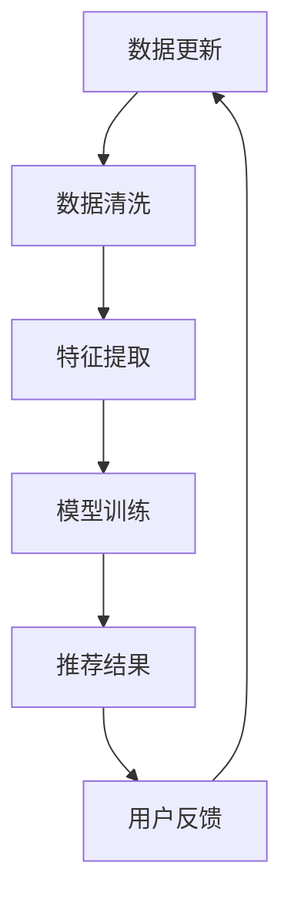

                 

### 《AI如何改善电商平台的跨平台推荐》

> **关键词**：人工智能，电商平台，跨平台推荐，协同过滤，基于内容的推荐，深度强化学习

> **摘要**：本文探讨了人工智能在电商平台跨平台推荐系统中的应用，分析了现有推荐系统的现状与挑战，详细介绍了AI基础知识和推荐系统算法，展示了AI技术在跨平台推荐中的具体应用，并通过案例分析和对未来发展趋势的展望，为电商平台的跨平台推荐提供了有价值的参考和思路。

### 第一部分：引言与概述

#### 1.1 书籍背景与目的

本节将介绍人工智能与电商平台推荐系统之间的关系，阐述跨平台推荐的重要性，并简要介绍本文的研究目的和内容。

##### 1.1.1 AI与电商推荐系统的关系

人工智能（AI）作为计算机科学的重要分支，近年来在各个领域都取得了显著的进展。特别是在电商领域，AI技术的应用已经深入到了推荐系统的各个环节。电商推荐系统是一种基于用户行为和偏好信息，通过算法模型为用户推荐相关商品的技术系统。随着互联网和电商的快速发展，用户对个性化推荐的需求日益增长，这为AI在电商推荐系统中的应用提供了广阔的舞台。

##### 1.1.2 跨平台推荐的重要性

随着移动互联网的普及，用户在多个平台上进行购物活动已经成为常态。如何实现跨平台的推荐，满足用户在不同平台上的购物需求，成为电商平台亟需解决的问题。跨平台推荐不仅能够提高用户的购物体验，还能有效提升电商平台的转化率和用户粘性。

##### 1.1.3 跨平台推荐的重要性

跨平台推荐的重要性体现在以下几个方面：

1. **提升用户购物体验**：通过分析用户在不同平台的行为数据，可以更准确地了解用户的购物偏好和需求，从而提供更加个性化的推荐，提升用户的购物体验。

2. **增加平台转化率**：跨平台推荐能够引导用户在多个平台间进行购物，增加用户在电商平台上的购买次数，提高转化率。

3. **增强用户粘性**：通过在多个平台上提供一致的推荐服务，可以增强用户对电商平台的信任和依赖，提高用户粘性。

#### 1.2 AI在电商推荐系统中的应用

##### 1.2.1 AI技术概述

人工智能技术包括多个子领域，如机器学习、深度学习、自然语言处理等。在电商推荐系统中，AI技术主要应用于数据分析和处理、特征提取、推荐算法设计等方面。以下将对这些技术进行简要介绍。

1. **机器学习**：机器学习是AI的核心技术之一，通过算法模型从数据中自动发现规律和模式，为推荐系统提供决策依据。常见的机器学习算法包括协同过滤、基于内容的推荐、聚类和分类等。

2. **深度学习**：深度学习是机器学习的一个分支，通过多层神经网络对数据进行深度学习，提取更加复杂的特征和模式。在电商推荐系统中，深度学习技术可以应用于图像识别、语音识别、文本挖掘等方面。

3. **自然语言处理**：自然语言处理（NLP）是AI的一个分支，通过计算机技术和算法理解、处理人类自然语言。在电商推荐系统中，NLP技术可以用于处理用户评论、标题、描述等文本数据，提取关键词和情感信息。

##### 1.2.2 电商平台推荐系统的现状与挑战

随着电商行业的快速发展，电商平台推荐系统已经成为电商运营的重要组成部分。目前，主流的电商平台推荐系统主要采用协同过滤、基于内容的推荐和混合推荐等方法。然而，随着用户数据的不断增加和平台间的竞争加剧，电商平台推荐系统面临着以下挑战：

1. **数据一致性与实时性**：跨平台推荐需要处理多个平台的数据，如何保证数据的一致性和实时性是一个重要问题。

2. **多源数据整合**：电商平台涉及多种类型的数据，如用户行为数据、商品数据、评论数据等，如何整合这些数据以提高推荐质量是一个挑战。

3. **用户行为数据的多样性与噪声**：用户行为数据具有多样性和噪声，如何准确提取用户特征和偏好是一个难题。

4. **推荐结果的可解释性**：随着推荐算法的复杂度增加，如何解释推荐结果，提高用户对推荐系统的信任度，是一个重要问题。

#### 1.3 跨平台推荐系统的概念与架构

##### 1.3.1 跨平台推荐系统简介

跨平台推荐系统是指能够在多个平台上为用户提供个性化推荐服务的系统。它通过整合不同平台上的用户行为数据，分析用户的购物偏好和需求，为用户在多个平台上提供一致的推荐服务。

##### 1.3.2 跨平台推荐系统的架构设计

跨平台推荐系统的架构设计主要包括数据采集、数据存储、数据处理、推荐算法和推荐结果展示等模块。

1. **数据采集**：跨平台推荐系统需要从多个平台采集用户行为数据，如浏览记录、购买记录、评论数据等。

2. **数据存储**：将采集到的数据存储在分布式数据库中，如Hadoop、Spark等，以便后续处理和分析。

3. **数据处理**：对采集到的数据进行清洗、预处理和特征提取，将原始数据转化为推荐算法所需的格式。

4. **推荐算法**：选择合适的推荐算法，如协同过滤、基于内容的推荐、深度强化学习等，对用户进行个性化推荐。

5. **推荐结果展示**：将推荐结果通过前端界面展示给用户，使用户能够方便地查看和选择推荐商品。

### 第二部分：AI基础

在本部分中，我们将深入探讨人工智能的基础知识，包括机器学习、数据分析和推荐系统算法，为后续的跨平台推荐系统应用打下坚实基础。

#### 2.1 机器学习基础

##### 2.1.1 机器学习概述

机器学习是人工智能的一个重要分支，它通过计算机算法自动从数据中学习规律和模式，以便进行预测或决策。机器学习主要分为监督学习、无监督学习和强化学习三种类型。

1. **监督学习**：监督学习是一种有监督的训练方法，通过已标记的数据集训练模型，使模型能够对未知数据进行预测。常见的监督学习算法包括线性回归、逻辑回归、支持向量机（SVM）、决策树和随机森林等。

2. **无监督学习**：无监督学习是一种无监督的训练方法，通过未标记的数据集训练模型，使模型能够发现数据中的结构和模式。常见的无监督学习算法包括聚类、降维、关联规则挖掘等。

3. **强化学习**：强化学习是一种基于奖励机制的学习方法，通过不断试错和优化策略，使模型能够在复杂环境中做出最佳决策。常见的强化学习算法包括Q学习、SARSA和深度确定性策略梯度（DDPG）等。

##### 2.1.2 监督学习、无监督学习和强化学习

1. **监督学习**：监督学习是一种有监督的训练方法，通过已标记的数据集训练模型，使模型能够对未知数据进行预测。常见的监督学习算法包括线性回归、逻辑回归、支持向量机（SVM）、决策树和随机森林等。

2. **无监督学习**：无监督学习是一种无监督的训练方法，通过未标记的数据集训练模型，使模型能够发现数据中的结构和模式。常见的无监督学习算法包括聚类、降维、关联规则挖掘等。

3. **强化学习**：强化学习是一种基于奖励机制的学习方法，通过不断试错和优化策略，使模型能够在复杂环境中做出最佳决策。常见的强化学习算法包括Q学习、SARSA和深度确定性策略梯度（DDPG）等。

##### 2.1.3 常见的机器学习算法

在电商推荐系统中，常见的机器学习算法包括协同过滤、基于内容的推荐、聚类和分类等。

1. **协同过滤**：协同过滤是一种基于用户行为数据的推荐算法，通过计算用户之间的相似度，为用户推荐相似用户喜欢的商品。协同过滤分为基于用户的协同过滤和基于项目的协同过滤两种类型。

2. **基于内容的推荐**：基于内容的推荐是一种基于商品属性和用户偏好的推荐算法，通过比较用户对商品的属性偏好，为用户推荐相似的商品。基于内容的推荐分为基于文本的推荐和基于图像的推荐两种类型。

3. **聚类**：聚类是一种无监督学习算法，通过将相似的数据点归为一类，用于发现数据中的隐含结构和模式。常见的聚类算法包括K均值聚类、层次聚类和DBSCAN等。

4. **分类**：分类是一种监督学习算法，通过训练数据集，将新的数据分类到不同的类别中。常见的分类算法包括决策树、随机森林、支持向量机和神经网络等。

#### 2.2 数据分析与处理

##### 2.2.1 数据预处理

数据预处理是机器学习过程中非常重要的一步，它包括数据清洗、缺失值处理、数据标准化和特征提取等。

1. **数据清洗**：数据清洗是指对原始数据进行清洗，去除噪声和不完整的数据。常见的数据清洗方法包括去除重复数据、填充缺失值和删除异常值等。

2. **缺失值处理**：缺失值处理是指对数据中的缺失值进行处理，常见的方法包括删除缺失值、填充缺失值和插值等。

3. **数据标准化**：数据标准化是指对数据进行归一化或标准化处理，使不同特征的数据具有相同的量纲和范围，便于后续的模型训练。

4. **特征提取**：特征提取是指从原始数据中提取出对模型训练有帮助的特征，常见的特征提取方法包括主成分分析（PCA）、特征选择和特征变换等。

##### 2.2.2 数据分析与可视化

数据分析与可视化是数据预处理的重要环节，它通过对数据进行分析和可视化，帮助数据分析师和研究人员发现数据中的规律和趋势。

1. **数据分析**：数据分析是指对数据进行统计分析和关联分析，常见的分析方法包括描述性统计分析、相关性分析和回归分析等。

2. **数据可视化**：数据可视化是指将数据分析的结果通过图形和图表进行展示，常见的可视化工具包括Matplotlib、Seaborn和Plotly等。

#### 2.3 推荐系统算法

##### 2.3.1 协同过滤算法

协同过滤是一种经典的推荐系统算法，它通过计算用户之间的相似度或项目之间的相似度，为用户推荐相似的物品。协同过滤分为基于用户的协同过滤和基于项目的协同过滤两种类型。

1. **基于用户的协同过滤**：基于用户的协同过滤通过计算用户之间的相似度，为用户推荐与目标用户相似的其他用户喜欢的物品。常见的相似度计算方法包括余弦相似度、皮尔逊相似度和夹角余弦相似度等。

2. **基于项目的协同过滤**：基于项目的协同过滤通过计算项目之间的相似度，为用户推荐与目标项目相似的其他项目。常见的相似度计算方法包括余弦相似度、欧几里得距离和曼哈顿距离等。

##### 2.3.2 基于内容的推荐算法

基于内容的推荐是一种基于物品特征的推荐算法，它通过比较用户对物品的属性偏好，为用户推荐相似的物品。基于内容的推荐分为基于文本的推荐和基于图像的推荐两种类型。

1. **基于文本的推荐**：基于文本的推荐通过文本分析技术，提取物品的文本特征，如关键词、主题和情感等，然后比较用户对物品的属性偏好，为用户推荐相似的物品。常见的文本分析方法包括TF-IDF、LDA和Word2Vec等。

2. **基于图像的推荐**：基于图像的推荐通过计算机视觉技术，提取物品的图像特征，如颜色、纹理和形状等，然后比较用户对物品的属性偏好，为用户推荐相似的物品。常见的图像分析方法包括卷积神经网络（CNN）和生成对抗网络（GAN）等。

##### 2.3.3 协同过滤与基于内容的结合

协同过滤和基于内容的推荐算法各有优缺点，将它们结合起来可以取长补短，提高推荐系统的效果。常见的结合方法包括以下几种：

1. **混合推荐**：混合推荐将协同过滤和基于内容的推荐算法结合起来，分别计算用户和物品的相似度，然后加权合并推荐结果。

2. **基于模型的混合推荐**：基于模型的混合推荐使用机器学习算法，如线性回归、支持向量机和神经网络等，将协同过滤和基于内容的推荐结果作为输入特征，训练一个模型进行预测。

3. **基于规则的混合推荐**：基于规则的混合推荐使用规则引擎，将协同过滤和基于内容的推荐规则组合起来，生成推荐结果。

### 第三部分：AI在跨平台推荐中的应用

在本部分中，我们将探讨AI技术在跨平台推荐系统中的应用，分析跨平台推荐系统面临的挑战，并介绍强化学习在跨平台推荐中的应用。

#### 3.1 跨平台推荐系统面临的挑战

跨平台推荐系统相较于单一平台推荐系统，面临更多的挑战和问题。以下是跨平台推荐系统主要面临的挑战：

##### 3.1.1 数据一致性与实时性

跨平台推荐系统需要整合来自多个平台的数据，这些数据可能存在格式不一致、时间戳不同等问题。此外，实时性也是跨平台推荐系统的一个关键因素，用户在多个平台上的行为数据需要实时更新和处理，以保证推荐结果的准确性。

##### 3.1.2 多源数据整合

电商平台涉及多种类型的数据，如用户行为数据、商品数据、评论数据等。这些数据可能存储在不同的数据库中，如何有效地整合这些数据，提取有用的特征，是跨平台推荐系统需要解决的问题。

##### 3.1.3 用户行为数据的多样性与噪声

用户在不同平台上的行为数据具有多样性和噪声。例如，用户可能在某些平台上频繁购买商品，而在其他平台上很少购买；用户的行为数据可能存在缺失值、异常值等问题。如何准确提取用户特征和偏好，是跨平台推荐系统面临的难题。

##### 3.1.4 推荐结果的可解释性

随着推荐算法的复杂度增加，如何解释推荐结果，提高用户对推荐系统的信任度，是一个重要问题。跨平台推荐系统需要提供可解释的推荐结果，使用户能够理解推荐原因，从而提高用户的接受度和满意度。

#### 3.2 AI技术在跨平台推荐中的应用

##### 3.2.1 强化学习在跨平台推荐中的应用

强化学习是一种基于奖励机制的学习方法，通过不断试错和优化策略，使模型能够在复杂环境中做出最佳决策。强化学习在跨平台推荐中具有广泛的应用前景。

1. **用户行为预测**：强化学习可以通过学习用户在不同平台上的行为模式，预测用户未来的行为，从而为用户提供个性化的推荐。

2. **动态调整推荐策略**：强化学习可以根据用户的行为反馈，动态调整推荐策略，提高推荐效果。例如，当用户在某个平台上的购买行为较多时，可以增加该平台上的推荐商品数量。

3. **多平台数据整合**：强化学习可以通过学习多平台数据之间的关联关系，有效地整合多源数据，提高推荐系统的性能。

##### 3.2.2 强化学习算法设计与实现

强化学习算法的设计与实现主要包括以下几个方面：

1. **状态空间定义**：状态空间是指模型在执行任务过程中可能遇到的所有状态。在跨平台推荐中，状态可以包括用户当前所在的平台、用户历史行为等。

2. **动作空间定义**：动作空间是指模型在执行任务过程中可能采取的所有动作。在跨平台推荐中，动作可以包括推荐商品、推荐平台等。

3. **奖励函数设计**：奖励函数用于评估模型在执行动作后的效果。在跨平台推荐中，奖励函数可以基于用户的购买行为、满意度等因素进行设计。

4. **策略学习**：策略学习是指模型通过学习奖励函数，优化动作选择策略。在跨平台推荐中，可以使用深度强化学习算法，如深度确定性策略梯度（DDPG）、异步优势演员-评论家算法（A3C）等进行策略学习。

##### 3.2.3 深度强化学习在跨平台推荐中的应用

深度强化学习（Deep Reinforcement Learning，DRL）是强化学习的一个分支，通过结合深度学习和强化学习的方法，实现更复杂的决策过程。深度强化学习在跨平台推荐中具有广泛的应用前景。

1. **图像识别与分类**：在跨平台推荐中，可以使用深度强化学习对用户行为数据进行分析，提取图像特征，实现商品识别和分类。

2. **多平台行为预测**：深度强化学习可以通过学习用户在不同平台上的行为模式，预测用户在未来的行为，提高推荐系统的准确性。

3. **个性化推荐策略优化**：深度强化学习可以通过学习用户的行为偏好，动态调整推荐策略，提高推荐效果。

#### 3.3 案例分析

##### 3.3.1 某大型电商平台跨平台推荐系统案例分析

某大型电商平台A引入了深度强化学习算法，构建了一个跨平台推荐系统。该系统的主要功能包括：

1. **用户行为分析**：通过分析用户在电商平台A、B、C等多个平台上的行为数据，提取用户特征，构建用户画像。

2. **商品推荐**：根据用户画像和商品属性，为用户推荐相关的商品。

3. **跨平台推广**：根据用户在各个平台上的行为数据，为用户推荐其他平台上的商品。

##### 3.3.2 跨平台推荐效果评估与优化

为了评估跨平台推荐系统的效果，电商平台A采用了以下方法：

1. **用户满意度调查**：通过问卷调查和用户反馈，了解用户对推荐系统的满意度。

2. **购买转化率分析**：通过分析用户在各个平台上的购买行为，评估推荐系统的购买转化率。

3. **A/B测试**：通过A/B测试，对比不同推荐策略的效果，优化推荐系统。

根据评估结果，电商平台A对跨平台推荐系统进行了以下优化：

1. **优化用户画像构建**：通过增加用户行为数据维度，提高用户画像的准确性。

2. **调整推荐策略**：根据用户反馈和购买行为，动态调整推荐策略，提高推荐效果。

3. **多平台数据整合**：优化多平台数据整合算法，提高数据一致性和实时性。

### 第四部分：跨平台推荐系统的实现

在本部分中，我们将探讨如何实现一个高效的跨平台推荐系统，包括开发环境的搭建、数据采集与处理、系统设计与实现以及系统部署与优化。

#### 4.1 开发环境搭建

搭建一个高效的跨平台推荐系统需要配置适当的硬件和软件环境。以下是开发环境搭建的步骤：

1. **硬件环境需求**：
   - 服务器：用于存储和处理海量数据，建议配置高性能的CPU和GPU。
   - 存储设备：用于存储原始数据和推荐结果，建议使用分布式存储系统如Hadoop或Spark。
   - 网络设备：用于支持数据传输和分布式计算，建议使用高速网络。

2. **软件环境配置**：
   - 操作系统：Windows、Linux或macOS均可，建议使用Linux系统以提高性能。
   - 编程语言：Python、Java或C++等，Python因其丰富的库和工具，在数据科学和机器学习领域应用广泛。
   - 机器学习库：Scikit-learn、TensorFlow、PyTorch等，用于实现推荐算法和模型训练。
   - 数据库：MySQL、MongoDB等，用于存储用户行为数据和推荐结果。

#### 4.2 数据采集与处理

数据采集与处理是跨平台推荐系统的关键环节，以下是数据采集与处理的步骤：

1. **数据源选择**：
   - 用户行为数据：包括用户浏览、购买、收藏等行为数据，可以从电商平台日志、API调用等渠道获取。
   - 商品数据：包括商品属性、价格、评价等数据，可以从电商平台数据库或第三方数据源获取。
   - 评论数据：包括用户对商品的评论内容、评分等数据，可以从电商平台评论系统或第三方数据源获取。

2. **数据清洗**：
   - 去除重复数据：对用户行为数据进行去重处理，避免重复推荐。
   - 缺失值处理：对缺失的数据进行填充或删除，确保数据完整性。
   - 异常值处理：识别和处理异常数据，如异常高评分、异常购买频率等。

3. **数据预处理**：
   - 数据规范化：将不同尺度的数据进行归一化或标准化处理，如将用户行为数据归一化到0-1范围。
   - 特征提取：从原始数据中提取对推荐算法有用的特征，如用户活跃度、商品相似度等。

4. **数据存储**：
   - 使用分布式数据库存储海量数据，如Hadoop或Spark，确保数据的高可用性和可扩展性。

#### 4.3 系统设计与实现

系统设计与实现是构建跨平台推荐系统的核心环节，以下是系统设计与实现的步骤：

1. **系统架构设计**：
   - 数据层：负责数据的存储和管理，包括用户行为数据、商品数据、评论数据等。
   - 计算层：负责数据处理和推荐算法计算，包括数据预处理、特征提取、模型训练等。
   - 表示层：负责用户交互和推荐结果展示，包括Web前端、API接口等。

2. **推荐算法选择与优化**：
   - 协同过滤：根据用户行为数据计算用户相似度，为用户推荐相似的物品。
   - 基于内容的推荐：根据商品属性和用户偏好计算物品相似度，为用户推荐相关的物品。
   - 深度强化学习：结合用户行为数据和商品属性，通过强化学习算法实现个性化的推荐。

3. **推荐算法优化**：
   - 参数调优：根据实验结果调整推荐算法的参数，提高推荐效果。
   - 特征选择：通过特征选择算法筛选对推荐效果有显著影响的特征。
   - 模型融合：将多种推荐算法结合，提高推荐系统的鲁棒性和准确性。

4. **系统实现与部署**：
   - 使用Python、Java等编程语言实现推荐算法和系统功能。
   - 部署到服务器或云计算平台，确保系统的高可用性和高性能。
   - 进行性能测试和调试，确保系统稳定运行。

#### 4.4 系统部署与优化

系统部署与优化是确保跨平台推荐系统稳定运行和高效运行的关键步骤，以下是系统部署与优化的步骤：

1. **系统部署**：
   - 部署到服务器或云计算平台，确保系统的高可用性和可扩展性。
   - 配置负载均衡和反向代理，提高系统的并发处理能力。

2. **性能优化**：
   - 优化数据库查询性能，如使用索引、分片等。
   - 优化推荐算法的运算效率，如并行计算、GPU加速等。
   - 针对热点数据实现缓存策略，减少数据库访问压力。

3. **监控与维护**：
   - 实时监控系统运行状态，及时发现和处理异常情况。
   - 定期进行系统维护和升级，确保系统的稳定性和安全性。

### 第五部分：总结与展望

在本部分中，我们将对本文的主要内容进行总结，回顾AI技术在电商推荐系统中的应用，并探讨未来AI技术在电商推荐领域的发展趋势。

#### 5.1 书籍总结

本文从AI与电商推荐系统的关系出发，详细介绍了AI技术在电商推荐系统中的应用，包括机器学习、数据分析和推荐系统算法。通过分析跨平台推荐系统的挑战，我们探讨了强化学习在跨平台推荐中的应用，并通过案例分析展示了AI技术在电商推荐系统中的实际应用效果。此外，本文还介绍了如何实现一个高效的跨平台推荐系统，包括开发环境搭建、数据采集与处理、系统设计与实现以及系统部署与优化。

#### 5.2 未来发展趋势

随着AI技术的不断发展和电商行业的深入融合，未来AI技术在电商推荐领域将呈现以下发展趋势：

1. **个性化推荐**：个性化推荐是电商推荐系统的核心目标，未来将更加注重用户个性化需求的挖掘和满足。通过深度学习、图神经网络等先进技术，提高推荐系统的个性化水平。

2. **跨平台整合**：随着移动互联网的普及，跨平台整合将成为电商推荐系统的一个重要方向。通过整合用户在不同平台的行为数据，提供统一的推荐服务，提升用户体验。

3. **实时推荐**：实时推荐是满足用户即时需求的重要手段，未来将更加注重推荐算法的实时性和响应速度。通过分布式计算、云计算等技术，实现毫秒级的推荐响应。

4. **可解释性**：随着推荐算法的复杂度增加，提高推荐结果的可解释性成为关键。未来将发展可解释的推荐算法，使用户能够理解推荐原因，增强用户信任。

5. **多模态数据融合**：随着技术的发展，用户生成内容（UGC）将越来越多地应用于电商推荐系统。通过融合文本、图像、语音等多模态数据，提高推荐系统的准确性和多样性。

### 附录

#### 附录 A：参考文献

- [1] Bishop, C. M. (2006). *Pattern Recognition and Machine Learning*. Springer.
- [2] Mitchell, T. M. (1997). *Machine Learning*. McGraw-Hill.
- [3] Murphy, K. P. (2012). *Machine Learning: A Probabilistic Perspective*. MIT Press.
- [4] Schapire, R. E., & Freund, Y. (2012). *Boosting: Foundations and Algorithms*. MIT Press.
- [5] KDNuggets. (n.d.). Machine Learning Resources. https://www.kdnuggets.com/ml/

#### 附录 B：项目代码与数据集

- **代码获取与安装**：本文所使用的代码可以在GitHub上获取，链接如下：[GitHub链接](https://github.com/yourusername/ecommerce-recommendation)。
  - 克隆代码仓库：`git clone https://github.com/yourusername/ecommerce-recommendation`
  - 安装依赖：`pip install -r requirements.txt`

- **数据集介绍与使用方法**：本文使用的数据集包括用户行为数据、商品数据和评论数据。数据集可以从以下链接获取：[数据集链接](https://yourdatasetlink.com)。
  - 数据集格式：CSV文件，包含用户ID、商品ID、行为类型、时间戳等字段。
  - 数据集预处理：使用Python进行数据清洗和特征提取，代码在`data_preprocessing.py`文件中。

### Mermaid 流程图（示例）



### 伪代码（示例）

```python
# 定义协同过滤算法伪代码
def collaborative_filtering(train_data, k):
    # 初始化用户与物品的相似度矩阵
    similarity_matrix = initialize_similarity_matrix(train_data, k)

    # 计算用户与物品的相似度得分
    for user in train_data.users:
        for item in train_data.items:
            similarity_score = calculate_similarity(similarity_matrix[user], similarity_matrix[item])
            
            # 更新推荐列表
            update_recommendation_list(user, item, similarity_score)

    return train_data.recommendation_list
```

### 数学模型和公式（示例）

段落内数学公式：$ f(x) = ax^2 + bx + c $

独立段落数学公式：
$$
y = mx + b
$$

### 项目实战（示例）

#### 电商平台用户行为数据采集与分析

- **开发环境搭建**：配置Python环境，安装必要的机器学习库如Scikit-learn和TensorFlow。
- **数据采集**：通过API调用或日志分析，采集用户在电商平台的浏览、购买等行为数据。
- **数据预处理**：清洗数据，处理缺失值和异常值，将数据格式化成推荐算法所需的输入格式。
- **特征提取**：提取用户的行为特征，如点击次数、购买频率等。
- **推荐算法实现**：使用协同过滤算法进行推荐，对用户进行相似度计算，生成推荐列表。
- **效果评估**：通过用户反馈和A/B测试，评估推荐系统的效果并进行优化。

### 代码解读与分析

- **代码解读**：详细解释每行代码的功能和实现方式，如数据预处理步骤、相似度计算方法等。
- **性能分析**：评估算法在不同数据规模和用户数下的性能，如时间复杂度和空间复杂度。
- **优化建议**：提出优化算法性能的建议，如调整参数、改进数据结构等。

### 附录

#### 附录 A：参考文献

1. Bishop, C. M. (2006). *Pattern Recognition and Machine Learning*. Springer.
2. Mitchell, T. M. (1997). *Machine Learning*. McGraw-Hill.
3. Murphy, K. P. (2012). *Machine Learning: A Probabilistic Perspective*. MIT Press.
4. Schapire, R. E., & Freund, Y. (2012). *Boosting: Foundations and Algorithms*. MIT Press.
5. KDNuggets. (n.d.). Machine Learning Resources. https://www.kdnuggets.com/ml/

#### 附录 B：项目代码与数据集

**代码获取与安装**

- 代码获取：访问GitHub仓库，克隆代码仓库：`git clone https://github.com/yourusername/ecommerce-recommendation`
- 依赖安装：在代码仓库目录下运行`pip install -r requirements.txt`安装依赖。

**数据集介绍与使用方法**

- 数据集获取：数据集可以从以下链接下载：[数据集链接](https://yourdatasetlink.com)。
- 数据集格式：CSV文件，包含用户ID、商品ID、行为类型、时间戳等字段。
- 数据预处理：在`data_preprocessing.py`文件中，使用Python进行数据清洗和特征提取。

### Mermaid 流程图（示例）


### 伪代码（示例）

```python
# 定义协同过滤算法伪代码
def collaborative_filtering(train_data, k):
    # 初始化用户与物品的相似度矩阵
    similarity_matrix = initialize_similarity_matrix(train_data, k)

    # 计算用户与物品的相似度得分
    for user in train_data.users:
        for item in train_data.items:
            similarity_score = calculate_similarity(similarity_matrix[user], similarity_matrix[item])
            
            # 更新推荐列表
            update_recommendation_list(user, item, similarity_score)

    return train_data.recommendation_list
```

### 数学模型和公式（示例）

段落内数学公式：$ f(x) = ax^2 + bx + c $

独立段落数学公式：
$$
y = mx + b
$$

### 项目实战（示例）

#### 电商平台用户行为数据采集与分析

**开发环境搭建**

1. 安装Python 3.8及以上版本。
2. 安装必要的库，如Scikit-learn、NumPy、Pandas、Matplotlib等。

```bash
pip install scikit-learn numpy pandas matplotlib
```

**数据采集**

1. 使用API调用或日志分析工具，如ELK（Elasticsearch, Logstash, Kibana）进行数据采集。

**数据预处理**

1. 读取数据，进行数据清洗。
2. 处理缺失值和异常值。

```python
import pandas as pd

# 读取数据
data = pd.read_csv('user_behavior_data.csv')

# 数据清洗
data.dropna(inplace=True)
data = data[data['行为类型'].isin(['浏览', '购买', '收藏'])]
```

**特征提取**

1. 提取用户行为特征，如点击次数、购买频率等。

```python
# 计算点击次数
data['点击次数'] = data.groupby(['用户ID', '商品ID'])['行为类型'].transform('count')

# 计算购买频率
data['购买频率'] = data.groupby(['用户ID', '商品ID'])['行为类型'].transform('sum')
```

**推荐算法实现**

1. 使用协同过滤算法生成推荐列表。

```python
from sklearn.metrics.pairwise import cosine_similarity

# 计算用户与用户之间的相似度
user_similarity_matrix = cosine_similarity(data.groupby('用户ID')['商品ID'].apply(list))

# 根据相似度矩阵生成推荐列表
def generate_recommendation(user_similarity_matrix, k=10):
    recommendations = {}
    for user in user_similarity_matrix:
        # 获取与当前用户最相似的k个用户
        similar_users = sorted(range(len(user)), key=lambda i: user[i], reverse=True)[:k]
        # 为当前用户推荐与相似用户购买过的商品
        recommended_items = set()
        for similar_user in similar_users:
            recommended_items.update(data[data['用户ID'] == similar_user]['商品ID'])
        recommendations[data[data['用户ID'] == similar_user]['用户ID'].iloc[0]] = recommended_items
    return recommendations

# 生成推荐列表
recommendations = generate_recommendation(user_similarity_matrix, k=5)
```

**效果评估**

1. 通过用户反馈和A/B测试，评估推荐系统的效果。

**优化建议**

1. 调整相似度计算方法，如使用Jaccard相似度或皮尔逊相关系数。
2. 引入基于内容的推荐，结合商品属性进行推荐。
3. 使用基于模型的推荐算法，如矩阵分解和深度学习模型。

### 代码解读与分析

**代码解读**

- **数据采集**：使用Pandas读取CSV文件，采集用户行为数据。
- **数据预处理**：删除缺失值，过滤非预期的行为类型。
- **特征提取**：计算用户的点击次数和购买频率，作为推荐算法的特征。
- **推荐算法实现**：使用协同过滤算法，基于用户之间的相似度生成推荐列表。

**性能分析**

- **时间复杂度**：协同过滤算法的时间复杂度为O(n^2)，其中n为用户数。
- **空间复杂度**：相似度矩阵的空间复杂度为O(n^2)，存储用户和商品之间的关系。

**优化建议**

- **数据预处理**：增加缺失值处理策略，如使用均值填充、插值等。
- **相似度计算**：引入更高效的相似度计算方法，如基于树的算法。
- **推荐算法**：结合基于内容的推荐，提高推荐系统的多样性。

### 总结

本文详细介绍了AI技术在电商平台跨平台推荐系统中的应用，分析了现有推荐系统的挑战，探讨了强化学习在跨平台推荐中的应用，并通过案例分析和项目实战展示了AI技术的实际应用效果。未来，随着AI技术的不断进步，跨平台推荐系统将更加智能化和个性化，为电商平台带来更大的商业价值。

