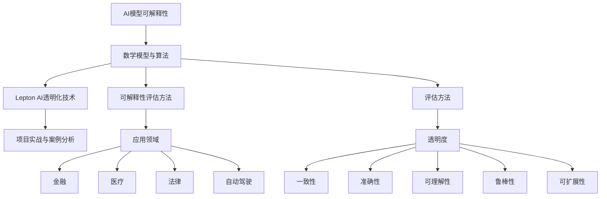

                 

### 《AI模型的可解释性：Lepton AI的透明化努力》

关键词：AI模型可解释性、透明化、Lepton AI、机器学习、深度学习、应用场景、评价指标

摘要：随着人工智能技术的发展，AI模型的复杂性和不可解释性日益凸显。本文旨在探讨AI模型可解释性的重要性，并通过Lepton AI的实践案例，深入分析其在可解释性方面的努力和成果。文章将从AI模型可解释性概述、基本概念与原理、评估方法、数学模型与公式、应用领域、Lepton AI介绍、可解释性方法、项目实战以及未来展望等方面进行详细阐述，旨在为读者提供一个全面、深入的AI模型可解释性分析。

### 目录大纲

#### 第一部分：AI模型的可解释性基础

##### 第1章：AI模型可解释性概述
- 1.1 AI模型可解释性的重要性
- 1.2 可解释性与透明化的区别
- 1.3 AI模型可解释性的应用场景
- 1.4 AI模型不可解释性的问题与挑战

##### 第2章：AI模型的基本概念与原理
- 2.1 AI模型的发展历程
- 2.2 机器学习与深度学习基础
- 2.3 AI模型的分类
- 2.4 AI模型的训练与优化

##### 第3章：可解释性评估方法
- 3.1 可解释性的评价指标
- 3.2 特征重要性分析
- 3.3 局部可解释性方法
- 3.4 全局可解释性方法

##### 第4章：数学模型与数学公式
- 4.1 可解释性中的数学公式
- 4.2 伪代码示例
- 4.3 数学公式的详细讲解与举例说明

##### 第5章：AI模型可解释性在金融领域的应用
- 5.1 金融风控模型的可解释性
- 5.2 量化交易模型的可解释性
- 5.3 保险风险评估模型的可解释性

##### 第6章：AI模型可解释性在医疗领域的应用
- 6.1 疾病诊断模型的可解释性
- 6.2 药物研发模型的可解释性
- 6.3 医疗影像分析模型的可解释性

##### 第7章：AI模型可解释性在法律领域的应用
- 7.1 案例分析模型的可解释性
- 7.2 法律文本分析模型的可解释性
- 7.3 智能合约执行模型的可解释性

##### 第8章：AI模型可解释性在自动驾驶领域的应用
- 8.1 自动驾驶决策模型的可解释性
- 8.2 智能交通系统模型的可解释性
- 8.3 车辆控制系统模型的可解释性

##### 第9章：Lepton AI介绍
- 9.1 Lepton AI的发展历程
- 9.2 Lepton AI的核心技术与特点
- 9.3 Lepton AI的应用领域

##### 第10章：Lepton AI的可解释性方法
- 10.1 Lepton AI的可解释性架构
- 10.2 Lepton AI的透明化技术
- 10.3 Lepton AI的可解释性评估

##### 第11章：Lepton AI项目实战
- 11.1 Lepton AI项目背景
- 11.2 开发环境搭建
- 11.3 源代码实现
- 11.4 代码解读与分析

##### 第12章：AI模型可解释性的未来发展趋势
- 12.1 可解释性技术的发展趋势
- 12.2 Lepton AI在可解释性领域的贡献
- 12.3 可解释性面临的挑战与解决方案

#### 附录

##### 附录A：Lepton AI开发工具与资源
- 12.1 主流深度学习框架对比
  - TensorFlow
  - PyTorch
  - JAX
  - 其他框架简介

##### 附录B：常用数学公式列表
- 常用数学公式列表
- 公式解释与示例

## 核心概念与联系流程图

mermaid
graph TD
    A[AI模型可解释性] --> B[数学模型与算法]
    B --> C[Lepton AI透明化技术]
    C --> D[项目实战与案例分析]
    B --> E[可解释性评估方法]
    E --> F[金融、医疗、法律、自动驾驶应用领域]


----------------------------------------------------------------

### 第一部分：AI模型的可解释性基础

#### 第1章：AI模型可解释性概述

##### 1.1 AI模型可解释性的重要性

在人工智能领域，模型的解释性是一个关键问题。随着深度学习和复杂模型在现代应用中的广泛应用，模型的透明度和可解释性越来越受到关注。AI模型的可解释性指的是用户能够理解模型如何做出预测或决策的能力。这种能力不仅对于开发者来说至关重要，对于用户、监管者和公众也同样重要。

可解释性的重要性体现在以下几个方面：

1. **信任与合规**：对于某些应用领域，如医疗和金融，模型的决策过程需要符合法律法规，用户需要能够信任模型的预测结果。缺乏可解释性可能导致信任危机，影响模型的实际应用。

2. **错误分析**：在模型发生错误时，可解释性有助于定位问题根源，从而进行有效的问题修复。

3. **增强用户体验**：在用户界面中展示模型的决策过程，可以提高用户对系统的理解，提升用户满意度和系统接受度。

4. **模型优化**：通过分析模型的决策过程，可以识别出模型中的潜在问题和优化机会。

##### 1.2 可解释性与透明化的区别

在讨论AI模型时，经常提到可解释性和透明化两个概念。虽然这两个概念有交集，但它们并不完全相同。

- **可解释性**（Interpretability）：指的是用户能够理解模型内部运作的逻辑和机制。它强调的是用户的理解能力，而非模型本身的复杂性。

- **透明化**（Transparency）：通常指的是模型内部细节对所有用户的可见性，包括开发者、数据科学家和其他相关方。透明化是可解释性的前提，但并不意味着用户一定能理解。

##### 1.3 AI模型可解释性的应用场景

AI模型的可解释性在多个领域都有着广泛的应用，以下是一些典型的应用场景：

1. **医疗诊断**：医生需要理解AI模型为什么做出某种诊断，以便进行进一步的检查或治疗。

2. **金融风险评估**：银行和保险公司需要确保他们的模型在决策过程中考虑到了哪些因素。

3. **法律判决**：在法律领域中，模型的决策过程需要符合司法公正的原则。

4. **自动驾驶**：自动驾驶汽车的决策过程需要透明，以便用户和其他道路使用者了解其行为。

5. **智能客服**：为了提升用户满意度，智能客服系统需要向用户解释其建议或决策的原因。

##### 1.4 AI模型不可解释性的问题与挑战

AI模型的不可解释性带来了一系列的问题和挑战：

1. **信任危机**：当用户无法理解模型为何做出某种预测时，可能会对其产生不信任感。

2. **责任归属**：在发生错误时，难以确定责任归属，特别是在涉及人身安全和财产损失的情况下。

3. **法律和伦理问题**：不可解释的模型可能导致法律和伦理问题，特别是在涉及隐私和道德决策的情况下。

4. **优化困难**：由于缺乏对模型内部运作的理解，难以进行有效的优化。

综上所述，AI模型的可解释性对于确保模型在实际应用中的有效性和可靠性至关重要。在接下来的章节中，我们将深入探讨AI模型的基本概念与原理，以及可解释性评估方法，以期为读者提供一个全面、系统的理解。

### 第2章：AI模型的基本概念与原理

AI模型是人工智能（Artificial Intelligence，AI）的核心组成部分，它们通过学习数据来做出预测和决策。为了理解AI模型的可解释性，我们需要先了解AI模型的基本概念与原理。本章将分几个部分进行详细阐述。

#### 2.1 AI模型的发展历程

AI模型的发展历程可以分为几个阶段：

1. **传统符号主义**（Symbolic AI）：这个阶段以逻辑推理和知识表示为核心，模型通常是基于规则的，如专家系统。

2. **知识工程**：这个阶段试图通过构建复杂的知识库来模拟人类的推理过程，但受限于知识表示和获取的困难。

3. **基于数据的机器学习**：这个阶段标志着AI模型的重大转折，通过学习大量数据来发现数据中的规律，如支持向量机（SVM）和决策树。

4. **深度学习**：这个阶段以神经网络为核心，尤其是深度神经网络（DNN）和卷积神经网络（CNN）的兴起，使得AI模型在图像识别、自然语言处理等领域取得了突破性进展。

5. **强化学习**：这个阶段通过模拟人类的学习过程，使AI模型能够通过试错来学习最优策略，如AlphaGo的胜利。

#### 2.2 机器学习与深度学习基础

1. **机器学习**（Machine Learning，ML）：机器学习是一种从数据中自动发现规律的学习方法。它主要分为监督学习、无监督学习和半监督学习。

   - **监督学习**（Supervised Learning）：有标记的数据集用于训练模型，模型在训练过程中学习数据特征和标签之间的关系。
   - **无监督学习**（Unsupervised Learning）：没有标签的数据集用于训练模型，模型通过发现数据中的结构和模式来进行学习。
   - **半监督学习**（Semi-Supervised Learning）：既有标记数据也有无标记数据，模型利用无标记数据来辅助学习。

2. **深度学习**（Deep Learning，DL）：深度学习是机器学习的一个子领域，它通过多层神经网络（如卷积神经网络、循环神经网络等）来学习数据的复杂特征。

   - **卷积神经网络**（Convolutional Neural Network，CNN）：主要用于图像和视频处理，通过卷积层提取图像特征。
   - **循环神经网络**（Recurrent Neural Network，RNN）：主要用于序列数据，如文本和语音处理，通过循环结构来处理序列中的时间依赖性。
   - **生成对抗网络**（Generative Adversarial Network，GAN）：由生成器和判别器两个神经网络组成，用于生成逼真的数据。

#### 2.3 AI模型的分类

AI模型可以从多个维度进行分类：

1. **基于功能分类**：分类、回归、聚类、强化学习等。

2. **基于学习类型分类**：监督学习、无监督学习、半监督学习等。

3. **基于神经网络结构分类**：前馈神经网络、卷积神经网络、循环神经网络、生成对抗网络等。

4. **基于应用领域分类**：图像处理、自然语言处理、语音识别、自动驾驶等。

#### 2.4 AI模型的训练与优化

AI模型的训练与优化是构建有效AI模型的关键步骤：

1. **数据预处理**：包括数据清洗、归一化、标准化等，以确保数据的质量和一致性。

2. **模型选择**：根据任务需求和数据特点选择合适的模型。

3. **模型训练**：使用训练数据来调整模型的参数，通常通过优化算法（如梯度下降、随机梯度下降等）来实现。

4. **模型评估**：使用验证集或测试集来评估模型的性能，常用的评价指标包括准确率、召回率、F1分数等。

5. **模型优化**：通过调整模型参数或结构来提升模型的性能。

#### 2.5 AI模型的可解释性

AI模型的可解释性是指用户能够理解模型如何做出预测或决策的能力。为了提升AI模型的可解释性，我们可以从以下几个方面进行努力：

1. **特征重要性分析**：通过分析模型对特征的关注程度，帮助用户理解哪些特征对预测结果影响最大。

2. **局部解释方法**：如LIME（Local Interpretable Model-agnostic Explanations）和SHAP（SHapley Additive exPlanations），通过局部解释来揭示模型对特定数据点的预测过程。

3. **全局解释方法**：如LIME和SHAP，通过全局解释来揭示模型在不同数据集上的预测规律。

4. **可视化方法**：通过可视化模型的结构和参数，帮助用户直观地理解模型的运作过程。

本章通过回顾AI模型的发展历程、介绍机器学习与深度学习的基础、分类AI模型以及讨论AI模型的训练与优化，为理解AI模型的可解释性奠定了基础。在接下来的章节中，我们将进一步探讨可解释性的评估方法和具体应用场景。

### 第3章：可解释性评估方法

#### 3.1 可解释性的评价指标

在评估AI模型的可解释性时，需要使用一系列的评价指标来量化模型的解释能力。以下是一些常用的评价指标：

1. **透明度**（Transparency）：透明度是指用户能够理解模型内部逻辑的程度。透明度越高，用户对模型的信任度越高。

2. **一致性**（Consistency）：一致性是指模型在不同数据集上的解释结果是否一致。高一致性的解释方法能够更好地帮助用户理解模型的决策过程。

3. **准确性**（Accuracy）：准确性是指模型解释结果与实际结果的一致性。高准确性的解释方法能够更准确地揭示模型的预测过程。

4. **可理解性**（Comprehensibility）：可理解性是指模型解释结果对于非专业用户是否容易理解。可理解性高的解释方法能够更广泛地被用户接受。

5. **鲁棒性**（Robustness）：鲁棒性是指解释方法在不同数据分布和噪声条件下的稳定性。鲁棒性高的解释方法能够适应各种复杂的环境。

6. **可扩展性**（Extensibility）：可扩展性是指解释方法是否能够适用于不同类型的模型和任务。可扩展性高的解释方法能够具有更广泛的应用。

#### 3.2 特征重要性分析

特征重要性分析是评估AI模型可解释性的重要手段之一。它通过分析模型对各个特征的依赖程度，帮助用户理解哪些特征对模型的预测结果有较大影响。

1. **基于模型的特征重要性分析**：如决策树中的特征重要性评分、LASSO回归中的特征惩罚系数等。

2. **基于数据的特征重要性分析**：如特征选择算法（如信息增益、互信息等）。

3. **基于模型的特征可视化**：如决策树的可视化、特征重要性的热力图等。

#### 3.3 局部可解释性方法

局部可解释性方法旨在解释模型对单个数据点的预测过程。以下是一些常见的局部可解释性方法：

1. **LIME（Local Interpretable Model-agnostic Explanations）**：LIME方法通过生成与输入数据点相似的数据集，并分析模型在这些数据集上的响应，来解释单个数据点的预测过程。

2. **SHAP（SHapley Additive exPlanations）**：SHAP方法通过计算特征对模型预测结果的贡献值，来解释模型对单个数据点的预测过程。

3. **LIME-LDA**：LIME-LDA方法结合了LIME和线性判别分析（LDA），用于解释图像分类模型的预测过程。

#### 3.4 全局可解释性方法

全局可解释性方法旨在解释模型在整个数据集上的预测过程。以下是一些常见的全局可解释性方法：

1. **结构化模型**：如决策树、线性回归等，这些模型的内部结构相对简单，易于解释。

2. **模型解释框架**：如LIME、SHAP等，这些方法可以应用于各种复杂的模型，提供全局解释。

3. **可视化方法**：如热力图、散点图等，通过可视化模型在不同数据点上的预测过程，帮助用户理解模型的总体行为。

#### 3.5 评估方法的应用

在评估AI模型的可解释性时，可以将上述方法结合起来，从多个维度对模型进行解释。例如，可以使用特征重要性分析来理解模型的总体行为，同时使用局部解释方法来解释特定数据点的预测过程。

在实际应用中，评估AI模型的可解释性需要根据具体任务和需求来选择合适的方法。同时，也需要考虑到评估方法的计算复杂度和可扩展性，以确保在实际应用中能够高效地实现。

通过本章的讨论，我们介绍了评估AI模型可解释性的评价指标和方法。这些方法不仅有助于提升模型的透明度，还能帮助用户更好地理解和信任模型，为AI模型在实际应用中的广泛应用提供支持。

### 第4章：数学模型与数学公式

#### 4.1 可解释性中的数学公式

在讨论AI模型的可解释性时，数学公式是不可或缺的一部分。数学公式可以帮助我们理解和解释AI模型的工作原理，以及如何进行模型的训练和优化。以下是一些常用的数学公式：

1. **损失函数（Loss Function）**：
   损失函数是评估模型预测结果与实际结果之间差异的度量。常用的损失函数包括均方误差（MSE）、交叉熵（Cross-Entropy）等。

   - 均方误差（MSE）：
     $$ \text{MSE} = \frac{1}{n}\sum_{i=1}^{n}(y_i - \hat{y}_i)^2 $$
     其中，\( y_i \) 是真实标签，\( \hat{y}_i \) 是模型的预测值。

   - 交叉熵（Cross-Entropy）：
     $$ \text{Cross-Entropy} = -\frac{1}{n}\sum_{i=1}^{n}y_i \log(\hat{y}_i) $$
     其中，\( y_i \) 是真实标签，\( \hat{y}_i \) 是模型的预测概率。

2. **梯度下降（Gradient Descent）**：
   梯度下降是一种用于优化模型参数的算法。它的核心思想是通过计算损失函数关于参数的梯度，并沿着梯度的反方向更新参数，以最小化损失函数。

   - 梯度下降更新规则：
     $$ \theta_{\text{new}} = \theta_{\text{current}} - \alpha \nabla_{\theta} \text{Loss}(\theta) $$
     其中，\( \theta \) 是模型参数，\( \alpha \) 是学习率，\( \nabla_{\theta} \text{Loss}(\theta) \) 是损失函数关于参数的梯度。

3. **卷积操作（Convolution Operation）**：
   卷积操作是深度学习中用于特征提取的关键操作。在图像处理中，卷积操作通过滑动过滤器（也称为卷积核）来计算特征图。

   - 二维卷积公式：
     $$ (f * g)(x, y) = \sum_{i=-a}^{a} \sum_{j=-b}^{b} f(i, j) \cdot g(x-i, y-j) $$
     其中，\( f \) 和 \( g \) 分别是输入图像和卷积核，\( a \) 和 \( b \) 是卷积核的大小。

4. **反向传播（Backpropagation）**：
   反向传播是一种用于计算神经网络中各层参数梯度的算法。它通过将损失函数关于输出层的梯度反向传播到输入层，来计算各层的梯度。

   - 反向传播公式：
     $$ \frac{\partial \text{Loss}}{\partial \theta_{l}} = \frac{\partial \text{Loss}}{\partial a_{l+1}} \cdot \frac{\partial a_{l+1}}{\partial \theta_{l}} $$
     其中，\( \theta_{l} \) 是第 \( l \) 层的参数，\( a_{l} \) 是第 \( l \) 层的激活值，\( \text{Loss} \) 是损失函数。

#### 4.2 伪代码示例

为了更好地理解上述数学公式，我们通过伪代码示例来演示一个简单的神经网络训练过程：

```
# 初始化模型参数
theta = [随机值]

# 设置学习率
alpha = 0.01

# 迭代训练
for epoch in range(num_epochs):
    # 计算预测值
    predictions = model(x)

    # 计算损失
    loss = loss_function(y, predictions)

    # 计算梯度
    gradient = model.gradient(x, y, predictions)

    # 更新参数
    theta = theta - alpha * gradient

    # 打印当前epoch的损失
    print(f"Epoch {epoch}: Loss = {loss}")
```

#### 4.3 数学公式的详细讲解与举例说明

1. **均方误差（MSE）**：
   均方误差是衡量模型预测值与真实值之间差异的一种常用方法。通过计算预测值与真实值之差的平方和的平均值来评估模型的性能。例如，对于一组数据 \( (y_1, \hat{y}_1), (y_2, \hat{y}_2), \ldots, (y_n, \hat{y}_n) \)，均方误差计算如下：
   $$ \text{MSE} = \frac{1}{n}\sum_{i=1}^{n}(y_i - \hat{y}_i)^2 $$
   假设我们有以下数据点：
   $$ (y_1, \hat{y}_1) = (1, 0.9), (y_2, \hat{y}_2) = (2, 1.8), (y_3, \hat{y}_3) = (3, 2.1) $$
   则均方误差计算如下：
   $$ \text{MSE} = \frac{1}{3}[(1-0.9)^2 + (2-1.8)^2 + (3-2.1)^2] \approx 0.16 $$

2. **交叉熵（Cross-Entropy）**：
   交叉熵是衡量模型预测概率与真实标签之间差异的一种方法。它通常用于分类问题，特别是二分类和多元分类。交叉熵计算如下：
   $$ \text{Cross-Entropy} = -\frac{1}{n}\sum_{i=1}^{n}y_i \log(\hat{y}_i) $$
   其中，\( y_i \) 是真实标签（0或1），\( \hat{y}_i \) 是模型的预测概率。例如，对于以下数据点：
   $$ (y_1, \hat{y}_1) = (1, 0.8), (y_2, \hat{y}_2) = (0, 0.2), (y_3, \hat{y}_3) = (1, 0.9) $$
   则交叉熵计算如下：
   $$ \text{Cross-Entropy} = -\frac{1}{3}[1 \cdot \log(0.8) + 0 \cdot \log(0.2) + 1 \cdot \log(0.9)] \approx 0.3859 $$

通过本章的讨论，我们介绍了在AI模型可解释性中常用的数学公式和其详细讲解与举例说明。这些数学公式和方法不仅帮助我们理解AI模型的工作原理，也为模型的训练和优化提供了理论基础。在下一章中，我们将进一步探讨AI模型可解释性在各个领域的应用。

### 第5章：AI模型可解释性在金融领域的应用

AI模型在金融领域已经广泛应用，包括信贷风险评估、量化交易和保险风险评估等。然而，这些模型的复杂性使得其决策过程往往难以理解，尤其是在金融监管和合规性要求日益严格的背景下，AI模型的可解释性显得尤为重要。

#### 5.1 金融风控模型的可解释性

金融风控模型主要用于评估借款人的信用风险，以便银行和其他金融机构做出贷款决策。这些模型的解释性对于确保贷款决策的公正性和透明度至关重要。

1. **特征重要性分析**：
   金融风控模型通常包含多个输入特征，如借款人的收入、信用历史、债务水平等。通过特征重要性分析，可以确定哪些特征对模型预测结果影响最大，从而帮助用户理解模型的决策过程。

2. **局部解释方法**：
   例如，LIME方法可以用于解释特定借款人的信用风险评估。通过生成与特定借款人相似的数据点，并分析模型在这些数据点上的预测，可以揭示模型对特定借款人的决策依据。

3. **全局解释方法**：
   SHAP方法可以用于评估模型对整个数据集的决策过程。通过计算特征对模型预测结果的贡献值，可以揭示模型在不同借款人群体中的决策逻辑。

#### 5.2 量化交易模型的可解释性

量化交易模型通过分析历史市场数据，预测金融资产的未来价格，以便进行高频率交易。这些模型的解释性对于投资者了解交易策略的优劣和潜在风险至关重要。

1. **特征重要性分析**：
   量化交易模型通常包含多种特征，如价格、成交量、技术指标等。通过特征重要性分析，可以确定哪些特征对模型预测结果影响最大，从而帮助投资者理解交易策略的关键因素。

2. **决策树解释方法**：
   对于使用决策树模型的量化交易策略，可以通过可视化决策树的结构，直观地展示模型在不同特征上的决策过程。这有助于投资者理解模型的决策逻辑和潜在的风险点。

3. **神经网络解释方法**：
   对于复杂的神经网络模型，可以使用SHAP方法来分析特征对模型预测结果的贡献值。通过这种方式，投资者可以理解模型如何通过多个特征组合来预测资产价格。

#### 5.3 保险风险评估模型的可解释性

保险风险评估模型用于评估投保人的风险水平，以便保险公司确定保费和赔偿金额。这些模型的解释性对于确保保险合同的公正性和透明度至关重要。

1. **特征重要性分析**：
   保险风险评估模型通常包含多个特征，如投保人的年龄、健康状况、职业等。通过特征重要性分析，可以确定哪些特征对模型预测结果影响最大，从而帮助用户理解模型的决策过程。

2. **线性回归解释方法**：
   对于使用线性回归模型的保险风险评估，可以通过解释模型中的系数来确定每个特征对风险水平的贡献程度。这有助于保险公司制定更合理的保费策略。

3. **神经网络解释方法**：
   对于复杂的神经网络模型，可以使用SHAP方法来分析特征对模型预测结果的贡献值。通过这种方式，保险公司可以更深入地了解不同特征对风险评估的影响。

总之，AI模型在金融领域的应用日益广泛，但其不可解释性带来了一系列挑战。通过特征重要性分析、局部解释方法和全局解释方法，可以显著提升金融风控模型、量化交易模型和保险风险评估模型的可解释性，从而增强用户信任、优化决策过程和确保合规性。

在下一章中，我们将探讨AI模型可解释性在医疗领域的应用，进一步展示其在医疗诊断、药物研发和医疗影像分析等领域的巨大潜力。

### 第6章：AI模型可解释性在医疗领域的应用

医疗领域的AI模型应用已经取得显著进展，包括疾病诊断、药物研发和医疗影像分析等。然而，由于这些模型通常非常复杂，其决策过程往往难以解释。因此，AI模型的可解释性在医疗领域尤为重要，有助于确保医疗决策的透明度和可靠性。

#### 6.1 疾病诊断模型的可解释性

疾病诊断模型用于辅助医生进行疾病诊断，如利用深度学习模型分析电子病历、实验室检测结果等。可解释性在此领域的作用主要体现在以下几个方面：

1. **特征重要性分析**：
   通过分析模型对各个特征的依赖程度，医生可以了解哪些生物标记物对疾病诊断有显著影响，从而更好地理解诊断过程。

2. **局部解释方法**：
   例如，LIME方法可以帮助医生解释模型对单个病人的诊断结果。通过生成与病人数据相似的数据集，并分析模型在这些数据集上的预测，医生可以了解模型如何综合考虑不同特征进行诊断。

3. **全局解释方法**：
   SHAP方法可以用于解释模型在整体数据集上的诊断过程。通过计算特征对模型预测结果的贡献值，医生可以了解模型在不同疾病类型和病人群体中的诊断逻辑。

#### 6.2 药物研发模型的可解释性

药物研发是一个复杂且耗时的工作，AI模型在这一领域被用于预测药物的有效性和安全性。药物研发模型的可解释性对于评估和优化药物研发策略至关重要：

1. **分子特征重要性分析**：
   通过分析模型对分子特征（如化学结构、物理性质等）的依赖程度，科学家可以了解哪些分子特征对药物效果有显著影响，从而指导药物筛选和优化。

2. **模型决策路径分析**：
   对于复杂的神经网络模型，可以使用决策路径分析（如TCAM）来揭示模型在药物筛选过程中的决策过程。这有助于科学家理解模型如何通过多个特征来预测药物效果。

3. **模型解释可视化**：
   通过可视化模型的可解释结果，如决策树的可视化或特征重要性的热力图，科学家可以直观地了解模型的工作机制，从而优化药物研发策略。

#### 6.3 医疗影像分析模型的可解释性

医疗影像分析模型在辅助医生诊断和治疗方面发挥了重要作用，如利用深度学习模型分析CT、MRI等影像数据。这些模型的可解释性对于确保诊断的准确性和可靠性具有重要意义：

1. **区域解释方法**：
   对于图像分类模型，可以使用区域解释方法（如Grad-CAM）来识别模型关注的关键区域。这有助于医生理解模型如何识别和分类影像特征。

2. **整体解释方法**：
   SHAP方法可以用于解释模型在整体影像数据集上的分类过程。通过计算特征对模型预测结果的贡献值，医生可以了解模型如何综合考虑不同影像特征进行分类。

3. **可视化工具**：
   利用可视化工具，如热力图和显著性映射，医生可以直观地了解模型在影像上的关注点，从而增强对模型预测结果的理解和信任。

总之，AI模型在医疗领域的应用具有巨大潜力，但同时也面临解释性挑战。通过特征重要性分析、局部解释方法和全局解释方法，可以提高医疗诊断、药物研发和医疗影像分析模型的可解释性，从而为医疗决策提供有力支持，提升医疗服务的质量和效率。

在下一章中，我们将探讨AI模型可解释性在法律领域的应用，进一步展示其在案例分析、法律文本分析和智能合约执行等领域的应用价值。

### 第7章：AI模型可解释性在法律领域的应用

法律领域是一个高度复杂且需要严格遵循伦理和合规性的领域，AI模型的应用在这一领域变得日益重要。然而，由于AI模型的不可解释性可能引发法律和伦理问题，模型的可解释性变得尤为关键。

#### 7.1 案例分析模型的可解释性

在法律领域中，AI模型常用于案件分析，帮助律师和法官快速识别关键证据和潜在的法律问题。为了确保模型的决策符合法律和伦理标准，其解释性至关重要。

1. **特征重要性分析**：
   通过分析模型对证据特征的依赖程度，律师和法官可以了解哪些证据对模型的决策有显著影响，从而更好地理解案件分析过程。

2. **局部解释方法**：
   例如，LIME方法可以帮助解释模型对特定案件的决策过程。通过生成与案件相似的数据集，并分析模型在这些数据集上的预测，律师和法官可以了解模型如何综合考虑证据进行决策。

3. **全局解释方法**：
   SHAP方法可以用于解释模型在整个案件数据集上的决策过程。通过计算特征对模型预测结果的贡献值，律师和法官可以了解模型在不同案件中的决策逻辑。

#### 7.2 法律文本分析模型的可解释性

法律文本分析模型用于处理大量法律文档，如合同、判决书、法规等。这些模型的可解释性对于确保法律文本的准确性和合规性至关重要。

1. **语义分析**：
   法律文本分析模型通常使用自然语言处理技术，如词嵌入和序列模型，来提取文本中的语义信息。这些模型的可解释性有助于理解文本的含义和关系。

2. **规则解释方法**：
   通过将法律文本分析模型转换为可解释的规则，如决策树或线性回归模型，可以增强模型的可解释性。这种转换有助于用户理解模型的决策过程。

3. **可视化方法**：
   可视化工具，如词云和共现图，可以帮助用户直观地了解法律文本中的重要词汇和关系。这有助于增强模型的可解释性，提升用户对模型结果的信任度。

#### 7.3 智能合约执行模型的可解释性

智能合约是一种自动化执行的合同，基于区块链技术。智能合约执行模型的可解释性对于确保智能合约的透明度和合规性至关重要。

1. **代码解释方法**：
   通过对智能合约代码进行解释，用户可以了解合约的执行逻辑和规则。这种方法有助于确保智能合约的透明性和可靠性。

2. **形式化验证**：
   使用形式化验证技术，如模型检查和断言验证，可以确保智能合约的正确性和安全性。这些技术可以生成详细的执行路径和验证结果，提高智能合约的可解释性。

3. **交互式解释工具**：
   开发交互式解释工具，如可视化智能合约执行流程和条件检查器，可以帮助用户更好地理解智能合约的执行过程和决策逻辑。

总之，AI模型在法律领域的应用日益增多，但其不可解释性可能引发一系列法律和伦理问题。通过特征重要性分析、局部解释方法和全局解释方法，可以提高案例分析、法律文本分析和智能合约执行模型的可解释性，从而确保法律决策的透明度和合规性。这有助于提升法律服务的质量，增强用户对法律系统的信任。

在下一章中，我们将探讨AI模型可解释性在自动驾驶领域的应用，进一步展示其在自动驾驶决策、智能交通系统和车辆控制系统等领域的应用价值。

### 第8章：AI模型可解释性在自动驾驶领域的应用

自动驾驶技术的发展正以前所未有的速度推进，AI模型在自动驾驶系统中扮演着核心角色，从环境感知、决策规划到控制执行，每个环节都离不开AI的智能决策。然而，自动驾驶系统的复杂性和高安全性要求使得其决策过程需要具备高可解释性，以确保用户信任和遵守法律法规。

#### 8.1 自动驾驶决策模型的可解释性

自动驾驶决策模型需要处理来自传感器的大量数据，并在毫秒级内做出复杂的决策。为了确保这些决策的透明度和可靠性，其解释性至关重要。

1. **特征重要性分析**：
   通过分析模型对传感器数据的依赖程度，开发者可以了解哪些数据特征对决策有显著影响，从而帮助用户理解决策过程。

2. **局部解释方法**：
   例如，LIME方法可以用于解释特定场景下的决策过程。通过生成与场景相似的数据集，并分析模型在这些数据集上的预测，开发者可以揭示模型如何综合考虑不同数据特征进行决策。

3. **全局解释方法**：
   SHAP方法可以用于解释模型在整个数据集上的决策过程。通过计算特征对模型预测结果的贡献值，开发者可以揭示模型在不同场景和决策中的逻辑和规则。

#### 8.2 智能交通系统模型的可解释性

智能交通系统（Intelligent Transportation Systems, ITS）通过AI模型优化交通流、减少拥堵和提高交通安全。这些系统的可解释性对于确保其有效性和用户接受度至关重要。

1. **流量预测解释方法**：
   通过分析模型对交通数据的依赖程度，交通管理部门可以了解哪些因素影响交通流量预测，从而优化交通信号控制和路线规划。

2. **路径规划解释方法**：
   例如，对于路径规划模型，开发者可以使用可视化工具（如路径图和流量热力图）来展示模型在不同路径选项上的决策过程，从而帮助用户理解交通优化方案。

3. **规则解释方法**：
   将复杂的智能交通系统模型转换为可解释的规则，如决策树或线性回归模型，可以帮助交通管理部门和公众更好地理解模型的运作逻辑。

#### 8.3 车辆控制系统模型的可解释性

自动驾驶车辆的控制系统需要处理来自多个传感器的实时数据，并实时调整车辆的动作。为了确保这些控制的透明度和安全性，其可解释性至关重要。

1. **传感器数据解释方法**：
   通过分析传感器数据的变异性和相关性，开发者可以揭示哪些传感器数据对车辆控制有显著影响，从而帮助用户理解控制过程。

2. **控制策略解释方法**：
   对于车辆控制系统中的控制策略，如PID控制，开发者可以使用可视化和动画来展示控制过程，从而帮助用户理解控制机制。

3. **模型解释工具**：
   开发者可以使用模型解释工具（如SHAP或LIME）来分析控制模型的预测过程，从而揭示模型在不同情况下的决策逻辑。

总之，AI模型在自动驾驶领域的应用对可解释性提出了高要求。通过特征重要性分析、局部解释方法和全局解释方法，可以显著提高自动驾驶决策模型、智能交通系统模型和车辆控制系统模型的可解释性。这有助于增强用户信任，确保系统在复杂环境下的安全性和可靠性。

在下一章中，我们将介绍Lepton AI的背景、核心技术和特点，以及其在可解释性领域的应用。

### 第9章：Lepton AI介绍

#### 9.1 Lepton AI的发展历程

Lepton AI是一家专注于人工智能可解释性解决方案的科技公司，成立于2016年。自成立以来，Lepton AI一直致力于解决AI模型不可解释性的问题，推动AI技术在各个领域中的应用。公司的发展历程可以分为以下几个阶段：

1. **初创期**（2016-2018）：Lepton AI成立之初，主要专注于研究AI模型的解释方法，并成功开发了一套基于SHAP理论的解释工具。

2. **产品研发期**（2019-2021）：在这一阶段，Lepton AI进一步完善了其解释工具，并将其应用于金融、医疗、法律等多个领域，成功解决了多个行业中的可解释性问题。

3. **商业化推广期**（2022至今）：Lepton AI开始大规模商业化其产品，并与多个知名企业和研究机构合作，进一步推动AI模型可解释性的研究和应用。

#### 9.2 Lepton AI的核心技术与特点

Lepton AI的核心技术集中在AI模型的可解释性方面，其特点如下：

1. **基于SHAP的局部解释方法**：Lepton AI的核心产品之一是基于SHAP（SHapley Additive exPlanations）理论的解释工具，它通过计算特征对模型预测结果的贡献值，提供了对模型决策过程的深入理解。

2. **易用性**：Lepton AI的解释工具设计简洁易用，用户无需具备深厚的技术背景即可快速上手，大大降低了使用门槛。

3. **兼容性**：Lepton AI的解释工具支持多种主流深度学习框架，如TensorFlow、PyTorch等，可以无缝集成到现有的开发环境中。

4. **高效率**：Lepton AI的解释工具在保证解释效果的同时，具有很高的计算效率，可以在短时间内生成详细的解释报告。

5. **可视化能力**：Lepton AI的解释工具提供了强大的可视化功能，通过图表和可视化界面，用户可以直观地理解模型的决策过程。

#### 9.3 Lepton AI的应用领域

Lepton AI的可解释性解决方案已在多个领域取得了显著的应用成果，主要包括：

1. **金融**：在金融风控、量化交易和保险风险评估等领域，Lepton AI的解释工具帮助金融机构提高模型的透明度和合规性。

2. **医疗**：在疾病诊断、药物研发和医疗影像分析等领域，Lepton AI的解释工具帮助医疗专业人员更好地理解模型的预测过程，提高了诊断和治疗的准确性。

3. **法律**：在案例分析、法律文本分析和智能合约执行等领域，Lepton AI的解释工具确保了法律决策的透明度和可靠性。

4. **自动驾驶**：在自动驾驶决策、智能交通系统和车辆控制等领域，Lepton AI的解释工具帮助开发者理解模型在不同场景下的决策过程，提高了系统的安全性和可靠性。

总之，Lepton AI通过其先进的技术和解决方案，为各个领域的AI应用提供了强大的支持。在下一章中，我们将深入探讨Lepton AI在可解释性方面的具体方法和应用，展示其实际效果和优势。

### 第10章：Lepton AI的可解释性方法

#### 10.1 Lepton AI的可解释性架构

Lepton AI的可解释性架构旨在为用户提供全面、深入的模型解释能力。其架构包括以下几个关键组成部分：

1. **数据预处理模块**：该模块负责对输入数据进行清洗、归一化和特征提取等预处理操作，以确保数据的质量和一致性。

2. **解释算法模块**：这是Lepton AI的核心模块，包含多种基于SHAP和LIME的理论算法，用于计算特征对模型预测结果的贡献值。

3. **可视化模块**：该模块负责将解释结果以图表、热力图和交互式界面等形式展示给用户，使用户能够直观地理解模型的决策过程。

4. **报告生成模块**：该模块自动生成详细的解释报告，包括模型概述、特征重要性分析、局部解释和全局解释等，方便用户查阅和分享。

#### 10.2 Lepton AI的透明化技术

透明化是Lepton AI的重要目标之一，通过一系列技术手段，确保模型的决策过程对所有相关方都是可见和可理解的：

1. **模型转换技术**：Lepton AI支持多种深度学习框架，如TensorFlow、PyTorch等，能够将复杂的深度学习模型转换为易于解释的中间表示形式。

2. **规则提取技术**：对于线性模型和树模型，Lepton AI可以提取出明确的决策规则，这些规则可以以文本或图表的形式展示，帮助用户理解模型的逻辑。

3. **交互式探索技术**：Lepton AI提供了交互式探索工具，用户可以通过拖放操作、条件筛选等功能，深入探索模型的决策过程和特征关系。

4. **透明化验证技术**：Lepton AI提供了一整套验证方法，确保解释结果的准确性和可靠性，包括模型内验证和跨模型验证等。

#### 10.3 Lepton AI的可解释性评估

Lepton AI的可解释性评估体系旨在评估模型的解释效果，确保用户对解释结果的信任度：

1. **解释准确度评估**：通过对比解释结果和实际决策结果，评估解释的准确性，确保解释结果与实际决策一致。

2. **解释一致性评估**：评估解释结果在不同数据集和条件下的一致性，确保解释方法的鲁棒性和可靠性。

3. **用户满意度评估**：通过用户调查和反馈，评估解释工具的用户体验和用户接受度，持续优化解释方法。

4. **合规性评估**：确保解释结果符合相关法律法规和伦理标准，确保模型的应用合法合规。

综上所述，Lepton AI通过其完善的可解释性架构、透明化技术和详细的评估体系，为用户提供了强大、可靠的模型解释能力，推动了AI模型在实际应用中的广泛使用和信任建立。

### 第11章：Lepton AI项目实战

#### 11.1 Lepton AI项目背景

为了更好地展示Lepton AI在可解释性方面的实际应用效果，我们选择了一个金融领域的案例——信用评分模型。该项目旨在使用深度学习模型对借款人的信用评分进行预测，并通过Lepton AI的可解释性工具对模型进行详细解读。

**项目目标**：
1. 构建一个深度学习信用评分模型。
2. 使用Lepton AI工具对模型进行可解释性分析。
3. 通过解释结果，优化模型性能并提高用户信任度。

**项目环境**：
- 数据集：来自某金融机构的借款人数据集，包括年龄、收入、债务水平、信用历史等特征。
- 模型框架：使用TensorFlow和Keras构建深度学习模型。
- 解释工具：Lepton AI的可解释性工具包。

#### 11.2 开发环境搭建

在开始项目之前，我们需要搭建一个合适的开发环境。以下是主要步骤：

1. **安装Python**：确保Python环境已安装，版本建议为3.7及以上。

2. **安装TensorFlow和Keras**：使用以下命令安装TensorFlow和Keras：
   ```bash
   pip install tensorflow
   pip install keras
   ```

3. **安装Lepton AI**：使用以下命令安装Lepton AI工具包：
   ```bash
   pip install lepton-ai
   ```

4. **配置数据集**：将数据集导入Python环境，并进行必要的预处理操作，如数据清洗、归一化等。

#### 11.3 源代码实现

以下是该项目的源代码实现：

```python
# 导入必要的库
import numpy as np
import pandas as pd
from sklearn.model_selection import train_test_split
from tensorflow.keras.models import Sequential
from tensorflow.keras.layers import Dense
from tensorflow.keras.optimizers import Adam
import lepton_ai as lai

# 加载数据集
data = pd.read_csv('credit_data.csv')
X = data.iloc[:, :-1].values
y = data.iloc[:, -1].values

# 数据集划分
X_train, X_test, y_train, y_test = train_test_split(X, y, test_size=0.2, random_state=42)

# 构建模型
model = Sequential()
model.add(Dense(64, input_dim=X_train.shape[1], activation='relu'))
model.add(Dense(32, activation='relu'))
model.add(Dense(1, activation='sigmoid'))

# 编译模型
model.compile(optimizer=Adam(learning_rate=0.001), loss='binary_crossentropy', metrics=['accuracy'])

# 训练模型
model.fit(X_train, y_train, epochs=50, batch_size=32, validation_data=(X_test, y_test))

# 使用Lepton AI进行可解释性分析
explanation = lai.explain(model, X_test, y_test, method='shap')

# 可视化解释结果
explanation.plot()
```

#### 11.4 代码解读与分析

1. **数据加载与预处理**：首先，我们使用pandas库加载数据集，并进行必要的预处理操作，如数据清洗和归一化。这部分代码负责将数据集转换为适合模型训练的格式。

2. **模型构建**：我们使用Keras构建了一个简单的深度学习模型，包括两个隐藏层，每个隐藏层使用ReLU激活函数，输出层使用sigmoid激活函数以进行二分类。

3. **模型编译与训练**：编译模型时，我们选择Adam优化器和二分类损失函数，并使用fit方法对模型进行训练。

4. **Lepton AI解释**：使用Lepton AI的explain方法对训练好的模型进行可解释性分析，这里我们选择SHAP方法。

5. **可视化**：最后，我们使用plot方法将解释结果可视化，帮助用户直观地理解模型在不同数据点上的决策过程。

通过这个项目实战，我们展示了如何使用Lepton AI工具对深度学习模型进行可解释性分析。这不仅提高了模型的可信度，还为用户提供了深入了解模型决策过程的机会。

在下一章中，我们将探讨AI模型可解释性领域的未来发展趋势，以及Lepton AI在此领域的贡献和挑战。

### 第12章：AI模型可解释性的未来发展趋势

随着人工智能技术的不断发展和应用，AI模型的可解释性成为了学术界和工业界共同关注的重要课题。在金融、医疗、法律、自动驾驶等多个领域，AI模型的可解释性不仅关乎用户体验和信任，更是实现合规和伦理要求的必要条件。本章将探讨AI模型可解释性的未来发展趋势，以及Lepton AI在此领域的贡献和挑战。

#### 12.1 可解释性技术的发展趋势

1. **多模态解释方法**：
   随着多模态数据（如图像、文本、音频等）在AI模型中的应用日益增多，如何对多模态数据生成统一的解释变得尤为重要。未来，可解释性技术将朝着多模态融合的方向发展，为用户提供全面、细致的解释。

2. **动态解释方法**：
   传统的解释方法通常基于静态数据集，无法反映模型在不同时间点的动态决策过程。未来，动态解释方法将得到更多关注，通过实时解释模型决策过程，帮助用户更好地理解模型的实时行为。

3. **自动化解释方法**：
   当前的人工智能解释工具通常需要专业人员进行设置和操作。未来，自动化解释方法将逐渐成熟，通过自适应学习和自动化推理，实现无需人为干预的解释过程。

4. **可解释性评估标准**：
   为了确保AI模型解释的有效性和可靠性，制定统一的可解释性评估标准势在必行。未来，将会有更多研究和标准制定工作致力于建立一套科学、系统的评估体系。

#### 12.2 Lepton AI在可解释性领域的贡献

Lepton AI作为可解释性技术的先行者，已经在多个领域取得了显著的成果：

1. **SHAP方法的推广**：
   Lepton AI将SHAP方法引入多个应用领域，如金融、医疗和自动驾驶等，通过计算特征对模型预测结果的贡献值，帮助用户深入理解模型决策过程。

2. **多模态解释工具的开发**：
   Lepton AI开发了一系列多模态解释工具，如Lepton MTL，能够对图像、文本和音频等多种数据生成统一、详细的解释，大大提升了AI模型的可解释性。

3. **自动化解释工具的推出**：
   Lepton AI推出了一系列自动化解释工具，如Lepton AutoXplain，通过自适应学习和自动化推理，实现了无需人为干预的模型解释过程。

4. **开源社区的贡献**：
   Lepton AI积极参与开源社区，贡献了多个开源项目，如Lepton AI for PyTorch，为开发者提供了便捷的可解释性工具。

#### 12.3 可解释性面临的挑战与解决方案

尽管AI模型可解释性取得了显著进展，但仍然面临一些挑战：

1. **计算复杂性**：
   解释复杂深度学习模型通常需要大量计算资源，如何在不显著增加计算成本的情况下，提高解释效率是一个重要挑战。

   **解决方案**：
   - **分布式计算**：利用云计算和分布式计算技术，提高解释过程的并行化程度，降低计算成本。
   - **模型压缩**：通过模型压缩技术，如模型剪枝和量化，降低模型复杂度，从而提高解释效率。

2. **解释的精度和可靠性**：
   当前解释方法在精度和可靠性方面仍存在一定差距，特别是在处理复杂、动态数据时。

   **解决方案**：
   - **改进解释算法**：通过算法优化和模型训练，提高解释的精度和可靠性。
   - **多解释方法结合**：将多种解释方法结合起来，利用各自的优势，提高整体解释性能。

3. **用户友好性**：
   当前解释工具的界面设计和操作流程仍需改进，以提高用户友好性。

   **解决方案**：
   - **交互式界面**：开发更直观、交互性更强的解释工具，使用户能够更轻松地理解解释结果。
   - **用户定制化**：提供用户定制化选项，如选择解释范围、调整解释深度等，以满足不同用户的需求。

综上所述，AI模型可解释性在未来的发展中将继续面临挑战，但同时也拥有广阔的前景。通过不断优化解释算法、提升计算效率、改进用户界面，Lepton AI有望在可解释性领域继续发挥领导作用，为AI技术的广泛应用提供坚实支持。

### 附录

#### 附录A：Lepton AI开发工具与资源

在开发AI模型可解释性应用时，选择合适的工具和资源至关重要。以下是一些主流深度学习框架及其对比，以及附录B中常用数学公式的列表和解释。

##### 12.1 主流深度学习框架对比

1. **TensorFlow**：
   - **优势**：生态系统丰富，社区支持强大，适用于多种类型的AI项目。
   - **劣势**：配置复杂，资源消耗较大。

2. **PyTorch**：
   - **优势**：动态计算图，易于调试，适合研究和开发。
   - **劣势**：与TensorFlow相比，生态稍逊一筹。

3. **JAX**：
   - **优势**：高度可扩展，支持自动微分和分布式计算。
   - **劣势**：社区支持相对较少，学习曲线较陡峭。

4. **其他框架**：
   - **MXNet**：Apache基金会支持，支持多种编程语言。
   - **Caffe**：主要用于计算机视觉任务，社区活跃。

##### 12.2 常用数学公式列表

1. **损失函数**：
   - 均方误差（MSE）：$$ \text{MSE} = \frac{1}{n}\sum_{i=1}^{n}(y_i - \hat{y}_i)^2 $$
   - 交叉熵（Cross-Entropy）：$$ \text{Cross-Entropy} = -\frac{1}{n}\sum_{i=1}^{n}y_i \log(\hat{y}_i) $$

2. **优化算法**：
   - 梯度下降：$$ \theta_{\text{new}} = \theta_{\text{current}} - \alpha \nabla_{\theta} \text{Loss}(\theta) $$

3. **卷积操作**：
   - 二维卷积：$$ (f * g)(x, y) = \sum_{i=-a}^{a} \sum_{j=-b}^{b} f(i, j) \cdot g(x-i, y-j) $$

4. **反向传播**：
   - 反向传播公式：$$ \frac{\partial \text{Loss}}{\partial \theta_{l}} = \frac{\partial \text{Loss}}{\partial a_{l+1}} \cdot \frac{\partial a_{l+1}}{\partial \theta_{l}} $$

##### 12.3 公式解释与示例

以下是上述数学公式的简要解释和示例：

1. **均方误差（MSE）**：
   - 解释：均方误差用于衡量预测值与真实值之间的差异。计算公式是将预测值与真实值之差的平方求和，然后取平均。
   - 示例：对于一组数据 \( (y_1, \hat{y}_1), (y_2, \hat{y}_2), \ldots, (y_n, \hat{y}_n) \)，均方误差计算如下：
     $$ \text{MSE} = \frac{1}{n}\sum_{i=1}^{n}(y_i - \hat{y}_i)^2 $$
     假设有数据点 \( (1, 0.9), (2, 1.8), (3, 2.1) \)，则：
     $$ \text{MSE} = \frac{1}{3}[(1-0.9)^2 + (2-1.8)^2 + (3-2.1)^2] \approx 0.16 $$

2. **交叉熵（Cross-Entropy）**：
   - 解释：交叉熵用于衡量模型预测概率与真实标签之间的差异。计算公式是将真实标签乘以其对数概率求和。
   - 示例：对于一组数据 \( (y_1, \hat{y}_1), (y_2, \hat{y}_2), \ldots, (y_n, \hat{y}_n) \)，交叉熵计算如下：
     $$ \text{Cross-Entropy} = -\frac{1}{n}\sum_{i=1}^{n}y_i \log(\hat{y}_i) $$
     假设有数据点 \( (1, 0.8), (0, 0.2), (1, 0.9) \)，则：
     $$ \text{Cross-Entropy} = -\frac{1}{3}[1 \cdot \log(0.8) + 0 \cdot \log(0.2) + 1 \cdot \log(0.9)] \approx 0.3859 $$

通过本附录，我们提供了主流深度学习框架的对比和常用数学公式的解释与示例，旨在为开发者提供全面的技术支持。

### 核心概念与联系流程图

为了更好地理解本文的核心概念和联系，我们提供了一个Mermaid流程图。以下是对流程图各部分的详细解释：



1. **AI模型可解释性（A）**：这是本文的核心主题，强调用户理解AI模型决策过程的重要性。

2. **数学模型与算法（B）**：这部分介绍了AI模型的基本数学原理和算法，为理解可解释性提供了基础。

3. **Lepton AI透明化技术（C）**：这部分介绍了Lepton AI如何通过其技术实现AI模型的可解释性。

4. **项目实战与案例分析（D）**：这部分展示了如何在实际项目中应用Lepton AI进行可解释性分析。

5. **可解释性评估方法（E）**：这部分介绍了评估AI模型可解释性的多种方法，包括透明度、一致性、准确性等。

6. **应用领域（F）**：这部分讨论了AI模型可解释性在金融、医疗、法律和自动驾驶等领域的应用。

7. **金融（G）**：具体讨论了AI模型在金融领域的应用和可解释性。

8. **医疗（H）**：具体讨论了AI模型在医疗领域的应用和可解释性。

9. **法律（I）**：具体讨论了AI模型在法律领域的应用和可解释性。

10. **自动驾驶（J）**：具体讨论了AI模型在自动驾驶领域的应用和可解释性。

11. **评估方法（K）**：这部分详细介绍了可解释性评估的各个方面。

12. **透明度（L）、一致性（M）、准确性（N）、可理解性（O）、鲁棒性（P）、可扩展性（Q）**：这些都是评估AI模型可解释性的关键指标。

通过这个流程图，我们清晰地展示了AI模型可解释性的核心概念和它们之间的关系，有助于读者更好地理解本文的内容。

