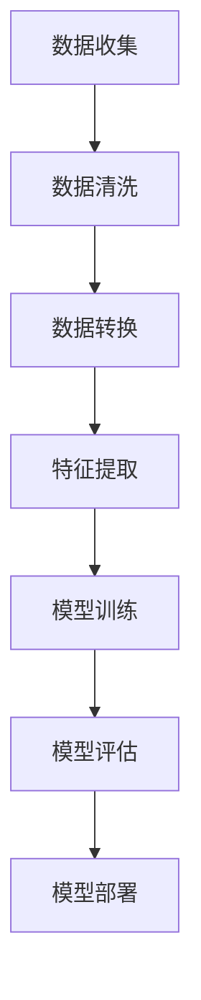
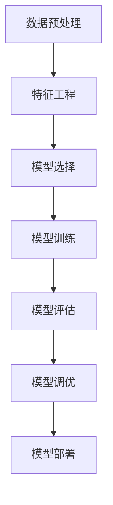

                 

# 《AI辅助财务分析：提示词解读财务报表》

> **关键词：** AI辅助财务分析、财务报表、提示词、机器学习、数据预处理、风险分析、投资决策、财务报告。

> **摘要：** 本文将深入探讨AI辅助财务分析的应用，包括财务报表的解读、利润预测、财务风险分析以及投资决策。通过结合实际案例和详细的算法解析，我们旨在帮助读者理解AI在财务领域的巨大潜力。

## 目录

1. [AI辅助财务分析基础](#ai辅助财务分析基础)
   1. [AI在财务领域的应用](#ai在财务领域的应用)
   2. [财务报表的重要性](#财务报表的重要性)
   3. [提示词在财务分析中的应用](#提示词在财务分析中的应用)
2. [AI辅助财务分析的基本原理](#ai辅助财务分析的基本原理)
   1. [机器学习在财务分析中的应用](#机器学习在财务分析中的应用)
   2. [数据预处理方法](#数据预处理方法)
   3. [提示词生成算法](#提示词生成算法)
3. [财务报表解读](#财务报表解读)
   1. [财务报表的基本概念](#财务报表的基本概念)
   2. [利润表解读](#利润表解读)
   3. [资产负债表解读](#资产负债表解读)
   4. [现金流量表解读](#现金流量表解读)
4. [AI辅助财务分析实战](#ai辅助财务分析实战)
   1. [利润预测](#利润预测)
   2. [财务风险分析](#财务风险分析)
   3. [投资决策分析](#投资决策分析)
   4. [财务分析报告撰写](#财务分析报告撰写)
5. [AI辅助财务分析工具与技术](#ai辅助财务分析工具与技术)
   1. [AI辅助财务分析工具](#ai辅助财务分析工具)
   2. [AI辅助财务分析的技术实现](#ai辅助财务分析的技术实现)
6. [未来展望](#未来展望)
7. [附录](#附录)
   1. [AI辅助财务分析相关资源](#ai辅助财务分析相关资源)
   2. [Mermaid流程图](#mermaid流程图)
   3. [伪代码与数学公式](#伪代码与数学公式)
   4. [实际案例解析](#实际案例解析)

## AI辅助财务分析基础

### AI在财务领域的应用

人工智能（AI）正迅速改变着财务分析的面貌。传统的财务分析方法依赖于人工编制的报表和大量的计算，而AI的出现使得财务分析变得更加高效和准确。以下是AI在财务领域的一些主要应用：

1. **自动化报表生成**：AI可以通过自然语言处理（NLP）技术自动生成财务报表，减少人工输入和错误。
2. **实时数据分析**：利用机器学习算法，AI可以实时分析大量的财务数据，提供即时的业务洞察。
3. **预测分析**：AI可以帮助企业预测未来的财务状况，如利润预测、现金流预测等。
4. **风险分析**：通过模式识别和预测模型，AI可以检测潜在的财务风险，并提供风险评估报告。
5. **投资决策支持**：AI可以分析市场数据和历史投资组合，为投资决策提供支持。

### 财务报表的重要性

财务报表是企业运营状况的直接反映，对于投资者、管理层和监管机构都是至关重要的。以下是财务报表的主要类型和作用：

1. **利润表**：反映企业的收入、成本和利润，帮助分析企业的盈利能力。
2. **资产负债表**：展示企业的资产、负债和所有者权益，帮助评估企业的财务状况。
3. **现金流量表**：记录企业的现金流入和流出，帮助分析企业的现金流状况。
4. **附注**：提供对财务报表的补充说明，帮助理解报表背后的细节。

### 提示词在财务分析中的应用

提示词（Keywords）在AI辅助财务分析中起着关键作用。通过识别和提取关键提示词，AI可以更有效地理解和处理财务数据。以下是提示词在财务分析中的几个应用场景：

1. **报表生成**：AI可以根据预设的提示词生成财务报表，如“利润表”、“资产负债表”等。
2. **数据分类**：AI可以使用提示词将财务数据分类到相应的报表中，如“销售收入”分类到利润表中。
3. **文本分析**：AI可以使用NLP技术分析财务报告中的文本，提取关键信息，如“利润下降”、“现金流紧张”等。
4. **风险识别**：AI可以通过分析财务报表中的提示词，识别潜在的风险信号，如“应收账款增加”、“债务违约”等。

## AI辅助财务分析的基本原理

### 机器学习在财务分析中的应用

机器学习是AI的核心技术之一，它在财务分析中有着广泛的应用。以下是机器学习在财务分析中的一些应用：

1. **分类任务**：通过监督学习算法，AI可以对财务数据进行分类，如将支出分为运营成本、研发费用等。
2. **回归任务**：通过回归算法，AI可以预测财务指标，如利润、现金流等。
3. **聚类任务**：通过无监督学习算法，AI可以分析财务数据中的模式，如不同的业务板块、客户群体等。
4. **时间序列分析**：通过时间序列模型，AI可以预测未来的财务趋势，如销售量、股价等。

### 数据预处理方法

在机器学习模型训练之前，数据预处理是至关重要的一步。以下是常用的数据预处理方法：

1. **数据清洗**：去除重复数据、纠正错误数据、处理缺失数据。
2. **数据集成**：将来自不同源的数据合并成一个统一的格式。
3. **数据转换**：将数据转换成模型可以接受的格式，如归一化、标准化等。
4. **特征提取**：从原始数据中提取有用的特征，以提高模型的性能。

### 提示词生成算法

提示词生成算法是AI辅助财务分析的核心算法之一。以下是几种常见的提示词生成算法：

1. **词袋模型（Bag of Words, BoW）**：将文本转换为词汇表，并计算每个词汇的频率。
2. **TF-IDF模型**：基于词袋模型，同时考虑词汇的重要性和普遍性。
3. **词嵌入（Word Embedding）**：将词汇映射到高维空间，以捕捉词汇之间的语义关系。
4. **BERT模型**：基于Transformer架构，能够捕捉长文本中的复杂语义关系。

## 财务报表解读

### 财务报表的基本概念

财务报表是反映企业财务状况、经营成果和现金流动的重要文件。以下是财务报表的基本概念：

1. **财务报表**：包括利润表、资产负债表、现金流量表和附注。
2. **利润表**：反映企业在一定时间内的收入、成本和利润。
3. **资产负债表**：展示企业在一定时间点的资产、负债和所有者权益。
4. **现金流量表**：记录企业在一定时间内的现金流入和流出。
5. **附注**：提供对财务报表的补充说明，如会计政策、重大交易等。

### 利润表解读

利润表是反映企业盈利能力的重要报表。以下是利润表的主要部分及其解读：

1. **营业收入**：企业主要业务的收入。
2. **营业成本**：与营业收入相对应的成本。
3. **营业利润**：营业收入减去营业成本后的利润。
4. **税前利润**：营业利润加上其他收入和支出后的利润。
5. **净利润**：税前利润减去所得税后的利润。

### 资产负债表解读

资产负债表是反映企业财务状况的静态报表。以下是资产负债表的主要部分及其解读：

1. **资产**：企业的资源，如现金、存货、固定资产等。
2. **负债**：企业需要偿还的债务，如应付账款、长期借款等。
3. **所有者权益**：企业的净资产，即资产减去负债后的余额。
4. **流动资产**：一年内可以变现的资产，如现金、存货等。
5. **非流动资产**：一年内不能变现的资产，如固定资产、长期投资等。

### 现金流量表解读

现金流量表是反映企业现金流状况的重要报表。以下是现金流量表的主要部分及其解读：

1. **经营活动现金流量**：企业日常运营活动产生的现金流量，如销售商品、提供服务等。
2. **投资活动现金流量**：企业投资活动产生的现金流量，如购买或出售资产。
3. **筹资活动现金流量**：企业筹资活动产生的现金流量，如发行股票、偿还债务等。
4. **现金及现金等价物净增加额**：企业现金及现金等价物的净增加额。

## AI辅助财务分析实战

### 利润预测

利润预测是企业制定战略计划的重要依据。以下是利润预测的基本方法和案例解析：

1. **时间序列模型**：如ARIMA模型，用于预测未来的利润。
   ```mermaid
   graph TD
   A[ARIMA模型] --> B[时间序列分解]
   B --> C[自回归]
   C --> D[移动平均]
   D --> E[差分]
   ```

2. **回归模型**：如线性回归，用于预测利润与相关变量之间的关系。
   ```mermaid
   graph TD
   A[线性回归] --> B[X变量]
   B --> C[Y变量]
   C --> D[预测]
   ```

### 财务风险分析

财务风险分析是评估企业财务状况稳定性的重要手段。以下是财务风险分析的方法和应用案例：

1. **财务比率分析**：如流动比率、速动比率等，用于评估企业的偿债能力。
   ```mermaid
   graph TD
   A[流动比率] --> B[流动资产]
   B --> C[流动负债]
   C --> D[财务稳定性]
   ```

2. **蒙特卡罗模拟**：用于评估企业的财务风险，如违约概率。
   ```mermaid
   graph TD
   A[蒙特卡罗模拟] --> B[随机过程]
   B --> C[概率分布]
   C --> D[风险评估]
   ```

### 投资决策分析

投资决策分析是企业投资决策的重要依据。以下是投资决策分析的基本原则和算法：

1. **净现值（NPV）**：用于评估投资项目是否值得投资。
   ```math
   NPV = \sum_{t=0}^{n} \frac{CF_t}{(1+r)^t}
   ```

2. **内部收益率（IRR）**：用于评估投资项目的收益率。
   ```math
   IRR = \text{使} NPV = 0 \text{的贴现率}
   ```

### 财务分析报告撰写

财务分析报告是总结企业财务状况的重要文件。以下是财务分析报告的结构和撰写技巧：

1. **结构**：
   - 摘要
   - 财务状况分析
   - 利润状况分析
   - 现金流状况分析
   - 风险分析
   - 投资建议

2. **技巧**：
   - 数据可视化：使用图表和图形展示财务数据，使报告更加直观。
   - 对比分析：对比不同时间段的财务数据，分析企业的变化趋势。
   - 深入分析：对关键指标进行详细解释和解读，提供专业见解。

### 利润预测案例

假设我们要预测某公司下一季度的利润，可以使用时间序列模型中的ARIMA模型。以下是具体的实现步骤：

1. **数据收集**：收集公司过去四季度的利润数据。
2. **数据预处理**：对数据进行清洗和转换，使其符合ARIMA模型的输入要求。
3. **模型训练**：使用历史数据训练ARIMA模型。
4. **模型评估**：使用交叉验证评估模型的准确性。
5. **利润预测**：使用训练好的模型预测下一季度的利润。

### 财务风险分析案例

假设我们要分析某公司的财务风险，可以使用财务比率分析和蒙特卡罗模拟。以下是具体的实现步骤：

1. **数据收集**：收集公司的资产负债表和利润表数据。
2. **财务比率计算**：计算公司的流动比率和速动比率。
3. **蒙特卡罗模拟**：使用模拟技术评估公司的违约概率。
4. **风险分析**：根据计算结果分析公司的财务风险。

### 投资决策分析案例

假设我们要评估某投资项目的投资决策，可以使用净现值（NPV）和内部收益率（IRR）。以下是具体的实现步骤：

1. **数据收集**：收集项目的现金流量数据。
2. **净现值计算**：计算项目的净现值，判断是否值得投资。
3. **内部收益率计算**：计算项目的内部收益率，评估投资回报。
4. **投资决策**：根据计算结果做出投资决策。

### 财务分析报告案例

假设我们要撰写一份财务分析报告，以下是具体的结构：

1. **摘要**：简要介绍公司的财务状况和经营成果。
2. **财务状况分析**：分析公司的资产负债表和利润表，评估其财务稳定性。
3. **利润状况分析**：分析公司的收入、成本和利润，评估其盈利能力。
4. **现金流状况分析**：分析公司的现金流量表，评估其现金流状况。
5. **风险分析**：分析公司的财务风险，如债务水平和违约风险。
6. **投资建议**：根据分析结果提出投资建议，如增加投资或缩减开支。

## AI辅助财务分析工具与技术

### AI辅助财务分析工具

在AI辅助财务分析中，有许多工具可以用来提高分析的效率和准确性。以下是几种常用的AI辅助财务分析工具：

1. **Excel**：虽然Excel不是AI工具，但它是进行财务分析的基础工具，可以用于数据整理、计算和报表生成。
2. **Tableau**：一款强大的数据可视化工具，可以用来展示财务数据，帮助用户更好地理解数据。
3. **Power BI**：与Excel类似，Power BI也是一款数据可视化工具，但它提供了更丰富的可视化选项和分析功能。
4. **OpenAI的GPT-3**：一款基于Transformer架构的自然语言处理模型，可以用于文本分析，提取财务报告中的关键信息。
5. **TensorFlow**：一款开源的深度学习框架，可以用于构建和训练机器学习模型，进行财务预测和分析。

### 数据收集与处理

数据收集与处理是AI辅助财务分析的重要步骤。以下是数据收集与处理的方法：

1. **数据收集**：可以从企业内部数据库、公开财务报告、市场数据源等多个渠道收集财务数据。
2. **数据清洗**：去除重复数据、纠正错误数据、处理缺失数据，确保数据的准确性和完整性。
3. **数据转换**：将数据转换为统一的格式，如CSV、JSON等，以便于模型处理。
4. **特征提取**：从原始数据中提取有用的特征，如财务指标、市场变量等，用于模型训练。

### 特征工程

特征工程是AI辅助财务分析的关键步骤，它涉及从原始数据中提取和构造有用的特征，以提高模型的性能。以下是特征工程的方法：

1. **统计特征**：如平均值、标准差、最大值、最小值等，用于描述数据的基本统计特征。
2. **时序特征**：如滞后特征、移动平均特征等，用于捕捉时间序列数据中的趋势和周期性。
3. **文本特征**：如词频、TF-IDF、词嵌入等，用于分析财务报告中的文本数据。
4. **组合特征**：将多个特征组合成新的特征，以提高模型的预测能力。

### 模型训练与评估

模型训练与评估是AI辅助财务分析的核心步骤。以下是模型训练与评估的方法：

1. **模型选择**：根据问题的特点选择合适的模型，如线性回归、决策树、神经网络等。
2. **模型训练**：使用训练数据集训练模型，调整模型参数，使其达到最佳性能。
3. **模型评估**：使用验证数据集和测试数据集评估模型性能，如准确率、召回率、F1分数等。
4. **模型调优**：根据评估结果调整模型参数，优化模型性能。

### 模型部署与维护

模型部署与维护是AI辅助财务分析的最后一步。以下是模型部署与维护的方法：

1. **模型部署**：将训练好的模型部署到生产环境中，使其能够实时处理财务数据。
2. **模型监控**：监控模型的性能和稳定性，及时发现并处理问题。
3. **模型更新**：定期更新模型，以适应新的数据和环境。
4. **模型迭代**：根据业务需求和模型性能，不断迭代和优化模型。

## 未来展望

随着AI技术的发展，AI辅助财务分析将面临更多的机遇和挑战。以下是未来展望：

1. **深度学习的发展**：深度学习技术的不断进步将为财务分析提供更强大的工具和模型。
2. **实时分析的应用**：实时数据分析将使得财务分析更加迅速和准确，为企业提供更及时的决策支持。
3. **区块链技术的结合**：区块链技术可以确保财务数据的真实性和完整性，提高财务分析的可靠性。
4. **多模态数据分析**：结合文本、图像、声音等多种数据源，将实现更全面和深入的财务分析。
5. **隐私保护的挑战**：在数据隐私保护方面，如何确保数据安全和用户隐私将成为重要的挑战。

## 附录

### AI辅助财务分析相关资源

为了帮助读者更深入地了解AI辅助财务分析，我们推荐以下资源：

1. **学术论文**：
   - [1] James, G., Witten, D., Hastie, T., & Tibshirani, R. (2013). *An Introduction to Statistical Learning*.
   - [2] Goodfellow, I., Bengio, Y., & Courville, A. (2016). *Deep Learning*.

2. **开源代码与数据集**：
   - [1] Kaggle：提供大量的财务数据集和比赛。
   - [2] GitHub：有大量的AI辅助财务分析的开源项目。

3. **财务分析工具介绍**：
   - [1] Excel：基础的数据分析和报表生成工具。
   - [2] Tableau：强大的数据可视化工具。
   - [3] Power BI：与Excel类似，提供更多的分析功能。

### Mermaid流程图

以下是财务分析流程图和机器学习模型训练流程图的示例：





### 伪代码与数学公式

以下是数据预处理、特征工程和模型训练的伪代码示例，以及数学公式解析：

```python
# 数据预处理伪代码
def preprocess_data(data):
    data = remove_duplicates(data)
    data = correct_errors(data)
    data = handle_missing_data(data)
    return data

# 特征工程伪代码
def feature_engineering(data):
    data = calculate_statistical_features(data)
    data = create_time_series_features(data)
    data = extract_textual_features(data)
    return data

# 模型训练伪代码
def train_model(data):
    model = select_model()
    model = fit_model(model, data)
    model = evaluate_model(model, data)
    return model
```

```latex
% 数据预处理数学公式
NPV = \sum_{t=0}^{n} \frac{CF_t}{(1+r)^t}

% 特征工程数学公式
W = \frac{TF \times IDF}{max(TF, IDF)}

% 模型训练数学公式
J(\theta) = -\frac{1}{m} \sum_{i=1}^{m} [y^{(i)} \log(h_\theta(x^{(i)})) + (1 - y^{(i)}) \log(1 - h_\theta(x^{(i)}))]
```

### 实际案例解析

以下是利润预测、财务风险分析和投资决策分析的案例解析：

#### 利润预测案例

1. **数据收集**：收集某公司过去三年的季度利润数据。
2. **数据预处理**：清洗数据，处理缺失值。
3. **特征提取**：提取时间序列特征，如滞后利润。
4. **模型选择**：选择ARIMA模型。
5. **模型训练**：使用历史数据训练模型。
6. **模型评估**：使用交叉验证评估模型。
7. **利润预测**：使用训练好的模型预测下一季度的利润。

#### 财务风险分析案例

1. **数据收集**：收集某公司的资产负债表和利润表数据。
2. **财务比率计算**：计算流动比率和速动比率。
3. **蒙特卡罗模拟**：模拟公司的违约概率。
4. **风险分析**：分析公司的财务风险。
5. **报告撰写**：撰写风险分析报告。

#### 投资决策分析案例

1. **数据收集**：收集某投资项目的现金流量数据。
2. **净现值计算**：计算投资项目的净现值。
3. **内部收益率计算**：计算投资项目的内部收益率。
4. **投资决策**：根据净现值和内部收益率做出投资决策。
5. **报告撰写**：撰写投资决策报告。

### 作者信息

作者：AI天才研究院/AI Genius Institute & 禅与计算机程序设计艺术 /Zen And The Art of Computer Programming

## 结语

AI辅助财务分析正在改变传统的财务分析方法，为企业提供更高效、准确的财务洞察。通过本文的探讨，我们了解了AI辅助财务分析的基础、实战应用、工具与技术，以及未来的发展趋势。希望本文能为读者提供有价值的参考，帮助您更好地理解和应用AI辅助财务分析。感谢您的阅读！

