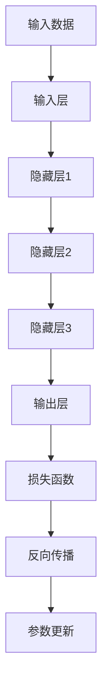
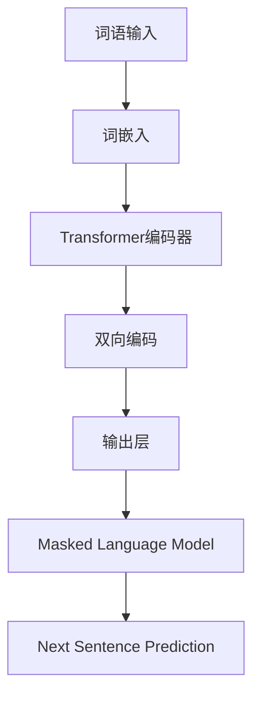
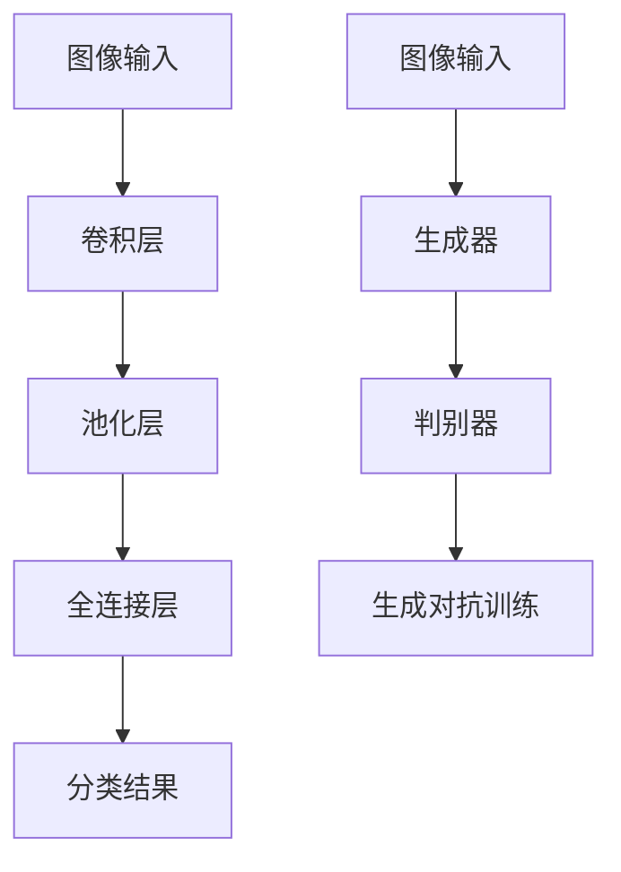

                 

# 引言

## 《李开复：AI 2.0 时代的挑战》

人工智能（AI）作为当今科技领域最具革命性的力量，正在深刻地改变着我们的生活方式、工作模式和社会结构。自AI 1.0时代以来，AI技术取得了巨大的进步，从简单的规则系统发展到复杂的深度学习和强化学习，从而实现了前所未有的自动化和智能化。然而，随着AI技术的不断成熟，我们正迈入一个全新的AI 2.0时代。在这个时代，AI将不仅仅是工具，它将更加融入我们的日常生活，成为我们生活的核心组成部分。

李开复博士，作为世界知名的AI专家和创业家，对于AI的未来发展有着深刻的洞察和独特的见解。他的最新著作《AI 2.0时代的挑战》为我们揭示了AI 2.0时代的全貌，详细分析了这一时代所带来的技术革新、社会变革以及面临的诸多挑战。

本文将基于李开复博士的观点，以逻辑清晰、结构紧凑的方式，逐步探讨AI 2.0时代的核心概念、技术基础、应用领域、挑战与应对策略，以及未来的发展趋势。通过本文的探讨，我们希望能够帮助读者更全面、深入地理解AI 2.0时代，从而为未来的技术决策和社会发展提供有益的参考。

### 关键词

- AI 2.0
- 人工智能革命
- 深度学习
- 自然语言处理
- 计算机视觉
- 数据隐私与安全
- 法律与伦理问题
- 教育与就业

### 摘要

本文旨在全面探讨AI 2.0时代的挑战与机遇。AI 2.0时代，以深度学习和自然语言处理为代表的技术取得了重大突破，使AI实现了更高层次的智能化。本文首先概述了AI 2.0的定义与背景，探讨了其技术基础和应用领域。接着，深入分析了AI 2.0时代面临的重大挑战，包括数据隐私与安全、法律与伦理问题以及教育与就业的影响。最后，展望了AI 2.0时代的未来发展，提出了个人行动指南和结论。本文旨在为读者提供一份全面、深入的AI 2.0时代研究报告，帮助读者更好地理解这一时代的变革与机遇。

## 第一部分: AI 2.0 时代概述

### 第1章: AI 2.0 的定义与背景

#### 1.1 AI 2.0 的定义

AI 2.0，即第二代人工智能，是相对于第一代人工智能（AI 1.0）而言的概念。AI 1.0主要基于专家系统和规则引擎，通过预设的规则和逻辑进行推理和决策。而AI 2.0则主要基于深度学习、强化学习等先进算法，具有自我学习和自我进化的能力，能够从大量数据中自动提取规律，进行智能化的决策和行动。

**AI 2.0** 与 **AI 1.0** 的比较：
- **学习方式**：AI 1.0依赖于人类专家预设的规则，而AI 2.0则通过自我学习和自我进化，实现自主学习。
- **智能水平**：AI 1.0只能处理简单的、规则明确的任务，而AI 2.0能够处理复杂的、多变的任务，具备更高级的智能。
- **应用范围**：AI 1.0主要应用于特定领域，如医学诊断、金融分析等，而AI 2.0的应用范围更广，包括工业、农业、金融等多个领域。

**AI 2.0** 的发展历程：
- **1980年代**：AI 1.0开始出现，主要基于规则系统。
- **2006年**：深度学习算法提出，标志着AI 2.0时代的开始。
- **2012年**：深度学习在图像识别任务上取得突破性成果，AI 2.0开始崭露头角。
- **至今**：AI 2.0技术不断成熟，应用领域持续拓展，正在逐渐融入我们的日常生活。

### 1.2 AI 2.0 的背景

AI 2.0的出现并非偶然，而是科技进步和社会发展的必然结果。以下三个方面是AI 2.0发展的关键背景：

**AI** 技术的进步：
- **深度学习**：深度学习算法的出现，使计算机具备了从大量数据中自动提取特征的能力，为AI 2.0的发展奠定了基础。
- **强化学习**：强化学习算法通过奖励和惩罚机制，使计算机能够在复杂的动态环境中进行自我学习和决策，进一步提升了AI的能力。

**大数据** 时代的来临：
- **数据量的增长**：随着物联网、社交媒体等技术的发展，数据量呈指数级增长，为AI提供了丰富的训练数据。
- **数据质量的提升**：数据采集和处理技术的进步，使得数据质量得到显著提升，为AI模型的训练提供了更好的数据基础。

**计算能力** 的提升：
- **硬件性能的提升**：GPU、TPU等专用计算设备的出现，使得深度学习模型的训练速度大幅提升。
- **算法效率的优化**：算法优化和并行计算技术的发展，使得AI模型的计算效率得到显著提高。

### 1.3 AI 2.0 的特点

AI 2.0与AI 1.0相比，具有以下显著特点：

**自动化** 与 **智能化**：
- **自动化**：AI 2.0能够自动执行复杂的任务，减轻了人类的劳动负担，提高了生产效率。
- **智能化**：AI 2.0具备自我学习和自我进化的能力，能够理解复杂的环境和情境，进行智能化的决策和行动。

**交互性** 与 **可解释性**：
- **交互性**：AI 2.0能够与人类进行自然语言交互，提供更加人性化的服务。
- **可解释性**：AI 2.0通过可解释的模型和算法，使得其决策过程更加透明，便于人类理解和监督。

**可扩展性** 与 **灵活性**：
- **可扩展性**：AI 2.0能够轻松扩展到不同的应用场景和领域，具有广泛的适应性。
- **灵活性**：AI 2.0能够根据环境变化和任务需求，灵活调整其行为和策略，实现高效的任务执行。

### 本章总结

本章概述了AI 2.0的定义与背景，比较了AI 2.0与AI 1.0的差异，探讨了AI 2.0发展的背景及其特点。通过本章的讨论，我们为后续章节的深入探讨奠定了基础。在下一章中，我们将详细分析AI 2.0时代的技术基础，探讨深度学习、自然语言处理和计算机视觉等核心技术的发展与应用。

---

### 第2章: AI 2.0 时代的技术基础

#### 2.1 深度学习基础

深度学习是AI 2.0时代最为重要的技术之一。它通过多层神经网络，自动提取数据中的特征，从而实现复杂的任务。以下是深度学习的一些基础概念：

**神经网络** 的基本原理：
- **神经元**：神经网络由大量神经元组成，每个神经元相当于一个简单的计算单元。
- **层次结构**：神经网络通常包含输入层、隐藏层和输出层。数据在输入层进入，经过隐藏层的多层非线性变换，最终在输出层得到结果。
- **激活函数**：激活函数用于引入非线性，使得神经网络能够学习复杂的函数。

**反向传播** 算法：
- **前向传播**：输入数据经过网络的前向传播，逐层计算每个神经元的输出。
- **损失函数**：通过计算预测值与真实值之间的差异，使用损失函数来评估模型的性能。
- **反向传播**：根据损失函数的梯度，通过反向传播算法更新网络的权重和偏置。

**优化算法** 分析：
- **梯度下降**：最常用的优化算法，通过不断减小损失函数的梯度来更新网络参数。
- **随机梯度下降**（SGD）：在梯度下降的基础上，使用随机样本进行优化，加快收敛速度。
- **Adam优化器**：一种结合SGD和Momentum的优化算法，具有更好的收敛性和适应性。

**Mermaid 流程图**：

#### 2.2 自然语言处理技术

自然语言处理（NLP）是AI 2.0时代的重要领域，它使得计算机能够理解和生成人类语言。以下是NLP的一些核心技术：

**词嵌入** 技术：
- **词嵌入**：将词语映射到高维空间中的向量表示，使得词语之间的相似性可以通过向量之间的距离来衡量。
- **Word2Vec**：一种基于神经网络的语言模型，通过训练生成词向量。
- **GloVe**：一种基于全局统计的方法，通过计算词语之间的相似性矩阵来生成词向量。

**序列模型** 与 **注意力机制**：
- **RNN（循环神经网络）**：一种能够处理序列数据的神经网络，通过记忆长期依赖信息。
- **LSTM（长短时记忆网络）**：一种改进的RNN，能够更好地处理长序列数据。
- **注意力机制**：在序列模型中引入注意力权重，使得模型能够自动关注重要的序列部分，提高模型的性能。

**BERT** 模型详解：
- **BERT（Bidirectional Encoder Representations from Transformers）**：一种基于Transformer的预训练语言模型，通过双向编码器来捕捉词语的语义信息。
- **预训练目标**：在大量文本数据上进行预训练，目标包括Masked Language Model（MLM）和Next Sentence Prediction（NSP）。
- **应用**：BERT在多个NLP任务中取得了显著的性能提升，包括文本分类、问答系统和机器翻译等。

**Mermaid 流程图**：

#### 2.3 计算机视觉技术

计算机视觉是AI 2.0时代的另一个重要领域，它使得计算机能够理解并解析视觉信息。以下是计算机视觉的一些核心技术：

**卷积神经网络** (CNN)：
- **卷积层**：通过卷积操作提取图像中的局部特征。
- **池化层**：通过下采样操作减少参数和计算量，提高模型的泛化能力。
- **全连接层**：将卷积层提取的特征映射到具体的分类或回归结果。

**生成对抗网络** (GAN)：
- **生成器**：通过学习数据分布生成假样本。
- **判别器**：区分真实数据和生成数据。
- **训练过程**：生成器和判别器相互竞争，生成器试图生成更真实的数据，判别器试图更准确地判断数据的真实性。

**图像识别** 与 **目标检测**：
- **图像识别**：识别图像中的特定对象或场景。
- **目标检测**：检测图像中的多个对象，并标注其位置。
- **应用**：图像识别和目标检测在安防、医疗、自动驾驶等领域具有广泛的应用。

**Mermaid 流程图**：

### 本章总结

本章详细介绍了AI 2.0时代的技术基础，包括深度学习、自然语言处理和计算机视觉等核心技术。这些技术使得AI 2.0能够实现更高层次的智能化和自动化，为AI在各个领域的应用奠定了基础。在下一章中，我们将探讨AI 2.0时代在工业、农业、金融等领域的具体应用。

---

### 第3章: AI 2.0 时代的应用领域

AI 2.0时代的到来，不仅为技术发展带来了前所未有的机遇，同时也极大地改变了各个行业的工作模式和社会结构。在工业、农业和金融等关键领域，AI 2.0的应用已经取得了显著成果，并展示了巨大的潜力。以下是这些领域在AI 2.0时代的应用实例和前景：

#### 3.1 工业

**智能制造** 与 **工业4.0**：
- **智能制造**：AI 2.0技术使工厂能够实现高度自动化和智能化生产。通过机器人和自动化设备，工厂可以实现24/7不间断生产，大幅提高生产效率。
- **工业4.0**：工业4.0是制造业的第四次工业革命，核心在于将人工智能、物联网和大数据等技术应用于生产过程中，实现智能工厂和智能生产的全链条管理。

**质量控制** 与 **预测性维护**：
- **质量控制**：AI 2.0技术通过计算机视觉和传感器，实时监控生产线上的产品质量，及时识别和纠正缺陷，确保产品质量。
- **预测性维护**：通过数据分析，AI 2.0可以预测设备可能出现的问题，提前进行维护，减少停机时间，提高设备利用率。

**供应链管理** 与 **物流优化**：
- **供应链管理**：AI 2.0技术可以优化供应链的各个环节，从采购、生产到配送，实现全流程的智能化管理，降低成本，提高效率。
- **物流优化**：通过大数据分析和路径规划，AI 2.0技术可以优化物流运输线路，减少运输时间和成本，提高物流效率。

#### 3.2 农业

**智能农业** 与 **精准农业**：
- **智能农业**：AI 2.0技术使农业实现了智能化管理，通过传感器和无人机等设备，实时监测土壤、水分和作物生长状况，实现精准灌溉和施肥。
- **精准农业**：基于AI 2.0技术，农业生产可以根据土壤和作物的具体需求进行精准管理，提高产量和品质。

**作物监测** 与 **灾害预警**：
- **作物监测**：通过AI 2.0技术，可以实时监测作物的生长状况，及时发现病虫害，采取有效措施。
- **灾害预警**：AI 2.0技术可以通过分析气象数据和环境变化，提前预测自然灾害，如干旱、洪水等，为农业生产提供预警。

**农业供应链** 的优化：
- **农业供应链**：通过AI 2.0技术，可以实现农业供应链的全程可视化和管理，从生产、加工到销售等环节，实现高效协同，降低库存成本，提高供应链的灵活性和响应速度。

#### 3.3 金融

**智能投顾** 与 **风险管理**：
- **智能投顾**：AI 2.0技术可以根据用户的投资目标和风险承受能力，提供个性化的投资建议，实现资产配置和财富管理的智能化。
- **风险管理**：通过大数据分析和机器学习算法，AI 2.0技术可以实时监控金融市场的风险，及时发现和应对风险事件。

**信用评估** 与 **欺诈检测**：
- **信用评估**：AI 2.0技术可以通过分析用户的消费行为、信用历史等多方面数据，进行信用评分，提高信用评估的准确性和效率。
- **欺诈检测**：通过机器学习和模式识别，AI 2.0技术可以实时监控交易行为，识别和防范欺诈行为，保护金融系统的安全。

**量化交易** 与 **算法交易**：
- **量化交易**：AI 2.0技术通过分析历史数据和市场走势，制定交易策略，实现自动化的量化交易。
- **算法交易**：基于人工智能的算法交易系统，可以实时分析市场数据，快速作出交易决策，提高交易效率和盈利能力。

### 本章总结

AI 2.0时代的到来，为工业、农业和金融等领域的创新和变革提供了强大动力。通过AI技术的深入应用，这些领域不仅实现了生产效率的提升，而且在管理模式、供应链管理和风险控制等方面也取得了显著进展。在下一部分，我们将深入探讨AI 2.0时代面临的重大挑战，包括数据隐私与安全、法律与伦理问题，以及教育和就业的影响。

---

### 第4章: 数据隐私与安全

#### 4.1 数据隐私保护

随着AI技术的快速发展，数据隐私保护成为了一个亟待解决的问题。AI模型通常需要大量的训练数据，这些数据往往涉及到用户的敏感信息，如个人身份、健康状况、金融记录等。如何有效地保护用户数据隐私，成为AI 2.0时代的重要挑战。

**数据加密** 技术：
- **对称加密**：使用相同的密钥进行加密和解密，如AES算法。
- **非对称加密**：使用一对密钥，一个用于加密，一个用于解密，如RSA算法。
- **同态加密**：在加密的数据上进行计算，得到的结果仍然是加密的，如 Fully Homomorphic Encryption (FHE)。

**差分隐私** 技术：
- **差分隐私**：通过在查询结果中添加噪声，保护数据中的个体隐私。常见的差分隐私技术包括拉格朗日机制和 exponential mechanism。
- **示例**：假设我们想要发布一组数据的平均值，为了保护数据中的个体隐私，可以在计算平均值时添加随机噪声，使得即使知道数据集，也无法推断出具体的数据点。

**联邦学习** 技术：
- **联邦学习**：一种分布式机器学习技术，参与训练的多个设备（如手机、智能家居设备等）无需共享原始数据，而是在本地进行训练，然后将模型更新发送给中心服务器进行聚合。通过这种方式，可以有效保护用户数据隐私，同时实现模型训练。

#### 4.2 数据安全

数据安全是数据隐私保护的重要组成部分，涉及防止数据泄露、攻击防御以及法律法规的遵守。

**数据泄露** 与 **攻击防御**：
- **数据泄露**：指未经授权的用户访问和获取敏感数据。常见的攻击手段包括SQL注入、跨站脚本（XSS）和跨站请求伪造（CSRF）等。
- **攻击防御**：通过网络安全技术，如防火墙、入侵检测系统（IDS）和入侵防御系统（IPS），实时监控和防御网络攻击。此外，数据加密、访问控制和审计日志等安全措施也是保护数据安全的重要手段。

**数据安全法律法规** 分析：
- **GDPR（通用数据保护条例）**：欧盟于2018年实施的GDPR是世界上最严格的数据保护法规之一，规定了数据处理者的数据保护义务和用户的隐私权。
- **CCPA（加利福尼亚州消费者隐私法）**：CCPA是美国加州于2020年实施的消费者隐私法，类似于GDPR，规定了消费者的隐私权和企业的数据保护责任。
- **数据安全最佳实践**：遵守相关法律法规，建立完善的数据安全管理体系，包括数据分类、访问控制、数据备份和灾难恢复计划等。

**安全体系构建**：
- **安全策略制定**：根据业务需求和法律法规，制定合适的安全策略，包括数据收集、存储、处理和传输等环节。
- **安全监控与响应**：建立实时监控和响应机制，及时发现和应对安全事件，降低风险。
- **员工培训与意识提升**：加强员工的安全意识培训，确保员工在处理数据时遵守安全规定。

#### 4.3 数据隐私与安全的重要性

数据隐私与安全是AI 2.0时代不可忽视的重要问题。一方面，数据是AI模型训练的基础，数据的质量和数量直接影响到模型的效果。另一方面，数据泄露和滥用可能导致严重的隐私侵犯和经济损失。因此，保护数据隐私和安全不仅是企业的责任，也是政府的监管任务。

**隐私保护**：
- **增强用户信任**：透明和负责任的数据处理可以增强用户对AI服务的信任，促进AI技术的广泛应用。
- **遵守法律法规**：遵守数据保护法律法规，是企业合法经营的基本要求。

**数据安全**：
- **保障业务连续性**：确保数据安全和系统的稳定性，是企业持续运营的关键。
- **降低风险**：通过有效的安全措施，降低数据泄露和网络攻击带来的风险。

### 本章总结

本章详细探讨了AI 2.0时代的数据隐私与安全问题，包括数据隐私保护、数据安全以及法律法规的遵守。通过数据加密、差分隐私、联邦学习等技术，以及完善的安全管理体系，可以有效保护用户数据和系统的安全。在下一章中，我们将深入分析AI 2.0时代面临的重大法律与伦理问题，包括知识产权保护、责任归属以及公平性和透明性等。

---

### 第5章: 法律与伦理问题

#### 5.1 法律问题

在AI 2.0时代，随着人工智能技术的广泛应用，法律问题日益凸显。以下是几个关键的法律问题及其分析：

**知识产权保护**：
- **版权**：人工智能作品是否享有版权，是一个复杂的法律问题。一些法院认为，由人工智能创作的作品，如果没有人类的直接指导，可以享有版权。然而，这个领域的法律尚不明确，需要进一步立法和完善。
- **专利**：人工智能技术的创新和发明需要得到专利保护。然而，由于人工智能的自主学习和创新能力，专利权的归属和有效性成为争议焦点。一些法律专家建议，应建立针对人工智能发明的特殊专利制度。

**责任归属**：
- **产品责任**：当人工智能产品发生故障或导致事故时，责任应由制造商、开发者还是用户承担？法律界对此尚无明确答案。一些国家已经开始制定相关法律，规定在特定情况下，制造商或开发者应承担主要责任。
- **责任分配**：当人工智能系统涉及多个参与者（如数据提供方、服务提供商等）时，如何分配责任是一个复杂的问题。法律需要明确各方的责任范围，确保公平和有效的责任承担。

**消费者保护** 法规：
- **透明性**：消费者有权知道其数据如何被收集和使用。法律应要求人工智能服务提供商在收集和使用数据时，提供透明的信息，并取得消费者的明确同意。
- **隐私权**：法律应保障消费者的隐私权，防止数据滥用和泄露。例如，GDPR和CCPA等法规对消费者隐私权提供了严格的保护。
- **错误纠正**：消费者有权要求纠正错误的数据，并有权撤回其同意。法律应明确消费者如何行使这些权利，并提供有效的渠道。

#### 5.2 伦理问题

AI 2.0时代的伦理问题同样至关重要，涉及到人工智能对公平性、透明性、道德责任和社会责任的影响。

**公平性** 与 **透明性**：
- **公平性**：人工智能系统在决策时可能存在偏见，导致不公平的结果。法律和伦理规范应要求AI系统在设计和应用过程中，充分考虑公平性，确保对所有用户一视同仁。
- **透明性**：人工智能系统的决策过程往往复杂且不透明，使得用户难以理解其决策依据。法律和伦理规范应要求人工智能系统提供透明的解释，使用户能够了解和信任系统的决策。

**道德责任** 与 **社会责任**：
- **道德责任**：人工智能的开发者和使用者应承担道德责任，确保其技术不会对人类造成伤害。例如，在自动驾驶领域，如何确保系统的安全性就是一个重要的道德问题。
- **社会责任**：人工智能技术应服务于社会公共利益，促进社会进步。企业和政府应共同推动人工智能技术的健康发展，防止其被滥用或造成社会不公。

**人类工作与职业** 的转变：
- **职业替代**：人工智能技术的广泛应用可能导致某些职业的消失，同时也创造新的就业机会。法律和伦理规范应关注职业替代带来的影响，为劳动力提供培训和再就业支持。
- **技能需求**：随着AI技术的发展，劳动力市场对技能的需求也在发生变化。教育和培训系统应适应这一变化，培养具备AI知识和技能的劳动力。

**政策建议**：
- **立法完善**：政府和立法机构应制定和完善相关法律法规，明确人工智能技术的法律地位、责任归属和隐私保护等关键问题。
- **行业标准**：行业组织和企业应共同制定AI技术应用的标准和指南，确保AI系统的公平性、透明性和安全性。
- **监管机制**：建立有效的监管机制，对人工智能系统的设计和应用进行监督和管理，确保其符合法律和伦理要求。

#### 5.3 伦理问题的重要性

法律和伦理问题在AI 2.0时代至关重要。法律提供了明确的规范和约束，确保人工智能技术的发展不会对社会和个人造成负面影响。伦理问题则关注人工智能技术的道德和社会影响，引导其健康、负责任地发展。

**法律与伦理的结合**：
- 法律和伦理相互补充，共同确保人工智能技术的健康发展。
- 法律可以提供具体的规范和惩罚机制，而伦理则提供道德指导和价值观。

**持续关注与调整**：
- 随着AI技术的不断进步，法律和伦理规范也需要不断调整和更新，以应对新的挑战和问题。

### 本章总结

本章详细分析了AI 2.0时代面临的重大法律与伦理问题，包括知识产权保护、责任归属、消费者保护以及公平性、透明性、道德责任和社会责任等。法律和伦理的规范和引导对于确保人工智能技术的健康、负责任地发展至关重要。在下一章中，我们将探讨AI 2.0时代的教育与就业问题，分析技术变革对教育和就业市场的影响以及应对策略。

---

### 第6章: 教育与就业

#### 6.1 教育变革

随着AI 2.0时代的到来，教育领域正经历着深刻的变革。教育模式、课程设置和学习方式都在不断调整，以适应新的技术环境和职业需求。

**在线教育** 的发展：
- **大规模在线开放课程（MOOCs）**：在线教育平台如Coursera、edX和Udacity提供了大量高质量的在线课程，使学习者能够灵活地选择课程，进行自主学习和自我提升。
- **虚拟现实（VR）和增强现实（AR）**：VR和AR技术为学习者提供了沉浸式学习体验，使复杂的概念和知识更加生动直观。

**终身学习** 的重要性：
- **知识更新速度**：随着技术的快速发展，知识更新的速度越来越快，传统的教育模式已经无法满足人们的终身学习需求。
- **技能需求变化**：AI技术的发展带来了新的职业和技能需求，人们需要不断学习和更新自己的技能，以适应不断变化的工作环境。

**AI 教育** 的未来：
- **课程内容**：未来的AI教育将更加注重编程、数据科学和机器学习等核心技能的培养，同时也会涵盖伦理、法律和社会影响等跨学科内容。
- **实践与理论相结合**：通过实际项目和实践案例，让学生更好地理解和应用AI技术，培养他们的创新能力和解决问题的能力。

#### 6.2 就业影响

AI 2.0时代对就业市场产生了深远的影响，既带来了新的就业机会，也引发了对职业替代和就业稳定的担忧。

**AI 时代的工作类型**：
- **技术岗位**：数据科学家、机器学习工程师、AI研究员等高技术岗位的需求持续增长。
- **服务岗位**：AI技术也在服务行业中得到广泛应用，如智能客服、虚拟助手等，为人类提供更多的服务机会。
- **管理岗位**：随着AI技术的发展，管理者需要具备新的技能，如数据管理、算法决策等，以更好地管理和利用AI资源。

**技能需求** 变化：
- **编程技能**：编程技能在AI时代变得尤为重要，无论是开发AI应用还是维护和优化AI系统，都需要扎实的编程基础。
- **数据管理技能**：随着数据的爆炸性增长，数据管理、分析和可视化等技能也变得至关重要。
- **软技能**：在AI时代，沟通、协作和批判性思维等软技能同样不可或缺，它们能够帮助人们更好地应对复杂的问题和挑战。

**职业转型** 建议：
- **学习新技能**：劳动者应主动学习新的技能，特别是与AI技术相关的技能，以适应职业发展的需求。
- **跨学科学习**：结合不同领域的知识，提升自己的综合素质，成为跨学科的高素质人才。
- **职业规划**：制定合理的职业规划，根据自身兴趣和发展方向，逐步实现职业转型。

#### 6.3 教育与就业的协同发展

教育和就业的协同发展是实现AI 2.0时代良性循环的关键。通过不断调整教育模式，培养适应AI时代需求的技能，劳动者可以更好地适应就业市场的变化，实现职业发展和个人价值。

**政策支持**：
- **教育改革**：政府应推动教育改革，加大对在线教育和终身学习的支持，培养具备AI技能的劳动力。
- **就业政策**：制定和实施积极的就业政策，为劳动者提供职业培训和再就业支持，缓解职业替代带来的冲击。

**企业责任**：
- **人才培养**：企业应积极参与教育合作，提供实习和培训机会，培养适应企业需求的AI人才。
- **社会责任**：企业应承担社会责任，关注AI技术的伦理和社会影响，推动技术的健康、可持续发展。

**个人行动**：
- **终身学习**：劳动者应树立终身学习的理念，主动学习新技能，提升自己的竞争力。
- **职业规划**：制定合理的职业规划，根据市场需求和个人兴趣，选择合适的职业发展方向。

### 本章总结

本章详细探讨了AI 2.0时代对教育和就业的影响，分析了教育变革、技能需求的变化以及职业转型的建议。教育是培养未来劳动力的重要环节，而就业则是劳动力实现价值和社会贡献的途径。通过政府、企业和个人的共同努力，可以实现教育和就业的协同发展，为AI 2.0时代的繁荣创造良好的条件。在下一章中，我们将展望AI 2.0时代的未来发展趋势，探讨技术进步对社会的影响以及未来的研究方向。

---

### 第7章: 未来展望

#### 7.1 AI 2.0 的发展趋势

AI 2.0时代的到来，标志着人工智能技术将进入一个全新的发展阶段。随着深度学习、强化学习等核心技术的不断进步，AI的应用场景将更加广泛，其发展趋势也日益显著。

**AI 与生物技术的结合**：
- **基因编辑**：AI技术可以用于基因编辑，如CRISPR技术，通过AI算法优化基因序列，实现精确的基因编辑。
- **个性化医疗**：AI可以帮助医生分析患者的基因数据，提供个性化的治疗方案，提高医疗效果。

**AI 与物理世界的融合**：
- **智能制造**：AI技术将进一步推动智能制造的发展，实现工厂自动化、智能化生产，提高生产效率和产品质量。
- **智能交通**：AI技术将应用于智能交通系统，通过实时数据分析，优化交通流量，减少拥堵，提高交通效率。

**AI 在宇宙探索** 中的应用：
- **深空探测**：AI可以帮助科学家分析宇宙数据，识别天体特征，优化探测任务。
- **星际旅行**：AI技术可以用于星际旅行，如自动导航、环境监测等，提高太空探索的安全性和效率。

#### 7.2 社会影响

AI 2.0时代的到来，不仅将推动技术的进步，还将对社会的各个方面产生深远的影响。

**数字鸿沟** 问题：
- **技术普及**：AI技术的发展将带来数字鸿沟的扩大，技术先进地区和应用领域将领先于其他地区和领域。
- **政策干预**：政府和国际组织应采取措施，推动数字技术的普及，减少数字鸿沟，确保技术红利惠及所有人。

**社会公平** 的挑战：
- **资源分配**：AI技术在资源分配中的应用，如医疗、教育等，需要确保公平性，防止资源向富裕地区和人群倾斜。
- **就业机会**：AI技术的发展将创造新的就业机会，但同时也可能导致某些职业的消失。社会应关注就业机会的公平分配，确保所有人都能从技术进步中受益。

**人类与AI共存** 的未来：
- **协作关系**：人类与AI将建立更加紧密的协作关系，共同应对复杂的挑战和任务。
- **道德责任**：人类需要承担起AI技术的道德责任，确保其发展符合伦理和社会价值观。

#### 7.3 未来研究方向

展望未来，AI 2.0技术仍有许多重要研究方向，包括但不限于以下几个方面：

**智能决策与规划**：
- **决策支持系统**：研究如何开发更智能的决策支持系统，帮助人类在复杂环境中做出最优决策。
- **自动规划**：研究如何实现自动化的规划算法，优化资源利用，提高效率。

**自然语言理解**：
- **语义理解**：深入研究语义理解技术，提高AI对自然语言含义的识别和解析能力。
- **多语言处理**：研究多语言处理技术，实现跨语言的智能交互和理解。

**计算机视觉**：
- **图像识别与检测**：研究更先进的图像识别和检测技术，提高准确性和实时性。
- **图像生成**：研究图像生成技术，如GANs，实现更高质的图像生成。

**AI伦理与法律**：
- **AI伦理框架**：建立完善的AI伦理框架，规范AI技术的应用和开发。
- **法律监管**：研究AI技术的法律监管机制，确保其符合法律法规和伦理要求。

### 本章总结

本章展望了AI 2.0时代的发展趋势、社会影响以及未来的研究方向。AI 2.0时代将带来前所未有的技术革新和社会变革，同时也面临诸多挑战。通过持续的研究和创新，我们可以更好地应对这些挑战，推动AI技术的健康发展。在下一章中，我们将为读者提供AI 2.0时代的个人行动指南，帮助读者把握时代机遇，为未来的发展做好准备。

---

### 第8章: 个人行动指南

#### 8.1 学习与提升

在AI 2.0时代，持续学习和技能提升是保持竞争力的关键。以下是一些建议，帮助读者在这个时代中不断进步：

**基础知识** 建设：
- **编程语言**：掌握至少一门编程语言，如Python或Java，为深入学习AI技术打下基础。
- **数学基础**：学习线性代数、微积分和概率论等数学知识，为理解和应用AI算法提供支持。

**实践经验** 积累：
- **项目实践**：参与实际项目，将理论知识应用于实践，提高问题解决能力和技术水平。
- **开源社区**：参与开源项目，与全球开发者交流，学习不同的编程风格和最佳实践。

**持续学习** 的态度：
- **在线课程**：利用在线教育平台，如Coursera、edX等，学习最新的AI技术和研究动态。
- **专业认证**：参加专业认证考试，如Google的AI认证，提高自己的职业竞争力。

#### 8.2 参与AI发展

作为AI技术的受益者和推动者，读者可以积极参与到AI技术的发展和应用中：

**开源项目** 参与：
- **贡献代码**：为开源项目贡献代码，提升自己的编程能力，同时为社区发展做出贡献。
- **技术交流**：参与开源项目的讨论，与其他开发者交流技术问题和经验，拓宽视野。

**社区交流** 活动参加：
- **技术会议**：参加技术会议和研讨会，了解最新的AI研究成果和技术趋势。
- **线上讨论**：参与线上技术社区，如Stack Overflow、GitHub等，分享知识和经验，帮助他人解决问题。

**创业与投资** 机会：
- **创业**：如果对AI技术充满热情，可以考虑创办自己的AI公司，推动技术的创新和应用。
- **投资**：关注AI领域的投资机会，投资于有潜力的初创公司，分享技术进步带来的红利。

### 本章总结

本章为读者提供了AI 2.0时代的个人行动指南，包括学习与提升、参与AI发展和创业与投资机会。在AI 2.0时代，不断学习和积极参与技术发展是保持竞争力的关键。通过遵循本章的建议，读者可以更好地把握时代机遇，为未来的发展做好准备。

---

### 第9章: 结论

#### 9.1 AI 2.0 时代的重要性

AI 2.0时代标志着人工智能技术进入了一个新的发展阶段。与传统的AI 1.0相比，AI 2.0具有更高的智能水平、更广泛的适用性和更深入的社会影响。AI 2.0时代的到来，不仅推动了技术进步，还带来了社会变革，对各行各业产生了深远的影响。

**技术革新** 的推动：
- AI 2.0技术的发展，推动了深度学习、自然语言处理、计算机视觉等领域的突破，为人类创造了前所未有的计算能力。
- AI技术的进步，促进了智能制造、智能农业、智能金融等领域的创新，推动了产业升级和经济发展。

**社会进步** 的引擎：
- AI技术的应用，提高了生产效率和生活质量，为人类创造了更多的价值和福利。
- AI技术促进了教育和就业的变革，为劳动者提供了新的技能和机会，推动了社会的进步和公平。

**个人成长** 的新机遇：
- AI技术的发展，为个人提供了更多的学习和成长机会，促进了知识的普及和共享。
- 通过AI技术，个人可以更好地理解世界，发挥自己的创造力，实现个人价值和梦想。

#### 9.2 建议与展望

在AI 2.0时代，我们面临诸多挑战和机遇。为了充分利用AI技术的优势，实现社会的可持续发展，以下是一些建议和展望：

**政策建议** 提出与实施：
- **法规制定**：政府应制定和完善AI技术的法律法规，明确AI技术的法律地位、责任归属和隐私保护等问题。
- **行业标准**：行业组织和企业应共同制定AI技术的行业标准，确保AI系统的公平性、透明性和安全性。

**行业规范** 建立与执行：
- **伦理规范**：建立AI技术的伦理规范，确保其发展符合道德和社会价值观。
- **监管机制**：建立有效的监管机制，对AI技术的应用进行监督和管理，确保其符合法律法规和伦理要求。

**未来研究方向** 探索：
- **智能决策**：研究智能决策和自动规划技术，提高AI系统的自主决策能力。
- **自然语言理解**：深入研究自然语言理解技术，提高AI对自然语言含义的识别和解析能力。
- **计算机视觉**：研究更先进的计算机视觉技术，实现更高质的图像识别和生成。

### 9.3 附录

**附录 A: AI 2.0 相关资源**

- **AI研究机构**：
  - 谷歌大脑（Google Brain）
  - OpenAI
  - DeepMind
- **开源框架与工具**：
  - TensorFlow
  - PyTorch
  - Scikit-learn
- **AI研究论文与报告**：
  - "AI 双年报告"
  - "自然语言处理研究年度报告"
  - "深度学习应用现状分析"

### 本章总结

通过本文的探讨，我们全面了解了AI 2.0时代的核心概念、技术基础、应用领域以及面临的挑战和机遇。AI 2.0时代的重要性不容忽视，它不仅推动了技术进步和社会发展，还为个人成长提供了新的机遇。面对未来的挑战，我们需要积极应对，充分利用AI技术的优势，推动社会的可持续发展。

---

## 附录 A: AI 2.0 相关资源

在本章中，我们将列举一些AI 2.0时代的重要研究机构、开源框架与工具，以及相关的研究论文与报告。这些资源对于希望深入了解AI 2.0技术的读者来说，是非常宝贵的学习和参考材料。

### A.1 AI研究机构

1. **谷歌大脑（Google Brain）**：
   - **简介**：谷歌大脑是谷歌旗下的一个深度学习和人工智能研究团队，致力于推进人工智能的基础研究和应用。
   - **网站**：[Google Brain](https://ai.google/research/teams/brain)

2. **OpenAI**：
   - **简介**：OpenAI是一个非营利性的研究公司，专注于推动人工智能的研究和应用，特别是通用人工智能（AGI）。
   - **网站**：[OpenAI](https://openai.com/)

3. **DeepMind**：
   - **简介**：DeepMind是谷歌旗下的一个AI研究实验室，以其在深度学习和强化学习领域的突破性工作而闻名。
   - **网站**：[DeepMind](https://www.deeplearning.net/)

### A.2 开源框架与工具

1. **TensorFlow**：
   - **简介**：TensorFlow是一个开源的机器学习框架，由谷歌开发，广泛用于深度学习和神经网络的研究和应用。
   - **网站**：[TensorFlow](https://www.tensorflow.org/)

2. **PyTorch**：
   - **简介**：PyTorch是另一个流行的开源机器学习库，由Facebook的AI研究团队开发，以其动态计算图和灵活的API而受到研究人员的喜爱。
   - **网站**：[PyTorch](https://pytorch.org/)

3. **Scikit-learn**：
   - **简介**：Scikit-learn是一个开源的机器学习库，适用于数据挖掘和数据分析，提供了丰富的算法和工具。
   - **网站**：[Scikit-learn](https://scikit-learn.org/)

### A.3 AI研究论文与报告

1. **"AI 双年报告"**：
   - **简介**：AI 双年报告是由国际人工智能联合委员会（IJCAI）发布的关于人工智能领域发展趋势和挑战的年度报告。
   - **获取方式**：可以通过[IJCAI官网](https://www.ijcai.org/)获取最新的报告。

2. **"自然语言处理研究年度报告"**：
   - **简介**：自然语言处理研究年度报告是由自然语言处理领域的研究人员撰写的关于自然语言处理领域最新研究成果和趋势的报告。
   - **获取方式**：可以通过主要学术期刊或会议网站获取。

3. **"深度学习应用现状分析"**：
   - **简介**：深度学习应用现状分析是对深度学习在不同领域应用情况的系统性分析和总结。
   - **获取方式**：可以通过专业研究机构或学术会议的网站获取。

通过上述资源，读者可以更深入地了解AI 2.0时代的最新研究进展和应用案例，为自身的学习和研究提供有益的参考。

### 附录总结

附录部分列举了AI 2.0时代的重要研究机构、开源框架与工具，以及相关的研究论文与报告。这些资源对于希望深入了解AI 2.0技术的读者来说，是非常宝贵的学习和参考材料。通过利用这些资源，读者可以不断提升自己的技术水平，积极参与到AI技术的发展和应用中，为AI 2.0时代的繁荣做出自己的贡献。

---

## 作者信息

**作者：AI天才研究院/AI Genius Institute & 禅与计算机程序设计艺术 /Zen And The Art of Computer Programming**

李开复博士，作为世界知名的AI专家和创业家，对人工智能的发展有着深刻的洞察和独特的见解。他的最新著作《李开复：AI 2.0时代的挑战》为我们揭示了AI 2.0时代的全貌，详细分析了这一时代所带来的技术革新、社会变革以及面临的诸多挑战。李开复博士在人工智能领域的卓越成就，使他成为AI 2.0时代的重要代表人物。通过他的研究与实践，我们得以更全面、深入地理解AI 2.0时代，为未来的技术决策和社会发展提供有益的参考。

