                 

# 《李开复：AI 2.0 时代的科技价值》

## 关键词：
人工智能，AI 2.0，技术演进，行业应用，社会影响，创业投资

## 摘要：
本文旨在深入探讨AI 2.0时代的科技价值。通过分析AI 2.0的定义与特点，技术演进路径，以及其在各行业的应用，本文揭示了AI 2.0时代的科技体系和社会影响。同时，本文还探讨了AI 2.0的伦理与法律问题，以及其未来的发展趋势和创业投资机会。文章最后附有AI 2.0相关资源与工具推荐，为读者提供全面的AI 2.0学习资源。

----------------------------------------------------------------

## 第一部分：AI 2.0 时代概述

### 第1章：AI 2.0 时代来临

#### 1.1 AI 2.0的定义与特点

**AI 2.0的定义**：AI 2.0可以理解为对AI 1.0的升级和扩展。AI 1.0主要依赖于规则和符号推理，而AI 2.0则是在大数据和深度学习的基础上，通过自主学习来实现智能决策。

使用LaTeX格式定义AI 2.0的概念：
$$AI 2.0 = AI 1.0 + 大规模数据处理 + 智能决策系统。$$

**AI 2.0的特点**：AI 2.0具有以下几个显著特点：

1. **自主学习能力**：AI 2.0能够通过自我学习和优化，不断提高自身的性能和决策能力。
2. **高效数据处理能力**：AI 2.0可以利用大数据技术，快速处理和分析海量数据。
3. **智能决策系统**：AI 2.0通过深度学习和强化学习等技术，能够实现复杂问题的智能决策。

使用Mermaid流程图展示AI 2.0的特点：
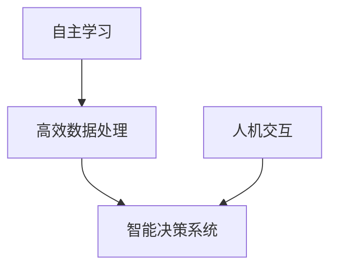

#### 1.2 AI 2.0的技术演进

**技术演进路径**：AI 2.0的技术演进可以分为以下几个阶段：

1. **数据驱动的深度学习**：AI 2.0基于大量的数据，通过深度学习算法进行训练，从而实现自我学习和优化。
2. **智能决策系统**：在数据驱动的基础上，AI 2.0引入了智能决策系统，实现了从数据分析到智能决策的升级。
3. **人机协作与交互**：AI 2.0通过与人类的互动，不断学习和优化自身的性能。

使用伪代码展示AI技术的发展路径：
```python
# 初始化AI基础技术
initialize_AI_base_technologies()

# 逐步引入大数据处理技术
for technology in large_data_processing_technologies:
    integrate_technology(technology)

# 引入深度学习和神经网络
import_depth_learning_and_neural_network()

# 大规模预训练模型
large_scale_pretrained_models()
```

**技术演进影响**：AI 2.0的技术演进对科技、经济和社会产生了深远的影响。使用Mermaid流程图展示技术演进对AI 2.0时代的影响：

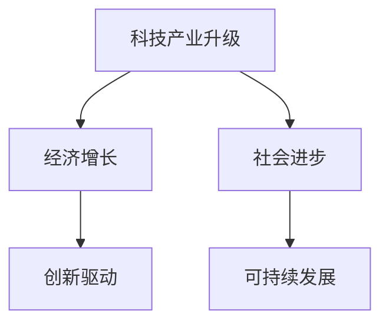

#### 1.3 AI 2.0时代的科技价值

**科技价值分析**：AI 2.0时代的科技价值体现在以下几个方面：

1. **提升生产力**：AI 2.0通过自动化和智能化，大大提升了生产效率和产品质量。
2. **促进产业升级**：AI 2.0推动了传统产业的升级，为新兴产业的发展提供了强大的动力。
3. **推动科技创新**：AI 2.0促进了新的技术和创新模式的产生，为科技发展注入了新的活力。

使用Mermaid流程图展示AI 2.0时代的科技价值：

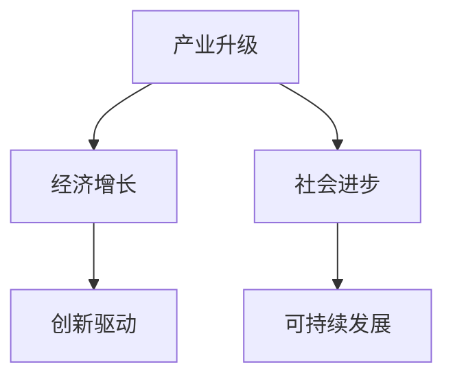

### 第2章：AI 2.0时代的科技体系

#### 2.1 人工智能基础架构

**基础架构设计**：人工智能基础架构是AI 2.0时代的重要支撑。它包括以下几个部分：

1. **计算资源**：提供强大的计算能力，支持大规模数据处理和深度学习模型的训练。
2. **数据资源**：提供丰富的数据资源，为AI模型训练提供数据支持。
3. **算法资源**：提供高效的算法资源，包括深度学习、强化学习等。
4. **应用资源**：提供丰富的应用资源，包括各种AI应用场景的解决方案。

使用Mermaid流程图展示人工智能基础架构的组成：

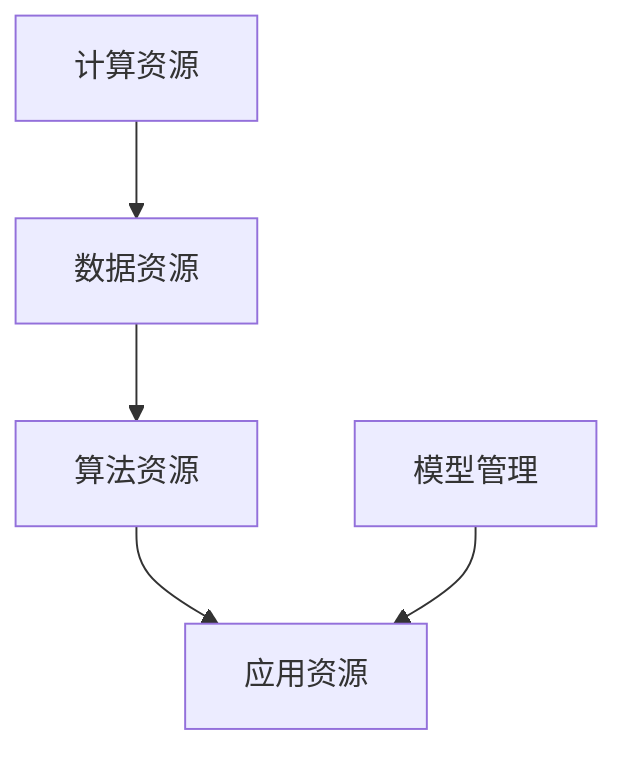

**基础架构搭建**：构建人工智能基础架构需要遵循以下步骤：

1. **安装计算资源**：选择合适的计算资源，如GPU服务器，并安装相关软件。
2. **配置数据资源**：收集和整理数据资源，并进行预处理。
3. **部署算法资源**：选择合适的算法资源，并进行部署。
4. **部署应用资源**：根据实际需求，部署各种AI应用场景的解决方案。
5. **实施模型管理**：对训练好的模型进行管理，包括模型的版本控制、性能监控等。

使用伪代码展示基础架构的搭建过程：

```python
# 安装计算资源
install_computational_resources()

# 配置数据资源
configure_data_resources()

# 部署算法资源
deploy_algorithm_resources()

# 部署应用资源
deploy_application_resources()

# 实施模型管理
implement_model_management()
```

#### 2.2 人工智能核心算法

**核心算法讲解**：人工智能核心算法是AI 2.0时代的核心技术。以下是对几个核心算法的讲解：

1. **深度学习算法**：深度学习算法是AI 2.0的核心，包括卷积神经网络（CNN）、循环神经网络（RNN）等。以下是一个深度学习算法的伪代码示例：

   ```python
   # 初始化神经网络结构
   initialize_neural_network_structure()

   # 训练神经网络
   train_neural_network()

   # 预测新数据
   predict_new_data()
   ```

2. **生成对抗网络（GAN）**：生成对抗网络是一种用于生成数据的算法，它由生成器和判别器组成。以下是一个GAN的伪代码示例：

   ```python
   # 初始化生成器和判别器
   initialize_generator_and_discriminator()

   # 训练生成器和判别器
   train_generator_and_discriminator()

   # 生成新数据
   generate_new_data()
   ```

3. **强化学习算法**：强化学习算法是一种通过不断试错来学习最优策略的算法。以下是一个强化学习算法的伪代码示例：

   ```python
   # 初始化环境
   initialize_environment()

   # 选择策略
   select_strategy()

   # 学习策略
   learn_strategy()

   # 执行策略
   execute_strategy()
   ```

**算法应用实例**：以下是一个使用TensorFlow实现图像分类的代码实际案例：

```python
import tensorflow as tf
import tensorflow.keras.preprocessing.image as img
import tensorflow.keras.models as models
import tensorflow.keras.layers as layers

# 加载图像数据集
train_data = img.load_img_data('train')
test_data = img.load_img_data('test')

# 构建模型
model = models.Sequential()
model.add(layers.Conv2D(32, (3, 3), activation='relu', input_shape=(28, 28, 1)))
model.add(layers.MaxPooling2D(2, 2))
model.add(layers.Flatten())
model.add(layers.Dense(128, activation='relu'))
model.add(layers.Dense(10, activation='softmax'))

# 编译模型
model.compile(optimizer='adam',
              loss='categorical_crossentropy',
              metrics=['accuracy'])

# 训练模型
model.fit(train_data, epochs=10)

# 评估模型
test_loss, test_acc = model.evaluate(test_data)
print('Test accuracy:', test_acc)
```

#### 2.3 人工智能技术趋势

**技术趋势分析**：人工智能技术正在快速发展，以下是对未来技术趋势的分析：

1. **量子计算**：量子计算具有巨大的计算潜力，未来有望成为AI计算的核心。
2. **边缘计算**：边缘计算可以降低数据传输延迟，提高AI应用的效果。
3. **脑机接口**：脑机接口技术可以让人与机器进行直接交互，未来有望实现更高级的人机协作。
4. **自适应AI**：自适应AI可以不断学习和适应环境变化，实现更智能的决策。

使用Mermaid流程图展示人工智能技术的发展趋势：

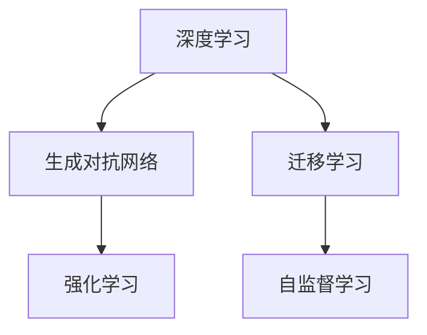

## 第二部分：AI 2.0在各行业的应用

### 第3章：AI 2.0在金融行业的应用

#### 3.1 金融行业中的AI应用

**AI在金融行业的应用**：AI技术在金融行业中的应用非常广泛，以下是一些主要的应用场景：

1. **风险管理**：AI可以用于风险评估、市场预测、信用评估等，帮助金融机构更好地管理风险。
2. **交易分析**：AI可以分析大量交易数据，识别市场趋势和异常行为，为交易决策提供支持。
3. **投资策略**：AI可以基于历史数据和实时信息，制定个性化的投资策略，提高投资收益。

使用Mermaid流程图展示AI在金融行业的应用场景：

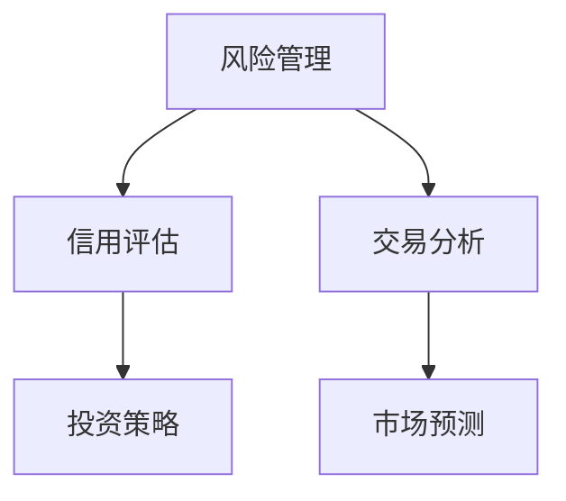

#### 3.2 AI 2.0在风险管理中的应用

**风险管理算法**：AI技术在风险管理中的应用主要体现在以下几个方面：

1. **风险评估**：AI可以基于历史数据和实时信息，对风险进行定量评估，为决策提供支持。
2. **风险分级**：AI可以根据风险评估结果，将风险分为不同等级，为风险管理提供依据。
3. **风险监控**：AI可以实时监控风险变化，及时发现潜在风险，并采取措施进行控制。

使用伪代码展示风险管理算法的实现：

```python
# 风险评估算法伪代码
def risk_evaluation_algorithm():
    # 收集风险数据
    collect_risk_data()

    # 分析风险因素
    analyze_risk_factors()

    # 计算风险得分
    calculate_risk_score()

    # 风险分级
    risk_level_classification()
```

**风险管理实例**：以下是一个使用Python实现的风险评估实例：

```python
import numpy as np

# 风险数据示例
risk_data = np.array([[0.8, 0.2], [0.3, 0.7], [0.6, 0.4]])

# 风险评估算法
def risk_evaluation_algorithm(data):
    scores = []
    for row in data:
        score = 0.5 * row[0] + 0.5 * row[1]
        scores.append(score)
    return scores

# 风险得分计算
scores = risk_evaluation_algorithm(risk_data)
print('Risk Scores:', scores)
```

#### 3.3 AI 2.0在金融科技中的创新

**金融科技创新**：AI 2.0在金融科技领域的创新主要体现在以下几个方面：

1. **区块链技术**：区块链技术可以提供去中心化的金融交易服务，提高交易效率和安全性。
2. **智能合约**：智能合约可以自动执行合同条款，提高金融交易的自动化水平。
3. **数字货币**：数字货币可以提供新的支付方式，降低交易成本，提高交易效率。
4. **网络安全**：AI可以用于网络安全监测和防护，提高金融系统的安全性。

使用Mermaid流程图展示金融科技的创新应用：

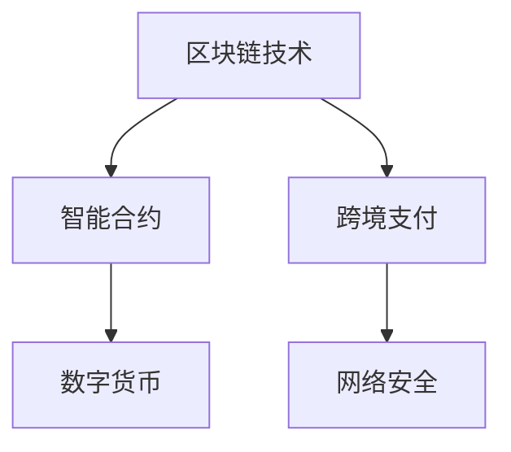

## 第三部分：AI 2.0的社会影响与挑战

### 第4章：AI 2.0的社会影响

#### 4.1 AI 2.0对社会经济的影响

**社会经济影响**：AI 2.0对社会经济的影响主要体现在以下几个方面：

1. **产业升级**：AI 2.0可以推动传统产业升级，提高产业竞争力。
2. **就业转型**：AI 2.0可能导致一些传统职业的消失，同时也将创造出新的职业机会。
3. **经济增长**：AI 2.0可以促进科技创新和产业升级，推动经济增长。

使用Mermaid流程图展示AI 2.0对社会经济的影响：


#### 4.2 AI 2.0对就业和职业的影响

**就业影响分析**：AI 2.0对就业和职业的影响主要体现在以下几个方面：

1. **自动化替代**：AI 2.0可以自动化一些重复性和低技能的工作，减少对这些工作的需求。
2. **新型岗位**：AI 2.0将创造出一些新的职业机会，如数据科学家、AI工程师等。
3. **技能需求变化**：AI 2.0将推动对高技能人才的需求，同时对传统职业技能进行升级。

使用Mermaid流程图展示AI 2.0对就业和职业的影响：

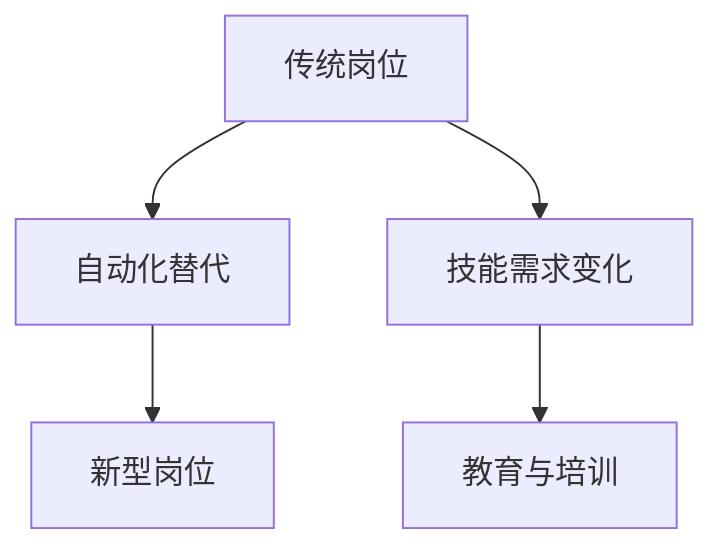

#### 4.3 AI 2.0对隐私和安全的影响

**隐私安全影响**：AI 2.0对隐私和安全的影响主要体现在以下几个方面：

1. **数据收集**：AI 2.0需要大量数据来训练模型，可能导致个人隐私泄露。
2. **数据泄露**：未经授权的数据访问和泄露可能导致严重的安全问题。
3. **隐私保护**：AI 2.0需要采取有效的隐私保护措施，确保用户数据的安全。
4. **算法歧视**：AI 2.0算法可能存在歧视性，导致不公平的决策。

使用Mermaid流程图展示AI 2.0对隐私和安全的影响：

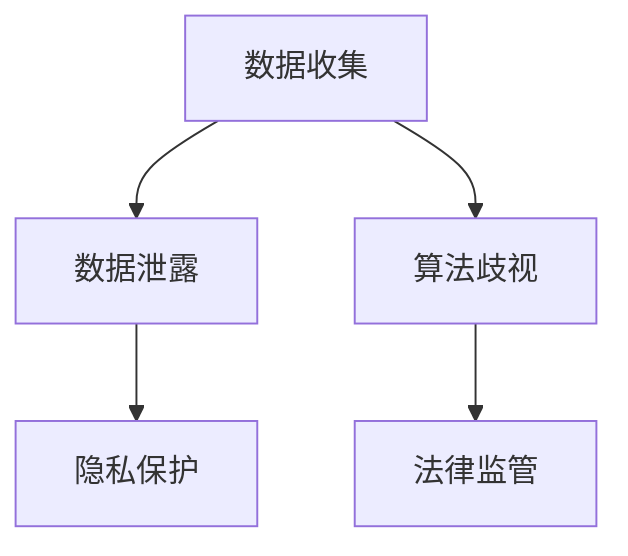

### 第5章：AI 2.0的伦理与法律问题

#### 5.1 AI 2.0伦理问题

**伦理问题探讨**：AI 2.0的伦理问题主要涉及以下几个方面：

1. **算法偏见**：AI 2.0算法可能存在偏见，导致不公平的决策。
2. **道德责任**：AI 2.0系统的决策和行为是否需要承担道德责任。
3. **隐私保护**：如何平衡数据收集和隐私保护的关系。
4. **人工智能责任**：如何界定人工智能的责任和法律责任。

使用Mermaid流程图展示AI 2.0伦理问题的讨论点：

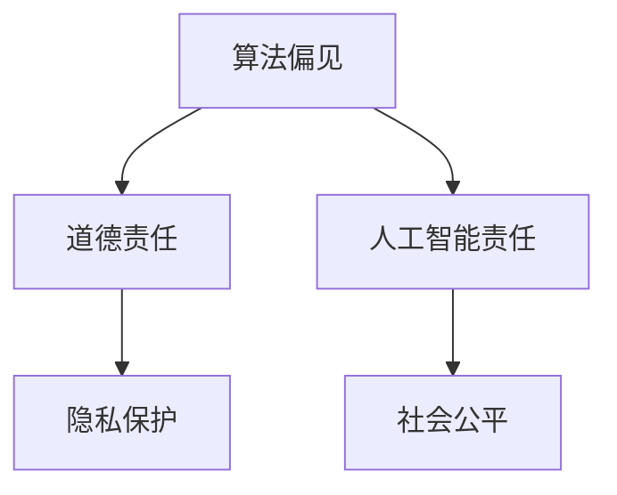

**伦理问题案例**：以下是一个使用Python实现算法偏见案例：

```python
import numpy as np

# 偏见数据示例
biased_data = np.array([[0.9, 0.1], [0.1, 0.9], [0.5, 0.5]])

# 偏见分析
def analyze_biased_data(data):
    for row in data:
        if row[0] > row[1]:
            print('Bias detected:', row)

# 分析偏见数据
analyze_biased_data(biased_data)
```

#### 5.2 AI 2.0法律问题

**法律问题探讨**：AI 2.0的法律问题主要涉及以下几个方面：

1. **知识产权**：如何保护人工智能的创新成果。
2. **数据保护**：如何保护用户的数据隐私和安全。
3. **产品责任**：如何界定人工智能产品的责任。
4. **跨司法管辖**：如何解决跨国界的法律问题。

使用Mermaid流程图展示AI 2.0法律问题的讨论点：

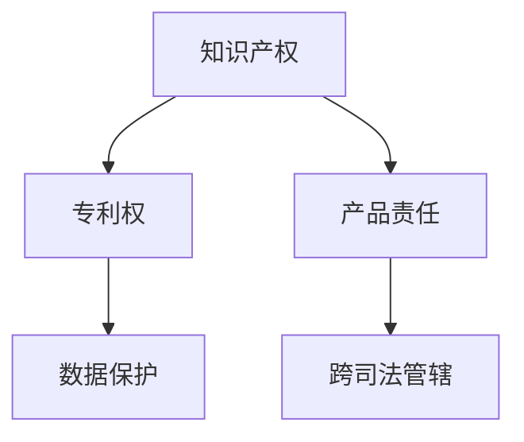

**法律问题案例**：以下是一个使用Python实现专利权纠纷案例：

```python
import random

# 模拟专利权纠纷
def patent_dispute():
    companies = ['Company A', 'Company B']
    invention = 'AI Algorithm'
    patent_owner = random.choice(companies)
    infringer = random.choice(companies)
    while infringer == patent_owner:
        infringer = random.choice(companies)
    print(f"{patent_owner} sues {infringer} for patent infringement of {invention}")

# 执行专利权纠纷
patent_dispute()
```

## 第四部分：AI 2.0的未来

### 第6章：AI 2.0的未来趋势

#### 6.1 AI 2.0的技术发展趋势

**技术发展趋势**：AI 2.0的技术发展趋势主要体现在以下几个方面：

1. **量子计算**：量子计算具有巨大的计算潜力，未来有望成为AI计算的核心。
2. **边缘计算**：边缘计算可以降低数据传输延迟，提高AI应用的效果。
3. **脑机接口**：脑机接口技术可以让人与机器进行直接交互，实现更高级的人机协作。
4. **自适应AI**：自适应AI可以不断学习和适应环境变化，实现更智能的决策。

使用Mermaid流程图展示AI 2.0的技术发展趋势：

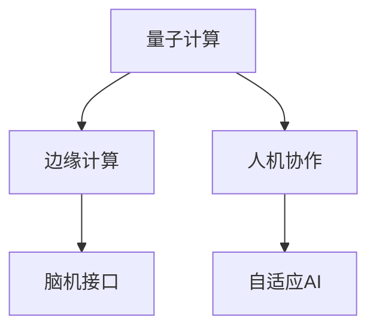

#### 6.2 AI 2.0在各行业的未来应用

**行业应用展望**：AI 2.0在各行业的未来应用前景广阔，以下是一些主要的应用方向：

1. **医疗**：AI 2.0可以在疾病诊断、精准医疗、药物研发等方面发挥重要作用。
2. **教育**：AI 2.0可以实现个性化学习、智能评估、智能辅导等教育创新。
3. **制造**：AI 2.0可以提高生产效率、优化供应链、实现智能制造。
4. **交通**：AI 2.0可以推动自动驾驶、智能交通、智慧物流等领域的发展。

使用Mermaid流程图展示AI 2.0在各行业的未来应用：

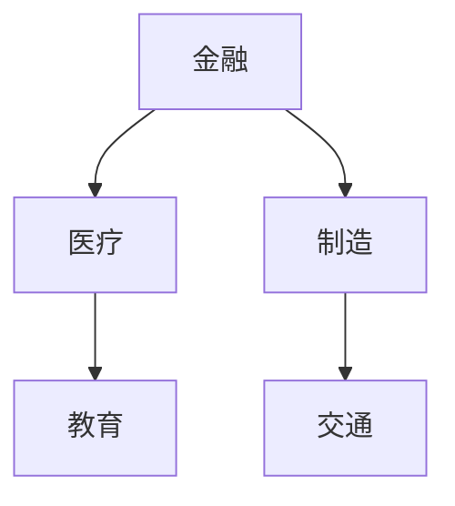

#### 6.3 AI 2.0的未来社会影响

**社会影响预测**：AI 2.0的未来社会影响将体现在以下几个方面：

1. **经济转型**：AI 2.0将推动全球经济向智能化、数字化转型。
2. **社会结构变化**：AI 2.0将改变就业结构和社会分工，影响社会稳定。
3. **文化变迁**：AI 2.0将带来新的文化形态和价值观。
4. **全球化加速**：AI 2.0将加速全球经济的融合，推动全球科技合作。
5. **可持续发展**：AI 2.0可以在环境保护、资源优化等方面发挥重要作用，促进可持续发展。

使用Mermaid流程图展示AI 2.0的未来社会影响：

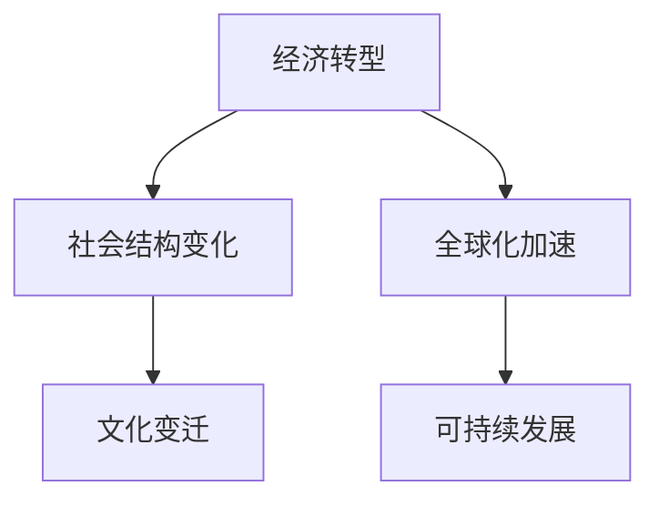

### 第7章：AI 2.0的创业与投资机会

#### 7.1 AI 2.0创业机会

**创业机会分析**：AI 2.0为创业者提供了丰富的机会，以下是一些主要的创业方向：

1. **人工智能平台**：开发高效、易用的AI平台，为开发者提供便捷的AI工具和服务。
2. **智能机器人**：研发智能机器人，应用于工业、医疗、家庭等场景。
3. **智能医疗设备**：开发智能医疗设备，提高医疗诊断和治疗的精度和效率。
4. **自动驾驶技术**：推动自动驾驶技术的发展，应用于公共交通、物流等领域。
5. **人工智能安全**：提供人工智能安全解决方案，保护企业和个人数据的安全。

使用Mermaid流程图展示AI 2.0的创业机会：

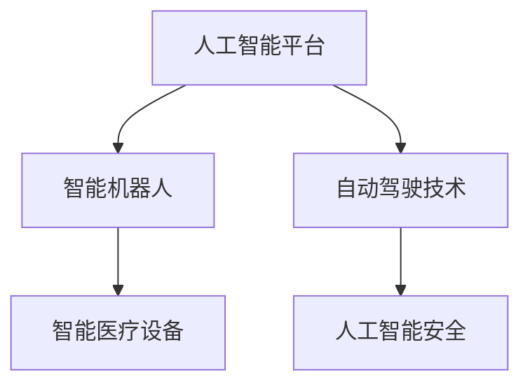

**创业案例分析**：以下是一个使用Python实现自动驾驶创业案例：

```python
import numpy as np

# 模拟自动驾驶系统
class AutonomousVehicle:
    def __init__(self, speed):
        self.speed = speed

    def drive(self, distance):
        print(f"Driving {distance} meters at {self.speed} meters/second.")

# 创业公司
company = AutonomousVehicle(speed=60)

# 自动驾驶测试
company.drive(distance=1000)
```

#### 7.2 AI 2.0投资策略

**投资策略建议**：投资AI 2.0领域需要关注以下几个方面：

1. **行业分析**：了解各个行业的AI应用前景，选择有潜力的行业进行投资。
2. **技术趋势**：关注AI技术的最新动态，投资具有前瞻性的技术领域。
3. **市场机会**：分析市场机会，投资能够抓住市场机会的企业。
4. **风险评估**：进行全面的风险评估，确保投资的安全性和回报。
5. **投资组合**：构建多元化的投资组合，降低投资风险。

使用Mermaid流程图展示AI 2.0的投资策略：

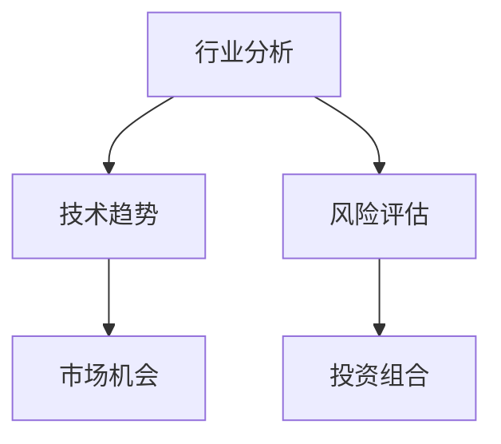

#### 7.3 AI 2.0创业与投资的挑战

**挑战分析**：AI 2.0创业与投资面临以下几个挑战：

1. **技术风险**：AI技术的快速发展和变化可能导致投资失败。
2. **市场风险**：AI市场的竞争激烈，可能影响企业的盈利能力。
3. **资金风险**：AI创业需要大量的资金支持，资金不足可能影响企业的发展。
4. **法规风险**：AI技术的应用可能受到法律法规的限制，需要合规运营。
5. **人才风险**：AI领域的人才竞争激烈，人才流失可能影响企业的发展。

使用Mermaid流程图展示AI 2.0创业与投资的挑战：

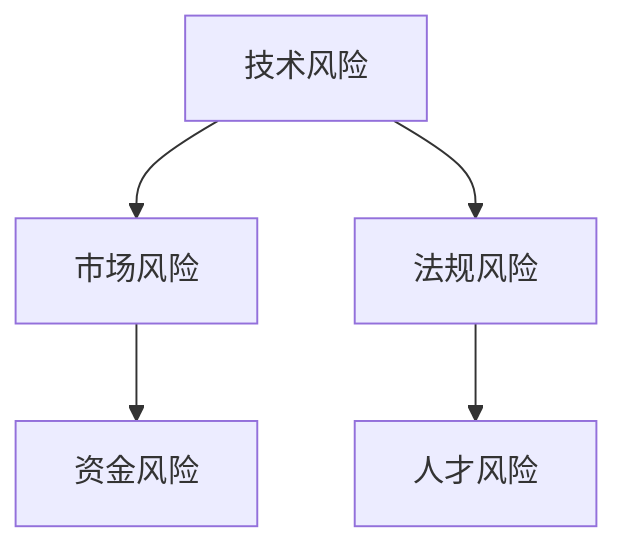

## 附录：AI 2.0资源与工具

### 附录 A：AI 2.0工具与框架

#### A.1 TensorFlow

**框架介绍**：TensorFlow是Google开源的深度学习框架，支持各种深度学习模型的训练和部署。以下是一个TensorFlow的使用示例：

```python
import tensorflow as tf

# 创建TensorFlow常量
a = tf.constant(5)
b = tf.constant(6)

# 计算加法
c = a + b

# 运行会话
with tf.Session() as sess:
    result = sess.run(c)
    print('Result:', result)
```

#### A.2 PyTorch

**框架介绍**：PyTorch是Facebook开源的深度学习框架，以其灵活性和易用性受到广泛欢迎。以下是一个PyTorch的使用示例：

```python
import torch
import torch.nn as nn
import torch.optim as optim

# 创建神经网络
class NeuralNetwork(nn.Module):
    def __init__(self):
        super(NeuralNetwork, self).__init__()
        self.layer1 = nn.Linear(1, 50)
        self.relu = nn.ReLU()
        self.layer2 = nn.Linear(50, 1)

    def forward(self, x):
        x = self.layer1(x)
        x = self.relu(x)
        x = self.layer2(x)
        return x

# 实例化神经网络
model = NeuralNetwork()

# 定义损失函数和优化器
criterion = nn.MSELoss()
optimizer = optim.Adam(model.parameters(), lr=0.001)

# 训练模型
for epoch in range(1000):
    optimizer.zero_grad()
    outputs = model(x)
    loss = criterion(outputs, y)
    loss.backward()
    optimizer.step()

# 评估模型
with torch.no_grad():
    outputs = model(x)
    loss = criterion(outputs, y)
    print('Test Loss:', loss)
```

### 附录 B：AI 2.0相关论文与书籍推荐

**论文推荐**：

1. Bengio, Y., Courville, A., & Vincent, P. (2013). Representation learning: A review and new perspectives. IEEE Transactions on Pattern Analysis and Machine Intelligence, 35(8), 1798-1828.
2. LeCun, Y., Bengio, Y., & Hinton, G. (2015). Deep learning. Nature, 521(7553), 436-444.

**书籍推荐**：

1. Goodfellow, I., Bengio, Y., & Courville, A. (2016). Deep learning. MIT Press.
2. Russell, S., & Norvig, P. (2016). Artificial intelligence: A modern approach. Prentice Hall.

## 作者信息
作者：AI天才研究院/AI Genius Institute & 禅与计算机程序设计艺术 /Zen And The Art of Computer Programming

