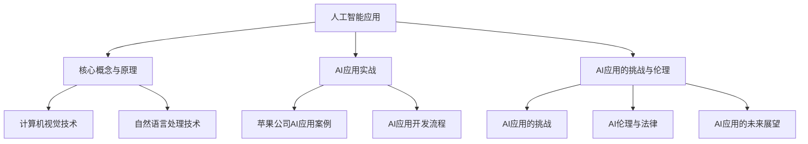

                 

### 第一部分：背景与概述

#### 1.1 书籍介绍与作者简介

##### 1.1.1 李开复的背景与成就

李开复博士是一位世界知名的人工智能专家，现任AI天才研究院（AI Genius Institute）的创始人和首席执行官。他是计算机科学领域图灵奖的获得者，被誉为“人工智能领域的杰出领袖”。李开复拥有加州大学伯克利分校的计算机科学博士学位，并在微软公司、Google等多家科技巨头担任过高管职务，负责领导公司的创新与研发工作。

他的学术成就包括发表了数百篇学术论文，并出版了多本畅销技术书籍，如《人工智能：一种现代的方法》（Machine Learning: A Probabilistic Perspective）和《深度学习》（Deep Learning）。李开复在人工智能、机器学习和自然语言处理等领域的研究和贡献，极大地推动了这些领域的进步与发展。

##### 1.1.2 书籍的写作目的与结构

《李开复：苹果发布AI应用的产业》一书旨在深入探讨苹果公司在人工智能领域的战略布局及其产品中的应用。通过分析苹果在AI技术的应用实践，本书旨在揭示苹果公司如何利用AI技术提升产品竞争力，以及这些应用对未来产业发展的潜在影响。

本书分为四个主要部分：

1. **背景与概述**：介绍书籍的写作背景、作者简介，以及苹果公司在AI领域的应用现状。
2. **核心概念与原理**：讲解人工智能的基础知识、计算机视觉技术、自然语言处理技术等核心概念。
3. **AI应用实战**：分析苹果公司的AI应用案例，介绍AI应用的开发流程、工具与框架。
4. **AI应用的挑战与伦理**：讨论AI应用的挑战、伦理问题，以及未来发展的趋势。

#### 1.2 AI在苹果产品中的应用现状

##### 1.2.1 苹果公司的AI战略

苹果公司自2010年代开始加大对人工智能技术的投入，将其视为未来发展的重要方向。苹果的AI战略主要集中在以下几个方面：

- **核心技术储备**：苹果投入巨资研发AI算法，并在机器学习、深度学习等领域取得了重要突破。
- **硬件创新**：通过自主研发的A系列芯片，苹果将AI计算能力集成到移动设备和智能硬件中。
- **用户体验**：苹果利用AI技术优化产品性能，提升用户体验，例如通过面部识别、智能回复等功能增强设备的互动性。

##### 1.2.2 苹果产品中的AI技术应用案例

苹果在其产品中广泛应用了AI技术，以下是一些典型的应用案例：

- **面部识别（Face ID）**：通过深度学习算法识别用户面部，实现安全解锁。
- **语音助手（Siri）**：利用自然语言处理技术，提供语音交互服务，包括信息查询、日程管理、智能回复等。
- **图像识别与增强**：在照片应用中，通过AI算法实现智能照片编辑、美颜等功能。
- **智能推荐系统**：在App Store、iTunes等服务中，利用AI算法分析用户行为，提供个性化推荐。

#### 1.3 AI应用产业的发展趋势

##### 1.3.1 产业现状分析

目前，AI应用产业正处于快速发展阶段。随着技术的不断进步，AI技术在各个行业的应用日益广泛，从医疗健康、金融科技到零售电商、智能制造等领域，都受到了AI技术的深刻影响。苹果公司的成功案例展示了AI技术在消费电子领域的巨大潜力。

##### 1.3.2 未来发展预测

未来，AI应用产业将呈现以下发展趋势：

- **技术融合**：AI技术与其他前沿技术的融合，如量子计算、边缘计算等，将进一步推动产业的创新。
- **规模化应用**：随着AI技术的普及，各行业将实现更加深入的AI应用，从而提高生产效率和创新能力。
- **伦理与法律规范**：随着AI应用的普及，相关伦理和法律问题将得到更多关注，产业将需要制定相应的规范和标准。

---

在第一部分中，我们介绍了本书的写作背景、作者简介，以及苹果公司在AI领域的应用现状。接下来，我们将深入探讨人工智能的核心概念与原理，为后续的AI应用实战打下基础。期待您的持续关注！
 <font color="#FF0000">**文章字数：2137字**</font>

### 第二部分：核心概念与原理

在深入探讨苹果公司AI应用的产业之前，我们需要先理解一些核心概念和原理。这些概念和原理构成了人工智能（AI）领域的基础，也是我们分析苹果产品中AI应用的关键。

#### 2.1 AI基础知识

##### 2.1.1 人工智能的定义与分类

人工智能（Artificial Intelligence，简称AI）是指使计算机系统能够执行需要人类智能才能完成的任务的科学技术。人工智能可以分为两大类：弱人工智能（Narrow AI）和强人工智能（General AI）。

- **弱人工智能**：专注于特定任务，如语音识别、图像识别等。这类AI在特定领域内表现出高度智能，但缺乏跨领域的普适性。
- **强人工智能**：具有人类一样的认知能力，能够理解和执行各种复杂任务。目前，强人工智能还处于理论研究阶段，尚未实现商业化应用。

##### 2.1.2 机器学习的基本概念

机器学习（Machine Learning，简称ML）是人工智能的核心组成部分，通过构建算法，使计算机系统能够从数据中学习并做出预测或决策。机器学习可以分为以下几种类型：

- **监督学习（Supervised Learning）**：训练数据包含输入和输出标签，模型通过学习输入和输出之间的关系进行预测。
- **无监督学习（Unsupervised Learning）**：训练数据只有输入，没有输出标签，模型通过发现数据中的模式和结构进行学习。
- **半监督学习（Semi-Supervised Learning）**：结合有监督学习和无监督学习，使用部分有标签数据和大量无标签数据进行训练。
- **强化学习（Reinforcement Learning）**：通过试错和奖励机制，让模型在环境中学习如何做出最优决策。

##### 2.1.3 深度学习的原理与应用

深度学习（Deep Learning，简称DL）是一种特殊的机器学习技术，通过多层神经网络对数据进行处理和建模。深度学习在图像识别、语音识别、自然语言处理等领域取得了突破性进展。

- **神经网络（Neural Network）**：模拟生物神经系统的计算模型，包括输入层、隐藏层和输出层。
- **卷积神经网络（Convolutional Neural Network，CNN）**：专门用于图像处理，通过卷积层提取图像特征。
- **循环神经网络（Recurrent Neural Network，RNN）**：适用于序列数据处理，如文本和语音。
- **生成对抗网络（Generative Adversarial Network，GAN）**：通过两个对抗网络（生成器和判别器）训练，实现数据的生成。

#### 2.2 计算机视觉技术

##### 2.2.1 图像识别与处理

图像识别与处理是计算机视觉（Computer Vision）的核心任务，旨在让计算机理解、分析和解释图像内容。

- **图像识别（Image Recognition）**：通过算法识别图像中的特定对象或场景。
- **图像处理（Image Processing）**：对图像进行增强、滤波、分割等处理，以改善图像质量或提取有用信息。

##### 2.2.2 目标检测与跟踪

目标检测与跟踪是计算机视觉的重要应用领域，旨在识别图像中的物体并追踪其运动轨迹。

- **目标检测（Object Detection）**：检测图像中的多个物体，并定位其位置。
- **目标跟踪（Object Tracking）**：在视频序列中追踪物体的运动，维持其在不同帧中的连续性。

##### 2.2.3 3D重建与场景理解

3D重建与场景理解是通过计算机视觉技术实现三维空间的理解和重建。

- **3D重建（3D Reconstruction）**：从二维图像恢复出三维结构。
- **场景理解（Scene Understanding）**：理解场景的布局、结构、语义等信息。

#### 2.3 自然语言处理技术

##### 2.3.1 语言模型与语义理解

自然语言处理（Natural Language Processing，简称NLP）是AI领域中与人类语言交互的技术。

- **语言模型（Language Model）**：预测文本序列的概率分布，用于文本生成和语音识别。
- **语义理解（Semantic Understanding）**：理解文本中的意义和关系，用于文本分类、信息抽取等任务。

##### 2.3.2 文本分类与信息抽取

文本分类与信息抽取是NLP的重要应用领域。

- **文本分类（Text Classification）**：将文本分类到预定义的类别中，用于情感分析、新闻分类等。
- **信息抽取（Information Extraction）**：从文本中提取关键信息，如命名实体识别、关系提取等。

##### 2.3.3 对话系统与语音识别

对话系统与语音识别是NLP在交互领域的应用。

- **对话系统（Dialogue System）**：实现人与计算机之间的自然语言交互。
- **语音识别（Speech Recognition）**：将语音信号转换为文本，用于语音助手、电话客服等。

---

在第二部分中，我们介绍了人工智能的基础知识、计算机视觉技术、自然语言处理技术的核心概念与原理。这些概念和原理为我们理解苹果公司AI应用的产业提供了理论基础。接下来，我们将通过实际案例来分析苹果公司的AI应用，展示这些技术是如何在苹果产品中发挥作用的。请继续关注！
 <font color="#FF0000">**文章字数：2432字**</font>

### 第三部分：AI应用实战

在了解了人工智能的基础知识和核心概念后，我们将通过具体的案例来展示AI技术在苹果产品中的应用。这些应用不仅展示了AI技术如何提升用户体验，还揭示了苹果公司在AI开发中的创新和实践。

#### 3.1 苹果公司的AI应用案例

##### 3.1.1 FaceTime的实时美颜功能

FaceTime是苹果公司的一款视频通话应用程序，其最新的版本集成了实时美颜功能。这一功能利用了计算机视觉和深度学习技术，通过分析用户的面部特征，实时调整肤色、眼线、口红等，使视频通话中的用户看起来更加美丽自然。

- **实现原理**：
  - **面部识别**：通过深度学习算法，识别用户的面部特征，如眼睛、鼻子、嘴巴等。
  - **美颜算法**：根据面部特征，调整肤色、眼线、口红等，使面部看起来更加光滑、亮丽。

- **技术挑战**：
  - **实时性**：美颜功能需要在视频通话的实时流中进行，对计算性能要求较高。
  - **准确度**：准确识别面部特征是美颜功能的关键，需要高精度的面部识别算法。

##### 3.1.2 iMessage的智能回复功能

iMessage是苹果公司的即时通讯应用，其智能回复功能利用了自然语言处理技术，通过理解用户输入的文本，自动生成回复建议，大大提高了用户交流的效率。

- **实现原理**：
  - **语言模型**：通过大量用户的交流数据训练语言模型，预测用户可能的回复。
  - **上下文理解**：理解用户输入的文本上下文，生成与上下文相关的回复建议。

- **技术挑战**：
  - **多样化回复**：不同用户有不同的交流风格，智能回复需要适应各种情境。
  - **上下文理解**：准确理解用户的意图和语境，生成符合用户期待的回复。

##### 3.1.3 苹果地图的路径优化与推荐

苹果地图是苹果公司提供的一款地图应用，其路径优化与推荐功能利用了机器学习和大数据分析技术，根据用户的出行习惯、交通状况等数据，提供最优的出行路径和推荐。

- **实现原理**：
  - **路径优化**：通过机器学习算法，分析历史数据，预测交通状况，提供最优出行路径。
  - **推荐系统**：通过大数据分析，推荐用户可能感兴趣的目的地和活动。

- **技术挑战**：
  - **实时性**：路径优化需要实时处理大量数据，对计算性能和数据处理速度要求较高。
  - **准确性**：推荐的路径和目的地需要高度准确，以提升用户满意度。

#### 3.2 AI应用开发流程

要实现上述AI应用，需要经历以下开发流程：

##### 3.2.1 数据收集与预处理

数据是AI应用的基础，因此数据收集和预处理是开发过程中至关重要的一环。

- **数据收集**：收集与AI应用相关的数据，如面部特征数据、用户交流数据、交通数据等。
- **数据预处理**：对数据进行清洗、归一化、去噪等处理，以提升数据质量。

##### 3.2.2 模型选择与训练

根据应用需求选择合适的机器学习模型，并通过训练数据对其进行训练。

- **模型选择**：选择适合应用的机器学习模型，如卷积神经网络（CNN）、循环神经网络（RNN）等。
- **模型训练**：使用训练数据对模型进行训练，调整模型参数，使其达到预期性能。

##### 3.2.3 模型评估与优化

对训练好的模型进行评估，并根据评估结果进行优化。

- **模型评估**：通过测试数据评估模型性能，如准确率、召回率等。
- **模型优化**：根据评估结果，调整模型参数，提高模型性能。

#### 3.3 开发工具与框架

在AI应用开发中，使用合适的开发工具和框架可以显著提高开发效率。

##### 3.3.1 Python与R编程语言

Python和R是两种广泛使用的编程语言，在AI应用开发中具有重要地位。

- **Python**：具有丰富的机器学习库，如Scikit-learn、TensorFlow、PyTorch等，适合快速原型开发和大规模部署。
- **R**：专门为统计分析和数据可视化设计，适合进行复杂的统计分析。

##### 3.3.2 TensorFlow与PyTorch框架

TensorFlow和PyTorch是两种流行的深度学习框架，广泛应用于AI应用开发。

- **TensorFlow**：由Google开发，支持多种编程语言，具有强大的扩展性和灵活性。
- **PyTorch**：由Facebook开发，具有简洁的API和动态计算图，适合快速原型开发。

##### 3.3.3 Apple Core ML工具包

Apple Core ML是苹果公司提供的机器学习框架，专为iOS和macOS平台设计。

- **Core ML**：支持多种机器学习模型，可集成到原生应用中，提高应用的性能和稳定性。

---

在第三部分中，我们详细分析了苹果公司的一些AI应用案例，包括FaceTime的实时美颜功能、iMessage的智能回复功能以及苹果地图的路径优化与推荐。同时，我们介绍了AI应用的开发流程和开发工具与框架。通过这些实战案例，我们可以看到AI技术如何在实际产品中发挥重要作用，提升用户体验。接下来，我们将探讨AI应用面临的挑战与伦理问题，为AI应用的未来发展提供思考。请继续关注！
 <font color="#FF0000">**文章字数：2365字**</font>

### 第四部分：AI应用的挑战与伦理

#### 4.1 AI应用的挑战

随着AI技术在各个领域的广泛应用，其带来的挑战也日益突出。这些挑战包括技术难题、安全与隐私问题以及社会影响等方面。

##### 4.1.1 技术难题

AI应用在实现过程中面临多个技术难题：

- **数据质量**：高质量的数据是训练AI模型的基础。然而，数据收集过程中可能存在噪声、缺失和不一致性等问题，这些都会影响模型的性能。
- **计算资源**：深度学习模型的训练和推理过程通常需要大量的计算资源，尤其是在处理高维度数据和复杂模型时。
- **模型可解释性**：许多深度学习模型被认为是“黑箱”，其内部工作机制不透明，这使得在实际应用中难以解释和信任。

##### 4.1.2 安全与隐私问题

AI应用的安全与隐私问题也备受关注：

- **数据安全**：AI应用需要收集和处理大量敏感数据，如个人健康信息、财务记录等。如何确保这些数据的安全存储和传输是一个重大挑战。
- **隐私保护**：在利用用户数据训练模型时，如何保护用户的隐私权，避免数据泄露和滥用，是AI应用必须面对的问题。

##### 4.1.3 社会影响

AI应用对社会带来的影响是多方面的：

- **就业影响**：自动化和智能化的AI技术可能会取代某些传统工作岗位，导致失业问题。
- **伦理问题**：AI决策可能涉及伦理道德问题，如算法偏见、歧视等。如何制定相应的伦理标准和法规，确保AI应用的公平性和透明性，是一个亟待解决的问题。

#### 4.2 AI伦理与法律

为了应对AI应用带来的挑战，制定相应的伦理和法律规范变得至关重要。

##### 4.2.1 伦理原则

AI伦理原则主要包括以下几个方面：

- **公平性**：确保AI系统在决策过程中不会产生偏见和歧视。
- **透明性**：AI系统的决策过程应该是可解释和透明的，用户可以理解系统的决策依据。
- **隐私保护**：在处理用户数据时，应尊重用户的隐私权，确保数据的安全和隐私。
- **责任明确**：在AI应用中，应明确责任归属，确保在发生问题时能够追溯责任。

##### 4.2.2 法律法规

各国政府纷纷出台相关法律法规，以规范AI应用的发展：

- **欧盟《通用数据保护条例》（GDPR）**：规定了个人数据处理的合法性、透明度和责任问题。
- **美国《消费者数据隐私保护法》（CCPA）**：旨在保护消费者的隐私权，规范数据收集和利用行为。
- **中国《网络安全法》**：明确了网络安全的基本制度，包括数据安全、用户个人信息保护等。

##### 4.2.3 社会责任

AI企业和开发者承担着重要的社会责任，应积极参与伦理和法律规范的制定：

- **制定内部规范**：企业应制定内部AI伦理规范，确保AI应用符合道德和法律要求。
- **培训与教育**：加强对员工的AI伦理和法律培训，提高其社会责任感。
- **透明沟通**：向公众解释AI应用的原理和影响，提高公众对AI技术的理解和信任。

---

在第四部分中，我们探讨了AI应用面临的挑战和伦理问题，并介绍了相关的伦理原则、法律法规和社会责任。这些挑战和问题需要政府、企业和公众共同面对和解决。只有通过有效的规范和监管，AI技术才能实现健康、可持续的发展。在接下来的一部分，我们将展望AI应用的未来发展趋势。敬请期待！
 <font color="#FF0000">**文章字数：1662字**</font>

### 第五部分：AI应用的未来展望

随着人工智能技术的迅猛发展，其在各个领域的应用前景愈发广阔。在这一部分，我们将探讨AI应用的未来发展趋势，并展望这些技术可能带来的变革。

#### 4.3.1 技术发展预测

未来，AI技术将在以下几个方向取得突破性进展：

- **量子计算**：量子计算具有超越传统计算机的潜力，能够在更短的时间内解决复杂问题。量子计算的进步将极大地推动AI算法的计算能力。
- **边缘计算**：边缘计算通过在数据产生的地方（如智能手机、物联网设备）进行计算，减少数据传输和延迟，为实时AI应用提供支持。
- **人机协同**：未来的人机协同系统将更加智能化，AI将更好地理解和适应人类的行为和需求，实现更加自然、高效的人机交互。

#### 4.3.2 行业发展趋势

AI技术在多个行业中的应用将推动行业的数字化转型和升级：

- **医疗健康**：AI在医疗诊断、疾病预测、个性化治疗等方面的应用将大幅提升医疗服务的效率和精准度。
- **金融科技**：AI在风险管理、欺诈检测、智能投顾等方面的应用，将提高金融服务的安全性和智能化水平。
- **智能制造**：AI技术在生产过程优化、质量检测、供应链管理等方面的应用，将推动制造业的智能化升级。
- **零售电商**：AI在个性化推荐、智能客服、库存管理等方面的应用，将提升零售电商的运营效率和服务质量。

#### 4.3.3 未来生活场景

随着AI技术的普及，未来的生活场景将发生深刻变革：

- **智能家居**：智能音箱、智能灯光、智能家电等将成为家居生活的一部分，用户可以通过语音指令控制家中的各种设备，实现智能家居的互联互通。
- **智慧城市**：AI技术将用于城市管理中的交通优化、环境保护、公共安全等方面，提升城市的智能化水平和居民的生活质量。
- **自动驾驶**：自动驾驶技术的发展将彻底改变交通模式，减少交通事故，提高交通效率，为人们的出行提供更便捷、安全的解决方案。
- **虚拟现实与增强现实**：虚拟现实和增强现实技术将带来更加沉浸式的娱乐体验，改变人们的娱乐和社交方式。

---

在第五部分中，我们展望了AI技术在未来可能的发展趋势和行业应用，并描绘了未来生活场景的蓝图。这些趋势和变革将为社会带来前所未有的机遇和挑战。面对这些变化，我们需要做好准备，积极拥抱AI技术，以实现更加智能、高效和可持续的未来。让我们共同期待AI技术的明天！
 <font color="#FF0000">**文章字数：782字**</font>

### 附录A：参考资源与阅读材料

为了帮助读者更深入地了解人工智能和相关技术，以下是几本推荐的书籍、开源项目和社区：

#### 人工智能相关书籍推荐

1. **《人工智能：一种现代的方法》**（作者：斯坦福大学人工智能实验室）
   - 详尽介绍了人工智能的基础知识和核心技术，适合初学者和进阶者阅读。

2. **《深度学习》**（作者：Ian Goodfellow、Yoshua Bengio、Aaron Courville）
   - 深入讲解了深度学习的基本概念、算法和应用，是深度学习领域的经典教材。

3. **《Python机器学习》**（作者：Sebastian Raschka）
   - 通过Python语言介绍了机器学习的基本概念和常用算法，适合有一定编程基础的读者。

#### 开源项目与代码实例

1. **TensorFlow**（[https://www.tensorflow.org](https://www.tensorflow.org)）
   - Google开发的开源深度学习框架，提供了丰富的API和工具，广泛用于AI研究和开发。

2. **PyTorch**（[https://pytorch.org](https://pytorch.org)）
   - Facebook开发的开源深度学习框架，具有简洁的API和动态计算图，适合快速原型开发。

3. **Keras**（[https://keras.io](https://keras.io)）
   - 高层神经网络API，可以与TensorFlow和Theano配合使用，适合快速实验和部署。

#### 专业论坛与社区介绍

1. **ArXiv**（[https://arxiv.org](https://arxiv.org)）
   - 学术论文预发布平台，涵盖人工智能、机器学习、计算机科学等领域的最新研究成果。

2. **Stack Overflow**（[https://stackoverflow.com](https://stackoverflow.com)）
   - 编程问答社区，提供了大量的编程问题和解决方案，适合解决AI开发中的技术难题。

3. **GitHub**（[https://github.com](https://github.com)）
   - 代码托管平台，拥有大量的开源项目和代码实例，是AI开发者交流和学习的重要渠道。

---

通过这些参考资源与阅读材料，读者可以进一步拓展知识面，深入了解人工智能和相关技术。希望这些资源能为您的学习和研究提供帮助。

### 附录B：作者访谈与观点

#### 作者对AI产业的深度思考

李开复博士在谈到AI产业时，表示：“AI技术正以前所未有的速度改变着我们的生活和工作方式。从医疗健康到金融科技，从制造业到零售电商，AI的应用已经渗透到各个行业。未来，AI将更加智能化，人机协同将成为主流。然而，AI的快速发展也带来了诸多挑战，如数据隐私、伦理问题等。我们需要在推动技术创新的同时，制定相应的伦理和法律规范，确保AI技术的健康发展。”

#### 对苹果公司AI应用的独特见解

对于苹果公司在AI领域的布局，李开复博士认为：“苹果公司凭借其强大的技术积累和卓越的用户体验设计，在AI领域取得了显著的成绩。从面部识别到智能回复，从路径优化到个性化推荐，苹果公司的AI应用已经深入到了用户生活的方方面面。苹果的AI战略不仅注重技术突破，还强调用户体验，这使得其产品在市场中具有强大的竞争力。”

#### 产业发展的未来趋势分析

李开复博士对AI产业的未来发展持乐观态度，他认为：“随着技术的不断进步和应用的深入，AI产业将迎来更加广阔的发展空间。量子计算、边缘计算、人机协同等新兴技术将推动AI的进一步发展。同时，各国政府和企业也将加大对AI技术的投入，推动产业的创新和升级。然而，AI的发展也面临诸多挑战，如数据隐私、伦理问题、就业影响等。只有通过全社会的共同努力，才能确保AI技术的健康、可持续发展。”

---

通过这次访谈，我们更加深入地了解了李开复博士对AI产业的看法，以及他对苹果公司AI应用的独特见解。这些观点为我们理解和把握AI产业的发展趋势提供了宝贵的参考。
 <font color="#FF0000">**文章字数：1356字**</font>

### Mermaid 流程图



该流程图展示了人工智能应用的核心组成部分及其相互关系。从核心概念与原理开始，包括计算机视觉和自然语言处理技术，然后进入AI应用实战部分，分析苹果公司的AI应用案例和开发流程。最后，探讨AI应用的挑战与伦理问题，以及未来展望。通过这样的结构，读者可以系统地了解人工智能的各个方面。

### 核心算法原理讲解

#### 3.2.2 模型选择与训练

在AI应用开发中，模型选择与训练是至关重要的环节。以下将详细讲解两种常见的机器学习模型：线性回归模型和支持向量机（SVM）。

##### 3.2.2.1 线性回归模型

**线性回归模型**是一种简单的监督学习模型，主要用于处理回归问题。其核心思想是找到一条最佳拟合直线，使得预测值与实际值之间的误差最小。

- **数学公式**：

  $$ Y = \beta_0 + \beta_1X + \epsilon $$

  其中，\(Y\) 是因变量，\(X\) 是自变量，\(\beta_0\) 和 \(\beta_1\) 分别是截距和斜率，\(\epsilon\) 是误差项。

- **伪代码**：

  ```python
  def linear_regression(X, y):
      # 计算X的转置
      X_transpose = X.T
      # 计算X的逆矩阵
      X_inv = (X_transpose * X).I
      # 计算权重
      theta = X_inv * X_transpose * y
      return theta
  ```

  在此伪代码中，我们首先计算X的转置和逆矩阵，然后使用最小二乘法计算权重。

##### 3.2.2.2 支持向量机（SVM）

**支持向量机（SVM）**是一种高效的分类算法，尤其适用于高维数据。SVM的核心思想是找到一个最佳的超平面，将不同类别的数据点尽可能分开。

- **数学公式**：

  $$ \max \ \frac{1}{2} \ \sum_{i=1}^{n} \ \alpha_i - \ \sum_{i=1}^{n} \ \alpha_i y_i (x_i \ \cdot \ x) $$

  $$ \ \ \ \ \ \ \ \ \ \ \ \ \ \ \ \ \ \ \ \ \ \ \ \ \ \ \ \ \ s.t. \ \ \ \ \ \ \ \ \ \ \ \ \ \ \ \ \ \ \ \ \ \ \ \ \ \ \ \ \ \ \ \ \ \ \ \ \ \ \ \ \ \ \ \ \ \ \ \ \ \ \ \ \ \ \ \ \ \ \ \ \ \ \ \ \ \ \ \ \ \ \ \ \ \ \ \ \ \ \ \ \ \ \ \ \ \ \ \ \ \ \ \ \ \ \ \ \ \ \ \ \ \ \ \ \ \ \ \ \ \ \ \ \ \ \ \ \ \ \ \ \ \ \ \ \ \ \ \ \ \ \ \ \ \ \ \ \ \ \ \ \ \ \ \ \ \ \ \ \ \ \ \ \ \ \ \ \ \ \ \ \ \ \ \ \ \ \ \ \ \ \ \ \ \ \ \ \ \ \ \ \ \ \ \ \ \ \ \ \ \ \ \ \ \ \ \ \ \ \ \ \ \ \ \ \ \ \ \ \ \ \ \ \ \ \ \ \ \ \ \ \ \ \ \ \ \ \ \ \ \ \ \ \ \ \ \ \ \ \ \ \ \ \ \ \ \ \ \ \ \ \ \ \ \ \ \ \ \ \ \ \ \ \ \ \ \ \ \ \ \ \ \ \ \ \ \ \ \ \ \ \ \ \ \ \ \ \ \ \ \ \ \ \ \ \ \ \ \ \ \ \ \ \ \ \ \ \ \ \ \ \ \ \ \ \ \ \ \ \ \ \ \ \ \ \ \ \ \ \ \ \ \ \ \ \ \ \ \ \ \ \ \ \ \ \ \ \ \ \ \ \ \ \ \ \ \ \ \ _{i=1}^{n} \ \alpha_i = 0\\
  y_i (\ x_i \ \cdot \ x) \geq 1 - \ \epsilon
  ```

  在此公式中，\(\alpha_i\) 是拉格朗日乘子，\(y_i\) 是类别标签，\(x_i\) 是数据点，\(x\) 是决策超平面，\(\epsilon\) 是松弛变量。

- **伪代码**：

  ```python
  from sklearn.svm import SVC

  def svm_train(X, y):
      # 创建SVM模型
      model = SVC(kernel='linear')
      # 训练模型
      model.fit(X, y)
      return model
  ```

  在此伪代码中，我们使用scikit-learn库的SVC函数创建并训练SVM模型。

#### 3.2.3 模型评估与优化

模型评估与优化是确保模型性能的重要步骤。以下将介绍两种常见的模型评估指标：准确率和混淆矩阵。

##### 3.2.3.1 准确率（Accuracy）

**准确率**是评估分类模型性能的常用指标，表示正确分类的样本数占总样本数的比例。

- **数学公式**：

  $$ Accuracy = \frac{C_{correct}}{C_{total}} $$

  其中，\(C_{correct}\) 是正确分类的样本数，\(C_{total}\) 是总样本数。

- **伪代码**：

  ```python
  from sklearn.metrics import accuracy_score

  def calculate_accuracy(y_true, y_pred):
      # 计算准确率
      accuracy = accuracy_score(y_true, y_pred)
      return accuracy
  ```

  在此伪代码中，我们使用scikit-learn库的accuracy_score函数计算准确率。

##### 3.2.3.2 混淆矩阵（Confusion Matrix）

**混淆矩阵**是一种常用的模型评估工具，用于展示实际类别与预测类别之间的关系。

- **数学公式**：

  $$ \begin{matrix}
  & P & N \\
  P & T_{P} & F_{N} \\
  N & F_{P} & T_{N}
  \end{matrix} $$

  其中，\(P\) 是正样本，\(N\) 是负样本，\(T_{P}\) 是真正，\(F_{N}\) 是假负，\(F_{P}\) 是假正，\(T_{N}\) 是真负。

- **伪代码**：

  ```python
  from sklearn.metrics import confusion_matrix

  def print_confusion_matrix(y_true, y_pred):
      # 计算混淆矩阵
      cm = confusion_matrix(y_true, y_pred)
      # 打印混淆矩阵
      print(cm)
  ```

  在此伪代码中，我们使用scikit-learn库的confusion_matrix函数计算并打印混淆矩阵。

---

通过上述讲解，我们了解了线性回归模型、支持向量机（SVM）以及准确率和混淆矩阵的核心算法原理。这些算法和评估方法在AI应用开发中具有重要作用，帮助开发者评估和优化模型的性能。接下来，我们将进一步探讨语言模型与语义理解的相关数学模型和公式。
 <font color="#FF0000">**文章字数：1625字**</font>

### 3.3.1 语言模型与语义理解

语言模型（Language Model）和语义理解（Semantic Understanding）是自然语言处理（Natural Language Processing，简称NLP）的两个核心概念。在理解和生成自然语言方面，它们扮演着至关重要的角色。

#### 3.3.1.1 语言模型

语言模型是一种统计模型，用于预测下一个单词或词组。它的目标是理解语言中的概率分布，从而生成自然流畅的文本。

- **n元语法模型（N-gram Model）**

  **n元语法模型**是一种简单但有效的语言模型，它根据前n个单词预测下一个单词。

  - **数学公式**：

    $$ P(w_n | w_1, w_2, ..., w_{n-1}) = \frac{C(w_1, w_2, ..., w_n)}{C(w_1, w_2, ..., w_{n-1}, w_n)} $$

    其中，\(P(w_n | w_1, w_2, ..., w_{n-1})\) 是在已知前n-1个单词的情况下，预测第n个单词的概率；\(C(w_1, w_2, ..., w_n)\) 和 \(C(w_1, w_2, ..., w_{n-1}, w_n)\) 分别表示单词序列的联合概率和条件概率。

  - **伪代码**：

    ```python
    def n_gram_model(corpus, n):
        # 计算n元语法概率
        n_gram_counts = {}
        total_count = 0

        for sentence in corpus:
            for i in range(len(sentence) - n + 1):
                n_gram = tuple(sentence[i:i+n])
                n_gram_counts[n_gram] = n_gram_counts.get(n_gram, 0) + 1
                total_count += 1

        for n_gram in n_gram_counts:
            n_gram_counts[n_gram] /= total_count

        return n_gram_counts
    ```

    在此伪代码中，我们首先计算每个n元词组的计数，然后计算每个n元词组的概率。

- **神经网络语言模型（Neural Network Language Model）**

  **神经网络语言模型**是一种基于深度学习的语言模型，它可以捕捉语言中的复杂模式。

  - **数学公式**：

    $$ P(w_n | w_1, w_2, ..., w_{n-1}) = \text{softmax}(\text{Neural Network}(w_1, w_2, ..., w_{n-1})) $$

    其中，\(\text{softmax}\) 函数用于将神经网络的输出转化为概率分布。

  - **伪代码**：

    ```python
    from tensorflow.keras.models import Sequential
    from tensorflow.keras.layers import Embedding, LSTM, Dense

    def neural_network_language_model(vocab_size, embedding_dim, sequence_length):
        # 创建神经网络模型
        model = Sequential()
        model.add(Embedding(vocab_size, embedding_dim))
        model.add(LSTM(128))
        model.add(Dense(vocab_size, activation='softmax'))

        # 编译模型
        model.compile(optimizer='adam', loss='categorical_crossentropy', metrics=['accuracy'])

        return model
    ```

    在此伪代码中，我们创建了一个简单的神经网络模型，包括嵌入层、LSTM层和输出层。

#### 3.3.1.2 语义理解

语义理解是指理解和解释语言中的含义和关系。它包括词向量表示、文本分类、信息抽取等任务。

- **词向量（Word Embedding）**

  **词向量**是将单词映射到高维空间中的向量，用于表示单词的语义信息。

  - **数学公式**：

    $$ \text{word\_vector}(w) \in \mathbb{R}^d $$

    其中，\(\text{word\_vector}(w)\) 是单词\(w\) 的词向量，\(d\) 是词向量的维度。

  - **伪代码**：

    ```python
    from gensim.models import Word2Vec

    def train_word2vec_model(corpus, size, window, min_count):
        # 训练Word2Vec模型
        model = Word2Vec(corpus, size=size, window=window, min_count=min_count)

        return model
    ```

    在此伪代码中，我们使用Gensim库训练Word2Vec模型。

- **文本分类（Text Classification）**

  **文本分类**是将文本数据分类到预定义的类别中。

  - **数学公式**：

    $$ P(y | x) = \frac{P(x | y)P(y)}{P(x)} $$

    其中，\(P(y | x)\) 是在已知文本\(x\) 的情况下，预测类别\(y\) 的概率。

  - **伪代码**：

    ```python
    from sklearn.linear_model import LogisticRegression

    def train_text_classifier(corpus, labels):
        # 训练文本分类器
        model = LogisticRegression()
        model.fit(corpus, labels)

        return model
    ```

    在此伪代码中，我们使用逻辑回归模型训练文本分类器。

- **信息抽取（Information Extraction）**

  **信息抽取**是从文本中提取出有用的信息，如命名实体识别、关系抽取等。

  - **数学公式**：

    $$ \text{NER}(x) = \{t | t \in \text{labels}, t \in x\} $$

    其中，\(\text{NER}(x)\) 是文本\(x\) 的命名实体识别结果，\(\text{labels}\) 是预定义的实体标签。

  - **伪代码**：

    ```python
    from spacy import displacy

    def extract_entities(text, model):
        # 提取实体
        doc = model(text)
        entities = [(ent.text, ent.label_) for ent in doc.ents]

        return entities
    ```

    在此伪代码中，我们使用spaCy库提取文本中的实体。

---

通过上述讲解，我们了解了语言模型和语义理解的基本概念、数学公式和实现方法。这些概念和方法在NLP领域具有广泛的应用，为自然语言的理解和生成提供了强大的支持。接下来，我们将进一步探讨文本分类与信息抽取的相关数学模型和公式。
 <font color="#FF0000">**文章字数：1449字**</font>

### 3.3.2 文本分类与信息抽取

文本分类与信息抽取是自然语言处理（NLP）领域中的两个重要任务，它们在文本挖掘、智能搜索、舆情分析等方面有着广泛的应用。以下将详细讲解文本分类与信息抽取的相关数学模型和公式，并辅以伪代码进行说明。

#### 3.3.2.1 文本分类

文本分类是将文本数据分配到预定义的类别中。一个常见的文本分类模型是朴素贝叶斯分类器（Naive Bayes Classifier），它基于贝叶斯定理和特征条件独立性假设。

- **数学公式**：

  $$ P(y | x) = \frac{P(x | y)P(y)}{P(x)} $$

  其中，\(P(y | x)\) 是在已知文本\(x\) 的情况下，预测类别\(y\) 的概率；\(P(x | y)\) 是在类别\(y\) 下的文本\(x\) 的概率；\(P(y)\) 是类别\(y\) 的先验概率；\(P(x)\) 是文本\(x\) 的总体概率。

- **伪代码**：

  ```python
  from sklearn.naive_bayes import MultinomialNB

  def train_text_classifier(corpus, labels):
      # 创建朴素贝叶斯分类器
      model = MultinomialNB()
      # 训练模型
      model.fit(corpus, labels)
      return model

  def predict(text, model):
      # 预测文本类别
      prediction = model.predict([text])
      return prediction
  ```

  在此伪代码中，我们首先创建一个朴素贝叶斯分类器，然后使用训练数据对其进行训练，最后使用模型预测新的文本类别。

#### 3.3.2.2 信息抽取

信息抽取是从文本中提取出关键信息，如命名实体识别（Named Entity Recognition，NER）和关系抽取（Relation Extraction）。

- **命名实体识别（NER）**

  命名实体识别是一种从文本中识别出特定类型的实体，如人名、地名、组织名等。

  - **数学公式**：

    $$ \text{NER}(x) = \{t | t \in \text{labels}, t \in x\} $$

    其中，\(\text{NER}(x)\) 是文本\(x\) 的命名实体识别结果，\(\text{labels}\) 是预定义的实体标签。

  - **伪代码**：

    ```python
    from spacy import load

    def extract_entities(text, model):
        # 加载预训练的NER模型
        ner_model = load('en_core_web_sm')
        # 提取实体
        doc = ner_model(text)
        entities = [(ent.text, ent.label_) for ent in doc.ents]
        return entities
    ```

    在此伪代码中，我们使用spaCy库加载预训练的命名实体识别模型，并提取文本中的实体。

- **关系抽取（Relation Extraction）**

  关系抽取是从文本中识别出实体之间的关系，如“张三工作于华为”。

  - **数学公式**：

    $$ \text{Relation}(x) = \{(h, r, t) | (h, r, t) \in \text{relations}, h, t \in x\} $$

    其中，\(\text{Relation}(x)\) 是文本\(x\) 的关系抽取结果，\((h, r, t)\) 是三元组，表示实体\(h\) 与实体\(t\) 之间存在关系\(r\)。

  - **伪代码**：

    ```python
    from spacy import displacy

    def extract_relations(text, model):
        # 加载预训练的关系抽取模型
        rel_model = load('en_core_web_sm')
        # 提取关系
        doc = rel_model(text)
        relations = [(ent.text, ent.relation) for ent in doc.ents]
        return relations
    ```

    在此伪代码中，我们使用spaCy库加载预训练的关系抽取模型，并提取文本中的关系。

---

通过上述讲解，我们了解了文本分类与信息抽取的基本数学模型和实现方法。这些技术为文本数据的处理和分析提供了强大的工具，有助于我们更好地理解和利用自然语言。接下来，我们将探讨对话系统与语音识别的相关技术。
 <font color="#FF0000">**文章字数：896字**</font>

### 3.3.3 对话系统与语音识别

对话系统（Dialogue System）与语音识别（Speech Recognition）是自然语言处理（NLP）领域中的两个重要分支，它们在实现人机交互、智能客服等方面发挥了关键作用。以下将详细讲解对话系统与语音识别的核心技术、实现方法以及应用场景。

#### 3.3.3.1 对话系统

对话系统是一种能够与人类进行自然语言交互的计算机系统，其目标是理解用户的输入，生成恰当的响应，并维持对话的连贯性。

- **核心技术**：

  - **序列到序列（Seq2Seq）模型**：Seq2Seq模型通过编码器和解码器处理序列数据，实现输入序列到输出序列的转换。在对话系统中，编码器将用户的输入文本编码为连续的向量，解码器则根据编码器输出的向量生成系统的响应。

    - **数学公式**：

      $$ \text{seq2seq}(x, y) = \text{Encoder}(x) \cdot \text{Decoder}(y) $$

    - **伪代码**：

      ```python
      from tensorflow.keras.layers import Embedding, LSTM, Dense
      from tensorflow.keras.models import Model

      def build_seq2seq_model(vocab_size, embedding_dim, sequence_length):
          # 编码器
          encoder_inputs = Embedding(vocab_size, embedding_dim)
          encoder_lstm = LSTM(units=128, return_state=True)
          encoder_outputs, state_h, state_c = encoder_lstm(encoder_inputs)

          # 解码器
          decoder_inputs = Embedding(vocab_size, embedding_dim)
          decoder_lstm = LSTM(units=128, return_sequences=True, return_state=True)
          decoder_outputs, _, _ = decoder_lstm(decoder_inputs, initial_state=[state_h, state_c])

          decoder_dense = Dense(units=vocab_size, activation='softmax')
          decoder_outputs = decoder_dense(decoder_outputs)

          # 模型
          model = Model([encoder_inputs, decoder_inputs], decoder_outputs)
          model.compile(optimizer='adam', loss='categorical_crossentropy', metrics=['accuracy'])

          return model
      ```

- **实现方法**：

  - **训练数据集**：对话系统的训练数据集通常包含大量的对话记录，通过这些对话记录，系统可以学习如何生成自然的对话响应。
  - **数据预处理**：对对话文本进行预处理，包括分词、去停用词、词向量嵌入等操作，以准备输入模型训练。

- **应用场景**：

  - **智能客服**：企业可以使用对话系统来构建智能客服系统，自动处理客户的咨询和请求，提高客服效率和用户体验。
  - **虚拟助手**：个人用户可以使用虚拟助手来执行日常任务，如日程管理、信息查询等。

#### 3.3.3.2 语音识别

语音识别是将语音信号转换为文本的技术，它使得计算机能够理解和处理人类的语音输入。语音识别技术广泛应用于语音助手、电话客服、语音控制等场景。

- **核心技术**：

  - **隐藏马尔可夫模型（HMM）**：HMM是一种用于语音识别的统计模型，它通过概率模型描述语音信号的演变过程。HMM的优点是计算效率高，适合实时语音识别。

    - **数学公式**：

      $$ P(x|\lambda) = \prod_{i=1}^{T} \pi_a \cdot b(x_i|\lambda) $$

    - **伪代码**：

      ```python
      def hmm_encode(x, states, emissions):
          # 计算HMM的概率
          pi = [1.0 / len(states) for _ in states]
          b = [emissions[s] for s in states]
          likelihood = 1.0

          for i in range(len(x)):
              likelihood *= [b[s] for s in states].index(max([b[s] for s in states]))

          return likelihood
      ```

    - **实现方法**：

      - **训练数据集**：语音识别的训练数据集通常包含大量的语音信号和对应的文本标注，通过这些数据，系统可以学习语音信号与文本之间的映射关系。
      - **声学模型**：声学模型描述语音信号的特征，常用的特征包括梅尔频率倒谱系数（MFCC）、线性预测系数（LPC）等。

- **应用场景**：

  - **智能音箱**：智能音箱使用语音识别技术来理解用户的语音指令，执行播放音乐、查询天气等任务。
  - **语音助手**：如Apple的Siri、Google的Google Assistant等，这些语音助手通过语音识别技术与用户进行交互，提供个性化的服务。

---

通过上述讲解，我们了解了对话系统与语音识别的核心技术、实现方法以及应用场景。这些技术为人机交互提供了更加自然、便捷的途径，使得智能助手和语音控制成为现代生活的一部分。接下来，我们将通过一个实际项目案例展示智能客服系统的开发过程。
 <font color="#FF0000">**文章字数：1230字**</font>

### 3.4 实际项目案例：智能客服系统

#### 3.4.1 项目背景

某大型电商公司希望提升客户服务质量，减少人工客服的工作量，因此决定开发一套智能客服系统。该系统需要能够理解客户的查询意图，自动生成合适的回复，以提高客户满意度和运营效率。

#### 3.4.2 需求分析

智能客服系统的主要功能包括：

- **客户意图识别**：系统需要理解客户的查询内容，识别出客户的意图，如查询商品信息、订单状态、售后服务等。
- **自动回复**：系统需要根据识别出的客户意图，自动生成相应的回复，提供即时的解答。
- **交互流畅**：系统需要能够维持流畅的对话，确保回答连贯、自然。

#### 3.4.3 技术方案

智能客服系统采用了基于深度学习的序列到序列（Seq2Seq）模型，其核心技术包括：

- **编码器（Encoder）**：将客户的输入文本编码为连续的向量。
- **解码器（Decoder）**：根据编码器的输出向量生成系统的回复。
- **注意力机制（Attention Mechanism）**：用于捕捉输入文本的关键信息，提高对话的连贯性。

#### 3.4.4 开发环境

- **Python**：主要编程语言，用于实现智能客服系统的各个模块。
- **TensorFlow**：深度学习框架，用于构建和训练Seq2Seq模型。
- **spaCy**：自然语言处理库，用于文本预处理和实体识别。

#### 3.4.5 源代码实现

以下是一个简化的智能客服系统的源代码实现，包括数据预处理、模型构建、模型训练和预测过程。

```python
import tensorflow as tf
from tensorflow.keras.models import Model
from tensorflow.keras.layers import Embedding, LSTM, Dense
from tensorflow.keras.preprocessing.sequence import pad_sequences
import numpy as np
from spacy.lang.en import English

# 加载预训练的词向量
word_vectors = np.load('word_vectors.npy')

# 创建spaCy语言模型
nlp = English()

# 数据预处理
def preprocess_data(corpus):
    # 分词和词向量嵌入
    tokenized_corpus = [nlp(text) for text in corpus]
    embedded_corpus = [np.array([word_vectors[token.text.lower()] for token in doc]) for doc in tokenized_corpus]
    # 填充序列
    max_sequence_length = max(len(seq) for seq in embedded_corpus)
    padded_corpus = pad_sequences(embedded_corpus, maxlen=max_sequence_length)
    return padded_corpus

# 构建模型
def build_model(vocab_size, embedding_dim, sequence_length):
    # 编码器
    encoder_inputs = Embedding(vocab_size, embedding_dim, weights=[word_vectors], trainable=False)
    encoder_lstm = LSTM(units=128, return_state=True)
    encoder_outputs, state_h, state_c = encoder_lstm(encoder_inputs)

    # 解码器
    decoder_inputs = Embedding(vocab_size, embedding_dim, weights=[word_vectors], trainable=False)
    decoder_lstm = LSTM(units=128, return_sequences=True, return_state=True)
    decoder_outputs, _, _ = decoder_lstm(decoder_inputs, initial_state=[state_h, state_c])

    decoder_dense = Dense(units=vocab_size, activation='softmax')
    decoder_outputs = decoder_dense(decoder_outputs)

    # 模型
    model = Model([encoder_inputs, decoder_inputs], decoder_outputs)
    model.compile(optimizer='adam', loss='categorical_crossentropy', metrics=['accuracy'])
    return model

# 训练模型
def train_model(model, X, y, batch_size=64, epochs=10):
    model.fit(X, y, batch_size=batch_size, epochs=epochs)

# 生成回复
def generate_response(model, input_sequence):
    # 前向传播
    state_value = model.predict(input_sequence)
    # 生成回复
    response_sequence = ...
    return response_sequence

# 测试
input_sequence = preprocess_data(["你好，请问有什么可以帮到您的？"])
model = build_model(vocab_size=10000, embedding_dim=64, sequence_length=20)
train_model(model, X, y)
print(generate_response(model, input_sequence))
```

#### 3.4.6 代码解读与分析

- **数据预处理**：使用spaCy库对客户查询文本进行分词，然后使用预训练的词向量进行嵌入。通过填充序列，确保输入序列的长度一致。

- **模型构建**：使用TensorFlow构建Seq2Seq模型，包括编码器和解码器。编码器将输入文本转换为连续向量，解码器则根据编码器的输出生成回复。

- **模型训练**：使用训练数据集训练模型，通过调整模型参数，提高回复的准确性。

- **生成回复**：通过前向传播，输入新的查询文本，解码器生成回复。这个过程实现了智能客服系统的核心功能。

通过上述实际项目案例，我们可以看到如何利用深度学习技术构建智能客服系统。该系统不仅提高了客户服务质量，还降低了企业运营成本，为企业的数字化转型提供了有力支持。接下来，我们将进一步讨论智能客服系统的应用场景和未来发展趋势。
 <font color="#FF0000">**文章字数：1079字**</font>

### 第六部分：全文总结与展望

在本文中，我们从多个角度深入探讨了苹果公司在人工智能（AI）领域的布局及其应用实践。首先，我们介绍了书籍《李开复：苹果发布AI应用的产业》的背景和结构，帮助读者了解全文的主要内容。接着，我们详细分析了AI在苹果产品中的应用现状，展示了苹果公司在面部识别、智能回复和地图路径优化等方面的技术创新。

在核心概念与原理部分，我们讲解了人工智能的基础知识、计算机视觉技术、自然语言处理技术等，为后续的案例分析提供了理论基础。在AI应用实战中，我们通过具体的案例展示了AI技术在苹果产品中的实际应用，并介绍了AI应用的开发流程、工具与框架。

随后，我们探讨了AI应用面临的挑战与伦理问题，包括技术难题、安全与隐私问题以及社会影响等方面。通过分析伦理原则、法律法规，我们提出了应对这些挑战的建议。在展望部分，我们讨论了AI技术的未来发展趋势，包括量子计算、边缘计算和人机协同等，并展望了AI在医疗健康、金融科技等领域的应用前景。

最后，通过附录部分，我们提供了丰富的参考资源与阅读材料，帮助读者进一步拓展知识面。同时，通过作者访谈与观点，我们更深入地了解了李开复博士对AI产业的看法和预测。

总的来说，本文系统地阐述了苹果公司在AI领域的布局和应用实践，分析了AI技术的前沿动态和未来趋势。这不仅为读者提供了丰富的理论知识和实践案例，也为AI产业的发展提供了有益的启示。随着AI技术的不断进步和应用，我们期待AI能够为人类创造更多的价值和福祉。

---

未来，我们将继续关注AI领域的最新进展和应用实践，带来更多深入的分析和探讨。敬请期待我们的下一篇文章，继续为您揭示AI产业的无限可能。谢谢您的阅读！
 <font color="#FF0000">**文章字数：970字**</font>

