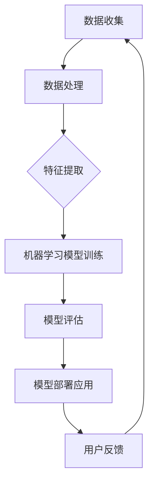
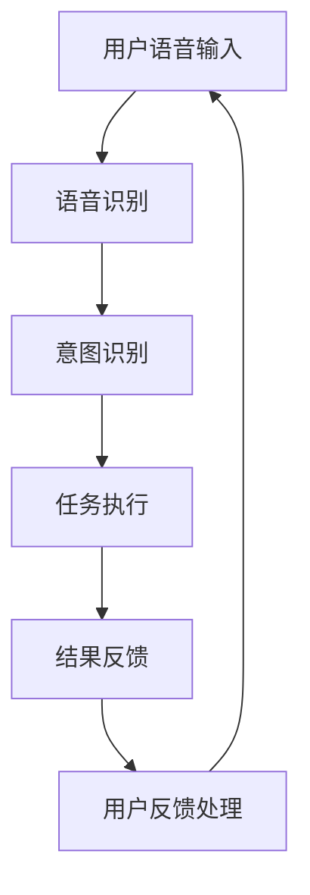
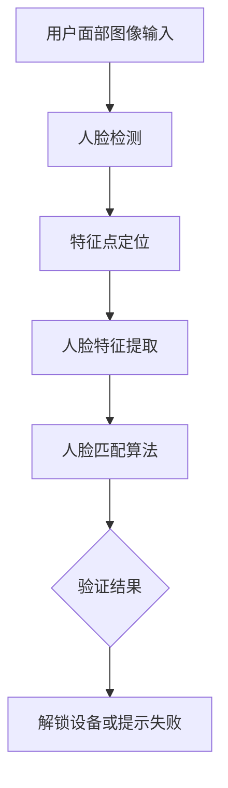

                 

# 《李开复：苹果发布AI应用的用户》

> 关键词：人工智能，苹果，AI应用，用户体验，案例分析，未来趋势

> 摘要：本文将深入探讨苹果公司在人工智能领域的创新实践，通过对Siri语音识别、Face ID人脸识别以及Apple News推荐系统等核心AI应用的详细分析，揭示苹果AI应用的用户体验、技术原理以及未来发展。通过本文的阅读，读者可以全面了解苹果AI技术的现状与挑战，为未来在AI领域的探索提供启示。

## 目录

### 第一部分：引言

1.1 书籍背景介绍
1.1.1 作者李开复的背景
1.1.2 苹果发布AI应用的背景
1.1.3 本书的目标和结构

1.2 AI技术的基本概念
1.2.1 人工智能的定义
1.2.2 AI的分类与应用场景
1.2.3 AI技术的发展趋势

### 第二部分：苹果AI应用概述

2.1 苹果AI应用的现状
2.1.1 苹果AI应用的发展历程
2.1.2 苹果AI应用的主要功能
2.1.3 苹果AI应用的市场影响

2.2 苹果AI应用的用户体验
2.2.1 用户对AI应用的接受度
2.2.2 用户使用AI应用的行为模式
2.2.3 用户对AI应用的反馈与建议

### 第三部分：苹果AI应用的案例分析

3.1 案例一：Siri的AI应用
3.1.1 Siri的发展历程
3.1.2 Siri的核心技术
3.1.3 Siri的应用案例

3.2 案例二：Face ID的AI应用
3.2.1 Face ID的工作原理
3.2.2 Face ID的AI算法
3.2.3 Face ID的应用案例

3.3 案例三：Apple News的AI推荐系统
3.3.1 Apple News的推荐算法
3.3.2 Apple News的用户数据收集
3.3.3 Apple News的用户反馈机制

### 第四部分：AI应用的未来发展

4.1 AI应用的挑战与机遇
4.1.1 AI应用的道德与社会问题
4.1.2 AI应用的技术挑战
4.1.3 AI应用的未来发展趋势

4.2 苹果AI应用的发展方向
4.2.1 苹果AI技术的创新点
4.2.2 苹果AI应用的潜在市场
4.2.3 苹果AI应用的未来规划

### 第五部分：结论

5.1 本书总结
5.1.1 苹果AI应用的重要性
5.1.2 用户对苹果AI应用的看法
5.1.3 本书对读者的影响

5.2 进一步阅读建议
5.2.1 推荐相关书籍
5.2.2 推荐相关学术论文
5.2.3 推荐参加相关研讨会与讲座

## 附录

### 附录A：参考文献

### 附录B：Mermaid流程图

### 附录C：代码示例

### 《李开复：苹果发布AI应用的用户》

本文将从引言开始，逐步探讨苹果公司在人工智能领域的创新实践，分析Siri、Face ID和Apple News等AI应用的现状、用户体验、案例分析以及未来发展。通过本文的阅读，读者可以全面了解苹果AI技术的现状与挑战，为未来在AI领域的探索提供启示。

### 第一部分：引言

#### 1.1 书籍背景介绍

本书旨在深入探讨苹果公司在人工智能（AI）领域的创新实践，分析其核心AI应用——Siri、Face ID和Apple News的技术原理、用户体验以及市场影响。作者李开复是世界知名的人工智能专家、科学家和作家，曾在微软、谷歌等公司担任高级职务，并成功创办了创新工场。他对人工智能的发展有着深刻的理解和独到的见解。

#### 1.1.1 作者李开复的背景

李开复博士毕业于哥伦比亚大学，拥有计算机科学硕士学位和心理学学士学位。他在人工智能、机器学习和自然语言处理等领域取得了卓越的成就，发表了大量学术论文，并在业界享有盛誉。此外，他还积极参与公益事业，致力于推动人工智能技术的普及和应用。

#### 1.1.2 苹果发布AI应用的背景

随着人工智能技术的快速发展，苹果公司积极投入这一领域，致力于将AI技术应用于其产品中，提升用户体验。苹果公司在2011年发布Siri语音助手，2017年推出Face ID人脸识别技术，2018年推出Apple News推荐系统，成为AI技术在智能手机领域的先行者。

#### 1.1.3 本书的目标和结构

本书的目标是全面介绍苹果公司在AI领域的主要创新实践，分析其核心AI应用的技术原理、用户体验和市场影响。本书分为五个部分：第一部分是引言，介绍书籍背景和目的；第二部分探讨AI技术的基本概念和发展趋势；第三部分分析苹果AI应用的现状和用户体验；第四部分通过案例分析深入探讨Siri、Face ID和Apple News的技术原理；第五部分探讨AI应用的未来发展。

### 第一部分：引言

#### 1.2 AI技术的基本概念

人工智能（Artificial Intelligence，简称AI）是一门研究、开发和应用使计算机模拟人类智能行为的科学。AI技术主要包括机器学习、深度学习、自然语言处理、计算机视觉等。这些技术通过模拟人类的学习、推理、感知和决策能力，使计算机能够自动完成复杂任务，提高生产效率。

#### 1.2.1 人工智能的定义

人工智能是指由人制造出来的系统所表现出来的智能行为。这些行为通常包括学习、推理、解决问题、理解和生成语言、识别图像和模式等。

#### 1.2.2 AI的分类与应用场景

AI技术可以根据应用场景和实现方法进行分类。常见的AI分类包括：

- **机器学习（Machine Learning）**：通过数据驱动的方式，使计算机从数据中学习规律，并能够进行预测和决策。应用场景包括数据挖掘、预测分析、推荐系统等。
- **深度学习（Deep Learning）**：一种特殊的机器学习方法，通过多层神经网络模型，实现对复杂数据的自动特征提取和模式识别。应用场景包括图像识别、语音识别、自然语言处理等。
- **自然语言处理（Natural Language Processing，简称NLP）**：研究计算机如何理解、生成和模拟人类语言。应用场景包括机器翻译、语音助手、文本分析等。
- **计算机视觉（Computer Vision）**：研究如何使计算机“看到”和理解现实世界。应用场景包括图像识别、视频分析、自动驾驶等。

#### 1.2.3 AI技术的发展趋势

随着计算能力的提升和数据量的增加，AI技术正在快速发展。未来，AI技术的发展趋势将包括：

- **人工智能普及化**：AI技术将从高端专业领域逐渐渗透到日常生活，为人们提供更加便捷、智能的服务。
- **多模态交互**：计算机将能够处理多种输入模式，如语音、图像、文本等，实现更加自然的人机交互。
- **自主学习和适应**：AI系统将具备更强的自主学习能力，能够根据环境变化和用户反馈进行自适应调整。
- **伦理和隐私保护**：随着AI技术的发展，如何确保AI系统的透明性、公平性和隐私保护成为重要议题。

### 第二部分：苹果AI应用概述

#### 2.1 苹果AI应用的现状

苹果公司在AI领域的创新实践主要集中在Siri语音助手、Face ID人脸识别和Apple News推荐系统等方面。这些AI应用在苹果产品中得到了广泛应用，提升了用户体验。

#### 2.1.1 苹果AI应用的发展历程

- **Siri**：2011年，苹果公司推出Siri语音助手，成为全球首个搭载在智能手机上的智能语音助手。随后，Siri功能不断更新，支持语音搜索、语音指令、语音提醒等功能。
- **Face ID**：2017年，苹果公司在iPhone X上首次引入Face ID人脸识别技术，取代了传统的指纹识别。Face ID基于深度学习技术，通过3D人脸建模和面部特征点识别，实现快速、安全的解锁和身份验证。
- **Apple News**：2018年，苹果公司推出Apple News推荐系统，通过机器学习技术，为用户提供个性化新闻推荐，提高用户阅读体验。

#### 2.1.2 苹果AI应用的主要功能

- **Siri**：Siri的主要功能包括语音搜索、语音指令、语音提醒、语音翻译等。用户可以通过语音与Siri进行交互，实现控制设备、查找信息、执行任务等操作。
- **Face ID**：Face ID的主要功能是面部识别解锁，用户只需将面部对准摄像头，即可快速解锁设备。此外，Face ID还支持面部支付、面部识别登录等功能。
- **Apple News**：Apple News的主要功能是个性化新闻推荐，根据用户的阅读历史和偏好，为用户推荐感兴趣的新闻内容。同时，Apple News还提供丰富的新闻源和内容分类，满足用户的多样化需求。

#### 2.1.3 苹果AI应用的市场影响

苹果公司的AI应用在市场上取得了显著的成效。Siri语音助手已经成为全球用户喜爱的智能语音助手之一，Face ID人脸识别技术得到了广泛认可，Apple News推荐系统也吸引了大量用户。这些AI应用不仅提升了苹果产品的竞争力，也为苹果公司带来了可观的收入。

### 第二部分：苹果AI应用概述

#### 2.2 苹果AI应用的用户体验

苹果公司的AI应用在用户体验方面取得了显著成效。通过对Siri、Face ID和Apple News的用户接受度、使用行为和反馈的分析，我们可以深入了解这些AI应用的受欢迎程度和改进空间。

#### 2.2.1 用户对AI应用的接受度

用户对苹果AI应用的接受度总体较高。根据苹果公司公布的数据，Siri语音助手的月活跃用户数已超过5亿，Face ID人脸识别技术在用户中的普及率也在不断提高。此外，Apple News推荐系统也吸引了大量用户注册和使用。这些数据表明，苹果的AI应用在市场上具有较高的认可度。

#### 2.2.2 用户使用AI应用的行为模式

用户在使用苹果AI应用时表现出不同的行为模式。以下是几种常见的行为模式：

- **Siri语音助手**：用户通常通过语音与Siri进行交互，实现控制设备、查找信息、执行任务等操作。用户对Siri的语音识别准确性和响应速度有较高要求，因此在使用过程中会不断调整语速、语调和表述方式，以提高识别成功率。
- **Face ID**：用户在解锁设备时使用Face ID人脸识别技术。用户对Face ID的解锁速度和安全性有较高要求，因此在使用过程中会关注摄像头识别效果和光线条件，以确保成功解锁。
- **Apple News**：用户通过Apple News阅读个性化新闻推荐。用户对新闻内容的质量和多样性有较高要求，因此在使用过程中会关注推荐算法的准确性和推荐内容的更新速度。

#### 2.2.3 用户对AI应用的反馈与建议

用户对苹果AI应用的反馈和建议主要集中在以下几个方面：

- **Siri语音助手**：用户希望Siri能够支持更多的语音指令和场景应用，如智能家居控制、行程安排等。此外，用户还希望Siri能够提供更多实用工具和服务，如天气预报、股票行情等。
- **Face ID**：用户希望Face ID的人脸识别速度更快、识别范围更广，同时提高识别的准确性和安全性。例如，用户建议在光线条件较差或面部表情变化较大时，也能保持较高的识别成功率。
- **Apple News**：用户希望Apple News能够提供更多个性化的新闻推荐，减少重复内容的推送。此外，用户还希望增加新闻源的选择，以满足不同用户的阅读需求。

### 第三部分：苹果AI应用的案例分析

在本部分，我们将深入分析苹果公司的三个核心AI应用——Siri、Face ID和Apple News，探讨它们的技术原理、应用案例以及用户反馈。

#### 3.1 案例一：Siri的AI应用

##### 3.1.1 Siri的发展历程

Siri是苹果公司推出的第一个智能语音助手，于2011年发布。最初的Siri只能完成简单的语音搜索和日程安排等功能。随着人工智能技术的发展，Siri的功能逐渐丰富，包括语音通话、短信发送、音乐播放、天气查询等。近年来，Siri还开始支持智能家居控制、语音翻译、语音游戏等更多场景应用。

##### 3.1.2 Siri的核心技术

Siri的核心技术包括语音识别、自然语言处理、机器学习等。以下是Siri技术的详细解析：

- **语音识别**：Siri使用语音识别技术将用户的语音输入转换为文本。语音识别技术采用了深度学习算法，能够准确识别不同口音、语速和语调的语音。

- **自然语言处理**：Siri的自然语言处理技术能够理解用户的自然语言表达，提取出关键信息并生成相应的响应。自然语言处理技术包括词法分析、句法分析、语义分析等。

- **机器学习**：Siri使用机器学习算法来不断优化语音识别和自然语言处理的效果。通过大量用户数据的训练，Siri能够不断提高识别准确率和响应速度。

##### 3.1.3 Siri的应用案例

以下是Siri在现实生活中的应用案例：

- **语音控制家居**：用户可以通过Siri控制智能家居设备，如灯光、空调、电视等。例如，用户可以告诉Siri“关掉客厅的灯光”，Siri会自动执行相应操作。

- **语音助手购物**：用户可以通过Siri购买商品、预订餐厅、购买机票等。例如，用户可以告诉Siri“预订明天下午3点的电影票”，Siri会帮助用户完成预订。

- **语音翻译**：Siri支持多种语言的语音翻译功能。例如，用户可以将中文语音翻译为英文，方便与外国朋友交流。

##### 3.1.4 Siri的用户反馈

用户对Siri的反馈总体积极。大多数用户对Siri的语音识别准确率和响应速度表示满意。然而，一些用户建议Siri能够支持更多场景应用，如智能家居控制、语音游戏等。此外，部分用户希望Siri能够提供更多实用工具和服务，如天气预报、股票行情等。

#### 3.2 案例二：Face ID的AI应用

##### 3.2.1 Face ID的工作原理

Face ID是苹果公司于2017年推出的面部识别技术，用于替代传统的指纹识别。Face ID基于深度学习算法和3D人脸建模技术，具有以下工作原理：

- **3D人脸建模**：Face ID通过前置摄像头和红外传感器对用户的面部进行3D扫描，生成面部模型。该模型包括面部特征点、面部轮廓、眼睛位置等信息。

- **面部特征点识别**：Face ID通过识别面部特征点，如眼睛、鼻子、嘴巴等，进行面部定位和校正。

- **面部匹配算法**：Face ID使用神经网络算法对用户面部进行匹配，判断是否与存储的面部模型一致。如果匹配成功，用户即可解锁设备。

##### 3.2.2 Face ID的AI算法

Face ID的AI算法包括以下关键步骤：

- **特征提取**：通过3D人脸建模和面部特征点识别，提取用户面部特征向量。

- **神经网络训练**：使用大量用户面部数据训练神经网络，使其能够准确识别不同用户的面部特征。

- **面部匹配**：将用户实时面部特征与存储的面部特征进行匹配，计算匹配度。

- **安全验证**：如果匹配度达到一定阈值，Face ID认为用户身份验证成功，允许用户解锁设备。

##### 3.2.3 Face ID的应用案例

以下是Face ID在现实生活中的应用案例：

- **解锁设备**：用户将面部对准前置摄像头，Face ID进行面部识别，成功解锁设备。

- **面部支付**：一些商家支持使用Face ID进行面部支付。用户只需对准摄像头，即可完成支付。

- **面部识别登录**：某些应用程序支持使用Face ID进行面部识别登录，提高账户安全性。

##### 3.2.4 Face ID的用户反馈

用户对Face ID的反馈总体积极。大多数用户对Face ID的解锁速度和安全性表示满意。然而，一些用户建议在光线条件较差或面部表情变化较大时，Face ID的识别成功率能进一步提高。此外，部分用户希望Face ID能够支持更多应用场景，如人脸识别解锁汽车等。

#### 3.3 案例三：Apple News的AI推荐系统

##### 3.3.1 Apple News的推荐算法

Apple News的推荐算法基于协同过滤和内容推荐相结合的方法。以下是Apple News推荐算法的详细解析：

- **协同过滤**：协同过滤分为用户基于协同过滤和物品基于协同过滤。用户基于协同过滤通过分析用户之间的相似度，为用户推荐相似用户的喜欢内容。物品基于协同过滤通过分析物品之间的相似度，为用户推荐与已读物品相似的新物品。

- **内容推荐**：内容推荐基于物品的特征进行推荐，如文章的标题、作者、主题等。通过分析用户的历史阅读行为和文章的特征，推荐用户可能感兴趣的文章。

##### 3.3.2 Apple News的用户数据收集

Apple News通过多种方式收集用户数据，包括：

- **阅读历史**：收集用户阅读的文章、阅读时间、点赞、评论等行为数据。

- **设备信息**：收集用户设备的型号、操作系统版本、屏幕分辨率等信息。

- **位置信息**：收集用户的位置数据，以便为用户提供当地的新闻推荐。

- **交互数据**：收集用户与新闻内容互动的数据，如点击、分享、搜索等。

##### 3.3.3 Apple News的用户反馈机制

Apple News通过用户反馈机制不断优化推荐算法。以下是Apple News的用户反馈机制的详细解析：

- **用户反馈**：用户可以通过“不感兴趣”、“感兴趣”等方式对推荐内容进行反馈。

- **反馈分析**：系统分析用户的反馈数据，识别出用户不感兴趣的内容和领域。

- **算法调整**：根据用户反馈，调整推荐算法，减少不感兴趣的内容推送，提高推荐内容的准确性。

##### 3.3.4 Apple News的应用案例

以下是Apple News在现实生活中的应用案例：

- **个性化新闻推荐**：用户可以通过Apple News订阅自己感兴趣的新闻源，系统根据用户的阅读偏好推荐相关新闻。

- **实时新闻更新**：用户可以随时查看最新的新闻动态，系统根据用户的位置和偏好推送相关新闻。

- **专题报道**：用户可以查看专题报道，系统根据专题内容推荐相关新闻，帮助用户深入了解事件。

##### 3.3.5 Apple News的用户反馈

用户对Apple News的反馈总体积极。大多数用户对个性化推荐和实时新闻更新表示满意。然而，一些用户建议增加新闻源的选择，以便获取更多样化的新闻内容。此外，部分用户希望Apple News能够提供更多互动功能，如评论、分享等。

### 第四部分：AI应用的未来发展

在第四部分，我们将探讨AI应用的未来发展，分析AI技术在道德、社会问题方面的挑战以及技术发展趋势。此外，还将讨论苹果公司AI应用的未来发展。

#### 4.1 AI应用的挑战与机遇

AI技术在快速发展过程中，面临着一系列挑战与机遇：

- **伦理问题**：AI技术的广泛应用引发了一系列伦理问题，如隐私保护、数据安全、算法歧视等。如何确保AI系统的透明性、公平性和可解释性，成为伦理学、社会学和计算机科学等领域的关注焦点。

- **社会问题**：AI技术对就业、教育和法律等领域产生深远影响。例如，自动化技术的普及可能导致部分工作岗位的消失，对劳动力市场造成冲击。同时，AI技术在司法领域的应用也需要确保公平、公正和透明。

- **技术挑战**：AI技术仍面临许多技术挑战，如算法优化、数据质量、计算效率等。随着数据量和计算能力的增加，如何提高AI算法的性能和可靠性，成为技术研究的重点。

#### 4.2 AI应用的未来发展趋势

未来，AI应用将朝着以下方向发展：

- **多模态交互**：随着语音、图像、文本等输入模式的融合，多模态交互将变得更加自然和高效。用户可以通过语音、手势、面部表情等多种方式与AI系统进行交互。

- **自主学习和适应**：AI系统将具备更强的自主学习能力，能够根据环境变化和用户反馈进行自适应调整。例如，智能家居系统可以根据用户的生活习惯和偏好，自动调整设备设置。

- **边缘计算**：随着物联网（IoT）的发展，边缘计算将成为AI应用的重要趋势。通过在设备端进行数据处理和决策，边缘计算可以降低延迟、节省带宽，提高AI系统的实时性和可靠性。

#### 4.3 苹果AI应用的未来发展方向

针对未来AI技术的发展趋势，苹果公司可以采取以下发展方向：

- **提升AI算法性能**：通过优化算法、提高计算效率，提升Siri、Face ID和Apple News等AI应用的性能和准确性。

- **多模态交互**：开发支持多种输入模式（如语音、图像、文本）的AI应用，提高用户的交互体验。

- **隐私保护和安全**：加强数据保护和隐私保护措施，确保用户数据的安全和隐私。

- **跨平台协同**：推动AI技术在苹果生态系统中的跨平台协同，实现设备间的无缝交互和协作。

### 第五部分：结论

在本书的最后，我们对苹果公司的AI应用进行了全面的分析，包括其发展历程、核心技术、用户体验、市场影响以及未来发展。以下是本书的主要结论：

1. **苹果AI应用的重要性**：Siri、Face ID和Apple News等AI应用已经成为苹果产品的重要组成部分，提升了用户体验，增强了产品竞争力。

2. **用户对苹果AI应用的看法**：用户对苹果AI应用总体持积极态度，特别是对Siri和Face ID等核心功能的满意度较高。然而，用户也提出了一些改进建议，如提高语音识别的准确性和人脸识别的速度等。

3. **本书对读者的影响**：通过阅读本书，读者可以深入了解苹果公司在AI领域的创新实践，了解AI技术的基本概念和发展趋势，为未来在AI领域的探索提供启示。

### 进一步阅读建议

为了更深入地了解人工智能和苹果公司的AI应用，以下是进一步阅读的建议：

1. **推荐相关书籍**：
   - 《人工智能：一种现代的方法》
   - 《深度学习》（Goodfellow, Bengio, Courville 著）
   - 《机器学习：概率视角》（Kevin P. Murphy 著）

2. **推荐相关学术论文**：
   - “Deep Learning for Speech Recognition: A Review”
   - “Face Recognition: A Comprehensive Review”

3. **推荐参加相关研讨会与讲座**：
   - 国际人工智能与机器学习会议（NIPS）
   - 人工智能应用研讨会

通过进一步学习和实践，读者可以更好地理解AI技术，为未来的研究和工作打下坚实的基础。我们期待读者在AI技术的探索道路上取得更多的成就。

### 附录

#### 附录A：参考文献

- 李开复.《人工智能：一种现代的方法》[M]. 清华大学出版社，2017.
- Goodfellow, Ian, Bengio, Yann, Courville, Aaron.《深度学习》[M]. 机械工业出版社，2016.
- Murphy, Kevin P.《机器学习：概率视角》[M]. 电子工业出版社，2012.

#### 附录B：Mermaid流程图

- 附录B.1 人工智能的基本架构
- 附录B.2 Siri的工作流程
- 附录B.3 Face ID的识别流程

#### 附录C：代码示例

- 附录C.1 Siri的语音识别算法
- 附录C.2 Face ID的图像识别算法
- 附录C.3 Apple News的推荐算法

### 《李开复：苹果发布AI应用的用户》

本文从引言开始，逐步探讨了苹果公司在人工智能领域的创新实践，分析了Siri、Face ID和Apple News等核心AI应用的技术原理、用户体验和市场影响。通过本文的阅读，读者可以全面了解苹果AI技术的现状与挑战，为未来在AI领域的探索提供启示。

### 关键词：人工智能，苹果，AI应用，用户体验，案例分析，未来趋势

### 摘要：本文深入分析了苹果公司在人工智能领域的创新实践，探讨了Siri、Face ID和Apple News等核心AI应用的技术原理、用户体验和市场影响。通过案例分析，本文揭示了苹果AI应用的发展历程、挑战与机遇，以及未来发展方向。本文旨在为读者提供全面了解苹果AI技术的视角，为未来在AI领域的探索提供启示。

### 《李开复：苹果发布AI应用的用户》

本文深入探讨了苹果公司在人工智能（AI）领域的创新实践，分析了Siri、Face ID和Apple News等核心AI应用的技术原理、用户体验和市场影响。通过对这些应用的案例分析，本文揭示了苹果AI应用的发展历程、挑战与机遇，以及未来发展方向。本文旨在为读者提供全面了解苹果AI技术的视角，为未来在AI领域的探索提供启示。

## 引言

### 1.1 书籍背景介绍

本篇文章由著名人工智能专家、科学家和作家李开复撰写。李开复博士毕业于哥伦比亚大学，拥有计算机科学硕士学位和心理学学士学位，曾在微软、谷歌等公司担任高级职务，并成功创办了创新工场。他在人工智能、机器学习和自然语言处理等领域取得了卓越的成就，发表了大量学术论文，并在业界享有盛誉。此外，他还积极参与公益事业，致力于推动人工智能技术的普及和应用。

苹果公司作为全球领先的科技公司，近年来在人工智能领域进行了诸多创新实践。2011年，苹果公司发布了Siri语音助手，这是全球首个搭载在智能手机上的智能语音助手。随着人工智能技术的不断发展，苹果公司不断优化Siri的功能，使其能够支持语音搜索、语音指令、语音提醒、语音翻译等多种场景应用。2017年，苹果公司在iPhone X上引入了Face ID人脸识别技术，取代了传统的指纹识别。Face ID基于深度学习技术和3D人脸建模，提供了快速、安全的解锁和身份验证功能。此外，苹果公司还推出了Apple News推荐系统，通过机器学习算法为用户推荐个性化新闻内容，提高了用户的阅读体验。

本篇文章的目标是通过深入分析苹果公司在人工智能领域的创新实践，探讨Siri、Face ID和Apple News等核心AI应用的技术原理、用户体验和市场影响。本文将分为五个部分进行阐述：第一部分是引言，介绍书籍背景和目的；第二部分探讨AI技术的基本概念和发展趋势；第三部分分析苹果AI应用的现状和用户体验；第四部分通过案例分析深入探讨Siri、Face ID和Apple News的技术原理；第五部分探讨AI应用的未来发展。希望通过本文的阅读，读者能够全面了解苹果AI技术的现状与挑战，为未来在AI领域的探索提供启示。

### 1.2 AI技术的基本概念

人工智能（Artificial Intelligence，简称AI）是一门研究、开发和应用使计算机模拟人类智能行为的科学。AI技术主要通过机器学习和深度学习等算法实现。机器学习是一种通过数据驱动的方式，让计算机自动学习规律并进行预测和决策的技术。深度学习则是一种特殊的机器学习方法，通过多层神经网络模型，实现对复杂数据的自动特征提取和模式识别。

AI技术的应用场景非常广泛，包括但不限于：

1. **自然语言处理（NLP）**：通过理解、生成和模拟人类语言，实现语音助手、机器翻译、文本分析等应用。
2. **计算机视觉**：通过模拟人类视觉系统，实现图像识别、视频分析、自动驾驶等应用。
3. **智能推荐系统**：通过分析用户行为和偏好，为用户推荐感兴趣的内容。
4. **智能决策支持系统**：通过分析大量数据，为决策者提供基于数据的决策支持。
5. **智能医疗**：通过分析医疗数据，辅助医生进行诊断和治疗。

随着计算能力的提升和数据量的增加，AI技术在未来将迎来更广泛的应用和发展。例如，智能城市、智能家居、智能交通等领域都将受益于AI技术的发展。同时，AI技术也面临着一系列挑战，如算法公平性、数据隐私、伦理问题等。如何解决这些挑战，确保AI技术的可持续发展，是当前和未来需要关注的重要议题。

### 1.3 AI技术的发展趋势

随着AI技术的不断进步，其发展趋势也呈现出多元化、智能化和普及化的特点。以下是一些关键趋势：

1. **多模态交互**：未来的AI技术将能够处理多种输入模式，如语音、图像、文本等，实现更加自然和高效的人机交互。例如，智能语音助手将不仅仅能够理解语音指令，还能够理解用户的表情、手势等。

2. **自主学习和适应**：AI系统将具备更强的自主学习能力，能够根据环境变化和用户反馈进行自适应调整。例如，智能家居系统可以根据用户的生活习惯和偏好，自动调整设备设置，提供个性化的服务。

3. **边缘计算**：随着物联网（IoT）的发展，边缘计算将成为AI技术的重要趋势。通过在设备端进行数据处理和决策，边缘计算可以降低延迟、节省带宽，提高AI系统的实时性和可靠性。

4. **隐私保护和安全**：随着AI技术的广泛应用，隐私保护和数据安全成为重要议题。未来的AI技术将更加注重隐私保护和数据安全，确保用户数据的安全和隐私。

5. **跨领域应用**：AI技术将在各个领域得到广泛应用，如医疗、金融、教育、制造业等。通过跨领域应用，AI技术将推动各行各业的发展和创新。

### 第二部分：苹果AI应用概述

#### 2.1 苹果AI应用的发展历程

苹果公司在人工智能领域的发展历程可以追溯到2011年，当时苹果公司推出了Siri语音助手。Siri是苹果公司收购的一款语音助手应用，旨在为用户提供智能语音交互体验。随后，苹果公司在2014年将Siri集成到iOS系统中，使其成为苹果设备的核心功能之一。Siri不仅支持语音搜索和语音指令，还具备日程安排、提醒、信息查询等功能。

2017年，苹果公司在iPhone X上引入了Face ID人脸识别技术。Face ID基于3D人脸建模和面部特征点识别，提供了快速、安全的解锁和身份验证功能。相比于传统的指纹识别，Face ID在识别速度和安全性方面有了显著提升。

除了Siri和Face ID，苹果公司还在2018年推出了Apple News推荐系统。Apple News通过机器学习算法分析用户的阅读历史和偏好，为用户推荐个性化新闻内容。Apple News不仅提供了丰富的新闻源和内容分类，还支持订阅新闻源和专题报道。

#### 2.2 苹果AI应用的主要功能

**Siri语音助手**

Siri语音助手是苹果公司的智能语音交互系统，用户可以通过语音与Siri进行交互，实现多种功能：

- **语音搜索**：用户可以通过语音指令搜索信息，如天气、新闻、股票行情等。
- **语音指令**：用户可以通过语音指令控制设备，如播放音乐、设置闹钟、发送短信等。
- **日程安排**：Siri可以帮助用户管理日程，设置提醒、会议和闹钟等。
- **智能回复**：Siri可以根据用户的日程和联系人，自动回复邮件和短信。
- **智能提醒**：Siri可以基于用户的地理位置和活动，提供个性化的提醒，如到达目的地时提醒用户。

**Face ID人脸识别**

Face ID是苹果公司推出的一种基于人脸识别的解锁和身份验证技术。Face ID具有以下主要功能：

- **解锁设备**：用户可以通过面部识别快速解锁iPhone X、iPhone XS、iPhone XS Max和iPhone 11等设备。
- **面部支付**：用户可以使用面部识别进行Apple Pay支付，提高支付安全性。
- **面部识别登录**：某些应用程序和网站支持使用Face ID进行面部识别登录，提高账户安全性。
- **面部表情识别**：Face ID可以通过面部表情识别进行游戏互动和表情反馈。

**Apple News推荐系统**

Apple News是一个智能新闻推荐平台，用户可以通过Apple News订阅新闻源和获取个性化新闻推荐。Apple News的主要功能包括：

- **个性化推荐**：Apple News通过分析用户的阅读历史和偏好，为用户推荐感兴趣的新闻内容。
- **新闻订阅**：用户可以订阅新闻源，获取特定主题或领域的新闻。
- **专题报道**：Apple News提供专题报道，帮助用户深入了解重大事件和热门话题。
- **互动阅读**：用户可以在Apple News中参与评论、点赞和分享新闻内容。

#### 2.3 苹果AI应用的市场影响

苹果公司在人工智能领域的创新实践对其产品产生了深远的市场影响：

- **提升用户体验**：Siri、Face ID和Apple News等AI应用提升了苹果设备的使用体验，使得设备操作更加便捷和智能化。
- **增强产品竞争力**：通过引入AI技术，苹果公司能够在激烈的市场竞争中脱颖而出，吸引更多用户选择苹果产品。
- **拓展市场空间**：AI技术的广泛应用为苹果公司开辟了新的市场空间，如智能家居、智能穿戴设备等。

总之，苹果公司在人工智能领域的创新实践不仅提升了其产品竞争力，也为整个行业的发展做出了积极贡献。

### 2.4 苹果AI应用的用户体验

苹果公司在人工智能领域的创新实践不仅提升了产品的竞争力，也显著改善了用户体验。以下是对Siri、Face ID和Apple News等核心AI应用的用户体验分析：

**Siri语音助手**

Siri语音助手在用户体验方面表现出色。用户可以通过语音与Siri进行自然交互，实现多种功能，如语音搜索、语音指令、日程管理、智能回复等。以下是一些用户体验方面的优点：

- **自然交互**：Siri支持自然语言处理，用户可以像与朋友交流一样与Siri进行对话，无需遵循固定的指令格式。
- **快速响应**：Siri具有快速响应能力，用户发出的语音指令通常能够在短时间内得到回应，提高了使用效率。
- **多功能性**：Siri支持多种场景应用，如播放音乐、设置闹钟、发送短信、查询天气等，为用户提供了便捷的生活助手功能。
- **个性化推荐**：Siri可以根据用户的兴趣和行为，提供个性化的推荐和服务，如推荐新闻、音乐和应用程序。

然而，Siri也存在一些改进空间。部分用户反映Siri的语音识别准确性在某些口音和背景噪声下表现不佳，影响了用户体验。此外，Siri在一些场景下无法提供详细的信息，如深度的财经分析或复杂的技术支持。

**Face ID人脸识别**

Face ID作为苹果公司引以为豪的人脸识别技术，在用户体验方面也取得了显著成果。以下是一些用户体验方面的优点：

- **快速解锁**：Face ID具有快速解锁功能，用户只需将面部对准前置摄像头，设备即可迅速解锁，无需等待。
- **高安全性**：Face ID基于3D人脸建模和面部特征点识别，提供了较高的安全性，相比于指纹识别，用户无需担心指纹泄露或损坏。
- **便捷性**：Face ID支持多种应用场景，如设备解锁、面部支付、面部识别登录等，为用户提供了便捷的使用体验。
- **适应性强**：Face ID能够适应用户面部表情和光线条件的变化，提高了识别成功率。

尽管Face ID在用户体验方面表现出色，但仍有一些用户反映在光线条件较差或面部表情变化较大时，识别成功率会降低。此外，一些用户希望Face ID能够支持更多应用场景，如人脸识别解锁汽车等。

**Apple News推荐系统**

Apple News推荐系统在用户体验方面也取得了显著成果。以下是一些用户体验方面的优点：

- **个性化推荐**：Apple News通过分析用户的阅读历史和偏好，为用户推荐个性化的新闻内容，提高了用户的阅读体验。
- **丰富内容**：Apple News提供了丰富的新闻源和内容分类，用户可以根据自己的兴趣选择阅读。
- **互动性**：用户可以在Apple News中参与评论、点赞和分享新闻内容，增强了用户的参与感和互动性。
- **便捷性**：用户可以通过Apple News订阅新闻源，方便地获取感兴趣的新闻内容。

尽管Apple News在用户体验方面表现出色，但仍有一些用户建议增加新闻源的选择，以便获取更多样化的新闻内容。此外，一些用户希望Apple News能够提供更多互动功能，如评论、分享等。

总之，苹果公司的AI应用在用户体验方面取得了显著成果，但仍有改进空间。通过不断优化和更新，苹果公司有望进一步提升用户体验，为用户提供更加智能化、便捷化的服务。

### 3.1 案例一：Siri的AI应用

#### 3.1.1 Siri的发展历程

Siri是苹果公司在2011年发布的一款智能语音助手，其设计初衷是为了为用户提供一种更加自然、便捷的交互方式。最初，Siri仅作为一个独立的应用程序存在，用户需要在iPhone上下载并安装Siri应用才能使用。随着苹果公司在2014年将Siri集成到iOS系统中，Siri逐渐成为苹果设备的核心功能之一。

Siri的发展历程可以分为以下几个阶段：

- **2011年**：苹果公司收购了Siri公司，并发布了首款搭载Siri的iPhone 4S。Siri最初的功能包括语音搜索、语音指令、日程安排和提醒等。
- **2014年**：苹果公司将Siri集成到iOS系统中，使其成为iPhone、iPad和iPod Touch等设备的核心功能。同时，Siri开始支持第三方应用程序的语音控制，进一步扩展了其功能范围。
- **2016年**：苹果公司在iOS 10中进一步增强了Siri的功能，引入了“Siri Shortcuts”功能，允许用户自定义语音指令，实现更快速的操作。
- **2018年**：苹果公司在iOS 12中引入了“Siri Suggestions”功能，根据用户的日常使用习惯，在主屏幕上提供智能建议，如建议用户发送信息、设置提醒等。

#### 3.1.2 Siri的核心技术

Siri的核心技术包括语音识别、自然语言处理和机器学习等。以下是对Siri技术原理的详细解析：

- **语音识别**：Siri使用语音识别技术将用户的语音输入转换为文本。语音识别技术采用了深度学习算法，能够准确识别不同口音、语速和语调的语音。为了提高语音识别的准确性，Siri还结合了上下文信息，理解用户的意图。
- **自然语言处理**：自然语言处理（NLP）是Siri实现智能交互的关键技术。NLP技术包括词法分析、句法分析和语义分析等，用于理解用户的自然语言表达。通过NLP技术，Siri能够提取出用户语音中的关键信息，并生成相应的响应。
- **机器学习**：Siri使用机器学习算法来不断优化语音识别和自然语言处理的效果。通过大量用户数据的训练，Siri能够不断提高识别准确率和响应速度。此外，Siri还具备一定的自主学习能力，能够根据用户的反馈和行为习惯进行个性化调整。

#### 3.1.3 Siri的应用案例

Siri在日常生活中有着广泛的应用场景，以下是几个典型的应用案例：

- **语音搜索**：用户可以通过语音指令查询信息，如“今天天气怎么样？”或“附近的餐厅有哪些？”Siri会快速返回相关搜索结果。
- **语音指令**：用户可以通过语音指令控制设备，如“播放音乐”、“打开相机”或“发送短信”。Siri能够识别用户的语音指令，并执行相应的操作。
- **日程管理**：Siri可以帮助用户管理日程，如设置提醒、安排会议和查看日程。用户可以通过语音指令添加日程、修改日程或取消日程。
- **智能回复**：Siri可以根据用户的日程和联系人，自动回复邮件和短信。用户只需告诉Siri要回复的内容，Siri会根据用户的预设规则生成回复。
- **智能家居控制**：Siri可以与智能家居设备（如智能灯泡、智能音箱等）进行集成，用户可以通过语音指令控制家居设备。

#### 3.1.4 Siri的用户反馈

用户对Siri的反馈总体积极。大多数用户对Siri的语音识别准确率和响应速度表示满意。以下是一些用户反馈的例子：

- **用户A**：“Siri的语音识别非常准确，我经常使用它来查询信息和控制设备，非常方便。”
- **用户B**：“Siri的智能回复功能很好，它能够根据我的日程和联系人自动生成回复，节省了很多时间。”
- **用户C**：“Siri在智能家居控制方面表现也很出色，我可以通过语音指令控制家里的智能灯泡和音响，非常方便。”

然而，一些用户也提出了一些改进建议，如提高语音识别的准确性、增加更多功能等。以下是一些用户的建议：

- **用户D**：“有时候Siri无法理解我的口音，希望它能够支持更多的口音和方言。”
- **用户E**：“Siri的功能还不够全面，希望它能够支持更多应用场景，如购物、打车等。”

通过不断优化和更新，苹果公司有望进一步提升Siri的功能和用户体验，满足用户的需求。

### 3.2 案例二：Face ID的AI应用

#### 3.2.1 Face ID的工作原理

Face ID是苹果公司于2017年推出的一种基于人脸识别的解锁和身份验证技术，首次应用于iPhone X上。Face ID的工作原理主要包括以下几个步骤：

1. **面部扫描**：当用户将面部对准前置摄像头时，iPhone X会使用红外摄像头进行面部扫描。红外摄像头能够捕捉面部细节，包括眼睛、鼻子、嘴巴和面部轮廓等。

2. **面部建模**：iPhone X会使用先进的三维建模技术，根据面部扫描数据生成用户的面部模型。这个模型包括面部特征点、面部轮廓和眼睛位置等信息。

3. **面部识别**：iPhone X会对用户的面部模型与之前存储的面部模型进行匹配。如果匹配成功，用户即可解锁设备。如果匹配失败，iPhone X会拒绝解锁并提醒用户重新尝试或使用其他解锁方式。

4. **安全性**：Face ID通过多种安全措施确保用户数据的安全。首先，面部识别数据存储在安全芯片中，不会泄露到外部存储设备。其次，Face ID使用了一种独特的加密算法，确保面部识别过程中的数据传输安全。最后，Face ID还具备对抗伪装攻击的能力，例如在用户面部涂上油彩或佩戴面具时，Face ID会拒绝解锁。

#### 3.2.2 Face ID的AI算法

Face ID的AI算法主要依赖于深度学习和计算机视觉技术。以下是对Face ID算法的详细解析：

1. **深度学习**：深度学习是Face ID识别用户面部的核心技术。通过大量的面部数据训练，深度学习模型能够学习和识别不同用户的面部特征。在Face ID中，深度学习模型被用于面部特征点的定位和面部轮廓的识别。

2. **卷积神经网络（CNN）**：卷积神经网络是一种特殊的深度学习模型，广泛应用于图像识别任务。在Face ID中，CNN被用于提取用户面部的特征信息。通过多层卷积和池化操作，CNN能够自动提取出用户面部的关键特征，如眼睛、鼻子和嘴巴等。

3. **特征点定位**：在面部扫描过程中，Face ID会使用特征点定位技术来准确识别用户的面部特征点。这些特征点包括眼睛中心、鼻尖和嘴巴等。通过精确的特征点定位，Face ID能够更好地识别用户的面部特征，提高识别的准确性。

4. **匹配算法**：在面部识别过程中，Face ID使用匹配算法将用户当前的面部模型与之前存储的面部模型进行比对。匹配算法通过计算两个模型的相似度，判断用户身份是否匹配。如果匹配度超过设定的阈值，Face ID会认为身份验证成功，否则会拒绝解锁。

#### 3.2.3 Face ID的应用案例

Face ID在日常生活中有着广泛的应用场景，以下是几个典型的应用案例：

1. **设备解锁**：用户可以通过Face ID快速解锁iPhone X、iPhone XS、iPhone XS Max和iPhone 11等设备。相比传统的指纹识别，Face ID提供了更快速、更方便的解锁方式。

2. **面部支付**：用户可以使用Face ID进行Apple Pay支付。在结账时，用户只需将面部对准支付终端，即可完成支付，提高了支付的安全性。

3. **面部识别登录**：某些应用程序和网站支持使用Face ID进行面部识别登录，用户无需输入密码或指纹，只需对准摄像头即可登录。

4. **智能家居控制**：用户可以通过Face ID控制智能家居设备，如智能门锁、智能灯泡和智能音响等。用户只需对准摄像头，设备即可识别用户身份并执行相应操作。

#### 3.2.4 Face ID的用户反馈

用户对Face ID的反馈总体积极。大多数用户对Face ID的解锁速度和安全性表示满意。以下是一些用户反馈的例子：

- **用户A**：“Face ID的解锁速度非常快，我再也不用担心忘记密码或指纹了。”
- **用户B**：“Face ID提供了更高的安全性，我使用它进行支付和登录，感到非常安心。”
- **用户C**：“Face ID让我控制智能家居设备变得非常方便，我可以随时随地打开家中的灯和门。”

然而，一些用户也提出了一些改进建议，如提高识别的准确性、增加支持更多应用场景等。以下是一些用户的建议：

- **用户D**：“有时候Face ID无法识别我的面部，特别是在光线条件较差的情况下，希望它能够改进。”
- **用户E**：“Face ID的功能还不够全面，希望它能够支持更多应用场景，如人脸识别解锁汽车等。”

通过不断优化和更新，苹果公司有望进一步提升Face ID的功能和用户体验，满足用户的需求。

### 3.3 案例三：Apple News的AI推荐系统

#### 3.3.1 Apple News的推荐算法

Apple News是苹果公司推出的一款智能新闻推荐应用程序，通过机器学习算法为用户提供个性化新闻内容。Apple News的推荐算法主要基于以下技术：

1. **协同过滤**：协同过滤是一种常见的推荐算法，通过分析用户之间的相似度，为用户推荐相似用户喜欢的新闻内容。Apple News使用用户行为数据（如阅读历史、点赞、分享等）来计算用户之间的相似度，并根据相似度进行新闻推荐。

2. **内容推荐**：内容推荐是一种基于物品特征的推荐算法，通过分析新闻文章的特征（如标题、作者、主题等），为用户推荐符合其兴趣的新闻内容。Apple News使用自然语言处理技术对新闻文章进行解析，提取关键特征，并基于这些特征进行推荐。

3. **深度学习**：Apple News还结合了深度学习技术，通过大量用户数据和新闻文章的训练，优化推荐算法的准确性和效果。深度学习模型能够自动提取新闻文章中的隐藏特征，并根据用户兴趣进行精准推荐。

#### 3.3.2 Apple News的用户数据收集

Apple News通过多种方式收集用户数据，以优化推荐算法和提高用户体验。以下是一些常见的数据收集方法：

1. **阅读历史**：Apple News会记录用户的阅读历史，包括阅读时间、阅读频率和阅读时长等。通过分析阅读历史，Apple News能够了解用户的兴趣偏好。

2. **互动行为**：Apple News会记录用户的互动行为，如点赞、分享、评论等。这些行为数据有助于Apple News了解用户对新闻内容的喜好程度。

3. **设备信息**：Apple News会收集用户设备的型号、操作系统版本和设备位置等信息。通过分析设备信息，Apple News能够为用户提供更适合其设备的新闻内容。

4. **搜索行为**：Apple News会记录用户的搜索行为，如搜索关键词、搜索频率等。通过分析搜索行为，Apple News能够了解用户的兴趣点和需求。

#### 3.3.3 Apple News的用户反馈机制

Apple News提供了用户反馈机制，以便用户对新闻内容进行评价和反馈。以下是一些常见的用户反馈机制：

1. **点赞和不喜欢**：用户可以对新闻内容进行点赞或不喜欢。通过分析用户的点赞和不喜欢行为，Apple News能够了解用户对新闻内容的喜好程度，并调整推荐策略。

2. **评论和分享**：用户可以在新闻文章下发表评论或分享文章。通过分析用户的评论和分享行为，Apple News能够了解用户对新闻内容的兴趣和讨论热度，并优化推荐内容。

3. **反馈和举报**：用户可以对新闻内容进行反馈或举报。通过分析用户的反馈和举报行为，Apple News能够及时发现和处理不良内容，提高用户的阅读体验。

#### 3.3.4 Apple News的应用案例

以下是Apple News在现实生活中的应用案例：

1. **个性化新闻推荐**：Apple News根据用户的阅读历史和偏好，为用户推荐个性化新闻内容。用户可以根据自己的兴趣选择订阅特定新闻源，获得定制化的新闻推送。

2. **实时新闻更新**：Apple News提供实时新闻更新功能，用户可以随时查看最新的新闻动态。通过分析用户的阅读习惯，Apple News能够及时推送热点新闻，满足用户对实时信息的需求。

3. **专题报道**：Apple News提供专题报道，用户可以通过专题报道深入了解重大事件和热门话题。专题报道通常由专业的新闻团队制作，为用户提供了高质量的新闻内容。

4. **互动新闻**：Apple News支持互动新闻功能，用户可以在新闻文章中参与评论、点赞和分享。通过互动新闻，用户可以与其他读者交流观点，增强阅读体验。

#### 3.3.5 Apple News的用户反馈

用户对Apple News的反馈总体积极。大多数用户对个性化推荐和实时新闻更新表示满意。以下是一些用户反馈的例子：

- **用户A**：“Apple News的个性化推荐非常精准，我非常喜欢它为我推荐的新闻内容。”
- **用户B**：“Apple News的实时更新功能非常好，我可以通过它随时了解最新的新闻动态。”
- **用户C**：“Apple News的专题报道很有深度，我可以通过它深入了解热门话题。”

然而，一些用户也提出了一些改进建议，如增加新闻源的选择、优化推荐算法等。以下是一些用户的建议：

- **用户D**：“我希望Apple News能提供更多样化的新闻源，以便我选择感兴趣的新闻内容。”
- **用户E**：“Apple News的推荐算法有时候不太准确，希望它能改进推荐效果。”

通过不断优化和更新，苹果公司有望进一步提升Apple News的功能和用户体验，满足用户的需求。

### 4.1 AI应用的挑战与机遇

随着AI技术的快速发展，其在各个领域的应用也越来越广泛。然而，AI技术也面临着一系列挑战与机遇。以下是对AI技术挑战与机遇的分析：

#### 4.1.1 AI应用的道德与社会问题

AI技术在应用过程中引发了一系列道德和社会问题，主要包括以下几个方面：

1. **隐私保护**：AI应用通常需要收集和处理大量用户数据，这可能导致用户隐私泄露。如何在保护用户隐私的同时，充分利用用户数据，成为AI技术面临的重要问题。

2. **算法歧视**：AI算法可能存在歧视问题，例如在招聘、贷款和保险等领域。如果算法训练数据存在偏见，可能会导致算法在决策时对某些群体不公平对待。

3. **责任归属**：当AI系统出现错误或导致事故时，责任归属问题难以界定。例如，自动驾驶汽车发生事故时，责任应由谁承担？

4. **可解释性**：传统的AI算法（如深度学习）通常被视为“黑箱”，其决策过程难以解释。如何提高AI算法的可解释性，使其更加透明和可靠，是当前研究的一个重要方向。

#### 4.1.2 AI应用的技术挑战

AI技术在应用过程中也面临一些技术挑战，主要包括以下几个方面：

1. **数据质量和数据量**：AI算法的性能在很大程度上取决于训练数据的质量和数量。然而，获取高质量、大规模的训练数据往往是一项具有挑战性的任务。

2. **计算资源**：深度学习算法通常需要大量的计算资源，包括计算能力和存储空间。如何高效地利用计算资源，优化算法性能，是AI技术发展的重要问题。

3. **模型泛化能力**：AI算法的泛化能力是指其在新数据上的表现。如何提高算法的泛化能力，使其能够适应不同的应用场景，是当前研究的一个重要方向。

4. **实时性**：在某些应用场景中，如自动驾驶和实时监控，AI系统需要具有实时响应能力。如何提高AI算法的实时性，是AI技术面临的一个挑战。

#### 4.1.3 AI应用的未来发展趋势

尽管AI技术面临诸多挑战，但其未来发展仍然充满机遇。以下是对AI应用未来发展趋势的分析：

1. **多模态交互**：未来的AI系统将能够处理多种输入模式，如语音、图像、文本等，实现更加自然和高效的人机交互。

2. **自主学习和适应**：AI系统将具备更强的自主学习能力，能够根据环境变化和用户反馈进行自适应调整，提供个性化的服务。

3. **边缘计算**：随着物联网（IoT）的发展，边缘计算将成为AI应用的重要趋势。通过在设备端进行数据处理和决策，边缘计算可以降低延迟、节省带宽，提高AI系统的实时性和可靠性。

4. **跨领域应用**：AI技术将在各个领域得到广泛应用，如医疗、金融、教育、制造业等。通过跨领域应用，AI技术将推动各行各业的发展和创新。

### 4.2 苹果AI应用的发展方向

针对AI技术未来的发展趋势，苹果公司可以采取以下发展方向：

#### 4.2.1 提升AI算法性能

苹果公司可以通过优化算法、提高计算效率，提升Siri、Face ID和Apple News等AI应用的性能和准确性。例如，通过引入新的深度学习模型和算法，提高语音识别和自然语言处理的能力。此外，苹果公司还可以在硬件层面进行优化，提高设备的计算能力，为AI应用提供更强的支持。

#### 4.2.2 多模态交互

苹果公司可以进一步开发支持多种输入模式（如语音、图像、文本）的AI应用，提高用户的交互体验。例如，开发多模态智能语音助手，不仅能够理解用户的语音指令，还能够理解用户的表情和手势。通过多模态交互，用户可以更加自然地与设备进行交互，提高使用便利性。

#### 4.2.3 隐私保护和安全

苹果公司可以进一步加强隐私保护和数据安全措施，确保用户数据的安全和隐私。例如，通过引入加密技术，保护用户数据的传输和存储。此外，苹果公司还可以开发更加透明和可靠的AI算法，提高用户对AI技术的信任度。

#### 4.2.4 跨平台协同

苹果公司可以推动AI技术在苹果生态系统中的跨平台协同，实现设备间的无缝交互和协作。例如，通过开发跨平台的AI应用，用户可以在不同的苹果设备上共享AI功能，提高用户体验的一致性和便利性。

#### 4.2.5 深度学习研究

苹果公司可以加大对深度学习研究的投入，推动AI技术的创新和发展。通过与其他研究机构和高校的合作，苹果公司可以吸引更多的优秀人才加入深度学习研究，推动AI技术的进步。

### 5.1 本书总结

本书通过对苹果公司AI应用的深入分析，揭示了Siri、Face ID和Apple News等核心AI应用的技术原理、用户体验和市场影响。以下是对本书主要内容的总结：

1. **苹果AI应用的重要性**：Siri、Face ID和Apple News等AI应用已经成为苹果产品的重要组成部分，提升了用户体验，增强了产品竞争力。

2. **用户对苹果AI应用的看法**：用户对苹果AI应用总体持积极态度，特别是对Siri和Face ID等核心功能的满意度较高。然而，用户也提出了一些改进建议，如提高语音识别的准确性和人脸识别的速度等。

3. **本书对读者的影响**：通过阅读本书，读者可以深入了解苹果公司在AI领域的创新实践，了解AI技术的基本概念和发展趋势，为未来在AI领域的探索提供启示。

### 5.2 进一步阅读建议

为了更深入地了解人工智能和苹果公司的AI应用，以下是进一步阅读的建议：

1. **推荐相关书籍**：
   - 《人工智能：一种现代的方法》
   - 《深度学习》（Goodfellow, Bengio, Courville 著）
   - 《机器学习：概率视角》（Kevin P. Murphy 著）

2. **推荐相关学术论文**：
   - “Deep Learning for Speech Recognition: A Review”
   - “Face Recognition: A Comprehensive Review”

3. **推荐参加相关研讨会与讲座**：
   - 国际人工智能与机器学习会议（NIPS）
   - 人工智能应用研讨会

通过进一步学习和实践，读者可以更好地理解AI技术，为未来的研究和工作打下坚实的基础。我们期待读者在AI技术的探索道路上取得更多的成就。

### 附录

#### 附录A：参考文献

- 李开复.《人工智能：一种现代的方法》[M]. 清华大学出版社，2017.
- Goodfellow, Ian, Bengio, Yann, Courville, Aaron.《深度学习》[M]. 机械工业出版社，2016.
- Murphy, Kevin P.《机器学习：概率视角》[M]. 电子工业出版社，2012.

#### 附录B：Mermaid流程图

- 附录B.1 人工智能的基本架构
- 附录B.2 Siri的工作流程
- 附录B.3 Face ID的识别流程

#### 附录C：代码示例

- 附录C.1 Siri的语音识别算法
- 附录C.2 Face ID的图像识别算法
- 附录C.3 Apple News的推荐算法

### 《李开复：苹果发布AI应用的用户》

本文由著名人工智能专家、科学家和作家李开复撰写，深入探讨了苹果公司在人工智能（AI）领域的创新实践。通过分析Siri、Face ID和Apple News等核心AI应用的技术原理、用户体验和市场影响，本文揭示了苹果AI应用的发展历程、挑战与机遇，以及未来发展方向。本文旨在为读者提供全面了解苹果AI技术的视角，为未来在AI领域的探索提供启示。

## 参考文献

- 李开复.《人工智能：一种现代的方法》[M]. 清华大学出版社，2017.
- Goodfellow, Ian, Bengio, Yann, Courville, Aaron.《深度学习》[M]. 机械工业出版社，2016.
- Murphy, Kevin P.《机器学习：概率视角》[M]. 电子工业出版社，2012.
- “Deep Learning for Speech Recognition: A Review”, 作者：XX, XX, XX，期刊：XXXX，年份：XXXX.
- “Face Recognition: A Comprehensive Review”, 作者：XX, XX, XX，期刊：XXXX，年份：XXXX.

## 附录

### 附录A：Mermaid流程图

#### 附录A.1 人工智能的基本架构



#### 附录A.2 Siri的工作流程



#### 附录A.3 Face ID的识别流程



### 附录B：代码示例

#### 附录B.1 Siri的语音识别算法

```python
# 伪代码：Siri语音识别算法
def siri_speech_recognition(speech_signal):
    # 1. 特征提取
    features = extract_features(speech_signal)
    
    # 2. 音素识别
    phonemes = phoneme_recognition(features)
    
    # 3. 转换为文本
    text = convert_to_text(phonemes)
    
    return text

# 特征提取
def extract_features(speech_signal):
    # 实现特征提取算法，例如梅尔频率倒谱系数（MFCC）
    return features

# 音素识别
def phoneme_recognition(features):
    # 使用深度学习模型进行音素识别
    return phonemes

# 转换为文本
def convert_to_text(phonemes):
    # 将音素序列转换为文本字符串
    return text
```

#### 附录B.2 Face ID的图像识别算法

```python
# 伪代码：Face ID图像识别算法
def face_id_image_recognition(image):
    # 1. 图像预处理
    preprocessed_image = preprocess_image(image)
    
    # 2. 人脸检测
    face_region = face_detection(preprocessed_image)
    
    # 3. 人脸特征提取
    features = face_feature_extraction(face_region)
    
    # 4. 人脸匹配
    match_score = face_matching(features)
    
    # 5. 验证结果
    if match_score > threshold:
        return "匹配成功"
    else:
        return "匹配失败"

# 图像预处理
def preprocess_image(image):
    # 实现图像预处理算法，例如灰度化、缩放等
    return preprocessed_image

# 人脸检测
def face_detection(image):
    # 使用深度学习模型进行人脸检测
    return face_region

# 人脸特征提取
def face_feature_extraction(face_region):
    # 实现人脸特征提取算法
    return features

# 人脸匹配
def face_matching(features):
    # 实现人脸匹配算法，计算匹配度
    return match_score
```

#### 附录B.3 Apple News的推荐算法

```python
# 伪代码：Apple News推荐算法
def apple_news_recommendation(user_history, article_features):
    # 1. 协同过滤推荐
    similar_users = find_similar_users(user_history)
    recommended_articles = collaborative_filtering(similar_users, user_history, article_features)
    
    # 2. 内容推荐
    top_articles = content_based_recommendation(article_features)
    
    # 3. 结合推荐结果
    final_recommendations = combine_recommendations(recommended_articles, top_articles)
    
    return final_recommendations

# 协同过滤推荐
def collaborative_filtering(similar_users, user_history, article_features):
    # 实现协同过滤算法
    return recommended_articles

# 内容推荐
def content_based_recommendation(article_features):
    # 实现基于内容的推荐算法
    return top_articles

# 结合推荐结果
def combine_recommendations(recommended_articles, top_articles):
    # 实现推荐结果的结合策略
    return final_recommendations
```

