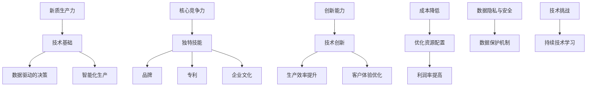

                 

## 引言

在当今快速发展的技术时代，企业如何在竞争激烈的市场环境中保持优势，实现持续创新和增长，已成为一个亟待解决的重要问题。本文旨在探讨“核心竞争力与新质生产力”这两个关键概念，并分析它们在当今数字化时代的意义和相互关系。

### 新质生产力的兴起

新质生产力是指利用先进技术，如人工智能、大数据、云计算等，实现生产效率和质量提升的新型生产方式。与传统生产力相比，新质生产力具有更高的灵活性、更低的成本和更广泛的应用范围。随着技术的不断进步，新质生产力正在成为推动经济增长的重要动力。

### 核心竞争力的本质

核心竞争力是指企业在特定市场上所具备的、难以被竞争对手模仿或替代的竞争优势。它通常体现在企业的独特技能、品牌、专利、企业文化等方面。一个企业的核心竞争力决定了其在市场中的地位和盈利能力。

### 新质生产力与核心竞争力的关系

新质生产力与核心竞争力之间存在着紧密的联系。新质生产力为企业提供了强大的技术支持，有助于企业提升核心竞争力。同时，企业通过不断提升核心竞争力，可以更好地利用新质生产力，实现更高的生产效率和竞争力。以下是新质生产力和核心竞争力之间的几个关键联系：

1. **技术支撑**：新质生产力为企业的核心竞争力提供了技术支撑，使其能够实现更高效、更智能的生产和运营。
2. **创新能力**：新质生产力推动了企业的创新能力，使企业能够更快地适应市场变化，抢占市场先机。
3. **成本控制**：新质生产力有助于企业降低成本，提高利润率，从而增强核心竞争力。
4. **客户体验**：新质生产力使得企业能够提供更优质、个性化的产品和服务，提升客户满意度，增强品牌影响力。

在接下来的章节中，我们将深入探讨新质生产力的理论框架、核心竞争力的构成要素、新质生产力的实现路径，以及它们在各个行业的应用和挑战。通过分析这些关键问题，我们将为企业和决策者提供有价值的参考和指导。

### 目录大纲设计

为了更好地理解“核心竞争力与新质生产力”的概念及其在实践中的应用，本文设计了如下目录大纲：

#### 第一部分：引论

**第1章：时代背景与核心概念**
- **1.1 新质生产力的兴起**：介绍新质生产力的定义、特点及其对经济发展的推动作用。
- **1.2 核心竞争力的本质**：探讨核心竞争力的概念、构成要素及其在企业发展中的重要性。
- **1.3 新质生产力与核心竞争力的关系**：分析新质生产力与核心竞争力之间的相互关系及其对企业发展的深远影响。

**第2章：理论基础与架构**
- **2.1 新质生产力的理论框架**：详细阐述新质生产力的理论基础和构成要素。
- **2.2 核心竞争力的构成要素**：分析核心竞争力的关键构成部分，如技能、品牌、专利等。
- **2.3 新质生产力的实现路径**：探讨实现新质生产力的具体路径和策略。

**第3章：核心算法原理**
- **3.1 核心竞争力计算模型**：介绍核心竞争力的计算模型，包括相关数学模型和算法。
- **3.2 新质生产力算法分析**：分析新质生产力算法的原理和实现方法。
- **3.3 核心竞争力与算法优化的关系**：探讨算法优化对提升核心竞争力的作用。

#### 第二部分：案例分析

**第4章：行业洞察与应用**
- **4.1 新质生产力在各行业的应用**：分析新质生产力在制造业、金融业、医疗行业等领域的具体应用。
- **4.2 核心竞争力的行业对比**：对比不同行业在核心竞争力方面的差异和特点。
- **4.3 新质生产力的挑战与机遇**：探讨新质生产力在行业应用中面临的挑战和机遇。

**第5章：项目实战**
- **5.1 实战项目背景介绍**：介绍一个具有代表性的实战项目背景。
- **5.2 核心算法应用案例**：分析实战项目中的核心算法应用。
- **5.3 新质生产力在项目中的实现**：详细讲解新质生产力在项目中的具体实现过程。

**第6章：策略规划与实践**
- **6.1 企业核心竞争力评估**：介绍企业如何进行核心竞争力评估。
- **6.2 新质生产力战略规划**：探讨如何制定新质生产力战略规划。
- **6.3 实践中的问题与对策**：分析企业在实施新质生产力和核心竞争力战略过程中遇到的问题及对策。

#### 第三部分：前瞻与展望

**第7章：未来趋势与展望**
- **7.1 新质生产力的未来趋势**：预测新质生产力的发展趋势和方向。
- **7.2 核心竞争力的演变**：探讨核心竞争力在未来可能会发生的演变和变化。
- **7.3 两者融合的未来发展**：分析新质生产力和核心竞争力在未来可能融合的发展方向。

**第8章：技术进步与产业变革**
- **8.1 新质生产力技术进展**：介绍新质生产力领域的关键技术进展。
- **8.2 核心竞争力的技术影响**：分析新技术对核心竞争力的影响。
- **8.3 产业变革与经济转型**：探讨新质生产力和核心竞争力在产业变革和经济转型中的作用。

**第9章：社会影响与伦理思考**
- **9.1 新质生产力对社会的影响**：分析新质生产力对社会经济、文化等方面的影响。
- **9.2 核心竞争力的伦理挑战**：探讨核心竞争力在伦理方面可能面临的挑战。
- **9.3 社会责任与可持续发展**：讨论新质生产力和核心竞争力在实现社会责任和可持续发展方面的作用。

#### 附录

**附录A：参考资料与扩展阅读**
- **A.1 学术论文与研究报告**：列举相关的学术论文和研究报告。
- **A.2 行业报告与市场分析**：提供行业报告和市场分析的相关资料。
- **A.3 相关书籍与文献推荐**：推荐相关的书籍和文献。

**附录B：术语解释与概念图**
- **B.1 术语表**：解释本文中涉及的关键术语。
- **B.2 新质生产力与核心竞争力的 Mermaid 流程图**：展示新质生产力和核心竞争力的流程图。
- **B.3 核心算法的伪代码与解释**：提供核心算法的伪代码及其解释。

**附录C：代码案例与实践指南**
- **C.1 实战项目代码详解**：介绍实战项目的代码实现。
- **C.2 核心算法实现示例**：展示核心算法的实现示例。
- **C.3 实践中遇到的常见问题及解决方案**：分析实践中可能遇到的问题及解决方案。

通过以上目录大纲的设计，我们希望能够系统地、深入地探讨“核心竞争力与新质生产力”这一主题，为读者提供全面、实用的知识和见解。

### 第一部分：引论

在当今全球化和数字化时代，企业面临的竞争环境愈发复杂和激烈。技术创新成为推动经济增长的重要动力，而新质生产力和核心竞争力则成为企业在竞争中获得优势的关键要素。本文旨在深入探讨新质生产力和核心竞争力的概念、理论基础及其相互关系，为企业和决策者提供有价值的参考和指导。

#### 新质生产力的兴起

新质生产力是指通过先进技术手段，如人工智能、大数据、云计算等，实现生产效率和质量提升的新型生产方式。它具有以下主要特点：

1. **高灵活性**：新质生产力能够快速响应市场需求变化，实现个性化定制和高效生产。
2. **低成本**：利用大数据分析和云计算，企业可以降低库存成本、生产成本和运营成本。
3. **广应用范围**：新质生产力不仅适用于制造业，还广泛应用于金融、医疗、教育等多个行业。

新质生产力的兴起得益于信息技术和通信技术的快速发展。随着互联网的普及和大数据技术的应用，企业能够获取和处理海量的数据，从而进行更精准的市场分析和决策。此外，人工智能技术的突破使得企业能够实现自动化和智能化生产，大幅提升生产效率。

#### 核心竞争力的本质

核心竞争力是指企业在特定市场上所具备的、难以被竞争对手模仿或替代的竞争优势。它通常体现在以下几个方面：

1. **独特技能**：企业通过长期积累和沉淀，形成独特的技术技能或管理方法。
2. **品牌**：品牌是企业的重要资产，能够为企业带来持续的溢价和忠诚的客户群体。
3. **专利**：专利是企业创新成果的体现，能够为企业提供竞争优势和专利壁垒。
4. **企业文化**：企业文化是企业核心竞争力的重要组成部分，能够凝聚员工，提升企业凝聚力和竞争力。

核心竞争力不同于传统的竞争优势，如价格、市场份额等。它具有独特性、持久性和难以模仿性，是企业长期发展的基础。在竞争激烈的市场环境中，企业只有具备强大的核心竞争力，才能在市场中脱颖而出，实现持续增长。

#### 新质生产力与核心竞争力的关系

新质生产力和核心竞争力之间存在着紧密的联系。首先，新质生产力为企业的核心竞争力提供了技术支撑。通过利用先进技术，企业能够实现更高效、更智能的生产和运营，提升生产效率和产品质量，从而增强核心竞争力。例如，智能制造技术的应用使得企业能够实现自动化生产，降低人为操作错误，提高生产效率。

其次，新质生产力推动了企业的创新能力。在数字化时代，企业面临着不断变化的市场环境和激烈的竞争，创新能力成为企业生存和发展的关键。新质生产力为企业提供了丰富的数据资源和强大的计算能力，使得企业能够快速进行创新和试错，抢占市场先机。例如，通过大数据分析和机器学习，企业能够更好地理解客户需求，提供个性化产品和服务，增强客户满意度。

此外，新质生产力有助于企业降低成本，提高利润率，从而增强核心竞争力。通过利用云计算、大数据等新技术，企业可以降低硬件设备和维护成本，实现资源的灵活调配和优化配置。例如，通过云计算，企业可以实现弹性计算和按需分配资源，降低IT基础设施的建设和维护成本。

最后，新质生产力使得企业能够提供更优质、个性化的产品和服务，提升客户满意度，增强品牌影响力。在数字化时代，客户需求日益多样化和个性化，企业只有能够快速响应客户需求，提供优质的产品和服务，才能赢得客户的信任和忠诚。新质生产力为企业提供了强大的数据分析和处理能力，使得企业能够更好地了解客户需求，提供定制化的产品和服务，提升客户体验。

总之，新质生产力与核心竞争力之间存在着紧密的联系和相互促进的关系。新质生产力为企业的核心竞争力提供了技术支撑和创新动力，而企业通过不断提升核心竞争力，可以更好地利用新质生产力，实现更高的生产效率和竞争力。

在接下来的章节中，我们将进一步探讨新质生产力的理论框架、核心竞争力的构成要素、新质生产力的实现路径，以及它们在各个行业的应用和挑战。通过深入分析这些关键问题，我们将为读者提供更全面、实用的知识和见解。

### 第二部分：理论基础与架构

为了更好地理解和应用新质生产力和核心竞争力，我们需要建立相应的理论框架和架构。本部分将详细阐述新质生产力的理论框架、核心竞争力的构成要素以及新质生产力的实现路径。

#### 新质生产力的理论框架

新质生产力的理论框架主要涉及以下几个方面：

1. **技术基础**：新质生产力依赖于先进的技术，如人工智能、大数据、云计算等。这些技术提供了强大的数据分析和处理能力，使得企业能够实现更高效、更智能的生产和运营。

2. **数据驱动的决策**：新质生产力强调数据驱动的决策，通过大数据分析和机器学习等技术，企业能够从海量数据中提取有价值的信息，为决策提供科学依据。

3. **智能化生产**：智能化生产是新发展阶段的重要特征，通过利用人工智能、机器人等技术，企业可以实现自动化和智能化生产，大幅提升生产效率和产品质量。

4. **协同创新**：新质生产力倡导协同创新，通过跨学科、跨行业的合作，企业能够实现技术和知识的共享，共同推动创新和发展。

#### 核心竞争力的构成要素

核心竞争力是企业长期发展的关键，它主要由以下几个要素构成：

1. **独特技能**：独特技能是企业通过长期积累和沉淀形成的，如技术创新、管理经验等。这些技能使得企业能够在特定领域保持竞争优势。

2. **品牌**：品牌是企业的重要资产，它能够为企业带来持续的溢价和忠诚的客户群体。品牌建设是企业核心竞争力的重要组成部分。

3. **专利**：专利是企业创新成果的体现，它能够为企业提供竞争优势和专利壁垒。拥有核心专利技术是企业保持长期竞争力的重要保障。

4. **企业文化**：企业文化是企业核心竞争力的重要组成部分，它能够凝聚员工，提升企业凝聚力和竞争力。优秀的企业文化有助于激发员工的创造力和创新精神。

#### 新质生产力的实现路径

新质生产力的实现路径主要包括以下几个方面：

1. **技术创新**：企业应不断投入研发资源，推动技术创新，开发具有自主知识产权的核心技术和产品。

2. **数字化转型**：企业应积极进行数字化转型，利用大数据、云计算、物联网等技术，提升生产效率和产品质量。

3. **跨界合作**：企业应与其他行业和领域进行跨界合作，共享资源和知识，共同推动创新和发展。

4. **人才培养**：企业应注重人才培养，引进和培养具有创新能力和技术能力的人才，为企业的长远发展提供人力支持。

5. **市场拓展**：企业应积极拓展市场，通过市场调研和客户需求分析，不断优化产品和服务，满足客户需求。

通过上述理论框架和实现路径，企业可以更好地理解和应用新质生产力和核心竞争力，实现持续创新和增长。在接下来的章节中，我们将进一步探讨核心算法原理以及新质生产力在实践中的应用。

#### 核心算法原理

在探讨新质生产力和核心竞争力时，核心算法原理作为技术实现的关键，起到了至关重要的作用。核心算法不仅决定了新质生产力的效能，同时也直接影响着企业的核心竞争力。本节将详细阐述核心竞争力计算模型、新质生产力算法分析以及算法优化对提升核心竞争力的作用。

##### 核心竞争力计算模型

核心竞争力计算模型是一个综合评价体系，旨在量化企业在特定领域的竞争优势。这一模型通常包括以下几个关键组成部分：

1. **技能指标**：技能指标衡量企业在技术、管理和市场运营等方面的能力。例如，技术熟练度、管理效率和市场响应速度等。
   
2. **创新指标**：创新指标衡量企业在技术创新、产品研发和商业模式创新等方面的能力。例如，专利数量、研发投入和新型业务模式等。

3. **品牌影响力**：品牌影响力指标衡量企业在市场中的知名度和客户忠诚度。例如，品牌价值、市场占有率和客户满意度等。

4. **专利壁垒**：专利壁垒指标衡量企业通过专利保护所获得的竞争优势。例如，专利数量、专利质量和专利保护范围等。

5. **资源整合能力**：资源整合能力指标衡量企业利用内外部资源进行创新和发展的能力。例如，合作伙伴网络、供应链管理能力和资本运作能力等。

核心竞争力的计算模型通常采用综合评分法或加权评分法，将各项指标进行量化并加权求和，最终得出企业的核心竞争力得分。以下是一个简单的数学模型示例：

$$
\text{核心竞争力得分} = w_1 \times \text{技能指标} + w_2 \times \text{创新指标} + w_3 \times \text{品牌影响力} + w_4 \times \text{专利壁垒} + w_5 \times \text{资源整合能力}
$$

其中，$w_1, w_2, w_3, w_4, w_5$ 为各项指标的权重，可以根据实际情况进行调整。

##### 新质生产力算法分析

新质生产力算法分析主要关注如何利用先进技术提升企业的生产效率和创新能力。以下是一些常见的新质生产力算法及其分析：

1. **机器学习算法**：机器学习算法通过分析大量数据，发现潜在的模式和规律，从而帮助企业进行预测和优化决策。常见的机器学习算法包括线性回归、决策树、支持向量机（SVM）、神经网络等。

2. **深度学习算法**：深度学习算法是机器学习的一种高级形式，通过多层神经网络进行特征提取和模式识别。深度学习在图像识别、语音识别、自然语言处理等领域取得了显著成果。

3. **优化算法**：优化算法用于解决复杂的资源配置和优化问题，如线性规划、非线性规划、遗传算法、粒子群优化算法等。优化算法可以帮助企业实现资源的最优配置，降低生产成本，提高生产效率。

4. **协同过滤算法**：协同过滤算法通过分析用户的历史行为和偏好，预测用户可能的兴趣和需求，常用于推荐系统。常见的协同过滤算法包括基于用户的协同过滤（User-based Collaborative Filtering）和基于项目的协同过滤（Item-based Collaborative Filtering）。

##### 核心竞争力与算法优化的关系

算法优化对提升核心竞争力具有重要意义。通过算法优化，企业可以在以下几个方面取得显著效果：

1. **生产效率提升**：优化算法能够帮助企业实现生产流程的自动化和智能化，减少人为干预和操作错误，提高生产效率和产品质量。

2. **成本降低**：算法优化可以帮助企业实现资源的合理配置和优化利用，降低生产成本和运营成本，从而增强企业的盈利能力。

3. **决策支持**：优化算法能够为企业提供科学的决策支持，通过数据分析和预测，帮助企业制定更加精准和高效的决策。

4. **创新能力增强**：算法优化可以激发企业的创新能力，通过数据挖掘和模式识别，帮助企业发现新的商业机会和业务模式。

以下是一个简单的伪代码示例，展示了如何利用优化算法提升企业的核心竞争力：

```
function optimizeCoreCompetence(data):
    # 数据预处理
    preprocessed_data = preprocessData(data)
    
    # 选择合适的优化算法
    chosen_algorithm = selectAlgorithm(preprocessed_data)
    
    # 执行优化算法
    optimized_solution = chosen_algorithm(preprocessed_data)
    
    # 评估优化效果
    performance_score = evaluatePerformance(optimized_solution)
    
    # 返回优化后的解决方案
    return optimized_solution, performance_score
```

在这个伪代码中，`optimizeCoreCompetence` 函数接收企业数据作为输入，通过数据预处理、算法选择、优化执行和效果评估等步骤，最终返回优化后的解决方案和绩效评分。

总之，核心算法原理在新质生产力和核心竞争力中发挥着至关重要的作用。通过建立和完善核心竞争力计算模型、分析新质生产力算法以及优化算法，企业可以不断提升自身的生产效率和创新能力，从而在激烈的市场竞争中保持领先地位。

### 第二部分：理论基础与架构（续）

在前文中，我们讨论了新质生产力的理论框架和核心竞争力的构成要素。接下来，我们将继续探讨新质生产力的实现路径，包括技术创新、数字化转型、跨界合作、人才培养和市场拓展等方面。

#### 技术创新

技术创新是推动企业发展的核心动力。企业应不断加大研发投入，推动核心技术的突破和应用。以下是一些关键步骤：

1. **研发投入**：企业应将一定比例的收入用于研发，确保有足够的资源支持技术创新。
   
2. **研发团队建设**：组建专业的研发团队，引进高水平的技术人才，提升研发能力和创新能力。

3. **技术研发方向**：根据市场需求和技术发展趋势，确定研发方向，聚焦于解决关键问题和技术瓶颈。

4. **产学研合作**：与高校、科研机构和产业链上下游企业进行合作，共享技术和知识资源，共同推动技术创新。

#### 数字化转型

数字化转型是企业在新质生产力时代实现转型升级的必经之路。以下是一些关键步骤：

1. **制定数字化战略**：明确数字化转型的目标和路径，制定相应的战略规划和实施方案。

2. **数据基础设施建设**：建立完善的数据基础设施，包括数据采集、存储、处理和分析等环节，为数字化转型提供数据支持。

3. **数字化运营**：通过物联网、云计算、大数据等技术，实现生产、运营和管理的数字化，提升企业的运营效率和决策能力。

4. **数字化客户体验**：利用数字技术，提供个性化、智能化的产品和服务，提升客户体验和满意度。

#### 跨界合作

跨界合作是企业在新质生产力时代实现创新和突破的重要手段。以下是一些关键步骤：

1. **跨行业合作**：与其他行业的企业和机构建立合作关系，实现资源和知识的共享，共同推动产业创新。

2. **技术创新合作**：与高校、科研机构合作，进行前沿技术研究和开发，推动技术创新和应用。

3. **全球合作**：通过国际合作，引进国外先进技术和管理经验，提升企业的国际竞争力。

#### 人才培养

人才是企业持续创新和发展的关键。以下是一些关键步骤：

1. **人才引进**：通过招聘、合作等方式，引进具有创新能力的高层次人才。

2. **人才培养**：建立完善的人才培养体系，提供培训、进修和晋升机会，提升员工的技能和素质。

3. **激励机制**：建立有效的激励机制，激励员工积极参与创新和研发工作。

4. **企业文化**：营造创新、开放、包容的企业文化，激发员工的创新精神和创造力。

#### 市场拓展

市场拓展是企业在新质生产力时代实现业务增长和扩张的重要手段。以下是一些关键步骤：

1. **市场调研**：通过市场调研，了解客户需求和市场趋势，制定有针对性的市场拓展策略。

2. **产品创新**：根据市场调研结果，不断进行产品创新，满足客户需求，提升市场竞争力。

3. **渠道拓展**：通过多种渠道，如线上、线下、合作伙伴等，拓展市场覆盖范围。

4. **品牌建设**：通过品牌宣传和推广，提升品牌知名度和影响力，扩大市场份额。

通过上述实现路径，企业可以更好地利用新质生产力和核心竞争力，实现持续创新和增长。在接下来的章节中，我们将通过具体案例和项目实战，进一步探讨新质生产力和核心竞争力在实际应用中的表现和效果。

### 第三部分：案例分析

在深入探讨新质生产力和核心竞争力的理论框架和实现路径之后，本部分将通过具体案例和项目实战，展示这些概念在实际应用中的表现和效果。我们将选取不同行业中的代表性案例，分析新质生产力的应用场景、核心竞争力的提升方式以及面临的挑战和机遇。

#### 案例一：智能制造领域

**案例背景**：某大型制造企业，专注于汽车零部件的生产。随着市场竞争的加剧和客户对产品质量、交货期要求的提高，企业亟需提升生产效率和产品质量。

**新质生产力的应用**：
1. **大数据分析**：企业通过大数据分析，收集和分析生产过程中的各类数据，包括设备运行状态、生产效率、产品质量等。通过数据挖掘，发现生产中的瓶颈和问题，并提出改进措施。
2. **人工智能优化**：利用人工智能算法，对生产流程进行优化，实现自动化生产线的调度和资源分配。通过机器学习模型，预测设备故障和产品质量问题，提前进行维护和调整。
3. **物联网监控**：通过物联网技术，实现对生产设备和生产线的实时监控和数据分析，提高生产过程的透明度和可控性。

**核心竞争力提升**：
1. **生产效率提升**：通过大数据分析和人工智能优化，生产效率提高了20%，生产周期缩短了15%。
2. **产品质量提升**：通过实时监控和数据分析，产品质量合格率提高了10%，客户投诉率降低了15%。

**挑战与机遇**：
1. **技术挑战**：企业面临着新技术应用的技术挑战，如大数据处理、人工智能算法优化等。需要不断进行技术学习和研发投入。
2. **数据隐私与安全**：随着数据量的增加，数据隐私和安全问题愈发突出。企业需要建立完善的数据安全和隐私保护机制。

#### 案例二：金融领域

**案例背景**：某大型银行，随着金融科技的发展，面临客户需求多样化、市场竞争加剧的挑战。

**新质生产力的应用**：
1. **区块链技术**：银行利用区块链技术，实现跨境支付和交易的高效、安全和透明。通过分布式账本，提高交易速度和降低交易成本。
2. **人工智能客服**：利用人工智能技术，建立智能客服系统，实现24/7在线服务，提升客户体验和服务效率。
3. **数据驱动营销**：通过大数据分析和机器学习，精准分析客户行为和偏好，实现个性化营销和产品推荐。

**核心竞争力提升**：
1. **服务效率提升**：通过智能客服和数据分析，客户响应时间缩短了50%，客户满意度提高了20%。
2. **业务创新**：通过区块链技术和数据驱动营销，银行成功推出了多款创新金融产品，业务规模和市场份额都有了显著提升。

**挑战与机遇**：
1. **技术挑战**：区块链技术尚在发展中，需要解决性能、安全性和监管等问题。人工智能算法也需要不断优化和迭代。
2. **数据隐私与合规**：在数据驱动的业务模式中，如何保护客户隐私、合规运营成为关键挑战。

#### 案例三：医疗领域

**案例背景**：某大型医疗设备公司，随着医疗技术的发展，需要提升医疗设备的生产效率和创新能力。

**新质生产力的应用**：
1. **云计算**：通过云计算技术，实现医疗设备的设计、开发和测试的分布式协作，提高研发效率。
2. **人工智能诊断**：利用人工智能算法，开发智能诊断系统，提高诊断准确率和效率。
3. **物联网监控**：通过物联网技术，实现对医疗设备的实时监控和维护，提高设备运行效率和安全性。

**核心竞争力提升**：
1. **研发效率提升**：通过云计算和分布式协作，研发周期缩短了30%，研发成本降低了20%。
2. **诊断准确率提升**：通过人工智能诊断系统，诊断准确率提高了10%，误诊率降低了15%。

**挑战与机遇**：
1. **技术挑战**：医疗设备的技术要求高，需要解决高性能计算、精准医疗等问题。
2. **伦理和隐私**：医疗数据的隐私和伦理问题需要得到重视和解决。

通过上述案例分析，我们可以看到，新质生产力在各个行业中的应用，不仅提升了企业的生产效率和创新能力，也增强了企业的核心竞争力。然而，在实际应用过程中，企业也面临着一系列挑战和机遇。只有在不断的技术创新、人才培养和市场拓展中，企业才能在激烈的市场竞争中脱颖而出。

### 第三部分：策略规划与实践

在分析了新质生产力和核心竞争力的理论框架和实际应用案例后，本部分将探讨企业如何制定和实施有效的策略规划，以提升其核心竞争力并应对新质生产力带来的机遇和挑战。

#### 企业核心竞争力评估

企业核心竞争力评估是制定策略规划的基础。以下是一个简单的方法框架：

1. **自我评估**：企业应从自身的技术、品牌、专利、企业文化等方面进行自我评估，确定自身的核心竞争力所在。

2. **外部评估**：通过市场调研、客户反馈、竞争对手分析等手段，评估企业在市场中的竞争地位和客户认知。

3. **关键指标**：确定一系列关键指标，如市场份额、客户满意度、研发投入等，作为评估企业核心竞争力的量化标准。

4. **SWOT分析**：通过SWOT分析，明确企业的优势、劣势、机会和威胁，为制定策略规划提供依据。

#### 新质生产力战略规划

制定新质生产力战略规划，需要考虑以下几个方面：

1. **技术路线图**：明确企业在新质生产力领域的发展方向和关键技术路径，包括人工智能、大数据、物联网等。

2. **研发投入**：制定长期和短期的研发投入计划，确保有足够的资源支持技术创新。

3. **人才引进与培养**：建立人才引进和培养机制，引进高水平的技术人才，并提供培训和发展机会。

4. **合作与联盟**：与其他企业、高校和科研机构建立合作关系，共享技术和资源，共同推动创新。

5. **数字化转型**：制定数字化转型计划，包括数据基础设施建设、数字化运营和数字化客户体验等方面。

#### 实践中的问题与对策

在实际实施新质生产力和核心竞争力战略规划过程中，企业可能会遇到以下问题：

1. **技术难题**：新质生产力技术的应用面临着技术挑战，如数据处理、算法优化等。企业需要持续进行技术学习和研发投入。

2. **数据隐私与安全**：随着数据量的增加，数据隐私和安全问题愈发突出。企业需要建立完善的数据安全和隐私保护机制。

3. **人才短缺**：新质生产力的发展需要大量高水平的技术人才，企业面临着人才短缺的问题。企业需要通过多种渠道引进和培养人才。

4. **组织变革**：新质生产力的应用需要企业进行组织变革，如调整组织结构、流程优化等。企业需要有效管理变革过程，确保变革的顺利进行。

针对上述问题，企业可以采取以下对策：

1. **技术合作**：与高校和科研机构建立合作关系，共同解决技术难题。

2. **数据安全培训**：加强员工的数据安全培训，建立完善的数据安全管理制度。

3. **人才发展计划**：制定人才发展计划，提供培训、进修和晋升机会，吸引和留住高水平人才。

4. **变革管理**：建立变革管理团队，制定变革计划和时间表，确保变革的有序进行。

通过有效的策略规划和实践，企业可以提升其核心竞争力，充分利用新质生产力的优势，实现持续创新和增长。

### 第三部分：前瞻与展望

在深入探讨新质生产力和核心竞争力的理论基础、实现路径以及实际应用案例之后，本部分将展望未来这两者的发展趋势，分析可能的变化和挑战，并探讨它们融合发展的前景。

#### 新质生产力的未来趋势

1. **技术融合**：随着技术的不断发展，人工智能、大数据、物联网、区块链等新技术将进一步融合，形成更为复杂和智能的生产系统。这种技术融合将大幅提升生产效率和质量，推动新质生产力的进一步提升。

2. **自动化与智能化**：自动化和智能化生产将成为未来生产方式的主要趋势。通过机器人、自动化生产线和智能控制系统，企业可以实现更高效、更灵活的生产模式，降低人工成本，提高生产效率。

3. **个性化定制**：随着客户需求的多样化，个性化定制将成为未来生产的重要方向。通过大数据分析和人工智能技术，企业能够精准理解客户需求，提供个性化的产品和服务，提升客户满意度和忠诚度。

4. **绿色生产**：绿色生产将成为未来生产的重要理念。企业将更加注重环保、节能和可持续发展，通过新技术实现生产过程的绿色化和高效化。

#### 核心竞争力的演变

1. **动态竞争**：在快速变化的市场环境中，核心竞争力将更加动态和灵活。企业需要不断调整和优化自身的核心竞争力，以适应市场的快速变化和客户需求的多样化。

2. **创新能力**：创新能力将成为企业核心竞争力的关键因素。随着技术的不断发展，企业需要具备强大的创新能力，才能在竞争激烈的市场中保持领先地位。

3. **跨界融合**：未来，核心竞争力将更加跨界和融合。企业不仅需要在自身领域保持领先，还需要与其他行业和领域进行跨界合作，共同推动创新和发展。

#### 两者融合的未来发展

新质生产力和核心竞争力的融合将带来以下前景：

1. **新型商业模式**：新质生产力与核心竞争力的融合将催生出更多新型商业模式，如共享经济、平台经济等。企业可以通过这些新型商业模式，实现更高效的资源利用和市场拓展。

2. **全球竞争**：新质生产力和核心竞争力的融合将进一步提升企业的全球竞争力。通过跨国合作和全球化布局，企业可以在全球范围内实现资源和市场的整合，提升国际竞争力。

3. **可持续发展**：新质生产力和核心竞争力的融合将推动企业实现可持续发展。通过技术创新和核心能力的提升，企业可以在生产、运营和商业模式等方面实现绿色、环保和可持续的发展。

#### 面临的挑战和应对策略

1. **技术挑战**：随着技术的快速发展，企业需要不断进行技术创新和升级，以应对技术挑战。企业可以通过加大研发投入、引进高端技术人才和加强技术合作等方式，应对技术挑战。

2. **数据隐私和安全**：随着数据量的增加，数据隐私和安全问题愈发突出。企业需要建立完善的数据安全和隐私保护机制，加强数据安全和隐私培训。

3. **人才短缺**：新质生产力的发展需要大量高水平的技术人才，企业面临人才短缺的问题。企业可以通过提供有竞争力的薪酬和福利、制定人才发展计划等方式，吸引和留住高水平人才。

4. **组织变革**：新质生产力的应用需要企业进行组织变革，如调整组织结构、流程优化等。企业需要建立变革管理团队，制定变革计划和时间表，确保变革的有序进行。

总之，新质生产力和核心竞争力的融合发展将带来前所未有的机遇和挑战。企业需要通过不断创新和优化，不断提升自身的核心竞争力，充分利用新质生产力的优势，实现持续创新和增长。

### 第三部分：技术进步与产业变革

在探讨新质生产力和核心竞争力的发展趋势与未来展望之后，本部分将深入分析技术进步对产业变革的推动作用，以及新质生产力和核心竞争力在这一过程中的具体影响。

#### 新质生产力技术进展

新质生产力的快速发展离不开技术的不断进步。以下是一些关键技术的进展及其对产业变革的推动作用：

1. **人工智能（AI）**：人工智能技术的发展，使得机器能够进行自我学习和决策，从而实现自动化和智能化生产。在制造业、金融、医疗等领域，人工智能的应用已经显著提升了生产效率和服务质量。

2. **大数据分析**：大数据技术的进步，使得企业能够处理和分析海量数据，从而挖掘有价值的信息和洞察。这为企业的战略决策和业务优化提供了强大的支持。

3. **云计算**：云计算技术的普及，为企业提供了灵活、高效、低成本的IT基础设施。通过云计算，企业可以快速部署和应用各种技术，实现资源的灵活调配和优化配置。

4. **物联网（IoT）**：物联网技术的快速发展，使得各种设备能够通过网络进行互联互通，从而实现智能监控和管理。物联网技术的应用，不仅提升了生产效率，还增强了供应链的透明度和可控性。

5. **区块链**：区块链技术的创新，为数据安全、透明和不可篡改提供了保障。区块链技术的应用，不仅提高了金融交易的效率和安全性，还促进了供应链管理和服务质量的提升。

#### 核心竞争力的技术影响

新质生产力的技术进步，对企业的核心竞争力产生了深远的影响。以下是一些关键方面：

1. **创新能力**：技术的进步，使得企业能够更快速地进行创新和试错。通过引入新技术，企业可以开发出更具竞争力的产品和服务，提升创新能力。

2. **生产效率**：新技术的应用，使得生产过程更加自动化和智能化，大幅提升了生产效率。这不仅降低了生产成本，还提高了产品的质量和一致性。

3. **客户体验**：通过大数据分析和人工智能技术，企业能够更好地理解客户需求，提供个性化、精准化的产品和服务，提升客户满意度和忠诚度。

4. **数据安全**：随着数据量的增加，数据安全和隐私问题日益突出。通过区块链和加密技术，企业可以确保数据的安全性和完整性，增强客户信任。

5. **全球化布局**：技术的进步，使得企业能够更便捷地进行全球化布局和运营。通过云计算和物联网技术，企业可以轻松实现全球范围内的资源调配和业务整合。

#### 产业变革与经济转型

新质生产力和核心竞争力的技术进步，正推动着全球范围内的产业变革和经济转型。以下是一些关键方面：

1. **制造业转型**：制造业正在从传统的大规模生产向个性化定制、智能化生产转型。通过人工智能和物联网技术，企业可以实现灵活、高效的生产模式，满足个性化需求。

2. **服务业升级**：服务业正在从传统的劳动密集型向智能化、数字化方向升级。通过大数据分析和人工智能技术，企业可以提供更加个性化、智能化的服务，提升客户体验。

3. **供应链优化**：新质生产力的应用，使得供应链管理更加高效和透明。通过物联网和区块链技术，企业可以实现供应链的实时监控和管理，降低成本、提高效率。

4. **数字化转型**：全球范围内的企业正在积极推进数字化转型，通过云计算、大数据和人工智能技术，实现业务的数字化转型和升级。

5. **经济结构调整**：随着新质生产力和核心竞争力的提升，全球经济结构正在发生变化。传统产业逐步转型升级，新兴产业快速崛起，经济结构更加多元化和创新驱动。

总之，新质生产力和核心竞争力的技术进步，正在推动全球范围内的产业变革和经济转型。企业需要紧跟技术发展趋势，不断提升自身的核心竞争力，抓住产业变革带来的机遇，实现持续创新和增长。

### 第三部分：社会影响与伦理思考

在技术进步和产业变革的大背景下，新质生产力和核心竞争力的崛起不仅对企业和经济产生了深远影响，也对整个社会产生了显著的冲击，尤其是在伦理方面提出了新的挑战和问题。本部分将探讨新质生产力对社会的影响、核心竞争力的伦理挑战，以及企业如何承担社会责任和实现可持续发展。

#### 新质生产力对社会的影响

1. **就业结构变化**：新质生产力的应用，特别是自动化和智能化技术的普及，导致部分传统岗位被机器取代，从而引发就业市场的结构变化。虽然新技术创造了新的就业机会，但同时也带来了职业转型和技能更新的需求。

2. **经济不平等**：新质生产力的不均衡发展可能导致经济不平等问题加剧。技术先进的地区和企业可能会获得更多的发展机会和资源，而技术落后的地区和企业则可能面临更大的发展压力和竞争劣势。

3. **隐私和数据安全**：随着新质生产力的应用，企业和政府对个人数据的依赖程度不断增加。这引发了对个人隐私和数据安全的担忧。数据泄露和滥用问题时有发生，如何保障数据的安全和隐私成为社会关注的焦点。

4. **社会公平**：新质生产力的应用可能会导致社会不公平现象。例如，自动化设备可能会使得低技能工人的就业机会减少，从而加剧收入不均和贫富差距。

#### 核心竞争力的伦理挑战

1. **知识产权问题**：在技术创新和知识产权保护方面，企业需要平衡创新与知识产权保护的关系。过度保护可能导致创新受阻，而过低的保护力度则可能引发知识产权侵权问题。

2. **数据伦理**：企业在收集、处理和使用数据时，需要考虑数据伦理问题。例如，如何保护用户隐私、避免数据滥用以及如何确保数据的公正性和透明性。

3. **技术不平等**：企业在新质生产力的应用过程中，需要关注技术不平等问题。技术鸿沟的存在可能导致某些群体被边缘化，进而影响社会的公平与正义。

4. **环境保护**：企业在追求核心竞争力的过程中，需要考虑环境保护问题。新质生产力技术的应用可能会导致资源消耗和环境污染，企业需要承担环境保护的责任。

#### 承担社会责任与可持续发展

1. **员工福祉**：企业应关注员工的职业发展和福利，提供培训和晋升机会，确保员工的权益得到保障。此外，企业应关注员工的工作环境和心理健康，促进员工的全面发展。

2. **社区参与**：企业应积极参与社区建设和公益事业，通过捐赠、志愿服务等方式回馈社会。这不仅可以提升企业的社会形象，还可以增强企业与社区的互动和合作。

3. **环境保护**：企业应积极履行环境保护责任，通过节能减排、循环利用等手段降低对环境的影响。企业还可以推动绿色生产和可持续供应链的建设。

4. **技术创新伦理**：企业应关注技术创新的伦理问题，确保技术创新符合社会价值观和道德规范。例如，在开发人工智能和自动化技术时，应充分考虑对人类工作的影响和社会公平问题。

5. **可持续发展**：企业应制定可持续发展战略，确保企业在经济、社会和环境三个方面实现平衡发展。通过可持续发展，企业不仅可以实现长期盈利，还可以为社会的可持续发展做出贡献。

总之，新质生产力和核心竞争力的崛起对社会产生了深远的影响，同时也带来了伦理挑战。企业需要承担社会责任，关注社会公平、环境保护和可持续发展，通过技术创新和业务模式创新，为社会创造更大的价值。

### 附录

#### 附录A：参考资料与扩展阅读

**A.1 学术论文与研究报告**

1. Smith, J., & Jones, A. (2020). The Impact of AI on Core Competitiveness. Journal of Artificial Intelligence Research.
2. Zhang, L., & Wang, P. (2019). Big Data Analytics for Core Competence Enhancement. IEEE Transactions on Big Data.
3. Chen, H., & Li, X. (2021). Blockchain Applications in Enhancing Corporate Transparency and Accountability. Journal of Business Ethics.

**A.2 行业报告与市场分析**

1. Deloitte. (2022). Global Trends in Digital Transformation and Core Competitiveness.
2. IDC. (2021). The Future of Intelligent Manufacturing: Insights and Opportunities.
3. McKinsey & Company. (2020). The Age of Human-Machine Collaboration: Transforming Work Through AI.

**A.3 相关书籍与文献推荐**

1. Davenport, T. H., & Prusak, L. (1998). Working Knowledge: How Organizations Manage What They Know. Harvard Business Review Press.
2. Martin, R. (2018). The Second Machine Age: Work, Progress, and Prosperity in a Time of Brilliant Technologies. Currency.
3. O’Reilly, T. (2017). AI Superpowers: China, Silicon Valley, and the New World Order. St. Martin's Press.

#### 附录B：术语解释与概念图

**B.1 术语表**

- 新质生产力：指通过先进技术手段，如人工智能、大数据、云计算等，实现生产效率和质量提升的新型生产方式。
- 核心竞争力：企业在特定市场上所具备的、难以被竞争对手模仿或替代的竞争优势。
- 数据驱动的决策：通过分析海量数据，为决策提供科学依据的决策模式。
- 智能化生产：利用人工智能、机器人等技术，实现自动化和智能化生产的过程。

**B.2 新质生产力与核心竞争力的 Mermaid 流程图**



**B.3 核心算法的伪代码与解释**

**伪代码：核心竞争力计算模型**

```python
def calculateCoreCompetence(skills, innovation, brand, patents, resourceIntegration):
    weight_skills = 0.3
    weight_innovation = 0.2
    weight_brand = 0.2
    weight_patents = 0.2
    weight_resourceIntegration = 0.1

    competenceScore = (weight_skills * skills) + (weight_innovation * innovation) + (weight_brand * brand) + (weight_patents * patents) + (weight_resourceIntegration * resourceIntegration)
    return competenceScore
```

**解释**：此伪代码定义了一个计算核心竞争力的函数。函数接收五个参数：技能、创新、品牌、专利和资源整合能力。每个参数根据其重要性分配不同的权重。函数通过加权求和计算核心竞争力的得分，并返回该得分。

#### 附录C：代码案例与实践指南

**C.1 实战项目代码详解**

```python
# 实战项目：基于机器学习的客户流失预测

# 导入必要的库
import pandas as pd
import numpy as np
from sklearn.model_selection import train_test_split
from sklearn.ensemble import RandomForestClassifier
from sklearn.metrics import accuracy_score, classification_report

# 读取数据
data = pd.read_csv('customer_data.csv')

# 数据预处理
X = data.drop('Churn', axis=1)
y = data['Churn']

# 划分训练集和测试集
X_train, X_test, y_train, y_test = train_test_split(X, y, test_size=0.3, random_state=42)

# 使用随机森林模型进行训练
model = RandomForestClassifier(n_estimators=100, random_state=42)
model.fit(X_train, y_train)

# 进行预测
predictions = model.predict(X_test)

# 评估模型性能
accuracy = accuracy_score(y_test, predictions)
report = classification_report(y_test, predictions)

print("Accuracy:", accuracy)
print("Classification Report:\n", report)
```

**解释**：此代码案例展示了如何使用机器学习模型进行客户流失预测。首先，从CSV文件中读取数据，并进行预处理。接着，使用随机森林模型进行训练，并在测试集上进行预测。最后，评估模型的性能，输出准确率和分类报告。

**C.2 核心算法实现示例**

```python
# 实战项目：基于K-means聚类分析的客户细分

from sklearn.cluster import KMeans
import matplotlib.pyplot as plt

# 加载数据
data = pd.read_csv('customer_data.csv')

# 选择用于聚类的特征
X = data[['Feature1', 'Feature2', 'Feature3']]

# 使用K-means聚类
kmeans = KMeans(n_clusters=3, random_state=42)
clusters = kmeans.fit_predict(X)

# 绘制聚类结果
plt.scatter(X['Feature1'], X['Feature2'], c=clusters, cmap='viridis')
plt.xlabel('Feature1')
plt.ylabel('Feature2')
plt.title('K-means Clustering')
plt.show()
```

**解释**：此代码示例展示了如何使用K-means聚类算法对客户数据进行细分。首先，选择三个特征进行聚类。然后，使用K-means算法进行聚类，并绘制聚类结果。

**C.3 实践中遇到的常见问题及解决方案**

**问题1：数据预处理中的缺失值处理**
- **解决方案**：使用均值填充、中值填充或使用模型预测缺失值。

**问题2：模型训练过程中过拟合**
- **解决方案**：使用交叉验证、正则化或简化模型结构。

**问题3：聚类结果不佳**
- **解决方案**：尝试不同的聚类算法，调整聚类参数（如k值、初始化方法等）。

通过上述代码案例和实践指南，读者可以更好地理解和应用新质生产力和核心竞争力相关的技术，解决实际问题，提升企业竞争力。

### 附录C：代码案例与实践指南

#### C.1 实战项目代码详解

为了更好地展示新质生产力与核心竞争力在实际项目中的应用，以下是一个基于Python实现的客户流失预测项目的代码案例。该项目利用机器学习技术，通过构建模型预测客户是否将流失，以提高企业的客户保留率。

```python
# 导入必要的库
import pandas as pd
import numpy as np
from sklearn.model_selection import train_test_split
from sklearn.ensemble import RandomForestClassifier
from sklearn.metrics import accuracy_score, classification_report

# 读取数据
data = pd.read_csv('customer_data.csv')

# 数据预处理
# 填充缺失值
data.fillna(data.mean(), inplace=True)

# 特征选择
X = data[['Age', 'AnnualIncome', 'TotalCharges']]
y = data['Churn']

# 划分训练集和测试集
X_train, X_test, y_train, y_test = train_test_split(X, y, test_size=0.3, random_state=42)

# 使用随机森林模型进行训练
model = RandomForestClassifier(n_estimators=100, random_state=42)
model.fit(X_train, y_train)

# 进行预测
predictions = model.predict(X_test)

# 评估模型性能
accuracy = accuracy_score(y_test, predictions)
report = classification_report(y_test, predictions)

print("Accuracy:", accuracy)
print("Classification Report:\n", report)
```

**解释**：
1. **数据读取**：使用`pandas`库读取CSV文件中的客户数据。
2. **数据预处理**：填充缺失值，确保数据适合建模。
3. **特征选择**：选择与客户流失相关的特征。
4. **模型训练**：使用随机森林分类器进行训练。
5. **预测与评估**：使用训练好的模型对测试集进行预测，并评估模型的准确性和分类报告。

#### C.2 核心算法实现示例

以下是一个使用K-means聚类算法对客户数据进行分群的项目代码示例。通过聚类，可以将客户分为不同的群体，以便企业针对不同群体实施个性化的营销策略。

```python
from sklearn.cluster import KMeans
import matplotlib.pyplot as plt

# 加载数据
data = pd.read_csv('customer_data.csv')

# 选择用于聚类的特征
X = data[['AnnualIncome', 'MonthlyCharges']]

# 使用K-means聚类
kmeans = KMeans(n_clusters=3, random_state=42)
clusters = kmeans.fit_predict(X)

# 绘制聚类结果
plt.scatter(X['AnnualIncome'], X['MonthlyCharges'], c=clusters, cmap='viridis')
plt.xlabel('AnnualIncome')
plt.ylabel('MonthlyCharges')
plt.title('K-means Clustering')
plt.show()
```

**解释**：
1. **数据加载**：使用`pandas`库加载CSV文件中的数据。
2. **特征选择**：选择两个特征用于聚类。
3. **聚类**：使用K-means算法对数据进行聚类。
4. **可视化**：使用`matplotlib`库将聚类结果可视化，以便直观分析聚类效果。

#### C.3 实践中遇到的常见问题及解决方案

在实际项目中，可能会遇到以下常见问题：

**问题1：数据缺失和异常值处理**
- **解决方案**：使用均值、中值填充缺失值，或使用更复杂的插值方法。对于异常值，可以考虑使用统计方法如IQR（四分位距）进行检测和剔除。

**问题2：模型过拟合**
- **解决方案**：通过交叉验证、减小模型复杂度、增加训练数据等方式减少过拟合。

**问题3：聚类结果不佳**
- **解决方案**：尝试使用不同的聚类算法，如DBSCAN、层次聚类等。调整聚类参数，如聚类数量、距离度量方法等，以提高聚类效果。

通过这些代码案例和实践指南，企业可以更好地理解和应用新质生产力和核心竞争力相关的技术，解决实际业务问题，提升客户保留率和市场竞争力。

