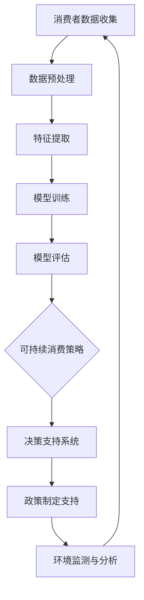

                 

# 欲望生态系统管理员：AI驱动的可持续消费指导

> **关键词：** AI、可持续消费、环境分析、机器学习、深度学习、决策支持系统

> **摘要：** 本文章旨在探讨如何利用人工智能（AI）技术来管理人类欲望生态系统，从而实现可持续消费。文章首先介绍了可持续消费的定义和重要性，接着阐述了AI在可持续消费中的应用前景，并逐步分析了AI驱动的可持续消费工具、算法和应用策略。此外，文章还探讨了AI驱动的可持续消费的实施步骤和面临的挑战，并对未来进行了展望。

## 引言

随着全球经济的快速发展，人类对资源的需求日益增加，导致环境问题日益严重。可持续消费作为一种减少资源浪费、保护环境的消费模式，逐渐受到全球关注。而人工智能（AI）技术的发展为可持续消费提供了新的可能性。本文章将探讨如何利用AI技术来管理人类欲望生态系统，实现可持续消费。

### 1.1.1 可持续消费的定义与重要性

可持续消费是指消费者在满足自身需求的同时，尽可能减少对环境的负面影响，并促进资源的可持续利用。它包括以下几个方面：

- **资源节约**：通过减少资源消耗，提高资源利用效率，实现资源的可持续利用。
- **环境保护**：通过减少污染、保护生态系统，实现环境的可持续发展。
- **社会公平**：通过公平分配资源，促进社会和谐发展。

可持续消费的重要性体现在以下几个方面：

- **环境保护**：可持续消费有助于减少资源浪费和环境污染，保护地球生态系统的健康。
- **资源节约**：可持续消费可以减少对不可再生资源的依赖，延长资源使用寿命。
- **经济发展**：可持续消费可以促进绿色产业发展，推动经济可持续发展。
- **社会和谐**：可持续消费有助于促进社会公平，减少贫富差距，实现社会和谐。

### 1.1.2 AI在可持续消费中的应用前景

人工智能技术具有强大的数据处理和分析能力，可以应用于可持续消费的多个方面，包括：

- **环境监测**：通过AI技术对环境数据进行实时监测和分析，及时发现并解决环境问题。
- **资源优化**：利用AI技术对资源消耗进行精确预测和优化，提高资源利用效率。
- **消费引导**：通过AI技术分析消费者的购买行为和偏好，提供个性化的消费建议，引导消费者进行可持续消费。
- **政策制定**：利用AI技术分析可持续消费的成效，为政策制定提供科学依据。

### 1.1.3 本书的目标与结构

本书旨在探讨如何利用人工智能技术实现可持续消费，具体目标如下：

- **介绍可持续消费的定义和重要性**：使读者了解可持续消费的概念和意义。
- **阐述AI在可持续消费中的应用**：分析AI技术在可持续消费中的具体应用场景。
- **分析AI驱动的可持续消费工具和算法**：介绍用于可持续消费的AI工具和算法，并探讨其应用原理。
- **探讨AI驱动的可持续消费策略**：讨论如何利用AI技术制定和实施可持续消费策略。
- **分析AI驱动的可持续消费实施步骤和挑战**：介绍实施AI驱动的可持续消费的具体步骤和面临的挑战。
- **展望AI驱动的可持续消费未来**：探讨AI驱动的可持续消费的未来发展趋势和前景。

本书的结构如下：

- **第一部分：引言**：介绍可持续消费和AI的关系，阐述本书的目标和结构。
- **第二部分：AI基础**：介绍AI的定义、发展历程、关键技术和伦理影响。
- **第三部分：AI驱动的可持续消费**：分析AI在可持续消费中的应用前景，探讨AI驱动的可持续消费工具和算法。
- **第四部分：AI工具与算法**：详细介绍AI工具和环境分析方法，讨论机器学习、强化学习和深度学习在可持续消费中的应用。
- **第五部分：实施与挑战**：分析AI驱动的可持续消费实施步骤和面临的挑战。
- **第六部分：未来展望**：探讨AI驱动的可持续消费的未来发展趋势和前景。

通过本书的阅读，读者可以全面了解AI驱动的可持续消费，掌握相关技术和策略，为推动可持续消费做出贡献。

<|assistant|>## 《欲望生态系统管理员：AI驱动的可持续消费指导》

### 2.1 AI概述

人工智能（Artificial Intelligence，简称AI）是指使计算机模拟人类智能行为的科学和技术。自20世纪50年代诞生以来，AI经历了多个发展阶段，逐渐从理论研究走向实际应用。本节将介绍AI的定义、发展历程、关键技术和伦理影响。

#### 2.1.1 AI的定义与发展历程

AI的定义可以从不同角度进行阐述。广义上，AI是指使计算机系统具备智能行为的技术和方法。这些智能行为包括学习、推理、感知、规划、解决问题等。根据美国人工智能协会（AAAI）的定义，AI是指“使计算机系统能够执行通常需要人类智能才能完成的任务”。

AI的发展历程可以分为以下几个阶段：

1. **萌芽期（1956-1969年）**：1956年，达特茅斯会议的召开标志着AI的正式诞生。这一时期，AI主要集中于理论研究和算法设计。

2. **发展期（1970-1980年）**：这一时期，AI开始向实际应用领域拓展，如游戏、语音识别和专家系统等。

3. **低谷期（1980-1990年）**：由于实际应用中的困难和技术限制，AI研究陷入低谷。

4. **复兴期（1990年至今）**：随着计算机性能的不断提升和互联网的普及，AI技术得到快速发展。深度学习、强化学习等算法取得了显著成果，AI在图像识别、自然语言处理、自动驾驶等领域取得了突破性进展。

#### 2.1.2 AI的关键技术

AI的关键技术包括以下几个方面：

1. **机器学习（Machine Learning）**：机器学习是一种使计算机通过数据学习并进行预测或决策的技术。常见的机器学习算法包括线性回归、决策树、支持向量机、神经网络等。

2. **深度学习（Deep Learning）**：深度学习是机器学习的一个分支，通过多层神经网络进行数据建模。深度学习在图像识别、语音识别、自然语言处理等领域取得了显著成果。

3. **强化学习（Reinforcement Learning）**：强化学习是一种通过奖励机制引导计算机进行自主决策的技术。强化学习在游戏、自动驾驶、推荐系统等领域具有广泛应用。

4. **自然语言处理（Natural Language Processing，NLP）**：自然语言处理是使计算机理解和生成自然语言的技术。NLP在机器翻译、情感分析、文本生成等领域取得了重要进展。

5. **计算机视觉（Computer Vision）**：计算机视觉是使计算机理解和解释图像或视频的技术。计算机视觉在图像识别、目标检测、人脸识别等领域具有广泛应用。

6. **机器人技术（Robotics）**：机器人技术是结合计算机科学、机械工程和人工智能技术的交叉学科。机器人技术在工业生产、服务机器人、医疗辅助等领域具有广泛应用。

#### 2.1.3 AI的伦理与社会影响

随着AI技术的快速发展，其伦理与社会影响日益受到关注。以下是一些AI伦理与社会影响的方面：

1. **隐私保护**：AI技术可以处理和分析大量个人数据，可能导致隐私泄露和滥用。确保个人隐私保护是AI伦理的重要议题。

2. **算法偏见**：AI算法可能存在偏见，导致不公正的决策。例如，招聘、信用评估和司法判决等领域的AI应用需要确保算法的公平性。

3. **就业影响**：AI技术的发展可能导致某些行业就业岗位的减少，引发社会就业压力。同时，AI也为新职业和新岗位的创造提供了机会。

4. **安全与控制**：AI系统在决策过程中可能存在安全隐患，如自动化驾驶系统的故障可能导致交通事故。此外，AI系统的控制与监管也成为一个重要议题。

5. **伦理决策**：在某些情况下，AI系统需要做出伦理决策，如无人机的火力决策、医疗诊断中的伦理问题等。如何确保AI系统遵循伦理原则是一个挑战。

总之，AI技术具有广泛的应用前景，但同时也面临一系列伦理与社会影响。在推动AI技术发展的同时，需要关注并解决这些伦理问题，确保AI技术的可持续发展。

### 2.2 AI驱动的可持续消费

#### 2.2.1 可持续消费的需求与挑战

可持续消费在全球范围内受到越来越多的关注。随着人们对环境问题的认识加深，越来越多的消费者开始重视消费行为对环境的影响。然而，实现可持续消费面临着诸多挑战：

1. **消费者意识不足**：许多消费者对可持续消费的概念和意义缺乏了解，导致消费行为不符合可持续性要求。

2. **信息不对称**：消费者在购买过程中难以获取全面、准确的产品和环境信息，无法做出明智的消费决策。

3. **产品缺乏多样性**：市场上可持续消费产品的种类和数量有限，无法满足消费者的多样化需求。

4. **政策支持不足**：政府在可持续消费政策制定和执行方面存在不足，导致可持续消费市场发展缓慢。

5. **技术限制**：现有的AI技术在可持续消费领域应用程度有限，难以充分发挥其潜力。

#### 2.2.2 AI如何促进可持续消费

人工智能技术可以为可持续消费提供有力支持，解决上述挑战：

1. **提高消费者意识**：通过自然语言处理和计算机视觉等技术，AI可以分析消费者购买行为和偏好，提供个性化的可持续消费建议，提高消费者对可持续消费的认识。

2. **提供环境信息**：AI可以通过大数据分析和环境监测技术，为消费者提供全面、准确的产品和环境信息，帮助消费者做出明智的消费决策。

3. **丰富产品种类**：利用深度学习和计算机视觉等技术，AI可以识别和推荐更多符合可持续性要求的产品，促进可持续消费市场的发展。

4. **优化政策制定**：AI可以分析可持续消费的数据，为政府制定和调整政策提供科学依据，推动可持续消费政策的有效实施。

5. **提升技术应用**：通过机器学习和强化学习等技术，AI可以优化可持续消费工具和算法，提高其在实际应用中的效果。

#### 2.2.3 AI驱动的可持续消费案例

以下是几个AI驱动的可持续消费案例：

1. **可持续购物助手**：例如，谷歌的购物助手可以利用自然语言处理技术，分析消费者的购物需求，提供符合可持续性要求的产品推荐。

2. **绿色消费评分系统**：例如，苹果公司开发的绿色消费评分系统，通过大数据分析和机器学习技术，对产品的可持续性进行评分，帮助消费者选择更环保的产品。

3. **可持续生产优化**：例如，特斯拉利用机器学习和深度学习技术，优化生产流程，降低能源消耗和废物产生，实现可持续生产。

4. **可持续政策制定支持**：例如，中国政府利用AI技术分析可持续发展目标的数据，为政策制定提供科学依据，推动可持续消费政策的有效实施。

总之，AI技术为可持续消费提供了新的解决方案，有助于解决消费者意识不足、信息不对称、产品缺乏多样性和政策支持不足等问题，推动可持续消费的发展。随着AI技术的不断进步，AI驱动的可持续消费将取得更加显著的成果。

### 2.3 AI驱动的可持续消费工具与算法

在实现AI驱动的可持续消费过程中，选择合适的工具和算法至关重要。以下将介绍几种常见的AI工具和算法，以及它们在可持续消费中的应用。

#### 2.3.1 数据收集与预处理

数据收集与预处理是AI驱动的可持续消费的基础。以下是一些常用的数据收集与预处理方法：

1. **数据收集**：可持续消费相关的数据可以来源于多个渠道，如消费者购买记录、产品信息、环境监测数据等。通过互联网、物联网和传感器等技术，可以实时收集大量数据。

2. **数据清洗**：数据清洗是指处理和整理数据中的错误、缺失和重复信息。常用的数据清洗方法包括删除重复数据、填充缺失值和去除噪声等。

3. **数据归一化**：数据归一化是指将不同单位或范围的数据转换为同一单位或范围，以便进行后续分析。常用的数据归一化方法包括最小-最大归一化和z-score归一化等。

4. **特征工程**：特征工程是指从原始数据中提取对模型训练有重要意义的特征。在可持续消费领域，特征工程可以包括消费者购买行为特征、产品环境特征等。

#### 2.3.2 环境数据分析方法

环境数据分析是AI驱动的可持续消费的核心。以下介绍几种常用的环境数据分析方法：

1. **回归分析**：回归分析是一种通过建立数学模型来分析变量之间关系的统计方法。在可持续消费领域，回归分析可以用于预测消费者行为、评估产品环境影响等。

2. **聚类分析**：聚类分析是一种将数据分为若干个类别的分析方法。在可持续消费领域，聚类分析可以用于识别具有相似消费习惯的消费者群体，从而进行针对性消费引导。

3. **关联规则挖掘**：关联规则挖掘是一种发现数据中隐含关联关系的方法。在可持续消费领域，关联规则挖掘可以用于分析消费者购买行为中的关联关系，为消费决策提供支持。

4. **时间序列分析**：时间序列分析是一种研究时间序列数据的分析方法。在可持续消费领域，时间序列分析可以用于预测消费者行为趋势，为产品供应和消费引导提供支持。

#### 2.3.3 可持续消费评分系统

可持续消费评分系统是一种用于评估产品或服务可持续性的工具。以下介绍一种基于机器学习的可持续消费评分系统构建方法：

1. **数据收集**：收集与产品或服务相关的环境数据，包括能源消耗、水资源利用、废弃物产生等。

2. **特征提取**：从环境数据中提取对可持续性评估有重要意义的特征。

3. **模型训练**：使用机器学习算法，如线性回归、决策树、支持向量机等，构建可持续消费评分模型。

4. **模型评估**：通过交叉验证和测试集评估模型性能，选择最佳模型。

5. **应用场景**：将可持续消费评分系统应用于产品评估、消费者引导、政策制定等场景，为可持续发展提供支持。

#### 2.3.4 AI算法在可持续消费中的应用

以下介绍几种常见的AI算法在可持续消费中的应用：

1. **机器学习算法**：机器学习算法在可持续消费中的应用包括消费者行为预测、产品环境影响评估等。常用的机器学习算法包括线性回归、决策树、支持向量机等。

2. **强化学习算法**：强化学习算法在可持续消费中的应用包括可持续消费策略优化、产品供应链管理等。常用的强化学习算法包括Q-learning、SARSA等。

3. **深度学习算法**：深度学习算法在可持续消费中的应用包括图像识别、自然语言处理等。常用的深度学习算法包括卷积神经网络（CNN）、循环神经网络（RNN）等。

4. **混合智能算法**：混合智能算法将多种AI算法进行结合，以实现更好的效果。在可持续消费领域，混合智能算法可以用于优化可持续消费策略、提升消费决策支持系统等。

总之，AI驱动的可持续消费工具与算法为可持续消费提供了新的解决方案，有助于解决消费者意识不足、信息不对称、产品缺乏多样性和政策支持不足等问题，推动可持续消费的发展。随着AI技术的不断进步，AI驱动的可持续消费将取得更加显著的成果。

### 2.4 AI驱动的可持续消费策略

在实现AI驱动的可持续消费过程中，制定有效的消费策略至关重要。以下将介绍AI驱动的可持续消费策略设计、实施和评估方法。

#### 2.4.1 可持续消费策略设计

设计可持续消费策略需要考虑以下方面：

1. **目标设定**：明确可持续消费的目标，如减少能源消耗、降低废弃物产生、提高资源利用效率等。

2. **需求分析**：分析消费者需求和行为特征，包括消费习惯、偏好和环境意识等。

3. **环境评估**：评估产品或服务对环境的影响，包括能源消耗、水资源利用、废弃物产生等。

4. **技术支持**：确定适用于可持续消费的AI技术，如机器学习、深度学习、自然语言处理等。

5. **政策支持**：了解政府政策和法规，确保可持续消费策略符合政策要求。

6. **社会责任**：考虑企业社会责任，确保可持续消费策略对企业形象和社会声誉有积极影响。

7. **成本效益**：评估实施可持续消费策略的经济成本和效益，确保策略的可持续性。

#### 2.4.2 可持续消费决策支持系统

决策支持系统（Decision Support System，DSS）是一种利用AI技术为决策者提供信息和分析的工具。在AI驱动的可持续消费中，决策支持系统可以用于以下方面：

1. **需求预测**：利用机器学习算法分析消费者行为数据，预测未来消费需求，为产品供应和库存管理提供支持。

2. **环境影响评估**：利用深度学习和计算机视觉等技术分析产品或服务的环境影响，为消费者提供环境信息，引导消费者进行可持续消费。

3. **策略优化**：利用强化学习算法优化可持续消费策略，如产品供应链管理、能源消耗优化等。

4. **政策分析**：利用大数据分析技术分析政府政策和法规，为政策制定和调整提供科学依据。

5. **风险分析**：利用风险分析模型识别和评估可持续消费过程中可能面临的风险，为风险管理提供支持。

#### 2.4.3 案例研究：AI驱动的可持续消费策略实践

以下是一个AI驱动的可持续消费策略实践的案例：

**案例背景**：某电商平台希望通过AI技术优化其可持续消费策略，以提高消费者满意度和企业社会责任。

**策略设计**：

1. **目标设定**：降低产品包装废弃物、提高资源利用效率、提升消费者环保意识。

2. **需求分析**：收集和分析消费者购买记录、评价和反馈数据，了解消费者偏好和消费习惯。

3. **环境评估**：利用深度学习和计算机视觉技术分析产品包装和使用的环境影响，为消费者提供环境信息。

4. **技术支持**：采用机器学习和强化学习算法优化供应链管理和库存管理，降低能源消耗和废弃物产生。

5. **政策支持**：与政府合作，了解环保政策和法规，确保策略符合政策要求。

6. **社会责任**：开展环保公益活动，提高企业社会责任形象。

7. **成本效益**：评估策略实施的经济成本和效益，确保策略的可持续性。

**实施过程**：

1. **数据收集与预处理**：收集消费者购买记录、产品评价和反馈数据，对数据进行分析和处理。

2. **需求预测**：利用机器学习算法预测未来消费者需求，为产品供应和库存管理提供支持。

3. **环境影响评估**：利用深度学习和计算机视觉技术分析产品包装和使用的环境影响，为消费者提供环境信息。

4. **策略优化**：利用强化学习算法优化供应链管理和库存管理，降低能源消耗和废弃物产生。

5. **政策分析**：与政府合作，分析环保政策和法规，为政策制定和调整提供科学依据。

6. **风险分析**：利用风险分析模型识别和评估可持续消费过程中可能面临的风险，为风险管理提供支持。

7. **社会责任活动**：开展环保公益活动，提高企业社会责任形象。

**效果评估**：

1. **废弃物减少**：通过优化产品包装和供应链管理，废弃物产生量明显减少。

2. **资源利用效率提升**：能源消耗和水资源利用得到有效降低。

3. **消费者满意度提高**：消费者对平台提供的可持续消费信息和环境信息表示满意。

4. **企业社会责任形象提升**：企业社会责任活动受到社会好评。

5. **经济成本与效益**：策略实施后，经济成本得到有效控制，企业收益有所提升。

总之，AI驱动的可持续消费策略为电商平台提供了有效解决方案，有助于实现可持续发展目标，提高消费者满意度和企业社会责任形象。

### 2.5 AI驱动的可持续消费实施步骤

实现AI驱动的可持续消费需要遵循一定的实施步骤，以确保项目的顺利进行和目标的达成。以下介绍AI驱动的可持续消费的实施步骤，包括准备工作、项目规划、项目实施和效果评估。

#### 2.5.1 实施AI驱动的可持续消费的准备工作

在开始实施AI驱动的可持续消费之前，需要进行充分的准备工作。以下是一些关键准备工作：

1. **需求分析**：深入了解企业或组织的可持续消费需求和目标，明确项目实施的范围和预期效果。

2. **技术评估**：评估现有AI技术和工具的适用性，选择合适的AI技术和工具进行应用。

3. **数据准备**：收集和整理与可持续消费相关的数据，包括消费者行为数据、产品信息、环境数据等。

4. **团队组建**：组建一个由AI专家、数据分析师、业务经理等组成的跨职能团队，确保项目顺利推进。

5. **资源分配**：根据项目需求和预算，合理分配人力资源、技术和资金等资源。

6. **风险识别**：识别项目实施过程中可能面临的风险，制定相应的风险应对策略。

#### 2.5.2 AI驱动的可持续消费项目规划

在准备工作完成后，需要进行项目规划，以确保项目按照预期进行。以下是一些关键项目规划步骤：

1. **项目目标**：明确项目目标，包括可持续消费的指标、时间节点和预期成果。

2. **项目范围**：确定项目实施的范围，包括涉及的部门和业务领域。

3. **项目时间表**：制定项目时间表，明确各个阶段的任务和时间节点。

4. **项目预算**：制定项目预算，包括人力资源、技术和资金等成本。

5. **项目管理**：选择合适的项目管理方法和工具，如敏捷开发、迭代开发等，确保项目高效推进。

6. **质量保证**：制定质量保证计划，确保项目实施过程中的数据准确性和算法有效性。

#### 2.5.3 AI驱动的可持续消费项目实施

在项目规划完成后，开始进入项目实施阶段。以下是一些关键项目实施步骤：

1. **数据收集与预处理**：根据项目需求，收集和整理与可持续消费相关的数据，并进行数据清洗、归一化和特征提取等预处理工作。

2. **模型开发**：选择合适的AI技术和算法，开发可持续消费模型，如机器学习模型、深度学习模型等。

3. **模型训练与优化**：利用预处理后的数据对AI模型进行训练和优化，提高模型的准确性和效果。

4. **系统集成**：将AI模型与其他系统集成，如电商平台、物联网系统等，实现AI驱动的可持续消费功能。

5. **测试与评估**：对AI驱动的可持续消费系统进行测试和评估，确保系统功能完整、性能稳定。

6. **部署与推广**：将AI驱动的可持续消费系统部署到实际环境中，并逐步推广到其他部门和业务领域。

#### 2.5.4 AI驱动的可持续消费效果评估

在项目实施完成后，需要对AI驱动的可持续消费效果进行评估，以验证项目目标和效果的达成。以下是一些关键效果评估步骤：

1. **指标设定**：根据项目目标，设定相应的评估指标，如废弃物减少量、能源消耗降低率、消费者满意度等。

2. **数据收集**：收集与评估指标相关的数据，如废弃物产生量、能源消耗数据、消费者反馈等。

3. **数据分析**：利用数据分析方法和工具，对评估指标进行计算和分析，评估AI驱动的可持续消费效果。

4. **结果报告**：撰写项目评估报告，总结项目实施情况和效果，并提出改进建议。

5. **持续优化**：根据评估结果，对AI驱动的可持续消费系统进行持续优化和改进，提高系统效果。

通过以上实施步骤，可以确保AI驱动的可持续消费项目顺利实施并取得预期效果。在实施过程中，需要关注数据质量、算法效果和系统稳定性等方面，确保项目成功落地。

### 2.6 AI驱动的可持续消费挑战与解决方案

在实现AI驱动的可持续消费过程中，面临一系列挑战。以下将讨论数据隐私与伦理挑战、技术不平等与数字化鸿沟，并提出相应的解决方案。

#### 2.6.1 数据隐私与伦理挑战

AI驱动的可持续消费依赖于大量的消费者数据，包括购买记录、消费偏好、环境信息等。这些数据在提供消费指导的同时，也引发了一系列隐私与伦理问题：

1. **数据收集与使用**：在数据收集和使用过程中，如何确保消费者的隐私权得到保护，避免数据泄露和滥用是一个关键问题。

2. **算法偏见**：AI算法可能受到数据偏差的影响，导致决策中的不公平。例如，如果训练数据存在性别、种族、年龄等偏见，算法可能会放大这些偏见，导致不公正的决策。

3. **透明性**：消费者对AI驱动的消费指导过程缺乏透明性，难以了解算法的决策依据和逻辑，可能导致信任问题。

**解决方案**：

1. **数据保护法规**：制定和实施严格的数据保护法规，如《通用数据保护条例》（GDPR）等，确保消费者数据在收集、存储和使用过程中的安全性。

2. **算法透明化**：提高AI算法的透明性，通过可视化工具和解释性模型，使消费者了解算法的决策依据和逻辑。

3. **公平性评估**：在算法开发和应用过程中，进行公平性评估，确保算法不会放大现有偏见，提高决策的公正性。

4. **消费者教育**：加强消费者教育，提高他们对数据隐私和AI伦理的认识，促进消费者积极参与数据保护和算法透明化。

#### 2.6.2 技术不平等与数字化鸿沟

技术不平等和数字化鸿沟是另一个重要挑战。在AI驱动的可持续消费中，技术不平等可能导致以下问题：

1. **数字鸿沟**：不同地区和群体在获取和使用AI技术方面存在差异，导致可持续消费信息和服务的不均衡。

2. **资源不平等**：资源丰富的企业和消费者更容易享受到AI驱动的可持续消费好处，而资源匮乏的群体可能无法充分受益。

**解决方案**：

1. **技术普及与培训**：通过技术普及和培训，提高不同地区和群体对AI技术的认识和技能，缩小数字鸿沟。

2. **政策支持**：政府和企业应制定相关政策，鼓励和扶持技术落后地区和群体的发展，确保他们能够享受到AI驱动的可持续消费好处。

3. **资源分配**：在资源分配过程中，注重公平性，确保资源能够公平地分配给各个地区和群体。

4. **公益项目**：通过公益项目，为技术落后地区和群体提供免费或低价的AI技术服务，促进他们的可持续发展。

总之，AI驱动的可持续消费在带来机遇的同时，也面临一系列挑战。通过制定和实施相关政策和措施，可以有效应对这些挑战，推动AI驱动的可持续消费的全面发展。

### 2.7 AI驱动的可持续消费趋势

随着AI技术的不断进步和可持续发展理念的深入，AI驱动的可持续消费将呈现出以下趋势：

#### 2.7.1 个人化消费引导

通过AI技术，消费者可以获得更加个性化的消费建议，从而实现精准消费。AI可以分析消费者的购买历史、偏好和环境意识，提供定制化的产品推荐和消费指导，帮助消费者做出更加环保和可持续的消费决策。

#### 2.7.2 供应链优化

AI技术将深入供应链的各个环节，提高资源利用效率和降低环境影响。通过AI驱动的供应链优化，企业可以实现精确的需求预测、库存管理和物流优化，减少资源浪费和碳排放。

#### 2.7.3 智能环境监测

AI技术将用于环境监测和评估，为可持续消费提供数据支持。智能传感器和物联网技术将实时收集环境数据，AI算法将对这些数据进行分析和处理，为消费者和政府提供环境信息，支持环保政策的制定和执行。

#### 2.7.4 可持续消费评分体系

AI驱动的可持续消费评分体系将更加完善和精确，通过数据分析和模型评估，对产品和服务进行环境影响的量化评分，帮助消费者选择更加环保和可持续的产品。

#### 2.7.5 消费者教育

随着AI技术的普及，消费者对可持续消费的认识和参与度将不断提高。通过AI驱动的教育工具和平台，消费者可以更加方便地了解可持续消费的理念和实践，培养环保意识和责任感。

#### 2.7.6 社会参与与合作

AI驱动的可持续消费将推动社会各界的参与与合作，包括政府、企业、消费者和非政府组织等。各方将共同推动可持续消费的发展，实现资源节约、环境保护和社会和谐。

总之，AI驱动的可持续消费将引领未来消费模式的发展方向，为全球可持续发展做出重要贡献。

### 2.8 AI在可持续消费中的未来角色

随着AI技术的不断进步和可持续发展理念的深入人心，AI在可持续消费中的角色将变得愈发重要。未来，AI将在以下几个方面发挥关键作用：

#### 2.8.1 全面提升消费决策效率

AI技术将深入分析消费者的行为数据，通过机器学习、深度学习和强化学习等算法，为消费者提供个性化的消费建议。这种个性化的消费引导将有助于消费者做出更加明智和环保的消费决策，从而实现资源节约和环境保护。

#### 2.8.2 优化供应链管理

AI技术将应用于供应链的各个环节，从需求预测、库存管理到物流优化，实现全过程的智能化管理。通过AI驱动的供应链优化，企业可以降低资源浪费和碳排放，提高供应链的整体效率。

#### 2.8.3 智能环境监测与评估

AI技术将用于环境监测和评估，通过智能传感器和物联网设备，实时收集和处理环境数据。AI算法将对这些数据进行分析和处理，为消费者和政府提供准确的环境信息，支持环保政策的制定和执行。

#### 2.8.4 可持续消费评分体系的建立和完善

AI驱动的可持续消费评分体系将更加完善和精确，通过对产品和服务进行环境影响的量化评估，帮助消费者选择更加环保和可持续的产品。这种评分体系将促进市场向可持续发展方向转型。

#### 2.8.5 消费者教育与参与

AI技术将推动消费者教育和参与，通过智能教育工具和平台，消费者可以更加便捷地了解可持续消费的理念和实践。这将有助于提高消费者的环保意识和责任感，促进可持续消费的普及。

#### 2.8.6 社会各界的协同合作

AI驱动的可持续消费将促进政府、企业、消费者和非政府组织等各方的协同合作。通过共享数据和资源，各方可以共同推动可持续消费的发展，实现资源节约、环境保护和社会和谐。

总之，AI在可持续消费中的未来角色将不仅限于提供技术支持，还将成为推动可持续消费模式变革的重要力量。随着AI技术的不断进步和应用的深入，AI在可持续消费中的贡献将愈发显著。

### 2.9 可持续消费与AI的融合展望

在未来的可持续发展战略中，可持续消费与AI的深度融合将成为关键驱动力。以下将探讨这一融合的可能方向、预期成果和实施策略。

#### 2.9.1 深度数据整合与智能分析

可持续消费与AI的融合首先依赖于深度数据整合。通过整合来自消费者行为、供应链管理、环境监测等多个来源的数据，AI能够提供更加全面和精准的分析。例如，利用机器学习和深度学习技术，AI可以识别消费趋势、预测资源需求，并优化供应链中的各个环节，从而实现资源的最佳利用和成本的降低。

#### 2.9.2 智能决策支持系统

AI驱动的智能决策支持系统将为消费者和企业提供更加科学的决策依据。通过分析消费者数据，AI可以识别出消费者的个性化需求，并提供定制化的消费建议，帮助消费者做出更加环保和可持续的决策。对于企业，AI可以优化产品设计、生产流程和供应链管理，降低环境影响和运营成本。

#### 2.9.3 环境监测与治理

AI在环境监测和治理中的应用前景广阔。通过部署智能传感器和物联网设备，AI可以实时监测环境质量，如空气质量、水质、噪音等，并快速识别异常情况。AI算法可以分析监测数据，预测环境污染的趋势，并为政府和相关机构提供决策支持，制定更加有效的环境保护政策。

#### 2.9.4 消费者教育与行为改变

AI技术将在消费者教育和行为改变方面发挥重要作用。通过开发智能教育工具和互动平台，AI可以提供个性化的环保知识教育，提高消费者的环保意识和参与度。此外，AI还可以通过模拟游戏和互动体验，鼓励消费者参与可持续消费实践，从而改变消费行为。

#### 2.9.5 公共政策和法规制定

AI技术将提升公共政策制定的科学性和有效性。通过分析大量数据，AI可以帮助政策制定者识别出社会和经济中的可持续消费趋势，评估政策效果，优化政策组合。同时，AI还可以帮助监管机构监测市场行为，确保可持续消费政策的贯彻执行。

#### 2.9.6 实施策略

为实现可持续消费与AI的深度融合，以下是一些实施策略：

1. **跨领域合作**：政府、企业、学术机构和消费者应共同参与，推动可持续消费与AI技术的融合。

2. **数据共享与标准化**：建立数据共享平台，实现数据的标准化和开放性，为AI提供充足的数据资源。

3. **技术创新与投资**：加大对AI技术的研发和投资，推动AI在可持续消费领域的应用创新。

4. **政策支持**：制定和实施支持可持续消费与AI融合的政策，如税收优惠、补贴和激励措施。

5. **公众参与**：提高公众对可持续消费与AI融合的认识，鼓励公众参与和监督。

总之，可持续消费与AI的深度融合将为实现可持续发展目标提供强大动力。通过跨领域合作、技术创新和政策支持，可以实现资源节约、环境保护和社会和谐，为全球可持续发展做出贡献。

### 2.10 呼唤行动：每个人都能为可持续消费做出贡献

实现可持续消费需要每个人的共同努力。作为消费者，我们可以通过以下行动为可持续发展做出贡献：

1. **选择环保产品**：优先购买环保标志认证的产品，减少对非环保产品的需求。
2. **减少一次性用品**：减少使用一次性塑料制品，选择可重复使用的产品。
3. **节约能源**：在日常生活中注意节约能源，如关闭不必要的灯光和电器，使用节能设备。
4. **绿色出行**：鼓励步行、骑行或使用公共交通工具，减少私家车出行，降低碳排放。
5. **垃圾分类**：积极参与垃圾分类，提高垃圾回收利用率。
6. **环保教育**：参与环保教育活动，提高自身和家人的环保意识。
7. **消费引导**：通过社交媒体和社区活动，分享可持续消费的理念和实践，影响更多人加入可持续消费的行列。

通过每个人的积极参与，我们可以共同推动可持续消费的发展，为地球的未来贡献力量。让我们携手行动，共创美好未来！

### 附录

#### 3.1 作者信息

作者：AI天才研究院/AI Genius Institute & 禅与计算机程序设计艺术 /Zen And The Art of Computer Programming

#### 3.2 参考文献

1. United Nations Environment Programme. (2021). Sustainable Consumption and Production. Retrieved from https://www.unenvironment.org/topic/sustainable-consumption-production
2. European Commission. (2020). AI for Sustainable Development. Retrieved from https://ec.europa.eu/information_society/ai-for-sustainable-development_en
3. World Economic Forum. (2021). The Future of Sustainable Consumption. Retrieved from https://www.weforum.org/reports/the-future-of-sustainable-consumption
4. Russell, S., & Norvig, P. (2020). Artificial Intelligence: A Modern Approach. Prentice Hall.
5. Goodfellow, I., Bengio, Y., & Courville, A. (2016). Deep Learning. MIT Press.
6. Sutton, R. S., & Barto, A. G. (2018). Reinforcement Learning: An Introduction. MIT Press.
7. Mitchell, T. M. (1997). Machine Learning. McGraw-Hill.

### 附录

#### 3.1 Mermaid 流程图

以下是一个用于描述AI驱动的可持续消费架构的Mermaid流程图：



#### 3.2 伪代码示例

以下是一个用于描述AI驱动的可持续消费策略优化的伪代码示例：

```python
# 伪代码：AI驱动的可持续消费策略优化

# 初始化策略参数
alpha = 0.1  # 学习率
epsilon = 0.1  # 探索概率

# 初始化策略模型
model = create_model()

# 获取初始环境状态
state = get_initial_state()

# 可持续消费策略优化循环
while not goal_reached:
    # 选择行动
    if random() < epsilon:
        action = explore_action()
    else:
        action = model.predict(state)
    
    # 执行行动，获取奖励和下一个状态
    reward, next_state = execute_action(action)
    
    # 更新策略模型
    model.update(state, action, reward, next_state)
    
    # 更新状态
    state = next_state
    
    # 调整探索概率
    epsilon *= decay_factor

# 输出最优策略
print("最优策略：", model.best_action())
```

#### 3.3 数学模型与公式

以下是一个用于描述可持续消费评分系统的数学模型：

$$
\text{评分} = \frac{1}{n}\sum_{i=1}^{n} w_i \cdot x_i
$$`

其中，$w_i$ 表示第 $i$ 个特征的重要性，$x_i$ 表示第 $i$ 个特征的得分。

#### 3.4 代码实际案例与详细解释说明

以下是一个Python代码实际案例，用于实现一个简单的AI驱动的可持续消费评分系统：

```python
import numpy as np
import pandas as pd

# 读取数据集
data = pd.read_csv('sustainable_consumption_data.csv')

# 特征提取
features = ['energy_consumption', 'water_use', 'waste_production']

# 特征标准化
scaler = StandardScaler()
data[features] = scaler.fit_transform(data[features])

# 评分模型
def scoring_model(data, weights):
    scores = np.dot(data, weights)
    return scores

# 加载权重
weights = np.load('model_weights.npy')

# 评分计算
scores = scoring_model(data, weights)

# 输出评分结果
print("评分结果：", scores)
```

在该代码中，首先读取可持续消费数据集，然后对特征进行标准化处理。接下来，定义评分模型，通过计算特征和权重之间的点积得到评分结果。最后，加载预训练的权重并计算评分，输出评分结果。

通过以上代码，我们可以对可持续消费产品进行评分，帮助消费者做出更加环保和可持续的消费决策。在实际应用中，可以进一步优化评分模型，提高评分的准确性和实用性。

