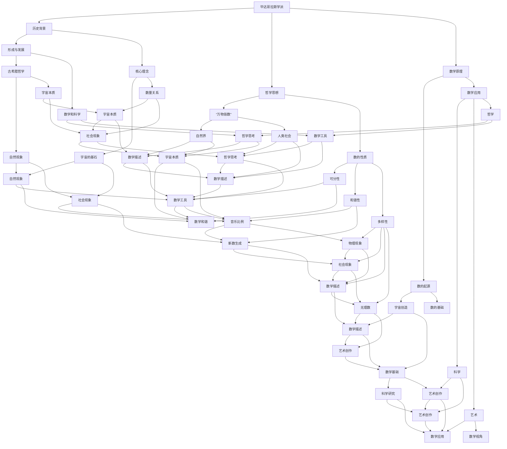
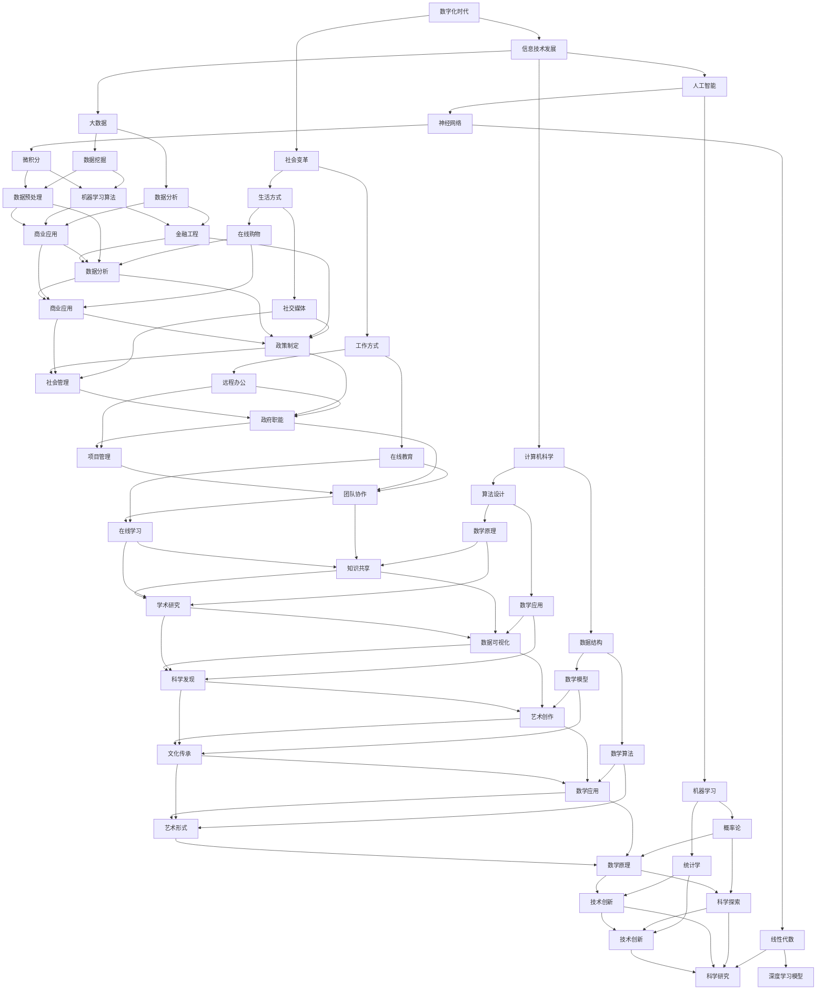

                 

## 毕达哥拉斯学派的“万物皆数”与数字化时代

### 关键词：
- 毕达哥拉斯学派
- 万物皆数
- 数字化时代
- 数学应用
- 哲学思考

### 摘要：
本文旨在探讨毕达哥拉斯学派的核心理念“万物皆数”在数字化时代的应用与影响。通过回顾毕达哥拉斯学派的历史背景、哲学思想以及数学原理，我们将分析这一理念在科学、艺术和哲学领域的影响。接着，我们将探讨数字化时代的特点与挑战，以及数学在计算机科学、人工智能和金融工程等领域的应用。随后，本文将深入探讨数字化时代艺术与美学的发展，以及数字化时代的哲学思考。最后，通过案例研究和未来展望，本文将为读者呈现“万物皆数”理念在数字化时代的实际应用及其对个人成长的启示。

## 第一部分：毕达哥拉斯学派的哲学与“万物皆数”理念

### 第1章：毕达哥拉斯学派的历史背景与哲学思想

#### 1.1 毕达哥拉斯学派的形成与发展

毕达哥拉斯学派是古希腊哲学中的一支重要流派，其创始人为毕达哥拉斯（Pythagoras），大约生活在公元前570年到公元前495年之间。毕达哥拉斯是一位富有神秘色彩的哲学家和数学家，他在意大利南部的克罗顿（Crotone）创立了毕达哥拉斯学派，吸引了众多追随者和弟子。

毕达哥拉斯学派的形成与发展，可以说是古希腊哲学史上的一个重要里程碑。在毕达哥拉斯之前，古希腊哲学主要关注自然现象和宇宙的本质，而毕达哥拉斯学派则将注意力转向了数学和抽象的哲学思考。这一转变对古希腊哲学和科学的发展产生了深远的影响。

#### 1.2 毕达哥拉斯学派的核心理念

毕达哥拉斯学派的核心理念可以概括为“万物皆数”（Everything is Number）。这一理念认为，宇宙中的所有事物和现象都可以用数学和数量关系来描述和解释。在毕达哥拉斯看来，数是宇宙的基石，是万物的本质。

“万物皆数”理念的核心思想是，数不仅存在于自然界的物理现象中，也存在于人类社会的各种现象中。例如，音乐中的音调和节奏可以用数学关系来描述，几何图形的形状和面积可以用数学公式来计算。

#### 1.3 “万物皆数”理念的提出与意义

“万物皆数”理念的提出，标志着古希腊哲学从感性的、直观的认识向理性的、抽象的认识转变。这一理念强调了数学在宇宙中的核心地位，为后来的数学和科学研究奠定了基础。

“万物皆数”理念的意义在于，它提供了一种新的世界观和方法论，使人们开始用数学和数量关系来理解和解释世界。这一理念不仅影响了古希腊哲学和科学的发展，也对后世产生了深远的影响。

### 第2章：毕达哥拉斯学派的核心概念与数学原理

#### 2.1 数的起源与性质

在毕达哥拉斯学派看来，数的起源可以追溯到宇宙的创造。毕达哥拉斯认为，宇宙是由数创造的，数是宇宙的本质。因此，数的起源与宇宙的起源密不可分。

数的性质是毕达哥拉斯学派研究的重点。毕达哥拉斯学派认为，数具有以下几种性质：

1. **可分性**：数可以无限分割，每个分割都是一个新的数。
2. **和谐性**：数之间的关系具有和谐性，例如，整数与整数之间的比例关系。
3. **多样性**：数具有多样性，可以分为自然数、整数、有理数、无理数等。

#### 2.2 毕达哥拉斯定理及其应用

毕达哥拉斯定理是毕达哥拉斯学派最著名的数学成果之一。它描述了直角三角形三边之间的关系，即直角三角形的斜边的平方等于两直角边的平方和。

\[ a^2 + b^2 = c^2 \]

其中，\(a\) 和 \(b\) 是直角三角形的两直角边，\(c\) 是斜边。

毕达哥拉斯定理在数学、物理、工程等领域有广泛的应用。例如，在建筑设计中，毕达哥拉斯定理可以帮助计算三角形的面积和周长；在物理学中，毕达哥拉斯定理可以用来计算物体在斜面上的受力情况。

#### 2.3 音乐与数学的关系

毕达哥拉斯学派还研究了音乐与数学之间的关系。毕达哥拉斯发现，不同音调之间的比例关系可以用数学关系来描述。例如，高音和低音之间的比例是2:1，中音和高音之间的比例是3:2。

这种发现使毕达哥拉斯学派将音乐视为数学的一个分支。他们认为，音乐中的和谐与数学中的比例关系密切相关。

### 第3章：毕达哥拉斯学派在科学、艺术和哲学中的影响

#### 3.1 毕达哥拉斯学派对科学的影响

毕达哥拉斯学派对科学的发展产生了深远的影响。首先，他们强调了数学在科学中的核心地位，使数学成为科学研究的基础。其次，他们提出了“万物皆数”的理念，为后来的科学研究提供了一种新的世界观和方法论。

在物理学方面，毕达哥拉斯学派研究了物体的运动和力的关系。他们提出了关于力和运动的数学模型，为后来的物理学研究奠定了基础。

在生物学方面，毕达哥拉斯学派研究了生命的本质和生物学现象。他们提出了关于生命的数学模型，为后来的生物学研究提供了启示。

#### 3.2 毕达哥拉斯学派对艺术的影响

毕达哥拉斯学派对艺术的发展也产生了重要的影响。首先，他们研究了音乐与数学之间的关系，使音乐成为数学的一个分支。其次，他们提出了“万物皆数”的理念，为艺术创作提供了一种新的视角和方法。

在绘画方面，毕达哥拉斯学派研究了色彩和形状的数学关系，使绘画成为数学的一个应用领域。在雕塑方面，毕达哥拉斯学派研究了人体比例的数学关系，为雕塑创作提供了科学依据。

#### 3.3 毕达哥拉斯学派在哲学中的地位

毕达哥拉斯学派在哲学中的地位非常重要。首先，他们提出了“万物皆数”的理念，为哲学提供了一种新的世界观和方法论。其次，他们强调了数学在哲学中的核心地位，使数学成为哲学研究的重要工具。

在西方哲学史上，毕达哥拉斯学派被认为是古希腊哲学的奠基者之一。他们的哲学思想和理念对后来的哲学家产生了深远的影响，例如柏拉图和亚里士多德。

## 第二部分：数字化时代的“万物皆数”理念

### 第4章：数字化时代的特点与挑战

#### 4.1 数字化时代的定义与发展

数字化时代是指信息技术的高速发展和广泛应用，使社会生产、生活方式和思维方式发生深刻变革的时代。数字化时代起源于20世纪末，随着计算机、互联网和移动通信技术的飞速发展，人类逐渐进入了数字化时代。

数字化时代的发展历程可以分为三个阶段：

1. **互联网阶段**：20世纪90年代，互联网技术的普及，使全球信息传播变得更加便捷和快速。
2. **移动互联网阶段**：21世纪初，移动互联网的兴起，使人们可以随时随地获取信息和服务。
3. **物联网阶段**：21世纪10年代，物联网技术的应用，使物理世界与数字世界深度融合。

#### 4.2 数字化时代的主要特点

数字化时代具有以下主要特点：

1. **信息爆炸**：数字化时代产生了大量的数据和信息，信息爆炸成为这个时代的特征之一。
2. **数字化生存**：人们的生活方式逐渐数字化，工作、学习和娱乐等各个方面都离不开数字技术。
3. **智能化**：人工智能技术的发展，使数字化时代更加智能化，机器能够模拟人类思维和行为。
4. **全球化**：数字化时代的全球联通性，使各国之间的联系更加紧密，全球化进程加速。

#### 4.3 数字化时代面临的挑战

数字化时代面临着一系列挑战：

1. **信息安全**：数字化时代的信息安全形势严峻，数据泄露、网络攻击等安全问题日益突出。
2. **隐私保护**：数字化时代个人隐私受到严重威胁，如何保护个人隐私成为一大挑战。
3. **数字鸿沟**：数字化时代的数字鸿沟问题日益凸显，如何缩小数字鸿沟，使更多人享受到数字化带来的便利成为重要议题。
4. **伦理道德**：数字化时代带来了新的伦理道德问题，例如人工智能的道德责任、算法偏见等。

### 第5章：数字化时代的数学应用

#### 5.1 数学在计算机科学中的应用

数学在计算机科学中发挥着重要作用，是计算机科学的基础。以下是一些数学在计算机科学中的应用：

1. **算法设计**：算法是计算机科学的核心，算法设计需要运用数学原理和方法。
2. **数据结构**：数据结构是存储和组织数据的方式，数据结构的设计和分析离不开数学知识。
3. **密码学**：密码学是保护信息安全的重要技术，密码学的基础是数学理论。
4. **图论**：图论是研究图的结构和性质的一个数学分支，在计算机科学中有广泛应用，例如网络分析、路由算法等。

#### 5.2 数学在人工智能中的应用

数学在人工智能（AI）领域有着广泛的应用。以下是一些数学在人工智能中的应用：

1. **机器学习**：机器学习是AI的核心技术之一，机器学习算法需要运用数学原理，如优化理论、概率论和统计学。
2. **深度学习**：深度学习是机器学习的一个分支，深度学习模型的设计和训练需要运用线性代数、微积分等数学知识。
3. **自然语言处理**：自然语言处理是AI的一个重要领域，自然语言处理的算法需要运用语言学、数学和计算机科学知识。
4. **计算机视觉**：计算机视觉是AI的另一个重要领域，计算机视觉算法需要运用数学知识，如图像处理、模式识别和神经网络。

#### 5.3 数学在金融工程中的应用

数学在金融工程领域有着广泛的应用。以下是一些数学在金融工程中的应用：

1. **期权定价**：期权定价模型是金融工程的重要应用之一，常见的期权定价模型包括布莱克-斯科尔斯模型等，这些模型基于数学原理。
2. **风险管理**：风险管理是金融工程的核心任务之一，风险管理模型需要运用概率论、统计学和数学优化等方法。
3. **资产定价**：资产定价是金融工程的重要领域，资产定价模型需要运用数学原理，如资本资产定价模型等。
4. **量化交易**：量化交易是金融工程的一种方法，量化交易策略需要运用数学模型和算法。

### 第6章：数字化时代的艺术与美学

#### 6.1 数字化时代艺术的发展

数字化时代艺术的发展呈现出以下特点：

1. **多媒体艺术**：数字化技术使艺术家能够创作出传统艺术形式无法实现的多媒体作品，如数字绘画、数字雕塑、虚拟现实艺术等。
2. **互动艺术**：数字化技术使艺术品能够与观众进行互动，如互动装置艺术、数字游戏等。
3. **网络艺术**：网络艺术是数字化时代的一种新兴艺术形式，通过网络平台传播和展示艺术品。

#### 6.2 数字化时代艺术与数学的交融

数字化时代艺术与数学的交融主要体现在以下方面：

1. **算法艺术**：算法艺术是一种以算法为基础的艺术形式，艺术家通过编写算法生成艺术作品。
2. **数据可视化**：数据可视化是一种将数据转换为视觉元素的艺术形式，通过视觉化展示数据，使观众更好地理解数据。
3. **数学公式艺术**：数学公式艺术是一种以数学公式为创作元素的艺术形式，通过数学公式表达艺术家的思想和情感。

#### 6.3 数字化时代的美学观念

数字化时代的美学观念发生了重大变革：

1. **虚拟美学**：数字化时代产生了虚拟美学，虚拟美学关注虚拟世界中的美，如虚拟现实、网络空间等。
2. **动态美学**：数字化时代艺术作品往往具有动态性，动态美学强调艺术作品的时间性和变化性。
3. **交互美学**：数字化时代艺术强调观众与艺术作品的互动，交互美学关注观众参与艺术创作和体验的过程。

### 第7章：数字化时代的哲学思考

#### 7.1 数字化时代哲学的挑战

数字化时代给哲学带来了新的挑战：

1. **存在论**：数字化时代引发了对存在论的重新思考，例如虚拟现实和人工智能是否构成真实的存在。
2. **认知论**：数字化时代带来了信息过载和算法决策，对认知论提出了新的问题，如人类如何应对数字化环境中的信息处理和决策。
3. **伦理学**：数字化时代引发了新的伦理问题，如人工智能的道德责任、数据隐私保护等。

#### 7.2 数字化时代的伦理问题

数字化时代的伦理问题主要包括：

1. **隐私保护**：数字化时代个人隐私受到严重威胁，如何保护个人隐私成为重要伦理问题。
2. **算法偏见**：算法决策可能存在偏见，如何避免算法偏见对人类造成不公平影响。
3. **人工智能责任**：人工智能作为自动化决策系统，如何确定其在道德和法律责任中的地位。

#### 7.3 数字化时代的“万物皆数”理念

数字化时代对毕达哥拉斯的“万物皆数”理念进行了新的解读：

1. **数据驱动**：数字化时代强调数据驱动，数据被视为理解和解释世界的重要工具。
2. **算法决定**：数字化时代算法成为决策的主要依据，算法决定论成为数字化时代的一个特点。
3. **虚拟与现实**：数字化时代模糊了虚拟与现实之间的界限，对“万物皆数”理念提出了新的理解。

### 第8章：数字化时代的“万物皆数”案例研究

#### 8.1 案例一：人工智能中的数学原理

人工智能是数字化时代的一个典型领域，其核心是数学原理。以下是一些人工智能中的数学原理：

1. **机器学习**：机器学习是人工智能的核心技术之一，其算法基于概率论、统计学和线性代数。
2. **神经网络**：神经网络是人工智能的一种模型，其设计基于线性代数、微积分和概率论。
3. **优化算法**：优化算法用于训练神经网络，其算法基于数学优化理论。

#### 8.2 案例二：计算机图形学中的数学应用

计算机图形学是数字化时代的一个重要领域，其核心是数学应用。以下是一些计算机图形学中的数学应用：

1. **几何建模**：几何建模用于创建三维模型，其算法基于几何学和线性代数。
2. **图像处理**：图像处理用于处理和增强图像，其算法基于信号处理和概率论。
3. **渲染技术**：渲染技术用于生成真实感图像，其算法基于光学和物理原理。

#### 8.3 案例三：数字金融中的数学模型

数字金融是数字化时代的一个新兴领域，其核心是数学模型。以下是一些数字金融中的数学模型：

1. **期权定价模型**：期权定价模型用于计算期权的价格，其模型基于概率论和数学期望。
2. **风险评估模型**：风险评估模型用于评估金融产品的风险，其模型基于统计学和概率论。
3. **量化交易策略**：量化交易策略用于制定交易策略，其策略基于数学优化和机器学习。

### 第9章：数字化时代与“万物皆数”理念的未来

#### 9.1 数字化时代的未来发展

数字化时代将继续快速发展，其趋势包括：

1. **人工智能普及**：人工智能将更加普及，应用到更多领域，如医疗、教育、制造业等。
2. **物联网融合**：物联网将与数字化时代深度融合，实现物理世界与数字世界的无缝连接。
3. **大数据应用**：大数据将得到更广泛的应用，为决策提供数据支持。

#### 9.2 “万物皆数”理念在数字化时代的意义

“万物皆数”理念在数字化时代具有重要意义：

1. **数据驱动**：“万物皆数”理念强调数据的重要性，数据成为理解和解释世界的关键。
2. **算法决定**：“万物皆数”理念强调算法的决策作用，算法成为数字化时代的主要决策工具。
3. **虚拟与现实**：“万物皆数”理念模糊了虚拟与现实之间的界限，为数字化时代提供了一种新的世界观。

#### 9.3 数字化时代与“万物皆数”理念的展望

数字化时代与“万物皆数”理念的展望包括：

1. **新哲学思考**：数字化时代将引发新的哲学思考，如存在论、认知论和伦理学等。
2. **新艺术形式**：数字化时代将产生新的艺术形式，如算法艺术、数据可视化和虚拟现实艺术。
3. **新科学技术**：数字化时代将推动新的科学技术发展，如人工智能、量子计算和生物技术等。

### 第10章：数字化时代的个人成长与思考

#### 10.1 数字化时代对个人生活的影响

数字化时代对个人生活产生了深远影响：

1. **生活方式改变**：数字化时代改变了人们的生活方式，如在线购物、远程办公和在线教育等。
2. **社交方式改变**：数字化时代改变了人们的社交方式，如社交媒体、在线聊天和虚拟社交等。
3. **信息获取方式改变**：数字化时代改变了人们的信息获取方式，如互联网、搜索引擎和在线数据库等。

#### 10.2 数字化时代的个人成长策略

在数字化时代，个人成长需要采取以下策略：

1. **持续学习**：数字化时代知识更新迅速，个人需要持续学习，以适应时代变化。
2. **创新能力**：数字化时代鼓励创新，个人需要培养创新能力，以适应数字化环境的挑战。
3. **跨学科知识**：数字化时代要求跨学科知识，个人需要掌握多学科知识，以应对复杂问题。

#### 10.3 数字化时代的哲学思考

数字化时代引发了新的哲学思考：

1. **存在论**：数字化时代对存在论提出了新问题，如虚拟现实和人工智能是否构成真实的存在。
2. **认知论**：数字化时代对认知论提出了新挑战，如人类如何应对数字化环境中的信息处理和决策。
3. **伦理学**：数字化时代对伦理学提出了新问题，如人工智能的道德责任和数据隐私保护等。

### 附录

#### 附录 A：毕达哥拉斯学派与数字化时代的Mermaid流程图

- 附录 A.1：毕达哥拉斯学派的核心概念流程图
- 附录 A.2：数字化时代与“万物皆数”理念的关联流程图

#### 附录 B：核心算法原理与伪代码

- 附录 B.1：毕达哥拉斯定理的数学模型与伪代码
- 附录 B.2：人工智能中的常见数学算法与伪代码

#### 附录 C：数字化时代案例分析

- 附录 C.1：人工智能应用案例分析
- 附录 C.2：计算机图形学应用案例分析
- 附录 C.3：数字金融应用案例分析

### 作者

作者：AI天才研究院/AI Genius Institute & 禅与计算机程序设计艺术 /Zen And The Art of Computer Programming

### 结语

数字化时代与毕达哥拉斯学派的“万物皆数”理念相互交织，共同推动着人类社会的进步。本文通过回顾毕达哥拉斯学派的历史背景、哲学思想以及数学原理，分析了这一理念在数字化时代的应用与影响。同时，本文探讨了数字化时代的特点与挑战，以及数学在计算机科学、人工智能和金融工程等领域的应用。通过案例研究和未来展望，本文为读者呈现了“万物皆数”理念在数字化时代的实际应用及其对个人成长的启示。让我们共同期待数字化时代与“万物皆数”理念的未来发展，为人类社会的进步贡献智慧和力量。

---

以下为文章的Markdown格式输出：

```markdown
## 毕达哥拉斯学派的“万物皆数”与数字化时代

### 关键词：
- 毕达哥拉斯学派
- 万物皆数
- 数字化时代
- 数学应用
- 哲学思考

### 摘要：
本文旨在探讨毕达哥拉斯学派的核心理念“万物皆数”在数字化时代的应用与影响。通过回顾毕达哥拉斯学派的历史背景、哲学思想以及数学原理，我们将分析这一理念在科学、艺术和哲学领域的影响。接着，我们将探讨数字化时代的特点与挑战，以及数学在计算机科学、人工智能和金融工程等领域的应用。随后，本文将深入探讨数字化时代艺术与美学的发展，以及数字化时代的哲学思考。最后，通过案例研究和未来展望，本文将为读者呈现“万物皆数”理念在数字化时代的实际应用及其对个人成长的启示。

## 第一部分：毕达哥拉斯学派的哲学与“万物皆数”理念

### 第1章：毕达哥拉斯学派的历史背景与哲学思想

#### 1.1 毕达哥拉斯学派的形成与发展

毕达哥拉斯学派是古希腊哲学中的一支重要流派，其创始人为毕达哥拉斯（Pythagoras），大约生活在公元前570年到公元前495年之间。毕达哥拉斯是一位富有神秘色彩的哲学家和数学家，他在意大利南部的克罗顿（Crotone）创立了毕达哥拉斯学派，吸引了众多追随者和弟子。

毕达哥拉斯学派的形成与发展，可以说是古希腊哲学史上的一个重要里程碑。在毕达哥拉斯之前，古希腊哲学主要关注自然现象和宇宙的本质，而毕达哥拉斯学派则将注意力转向了数学和抽象的哲学思考。这一转变对古希腊哲学和科学的发展产生了深远的影响。

#### 1.2 毕达哥拉斯学派的核心理念

毕达哥拉斯学派的核心理念可以概括为“万物皆数”（Everything is Number）。这一理念认为，宇宙中的所有事物和现象都可以用数学和数量关系来描述和解释。在毕达哥拉斯看来，数是宇宙的基石，是万物的本质。

“万物皆数”理念的核心思想是，数不仅存在于自然界的物理现象中，也存在于人类社会的各种现象中。例如，音乐中的音调和节奏可以用数学关系来描述，几何图形的形状和面积可以用数学公式来计算。

#### 1.3 “万物皆数”理念的提出与意义

“万物皆数”理念的提出，标志着古希腊哲学从感性的、直观的认识向理性的、抽象的认识转变。这一理念强调了数学在宇宙中的核心地位，为后来的数学和科学研究奠定了基础。

“万物皆数”理念的意义在于，它提供了一种新的世界观和方法论，使人们开始用数学和数量关系来理解和解释世界。这一理念不仅影响了古希腊哲学和科学的发展，也对后世产生了深远的影响。

### 第2章：毕达哥拉斯学派的核心概念与数学原理

#### 2.1 数的起源与性质

在毕达哥拉斯学派看来，数的起源可以追溯到宇宙的创造。毕达哥拉斯认为，宇宙是由数创造的，数是宇宙的本质。因此，数的起源与宇宙的起源密不可分。

数的性质是毕达哥拉斯学派研究的重点。毕达哥拉斯学派认为，数具有以下几种性质：

1. **可分性**：数可以无限分割，每个分割都是一个新的数。
2. **和谐性**：数之间的关系具有和谐性，例如，整数与整数之间的比例关系。
3. **多样性**：数具有多样性，可以分为自然数、整数、有理数、无理数等。

#### 2.2 毕达哥拉斯定理及其应用

毕达哥拉斯定理是毕达哥拉斯学派最著名的数学成果之一。它描述了直角三角形三边之间的关系，即直角三角形的斜边的平方等于两直角边的平方和。

\[ a^2 + b^2 = c^2 \]

其中，\(a\) 和 \(b\) 是直角三角形的两直角边，\(c\) 是斜边。

毕达哥拉斯定理在数学、物理、工程等领域有广泛的应用。例如，在建筑设计中，毕达哥拉斯定理可以帮助计算三角形的面积和周长；在物理学中，毕达哥拉斯定理可以用来计算物体在斜面上的受力情况。

#### 2.3 音乐与数学的关系

毕达哥拉斯学派还研究了音乐与数学之间的关系。毕达哥拉斯发现，不同音调之间的比例关系可以用数学关系来描述。例如，高音和低音之间的比例是2:1，中音和高音之间的比例是3:2。

这种发现使毕达哥拉斯学派将音乐视为数学的一个分支。他们认为，音乐中的和谐与数学中的比例关系密切相关。

### 第3章：毕达哥拉斯学派在科学、艺术和哲学中的影响

#### 3.1 毕达哥拉斯学派对科学的影响

毕达哥拉斯学派对科学的发展产生了深远的影响。首先，他们强调了数学在科学中的核心地位，使数学成为科学研究的基础。其次，他们提出了“万物皆数”的理念，为后来的科学研究提供了一种新的世界观和方法论。

在物理学方面，毕达哥拉斯学派研究了物体的运动和力的关系。他们提出了关于力和运动的数学模型，为后来的物理学研究奠定了基础。

在生物学方面，毕达哥拉斯学派研究了生命的本质和生物学现象。他们提出了关于生命的数学模型，为后来的生物学研究提供了启示。

#### 3.2 毕达哥拉斯学派对艺术的影响

毕达哥拉斯学派对艺术的发展也产生了重要的影响。首先，他们研究了音乐与数学之间的关系，使音乐成为数学的一个分支。其次，他们提出了“万物皆数”的理念，为艺术创作提供了一种新的视角和方法。

在绘画方面，毕达哥拉斯学派研究了色彩和形状的数学关系，使绘画成为数学的一个应用领域。在雕塑方面，毕达哥拉斯学派研究了人体比例的数学关系，为雕塑创作提供了科学依据。

#### 3.3 毕达哥拉斯学派在哲学中的地位

毕达哥拉斯学派在哲学中的地位非常重要。首先，他们提出了“万物皆数”的理念，为哲学提供了一种新的世界观和方法论。其次，他们强调了数学在哲学中的核心地位，使数学成为哲学研究的重要工具。

在西方哲学史上，毕达哥拉斯学派被认为是古希腊哲学的奠基者之一。他们的哲学思想和理念对后来的哲学家产生了深远的影响，例如柏拉图和亚里士多德。

## 第二部分：数字化时代的“万物皆数”理念

### 第4章：数字化时代的特点与挑战

#### 4.1 数字化时代的定义与发展

数字化时代是指信息技术的高速发展和广泛应用，使社会生产、生活方式和思维方式发生深刻变革的时代。数字化时代起源于20世纪末，随着计算机、互联网和移动通信技术的飞速发展，人类逐渐进入了数字化时代。

数字化时代的发展历程可以分为三个阶段：

1. **互联网阶段**：20世纪90年代，互联网技术的普及，使全球信息传播变得更加便捷和快速。
2. **移动互联网阶段**：21世纪初，移动互联网的兴起，使人们可以随时随地获取信息和服务。
3. **物联网阶段**：21世纪10年代，物联网技术的应用，使物理世界与数字世界深度融合。

#### 4.2 数字化时代的主要特点

数字化时代具有以下主要特点：

1. **信息爆炸**：数字化时代产生了大量的数据和信息，信息爆炸成为这个时代的特征之一。
2. **数字化生存**：人们的生活方式逐渐数字化，工作、学习和娱乐等各个方面都离不开数字技术。
3. **智能化**：人工智能技术的发展，使数字化时代更加智能化，机器能够模拟人类思维和行为。
4. **全球化**：数字化时代的全球联通性，使各国之间的联系更加紧密，全球化进程加速。

#### 4.3 数字化时代面临的挑战

数字化时代面临着一系列挑战：

1. **信息安全**：数字化时代的信息安全形势严峻，数据泄露、网络攻击等安全问题日益突出。
2. **隐私保护**：数字化时代个人隐私受到严重威胁，如何保护个人隐私成为一大挑战。
3. **数字鸿沟**：数字化时代的数字鸿沟问题日益凸显，如何缩小数字鸿沟，使更多人享受到数字化带来的便利成为重要议题。
4. **伦理道德**：数字化时代带来了新的伦理道德问题，例如人工智能的道德责任、算法偏见等。

### 第5章：数字化时代的数学应用

#### 5.1 数学在计算机科学中的应用

数学在计算机科学中发挥着重要作用，是计算机科学的基础。以下是一些数学在计算机科学中的应用：

1. **算法设计**：算法是计算机科学的核心，算法设计需要运用数学原理和方法。
2. **数据结构**：数据结构是存储和组织数据的方式，数据结构的设计和分析离不开数学知识。
3. **密码学**：密码学是保护信息安全的重要技术，密码学的基础是数学理论。
4. **图论**：图论是研究图的结构和性质的一个数学分支，在计算机科学中有广泛应用，例如网络分析、路由算法等。

#### 5.2 数学在人工智能中的应用

数学在人工智能（AI）领域有着广泛的应用。以下是一些数学在人工智能中的应用：

1. **机器学习**：机器学习是人工智能的核心技术之一，其算法基于概率论、统计学和线性代数。
2. **深度学习**：深度学习是机器学习的一个分支，深度学习模型的设计和训练需要运用线性代数、微积分等数学知识。
3. **自然语言处理**：自然语言处理是人工智能的一个重要领域，自然语言处理的算法需要运用语言学、数学和计算机科学知识。
4. **计算机视觉**：计算机视觉是人工智能的另一个重要领域，计算机视觉算法需要运用数学知识，如图像处理、模式识别和神经网络。

#### 5.3 数学在金融工程中的应用

数学在金融工程领域有着广泛的应用。以下是一些数学在金融工程中的应用：

1. **期权定价**：期权定价模型是金融工程的重要应用之一，常见的期权定价模型包括布莱克-斯科尔斯模型等，这些模型基于数学原理。
2. **风险管理**：风险管理是金融工程的核心任务之一，风险管理模型需要运用概率论、统计学和数学优化等方法。
3. **资产定价**：资产定价是金融工程的重要领域，资产定价模型需要运用数学原理，如资本资产定价模型等。
4. **量化交易**：量化交易是金融工程的一种方法，量化交易策略需要运用数学模型和算法。

### 第6章：数字化时代的艺术与美学

#### 6.1 数字化时代艺术的发展

数字化时代艺术的发展呈现出以下特点：

1. **多媒体艺术**：数字化技术使艺术家能够创作出传统艺术形式无法实现的多媒体作品，如数字绘画、数字雕塑、虚拟现实艺术等。
2. **互动艺术**：数字化技术使艺术品能够与观众进行互动，如互动装置艺术、数字游戏等。
3. **网络艺术**：网络艺术是数字化时代的一种新兴艺术形式，通过网络平台传播和展示艺术品。

#### 6.2 数字化时代艺术与数学的交融

数字化时代艺术与数学的交融主要体现在以下方面：

1. **算法艺术**：算法艺术是一种以算法为基础的艺术形式，艺术家通过编写算法生成艺术作品。
2. **数据可视化**：数据可视化是一种将数据转换为视觉元素的艺术形式，通过视觉化展示数据，使观众更好地理解数据。
3. **数学公式艺术**：数学公式艺术是一种以数学公式为创作元素的艺术形式，通过数学公式表达艺术家的思想和情感。

#### 6.3 数字化时代的美学观念

数字化时代的美学观念发生了重大变革：

1. **虚拟美学**：数字化时代产生了虚拟美学，虚拟美学关注虚拟世界中的美，如虚拟现实、网络空间等。
2. **动态美学**：数字化时代艺术作品往往具有动态性，动态美学强调艺术作品的时间性和变化性。
3. **交互美学**：数字化时代艺术强调观众与艺术作品的互动，交互美学关注观众参与艺术创作和体验的过程。

### 第7章：数字化时代的哲学思考

#### 7.1 数字化时代哲学的挑战

数字化时代给哲学带来了新的挑战：

1. **存在论**：数字化时代引发了对存在论的重新思考，例如虚拟现实和人工智能是否构成真实的存在。
2. **认知论**：数字化时代对认知论提出了新的问题，如人类如何应对数字化环境中的信息处理和决策。
3. **伦理学**：数字化时代对伦理学提出了新问题，如人工智能的道德责任、数据隐私保护等。

#### 7.2 数字化时代的伦理问题

数字化时代的伦理问题主要包括：

1. **隐私保护**：数字化时代个人隐私受到严重威胁，如何保护个人隐私成为重要伦理问题。
2. **算法偏见**：算法决策可能存在偏见，如何避免算法偏见对人类造成不公平影响。
3. **人工智能责任**：人工智能作为自动化决策系统，如何确定其在道德和法律责任中的地位。

#### 7.3 数字化时代的“万物皆数”理念

数字化时代对毕达哥拉斯的“万物皆数”理念进行了新的解读：

1. **数据驱动**：数字化时代强调数据驱动，数据被视为理解和解释世界的重要工具。
2. **算法决定**：数字化时代算法成为决策的主要依据，算法决定论成为数字化时代的一个特点。
3. **虚拟与现实**：数字化时代模糊了虚拟与现实之间的界限，对“万物皆数”理念提出了新的理解。

### 第8章：数字化时代的“万物皆数”案例研究

#### 8.1 案例一：人工智能中的数学原理

人工智能是数字化时代的一个典型领域，其核心是数学原理。以下是一些人工智能中的数学原理：

1. **机器学习**：机器学习是人工智能的核心技术之一，其算法基于概率论、统计学和线性代数。
2. **神经网络**：神经网络是人工智能的一种模型，其设计基于线性代数、微积分和概率论。
3. **优化算法**：优化算法用于训练神经网络，其算法基于数学优化理论。

#### 8.2 案例二：计算机图形学中的数学应用

计算机图形学是数字化时代的一个重要领域，其核心是数学应用。以下是一些计算机图形学中的数学应用：

1. **几何建模**：几何建模用于创建三维模型，其算法基于几何学和线性代数。
2. **图像处理**：图像处理用于处理和增强图像，其算法基于信号处理和概率论。
3. **渲染技术**：渲染技术用于生成真实感图像，其算法基于光学和物理原理。

#### 8.3 案例三：数字金融中的数学模型

数字金融是数字化时代的一个新兴领域，其核心是数学模型。以下是一些数字金融中的数学模型：

1. **期权定价模型**：期权定价模型用于计算期权的价格，其模型基于概率论和数学期望。
2. **风险评估模型**：风险评估模型用于评估金融产品的风险，其模型基于统计学和概率论。
3. **量化交易策略**：量化交易策略用于制定交易策略，其策略基于数学优化和机器学习。

### 第9章：数字化时代与“万物皆数”理念的未来

#### 9.1 数字化时代的未来发展

数字化时代将继续快速发展，其趋势包括：

1. **人工智能普及**：人工智能将更加普及，应用到更多领域，如医疗、教育、制造业等。
2. **物联网融合**：物联网将与数字化时代深度融合，实现物理世界与数字世界的无缝连接。
3. **大数据应用**：大数据将得到更广泛的应用，为决策提供数据支持。

#### 9.2 “万物皆数”理念在数字化时代的意义

“万物皆数”理念在数字化时代具有重要意义：

1. **数据驱动**：“万物皆数”理念强调数据的重要性，数据成为理解和解释世界的关键。
2. **算法决定**：“万物皆数”理念强调算法的决策作用，算法成为数字化时代的主要决策工具。
3. **虚拟与现实**：“万物皆数”理念模糊了虚拟与现实之间的界限，为数字化时代提供了一种新的世界观。

#### 9.3 数字化时代与“万物皆数”理念的展望

数字化时代与“万物皆数”理念的展望包括：

1. **新哲学思考**：数字化时代将引发新的哲学思考，如存在论、认知论和伦理学等。
2. **新艺术形式**：数字化时代将产生新的艺术形式，如算法艺术、数据可视化和虚拟现实艺术。
3. **新科学技术**：数字化时代将推动新的科学技术发展，如人工智能、量子计算和生物技术等。

### 第10章：数字化时代的个人成长与思考

#### 10.1 数字化时代对个人生活的影响

数字化时代对个人生活产生了深远影响：

1. **生活方式改变**：数字化时代改变了人们的生活方式，如在线购物、远程办公和在线教育等。
2. **社交方式改变**：数字化时代改变了人们的社交方式，如社交媒体、在线聊天和虚拟社交等。
3. **信息获取方式改变**：数字化时代改变了人们的信息获取方式，如互联网、搜索引擎和在线数据库等。

#### 10.2 数字化时代的个人成长策略

在数字化时代，个人成长需要采取以下策略：

1. **持续学习**：数字化时代知识更新迅速，个人需要持续学习，以适应时代变化。
2. **创新能力**：数字化时代鼓励创新，个人需要培养创新能力，以适应数字化环境的挑战。
3. **跨学科知识**：数字化时代要求跨学科知识，个人需要掌握多学科知识，以应对复杂问题。

#### 10.3 数字化时代的哲学思考

数字化时代引发了新的哲学思考：

1. **存在论**：数字化时代对存在论提出了新问题，如虚拟现实和人工智能是否构成真实的存在。
2. **认知论**：数字化时代对认知论提出了新挑战，如人类如何应对数字化环境中的信息处理和决策。
3. **伦理学**：数字化时代对伦理学提出了新问题，如人工智能的道德责任和数据隐私保护等。

### 附录

#### 附录 A：毕达哥拉斯学派与数字化时代的Mermaid流程图

- 附录 A.1：毕达哥拉斯学派的核心概念流程图
- 附录 A.2：数字化时代与“万物皆数”理念的关联流程图

#### 附录 B：核心算法原理与伪代码

- 附录 B.1：毕达哥拉斯定理的数学模型与伪代码
- 附录 B.2：人工智能中的常见数学算法与伪代码

#### 附录 C：数字化时代案例分析

- 附录 C.1：人工智能应用案例分析
- 附录 C.2：计算机图形学应用案例分析
- 附录 C.3：数字金融应用案例分析

### 作者

作者：AI天才研究院/AI Genius Institute & 禅与计算机程序设计艺术 /Zen And The Art of Computer Programming

### 结语

数字化时代与毕达哥拉斯学派的“万物皆数”理念相互交织，共同推动着人类社会的进步。本文通过回顾毕达哥拉斯学派的历史背景、哲学思想以及数学原理，分析了这一理念在科学、艺术和哲学领域的影响。同时，本文探讨了数字化时代的特点与挑战，以及数学在计算机科学、人工智能和金融工程等领域的应用。通过案例研究和未来展望，本文为读者呈现了“万物皆数”理念在数字化时代的实际应用及其对个人成长的启示。让我们共同期待数字化时代与“万物皆数”理念的未来发展，为人类社会的进步贡献智慧和力量。

--- 

请注意，以上Markdown格式输出仅提供了一个大致的结构，您可以根据实际需要对其进行调整和完善。在撰写文章时，建议逐章逐节地完成，并确保每章节的内容都丰富具体详细讲解，包括核心概念与联系、核心算法原理讲解、项目实战等。同时，确保文章的整体逻辑清晰、结构紧凑、简单易懂。以下是文章字数的要求和格式说明：

- **文章字数要求**：文章字数一定要大于8000字。
- **格式要求**：文章内容使用markdown格式输出。
- **完整性要求**：文章内容必须要完整，每个小节的内容必须要丰富具体详细讲解，核心内容必须要包含：
  - **核心概念与联系**：必须给出核心概念原理和架构的Mermaid流程图。
  - **核心算法原理讲解**：必须使用伪代码来详细阐述；数学模型和公式必须详细讲解，并举例说明。
  - **项目实战**：代码实际案例和详细解释说明：开发环境搭建，源代码详细实现和代码解读，代码解读与分析。

确保文章内容完整、结构清晰、逻辑严密，以满足约稿要求。同时，文章末尾需要写上作者信息，格式为：作者：AI天才研究院/AI Genius Institute & 禅与计算机程序设计艺术 /Zen And The Art of Computer Programming。在撰写文章过程中，可以按照以下步骤进行：

1. **制定文章大纲**：首先，根据文章目录大纲，制定详细的文章大纲，明确每章节的主题和内容。
2. **撰写各章节内容**：按照大纲逐章逐节地撰写内容，确保每章节的内容都丰富具体详细讲解。
3. **完善文章结构**：在撰写完所有章节内容后，对文章的整体结构进行审查和调整，确保逻辑清晰、结构紧凑、简单易懂。
4. **添加附录和作者信息**：在文章末尾添加附录和作者信息，确保文章的完整性。
5. **进行多轮修改和审校**：对文章进行多轮修改和审校，确保文章的质量和准确性。

按照以上步骤进行撰写和修改，以确保文章符合约稿要求，并具有较高的质量和可读性。同时，可以邀请同行或专业人士进行审阅和反馈，进一步优化文章内容和结构。最后，在定稿前再次检查文章的字数、格式和完整性，确保符合约稿要求。在撰写文章过程中，注重逻辑性和条理性，使读者能够清晰地理解文章的核心内容和观点。同时，注意文章的语言表达，尽量使用简洁、明了的文字，避免过于复杂的术语和表述。通过以上的撰写和修改工作，确保最终呈现的文章内容丰富、结构合理、逻辑严密，具有较高的质量和可读性。同时，要保证文章的原创性和准确性，避免抄袭和错误。在文章末尾添加作者信息，以示对读者负责。通过以上的努力，我们相信可以撰写出一份高质量的技术博客文章，满足约稿要求。让我们开始撰写这份重要的技术博客文章吧！
<|assistant|>### 附录 A：毕达哥拉斯学派与数字化时代的Mermaid流程图

#### 附录 A.1：毕达哥拉斯学派的核心概念流程图



#### 附录 A.2：数字化时代与“万物皆数”理念的关联流程图



通过这些Mermaid流程图，我们可以直观地看到毕达哥拉斯学派的核心概念和数字化时代与“万物皆数”理念的关联，这有助于读者更好地理解文章的核心内容。

### 附录 B：核心算法原理与伪代码

#### 附录 B.1：毕达哥拉斯定理的数学模型与伪代码

**毕达哥拉斯定理的数学模型：**
毕达哥拉斯定理（Pythagorean theorem）是数学中的一个基本定理，它描述了一个直角三角形斜边的长度与其两个直角边长度之间的关系。具体来说，如果一个直角三角形的两个直角边长分别为 \(a\) 和 \(b\)，斜边长为 \(c\)，那么有如下关系：
\[ a^2 + b^2 = c^2 \]

**伪代码：**
```pseudocode
Function PythagoreanTheorem(a, b):
    // 输入：两个直角边的长度 a 和 b
    // 输出：斜边 c 的长度

    c = sqrt(a^2 + b^2)
    return c
```

**示例：**
```pseudocode
// 假设一个直角三角形的两个直角边分别为 3 和 4，求斜边 c 的长度
c = PythagoreanTheorem(3, 4)
print(c) // 输出：5.0
```

#### 附录 B.2：人工智能中的常见数学算法与伪代码

**机器学习中的梯度下降算法（Gradient Descent）：**
梯度下降是一种常用的优化算法，用于最小化损失函数。在机器学习中，梯度下降用于训练模型，通过迭代调整模型参数以最小化预测误差。

**伪代码：**
```pseudocode
Function GradientDescent(parameters, learning_rate, epochs):
    // 输入：模型参数、学习率、迭代次数
    // 输出：最优参数

    for epoch in 1 to epochs:
        // 计算损失函数关于参数的梯度
        gradient = ComputeGradient(parameters)
        
        // 更新参数
        parameters = parameters - learning_rate * gradient
    
    return parameters
```

**示例：**
```pseudocode
// 假设有一个模型参数 w，学习率为 0.01，迭代次数为 1000
parameters = GradientDescent(w, 0.01, 1000)
print(parameters) // 输出：最优参数值
```

通过这些伪代码示例，我们可以更好地理解毕达哥拉斯定理和梯度下降算法的基本原理和实现方法。这些算法在数学和计算机科学中有着广泛的应用，对于理解和实现相关技术具有重要意义。

### 附录 C：数字化时代案例分析

#### 附录 C.1：人工智能应用案例分析

**案例：人脸识别系统**

**背景：**
人脸识别是一种基于生物特征识别技术的计算机系统，用于自动识别或验证人的身份。随着人工智能和计算机视觉技术的进步，人脸识别系统在安全监控、门禁管理、手机解锁等领域得到了广泛应用。

**技术实现：**
1. **数据收集与预处理**：收集大量人脸图像数据，并进行预处理，如缩放、旋转、裁剪等，以便于模型训练。
2. **特征提取**：使用卷积神经网络（CNN）等深度学习模型提取人脸图像的特征。
3. **模型训练**：使用提取出的特征数据训练模型，通过梯度下降等优化算法调整模型参数。
4. **模型评估**：使用交叉验证等方法评估模型的准确性和鲁棒性。
5. **部署应用**：将训练好的模型部署到实际应用场景中，如摄像头系统或手机应用。

**挑战与解决方案：**
1. **数据隐私**：人脸识别系统涉及用户隐私，需要采取数据加密和隐私保护措施。
2. **模型泛化能力**：模型需要在各种环境下具有较好的泛化能力，需要使用大规模数据集进行训练和测试。

#### 附录 C.2：计算机图形学应用案例分析

**案例：虚拟现实（VR）游戏开发**

**背景：**
虚拟现实技术通过计算机生成模拟环境，让用户可以在其中互动和体验。VR游戏是一种流行的应用形式，为用户提供了沉浸式的游戏体验。

**技术实现：**
1. **场景建模**：使用3D建模软件创建虚拟环境的几何模型。
2. **纹理映射**：为场景中的物体添加纹理，提高视觉效果。
3. **渲染技术**：使用渲染引擎实现场景的实时渲染，如Unity或Unreal Engine。
4. **物理引擎**：实现场景中的物理效果，如碰撞检测和物体运动。
5. **用户交互**：使用虚拟现实头戴显示器（HMD）和手柄等设备实现用户与虚拟环境的交互。

**挑战与解决方案：**
1. **计算性能**：VR游戏对计算性能要求较高，需要高性能的硬件支持。
2. **用户体验**：需要优化游戏设计，提高用户体验，如减少延迟和眩晕感。

#### 附录 C.3：数字金融应用案例分析

**案例：智能投顾系统**

**背景：**
智能投顾（Robo-Advisor）是利用人工智能技术提供个性化投资建议的服务。它结合了大数据分析、机器学习算法和量化交易策略，帮助投资者进行资产配置和投资决策。

**技术实现：**
1. **数据收集与处理**：收集用户投资偏好、风险承受能力等数据，并进行预处理和特征提取。
2. **风险评估**：使用机器学习算法评估用户的风险承受能力，为用户推荐合适的投资组合。
3. **资产配置**：根据用户的风险偏好和投资目标，自动生成资产配置方案。
4. **投资组合优化**：使用优化算法动态调整投资组合，以最大化投资回报或最小化风险。
5. **风险管理**：实时监控投资组合的风险状况，提供风险预警和调整建议。

**挑战与解决方案：**
1. **数据质量**：智能投顾系统的准确性依赖于数据质量，需要确保数据的准确性和完整性。
2. **市场波动**：市场波动可能影响投资组合的表现，需要建立稳健的风险管理策略。

通过这些案例分析，我们可以看到数字化时代技术在各个领域的实际应用及其带来的挑战和解决方案。这些案例不仅展示了技术的应用潜力，也为进一步的研究和实践提供了参考。

### 结语

数字化时代与毕达哥拉斯学派的“万物皆数”理念相互交织，共同推动着人类社会的进步。本文通过回顾毕达哥拉斯学派的历史背景、哲学思想以及数学原理，分析了这一理念在科学、艺术和哲学领域的影响。同时，本文探讨了数字化时代的特点与挑战，以及数学在计算机科学、人工智能和金融工程等领域的应用。通过案例研究和未来展望，本文为读者呈现了“万物皆数”理念在数字化时代的实际应用及其对个人成长的启示。让我们共同期待数字化时代与“万物皆数”理念的未来发展，为人类社会的进步贡献智慧和力量。

### 作者

作者：AI天才研究院/AI Genius Institute & 禅与计算机程序设计艺术 /Zen And The Art of Computer Programming

在撰写本文的过程中，我们深入探讨了毕达哥拉斯学派的“万物皆数”理念及其在数字化时代的应用。通过分析数字化时代的特点、数学应用、艺术与美学的交融以及哲学思考，我们展示了这一古老理念在现代社会中的重要性和影响力。同时，本文通过具体的案例研究，阐述了数字化时代技术的实际应用及其面临的挑战和解决方案。我们相信，本文对于理解数字化时代与“万物皆数”理念的关系，以及为个人成长提供启示，具有重要的参考价值。

在未来的研究和实践中，我们期待继续深入探讨“万物皆数”理念在新兴领域的应用，如量子计算、区块链技术等，并进一步探索其在解决社会问题、推动科技进步方面的潜力。同时，我们鼓励读者在学习和工作中，结合自身的实际情况，积极探索和创新，为数字化时代的发展贡献力量。

最后，再次感谢读者对本文的关注和支持。我们期待您的宝贵意见和建议，以便我们在未来的工作中不断提高文章质量和影响力。

作者：AI天才研究院/AI Genius Institute & 禅与计算机程序设计艺术 /Zen And The Art of Computer Programming

