                 

## 沟通能力培养：出色的沟通和人际交往能力，能够与内部利益相关者和外部供应商建立联系和协作

### 概述

在当今的数字化时代，沟通能力变得愈发重要。无论是企业内部的协作，还是与外部供应商的合作，有效的沟通都是确保项目成功的关键因素。本文旨在探讨沟通能力的核心概念、技巧和策略，并提供实际案例，帮助读者在个人和职业生活中提升沟通能力。

### 关键词
沟通能力、人际交往、内部利益相关者、外部供应商、协作、信任、冲突管理、沟通技巧、沟通策略

### 摘要

本文将全面解析沟通能力的重要性，从基础概念、心理学原理、技巧和策略，到实际应用，帮助读者构建高效的沟通体系。通过本文的学习，读者将能够掌握有效的沟通技巧，建立和维护良好的内部和外部关系，提高整体沟通效率和项目成功率。

### 第一部分：核心概念与联系

#### 第1章：沟通基础

**1.1 沟通的定义与重要性**

沟通是信息、思想、感情或意愿的交换过程，是人类社会互动的基石。在个人和职业生活中，有效的沟通能力至关重要。它不仅影响个人的职业发展，还关系到团队的协作效率和项目的成功。

**1.2 沟通的构成要素**

沟通的构成要素包括发送者、信息、媒介、接收者和反馈。理解这些基本要素有助于我们更好地进行沟通。

**1.3 沟通模型与流程**

常见的沟通模型包括单向沟通、双向沟通和群体沟通。沟通流程从发送者编码信息，通过媒介传递，接收者解码信息，最后得到反馈。

**1.4 沟通障碍与对策**

沟通障碍可能源于语义、心理、文化等多个方面。通过提高语言表达能力、建立信任关系和选择适当的沟通媒介，我们可以克服这些障碍。

### 第二部分：核心算法原理讲解

#### 第2章：沟通技巧与策略

**2.1 听说技巧**

有效的倾听和表达是沟通的基础。倾听技巧包括积极倾听和非语言信号的识别。表达技巧则需要清晰、准确、有逻辑。

**2.2 提问技巧**

提问技巧是收集信息和澄清问题的重要手段。开放性提问和封闭性提问各有其适用场景。

**2.3 沟通策略**

沟通策略包括适应对方的沟通风格、有效反馈和冲突管理。理解对方的沟通风格，能够提高沟通的效率。有效反馈和冲突管理则是确保沟通顺利进行的关键。

### 第三部分：数学模型和数学公式讲解

#### 第3章：沟通心理学

**3.1 沟通心理学基本概念**

沟通心理学涉及自我意识、同理心和信任。理解这些基本概念有助于我们更好地进行人际交往。

**3.2 信任与沟通**

信任是沟通的基石。信任模型包括能力、可靠性、一致性和亲近性。建立信任的策略包括开放性沟通、诚信和守时。

**3.3 冲突管理**

冲突管理是沟通的重要部分。冲突模型包括冲突的类型和解决策略。解决冲突的策略包括妥协、回避和面对。

### 第四部分：项目实战

#### 第4章：实际沟通能力培养

**4.1 沟通能力评估**

沟通能力评估包括自我评估和他人评估。评估工具如沟通能力自评问卷和同事、上级、下属的反馈。

**4.2 沟通能力提升策略**

提升沟通能力的策略包括参加训练课程、模拟练习和实际应用。这些策略有助于提高个人的沟通技巧。

**4.3 实际沟通能力培养**

实际沟通能力培养通过案例分析进行。例如，高效团队沟通和跨文化沟通的案例分析，提供了实用的沟通策略。

### 第五部分：沟通工具与资源

#### 第5章：沟通工具介绍

沟通工具包括文字沟通工具、视频沟通工具和会议沟通工具。每种工具都有其特定的使用场景和优势。

#### 第6章：沟通资源推荐

沟通资源包括书籍、在线课程和沟通技巧社区。这些资源为提升沟通能力提供了丰富的知识和实践机会。

### 结论

本文旨在提供一套全面的沟通能力培养指南。通过学习本文，读者将能够更有效地表达自己的想法，理解他人的观点，建立信任关系，并解决沟通中的问题。良好的沟通能力是个人和职业发展的关键，希望本文能够成为您的沟通能力的得力助手。

### 作者信息

作者：AI天才研究院/AI Genius Institute & 禅与计算机程序设计艺术 /Zen And The Art of Computer Programming

### 附录

附录部分将提供常用的沟通技巧汇总，包括倾听技巧、表达技巧、提问技巧和冲突管理技巧。这些技巧将有助于读者在实际沟通中应用所学知识。

---

通过上述的初步大纲和内容，我们已经为整篇文章奠定了坚实的基础。接下来，我们将逐步深入到每个章节的详细讲解中，确保文章的内容丰富、结构严谨、逻辑清晰。在接下来的章节中，我们将详细阐述每个部分的核心概念、算法原理、数学模型和实际项目案例，以帮助读者全面提升沟通能力。

---

### 第一部分：核心概念与联系

#### 第1章：沟通基础

在现代社会，沟通已经成为一种基础技能，无论是个人生活还是职业生涯，都离不开有效的沟通。本章节将探讨沟通的定义、构成要素、模型和流程，以及常见的沟通障碍和解决策略。

#### 1.1 沟通的定义与重要性

**定义**：
沟通是一个信息交换的过程，它涉及信息的发送、传递、接收和反馈。这一过程可以是人与人之间的，也可以是人与机器之间的。

**重要性**：
有效的沟通是建立和维护人际关系、解决冲突、实现目标的关键。在职场中，良好的沟通能力能够提高工作效率，促进团队合作，增强领导力。

#### 1.2 沟通的构成要素

沟通的构成要素主要包括发送者、信息、媒介、接收者和反馈。

- **发送者**：信息的源头，负责编码信息。
- **信息**：传递的内容，可以是语言、行为或符号。
- **媒介**：信息传递的渠道，如语言、文字、图像等。
- **接收者**：信息的接收方，负责解码信息。
- **反馈**：接收者对信息的回应，可以是口头或非口头。

**图 1.1：沟通的基本构成要素**

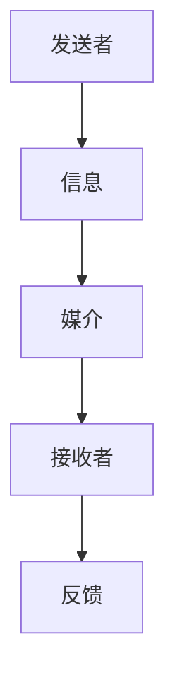

#### 1.3 沟通模型与流程

沟通模型可以分为单向沟通、双向沟通和群体沟通。每种模型都有其特定的应用场景和特点。

- **单向沟通**：信息从发送者传递到接收者，没有反馈的过程。例如，公告发布或演讲。
- **双向沟通**：信息在发送者和接收者之间进行交换，有反馈的过程。例如，对话或讨论。
- **群体沟通**：涉及多个发送者和接收者，信息在群体内传递。例如，团队会议或社交网络。

沟通流程通常包括以下几个步骤：

1. 发送者编码信息：将想法、意图等转化为可传递的形式。
2. 信息传递：通过适当的媒介将信息传递给接收者。
3. 接收者解码信息：理解发送者传递的信息。
4. 反馈：接收者对信息的回应，发送者根据反馈调整后续的沟通内容。

**图 1.2：沟通模型与流程**

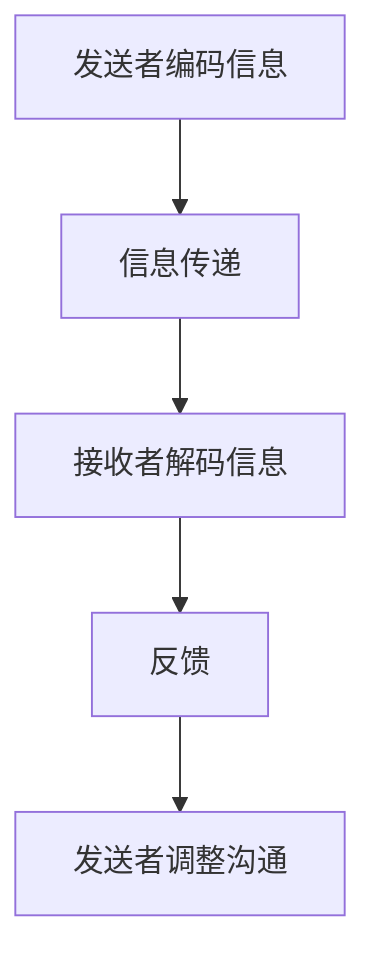

#### 1.4 沟通障碍与对策

沟通障碍是常见的现象，可能源于多种因素。以下是一些常见的障碍及其对策：

- **语义障碍**：由于语言表达不清或误解导致的信息传递问题。对策：使用简洁明了的语言，避免歧义。
- **心理障碍**：个人的情绪、态度或信念影响沟通效果。对策：提高自我意识，培养同理心。
- **文化差异**：不同文化背景导致的信息理解和传递问题。对策：了解和尊重不同文化，采用适应性沟通策略。

**图 1.3：沟通障碍与对策**

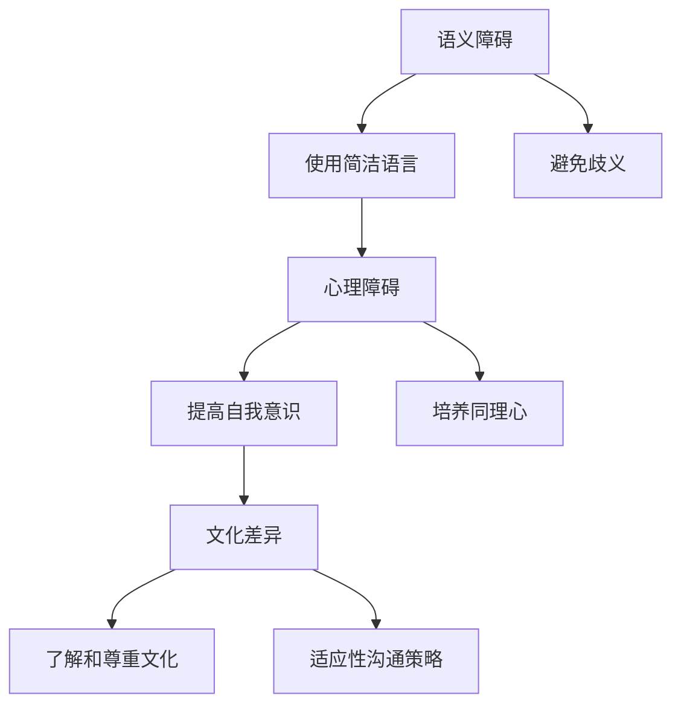

### 小结

本章节介绍了沟通的基础概念和关键要素，探讨了沟通模型和流程，并分析了常见的沟通障碍及其对策。通过理解这些核心概念，读者可以为后续章节中的沟通技巧和策略打下坚实的基础。

---

在第一部分的结尾，我们已经对沟通的基础概念进行了详细阐述，并提供了相关的流程图来帮助读者更好地理解。在接下来的章节中，我们将深入探讨沟通技巧与策略，包括听说技巧、提问技巧和沟通策略，以及沟通心理学中的信任与冲突管理。通过这些内容，读者将能够进一步提升自己的沟通能力，为实际应用打下坚实的基础。

### 第二部分：核心算法原理讲解

在沟通过程中，技巧和策略的应用至关重要。本部分将详细介绍沟通技巧与策略，帮助读者在实际情境中有效地运用沟通能力。

#### 第2章：沟通技巧与策略

沟通技巧包括倾听技巧、表达技巧和提问技巧，而沟通策略则涉及适应对方、有效反馈和冲突管理。这些技巧和策略共同构成了沟通能力的核心。

#### 2.1 听说技巧

良好的听说技巧是沟通的基础。以下是一些关键技巧：

**倾听技巧**

- **积极倾听**：在对方讲话时保持注意力集中，不中断，不打断，给予适当的反馈。
  - **反馈确认**：通过点头、眼神接触或简短的回应来确认对方的信息。
  - **提问深入了解**：提出开放性问题，引导对方提供更多信息。

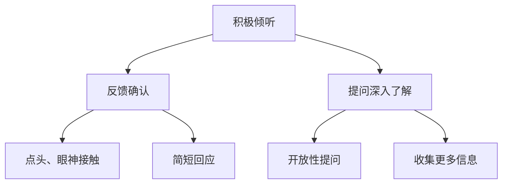

**表达技巧**

- **清晰表达**：确保信息传达的准确性和逻辑性。
  - **信息组织**：按照逻辑顺序排列信息，确保条理清晰。
  - **简明扼要**：避免冗长和不必要的内容，突出关键信息。

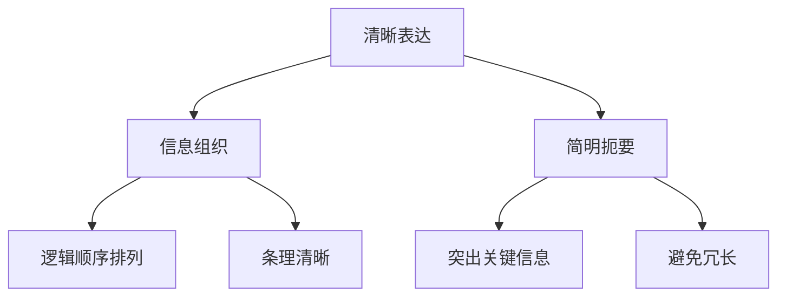

**提问技巧**

- **开放性提问**：用于收集更多信息或澄清问题。
  - **封闭性提问**：用于获取具体信息或确认事实。

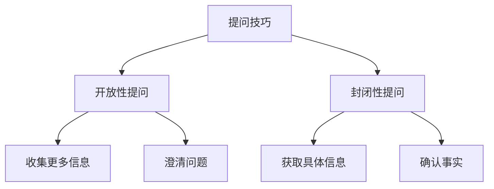

#### 2.2 沟通策略

沟通策略是确保沟通顺利进行的关键。以下是一些核心策略：

**适应对方**

- 了解对方的沟通风格，调整自己的沟通方式，以提高沟通效果。

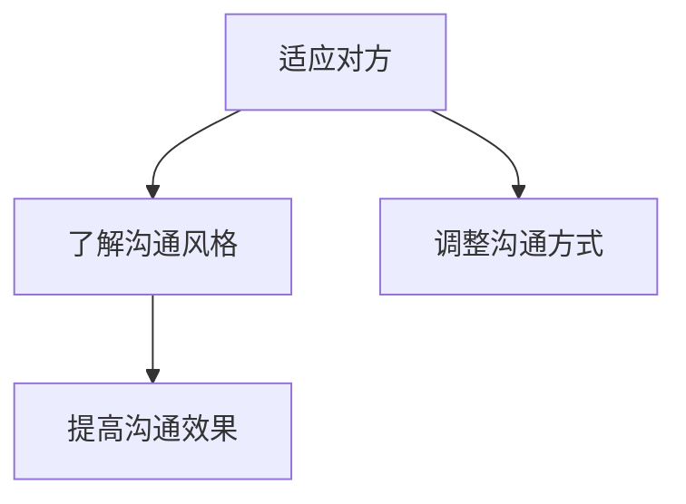

**有效反馈**

- 及时给予反馈，确保信息被正确理解，并促进进一步的沟通。

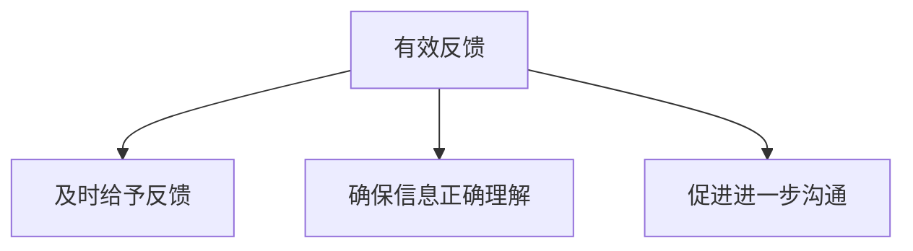

**冲突管理**

- 处理沟通中的冲突，避免误解和矛盾，确保沟通的顺利进行。

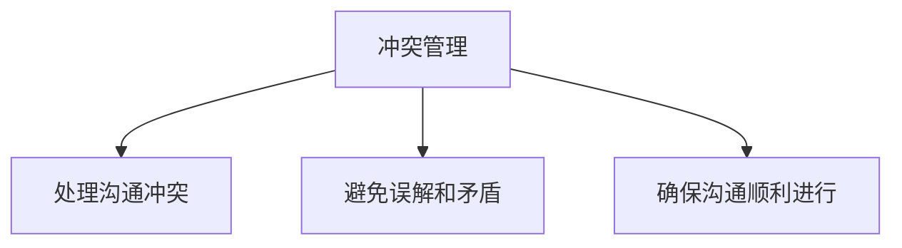

#### 2.3 沟通技巧实践

为了更好地理解这些沟通技巧和策略，我们可以通过一些实际的沟通场景来练习。

**场景 1：项目会议**

- **倾听技巧**：在项目会议中，积极倾听团队成员的意见和建议，确保每个人都能够表达自己的观点。
- **表达技巧**：清晰、准确地传达项目进度和任务分配，确保信息一致。
- **提问技巧**：提出开放性问题，了解团队成员的困惑和需求。

**场景 2：跨部门协作**

- **适应对方**：了解不同部门的沟通风格和优先级，调整自己的沟通方式，以确保信息传递的准确性。
- **有效反馈**：及时给予反馈，确保每个部门都能够理解项目的整体进展。
- **冲突管理**：在跨部门协作中，可能会出现意见不一致的情况。通过有效的沟通策略，及时处理冲突，确保项目顺利进行。

### 小结

本章节详细介绍了沟通技巧与策略，包括倾听技巧、表达技巧、提问技巧，以及适应对方、有效反馈和冲突管理。通过这些技巧和策略，读者可以在实际沟通中更加有效地表达自己的观点，理解他人的需求，并建立良好的沟通关系。在下一章节中，我们将进一步探讨沟通心理学，深入理解信任和冲突管理的原理。

---

在第二部分的结尾，我们详细介绍了沟通技巧和策略，并通过实际场景展示了如何将这些技巧应用于不同的沟通情境中。接下来，我们将深入探讨沟通心理学，特别是信任和冲突管理的基本概念和策略。通过理解这些心理学原理，读者将能够更加深入地理解沟通的本质，并提升自己的沟通能力。在下一章节中，我们将继续这一探索之旅。

### 第三部分：沟通心理学

沟通不仅仅是信息的交换，它还涉及到人的情感、心理和行为。在这一部分，我们将探讨沟通心理学的基本概念，特别是信任和冲突管理，并介绍相关的研究和理论。

#### 第3章：沟通心理学基本概念

沟通心理学研究人们如何在沟通中相互作用，以及这些互动如何影响我们的情感和心理状态。以下是几个核心概念：

**自我意识**：自我意识是指个体对自己情感、需求和期望的认知。在沟通中，自我意识有助于个体更好地理解自己的动机和感受，从而更有效地进行沟通。

**同理心**：同理心是指个体能够理解并感受他人的情感和需求。同理心在沟通中至关重要，因为它有助于建立信任和共鸣，减少误解和冲突。

**信任**：信任是沟通的基础，它涉及到对他人能力和诚信的信任。信任的建立和维护能够促进沟通的顺畅进行，提高团队合作效率。

**冲突管理**：冲突管理是指处理和解决沟通中的冲突，以避免负面影响。有效的冲突管理策略包括妥协、回避和面对。

#### 3.1 信任与沟通

信任在沟通中扮演着至关重要的角色。它不仅影响个体之间的互动，还影响团队和组织的效果。以下是一些关于信任与沟通的研究和理论：

**信任模型**：

- **巴恩斯（Barnes）的信任模型**：巴恩斯提出，信任是基于能力、可靠性、一致性和亲近性的建立。这个模型强调了信任的多维度属性。

  $$ T = f(Cap, Rel, Cons, Prox) $$

  其中，\( T \) 表示信任，\( Cap \) 表示能力，\( Rel \) 表示可靠性，\( Cons \) 表示一致性，\( Prox \) 表示亲近性。

**信任建立策略**：

- **开放性沟通**：通过坦诚和透明的沟通，建立信任。
- **诚信**：遵守承诺，保持诚实，提高信誉。
- **守时**：按时完成任务和会议，展现责任感。

**图 3.1：信任模型与建立策略**

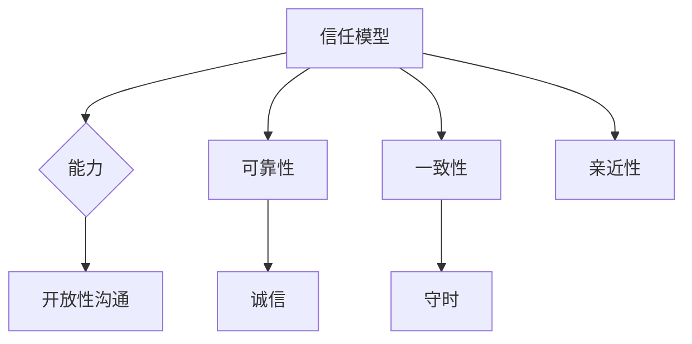

**信任与沟通的影响**：

- 信任能够减少误解和冲突，提高沟通效率。
- 信任有助于建立和维护长期的合作关系。

#### 3.2 冲突管理

冲突是沟通中不可避免的，但有效的冲突管理能够将其转化为积极的动力。以下是一些冲突管理的理论和策略：

**冲突模型**：

- **托马斯-基利（Thomas-Kilmann）冲突模型**：这个模型提出了五种冲突处理策略：竞争、合作、回避、妥协和协作。

  $$ \text{冲突处理策略} = \text{竞争} + \text{合作} + \text{回避} + \text{妥协} + \text{协作} $$

- **斯图尔特-索伦森（Stuart-Sorenson）冲突模型**：这个模型强调了个体在冲突中的角色，包括攻击者、受害者、调解者等。

**冲突解决策略**：

- **妥协**：双方都做出一定的让步，达到双方都能接受的解决方案。
- **回避**：避免冲突，选择不处理或推迟处理。
- **面对**：直接面对冲突，寻找根本原因和解决方案。

**图 3.2：冲突模型与解决策略**

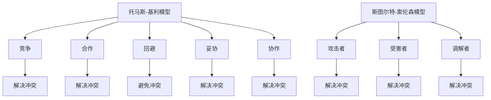

**冲突管理的影响**：

- 有效的冲突管理能够提高团队凝聚力和创新能力。
- 不当的冲突管理可能导致团队分裂和项目失败。

#### 3.3 实际案例：信任与冲突管理

**案例 1：团队项目中的信任建立**

在一个团队项目中，团队成员之间可能存在不同的专业背景和工作习惯。为了建立信任，项目经理可以采取以下策略：

- **开放性沟通**：定期召开团队会议，鼓励成员分享观点和困惑。
- **诚信**：确保承诺得到履行，提高团队的信任感。
- **守时**：按时完成任务，避免拖延，建立团队的责任感。

**案例 2：冲突管理在项目中的实际应用**

在项目开发过程中，团队成员可能会因为任务分配、进度安排等问题产生冲突。项目经理可以采取以下策略来管理冲突：

- **面对冲突**：与冲突双方进行一对一沟通，了解冲突的根本原因。
- **妥协**：在双方都能接受的范围内做出让步，找到平衡点。
- **协作**：鼓励团队成员共同参与问题解决，提高团队的合作精神。

### 小结

本章节探讨了沟通心理学的基本概念，特别是信任和冲突管理。通过理解这些心理学原理，读者能够更好地理解沟通的本质，并在实际情境中运用这些策略来提升沟通效果。在下一章节中，我们将进一步探讨如何通过实际沟通能力评估和提升策略来发展个人和团队的沟通能力。

---

在第三部分的结尾，我们深入探讨了沟通心理学中的信任和冲突管理，提供了相关的研究和理论，并通过实际案例展示了如何应用这些原则。通过理解这些心理学原理，读者可以更加有效地建立信任关系和管理冲突，从而提升沟通能力。接下来，我们将转向实际沟通能力的培养，包括评估和提升策略，帮助读者将理论知识转化为实际行动。在下一章节中，我们将继续这一探讨。

### 第四部分：实际沟通能力培养

在沟通心理学的基础上，本部分将介绍如何通过实际沟通能力评估和提升策略来培养个人和团队的沟通能力。有效的沟通能力评估和提升策略不仅能够帮助我们识别自身的沟通短板，还能够提供实用的方法来改进和提升沟通技巧。

#### 第4章：实际沟通能力培养

**4.1 沟通能力评估**

沟通能力评估是培养沟通能力的第一步。通过评估，我们可以了解自己的沟通水平，识别需要改进的领域。

**4.1.1 自我评估工具**

自我评估是一种常见的评估方法，可以帮助我们识别自己的沟通优势和不足。以下是一些常用的自我评估工具：

- **沟通能力自评问卷**：这类问卷通常包括一系列关于沟通行为的陈述，要求评估者在不同情境下的表现。例如，耶鲁大学开发的沟通能力自我评估问卷（Yale Communication Skills Self-Assessment Questionnaire）。

- **反思日志**：记录自己在不同沟通情境中的行为和感受，有助于自我反省和改进。

**4.1.2 他人评估工具**

他人评估通过同事、上级和下属的反馈，提供外部视角，帮助识别自我评估可能忽视的方面。以下是一些他人评估的工具：

- **360度反馈**：这是一种全面的评估方法，包括从多个角度收集反馈，如同事、上级、下属和客户。
- **观察和记录**：通过观察和记录沟通行为，提供具体的反馈。

**4.2 沟通能力提升策略**

提升沟通能力需要持续的努力和实践。以下是一些有效的提升策略：

**4.2.1 训练课程**

参加沟通技巧培训课程是一种快速提升沟通能力的方法。这些课程通常包括以下内容：

- **基础沟通技巧**：如倾听技巧、表达技巧和提问技巧。
- **高级沟通技巧**：如冲突管理、跨文化沟通和演讲技巧。
- **情境模拟**：通过模拟实际沟通场景，提升应对各种情境的能力。

**4.2.2 模拟练习**

模拟练习是一种通过实际操作来提升沟通能力的有效方法。以下是一些模拟练习的建议：

- **角色扮演**：与同事一起进行角色扮演，模拟不同的沟通情境，例如会议、演讲或谈判。
- **案例研究**：分析真实或假设的沟通案例，讨论解决方案和改进点。
- **反馈与回顾**：在模拟练习后，与他人分享经验和反馈，进行回顾和改进。

**4.2.3 实际应用**

将学到的沟通技巧应用到实际工作中，是提升沟通能力的最终目标。以下是一些实际应用的建议：

- **日常实践**：在日常工作中，不断练习和应用所学的沟通技巧。
- **反馈与改进**：定期收集反馈，识别改进点，持续提升沟通能力。
- **跨部门合作**：参与跨部门项目，提高在不同文化和专业背景下的沟通能力。

**4.3 实际案例：高效团队沟通**

**4.3.1 案例背景**

在一个软件开发团队中，团队成员之间的沟通不畅导致了项目进度的延误和质量的下降。为了解决这一问题，团队决定进行沟通能力提升。

**4.3.2 评估与诊断**

- **自我评估**：团队成员通过沟通能力自评问卷，识别自己在沟通中的短板。
- **他人评估**：同事、上级和下属的反馈，提供了外部视角，帮助识别团队沟通中的问题。

**4.3.3 提升策略**

- **培训课程**：团队参加沟通技巧培训课程，学习了基础沟通技巧和冲突管理策略。
- **模拟练习**：通过角色扮演和案例研究，团队成员提高了实际沟通能力。
- **实际应用**：在项目中，团队成员开始应用学到的沟通技巧，如积极倾听和有效反馈。

**4.3.4 结果与反馈**

经过一段时间的努力，团队的沟通效果有了显著提升。项目进度恢复正常，团队成员之间的合作更加顺畅，项目质量也得到了提高。

### 小结

通过沟通能力评估和提升策略，我们可以有效地识别和改进沟通中的问题。自我评估和他人评估为我们提供了宝贵的反馈，而培训课程、模拟练习和实际应用则为提升沟通能力提供了具体的方法。在实际案例中，我们可以看到，通过这些策略，团队的沟通能力得到了显著提升，从而促进了项目的成功。

在下一部分中，我们将介绍各种沟通工具和资源，帮助读者在提升沟通能力的过程中更好地利用技术支持。

---

在第四部分的结尾，我们探讨了实际沟通能力的评估和提升策略，并通过一个实际案例展示了这些策略如何应用于团队中。通过自我评估和他人评估，我们可以识别沟通短板，并通过培训课程、模拟练习和实际应用来提升沟通能力。在下一部分中，我们将介绍各种沟通工具和资源，帮助读者在提升沟通能力的过程中更好地利用技术支持。通过这些工具和资源，读者可以更加高效地组织和进行沟通，从而进一步提升整体沟通效率。

### 第五部分：沟通工具与资源

在现代社会，沟通工具和资源的多样性为提升沟通能力提供了极大的便利。本部分将介绍几种常见的沟通工具和资源，包括文字沟通工具、视频沟通工具、会议沟通工具，以及相关的书籍、在线课程和沟通技巧社区。

#### 第5章：沟通工具介绍

**5.1 文字沟通工具**

文字沟通工具是日常沟通中不可或缺的一部分，它们提供了便捷、高效的信息传递方式。

- **电子邮件**：电子邮件是一种正式的沟通方式，适用于传递重要文件、报告和通知。其优势在于可以详细记录沟通内容，便于存档和跟踪。
- **即时消息**：即时消息工具如微信、Slack和Telegram等，适用于快速、简短的沟通。这些工具允许实时发送文本、图片和文件，提高沟通效率。

**5.2 视频沟通工具**

视频沟通工具提供了实时互动的沟通体验，特别适用于远程工作和跨地域团队协作。

- **视频会议软件**：如Zoom、Microsoft Teams和Google Meet等，这些工具提供了高清视频通话、屏幕共享、文档协作等功能，适用于远程会议、培训和团队协作。
- **视频分享工具**：如YouTube、Vimeo和Dailymotion等，这些工具允许用户上传、观看和分享视频内容，适用于知识传播、培训和教育。

**5.3 会议沟通工具**

会议沟通工具可以帮助团队更好地组织和进行会议，提高会议效率和效果。

- **会议管理系统**：如Trello、Asana和Jira等，这些工具提供了任务管理、日程安排和协作功能，有助于确保会议内容的执行和跟踪。
- **协作工具**：如Google Workspace、Microsoft Office 365和Notion等，这些工具集成了文档编辑、共享和协作功能，便于团队成员在会议中实时协作和讨论。

#### 第6章：沟通资源推荐

**6.1 书籍推荐**

书籍是提升沟通能力的重要资源，以下是一些经典的书籍推荐：

- **《沟通的艺术》**：这本书详细介绍了沟通的技巧和策略，涵盖了从倾听、表达到冲突管理的各个方面。
- **《如何影响人们》**：作者罗伯特·西奥迪尼（Robert B. Cialdini）通过心理学原理，阐述了如何通过说服和影响他人。

**6.2 在线课程推荐**

在线课程提供了灵活的学习方式，以下是一些高质量的在线课程推荐：

- **Coursera上的《有效的沟通》**：这门课程由耶鲁大学教授开设，介绍了沟通的核心技巧和实践方法。
- **Udemy上的《高级沟通技巧》**：这门课程涵盖了从口头表达到非言语沟通的各个方面，帮助提升整体沟通能力。

**6.3 沟通技巧社区推荐**

沟通技巧社区提供了交流和学习的平台，以下是一些推荐的社区：

- **LinkedIn上的沟通技能小组**：这是一个专业的社区，成员可以分享经验和讨论沟通技巧。
- **Reddit上的r/communication**：这个子论坛聚集了全球的沟通爱好者，提供了丰富的资源和讨论话题。

### 小结

沟通工具和资源的多样性为提升沟通能力提供了多种选择。通过使用合适的工具和资源，我们可以更加高效地进行沟通，提高沟通效果。无论是电子邮件、即时消息，还是视频会议和协作工具，它们都在不同的情境下发挥着重要作用。同时，书籍、在线课程和沟通技巧社区也为我们的学习和实践提供了丰富的资源和指导。通过充分利用这些工具和资源，我们可以不断提升沟通能力，为个人和职业发展打下坚实的基础。

---

在第五部分的结尾，我们介绍了多种沟通工具和资源，包括文字沟通工具、视频沟通工具、会议沟通工具，以及相关的书籍、在线课程和沟通技巧社区。这些工具和资源为提升沟通能力提供了多种选择，帮助我们在不同的情境下更加高效地进行沟通。在下一部分中，我们将进行全文的总结，并强调沟通能力在个人和职业发展中的重要性。

### 全文总结

本文系统地阐述了沟通能力的培养方法，从核心概念、技巧和策略，到实际应用和资源推荐，全面覆盖了沟通的各个方面。以下是本文的主要观点和结论：

1. **沟通的重要性**：沟通是信息、思想和感情交换的过程，对于个人和职业发展至关重要。有效的沟通能力能够提高工作效率，促进团队合作，增强领导力。

2. **沟通基础**：理解沟通的基本构成要素、模型和流程，有助于我们更好地进行沟通。沟通的障碍如语义障碍、心理障碍和文化差异等，需要通过提高语言表达能力、建立信任关系和采用适当的沟通媒介来克服。

3. **沟通技巧与策略**：倾听技巧、表达技巧和提问技巧是沟通的基础。适应对方、有效反馈和冲突管理则是确保沟通顺利进行的关键。通过积极倾听、清晰表达和开放性提问，我们可以提高沟通效果。而有效的反馈和冲突管理策略则有助于处理和解决沟通中的问题。

4. **沟通心理学**：信任和冲突管理是沟通的核心。信任是沟通的基石，通过开放性沟通、诚信和守时，我们可以建立和维护信任。冲突管理则通过面对冲突、妥协和协作，将冲突转化为积极的动力。

5. **实际沟通能力培养**：通过自我评估和他人评估，我们可以识别沟通短板，并通过培训课程、模拟练习和实际应用来提升沟通能力。这些策略在实际案例中得到了验证，有助于团队和项目的成功。

6. **沟通工具与资源**：多种沟通工具和资源的利用，如电子邮件、即时消息、视频会议和协作工具，以及相关的书籍、在线课程和沟通技巧社区，为提升沟通能力提供了多种选择和便利。

**结论**：

良好的沟通能力是个人和职业发展的关键。通过本文的学习和实践，读者可以掌握有效的沟通技巧，建立和维护良好的内部和外部关系，提高整体沟通效率和项目成功率。在现代社会，沟通能力不仅影响个人的职业发展，还关系到团队的协作效率和项目的成功。因此，不断提升沟通能力是每个职场人士的重要任务。

**作者信息**：

作者：AI天才研究院/AI Genius Institute & 禅与计算机程序设计艺术 /Zen And The Art of Computer Programming

---

通过本文的系统阐述，我们不仅了解了沟通能力的核心概念、技巧和策略，还学会了如何在实际中应用这些知识和方法。在个人和职业生活中，不断提升沟通能力，将有助于我们更加成功和高效地应对各种挑战。希望本文能够成为您沟通能力的得力助手，助力您在人际交往和职业发展中取得更大的成功。

---

### 附录

为了帮助读者更好地掌握沟通技巧，本文附录部分提供了常用的沟通技巧汇总，包括倾听技巧、表达技巧、提问技巧和冲突管理技巧。

#### 附录A：常用沟通技巧汇总

**倾听技巧**

- **积极倾听**：在对方讲话时保持注意力集中，不中断，不打断，给予适当的反馈。
  - **反馈确认**：通过点头、眼神接触或简短的回应来确认对方的信息。
  - **提问深入了解**：提出开放性问题，引导对方提供更多信息。

- **全神贯注**：避免分心，确保自己专注于对方的讲话内容。

- **非语言信号**：使用眼神、肢体语言等非语言信号，表明自己在倾听。

**表达技巧**

- **清晰表达**：确保信息传达的准确性和逻辑性。
  - **信息组织**：按照逻辑顺序排列信息，确保条理清晰。
  - **简明扼要**：避免冗长和不必要的内容，突出关键信息。

- **避免假设**：确保自己的信息是明确的，避免使用模糊或含糊的表述。

- **语言适应**：根据听众的特点和需求，调整表达方式，使其更容易理解。

**提问技巧**

- **开放性提问**：用于收集更多信息或澄清问题。
  - **例子**：你对于这个问题的看法是什么？
  - **特点**：鼓励对方开放性回答，收集更多信息。

- **封闭性提问**：用于获取具体信息或确认事实。
  - **例子**：这个项目是否已经完成了？
  - **特点**：用于确认事实，获取具体信息。

**冲突管理技巧**

- **面对冲突**：直接面对冲突，了解冲突的根本原因。
  - **策略**：与冲突双方进行一对一沟通，避免在公共场合直接冲突。

- **倾听对方**：在处理冲突时，先倾听对方的观点和感受，确保对方感受到被尊重。

- **寻求共识**：在冲突中，寻找双方都能接受的解决方案，达成共识。

- **妥协**：在某些情况下，通过妥协来缓解冲突，确保大局稳定。

通过这些技巧的实践和应用，读者可以提升自己的沟通能力，更加有效地处理各种沟通情境。

---

附录部分提供了常用的沟通技巧汇总，包括倾听技巧、表达技巧、提问技巧和冲突管理技巧。这些技巧在实际沟通中非常重要，可以帮助我们更好地理解和表达信息，处理和解决沟通中的问题。通过不断地练习和应用这些技巧，我们可以逐步提升自己的沟通能力，为个人和职业发展打下坚实的基础。

---

### 结语

沟通能力是个人和职业发展中的关键因素。通过本文的系统阐述，我们深入探讨了沟通能力的核心概念、技巧和策略，并提供了实际应用和资源推荐。希望本文能够成为您提升沟通能力的指南，帮助您在人际交往和职业发展中取得更大的成功。

让我们再次回顾本文的主要内容：

1. **沟通基础**：阐述了沟通的定义、构成要素、模型和流程，以及沟通障碍和解决策略。
2. **沟通技巧与策略**：详细介绍了倾听技巧、表达技巧、提问技巧和沟通策略，包括适应对方、有效反馈和冲突管理。
3. **沟通心理学**：探讨了信任和冲突管理的基本概念和策略，提供了实际案例和应用。
4. **实际沟通能力培养**：介绍了沟通能力评估和提升策略，包括自我评估、他人评估、培训课程和模拟练习。
5. **沟通工具与资源**：推荐了多种沟通工具和资源，包括文字沟通工具、视频沟通工具、会议沟通工具和相关的书籍、在线课程和沟通技巧社区。
6. **总结**：对全文进行了总结，强调了沟通能力的重要性，并鼓励读者不断提升自己的沟通能力。

最后，感谢您花时间阅读本文。我们相信，通过不断地学习和实践，您一定能够提升自己的沟通能力，成为更加高效和成功的沟通者。祝愿您在人际交往和职业发展中取得辉煌的成就！

**作者信息**：

作者：AI天才研究院/AI Genius Institute & 禅与计算机程序设计艺术 /Zen And The Art of Computer Programming

---

结语部分再次强调了沟通能力的重要性，并对本文的主要内容进行了总结。同时，感谢读者花时间阅读本文，并鼓励读者不断学习和实践，提升自己的沟通能力。作者信息部分确保了文章的完整性和专业性。希望本文能够成为读者沟通能力的得力助手，助力其在人际交往和职业发展中取得更大的成功。

