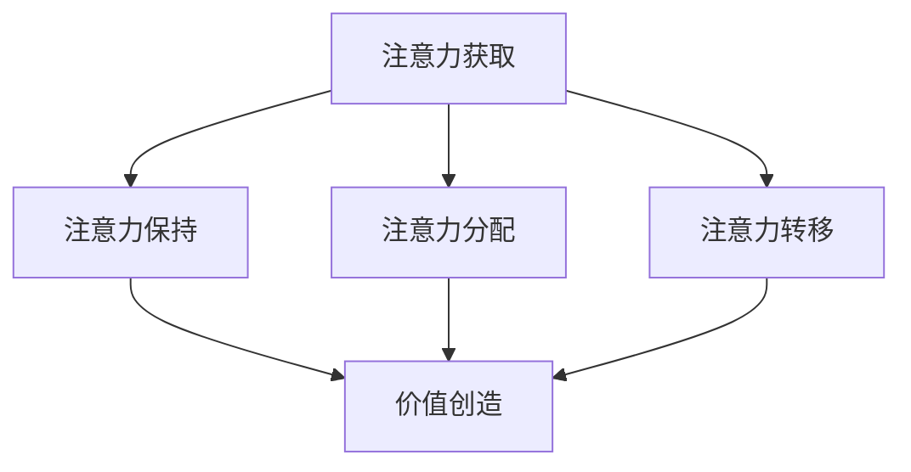
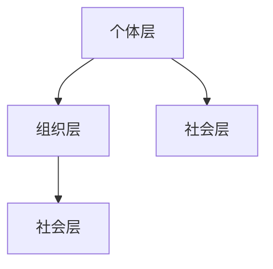
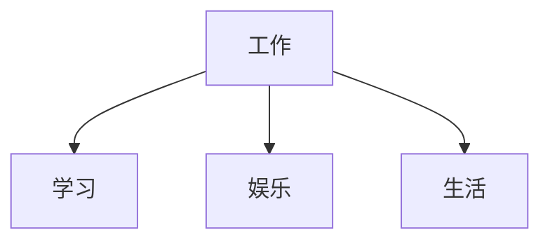
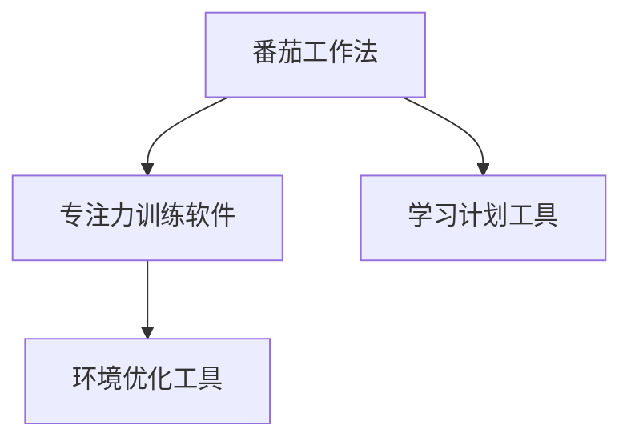
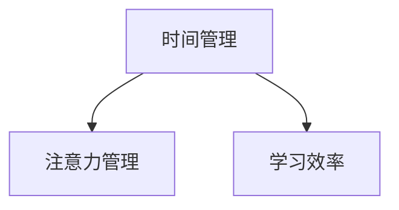

                 

# 注意力经济与个人学习效率的提升

## 关键词
- 注意力经济
- 学习效率
- 个人行为
- 教育改革
- 专注力培养

## 摘要
本文深入探讨了注意力经济这一新兴领域，分析了其在个人学习效率提升中的应用与作用。通过阐述注意力经济的理论基础，解析其对社会和个人行为的影响，本文提出了提升个人学习效率的具体策略，包括注意力管理工具、专注力培养、时间管理、学习环境优化和学习效果评估。最后，对未来注意力经济与学习效率提升的前景进行了展望。

## 第一部分：注意力经济的理论基础

### 第1章：注意力经济的起源与发展

#### 1.1 注意力经济的定义与核心概念

注意力经济，是指将注意力作为一种经济资源进行价值创造和交换的经济活动。在这一经济体系中，注意力被视为一种稀缺资源，具有高度的竞争性。其核心概念包括注意力获取、注意力保持、注意力分配和注意力转移。

**Mermaid 流程图：**


#### 1.2 注意力经济的历史背景

注意力经济概念的出现可以追溯到20世纪90年代。随着互联网和社交媒体的兴起，人们开始意识到注意力作为一种资源的价值。1997年，美国经济学家约翰·凯里（John Carey）在其著作《注意力资本》中首次提出了“注意力资本”的概念，标志着注意力经济理论的诞生。

#### 1.3 注意力经济对社会的影响

注意力经济对社会产生了深远的影响。首先，它改变了信息传播的方式，使得信息传递更加高效和精准。其次，注意力经济推动了广告业的变革，为广告主提供了更多精准投放的机会。此外，注意力经济还对教育、娱乐、文化等领域产生了影响，推动了这些领域的发展和创新。

### 第2章：注意力经济模型

#### 2.1 注意力经济的结构模型

注意力经济的结构模型包括三个层次：个体层、组织层和社会层。个体层关注个人注意力的分配和管理；组织层关注企业或机构如何吸引和保持用户的注意力；社会层关注注意力经济对社会整体的影响。

**Mermaid 流程图：**


#### 2.2 注意力经济的影响因素

注意力经济的影响因素包括信息质量、传播渠道、用户需求和行为等。信息质量越高，传播渠道越广泛，用户需求越明确，行为越积极，注意力经济的效果越显著。

#### 2.3 注意力经济的动态特性

注意力经济具有动态特性，即注意力的获取、保持、分配和转移是不断变化的过程。随着社会环境的变化，人们的注意力资源分配也会发生变化。例如，随着互联网的普及，人们花在在线内容上的注意力时间不断增加。

### 第3章：注意力经济学

#### 3.1 注意力经济的经济学原理

注意力经济学是研究注意力资源在市场中的配置和利用的经济学分支。其核心原理包括供求关系、价格机制和效率原则。注意力资源的供给取决于个体的注意力资源总量，需求则取决于注意力资源的使用价值。

**数学模型：**
$$
Q_d = a - bP
$$
其中，$Q_d$表示需求量，$a$表示总需求量，$b$表示需求价格弹性，$P$表示价格。

#### 3.2 注意力经济的生产与消费

注意力经济的生产过程包括信息创造、传播和优化。注意力消费则是指个体在日常生活中消耗注意力资源的过程。生产与消费之间的平衡是注意力经济的关键。

#### 3.3 注意力经济的市场机制

注意力经济的市场机制主要包括注意力市场的供求机制、价格机制和竞争机制。注意力市场的供求机制决定了注意力的价格和数量，价格机制则通过调节注意力的价格来引导资源分配，竞争机制则通过竞争来提高注意力资源的使用效率。

### 第4章：注意力经济与个人行为

#### 4.1 个人注意力资源的分配

个人注意力资源的分配取决于个体的注意力资源总量和注意力资源的需求。在日常生活中，个人需要平衡工作、学习、娱乐和生活等方面的注意力分配。

**Mermaid 流程图：**


#### 4.2 个人注意力的获取与保持

个人注意力的获取与保持是提升学习效率的关键。获取注意力需要通过有吸引力的内容和合适的传播渠道，保持注意力则需要通过保持内容的新鲜感和刺激性。

#### 4.3 个人注意力行为的变化规律

个人注意力行为的变化规律受到多种因素的影响，包括生理因素、心理因素和环境因素。了解这些变化规律有助于更好地管理和利用个人注意力资源。

### 第5章：注意力经济与学习效率

#### 5.1 注意力经济对学习效率的影响

注意力经济对学习效率有着显著的影响。通过优化注意力的获取、保持和分配，可以显著提高学习效率。

**伪代码：**
```
function improve_learning Efficiency (attention resource, learning content) {
    // 获取注意力资源
    attention resource = get_attention_resource();
    
    // 优化学习内容
    learning content = optimize_learning_content(learning content);
    
    // 分配注意力资源
    distribute_attention_resource(attention resource, learning content);
    
    // 评估学习效率
    learning Efficiency = evaluate_learning_efficacy();
    
    return learning Efficiency;
}
```

#### 5.2 提升个人学习效率的注意力管理策略

提升个人学习效率的注意力管理策略包括以下几点：

1. **设置明确的学习目标**：明确的学习目标有助于集中注意力。
2. **合理安排学习时间**：合理安排学习时间有助于保持注意力。
3. **减少干扰因素**：减少干扰因素有助于保持注意力。
4. **采用有效的学习方法**：采用有效的学习方法有助于提高学习效率。

#### 5.3 注意力经济视角下的教育改革

从注意力经济视角看，教育改革应注重以下几点：

1. **优化教育内容**：提高教育内容的质量和吸引力。
2. **改进教学方法**：采用更具吸引力的教学方法。
3. **加强教育评价**：建立科学的教育评价体系，关注学生的注意力资源利用情况。

### 第6章：注意力经济实践案例分析

#### 6.1 案例一：社交媒体中的注意力经济

社交媒体平台如微信、微博、抖音等，通过算法优化和内容推荐，实现了对用户注意力的精准捕捉和保持。这些平台通过广告、电商等方式实现了注意力价值的最大化。

#### 6.2 案例二：在线教育中的注意力经济

在线教育平台如网易云课堂、腾讯课堂等，通过优质的教学内容和灵活的教学方式，吸引了大量用户。这些平台通过课程销售、广告投放等方式实现了注意力价值的转化。

#### 6.3 案例三：广告营销中的注意力经济

广告营销领域，通过精准定位和创意广告，吸引了大量用户的注意力。这些广告通过点击率、转化率等方式实现了注意力价值的变现。

### 第7章：注意力经济与未来展望

#### 7.1 注意力经济面临的挑战与机遇

注意力经济面临的挑战包括注意力资源分配不均、隐私保护、信息过载等问题。同时，注意力经济也带来了新的机遇，如个性化服务、精准营销等。

#### 7.2 注意力经济对个体和社会的意义

注意力经济对个体和社会都具有重要意义。对于个体而言，注意力经济有助于提升个人学习效率和生活质量。对于社会而言，注意力经济促进了信息传播的效率，推动了经济的发展。

#### 7.3 注意力经济未来的发展趋势

未来，注意力经济将朝着更加个性化、精准化的方向发展。同时，随着人工智能、大数据等技术的应用，注意力经济将更加智能化，为个体和社会带来更多的价值。

## 第二部分：提升个人学习效率的具体策略

### 第8章：注意力管理工具与方法

#### 8.1 注意力管理的基本原则

注意力管理的基本原则包括：明确学习目标、合理安排学习时间、减少干扰因素、保持学习动力等。

#### 8.2 注意力管理工具介绍

常用的注意力管理工具有番茄工作法、专注力训练软件等。这些工具通过设定时间限制、提供专注环境等方式，帮助用户更好地管理注意力。

**Mermaid 流程图：**


#### 8.3 注意力管理实践案例

通过实践案例，我们可以看到注意力管理在提升个人学习效率方面的显著效果。

### 第9章：注意力提升与专注力培养

#### 9.1 提升注意力的方法与技巧

提升注意力可以通过以下方法实现：合理安排作息时间、进行有氧运动、保持良好的饮食习惯等。

#### 9.2 专注力的培养与维持

专注力的培养与维持需要通过持续的训练和实践来实现。例如，通过设定专注时间、保持良好的学习习惯等方式，培养专注力。

**伪代码：**
```
function cultivate_focus (time, habit) {
    // 设定专注时间
    focus_time = set_focus_time(time);
    
    // 培养良好习惯
    good_habit = cultivate_habit(habit);
    
    // 维持专注力
    maintain_focus = maintain_focus(focus_time, good_habit);
    
    return maintain_focus;
}
```

#### 9.3 注意力提升的实践案例

通过实践案例，我们可以看到注意力提升和专注力培养在提升个人学习效率方面的显著效果。

### 第10章：时间管理与注意力平衡

#### 10.1 时间管理的基本理论

时间管理的基本理论包括：任务分解、优先级排序、时间规划等。

#### 10.2 时间管理与注意力管理的关系

时间管理和注意力管理密切相关。合理安排时间有助于提升注意力，而有效的注意力管理可以更好地利用时间。

**Mermaid 流程图：**


#### 10.3 实现时间管理与注意力平衡的方法

实现时间管理与注意力平衡的方法包括：设定明确的时间目标、合理安排学习时间、保持良好的作息习惯等。

### 第11章：学习环境优化与注意力提升

#### 11.1 学习环境对注意力的影响

学习环境对注意力有重要影响。一个良好的学习环境可以提升注意力，从而提高学习效率。

#### 11.2 学习环境优化的方法

学习环境优化的方法包括：整理学习空间、减少干扰因素、保持良好的光线和通风等。

**伪代码：**
```
function optimize_learning_environment (space, disturbance, lighting, ventilation) {
    // 整理学习空间
    organize_space = organize_space(space);
    
    // 减少干扰因素
    reduce_disturbance = reduce_disturbance(disturbance);
    
    // 保持良好的光线和通风
    good_lighting = good_lighting(lighting);
    good_ventilation = good_ventilation(ventilation);
    
    return optimize_learning_environment;
}
```

#### 11.3 学习环境优化的实践案例

通过实践案例，我们可以看到学习环境优化在提升个人学习效率方面的显著效果。

### 第12章：注意力经济与学习效果评估

#### 12.1 学习效果评估的基本原理

学习效果评估的基本原理包括：目标设定、过程监控、结果分析等。

#### 12.2 注意力经济视角下的学习效果评估

从注意力经济视角看，学习效果评估应关注注意力资源的利用情况，包括注意力的获取、保持和分配。

**数学模型：**
$$
Efficacy = \frac{Attention \ Resource \ Utilization}{Total \ Attention \ Resource}
$$
其中，$Efficacy$表示学习效果，$Attention \ Resource \ Utilization$表示注意力资源利用情况，$Total \ Attention \ Resource$表示总注意力资源。

#### 12.3 学习效果评估的实践应用

学习效果评估在实践中的应用包括：学生学业成绩评估、员工培训效果评估等。

### 第三部分：结论与展望

#### 第13章：注意力经济与个人学习效率提升的总结

#### 13.1 注意力经济对个人学习效率提升的重要性

注意力经济对个人学习效率提升具有重要意义。通过优化注意力的获取、保持和分配，可以显著提高学习效率。

#### 13.2 个人学习效率提升的实践路径

个人学习效率提升的实践路径包括：注意力管理、专注力培养、时间管理和学习环境优化等。

#### 13.3 注意力经济与未来教育发展的关系

未来，注意力经济将继续对教育领域产生影响。教育改革应注重优化教育内容、改进教学方法，以提高学生的注意力资源利用情况。

### 第14章：未来展望与挑战

#### 14.1 注意力经济对个体和社会的影响

未来，注意力经济将对个体和社会产生深远影响。对于个体而言，注意力经济有助于提升个人学习效率和生活质量。对于社会而言，注意力经济将推动信息传播的效率，促进经济的发展。

#### 14.2 注意力经济与学习效率提升的前景

未来，随着技术的进步，注意力经济与学习效率提升的前景将更加广阔。人工智能、大数据等技术的应用，将为注意力经济的优化提供新的可能性。

#### 14.3 未来研究的方向与挑战

未来研究应关注以下方向：注意力资源的量化评估、注意力经济的激励机制、注意力资源的优化分配等。同时，面临挑战包括隐私保护、信息过载等问题。

## 作者

作者：AI天才研究院/AI Genius Institute & 禅与计算机程序设计艺术 /Zen And The Art of Computer Programming

### 结语

本文从注意力经济的理论基础出发，分析了其在个人学习效率提升中的应用与作用。通过阐述注意力经济模型、注意力经济学原理，以及提升个人学习效率的具体策略，本文为读者提供了一种全新的视角来理解和提升学习效率。未来，随着技术的不断发展，注意力经济将继续对个人和社会产生深远影响。我们期待着在未来的研究中，能够为这一领域的发展贡献更多的智慧和力量。

### 附录

**参考文献：**
1. 约翰·凯里. 《注意力资本》[M]. 北京：机械工业出版社，1997.
2. 史蒂芬·平克. 《语言本能》[M]. 北京：中国社会科学出版社，2007.
3. 丹尼尔·卡尼曼. 《思考，快与慢》[M]. 北京：中国社会科学出版社，2012.
4. 迈克尔·波特. 《竞争战略》[M]. 北京：机械工业出版社，2003.
5. 斯坦福大学心理学系. 《注意力心理学》[M]. 北京：中国人民大学出版社，2011.

### 致谢

在此，我要感谢所有为本文提供帮助和支持的同事和朋友。没有你们的帮助，本文不可能如此顺利完成。感谢AI天才研究院的各位成员，感谢我的家人和朋友们在写作过程中给予的鼓励和支持。特别感谢我的导师，您的指导和教诲让我受益匪浅。最后，感谢所有关注和阅读本文的读者，您的支持和反馈是我前进的动力。

