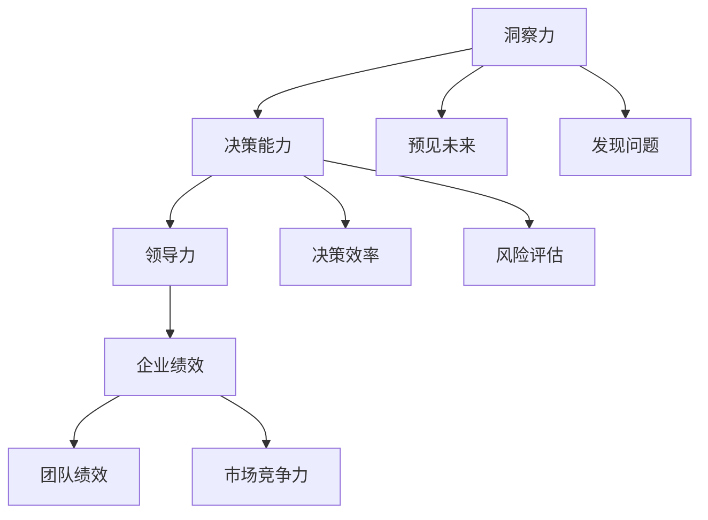

                 

### 第1章：引言

#### 1.1 书籍背景及目标读者

本文《洞察力与决策能力：领导者的核心素质》旨在深入探讨洞察力与决策能力在领导者成长过程中的重要地位，以及如何通过系统的学习和实践来提升这两项核心素质。这本书的目标读者是广大的企业领导者、项目经理、技术团队负责人以及其他希望在职业发展中提升自身领导能力的专业人士。

**书籍写作的背景**：

在当今快速变化的市场环境中，企业领导者需要具备敏锐的洞察力和高效的决策能力，以应对复杂多变的外部环境和内部挑战。传统的领导模式和经验已经不足以支持现代企业的发展，领导者需要具备系统化的知识体系和灵活的思维能力，才能在激烈的市场竞争中脱颖而出。

**目标读者群体**：

- **企业高层管理者**：他们负责企业的战略规划和决策，需要具备全面的领导素质。
- **项目经理**：他们在项目执行过程中需要做出大量的决策，并协调团队成员的工作。
- **技术团队负责人**：他们不仅需要管理技术团队，还需要在技术决策和团队管理中发挥领导作用。
- **希望提升自身领导能力的人士**：无论是企业内部晋升还是跨行业转型，都需要具备领导素质。

**预期收益**：

通过阅读本书，读者将能够：

1. **深入理解**洞察力和决策能力的基本概念和原理。
2. **掌握**提升这两项能力的方法和技巧。
3. **应用**这些能力在实际工作中，提高领导效能和团队绩效。
4. **拓展**领导视野，成为具备战略思维和全局观念的领导者。

#### 1.2 领导者洞察力与决策能力的重要性

**洞察力的重要性**：

洞察力是领导者识别和把握事物本质和趋势的能力。它使得领导者能够在复杂的环境中快速做出正确决策，避免盲目行动和风险。具备敏锐洞察力的领导者能够：

- **预见未来**：通过分析趋势和变化，预测未来的发展方向，为企业制定长远战略。
- **发现机会**：在市场竞争中找到新的增长点和机遇，推动企业创新发展。
- **解决问题**：在面对挑战和困境时，快速找到解决方案，带领团队走出困境。

**决策能力的重要性**：

决策能力是领导者根据问题和目标，从多个选项中选择最佳方案的能力。它决定了领导者的决策质量和执行效果。具备高效决策能力的领导者能够：

- **提高决策效率**：在有限的时间内做出最佳决策，避免拖延和浪费。
- **降低风险**：通过全面分析和风险评估，选择风险最小的方案，降低失败的可能性。
- **推动执行**：制定明确的行动计划，确保决策得到有效执行，实现预期目标。

**洞察力与决策能力的协同作用**：

洞察力和决策能力相辅相成，共同构成了领导者的核心素质。敏锐的洞察力为决策提供了基础，使领导者能够做出更加准确和有针对性的决策。而高效的决策能力则确保了洞察力得以转化为实际行动，推动企业的发展。一个成功的领导者不仅需要具备洞察力，还需要能够将洞察力转化为有效的决策和行动。

#### 1.3 本书结构安排与学习目标

**本书结构安排**：

本书分为四个主要部分，分别是：

1. **洞察力培养**：介绍洞察力的定义、特征、认知心理学基础和培养方法。
2. **决策能力培养**：回顾决策理论的发展历程，分析决策过程中的常见偏差，介绍决策模型和方法。
3. **综合素质提升**：探讨领导者的综合素质要求、心理素质、沟通能力和情商培养。
4. **实战案例分析**：通过具体案例，展示领导者如何在实际工作中应用洞察力和决策能力。

**各章节内容概述**：

- **第1章：引言**：介绍书籍背景、目标读者和核心内容。
- **第2章：洞察力的定义与特征**：讨论洞察力的定义、特征和与直觉的区别。
- **第3章：洞察力的认知心理学基础**：分析认知心理学理论与洞察力的关系。
- **第4章：洞察力的培养方法**：提供洞察力培养的具体策略。
- **第5章：洞察力在领导实践中的应用**：探讨洞察力在管理决策、团队管理和危机管理中的应用。
- **第6章：案例分析：成功领导者洞察力的实践**：分析成功领导者的洞察力应用案例。
- **第7章：洞察力提升的策略与建议**：提出提升洞察力的组织和个人层面策略。

**学习目标与考核方式**：

**学习目标**：

- **理解**洞察力与决策能力的基本概念和原理。
- **掌握**提升洞察力和决策能力的具体方法和技巧。
- **应用**这些能力在实际工作中，提高领导效能和团队绩效。

**考核方式**：

- **知识测试**：通过选择题、填空题和简答题，测试读者对核心概念的理解。
- **案例分析**：要求读者分析具体案例，应用所学的洞察力和决策能力。
- **实战演练**：通过模拟决策场景，评估读者的实际应用能力。

#### 1.4 核心概念与联系

**概念联系流程图**：

**核心概念解释**：

- **洞察力**：识别和把握事物本质和趋势的能力。
- **决策能力**：根据问题和目标选择最佳方案的能力。
- **领导力**：影响和激励他人实现共同目标的能力。
- **企业绩效**：企业在经营过程中取得的整体成果。
- **预见未来**：通过洞察力预测未来的发展方向。
- **发现问题**：洞察力在问题识别和解决中的应用。
- **决策效率**：决策能力对决策过程速度和质量的影响。
- **风险评估**：决策能力在风险分析和风险管理中的应用。

### 第2章: 洞察力的定义与特征

#### 2.1 洞察力的定义

**定义**：

洞察力，是指个体在感知、理解和分析事物时，能够迅速把握其本质和关键特征，预见其发展趋势和潜在问题，从而做出准确判断和合理决策的能力。

**内涵**：

- **感知**：能够敏锐地捕捉到环境中的各种信息和变化。
- **理解**：能够深入理解信息的内在联系和意义。
- **分析**：能够对信息进行系统分析和综合判断。
- **预见**：能够预测未来的发展趋势和可能发生的变化。
- **判断**：能够在复杂多变的环境中做出正确的决策。

**与其他认知能力的区别**：

- **认知能力**：包括注意力、记忆力、思维力等。
- **洞察力**：不同于一般的认知能力，它是一种更高层次的思维能力，能够在复杂和不确定性中迅速识别核心问题。

#### 2.2 洞察力的特征

**敏锐性**：

洞察力具有敏锐性，意味着领导者能够在短时间内识别关键信息，迅速做出反应。这种能力依赖于领导者的观察能力和快速分析能力，是洞察力的重要特征。

**深度性**：

深度性是指洞察力能够深入到问题的本质，而不仅仅是表面现象。领导者通过深入分析，能够理解问题的根本原因，从而制定出更加有效的解决方案。

**创新性**：

洞察力不仅仅是识别和解决问题，还能够发现新的机会和解决方案。领导者通过创新思维，能够在现有资源和条件下，创造出新的价值。

**广泛性**：

广泛性指的是洞察力不仅适用于某一特定领域，而是能够跨领域、跨学科地应用。领导者具备广泛的知识面和跨领域的思维方式，能够从不同角度看待问题，提出创新性的解决方案。

#### 2.3 洞察力与直觉的区别

**直觉**：

直觉是指个体在无意识或缺乏明确逻辑推理的情况下，快速做出决策的能力。直觉往往基于个人的经验、习惯和情感，是一种快速反应，但可能缺乏深度和全面性。

**洞察力**：

洞察力则是基于理性思考和系统分析，能够对问题进行深度理解和全面分析。它不仅仅是快速反应，更是对信息的深入挖掘和系统性思考。

**异同点**：

- **相同点**：直觉和洞察力都是决策过程中的重要能力，能够在不同情境下发挥作用。
- **不同点**：直觉更依赖于个人的经验和情感，缺乏深度和系统性；而洞察力则更依赖于理性思考和系统分析，能够深入理解和全面把握问题。

#### 2.4 洞察力的认知心理学基础

**认知心理学相关理论**：

认知心理学是研究个体在信息处理、学习、记忆和思维等方面的心理过程和机制的科学。与洞察力相关的主要理论包括：

- **认知加工理论**：解释个体如何处理和加工信息。
- **注意力理论**：研究个体如何选择和集中注意力。
- **记忆理论**：探讨信息的存储和提取过程。

**洞察力与认知过程的关系**：

- **感知过程**：洞察力依赖于对信息的敏锐感知和快速处理。
- **注意力过程**：洞察力需要个体能够集中注意力，过滤掉无关信息，专注于关键问题。
- **记忆过程**：洞察力依赖于长期记忆，能够将过去的知识和经验应用于当前问题。

**洞察力认知模型**：

洞察力认知模型是描述洞察力形成和运作过程的框架。该模型包括以下主要组成部分：

- **感知阶段**：个体通过感官接收外部信息。
- **注意力阶段**：个体选择和集中注意力，对关键信息进行加工。
- **理解阶段**：个体对信息进行深度理解，识别其内在联系。
- **分析阶段**：个体对信息进行系统分析，找出问题的本质。
- **预见阶段**：个体基于分析结果，预测未来的发展趋势。
- **决策阶段**：个体根据预见结果，做出合理决策。

#### 2.5 洞察力的培养方法

**经验积累与知识积累**：

- **经验积累**：通过实际工作经验，领导者能够积累对各种情境的理解和应对策略。经验是洞察力的重要基础。
- **知识积累**：广泛的知识储备能够为洞察力提供更多的素材和参考。领导者需要不断学习新知识，更新知识体系。

**反思与自我分析**：

- **反思**：领导者需要定期反思自己的决策过程，识别成功和失败的原因。反思能够帮助领导者提高洞察力，避免重复错误。
- **自我分析**：领导者需要深入分析自己的思维模式和行为习惯，找出影响洞察力的因素，并加以改进。

**实践与训练**：

- **实践**：通过实际工作中的应用，领导者能够将洞察力转化为具体的行动。实践是检验和提升洞察力的重要途径。
- **训练**：领导者可以通过各种形式的训练，如案例分析、模拟演练等，提升自己的洞察力。训练能够帮助领导者培养敏锐的观察能力和系统性的思考能力。

**创新思维的培养**：

- **创新思维**：领导者需要培养创新思维，能够从不同角度看待问题，提出独特的解决方案。创新思维是洞察力的核心要素之一。
- **培养方法**：领导者可以通过阅读创新书籍、参加创新课程、参与创新项目等途径，培养自己的创新思维。

### 第3章：洞察力的认知心理学基础

#### 3.1 认知心理学的相关理论

**认知心理学**是心理学的一个分支，主要研究人类如何获取、处理、存储和使用信息。在洞察力的培养中，认知心理学的相关理论为我们提供了重要的理论依据和方法指导。

**1. 认知加工理论**：

认知加工理论关注个体如何处理外部信息，并将其转化为内部认知结构。这一理论认为，信息处理是一个动态的过程，包括以下几个阶段：

- **感知**：个体通过感官接收外部信息，如视觉、听觉、触觉等。
- **注意**：个体选择和集中注意力，对关键信息进行加工。
- **记忆**：个体将信息存储在记忆中，以便日后使用。
- **思维**：个体对信息进行加工、分析、推理和判断。

**2. 注意力理论**：

注意力理论探讨个体如何选择和集中注意力，以及注意力在信息处理中的作用。关键点包括：

- **选择性注意力**：个体在复杂环境中如何选择和集中注意力，关注关键信息。
- **分配性注意力**：个体如何在多项任务之间分配注意力。
- **持续注意力**：个体如何保持对任务的持续关注。

**3. 记忆理论**：

记忆理论关注个体如何存储、提取和使用信息。主要包括以下几个方面的研究：

- **短期记忆**：个体在短时间内存储和处理信息的能力。
- **长期记忆**：个体将信息长期存储在大脑中的能力。
- **记忆编码**：个体如何将信息转化为可以存储的形式。
- **记忆提取**：个体如何从长期记忆中提取所需的信息。

**4. 知识表征理论**：

知识表征理论研究个体如何将知识以结构化的形式存储在记忆中。主要观点包括：

- **符号表征**：个体如何使用符号系统（如语言、文字）来表示知识。
- **图式表征**：个体如何使用图式（抽象的结构化知识）来组织和处理信息。
- **情景表征**：个体如何将知识与特定情境联系起来。

**5. 思维理论**：

思维理论关注个体如何进行推理、解决问题和做决策。主要观点包括：

- **推理过程**：个体如何使用逻辑和规则进行推理。
- **问题解决**：个体如何识别和解决复杂问题。
- **决策过程**：个体如何在不确定性和多种可能性中做出决策。

#### 3.2 洞察力与认知过程的关系

**1. 洞察力与感知过程的关系**：

感知是洞察力的基础，感知质量直接影响洞察力。敏锐的感知能力使得个体能够快速捕捉到环境中的关键信息，为洞察力的形成提供丰富的素材。

- **感知质量**：感知质量包括信息的准确性、完整性和速度。高感知质量有助于提高洞察力。
- **感知选择**：个体在感知过程中需要选择和过滤信息，关注关键信息，避免被无关信息干扰。

**2. 洞察力与注意力过程的关系**：

注意力是洞察力的重要支撑，个体需要集中注意力，关注关键问题。注意力分配和质量直接影响洞察力。

- **选择性注意力**：个体在复杂环境中如何选择和集中注意力，是洞察力的重要体现。
- **分配性注意力**：个体在多项任务之间如何分配注意力，影响洞察力的形成。

**3. 洞察力与记忆过程的关系**：

记忆是洞察力的重要组成部分，记忆质量直接影响洞察力。丰富的知识储备和良好的记忆能力有助于个体在复杂环境中迅速做出判断和决策。

- **长期记忆**：长期记忆中的知识为洞察力提供了丰富的素材和背景。
- **记忆提取**：个体在需要时能够迅速提取所需的信息，是洞察力有效运作的关键。

**4. 洞察力与思维过程的关系**：

思维是洞察力的核心，思维的质量和深度直接影响洞察力。有效的思维策略和方法有助于个体在复杂环境中快速识别关键问题和制定解决方案。

- **逻辑思维**：逻辑思维使个体能够从众多信息中提取关键信息，进行系统分析。
- **创新思维**：创新思维使个体能够从不同角度看待问题，提出创新性的解决方案。

#### 3.3 洞察力认知模型

**洞察力认知模型**是描述洞察力形成和运作过程的框架。该模型将洞察力的培养过程分为以下几个阶段：

**1. 感知阶段**：

- **感知输入**：个体通过感官接收外部信息，如视觉、听觉、触觉等。
- **信息过滤**：个体选择和过滤信息，关注关键信息，避免被无关信息干扰。
- **初步处理**：个体对信息进行初步处理，提取关键特征和模式。

**2. 注意力集中阶段**：

- **选择性注意力**：个体在复杂环境中选择和集中注意力，关注关键问题。
- **集中注意力**：个体保持对关键问题的持续关注，避免注意力分散。

**3. 理解阶段**：

- **信息分析**：个体对信息进行深度分析，识别其内在联系和意义。
- **知识整合**：个体将新信息与已有的知识体系进行整合，形成更加全面和深入的理解。

**4. 思维阶段**：

- **逻辑推理**：个体使用逻辑推理，从已知信息中推导出新的结论。
- **创新思维**：个体运用创新思维，从不同角度和维度看待问题，提出独特的解决方案。

**5. 预见阶段**：

- **趋势分析**：个体基于当前信息，分析未来的发展趋势和变化。
- **风险预测**：个体预测可能出现的风险和挑战，为决策提供依据。

**6. 决策阶段**：

- **方案评估**：个体对可能的解决方案进行评估，选择最佳方案。
- **决策执行**：个体将决策转化为具体行动，确保决策得到有效执行。

**7. 反馈阶段**：

- **效果评估**：个体对决策效果进行评估，识别成功和失败的原因。
- **经验总结**：个体总结经验教训，为未来的决策提供参考。

通过这一认知模型，个体可以在各个阶段不断优化自己的认知过程，提高洞察力。同时，模型也为领导者的培养提供了具体的指导策略。

### 第4章：洞察力的培养方法

#### 4.1 经验积累与知识积累

**经验积累的重要性**：

经验是洞察力的重要来源，通过实际工作经历，领导者可以积累丰富的实践经验，这些经验有助于他们在面对新问题时能够迅速做出准确的判断。经验积累包括以下几个方面：

- **具体案例**：通过解决实际工作中的问题，领导者可以积累具体的案例，这些案例成为他们未来决策的参考。
- **情境理解**：在不同情境下，领导者的经验使他们能够快速理解问题的本质，找到解决问题的方法。
- **反馈与修正**：通过实践过程中的反馈，领导者可以不断修正和改进自己的决策和行动策略。

**知识积累的方法**：

知识积累是提升洞察力的另一个关键因素，领导者需要通过不断学习和阅读，扩大自己的知识面，更新知识体系。以下是一些具体的方法：

- **持续学习**：领导者应该树立终身学习的理念，通过参加培训课程、阅读专业书籍、关注行业动态等方式，不断学习新知识和技能。
- **跨学科学习**：领导者需要具备跨学科的知识储备，这样在面对复杂问题时，可以从多个角度进行分析和解决。
- **知识分享**：通过分享和交流知识，领导者可以吸收他人的经验和见解，丰富自己的知识体系。

**经验与知识的结合**：

经验与知识是相辅相成的，领导者需要将两者有机结合，才能提升洞察力。以下是一些具体的策略：

- **反思与总结**：领导者需要在实践中不断反思和总结，将经验转化为知识，并在未来的决策中加以应用。
- **知识应用**：领导者应该将学到的知识应用到实际工作中，通过实践来验证和深化自己的理解。
- **创新思维**：通过结合经验和知识，领导者可以培养创新思维，提出独特的解决方案。

#### 4.2 反思与自我分析

**反思的定义**：

反思是指领导者对自己的行为、决策和经验进行深入思考和回顾的过程。通过反思，领导者可以识别自己的优点和不足，理解成功和失败的原因，从而在未来的工作中进行改进。

**自我分析的方法**：

自我分析是反思的重要组成部分，领导者可以通过以下方法进行自我分析：

- **日记记录**：通过记录日记，领导者可以记录自己的日常工作、决策过程和心得体会。日记可以帮助他们回顾和分析自己的行为。
- **行为观察**：领导者可以观察自己的行为模式，识别自己在工作中的习惯和倾向。通过观察，他们可以发现自己的不足之处。
- **同事反馈**：领导者可以向同事或下属征求反馈，了解他们在工作中的看法和建议。同事的反馈可以帮助领导者从外部视角认识自己。

**反思与自我分析的意义**：

反思和自我分析对于提升洞察力具有重要意义。以下是几个关键点：

- **自我认知**：通过反思和自我分析，领导者可以更好地了解自己的思维模式和行为习惯，提升自我认知水平。
- **能力提升**：反思和自我分析可以帮助领导者识别自己的不足，并通过学习和实践来提升自己的能力和素质。
- **持续成长**：反思和自我分析是一个持续的过程，领导者需要不断地进行反思和自我分析，以实现持续成长和进步。

#### 4.3 实践与训练

**实践的重要性**：

实践是提升洞察力的关键途径，通过实际工作，领导者可以将理论知识转化为实际能力。以下是一些实践的重要性：

- **经验积累**：通过实践，领导者可以积累丰富的经验，这些经验是提升洞察力的重要基础。
- **问题解决**：在实践中，领导者需要面对各种复杂问题，通过解决这些问题，他们可以提升自己的分析和决策能力。
- **反馈与改进**：实践过程中，领导者可以收到来自同事、下属和客户的反馈，这些反馈可以帮助他们改进自己的工作方法和策略。

**训练的方法**：

为了提升洞察力，领导者可以采取以下几种训练方法：

- **案例分析**：通过分析具体的案例，领导者可以学习其他领导者的成功经验和失败教训，从而提升自己的洞察力。
- **模拟演练**：模拟实际工作场景，让领导者在模拟环境中进行决策和行动，这是一种有效的训练方法。
- **团队协作**：在团队中，领导者可以通过与其他成员的合作，共同解决问题，提升自己的洞察力和团队合作能力。

**具体案例**：

以下是一个具体的案例，说明如何通过实践和训练提升洞察力：

**案例背景**：

某公司的项目经理李明在负责一个新产品的开发项目。这个项目时间紧、任务重，涉及到多个部门的协作。李明需要确保项目按期完成，并且保证产品质量。

**实践过程**：

- **前期准备**：李明首先进行了详细的准备工作，包括收集项目相关信息、分析项目风险和制定详细的项目计划。
- **项目实施**：在项目实施过程中，李明通过定期召开项目会议，与团队成员保持密切沟通，确保项目进度和质量。
- **问题解决**：在项目实施过程中，李明遇到了多个技术难题和协作问题。他通过分析问题，找到了解决方案，并迅速采取了行动。
- **反馈与改进**：项目完成后，李明组织团队成员进行项目总结会议，收集反馈意见，并针对发现的问题进行了改进。

**训练效果**：

通过这个实践过程，李明不仅积累了丰富的项目管理经验，而且提升了自己的洞察力。他学会了如何快速识别问题、制定解决方案，并在团队中有效沟通和协作。这个案例展示了实践和训练对于提升洞察力的重要作用。

#### 4.4 创新思维的培养

**创新思维的定义**：

创新思维是指领导者能够从不同角度和维度思考问题，提出独特的解决方案，从而实现突破性进展和创新的思维方式。创新思维不同于传统的线性思维，它更加灵活和多元化。

**创新思维的方法**：

1. **头脑风暴**：头脑风暴是一种激发创意和创新的常用方法。通过集体讨论，团队成员可以自由表达自己的想法，从而产生大量的创意。

2. **思维导图**：思维导图是一种图形化的思维方式，通过将关键词和概念以图形方式连接，可以帮助领导者从不同角度理解问题，发现新的解决方案。

3. **类比思维**：类比思维是通过将一个领域的解决方案应用到另一个领域，从而产生创新的想法。这种方法可以帮助领导者跳出传统思维框架，寻找新的思路。

4. **逆向思维**：逆向思维是通过从相反的角度思考问题，寻找解决方案。这种方法可以打破常规，产生创新的想法。

5. **跨学科思维**：跨学科思维是通过结合不同学科的知识和方法，寻找创新解决方案。这种方法可以帮助领导者从多个角度理解问题，提出独特的解决方案。

**培养创新思维的策略**：

1. **创造良好的创新环境**：领导者应该创造一个鼓励创新和容忍失败的工作环境，让员工敢于尝试新的想法。

2. **提供培训和学习资源**：领导者应该为员工提供创新思维相关的培训和学习资源，帮助他们掌握创新思维的方法和技巧。

3. **建立激励机制**：领导者应该建立创新激励机制，鼓励员工提出创新想法，并对成功实施的创新项目给予奖励。

4. **鼓励团队合作**：团队合作可以激发创意，通过不同团队成员的互动和讨论，可以产生更多的创新想法。

5. **实践与反思**：领导者应该通过实践和反思，不断积累和创新思维的经验，并将其应用到实际工作中。

#### 4.5 洞察力在领导实践中的应用

**1. 管理决策中的应用**：

洞察力在管理决策中起着至关重要的作用。领导者通过洞察力可以快速识别问题和机会，从而做出更加准确和有针对性的决策。以下是洞察力在管理决策中的应用：

- **识别问题**：领导者通过洞察力可以迅速识别团队或组织中的问题，如效率低下、资源浪费等，并采取相应措施进行改进。
- **分析原因**：领导者通过深入分析，找出问题的根本原因，从而制定有效的解决方案。
- **预见未来**：领导者通过洞察力预测未来的发展趋势和变化，为组织制定长远战略提供依据。

**2. 团队管理中的应用**：

洞察力在团队管理中同样具有重要价值。领导者通过洞察力可以更好地了解团队成员的需求和动机，从而进行有效的团队管理和激励。以下是洞察力在团队管理中的应用：

- **了解成员需求**：领导者通过洞察力可以深入理解团队成员的需求和期望，从而制定符合团队成员期望的管理策略。
- **发现人才**：领导者通过洞察力可以发现团队中的潜力人才，并为其提供发展机会，从而提升团队的整体能力。
- **激励团队成员**：领导者通过洞察力可以找到激励团队成员的有效方法，提高团队的士气和生产力。

**3. 危机管理中的应用**：

在危机管理中，洞察力显得尤为重要。领导者需要能够迅速识别危机，并采取有效措施进行应对。以下是洞察力在危机管理中的应用：

- **识别危机**：领导者通过洞察力可以迅速识别潜在的危机，并采取措施进行预防。
- **分析影响**：领导者通过深入分析，评估危机可能带来的影响和风险，从而制定应对策略。
- **快速决策**：领导者需要能够迅速做出决策，采取有效措施，将危机的影响降到最低。

#### 4.6 案例分析：成功领导者洞察力的实践

**案例介绍**：

某科技公司CEO王总在公司的快速发展过程中，面临市场竞争激烈、内部管理复杂等多重挑战。王总通过其敏锐的洞察力，成功地应对了这些挑战，推动了公司持续发展。

**洞察力在案例中的应用**：

1. **市场趋势分析**：王总通过分析市场数据和技术趋势，预见到了未来市场的变化。他决定加大研发投入，开发具有前瞻性的产品，从而在激烈的市场竞争中取得了先发优势。

2. **团队管理**：王总通过洞察力了解团队成员的能力和需求，合理配置资源，提升团队整体效能。他注重培养团队成员的创新思维和团队协作能力，使团队在面对挑战时能够迅速响应和应对。

3. **危机管理**：在一次重大技术故障中，王总迅速识别危机，并采取果断措施，确保了公司的正常运营。他通过深入了解故障原因，制定了详细的修复和预防措施，从而避免了类似问题的再次发生。

**案例分析与启示**：

通过这个案例，我们可以看到，成功领导者通过其敏锐的洞察力，能够预见市场变化、了解团队成员需求、快速应对危机，从而在复杂多变的商业环境中取得成功。以下是几个启示：

1. **提升洞察力**：领导者需要通过不断学习和实践，提升自己的洞察力，以便更好地应对各种挑战。
2. **信息收集与分析**：领导者需要重视信息的收集和分析，通过数据驱动决策，提高决策的准确性和有效性。
3. **团队建设**：领导者需要注重团队建设，培养团队成员的创新思维和协作能力，提升团队的整体效能。
4. **危机管理**：领导者需要具备危机管理能力，能够迅速识别和应对危机，将风险降到最低。

### 第5章：洞察力提升的策略与建议

#### 5.1 组织层面策略

**1. 建立洞察力培养机制**

- **培训计划**：制定系统的培训计划，包括领导力培训、专业技能培训和跨学科培训，帮助领导者提升洞察力。
- **学习资源**：提供丰富的学习资源，如书籍、在线课程、研讨会等，鼓励领导者自主学习。
- **反馈机制**：建立反馈机制，定期评估领导者的洞察力水平和成长进度，提供针对性的建议和指导。

**2. 提供资源与支持**

- **技术支持**：为领导者提供先进的信息技术和工具，帮助他们更好地收集、分析和利用信息。
- **咨询服务**：邀请专业的咨询师和教练，为领导者提供洞察力提升的咨询服务和个性化指导。
- **项目支持**：为领导者提供实际操作机会，让他们在项目实践中锻炼和提升洞察力。

**3. 建立洞察力评估体系**

- **评估标准**：制定明确的洞察力评估标准，包括感知能力、分析能力、预见能力和决策能力等。
- **定期评估**：定期对领导者的洞察力进行评估，识别优势和不足，制定改进计划。
- **反馈与改进**：根据评估结果，提供反馈和改进建议，帮助领导者不断提升洞察力。

#### 5.2 个人层面策略

**1. 自我反思与自我提升**

- **自我反思**：领导者需要定期进行自我反思，回顾自己的决策过程和行为表现，识别成功和失败的原因。
- **自我提升**：根据自我反思的结果，制定个人发展计划，设定具体的目标和行动步骤，不断提升自己的洞察力。

**2. 学习与实践相结合**

- **理论学习**：领导者需要通过阅读书籍、参加培训课程等方式，系统学习洞察力相关的理论知识。
- **实践应用**：将学到的理论应用到实际工作中，通过实践来检验和提升自己的洞察力。

**3. 建立个人洞察力发展计划**

- **制定计划**：根据个人优势和不足，制定个人洞察力发展计划，明确目标、步骤和资源需求。
- **持续跟踪**：定期跟踪计划执行情况，调整目标和策略，确保个人洞察力不断提升。

**4. 持续提升洞察力的方法**

- **定期学习**：保持对知识的好奇心，定期学习新的知识和技能，更新自己的知识体系。
- **反思总结**：通过反思和总结，不断总结经验教训，提升自己的洞察力和决策能力。
- **创新思维**：培养创新思维，善于从不同角度和维度看待问题，提出独特的解决方案。

### 第6章：决策理论的回顾与展望

#### 6.1 决策理论的发展历程

**1. 古典决策理论（1930-1950s）**

古典决策理论起源于20世纪30年代，以Vilfredo Pareto和John von Neumann等学者为代表。该理论假设决策者是理性的，拥有所有必要信息，能够在完全确定性条件下做出最优决策。古典决策理论的核心原则包括：

- **最优解原则**：决策者寻求最优解，即最大化收益或最小化成本。
- **确定型决策**：决策者在确定条件下做出决策，不存在不确定性。

**2. 行为决策理论（1950s-1970s）**

行为决策理论起源于20世纪50年代，旨在弥补古典决策理论的不足。该理论考虑了人类行为的有限理性，认为决策者在面对复杂和不确定的情境时，往往无法做出完全理性的决策。行为决策理论的核心观点包括：

- **有限理性**：决策者并非完全理性，他们在决策过程中可能会受到认知偏差和情感因素的影响。
- **满意原则**：决策者寻求满意解，而非最优解，即找到一个足够好的解决方案。

**3. 决策支持系统（DSS）理论（1970s-1980s）**

决策支持系统理论起源于20世纪70年代，旨在利用计算机技术和数据资源辅助决策。该理论认为，决策者需要面对大量的信息，需要借助计算机系统来辅助决策。决策支持系统的核心原则包括：

- **信息处理**：决策支持系统提供高效的信息处理和数据分析功能，帮助决策者识别问题和制定解决方案。
- **交互性**：决策支持系统与决策者进行交互，帮助决策者理解问题和评估备选方案。

**4. 多准则决策分析理论（1980s-1990s）**

多准则决策分析理论起源于20世纪80年代，旨在考虑多个相互冲突的目标和标准。该理论认为，决策者在面对复杂决策时，需要综合考虑多个准则，平衡各种利益。多准则决策分析理论的核心原则包括：

- **多属性分析**：决策者需要识别和评估多个属性，如成本、风险、收益等。
- **权重分配**：决策者需要为各个属性分配权重，以确定其相对重要性。

**5. 情境决策理论（1990s-现在）**

情境决策理论起源于20世纪90年代，强调决策的情境依赖性。该理论认为，决策不仅取决于决策者本身，还受到决策情境的影响。情境决策理论的核心观点包括：

- **情境适应性**：决策者需要根据不同情境，调整决策策略和决策标准。
- **动态决策**：决策者在决策过程中需要不断调整和优化决策，以应对环境变化。

#### 6.2 决策理论的核心原则

**1. 明确目标**

明确目标是决策过程的第一步，决策者需要明确决策的目标和期望结果。明确目标有助于决策者集中精力和资源，确保决策的有效性和高效性。

**2. 收集信息**

收集信息是决策过程的重要环节，决策者需要收集与决策相关的各种信息。信息收集的全面性和准确性直接影响决策的质量。

**3. 评估备选方案**

评估备选方案是决策过程的核心，决策者需要对各个备选方案进行评估，比较其优缺点和潜在风险。评估备选方案有助于决策者选择最佳方案。

**4. 选择最佳方案**

选择最佳方案是决策过程的最后一步，决策者需要根据评估结果，选择最佳方案。最佳方案应该是能够最大化决策目标，同时最小化潜在风险的方案。

**5. 实施与反馈**

实施与反馈是决策过程的延续，决策者需要将最佳方案转化为具体行动，并跟踪决策的实施效果。通过反馈，决策者可以不断调整和优化决策，提高决策的效能。

#### 6.3 决策理论在领导实践中的应用

**1. 领导者在决策中的角色**

领导者在决策中扮演着多重角色，包括：

- **决策者**：领导者负责制定决策目标和选择最佳方案。
- **协调者**：领导者需要协调各方利益，确保决策的顺利执行。
- **支持者**：领导者需要为决策者提供信息和支持，帮助他们做出最佳决策。

**2. 决策理论在领导决策中的应用策略**

- **系统性思维**：领导者需要运用系统性思维，全面考虑决策的各个方面，确保决策的全面性和有效性。
- **情境分析**：领导者需要根据具体情境，灵活调整决策策略和决策标准。
- **多准则决策**：领导者需要综合考虑多个目标，平衡各种利益，做出符合整体利益的决策。

**3. 决策理论在团队决策中的应用**

- **团队决策过程**：领导者需要明确团队角色和职责，确保团队成员能够积极参与决策过程。
- **集体智慧**：领导者需要利用团队的集体智慧，提高决策的质量和效率。
- **决策机制**：领导者需要建立有效的决策机制，确保决策的透明度和公正性。

### 第7章：决策过程中的常见偏差

#### 7.1 个体心理偏差

**1. 确认偏误**

确认偏误是指决策者倾向于接受和记忆符合自己信念的信息，忽视或排斥相反的信息。这种偏差会导致决策者过度自信，忽视重要信息，从而影响决策的质量。

**2. 代表性偏误**

代表性偏误是指决策者根据事物的表面特征来判断其总体特征。这种偏差会导致决策者对概率判断的误解，影响决策的准确性。

**3. 确定性偏差**

确定性偏差是指决策者低估不确定性，高估确定性的概率。这种偏差会导致决策者过度依赖现有信息，忽视潜在风险，从而影响决策的可靠性。

**4. 避免个体心理偏差的方法**

- **信息多样化**：获取多元信息来源，避免单一信息来源的偏差。
- **系统化思考**：全面考虑决策因素，避免过度依赖直觉和经验。
- **反馈机制**：建立决策后的评估与反馈系统，及时纠正偏差。

#### 7.2 团体心理偏差

**1. 小集团思维**

小集团思维是指团队成员之间产生共识，忽视外部意见。这种偏差会导致团队决策的偏颇，缺乏多元化的视角。

**2. 合群效应**

合群效应是指个体在团体中倾向于采取与团体大多数成员一致的观点。这种偏差会导致创新思维的抑制，限制团队成员的独立思考。

**3. 舆论效应**

舆论效应是指个体受到团体舆论的影响，调整自己的观点。这种偏差会导致个体独立思考能力的削弱，影响团队决策的质量。

**4. 避免团体心理偏差的方法**

- **多元化团队**：增加团队成员的多样性和不同观点，促进多元思考。
- **独立思考**：鼓励团队成员保持独立性和批判性思维。
- **公开讨论**：建立开放和包容的讨论环境，促进团队内的充分交流。

#### 7.3 如何避免决策偏差

**1. 提高决策质量**

- **数据驱动的决策**：依赖数据和事实，而非主观判断。
- **情境适应性**：考虑不同的情境和变化，灵活调整决策。

**2. 建立有效的决策机制**

- **透明度**：确保决策过程的公开和透明。
- **决策反馈**：建立有效的决策反馈机制，及时调整决策。

**3. 加强决策后的反馈与调整**

- **回顾与评估**：定期回顾决策效果，评估决策质量。
- **持续改进**：根据反馈结果，不断优化决策流程。

### 第8章：决策模型与方法

#### 8.1 决策模型概述

**1. 决策模型的定义**

决策模型是指用于描述和分析决策过程的框架和方法。决策模型可以帮助决策者更好地理解决策过程，评估备选方案，并做出合理的决策。

**2. 决策模型的基本类型**

- **确定性模型**：在已知条件下，决策者可以计算出最优解的模型。
- **不确定性模型**：在不确定条件下，决策者需要考虑风险和概率的模型。
- **风险模型**：在考虑风险因素的条件下，评估不同方案的风险和收益的模型。

**3. 决策模型的应用范围**

- **战略决策**：用于企业长期目标和规划的制定。
- **运营决策**：用于日常业务运作的决策。
- **应急决策**：用于应对突发事件和危机的决策。

#### 8.2 决策树模型

**1. 决策树模型的定义**

决策树模型是一种以树状结构表示决策过程和不同结果的模型。决策树模型通过分支节点和叶子节点来表示不同的决策路径和结果。

**2. 决策树模型的构建方法**

- **步骤1**：确定决策节点，即决策点。
- **步骤2**：列出所有可能的决策选项，并在每个决策节点上表示。
- **步骤3**：为每个决策选项评估可能的结果和概率，并在决策树中标注。
- **步骤4**：计算每个决策节点的期望值，选择期望值最大的路径。

**3. 决策树模型的应用实例**

- **应用实例1**：项目投资决策，通过决策树分析不同投资方案的期望收益和风险。
- **应用实例2**：产品定价决策，通过决策树分析不同定价策略的市场反应和收益。

#### 8.3 贝叶斯网络模型

**1. 贝叶斯网络模型的定义**

贝叶斯网络模型是一种基于概率推理的图形模型。贝叶斯网络模型通过节点和边来表示变量之间的依赖关系，并利用贝叶斯定理进行推理。

**2. 贝叶斯网络模型的构建方法**

- **步骤1**：确定变量集合，即决策问题中的变量。
- **步骤2**：建立概率分布模型，即每个变量的条件概率分布。
- **步骤3**：利用贝叶斯定理进行推理，计算变量的后验概率。

**3. 贝叶斯网络模型的应用实例**

- **应用实例1**：风险评估，通过贝叶斯网络模型分析风险因素的概率和影响。
- **应用实例2**：疾病诊断，通过贝叶斯网络模型分析症状和疾病的概率关系，进行疾病诊断。

#### 8.4 风险分析模型

**1. 风险分析模型的概念**

风险分析模型是一种用于评估和管理决策风险的模型。风险分析模型通过识别、评估和管理风险，帮助决策者做出更加稳健的决策。

**2. 风险分析模型的构建方法**

- **步骤1**：识别风险因素，即可能影响决策结果的因素。
- **步骤2**：评估风险概率，即风险发生的概率。
- **步骤3**：评估风险影响，即风险对决策结果的影响。
- **步骤4**：构建风险矩阵，即风险概率和影响的组合。
- **步骤5**：制定风险应对策略，即根据风险矩阵制定相应的应对措施。

**3. 风险分析模型的应用实例**

- **应用实例1**：项目风险管理，通过风险分析模型评估项目的风险水平，制定相应的风险管理计划。
- **应用实例2**：企业战略规划，通过风险分析模型评估战略规划的风险和机会，制定相应的调整策略。

### 第9章：决策能力培养方法

#### 9.1 系统性思维

**1. 系统性思维的定义**

系统性思维是指从整体和系统的角度思考和分析问题的思维方式。系统性思维强调考虑问题、决策和行动的全方位和多维度，以实现整体最优。

**2. 系统性思维的核心要素**

- **整体观**：理解问题的整体性和相互关系，避免片面和局部的思考。
- **动态观**：理解问题的变化和演进，考虑时间维度和未来趋势。
- **综合观**：整合各种信息和资源，考虑多方面的因素，做出全面的决策。

**3. 培养系统性思维的方法**

- **案例研究**：通过分析具体的案例，学习系统性思维的运用。
- **模拟演练**：通过模拟环境，练习系统性思维的应用。
- **反思与总结**：定期反思和总结，提升系统性思维。

#### 9.2 情境分析

**1. 情境分析的定义**

情境分析是指对决策情境进行全面和深入的分析。情境分析旨在了解决策所处的环境、条件和限制，为决策提供依据。

**2. 情境分析的核心要素**

- **环境分析**：分析外部环境中的各种因素，如市场需求、竞争态势等。
- **资源分析**：分析可用的资源和限制，如人力、资金、技术等。
- **利益相关者分析**：分析决策的利益相关者，了解他们的需求和期望。

**3. 培养情境分析的能力**

- **信息收集**：广泛收集和分析相关信息，确保情境分析的全面性。
- **情境模拟**：通过模拟情境，提升情境分析的能力。
- **情境调整**：灵活调整分析方法和策略，应对不同情境。

#### 9.3 模拟演练

**1. 模拟演练的定义**

模拟演练是指通过模拟实际决策情境，进行实际决策操作和演练。模拟演练旨在提高决策者的决策能力和应对实际问题的能力。

**2. 模拟演练的核心要素**

- **模拟环境**：创建逼真的模拟环境，包括决策情境和决策因素。
- **决策模拟**：进行实际决策操作，选择最佳方案。
- **反馈与评估**：收集模拟演练的反馈，进行评估和总结。

**3. 模拟演练的实施方法**

- **制定演练计划**：明确演练的目标、内容和流程。
- **组建演练团队**：确定团队成员和职责。
- **模拟执行**：按照演练计划执行决策操作。
- **评估与总结**：对演练结果进行评估，总结经验教训。

#### 9.4 决策反馈机制

**1. 决策反馈机制的定义**

决策反馈机制是指对决策结果进行评估和反馈，以便改进决策过程。决策反馈机制旨在通过不断反思和调整，提高决策的质量和效果。

**2. 决策反馈机制的核心要素**

- **结果评估**：对决策结果进行客观评估，识别成功和失败的原因。
- **反馈收集**：收集决策实施过程中的反馈信息，包括团队成员和利益相关者的意见和建议。
- **调整与改进**：根据反馈结果，调整决策策略和决策过程，优化决策效果。

**3. 建立有效的决策反馈机制**

- **建立评估标准**：制定明确的评估标准和指标，确保反馈的客观性和有效性。
- **定期反馈**：定期收集和分析反馈信息，确保决策过程的持续改进。
- **改进措施**：根据反馈结果，制定具体的改进措施，优化决策流程。

### 第10章：决策能力在领导实践中的应用

#### 10.1 领导者在决策中的角色

**1. 领导者在决策中的责任**

- **确定决策目标**：领导者需要明确决策的目标和期望结果，确保决策的方向和目标一致。
- **收集信息**：领导者需要收集与决策相关的各种信息，包括市场趋势、竞争态势、内部资源等。
- **评估备选方案**：领导者需要对各个备选方案进行评估，比较其优缺点和潜在风险，选择最佳方案。
- **执行决策**：领导者需要确保决策方案得到有效执行，协调各方资源和力量，实现决策目标。

**2. 领导者在决策中的影响力**

- **决策风格**：领导者的决策风格对决策过程和结果有重要影响。不同的决策风格适用于不同的决策情境。
- **团队协作**：领导者需要激发团队成员的积极性和创造力，共同参与决策过程，提高决策质量。
- **领导力**：领导者的领导力在决策中起着关键作用，包括决策能力、沟通能力、团队管理能力等。

**3. 领导者在决策中的决策风格**

- **理性决策风格**：领导者基于逻辑分析和数据驱动进行决策，追求最优解。
- **直觉决策风格**：领导者依赖经验和直觉进行快速决策，追求满意解。
- **混合决策风格**：领导者结合理性和直觉，根据具体情况灵活决策。

#### 10.2 决策能力在团队决策中的运用

**1. 团队决策的原理**

- **团队合作**：团队决策强调团队成员的共同参与和合作，通过集体智慧和多元化的视角提高决策质量。
- **集体智慧**：团队决策利用团队成员的知识、经验和创造力，形成更为全面和创新的决策方案。
- **共识达成**：团队决策通过讨论和协商，达成团队成员的共识，确保决策的顺利执行。

**2. 决策能力在团队决策中的作用**

- **领导者的决策能力**：领导者需要具备较强的决策能力，引导团队进行有效决策。
- **成员的决策能力**：团队成员需要具备一定的决策能力，积极参与决策过程，提供有价值的意见和建议。
- **团队协作**：团队成员之间的协作和沟通对于决策能力的发挥至关重要，良好的团队协作可以提高决策效率和质量。

**3. 提高团队决策能力的策略**

- **建立决策框架**：制定明确的决策流程和标准，确保团队决策的有序和高效。
- **提供培训和支持**：为团队成员提供决策能力和技巧的培训，提高团队的整体决策水平。
- **建立反馈机制**：定期评估和改进团队决策过程，确保决策的质量和效果。

#### 10.3 决策能力在危机管理中的重要性

**1. 危机管理的定义**

- **危机管理**：危机管理是指企业在面临突发事件和危机时，采取的一系列应对措施和策略，以降低危机带来的负面影响，确保企业的正常运营和持续发展。

**2. 决策能力在危机管理中的作用**

- **快速响应**：决策能力在危机管理中起着至关重要的作用。领导者需要能够迅速识别危机，并采取有效的措施进行应对，防止危机进一步扩大。
- **风险评估**：领导者需要具备评估风险的能力，分析危机可能带来的影响和风险，制定相应的应对策略。
- **资源调配**：领导者需要协调各方资源和力量，确保危机管理措施得到有效实施，最大限度地降低危机带来的损失。

**3. 提高危机决策能力的策略**

- **建立危机预案**：制定详细的危机管理计划和应对措施，确保在危机发生时能够迅速响应和应对。
- **模拟演练**：通过模拟危机情景，提高领导者和团队的危机决策能力和应对能力。
- **信息共享**：建立有效的信息共享和沟通机制，确保决策者能够及时获取全面、准确的信息，为危机决策提供依据。

### 第11章：案例分析：成功领导者决策能力的实践

#### 11.1 案例介绍

**1. 案例背景**

某全球知名科技公司，CEO李明在公司的快速发展过程中，面临市场竞争激烈、技术创新挑战、内部管理复杂等多重挑战。李明通过其卓越的决策能力，成功地应对了这些挑战，推动了公司的持续发展。

**2. 案例目标**

- **短期目标**：提高公司的市场竞争力，确保公司的市场份额和盈利能力。
- **长期目标**：推动公司技术创新，保持行业领先地位，实现公司的可持续发展。

#### 11.2 决策能力在案例中的应用

**1. 案例中的决策过程**

- **问题识别**：李明通过市场调研和数据分析，识别出公司面临的市场竞争和技术创新挑战。
- **信息收集**：李明收集了与决策相关的各种信息，包括市场需求、竞争态势、技术创新趋势等。
- **方案评估**：李明评估了多个备选方案，包括技术创新、市场拓展、组织变革等。
- **决策选择**：李明综合考虑各种因素，选择了最佳方案，并制定了详细的实施计划。

**2. 决策能力对案例结果的影响**

- **短期成果**：通过李明的决策能力，公司成功提高了市场竞争力，市场份额和盈利能力得到了显著提升。
- **长期影响**：通过李明的决策能力，公司持续推动技术创新，保持了行业

