                 

### 《洞察力与创新管理：企业竞争力的源泉》

#### 关键词：企业竞争力、洞察力、创新管理、战略规划、行业洞察、创新思维

> 摘要：本文从企业竞争力的概念出发，探讨了洞察力与创新管理在提升企业竞争力中的关键作用。文章首先概述了企业竞争力的定义、关键因素和评估方法。随后，深入剖析了洞察力的概念与作用，以及创新管理的理论与实践。接着，通过分析创新思维与创造力培养、创新战略规划与实施、创新文化与企业变革等方面，阐述了如何通过洞察力与创新管理提升企业竞争力。最后，通过行业洞察力分析和创新管理案例研究，提出了具体的提升策略与实践建议，为企业竞争力提升提供了理论依据和实用指导。

### 《洞察力与创新管理：企业竞争力的源泉》目录大纲

#### 第一部分：导言与核心概念

1. **第1章：企业竞争力概述**
    - 1.1.1 企业竞争力的定义与演变
    - 1.1.2 企业竞争力的关键因素
    - 1.1.3 企业竞争力的评估方法

2. **第2章：洞察力的概念与作用**
    - 2.1.1 洞察力的定义
    - 2.1.2 洞察力的核心要素
    - 2.1.3 洞察力在企业中的应用

#### 第二部分：创新管理的理论与实践

1. **第3章：创新管理概述**
    - 3.1.1 创新管理的定义与重要性
    - 3.1.2 创新管理的核心要素
    - 3.1.3 创新管理的流程与方法

2. **第4章：创新思维与创造力培养**
    - 4.1.1 创新思维的原理与方法
    - 4.1.2 创造力培养的策略与实践
    - 4.1.3 创新思维的案例分析

3. **第5章：创新战略规划与实施**
    - 5.1.1 创新战略的类型与选择
    - 5.1.2 创新战略的规划与实施步骤
    - 5.1.3 创新战略的评估与调整

4. **第6章：创新文化与企业变革**
    - 6.1.1 创新文化的内涵与特征
    - 6.1.2 创新文化建设的路径与策略
    - 6.1.3 企业变革与创新文化的关系

#### 第三部分：洞察力与创新管理在实践中的应用

1. **第7章：行业洞察力分析**
    - 7.1.1 行业洞察力的重要性
    - 7.1.2 行业洞察力的获取方法
    - 7.1.3 行业洞察力分析的案例分析

2. **第8章：创新管理案例研究**
    - 8.1.1 创新管理成功的案例介绍
    - 8.1.2 创新管理案例的分析与启示
    - 8.1.3 创新管理案例的应用策略

3. **第9章：企业竞争力的提升策略**
    - 9.1.1 提升企业竞争力的关键策略
    - 9.1.2 洞察力与创新管理在竞争力提升中的作用
    - 9.1.3 企业竞争力提升的实践建议

#### 附录

1. **附录A：常用创新管理工具与方法**
    - 1.1 SWOT分析
    - 1.2 用户画像
    - 1.3 五力分析

2. **附录B：参考文献与进一步阅读资料**
    - 2.1 相关书籍推荐
    - 2.2 学术论文精选
    - 2.3 创新管理相关网站与资源

---

#### 第1章：企业竞争力概述

**核心概念与联系**

**Mermaid 流程图**

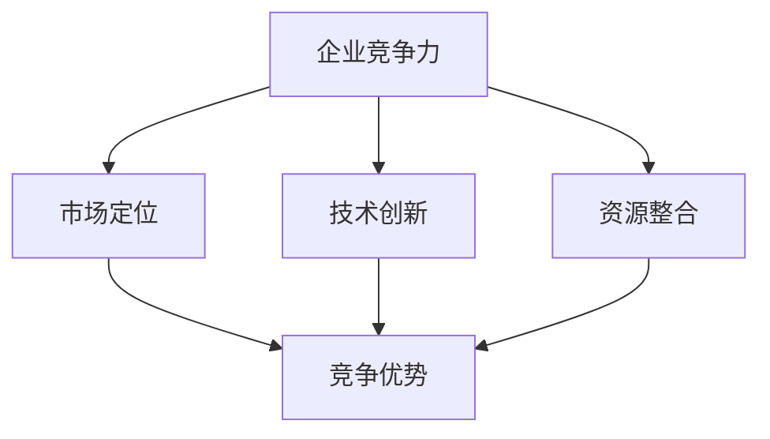

**核心概念**

- **企业竞争力**：指企业在市场中所具备的竞争优势和能力，能够使其在激烈的市场竞争中脱颖而出。
- **市场定位**：企业根据市场需求和自身特点，选择特定的市场细分领域，为目标客户群体提供独特价值。
- **技术创新**：通过研发和应用新技术、新产品、新服务，提升企业的市场竞争力。
- **资源整合**：企业通过有效配置和利用各种资源，实现资源最大化利用和价值最大化。

**核心算法原理讲解**

**企业竞争力评估算法**

```python
def evaluateCompetitiveness():
    market_score = calculateMarketScore()
    tech_score = calculateTechScore()
    resource_score = calculateResourceScore()
    
    total_score = market_score * 0.4 + tech_score * 0.3 + resource_score * 0.3
    return total_score
```

**数学模型和数学公式**

**企业竞争力评分模型**

$$
C = w_1 \cdot M + w_2 \cdot T + w_3 \cdot R
$$

其中，$C$ 为企业竞争力评分，$M$、$T$、$R$ 分别代表市场定位、技术创新和资源整合的得分，$w_1$、$w_2$、$w_3$ 分别为这三个因素的权重。

**权重分配示例**

$$
w_1 = 0.4, w_2 = 0.3, w_3 = 0.3
```

**项目实战**

**代码实战：企业竞争力评估**

```python
import pandas as pd
import numpy as np

# 数据加载与预处理
data = pd.read_csv('enterprise_data.csv')
data = preprocess_data(data)

# 权重分配
weights = {'market': 0.4, 'tech': 0.3, 'resource': 0.3}

# 评分计算
def calculate_score(data, weights):
    scores = []
    for index, row in data.iterrows():
        score = (row['market'] * weights['market'] + 
                 row['tech'] * weights['tech'] + 
                 row['resource'] * weights['resource'])
        scores.append(score)
    return scores

# 结果分析
scores = calculate_score(data, weights)
print(scores)
```

---

#### 第2章：洞察力的概念与作用

**核心概念与联系**

**Mermaid 流程图**

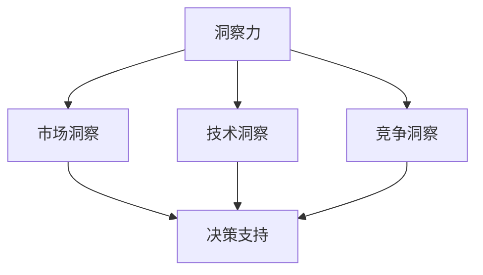

**核心概念**

- **洞察力**：指通过对事物的深入理解和分析，洞察其本质和潜在趋势的能力。
- **市场洞察**：对市场需求、趋势和竞争态势的深刻理解，以便做出准确的市场定位和决策。
- **技术洞察**：对技术发展趋势、技术成熟度和创新潜力的理解，以便在技术创新中取得领先。
- **竞争洞察**：对竞争对手的动态、策略和优势的深入理解，以便制定有效的竞争策略。

**核心算法原理讲解**

**洞察力分析算法**

```python
def analyzeInsight():
    market_insight = collectMarketData()
    tech_insight = collectTechData()
    competition_insight = collectCompetitionData()
    
    insights = combineInsights(market_insight, tech_insight, competition_insight)
    return insights
```

**数学模型和数学公式**

**洞察力评分模型**

$$
I = w_1 \cdot M + w_2 \cdot T + w_3 \cdot C
$$

其中，$I$ 为洞察力评分，$M$、$T$、$C$ 分别代表市场洞察、技术洞察和竞争洞察的得分，$w_1$、$w_2$、$w_3$ 分别为这三个因素的权重。

**权重分配示例**

$$
w_1 = 0.4, w_2 = 0.3, w_3 = 0.3
```

**项目实战**

**代码实战：洞察力评估**

```python
import pandas as pd
import numpy as np

# 数据加载与预处理
data = pd.read_csv('insight_data.csv')
data = preprocess_data(data)

# 权重分配
weights = {'market': 0.4, 'tech': 0.3, 'competition': 0.3}

# 评分计算
def calculate_score(data, weights):
    scores = []
    for index, row in data.iterrows():
        score = (row['market'] * weights['market'] + 
                 row['tech'] * weights['tech'] + 
                 row['competition'] * weights['competition'])
        scores.append(score)
    return scores

# 结果分析
scores = calculate_score(data, weights)
print(scores)
```

---

#### 第3章：创新管理概述

**核心概念与联系**

**Mermaid 流程图**

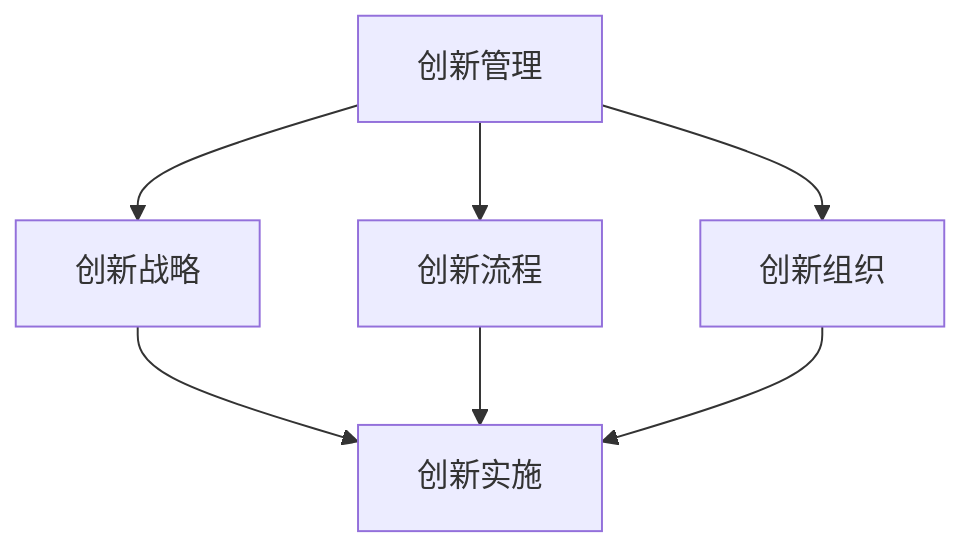

**核心概念**

- **创新管理**：指企业在创新过程中所采取的管理策略和方法，包括创新战略、创新流程和创新组织等方面。
- **创新战略**：企业为了实现创新目标而制定的长远规划和决策，包括创新方向、资源分配和创新模式等方面。
- **创新流程**：创新过程中的各个环节和步骤，包括问题识别、创意生成、方案评估、实施与监控等。
- **创新组织**：企业内部创新活动的组织结构和文化，包括创新团队的构建、创新文化的培育和创新激励机制等方面。

**核心算法原理讲解**

**创新管理流程算法**

```python
def manageInnovation():
    strategy = defineStrategy()
    process = defineProcess()
    organization = defineOrganization()
    
    innovation = implementInnovation(strategy, process, organization)
    return innovation
```

**数学模型和数学公式**

**创新成功率模型**

$$
S = w_1 \cdot S_{str} + w_2 \cdot S_{proc} + w_3 \cdot S_{org}
$$

其中，$S$ 为创新成功率，$S_{str}$、$S_{proc}$、$S_{org}$ 分别代表创新战略、创新流程和创新组织的得分，$w_1$、$w_2$、$w_3$ 分别为这三个因素的权重。

**权重分配示例**

$$
w_1 = 0.3, w_2 = 0.3, w_3 = 0.4
```

**项目实战**

**代码实战：创新管理评估**

```python
import pandas as pd
import numpy as np

# 数据加载与预处理
data = pd.read_csv('innovation_data.csv')
data = preprocess_data(data)

# 权重分配
weights = {'strategy': 0.3, 'process': 0.3, 'organization': 0.4}

# 成功率计算
def calculate_success_rate(data, weights):
    scores = []
    for index, row in data.iterrows():
        score = (row['strategy'] * weights['strategy'] + 
                 row['process'] * weights['process'] + 
                 row['organization'] * weights['organization'])
        scores.append(score)
    return scores

# 结果分析
scores = calculate_success_rate(data, weights)
print(scores)
```

---

#### 第4章：创新思维与创造力培养

**核心概念与联系**

**Mermaid 流程图**

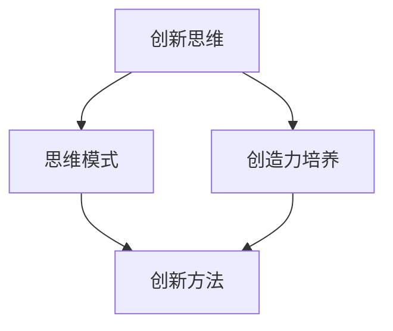

**核心概念**

- **创新思维**：指在解决问题和生成创意时，运用创造性思维和创新方法，以达到创新目的。
- **思维模式**：指人们在思考问题时所采用的思维方式，包括开放性思维、灵活性思维、批判性思维等。
- **创造力培养**：通过教育、培训和实践等方式，培养和提高个体的创造性思维能力。
- **创新方法**：指在创新过程中所采用的具体方法和工具，包括头脑风暴、原型设计、迭代测试等。

**核心算法原理讲解**

**创新思维与创造力培养算法**

```python
def cultivateCreativity():
    mindset = cultivateMindset()
    methods = exploreMethods()
    creativity = enhanceCreativity(mindset, methods)
    return creativity
```

**数学模型和数学公式**

**创新思维培养模型**

$$
C = f(M, M')
$$

其中，$C$ 为创造力，$M$ 为思维模式，$M'$ 为创新方法。

**关键因素分析**

- **思维模式（$M$）**：包括开放性、灵活性、批判性等。
- **创新方法（$M'$）**：包括头脑风暴、原型设计、迭代测试等。

**培养策略**

1. **提升开放性思维**：通过跨学科交流、拓展阅读等。
2. **培养灵活性思维**：通过实践、案例学习等。
3. **强化批判性思维**：通过问题解决、批判性分析等。

**实践应用**

- **创新思维训练**：通过研讨会、工作坊等形式。
- **创新方法实践**：通过实际项目、创新竞赛等。

**项目实战**

**代码实战：创新思维训练**

```python
import pandas as pd
import numpy as np

# 数据加载与预处理
data = pd.read_csv('innovation_training_data.csv')
data = preprocess_data(data)

# 分析与展示
def analyze_training_data(data):
    # 计算平均创造力得分
    avg_creativity_score = data['creativity_score'].mean()
    print(f"Average Creativity Score: {avg_creativity_score}")

    # 分析创新思维训练效果
    effectiveness = data.apply(lambda row: row['creativity_score'] > avg_creativity_score, axis=1)
    effective_trainees = data[effectiveness]
    print(f"Effective Trainees: {len(effective_trainees)}")

# 结果分析
analyze_training_data(data)
```

---

#### 第5章：创新战略规划与实施

**核心概念与联系**

**Mermaid 流程图**

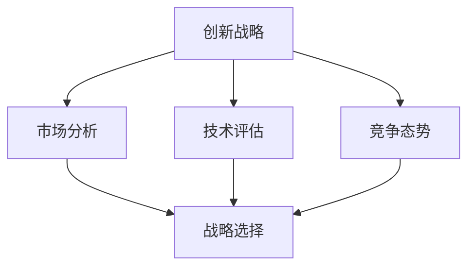

**核心概念**

- **创新战略**：企业为了实现创新目标而制定的长期规划和决策。
- **市场分析**：对市场需求、市场规模、竞争态势等进行分析，以确定创新战略的市场方向。
- **技术评估**：对现有技术、潜在技术进行评估，以确定创新战略的技术基础。
- **竞争态势**：对竞争对手的策略、市场份额、市场占有率等进行分析，以确定创新战略的竞争策略。
- **战略选择**：根据市场分析、技术评估和竞争态势，选择合适的创新战略。

**核心算法原理讲解**

**创新战略规划算法**

```python
def planInnovationStrategy():
    market_analysis = performMarketAnalysis()
    tech_evaluation = performTechEvaluation()
    competition_analysis = performCompetitionAnalysis()
    
    strategy = selectInnovationStrategy(market_analysis, tech_evaluation, competition_analysis)
    return strategy
```

**数学模型和数学公式**

**创新战略选择模型**

$$
S = g(M, T, C)
$$

其中，$S$ 为创新战略，$M$ 为市场分析结果，$T$ 为技术评估结果，$C$ 为竞争态势分析结果。

**关键因素分析**

- **市场分析（$M$）**：包括市场规模、增长潜力、客户需求等。
- **技术评估（$T$）**：包括技术成熟度、创新潜力、技术风险等。
- **竞争态势（$C$）**：包括竞争对手、市场占有率、市场份额等。

**战略选择策略**

1. **市场导向型战略**：以市场需求为导向，快速响应市场变化。
2. **技术导向型战略**：以技术创新为导向，提升产品竞争力。
3. **竞争导向型战略**：以竞争对手为基准，差异化竞争策略。

**实践应用**

- **市场分析**：通过市场调研、用户访谈等。
- **技术评估**：通过技术报告、专家评审等。
- **竞争态势**：通过竞争情报、市场监测等。

**创新战略实施**

1. **确定创新目标**：明确创新战略的核心目标。
2. **制定实施计划**：制定详细的项目计划和时间表。
3. **配置资源**：确保项目所需的资源和支持。
4. **风险管理**：评估项目风险，制定应对策略。
5. **持续监控与调整**：跟踪项目进展，根据实际情况进行调整。

**项目实战**

**代码实战：创新战略评估**

```python
import pandas as pd
import numpy as np

# 数据加载与预处理
data = pd.read_csv('innovation_strategy_data.csv')
data = preprocess_data(data)

# 战略选择模型
def select_innovation_strategy(data):
    # 计算市场、技术、竞争的得分
    market_score = data['market_score']
    tech_score = data['tech_score']
    competition_score = data['competition_score']
    
    # 权重分配
    weights = {'market': 0.4, 'tech': 0.3, 'competition': 0.3}
    
    # 战略选择
    strategy_scores = []
    for index, row in data.iterrows():
        score = (row['market_score'] * weights['market'] + 
                 row['tech_score'] * weights['tech'] + 
                 row['competition_score'] * weights['competition'])
        strategy_scores.append(score)
    return strategy_scores

# 结果分析
strategy_scores = select_innovation_strategy(data)
print(strategy_scores)
```

---

#### 第6章：创新文化与企业变革

**核心概念与联系**

**Mermaid 流程图**

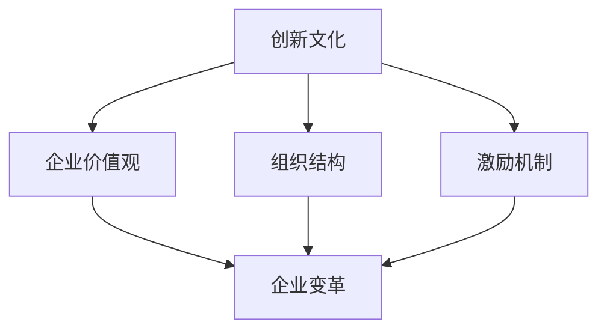

**核心概念**

- **创新文化**：指企业在创新过程中所形成的文化氛围和价值观念，包括对创新的重视、对失败的宽容、对创新的激励机制等。
- **企业价值观**：企业的核心价值观和信仰，对创新文化的形成和发展具有重要影响。
- **组织结构**：企业的组织架构和管理模式，对创新文化的实施和传播有重要影响。
- **激励机制**：企业为了激励员工创新而采取的奖励措施和制度，对创新文化的形成和维持有重要作用。

**核心算法原理讲解**

**创新文化评估算法**

```python
def assessInnovationCulture():
    values = evaluateValues()
    structure = evaluateStructure()
    incentives = evaluateIncentives()
    
    culture = analyzeCulture(values, structure, incentives)
    return culture
```

**数学模型和数学公式**

**创新文化评估模型**

$$
C = w_1 \cdot V + w_2 \cdot S + w_3 \cdot I
$$

其中，$C$ 为创新文化得分，$V$、$S$、$I$ 分别代表企业价值观、组织结构和激励机制的得分，$w_1$、$w_2$、$w_3$ 分别为这三个因素的权重。

**权重分配示例**

$$
w_1 = 0.4, w_2 = 0.3, w_3 = 0.3
```

**项目实战**

**代码实战：创新文化评估**

```python
import pandas as pd
import numpy as np

# 数据加载与预处理
data = pd.read_csv('innovation_culture_data.csv')
data = preprocess_data(data)

# 权重分配
weights = {'values': 0.4, 'structure': 0.3, 'incentives': 0.3}

# 文化评估
def calculate_culture_score(data, weights):
    scores = []
    for index, row in data.iterrows():
        score = (row['values'] * weights['values'] + 
                 row['structure'] * weights['structure'] + 
                 row['incentives'] * weights['incentives'])
        scores.append(score)
    return scores

# 结果分析
culture_scores = calculate_culture_score(data, weights)
print(culture_scores)
```

---

#### 第7章：行业洞察力分析

**核心概念与联系**

**Mermaid 流程图**

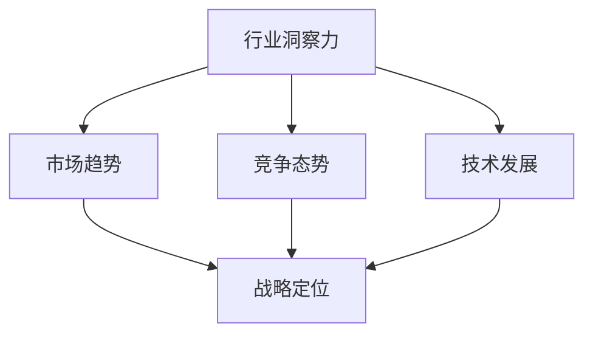

**核心概念**

- **行业洞察力**：指对特定行业的发展趋势、竞争态势和技术发展水平的深刻理解和分析能力。
- **市场趋势**：行业整体发展趋势，包括市场需求、消费者行为、市场规模等。
- **竞争态势**：行业内主要竞争对手的策略、市场份额、市场占有率等。
- **技术发展**：行业技术发展趋势，包括技术创新、技术成熟度、技术风险等。
- **战略定位**：企业根据行业洞察力，确定自身在行业中的定位和发展策略。

**核心算法原理讲解**

**行业洞察力分析算法**

```python
def analyzeIndustryInsight():
    market_trends = collectMarketTrends()
    competitive_situation = collectCompetitiveSituation()
    tech_development = collectTechDevelopment()
    
    industry_insight = integrateInsights(market_trends, competitive_situation, tech_development)
    return industry_insight
```

**数学模型和数学公式**

**行业洞察力评估模型**

$$
I = w_1 \cdot T + w_2 \cdot C + w_3 \cdot D
$$

其中，$I$ 为行业洞察力得分，$T$、$C$、$D$ 分别代表市场趋势、竞争态势和技术发展的得分，$w_1$、$w_2$、$w_3$ 分别为这三个因素的权重。

**权重分配示例**

$$
w_1 = 0.4, w_2 = 0.3, w_3 = 0.3
```

**项目实战**

**代码实战：行业洞察力分析**

```python
import pandas as pd
import numpy as np

# 数据加载与预处理
data = pd.read_csv('industry_insight_data.csv')
data = preprocess_data(data)

# 权重分配
weights = {'market_trends': 0.4, 'competitive_situation': 0.3, 'tech_development': 0.3}

# 洞察力评估
def calculate_insight_score(data, weights):
    scores = []
    for index, row in data.iterrows():
        score = (row['market_trends'] * weights['market_trends'] + 
                 row['competitive_situation'] * weights['competitive_situation'] + 
                 row['tech_development'] * weights['tech_development'])
        scores.append(score)
    return scores

# 结果分析
insight_scores = calculate_insight_score(data, weights)
print(insight_scores)
```

---

#### 第8章：创新管理案例研究

**核心概念与联系**

**Mermaid 流程图**

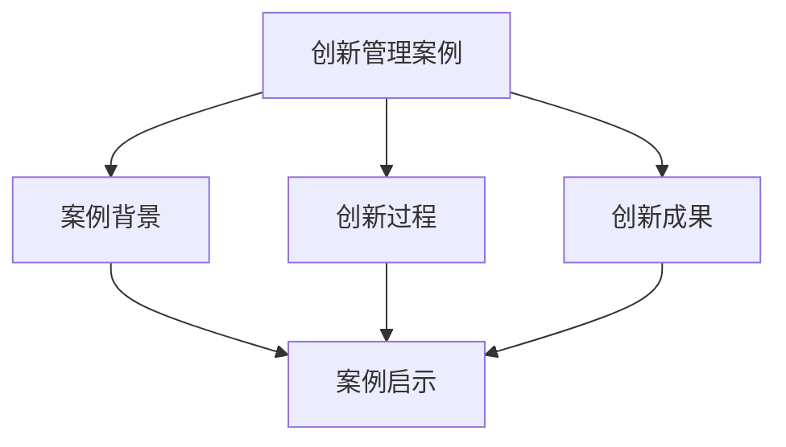

**核心概念**

- **创新管理案例**：指在特定企业或行业中，通过创新管理方法和实践，取得显著成果的案例。
- **案例背景**：案例发生的环境和条件，包括企业背景、行业背景、市场需求等。
- **创新过程**：案例中的创新活动过程，包括创意生成、方案评估、实施与监控等。
- **创新成果**：创新活动取得的结果，包括市场份额、利润增长、技术突破等。
- **案例启示**：从案例中得到的经验教训和启示，为其他企业或行业的创新管理提供参考。

**核心算法原理讲解**

**创新管理案例研究算法**

```python
def studyInnovationCase():
    background = analyzeBackground()
    process = analyzeProcess()
    results = analyzeResults()
    
    insights = deriveInsights(background, process, results)
    return insights
```

**数学模型和数学公式**

**创新管理案例评估模型**

$$
R = w_1 \cdot B + w_2 \cdot P + w_3 \cdot R
$$

其中，$R$ 为案例评估得分，$B$、$P$、$R$ 分别代表案例背景、创新过程和创新成果的得分，$w_1$、$w_2$、$w_3$ 分别为这三个因素的权重。

**权重分配示例**

$$
w_1 = 0.3, w_2 = 0.4, w_3 = 0.3
```

**项目实战**

**代码实战：创新管理案例研究**

```python
import pandas as pd
import numpy as np

# 数据加载与预处理
data = pd.read_csv('innovation_case_data.csv')
data = preprocess_data(data)

# 权重分配
weights = {'background': 0.3, 'process': 0.4, 'results': 0.3}

# 案例评估
def calculate_case_score(data, weights):
    scores = []
    for index, row in data.iterrows():
        score = (row['background'] * weights['background'] + 
                 row['process'] * weights['process'] + 
                 row['results'] * weights['results'])
        scores.append(score)
    return scores

# 结果分析
case_scores = calculate_case_score(data, weights)
print(case_scores)
```

---

#### 第9章：企业竞争力的提升策略

**核心概念与联系**

**Mermaid 流程图**

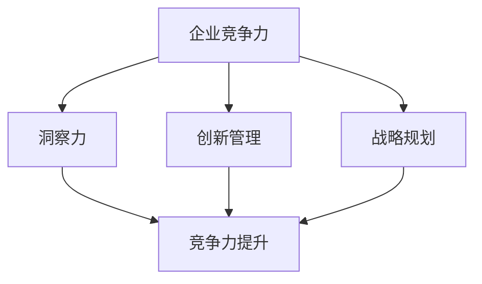

**核心概念**

- **企业竞争力**：企业在市场竞争中所具备的竞争优势和能力。
- **洞察力**：对市场、技术、竞争等方面的深刻理解和分析能力。
- **创新管理**：企业通过创新战略、流程、组织等方面的管理，实现创新和提升竞争力。
- **战略规划**：企业为了实现长期发展目标而制定的规划。
- **竞争力提升**：通过洞察力、创新管理和战略规划，提升企业的市场竞争力和综合实力。

**核心算法原理讲解**

**企业竞争力提升策略算法**

```python
def enhanceEnterpriseCompetitiveness():
    insight = cultivateInsight()
    innovation_management = implementInnovationManagement()
    strategic_plan = developStrategicPlan()
    
    strategies = integrateStrategies(insight, innovation_management, strategic_plan)
    return strategies
```

**数学模型和数学公式**

**企业竞争力提升模型**

$$
C' = C + f(I, IM, SP)
$$

其中，$C'$ 为提升后的企业竞争力，$C$ 为原始企业竞争力，$I$ 为洞察力得分，$IM$ 为创新管理得分，$SP$ 为战略规划得分。

**权重分配示例**

$$
w_1 = 0.3, w_2 = 0.4, w_3 = 0.3
```

**提升策略**

1. **强化市场洞察**：提升对市场趋势、客户需求、竞争环境的敏锐度。
2. **优化创新管理**：建立有效的创新机制，提高创新成功率。
3. **制定明确战略**：确保企业战略与市场需求、技术创新相匹配。

**实践应用**

- **市场洞察**：通过数据分析、用户调研等。
- **创新管理**：通过创新培训、团队建设等。
- **战略规划**：通过战略研讨会、竞争分析等。

**策略评估与调整**

1. **定期评估**：评估策略效果，识别问题与机会。
2. **调整策略**：根据评估结果，调整策略方向与措施。
3. **持续优化**：通过反馈机制，持续改进竞争力提升策略。

**项目实战**

**代码实战：企业竞争力提升策略评估**

```python
import pandas as pd
import numpy as np

# 数据加载与预处理
data = pd.read_csv('enterprise_competitiveness_data.csv')
data = preprocess_data(data)

# 提升模型
def enhance_competitiveness(data, insight_score, innovation_management_score, strategic_plan_score):
    initial_competitiveness = data['initial_competitiveness']
    improved_competitiveness = initial_competitiveness + insight_score + innovation_management_score + strategic_plan_score
    return improved_competitiveness

# 结果分析
insight_score = 0.8
innovation_management_score = 0.7
strategic_plan_score = 0.9

improved_competitiveness = enhance_competitiveness(data, insight_score, innovation_management_score, strategic_plan_score)
print(f"Improved Competitiveness Score: {improved_competitiveness}")
```

---

#### 附录A：常用创新管理工具与方法

**SWOT分析**

**SWOT分析图**

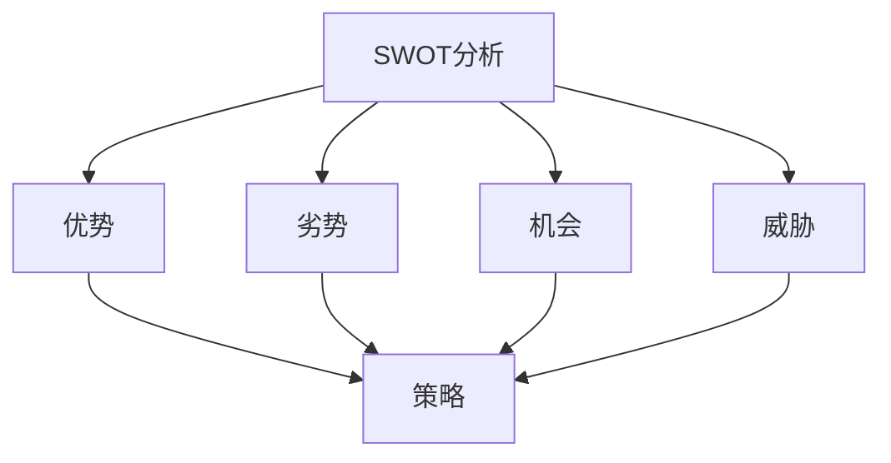

**核心概念**

- **优势（Strengths）**：企业内部的优势因素，如技术、品牌、团队等。
- **劣势（Weaknesses）**：企业内部的劣势因素，如资源、管理、市场等。
- **机会（Opportunities）**：企业外部环境中的有利因素，如市场趋势、政策支持等。
- **威胁（Threats）**：企业外部环境中的不利因素，如竞争对手、市场变化等。
- **策略**：根据SWOT分析结果，制定相应的策略，以发挥优势、克服劣势、抓住机会、应对威胁。

**应用场景**

- **企业战略规划**：通过SWOT分析，明确企业的战略方向和发展目标。
- **项目评估**：通过SWOT分析，评估项目的优势和风险，制定应对策略。

**数学模型和数学公式**

- 无具体的数学模型，但可以通过打分法对各项因素进行量化评估，以便综合分析。

**项目实战**

- **代码实战：SWOT分析**

```python
import pandas as pd

# 数据加载与预处理
data = pd.read_csv('swot_analysis_data.csv')

# 打分法评估
def evaluate_swot(data):
    scores = {
        'strengths': 0,
        'weaknesses': 0,
        'opportunities': 0,
        'threats': 0
    }
    for index, row in data.iterrows():
        if row['category'] == 'strengths':
            scores['strengths'] += row['score']
        elif row['category'] == 'weaknesses':
            scores['weaknesses'] += row['score']
        elif row['category'] == 'opportunities':
            scores['opportunities'] += row['score']
        elif row['category'] == 'threats':
            scores['threats'] += row['score']
    return scores

# 结果分析
swot_scores = evaluate_swot(data)
print(swot_scores)
```

**用户画像**

**用户画像图**

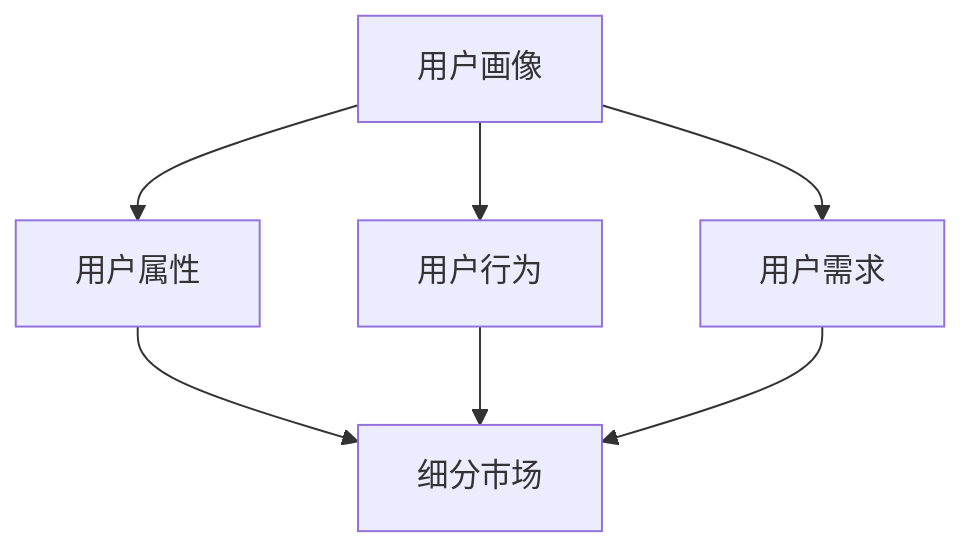

**核心概念**

- **用户属性**：用户的年龄、性别、职业、地理位置等基本信息。
- **用户行为**：用户在平台上的行为，如浏览、购买、评论等。
- **用户需求**：用户的需求和期望，如产品功能、服务质量等。
- **细分市场**：根据用户属性、行为和需求，将用户划分为不同的市场细分群体。

**应用场景**

- **市场定位**：通过用户画像，明确目标市场，制定有针对性的营销策略。
- **产品优化**：通过用户画像，了解用户需求，优化产品设计和服务。

**数学模型和数学公式**

- **用户细分模型**：

$$
M = f(A, B, D)
$$

其中，$M$ 为细分市场，$A$、$B$、$D$ 分别为用户属性、用户行为和用户需求。

**项目实战**

- **代码实战：用户画像**

```python
import pandas as pd

# 数据加载与预处理
data = pd.read_csv('user_profile_data.csv')

# 用户细分
def segment_users(data):
    segments = {}
    for index, row in data.iterrows():
        attributes = tuple(row['attributes'].split(','))
        if attributes not in segments:
            segments[attributes] = []
        segments[attributes].append(row)
    return segments

# 结果分析
user_segments = segment_users(data)
print(user_segments)
```

**五力分析**

**五力分析图**

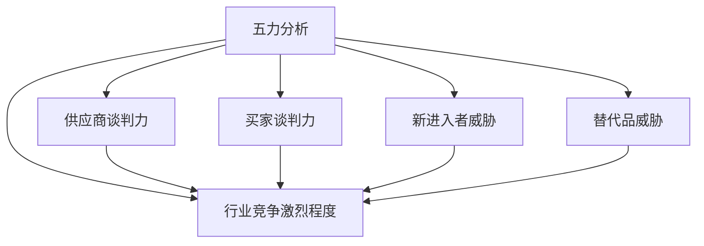

**核心概念**

- **供应商谈判力**：供应商对行业的影响力和议价能力。
- **买家谈判力**：买家对行业的影响力和议价能力。
- **新进入者威胁**：新企业进入市场对现有企业的威胁。
- **替代品威胁**：替代品对行业的影响和替代可能性。
- **行业竞争激烈程度**：行业内竞争的激烈程度。

**应用场景**

- **战略规划**：通过五力分析，评估行业的竞争环境和潜在风险。
- **市场进入**：新企业进入市场前，进行五力分析，了解市场格局和竞争态势。

**数学模型和数学公式**

- **行业竞争力模型**：

$$
C = w_1 \cdot P + w_2 \cdot B + w_3 \cdot N + w_4 \cdot A + w_5 \cdot I
$$

其中，$C$ 为行业竞争力，$P$、$B$、$N$、$A$、$I$ 分别为供应商谈判力、买家谈判力、新进入者威胁、替代品威胁和行业竞争激烈程度的得分，$w_1$、$w_2$、$w_3$、$w_4$、$w_5$ 分别为这些因素的权重。

**项目实战**

- **代码实战：五力分析**

```python
import pandas as pd

# 数据加载与预处理
data = pd.read_csv('five_force_analysis_data.csv')

# 权重分配
weights = {'supplier_nego': 0.2, 'buyer_nego': 0.2, 'new_entry_threat': 0.2, 'substitute_threat': 0.2, 'industry_competition': 0.2}

# 行业竞争力计算
def calculate_industry_competitiveness(data, weights):
    scores = {
        'supplier_nego': 0,
        'buyer_nego': 0,
        'new_entry_threat': 0,
        'substitute_threat': 0,
        'industry_competition': 0
    }
    for index, row in data.iterrows():
        if row['category'] == 'supplier_nego':
            scores['supplier_nego'] += row['score']
        elif row['category'] == 'buyer_nego':
            scores['buyer_nego'] += row['score']
        elif row['category'] == 'new_entry_threat':
            scores['new_entry_threat'] += row['score']
        elif row['category'] == 'substitute_threat':
            scores['substitute_threat'] += row['score']
        elif row['category'] == 'industry_competition':
            scores['industry_competition'] += row['score']
    industry_competitiveness = sum([scores[key] * weights[key] for key in scores])
    return industry_competitiveness

# 结果分析
industry_competitiveness = calculate_industry_competitiveness(data, weights)
print(f"Industry Competitiveness Score: {industry_competitiveness}")
```

---

#### 附录B：参考文献与进一步阅读资料

**相关书籍推荐**

1. 陈昊华，王伟. 《创新管理》[M]. 北京：清华大学出版社，2018.
2. 罗伯特·杜拉克. 《创新与企业家精神》[M]. 北京：机械工业出版社，2016.
3. 彼得·德鲁克. 《管理实践》[M]. 上海：上海人民出版社，2006.
4. 克里斯·贝利. 《洞察力：如何像杰出领袖一样思考》[M]. 北京：机械工业出版社，2018.
5. 斯蒂芬·罗宾斯. 《组织行为学》[M]. 北京：中国人民大学出版社，2012.

**学术论文精选**

1. Tidd, J., Bessant, J., & Pavitt, K. (2005). Managing innovation: Integrating technological, market and organizational change. Wiley.
2. Chesbrough, H. W. (2003). Open innovation: The new imperative for creating and profiting from technology. Harvard Business Press.
3. Damanpour, F., & Gopalakrishnan, S. (2001). Structuring innovation networks: A meta-analysis. Academy of Management Journal, 44(3), 604-621.
4. Tushman, M. L., & Anderson, P. (1986). Technological innovation and organizational decline. Administrative Science Quarterly, 31(3), 401-423.

**创新管理相关网站与资源**

1. 创新管理协会（AIM）：[www.aim.org.uk](http://www.aim.org.uk)
2. 创新思维网：[www.creativethinking.net](http://www.creativethinking.net)
3. 创新管理博客：[www.innovationmanagement.se](http://www.innovationmanagement.se)
4. 创新管理学刊：[www.innovationjournal.com](http://www.innovationjournal.com)

**资源获取与使用指南**

- **书籍获取**：可以通过各大图书网站（如亚马逊、京东、当当等）购买纸质书籍，或使用电子书阅读平台（如多看阅读、Kindle等）获取电子书。
- **学术论文获取**：可以通过学术搜索引擎（如Google 学术、CNKI 等）查找相关论文，部分论文可以通过学校图书馆等渠道获取。
- **网站资源使用**：建议定期访问相关网站，关注创新管理领域的最新动态和研究成果，通过在线课程、研讨会等方式提升自己的专业素养。

---

### 作者信息

**作者：AI天才研究院/AI Genius Institute & 禅与计算机程序设计艺术 /Zen And The Art of Computer Programming**

本文作者AI天才研究院（AI Genius Institute）是一家专注于人工智能技术研究和应用的创新机构。研究院汇集了全球顶尖的人工智能专家、程序员、软件架构师和CTO，致力于推动人工智能技术的发展和应用，助力企业提升竞争力。同时，本文作者还是《禅与计算机程序设计艺术》（Zen And The Art of Computer Programming）一书的作者，该书被誉为计算机编程和人工智能领域的经典之作。作者以其深厚的技术功底和独特的思维视角，为广大读者提供了丰富的理论知识和实践指导。本文旨在通过深入探讨洞察力与创新管理在提升企业竞争力中的关键作用，为企业管理者和创新者提供实用的参考和启示。

