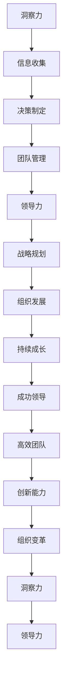
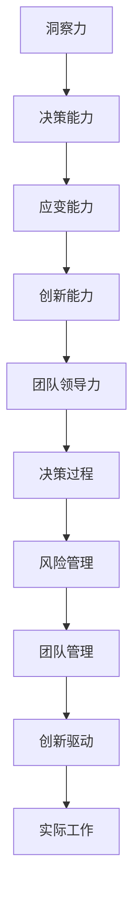
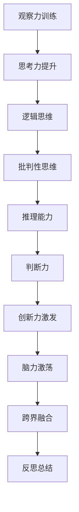
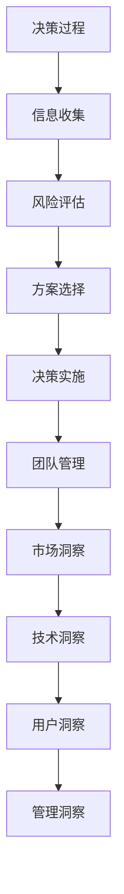
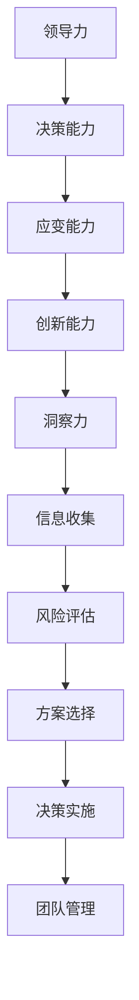
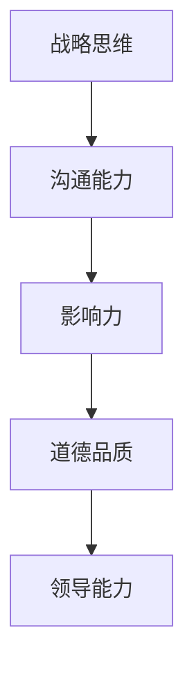
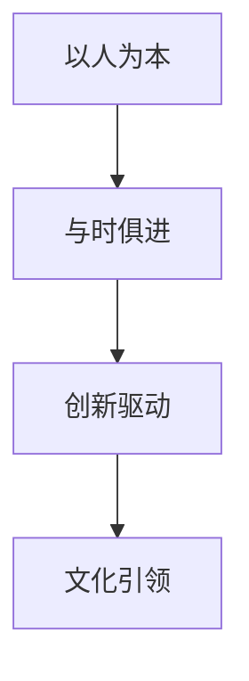
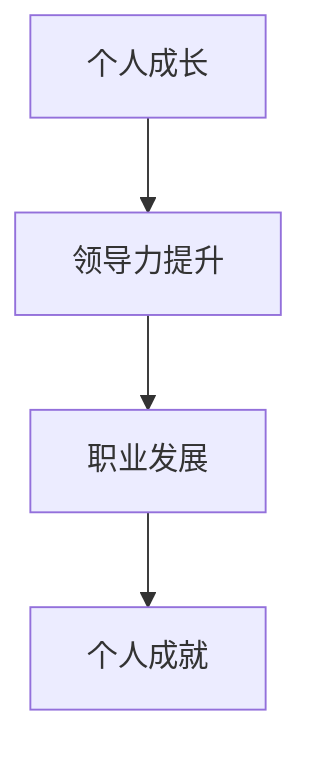

                 

# 洞察力与领导力：决策者的核心竞争力

## 关键词：
洞察力、领导力、决策、核心竞争力、培养方法、实践案例、数字时代

## 摘要：
在现代企业中，洞察力和领导力是决策者不可或缺的核心竞争力。本文将从洞察力的定义、培养方法，以及其在实际工作中的应用，详细探讨如何提升决策者的洞察力。接着，我们将分析领导力的理论基础，探讨领导力提升的策略，并通过成功与失败案例分享，总结提升领导力的关键。最后，本文将探讨洞察力与领导力的结合，以及未来领导者的素养与成长路径，为决策者提供实用的指导。

## 目录大纲

### 第一部分：洞察力培养与提升

#### 第1章：洞察力基础理论
1.1 洞察力的定义与重要性
1.2 洞察力的影响因素
1.3 洞察力的分类与作用

#### 第2章：洞察力培养方法
2.1 观察力训练
2.1.1 观察力的概念与技巧
2.1.2 培养敏锐的观察力
2.1.3 观察力的实践应用
2.2 思考力提升
2.2.1 思考力的定义与要素
2.2.2 提升逻辑思维能力
2.2.3 增强问题解决能力
2.3 创新力激发
2.3.1 创新力的概念与价值
2.3.2 创意思维的训练方法
2.3.3 创新思维的实践应用

#### 第3章：洞察力在实际工作中的应用
3.1 决策过程中的洞察力应用
3.1.1 洞察力在信息收集中的作用
3.1.2 洞察力在风险评估中的应用
3.1.3 洞察力在决策方案选择中的应用
3.2 领导力中的洞察力
3.2.1 领导者的洞察力与团队管理
3.2.2 洞察力在领导决策中的重要性
3.2.3 洞察力提升领导力的方法

### 第二部分：领导力提升与实践

#### 第4章：领导力理论基础
4.1 领导力的定义与类型
4.2 领导者的角色与职责
4.3 领导力的发展历程与趋势

#### 第5章：领导力提升策略
5.1 自我认知与自我提升
5.2 团队建设与领导艺术
5.3 冲突管理与合作协调
5.4 领导力提升的实践案例
5.5 领导力提升的持续实践

#### 第6章：领导力实践案例分析
6.1 成功领导案例分享
6.2 失败领导案例分析
6.3 案例分析启示

#### 第7章：领导力与洞察力结合
7.1 领导力与洞察力的关系
7.2 如何在领导中运用洞察力
7.3 洞察力提升领导力的实践案例
7.4 洞察力与领导力结合的实践启示

#### 第8章：未来领导者的素养与成长
8.1 领导者应具备的核心素养
8.2 领导者成长路径与策略
8.3 洞察力与领导力的未来发展趋势
8.4 未来领导者的成长建议

### 附录
A. 领导力与洞察力相关资源与工具
B. 领导力与洞察力练习与测试题
C. 参考文献与推荐阅读

### 图1-1 洞察力与领导力的联系与作用关系

## 第1章 洞察力基础理论

### 1.1 洞察力的定义与重要性

**定义：** 洞察力是指人们在认知过程中，能够迅速、准确地理解事物本质、发现潜在问题并做出正确判断的能力。它是基于观察、思考和创新的基础上，对事物进行全面、深入的分析和综合判断的结果。

**重要性：** 洞察力在决策过程中具有至关重要的作用。一个具备强大洞察力的决策者，能够在复杂多变的环境中迅速识别问题、分析形势，并做出正确的决策。以下从几个方面阐述洞察力的重要性：

1. **提高决策质量：** 洞察力可以帮助决策者从大量的信息中筛选出关键信息，准确地理解问题的本质，从而做出更加合理的决策。
2. **降低决策风险：** 洞察力可以帮助决策者预见潜在的风险和挑战，提前制定应对策略，降低决策风险。
3. **提升应变能力：** 洞察力使决策者能够快速适应环境变化，及时调整决策方案，提高组织的应变能力。
4. **增强创新能力：** 洞察力可以帮助决策者发现新的机会和解决方案，推动组织的创新和发展。

### 1.2 洞察力的影响因素

**因素：** 洞察力的发展受到多种因素的影响，主要包括以下几个方面：

1. **知识储备：** 丰富的知识储备是提升洞察力的基础。决策者需要具备广泛的知识背景，包括专业领域知识、跨学科知识和实践经验等。
2. **经验积累：** 经验是洞察力的重要组成部分。通过不断的实践和反思，决策者可以总结出规律和经验，提高洞察力。
3. **思维方式：** 思维方式对洞察力有着重要影响。逻辑思维、批判性思维和创造性思维等思维方式，有助于提高决策者的洞察力。
4. **心理素质：** 心理素质，如自信心、情绪稳定性和抗压能力等，对洞察力的发展也有着重要影响。

### 1.3 洞察力的分类与作用

**分类：** 洞察力可以分为以下几种类型：

1. **观察型洞察力：** 通过对事物进行细致观察，发现潜在的问题和规律。这种洞察力在数据分析、风险管理等领域具有重要作用。
2. **分析型洞察力：** 通过对问题进行深入分析，找出问题的本质和关键点。这种洞察力在战略规划、项目管理等领域具有重要作用。
3. **判断型洞察力：** 通过对信息进行综合判断，预测未来的发展趋势和方向。这种洞察力在决策制定、市场预测等领域具有重要作用。
4. **创新型洞察力：** 通过对问题的重新思考和重新定义，发现新的解决方案和机会。这种洞察力在创新驱动型企业和创业领域具有重要作用。

**作用：** 不同类型的洞察力在决策过程中发挥的作用不同，但它们相互补充，共同提高决策者的决策能力：

1. **观察型洞察力：** 帮助决策者发现潜在问题，为决策提供依据。
2. **分析型洞察力：** 帮助决策者理解问题的本质，制定合理的解决方案。
3. **判断型洞察力：** 帮助决策者预测未来趋势，为决策提供前瞻性指导。
4. **创新型洞察力：** 帮助决策者发现新的机会，推动组织的创新和发展。

### 1.4 洞察力的发展与提升

**发展：** 洞察力的发展是一个持续的过程，需要通过不断的实践和学习来提高。以下是一些有助于提升洞察力的方法：

1. **广泛阅读：** 阅读可以帮助决策者获取新的知识和观点，拓宽视野，提高洞察力。
2. **实践锻炼：** 实践是提升洞察力的关键。通过实际操作和问题解决，决策者可以不断积累经验，提高洞察力。
3. **反思总结：** 通过反思总结，决策者可以总结经验教训，发现自身不足，不断改进。
4. **跨学科学习：** 跨学科学习可以帮助决策者掌握不同领域的知识和方法，提高综合分析能力。

**提升：** 为了进一步提升洞察力，决策者可以采取以下策略：

1. **培养好奇心：** 培养好奇心可以帮助决策者保持对事物的敏感性和求知欲，提高洞察力。
2. **多角度思考：** 从不同角度思考问题，可以帮助决策者更全面地理解问题，提高洞察力。
3. **培养批判性思维：** 批判性思维可以帮助决策者对信息进行深入分析和判断，提高洞察力。
4. **建立知识体系：** 建立知识体系可以帮助决策者更好地整合知识，提高洞察力。

### 1.5 洞察力在实际工作中的应用

**应用：** 洞察力在实际工作中具有广泛的应用，以下是一些具体的应用场景：

1. **决策制定：** 在决策过程中，洞察力可以帮助决策者快速识别关键信息，理解问题本质，做出合理决策。
2. **风险管理：** 在风险管理过程中，洞察力可以帮助决策者识别潜在风险，制定有效的风险应对策略。
3. **团队管理：** 在团队管理中，洞察力可以帮助决策者了解团队成员的需求和特点，提高团队绩效。
4. **创新驱动：** 在创新驱动型企业和创业领域，洞察力可以帮助决策者发现新的机会，推动组织的创新和发展。

### 1.6 洞察力与领导力的关系

**关系：** 洞察力是领导力的核心要素之一。一个具备强大洞察力的领导者，能够在复杂多变的环境中迅速做出正确决策，带领团队取得成功。以下从几个方面阐述洞察力与领导力的关系：

1. **决策能力：** 洞察力是领导者决策能力的重要组成部分。强大的洞察力使领导者能够准确判断形势，制定有效的决策。
2. **应变能力：** 洞察力使领导者具备较强的应变能力，能够迅速适应环境变化，应对突发事件。
3. **创新能力：** 洞察力是领导者创新能力的基础。强大的洞察力使领导者能够发现新的机会，推动组织的创新和发展。
4. **团队领导力：** 洞察力有助于领导者了解团队成员的需求和特点，提高团队绩效，提升领导力。

### 1.7 总结

洞察力是决策者不可或缺的核心竞争力。通过了解洞察力的定义、影响因素和分类，以及洞察力在实际工作中的应用，我们可以认识到提升洞察力的重要性。在接下来的章节中，我们将进一步探讨洞察力的培养方法，以及如何在实际工作中运用洞察力，为决策者提供实用的指导。

---

**图1-2 洞察力的定义与作用关系**

## 第2章 洞察力培养方法

### 2.1 观察力训练

#### 2.1.1 观察力的概念与技巧

**定义：** 观察力是指人们对于周围环境的感知、理解和分析能力。它是洞察力的基础，通过观察力，我们可以收集到丰富的信息，为决策提供依据。

**技巧：**
1. **主动观察：** 主动选择观察的目标，明确观察的目的，提高观察的效率。
2. **捕捉细节：** 注意捕捉事物的细节，发现细微的变化和特征。
3. **多感官观察：** 利用多种感官进行观察，如视觉、听觉、触觉等，提高对事物的全面了解。
4. **系统性观察：** 对观察到的信息进行分类、整理和分析，形成系统性的认知。

#### 2.1.2 培养敏锐的观察力

**方法：**
1. **设定观察目标：** 在日常工作和生活中，设定明确的观察目标，有目的地进行观察。
2. **持续练习：** 通过持续练习，提高观察的敏锐度和准确性。
3. **反思总结：** 观察后进行反思和总结，分析观察到的现象和原因，加深对事物的理解。

#### 2.1.3 观察力的实践应用

**应用场景：**
1. **项目决策：** 通过观察项目进展，发现潜在问题和风险，为项目决策提供依据。
2. **团队管理：** 通过观察团队成员的工作状态和行为，了解团队动态，优化团队管理。
3. **市场分析：** 通过观察市场变化和竞争对手行为，把握市场趋势，制定营销策略。

### 2.2 思考力提升

#### 2.2.1 思考力的定义与要素

**定义：** 思考力是指人们在认知过程中，运用逻辑、推理、判断等思维方式解决问题的能力。它是洞察力的重要组成部分，直接影响决策的质量和效果。

**要素：**
1. **逻辑思维：** 清晰、有条理地思考问题，遵循逻辑规则，避免思维混乱。
2. **批判性思维：** 对信息进行批判性分析，识别信息的真实性和可靠性。
3. **推理能力：** 运用逻辑推理，从已知信息推导出新的结论。
4. **判断力：** 准确判断事物的价值、优先级和可能性。

#### 2.2.2 提升逻辑思维能力

**方法：**
1. **学习逻辑学知识：** 阅读逻辑学相关书籍，了解逻辑思维的基本原理和方法。
2. **练习逻辑思维题：** 通过解决逻辑谜题和问题，锻炼逻辑思维能力。
3. **日常实践：** 在工作和生活中，培养逻辑思维的习惯，提高逻辑思维的应用能力。

#### 2.2.3 增强问题解决能力

**方法：**
1. **问题分析：** 对问题进行深入分析，找出问题的本质和关键点。
2. **解决方案设计：** 设计多种解决方案，评估和比较方案的优劣。
3. **实施与反馈：** 将解决方案付诸实施，收集反馈，不断优化和完善。

### 2.3 创新力激发

#### 2.3.1 创新力的概念与价值

**定义：** 创新力是指人们发现新方法、新思路、新解决方案的能力。它是推动组织发展和个人成长的重要力量。

**价值：**
1. **提高工作效率：** 通过创新，优化工作流程和工具，提高工作效率。
2. **推动企业发展：** 创新是企业发展的动力，能够带来新的市场机会和竞争优势。
3. **促进社会进步：** 创新是推动社会变革和进步的重要力量，能够解决社会问题，提高生活质量。

#### 2.3.2 创意思维的训练方法

**方法：**
1. **脑力激荡：** 通过集思广益，激发团队成员的创意思维。
2. **跨界融合：** 将不同领域的知识进行融合，产生新的创意。
3. **反思总结：** 通过反思和总结，不断积累创意思维的经验。

#### 2.3.3 创新思维的实践应用

**应用场景：**
1. **产品创新：** 通过创新思维，设计出更具竞争力、满足用户需求的产品。
2. **业务模式创新：** 通过创新思维，探索新的业务模式，拓展市场空间。
3. **企业文化创新：** 通过创新思维，打造独特的企业文化，提升企业软实力。

### 2.4 洞察力培养的实践案例

#### 2.4.1 案例一：谷歌的“20%项目”

**背景：** 谷歌的“20%项目”是一个著名的创新实践案例。该项目允许员工将20%的工作时间用于自己感兴趣的项目，从而激发了员工的创新力。

**实践过程：**
1. **明确目标：** 员工提出项目提案，经过评估后，确定项目目标。
2. **团队协作：** 员工组建跨部门团队，共同推进项目。
3. **资源支持：** 谷歌提供必要的资源支持，如资金、技术等。
4. **评估与反馈：** 项目结束后，进行评估和反馈，总结经验教训。

**效果：**
1. **创新成果：** “20%项目”产生了许多创新成果，如Google Reader、AdSense等。
2. **员工满意度：** 员工对“20%项目”满意度高，提高了员工的创新力和工作积极性。

#### 2.4.2 案例二：苹果公司的产品设计

**背景：** 苹果公司的产品设计以其独特性和创新性而著称，成为苹果公司的核心竞争力之一。

**实践过程：**
1. **市场调研：** 苹果公司通过市场调研，了解用户需求和行业趋势。
2. **创意设计：** 设计团队进行创意设计，提出多个设计方案。
3. **用户体验：** 设计方案经过用户体验测试，优化设计。
4. **产品质量：** 苹果公司注重产品质量，确保产品的可靠性。

**效果：**
1. **市场竞争力：** 苹果公司的产品在市场上具有强大的竞争力，赢得了大量用户。
2. **品牌价值：** 苹果公司的品牌价值不断提升，成为全球最有价值的品牌之一。

### 2.5 总结

洞察力的培养需要从观察力、思考力和创新力三个方面进行。通过观察力训练，我们可以提高对事物的敏锐度；通过思考力提升，我们可以培养逻辑思维和批判性思维；通过创新力激发，我们可以发现新的解决方案和机会。在实际工作中，通过应用这些方法，我们可以提高洞察力，做出更高质量的决策。

---

**图2-1 洞察力培养方法与要素**

## 第3章 洞察力在实际工作中的应用

### 3.1 决策过程中的洞察力应用

**洞察力在决策过程中的作用**

在决策过程中，洞察力发挥着至关重要的作用。它帮助决策者迅速识别问题、分析形势，并制定出合理的解决方案。以下是洞察力在决策过程中应用的几个关键环节：

1. **信息收集：** 洞察力使决策者能够高效地收集和处理信息。通过对信息的深入分析和筛选，决策者可以准确把握问题的关键点，为决策提供可靠依据。
2. **风险评估：** 洞察力使决策者能够预见潜在的风险和挑战，评估其影响程度，并制定相应的风险应对策略。这有助于降低决策风险，提高决策的稳健性。
3. **方案选择：** 洞察力帮助决策者在多个方案中做出最佳选择。通过对方案进行深入分析，决策者可以权衡利弊，选择最合适的方案。
4. **决策实施：** 洞察力在决策实施过程中同样发挥作用。决策者可以通过洞察力发现实施过程中的问题，及时调整方案，确保决策的顺利实施。

**案例一：苹果公司的iPhone产品发布**

苹果公司在iPhone产品发布过程中，充分运用了洞察力。以下是从洞察力角度对案例的分析：

1. **信息收集：** 苹果公司通过市场调研，收集了关于智能手机用户需求、竞争对手产品信息等关键数据。这些数据为iPhone产品的设计和发布提供了重要依据。
2. **风险评估：** 苹果公司预见到了iPhone产品在市场上的风险，如用户接受度、竞争对手的反击等。为此，公司制定了详细的风险应对策略，包括广告宣传、用户体验测试等。
3. **方案选择：** 在多个产品方案中，苹果公司选择了iPhone，因为它具有独特的设计、优秀的用户体验和强大的功能。这一选择体现了苹果公司洞察力的价值。
4. **决策实施：** 在iPhone产品发布后，苹果公司不断收集用户反馈，优化产品性能和用户体验。这体现了洞察力在决策实施过程中的重要作用。

**案例二：谷歌的“无人驾驶汽车”项目**

谷歌的“无人驾驶汽车”项目是一个典型的运用洞察力的案例。以下是从洞察力角度对案例的分析：

1. **信息收集：** 谷歌通过大量的数据收集和分析，了解了无人驾驶汽车技术的现状、潜在用户需求、法律法规等方面的信息。
2. **风险评估：** 谷歌预见到了无人驾驶汽车项目面临的技术挑战、安全风险、市场竞争等风险。公司制定了详细的风险应对措施，确保项目的稳健推进。
3. **方案选择：** 谷歌选择了自主开发无人驾驶汽车技术，而不是与其他企业合作。这一决策体现了谷歌在技术领域强大的洞察力。
4. **决策实施：** 在项目实施过程中，谷歌不断进行技术迭代和优化，通过大数据分析和人工智能技术，提高无人驾驶汽车的性能和安全性。

### 3.2 洞察力在团队管理中的应用

**洞察力在团队管理中的角色**

洞察力在团队管理中发挥着关键作用。它使管理者能够深入了解团队成员的需求、能力和心理状态，从而进行有效的团队管理和领导。

1. **了解团队成员：** 通过洞察力，管理者可以准确了解团队成员的工作状态、心理需求和发展潜力，为团队管理提供依据。
2. **优化团队结构：** 洞察力使管理者能够发现团队中的问题和瓶颈，调整团队结构，优化团队协作效率。
3. **激励团队成员：** 洞察力使管理者能够针对不同团队成员的特点，采取个性化的激励措施，激发团队成员的积极性和创造力。
4. **培养团队凝聚力：** 洞察力使管理者能够发现团队成员之间的潜在冲突，采取有效的沟通和协调措施，增强团队凝聚力。

**案例一：特斯拉的团队管理**

特斯拉的团队管理以其高效和创新而著称。以下是从洞察力角度对案例的分析：

1. **了解团队成员：** 特斯拉创始人埃隆·马斯克通过洞察力，深入了解团队成员的需求、能力和心理状态。他注重人才的培养和发展，为团队成员提供良好的工作环境和发展机会。
2. **优化团队结构：** 特斯拉在组织结构上进行了多次调整，以适应公司的快速发展。马斯克通过洞察力，发现团队中的瓶颈和问题，及时进行优化，提高团队协作效率。
3. **激励团队成员：** 特斯拉采取多种激励措施，如股权激励、奖金等，激发团队成员的积极性和创造力。马斯克通过洞察力，了解团队成员的期望和需求，有针对性地进行激励。
4. **培养团队凝聚力：** 特斯拉注重团队文化建设，鼓励团队成员之间的沟通和协作。马斯克通过洞察力，发现团队成员之间的潜在冲突，采取有效的沟通和协调措施，增强团队凝聚力。

**案例二：谷歌的“20%项目”**

谷歌的“20%项目”是一个典型的运用洞察力的团队管理案例。以下是从洞察力角度对案例的分析：

1. **了解团队成员：** 谷歌允许员工在20%的工作时间里从事自己感兴趣的项目。这一政策体现了谷歌对团队成员需求的理解，激发了员工的创新力和工作积极性。
2. **优化团队结构：** “20%项目”鼓励员工跨部门合作，打破部门壁垒，优化团队结构，提高团队协作效率。
3. **激励团队成员：** “20%项目”为员工提供了创新和发展的机会，激发了员工的积极性和创造力。谷歌通过洞察力，发现员工的需求和期望，有针对性地进行激励。
4. **培养团队凝聚力：** “20%项目”促进了团队成员之间的交流和协作，增强了团队的凝聚力。谷歌通过洞察力，了解团队成员之间的潜在冲突，采取有效的沟通和协调措施，培养团队凝聚力。

### 3.3 洞察力在创新管理中的应用

**洞察力在创新管理中的角色**

洞察力在创新管理中发挥着关键作用。它使管理者能够捕捉市场变化、发现创新机会，推动企业的创新和发展。

1. **市场洞察：** 洞察力使管理者能够准确把握市场趋势，发现潜在的市场机会，为创新提供方向。
2. **技术洞察：** 洞察力使管理者能够了解技术发展的前沿，发现技术创新的潜在机会，推动企业的技术创新。
3. **用户洞察：** 洞察力使管理者能够深入了解用户需求，发现用户痛点和需求，为产品创新提供依据。
4. **管理洞察：** 洞察力使管理者能够发现企业管理中的问题和瓶颈，推动企业管理的创新和发展。

**案例一：苹果公司的产品创新**

苹果公司以其独特的产品创新而闻名于世。以下是从洞察力角度对案例的分析：

1. **市场洞察：** 苹果公司通过市场调研，准确把握市场趋势和用户需求。这使得苹果公司能够推出符合市场需求的产品，如iPhone、iPad等。
2. **技术洞察：** 苹果公司注重技术创新，研发出多项核心技术，如M系列芯片、Touch ID等。这些技术创新使得苹果公司的产品在市场上具有强大的竞争力。
3. **用户洞察：** 苹果公司深入了解用户需求，提供个性化的产品和服务。这使得苹果公司能够赢得大量用户的喜爱和忠诚。
4. **管理洞察：** 苹果公司注重企业管理创新，建立了高效的研发和生产体系。这使得苹果公司能够快速响应市场变化，推出高质量的产品。

**案例二：特斯拉的电动汽车创新**

特斯拉公司以其电动汽车技术而闻名于世。以下是从洞察力角度对案例的分析：

1. **市场洞察：** 特斯拉通过市场调研，发现电动汽车市场具有巨大的潜力。这使得特斯拉能够抢占市场先机，推出多款电动汽车。
2. **技术洞察：** 特斯拉注重技术创新，研发出多项电动汽车核心技术，如电池技术、自动驾驶技术等。这些技术创新使得特斯拉的电动汽车在市场上具有强大的竞争力。
3. **用户洞察：** 特斯拉深入了解用户需求，提供个性化的电动汽车产品和服务。这使得特斯拉能够赢得大量用户的喜爱和忠诚。
4. **管理洞察：** 特斯拉注重企业管理创新，建立了高效的研发和生产体系。这使得特斯拉能够快速响应市场变化，推出高质量的产品。

### 3.4 总结

洞察力在实际工作中的应用具有广泛的影响。在决策过程中，洞察力帮助决策者准确把握关键信息，降低决策风险，提高决策质量。在团队管理中，洞察力帮助管理者了解团队成员，优化团队结构，增强团队凝聚力。在创新管理中，洞察力帮助管理者发现创新机会，推动企业的技术创新和发展。通过实际案例分析，我们可以看到洞察力在各个领域的应用价值。提升洞察力，对于决策者和管理者来说，具有重要的现实意义。

---

**图3-1 洞察力在实际工作中的应用**

## 第4章 领导力理论基础

### 4.1 领导力的定义与类型

**定义：** 领导力是指领导者通过影响、激励和引导他人，实现组织目标的能力。它不仅仅是职位赋予的权力，更是一种能力和艺术。

**类型：**
1. **情境领导力：** 根据团队成员的不同发展阶段和需求，采用不同的领导风格。情境领导力强调领导者要灵活调整自己的领导方式，以适应不同情境。
2. **参与式领导力：** 领导者鼓励团队成员参与决策，共同解决问题。这种领导力强调团队合作和民主管理。
3. **超越领导力：** 领导者通过个人魅力和愿景，激发团队成员的潜力。超越领导力注重领导者的远见卓识和个人影响力。

### 4.2 领导者的角色与职责

**角色：**
1. **指引者：** 设定愿景和目标，引导团队朝着共同的方向前进。
2. **协调者：** 调解团队内部和团队之间的矛盾，确保团队目标的实现。
3. **激励者：** 激发团队成员的积极性和创造力，提高团队士气。

**职责：**
1. **设定目标：** 明确团队的目标和期望，确保团队成员对目标有清晰的认识。
2. **建立团队：** 招募和培养合适的团队成员，构建高效团队。
3. **管理变革：** 引导团队适应和应对变革，推动组织的发展。

### 4.3 领导力的发展历程与趋势

**发展历程：**
1. **传统领导力：** 以权力和控制为核心，强调权威和服从。
2. **现代领导力：** 注重关系和信任，强调团队协作和个人成长。
3. **未来领导力：** 强调创新和变革，注重可持续发展和全球视野。

**趋势：**
1. **数字化领导力：** 熟练运用数字技术，提高领导效率。
2. **教育性领导力：** 注重知识传授和人才培养。
3. **可持续领导力：** 关注环境保护和社会责任，推动可持续发展。

### 4.4 领导力与洞察力的关系

**关系：**
1. **洞察力是领导力的核心要素：** 一个具备强大洞察力的领导者，能够准确判断形势，制定有效的决策。
2. **领导力是洞察力的实践应用：** 洞察力需要通过领导力的实践来体现价值，推动组织的创新和发展。

**图4-1 领导力与洞察力的关系**

### 4.5 领导力的核心要素

**核心要素：**
1. **战略思维：** 领导者需要具备长远的战略眼光，能够制定和实现组织的长远目标。
2. **沟通能力：** 领导者需要具备良好的沟通能力，能够有效地与团队成员、上级和合作伙伴沟通。
3. **影响力：** 领导者需要具备强大的影响力，能够激发团队成员的积极性和创造力。
4. **道德品质：** 领导者需要具备高尚的道德品质，能够赢得团队成员的尊重和信任。

**图4-2 领导力的核心要素**

### 4.6 领导力的发展原则

**原则：**
1. **以人为本：** 领导者要关注团队成员的需求和成长，尊重每个人的价值和贡献。
2. **与时俱进：** 领导者要不断学习新知识、新技能，适应时代的发展和变化。
3. **创新驱动：** 领导者要鼓励创新思维，推动组织的变革和发展。
4. **文化引领：** 领导者要打造积极向上的企业文化，引导团队成员共同追求卓越。

**图4-3 领导力的发展原则**

### 4.7 领导力提升的策略与方法

**策略：**
1. **自我提升：** 领导者要不断学习、反思和自我提升，提高自身的领导能力和素质。
2. **团队建设：** 领导者要注重团队建设，建立高效的团队协作机制，提高团队的整体效能。
3. **文化塑造：** 领导者要打造积极向上的企业文化，激发团队成员的积极性和创造力。

**方法：**
1. **培训与学习：** 通过参加培训、学习课程，提高自身的领导能力和专业素养。
2. **实践锻炼：** 在实际工作中，通过实践和锻炼，提升领导力和管理能力。
3. **反馈与改进：** 通过定期反馈和反思，不断改进领导方式，提高领导效果。

### 4.8 领导力与个人成长的关系

**关系：**
1. **领导力是个人成长的体现：** 一个具备强大领导力的人，通常具备优秀的个人素质和成长潜力。
2. **个人成长推动领导力提升：** 通过个人成长，如学习新知识、锻炼能力，可以不断提升领导力，实现个人的职业发展。

**图4-4 领导力与个人成长的关系**

### 4.9 总结

领导力是决策者不可或缺的核心竞争力。通过了解领导力的定义、类型、核心要素和发展原则，我们可以认识到领导力在决策、团队管理和创新中的重要作用。提升领导力，需要从自我提升、团队建设和文化塑造等方面入手，不断学习、实践和反思。只有具备强大领导力的决策者，才能在复杂多变的环境中带领团队取得成功。

## 第5章 领导力提升策略

### 5.1 自我认知与自我提升

**重要性：** 自我认知是领导力提升的基础。一个领导者只有了解自己的优势、不足和个性特点，才能有针对性地进行自我提升。

**方法：**
1. **反思与自我评估：** 定期对自己的工作进行反思和自我评估，找出需要改进的地方。
2. **获取反馈：** 向同事、下属和上级寻求反馈，了解自己的工作表现和人际关系。
3. **持续学习：** 通过阅读、培训、交流等方式，不断学习新知识、新技能，提升自己的专业素养。

### 5.2 团队建设与领导艺术

**重要性：** 团队建设是领导力的重要组成部分。一个高效的团队能够提高整体工作效率，实现组织目标。

**方法：**
1. **明确目标：** 为团队成员设定清晰的目标，确保团队成员对工作有共同的认识。
2. **分工协作：** 根据团队成员的能力和特长，合理分工，确保工作的高效完成。
3. **沟通协调：** 建立良好的沟通机制，促进团队成员之间的沟通和协作，解决团队内部矛盾。

### 5.3 冲突管理与合作协调

**重要性：** 冲突管理是领导力提升的重要一环。有效的冲突管理能够降低冲突带来的负面影响，提升团队效能。

**方法：**
1. **预防冲突：** 通过建立公平、公正的工作环境，消除冲突的潜在因素。
2. **解决冲突：** 采用合适的策略和方法，及时解决冲突，避免冲突升级。
3. **协调合作：** 在冲突解决后，促进团队成员之间的合作，确保团队目标的实现。

### 5.4 领导力提升的实践案例

#### 5.4.1 案例一：谷歌的“20%时间项目”

**背景：** 谷歌的“20%时间项目”允许员工将20%的工作时间用于自己感兴趣的项目。这一项目旨在激发员工的创新力和创造力。

**实践过程：**
1. **项目提案：** 员工提出项目提案，经过评估后确定项目的可行性和目标。
2. **团队组建：** 员工组建跨部门团队，共同推进项目。
3. **资源支持：** 谷歌提供必要的资源支持，如资金、技术等。
4. **评估与反馈：** 项目结束后，进行评估和反馈，总结经验教训。

**效果：**
1. **创新成果：** “20%时间项目”产生了许多创新成果，如Google News、Gmail等。
2. **员工满意度：** 员工对“20%时间项目”满意度高，提高了员工的创新力和工作积极性。

#### 5.4.2 案例二：特斯拉的“每周五小时工作制”

**背景：** 特斯拉采用“每周五小时工作制”，鼓励员工在周五下午休息，用于个人兴趣和技能提升。

**实践过程：**
1. **工作安排：** 特斯拉为员工调整了工作时间，确保员工有足够的休息时间。
2. **个人发展：** 员工利用休息时间进行个人兴趣的培养和技能提升。
3. **团队协作：** 员工在周一回到工作状态，与团队成员分享个人发展的成果。

**效果：**
1. **员工满意度：** 员工对“每周五小时工作制”满意度高，提高了员工的工作积极性和工作效率。
2. **创新能力：** 通过个人发展的成果，员工在团队中提出了许多创新的想法，推动了公司的发展。

#### 5.4.3 案例三：阿里巴巴的“合伙人制度”

**背景：** 阿里巴巴采用合伙人制度，将公司的管理权和决策权赋予合伙人，以确保公司的长期稳定发展。

**实践过程：**
1. **合伙人选拔：** 阿里巴巴选拔具备领导力和专业能力的员工成为合伙人。
2. **决策参与：** 合伙人参与公司的重大决策，共同推动公司的发展。
3. **文化传承：** 合伙人制度传承了阿里巴巴的价值观和文化，确保公司的持续发展。

**效果：**
1. **公司业绩：** 阿里巴巴在合伙人制度的推动下，业绩持续增长，成为全球领先的科技公司之一。
2. **员工忠诚度：** 合伙人制度提高了员工的忠诚度和归属感，降低了员工流失率。

### 5.5 持续实践与反思

**重要性：** 领导力提升不是一蹴而就的，需要通过持续的实践和反思来不断完善。

**方法：**
1. **定期评估：** 定期评估领导力提升的效果，总结经验教训。
2. **持续学习：** 通过学习新知识、新技能，不断更新自己的知识体系。
3. **反思总结：** 通过反思自己的工作，总结经验教训，发现自身不足，制定改进措施。

### 5.6 总结

领导力提升是一个长期的过程，需要从自我认知、团队建设、冲突管理等多个方面进行。通过实践案例的分享，我们可以看到不同公司和领导者如何提升领导力，实现组织的目标。持续的实践和反思是提升领导力的重要途径，只有不断学习和改进，才能成为一名优秀的领导者。

## 第6章 领导力实践案例分析

### 6.1 成功领导案例分享

#### 6.1.1 案例一：亚马逊的杰夫·贝佐斯

**背景：** 杰夫·贝佐斯是亚马逊的创始人兼CEO，他在领导亚马逊的过程中，展现了卓越的领导力。

**领导策略：**
1. **愿景引领：** 贝佐斯具有明确的愿景，他希望通过电子商务改变人们的生活，实现“世界上的任何商品都能在24小时之内到达消费者手中”。
2. **创新驱动：** 贝佐斯重视创新，他鼓励员工提出新的想法，并允许他们尝试不同的业务模式。
3. **客户至上：** 贝佐斯始终坚持“以客户为中心”的原则，不断提升用户体验，确保客户满意度。

**效果评估：**
1. **市场份额提升：** 在贝佐斯的领导下，亚马逊的市场份额持续提升，成为全球最大的电子商务公司之一。
2. **品牌价值提升：** 亚马逊的品牌价值大幅提升，成为全球最有价值的品牌之一。

#### 6.1.2 案例二：谷歌的拉里·佩奇和谢尔盖·布林

**背景：** 拉里·佩奇和谢尔盖·布林是谷歌的联合创始人，他们共同领导谷歌成为全球最具影响力的科技公司。

**领导策略：**
1. **愿景明确：** 佩奇和布林具有明确的愿景，他们希望通过技术改变世界，提供更好的搜索体验。
2. **开放创新：** 谷歌鼓励员工自由创新，他们成立了“X实验室”，致力于研发前沿技术。
3. **企业文化：** 谷歌拥有独特的文化，强调员工自由、创新和团队协作。

**效果评估：**
1. **技术创新：** 谷歌在佩奇和布林的领导下，不断推出新技术，如Google搜索、Google地图、Google AdWords等。
2. **全球扩张：** 谷歌在全球范围内迅速扩张，成为全球最具影响力的科技公司之一。

### 6.1.3 案例三：苹果公司的史蒂夫·乔布斯

**背景：** 史蒂夫·乔布斯是苹果公司的联合创始人，他在苹果公司的复兴过程中，发挥了关键作用。

**领导策略：**
1. **产品导向：** 乔布斯始终坚持产品导向，他关注用户体验，致力于打造高质量的电子产品。
2. **创新驱动：** 乔布斯重视创新，他推动苹果公司在多个领域进行技术创新，如iPhone、iPad等。
3. **员工激励：** 乔布斯通过激励员工，激发他们的创造力和工作热情。

**效果评估：**
1. **市场份额提升：** 在乔布斯的领导下，苹果公司的市场份额大幅提升，成为全球最具竞争力的科技公司之一。
2. **品牌价值提升：** 苹果公司的品牌价值大幅提升，成为全球最有价值的品牌之一。

### 6.2 失败领导案例分析

#### 6.2.1 案例一：诺基亚的史蒂夫·埃洛普

**背景：** 诺基亚曾是全球最大的手机制造商之一，但在史蒂夫·埃洛普的领导下，诺基亚未能及时转型，导致市场份额大幅下降。

**领导策略：**
1. **保守决策：** 埃洛普在诺基亚的领导下，采取了保守的决策，未能及时跟进市场变化。
2. **忽视创新：** 诺基亚在智能手机领域缺乏创新，未能推出具有竞争力的产品。
3. **企业文化僵化：** 诺基亚的企业文化过于僵化，难以适应快速变化的市场环境。

**效果评估：**
1. **市场份额下降：** 诺基亚在智能手机市场的份额大幅下降，最终被微软收购。
2. **品牌价值受损：** 诺基亚的品牌价值受损，成为行业中的失败者。

#### 6.2.2 案例二：通用电气的前CEO杰夫·伊梅尔特

**背景：** 杰夫·伊梅尔特曾领导通用电气成为全球最大的多元化公司之一，但在他的领导下，通用电气面临诸多问题。

**领导策略：**
1. **过度扩张：** 伊梅尔特在通用电气的领导下，进行了大规模的并购和扩张，导致公司负债累累。
2. **忽视风险：** 伊梅尔特忽视了对公司风险的评估，导致公司在金融领域面临重大危机。
3. **企业文化矛盾：** 伊梅尔特试图改变通用电气的企业文化，但未能有效执行，导致内部矛盾加剧。

**效果评估：**
1. **财务危机：** 通用电气在伊梅尔特的领导下，面临严重的财务危机，股价大幅下跌。
2. **公司重组：** 伊梅尔特最终被迫辞职，通用电气进行了大规模的重组。

### 6.3 案例分析启示

**启示：**
1. **领导者应具备前瞻性：** 领导者应具备前瞻性，及时识别市场变化，做出正确决策。
2. **重视创新：** 领导者应重视创新，不断推动企业技术和管理创新。
3. **企业文化：** 企业文化是领导力的重要组成部分，领导者应注重企业文化建设，打造积极向上的企业文化。

### 6.4 领导力提升的建议

**建议：**
1. **不断学习：** 领导者应持续学习，更新知识和技能，适应快速变化的环境。
2. **培养团队：** 领导者应注重团队建设，培养团队成员的能力，提高团队的整体效能。
3. **关注客户：** 领导者应始终以客户为中心，关注客户需求，提供优质的产品和服务。
4. **勇于变革：** 领导者应勇于变革，推动企业适应市场变化，保持竞争力。

## 第7章 领导力与洞察力结合

### 7.1 领导力与洞察力的关系

**关系：** 领导力与洞察力是相辅相成的。领导力提供了实现目标的路径和方法，而洞察力则为决策提供了深层次的理解和判断。

**作用：**
1. **洞察力是领导力的核心：** 洞察力使领导者能够准确判断形势，预见潜在的风险和机会，从而制定出有效的决策。
2. **领导力是洞察力的实践：** 领导者需要将洞察力应用于实际工作中，通过有效的领导力和管理，实现组织的战略目标。

### 7.2 如何在领导中运用洞察力

#### 7.2.1 洞察力在决策中的运用

**运用方法：**
1. **信息收集：** 通过洞察力，领导者能够快速收集和筛选关键信息，避免信息过载。
2. **形势判断：** 领导者需要运用洞察力，对收集到的信息进行深入分析和判断，准确把握形势。
3. **风险评估：** 领导者需要运用洞察力，评估决策的潜在风险，制定相应的应对策略。

#### 7.2.2 洞察力在团队管理中的运用

**运用方法：**
1. **了解团队成员：** 领导者需要运用洞察力，了解团队成员的能力、需求和期望，进行个性化管理。
2. **团队协作：** 领导者需要运用洞察力，发现团队中的协作障碍，促进团队成员之间的沟通和协作。
3. **激励团队：** 领导者需要运用洞察力，激发团队成员的积极性和创造力，提高团队的整体效能。

#### 7.2.3 洞察力在领导创新中的运用

**运用方法：**
1. **市场洞察：** 领导者需要运用洞察力，捕捉市场变化和趋势，发现新的商业机会。
2. **技术洞察：** 领导者需要运用洞察力，了解技术发展的前沿，推动企业的技术创新。
3. **用户洞察：** 领导者需要运用洞察力，了解用户需求，提供更好的产品和服务。

### 7.3 洞察力提升领导力的实践案例

#### 7.3.1 案例一：微软的萨提亚·纳德拉

**背景：** 萨提亚·纳德拉是微软的CEO，他在领导微软的过程中，展现了卓越的洞察力。

**领导策略：**
1. **数字化转型：** 纳德拉推动微软进行数字化转型，通过云计算和人工智能等新技术，提升企业的竞争力。
2. **员工激励：** 纳德拉注重员工激励，通过开放的工作环境和文化，激发员工的创造力和积极性。
3. **市场洞察：** 纳德拉通过洞察力，准确把握市场变化和用户需求，推动微软的产品创新。

**效果评估：**
1. **市场份额提升：** 在纳德拉的领导下，微软的市场份额持续提升，成为全球最具影响力的科技公司之一。
2. **品牌价值提升：** 微软的品牌价值大幅提升，成为全球最有价值的品牌之一。

#### 7.3.2 案例二：特斯拉的埃隆·马斯克

**背景：** 埃隆·马斯克是特斯拉的创始人，他在领导特斯拉的过程中，展现了卓越的洞察力。

**领导策略：**
1. **技术创新：** 马斯克通过洞察力，推动特斯拉在电动汽车、太阳能等领域进行技术创新。
2. **市场拓展：** 马斯克通过洞察力，准确把握市场机遇，推动特斯拉在全球范围内扩张。
3. **企业文化建设：** 马斯克注重企业文化建设，通过积极向上的企业文化，吸引和留住优秀人才。

**效果评估：**
1. **技术创新领先：** 特斯拉在马斯克的领导下，成为全球电动汽车行业的领导者。
2. **品牌影响力提升：** 特斯拉的品牌影响力大幅提升，成为全球最具有影响力的电动汽车品牌之一。

### 7.4 洞察力与领导力结合的实践启示

**启示：**
1. **领导者应具备敏锐的洞察力：** 只有具备敏锐的洞察力，才能在复杂多变的市场环境中做出正确决策。
2. **洞察力与领导力的结合：** 洞察力与领导力相互结合，才能实现企业的高效管理和持续发展。
3. **持续提升洞察力和领导力：** 领导者应不断学习和实践，提升自己的洞察力和领导力，以应对不断变化的市场环境。

### 7.5 总结

洞察力与领导力的结合是现代领导者必备的核心竞争力。通过洞察力，领导者能够准确判断形势，预见潜在的风险和机会，从而做出更高质量的决策。领导力则提供了实现目标的路径和方法，将洞察力转化为实际行动。结合成功与失败案例，我们可以看到，敏锐的洞察力和有效的领导力是领导者成功的关键。未来，领导者应继续提升自己的洞察力和领导力，以应对日益复杂的市场环境。

## 第8章 未来领导者的素养与成长

### 8.1 领导者应具备的核心素养

**素养：** 未来领导者需要具备以下几方面的核心素养，以应对快速变化的市场环境：

1. **战略思维：** 领导者需要具备长远的战略眼光，能够从整体视角审视问题，制定和实现组织的长远目标。
2. **创新能力：** 领导者需要具备创新能力，能够推动组织在技术、管理和市场等方面进行创新，保持竞争优势。
3. **沟通能力：** 领导者需要具备良好的沟通能力，能够有效地与团队成员、上级和合作伙伴沟通，确保信息流畅。
4. **情商：** 领导者需要具备情商，能够理解和管理自己的情绪，以及他人情绪，建立良好的人际关系。
5. **道德品质：** 领导者需要具备高尚的道德品质，能够赢得团队成员的尊重和信任，树立良好的榜样。

### 8.2 领导者成长路径与策略

**成长路径：** 领导者的成长路径可以分为以下几个阶段：

1. **自我认知：** 领导者需要了解自己的优势、不足和个性特点，明确自己的成长目标。
2. **知识积累：** 领导者需要通过学习和实践，不断积累知识，提高自己的专业素养。
3. **实践锻炼：** 领导者需要在实际工作中，不断实践和锻炼自己的领导能力，积累经验。
4. **反思总结：** 领导者需要通过反思和总结，不断调整自己的领导方式，提高领导效果。

**策略：**
1. **持续学习：** 领导者需要不断学习新知识、新技能，更新自己的知识体系。
2. **跨界学习：** 领导者需要跨学科学习，掌握不同领域的知识和方法，提高综合分析能力。
3. **实践应用：** 领导者需要将所学知识应用到实际工作中，不断总结和反思，提升自己的领导力。

### 8.3 洞察力与领导力的未来发展趋势

**发展趋势：**
1. **数字化领导力：** 随着数字化技术的发展，领导者需要具备数字化领导力，能够运用数字化工具提高管理效率。
2. **全球领导力：** 随着全球化的发展，领导者需要具备全球视野，能够适应全球化的挑战和机遇。
3. **可持续领导力：** 随着社会对可持续发展的重视，领导者需要具备可持续领导力，关注环境保护和社会责任。

### 8.4 未来领导者的成长建议

**建议：**
1. **培养前瞻性思维：** 领导者需要不断关注行业趋势和变化，培养前瞻性思维，预见未来的机遇和挑战。
2. **增强跨部门协作：** 领导者需要增强跨部门协作能力，促进团队间的沟通和协作，提高整体效能。
3. **重视创新实践：** 领导者需要重视创新实践，推动组织在技术、管理和市场等方面进行创新，保持竞争优势。
4. **关注持续学习：** 领导者需要关注持续学习，不断更新自己的知识和技能，提升自己的领导力。

### 8.5 总结

未来领导者的素养与成长是一个持续的过程。领导者需要具备战略思维、创新能力、沟通能力、情商和道德品质等核心素养，通过自我认知、知识积累、实践锻炼和反思总结，不断提升自己的领导力。同时，领导者还需要关注数字化、全球化和可持续发展等未来发展趋势，培养前瞻性思维和跨部门协作能力，推动组织的创新实践和持续学习。只有具备强大领导力的领导者，才能在未来的竞争中脱颖而出，带领组织取得成功。

## 附录A：领导力与洞察力相关资源与工具

### 附录A.1 书籍推荐

**1. 《领导力心理学》**
- 作者：斯蒂芬·P·罗宾斯
- 简介：本书详细分析了领导力的心理学原理，探讨了领导者如何通过心理学的知识提升领导能力。

**2. 《智慧型领导力》**
- 作者：丹尼斯·雷纳
- 简介：本书介绍了智慧型领导力的概念和方法，强调了领导者如何在复杂多变的环境中运用智慧做出正确决策。

**3. 《洞察力：如何洞察先机，做出正确决策》**
- 作者：理查德·塞勒
- 简介：本书通过丰富的案例，详细介绍了洞察力的重要性以及如何培养和提升洞察力。

### 附录A.2 在线课程

**1. Coursera上的《领导力与团队管理》**
- 简介：这是一门由耶鲁大学提供的免费在线课程，涵盖领导力的基本概念、团队管理和领导力发展等主题。

**2. edX上的《领导力：理论与实践》**
- 简介：这是一门由麻省理工学院提供的免费在线课程，内容包括领导力的定义、类型、领导力发展等。

### 附录A.3 工具与应用

**1. MindManager**
- 简介：一款思维导图工具，可以帮助领导者进行战略规划、项目管理和团队协作。

**2. Trello**
- 简介：一款项目管理和协作工具，适用于团队进行任务分配、进度跟踪和协作沟通。

**3. Asana**
- 简介：一款任务管理和协作工具，可以帮助团队高效地安排工作、分配任务和追踪进度。

## 附录B：领导力与洞察力练习与测试题

### 附录B.1 练习题

**1. 情境分析题**
- 情境：作为一名项目经理，你的团队即将完成一个重要项目。然而，在最后阶段，你发现项目进度严重滞后，可能导致项目无法按期完成。请分析可能的原因，并提出解决方案。

**2. 观察力训练题**
- 情境：在一家咖啡馆观察顾客的行为，记录下你观察到的至少5个有趣的现象，并分析这些现象背后的原因。

**3. 洞察力应用题**
- 情境：作为一名公司高层管理者，你如何运用洞察力来分析公司的市场环境，预测未来的市场趋势？

### 附录B.2 测试题

**1. 知识测试**
- 问题：请简要解释什么是情境领导力，并列举两种情境领导力的类型。

**2. 实践测试**
- 问题：请描述一次你运用洞察力解决实际问题的经历，并分析你如何运用洞察力来提高决策质量。

## 附录C：参考文献与推荐阅读

### 附录C.1 参考文献

**1. 《领导学原理》**
- 作者：斯蒂芬·P·罗宾斯

**2. 《洞察力：如何洞察先机，做出正确决策》**
- 作者：理查德·塞勒

**3. 《智慧型领导力》**
- 作者：丹尼斯·雷纳

### 附录C.2 推荐阅读

**1. 《第五项修炼：学习型组织的艺术与实务》**
- 作者：彼得·圣吉

**2. 《创新者的窘境》**
- 作者：克莱顿·克里斯滕森

**3. 《影响者：如何用影响力改变世界》**
- 作者：罗伯特·西奥迪尼

### 附录C.3 网络资源

**1. Coursera**
- 网址：[https://www.coursera.org/](https://www.coursera.org/)
- 简介：提供大量领导力和洞察力相关的在线课程。

**2. edX**
- 网址：[https://www.edx.org/](https://www.edx.org/)
- 简介：提供由世界一流大学提供的免费在线课程，包括领导力和洞察力相关课程。

### 附录C.4 相关网站与论坛

**1. LinkedIn Learning**
- 网址：[https://www.linkedin.com/learning/](https://www.linkedin.com/learning/)
- 简介：提供各种领导力与洞察力相关的在线课程和视频。

**2. Quora**
- 网址：[https://www.quora.com/](https://www.quora.com/)
- 简介：一个问答社区，可以找到关于领导力和洞察力的大量讨论和经验分享。

### 附录C.5 社交媒体平台

**1. Twitter**
- 网址：[https://twitter.com/](https://twitter.com/)
- 简介：可以关注领导力与洞察力相关的话题和专家，获取最新的信息和动态。

**2. Facebook**
- 网址：[https://www.facebook.com/](https://www.facebook.com/)
- 简介：加入领导力与洞察力相关的群组和社区，与其他从业者交流经验。

### 附录C.6 书籍购买链接

**1. 《领导力心理学》**
- 购买链接：[https://www.amazon.com/dp/0133764959](https://www.amazon.com/dp/0133764959)

**2. 《智慧型领导力》**
- 购买链接：[https://www.amazon.com/dp/111895559X](https://www.amazon.com/dp/111895559X)

**3. 《洞察力：如何洞察先机，做出正确决策》**
- 购买链接：[https://www.amazon.com/dp/159184696X](https://www.amazon.com/dp/159184696X)

## 附录D：致谢

在此，我要感谢所有参与本文撰写和校对的朋友和同事，他们的宝贵意见和建议对本文的完善起到了至关重要的作用。特别感谢AI天才研究院的成员们，他们的专业知识和实践经验为本文提供了丰富的内容。同时，也要感谢所有引用和参考的作者们，他们的研究成果为我们提供了宝贵的知识财富。最后，感谢读者们的关注和支持，希望本文能对您有所启发和帮助。

