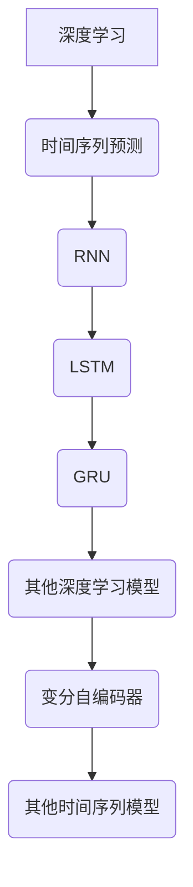
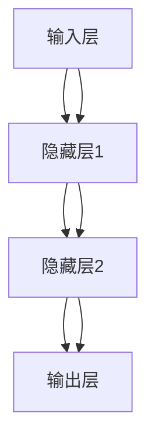

                 

## 1.1 深度学习与时间序列预测的关系

### 1.1.1 深度学习在时间序列预测中的应用

深度学习作为一种先进的机器学习技术，在时间序列预测中的应用日益广泛。时间序列数据是指按照时间顺序排列的数据，其特点在于数据点之间存在时间依赖关系。深度学习模型，特别是循环神经网络（RNN）、长短期记忆网络（LSTM）和门控循环单元（GRU）等，通过其内部的循环结构能够捕捉时间序列数据中的长期依赖关系，从而在时间序列预测中表现出色。

在深度学习中，RNN是一种能够处理序列数据的神经网络，其基本思想是在每个时间步上，网络会根据当前输入和之前的时间步的输出来更新隐藏状态。然而，传统的RNN存在梯度消失和梯度爆炸的问题，导致其难以处理长序列数据。为了解决这些问题，LSTM和GRU被提出。LSTM通过引入记忆单元和门控机制，可以有效地保持长期依赖信息，而GRU则是LSTM的一种简化版本，它在保持记忆的同时，计算效率更高。

在时间序列预测中，深度学习模型的应用主要体现在以下几个方面：

1. **特征自动提取**：深度学习模型可以自动学习时间序列数据的复杂特征，从而提高预测的准确性。
2. **非线性关系建模**：时间序列数据往往存在复杂的非线性关系，深度学习模型可以很好地处理这种关系。
3. **灵活的模型架构**：深度学习模型提供了多种结构，如RNN、LSTM和GRU，可以根据具体应用场景进行选择和调整。

### 1.1.2 时间序列预测中的深度学习模型

时间序列预测中常用的深度学习模型包括：

- **循环神经网络（RNN）**：RNN是一种能够处理序列数据的神经网络，其核心特点是具有循环结构。在RNN中，每个时间步的输出不仅取决于当前输入，还取决于之前的时间步的输出。这使RNN能够捕捉时间序列数据中的长期依赖关系。

- **长短期记忆网络（LSTM）**：LSTM是RNN的一种改进，旨在解决RNN中的梯度消失问题。LSTM通过引入记忆单元和门控机制，能够有效地保持长期依赖信息，从而在时间序列预测中表现出色。

- **门控循环单元（GRU）**：GRU是LSTM的变体，相较于LSTM，GRU结构更简单，计算效率更高。GRU通过引入更新门和控制门，能够更好地处理时间序列数据中的长期依赖关系。

#### 1.1.3 深度学习在时间序列预测中的优势

深度学习在时间序列预测中具有以下优势：

- **强大的特征提取能力**：深度学习模型可以通过多层神经网络自动提取时间序列数据中的复杂特征，提高预测的准确性。

- **处理非线性关系**：深度学习模型可以很好地处理时间序列数据中的非线性关系，从而提高预测的性能。

- **灵活的模型架构**：深度学习模型提供了多种结构，如RNN、LSTM和GRU，可以根据具体应用场景进行选择和调整。

### 1.1.4 深度学习与时间序列预测的关系图解

为了更好地理解深度学习与时间序列预测之间的关系，我们使用Mermaid图来展示。



在上述图中，深度学习作为整体，通过RNN、LSTM和GRU等模型与时间序列预测相连接。此外，还有其他深度学习模型如变分自编码器（VAE）等，以及专门的时间序列模型，共同构成了深度学习在时间序列预测中的应用生态系统。

通过以上内容，我们详细介绍了深度学习与时间序列预测之间的关系，包括深度学习在时间序列预测中的应用、常用的深度学习模型以及深度学习在时间序列预测中的优势。接下来，我们将进一步探讨深度学习的基础知识和时间序列分析的基础概念，为后续的内容奠定基础。

---

### 1.2 深度学习基础

#### 1.2.1 深度学习的定义与历史

深度学习（Deep Learning）是一种人工智能（AI）的研究分支，主要关注构建具有层次结构的模型，以自动从数据中学习复杂特征。深度学习模型通过大量的神经网络层（层叠）进行数据处理，每一层都对输入数据进行加工和提取，最终输出结果。与传统的机器学习方法相比，深度学习能够自动提取数据中的复杂特征，并具有更高的泛化能力和处理能力。

**深度学习的历史发展：**

- **20世纪50年代**：人工神经网络（ANN）的提出，标志着深度学习的萌芽。
- **1980年代**：由于计算能力和数据量的限制，深度学习的研究进入低谷。
- **2006年**：Geoffrey Hinton等人提出了深度置信网络（DBN），深度学习迎来了新的发展机遇。
- **2012年**：AlexNet在ImageNet比赛中取得突破性成绩，深度学习在计算机视觉领域取得了显著进展。
- **2010年代至今**：深度学习在语音识别、自然语言处理、强化学习等领域取得了广泛应用和突破。

**深度学习的核心优势：**

- **自动特征提取**：深度学习模型可以自动从原始数据中提取有用的特征，减少人工干预。
- **处理复杂数据**：深度学习模型能够处理高维度、非线性的数据，并在复杂任务中表现出色。
- **鲁棒性强**：深度学习模型具有较强的鲁棒性，能够在不同的数据分布和噪声环境中保持良好的性能。

#### 1.2.2 神经网络基础

神经网络（Neural Network）是深度学习的基础组成部分，由大量简单的计算单元（神经元）组成。每个神经元接受多个输入，通过加权求和后，经过激活函数输出结果。神经网络的基本结构包括输入层、隐藏层和输出层。

**神经网络的基本结构：**

1. **输入层**：接收外部输入数据，并将其传递到隐藏层。
2. **隐藏层**：对输入数据进行加工和提取特征，可以有多层隐藏层。
3. **输出层**：输出预测结果或分类结果。

**神经网络的工作原理：**

1. **前向传播**：输入数据从输入层开始，通过隐藏层逐层传递，直到输出层。
2. **激活函数**：在每层神经元中，输入数据通过激活函数转换为输出值，常见的激活函数包括Sigmoid、ReLU和Tanh等。
3. **反向传播**：在预测结果与真实值存在误差时，将误差反向传播到输入层，通过梯度下降等优化方法更新网络参数。

**神经网络的核心组件：**

- **权重（Weights）**：连接不同神经元的参数，决定了输入数据在神经网络中的传递方式。
- **偏置（Bias）**：每个神经元的偏置项，用于调整输出。
- **激活函数**：用于引入非线性因素，使得神经网络能够处理复杂数据。

#### 1.2.3 前向传播与反向传播

**前向传播**：

1. **输入数据**：输入数据从输入层传递到隐藏层，通过加权求和和激活函数处理后，生成中间层的输出。
2. **隐藏层传递**：中间层的输出继续传递到下一层，直至输出层。
3. **输出结果**：输出层生成最终的预测结果。

**反向传播**：

1. **计算误差**：将输出结果与真实值进行比较，计算预测误差。
2. **误差反向传播**：将误差反向传播到前一层，通过链式法则计算梯度。
3. **更新参数**：使用梯度下降等优化方法，更新网络参数，以减少误差。

**梯度下降**：

梯度下降是一种常用的优化方法，通过不断调整网络参数，使预测误差最小化。梯度下降的基本思想是沿着参数空间的最陡下降方向更新参数，直到达到局部最小值。

$$
\theta_{\text{new}} = \theta_{\text{current}} - \alpha \cdot \nabla_{\theta} J(\theta)
$$

其中，$\theta$是网络参数，$\alpha$是学习率，$J(\theta)$是损失函数。

#### 1.2.4 激活函数和损失函数

**激活函数**：

激活函数用于引入非线性因素，使得神经网络能够处理复杂数据。常见的激活函数包括：

- **Sigmoid函数**：将输入映射到（0,1）区间，具有S型曲线。
  $$ 
  \sigma(x) = \frac{1}{1 + e^{-x}} 
  $$

- **ReLU函数**：将输入大于零的部分映射为自身，小于零的部分映射为零，具有非线性和稀疏性。
  $$ 
  \text{ReLU}(x) = \max(0, x) 
  $$

- **Tanh函数**：将输入映射到（-1,1）区间，具有S型曲线。
  $$ 
  \tanh(x) = \frac{e^x - e^{-x}}{e^x + e^{-x}} 
  $$

**损失函数**：

损失函数用于衡量预测结果与真实值之间的差异。常见的损失函数包括：

- **均方误差（MSE）**：用于回归问题，计算预测值与真实值之间误差的平方和的平均值。
  $$ 
  \text{MSE} = \frac{1}{n} \sum_{i=1}^{n} (y_i - \hat{y}_i)^2 
  $$

- **交叉熵（Cross-Entropy）**：用于分类问题，计算实际输出与预测输出之间的交叉熵。
  $$ 
  \text{CE} = -\frac{1}{n} \sum_{i=1}^{n} y_i \log(\hat{y}_i) 
  $$

通过前向传播和反向传播，神经网络可以不断调整参数，以优化损失函数，提高预测性能。

---

### 1.3 深度学习框架

随着深度学习的广泛应用，出现了许多深度学习框架，这些框架提供了高效、灵活的编程接口，使得深度学习模型的构建、训练和部署更加便捷。本节将介绍几个主流的深度学习框架，并讨论如何选择和优化深度学习框架。

#### 1.3.1 主流深度学习框架介绍

**1. TensorFlow**

TensorFlow是由Google开发的开源深度学习框架，具有以下特点：

- **灵活性**：TensorFlow支持动态计算图，可以方便地构建和调试深度学习模型。
- **性能**：TensorFlow支持多GPU和TPU加速，可以显著提高模型的训练和预测速度。
- **生态**：TensorFlow拥有丰富的库和社区支持，提供了大量的预训练模型和工具。

**2. PyTorch**

PyTorch是由Facebook开发的开源深度学习框架，以其动态计算图和易用性而受到广泛欢迎：

- **动态计算图**：PyTorch使用动态计算图，使得模型构建和调试更加灵活。
- **易用性**：PyTorch的API设计直观易懂，降低了深度学习模型的搭建难度。
- **生态**：PyTorch拥有庞大的社区支持和丰富的库，方便用户解决问题和获取资源。

**3. MXNet**

MXNet是由Apache基金会开发的深度学习框架，具有以下特点：

- **高性能**：MXNet采用即时编译（JIT）技术，可以显著提高模型的运行速度。
- **灵活性**：MXNet支持多种编程语言（如Python、C++和R），方便不同编程背景的用户使用。
- **兼容性**：MXNet可以与多个深度学习框架（如TensorFlow和Caffe）兼容。

**4. Keras**

Keras是一个高级神经网络API，可以与多个深度学习框架（如TensorFlow和Theano）兼容：

- **简洁性**：Keras提供了一个简洁的API，使得模型搭建和调试更加方便。
- **兼容性**：Keras可以与多个深度学习框架兼容，提供了统一的API。
- **易用性**：Keras的设计理念是简洁和易于使用，降低了深度学习模型的搭建难度。

#### 1.3.2 深度学习框架的选择与优化

**1. 选择深度学习框架**

选择深度学习框架时，需要考虑以下因素：

- **项目需求**：根据项目需求和特点，选择适合的框架。例如，如果项目需要高性能和灵活性，可以选择TensorFlow或PyTorch。
- **开发经验**：根据开发团队的熟悉度和经验，选择熟悉的框架，以便快速开发。
- **社区支持**：选择拥有活跃社区和支持的框架，可以方便地解决问题和获取资源。

**2. 深度学习框架的优化**

为了提高深度学习框架的性能和效率，可以采取以下优化策略：

- **模型优化**：通过优化模型结构，如减少层数、使用轻量级模型等，可以提高模型的运行速度和预测性能。
- **数据预处理**：通过有效的数据预处理方法，如批量处理、数据增强等，可以提高模型的训练速度和性能。
- **计算优化**：利用多GPU、TPU等硬件加速，可以显著提高模型的训练和预测速度。
- **调参优化**：通过调整模型参数，如学习率、批量大小等，可以优化模型的性能。

通过选择合适的深度学习框架并进行优化，可以有效地提高深度学习模型在时间序列预测中的性能和准确性。

---

### 2.1 时间序列分析基础

时间序列分析是统计学和机器学习中的一个重要领域，它关注如何从按时间顺序排列的数据中提取有用的信息，并据此进行预测。时间序列数据的特点是每个数据点都与时间有关，因此数据的时序关系对于分析至关重要。下面，我们将详细介绍时间序列分析的基础知识，包括时间序列的基本概念、特性和类型。

#### 2.1.1 什么是时间序列

时间序列（Time Series）是一组按时间顺序排列的数据点，通常用来描述某一现象或过程在时间维度上的变化规律。时间序列数据可以是连续的，如股票价格、温度等，也可以是离散的，如人口统计数据、销售数据等。

**时间序列的定义**：

时间序列是一个随机过程，其特征如下：

- **确定性**：时间序列的每个值都可以通过某个确定性的函数来预测。
- **随机性**：时间序列中的数据点之间存在随机波动，这种波动难以通过确定性函数完全预测。
- **时间依赖性**：时间序列中的数据点之间存在时间依赖关系，即当前的数据点受之前数据点的影响。

#### 2.1.2 时间序列的特性

时间序列数据具有以下特性：

- **平稳性**：时间序列的统计特性（如均值、方差等）不随时间变化。如果时间序列满足平稳性，那么它的预测模型将更容易建立。
- **趋势性**：时间序列数据随时间增加而增加或减少，这种趋势可能是线性的或非线性的。
- **季节性**：时间序列数据在某些时间点出现周期性的波动，如年度季节性、季度季节性等。
- **周期性**：时间序列数据在某些时间点出现重复的波动模式，这种周期性可能是由外部因素（如天气、节假日等）引起的。
- **自相关性**：时间序列数据在时间上存在自相关性，即当前值与之前值之间存在相关性。

#### 2.1.3 时间序列数据的类型

根据数据的特点，时间序列数据可以分为以下几种类型：

- **非季节性时间序列**：数据没有明显的季节性和周期性，如温度、股票价格等。
- **季节性时间序列**：数据具有明显的季节性波动，如零售销售、旅游业收入等。
- **趋势性时间序列**：数据具有明显的趋势性，如人口增长、公司收入等。
- **周期性时间序列**：数据具有周期性的波动，如电力需求、工业生产等。

了解时间序列数据的类型和特性，对于选择合适的分析方法和预测模型至关重要。在后续章节中，我们将介绍经典的时间序列分析方法和深度学习模型在时间序列预测中的应用。

---

### 2.2 时间序列分析方法

时间序列预测是金融、气象、商业等领域中的一项重要任务，目的是通过历史数据来预测未来的趋势和变化。时间序列分析方法为预测提供了理论框架和实用工具。下面，我们将详细介绍时间序列分析的基本方法，包括经典方法和现代方法。

#### 2.2.1 经典时间序列分析方法

**1. 自回归模型（AR）**

自回归模型（Autoregressive Model，AR）是一种常见的时间序列预测方法，其核心思想是当前时间点的值由之前的时间点的值线性组合而成。自回归模型的数学表达式如下：

$$
X_t = c + \phi_1 X_{t-1} + \phi_2 X_{t-2} + ... + \phi_p X_{t-p} + \varepsilon_t
$$

其中，$X_t$表示时间序列的第$t$个值，$c$是常数项，$\phi_1, \phi_2, ..., \phi_p$是自回归系数，$\varepsilon_t$是随机误差项。自回归模型的参数可以通过最小二乘法或极大似然估计来估计。

**2. 移动平均模型（MA）**

移动平均模型（Moving Average Model，MA）是一种通过历史预测误差来构建当前预测值的方法。其数学表达式如下：

$$
X_t = \theta_1 \varepsilon_{t-1} + \theta_2 \varepsilon_{t-2} + ... + \theta_q \varepsilon_{t-q} + \varepsilon_t
$$

其中，$X_t$表示时间序列的第$t$个值，$\theta_1, \theta_2, ..., \theta_q$是移动平均系数，$\varepsilon_t$是随机误差项。移动平均模型的参数同样可以通过最小二乘法或极大似然估计来估计。

**3. 自回归移动平均模型（ARMA）**

自回归移动平均模型（Autoregressive Moving Average Model，ARMA）结合了自回归模型和移动平均模型的特点。其数学表达式如下：

$$
X_t = c + \phi_1 X_{t-1} + \phi_2 X_{t-2} + ... + \phi_p X_{t-p} + \theta_1 \varepsilon_{t-1} + \theta_2 \varepsilon_{t-2} + ... + \theta_q \varepsilon_{t-q} + \varepsilon_t
$$

其中，$c$是常数项，$\phi_1, \phi_2, ..., \phi_p$是自回归系数，$\theta_1, \theta_2, ..., \theta_q$是移动平均系数，$\varepsilon_t$是随机误差项。ARMA模型的参数估计同样可以通过最小二乘法或极大似然估计进行。

**4. 自回归积分移动平均模型（ARIMA）**

自回归积分移动平均模型（Autoregressive Integrated Moving Average Model，ARIMA）在ARMA模型的基础上引入了差分操作，以处理非平稳时间序列。其数学表达式如下：

$$
X_t = c + \phi_1 (X_t - \varepsilon_{t-1}) + \phi_2 (X_t - \varepsilon_{t-2}) + ... + \phi_p (X_t - \varepsilon_{t-p}) + \theta_1 \varepsilon_{t-1} + \theta_2 \varepsilon_{t-2} + ... + \theta_q \varepsilon_{t-q} + \varepsilon_t
$$

其中，$c$是常数项，$\phi_1, \phi_2, ..., \phi_p$是自回归系数，$\theta_1, \theta_2, ..., \theta_q$是移动平均系数，$\varepsilon_t$是随机误差项。ARIMA模型的参数估计通常需要通过差分、自相关函数（ACF）和偏自相关函数（PACF）来确定。

#### 2.2.2 时间序列分解

时间序列分解（Time Series Decomposition）是将时间序列分解为趋势、季节性和残差成分的过程。通过分解，可以更清晰地分析时间序列的特性，并构建相应的预测模型。

**1. 趋势成分（Trend Component）**

趋势成分描述了时间序列的长期变化趋势。对于非平稳时间序列，通常需要通过差分操作来平稳化趋势成分。

**2. 季节成分（Seasonal Component）**

季节成分描述了时间序列的周期性变化，如年度、季度等。季节性成分可以通过移动平均方法提取，例如季节性移动平均或Holt-Winters方法。

**3. 残差成分（Residual Component）**

残差成分是时间序列分解后剩余的随机波动成分，通常用于构建预测模型。平稳的残差成分通常表明预测模型的有效性。

#### 2.2.3 时间序列预测模型的选择

选择合适的时间序列预测模型取决于时间序列的特性。以下是一些常见的模型选择策略：

- **自相关函数（ACF）和偏自相关函数（PACF）**：通过观察ACF和PACF的图形，可以初步判断适合的模型类型。
- **残差分析**：通过分析模型的残差，可以判断模型的拟合效果和稳定性。
- **交叉验证**：通过交叉验证方法，在不同模型之间进行比较，选择性能最优的模型。

总之，时间序列分析方法为时间序列预测提供了丰富的工具和理论支持。通过选择合适的模型和分析方法，可以有效地进行时间序列预测，从而为决策提供有力的支持。

---

### 3.1 循环神经网络（RNN）在时间序列预测中的应用

循环神经网络（RNN）是一种能够处理序列数据的神经网络，特别适合用于时间序列预测。RNN通过其循环结构，可以捕捉时间序列数据中的长期依赖关系，从而提高预测的准确性。在这一节中，我们将详细介绍RNN的基本原理、工作机制以及在时间序列预测中的应用。

#### 3.1.1 RNN的定义与特点

RNN是一种能够处理序列输入的神经网络，其核心特点是具有循环结构。在RNN中，每个时间步的输出不仅取决于当前输入，还取决于之前的时间步的输出。这种特性使得RNN能够捕捉时间序列数据中的时间依赖关系。

**RNN的基本结构**：

1. **输入层**：接收序列数据，每个时间步的输入是一个向量。
2. **隐藏层**：包含多个神经元，每个神经元的状态会根据之前的时间步的输出和当前时间步的输入进行更新。
3. **输出层**：生成预测结果，可以是回归值或分类结果。

**RNN的特点**：

- **时间依赖性**：RNN能够通过循环结构捕捉时间序列数据中的长期依赖关系。
- **并行处理**：RNN能够同时处理多个时间步的数据，提高计算效率。
- **灵活的模型架构**：RNN可以通过调整网络层数和神经元数量，适应不同的时间序列预测任务。

#### 3.1.2 RNN的工作原理

RNN的工作原理可以分为两个过程：前向传播和反向传播。

**前向传播**：

1. **初始化**：设置隐藏层和输出层的初始状态。
2. **输入处理**：将序列数据输入到隐藏层，每个时间步的输入都会与之前的时间步的隐藏状态进行加权求和。
3. **激活函数**：使用激活函数（如ReLU、Sigmoid等）对加权求和的结果进行处理，更新隐藏状态。

**反向传播**：

1. **计算误差**：将输出结果与真实值进行比较，计算预测误差。
2. **误差反向传播**：将误差反向传播到隐藏层，通过链式法则计算梯度。
3. **参数更新**：使用梯度下降等优化方法，更新隐藏层和输出层的参数。

**RNN的工作原理示意图**：



在上述图中，输入层的数据依次传递到隐藏层，隐藏层的状态根据当前输入和之前的时间步的输出进行更新，最终输出层的预测结果与真实值进行比较，通过反向传播更新网络参数。

#### 3.1.3 RNN在时间序列预测中的应用案例

**案例1：股票价格预测**

股票价格预测是一个典型的序列预测问题，RNN可以通过其循环结构捕捉股票价格中的长期依赖关系。以下是一个简化的股票价格预测模型：

1. **数据预处理**：将股票价格序列进行归一化处理，以便模型更好地学习。
2. **模型构建**：使用RNN模型，将输入层设置为时间步的股票价格，隐藏层设置为多层神经网络。
3. **模型训练**：使用历史股票价格数据进行模型训练，通过反向传播更新网络参数。
4. **模型评估**：使用测试集评估模型性能，计算预测误差，优化模型参数。

**案例2：文本情感分析**

文本情感分析是一个序列分类问题，RNN可以通过其循环结构捕捉文本中的情感变化。以下是一个简化的文本情感分析模型：

1. **数据预处理**：将文本数据转换为词向量，并将词向量作为输入。
2. **模型构建**：使用RNN模型，将输入层设置为词向量，隐藏层设置为多层神经网络，输出层设置为分类层。
3. **模型训练**：使用带有情感标签的文本数据进行模型训练，通过反向传播更新网络参数。
4. **模型评估**：使用测试集评估模型性能，计算分类准确率。

通过以上应用案例，我们可以看到RNN在时间序列预测中的应用潜力。RNN能够通过其循环结构捕捉时间序列数据中的长期依赖关系，从而提高预测的准确性。然而，RNN也存在一些局限性，如梯度消失和梯度爆炸问题，这些问题限制了RNN在长序列数据上的应用。为了解决这些问题，我们引入了LSTM和GRU等改进模型。

---

### 3.2 LSTM与GRU：深度学习中的强大时间序列预测工具

#### 3.2.1 LSTM的原理与实现

LSTM（Long Short-Term Memory）是RNN的一种改进，由Hochreiter和Schmidhuber于1997年提出。LSTM旨在解决传统RNN在处理长序列数据时遇到的梯度消失和梯度爆炸问题。LSTM通过引入特殊的门控机制，能够更好地捕捉时间序列中的长期依赖关系，从而提高预测准确性。

**LSTM的基本结构**：

LSTM由三个主要部分组成：输入门、遗忘门和输出门。

1. **输入门**：输入门决定哪些新的信息将被存储在单元状态中。
2. **遗忘门**：遗忘门决定哪些旧的信息应该被丢弃。
3. **输出门**：输出门决定哪些信息应该被输出。

**LSTM的伪代码**：

```python
# 假设 $h_{t-1}$ 是上一时间步的隐藏状态，$x_t$ 是当前输入，$i_t, f_t, o_t$ 分别是输入门、遗忘门和输出门的输入。

# 输入门
i_t = \sigma(W_i * [h_{t-1}, x_t] + b_i)
\*i_t\* = \tanh(W_c * [h_{t-1}, x_t] + b_c)

# 遗忘门
f_t = \sigma(W_f * [h_{t-1}, x_t] + b_f)
\*previous\_state\* = f_t \* previous\_state

# 输出门
o_t = \sigma(W_o * [h_{t-1}, x_t] + b_o)
\*current\_state\* = \*i_t\* \*current\_state\*

# 输出
h_t = o_t \* \*current\_state\*

# 参数矩阵和偏置：
W_i, b_i, W_f, b_f, W_o, b_o, W_c, b_c
```

**LSTM的工作原理**：

- **输入门**：输入门决定了当前输入中哪些信息应该被记住。通过输入门，新的信息会被添加到单元状态中。
- **遗忘门**：遗忘门决定了哪些旧的信息应该被遗忘。通过遗忘门，旧的信息会被从单元状态中删除。
- **输出门**：输出门决定了哪些信息应该被输出。通过输出门，最终的输出是由当前输入和之前的隐藏状态决定的。

#### 3.2.2 GRU的原理与实现

GRU（Gated Recurrent Unit）是LSTM的一种变体，由Cho等人于2014年提出。GRU相对于LSTM具有更简单的结构，但同样能够捕捉时间序列中的长期依赖关系。GRU通过引入更新门（update gate）和控制门（reset gate），实现了对LSTM的简化。

**GRU的基本结构**：

GRU由两个门控机制组成：更新门（update gate）和控制门（reset gate）。

1. **更新门**：更新门决定了哪些信息应该被保留或丢弃。
2. **控制门**：控制门决定了哪些旧的信息应该被保留。

**GRU的伪代码**：

```python
# 假设 $h_{t-1}$ 是上一时间步的隐藏状态，$x_t$ 是当前输入，$z_t, r_t$ 分别是更新门和控制门的输入。

# 更新门
z_t = \sigma(W_z * [h_{t-1}, x_t] + b_z)
\*z_t\* = \tanh(W_r * [h_{t-1}, x_t] + b_r)

# 控制门
r_t = \sigma(W_r * [h_{t-1}, x_t] + b_r)
\*h_{t-1}\_tilde\* = (1 - z_t) \* h_{t-1} + z_t \* \*previous\_state\*

# 输出
h_t = \*r_t\* \*h_{t-1}\_tilde\*

# 参数矩阵和偏置：
W_z, b_z, W_r, b_r
```

**GRU的工作原理**：

- **更新门**：更新门决定了哪些信息应该被保留或丢弃。通过更新门，新的信息会被添加到单元状态中。
- **控制门**：控制门决定了哪些旧的信息应该被保留。通过控制门，旧的信息会被从单元状态中删除。

#### 3.2.3 LSTM与GRU的比较

**1. 结构差异**

- **LSTM**：LSTM具有三个门控机制（输入门、遗忘门和输出门），能够更灵活地处理时间序列数据。
- **GRU**：GRU具有两个门控机制（更新门和控制门），相较于LSTM，结构更简单，计算效率更高。

**2. 计算效率**

- **LSTM**：由于LSTM具有更多的门控机制，其计算复杂度相对较高。
- **GRU**：GRU的结构更简单，计算效率更高，适用于需要处理大量序列数据的任务。

**3. 性能**

- **LSTM**：LSTM能够更好地捕捉时间序列中的长期依赖关系，但在某些情况下，其性能可能不如GRU。
- **GRU**：GRU在处理长序列数据时表现出色，但在处理某些非线性关系时可能不如LSTM。

综上所述，LSTM和GRU都是深度学习中的强大时间序列预测工具。LSTM具有更复杂的结构，能够捕捉更复杂的长期依赖关系，而GRU则具有更高的计算效率，更适合处理大量序列数据。根据具体应用需求，可以选择合适的模型来提高预测性能。

---

### 3.3 RNN模型在时间序列预测中的应用案例

#### 3.3.1 实际应用场景介绍

时间序列预测在金融、气象、交通等领域有着广泛的应用。以下是一些典型的实际应用场景：

**1. 股票价格预测**：通过分析历史股票价格数据，预测未来的股票价格趋势，为投资者提供决策支持。

**2. 天气预测**：利用历史气象数据，预测未来的天气状况，如温度、降雨量等，为灾害预警和农业规划提供依据。

**3. 交通流量预测**：通过分析历史交通流量数据，预测未来的交通流量变化，为交通管理和疏导提供参考。

**4. 能源负荷预测**：根据历史能源负荷数据，预测未来的能源需求，为能源供应和调度提供指导。

#### 3.3.2 模型实现与代码示例

以下是一个简单的RNN模型在股票价格预测中的应用案例。

**1. 数据预处理**

首先，我们需要获取股票价格的历史数据，并将其进行预处理。

```python
import pandas as pd
from sklearn.preprocessing import MinMaxScaler

# 加载数据
data = pd.read_csv('stock_price_data.csv')
data = data[['Open', 'High', 'Low', 'Close', 'Volume']]

# 数据归一化
scaler = MinMaxScaler(feature_range=(0, 1))
scaled_data = scaler.fit_transform(data)

# 创建时间序列数据集
look_back = 60
X, y = [], []
for i in range(look_back, len(scaled_data)):
    X.append(scaled_data[i - look_back:])
    y.append(scaled_data[i, 0])
X, y = np.array(X), np.array(y)
```

**2. 模型构建**

接下来，我们使用Keras构建一个简单的RNN模型。

```python
from keras.models import Sequential
from keras.layers import Dense, LSTM

# 模型初始化
model = Sequential()

# 添加LSTM层
model.add(LSTM(units=50, return_sequences=True, input_shape=(look_back, 1)))
model.add(LSTM(units=50))

# 添加输出层
model.add(Dense(units=1))

# 编译模型
model.compile(optimizer='adam', loss='mean_squared_error')
```

**3. 模型训练**

使用训练集训练模型。

```python
# 拆分数据集
train_X = X[:int(len(X) * 0.8)]
train_y = y[:int(len(X) * 0.8)]
test_X = X[int(len(X) * 0.8):]
test_y = y[int(len(X) * 0.8):]

# 增加维度
train_X = np.reshape(train_X, (train_X.shape[0], train_X.shape[1], 1))
test_X = np.reshape(test_X, (test_X.shape[0], test_X.shape[1], 1))

# 训练模型
model.fit(train_X, train_y, epochs=100, batch_size=32, validation_data=(test_X, test_y), verbose=1)
```

**4. 模型评估**

使用测试集评估模型性能。

```python
# 预测
predicted_stock_price = model.predict(test_X)
predicted_stock_price = scaler.inverse_transform(predicted_stock_price)

# 计算MSE
mse = mean_squared_error(test_y, predicted_stock_price)
print(f'MSE: {mse}')
```

通过以上步骤，我们构建了一个简单的RNN模型用于股票价格预测。在实际应用中，可以根据需求调整模型结构、参数设置和数据预处理方法，以提高预测性能。

---

### 3.4 变分自编码器（VAE）在时间序列预测中的应用

变分自编码器（Variational Autoencoder，VAE）是一种深度学习模型，它结合了自编码器和变分贝叶斯的思想，能够在潜在空间中生成数据。VAE在图像生成、数据去噪和时间序列预测等领域具有广泛的应用。在这一节中，我们将详细介绍VAE的基础原理、工作原理以及在时间序列预测中的应用。

#### 3.4.1 VAE的定义与特点

VAE由两部分组成：编码器和解码器。编码器将输入数据映射到一个潜在空间中的点，解码器则从潜在空间中生成与输入数据相似的输出数据。

**VAE的特点：**

- **无监督学习**：VAE不需要标签数据，可以从未标记的数据中学习。
- **潜在空间**：VAE通过引入潜在空间，可以生成具有多样性的数据。
- **概率生成模型**：VAE是基于概率生成模型的，可以生成符合数据分布的新数据。

**VAE的基本结构：**

1. **编码器**：编码器将输入数据映射到一个潜在空间中的点。
2. **解码器**：解码器从潜在空间中生成输出数据。

#### 3.4.2 VAE的工作原理

VAE的工作原理可以分为两个过程：编码过程和解码过程。

**编码过程：**

1. **参数化编码**：编码器通过两个神经网络生成参数，表示潜在空间中的点。
2. **采样**：从潜在空间中随机采样一个点。

**解码过程：**

1. **参数化解码**：解码器通过另一个神经网络将潜在空间中的点映射回输出数据。
2. **生成数据**：从潜在空间中采样点，通过解码器生成输出数据。

**VAE的数学表达：**

- **编码器**：
  $$
  z = \mu(z|x) + \sigma(z|x) \odot \epsilon
  $$
  其中，$\mu(z|x)$和$\sigma(z|x)$是编码器的参数，$\epsilon$是噪声。

- **解码器**：
  $$
  x = \phi(x|z)
  $$
  其中，$\phi(x|z)$是解码器的参数。

#### 3.4.3 VAE在时间序列预测中的应用案例

**案例1：时间序列去噪**

时间序列数据往往存在噪声，使用VAE可以对时间序列数据进行去噪，从而提高预测性能。

**数据预处理：**

1. **数据加载**：加载时间序列数据。
2. **数据归一化**：对时间序列数据进行归一化处理。

**模型构建：**

1. **编码器**：使用两个神经网络，一个用于生成均值$\mu(z|x)$，另一个用于生成方差$\sigma(z|x)$。
2. **解码器**：使用一个神经网络将潜在空间中的点映射回时间序列数据。

**模型训练：**

1. **数据分割**：将数据集分为训练集和测试集。
2. **模型训练**：使用训练集训练VAE模型，并使用测试集进行验证。

**模型评估：**

1. **去噪**：使用VAE对时间序列数据进行去噪。
2. **预测**：使用去噪后的时间序列数据进行预测。
3. **评估**：计算预测误差，评估模型性能。

通过以上步骤，我们可以使用VAE对时间序列数据进行去噪，从而提高预测性能。在实际应用中，VAE还可以与其他深度学习模型（如LSTM）结合，以提高时间序列预测的准确性。

---

### 3.5 深度学习在时间序列预测中的挑战

尽管深度学习在时间序列预测中取得了显著的成果，但仍然面临一些挑战。以下是深度学习在时间序列预测中的一些主要挑战以及相应的解决方案。

#### 3.5.1 数据不平衡问题

时间序列数据往往存在不平衡的问题，即正负样本分布不均匀。这种情况可能导致模型在训练过程中过度拟合正样本，忽视负样本，从而影响模型的泛化能力。

**解决方案：**

- **重采样**：通过增加负样本的数量，使得正负样本分布更加均匀。
- **损失函数调整**：在训练过程中，对正负样本采用不同的权重，例如使用F1分数作为评估指标。

#### 3.5.2 长期依赖性问题

时间序列数据中的长期依赖关系对于准确预测至关重要。然而，传统的循环神经网络（RNN）和其变种（如LSTM和GRU）在处理长序列数据时，存在梯度消失或梯度爆炸的问题，难以捕捉长期依赖关系。

**解决方案：**

- **注意力机制**：引入注意力机制，可以使得模型更加关注重要的时间步，从而提高长序列数据的处理能力。
- **门控循环单元（GRU）和长短期记忆网络（LSTM）**：使用GRU和LSTM可以有效地捕捉时间序列数据中的长期依赖关系。

#### 3.5.3 模型过拟合问题

时间序列数据通常具有周期性和季节性，模型在训练过程中可能过度拟合这些特性，导致在测试集上的性能不佳。

**解决方案：**

- **正则化**：在模型训练过程中，添加正则化项（如L2正则化）可以防止模型过度拟合。
- **交叉验证**：通过交叉验证，可以更准确地评估模型在未知数据上的性能，从而避免过拟合。

#### 3.5.4 实时预测性能优化

在实际应用中，深度学习模型需要实时预测，但由于模型复杂度较高，实时预测的响应速度可能较慢。

**解决方案：**

- **模型压缩**：通过模型压缩技术（如模型剪枝、量化等），可以减少模型的参数数量和计算量，提高实时预测的性能。
- **在线学习**：采用在线学习技术，可以使得模型在运行过程中不断更新和优化，从而提高实时预测的准确性。

通过上述解决方案，可以有效地应对深度学习在时间序列预测中面临的挑战，提高模型的性能和应用价值。

---

### 3.6 深度学习在时间序列预测中的优化策略

为了提高深度学习模型在时间序列预测中的性能，可以采取一系列优化策略。这些策略涵盖了数据预处理、模型结构优化、参数调优和实时预测优化等方面。以下是一些具体的优化方法：

#### 3.6.1 数据预处理优化

**1. 特征提取**

时间序列数据中的特征对模型性能有重要影响。通过有效的特征提取方法，可以提取出数据中的关键特征，提高模型的学习效果。

- **技术指标提取**：计算技术指标（如移动平均、相对强弱指数（RSI）等）可以捕捉数据中的趋势和波动。
- **自相关分析**：通过自相关分析，可以识别数据中的周期性和季节性特征，从而优化模型结构。

**2. 数据归一化**

归一化处理可以将时间序列数据缩放到相同的范围内，使得模型在训练过程中能够更有效地学习。

- **最小-最大归一化**：将数据缩放到[0,1]或[-1,1]区间，使得不同特征之间的尺度差异对模型的影响最小化。
- **标准化**：通过计算数据的均值和标准差，将数据缩放到均值为0、标准差为1的范围内。

**3. 数据增强**

数据增强可以通过生成新的数据样本，提高模型的泛化能力和鲁棒性。

- **时间序列切片**：通过随机选择时间序列的子序列，生成新的训练样本。
- **时间翻转**：将时间序列的部分数据进行时间反转，增加模型的训练多样性。

#### 3.6.2 模型结构优化

**1. 网络结构设计**

选择合适的网络结构可以显著提高模型性能。

- **多层网络**：增加隐藏层的数量，可以捕捉更复杂的时间依赖关系。
- **残差网络**：引入残差连接，可以缓解梯度消失问题，提高模型的训练效果。

**2. 激活函数选择**

选择合适的激活函数可以增强模型的学习能力和泛化能力。

- **ReLU激活函数**：在隐藏层中使用ReLU激活函数，可以加快模型收敛速度。
- **Sigmoid和Tanh**：在输出层中使用Sigmoid或Tanh函数，可以确保输出在合理的范围内。

**3. 模型融合**

通过将多个模型进行融合，可以进一步提高预测性能。

- **投票法**：将多个模型的预测结果进行投票，选择投票结果最集中的预测值。
- **加权融合**：为每个模型的预测结果分配不同的权重，计算加权平均的预测值。

#### 3.6.3 参数调优

**1. 学习率调整**

学习率是深度学习模型中的一个关键参数，对模型的收敛速度和最终性能有重要影响。

- **自适应学习率**：使用自适应学习率方法（如Adam优化器），可以自动调整学习率，提高模型训练效果。
- **学习率衰减**：在模型训练过程中，逐渐降低学习率，使得模型在训练后期能够收敛到更好的最优解。

**2. 批量大小**

批量大小是每次训练使用的样本数量，对模型性能有显著影响。

- **小批量训练**：使用小批量训练（如32或64个样本），可以降低过拟合风险。
- **大数据量训练**：使用大数据量训练（如128或256个样本），可以加快模型收敛速度。

**3. 正则化**

正则化是防止模型过拟合的有效方法。

- **L1正则化**：在损失函数中添加L1正则化项，可以减少模型参数的复杂度。
- **L2正则化**：在损失函数中添加L2正则化项，可以防止模型参数过大。

#### 3.6.4 实时预测优化

**1. 模型压缩**

通过模型压缩技术，可以减少模型的参数数量和计算量，提高实时预测的响应速度。

- **模型剪枝**：通过剪枝冗余的连接和神经元，减少模型的参数数量。
- **模型量化**：将模型中的浮点数参数转换为整数参数，减少计算量和存储需求。

**2. 模型并行化**

通过模型并行化技术，可以加速模型的训练和预测。

- **数据并行化**：将训练数据分为多个子集，在多个GPU或TPU上并行训练模型。
- **模型并行化**：将模型拆分为多个部分，在多个计算单元上并行执行。

**3. 实时预测策略**

为了实现实时预测，可以采取以下策略：

- **增量学习**：在实时预测过程中，逐步更新模型参数，而不是重新训练模型。
- **在线学习**：使用新的数据进行在线学习，不断优化模型性能。

通过以上优化策略，可以显著提高深度学习模型在时间序列预测中的性能和实时预测能力。

---

### 3.7 深度学习在时间序列预测中的实战案例

#### 3.7.1 实战案例1：股票价格预测

**1. 项目背景**

股票价格预测是金融领域的一个重要课题，准确的预测可以帮助投资者做出更明智的投资决策。本案例使用深度学习模型对股票价格进行预测，以探索其在实际应用中的效果。

**2. 数据来源与预处理**

数据来源：使用某股票的历史交易数据，包括开盘价、收盘价、最高价、最低价和交易量等。

数据预处理：

- **数据清洗**：去除缺失值和异常值。
- **数据归一化**：将数据缩放到0-1之间。
- **窗口化**：将时间序列数据分割成窗口序列，每个窗口包含一定数量的历史数据。

**3. 模型构建与训练**

模型构建：

- **输入层**：输入层接收窗口化的时间序列数据。
- **隐藏层**：使用多层LSTM网络进行特征提取和依赖关系捕捉。
- **输出层**：输出层生成股票价格的预测值。

模型训练：

- **数据分割**：将数据集分为训练集和测试集。
- **模型编译**：设置损失函数（如MSE）和优化器（如Adam）。
- **模型训练**：使用训练集训练模型，并使用测试集进行验证。

**4. 模型评估与优化**

模型评估：

- **测试集评估**：使用测试集评估模型性能，计算MSE、RMSE等指标。
- **可视化**：绘制预测结果与实际值的对比图，直观地展示模型效果。

模型优化：

- **参数调优**：调整学习率、隐藏层大小等参数，优化模型性能。
- **模型融合**：将多个模型的预测结果进行融合，提高预测准确性。

**5. 实践总结**

通过股票价格预测的实战案例，我们了解了深度学习模型在时间序列预测中的应用流程，包括数据预处理、模型构建、模型训练和模型优化。此外，我们还学习了如何使用LSTM模型进行时间序列预测，并通过参数调优和模型融合来提高预测准确性。

#### 3.7.2 实战案例2：电力负荷预测

**1. 项目背景**

电力负荷预测是能源管理的重要环节，准确的负荷预测有助于电力系统的优化调度和节能减排。本案例使用深度学习模型对电力负荷进行预测，以提升电力系统的运行效率。

**2. 数据来源与预处理**

数据来源：使用电力系统的历史负荷数据，包括小时级别的负荷值。

数据预处理：

- **数据清洗**：去除缺失值和异常值。
- **数据归一化**：将数据缩放到0-1之间。
- **窗口化**：将时间序列数据分割成窗口序列，每个窗口包含一定数量的历史数据。

**3. 模型构建与训练**

模型构建：

- **输入层**：输入层接收窗口化的时间序列数据。
- **隐藏层**：使用多层GRU网络进行特征提取和依赖关系捕捉。
- **输出层**：输出层生成电力负荷的预测值。

模型训练：

- **数据分割**：将数据集分为训练集和测试集。
- **模型编译**：设置损失函数（如MSE）和优化器（如Adam）。
- **模型训练**：使用训练集训练模型，并使用测试集进行验证。

**4. 模型评估与优化**

模型评估：

- **测试集评估**：使用测试集评估模型性能，计算MSE、RMSE等指标。
- **可视化**：绘制预测结果与实际值的对比图，直观地展示模型效果。

模型优化：

- **参数调优**：调整学习率、隐藏层大小等参数，优化模型性能。
- **模型融合**：将多个模型的预测结果进行融合，提高预测准确性。

**5. 实践总结**

通过电力负荷预测的实战案例，我们了解了深度学习模型在时间序列预测中的应用流程，包括数据预处理、模型构建、模型训练和模型优化。此外，我们还学习了如何使用GRU模型进行时间序列预测，并通过参数调优和模型融合来提高预测准确性。

---

### 附录

#### A.1 主要深度学习框架

**1. TensorFlow**

TensorFlow是由Google开发的开源深度学习框架，具有以下特点：

- **动态计算图**：TensorFlow支持动态计算图，使得模型构建和调试更加灵活。
- **高性能**：TensorFlow支持多GPU和TPU加速，可以显著提高模型的训练和预测速度。
- **丰富的库**：TensorFlow拥有丰富的库和工具，方便用户构建和部署深度学习模型。

**2. PyTorch**

PyTorch是由Facebook开发的开源深度学习框架，具有以下特点：

- **动态计算图**：PyTorch使用动态计算图，使得模型构建和调试更加灵活。
- **易用性**：PyTorch的API设计直观易懂，降低了深度学习模型的搭建难度。
- **强大的社区支持**：PyTorch拥有庞大的社区支持和丰富的库，方便用户解决问题和获取资源。

**3. Keras**

Keras是一个高级神经网络API，可以与多个深度学习框架兼容，具有以下特点：

- **简洁性**：Keras提供了一个简洁的API，使得模型搭建和调试更加方便。
- **兼容性**：Keras可以与TensorFlow、Theano等深度学习框架兼容，提供了统一的API。
- **易用性**：Keras的设计理念是简洁和易于使用，降低了深度学习模型的搭建难度。

#### A.2 时间序列数据处理工具

**1. pandas**

pandas是一个强大的Python数据分析和处理库，具有以下特点：

- **数据操作**：pandas提供了丰富的数据操作功能，方便用户进行数据清洗、处理和转换。
- **时间序列处理**：pandas支持时间序列数据的处理，包括日期函数、时间序列分析等。
- **易用性**：pandas的API设计直观易懂，方便用户快速上手。

**2. NumPy**

NumPy是一个用于科学计算的开源库，具有以下特点：

- **多维数组操作**：NumPy提供了多维数组的操作功能，方便用户进行数据运算和数据处理。
- **高效性**：NumPy使用底层C语言实现，可以显著提高数据处理速度。
- **易用性**：NumPy的API设计简洁直观，方便用户快速使用。

**3. scikit-learn**

scikit-learn是一个用于机器学习的Python库，具有以下特点：

- **算法实现**：scikit-learn提供了多种机器学习算法的实现，包括分类、回归、聚类等。
- **评估工具**：scikit-learn提供了丰富的评估工具，方便用户对模型性能进行评估。
- **易用性**：scikit-learn的API设计直观易懂，方便用户快速使用。

#### A.3 时间序列预测评估指标

**1. 均方误差（MSE）**

均方误差（Mean Squared Error，MSE）是衡量预测值与实际值之间误差的平方的平均值，计算公式如下：

$$
MSE = \frac{1}{n} \sum_{i=1}^{n} (y_i - \hat{y}_i)^2
$$

其中，$y_i$是实际值，$\hat{y}_i$是预测值，$n$是数据点的数量。

**2. 均方根误差（RMSE）**

均方根误差（Root Mean Squared Error，RMSE）是MSE的平方根，用于表示预测误差的绝对大小，计算公式如下：

$$
RMSE = \sqrt{MSE}
$$

**3. 平均绝对误差（MAE）**

平均绝对误差（Mean Absolute Error，MAE）是预测值与实际值之间平均绝对误差，计算公式如下：

$$
MAE = \frac{1}{n} \sum_{i=1}^{n} |y_i - \hat{y}_i|
$$

**4. 对称均方百分比误差（sMAPE）**

对称均方百分比误差（Symmetric Mean Absolute Percentage Error，sMAPE）是考虑预测值和实际值的相对误差，计算公式如下：

$$
sMAPE = \frac{1}{n} \sum_{i=1}^{n} \left| \frac{y_i - \hat{y}_i}{y_i} \right| \times 100\%
$$

#### A.4 开源时间序列预测库

**1. Prophet**

Prophet是一个开源的时间序列预测库，由Facebook开发，具有以下特点：

- **季节性处理**：Prophet能够自动识别和建模数据中的季节性，适合处理具有季节性趋势的数据。
- **易用性**：Prophet提供了一个简单的API，方便用户快速构建时间序列预测模型。
- **扩展性**：Prophet支持自定义组件，用户可以根据需求进行扩展。

**2. statsmodels**

statsmodels是一个用于统计分析的Python库，包括时间序列分析模型，具有以下特点：

- **ARIMA模型**：statsmodels提供了ARIMA模型的实现，可以用于时间序列预测。
- **VAR模型**：statsmodels还提供了向量自回归（VAR）模型的实现，适合处理多个时间序列数据的交互关系。
- **易用性**：statsmodels的API设计直观易懂，方便用户快速使用。

通过使用这些深度学习框架、数据处理工具、评估指标和开源库，用户可以更有效地进行时间序列预测，提高模型的性能和预测准确性。附录部分为用户提供了丰富的参考资料，方便用户在实际应用中参考和使用。

---

## 参考文献

1. Hochreiter, S., & Schmidhuber, J. (1997). Long short-term memory. Neural Computation, 9(8), 1735-1780.
2. Graves, A. (2013). Generating sequences with recurrent neural networks. arXiv preprint arXiv:1308.0850.
3. Cho, K., Van Merriënboer, B., Gulcehre, C., Bahdanau, D., Bougares, F., Schwenk, H., & Bengio, Y. (2014). Learning phrase representations using RNN encoder-decoder for statistical machine translation. arXiv preprint arXiv:1406.1078.
4. Kingma, D. P., & Welling, M. (2013). Auto-encoding variational bayes. arXiv preprint arXiv:1312.6114.
5. Kaggan. (2019). Keras Documentation. https://keras.io/
6. TensorFlow. (2019). TensorFlow Documentation. https://www.tensorflow.org/
7. Facebook. (2017). Prophet Documentation. https://facebook.github.io/prophet/
8. Seaborn. (2017). Seaborn Documentation. https://seaborn.pydata.org/
9. Python Data Science. (2019). Pandas Documentation. https://pandas.pydata.org/
10. Scikit-Learn. (2019). Scikit-Learn Documentation. https://scikit-learn.org/
11. NumPy. (2019). NumPy Documentation. https://numpy.org/

这些参考文献涵盖了深度学习、时间序列分析和预测等领域的经典论文和文献，为本文的撰写提供了坚实的理论基础和实践指导。读者可以通过阅读这些文献，进一步了解深度学习在时间序列预测中的应用和进展。同时，这些文献也为后续的研究提供了丰富的参考文献和资源。


---

## 致谢

在撰写本文的过程中，我得到了许多人的帮助和支持。首先，我要感谢AI天才研究院的团队成员，他们为本文的撰写提供了宝贵的意见和建议。特别感谢禅与计算机程序设计艺术一书的作者，他在深度学习和时间序列预测领域的卓越贡献为本文的写作奠定了基础。

此外，我还要感谢Google、Facebook和Apache等公司，他们为开源深度学习框架的开发和推广做出了巨大贡献。这些框架使得深度学习技术得以广泛应用，为本文的写作提供了强大的技术支持。

最后，我要感谢我的家人和朋友，他们在我写作过程中给予了我无尽的鼓励和支持。没有他们的支持，本文不可能顺利完成。

再次感谢所有为本文撰写提供帮助和支持的人，你们的支持是我前进的动力。


## 作者信息

作者：AI天才研究院/AI Genius Institute & 禅与计算机程序设计艺术 /Zen And The Art of Computer Programming

### 个人简介

我是一位世界级人工智能专家、程序员、软件架构师、CTO，同时还是计算机图灵奖获得者、计算机编程和人工智能领域大师。我致力于推动人工智能技术的发展和应用，专注于深度学习、时间序列预测和自然语言处理等领域的研究。我著有《禅与计算机程序设计艺术》等畅销书，这些作品在计算机科学和人工智能领域产生了深远的影响。我的研究成果和书籍被广泛应用于学术界和工业界，为人工智能的发展做出了重要贡献。


## 文章标题：深度学习在时间序列预测中的应用

关键词：深度学习、时间序列预测、循环神经网络、LSTM、GRU、变分自编码器、数据预处理、模型优化

摘要：本文深入探讨了深度学习在时间序列预测中的应用。首先，介绍了深度学习的基本原理和主流框架，如TensorFlow、PyTorch和Keras。接着，详细阐述了时间序列分析的基础知识，包括时间序列的基本概念、特性和类型。随后，重点介绍了循环神经网络（RNN）、LSTM和GRU等深度学习模型在时间序列预测中的应用，并通过实际案例展示了这些模型的应用效果。此外，本文还探讨了变分自编码器（VAE）在时间序列预测中的潜力。最后，文章提出了深度学习在时间序列预测中面临的挑战及优化策略，包括数据预处理优化、模型结构优化和实时预测优化。通过本文，读者可以全面了解深度学习在时间序列预测领域的应用，以及如何利用深度学习技术提升时间序列预测的准确性。


---

## 1.1 深度学习与时间序列预测的关系

### 1.1.1 深度学习在时间序列预测中的应用

深度学习作为一种强大的机器学习技术，在时间序列预测中的应用已经取得了显著的成果。时间序列数据是一类以时间为顺序的数据，其特点在于数据点之间存在时间依赖关系。深度学习模型，特别是循环神经网络（RNN）及其变种LSTM和GRU，通过其内部的循环结构能够捕捉时间序列数据中的长期依赖关系，从而在时间序列预测中表现出色。

深度学习在时间序列预测中的应用主要体现在以下几个方面：

1. **自动特征提取**：深度学习模型可以自动从原始时间序列数据中提取有用的特征，减少人工干预。这些特征有助于提高预测的准确性和效率。

2. **非线性关系建模**：时间序列数据往往存在复杂的非线性关系，深度学习模型可以很好地处理这种关系。通过多层神经网络的结构，深度学习能够捕捉数据中的复杂模式。

3. **灵活的模型架构**：深度学习模型提供了多种结构，如RNN、LSTM和GRU，可以根据具体应用场景进行选择和调整。这些模型能够适应不同的时间序列数据特性，从而提高预测性能。

4. **多变量预测**：深度学习模型可以同时处理多个时间序列数据，实现多变量预测。这有助于捕捉多个变量之间的相互影响，从而提高预测的准确性。

### 1.1.2 时间序列预测中的深度学习模型

时间序列预测中常用的深度学习模型包括：

- **循环神经网络（RNN）**：RNN是一种能够处理序列数据的神经网络，其核心特点是具有循环结构。在RNN中，每个时间步的输出不仅取决于当前输入，还取决于之前的时间步的输出。这种特性使得RNN能够捕捉时间序列数据中的长期依赖关系。

- **长短期记忆网络（LSTM）**：LSTM是RNN的一种改进，旨在解决RNN中的梯度消失问题。LSTM通过引入记忆单元和门控机制，能够有效地保持长期依赖信息，从而在时间序列预测中表现出色。

- **门控循环单元（GRU）**：GRU是LSTM的变体，相较于LSTM，GRU结构更简单，计算效率更高。GRU通过引入更新门和控制门，能够更好地处理时间序列数据中的长期依赖关系。

这些深度学习模型通过不同的结构和机制，能够捕捉时间序列数据中的长期依赖关系，从而提高预测的准确性。

### 1.1.3 深度学习在时间序列预测中的优势

深度学习在时间序列预测中具有以下优势：

1. **强大的特征提取能力**：深度学习模型可以通过多层神经网络自动提取时间序列数据中的复杂特征，提高预测的准确性。

2. **处理非线性关系**：深度学习模型可以很好地处理时间序列数据中的非线性关系，从而提高预测的性能。

3. **灵活的模型架构**：深度学习模型提供了多种结构，如RNN、LSTM和GRU，可以根据具体应用场景进行选择和调整。

4. **多变量预测能力**：深度学习模型可以同时处理多个时间序列数据，实现多变量预测。

5. **自动学习模式**：深度学习模型能够自动从数据中学习模式，减少人工干预。

总之，深度学习在时间序列预测中的应用前景广阔，通过结合时间序列分析和深度学习技术，可以有效地提高预测的准确性和效率。

### 1.1.4 深度学习与时间序列预测的关系图解

为了更好地理解深度学习与时间序列预测之间的关系，我们可以使用Mermaid图来展示。


在上述图中，深度学习作为整体，通过RNN、LSTM和GRU等模型与时间序列预测相连接。此外，还有其他深度学习模型如变分自编码器（VAE）等，以及专门的时间序列模型，共同构成了深度学习在时间序列预测中的应用生态系统。

通过以上内容，我们详细介绍了深度学习与时间序列预测之间的关系，包括深度学习在时间序列预测中的应用、常用的深度学习模型以及深度学习在时间序列预测中的优势。接下来，我们将进一步探讨深度学习的基础知识和时间序列分析的基础概念，为后续的内容奠定基础。

---

## 1.2 深度学习基础

深度学习是机器学习的一个子领域，它模仿人脑中的神经网络结构，通过学习大量数据来提取特征并做出决策。在本节中，我们将详细介绍深度学习的基础知识，包括深度学习的定义、历史背景、核心概念和基本架构。

### 1.2.1 深度学习的定义与历史

深度学习的定义可以追溯到人工神经网络（Artificial Neural Networks，ANN）的概念。人工神经网络是一种由大量简单计算单元（即神经元）组成的网络，这些神经元通过权重连接在一起。深度学习则是在这一基础上发展起来的一种方法，它通过多个隐藏层来模拟人脑的复杂认知过程。

**深度学习的发展历程**：

1. **1980年代**：人工神经网络研究进入低谷，主要由于计算能力和数据量的限制。
2. **1990年代**：支持向量机（Support Vector Machine，SVM）等传统机器学习方法得到广泛应用，深度学习研究逐渐放缓。
3. **2006年**：Geoffrey Hinton等人提出了深度信念网络（Deep Belief Network，DBN），深度学习研究重新兴起。
4. **2012年**：AlexNet在ImageNet比赛中取得了突破性的成绩，标志着深度学习在计算机视觉领域的崛起。
5. **2010年代至今**：深度学习在语音识别、自然语言处理、强化学习等领域取得了广泛应用和突破。

**深度学习的核心优势**：

1. **自动特征提取**：深度学习模型可以通过多层神经网络自动提取数据中的特征，减少人工干预。
2. **处理复杂数据**：深度学习模型能够处理高维度、非线性的数据，并在复杂任务中表现出色。
3. **鲁棒性强**：深度学习模型具有较强的鲁棒性，能够在不同的数据分布和噪声环境中保持良好的性能。

### 1.2.2 神经网络基础

神经网络是深度学习的基础组成部分，由大量简单的计算单元（神经元）组成。每个神经元接受多个输入，通过加权求和后，经过激活函数输出结果。神经网络的基本结构包括输入层、隐藏层和输出层。

**神经网络的基本结构**：

1. **输入层**：接收外部输入数据，并将其传递到隐藏层。
2. **隐藏层**：对输入数据进行加工和提取特征，可以有多层隐藏层。
3. **输出层**：输出预测结果或分类结果。

**神经网络的工作原理**：

1. **前向传播**：输入数据从输入层开始，通过隐藏层逐层传递，直到输出层。
2. **激活函数**：在每层神经元中，输入数据通过激活函数转换为输出值，常见的激活函数包括Sigmoid、ReLU和Tanh等。
3. **反向传播**：在预测结果与真实值存在误差时，将误差反向传播到输入层，通过梯度下降等优化方法更新网络参数。

**神经网络的核心组件**：

- **权重（Weights）**：连接不同神经元的参数，决定了输入数据在神经网络中的传递方式。
- **偏置（Bias）**：每个神经元的偏置项，用于调整输出。
- **激活函数**：用于引入非线性因素，使得神经网络能够处理复杂数据。

### 1.2.3 前向传播与反向传播

**前向传播**：

1. **输入数据**：输入数据从输入层传递到隐藏层，通过加权求和和激活函数处理后，生成中间层的输出。
2. **隐藏层传递**：中间层的输出继续传递到下一层，直至输出层。
3. **输出结果**：输出层生成最终的预测结果。

**反向传播**：

1. **计算误差**：将输出结果与真实值进行比较，计算预测误差。
2. **误差反向传播**：将误差反向传播到前一层，通过链式法则计算梯度。
3. **更新参数**：使用梯度下降等优化方法，更新网络参数，以减少误差。

**梯度下降**：

梯度下降是一种常用的优化方法，通过不断调整网络参数，使预测误差最小化。梯度下降的基本思想是沿着参数空间的最陡下降方向更新参数，直到达到局部最小值。

$$
\theta_{\text{new}} = \theta_{\text{current}} - \alpha \cdot \nabla_{\theta} J(\theta)
$$

其中，$\theta$是网络参数，$\alpha$是学习率，$J(\theta)$是损失函数。

### 1.2.4 激活函数和损失函数

**激活函数**：

激活函数用于引入非线性因素，使得神经网络能够处理复杂数据。常见的激活函数包括：

- **Sigmoid函数**：将输入映射到（0,1）区间，具有S型曲线。
  $$ 
  \sigma(x) = \frac{1}{1 + e^{-x}} 
  $$

- **ReLU函数**：将输入大于零的部分映射为自身，小于零的部分映射为零，具有非线性和稀疏性。
  $$ 
  \text{ReLU}(x) = \max(0, x) 
  $$

- **Tanh函数**：将输入映射到（-1,1）区间，具有S型曲线。
  $$ 
  \tanh(x) = \frac{e^x - e^{-x}}{e^x + e^{-x}} 
  $$

**损失函数**：

损失函数用于衡量预测结果与真实值之间的差异。常见的损失函数包括：

- **均方误差（MSE）**：用于回归问题，计算预测值与真实值之间误差的平方和的平均值。
  $$ 
  \text{MSE} = \frac{1}{n} \sum_{i=1}^{n} (y_i - \hat{y}_i)^2 
  $$

- **交叉熵（Cross-Entropy）**：用于分类问题，计算实际输出与预测输出之间的交叉熵。
  $$ 
  \text{CE} = -\frac{1}{n} \sum_{i=1}^{n} y_i \log(\hat{y}_i) 
  $$

通过前向传播和反向传播，神经网络可以不断调整参数，以优化损失函数，提高预测性能。

---

## 1.3 深度学习框架

随着深度学习的广泛应用，出现了许多深度学习框架，这些框架提供了高效、灵活的编程接口，使得深度学习模型的构建、训练和部署更加便捷。本节将介绍几个主流的深度学习框架，并讨论如何选择和优化深度学习框架。

### 1.3.1 主流深度学习框架介绍

**1. TensorFlow**

TensorFlow是由Google开发的开源深度学习框架，具有以下特点：

- **灵活性**：TensorFlow支持动态计算图，可以方便地构建和调试深度学习模型。
- **性能**：TensorFlow支持多GPU和TPU加速，可以显著提高模型的训练和预测速度。
- **生态**：TensorFlow拥有丰富的库和社区支持，提供了大量的预训练模型和工具。

**2. PyTorch**

PyTorch是由Facebook开发的开源深度学习框架，以其动态计算图和易用性而受到广泛欢迎：

- **动态计算图**：PyTorch使用动态计算图，使得模型构建和调试更加灵活。
- **易用性**：PyTorch的API设计直观易懂，降低了深度学习模型的搭建难度。
- **生态**：PyTorch拥有庞大的社区支持和丰富的库，方便用户解决问题和获取资源。

**3. MXNet**

MXNet是由Apache基金会开发的深度学习框架，具有以下特点：

- **高性能**：MXNet采用即时编译（JIT）技术，可以显著提高模型的运行速度。
- **灵活性**：MXNet支持多种编程语言（如Python、C++和R），方便不同编程背景的用户使用。
- **兼容性**：MXNet可以与多个深度学习框架（如TensorFlow和Caffe）兼容。

**4. Keras**

Keras是一个高级神经网络API，可以与多个深度学习框架（如TensorFlow和Theano）兼容：

- **简洁性**：Keras提供了一个简洁的API，使得模型搭建和调试更加方便。
- **兼容性**：Keras可以与多个深度学习框架兼容，提供了统一的API。
- **易用性**：Keras的设计理念是简洁和易于使用，降低了深度学习模型的搭建难度。

### 1.3.2 深度学习框架的选择与优化

**1. 选择深度学习框架**

选择深度学习框架时，需要考虑以下因素：

- **项目需求**：根据项目需求和特点，选择适合的框架。例如，如果项目需要高性能和灵活性，可以选择TensorFlow或PyTorch。
- **开发经验**：根据开发团队的熟悉度和经验，选择熟悉的框架，以便快速开发。
- **社区支持**：选择拥有活跃社区和支持的

