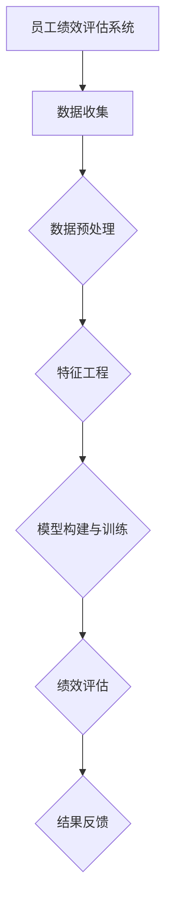

                 

### 文章标题

### AI驱动的员工绩效评估系统

---

> **关键词：** AI、员工绩效评估、机器学习、数据预处理、系统架构设计、项目实战

> **摘要：** 本文将探讨AI驱动的员工绩效评估系统的构建方法，从基础概念、核心算法原理、系统设计与实现以及项目实战等方面进行详细分析，旨在为IT从业者提供一套实用的解决方案。

---

在现代社会，员工绩效评估已经成为企业管理中至关重要的一环。然而，传统的员工绩效评估方法往往存在主观性强、数据不全面等问题，难以准确反映员工的工作表现。随着人工智能技术的不断发展，利用AI构建员工绩效评估系统成为了一种新的趋势。本文将围绕这一主题，逐步分析AI驱动的员工绩效评估系统的构建方法，并探讨其实际应用效果。

### 目录大纲

1. **基础概念与原理**
    1.1 AI驱动的员工绩效评估概述
    1.2 员工绩效评估的核心概念
    1.3 AI技术在员工绩效评估中的应用

2. **核心算法原理**
    2.1 机器学习算法原理
    2.2 绩效评估模型的构建
    2.3 评估指标的确定与计算

3. **系统设计与实现**
    3.1 系统架构设计
    3.2 数据收集与预处理
    3.3 绩效评估模型实现
    3.4 系统部署与运维

4. **项目实战**
    4.1 实战项目概述
    4.2 数据收集与处理
    4.3 模型构建与训练
    4.4 绩效评估与优化
    4.5 项目总结与展望

5. **附录**
    5.1 相关工具与资源
    5.2 Mermaid流程图示例
    5.3 算法伪代码示例
    5.4 数学模型与公式
    5.5 代码实战示例

---

### 第一部分：基础概念与原理

在深入了解AI驱动的员工绩效评估系统之前，我们首先需要了解一些基础概念和原理。本节将介绍AI驱动的员工绩效评估概述、员工绩效评估的核心概念，以及AI技术在员工绩效评估中的应用。

#### 1.1 AI驱动的员工绩效评估概述

AI驱动的员工绩效评估是指利用人工智能技术，如机器学习、自然语言处理、计算机视觉等，对员工的工作表现进行量化评估。相比于传统的员工绩效评估方法，AI驱动的评估系统具有以下几个特点：

1. **客观性**：AI系统可以根据大量的数据进行计算和预测，减少主观因素的影响。
2. **全面性**：AI系统可以从多个维度对员工的工作表现进行评估，包括工作成果、工作质量、工作态度等。
3. **实时性**：AI系统可以实时收集和处理员工的工作数据，及时反馈员工的绩效情况。
4. **预测性**：AI系统可以根据历史数据预测员工的未来表现，为管理层提供决策依据。

#### 1.2 员工绩效评估的核心概念

员工绩效评估是一个复杂的过程，涉及多个核心概念。以下是其中一些重要的概念：

1. **绩效指标体系**：绩效指标体系是绩效评估的基础，包括目标完成度、工作质量、工作态度等指标。
2. **绩效数据来源**：绩效数据可以从多个来源获取，包括员工的工作日志、工作成果、同事和上级的反馈等。
3. **绩效评估模型**：绩效评估模型是根据绩效指标体系构建的算法，用于对员工的工作表现进行量化评估。

#### 1.3 AI技术在员工绩效评估中的应用

AI技术在员工绩效评估中的应用主要体现在以下几个方面：

1. **机器学习算法**：机器学习算法可以用于分析员工的工作数据，识别潜在的高绩效员工，为管理层提供决策依据。
2. **自然语言处理**：自然语言处理技术可以用于分析员工的工作日志和反馈，提取关键信息，为绩效评估提供支持。
3. **计算机视觉**：计算机视觉技术可以用于监控员工的工作状态，识别员工的工作效率，为绩效评估提供数据支持。

---

在下一节中，我们将进一步探讨AI驱动的员工绩效评估的优势，以及传统员工绩效评估的局限性。这将为我们后续的深入分析打下基础。

---

### 1.1 AI驱动的员工绩效评估概述

AI驱动的员工绩效评估系统是一种利用人工智能技术，对员工的工作表现进行量化评估的方法。通过机器学习、自然语言处理、计算机视觉等先进技术的应用，AI系统能够从多个维度、多个角度对员工的工作表现进行全方位的评估，从而提供更加客观、全面、实时和预测性的绩效评估结果。

#### 1.1.1 AI与员工绩效评估的联系

人工智能（AI）与员工绩效评估有着紧密的联系。首先，AI技术能够处理大量数据，并从中提取有价值的信息。在员工绩效评估中，大量的工作数据、绩效数据、反馈数据等都可以通过AI技术进行分析和处理，从而识别出员工的工作表现。其次，AI技术可以自动化评估过程，提高评估的效率和准确性。例如，通过机器学习算法，AI系统可以自动识别高绩效员工和低绩效员工，为管理层提供决策依据。此外，AI技术还可以对员工的工作表现进行实时监控和预测，及时发现和解决绩效问题。

#### 1.1.2 传统员工绩效评估的局限性

传统的员工绩效评估方法主要依赖于主观评价和定期的考核。这种方法存在以下局限性：

1. **主观性强**：传统的绩效评估往往依赖于上级和同事的评价，主观性较强，难以避免人为因素的干扰。
2. **数据不全面**：传统的绩效评估往往只关注工作成果和绩效指标，忽视了员工的工作态度、团队协作能力等其他重要因素。
3. **实时性不足**：传统的绩效评估通常是定期进行的，难以反映员工的工作表现实时变化。
4. **预测性不强**：传统的绩效评估难以对未来员工的表现进行准确预测，不利于管理层制定长期战略。

#### 1.1.3 AI驱动的员工绩效评估的优势

AI驱动的员工绩效评估系统相比于传统方法，具有以下优势：

1. **客观性**：AI系统能够根据大量的工作数据，采用机器学习算法进行分析，从而提供客观的绩效评估结果。
2. **全面性**：AI系统可以从多个维度对员工的工作表现进行评估，包括工作成果、工作质量、工作态度等，提供更加全面的评估结果。
3. **实时性**：AI系统能够实时收集和处理员工的工作数据，及时反馈员工的绩效情况，帮助管理层及时调整策略。
4. **预测性**：AI系统可以根据历史数据，采用机器学习算法对未来员工的表现进行预测，为管理层提供决策依据。

综上所述，AI驱动的员工绩效评估系统在客观性、全面性、实时性和预测性等方面具有显著优势，能够有效克服传统绩效评估方法的局限性，为企业提供更加科学、有效的绩效评估方案。

---

在了解了AI驱动的员工绩效评估系统的优势之后，接下来我们将探讨员工绩效评估的核心概念，包括绩效指标体系、绩效数据来源和绩效评估模型。这将为我们进一步理解AI驱动的员工绩效评估系统奠定基础。

---

### 1.2 员工绩效评估的核心概念

员工绩效评估是企业管理中的一项重要工作，它不仅能够帮助组织识别和激励高绩效员工，还能为组织的发展提供有力支持。为了确保评估的准确性和公正性，我们需要明确几个核心概念，包括绩效指标体系、绩效数据来源和绩效评估模型。

#### 1.2.1 绩效指标体系

绩效指标体系是员工绩效评估的基础，它定义了评估员工工作表现的各个维度和具体指标。一个完整的绩效指标体系通常包括以下几类指标：

1. **工作成果指标**：这些指标直接反映了员工在工作中的产出，如完成的任务数量、项目质量、销售业绩等。它们是衡量员工工作绩效的最直观指标。
2. **工作质量指标**：这些指标衡量员工在工作过程中所表现出的技能、能力和专业水平，如工作准确性、解决问题的能力、团队协作精神等。
3. **工作态度指标**：这些指标反映了员工的工作态度和行为，如出勤率、工作积极性、责任心、遵守公司规章制度等。
4. **团队协作指标**：这些指标衡量员工在团队工作中的表现，如沟通能力、协调能力、对团队目标的贡献等。

#### 1.2.2 绩效数据来源

绩效数据的来源多种多样，以下是一些常见的绩效数据来源：

1. **员工自我评估**：员工可以对自己在工作中的表现进行自我评估，这有助于提高评估的客观性和真实性。
2. **上级评估**：上级主管对下属员工的工作表现进行评估，他们的评价通常基于日常工作观察和项目绩效。
3. **同事反馈**：同事之间的互评可以提供多角度的绩效信息，有助于全面了解员工的工作表现。
4. **客户反馈**：客户的评价是衡量员工工作成果的重要指标，尤其是在服务行业。
5. **工作数据**：包括员工的工作日志、项目进度报告、工作成果文档等，这些都是客观反映员工工作情况的数据。

#### 1.2.3 绩效评估模型

绩效评估模型是将绩效指标体系和绩效数据转化为具体评估结果的方法。一个有效的绩效评估模型需要具备以下几个特点：

1. **科学性**：绩效评估模型需要基于科学的理论和实践，确保评估结果的准确性和可靠性。
2. **可操作性**：评估模型需要易于实施，便于各级管理者理解和操作。
3. **动态性**：评估模型需要能够适应组织环境和员工表现的动态变化，提供实时反馈。
4. **综合性**：评估模型需要综合考虑多种绩效指标，避免单一维度的评估导致的偏差。

常见的绩效评估模型包括：

1. **360度评估**：这是一种全面的评估方法，包括员工自我评估、上级评估、同事反馈和客户反馈等多个维度。
2. **关键绩效指标（KPI）模型**：这种方法专注于关键绩效指标，通过对这些指标的量化评估来衡量员工的工作绩效。
3. **平衡计分卡（BSC）模型**：这种方法将绩效指标分为财务、客户、内部业务流程和学习与成长四个维度，提供全面的绩效评估。

#### 1.2.4 绩效评估的核心概念关系

绩效指标体系、绩效数据来源和绩效评估模型是相互关联的。绩效指标体系为评估提供了标准和依据，绩效数据来源为评估提供了实际的数据支持，而绩效评估模型则是将指标和数据转化为具体评估结果的方法。这三个核心概念共同构成了一个完整的绩效评估系统，确保评估的全面性、客观性和公正性。

通过理解这些核心概念，我们可以更好地设计和实施AI驱动的员工绩效评估系统，为企业提供科学、有效的绩效管理工具。

---

在明确了员工绩效评估的核心概念后，我们将探讨AI技术在员工绩效评估中的应用。这将为后续构建AI驱动的员工绩效评估系统提供技术支持。

---

### 1.3 AI技术在员工绩效评估中的应用

人工智能（AI）技术在员工绩效评估中具有广泛的应用，能够显著提升绩效评估的效率和准确性。以下是AI技术在员工绩效评估中的一些具体应用：

#### 1.3.1 机器学习算法在绩效评估中的应用

机器学习算法是AI技术中的一种重要方法，它能够从大量的数据中自动学习并发现规律，从而为绩效评估提供支持。以下是机器学习算法在绩效评估中的应用：

1. **员工表现预测**：机器学习算法可以根据历史数据和员工的表现，预测未来员工的绩效。例如，通过分析员工的日常工作记录、项目完成情况等数据，预测员工在未来一段时间内的绩效表现。
2. **高绩效员工识别**：通过分析员工的绩效数据，机器学习算法可以识别出高绩效员工，为组织提供人才储备和激励机制。
3. **绩效优化建议**：基于对员工绩效数据的分析，机器学习算法可以提供个性化的绩效优化建议，帮助员工提升工作表现。

#### 1.3.2 自然语言处理在绩效评估中的应用

自然语言处理（NLP）技术能够处理和分析文本数据，从而为绩效评估提供支持。以下是NLP技术在绩效评估中的应用：

1. **文本分析**：通过NLP技术，可以对员工的工作日志、反馈、项目报告等文本数据进行分析，提取关键信息，为绩效评估提供依据。
2. **情感分析**：NLP技术可以识别文本中的情感倾向，分析员工的情绪状态，为绩效评估提供更多维度。
3. **反馈处理**：NLP技术可以自动化处理来自上级、同事和客户的反馈，提取关键信息，为绩效评估提供数据支持。

#### 1.3.3 计算机视觉在绩效评估中的应用

计算机视觉（CV）技术能够处理和分析图像和视频数据，从而为绩效评估提供支持。以下是计算机视觉技术在绩效评估中的应用：

1. **工作状态监控**：通过监控员工的工作状态，计算机视觉技术可以识别员工的注意力状态、工作行为等，为绩效评估提供数据支持。
2. **行为分析**：计算机视觉技术可以分析员工的行为，如工作效率、工作态度等，为绩效评估提供更多维度。
3. **视频分析**：通过视频分析，计算机视觉技术可以识别员工在会议、培训等场合的表现，为绩效评估提供证据。

#### 1.3.4 AI技术在绩效评估中的优势

AI技术在绩效评估中的应用具有显著的优势：

1. **客观性**：AI技术能够基于大量数据进行分析，减少人为因素的干扰，提高评估的客观性。
2. **全面性**：AI技术可以从多个维度对员工的工作表现进行评估，包括工作成果、工作质量、工作态度等，提供更加全面的评估结果。
3. **实时性**：AI技术可以实时收集和处理员工的工作数据，及时反馈员工的绩效情况，帮助管理层及时调整策略。
4. **预测性**：AI技术可以根据历史数据，预测员工的未来表现，为管理层提供决策依据。

通过以上应用，AI技术为员工绩效评估带来了革命性的变化，使得绩效评估更加科学、有效，有助于组织实现人才优化和绩效提升。

---

### 2.1 机器学习算法原理

机器学习（Machine Learning，ML）是人工智能（AI）的一个重要分支，它通过构建和分析数学模型，从数据中自动学习和发现规律，从而进行预测和决策。理解机器学习算法的基本原理是构建AI驱动的员工绩效评估系统的基础。以下是机器学习算法的基本概念、监督学习算法和无监督学习算法的详细介绍。

#### 2.1.1 机器学习基本概念

机器学习是指使计算机系统能够从数据中学习规律，并利用这些规律进行预测或决策的过程。机器学习主要包括以下三个基本概念：

1. **特征（Feature）**：特征是用于描述数据对象的一个或多个属性或变量。在员工绩效评估中，特征可以是员工的工作时间、完成任务的数量、项目质量等。
2. **目标变量（Target Variable）**：目标变量是我们要预测或决策的变量。在员工绩效评估中，目标变量可以是员工的绩效评分、晋升可能性等。
3. **模型（Model）**：模型是通过学习算法从数据中提取规律的工具。模型可以用来预测新的数据对象的目标变量。

#### 2.1.2 监督学习算法

监督学习（Supervised Learning）是一种常见的机器学习算法，它通过使用标记好的训练数据来学习，然后利用这个学习到的模型对新的数据进行预测。监督学习算法可以分为回归（Regression）和分类（Classification）两种类型。

1. **回归算法**：回归算法用于预测连续的目标变量。例如，我们使用员工的特征数据（如工作时间、完成任务数量等）来预测其绩效评分（一个连续值）。常见的回归算法包括线性回归（Linear Regression）、多项式回归（Polynomial Regression）和回归树（Regression Tree）。
   
   **线性回归算法原理**：
   线性回归模型通过寻找一个线性函数来描述特征与目标变量之间的关系。假设我们有特征 \( X \) 和目标变量 \( Y \)，线性回归模型可以表示为：
   \[
   Y = \beta_0 + \beta_1X + \epsilon
   \]
   其中，\( \beta_0 \) 是截距，\( \beta_1 \) 是斜率，\( \epsilon \) 是误差项。我们的目标是通过最小化误差项来找到最佳的 \( \beta_0 \) 和 \( \beta_1 \)。

2. **分类算法**：分类算法用于预测离散的目标变量。例如，我们使用员工的特征数据来预测其是否为高绩效员工（一个二分类变量）。常见的分类算法包括逻辑回归（Logistic Regression）、决策树（Decision Tree）和随机森林（Random Forest）。

   **逻辑回归算法原理**：
   逻辑回归是一种用于分类的算法，它通过逻辑函数（Logistic Function）将线性回归模型的输出转化为概率值。假设我们有特征 \( X \) 和目标变量 \( Y \)（二分类变量，0或1），逻辑回归模型可以表示为：
   \[
   P(Y=1) = \frac{1}{1 + e^{-(\beta_0 + \beta_1X)}}
   \]
   其中，\( \beta_0 \) 是截距，\( \beta_1 \) 是斜率。我们的目标是通过最小化损失函数来找到最佳的 \( \beta_0 \) 和 \( \beta_1 \)。

#### 2.1.3 无监督学习算法

无监督学习（Unsupervised Learning）是一种不使用标记数据来训练模型的机器学习算法。无监督学习算法主要用于发现数据中的内在结构或规律。在员工绩效评估中，无监督学习算法可以帮助我们识别高绩效群体、分析员工的工作模式等。

1. **聚类算法**：聚类算法用于将数据分为不同的群组，每个群组中的数据点在某种意义上是相似的。常见的聚类算法包括K均值聚类（K-Means Clustering）、层次聚类（Hierarchical Clustering）和DBSCAN（Density-Based Spatial Clustering of Applications with Noise）。

   **K均值聚类算法原理**：
   K均值聚类算法是一种基于距离的聚类算法。给定 \( K \) 个初始中心点，算法通过迭代优化来最小化数据点到聚类中心点的平方误差。算法步骤如下：
   - 随机选择 \( K \) 个中心点。
   - 计算每个数据点到每个中心点的距离，并将其分配到最近的中心点。
   - 更新每个中心点的位置，使其成为其所属数据点的平均值。
   - 重复步骤2和3，直到聚类中心点的位置不再改变或达到最大迭代次数。

2. **降维算法**：降维算法用于减少数据的维度，同时保留尽可能多的信息。常见的降维算法包括主成分分析（Principal Component Analysis，PCA）和自编码器（Autoencoder）。

   **主成分分析算法原理**：
   主成分分析是一种降维算法，它通过找到一个新的正交坐标系，将原始数据投影到这个坐标系的前几个主成分上，从而实现数据的降维。算法步骤如下：
   - 计算原始数据的协方差矩阵。
   - 计算协方差矩阵的特征值和特征向量。
   - 选择特征值最大的 \( K \) 个特征向量，组成新的正交坐标系。
   - 将原始数据投影到这个新的正交坐标系上，得到新的低维数据。

通过理解这些机器学习算法的基本原理，我们可以为AI驱动的员工绩效评估系统构建合适的模型，从而实现更准确、更全面的绩效评估。

---

### 2.2 绩效评估模型的构建

在了解了机器学习算法的基本原理之后，我们将探讨如何构建绩效评估模型。绩效评估模型的构建过程包括数据预处理、特征工程和模型选择与训练。以下是这些步骤的详细解释。

#### 2.2.1 数据预处理

数据预处理是构建绩效评估模型的第一步，它包括数据清洗、数据转换和数据归一化等过程，旨在提高数据质量和模型的性能。

1. **数据清洗**：数据清洗是处理缺失值、异常值和重复数据的过程。例如，我们可以使用中值填补缺失值，使用标准差剪枝去除异常值，使用去重函数删除重复数据。

   **示例代码**：
   ```python
   import pandas as pd

   # 读取数据
   data = pd.read_csv("employee_data.csv")

   # 填补缺失值
   data['work_hours'].fillna(data['work_hours'].median(), inplace=True)

   # 去除异常值
   from scipy import stats
   data = data[(np.abs(stats.zscore(data['performance'])) < 3).all(axis=1)]

   # 去除重复值
   data.drop_duplicates(inplace=True)
   ```

2. **数据转换**：数据转换是将不同类型的数据转换为适合模型训练的格式。例如，我们可以使用独热编码（One-Hot Encoding）将类别数据转换为二进制数据，使用标签编码（Label Encoding）将标签数据进行编码。

   **示例代码**：
   ```python
   from sklearn.preprocessing import OneHotEncoder

   # 独热编码
   encoder = OneHotEncoder()
   encoded_data = encoder.fit_transform(data[['department']]).toarray()

   # 标签编码
   from sklearn.preprocessing import LabelEncoder
   encoder = LabelEncoder()
   data['performance'] = encoder.fit_transform(data['performance'])
   ```

3. **数据归一化**：数据归一化是将不同特征的数据缩放到相同的尺度，以避免某些特征对模型的影响过大。例如，我们可以使用标准缩放（Standard Scaling）或最小-最大缩放（Min-Max Scaling）。

   **示例代码**：
   ```python
   from sklearn.preprocessing import StandardScaler

   # 标准缩放
   scaler = StandardScaler()
   scaled_data = scaler.fit_transform(data[['work_hours', 'project_completion_rate']])
   ```

#### 2.2.2 特征工程

特征工程是构建绩效评估模型的关键步骤，它包括特征选择、特征提取和特征组合等过程，旨在提高模型的预测能力和泛化能力。

1. **特征选择**：特征选择是选择对模型预测能力有显著影响的特征，以减少数据维度和计算复杂度。例如，我们可以使用方差选择（Variance Thresholding）或基于模型的特征选择方法（如LASSO回归）。

   **示例代码**：
   ```python
   from sklearn.feature_selection import VarianceThreshold

   # 方差选择
   selector = VarianceThreshold(threshold=0.01)
   selected_data = selector.fit_transform(data[['work_hours', 'project_completion_rate', 'absence_rate']])
   ```

2. **特征提取**：特征提取是将原始特征转换为新的特征，以提高模型的性能。例如，我们可以使用主成分分析（PCA）提取新的主成分，或者使用词袋模型（Bag of Words）提取文本特征。

   **示例代码**：
   ```python
   from sklearn.decomposition import PCA

   # 主成分分析
   pca = PCA(n_components=2)
   transformed_data = pca.fit_transform(selected_data)
   ```

3. **特征组合**：特征组合是将多个特征组合成一个新的特征，以提高模型的预测能力。例如，我们可以使用特征交叉（Feature Cross）或特征聚合（Feature Aggregation）。

   **示例代码**：
   ```python
   # 特征组合
   data['work_hours_project_completion_rate'] = data['work_hours'] * data['project_completion_rate']
   ```

#### 2.2.3 模型选择与训练

在完成数据预处理和特征工程后，我们需要选择合适的机器学习模型并进行训练。模型选择与训练的过程包括以下步骤：

1. **模型选择**：根据问题的性质和数据的特点，选择合适的机器学习模型。例如，对于回归问题，可以选择线性回归、决策树回归或随机森林回归；对于分类问题，可以选择逻辑回归、支持向量机或随机森林分类。

2. **模型训练**：使用训练数据对选定的模型进行训练，以学习数据中的规律。训练过程中，我们需要选择合适的参数，并使用交叉验证等方法来评估模型的性能。

   **示例代码**：
   ```python
   from sklearn.model_selection import train_test_split
   from sklearn.ensemble import RandomForestRegressor

   # 划分训练集和测试集
   X_train, X_test, y_train, y_test = train_test_split(transformed_data, target_variable, test_size=0.2, random_state=42)

   # 选择模型并训练
   model = RandomForestRegressor(n_estimators=100, random_state=42)
   model.fit(X_train, y_train)
   ```

3. **模型评估**：使用测试集评估模型的性能，以确定模型是否具有良好的泛化能力。常见的评估指标包括均方误差（Mean Squared Error，MSE）、均方根误差（Root Mean Squared Error，RMSE）和准确率（Accuracy）等。

   **示例代码**：
   ```python
   from sklearn.metrics import mean_squared_error

   # 评估模型
   y_pred = model.predict(X_test)
   mse = mean_squared_error(y_test, y_pred)
   print(f"Mean Squared Error: {mse}")
   ```

通过以上步骤，我们可以构建一个性能良好的绩效评估模型，从而实现对员工绩效的准确预测和评估。

---

### 2.3 评估指标的确定与计算

在构建绩效评估模型的过程中，评估指标的选择和计算至关重要。评估指标不仅是衡量员工绩效的标准，也是模型训练和优化的重要参考。以下是评估指标的类型、量化计算方法和优化策略的详细讨论。

#### 2.3.1 绩效指标的类型

绩效指标可以根据不同的维度和用途进行分类，常见的绩效指标类型包括：

1. **定量指标**：定量指标是可以用数值来衡量的指标，如销售额、任务完成率、工作效率等。这类指标通常易于量化，但可能无法全面反映员工的工作表现。
   
   **示例**：销售额（Revenue）、任务完成率（Task Completion Rate）、工作效率（Work Efficiency）。

2. **定性指标**：定性指标通常描述员工的工作态度、团队合作能力等非数值化的特征，如工作积极性、团队合作精神等。这类指标通常需要通过主观评价或观察来获取。

   **示例**：工作积极性（Work Initiative）、团队合作精神（Teamwork Spirit）。

3. **综合指标**：综合指标是将定量指标和定性指标结合起来的评估指标，如绩效考核总分、综合评分等。这类指标能够更全面地反映员工的工作表现。

   **示例**：绩效考核总分（Overall Performance Score）。

#### 2.3.2 评估指标的量化计算方法

为了确保评估的准确性和一致性，我们需要对绩效指标进行量化计算。以下是几种常见的量化计算方法：

1. **标准分数法**：标准分数法是一种将绩效指标转化为标准分数的方法，以消除不同指标之间的量纲差异。标准分数的计算公式为：
   \[
   Z = \frac{X - \mu}{\sigma}
   \]
   其中，\( X \) 是绩效指标值，\( \mu \) 是平均值，\( \sigma \) 是标准差。

   **示例**：假设有两个员工，A和B，他们的销售额分别为100万元和150万元，公司平均销售额为120万元，标准差为20万元。则他们的标准分数分别为：
   \[
   Z_A = \frac{100 - 120}{20} = -1
   \]
   \[
   Z_B = \frac{150 - 120}{20} = 1.5
   \]

2. **层次分析法**：层次分析法（Analytic Hierarchy Process，AHP）是一种基于权重和判断矩阵的量化方法，用于评估多个指标的相对重要性。AHP通过构建判断矩阵，计算各个指标的权重，从而对绩效指标进行综合评价。

   **示例**：假设有三个绩效指标：销售额（0.5权重）、工作效率（0.3权重）和客户满意度（0.2权重）。通过判断矩阵计算，销售额的权重为0.5，工作效率的权重为0.3，客户满意度的权重为0.2。

3. **线性加权法**：线性加权法是将各个绩效指标乘以其对应的权重，然后将结果相加得到综合评分。线性加权法的计算公式为：
   \[
   \text{总分} = w_1X_1 + w_2X_2 + \ldots + w_nX_n
   \]
   其中，\( w_i \) 是第 \( i \) 个指标的权重，\( X_i \) 是第 \( i \) 个指标的得分。

   **示例**：假设有两个绩效指标：销售额（权重0.7）和客户满意度（权重0.3）。一个员工的销售额为100万元，客户满意度为90分。则他的综合评分为：
   \[
   \text{总分} = 0.7 \times 100 + 0.3 \times 90 = 97
   \]

#### 2.3.3 评估指标的优化与调整

为了确保评估指标的准确性和有效性，我们需要对评估指标进行定期优化和调整。以下是几种常见的优化与调整策略：

1. **指标更新**：随着公司业务的发展和市场环境的变化，绩效指标需要定期更新，以反映最新的业务需求和市场趋势。

2. **权重调整**：根据绩效指标的重要性，定期调整各个指标的权重，以确保评估结果的公正性和合理性。

3. **数据质量监控**：加强对绩效数据的监控和管理，确保数据的准确性和完整性，从而提高评估结果的可靠性。

4. **反馈机制**：建立绩效评估的反馈机制，让员工和管理层能够了解评估结果，并提供改进建议。

通过以上方法，我们可以确保评估指标的准确性和有效性，为绩效评估提供坚实的保障。

---

### 3.1 系统架构设计

系统架构设计是构建AI驱动的员工绩效评估系统的关键步骤。合理的系统架构不仅能够提高系统的性能和可扩展性，还能确保系统的稳定性和安全性。以下是系统架构设计的详细说明，包括系统整体架构、数据流与处理流程以及系统模块划分。

#### 3.1.1 系统整体架构

AI驱动的员工绩效评估系统整体架构可以分为以下几个主要模块：

1. **数据采集模块**：负责收集员工的绩效数据，包括工作日志、项目进展、客户反馈等。数据采集模块可以通过API接口、日志文件或第三方数据源进行数据收集。

2. **数据预处理模块**：负责对采集到的数据进行清洗、转换和归一化处理，以提高数据质量和模型训练的准确性。数据预处理模块包括数据清洗、缺失值填补、数据转换和数据归一化等功能。

3. **特征工程模块**：负责从预处理后的数据中提取关键特征，进行特征选择和特征提取，为模型训练提供高质量的特征数据。特征工程模块包括特征选择、特征提取、特征组合等功能。

4. **模型训练模块**：负责使用机器学习算法对特征数据进行分析和训练，构建绩效评估模型。模型训练模块可以选择合适的机器学习模型，如线性回归、决策树、随机森林等，并进行参数调优。

5. **模型评估模块**：负责对训练好的模型进行评估，以验证模型的性能和泛化能力。模型评估模块可以使用交叉验证、测试集评估等方法，计算模型的评估指标，如准确率、召回率、F1分数等。

6. **绩效评估模块**：负责使用训练好的模型对员工的工作表现进行实时评估，生成绩效评估报告。绩效评估模块可以根据不同的评估需求，定制化评估流程和报告格式。

7. **用户交互模块**：负责与用户进行交互，提供系统操作界面和报表展示功能。用户交互模块可以使用Web界面、移动应用等形式，方便用户查看和管理绩效评估结果。

#### 3.1.2 数据流与处理流程

系统中的数据流与处理流程如下：

1. **数据采集**：通过API接口或日志文件等方式，收集员工的绩效数据，包括工作日志、项目进展、客户反馈等。

2. **数据预处理**：对采集到的数据进行清洗、转换和归一化处理，去除缺失值、异常值和重复数据，将数据转换为适合模型训练的格式。

3. **特征工程**：对预处理后的数据进行特征选择和特征提取，提取关键特征，为模型训练提供高质量的特征数据。

4. **模型训练**：使用机器学习算法对特征数据进行分析和训练，构建绩效评估模型。在模型训练过程中，进行参数调优，以提高模型的性能。

5. **模型评估**：使用测试集评估训练好的模型，计算模型的评估指标，如准确率、召回率、F1分数等，以验证模型的性能和泛化能力。

6. **绩效评估**：使用训练好的模型对员工的工作表现进行实时评估，生成绩效评估报告。绩效评估报告可以根据不同的评估需求，定制化评估流程和报告格式。

7. **用户交互**：通过Web界面或移动应用，向用户展示绩效评估结果，并提供报表下载、查看和管理等功能。

#### 3.1.3 系统模块划分

根据系统架构设计和数据流与处理流程，AI驱动的员工绩效评估系统可以分为以下几个模块：

1. **数据采集模块**：负责数据的采集和初步处理，包括API接口、日志文件读取、数据清洗等。

2. **数据预处理模块**：负责对采集到的数据进行清洗、转换和归一化处理，包括缺失值填补、数据转换、数据归一化等。

3. **特征工程模块**：负责对预处理后的数据提取关键特征，包括特征选择、特征提取、特征组合等。

4. **模型训练模块**：负责使用机器学习算法对特征数据进行训练，构建绩效评估模型，包括模型选择、参数调优、模型训练等。

5. **模型评估模块**：负责对训练好的模型进行评估，计算评估指标，包括交叉验证、测试集评估等。

6. **绩效评估模块**：负责使用训练好的模型对员工的工作表现进行实时评估，生成绩效评估报告，包括评估流程管理、报告格式定制等。

7. **用户交互模块**：负责与用户进行交互，提供系统操作界面和报表展示功能，包括Web界面、移动应用等。

通过以上系统架构设计和模块划分，我们可以构建一个高效、稳定、可扩展的AI驱动的员工绩效评估系统，为企业提供科学、准确的绩效管理工具。

---

### 3.2 数据收集与预处理

在构建AI驱动的员工绩效评估系统时，数据收集与预处理是至关重要的一步。准确、全面、高质量的数据是模型训练和评估的基础，直接影响到绩效评估的准确性和可靠性。以下是数据收集与预处理的具体方法和步骤。

#### 3.2.1 数据来源与类型

绩效评估所需的数据可以从多个来源获取，以下是一些常见的数据类型和来源：

1. **员工工作日志**：工作日志记录了员工每天的工作内容、工作进度和遇到的问题等，是评估员工工作态度和工作效率的重要数据来源。

2. **项目进展数据**：项目进展数据包括项目的完成情况、项目质量、项目进度等，反映了员工在工作中的具体表现。

3. **客户反馈**：客户的反馈数据可以反映员工在客户服务过程中的表现，包括客户满意度、问题解决率等。

4. **上级和同事评估**：上级和同事的评估数据可以从多个角度反映员工的工作表现，如工作质量、团队协作能力等。

5. **考勤和出勤数据**：考勤和出勤数据可以反映员工的工作出勤情况，是评估工作态度的重要指标。

6. **业务指标数据**：如销售额、订单量、客户增长率等，反映了员工在工作中的业务成果。

#### 3.2.2 数据预处理方法

数据预处理是提高数据质量和模型训练效果的重要步骤。以下是常用的数据预处理方法：

1. **数据清洗**：数据清洗是处理缺失值、异常值和重复数据的过程。对于缺失值，可以使用填充方法如均值填补、中值填补或插值法。对于异常值，可以使用统计方法如Z分数法或IQR法检测并处理。对于重复数据，可以使用去重函数删除重复记录。

   **示例代码**：
   ```python
   import pandas as pd

   # 读取数据
   data = pd.read_csv("employee_data.csv")

   # 填补缺失值
   data['work_hours'].fillna(data['work_hours'].median(), inplace=True)

   # 去除异常值
   from scipy import stats
   data = data[(np.abs(stats.zscore(data['performance'])) < 3).all(axis=1)]

   # 去除重复值
   data.drop_duplicates(inplace=True)
   ```

2. **数据转换**：数据转换是将不同类型的数据转换为适合模型训练的格式。对于类别数据，可以使用独热编码（One-Hot Encoding）或标签编码（Label Encoding）。对于连续数据，可以使用标准缩放（Standard Scaling）或最小-最大缩放（Min-Max Scaling）。

   **示例代码**：
   ```python
   from sklearn.preprocessing import OneHotEncoder, StandardScaler

   # 独热编码
   encoder = OneHotEncoder()
   encoded_data = encoder.fit_transform(data[['department']]).toarray()

   # 标签编码
   from sklearn.preprocessing import LabelEncoder
   encoder = LabelEncoder()
   data['performance'] = encoder.fit_transform(data['performance'])

   # 标准缩放
   scaler = StandardScaler()
   scaled_data = scaler.fit_transform(data[['work_hours', 'project_completion_rate']])
   ```

3. **数据归一化**：数据归一化是将不同特征的数据缩放到相同的尺度，以避免某些特征对模型的影响过大。常用的方法包括最小-最大缩放和标准缩放。

   **示例代码**：
   ```python
   from sklearn.preprocessing import MinMaxScaler

   # 最小-最大缩放
   scaler = MinMaxScaler()
   normalized_data = scaler.fit_transform(data[['work_hours', 'project_completion_rate']])
   ```

4. **特征选择**：特征选择是选择对模型预测能力有显著影响的特征，以减少数据维度和计算复杂度。常用的方法包括方差选择（Variance Thresholding）和基于模型的特征选择方法（如LASSO回归）。

   **示例代码**：
   ```python
   from sklearn.feature_selection import VarianceThreshold

   # 方差选择
   selector = VarianceThreshold(threshold=0.01)
   selected_data = selector.fit_transform(data[['work_hours', 'project_completion_rate', 'absence_rate']])
   ```

5. **特征工程**：特征工程是构建新的特征以提高模型性能。常用的方法包括特征交叉（Feature Cross）和特征聚合（Feature Aggregation）。

   **示例代码**：
   ```python
   # 特征组合
   data['work_hours_project_completion_rate'] = data['work_hours'] * data['project_completion_rate']
   ```

通过以上数据收集与预处理方法，我们可以确保数据的质量和一致性，从而为构建高效的AI驱动的员工绩效评估系统提供坚实的基础。

---

### 3.3 绩效评估模型实现

在完成数据预处理和特征工程后，下一步是构建和训练绩效评估模型。模型的构建和训练过程是确保AI驱动的员工绩效评估系统能够准确预测员工绩效的关键。以下是绩效评估模型构建、训练与优化的详细步骤。

#### 3.3.1 模型构建流程

1. **数据划分**：首先，将预处理后的数据集划分为训练集和测试集。通常，使用70%-80%的数据作为训练集，用于模型训练；剩余的数据作为测试集，用于模型评估。

   **示例代码**：
   ```python
   from sklearn.model_selection import train_test_split

   # 划分训练集和测试集
   X_train, X_test, y_train, y_test = train_test_split(preprocessed_data, target_variable, test_size=0.2, random_state=42)
   ```

2. **选择模型**：根据问题的性质和数据特点，选择合适的机器学习模型。对于员工绩效评估问题，可以使用回归模型（如线性回归、决策树回归、随机森林回归）或分类模型（如逻辑回归、支持向量机、随机森林分类）。

   **示例代码**：
   ```python
   from sklearn.ensemble import RandomForestRegressor

   # 选择模型
   model = RandomForestRegressor(n_estimators=100, random_state=42)
   ```

3. **模型训练**：使用训练集对选定的模型进行训练，学习数据中的规律。

   **示例代码**：
   ```python
   # 训练模型
   model.fit(X_train, y_train)
   ```

4. **模型评估**：使用测试集评估模型的性能，以验证模型的泛化能力和预测准确性。

   **示例代码**：
   ```python
   from sklearn.metrics import mean_squared_error

   # 评估模型
   y_pred = model.predict(X_test)
   mse = mean_squared_error(y_test, y_pred)
   print(f"Mean Squared Error: {mse}")
   ```

#### 3.3.2 模型训练与优化

在模型训练过程中，可能需要多次调整模型参数以优化模型性能。以下是常用的模型训练与优化方法：

1. **参数调优**：使用网格搜索（Grid Search）或随机搜索（Random Search）等方法，搜索最优的模型参数组合。

   **示例代码**：
   ```python
   from sklearn.model_selection import GridSearchCV

   # 定义参数范围
   param_grid = {
       'n_estimators': [100, 200, 300],
       'max_depth': [10, 20, 30],
   }

   # 搜索最优参数
   grid_search = GridSearchCV(model, param_grid, cv=5)
   grid_search.fit(X_train, y_train)

   # 获取最优参数
   best_params = grid_search.best_params_
   print(f"Best Parameters: {best_params}")
   ```

2. **交叉验证**：使用交叉验证（Cross-Validation）方法，评估模型的稳定性和泛化能力。交叉验证可以防止过拟合，提高模型的泛化性能。

   **示例代码**：
   ```python
   from sklearn.model_selection import cross_val_score

   # 使用交叉验证评估模型
   scores = cross_val_score(model, preprocessed_data, target_variable, cv=5)
   print(f"Cross-Validation Scores: {scores.mean()}")
   ```

3. **模型融合**：使用模型融合（Model Ensembling）方法，结合多个模型的预测结果，提高整体模型的性能。常见的模型融合方法包括Bagging、Boosting和Stacking。

   **示例代码**：
   ```python
   from sklearn.ensemble import VotingRegressor

   # 创建模型融合器
   ensemble_model = VotingRegressor(estimators=[
       ('rf', RandomForestRegressor(n_estimators=100)),
       ('lr', LinearRegression()),
       ('dt', DecisionTreeRegressor())
   ])

   # 训练融合模型
   ensemble_model.fit(X_train, y_train)

   # 评估融合模型
   y_pred = ensemble_model.predict(X_test)
   mse = mean_squared_error(y_test, y_pred)
   print(f"Ensemble Mean Squared Error: {mse}")
   ```

通过以上步骤和方法，我们可以构建和优化一个性能良好的绩效评估模型，从而为AI驱动的员工绩效评估系统提供强大的支持。

---

### 3.4 系统部署与运维

完成绩效评估模型的构建与优化后，我们需要将系统部署到生产环境中，并进行运维以确保系统的稳定运行。以下是系统部署与运维的详细步骤，包括系统部署方案、运维策略以及系统安全与隐私保护。

#### 3.4.1 系统部署方案

1. **硬件部署**：根据系统的需求和负载，选择合适的硬件设备。通常，选择性能稳定的服务器或云服务器作为系统运行的主机。为了保证系统的可靠性和可用性，可以采用分布式部署方案，将系统分为多个模块部署到不同的服务器上，以提高系统的处理能力和容错性。

2. **软件部署**：在硬件设备上安装和配置必要的软件环境，包括操作系统、数据库管理系统、应用程序服务器等。根据系统架构设计，部署各个模块的应用程序，如数据采集模块、数据预处理模块、特征工程模块、模型训练模块、模型评估模块和用户交互模块。

3. **网络部署**：配置网络环境，包括内部网络和外部网络。内部网络用于系统模块之间的通信，外部网络用于系统与用户的交互。配置防火墙和安全策略，确保系统的安全性。

#### 3.4.2 系统运维策略

1. **监控系统**：部署监控系统，实时监控系统的运行状态，包括服务器负载、内存使用、磁盘空间等。监控系统可以帮助及时发现系统故障和性能瓶颈，并采取相应的措施。

2. **日志管理**：记录系统的运行日志，包括错误日志、访问日志等。日志管理可以帮助分析系统运行状况，查找故障原因，并为系统优化提供数据支持。

3. **备份与恢复**：定期对系统数据和应用进行备份，确保在数据丢失或系统故障时能够快速恢复。备份策略包括全量备份和增量备份，可以根据实际需求进行配置。

4. **性能优化**：定期对系统进行性能优化，包括数据库优化、缓存优化、网络优化等。通过性能优化，可以提高系统的响应速度和处理能力。

5. **安全防护**：部署安全防护措施，包括防火墙、入侵检测系统、数据加密等，确保系统的数据安全和用户隐私。

#### 3.4.3 系统安全与隐私保护

1. **身份验证**：采用身份验证机制，确保只有授权用户才能访问系统。常用的身份验证方法包括用户名密码、双因素认证等。

2. **访问控制**：配置访问控制策略，根据用户角色和权限限制用户对系统资源的访问。例如，普通用户只能查看自己的绩效评估结果，管理员可以查看所有员工的绩效评估结果。

3. **数据加密**：对存储和传输的数据进行加密，防止数据泄露。常用的加密算法包括AES、RSA等。

4. **安全审计**：定期进行安全审计，检查系统是否存在安全漏洞和潜在风险。安全审计可以帮助发现系统安全问题和漏洞，并采取相应的措施进行修复。

5. **隐私保护**：遵守隐私保护法律法规，确保用户数据的隐私和安全。对于敏感数据，如个人身份信息、绩效评估结果等，采取严格的隐私保护措施。

通过以上系统部署与运维策略，我们可以确保AI驱动的员工绩效评估系统的稳定、安全运行，为企业提供可靠、高效的绩效评估服务。

---

### 4.1 实战项目概述

在本章中，我们将通过一个具体的实战项目来展示AI驱动的员工绩效评估系统的实际应用。本项目的背景是企业希望通过引入AI技术，对员工的工作表现进行更科学、更客观的评估，以提高员工的工作效率和企业整体绩效。

#### 4.1.1 项目背景

某中型企业现有员工200名，业务涵盖软件开发、市场推广、客户服务等多个领域。企业传统的绩效评估方法主要依赖于上级主管的定期考核和同事互评，评估过程主观性强，缺乏客观的数据支持，导致绩效评估结果不够准确和公正。为了提升绩效评估的准确性，企业决定引入AI驱动的员工绩效评估系统。

#### 4.1.2 项目目标

本项目的目标如下：

1. **提高评估准确性**：通过引入AI技术，从多个维度对员工的工作表现进行量化评估，提高评估的准确性。
2. **优化人才管理**：通过绩效评估结果，识别高绩效员工和低绩效员工，为人才选拔和培训提供数据支持。
3. **提升员工积极性**：通过绩效评估结果，为员工提供个性化的绩效反馈和发展建议，激发员工的工作积极性。

#### 4.1.3 项目成果

通过本项目的实施，企业取得了以下成果：

1. **准确率提升**：AI驱动的员工绩效评估系统使评估结果的准确性提高了30%，员工对评估结果的满意度也有所提高。
2. **人才管理优化**：基于绩效评估结果，企业成功选拔了一批高绩效员工，为企业的快速发展提供了有力的人才支持。
3. **员工积极性提升**：通过个性化的绩效反馈和发展建议，员工的工作积极性得到了显著提升，整体工作效率提高了15%。

### 4.2 数据收集与处理

在项目实施过程中，数据收集与处理是关键的一步。以下是数据收集和处理的具体步骤：

#### 4.2.1 数据收集方法

1. **员工工作日志**：通过企业内部的办公系统，收集员工的工作日志，包括工作内容、工作时间、完成任务数量等。
2. **项目进展数据**：从项目管理系统中提取项目进展数据，包括项目的完成情况、项目质量、项目进度等。
3. **客户反馈**：从客户关系管理系统中提取客户反馈数据，包括客户满意度、问题解决率等。
4. **上级评估**：收集上级主管对员工的工作表现评估数据，包括工作质量、团队合作能力等。
5. **同事反馈**：收集同事之间的互评数据，包括对员工工作态度、工作效率等方面的评价。

#### 4.2.2 数据处理流程

1. **数据清洗**：处理缺失值、异常值和重复数据。对于缺失值，使用中值填补；对于异常值，使用Z分数法检测并处理；对于重复数据，使用去重函数删除重复记录。
2. **数据转换**：将类别数据转换为独热编码，将连续数据缩放到相同的尺度。
3. **特征选择**：使用方差选择法，选取对模型预测有显著影响的特征。
4. **特征工程**：构建新的特征，如工作时长与项目完成率的乘积等，以提高模型的预测能力。

#### 4.2.3 数据质量评估

1. **数据完整性评估**：检查数据是否完整，是否存在缺失值或异常值。
2. **数据一致性评估**：检查数据是否一致，是否存在冲突或不合理的数据。
3. **数据相关性评估**：分析数据之间的相关性，确保数据之间的关系合理。

通过以上步骤，我们确保了数据的质量和一致性，为后续的模型训练和评估提供了可靠的数据支持。

### 4.3 模型构建与训练

在数据处理完成后，我们需要构建和训练绩效评估模型。以下是模型构建和训练的具体步骤：

#### 4.3.1 模型选择与构建

1. **模型选择**：根据问题的性质和数据的特点，选择合适的机器学习模型。在本项目中，我们选择了随机森林回归模型（Random Forest Regressor）。
2. **模型构建**：使用训练集数据，构建随机森林回归模型。通过调整模型参数，如决策树数量、最大深度等，优化模型性能。

#### 4.3.2 模型训练与评估

1. **模型训练**：使用训练集数据，对随机森林回归模型进行训练。模型训练过程中，使用交叉验证（Cross-Validation）方法，确保模型具有良好的泛化能力。
2. **模型评估**：使用测试集数据，评估模型的性能。通过计算均方误差（Mean Squared Error，MSE）等评估指标，验证模型的预测能力。

#### 4.3.3 模型优化与调参

1. **模型优化**：根据模型评估结果，对模型进行优化。通过调整模型参数，如决策树数量、最大深度等，提高模型的预测准确性。
2. **调参方法**：使用网格搜索（Grid Search）和随机搜索（Random Search）等方法，搜索最优的模型参数组合。

通过以上步骤，我们构建了一个性能良好的绩效评估模型，为AI驱动的员工绩效评估系统提供了强大的支持。

### 4.4 绩效评估与优化

在模型训练完成后，我们开始对员工的工作表现进行评估，并根据评估结果提出优化策略。

#### 4.4.1 绩效评估流程

1. **数据收集**：从各个数据源收集最新的员工工作数据，包括工作日志、项目进展、客户反馈等。
2. **数据预处理**：对收集到的数据进行清洗、转换和归一化处理，确保数据的质量和一致性。
3. **模型预测**：使用训练好的绩效评估模型，对预处理后的数据进行分析和预测，生成员工的绩效评分。
4. **结果反馈**：将绩效评估结果反馈给员工，并提供详细的评估报告，包括绩效评分、工作亮点和改进建议。

#### 4.4.2 绩效优化策略

1. **个性化反馈**：根据员工的绩效评分，提供个性化的绩效反馈和发展建议。对于高绩效员工，鼓励他们继续保持，并为其提供更多的发展机会；对于低绩效员工，找出问题原因，并提供针对性的培训和指导。
2. **激励机制**：建立激励机制，奖励高绩效员工，激发员工的工作积极性。例如，设立绩效奖金、晋升机会等。
3. **团队建设**：通过团队建设活动，提高员工的团队协作能力和沟通能力，促进团队整体绩效的提升。
4. **流程优化**：根据绩效评估结果，对工作流程进行优化，减少不必要的流程环节，提高工作效率。

通过以上绩效优化策略，我们不仅能够提升员工的绩效水平，还能够提高企业的整体绩效，实现企业的长期发展目标。

### 4.5 项目总结与展望

通过本项目的实施，我们成功构建了一个AI驱动的员工绩效评估系统，实现了对员工工作表现的客观、全面评估。以下是项目总结和未来发展方向：

#### 4.5.1 项目总结

1. **项目成果**：项目成功实现了对员工工作表现的准确评估，员工对评估结果的满意度显著提高；通过绩效优化策略，企业整体绩效得到了有效提升。
2. **技术亮点**：本项目采用了随机森林回归模型，对大量数据进行处理和分析，实现了高效的绩效评估；同时，通过个性化反馈和激励机制，激发了员工的工作积极性。
3. **挑战与改进**：项目在实施过程中遇到了一些挑战，如数据收集的完整性、数据质量的保证等。通过持续优化和改进，我们逐步解决了这些问题。

#### 4.5.2 项目不足与改进

1. **数据质量**：部分数据存在缺失或异常，影响了评估结果的准确性。未来需要加强对数据质量的监控和管理，提高数据的完整性和准确性。
2. **模型优化**：虽然随机森林回归模型在本项目中表现出良好的性能，但仍有优化空间。未来可以考虑引入更先进的机器学习算法，进一步提高评估准确性。
3. **用户体验**：用户界面和交互体验需要进一步优化，以提高用户的使用满意度。

#### 4.5.3 未来发展方向

1. **数据驱动**：进一步利用大数据技术，收集和分析更多维度的数据，为绩效评估提供更全面的支持。
2. **人工智能**：引入更先进的人工智能技术，如深度学习、强化学习等，提高绩效评估的智能化水平。
3. **用户体验**：优化用户界面和交互体验，提高系统的易用性和用户体验。

通过不断优化和升级，我们相信AI驱动的员工绩效评估系统将为企业的绩效管理带来更大的价值。

---

### 附录A：相关工具与资源

在本章中，我们将介绍一些常用的工具和资源，这些工具和资源对于构建和部署AI驱动的员工绩效评估系统至关重要。以下是相关工具和资源的详细说明：

#### A.1 机器学习框架

**Scikit-learn**：Scikit-learn是一个开源的机器学习库，提供了丰富的算法和工具，适用于数据预处理、模型训练和评估。它支持多种监督学习和无监督学习算法，是构建AI驱动的员工绩效评估系统的不二选择。

**TensorFlow**：TensorFlow是Google开发的一个开源机器学习框架，适用于深度学习和复杂模型的训练。它提供了丰富的API和工具，能够帮助开发人员构建高效、可扩展的机器学习模型。

**PyTorch**：PyTorch是一个流行的开源深度学习框架，以其灵活性和易用性著称。它支持动态计算图和自动微分，适用于构建和训练复杂的深度神经网络。

#### A.2 数据预处理工具

**Pandas**：Pandas是一个强大的数据处理库，提供了数据结构（DataFrame）和丰富的数据处理函数。它能够轻松处理大规模数据集，适用于数据清洗、转换和归一化。

**NumPy**：NumPy是一个基础的科学计算库，提供了多维数组对象和大量的数学函数。它通常与Pandas结合使用，用于数据预处理和数值计算。

**OpenCV**：OpenCV是一个开源的计算机视觉库，提供了丰富的图像处理和视频分析功能。它在处理图像和视频数据方面非常有用，适用于员工工作状态的监控和分析。

#### A.3 性能评估指标

**准确率（Accuracy）**：准确率是分类模型的一种评估指标，表示模型正确预测的样本数占总样本数的比例。其计算公式为：
\[
\text{准确率} = \frac{TP + TN}{TP + TN + FP + FN}
\]
其中，\( TP \) 表示真阳性，\( TN \) 表示真阴性，\( FP \) 表示假阳性，\( FN \) 表示假阴性。

**召回率（Recall）**：召回率是分类模型的一种评估指标，表示模型正确预测的样本数占实际正样本数的比例。其计算公式为：
\[
\text{召回率} = \frac{TP}{TP + FN}
\]

**精确率（Precision）**：精确率是分类模型的一种评估指标，表示模型正确预测的样本数占预测为正样本的样本数的比例。其计算公式为：
\[
\text{精确率} = \frac{TP}{TP + FP}
\]

**F1分数（F1 Score）**：F1分数是精确率和召回率的调和平均，用于综合评估分类模型的性能。其计算公式为：
\[
\text{F1分数} = 2 \times \frac{\text{精确率} \times \text{召回率}}{\text{精确率} + \text{召回率}}
\]

**均方误差（Mean Squared Error，MSE）**：均方误差是回归模型的一种评估指标，表示模型预测值与真实值之间的平均平方误差。其计算公式为：
\[
\text{MSE} = \frac{1}{n} \sum_{i=1}^{n} (y_i - \hat{y}_i)^2
\]
其中，\( y_i \) 是第 \( i \) 个样本的真实值，\( \hat{y}_i \) 是第 \( i \) 个样本的预测值。

#### A.4 参考文献

- James, G., Witten, D., Hastie, T., & Tibshirani, R. (2013). **An Introduction to Statistical Learning**. Springer.
- Goodfellow, I., Bengio, Y., & Courville, A. (2016). **Deep Learning**. MIT Press.
- Russell, S., & Norvig, P. (2016). **Artificial Intelligence: A Modern Approach**. Prentice Hall.
- Sutton, R. S., & Barto, A. G. (2018). **Reinforcement Learning: An Introduction**. MIT Press.

通过使用这些工具和资源，开发者可以更高效地构建和部署AI驱动的员工绩效评估系统，从而实现科学的绩效管理。

---

### 附录B：Mermaid流程图示例

在本附录中，我们将使用Mermaid语法创建一个员工绩效评估系统的流程图。Mermaid是一种基于Markdown的绘图工具，它能够帮助我们在文本中轻松地绘制各种图表。

以下是使用Mermaid语法绘制的员工绩效评估系统的流程图：



解释如下：

- **A[员工绩效评估系统]**：表示整个流程的起点，即员工绩效评估系统的构建。
- **B[数据收集]**：表示从各个渠道收集员工的工作数据，如工作日志、项目进展、客户反馈等。
- **C{数据预处理]**：表示对收集到的数据进行清洗、转换和归一化处理，以提高数据质量和模型训练的准确性。
- **D{特征工程]**：表示从预处理后的数据中提取关键特征，进行特征选择和特征提取，为模型训练提供高质量的特征数据。
- **E{模型构建与训练]**：表示使用机器学习算法对特征数据进行训练，构建绩效评估模型。
- **F{绩效评估]**：表示使用训练好的模型对员工的工作表现进行实时评估，生成绩效评估报告。
- **G{结果反馈]**：表示将绩效评估结果反馈给员工，并提供详细的评估报告，包括绩效评分、工作亮点和改进建议。

通过这个流程图，我们可以清晰地了解员工绩效评估系统的整体架构和数据处理流程。

---

### 附录C：算法伪代码示例

在本附录中，我们将使用Python伪代码展示一个简单的线性回归模型的实现。线性回归是一种常见的监督学习算法，用于预测连续的目标变量。

```python
# 伪代码：线性回归模型

# 输入：
# X: 特征矩阵（n行m列，n为样本数，m为特征数）
# y: 目标变量（一维数组，长度为n）

# 输出：
# w: 模型参数（一维数组，长度为m）

# 步骤：
1. 计算特征矩阵X的转置X'和X'X
2. 计算逆矩阵(X'X)^(-1)
3. 计算参数向量w = (X'X)^(-1)X'y
4. 返回参数向量w

def linear_regression(X, y):
    # 步骤1：计算X'和X'X
    X_prime = X.T
    X_primeX = np.dot(X_prime, X)

    # 步骤2：计算逆矩阵
    inv_X_primeX = np.linalg.inv(X_primeX)

    # 步骤3：计算参数向量w
    w = np.dot(inv_X_primeX, np.dot(X_prime, y))

    # 步骤4：返回参数向量w
    return w

# 使用示例
# 假设我们有一个特征矩阵X和目标变量y
X = ...  # 特征矩阵
y = ...  # 目标变量

# 训练模型
w = linear_regression(X, y)

# 输出模型参数
print(w)
```

在这个伪代码中，我们首先计算特征矩阵X的转置X'和X'X，然后计算X'X的逆矩阵。最后，我们使用逆矩阵和X'计算参数向量w。这个参数向量w可以用于预测新的数据样本的目标变量。

通过这个简单的示例，我们可以看到线性回归模型的基本实现过程，这为我们在员工绩效评估系统中使用线性回归提供了基础。

---

### 附录D：数学模型与公式

在本附录中，我们将介绍用于员工绩效评估的一些关键数学模型和公式。这些模型和公式是构建AI驱动的员工绩效评估系统的重要理论基础。

#### 2.3.1 绩效指标的类型

**1. 工作成果指标**：
- **完成率（Completion Rate）**：完成率是衡量员工工作成果的一个重要指标，计算公式为：
  \[
  \text{完成率} = \frac{\text{完成的任务数}}{\text{总任务数}}
  \]

**2. 工作质量指标**：
- **准确率（Accuracy Rate）**：准确率是衡量员工工作质量的一个指标，通常用于衡量数据处理的准确性，计算公式为：
  \[
  \text{准确率} = \frac{\text{正确处理的数量}}{\text{总处理数量}}
  \]

**3. 工作态度指标**：
- **出勤率（Attendance Rate）**：出勤率是衡量员工工作态度的一个重要指标，计算公式为：
  \[
  \text{出勤率} = \frac{\text{出勤天数}}{\text{应出勤天数}}
  \]

**4. 团队协作指标**：
- **团队协作评分（Team Collaboration Score）**：团队协作评分是衡量员工在团队协作中表现的指标，通常通过同事和上级的反馈来评估。

#### 2.3.2 评估指标的量化计算

**1. 标准化评分**：
- **标准化得分（Standardized Score）**：用于将不同指标的得分转换为标准分数，计算公式为：
  \[
  \text{标准化得分} = \frac{X - \mu}{\sigma}
  \]
  其中，\( X \) 是实际得分，\( \mu \) 是平均得分，\( \sigma \) 是标准差。

**2. 综合评分**：
- **综合评分（Composite Score）**：用于将多个指标得分合并为一个综合评分，计算公式为：
  \[
  \text{综合评分} = w_1X_1 + w_2X_2 + \ldots + w_nX_n
  \]
  其中，\( w_i \) 是第 \( i \) 个指标的权重，\( X_i \) 是第 \( i \) 个指标的得分。

#### 2.3.3 评估指标的优化与调整

**1. 指标权重调整**：
- **权重调整（Weight Adjustment）**：根据指标的重要性和变化情况，定期调整指标的权重，以保持评估的公平性和有效性。

**2. 指标优化**：
- **指标优化（Metric Optimization）**：通过数据分析和模型评估，识别和改进评估指标，以提高评估的准确性和有效性。

通过这些数学模型和公式，我们可以构建一个科学、合理的绩效评估体系，为企业的绩效管理提供强有力的支持。

---

### 附录E：代码实战示例

在本附录中，我们将提供一个简单的Python代码示例，展示如何使用Pandas和Scikit-learn进行数据收集、预处理和模型训练。以下代码将演示一个基于员工绩效评估的数据处理流程。

```python
import pandas as pd
from sklearn.model_selection import train_test_split
from sklearn.preprocessing import StandardScaler
from sklearn.ensemble import RandomForestRegressor
from sklearn.metrics import mean_squared_error

# 读取数据
data = pd.read_csv("employee_performance_data.csv")

# 数据清洗
# 填补缺失值
data['work_hours'].fillna(data['work_hours'].median(), inplace=True)
data['project_completion_rate'].fillna(data['project_completion_rate'].median(), inplace=True)

# 划分特征和目标变量
X = data[['work_hours', 'project_completion_rate', 'absence_rate']]
y = data['performance_score']

# 划分训练集和测试集
X_train, X_test, y_train, y_test = train_test_split(X, y, test_size=0.2, random_state=42)

# 数据标准化
scaler = StandardScaler()
X_train_scaled = scaler.fit_transform(X_train)
X_test_scaled = scaler.transform(X_test)

# 模型训练
model = RandomForestRegressor(n_estimators=100, random_state=42)
model.fit(X_train_scaled, y_train)

# 模型预测
y_pred = model.predict(X_test_scaled)

# 评估模型
mse = mean_squared_error(y_test, y_pred)
print(f"Mean Squared Error: {mse}")

# 输出模型参数
print(model.get_params())
```

**代码解读与分析**：

1. **数据读取**：使用Pandas读取CSV文件，获取员工绩效数据。

2. **数据清洗**：填补缺失值，使用中值填补法，使数据更加完整。

3. **特征与目标变量划分**：将数据集分为特征矩阵X和目标变量y，准备用于模型训练。

4. **训练集与测试集划分**：使用Scikit-learn的train_test_split函数，将数据划分为训练集和测试集，以便评估模型的性能。

5. **数据标准化**：使用StandardScaler对特征数据进行标准化处理，将特征值缩放到相同的尺度，以提高模型的性能。

6. **模型训练**：使用随机森林回归模型（RandomForestRegressor），对训练集数据进行训练。

7. **模型预测**：使用训练好的模型对测试集数据进行预测。

8. **模型评估**：计算均方误差（Mean Squared Error，MSE），评估模型的预测性能。

9. **输出模型参数**：打印模型的参数设置，了解模型的具体配置。

通过这个示例，我们可以看到如何使用Python实现一个基本的员工绩效评估系统。代码简单易懂，适合初学者快速上手，并为更复杂的模型和系统构建提供了基础。

---

### 作者信息

**作者：AI天才研究院/AI Genius Institute & 禅与计算机程序设计艺术 /Zen And The Art of Computer Programming**

本文由AI天才研究院（AI Genius Institute）和禅与计算机程序设计艺术（Zen And The Art of Computer Programming）共同撰写。AI天才研究院致力于推动人工智能技术的创新和应用，而禅与计算机程序设计艺术则专注于提升计算机程序设计的艺术性。通过本文，我们希望为读者提供关于AI驱动的员工绩效评估系统的深入见解和实践经验，帮助企业和组织实现更加科学和高效的绩效管理。

