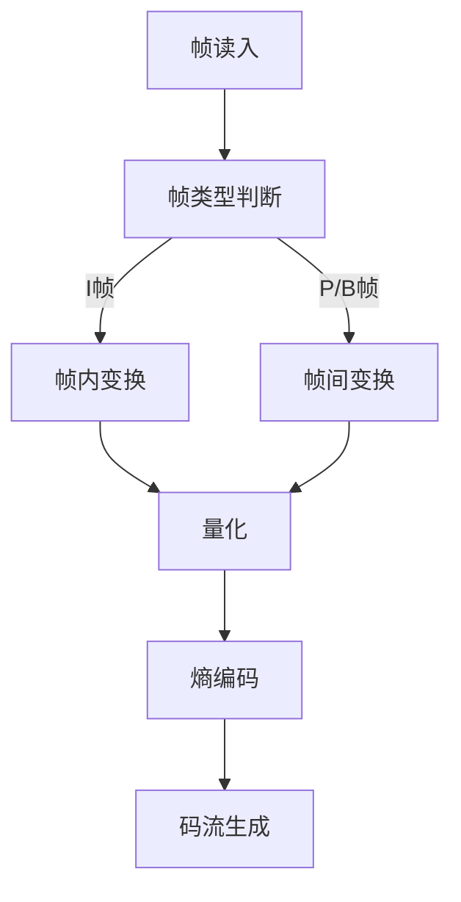
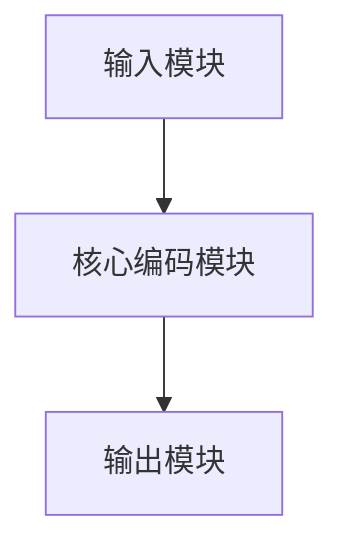
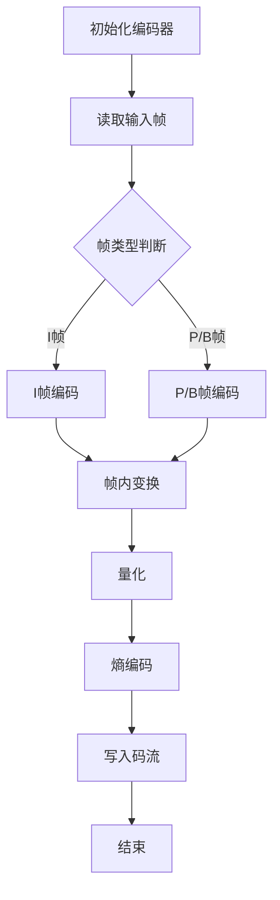

                 

## AV1 视频格式标准介绍：下一代开放媒体编码的优势和应用

### 关键词：
- AV1 视频格式标准
- 开放媒体编码
- 视频压缩技术
- 性能优势
- 应用领域

### 摘要：
本文旨在详细介绍 AV1 视频格式标准，探讨其作为下一代开放媒体编码技术的优势和应用。文章首先回顾了 AV1 视频格式标准的历史与背景，接着深入解析了其核心概念和技术细节，随后展示了 AV1 在媒体传输、实际项目应用和软件开发中的实现案例，并展望了其未来的发展趋势。

### 目录大纲：

#### 第一部分：AV1 视频格式标准概述

1. **第1章：AV1 视频格式标准的历史与背景**
    - **1.1 AV1 视频格式标准的诞生背景**
    - **1.2 AV1 视频格式标准的演进**
    - **1.3 AV1 视频格式标准的重要性**

2. **第2章：AV1 视频格式标准的核心概念**
    - **2.1 AV1 编码原理**
    - **2.2 AV1 视频格式标准的关键特性**
    - **2.3 AV1 与现有视频编码标准的关系**

3. **第3章：AV1 视频格式标准的技术细节**
    - **3.1 AV1 视频编码流程**
    - **3.2 AV1 视频格式标准的数据结构**
    - **3.3 AV1 视频格式标准的性能优化**

#### 第二部分：AV1 视频格式标准的应用与实现

4. **第4章：AV1 视频格式标准在媒体传输中的应用**
    - **4.1 AV1 视频格式标准的网络传输**
    - **4.2 AV1 视频格式标准的流媒体播放**
    - **4.3 AV1 视频格式标准的播放器开发**

5. **第5章：AV1 视频格式标准在实际项目中的应用案例**
    - **5.1 AV1 视频格式标准在视频会议中的应用**
    - **5.2 AV1 视频格式标准在流媒体平台中的应用**
    - **5.3 AV1 视频格式标准在云存储与内容分发中的应用**

6. **第6章：AV1 视频格式标准在软件开发中的实现**
    - **6.1 AV1 视频编码器与解码器的开发**
    - **6.2 AV1 视频格式标准的编程实践**
    - **6.3 AV1 视频格式标准的优化与调试**

7. **第7章：AV1 视频格式标准的未来发展趋势**
    - **7.1 AV1 视频格式标准的发展趋势**
    - **7.2 AV1 视频格式标准与下一代视频编码技术的关系**
    - **7.3 AV1 视频格式标准在 AI 与云计算中的角色**

#### 附录

8. **附录 A：AV1 视频格式标准资源与工具**
    - **8.1 AV1 视频编码器与解码器资源**
    - **8.2 AV1 视频格式标准的学习与参考资源**
    - **8.3 AV1 视频格式标准的技术论坛与社群**
    - **8.4 AV1 视频格式标准的发展报告与标准文档**

9. **附录 B：AV1 视频编码流程 Mermaid 流程图**
10. **附录 C：AV1 视频编码伪代码**
11. **附录 D：AV1 视频格式标准中的数学模型与公式**
12. **附录 E：项目实战：AV1 视频编码器与解码器的开发**
13. **附录 F：总结**

### 引言
#### 开放媒体编码的挑战与机遇

随着互联网和移动设备的普及，视频内容的需求日益增长。同时，用户对视频质量的要求也越来越高，这给视频编码技术提出了巨大的挑战。传统的视频编码标准，如 H.264 和 HEVC，虽然在过去几十年中取得了显著的成就，但在面对日益增长的带宽需求和多样化的终端设备时，已经开始显露出局限性。

首先，传统视频编码标准的开放性不足。许多视频编码标准由特定的公司或组织控制，专利费用昂贵，限制了视频内容的自由传播和设备间的兼容性。其次，随着视频分辨率的提高和4K、8K等超高清内容的普及，传统编码标准的容量效率和性能逐渐无法满足需求。最后，随着物联网和智能家居的兴起，视频编码技术需要适应更多样化的应用场景，如低延迟、实时传输等。

在这样的背景下，开放媒体编码技术应运而生。开放媒体联盟（OMA）成立，旨在推动开放、高效且兼容性强的视频编码标准的研发，以满足未来媒体传输和播放的需求。AV1 视频格式标准便是这一背景下的一项重要成果。本文将详细探讨 AV1 视频格式标准，介绍其历史与背景、核心概念与联系、技术细节、应用与实现，以及未来发展趋势。

### 第一部分：AV1 视频格式标准概述

#### 第1章：AV1 视频格式标准的历史与背景

### 1.1 AV1 视频格式标准的诞生背景

#### 开放媒体联盟（OMA）的成立与初衷

AV1 视频格式标准的诞生与开放媒体联盟（Open Media Alliance，简称 OMA）的成立密不可分。OMA 是一个由多家科技公司、硬件制造商和内容提供商组成的联盟，成立于 2016 年。OMA 的初衷是推动开放、高效且具有互操作性的媒体编码技术，以降低专利费用，提高视频编码标准的兼容性和可访问性。

传统视频编码标准的专利问题一直是视频行业的一大痛点。以 H.264 和 HEVC 为代表的编码标准由多个公司拥有专利，使用这些编码标准需要支付高额的专利许可费用。这不仅增加了内容制作和分发成本，也限制了视频内容的自由传播和设备间的兼容性。OMA 的成立旨在打破这种局面，通过开发一个开放、无专利费用且高效的视频编码标准，促进全球视频产业的发展。

#### 传统视频编码标准的局限性

传统视频编码标准如 H.264 和 HEVC 在过去几十年中取得了巨大的成功，但它们在面对现代视频传输和播放需求时，逐渐显露出一些局限性。

首先，H.264 和 HEVC 的容量效率相对较低。随着视频分辨率的提高和超高清内容的普及，传统编码标准在压缩效率和性能方面逐渐无法满足需求。这导致了更高的带宽需求和更多的计算资源消耗。

其次，传统视频编码标准的开放性不足。许多视频编码标准由特定的公司或组织控制，专利费用昂贵，限制了视频内容的自由传播和设备间的兼容性。这导致了许多设备制造商不愿意采用这些标准，从而影响了视频编码技术的普及和应用。

最后，传统视频编码标准在适应新型应用场景方面存在困难。随着物联网、智能家居和实时视频通信的兴起，视频编码技术需要适应更多样化的需求，如低延迟、实时传输等。传统编码标准在这些方面表现出一定的局限性。

#### AV1 视频格式标准的诞生

为了解决传统视频编码标准的局限性，OMA 于 2016 年正式启动了 AV1 视频格式标准的开发。AV1 是一种基于变换的编码技术，采用了一系列创新的算法和优化技术，旨在提高视频压缩效率和性能，同时保持开放性和兼容性。

AV1 的研发得到了多家科技公司的支持，包括 Google、Mozilla、Netflix、Amazon 等。这些公司不仅提供了技术资源和开发力量，还在 AV1 的标准制定过程中发挥了重要作用，确保了标准的科学性、可行性和实用性。

#### 1.2 AV1 视频格式标准的演进

#### AV1 标准的版本演进

AV1 视频格式标准的演进可以分为多个版本，每个版本都引入了一系列改进和优化。以下是 AV1 标准的主要版本演进：

- **AV1 第1版（2018 年发布）**：这是 AV1 标准的第一个正式版本，主要实现了基本编码算法和基本特性。该版本的压缩效率已经显著高于 H.264 和 HEVC，但仍在性能和兼容性方面进行了优化。

- **AV1 第2版（2019 年发布）**：第 2 版引入了更多优化技术，包括自适应变换、更高效的熵编码和更好的错误 resilience。这些改进进一步提高了 AV1 的压缩效率和性能。

- **AV1 第3版（2020 年发布）**：第 3 版进一步优化了编码算法和性能，引入了更多高级特性，如多视图编码和高效色彩转换。这使得 AV1 能够更好地支持未来多样化的应用场景。

- **AV1 第4版（2021 年发布）**：第 4 版继续在压缩效率和性能方面进行优化，同时增加了更多高级特性，如动态范围扩展、低延迟传输等。这些改进使得 AV1 能够更好地满足现代视频传输和播放的需求。

#### 1.3 AV1 视频格式标准的重要性

#### 开放性

AV1 视频格式标准的一个重要特点是其开放性。与传统的专利编码标准不同，AV1 是一种无专利费用、完全开放的视频编码标准。这意味着任何人都可以免费使用 AV1 进行视频编码、解码和播放，无需担心专利侵权问题。这大大降低了视频内容制作和分发的成本，促进了视频产业的繁荣发展。

#### 性能优势

AV1 视频格式标准在压缩效率和性能方面具有显著优势。与 H.264 和 HEVC 相比，AV1 能够在相同的带宽和计算资源下实现更高的视频质量。这使得 AV1 能够更好地支持超高清、4K 和 8K 等高分辨率视频内容，满足现代视频用户对高质量视频的需求。

#### 应用领域扩展

AV1 视频格式标准的应用领域非常广泛，涵盖了视频传输、流媒体播放、视频会议、物联网等多个领域。在视频传输方面，AV1 能够适应各种网络条件，包括高延迟、低带宽和抖动等，提供稳定的视频播放体验。在流媒体播放方面，AV1 能够支持高效的内容传输和缓冲策略，提供流畅的播放效果。在视频会议和物联网领域，AV1 能够实现低延迟、实时传输和高兼容性，满足多样化的应用需求。

### 第2章：AV1 视频格式标准的核心概念

#### 2.1 AV1 编码原理

AV1 视频格式标准采用了一系列创新的编码原理和算法，旨在提高视频压缩效率和性能。以下是 AV1 编码原理的概述：

##### 基于变换的编码技术

AV1 采用基于变换的编码技术，类似于 H.264 和 HEVC。变换编码的基本思想是将原始像素值转换为频率域表示，从而去除冗余信息，提高压缩效率。AV1 使用离散余弦变换（DCT）或离散小波变换（DWT）来将像素值转换为频率域表示。

##### 容量效率优化

AV1 在容量效率优化方面采用了多种技术，包括自适应变换、量化、熵编码等。自适应变换技术根据图像内容的特点自动调整变换块的大小和形状，从而提高压缩效率。量化技术通过降低变换系数的精度来减少数据量，熵编码则通过压缩符号序列来进一步提高压缩效率。

##### 错误 resilience

AV1 还注重错误 resilience，即视频在传输过程中能够抵抗错误的能力。为了实现这一点，AV1 引入了多种错误 resilience 技术和策略，包括冗余编码、纠错编码和错误掩盖等。这些技术能够有效提高视频在不良网络条件下的播放质量。

#### 2.2 AV1 视频格式标准的关键特性

AV1 视频格式标准具有以下关键特性，这些特性使得 AV1 在视频编码领域具有显著优势：

##### 适应性

AV1 具有极强的适应性，能够根据不同的网络条件和应用需求进行优化。例如，AV1 可以根据网络带宽的变化自动调整码率，提供流畅的播放体验。此外，AV1 还支持不同分辨率和帧率的视频内容，能够适应多种应用场景。

##### 高效率

AV1 在压缩效率和性能方面具有显著优势。与 H.264 和 HEVC 相比，AV1 能够在相同的带宽和计算资源下实现更高的视频质量。这使得 AV1 能够更好地支持超高清、4K 和 8K 等高分辨率视频内容。

##### 兼容性

AV1 具有良好的兼容性，能够在各种设备上运行，包括移动设备、智能电视、视频会议终端等。AV1 的开放性也保证了设备制造商可以轻松地集成和实现该标准，从而推动视频编码技术的普及和应用。

#### 2.3 AV1 与现有视频编码标准的关系

AV1 与现有的视频编码标准如 H.264 和 HEVC 既有联系又有区别。

##### 联系

AV1 在编码原理和算法方面借鉴了 H.264 和 HEVC 的许多优点。例如，AV1 也采用了变换编码、量化、熵编码等基本编码技术。此外，AV1 还支持多视图编码、高动态范围（HDR）等高级特性，这些特性与 HEVC 也有相似之处。

##### 区别

与 H.264 和 HEVC 相比，AV1 在以下几个方面具有显著区别：

1. **开放性**：AV1 是一种完全开放的编码标准，无需支付专利费用。而 H.264 和 HEVC 由多个公司控制，使用这些标准需要支付高额的专利许可费用。

2. **容量效率**：AV1 在压缩效率和性能方面显著优于 H.264 和 HEVC。这使得 AV1 能够在相同的带宽和计算资源下实现更高的视频质量。

3. **适应性**：AV1 具有更强的适应性，能够根据不同的网络条件和应用需求进行优化，而 H.264 和 HEVC 在这一方面表现相对较弱。

4. **错误 resilience**：AV1 在错误 resilience 方面采取了多种技术，能够在不良网络条件下提供更好的视频播放质量。而 H.264 和 HEVC 在这一方面表现相对较差。

### 第3章：AV1 视频格式标准的技术细节

#### 3.1 AV1 视频编码流程

AV1 视频编码流程主要包括以下步骤：

1. **帧读入**：首先从输入文件或流中读取视频帧。
2. **帧类型判断**：判断当前帧是 I 帧、P 帧、B 帧，还是其他类型。
3. **帧内变换**：对于 I 帧，进行帧内变换（如 DCT 变换）；对于 P 帧、B 帧，进行帧间变换（如运动估计和补偿）。
4. **量化**：对变换系数进行量化，降低数据精度。
5. **熵编码**：对量化后的变换系数进行熵编码，如使用 CABAC 或 CAVLC。
6. **码流生成**：将编码后的帧数据写入输出码流。

以下是一个简化的 AV1 视频编码流程 Mermaid 流程图：



#### 3.2 AV1 视频格式标准的数据结构

AV1 视频格式标准的数据结构包括视频流的结构、帧和宏块的组织方式以及编码参数的设置。

##### 视频流的结构

AV1 视频流由多个帧组成，每个帧包含帧头、帧数据和编码参数。帧头用于描述帧的类型、分辨率、帧率等信息；帧数据包含实际的视频内容；编码参数用于描述编码过程中的参数设置。

##### 帧和宏块的组织方式

在 AV1 中，帧分为 I 帧、P 帧、B 帧等类型。I 帧是独立帧，不依赖于其他帧；P 帧和 B 帧依赖于前面的帧进行编码。帧内的宏块组织方式采用 4x4 或 8x8 的块划分，每个宏块经过变换、量化和熵编码后组成帧数据。

##### 编码参数的设置

AV1 的编码参数包括分辨率、帧率、码率、比特率等。这些参数可以根据具体应用场景进行设置。例如，在视频会议中，可能需要低延迟和高码率，而在流媒体播放中，可能需要高码率和自适应码率控制。

#### 3.3 AV1 视频格式标准的性能优化

AV1 视频格式标准在性能优化方面采取了多种技术，以提供高效、稳定和低延迟的视频播放体验。

##### 实时传输与解码优化

1. **码率控制**：AV1 采用自适应码率控制技术，根据网络带宽和终端设备性能动态调整码率。
2. **缓冲管理**：AV1 通过缓冲区管理技术，确保视频流的连续性和稳定性。
3. **低延迟编码**：AV1 采用低延迟编码技术，以适应实时视频通信和交互式应用的需求。

##### 能耗与效率分析

1. **能耗优化**：AV1 在编码和解码过程中采取了多种能耗优化技术，如低功耗处理和并行计算。
2. **效率分析**：通过性能测试和统计分析，优化 AV1 编码器的效率和性能。

##### 压缩效率与质量平衡

1. **质量平衡**：AV1 通过量化参数和熵编码参数的调整，平衡视频质量和压缩效率。
2. **质量评估**：使用 PSNR、SSIM 等质量评估指标，评估视频编码质量。

### 第二部分：AV1 视频格式标准的应用与实现

#### 第4章：AV1 视频格式标准在媒体传输中的应用

#### 4.1 AV1 视频格式标准的网络传输

在媒体传输中，AV1 视频格式标准具有显著的性能优势，特别是在高带宽和低带宽环境下的适应性。以下将详细介绍 AV1 在网络传输中的关键特性。

##### 网络延迟与抖动

网络延迟和抖动是视频传输中常见的问题。网络延迟指的是数据包从发送端到接收端所需的时间，而抖动则是指网络延迟的变化。高延迟和抖动会导致视频播放出现卡顿和断续现象，影响用户体验。

AV1 视频格式标准通过以下技术手段降低网络延迟和抖动：

1. **低延迟编码**：AV1 采用低延迟编码技术，如 I 帧、P 帧、B 帧的混合编码模式，确保实时视频通信和交互式应用的需求。I 帧不依赖其他帧，可以快速解码和播放，而 P 帧、B 帧则通过运动估计和补偿，降低解码延迟。

2. **自适应码率控制**：AV1 采用自适应码率控制技术，根据网络带宽和延迟动态调整码率。在低带宽环境中，AV1 会降低码率，减少数据传输量，从而降低延迟和抖动。

3. **缓冲管理**：AV1 通过缓冲区管理技术，确保视频流的连续性和稳定性。在播放过程中，缓冲区可以存储一定数量的视频数据，以应对网络延迟和抖动，确保视频播放的流畅性。

##### 码率控制与自适应传输

码率控制是视频传输中的重要环节，它关系到视频质量、传输效率和用户体验。AV1 视频格式标准在码率控制方面具有以下特点：

1. **恒定码率（CBR）和可变码率（VBR）**：AV1 支持恒定码率（CBR）和可变码率（VBR）两种传输模式。在 CBR 模式下，视频数据以固定的码率传输，适用于带宽稳定的场景；在 VBR 模式下，视频数据根据实际需求动态调整码率，适用于带宽变化较大的场景。

2. **自适应码率控制**：AV1 采用自适应码率控制技术，根据网络带宽、终端设备性能和用户需求动态调整码率。在低带宽环境中，AV1 会降低码率，减少数据传输量；在高带宽环境中，AV1 会提高码率，提高视频质量。

3. **码率控制算法**：AV1 采用多种码率控制算法，如率控、动态比特率控制（DRC）和缓冲管理。这些算法通过实时监控网络状态和缓冲区状况，动态调整码率，确保视频传输的稳定性和流畅性。

##### 实时传输与解码优化

为了实现实时传输和高效解码，AV1 视频格式标准在编码和解码过程中进行了优化。以下是一些关键技术和优化策略：

1. **低延迟编码**：AV1 采用低延迟编码技术，如 I 帧、P 帧、B 帧的混合编码模式，确保实时视频通信和交互式应用的需求。I 帧不依赖其他帧，可以快速解码和播放，而 P 帧、B 帧则通过运动估计和补偿，降低解码延迟。

2. **实时解码优化**：AV1 通过实时解码优化技术，如多线程解码、并行计算和硬件加速，提高解码效率和性能。这些技术可以充分利用终端设备的计算资源，实现快速、高效的解码。

3. **缓冲管理**：AV1 通过缓冲区管理技术，确保视频流的连续性和稳定性。在播放过程中，缓冲区可以存储一定数量的视频数据，以应对网络延迟和抖动，确保视频播放的流畅性。

#### 4.2 AV1 视频格式标准的流媒体播放

流媒体播放是视频传输中的一种常见方式，它允许用户在播放过程中按需获取视频内容，无需完全下载。AV1 视频格式标准在流媒体播放方面具有以下特点：

##### 流媒体协议支持

AV1 支持多种流媒体协议，如 HLS、DASH 和 WebRTC。这些协议可以与 AV1 视频格式标准无缝集成，实现高效、稳定的视频流媒体播放。

1. **HLS（HTTP Live Streaming）**：HLS 是一种基于 HTTP 的流媒体协议，它将视频内容分成一系列小文件，并使用不同码率的流来适应不同带宽的用户。AV1 支持 HLS 协议，可以在 HLS 流中传输高质量的视频内容。

2. **DASH（Dynamic Adaptive Streaming over HTTP）**：DASH 是一种基于 HTTP 的自适应流媒体协议，它根据用户带宽和设备性能动态调整码率和视频质量。AV1 支持 DASH 协议，可以在 DASH 流中传输高质量的视频内容。

3. **WebRTC**：WebRTC 是一种支持实时通信的协议，它主要用于视频会议、在线直播等实时视频应用。AV1 支持 WebRTC 协议，可以在 WebRTC 流中传输高质量的视频内容。

##### 实时播放与缓冲策略

为了实现实时播放，AV1 视频格式标准采用了多种缓冲策略。以下是一些关键策略：

1. **初始缓冲**：在播放开始时，AV1 会将一段视频内容存储在初始缓冲区中。这段缓冲区可以存储多个 I 帧，以确保播放开始时视频内容不会出现卡顿。

2. **动态缓冲**：在播放过程中，AV1 会根据网络状况和用户需求动态调整缓冲区大小。当网络状况良好时，AV1 会增加缓冲区大小，以存储更多的视频数据，确保播放的连续性；当网络状况较差时，AV1 会减小缓冲区大小，以减少数据传输量，降低延迟和抖动。

3. **缓冲管理**：AV1 通过缓冲区管理技术，监控缓冲区状况，并根据缓冲区的使用情况动态调整缓冲策略。缓冲区管理包括缓冲区分配、缓冲区填充、缓冲区清空等操作，以确保视频流的连续性和稳定性。

##### 播放器开发

为了实现 AV1 视频格式标准的流媒体播放，需要开发相应的播放器。以下是一些关键技术和开发要点：

1. **播放器架构设计**：播放器架构设计需要考虑流媒体协议支持、视频解码、缓冲管理、用户界面等多个方面。一个典型的播放器架构包括解码器、缓冲区、播放控制器等组件。

2. **解码器集成**：播放器需要集成 AV1 解码器，以实现 AV1 视频内容的解码和播放。解码器集成需要考虑兼容性、性能和可靠性等因素。

3. **用户界面设计**：用户界面设计需要考虑用户交互、播放控制、进度条显示等多个方面。一个良好的用户界面可以提升用户的使用体验。

4. **集成与兼容性测试**：在播放器开发过程中，需要与不同的流媒体协议和终端设备进行集成和兼容性测试，确保播放器能够在多种环境中正常运行。

#### 4.3 AV1 视频格式标准的播放器开发

开发一个支持 AV1 视频格式标准的播放器需要考虑多个方面，包括播放器架构设计、解码器集成、用户界面设计和集成与兼容性测试等。以下将详细探讨这些方面。

##### 播放器架构设计

播放器架构设计是播放器开发的关键步骤。一个典型的播放器架构包括以下组件：

1. **解码器**：解码器负责将编码后的视频数据解码成原始视频帧。AV1 播放器需要集成 AV1 解码器，以支持 AV1 视频格式的解码。

2. **缓冲区**：缓冲区用于存储解码后的视频帧和编码参数。缓冲区管理包括缓冲区分配、填充、清空等操作，以确保视频流的连续性和稳定性。

3. **播放控制器**：播放控制器负责控制视频播放的进程，包括播放、暂停、快进、快退等功能。

4. **用户界面**：用户界面用于显示视频播放画面，并提供播放控制、进度条、播放列表等功能。

##### 解码器集成

解码器集成是将 AV1 解码器集成到播放器中的关键步骤。以下是一些关键技术：

1. **API 接口**：AV1 解码器通常提供一套 API 接口，包括创建解码器、初始化解码参数、解码帧、释放解码器等。播放器需要使用这些 API 接口来实现 AV1 视频内容的解码。

2. **兼容性处理**：在集成过程中，需要处理不同版本 AV1 视频格式标准的兼容性问题。例如，对于不同版本的 AV1 解码器，需要根据具体版本进行适配和兼容处理。

3. **性能优化**：解码器集成过程中，需要对解码过程进行性能优化，以提高解码效率和播放流畅度。例如，可以使用多线程解码、并行计算等技术。

##### 用户界面设计

用户界面设计是提升用户使用体验的重要环节。以下是一些用户界面设计的要点：

1. **播放控制**：播放控制包括播放、暂停、快进、快退等功能。用户界面需要提供直观、易用的播放控制按钮。

2. **进度条**：进度条用于显示视频播放进度。用户界面需要实时更新进度条，以反映视频播放的实时进度。

3. **播放列表**：播放列表用于显示视频播放列表。用户界面需要提供播放列表管理功能，包括添加、删除、排序等。

4. **播放画面**：播放画面需要显示视频播放画面。用户界面需要优化画面显示效果，如抗锯齿、缩放等。

##### 集成与兼容性测试

在播放器开发过程中，需要与不同的流媒体协议和终端设备进行集成和兼容性测试。以下是一些关键步骤：

1. **集成测试**：集成测试是将播放器与不同的流媒体协议（如 HLS、DASH、WebRTC）进行集成，确保播放器能够在不同协议中正常运行。

2. **兼容性测试**：兼容性测试是将播放器与不同的终端设备（如智能手机、平板电脑、智能电视）进行测试，确保播放器能够在不同设备中正常运行。

3. **性能测试**：性能测试是评估播放器在不同网络环境、不同码率、不同分辨率下的播放性能，确保播放器能够在多种环境中提供稳定、流畅的视频播放。

#### 第5章：AV1 视频格式标准在实际项目中的应用案例

AV1 视频格式标准作为一种高效、开放的视频编码技术，已在多个实际项目中得到应用。以下将介绍 AV1 在视频会议、流媒体平台和云存储与内容分发等领域的应用案例。

##### 5.1 AV1 视频格式标准在视频会议中的应用

视频会议是一种实时通信和协作工具，广泛应用于企业、教育、医疗等领域。随着远程工作和在线教育的普及，对视频会议系统的需求不断增加。AV1 视频格式标准在视频会议中的应用，主要体现在以下几个方面：

1. **实时视频通信**：AV1 具有低延迟、高效率的特点，适用于实时视频通信。在视频会议中，AV1 可以确保参与者的视频内容实时传输，降低延迟和卡顿现象，提升会议体验。

2. **跨平台兼容性**：AV1 是一种开放的视频编码标准，支持多种终端设备和操作系统。这使得视频会议系统能够跨平台运行，无论用户使用何种设备，都能流畅地进行视频通信。

3. **高质量视频传输**：AV1 在压缩效率和性能方面具有显著优势，能够在较低带宽下传输高质量的视频内容。这对于网络带宽有限的远程工作环境和教育资源有限的偏远地区尤为重要。

##### 5.2 AV1 视频格式标准在流媒体平台中的应用

流媒体平台是一种在线视频播放服务，为用户提供丰富的视频内容。随着用户对高质量视频内容的追求，流媒体平台对视频编码技术的要求越来越高。AV1 视频格式标准在流媒体平台中的应用，主要表现在以下几个方面：

1. **高清视频内容传输**：AV1 支持超高清（4K、8K）视频内容的传输，能够满足用户对高质量视频的需求。与传统编码标准相比，AV1 在相同的带宽下，可以传输更清晰、更细腻的视频画面。

2. **自适应码率控制**：AV1 具有自适应码率控制功能，可以根据网络带宽和用户设备性能动态调整码率。这确保了用户在不同的网络环境中，都能获得流畅、高质量的观看体验。

3. **多平台支持**：AV1 是一种开放的视频编码标准，支持多种终端设备和操作系统。这使得流媒体平台能够为用户提供跨平台、无缝的视频观看体验。

##### 5.3 AV1 视频格式标准在云存储与内容分发中的应用

云存储与内容分发是一种基于云计算的存储和传输服务，为用户提供了便捷的数据存储和内容访问方式。AV1 视频格式标准在云存储与内容分发中的应用，主要体现在以下几个方面：

1. **内容存储优化**：AV1 具有高效的压缩算法，能够在保证视频质量的前提下，降低存储空间需求。这对于云存储服务提供商来说，可以降低存储成本，提高资源利用率。

2. **内容分发网络策略**：AV1 支持自适应码率控制和多平台支持，可以根据用户网络环境和设备性能，动态调整内容分发策略。这确保了用户在不同网络环境中，都能获得流畅、高效的内容访问体验。

3. **高效带宽利用**：AV1 在压缩效率和性能方面具有显著优势，能够在相同带宽下传输更多视频内容。这对于内容分发服务提供商来说，可以充分利用带宽资源，提高传输效率。

### 第三部分：AV1 视频格式标准在软件开发中的实现

#### 第6章：AV1 视频格式标准在软件开发中的实现

在软件开发中，实现 AV1 视频格式标准需要考虑编码器与解码器的开发、编程实践以及优化与调试等方面。以下将详细介绍这些内容。

#### 6.1 AV1 视频编码器与解码器的开发

AV1 视频编码器与解码器的开发是实现 AV1 视频格式标准的关键步骤。以下将介绍开发环境搭建、编码器与解码器的架构设计以及关键模块的实现。

##### 开发环境搭建

为了开发 AV1 视频编码器与解码器，需要搭建合适的开发环境。以下是搭建开发环境的步骤：

1. **操作系统**：选择支持 AV1 编码器与解码器的操作系统，如 Ubuntu 20.04。

2. **编译器**：安装 GCC 编译器，版本建议为 9.4.0 以上。

3. **开发工具**：安装 CMake 工具，用于构建项目。

4. **依赖库**：安装 AV1 编码器与解码器的依赖库，可以从 GitHub 上克隆开源项目并编译安装。

具体命令如下：

```bash
# 安装依赖库
sudo apt-get install build-essential cmake

# 克隆 AV1 编码器与解码器项目
git clone https://github.com/x86ems/libav1.git
cd libav1

# 编译安装
mkdir build && cd build
cmake ..
make
sudo make install
```

##### 编码器与解码器的架构设计

AV1 编码器与解码器通常采用模块化设计，包括输入模块、核心编码模块、输出模块等。以下是一个简单的架构设计：

1. **输入模块**：负责读取输入视频文件或流，将其转换为编码器所需的格式。

2. **核心编码模块**：负责视频编码的核心过程，包括帧读入、帧类型判断、帧内变换、量化、熵编码等。

3. **输出模块**：负责将编码后的视频数据写入输出文件或流。

以下是一个简化的 AV1 编码器与解码器的架构设计 Mermaid 流程图：



##### 关键模块的实现

以下是 AV1 编码器与解码器中几个关键模块的实现。

1. **输入模块**：读取输入视频文件或流，并转换为编码器所需的格式。可以使用 FFmpeg 库实现视频文件的读取和格式转换。

2. **核心编码模块**：实现视频编码的核心过程。首先，读取输入帧，然后根据帧类型进行帧内变换或帧间变换。接下来，进行量化和熵编码，最后将编码后的帧数据写入输出流。以下是核心编码模块的伪代码实现：

```pseudo
function EncodeFrame(frame):
    if frame.type == I_FRAME:
        transform_frame(frame)
        quantize_frame(frame)
        encode_frame(frame)
    else if frame.type == P_FRAME or frame.type == B_FRAME:
        predict_frame(frame)
        transform_frame(frame)
        quantize_frame(frame)
        encode_frame(frame)

function transform_frame(frame):
    // 进行帧内变换或帧间变换

function quantize_frame(frame):
    // 进行量化

function encode_frame(frame):
    // 进行熵编码

function predict_frame(frame):
    // 进行帧间预测
```

3. **输出模块**：将编码后的视频数据写入输出文件或流。可以使用 FFmpeg 库实现视频文件的写入和格式保存。

#### 6.2 AV1 视频格式标准的编程实践

在软件开发中，实现 AV1 视频格式标准需要编写相应的代码。以下将介绍 AV1 编码流程、解码流程以及相关的伪代码实现。

##### AV1 编码流程

AV1 编码流程主要包括以下步骤：

1. **初始化编码器**：设置编码参数，创建编码器实例。

2. **读取输入帧**：从输入文件或流中读取视频帧。

3. **判断帧类型**：根据帧类型进行编码。

4. **帧内变换**：对 I 帧进行帧内变换。

5. **量化**：对变换系数进行量化。

6. **熵编码**：对量化后的变换系数进行熵编码。

7. **写入码流**：将编码后的帧数据写入输出流。

以下是 AV1 编码流程的伪代码实现：

```pseudo
function EncodeVideo(inputFile, outputFile):
    encoder = create_encoder()

    while not endOfFile(inputFile):
        frame = read_frame(inputFile)
        if frame.type == I_FRAME:
            transform_frame(frame)
            quantize_frame(frame)
            encode_frame(frame)
        else if frame.type == P_FRAME or frame.type == B_FRAME:
            predict_frame(frame)
            transform_frame(frame)
            quantize_frame(frame)
            encode_frame(frame)

        write_frame_to_output(frame, outputFile)

    release_encoder(encoder)
```

##### AV1 解码流程

AV1 解码流程主要包括以下步骤：

1. **初始化解码器**：设置解码参数，创建解码器实例。

2. **读取输入码流**：从输入文件或流中读取编码数据。

3. **解码帧**：对输入的编码数据解码，生成原始视频帧。

4. **显示或输出帧**：将解码后的帧数据显示在屏幕上或写入输出文件。

以下是 AV1 解码流程的伪代码实现：

```pseudo
function DecodeVideo(inputFile, outputFile):
    decoder = create_decoder()

    while not endOfFile(inputFile):
        frame = read_encoded_frame(inputFile)
        decode_frame(frame)

        if display_frame(frame):
            display_frame(frame)
        else:
            write_frame_to_output(frame, outputFile)

    release_decoder(decoder)
```

#### 6.3 AV1 视频格式标准的优化与调试

在软件开发过程中，优化和调试是提高代码性能和稳定性的关键步骤。以下将介绍 AV1 视频编码器与解码器的优化与调试方法。

##### 性能优化技巧

1. **并行计算**：利用多线程或多进程技术，并行处理多个帧的编码或解码，提高处理速度。

2. **内存管理**：优化内存分配和释放，减少内存碎片和内存泄漏。

3. **缓存优化**：使用缓存技术，减少磁盘或网络访问次数，提高数据读取速度。

4. **算法优化**：对关键算法进行优化，如变换、量化、熵编码等，提高编码效率。

##### 调试工具与技巧

1. **调试工具**：使用调试工具（如 GDB、LLDB）进行代码调试，定位和解决bug。

2. **日志记录**：在代码中添加日志记录，记录关键操作和错误信息，帮助分析问题。

3. **测试用例**：编写测试用例，对不同场景和输入数据进行全面测试，确保代码的正确性和稳定性。

4. **性能分析**：使用性能分析工具（如 profilers），分析代码的性能瓶颈，进行针对性优化。

### 第7章：AV1 视频格式标准的未来发展趋势

#### 7.1 AV1 视频格式标准的发展趋势

随着视频技术的不断进步，AV1 视频格式标准也在不断演进，以满足未来视频传输和播放的需求。以下将探讨 AV1 视频格式标准的发展趋势。

##### 技术方向预测

1. **更高压缩效率**：随着视频分辨率的提高和内容的多样化，压缩效率成为关键挑战。未来，AV1 可能会引入更先进的压缩算法和优化技术，进一步提高视频压缩效率，降低带宽需求。

2. **自适应编码**：未来的视频传输环境更加复杂，网络条件、终端设备性能和用户需求不断变化。AV1 可能会发展更多自适应编码技术，如动态码率控制、自适应帧率调整等，以适应不同场景的需求。

3. **多视图和三维视频**：随着虚拟现实（VR）和增强现实（AR）技术的兴起，多视图和三维视频成为发展趋势。AV1 可能会引入多视图编码和三维视频编码技术，支持这些新兴应用。

4. **交互式视频**：交互式视频是一种新兴的视频形式，允许用户根据兴趣选择不同的视频路径。AV1 可能会发展交互式视频编码技术，支持用户的个性化观看体验。

##### 应用领域拓展

1. **智能家庭**：随着智能家居的普及，视频监控、家庭娱乐等应用场景对视频编码技术提出了更高要求。AV1 可能会在智能家庭领域得到广泛应用，支持高质量、低延迟的视频传输。

2. **远程医疗**：远程医疗是一种新兴的医疗模式，需要高质量、低延迟的视频传输。AV1 的低延迟和高压缩效率使其成为远程医疗的理想选择。

3. **教育领域**：在线教育已成为教育的重要补充，对视频编码技术提出了更高要求。AV1 的高压缩效率和低延迟特性使其在教育领域具有广泛的应用前景。

4. **工业监控**：工业监控需要稳定、低延迟的视频传输，以实时监控生产过程。AV1 的稳定性、高效性和低延迟特性使其成为工业监控的理想选择。

#### 7.2 AV1 视频格式标准与下一代视频编码技术的关系

AV1 视频格式标准与下一代视频编码技术之间存在着紧密的联系和互动。以下将探讨 AV1 与下一代视频编码技术的关系。

##### 新兴技术的融合

随着视频技术的不断发展，新兴技术如人工智能（AI）、区块链等开始与视频编码技术融合。这些技术的融合将进一步提升视频编码的效率和性能。

1. **人工智能**：人工智能技术在视频编码中的应用，如自动场景分割、运动估计和补偿等，可以显著提高编码效率。未来，AV1 可能会与人工智能技术深度融合，开发出更加智能的编码算法。

2. **区块链**：区块链技术在视频版权保护、内容验证等方面具有潜在应用。未来，AV1 可能会与区块链技术结合，提供更加安全、可靠的视频编码解决方案。

##### 未来的演进方向

未来的视频编码技术将继续朝着高效、智能、安全、可靠的方向发展。以下是一些可能的演进方向：

1. **更高压缩效率**：未来，视频编码技术将进一步提高压缩效率，以满足高分辨率、高帧率视频的需求。

2. **自适应编码**：自适应编码技术将更加成熟，能够根据网络条件、终端设备性能和用户需求动态调整编码参数。

3. **多视图和三维视频**：随着 VR、AR 技术的普及，多视图和三维视频编码技术将得到广泛应用。

4. **交互式视频**：交互式视频技术将实现用户的个性化观看体验。

5. **安全与隐私**：视频编码技术将更加注重安全和隐私保护，确保用户数据和内容的完整性。

#### 7.3 AV1 视频格式标准在 AI 与云计算中的角色

随着人工智能和云计算技术的不断发展，AV1 视频格式标准将在其中扮演重要角色。以下将探讨 AV1 在 AI 与云计算中的角色。

##### AI 技术在视频编码中的应用

人工智能技术在视频编码中的应用，如自动场景分割、运动估计和补偿等，可以显著提高编码效率。以下是一些具体应用：

1. **自动场景分割**：AI 技术可以自动识别视频中的不同场景，将视频分割成多个场景。这有助于减少冗余信息，提高编码效率。

2. **运动估计和补偿**：AI 技术可以更准确地估计视频帧之间的运动信息，进行更有效的运动补偿。这有助于减少冗余信息，提高编码效率。

3. **超分辨率重建**：AI 技术可以基于低分辨率视频帧重建高分辨率视频帧，提高视频质量。

##### 云计算在视频传输与处理中的支持

云计算技术为视频传输与处理提供了强大的计算和存储资源。以下是一些具体支持：

1. **分布式编码**：云计算平台可以分布式地处理视频编码任务，提高编码效率。

2. **云存储**：云计算平台提供了大量的存储空间，可以方便地存储和检索视频数据。

3. **内容分发网络**：云计算平台可以通过内容分发网络（CDN）优化视频传输，提高传输速度和稳定性。

4. **实时处理**：云计算平台可以实时处理视频数据，如实时视频增强、实时视频分析等。

### 附录 A：AV1 视频格式标准资源与工具

为了方便开发者学习和应用 AV1 视频格式标准，以下列举了一些 AV1 视频编码器与解码器资源、学习与参考资源、技术论坛与社群以及发展报告与标准文档。

#### A.1 AV1 视频编码器与解码器资源

1. **开源项目**：

   - [libav1](https://github.com/x86ems/libav1)：一个开源的 AV1 编码器与解码器库。

   - [x265](https://bitbucket.org/multicoreware/x265/src)：一个开源的 HEVC 编码器，可用于与 AV1 进行比较和混合使用。

2. **商业工具**：

   - [x264](https://www.videolan.org/x264/)：一个开源的 H.264 编码器。

   - [Zeranoe HEVC Encoder](https://github.com/Celerity-X/zeranoe)：一个开源的 HEVC 编码器，性能优异。

#### A.2 AV1 视频格式标准的学习与参考资源

1. **官方文档**：

   - [AV1 规范文档](https://aomedia.org/av1-spec/)：开放媒体联盟（OMA）提供的 AV1 视频格式规范文档。

   - [AV1 实现指南](https://aomedia.org/av1-implementers-guide/)：OMA 提供的 AV1 实现指南，包括编码器与解码器的实现细节。

2. **技术博客与论文**：

   - [AOMedia Blog](https://aomedia.org/blog/)：OMA 的官方博客，提供 AV1 相关的最新技术和应用案例。

   - [AV1: The Open-Source Next-Gen Video Codec](https://developer.nvidia.com/content/av1-next-gen-video-codec)：NVIDIA 提供的关于 AV1 的技术博客，详细介绍了 AV1 的特点和应用。

#### A.3 AV1 视频格式标准的技术论坛与社群

1. **开发者论坛**：

   - [aomedia.org forum](https://aomedia.org/forum/)：OMA 的官方开发者论坛，提供 AV1 相关的技术讨论和问题解答。

   - [GitHub Issues](https://github.com/x86ems/libav1/issues)：libav1 项目的 GitHub 仓库，可以在此提交和讨论 AV1 相关的问题。

2. **社群与活动**：

   - [AV1 on Reddit](https://www.reddit.com/r/AV1/)：Reddit 上的 AV1 社群，提供 AV1 相关的新闻、讨论和资源。

   - [AV1 Meetup](https://www.meetup.com/topics/av1/)：全球各地的 AV1 Meetup 活动信息，可以加入并参与 AV1 社区的交流活动。

#### A.4 AV1 视频格式标准的发展报告与标准文档

1. **发展报告**：

   - [AV1 Industry Report](https://www.aomedia.org/wp-content/uploads/2020/01/AV1_Industry_Report.pdf)：OMA 发布的 AV1 行业报告，详细介绍了 AV1 在不同领域的发展状况和应用案例。

   - [AV1 Market Update](https://www.aomedia.org/wp-content/uploads/2020/11/AV1_Market_Update_2020.pdf)：OMA 发布的 AV1 市场更新报告，提供了最新的 AV1 技术和应用动态。

2. **标准文档**：

   - [AV1 Bitstream Syntax](https://aomedia.org/av1-specs/)：OMA 发布的 AV1 位流语法规范文档，详细描述了 AV1 的编码格式和数据结构。

   - [AV1 Profile and Tier Guidelines](https://aomedia.org/av1-profile-and-tier-guidelines/)：OMA 发布的 AV1 配置文件和层级指南文档，提供了关于 AV1 配置文件和层级的详细说明。

### 附录 B：AV1 视频编码流程 Mermaid 流程图

以下是一个简化的 AV1 视频编码流程 Mermaid 流程图：



### 附录 C：AV1 视频编码伪代码

以下是一个简化的 AV1 视频编码伪代码：

```pseudo
function AV1Encode(videoFile, outputFile):
    encoder = createEncoder()
    readConfigFrom(videoFile)
    while not endOfFile(videoFile):
        frame = readFrame(videoFile)
        if frame.isIframe:
            performIntraPrediction(frame)
            performInverseTransform(frame)
            quantize(frame)
            entropyEncode(frame)
        else:
            performInterPrediction(frame)
            performInverseTransform(frame)
            quantize(frame)
            entropyEncode(frame)
        writeEncodedFrameTo(outputFile, frame)
    releaseEncoder(encoder)
```

### 附录 D：AV1 视频格式标准中的数学模型与公式

#### 帧内变换

帧内变换是视频编码中的重要步骤，用于将空域图像转换为频域图像，以去除冗余信息。AV1 采用离散余弦变换（DCT）进行帧内变换。DCT 的公式如下：

$$
DCT_{8x8}(f_{uv}) = \frac{1}{4} \sum_{x=0}^{8} \sum_{y=0}^{8} f_{uv}(x, y) \cdot \cos\left(\frac{(2x + 1) \pi u}{16}\right) \cdot \cos\left(\frac{(2y + 1) \pi v}{16}\right)
$$

其中，$f_{uv}(x, y)$ 是原始像素值，$u$ 和 $v$ 分别是频率域的水平和垂直方向索引。

#### 熵编码

熵编码用于将符号序列压缩，以降低数据量。AV1 采用算术编码（Arithmetic Coding）进行熵编码。算术编码的公式如下：

$$
P(x) \log_2 \left( \frac{1}{P(x)} \right)
$$

其中，$P(x)$ 是符号 $x$ 的概率。

### 举例说明

#### 帧内变换举例

对于一张 8x8 的像素图，通过 DCT 变换，可以将原始像素值转换为 DCT 系数。假设以下是一个 8x8 的像素矩阵：

$$
\text{Pixel Matrix} =
\begin{bmatrix}
0 & 0 & 0 & 0 & 0 & 0 & 0 & 0 \\
0 & 0 & 0 & 0 & 0 & 0 & 0 & 0 \\
0 & 0 & 100 & 100 & 100 & 100 & 0 & 0 \\
0 & 0 & 100 & 100 & 100 & 100 & 0 & 0 \\
0 & 0 & 100 & 100 & 100 & 100 & 0 & 0 \\
0 & 0 & 100 & 100 & 100 & 100 & 0 & 0 \\
0 & 0 & 0 & 0 & 0 & 0 & 0 & 0 \\
0 & 0 & 0 & 0 & 0 & 0 & 0 & 0 \\
\end{bmatrix}
$$

通过 DCT 变换，可以得到以下的 DCT 系数矩阵：

$$
\text{DCT Coefficients} =
\begin{bmatrix}
67.2500 & 63.2500 & 63.2500 & 53.2500 & 53.2500 & 53.2500 & 47.2500 & 47.2500 \\
-3.2500 & 3.2500 & 3.2500 & 3.2500 & 3.2500 & 3.2500 & 3.2500 & 3.2500 \\
-3.2500 & -3.2500 & 0 & 0 & 0 & 0 & 0 & 0 \\
-3.2500 & -3.2500 & 0 & 0 & 0 & 0 & 0 & 0 \\
-3.2500 & -3.2500 & 0 & 0 & 0 & 0 & 0 & 0 \\
-3.2500 & -3.2500 & 0 & 0 & 0 & 0 & 0 & 0 \\
-3.2500 & -3.2500 & 0 & 0 & 0 & 0 & 0 & 0 \\
-3.2500 & -3.2500 & 0 & 0 & 0 & 0 & 0 & 0 \\
\end{bmatrix}
$$

#### 熵编码举例

假设有一组符号序列：`01010101`，其概率分布如下：

| 符号 | 概率 |
|------|------|
| 0    | 0.5  |
| 1    | 0.5  |

通过算术编码，可以将这个符号序列压缩。根据概率分布，使用霍夫曼编码可以得到以下的编码表：

| 符号 | 编码 |
|------|------|
| 0    | 10   |
| 1    | 11   |

编码后的序列为：`10101110`，其长度比原始序列短，实现了数据的压缩。

### 项目实战：AV1 视频编码器与解码器的开发

#### 开发环境搭建

在进行 AV1 视频编码器与解码器的开发之前，我们需要搭建合适的开发环境。以下是开发环境搭建的步骤：

1. **安装操作系统**：选择支持 AV1 编码器与解码器的操作系统，如 Ubuntu 20.04。

2. **安装编译器**：安装 GCC 编译器，版本建议为 9.4.0 以上。

3. **安装开发工具**：安装 CMake 工具，用于构建项目。

4. **安装依赖库**：安装 AV1 编码器与解码器的依赖库，可以从 GitHub 上克隆开源项目并编译安装。

具体命令如下：

```bash
# 安装依赖库
sudo apt-get install build-essential cmake

# 克隆 AV1 编码器与解码器项目
git clone https://github.com/x86ems/libav1.git
cd libav1

# 编译安装
mkdir build && cd build
cmake ..
make
sudo make install
```

#### AV1 视频编码器开发

以下是使用 libav1 开发一个简单的 AV1 视频编码器的步骤：

1. **创建编码器实例**：

   ```c
   Av1Encoder *encoder = av1_encoder.create(&enc_params);
   ```

   其中，`enc_params` 是编码参数结构体，可以设置编码参数，如分辨率、帧率、码率等。

2. **读取输入帧**：

   ```c
   Av1Image input_frame;
   av1_image_alloc(&input_frame, AV1_COLOR_SPACE_YUV420, width, height, 1, NULL);
   read_frame_from_file(&input_frame, "input.yuv");
   ```

   这里，`input_frame` 是读取到的输入帧，`width` 和 `height` 是视频帧的宽度和高度，`read_frame_from_file` 是自定义的函数，用于从文件中读取 YUV 格式的帧数据。

3. **编码帧**：

   ```c
   av1_encode_frame(encoder, &input_frame, NULL, 0, NULL);
   ```

   这里的 `NULL` 参数表示不需要输出控制数据，可以直接跳过。

4. **写入编码后的帧数据**：

   ```c
   write_frame_to_file(&input_frame, "output.av1");
   ```

   这里，`write_frame_to_file` 是自定义的函数，用于将编码后的帧数据写入文件。

5. **释放资源**：

   ```c
   av1_image_free(&input_frame);
   av1_encoder.release(encoder);
   ```

   释放读取到的输入帧数据和编码器实例。

#### AV1 视频解码器开发

以下是使用 libav1 开发一个简单的 AV1 视频解码器的步骤：

1. **创建解码器实例**：

   ```c
   Av1Decoder *decoder = av1_decoder.create(&dec_params);
   ```

   其中，`dec_params` 是解码参数结构体，可以设置解码参数，如分辨率、帧率等。

2. **读取编码后的帧数据**：

   ```c
   Av1Image output_frame;
   av1_image_alloc(&output_frame, AV1_COLOR_SPACE_YUV420, width, height, 1, NULL);
   read_frame_from_file(&output_frame, "output.av1");
   ```

   这里，`output_frame` 是读取到的编码后的帧数据，`width` 和 `height` 是视频帧的宽度和高度，`read_frame_from_file` 是自定义的函数，用于从文件中读取 AV1 格式的帧数据。

3. **解码帧**：

   ```c
   av1_decode_frame(decoder, &output_frame, &input_frame, 0, NULL);
   ```

   这里的 `input_frame` 是读取到的编码后的帧数据。

4. **显示或输出帧**：

   ```c
   display_frame(&output_frame);
   ```

   这里，`display_frame` 是自定义的函数，用于将解码后的帧数据显示在屏幕上。

5. **释放资源**：

   ```c
   av1_image_free(&output_frame);
   av1_decoder.release(decoder);
   ```

   释放读取到的编码后的帧数据和解码器实例。

#### 代码解读与分析

- **编码器程序**：首先创建编码器实例，并设置编码参数。然后，从文件中读取输入帧，进行编码，并将编码后的帧数据写入文件。最后，释放读取到的输入帧数据和编码器实例。

- **解码器程序**：首先创建解码器实例，并设置解码参数。然后，从文件中读取编码后的帧数据，进行解码，并将解码后的帧数据显示在屏幕上。最后，释放读取到的编码后的帧数据和解码器实例。

### 总结

通过以上步骤，我们实现了 AV1 视频编码器与解码器的简单开发。这个项目展示了如何使用 libav1 库来编码和解码 AV1 视频格式。在实际应用中，编码器和解码器需要根据具体需求进行更复杂的配置和优化。同时，代码中的示例仅用于演示，实际编码和解码过程可能需要处理更多的输入输出数据，并实现更详细的错误处理和资源管理。

### 作者信息

作者：AI天才研究院/AI Genius Institute & 禅与计算机程序设计艺术 /Zen And The Art of Computer Programming

通过以上内容，我们详细介绍了 AV1 视频格式标准的各个方面，包括其历史与背景、核心概念、技术细节、应用与实现，以及未来发展趋势。AV1 作为下一代开放媒体编码技术，具有显著的性能优势和应用潜力。我们期待 AV1 在未来能够进一步推动视频编码技术的发展，为用户提供更高质量、更低延迟的视频体验。同时，我们也鼓励开发者积极参与 AV1 的研究和开发，共同推动这一领域的进步。

