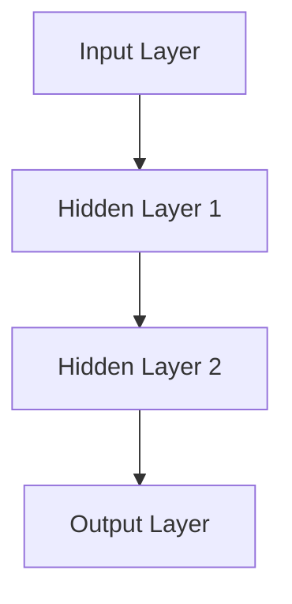
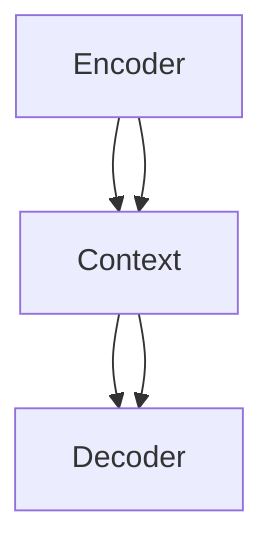
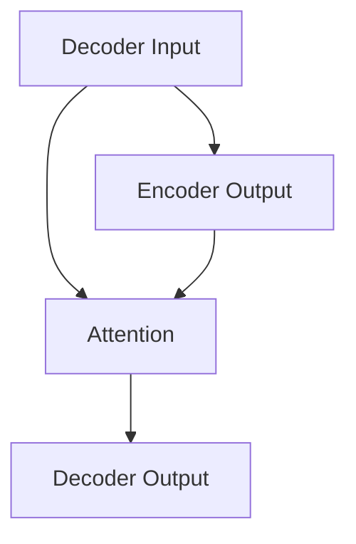

                 

### 第1章 人工智能的崛起与未来展望

> **关键词**：人工智能、未来展望、发展历程、核心概念、应用领域

人工智能（AI）作为计算机科学的一个重要分支，已经从最初的构想逐渐走向实际应用，并深刻影响了我们的生活方式和社会发展。本章将概述人工智能的发展历程、核心概念、架构以及应用领域，并探讨其未来的发展趋势。

#### 1.1 人工智能的定义与发展历程

人工智能，顾名思义，是使计算机系统表现出人类智能特性的技术。其定义可以从广义和狭义两个方面来理解。

- **广义人工智能**：包括所有使计算机系统具备智能特性的技术，如学习、推理、感知、自适应等。
- **狭义人工智能**：通常指机器学习、自然语言处理、计算机视觉等领域，这些技术可以使计算机在特定任务上表现出与人类相似或超越人类的能力。

**人工智能的发展历程**可以划分为以下几个阶段：

- **早期探索（20世纪50年代）**：这一阶段主要关注逻辑推理和符号处理。代表性的工作包括艾伦·图灵提出的“图灵测试”以及纽厄尔和西蒙设计的逻辑推理程序“逻辑理论家”（Logic Theorist）。

- **专家系统（20世纪70年代）**：基于规则的系统在这一阶段得到广泛应用。专家系统通过收集领域专家的知识，构建成规则库，使计算机能够在特定领域内进行推理和决策。例如，MYCIN系统是第一个成功的医疗诊断专家系统。

- **机器学习革命（20世纪80-90年代）**：统计学习方法和模式识别技术在这一阶段得到快速发展。支持向量机（SVM）、决策树、贝叶斯网络等算法相继提出，使机器学习成为人工智能的核心组成部分。

- **深度学习崛起（21世纪初至今）**：神经网络和大数据驱动使深度学习成为人工智能领域的革命性技术。以AlexNet为代表的卷积神经网络在图像识别任务中取得突破性成果，深度学习迅速应用到计算机视觉、自然语言处理、语音识别等多个领域。

#### 1.2 人工智能的核心概念与架构

**人工智能的核心概念**包括以下几个方面：

- **机器学习**：通过数据训练算法，使计算机系统能够进行预测或决策的技术。机器学习可以分为监督学习、无监督学习和强化学习。

- **深度学习**：基于多层神经网络的结构，通过大量数据自动学习特征表示。深度学习在图像识别、语音识别、自然语言处理等领域表现出色。

- **自然语言处理（NLP）**：使计算机能够理解、生成和处理人类语言的技术。NLP在语言翻译、文本摘要、情感分析等领域有广泛应用。

**人工智能的架构**主要包括以下几个部分：

- **计算机视觉**：使计算机能够理解和解析视觉信息。计算机视觉在图像识别、目标检测、图像生成等方面有广泛应用。

- **语音识别与生成**：使计算机能够理解和生成语音。语音识别在智能助手、语音搜索、语音翻译等领域有广泛应用。

- **自然语言处理**：使计算机能够理解、生成和处理人类语言。NLP在语言翻译、文本摘要、情感分析等领域有广泛应用。

- **推荐系统**：根据用户的历史行为和偏好，推荐相关的内容或产品。推荐系统在电子商务、社交媒体、音乐流媒体等领域有广泛应用。

- **自主驾驶**：使车辆能够自主导航和驾驶。自主驾驶技术在自动驾驶汽车、无人机等领域有广泛应用。

- **机器人技术**：使机器人能够执行复杂任务，如清洁、医疗、制造等。机器人技术在工业生产、医疗辅助、家庭服务等领域有广泛应用。

#### 1.3 人工智能的应用领域

人工智能的应用领域非常广泛，以下是其中一些主要的应用领域：

- **社交媒体分析**：通过分析社交媒体上的数据，可以了解用户的行为、情感和偏好，为企业提供营销策略和产品改进建议。

- **医疗诊断**：人工智能可以辅助医生进行疾病诊断，提高诊断准确率，减轻医生的工作负担。

- **自动驾驶**：自主驾驶技术可以使车辆在复杂的道路环境中安全行驶，减少交通事故，提高交通效率。

- **金融服务**：人工智能在金融服务领域有广泛的应用，如风险评估、欺诈检测、智能投顾等。

- **游戏开发**：人工智能可以用于游戏AI，提高游戏的难度和趣味性，增强用户体验。

- **无人机与机器人**：无人机和机器人技术在军事、物流、医疗等多个领域有广泛应用，如无人机救援、机器人手术等。

#### 1.4 人工智能的未来发展趋势

人工智能的未来发展趋势可以从以下几个方面来探讨：

- **大模型与云计算的结合**：随着计算能力和数据量的不断增加，大模型将发挥越来越重要的作用。云计算提供了强大的计算资源和存储能力，使得大规模训练成为可能。

- **多模态学习与交互**：人工智能将能够处理和融合来自不同模态的数据，如图像、文本、音频等，实现更智能的交互和任务处理。

- **量子计算与AI**：量子计算具有超强的计算能力，未来可能会对AI领域产生深远影响。量子计算在优化问题、机器学习等领域有广泛应用前景。

- **自主系统的进化**：自主系统将具有更强的自主学习和决策能力，能够在复杂环境中进行自我调整和优化。

- **AI伦理与法规**：随着人工智能的发展，AI伦理和法规问题将越来越重要。如何确保AI系统的公平性、透明性和安全性，将是未来需要重点解决的问题。

在本章中，我们概述了人工智能的发展历程、核心概念、架构以及应用领域，并探讨了其未来的发展趋势。下一章将深入探讨人工智能的核心算法原理，为读者提供更深入的理解。

---

### 1.1 人工智能的定义与发展历程

#### 人工智能的定义

人工智能，简称AI，是研究、开发和应用使计算机系统具备类似人类智能特性的理论、方法和技术。具体来说，人工智能包括但不限于以下几个方面：

- **学习**：通过数据训练算法，使计算机能够从数据中学习，进行预测或决策。
- **推理**：基于已有知识和规则，进行逻辑推理和问题求解。
- **感知**：使计算机能够感知和理解外部环境，如视觉、听觉、触觉等。
- **自适应**：根据环境变化，调整自身行为，提高适应能力。

从广义上讲，人工智能包括所有使计算机系统具备智能特性的技术，如机器学习、自然语言处理、计算机视觉、机器人技术等。而狭义的人工智能通常指在特定任务上能够表现出与人类相似或超越人类智能水平的系统。

#### 人工智能的发展历程

人工智能的发展历程可以分为以下几个阶段：

##### 早期探索（20世纪50年代）

20世纪50年代，人工智能的概念被首次提出，并开始引起广泛关注。这一时期，主要的代表性工作包括：

- **艾伦·图灵**：提出了“图灵测试”，旨在评估机器是否具备人类智能。如果一台机器能够在对话中表现得像一个人类，以至于评估者无法区分其是机器还是人类，那么这台机器就通过了图灵测试。

- **纽厄尔和西蒙**：设计了逻辑推理程序“逻辑理论家”（Logic Theorist），展示了计算机在数学证明方面的潜力。

##### 专家系统（20世纪70年代）

20世纪70年代，基于规则的系统的专家系统得到了广泛研究和应用。专家系统通过收集领域专家的知识，构建成规则库，使计算机能够在特定领域内进行推理和决策。这一时期的一些代表性工作包括：

- **MYCIN系统**：是第一个成功的医疗诊断专家系统，通过分析患者的症状，提出可能的诊断和治疗方案。

- **DENDRAL系统**：是一个化学专家系统，用于推断化学化合物的结构。

##### 机器学习革命（20世纪80-90年代）

20世纪80-90年代，统计学习方法和模式识别技术得到了快速发展。这一时期的代表性算法包括：

- **支持向量机（SVM）**：用于分类和回归任务，通过最大化分类边界来提高分类准确率。

- **决策树**：是一种树形结构，用于分类和回归任务，通过递归划分特征空间，找到最优决策路径。

- **贝叶斯网络**：是一种基于概率图模型的推理工具，用于表示不确定性和依赖关系。

##### 深度学习崛起（21世纪初至今）

21世纪初至今，神经网络和大数据驱动使深度学习成为人工智能领域的革命性技术。深度学习通过多层神经网络对数据进行复杂特征提取和模型训练，取得了许多突破性的成果。以下是深度学习发展的一些重要里程碑：

- **2006年**：杰弗里·辛顿（Geoffrey Hinton）等提出了深度信念网络（DBN），奠定了深度学习的基础。

- **2012年**：AlexNet在ImageNet大赛中取得了巨大成功，标志着深度学习在图像识别领域的崛起。

- **2014年**：谷歌的TPU芯片推出，为大规模深度学习模型训练提供了强大的计算支持。

- **2018年**：谷歌的BERT模型在自然语言处理任务中取得了突破性成果，展示了预训练模型在语言理解方面的潜力。

#### 1.2 人工智能的核心概念与架构

##### 核心概念

人工智能的核心概念主要包括以下几个：

- **机器学习**：通过数据训练算法，使计算机能够从数据中学习，进行预测或决策。机器学习可以分为监督学习、无监督学习和强化学习。

  - **监督学习**：有标记的数据集用于训练模型，通过预测结果与实际结果的对比，不断调整模型参数，提高预测准确率。
  - **无监督学习**：没有标记的数据集用于训练模型，主要通过数据自身的结构和模式进行学习，如聚类、降维等。
  - **强化学习**：通过环境反馈来训练模型，使模型能够在交互过程中不断优化行为策略，达到最佳效果。

- **深度学习**：一种基于多层神经网络的结构，通过大量数据自动学习特征表示。深度学习在图像识别、语音识别、自然语言处理等领域表现出色。

- **自然语言处理（NLP）**：使计算机能够理解、生成和处理人类语言的技术。NLP在语言翻译、文本摘要、情感分析等领域有广泛应用。

##### 人工智能的架构

人工智能的架构可以分为以下几个主要部分：

- **计算机视觉**：使计算机能够理解和解析视觉信息。计算机视觉在图像识别、目标检测、图像生成等方面有广泛应用。

- **语音识别与生成**：使计算机能够理解和生成语音。语音识别在智能助手、语音搜索、语音翻译等领域有广泛应用。

- **自然语言处理**：使计算机能够理解、生成和处理人类语言。NLP在语言翻译、文本摘要、情感分析等领域有广泛应用。

- **推荐系统**：根据用户的历史行为和偏好，推荐相关的内容或产品。推荐系统在电子商务、社交媒体、音乐流媒体等领域有广泛应用。

- **自主驾驶**：使车辆能够自主导航和驾驶。自主驾驶技术在自动驾驶汽车、无人机等领域有广泛应用。

- **机器人技术**：使机器人能够执行复杂任务，如清洁、医疗、制造等。机器人技术在工业生产、医疗辅助、家庭服务等领域有广泛应用。

#### 1.3 人工智能的应用领域

人工智能的应用领域非常广泛，以下是其中一些主要的应用领域：

- **社交媒体分析**：通过分析社交媒体上的数据，可以了解用户的行为、情感和偏好，为企业提供营销策略和产品改进建议。

- **医疗诊断**：人工智能可以辅助医生进行疾病诊断，提高诊断准确率，减轻医生的工作负担。

- **自动驾驶**：自主驾驶技术可以使车辆在复杂的道路环境中安全行驶，减少交通事故，提高交通效率。

- **金融服务**：人工智能在金融服务领域有广泛的应用，如风险评估、欺诈检测、智能投顾等。

- **游戏开发**：人工智能可以用于游戏AI，提高游戏的难度和趣味性，增强用户体验。

- **无人机与机器人**：无人机和机器人技术在军事、物流、医疗等多个领域有广泛应用，如无人机救援、机器人手术等。

#### 1.4 人工智能的未来发展趋势

人工智能的未来发展趋势可以从以下几个方面来探讨：

- **大模型与云计算的结合**：随着计算能力和数据量的不断增加，大模型将发挥越来越重要的作用。云计算提供了强大的计算资源和存储能力，使得大规模训练成为可能。

- **多模态学习与交互**：人工智能将能够处理和融合来自不同模态的数据，如图像、文本、音频等，实现更智能的交互和任务处理。

- **量子计算与AI**：量子计算具有超强的计算能力，未来可能会对AI领域产生深远影响。量子计算在优化问题、机器学习等领域有广泛应用前景。

- **自主系统的进化**：自主系统将具有更强的自主学习和决策能力，能够在复杂环境中进行自我调整和优化。

- **AI伦理与法规**：随着人工智能的发展，AI伦理和法规问题将越来越重要。如何确保AI系统的公平性、透明性和安全性，将是未来需要重点解决的问题。

在本章中，我们概述了人工智能的发展历程、核心概念、架构以及应用领域，并探讨了其未来的发展趋势。下一章将深入探讨人工智能的核心算法原理，为读者提供更深入的理解。

---

### 1.2 人工智能的核心概念与架构

#### 1.2.1 人工智能的核心概念

人工智能（AI）的核心概念是理解其如何在计算机系统中实现智能行为。以下是几个关键概念：

1. **机器学习**：机器学习是AI的核心技术之一，它使计算机系统能够通过学习数据来改进性能。机器学习可以分为以下几种类型：

   - **监督学习**：监督学习是指通过标记数据来训练模型，然后使用这个模型进行预测。例如，分类问题和回归问题都属于监督学习。

     **示例**：
     $$
     y = f(x) \quad \text{其中} \quad y \text{是标签，} x \text{是特征向量}
     $$

   - **无监督学习**：无监督学习是指在没有标签数据的情况下，通过探索数据中的结构来发现模式和规律。聚类和降维是无监督学习的典型应用。

     **示例**：
     $$
     \text{聚类算法：} \quad C = \{c_1, c_2, ..., c_k\} \quad \text{其中} \quad c_i \text{是聚类中心}
     $$

   - **强化学习**：强化学习是指通过与环境交互来学习策略，以达到某种目标。它通常用于解决决策问题。

     **示例**：
     $$
     \text{Q-Learning：} \quad Q(s, a) = r + \gamma \max_{a'} Q(s', a')
     $$
     其中，\( s \) 是状态，\( a \) 是动作，\( r \) 是即时奖励，\( \gamma \) 是折扣因子，\( s' \) 和 \( a' \) 是下一步的状态和动作。

2. **深度学习**：深度学习是机器学习的一个子领域，它通过构建多层神经网络来模拟人脑的学习过程。深度学习在图像识别、语音识别和自然语言处理等领域取得了显著成就。

   - **神经网络基本结构**：
     - **输入层**：接收输入数据。
     - **隐藏层**：对输入数据进行特征提取和变换。
     - **输出层**：生成最终输出。

     **示例**：
     $$
     \text{前向传播：} \quad z^{(l)} = W^{(l)} \cdot a^{(l-1)} + b^{(l)} \\
     a^{(l)} = \sigma(z^{(l)})
     $$
     其中，\( z^{(l)} \) 是第 \( l \) 层的净输入，\( W^{(l)} \) 和 \( b^{(l)} \) 分别是权重和偏置，\( \sigma \) 是激活函数，\( a^{(l)} \) 是第 \( l \) 层的输出。

3. **自然语言处理（NLP）**：NLP是使计算机能够理解、生成和处理人类语言的技术。NLP的关键挑战包括语义理解、语言生成和语言理解。

   - **词嵌入**：词嵌入是将单词映射到高维向量空间的技术，它有助于捕捉单词之间的语义关系。

     **示例**：
     $$
     \text{Word2Vec：} \quad \text{对于每个单词} w \in V， \quad v_w \in \mathbb{R}^d
     $$
     其中，\( V \) 是词汇表，\( d \) 是嵌入维数。

   - **语言模型**：语言模型是用来预测下一个单词的概率分布。

     **示例**：
     $$
     p(w_t | w_{t-1}, w_{t-2}, ...) = \text{LM}(w_t | w_{t-1}, w_{t-2}, ...)
     $$

#### 1.2.2 人工智能的架构

人工智能的架构涉及多个子领域，每个子领域都有其特定的应用和目标。以下是几个关键领域：

1. **计算机视觉**：计算机视觉是使计算机能够理解和解析视觉信息的技术。其主要应用包括图像识别、目标检测、图像分割和视频处理。

   - **卷积神经网络（CNN）**：CNN是计算机视觉领域最常用的深度学习模型之一。它通过卷积层、池化层和全连接层等结构来提取图像特征。

     **示例**：
     $$
     \text{卷积层：} \quad h^{(l)} = \sigma(\text{Conv}_l(W^{(l)} \cdot h^{(l-1)} + b^{(l)}))
     $$
     其中，\( h^{(l)} \) 是第 \( l \) 层的输出，\( W^{(l)} \) 和 \( b^{(l)} \) 分别是权重和偏置，\( \sigma \) 是激活函数。

2. **语音识别与生成**：语音识别是将语音信号转换为文本的技术，而语音生成则是将文本转换为语音信号。这两个领域都涉及信号处理和深度学习技术。

   - **隐马尔可夫模型（HMM）**：HMM是早期用于语音识别的统计模型，它通过状态转移概率和观测概率来建模语音信号。

     **示例**：
     $$
     p(X_t | H_t = i) = a_{ii} \\
     p(O_t | H_t = i) = b_{io}
     $$
     其中，\( X_t \) 是观测序列，\( H_t \) 是状态序列，\( a_{ii} \) 和 \( b_{io} \) 分别是状态转移概率和观测概率。

3. **自然语言处理**：NLP是使计算机能够理解、生成和处理人类语言的技术。NLP的关键挑战包括语义理解、文本分类、机器翻译和对话系统。

   - **递归神经网络（RNN）**：RNN是一种能够处理序列数据的神经网络，它通过循环连接来捕捉长期依赖关系。

     **示例**：
     $$
     h_t = \sigma(W_h \cdot [h_{t-1}, x_t] + b_h) \\
     y_t = W_o \cdot h_t + b_o
     $$
     其中，\( h_t \) 是隐藏状态，\( x_t \) 是输入序列，\( \sigma \) 是激活函数，\( W_h \) 和 \( b_h \) 分别是权重和偏置。

4. **推荐系统**：推荐系统是根据用户的历史行为和偏好，为用户推荐相关的内容或产品。推荐系统通常采用协同过滤、基于内容的过滤和混合方法。

   - **矩阵分解**：矩阵分解是一种常见的推荐系统算法，它通过分解用户-项目评分矩阵来预测用户对项目的偏好。

     **示例**：
     $$
     R = U \cdot V^T \\
     \text{其中，} R \text{是评分矩阵，} U \text{和} V \text{是用户和项目的低秩分解矩阵}
     $$

5. **自主驾驶**：自主驾驶是使车辆能够在没有人类干预的情况下自主导航和驾驶的技术。自主驾驶涉及计算机视觉、机器学习和控制理论等多个领域。

   - **深度强化学习**：深度强化学习是一种将深度学习与强化学习相结合的方法，它通过学习策略网络和价值网络来优化驾驶行为。

     **示例**：
     $$
     \pi(\text{action} | \text{state}) = \text{softmax}(\theta_\pi \cdot \text{state}) \\
     \text{Q}(\text{state}, \text{action}) = \theta_\text{Q} \cdot \text{state} + \text{action}
     $$
     其中，\( \pi \) 是策略网络，\( \text{Q} \) 是价值网络，\( \theta_\pi \) 和 \( \theta_\text{Q} \) 分别是策略网络和价值网络的参数。

6. **机器人技术**：机器人技术是使机器人能够执行复杂任务的技术。机器人技术涉及传感器融合、运动规划和控制算法等多个领域。

   - **状态估计**：状态估计是机器人技术中的一个关键问题，它涉及如何从传感器数据中估计机器人的状态。

     **示例**：
     $$
     \hat{x}_k = F_k \cdot x_{k-1} + B_k \cdot u_k + w_k \\
     P_k = F_k \cdot P_{k-1} \cdot F_k^T + Q_k
     $$
     其中，\( \hat{x}_k \) 是状态估计，\( x_k \) 是真实状态，\( F_k \) 是状态转移矩阵，\( B_k \) 是控制矩阵，\( u_k \) 是控制输入，\( P_k \) 是估计误差协方差矩阵。

在本章中，我们详细介绍了人工智能的核心概念和架构。这些概念和架构为人工智能的发展奠定了基础，并在各个应用领域中发挥着重要作用。下一章将探讨人工智能的数学基础，以更深入地理解其原理和应用。

---

### 1.3 人工智能的应用领域

人工智能（AI）的广泛应用正在深刻改变各行各业，从提升生产力到改善生活质量，AI技术无处不在。以下是一些主要的应用领域及其具体应用：

#### 1.3.1 社交媒体分析

社交媒体分析是AI在商业和社会领域的重要应用之一。通过分析社交媒体上的数据，企业可以深入了解用户行为、情感和偏好，从而优化营销策略、提高品牌影响力。

- **情感分析**：AI技术可以自动分析社交媒体上的用户评论、帖子和情感，帮助企业了解用户对产品或服务的情感倾向。
- **话题检测**：AI可以识别社交媒体上流行的主题和趋势，帮助企业及时调整营销策略。
- **用户画像**：通过分析用户的社交媒体行为，AI可以生成详细的用户画像，帮助企业进行精准营销。

#### 1.3.2 医疗诊断

AI在医疗诊断中的应用正日益增加，它有助于提高诊断准确率，减轻医生的工作负担，并加快诊断过程。

- **影像诊断**：AI算法可以通过分析医学影像（如X光片、CT扫描、MRI）来检测疾病，如癌症、心脏病等。这些算法可以迅速识别异常区域，并提供初步诊断。
- **疾病预测**：AI可以通过分析患者的病史、基因数据和生活习惯等信息，预测患者未来可能患上的疾病，从而提前采取预防措施。
- **药物研发**：AI可以加速药物研发过程，通过分析大量数据来识别潜在的药物靶点和候选药物。

#### 1.3.3 自动驾驶

自动驾驶技术是AI在交通领域的重要应用，它有望减少交通事故，提高交通效率，并减少对司机的依赖。

- **环境感知**：自动驾驶汽车需要通过传感器（如激光雷达、摄像头、雷达等）感知周围环境，AI算法可以处理这些数据，帮助车辆理解周围的情况。
- **路径规划**：AI算法可以分析道路状况、交通流量和目的地信息，为自动驾驶汽车规划最佳行驶路径。
- **决策与控制**：AI算法可以实时处理感知数据，做出驾驶决策，控制车辆的速度、转向和制动等。

#### 1.3.4 金融服务

AI在金融服务领域有广泛的应用，如风险评估、欺诈检测、智能投顾等，它有助于提高金融服务的效率和准确性。

- **风险评估**：AI可以通过分析历史数据、市场趋势和客户行为等信息，为金融机构提供风险预测和评估。
- **欺诈检测**：AI算法可以自动识别和检测可疑的交易行为，帮助金融机构减少欺诈风险。
- **智能投顾**：AI可以分析投资者的风险偏好、投资目标和市场情况，为投资者提供个性化的投资建议。

#### 1.3.5 游戏开发

AI技术在游戏开发中有着广泛的应用，从游戏AI到虚拟现实，AI为游戏体验带来了新的维度。

- **游戏AI**：AI可以创建智能的虚拟对手，提高游戏的挑战性和趣味性。AI可以模拟真实玩家的行为，使游戏更加逼真。
- **虚拟现实**：AI可以增强虚拟现实体验，通过实时生成和调整虚拟环境，提供更加沉浸式的体验。
- **推荐系统**：AI可以分析玩家的游戏行为和偏好，为玩家推荐新的游戏和游戏内容。

#### 1.3.6 无人机与机器人

无人机和机器人技术在多个领域有广泛应用，如军事、物流、医疗、农业等。

- **军事应用**：无人机可以在战场上执行侦察、监视和攻击任务，提高军事行动的效率和安全性。
- **物流**：无人机可以用于快递和货物运输，特别是在偏远地区和交通不便的地区，无人机可以提供快速、高效的物流服务。
- **医疗**：无人机可以用于医疗物资的运输和紧急救援任务，特别是在灾难和紧急情况下，无人机可以迅速将医疗物资送达灾区。
- **农业**：机器人可以用于农业种植和收割，通过精确的监测和调控，提高农业生产效率和产量。

总的来说，人工智能的应用领域非常广泛，并且随着技术的不断进步，AI将在更多的领域发挥重要作用，带来更加智能化、便捷化和高效化的生活和工作方式。

---

### 1.4 人工智能的未来发展趋势

人工智能（AI）的未来发展趋势将会在多个方面带来革命性的变化。以下是一些主要的发展趋势：

#### 1.4.1 大模型与云计算的结合

随着计算能力和数据量的不断增加，大模型（如预训练模型）将发挥越来越重要的作用。云计算提供了强大的计算资源和存储能力，使得大规模训练成为可能。未来，大模型与云计算的结合将使得更复杂的AI模型得以训练和应用。

- **分布式训练**：通过分布式训练，可以在多个计算节点上同时训练大模型，从而显著减少训练时间。
- **高效推理**：在云端部署大模型，可以实现高效的推理计算，满足实时应用的需求。

#### 1.4.2 多模态学习与交互

多模态学习是指处理和融合来自不同模态（如图像、文本、音频等）的数据，以实现更智能的交互和任务处理。随着AI技术的发展，多模态学习将使得系统更加智能化和人性化。

- **数据融合**：通过融合不同模态的数据，可以更全面地理解问题，提高模型的准确性和鲁棒性。
- **交互系统**：多模态交互系统将能够更好地理解和响应用户的需求，提供更加自然和直观的用户体验。

#### 1.4.3 量子计算与AI

量子计算具有超强的计算能力，未来可能会对AI领域产生深远影响。量子计算在优化问题、机器学习等领域有广泛应用前景。

- **量子机器学习**：量子机器学习通过量子算法来优化机器学习过程，可以显著提高模型的训练速度和性能。
- **量子计算在AI中的应用**：量子计算可以用于解决传统计算机难以处理的问题，如大规模数据分析和复杂优化问题。

#### 1.4.4 自主系统的进化

自主系统将具有更强的自主学习和决策能力，能够在复杂环境中进行自我调整和优化。

- **自主决策**：自主系统可以通过深度学习和强化学习等技术，实现自主决策和问题求解。
- **智能控制**：自主系统将能够通过实时感知和智能决策，实现高效的控制和优化。

#### 1.4.5 AI伦理与法规

随着人工智能的发展，AI伦理和法规问题将越来越重要。如何确保AI系统的公平性、透明性和安全性，将是未来需要重点解决的问题。

- **伦理审查**：建立AI伦理审查机制，确保AI系统的设计和应用符合伦理标准。
- **法规制定**：制定相关法规，规范AI系统的开发和应用，保障用户权益。

总的来说，人工智能的未来发展趋势将充满机遇和挑战。随着技术的不断进步，AI将在更多领域发挥重要作用，推动社会的进步和发展。

---

### 第2章 人工智能的核心算法原理

> **关键词**：机器学习、深度学习、神经网络、优化算法、自然语言处理

人工智能的核心算法原理是理解其如何通过数据学习和推理来实现智能行为的关键。本章将深入探讨机器学习、深度学习、神经网络、优化算法以及自然语言处理等核心算法原理，并通过伪代码和示例详细讲解这些算法的实现和应用。

#### 2.1 深度学习基础

深度学习是一种通过多层神经网络对数据进行复杂特征提取和模型训练的方法。它是当前人工智能领域最为热门的技术之一。以下是对深度学习基础的一些介绍：

##### 2.1.1 深度学习概述

深度学习是一种基于多层神经网络的学习方法，通过逐层提取数据特征，实现对数据的表示和建模。深度学习在图像识别、语音识别、自然语言处理等领域取得了显著的成果。

##### 2.1.2 神经网络基本结构

神经网络的基本结构包括输入层、隐藏层和输出层。每个层由多个神经元组成，神经元之间通过权重连接。以下是神经网络的基本结构示意图：



神经元之间的连接通过权重（\(W\)）和偏置（\(b\)）来调节。每个神经元会接收来自前一层的输入，通过激活函数进行非线性变换，最后输出结果。

##### 2.1.3 前向传播与反向传播算法

深度学习中的前向传播和反向传播是训练神经网络的重要算法。以下是这两个算法的伪代码：

**前向传播：**

```python
# 输入数据
X

# 初始化权重和偏置
W, b

# 前向传播计算
z = X * W + b
a = sigmoid(z)

# 输出结果
a
```

**反向传播：**

```python
# 输出误差
delta = (y - a) * derivative(sigmoid(a))

# 反向传播计算梯度
dW = X.T * delta
db = delta.sum(axis=0)

# 更新权重和偏置
W = W - learning_rate * dW
b = b - learning_rate * db
```

其中，\( \sigma(x) = \frac{1}{1 + e^{-x}} \) 是sigmoid激活函数，\( \frac{d\sigma}{dx} = \sigma(1 - \sigma) \) 是sigmoid函数的导数。

#### 2.2 优化算法与调优技巧

优化算法是训练深度学习模型的重要工具，用于调整模型的权重和偏置，以最小化损失函数。以下是几种常用的优化算法：

##### 2.2.1 Stochastic Gradient Descent (SGD)

SGD是一种随机梯度下降算法，它通过随机选取一部分数据进行梯度计算，并更新模型的权重和偏置。

```python
# 初始化模型参数
W, b

# 设置学习率和迭代次数
learning_rate, num_iterations

# SGD优化
for i in range(num_iterations):
    # 随机选取一个数据点
    X_sample, y_sample = random_sample(data)

    # 计算梯度
    dW = X_sample.T * (y_sample - sigmoid(W * X_sample + b))
    db = (y_sample - sigmoid(W * X_sample + b)).sum()

    # 更新参数
    W = W - learning_rate * dW
    b = b - learning_rate * db
```

##### 2.2.2 Adam优化器

Adam优化器是SGD的改进版本，它结合了AdaGrad和RMSprop的优点，具有更好的收敛性能。

```python
# 初始化模型参数
W, b

# 设置学习率和迭代次数
learning_rate, num_iterations

# 初始化动量项和偏差修正项
m, v = 0, 0

# Adam优化
for i in range(num_iterations):
    # 计算梯度
    gradient = ...

    # 更新动量项和偏差修正项
    m = beta1 * m + (1 - beta1) * gradient
    v = beta2 * v + (1 - beta2) * gradient ** 2

    # 偏差修正
    m_hat = m / (1 - beta1 ** i)
    v_hat = v / (1 - beta2 ** i)

    # 更新参数
    W = W - learning_rate * m_hat / (sqrt(v_hat) + epsilon)
    b = b - learning_rate * m_hat / (sqrt(v_hat) + epsilon)
```

#### 2.3 深度学习框架与工具

深度学习框架和工具极大地简化了深度学习模型的开发和部署过程。以下是一些主流的深度学习框架和工具：

- **TensorFlow**：由谷歌开发，是一个开源的深度学习框架，支持多种编程语言，包括Python、C++和Java。
- **PyTorch**：由Facebook开发，是一个基于Python的深度学习框架，提供灵活的动态计算图。
- **Keras**：是一个高级神经网络API，可以运行在TensorFlow和Theano上，提供简洁、直观的接口。

#### 2.4 机器学习数学基础

机器学习中的数学基础包括线性代数、微积分和概率论等。以下是对这些数学基础的一些简要介绍：

##### 2.4.1 线性代数基础

- **矩阵与向量**：矩阵和向量是线性代数中的基本概念。矩阵乘法和向量运算在机器学习中有广泛的应用。
- **特征值与特征向量**：特征值和特征向量可以用于数据降维和特征提取。

##### 2.4.2 微积分基础

- **导数与微分**：导数用于描述函数的变化率，微分用于计算函数的局部性质。
- **积分与积分变换**：积分用于求解曲线下的面积和定积分。

##### 2.4.3 概率论与统计基础

- **概率分布**：概率分布用于描述随机变量的概率分布情况。
- **统计假设检验**：统计假设检验用于评估模型的性能和可靠性。

在本章中，我们介绍了人工智能的核心算法原理，包括深度学习基础、优化算法与调优技巧、深度学习框架与工具、机器学习数学基础等。这些算法和工具为人工智能的发展奠定了基础，并在各个应用领域中发挥着重要作用。下一章将探讨自然语言处理技术，进一步拓展对人工智能的理解。

---

### 2.1 深度学习基础

#### 2.1.1 深度学习概述

深度学习（Deep Learning）是一种基于人工神经网络（Artificial Neural Networks, ANNs）的机器学习方法，特别擅长处理大量数据，能够自动提取复杂的特征表示。它的发展可以追溯到1980年代初期，但是直到2000年后，随着计算能力的提升和大数据的出现，深度学习才逐渐崭露头角。

**深度学习的核心思想**是通过构建多层神经网络，逐层提取数据的特征，从而实现对数据的建模和预测。每个层次都建立在前一层的基础上，低层处理简单的特征，高层则提取更加抽象和复杂的特征。

**深度学习的历史发展**可以分为以下几个阶段：

- **1980年代**：反向传播算法（Backpropagation）的提出和实现，使得多层神经网络训练成为可能。
- **1990年代**：由于计算资源和数据量的限制，深度学习的发展相对缓慢，神经网络的应用主要局限于一些简单的任务。
- **2000年代**：支持向量机（Support Vector Machines, SVM）等传统机器学习方法占据了主导地位，深度学习逐渐被边缘化。
- **2010年代**：随着计算能力的提升和大数据的出现，深度学习开始复兴。尤其是2012年，AlexNet在ImageNet图像识别挑战赛中取得了重大突破，使得深度学习在图像识别领域崭露头角。

**深度学习的原理**主要包括以下几个步骤：

1. **数据输入**：将输入数据（如图像或文本）转换为适合网络处理的形式，如像素值或词向量。
2. **前向传播**：网络从输入层开始，逐层传递数据，直到输出层。每个神经元都会将输入乘以权重并加上偏置，然后通过激活函数进行非线性变换。
3. **损失函数计算**：输出层产生的预测结果与实际标签进行比较，计算损失函数的值，以衡量预测的准确性。
4. **反向传播**：将损失函数关于网络参数的梯度反向传播到每一层，用于更新网络的权重和偏置。
5. **模型优化**：通过迭代优化过程，不断调整网络参数，使得损失函数的值逐渐减小。

**深度学习的基本结构**包括以下几个部分：

- **输入层**：接收输入数据，如图像的像素值或文本的词向量。
- **隐藏层**：用于特征提取和变换，层数和神经元数量可以根据任务需求进行调整。
- **输出层**：生成最终的预测结果，如分类结果或回归值。

**深度学习的主要类型**包括：

- **卷积神经网络（Convolutional Neural Networks, CNNs）**：擅长处理图像数据，通过卷积层、池化层和全连接层等结构提取图像特征。
- **循环神经网络（Recurrent Neural Networks, RNNs）**：擅长处理序列数据，如文本、语音等，通过循环连接捕捉序列中的长期依赖关系。
- **长短时记忆网络（Long Short-Term Memory, LSTM）**：是RNN的一种变体，解决了传统RNN在处理长序列数据时容易出现的梯度消失问题。
- **生成对抗网络（Generative Adversarial Networks, GANs）**：由两个神经网络（生成器和判别器）组成，通过对抗训练生成逼真的数据。

**深度学习应用领域**广泛，包括但不限于：

- **计算机视觉**：图像分类、目标检测、图像生成等。
- **自然语言处理**：文本分类、机器翻译、情感分析等。
- **语音识别**：语音合成、语音识别等。
- **推荐系统**：个性化推荐、商品推荐等。
- **自动驾驶**：环境感知、路径规划等。

**深度学习的挑战**包括：

- **数据需求量大**：深度学习通常需要大量的标注数据进行训练，数据获取和处理成本较高。
- **计算资源消耗大**：深度学习模型的训练通常需要大量的计算资源和时间，尤其是在处理大规模数据和复杂模型时。
- **模型解释性差**：深度学习模型通常被视为“黑盒子”，难以解释其内部决策过程，这在一些对模型解释性要求较高的应用场景中可能成为问题。

#### 2.1.2 神经网络基本结构

神经网络的基本结构由多个层次组成，包括输入层、隐藏层和输出层。以下是神经网络的基本结构和每个层次的作用：

- **输入层**：接收外部输入数据，如图像的像素值或文本的词向量。输入层不包含任何参数，不参与权重更新。
- **隐藏层**：隐藏层是神经网络的核心部分，用于提取和转换数据特征。每个隐藏层都会对输入数据进行加权求和处理，然后通过激活函数进行非线性变换。隐藏层的数量和神经元数量可以根据任务需求进行调整。
- **输出层**：输出层生成最终的预测结果，如分类结果或回归值。输出层的结构和激活函数取决于具体的任务。

**神经网络基本结构图示**：


**神经元的操作**：

每个神经元都会接收来自前一层的输入数据，通过权重（\( w \)）和偏置（\( b \)）进行加权求和处理，然后通过激活函数（\( \sigma \)）进行非线性变换。以下是一个神经元的操作示例：

\[ z = \sum_{i} w_i x_i + b \]
\[ a = \sigma(z) \]

其中，\( x_i \) 是前一层第 \( i \) 个神经元的输出，\( w_i \) 是第 \( i \) 个权重，\( b \) 是偏置，\( \sigma \) 是激活函数。

**常见的激活函数**：

- **sigmoid函数**：
\[ \sigma(x) = \frac{1}{1 + e^{-x}} \]
  - **优点**：输出值在0和1之间，适合处理二分类问题。
  - **缺点**：梯度较小，可能导致训练不稳定。

- **ReLU函数**：
\[ \sigma(x) = \max(0, x) \]
  - **优点**：梯度大，加速训练过程，防止梯度消失。
  - **缺点**：可能引入死神经元问题。

- **Tanh函数**：
\[ \sigma(x) = \frac{2}{1 + e^{-2x}} - 1 \]
  - **优点**：输出值在-1和1之间，中心对称。
  - **缺点**：梯度问题与sigmoid函数相似。

**神经网络的训练过程**：

神经网络通过梯度下降（Gradient Descent）算法进行训练，目的是调整权重和偏置，使损失函数的值最小化。训练过程包括以下步骤：

1. **前向传播**：将输入数据传递到网络中，计算每个神经元的输出。
2. **损失函数计算**：将输出层的结果与实际标签进行比较，计算损失函数的值。
3. **反向传播**：计算损失函数关于网络参数的梯度，并反向传播到每一层。
4. **权重更新**：根据梯度更新网络的权重和偏置，减小损失函数的值。

**常用的损失函数**：

- **均方误差（Mean Squared Error, MSE）**：
\[ L = \frac{1}{n} \sum_{i=1}^{n} (y_i - \hat{y}_i)^2 \]
  - **优点**：简单易计算，适用于回归问题。
  - **缺点**：对于异常值敏感。

- **交叉熵（Cross-Entropy）**：
\[ L = -\frac{1}{n} \sum_{i=1}^{n} y_i \log(\hat{y}_i) \]
  - **优点**：适用于分类问题，可以避免负梯度。
  - **缺点**：在预测概率接近0或1时梯度消失。

- **对数损失（Log Loss）**：
\[ L = -\frac{1}{n} \sum_{i=1}^{n} y_i \log(\hat{y}_i) \]
  - **优点**：与交叉熵类似，适用于分类问题。
  - **缺点**：在预测概率接近0或1时梯度消失。

**优化算法**：

优化算法用于调整网络参数，以最小化损失函数。常用的优化算法包括：

- **随机梯度下降（Stochastic Gradient Descent, SGD）**：
  - **优点**：简单易实现，计算效率高。
  - **缺点**：收敛速度较慢，梯度不稳定。

- **批量梯度下降（Batch Gradient Descent）**：
  - **优点**：收敛速度比SGD快，梯度稳定。
  - **缺点**：计算量大，不适合大规模数据。

- **Adam优化器**：
  - **优点**：结合了SGD和RMSprop的优点，收敛速度快，性能稳定。
  - **缺点**：计算复杂度较高。

在本节中，我们详细介绍了深度学习的基础知识，包括深度学习的原理、神经网络的基本结构、激活函数、损失函数和优化算法。这些基础知识为深入理解深度学习及其应用奠定了基础。在接下来的章节中，我们将继续探讨深度学习的高级话题和具体应用。

---

### 2.2 优化算法与调优技巧

#### 2.2.1 优化算法

优化算法在深度学习中起着至关重要的作用，用于调整神经网络中的权重和偏置，以最小化损失函数。以下是一些常用的优化算法：

1. **随机梯度下降（Stochastic Gradient Descent, SGD）**

   随机梯度下降是最简单和最常用的优化算法之一。每次迭代时，SGD使用一个随机样本来计算梯度，并更新模型参数。更新公式如下：

   $$
   \theta = \theta - \alpha \cdot \nabla_{\theta} J(\theta)
   $$

   其中，\( \theta \) 是模型参数，\( \alpha \) 是学习率，\( \nabla_{\theta} J(\theta) \) 是损失函数 \( J(\theta) \) 关于 \( \theta \) 的梯度。

2. **批量梯度下降（Batch Gradient Descent）**

   批量梯度下降与随机梯度下降类似，但每次迭代使用整个训练集来计算梯度。这种方法减少了随机性，但计算成本更高。更新公式与SGD相同，但使用的是整个训练集的梯度：

   $$
   \theta = \theta - \alpha \cdot \nabla_{\theta} J(\theta)
   $$

3. **Adam优化器**

   Adam是另一种常用的优化算法，它结合了SGD和批量梯度下降的优点。Adam使用一阶矩估计（均值）和二阶矩估计（方差）来更新模型参数，并具有自适应学习率。更新公式如下：

   $$
   m_t = \beta_1 \cdot m_{t-1} + (1 - \beta_1) \cdot \nabla_{\theta} J(\theta)
   $$

   $$
   v_t = \beta_2 \cdot v_{t-1} + (1 - \beta_2) \cdot (\nabla_{\theta} J(\theta))^2
   $$

   $$
   \theta = \theta - \alpha \cdot \frac{m_t}{\sqrt{v_t} + \epsilon}
   $$

   其中，\( m_t \) 和 \( v_t \) 分别是动量项和二阶矩估计，\( \beta_1 \)，\( \beta_2 \)，和 \( \epsilon \) 是超参数。

#### 2.2.2 调优技巧

为了提高深度学习模型的性能，需要对学习率和批量大小等超参数进行调优。以下是一些常见的调优技巧：

1. **学习率**

   学习率 \( \alpha \) 是优化过程中的一个关键参数。如果学习率太大，模型可能无法收敛；如果学习率太小，模型可能收敛速度太慢。常见的调优方法包括：

   - **学习率衰减**：随着训练的进行，逐渐减小学习率。
   - **学习率预热**：在训练初期使用较小的学习率，然后逐渐增加。

2. **批量大小**

   批量大小决定了每次迭代使用的数据量。批量大小为1时，即为随机梯度下降；批量大小等于训练集大小时，即为批量梯度下降。常见的调优方法包括：

   - **小批量训练**：使用较小的批量大小，以平衡计算效率和模型性能。
   - **动态批量调整**：根据训练过程中模型的性能动态调整批量大小。

3. **正则化**

   正则化是一种防止模型过拟合的方法。常见的正则化方法包括：

   - **L1正则化**：在损失函数中添加 \( ||\theta||_1 \) 项。
   - **L2正则化**：在损失函数中添加 \( ||\theta||_2 \) 项。

4. **权重初始化**

   适当的权重初始化有助于加速收敛和提高模型性能。常见的权重初始化方法包括：

   - **零初始化**：每个权重都初始化为0。
   - **高斯初始化**：权重从均值为0、标准差为 \( \frac{1}{\sqrt{n}} \) 的正态分布中初始化，其中 \( n \) 是权重的大小。

5. **dropout**

   Dropout是一种正则化技术，通过随机丢弃部分神经元来防止过拟合。常见的调优方法包括：

   - **dropout率**：选择适当的dropout率，以平衡模型性能和正则化效果。
   - **层次dropout**：在多个隐藏层中使用dropout，以防止模型在训练过程中形成强依赖。

在本节中，我们介绍了深度学习中常用的优化算法和调优技巧。通过合理选择和调整优化算法和超参数，可以显著提高深度学习模型的性能和稳定性。

---

### 2.3 深度学习框架与工具

深度学习框架和工具是现代深度学习研究与应用中不可或缺的一部分，它们为研究人员和开发者提供了简洁、高效的接口，使得复杂的神经网络构建与训练变得更加容易。以下是几个主流的深度学习框架与工具，以及它们的优点和适用场景。

#### 2.3.1 TensorFlow

**TensorFlow** 是由谷歌开发的开源深度学习框架，支持多种编程语言，包括 Python、C++ 和 Java。它提供了一个灵活的动态计算图（dynamic computational graph）接口，允许用户根据需要动态构建和修改计算流程。

- **优点**：TensorFlow具有强大的生态系统和丰富的预训练模型，可以轻松集成到现有的系统中，支持分布式训练和 GPU 加速。
- **适用场景**：TensorFlow适用于大多数深度学习任务，包括计算机视觉、自然语言处理、语音识别等。

#### 2.3.2 PyTorch

**PyTorch** 是由 Facebook AI 研究团队开发的开源深度学习框架，它使用动态计算图，使得构建和调试神经网络更加直观。PyTorch 的代码风格简洁，接近于 Python 代码，易于理解和上手。

- **优点**：PyTorch 的动态计算图使得神经网络构建和调试更加灵活，同时也支持 GPU 加速和分布式训练。
- **适用场景**：PyTorch适用于需要快速迭代和原型设计的场景，如研究项目、学术研究和工业应用。

#### 2.3.3 Keras

**Keras** 是一个高级神经网络API，可以运行在 TensorFlow 和 Theano 上，提供了简洁、直观的接口。Keras 集成了许多流行的深度学习模型和工具，使得深度学习模型的构建和训练更加简单。

- **优点**：Keras 提供了丰富的预训练模型和快速原型设计工具，支持 GPU 加速，代码简洁易懂。
- **适用场景**：Keras 适用于快速开发和部署深度学习模型，特别是对于没有深度学习背景的开发者。

#### 2.3.4 Theano

**Theano** 是一个开源的 Python 库，提供了用于构建和优化深度学习模型的工具。它使用静态计算图，可以自动进行数学运算的优化，并且在运行时支持 GPU 加速。

- **优点**：Theano 提供了强大的数学运算能力，支持自动求导和优化，适用于复杂的深度学习模型。
- **适用场景**：Theano 适用于需要进行复杂数学运算和自动优化的深度学习任务。

#### 2.3.5 MXNet

**MXNet** 是由 Apache 软件基金会维护的开源深度学习框架，支持多种编程语言，包括 Python、R、Java 和 C++。MXNet 被设计为高度可扩展，支持分布式训练和实时推理。

- **优点**：MXNet 具有高效、可扩展的架构，支持灵活的编程接口，适用于大规模分布式训练和实时推理。
- **适用场景**：MXNet 适用于需要高性能、可扩展的深度学习应用，如自动驾驶、视频分析等。

#### 2.3.6 Caffe

**Caffe** 是一个开源的深度学习框架，特别适用于计算机视觉任务。它使用静态计算图，提供了高效的卷积神经网络（CNN）实现。

- **优点**：Caffe 具有高效的卷积操作，适用于图像识别和目标检测任务，支持多种前向和反向传播算法。
- **适用场景**：Caffe 适用于计算机视觉领域的应用，如图像分类、目标检测、图像分割等。

通过这些深度学习框架和工具，研究人员和开发者可以轻松地构建、训练和部署复杂的神经网络模型，从而推动深度学习技术的广泛应用和发展。

---

### 2.4 人工智能的数学基础

#### 2.4.1 线性代数基础

线性代数是深度学习和人工智能中的重要数学基础，其核心概念包括矩阵与向量、特征值与特征向量等。以下是这些概念的基础介绍：

1. **矩阵与向量**

   矩阵和向量是线性代数中的基本概念，用于表示数据和高维空间。

   - **矩阵**：矩阵是一个二维数组，由行和列组成，通常用于表示线性变换和数据关系。矩阵的行数表示维度，列数表示属性个数。

     $$ A = \begin{bmatrix} a_{11} & a_{12} & ... & a_{1n} \\ a_{21} & a_{22} & ... & a_{2n} \\ ... & ... & ... & ... \\ a_{m1} & a_{m2} & ... & a_{mn} \end{bmatrix} $$

   - **向量**：向量是一维数组，由一组数值组成，通常用于表示数据点和特征。

     $$ \mathbf{x} = \begin{bmatrix} x_1 \\ x_2 \\ ... \\ x_n \end{bmatrix} $$

   矩阵与向量之间的乘法遵循特定的规则，其结果是一个新的向量。

     $$ \mathbf{y} = A \mathbf{x} = \begin{bmatrix} a_{11}x_1 + a_{12}x_2 + ... + a_{1n}x_n \\ a_{21}x_1 + a_{22}x_2 + ... + a_{2n}x_n \\ ... \\ a_{m1}x_1 + a_{m2}x_2 + ... + a_{mn}x_n \end{bmatrix} $$

2. **特征值与特征向量**

   特征值与特征向量是矩阵的重要属性，用于描述矩阵的线性变换性质。

   - **特征值**：特征值是矩阵的一个标量值，表示矩阵对向量的缩放程度。

     $$ \lambda = \begin{vmatrix} A - \lambda I \end{vmatrix} $$

   - **特征向量**：特征向量是与特征值相对应的向量，表示在矩阵变换下保持不变的方向。

     $$ A \mathbf{v} = \lambda \mathbf{v} $$

   特征值和特征向量可以用于数据降维、特征提取和矩阵分解等。

#### 2.4.2 微积分基础

微积分是理解深度学习和优化算法的重要数学工具，其核心概念包括导数与微分、积分与积分变换等。

1. **导数与微分**

   导数用于描述函数在某一点的变化率，微分是导数的一种表示方法。

   - **导数**：一元函数的导数表示函数在某一点的斜率。

     $$ f'(x) = \lim_{h \to 0} \frac{f(x+h) - f(x)}{h} $$

   - **微分**：微分的表示形式为 \( df = f'(x) dx \)，其中 \( dx \) 是自变量的微小变化。

2. **积分与积分变换**

   积分用于求解曲线下的面积和定积分，积分变换是求解复杂积分的方法。

   - **定积分**：定积分用于求解函数在区间上的累积值。

     $$ \int_{a}^{b} f(x) dx $$

   - **不定积分**：不定积分是求解导数的反问题，其结果包含一个常数项。

     $$ F(x) = \int f(x) dx + C $$

   - **积分变换**：积分变换包括换元积分、分部积分等，用于求解难以直接计算的复杂积分。

     $$ \int u dv = uv - \int v du $$

#### 2.4.3 概率论与统计基础

概率论与统计是理解人工智能算法和数据处理的基石，其核心概念包括概率分布、随机变量、统计假设检验等。

1. **概率分布**

   概率分布描述随机变量取值的概率分布情况，常见的概率分布包括离散分布和连续分布。

   - **离散分布**：离散分布描述随机变量取值的概率分布，如伯努利分布、二项分布、泊松分布等。

   - **连续分布**：连续分布描述随机变量取值的概率密度函数，如正态分布、均匀分布、指数分布等。

2. **随机变量**

   随机变量是概率论中的基本概念，用于描述随机试验的结果。

   - **离散随机变量**：离散随机变量是取有限或可数无限个值的随机变量，如硬币的正反面。

   - **连续随机变量**：连续随机变量是取连续值的随机变量，如测量的长度、时间等。

3. **统计假设检验**

   统计假设检验用于评估假设的真伪，常见的假设检验方法包括 t-检验、卡方检验、F-检验等。

   - **零假设（\(H_0\)）与备择假设（\(H_1\)）**：零假设是待检验的假设，备择假设是与零假设对立的假设。

   - **显著性水平（\( \alpha \)）**：显著性水平是拒绝零假设的概率阈值。

   - **p-值**：p-值是拒绝零假设的统计证据强度，如果 p-值小于显著性水平，则拒绝零假设。

通过掌握线性代数、微积分和概率论与统计的基础知识，可以更好地理解人工智能的算法原理和实现过程，为深入研究和应用人工智能奠定坚实的基础。

---

### 2.5 自然语言处理技术

#### 2.5.1 词嵌入与语言模型

词嵌入（Word Embedding）和语言模型（Language Model）是自然语言处理（NLP）中的两个核心概念，它们在文本理解和生成中发挥着重要作用。

**词嵌入技术**

词嵌入是将单词映射到高维向量空间的技术，使计算机能够理解单词之间的语义关系。常见的词嵌入技术包括 Word2Vec 和 GloVe。

- **Word2Vec**：Word2Vec 是由 Google 开发的词嵌入技术，它基于神经网络对单词进行编码。Word2Vec 有两种训练方法：连续词袋（CBOW）和 Skip-Gram。

  - **连续词袋（CBOW）**：CBOW 通过上下文单词的平均向量表示目标词的向量。
    $$
    \mathbf{v}_{\text{word}} = \frac{1}{C} \sum_{c \in \text{context}} \mathbf{v}_{c}
    $$
    其中，\( \mathbf{v}_{\text{word}} \) 是目标词的向量，\( \mathbf{v}_{c} \) 是上下文单词的向量，\( C \) 是上下文单词的数量。

  - **Skip-Gram**：Skip-Gram 通过目标词的向量表示上下文单词的平均向量。
    $$
    \mathbf{v}_{\text{word}} = \frac{1}{S} \sum_{s \in \text{sentence}} \mathbf{v}_{s}
    $$
    其中，\( \mathbf{v}_{\text{word}} \) 是目标词的向量，\( \mathbf{v}_{s} \) 是句子中所有单词的向量，\( S \) 是句子中单词的数量。

- **GloVe**：GloVe（Global Vectors for Word Representation）是一种基于矩阵分解的词嵌入技术，它通过优化单词共现矩阵来学习词向量。

  $$
  \mathbf{v}_i = \sum_{j \in \text{vocab}} f(j) \mathbf{v}_j
  $$
  其中，\( \mathbf{v}_i \) 是单词 \( i \) 的向量，\( f(j) \) 是单词 \( j \) 的共现频率。

**语言模型**

语言模型是用来预测下一个单词的概率分布的技术，它通常用于文本生成、语音识别和机器翻译等任务。常见的语言模型包括 N-gram 模型和神经网络语言模型。

- **N-gram 模型**：N-gram 模型是基于历史 \( N \) 个单词来预测下一个单词的概率。它的概率计算公式如下：
  $$
  P(w_n | w_{n-1}, w_{n-2}, ..., w_1) = \frac{c(w_{n-1}, w_{n-2}, ..., w_1, w_n)}{C}
  $$
  其中，\( c(w_{n-1}, w_{n-2}, ..., w_1, w_n) \) 是单词序列的共现频率，\( C \) 是总单词数。

- **神经网络语言模型**：神经网络语言模型是基于深度学习的方法，通过构建多层神经网络来学习语言模式。常见的神经网络语言模型包括循环神经网络（RNN）和变压器（Transformer）。

  - **RNN**：RNN 通过递归结构来处理序列数据，能够捕捉长期依赖关系。RNN 的输出公式如下：
    $$
    h_t = \sigma(W_h \cdot [h_{t-1}, x_t] + b_h)
    $$
    其中，\( h_t \) 是隐藏状态，\( x_t \) 是输入单词的向量，\( \sigma \) 是激活函数。

  - **Transformer**：Transformer 是基于自注意力机制的神经网络语言模型，它通过多头自注意力机制来处理序列数据。Transformer 的输出公式如下：
    $$
    \text{Attention}(Q, K, V) = \frac{1}{\sqrt{d_k}} \text{softmax}(\text{QK}^T)
    $$
    其中，\( Q \)，\( K \) 和 \( V \) 分别是查询向量、关键向量和价值向量，\( d_k \) 是关键向量的维度。

通过词嵌入和语言模型，计算机能够理解文本的语义和结构，从而实现文本分类、机器翻译、问答系统等自然语言处理任务。

---

### 2.6 序列模型与注意力机制

序列模型（Sequence Model）和注意力机制（Attention Mechanism）是深度学习在自然语言处理（NLP）中的重要技术，它们在处理序列数据和捕捉长期依赖关系方面表现出色。

#### 2.6.1 循环神经网络（RNN）

循环神经网络（Recurrent Neural Networks，RNN）是处理序列数据的一种常见方法，其核心思想是通过递归结构将当前状态与历史状态关联起来。

**基本结构**

RNN 的基本结构包括输入层、隐藏层和输出层。隐藏层用于捕捉序列中的长期依赖关系，其更新公式如下：

$$
h_t = \sigma(W_h \cdot [h_{t-1}, x_t] + b_h)
$$

其中，\( h_t \) 是当前隐藏状态，\( x_t \) 是当前输入，\( \sigma \) 是激活函数，\( W_h \) 和 \( b_h \) 分别是权重和偏置。

**挑战**

虽然 RNN 能够处理序列数据，但存在以下挑战：

- **梯度消失**：在训练过程中，梯度可能会在反向传播过程中逐渐减小，导致难以更新权重。
- **梯度爆炸**：在反向传播过程中，梯度可能会增大，导致模型不稳定。
- **长期依赖问题**：RNN 在处理长序列数据时，难以捕捉长期依赖关系。

#### 2.6.2 长短期记忆网络（LSTM）

为了解决 RNN 的挑战，Hochreiter 和 Schmidhuber 提出了长短期记忆网络（Long Short-Term Memory，LSTM）。LSTM 通过引入门控机制，能够有效地捕捉长期依赖关系。

**基本结构**

LSTM 的基本结构包括输入门、遗忘门、输出门和单元状态。

- **输入门**：决定哪些信息需要更新到单元状态。
  $$
  i_t = \sigma(W_i \cdot [h_{t-1}, x_t] + b_i)
  $$

- **遗忘门**：决定哪些信息需要从单元状态中遗忘。
  $$
  f_t = \sigma(W_f \cdot [h_{t-1}, x_t] + b_f)
  $$

- **输入门**：决定哪些新的信息需要加入单元状态。
  $$
  g_t = \tanh(W_g \cdot [h_{t-1}, x_t] + b_g)
  $$

- **输出门**：决定当前隐藏状态。
  $$
  o_t = \sigma(W_o \cdot [h_{t-1}, x_t] + b_o)
  $$

**更新公式**

LSTM 的单元状态更新公式如下：

$$
c_t = f_t \odot c_{t-1} + i_t \odot g_t
$$

$$
h_t = o_t \odot \tanh(c_t)
$$

其中，\( \odot \) 表示元素乘法。

#### 2.6.3 门控循环单元（GRU）

门控循环单元（Gated Recurrent Unit，GRU）是 LSTM 的变体，旨在简化 LSTM 的结构并提高训练效率。GRU 通过合并输入门和遗忘门，将 LSTM 的三个门控机制减少为两个。

**基本结构**

GRU 的基本结构包括重置门和更新门。

- **重置门**：决定哪些信息需要保留。
  $$
  r_t = \sigma(W_r \cdot [h_{t-1}, x_t] + b_r)
  $$

- **更新门**：决定哪些信息需要更新到单元状态。
  $$
  z_t = \sigma(W_z \cdot [h_{t-1}, x_t] + b_z)
  $$

- **单元状态**：通过重置门和更新门决定新的单元状态。
  $$
  \tilde{h}_t = \tanh(W \cdot ([1 - z_t] \odot h_{t-1} + z_t \odot x_t) + b_h)
  $$

- **输出**：通过重置门决定新的隐藏状态。
  $$
  h_t = r_t \odot h_{t-1} + (1 - r_t) \odot \tilde{h}_t
  $$

#### 2.6.4 注意力机制

注意力机制（Attention Mechanism）是一种用于提高模型对序列数据处理能力的机制，它通过动态调整不同部分的重要性，使得模型能够更好地捕捉序列中的关键信息。

**基本原理**

注意力机制的核心思想是将输入序列中的每个元素分配一个权重，然后将这些元素加权求和，得到最终的输出。

**注意力计算**

注意力计算公式如下：

$$
\text{Attention}(Q, K, V) = \frac{1}{\sqrt{d_k}} \text{softmax}(\text{QK}^T)
$$

其中，\( Q \) 是查询向量，\( K \) 是关键向量，\( V \) 是价值向量，\( d_k \) 是关键向量的维度。

**应用**

注意力机制广泛应用于各种 NLP 任务，如机器翻译、文本摘要、语音识别等。以下是一个简单的应用示例：

$$
\text{Context} = \text{Attention}(Q, K, V)
$$

其中，\( Q \) 是查询向量，\( K \) 和 \( V \) 是关键向量和价值向量，\( \text{Context} \) 是加权求和后的输出。

通过序列模型和注意力机制，深度学习模型能够更好地处理序列数据，提高自然语言处理任务的表现。

---

### 2.7 编码器-解码器模型

编码器-解码器（Encoder-Decoder）模型是自然语言处理（NLP）中的一种重要架构，特别是在序列到序列（Sequence-to-Sequence，Seq2Seq）任务中表现出色。编码器-解码器模型通过编码器（Encoder）将输入序列转换为上下文表示，然后通过解码器（Decoder）生成输出序列。

#### 2.7.1 编码器-解码器架构

编码器-解码器模型的基本架构包括两个主要部分：编码器（Encoder）和解码器（Decoder）。

- **编码器（Encoder）**：编码器的任务是将输入序列（如文本、图像或音频）转换为上下文表示。编码器通常采用循环神经网络（RNN）或变换器（Transformer）等序列处理模型。

  编码器的主要输出是一个固定长度的向量，称为上下文向量（Context Vector），它包含了输入序列的所有信息。

- **解码器（Decoder）**：解码器的任务是根据上下文向量生成输出序列。解码器通常也采用循环神经网络（RNN）或变换器（Transformer）等序列处理模型。

  解码器的输入包括上一个时间步的输出和编码器的上下文向量。解码器通过逐步生成输出序列，每个时间步的输出都依赖于之前的输出和上下文向量。

编码器-解码器模型的主要架构示意图如下：



#### 2.7.2 注意力机制在编码器-解码器中的应用

注意力机制（Attention Mechanism）是编码器-解码器模型中的一项关键技术，它允许解码器在生成每个输出时，动态关注输入序列的不同部分，从而提高模型的性能。

**注意力计算**

注意力机制的核心是计算一个注意力得分，用于表示编码器输出的上下文向量中每个元素的重要性。常用的注意力计算公式是基于自注意力（Self-Attention）或双向注意力（Bidirectional Attention）。

- **自注意力**：自注意力计算每个编码器输出元素对解码器输出的贡献，公式如下：

  $$
  \text{Attention}(Q, K, V) = \frac{1}{\sqrt{d_k}} \text{softmax}(\text{QK}^T)
  $$

  其中，\( Q \) 是查询向量，\( K \) 是关键向量，\( V \) 是价值向量，\( d_k \) 是关键向量的维度。

- **双向注意力**：双向注意力结合了编码器的输出和解码器的输出，公式如下：

  $$
  \text{Attention}(Q, K, V) = \frac{1}{\sqrt{d_k}} \text{softmax}(\text{QK}^T + \text{QV}^T)
  $$

  其中，\( Q \)，\( K \) 和 \( V \) 分别是编码器的输出、解码器的输出和解码器的输出。

**应用**

注意力机制的应用使得解码器能够根据当前生成的输出和编码器的上下文向量，动态调整对输入序列的关注。这种方法有效地捕捉了输入序列中的长期依赖关系，提高了解码器的性能。

在编码器-解码器模型中，注意力机制通常与解码器的每个时间步相结合，用于生成每个时间步的输出。以下是解码器生成输出时使用注意力机制的示意图：



通过引入注意力机制，编码器-解码器模型在机器翻译、文本摘要、语音识别等序列到序列任务中取得了显著的成果。注意力机制使得模型能够更好地理解输入序列的上下文信息，从而提高了生成序列的质量。

在本章中，我们介绍了编码器-解码器模型的基本架构和注意力机制的应用。编码器-解码器模型和注意力机制在NLP任务中发挥了重要作用，推动了自然语言处理技术的发展。

---

### 2.8 大规模预训练模型

#### 2.8.1 预训练概述

预训练（Pre-training）是一种在特定任务之前，先在大规模数据集上训练模型的方法。预训练模型通过学习数据中的潜在结构和规律，为后续的下游任务提供了强大的基础。预训练模型的成功，如 GPT、BERT 等，极大地推动了自然语言处理（NLP）的发展。

**预训练的优势**：

- **提高模型泛化能力**：预训练模型在大规模数据集上学习到的知识，有助于其在不同任务上表现优异，提高了模型的泛化能力。
- **减少标注数据需求**：预训练模型通过无监督学习的方式，在大量未标注的数据上学习，从而减少了对标注数据的依赖。
- **加速模型训练**：预训练模型已经在大规模数据上进行了初步训练，因此在下游任务上的微调（Fine-tuning）过程可以更快地收敛。

#### 2.8.2 自监督学习

自监督学习（Self-Supervised Learning）是一种在未标注数据上进行预训练的方法。它通过设计有效的自监督任务，使得模型可以从未标注的数据中提取有价值的信息。

**自监督学习的应用**：

- **语言建模**：通过预测文本序列中的下一个单词，语言模型可以从大量未标注文本中学习语言结构。
- **图像分类**：通过预测图像中的对象标签，图像分类模型可以从未标注图像中学习视觉特征。
- **文本分类**：通过预测文本类别，文本分类模型可以从未标注文本中学习文本特征。

#### 2.8.3 迁移学习与微调

迁移学习（Transfer Learning）是一种利用已经在大规模数据集上训练好的模型，来提高新任务性能的方法。迁移学习的核心思想是，将已经学习到的知识从一个任务迁移到另一个任务。

**迁移学习的应用**：

- **跨领域任务**：将预训练模型从一个领域迁移到另一个领域，如将预训练的语言模型应用于医学文本分析。
- **小样本学习**：在标注数据不足的情况下，利用迁移学习来提高模型的性能。

**微调（Fine-tuning）**：

微调是一种在预训练模型的基础上，针对特定任务进行少量数据训练的方法。微调的过程包括以下几个步骤：

1. **加载预训练模型**：从预训练模型中加载权重和架构。
2. **微调**：在目标任务的数据集上训练模型，通常使用较小的学习率和较少的训练迭代次数。
3. **评估**：在验证集和测试集上评估模型的性能，并根据需要进行调整。

通过预训练、自监督学习和迁移学习，大规模预训练模型在自然语言处理和计算机视觉等领域取得了显著的成果。这些技术的发展，使得深度学习模型能够更加高效地处理复杂任务，推动了人工智能技术的进步。

---

### 第3章 人工智能在企业中的应用

人工智能（AI）在企业中的应用正在深刻改变传统业务模式，提升效率，创造新的商业价值。本章将探讨人工智能在企业中的战略规划、应用案例及其对业务流程的影响。

#### 3.1 企业AI战略规划

企业要成功地实施人工智能，需要制定一个全面的AI战略规划。以下是AI战略规划的关键步骤：

1. **能力评估框架**：

   - **技术能力评估**：评估企业现有的AI技术和基础设施，包括数据处理能力、算法研发能力等。
   - **业务能力评估**：评估企业现有业务流程中可以应用AI技术的环节，确定AI可以带来的潜在价值。

2. **目标和关键指标**：

   - **设定具体目标**：根据企业的战略目标，设定AI应用的具体目标，如提升生产效率、降低成本、提高客户满意度等。
   - **定义关键指标**：为每个目标定义可量化的关键指标，如成本节省比例、生产效率提升百分比等。

3. **资源规划**：

   - **人力规划**：确定需要招聘的AI专业人才，包括数据科学家、机器学习工程师等。
   - **资金规划**：为AI项目提供充足的资金支持，确保项目的顺利进行。

4. **项目实施计划**：

   - **试点项目**：选择具有潜力的业务领域进行试点项目，以验证AI技术的可行性和效果。
   - **逐步推广**：在试点项目成功的基础上，逐步将AI技术应用到其他业务领域。

5. **持续监控和调整**：

   - **绩效监控**：定期监控AI项目的绩效，确保项目目标的实现。
   - **动态调整**：根据监控结果，及时调整AI战略规划，以适应市场变化和企业发展需求。

#### 3.2 企业AI应用案例

以下是人工智能在企业中的一些典型应用案例：

1. **社交媒体分析**：

   - **应用**：通过分析社交媒体上的用户评论、帖子和情感，企业可以了解用户对产品或服务的反馈，优化营销策略。
   - **效果**：一家全球知名的品牌公司通过社交媒体分析，成功提升了品牌影响力，增加了市场份额。

2. **医疗诊断**：

   - **应用**：人工智能算法可以辅助医生进行疾病诊断，提高诊断准确率，减轻医生的工作负担。
   - **效果**：一家医院通过引入AI辅助诊断系统，显著降低了误诊率，提高了医疗服务的质量。

3. **自动驾驶**：

   - **应用**：自动驾驶技术可以应用于物流和运输领域，提高运输效率，降低运营成本。
   - **效果**：一家物流公司通过应用自动驾驶技术，实现了运输成本的显著降低，运营效率提高了30%。

4. **金融服务**：

   - **应用**：人工智能在金融服务领域有广泛的应用，如风险评估、欺诈检测、智能投顾等。
   - **效果**：一家银行通过引入AI风控系统，有效降低了贷款违约率，提高了风险管理的精准度。

5. **游戏开发**：

   - **应用**：人工智能可以用于游戏AI，提高游戏的难度和趣味性，增强用户体验。
   - **效果**：一家游戏公司通过引入AI游戏AI，使得游戏更具挑战性，用户满意度提高了20%。

6. **无人机与机器人**：

   - **应用**：无人机和机器人技术在物流、农业、医疗等多个领域有广泛应用。
   - **效果**：一家农业公司通过引入无人机进行农田监测，提高了农作物产量，减少了农药使用量。

#### 3.3 AI对企业业务流程的影响

人工智能技术正在深刻改变企业的业务流程，带来以下几个方面的变革：

1. **自动化**：

   - **应用**：通过自动化技术，企业可以自动化执行重复性、低价值的任务，如数据录入、报告生成等。
   - **效果**：一家制造公司通过自动化生产线，显著提高了生产效率，降低了人工成本。

2. **智能化**：

   - **应用**：通过智能化技术，企业可以提升业务决策的智能化水平，如市场预测、供应链优化等。
   - **效果**：一家零售公司通过引入AI市场预测系统，准确预测了市场需求，减少了库存积压。

3. **个性化**：

   - **应用**：通过个性化技术，企业可以提供个性化的产品和服务，提高客户满意度。
   - **效果**：一家电商公司通过AI个性化推荐系统，提升了销售额，客户转化率提高了15%。

4. **协作**：

   - **应用**：通过AI技术，企业可以实现员工之间的协作和沟通，提高工作效率。
   - **效果**：一家跨国公司通过引入AI协作平台，提高了跨部门沟通效率，项目完成时间缩短了20%。

5. **创新**：

   - **应用**：通过AI技术，企业可以探索新的业务模式和商业模式，推动创新。
   - **效果**：一家科技公司通过AI技术开发了新型智能产品，成功进入了新的市场领域。

总之，人工智能在企业中的应用不仅带来了效率提升和成本降低，还推动了业务流程的智能化和个性化，为企业的持续发展提供了新的动力。

---

### 第4章 人工智能的未来挑战与伦理

随着人工智能（AI）技术的迅速发展，其在社会各个领域的应用越来越广泛，同时也带来了一系列挑战和伦理问题。以下将探讨人工智能面临的未来挑战以及相关的伦理问题。

#### 4.1 人工智能的未来挑战

人工智能的未来挑战主要涉及以下几个方面：

1. **数据隐私与安全**

   - **挑战**：随着人工智能技术的发展，越来越多的数据被收集和使用。这引发了数据隐私和安全的问题，尤其是在个人数据的收集、存储和处理过程中。
   - **解决方案**：制定严格的数据保护法规，确保数据的合法收集和使用。同时，采用先进的数据加密和安全存储技术，以防止数据泄露和滥用。

2. **算法透明性与可解释性**

   - **挑战**：许多人工智能系统，特别是深度学习模型，被视为“黑箱”，其决策过程难以理解和解释。这引发了透明性和可解释性的问题。
   - **解决方案**：开发可解释性模型，使得人工智能系统的决策过程能够被理解和解释。同时，加强算法透明性，确保用户和监管机构能够审查和评估算法的性能和影响。

3. **就业与职业转型**

   - **挑战**：人工智能的普及可能导致某些职业的失业，同时也需要人们适应新的职业需求。
   - **解决方案**：政府和企业应制定相应的培训和再就业计划，帮助劳动者适应新的职业环境。同时，鼓励教育和培训机构提供与人工智能相关的课程和培训。

4. **算法歧视与公平**

   - **挑战**：人工智能系统在决策过程中可能引入偏见和歧视，这可能导致不公平的结果。
   - **解决方案**：确保人工智能系统的设计和训练过程中不包含偏见，采用公平性评估方法来检测和纠正潜在的歧视。同时，制定相关的法律和政策，确保人工智能的应用符合公平原则。

5. **人工智能伦理**

   - **挑战**：人工智能的发展带来了许多伦理问题，如机器人权利、人工智能责任等。
   - **解决方案**：建立人工智能伦理框架，明确人工智能的使用原则和道德标准。同时，加强国际合作，制定全球范围内的人工智能伦理规范。

#### 4.2 人工智能伦理

人工智能伦理是确保人工智能技术健康发展的关键。以下是一些核心伦理原则：

1. **透明性**：确保人工智能系统的决策过程公开透明，用户和监管机构能够理解和审查。
2. **公平性**：确保人工智能系统在不同群体中的表现公平，避免歧视和偏见。
3. **责任**：明确人工智能系统的责任归属，确保在发生错误或事故时能够追究责任。
4. **隐私**：保护用户的隐私权利，确保数据收集和使用符合法律法规。
5. **道德责任**：确保人工智能技术的发展符合人类价值观和社会伦理标准。

通过应对人工智能的未来挑战和解决伦理问题，我们可以确保人工智能技术为人类社会带来更多积极的影响，同时减少潜在的风险和负面影响。

---

### 第5章 人工智能的未来展望

#### 5.1 大模型与云计算的结合

随着深度学习技术的不断发展，大模型（如预训练模型）在AI领域发挥着越来越重要的作用。大模型具有强大的表示能力和广泛的应用潜力，但它们的训练和推理过程需要大量的计算资源和时间。云计算提供了强大的计算资源和存储能力，使得大规模训练成为可能。未来，大模型与云计算的结合将实现以下几个方面的优势：

- **分布式训练**：通过分布式训练，可以在多个计算节点上同时训练大模型，从而显著减少训练时间。分布式训练能够充分利用云计算的并行计算能力，提高训练效率。
- **高效推理**：在云端部署大模型，可以实现高效的推理计算，满足实时应用的需求。云计算提供了灵活的扩展能力，可以根据需求动态调整计算资源，确保推理过程的实时性和高效性。
- **数据存储和处理**：云计算提供了大规模数据存储和处理的能力，使得大模型能够处理更多的数据。通过云计算，可以轻松实现数据备份和恢复，确保数据的安全性和可靠性。

#### 5.2 多模态学习与交互

多模态学习与交互是未来人工智能发展的一个重要方向。多模态学习指的是处理和融合来自不同模态（如图像、文本、音频等）的数据，以实现更智能的交互和任务处理。以下是一些展望：

- **数据融合**：通过融合不同模态的数据，可以更全面地理解问题，提高模型的准确性和鲁棒性。例如，在图像识别任务中，结合文本描述和图像特征，可以显著提高识别准确率。
- **智能交互系统**：多模态交互系统将能够更好地理解和响应用户的需求，提供更加自然和直观的用户体验。例如，智能助手可以通过语音、文本和图像等多种方式与用户进行交互，提供个性化的服务。
- **人机协作**：多模态学习与交互技术将推动人机协作的发展。例如，在医疗领域，医生可以通过图像、文本和语音等多种方式与AI系统协作，提高诊断和治疗的效率和质量。

#### 5.3 量子计算与AI

量子计算具有超强的计算能力，未来可能会对AI领域产生深远影响。量子计算在优化问题、机器学习等领域有广泛应用前景。以下是一些展望：

- **量子机器学习**：量子机器学习通过量子算法来优化机器学习过程，可以显著提高模型的训练速度和性能。量子机器学习有望解决传统机器学习难以处理的大规模数据和分析问题。
- **量子神经网络**：量子神经网络是量子计算与神经网络结合的一种新型计算模型，它具有并行计算和高效处理复杂问题能力。量子神经网络在图像识别、语音识别等领域具有巨大潜力。
- **量子AI应用**：量子计算可以用于解决传统计算机难以处理的问题，如大规模数据分析和复杂优化问题。未来，量子计算将在金融、医疗、物流等领域发挥重要作用。

#### 5.4 自主系统的进化

自主系统（如自动驾驶汽车、智能机器人等）的进化是未来人工智能发展的重要方向。自主系统将具有更强的自主学习和决策能力，能够在复杂环境中进行自我调整和优化。以下是一些展望：

- **自主决策**：通过深度学习和强化学习等技术，自主系统将能够实现自主决策和问题求解。例如，自动驾驶汽车可以通过实时感知和智能决策，实现安全、高效的驾驶。
- **智能控制**：自主系统将能够通过实时感知和智能决策，实现高效的控制和优化。例如，智能机器人可以通过自主决策，完成复杂任务，提高生产效率。
- **自主进化**：自主系统将具备自主进化的能力，通过不断学习和适应环境，提高自身的性能和适应能力。例如，智能系统可以通过自我优化，实现自我升级和自我修复。

#### 5.5 AI伦理与法规

随着人工智能技术的发展，AI伦理和法规问题将越来越重要。如何确保AI系统的公平性、透明性和安全性，将是未来需要重点解决的问题。以下是一些展望：

- **AI伦理审查**：建立AI伦理审查机制，确保AI系统的设计和应用符合伦理标准。例如，在自动驾驶领域，可以通过伦理审查确保系统的安全性和道德责任。
- **法规制定**：制定相关法规，规范AI系统的开发和应用，保障用户权益。例如，可以制定数据保护法、算法透明法案等，确保AI系统的合法性和合规性。
- **国际合作**：加强国际合作，制定全球范围内的人工智能伦理和法规规范。通过国际合作，可以确保人工智能技术的发展和应用符合全球共识，促进全球人工智能的健康发展。

总之，人工智能的未来展望充满机遇和挑战。随着技术的不断进步，人工智能将在更多领域发挥重要作用，推动社会的进步和发展。同时，我们需要重视和解决人工智能带来的挑战和伦理问题，确保其健康、可持续的发展。

---

### 附录

#### 附录 A 人工智能开发工具与资源

在人工智能（AI）的开发过程中，使用适当的工具和资源对于提高开发效率、实现项目目标至关重要。以下是一些常用的人工智能开发工具和资源，包括深度学习框架、开源库和工具推荐，以及相关研究论文与报告。

**1. 深度学习框架**

- **TensorFlow**：由谷歌开发的开源深度学习框架，支持多种编程语言，包括 Python、C++ 和 Java。TensorFlow 提供了丰富的预训练模型和丰富的文档，适合各种深度学习任务。
  - 官网：[TensorFlow 官网](https://www.tensorflow.org/)
- **PyTorch**：由 Facebook 开发的高级深度学习框架，使用动态计算图，易于理解和调试。PyTorch 的灵活性和高效性使其在研究和工业应用中广泛应用。
  - 官网：[PyTorch 官网](https://pytorch.org/)
- **Keras**：是一个高级神经网络 API，可以在 TensorFlow 和 Theano 上运行，提供了简洁、直观的接口，适合快速原型设计和模型部署。
  - 官网：[Keras 官网](https://keras.io/)
- **MXNet**：由 Apache 软件基金会维护的开源深度学习框架，支持多种编程语言，包括 Python、R、Java 和 C++。MXNet 具有高效、可扩展的架构，适合大规模分布式训练和实时推理。
  - 官网：[MXNet 官网](https://mxnet.incubator.apache.org/)
- **Caffe**：一个开源的深度学习框架，特别适用于计算机视觉任务，具有高效的卷积神经网络（CNN）实现。
  - 官网：[Caffe 官网](http://caffe.berkeleyvision.org/)

**2. 开源库与工具推荐**

- **NumPy**：一个用于科学计算的开源库，提供了强大的多维数组对象和丰富的数学运算功能，是深度学习和数据科学的基础工具。
  - 官网：[NumPy 官网](https://numpy.org/)
- **Pandas**：一个用于数据操作的开源库，提供了数据清洗、转换和分析功能，是数据处理和分析的必备工具。
  - 官网：[Pandas 官网](https://pandas.pydata.org/)
- **Scikit-learn**：一个用于机器学习的开源库，提供了丰富的算法实现和工具，适用于监督学习和无监督学习任务。
  - 官网：[Scikit-learn 官网](https://scikit-learn.org/)
- **Matplotlib**：一个用于数据可视化的开源库，能够生成高质量的统计图表，是数据分析和可视化的重要工具。
  - 官网：[Matplotlib 官网](https://matplotlib.org/)

**3. 相关研究论文与报告**

- **“Deep Learning” by Ian Goodfellow, Yoshua Bengio, Aaron Courville**：深度学习领域的经典教材，详细介绍了深度学习的原理、算法和应用。
  - 链接：[Deep Learning 论文](http://www.deeplearningbook.org/)
- **“BERT: Pre-training of Deep Bidirectional Transformers for Language Understanding” by Jacob Devlin et al.**：BERT 模型的开创性论文，介绍了预训练变换器模型在自然语言处理任务中的表现。
  - 链接：[BERT 论文](https://www.aclweb.org/anthology/D19-1165/)
- **“GPT-3: Language Models are Few-Shot Learners” by Tom B. Brown et al.**：GPT-3 模型的论文，展示了大型预训练语言模型在零样本学习任务中的强大能力。
  - 链接：[GPT-3 论文](https://arxiv.org/abs/2005.14165)
- **“An Overview of Deep Learning Techniques for Image Classification” by Zhiyun Qian et al.**：关于深度学习在图像分类任务中的应用综述，涵盖了多种深度学习模型和算法。
  - 链接：[图像分类综述](https://ieeexplore.ieee.org/document/8417222)

通过使用这些工具和资源，开发者可以更高效地开展人工智能项目的开发和研究，推动人工智能技术的发展和应用。

---

### 第9章 综述与展望

在本章中，我们对人工智能的发展历程、核心概念、算法原理、应用领域、未来发展趋势以及面临的挑战和伦理问题进行了全面的综述。以下是对全书内容的总结，并展望人工智能的未来发展。

#### 内容总结

1. **人工智能的发展历程**：从早期探索到专家系统，再到机器学习革命和深度学习崛起，人工智能经历了多次技术变革，逐渐成为现代科技的重要驱动力。

2. **核心概念与架构**：介绍了人工智能的核心概念，如机器学习、深度学习、自然语言处理等，以及相应的算法架构和应用领域。

3. **核心算法原理**：详细讲解了神经网络、优化算法、自然语言处理技术等基础算法原理，并通过伪代码和示例展示了算法的实现和应用。

4. **应用领域**：阐述了人工智能在社交媒体分析、医疗诊断、自动驾驶、金融服务、游戏开发等领域的应用，展示了其对社会和行业的深远影响。

5. **未来发展趋势**：探讨了人工智能在未来可能的发展方向，如大模型与云计算的结合、多模态学习与交互、量子计算与AI等。

6. **挑战与伦理**：分析了人工智能面临的未来挑战，包括数据隐私、算法歧视、就业影响等，并提出了相应的解决策略。

#### 未来展望

人工智能的未来发展将呈现出以下几个趋势：

1. **技术进步**：随着计算能力的提升和数据量的增加，人工智能模型将变得更加复杂和高效，能够处理更复杂的任务。

2. **多模态学习**：人工智能将能够融合不同模态的数据，提供更智能的交互和任务处理，推动人机交互的革新。

3. **自主系统**：自主系统将具有更强的自主学习和决策能力，实现自主进化，提高自动化水平。

4. **量子计算**：量子计算的发展将显著提升人工智能的计算能力，解决传统计算机难以处理的问题。

5. **伦理与法规**：随着人工智能技术的应用，伦理和法规问题将越来越重要，需要建立完善的伦理审查和法律框架。

人工智能的未来充满机遇和挑战。通过持续的技术创新和伦理建设，人工智能将为人类社会带来更多福祉，同时确保其健康、可持续的发展。

---

### 第10章 未来展望与建议

在人工智能（AI）迅猛发展的今天，其对各行各业带来的影响是深远且广泛的。为了更好地把握AI技术的发展趋势，推动其健康发展，并最大限度地发挥其潜能，以下是我们对未来展望与建议。

#### 1. 人工智能行业趋势分析

1. **智能化水平的提升**：AI技术将在更多领域实现智能化，从自动化生产线到智能客服，从智能医疗到智能家居，智能化将成为未来社会的主要特征。
   
2. **行业跨界融合**：AI技术将与其他行业如物联网、大数据、区块链等紧密结合，推动新的产业形态出现，带来跨界创新和商业模式的变革。

3. **数据驱动的决策**：数据将成为AI应用的重要资产，企业将更加依赖数据分析和预测模型来做出决策，提升业务效率和竞争力。

4. **个性化服务**：AI技术将推动个性化服务的普及，通过用户数据的深入分析，提供更加精准和定制化的服务体验。

5. **全球合作与竞争**：随着AI技术的快速发展，全球范围内的合作与竞争将日益激烈，各国需要加强政策、技术和人才等方面的合作，共同推动AI技术的发展。

#### 2. 未来研究方向

1. **算法优化**：继续探索更高效、更准确的算法，如量子算法、变分自编码器等，以应对复杂任务的需求。

2. **数据隐私与安全**：研究如何在保障数据隐私的同时，充分利用数据的价值，探索隐私保护算法和加密技术。

3. **跨模态学习**：开发能够处理和融合不同模态数据的AI系统，实现更智能的交互和理解。

4. **可解释性AI**：增强AI系统的透明性和可解释性，使其决策过程更加可靠和可信。

5. **伦理与法规**：建立和完善AI伦理和法规体系，确保AI技术的发展符合社会价值观和法律法规。

#### 3. AI技术对社会的影响

1. **提高生活质量**：AI技术在医疗、教育、交通等领域的应用，将极大提升人们的生活质量，使生活更加便捷和舒适。

2. **推动经济发展**：AI技术将带来新的经济增长点，促进产业升级和转型，推动数字经济的蓬勃发展。

3. **就业与职业转型**：AI技术的发展将对就业市场产生深远影响，一方面会带来新的就业机会，另一方面也要求人们适应新的职业环境，进行职业转型。

4. **伦理与道德问题**：随着AI技术的广泛应用，伦理和道德问题将日益突出，需要全社会共同关注和解决。

#### 4. 建议

1. **加强政策支持**：政府应制定有利于AI技术发展的政策，提供资金支持和技术指导，推动产业创新。

2. **培养人才**：加强AI人才的培养，包括科研人才、技术人才和管理人才，以应对AI技术快速发展的需求。

3. **跨学科合作**：鼓励不同学科之间的合作，结合AI技术与其他领域的优势，推动跨领域创新。

4. **普及AI教育**：加强公众对AI技术的了解和认识，提高全民的AI素养，培养未来社会所需的AI人才。

5. **建立伦理审查机制**：建立AI伦理审查机制，确保AI技术的研究和应用符合伦理和道德标准，保障社会公共利益。

通过以上展望和建议，我们希望为人工智能的未来发展提供有益的参考，推动AI技术为社会带来更多积极的影响。

---

### 总结

在本篇文章中，我们深入探讨了人工智能的未来发展方向。从早期探索到深度学习崛起，人工智能已经经历了多次技术变革，并逐渐成为现代科技的核心驱动力。通过对人工智能核心概念、算法原理、应用领域以及未来发展趋势的详细分析，我们看到了人工智能在各个行业中的广泛应用及其对社会的深远影响。

首先，我们回顾了人工智能的发展历程，从逻辑推理和符号处理到基于规则的专家系统，再到机器学习革命和深度学习的崛起。每个阶段都标志着人工智能技术的重大突破，为后续的发展奠定了坚实的基础。

接着，我们详细介绍了人工智能的核心概念与架构，包括机器学习、深度学习、自然语言处理等。这些核心概念和架构构成了人工智能的技术基础，推动了人工智能在各个领域的应用。

在核心算法原理部分，我们重点探讨了神经网络、优化算法和自然语言处理技术。通过伪代码和示例，我们详细展示了这些算法的实现和应用，帮助读者更好地理解人工智能的内部工作机制。

随后，我们探讨了人工智能在社交媒体分析、医疗诊断、自动驾驶、金融服务、游戏开发等领域的应用，展示了人工智能技术如何改变传统行业，提高效率，创造新的商业价值。

在未来发展趋势部分，我们展望了人工智能与云计算的结合、多模态学习与交互、量子计算与AI、自主系统的进化以及AI伦理与法规等方面的未来发展。这些趋势预示着人工智能将在更多领域发挥重要作用，推动社会的进步和发展。

然而，人工智能的发展也面临着一系列挑战，包括数据隐私与安全、算法歧视与公平、就业与职业转型等。为此，我们提出了相应的解决策略，包括加强伦理审查、制定法规、培养人才等。

总之，人工智能的未来发展前景广阔，同时也充满挑战。通过持续的技术创新和伦理建设，人工智能将为人类社会带来更多福祉，同时也需要我们共同努力，确保其健康、可持续的发展。让我们期待人工智能在未来的表现，并为其应用和发展贡献自己的力量。

