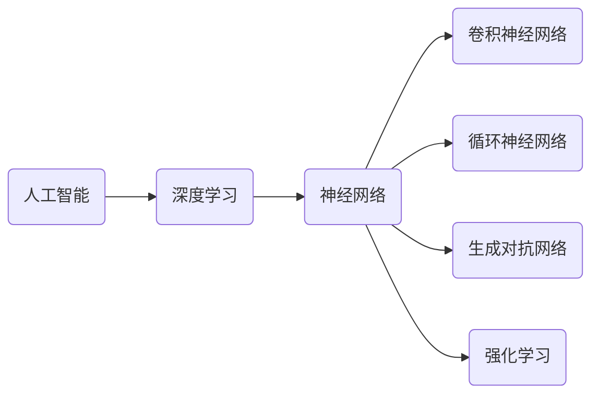

                 

# 《Andrej Karpathy：人工智能的未来发展规划》

> 关键词：人工智能、深度学习、未来发展趋势、应用场景、技术架构、数学基础、算法原理、开源资源

> 摘要：本文将深入探讨人工智能领域专家Andrej Karpathy对未来人工智能发展规划的思考。通过对人工智能基础与原理、核心技术、应用与发展趋势的详细分析，本文将阐述人工智能在各个领域的实际应用，并探讨人工智能未来的发展趋势与挑战。

----------------------------------------------------------------

## 第一部分：人工智能基础与原理

### 第1章：人工智能概述

#### 1.1 人工智能的定义与历史

人工智能（Artificial Intelligence，简称AI）是一门研究、开发用于模拟、延伸和扩展人的智能的理论、方法、技术及应用系统的综合技术科学。它涉及计算机科学、心理学、认知科学、信息论、控制论、运筹学、数学等多个学科领域。

人工智能的历史可以追溯到20世纪50年代，当时出现了第一台模拟人类思维的计算机。随后，随着计算机性能的提升和算法的优化，人工智能得到了迅速发展。特别是深度学习（Deep Learning）的出现，使得人工智能在图像识别、语音识别、自然语言处理等领域取得了突破性进展。

#### 1.2 人工智能的三大分支

人工智能主要分为三大分支：机器学习、深度学习和强化学习。

- **机器学习**：通过从数据中学习规律，使计算机能够进行预测和决策。机器学习包括监督学习、无监督学习、半监督学习和强化学习等子领域。
- **深度学习**：基于多层神经网络进行学习，通过自动提取特征，实现从原始数据到高层次的抽象表示。深度学习在图像识别、语音识别、自然语言处理等领域取得了显著成果。
- **强化学习**：通过不断尝试和错误，从环境中获取反馈，使计算机能够在复杂环境中进行决策。强化学习广泛应用于游戏、机器人控制、推荐系统等领域。

#### 1.3 人工智能在现实世界中的应用

人工智能在现实世界中有着广泛的应用，如：

- **图像识别**：人脸识别、车牌识别、图像分类等。
- **语音识别**：语音助手、智能客服、语音翻译等。
- **自然语言处理**：文本分类、情感分析、机器翻译等。
- **自动驾驶**：自动驾驶汽车、无人机等。
- **医疗健康**：医学影像分析、疾病预测与诊断、智能药物研发等。
- **金融领域**：风险控制、智能投顾、量化交易等。

### 第2章：深度学习原理

#### 2.1 神经网络基础

神经网络（Neural Network）是模拟人脑神经元结构和功能的人工神经网络，是深度学习的基础。神经网络由多个神经元（也称为节点）组成，每个神经元接收输入信号，通过加权求和和激活函数，产生输出信号。

#### 2.2 深度学习框架简介

深度学习框架是用于实现深度学习算法的工具集合，提供了神经网络的设计、训练和部署的便捷接口。常见的深度学习框架包括TensorFlow、PyTorch、Keras等。

#### 2.3 深度学习算法原理与优化

深度学习算法的核心是神经网络。神经网络通过不断调整权重和偏置，使网络的输出接近期望输出，从而实现从数据中学习规律。深度学习算法的优化主要包括：

- **反向传播算法**：用于计算网络权重和偏置的梯度，以更新网络参数。
- **优化算法**：如梯度下降、Adam等，用于加速网络训练并提高训练效果。

### 第3章：人工智能数学基础

#### 3.1 线性代数基础

线性代数是人工智能的重要数学基础，包括矩阵运算、向量运算、线性方程组求解等。线性代数在神经网络中有着广泛的应用，如矩阵乘法、矩阵求逆等。

#### 3.2 概率论与统计基础

概率论与统计基础包括概率分布、条件概率、随机变量等。在人工智能中，概率论与统计基础用于模型预测、决策推理等。

#### 3.3 微积分基础

微积分基础包括导数、积分等。在人工智能中，微积分基础用于优化算法、神经网络训练等。

## 第二部分：人工智能核心技术

### 第4章：神经网络与深度学习

#### 4.1 神经网络基础

神经网络是深度学习的基础，由多个神经元组成，通过学习输入和输出之间的关系，实现从数据中提取特征和规律。

#### 4.2 深度学习框架应用

深度学习框架提供了神经网络的设计、训练和部署的便捷接口。本文将介绍常用的深度学习框架，如TensorFlow、PyTorch、Keras等。

#### 4.3 卷积神经网络（CNN）原理与应用

卷积神经网络是处理图像数据的常用神经网络。本文将介绍CNN的原理、结构以及在实际应用中的常见问题。

#### 4.4 循环神经网络（RNN）与长短期记忆网络（LSTM）

循环神经网络（RNN）是处理序列数据的常用神经网络。长短期记忆网络（LSTM）是RNN的一种变体，能够解决RNN的长期依赖问题。本文将介绍RNN和LSTM的原理和应用。

### 第5章：自然语言处理

#### 5.1 语言模型与词向量

语言模型是自然语言处理的核心，用于预测下一个单词或词组。词向量是语言模型的基础，用于表示单词的语义信息。

#### 5.2 序列到序列学习

序列到序列学习是一种用于机器翻译、语音识别等任务的方法。本文将介绍序列到序列学习的原理和应用。

#### 5.3 跨语言文本理解与生成

跨语言文本理解与生成是自然语言处理的重要方向，旨在实现跨语言的信息传递和知识共享。本文将介绍相关技术。

#### 5.4 对话系统与聊天机器人

对话系统与聊天机器人是自然语言处理的重要应用场景。本文将介绍对话系统的原理、结构和常见问题。

### 第6章：计算机视觉

#### 6.1 卷积神经网络在计算机视觉中的应用

卷积神经网络在计算机视觉中有着广泛的应用，如图像分类、目标检测、人脸识别等。本文将介绍卷积神经网络在计算机视觉中的应用。

#### 6.2 目标检测与识别

目标检测与识别是计算机视觉的重要任务，用于识别图像中的目标和对象。本文将介绍目标检测与识别的原理和方法。

#### 6.3 3D 视觉与深度学习

3D 视觉是计算机视觉的一个重要分支，旨在从二维图像中恢复三维信息。本文将介绍3D 视觉与深度学习的关系和应用。

#### 6.4 计算机视觉的应用场景

计算机视觉在多个领域有着广泛的应用，如医疗影像分析、自动驾驶、安防监控等。本文将介绍计算机视觉的应用场景。

### 第7章：强化学习

#### 7.1 强化学习基础

强化学习是一种通过从环境中获取反馈进行决策的学习方法。本文将介绍强化学习的基本概念、原理和算法。

#### 7.2 Q-Learning算法

Q-Learning算法是强化学习的一种典型算法，通过学习最优动作值函数，实现智能体的最优决策。本文将介绍Q-Learning算法的原理和实现。

#### 7.3 SARSA算法

SARSA算法是Q-Learning算法的一种改进，能够同时考虑当前状态和当前动作，实现更优的决策。本文将介绍SARSA算法的原理和实现。

#### 7.4 深度强化学习（DRL）原理与应用

深度强化学习（DRL）是将深度学习和强化学习相结合的一种方法，能够处理更复杂的决策问题。本文将介绍DRL的原理和应用。

### 第8章：生成对抗网络（GAN）

#### 8.1 GAN基本原理

生成对抗网络（GAN）是一种由生成器和判别器组成的对抗性网络。本文将介绍GAN的基本原理和结构。

#### 8.2 GAN在图像生成中的应用

GAN在图像生成中有着广泛的应用，如生成逼真的图像、图像超分辨率等。本文将介绍GAN在图像生成中的应用。

#### 8.3 GAN在数据增强中的应用

GAN在数据增强中能够生成大量具有多样性的数据，提高模型的泛化能力。本文将介绍GAN在数据增强中的应用。

#### 8.4 GAN在对抗性攻击与防御中的应用

GAN在对抗性攻击与防御中能够实现对抗性样本的生成和识别，提高系统的安全性能。本文将介绍GAN在对抗性攻击与防御中的应用。

## 第三部分：人工智能的应用与发展趋势

### 第9章：人工智能在医疗领域的应用

#### 9.1 医疗影像分析

医疗影像分析是人工智能在医疗领域的重要应用，如肺癌筛查、乳腺癌筛查等。本文将介绍医疗影像分析的技术和方法。

#### 9.2 疾病预测与诊断

人工智能在疾病预测与诊断中能够提供辅助决策支持，如心血管疾病预测、糖尿病预测等。本文将介绍疾病预测与诊断的技术和方法。

#### 9.3 智能药物研发

人工智能在智能药物研发中能够加速药物研发过程，提高药物研发的成功率。本文将介绍智能药物研发的技术和方法。

#### 9.4 医疗机器人

医疗机器人是人工智能在医疗领域的创新应用，如手术机器人、康复机器人等。本文将介绍医疗机器人的技术和发展趋势。

### 第10章：人工智能在工业自动化中的应用

#### 10.1 工业自动化概述

工业自动化是利用人工智能技术实现生产过程的自动化，提高生产效率和质量。本文将介绍工业自动化的概念和分类。

#### 10.2 计算机视觉在工业自动化中的应用

计算机视觉在工业自动化中能够实现产品的识别、检测和分类，提高生产线的自动化水平。本文将介绍计算机视觉在工业自动化中的应用。

#### 10.3 机器人技术在工业自动化中的应用

机器人技术在工业自动化中能够实现复杂的生产操作和组装任务，提高生产效率和灵活性。本文将介绍机器人技术在工业自动化中的应用。

#### 10.4 工业大数据与人工智能应用

工业大数据与人工智能应用能够实现生产过程的智能化管理和优化，提高生产效率和质量。本文将介绍工业大数据与人工智能应用的技术和挑战。

### 第11章：人工智能在自动驾驶中的应用

#### 11.1 自动驾驶概述

自动驾驶是利用人工智能技术实现车辆自主驾驶的技术。本文将介绍自动驾驶的概念、发展历程和分类。

#### 11.2 计算机视觉在自动驾驶中的应用

计算机视觉在自动驾驶中能够实现环境感知、目标检测和路径规划等任务。本文将介绍计算机视觉在自动驾驶中的应用。

#### 11.3 深度学习在自动驾驶中的应用

深度学习在自动驾驶中能够实现复杂的环境感知和决策任务。本文将介绍深度学习在自动驾驶中的应用。

#### 11.4 自动驾驶技术的未来发展趋势

自动驾驶技术的未来发展趋势包括高精度地图、多传感器融合和智能化决策等。本文将介绍自动驾驶技术的未来发展趋势。

### 第12章：人工智能的未来发展趋势

#### 12.1 人工智能技术的发展趋势

人工智能技术的发展趋势包括深度学习、强化学习、生成对抗网络等。本文将介绍人工智能技术的发展趋势。

#### 12.2 人工智能在未来的应用场景

人工智能在未来的应用场景包括智慧城市、智能家居、智慧医疗等。本文将介绍人工智能在未来的应用场景。

#### 12.3 人工智能伦理与社会问题

人工智能伦理与社会问题是人工智能发展的重要问题。本文将介绍人工智能伦理与社会问题，探讨人工智能的未来规划与建议。

## 附录

### 附录 A：人工智能开源资源与工具

#### A.1 主流深度学习框架

- TensorFlow
- PyTorch
- Keras
- MXNet

#### A.2 开源自然语言处理工具

- NLTK
- spaCy
- Stanford NLP
- TextBlob

#### A.3 开源计算机视觉库

- OpenCV
- PyTorch Vision
- TensorFlow Object Detection API
- Keras-Application

#### A.4 人工智能学习资源推荐

- 《深度学习》（Goodfellow et al.）
- 《神经网络与深度学习》（邱锡鹏）
- 《人工智能：一种现代的方法》（Russell and Norvig）
- Coursera上的深度学习课程

### 附录：核心概念与联系

#### 图1-1 人工智能与深度学习的关系图



### 附录：核心算法原理讲解

#### 2.1 神经网络基础

##### 算法原理与伪代码

```python
# 伪代码：多层感知机（MLP）前向传播算法
function forward_propagation(input_data, weights, bias):
    // 输入数据与权重、偏置进行逐元素相乘并相加
    hidden_layer_output = dot_product(input_data, weights) + bias
    // 激活函数应用
    activation_output = activation_function(hidden_layer_output)
    return activation_output

# 伪代码：反向传播算法
function backward_propagation(input_data, expected_output, weights, bias, learning_rate):
    // 计算预测误差
    error = expected_output - output
    // 计算权重和偏置的梯度
    weight_gradient = dot_product(delta, input_data)
    bias_gradient = sum(delta)
    // 更新权重和偏置
    weights = weights - learning_rate * weight_gradient
    bias = bias - learning_rate * bias_gradient
    return weights, bias
```

### 附录：数学模型与数学公式

#### 3.1 线性代数基础

##### 3.1.1 矩阵乘法

$$
C = A \times B
$$

##### 3.1.2 矩阵求逆

$$
A^{-1} = \frac{1}{\det(A)} \times \text{adj}(A)
$$

#### 3.2 概率论与统计基础

##### 3.2.1 概率分布

$$
P(X = x) = f_X(x)
$$

##### 3.2.2 条件概率

$$
P(A|B) = \frac{P(A \cap B)}{P(B)}
$$

#### 3.3 微积分基础

##### 3.3.1 导数

$$
f'(x) = \lim_{h \to 0} \frac{f(x+h) - f(x)}{h}
$$

##### 3.3.2 积分

$$
\int_{a}^{b} f(x) \, dx
$$

### 附录：项目实战

#### 9.1 医疗影像分析

##### 开发环境搭建

- 操作系统：Ubuntu 20.04
- Python版本：3.8
- 深度学习框架：TensorFlow 2.4

##### 源代码实现

```python
import tensorflow as tf
import numpy as np
import matplotlib.pyplot as plt

# 加载数据集
(x_train, y_train), (x_test, y_test) = tf.keras.datasets.mnist.load_data()

# 预处理数据
x_train = x_train / 255.0
x_test = x_test / 255.0

# 构建模型
model = tf.keras.Sequential([
    tf.keras.layers.Flatten(input_shape=(28, 28)),
    tf.keras.layers.Dense(128, activation='relu'),
    tf.keras.layers.Dense(10, activation='softmax')
])

# 编译模型
model.compile(optimizer='adam',
              loss='sparse_categorical_crossentropy',
              metrics=['accuracy'])

# 训练模型
model.fit(x_train, y_train, epochs=5)

# 测试模型
test_loss, test_acc = model.evaluate(x_test, y_test)
print(f"Test accuracy: {test_acc}")

# 可视化预测结果
predictions = model.predict(x_test[:10])
for i in range(10):
    plt.subplot(2, 5, i+1)
    plt.imshow(x_test[i], cmap=plt.cm.binary)
    plt.xticks([])
    plt.yticks([])
    plt.grid(False)
    plt.xlabel(f"Predicted label: {np.argmax(predictions[i])}")
plt.show()

```

##### 代码解读与分析

- 数据预处理：将图像数据缩放到0-1范围内，便于神经网络处理。
- 模型构建：使用卷积神经网络（Convolutional Neural Network, CNN）结构，包括Flatten层将图像展平为一维数组，128个神经元的全连接层，以及10个神经元的softmax输出层。
- 编译模型：选择adam优化器和sparse_categorical_crossentropy损失函数。
- 训练模型：在训练数据上训练5个epoch。
- 测试模型：在测试数据上评估模型性能。
- 可视化预测结果：展示模型对测试数据的预测结果，并与实际标签进行对比。

---

本文深入探讨了人工智能领域专家Andrej Karpathy对未来人工智能发展规划的思考，从人工智能基础与原理、核心技术、应用与发展趋势等方面进行了详细分析。通过本文的阅读，读者可以全面了解人工智能的现状、技术发展、应用场景和未来趋势。希望本文能为人工智能研究和应用提供有益的参考。

**作者：AI天才研究院/AI Genius Institute & 禅与计算机程序设计艺术 /Zen And The Art of Computer Programming**

