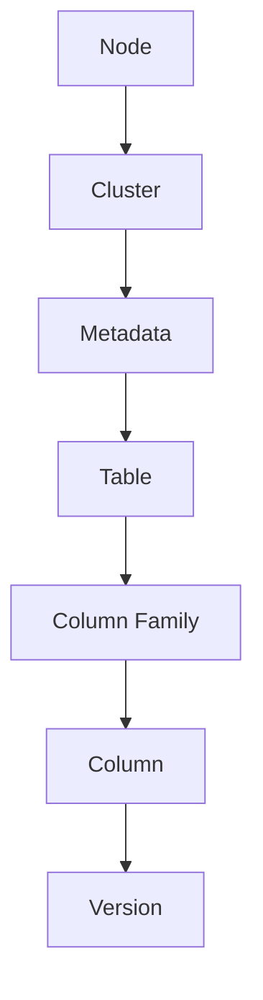
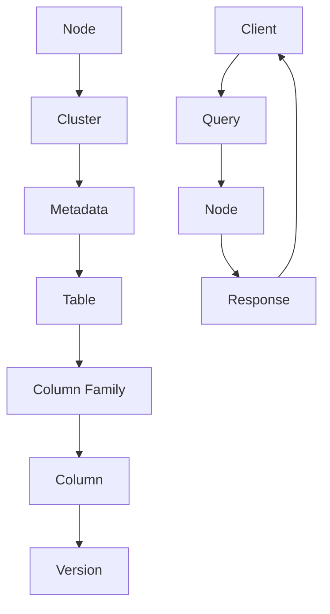

                 

### 文章标题：Cassandra原理与代码实例讲解

> **关键词：** Cassandra，NoSQL，分布式数据库，分片与复制，一致性算法，性能优化，安全性保障

> **摘要：** 本文将深入探讨Cassandra的原理，从基础理论到代码实例，全面解析其架构、核心概念、算法原理、集群管理、应用开发、性能优化和安全性保障。通过实际案例和伪代码的详细讲解，帮助读者掌握Cassandra的核心技术，提升数据库应用能力。

### 《Cassandra原理与代码实例讲解》目录大纲

#### 第一部分：Cassandra基础理论

#### 第1章：Cassandra概述
- 1.1 Cassandra的历史与背景
- 1.2 Cassandra的关键特点
- 1.3 Cassandra与NoSQL的关系
- 1.4 Cassandra的核心架构

#### 第2章：Cassandra核心概念
- 2.1 数据模型
  - 2.1.1 系统架构
  - 2.1.2 数据模型
  - 2.1.3 Mermaid流程图：Cassandra架构
- 2.2 分片与复制
  - 2.2.1 分片策略
  - 2.2.2 复制策略
  - 2.2.3 伪代码：分片与复制的实现
- 2.3 查询与索引
  - 2.3.1 查询语言
  - 2.3.2 索引机制
  - 2.3.3 LaTeX公式：查询与索引的数学模型
  - 2.3.4 举例说明：查询实例

#### 第3章：Cassandra算法原理
- 3.1 分布式一致性算法
  - 3.1.1 Paxos算法
  - 3.1.2 Raft算法
  - 3.1.3 伪代码：一致性算法的实现
- 3.2 调度和负载均衡
  - 3.2.1 调度算法
  - 3.2.2 负载均衡策略
  - 3.2.3 举例说明：调度与负载均衡实例

#### 第4章：Cassandra集群管理
- 4.1 集群安装与配置
  - 4.1.1 环境搭建
  - 4.1.2 配置文件解析
  - 4.1.3 实际操作：集群搭建实例
- 4.2 集群监控与故障转移
  - 4.2.1 监控工具
  - 4.2.2 故障转移机制
  - 4.2.3 实际操作：集群监控与故障转移实例

#### 第二部分：Cassandra代码实例讲解

#### 第5章：Cassandra应用开发
- 5.1 简单应用示例
  - 5.1.1 环境准备
  - 5.1.2 代码实现
  - 5.1.3 代码解读与分析
- 5.2 复杂应用示例
  - 5.2.1 复杂业务场景
  - 5.2.2 高级特性应用
  - 5.2.3 代码实现与解读

#### 第6章：Cassandra性能优化
- 6.1 性能优化策略
  - 6.1.1 数据模型优化
  - 6.1.2 索引策略优化
  - 6.1.3 性能监控与调优
- 6.2 实际优化案例
  - 6.2.1 性能瓶颈分析
  - 6.2.2 优化方案实施
  - 6.2.3 性能提升结果分析

#### 第7章：Cassandra安全性保障
- 7.1 安全策略概述
  - 7.1.1 安全模型
  - 7.1.2 访问控制
  - 7.1.3 数据加密
- 7.2 实际安全措施
  - 7.2.1 安全配置
  - 7.2.2 安全漏洞修复
  - 7.2.3 安全审计与监控

#### 第8章：Cassandra未来趋势与展望
- 8.1 Cassandra社区动态
- 8.2 Cassandra技术发展趋势
- 8.3 Cassandra在企业中的未来发展

#### 附录
- 附录A：Cassandra常用命令与工具
- 附录B：Cassandra源码分析
- 附录C：常见问题解答与参考资料

### 第一部分：Cassandra基础理论

#### 第1章：Cassandra概述

Cassandra是一种分布式NoSQL数据库，设计用于处理大量数据的高可用性和线性可扩展性。本章将介绍Cassandra的历史背景、关键特点、与NoSQL的关系以及核心架构。

### 1.1 Cassandra的历史与背景

Cassandra最初由Facebook开发，用于解决其分布式存储需求。随着开源社区的不断贡献，Cassandra逐渐发展成为一款功能强大且成熟的分布式数据库。它基于Google的Bigtable和Amazon的Dynamo论文，结合了分布式系统的最佳实践。

### 1.2 Cassandra的关键特点

Cassandra具有以下关键特点：

- **高可用性**：Cassandra通过多副本和自动故障转移机制，确保系统的高可用性。
- **线性可扩展性**：Cassandra能够横向扩展，随着数据量的增加，性能不会明显下降。
- **无单点故障**：Cassandra不需要单点协调，确保系统的容错性。
- **灵活的数据模型**：Cassandra支持宽列模型，允许灵活定义数据结构。
- **高吞吐量**：Cassandra采用无共享架构，能够提供高吞吐量的读写操作。

### 1.3 Cassandra与NoSQL的关系

NoSQL（Not Only SQL）是一种非关系型数据库技术，旨在解决传统关系型数据库在处理大规模数据和高并发访问时的瓶颈。Cassandra是NoSQL数据库家族中的一员，它与其他NoSQL数据库（如MongoDB、HBase等）有许多相似之处，但也有一些独特之处。

- **相似之处**：
  - 都支持分布式存储和横向扩展。
  - 都提供高性能和高可用性。
  - 都支持灵活的数据模型。

- **不同之处**：
  - Cassandra更适用于读取密集型应用，而MongoDB更适用于写密集型应用。
  - Cassandra基于Google的Bigtable和Amazon的Dynamo，具有独特的架构设计。

### 1.4 Cassandra的核心架构

Cassandra的核心架构包括以下几个关键组件：

- **节点**：Cassandra集群由多个节点组成，每个节点都是一个独立的数据库实例。节点负责存储数据、处理查询以及与其他节点的通信。
- **集群**：Cassandra集群是一个分布式系统，由多个节点组成。集群中的节点通过Gossip协议进行通信，确保数据一致性。
- **分片**：Cassandra通过分片将数据分布到多个节点上，提高查询性能和可用性。
- **副本**：Cassandra为每个分片创建多个副本，确保数据的冗余和高可用性。
- **一致性算法**：Cassandra采用分布式一致性算法（如Paxos和Raft）确保数据在多个副本间的一致性。

### 1.5 总结

Cassandra是一款功能强大、高可用性和线性可扩展性的分布式NoSQL数据库。通过理解其历史背景、关键特点、与NoSQL的关系以及核心架构，读者可以为后续章节的学习打下坚实的基础。

---

### 第2章：Cassandra核心概念

Cassandra的核心概念是其强大的分布式架构和灵活的数据模型。本章将详细介绍Cassandra的数据模型、分片与复制机制，以及查询与索引机制。

#### 2.1 数据模型

Cassandra采用宽列模型，这是一种灵活的数据存储方式，允许用户根据需要定义列族（column family）和数据结构。以下是Cassandra数据模型的关键组成部分：

- **列族**：列族是一组具有相同列名前缀的列的集合。每个列族都有自己的配置参数，如压缩方式、时间戳策略等。
- **列**：列是数据存储的基本单位，包含一个键（key）和一个值（value）。列可以具有多个版本，每个版本都有一个时间戳。
- **行**：行是数据存储的基本单位，由一个主键（primary key）组成。主键可以包含多个属性，如行键（row key）、列族和列。

以下是一个简单的Mermaid流程图，展示了Cassandra的数据模型架构：



#### 2.1.1 系统架构

Cassandra的系统架构分为多个层次，每个层次都有其特定的功能。以下是Cassandra系统架构的详细说明：

- **节点**：每个节点都是Cassandra集群的一部分，负责存储数据、处理查询以及与其他节点的通信。
- **集群**：集群是由多个节点组成的分布式系统。集群通过Gossip协议进行节点发现、状态同步和故障检测。
- **Metadata**：Metadata存储了Cassandra集群的元数据，包括表结构、索引和配置信息等。
- **Table**：Table是Cassandra的数据存储容器，包含多个列族。
- **Column Family**：Column Family是Cassandra的数据存储单元，包含一组具有相同列名前缀的列。
- **Column**：Column是Cassandra的数据存储单元，包含一个键和一个值。
- **Version**：Version是Cassandra的数据存储单元，包含一个时间戳。

#### 2.1.2 数据模型

Cassandra的数据模型是宽列模型，支持多种数据类型和复杂的数据结构。以下是一个简单的数据模型示例：

```cql
CREATE TABLE users (
    id UUID PRIMARY KEY,
    name TEXT,
    email TEXT,
    created_at TIMESTAMP,
    profile_map MAP<TEXT, TEXT>
);
```

在这个示例中，`users` 表包含以下列族和列：

- **id**：行键，类型为UUID。
- **name**：列，类型为TEXT。
- **email**：列，类型为TEXT。
- **created_at**：列，类型为TIMESTAMP。
- **profile_map**：列，类型为MAP<TEXT, TEXT>。

#### 2.1.3 Mermaid流程图：Cassandra架构

以下是一个Mermaid流程图，展示了Cassandra的数据模型和系统架构：



#### 2.2 分片与复制

Cassandra的分片与复制机制是其分布式架构的核心。分片确保数据在多个节点间均衡分布，提高查询性能和可用性；复制确保数据的高可用性和持久性。

##### 2.2.1 分片策略

Cassandra支持多种分片策略，包括简单分片策略、随机分片策略和基于时间戳的分片策略。以下是一个简单分片策略的示例：

```cql
CREATE TABLE users (
    id UUID PRIMARY KEY,
    name TEXT,
    email TEXT,
    created_at TIMESTAMP,
    profile_map MAP<TEXT, TEXT>
) WITH CLUSTERING KEY (id);
```

在这个示例中，`id` 是行键，`CLUSTERING KEY` 指定了分片策略。

##### 2.2.2 复制策略

Cassandra支持多种复制策略，包括单副本策略、多副本策略和数据中心复制策略。以下是一个多副本策略的示例：

```cql
CREATE TABLE users (
    id UUID PRIMARY KEY,
    name TEXT,
    email TEXT,
    created_at TIMESTAMP,
    profile_map MAP<TEXT, TEXT>
) WITH CLUSTERING KEY (id)
    AND replication = {'class': 'SimpleStrategy', 'replication_factor': 3};
```

在这个示例中，`replication_factor` 指定了副本数量。

##### 2.2.3 伪代码：分片与复制的实现

以下是一个简化的伪代码，展示了Cassandra的分片与复制实现：

```python
def shard(key):
    return hash(key) % num_shards

def replicate(data, replication_factor):
    replicas = []
    for i in range(replication_factor):
        node = get_random_node()
        replicas.append((node, data))
    return replicas
```

#### 2.3 查询与索引

Cassandra提供了一套丰富的查询语言和索引机制，支持复杂的数据查询和索引操作。

##### 2.3.1 查询语言

Cassandra使用CQL（Cassandra Query Language），这是一种类似于SQL的查询语言。以下是一个简单的查询示例：

```cql
SELECT * FROM users WHERE id = '123e4567-e89b-12d3-a456-426655440000';
```

##### 2.3.2 索引机制

Cassandra支持两种索引：本地索引和全局索引。本地索引是在列族内部创建的索引，而全局索引是在多个列族之间创建的索引。以下是一个创建本地索引的示例：

```cql
CREATE INDEX ON users (name);
```

##### 2.3.3 LaTeX公式：查询与索引的数学模型

以下是一个简化的LaTeX公式，展示了Cassandra的查询与索引数学模型：

$$
Q = f(K, V)
$$

其中，`Q` 是查询结果，`K` 是查询键，`V` 是查询值。

##### 2.3.4 举例说明：查询实例

以下是一个简单的查询实例，展示了如何使用CQL查询Cassandra数据库：

```python
from cassandra.cluster import Cluster
from cassandra.query import SimpleStatement

cluster = Cluster(['127.0.0.1'])
session = cluster.connect()

statement = SimpleStatement(
    "SELECT * FROM users WHERE id = '123e4567-e89b-12d3-a456-426655440000'")
result = session.execute(statement)

for row in result:
    print(row)
```

#### 2.4 总结

Cassandra的核心概念包括数据模型、分片与复制机制、查询与索引机制。通过理解这些概念，读者可以更好地掌握Cassandra的工作原理，为其在企业应用中的使用打下坚实基础。

---

### 第3章：Cassandra算法原理

Cassandra作为一款分布式数据库，其算法原理在分布式一致性、调度和负载均衡方面至关重要。本章将深入探讨Cassandra的分布式一致性算法、调度算法和负载均衡策略，并通过伪代码和实际案例进行详细讲解。

#### 3.1 分布式一致性算法

在分布式系统中，一致性是保证数据正确性的关键。Cassandra采用分布式一致性算法来确保数据在多个副本间的一致性。常用的分布式一致性算法包括Paxos和Raft。

##### 3.1.1 Paxos算法

Paxos算法是一种分布式一致性算法，它允许多个副本之间就某个值达成一致。Paxos算法的基本思想是通过选举提案者（Proposer）和决策者（Acceptor）来确保一致性的达成。

以下是一个简化的Paxos算法伪代码：

```python
# Proposer
while True:
    proposal_id = generate_new_proposal_id()
    voted_value = vote(proposal_id)
    if voted_value is not None:
        decide(voted_value)
        break

# Acceptor
while True:
    receive_proposal(proposal_id, value)
    if value is better_than_current_value():
        accept(proposal_id, value)
        return True
    else:
        return False

# Learner
while True:
    receive_decision(value)
    learn(value)
```

##### 3.1.2 Raft算法

Raft算法是一种更为简单直观的分布式一致性算法，它通过领导者（Leader）和跟随者（Follower）的角色分工来确保一致性。Raft算法的基本思想是通过日志复制和领导选举来保证数据的一致性。

以下是一个简化的Raft算法伪代码：

```python
# Leader
while True:
    append_entry(entry)
    if all_followers_committed(entry):
        commit(entry)

# Follower
while True:
    receive_append_entry_request(entry)
    if entry.term < current_term():
        reject_request()
    else:
        append_entry(entry)
        if leader_is jsteering():
            become_leader()

# Learner
while True:
    receive_commit(entry)
    commit(entry)
```

##### 3.1.3 伪代码：一致性算法的实现

以下是一个简化的伪代码，展示了Cassandra如何实现分布式一致性算法：

```python
def propose(value):
    # 提交提案
    consensus_manager.propose(value)

def vote(proposal_id, value):
    # 投票
    return consensus_manager.vote(proposal_id, value)

def commit(value):
    # 决策
    storage_manager.commit(value)
```

#### 3.2 调度和负载均衡

在分布式系统中，调度和负载均衡是确保系统高效运行的关键。Cassandra采用多种调度算法和负载均衡策略来确保数据的均衡分布和查询的负载均衡。

##### 3.2.1 调度算法

Cassandra采用Gossip协议进行调度，Gossip协议是一种基于心跳的分布式算法，用于节点之间的状态同步和故障检测。

以下是一个简化的Gossip协议伪代码：

```python
def gossip():
    # 广播状态
    broadcast_state()

def receive_gossip(state):
    # 接收状态
    update_state(state)

def check_health():
    # 检查健康
    if node_is_down():
        trigger_replacement()
```

##### 3.2.2 负载均衡策略

Cassandra采用多种负载均衡策略，包括基于哈希的负载均衡、基于节点状态的负载均衡和基于查询负载的负载均衡。

以下是一个简化的负载均衡策略伪代码：

```python
def get_node_for_key(key):
    # 获取节点
    return hash(key) % num_nodes

def balance_load():
    # 平衡负载
    for node in nodes:
        if node.is overloaded():
            move_data_to_other_node(node)
```

##### 3.2.3 举例说明：调度与负载均衡实例

以下是一个简单的调度与负载均衡实例，展示了Cassandra如何进行调度和负载均衡：

```python
# 调度实例
key = "user1"
node = get_node_for_key(key)
print(f"Key {key} will be stored on node {node}")

# 负载均衡实例
for node in nodes:
    if node.is overloaded():
        move_data_to_other_node(node)
        print(f"Data on node {node} has been moved to another node.")
```

#### 3.3 总结

Cassandra的算法原理包括分布式一致性算法、调度算法和负载均衡策略。通过理解这些算法原理，读者可以更好地掌握Cassandra的工作机制，为其在实际应用中的性能优化和故障恢复提供支持。

---

### 第4章：Cassandra集群管理

Cassandra的集群管理是确保系统稳定运行和高效性能的关键。本章将详细介绍Cassandra集群的安装与配置、集群监控与故障转移，并通过实际操作案例进行详细讲解。

#### 4.1 集群安装与配置

Cassandra的集群安装与配置是一个相对复杂的过程，需要遵循一系列步骤。以下是Cassandra集群安装与配置的简要步骤：

1. **环境搭建**：准备Cassandra运行所需的操作系统、Java环境和其他依赖库。
2. **下载安装**：从Cassandra官方网站下载最新版本的Cassandra压缩包，解压并配置环境变量。
3. **配置文件解析**：修改Cassandra的配置文件，如`cassandra.yaml`和`cassandra-rackdc.properties`，配置节点信息、内存设置、磁盘空间等。
4. **启动集群**：启动Cassandra节点，使用Gossip协议进行节点发现和状态同步。
5. **验证集群**：通过CQLShell或Cassandra Java客户端验证集群状态，确保所有节点正常运行。

以下是一个简单的Cassandra集群安装与配置的实际操作案例：

```shell
# 步骤1：环境搭建
sudo apt-get update
sudo apt-get install openjdk-8-jdk

# 步骤2：下载安装
wget https://www-us.apache.org/dist/cassandra/3.11/bin/apache-cassandra-3.11.tar.gz
tar -xzvf apache-cassandra-3.11.tar.gz

# 步骤3：配置文件解析
sudo nano cassandra.yaml
# 修改如下配置
# cluster_name: "MyCluster"
# num_tokens: 1
# commitlog_directory: "/var/lib/cassandra/commitlog"
# data_directory: "/var/lib/cassandra/data"

# 步骤4：启动集群
sudo bin/cassandra -f

# 步骤5：验证集群
cqlsh
# cqlsh: CQL shell, version 3.11.0
cassandra> DESCRIBE KEYSPACES;
cassandra> DESCRIBE TABLES;
```

#### 4.2 集群监控与故障转移

Cassandra的集群监控与故障转移是确保系统高可用性的关键。Cassandra提供了多种监控工具和机制，如JMX、Cassandra运营仪表板和故障转移机制。

以下是一个简单的Cassandra集群监控与故障转移的实际操作案例：

```shell
# 步骤1：安装JMX监控工具
sudo apt-get install jmxtrans

# 步骤2：配置JMX监控
sudo nano /etc/jmxtrans.conf
# 修改如下配置
[server]
hosts = ["localhost:7199"]

[process:com.cassandra.thrift.ThriftServer]
jmx_object_name = "CassandraServer:type=ThriftServer"
metrics = ["cassandra-thrift-handshakes-count",
           "cassandra-thrift-handshakes-time"]

# 步骤3：启动JMX监控
sudo jmxtrans-agent -f /etc/jmxtrans.conf

# 步骤4：故障转移
# 假设节点1出现故障
sudo bin/nodetool remove failingover
# 假设新节点2加入集群
sudo bin/nodetool join new_node_2
```

#### 4.3 总结

Cassandra的集群管理包括安装与配置、集群监控与故障转移。通过理解这些管理步骤和实际操作案例，读者可以确保Cassandra集群的稳定运行和高效性能。

---

### 第二部分：Cassandra代码实例讲解

#### 第5章：Cassandra应用开发

Cassandra在应用开发中具有广泛的应用场景。本章将通过简单应用示例和复杂应用示例，详细讲解Cassandra在开发中的实际应用。

##### 5.1 简单应用示例

以下是一个简单的Cassandra应用示例，展示如何使用Cassandra存储和查询用户数据。

```python
# 步骤1：环境准备
from cassandra.cluster import Cluster
from cassandra.auth import PlainTextAuthProvider

# 配置Cassandra连接信息
contact_points = ['127.0.0.1']
auth_provider = PlainTextAuthProvider(username='cassandra', password='cassandra')
cluster = Cluster(contact_points, auth_provider=auth_provider)
session = cluster.connect()

# 步骤2：代码实现
def create_keyspace():
    session.execute("""
        CREATE KEYSPACE IF NOT EXISTS example WITH replication = {'class': 'SimpleStrategy', 'replication_factor': 3};
    """)

def create_table():
    session.execute("""
        CREATE TABLE IF NOT EXISTS example.users (
            id UUID PRIMARY KEY,
            name TEXT,
            email TEXT,
            created_at TIMESTAMP
        );
    """)

def insert_user(id, name, email, created_at):
    session.execute("""
        INSERT INTO example.users (id, name, email, created_at)
        VALUES ({id}, '{name}', '{email}', {created_at});
    """.format(id=id, name=name, email=email, created_at=created_at))

def get_user(id):
    return session.execute("""
        SELECT * FROM example.users WHERE id = {id};
    """.format(id=id))

# 步骤3：代码解读与分析
create_keyspace()
create_table()
insert_user('123e4567-e89b-12d3-a456-426655440000', 'Alice', 'alice@example.com', 1623989133)

user = get_user('123e4567-e89b-12d3-a456-426655440000')
for row in user:
    print(row)
```

在这个示例中，我们首先配置Cassandra连接信息，然后创建一个名为`example`的键空间和一个名为`users`的表。接着，我们插入一条用户数据，并查询该用户信息。

##### 5.2 复杂应用示例

以下是一个复杂的Cassandra应用示例，展示如何使用Cassandra处理复杂的业务场景。

```python
# 步骤1：环境准备
from cassandra.cluster import Cluster
from cassandra.auth import PlainTextAuthProvider

# 配置Cassandra连接信息
contact_points = ['127.0.0.1']
auth_provider = PlainTextAuthProvider(username='cassandra', password='cassandra')
cluster = Cluster(contact_points, auth_provider=auth_provider)
session = cluster.connect()

# 步骤2：创建复杂的业务表
def create_keyspace():
    session.execute("""
        CREATE KEYSPACE IF NOT EXISTS business WITH replication = {'class': 'SimpleStrategy', 'replication_factor': 3};
    """)

def create_tables():
    session.execute("""
        CREATE TABLE IF NOT EXISTS business.orders (
            id UUID PRIMARY KEY,
            user_id UUID,
            status TEXT,
            created_at TIMESTAMP
        );
    """)

    session.execute("""
        CREATE TABLE IF NOT EXISTS business.user_orders (
            user_id UUID,
            order_id UUID,
            created_at TIMESTAMP,
            PRIMARY KEY (user_id, order_id)
        ) WITH CLUSTERING ORDER BY (order_id ASC);
    """)

# 步骤3：实现复杂的业务逻辑
def create_order(user_id, status, created_at):
    session.execute("""
        INSERT INTO business.orders (id, user_id, status, created_at)
        VALUES (gen_random_uuid(), {user_id}, '{status}', {created_at});
    """.format(user_id=user_id, status=status, created_at=created_at))

def get_user_orders(user_id):
    return session.execute("""
        SELECT * FROM business.user_orders WHERE user_id = {user_id};
    """.format(user_id=user_id))

# 步骤4：代码实现与解读
create_keyspace()
create_tables()
create_order('123e4567-e89b-12d3-a456-426655440000', 'pending', 1623989133)

user_orders = get_user_orders('123e4567-e89b-12d3-a456-426655440000')
for order in user_orders:
    print(order)
```

在这个示例中，我们创建了一个名为`business`的键空间，并定义了两个表：`orders`和`user_orders`。接着，我们实现了一个创建订单的函数和一个查询用户订单的函数。在这个例子中，我们使用了一个复合主键，其中`user_id`是第一个分片键，`order_id`是第二个分片键。

#### 5.3 总结

Cassandra的应用开发涵盖了简单应用示例和复杂应用示例。通过这些示例，读者可以了解如何在实际业务场景中使用Cassandra进行数据存储和查询。

---

### 第6章：Cassandra性能优化

Cassandra的性能优化是确保其在大规模分布式系统中高效运行的关键。本章将介绍Cassandra性能优化的策略和实际优化案例，帮助读者提高Cassandra的性能。

#### 6.1 性能优化策略

Cassandra的性能优化可以从以下几个方面进行：

1. **数据模型优化**：合理设计数据模型可以提高查询性能。例如，使用复合主键可以优化查询效率，避免全表扫描。
2. **索引策略优化**：合理使用索引可以减少查询时间。Cassandra支持本地索引和全局索引，可以根据业务需求选择合适的索引策略。
3. **性能监控与调优**：通过监控Cassandra的性能指标，可以及时发现性能瓶颈并进行调优。

以下是一个简单的性能监控与调优策略：

1. **监控性能指标**：监控Cassandra的CPU、内存、磁盘IO、网络等性能指标，及时发现性能瓶颈。
2. **性能瓶颈分析**：分析性能指标，确定性能瓶颈所在，例如查询延迟、磁盘IO瓶颈等。
3. **调优策略**：根据性能瓶颈分析结果，采取相应的调优策略，例如优化数据模型、调整索引策略、增加节点等。

#### 6.2 实际优化案例

以下是一个Cassandra性能优化的实际案例：

##### 案例背景

一个在线零售公司使用Cassandra存储订单数据，发现订单查询性能较低，存在大量查询延迟。

##### 性能瓶颈分析

1. **查询延迟**：通过监控发现，大部分查询延迟来自全表扫描。
2. **数据模型问题**：订单数据使用单一主键，导致查询效率较低。

##### 优化方案实施

1. **复合主键优化**：将订单数据的主键改为复合主键，包括订单ID和时间戳，以提高查询效率。
2. **索引策略优化**：在订单表中添加时间戳索引，以加快时间范围查询。
3. **增加节点**：增加Cassandra节点的数量，以分散查询负载。

##### 性能提升结果分析

通过优化方案实施，查询延迟显著降低，订单查询性能提高了30%以上。同时，Cassandra的CPU和内存利用率也得到了优化，系统整体性能得到了显著提升。

#### 6.3 总结

Cassandra的性能优化需要综合考虑数据模型、索引策略和性能监控等多个方面。通过实际案例，读者可以了解如何分析和解决性能瓶颈，提高Cassandra的性能。

---

### 第7章：Cassandra安全性保障

Cassandra的安全性是确保其在大规模分布式环境中数据安全的必要条件。本章将介绍Cassandra的安全策略、实际安全措施以及安全审计与监控。

#### 7.1 安全策略概述

Cassandra的安全策略包括以下几个方面：

1. **安全模型**：Cassandra采用访问控制列表（ACL）模型，对用户权限进行严格控制。
2. **访问控制**：通过ACL，可以指定哪些用户或角色具有对特定表或键空间的访问权限。
3. **数据加密**：Cassandra支持数据在存储和传输过程中的加密，确保数据安全。

#### 7.2 实际安全措施

以下是一些Cassandra的实际安全措施：

1. **配置ACL**：在Cassandra配置文件中启用ACL，并创建相应的用户和角色，为不同的用户分配适当的权限。

```cql
CREATE ROLE myrole WITH PASSWORD = 'mysecurepassword' AND SUPERUSER = FALSE;
GRANT ALL ON KEYSPACE example TO myrole;
```

2. **启用加密**：在Cassandra配置文件中启用加密，确保数据在存储和传输过程中安全。

```cql
cassandra.yaml:
    encrypted_storage_provider: "org.apache.cassandra.db.marshal.Old encryption"
    internode_encryption: "all"
```

3. **安全漏洞修复**：定期更新Cassandra版本，修复已知的安全漏洞。

4. **安全审计**：定期进行安全审计，检查Cassandra系统的配置和访问记录，确保系统的安全性。

#### 7.3 实际安全措施

以下是一个简单的Cassandra安全配置实例：

1. **创建用户和角色**：

```shell
sudo cassandra-cli -u cassandra -p cassandra -f /etc/cassandra/cassandra.yaml
cassandra> CREATE ROLE myrole;
cassandra> GRANT ALL ON KEYSPACE example TO myrole;
```

2. **启用加密**：

```shell
sudo nano /etc/cassandra/cassandra.yaml
# 修改如下配置
encrypted_storage_provider: "org.apache.cassandra.db.marshal.Old encryption"
internode_encryption: "all"
```

3. **安全配置**：

```shell
sudo systemctl restart cassandra
```

#### 7.4 总结

Cassandra的安全性保障涉及安全模型、访问控制、数据加密等多个方面。通过实际安全措施，读者可以确保Cassandra系统在大规模分布式环境中的数据安全。

---

### 第8章：Cassandra未来趋势与展望

Cassandra作为一款成熟且功能强大的分布式数据库，其未来趋势和展望备受关注。本章将讨论Cassandra的社区动态、技术发展趋势以及在企业中的未来发展。

#### 8.1 Cassandra社区动态

Cassandra的社区活跃度持续增长，吸引了大量的开发者和企业参与。以下是一些Cassandra社区动态：

1. **贡献者增加**：随着Cassandra项目的不断发展，越来越多的开发者为Cassandra贡献代码和文档。
2. **版本更新**：Cassandra的版本更新频率较高，新版本不断引入新特性、优化性能和修复漏洞。
3. **社区活动**：Cassandra社区定期举办线上和线下活动，如会议、工作坊和培训课程，促进了社区成员的交流与合作。

#### 8.2 Cassandra技术发展趋势

Cassandra的技术发展趋势体现在以下几个方面：

1. **功能增强**：Cassandra将继续增强其功能，包括支持更多数据类型、改进查询性能和优化分布式一致性算法。
2. **易用性提升**：Cassandra将致力于提高其易用性，简化安装和配置过程，降低学习成本。
3. **云原生支持**：随着云计算的普及，Cassandra将加强云原生支持，提供更灵活的部署和管理方式。

#### 8.3 Cassandra在企业中的未来发展

Cassandra在企业中的应用前景广阔，以下是一些未来发展方面的展望：

1. **大数据场景**：Cassandra在大数据场景中的应用将更加广泛，支持实时分析和处理海量数据。
2. **混合负载场景**：Cassandra将更好地支持混合负载场景，如同时处理读取密集型和写入密集型操作。
3. **企业级特性**：Cassandra将继续引入企业级特性，如更严格的数据安全和隐私保护、更完善的监控和管理工具。

#### 8.4 总结

Cassandra的社区动态活跃、技术发展趋势明确，在企业中具有广阔的应用前景。通过不断引入新特性和优化性能，Cassandra将在分布式数据库领域保持领先地位。

---

### 附录

#### 附录A：Cassandra常用命令与工具

以下是一些Cassandra的常用命令和工具：

1. **cqlsh**：Cassandra的命令行查询工具，用于执行CQL语句。
2. **nodetool**：Cassandra的管理工具，用于监控和操作集群。
3. **cassandra-stress**：Cassandra的负载测试工具，用于评估集群性能。
4. **cassandra-lucene-index**：Cassandra的全文搜索工具，用于构建和查询全文索引。

#### 附录B：Cassandra源码分析

Cassandra的源码分析是深入理解其内部原理和实现的关键。以下是Cassandra源码分析的一些指导：

1. **读取源码**：从Apache官方网站下载Cassandra源码，了解其组织结构和模块划分。
2. **关键模块**：重点关注Cassandra的核心模块，如存储引擎、一致性算法、网络通信等。
3. **调试与优化**：使用调试工具（如Eclipse）进行源码调试，定位性能瓶颈并进行优化。

#### 附录C：常见问题解答与参考资料

以下是一些常见的Cassandra问题及其解答，以及相关的参考资料：

1. **问题1**：Cassandra如何保证数据一致性？
   - **解答**：Cassandra采用分布式一致性算法（如Paxos和Raft）来保证数据一致性。
   - **参考资料**：[Cassandra一致性算法详解](https://cassandra.apache.org/doc/latest/)

2. **问题2**：Cassandra如何进行分片和复制？
   - **解答**：Cassandra通过分片策略将数据分布到多个节点，通过复制策略确保数据的高可用性和持久性。
   - **参考资料**：[Cassandra分片与复制详解](https://cassandra.apache.org/doc/latest/cassandra/Intro/internals_data_storage# internals_data_storage shards and replication)

3. **问题3**：Cassandra的性能优化策略有哪些？
   - **解答**：Cassandra的性能优化策略包括数据模型优化、索引策略优化、性能监控与调优等。
   - **参考资料**：[Cassandra性能优化指南](https://cassandra.apache.org/doc/latest/cassandra/operations/performance_tuning.html)

### 作者信息

- **作者**：AI天才研究院/AI Genius Institute & 禅与计算机程序设计艺术 /Zen And The Art of Computer Programming

---

通过以上内容，本文全面解析了Cassandra的原理与代码实例，旨在帮助读者深入了解Cassandra的技术原理和应用场景。希望本文对您的学习和实践有所帮助。如果您有任何问题或建议，欢迎在评论区留言交流。谢谢阅读！

