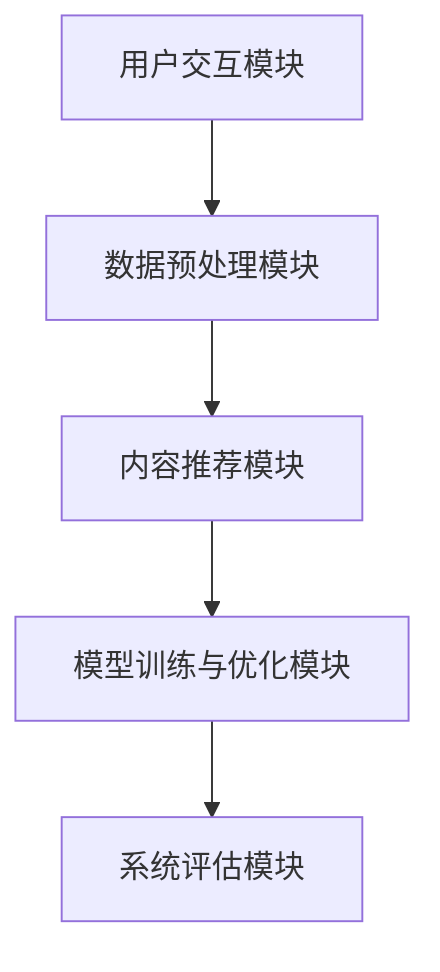

                 

## 《Chat-Rec: LLMs增强传统推荐》

关键词：传统推荐系统、语言模型、LLMs、Chat-Rec、用户交互、内容推荐、系统架构、评估方法、案例研究、未来展望

摘要：本文将探讨如何使用语言模型（LLMs）增强传统推荐系统。首先，我们将介绍传统推荐系统的基础概念和发展历程，以及推荐系统面临的主要挑战。随后，我们将深入探讨LLMs的基本原理和优势。接着，我们将设计并解析一个名为Chat-Rec的系统，该系统结合了LLMs和传统推荐技术，以提升推荐效果和用户交互体验。最后，我们将通过案例研究和未来展望，展示Chat-Rec系统的应用前景和潜在挑战。

### 第一部分：引言

#### 第1章：传统推荐系统概述

推荐系统是一种信息过滤技术，旨在根据用户的兴趣和行为，向他们推荐相关的商品、内容或服务。这不仅能提高用户的满意度，还能为平台方带来更高的转化率和收入。

**1.1 推荐系统的基本概念**

推荐系统主要由以下三个核心部分组成：

1. **用户：** 推荐系统的服务对象。
2. **项目：** 被推荐的对象，如商品、文章、视频等。
3. **评分或行为：** 用户对项目的评价或行为，如点击、购买、评分等。

**1.2 推荐系统的基本类型**

根据推荐策略的不同，推荐系统可分为以下几类：

1. **基于内容的推荐（Content-based Filtering）：**
   该方法通过分析项目的内容特征和用户的兴趣特征，来推荐相似的项目。优点是能够推荐个性化和高度相关的项目，缺点是可能会受到数据稀疏性的影响。

2. **基于协同过滤的推荐（Collaborative Filtering）：**
   该方法通过分析用户之间的相似性，来推荐其他用户喜欢的项目。优点是能够处理大量用户数据，缺点是可能会推荐过于普遍的项目，缺乏个性化。

3. **混合推荐系统（Hybrid Recommender Systems）：**
   该方法结合了基于内容和基于协同过滤的方法，以综合两者的优点。例如，可以先通过协同过滤找出相似用户，再根据相似用户喜欢的项目内容来推荐。

**1.3 推荐系统的发展历程**

推荐系统的发展可以大致分为以下几个阶段：

1. **早期推荐系统（1990s）：**
   主要基于用户的历史行为进行简单的推荐，如购买记录或浏览历史。

2. **基于协同过滤的推荐系统（2000s）：**
   协同过滤方法得到广泛应用，能够处理大规模用户数据，并实现较好的推荐效果。

3. **基于内容的推荐系统（2010s）：**
   基于内容的推荐方法开始兴起，通过分析项目的内容特征，实现更加个性化的推荐。

4. **混合推荐系统（2020s）：**
   混合推荐系统成为主流，通过结合协同过滤和内容推荐的方法，实现更优秀的推荐效果。

**1.4 推荐系统面临的挑战**

尽管推荐系统在许多应用场景中取得了显著的成功，但仍然面临一些挑战：

1. **数据稀疏性：**
   大多数用户对大部分项目都没有评价或行为，导致数据稀疏。

2. **实时性：**
   随着用户需求的不断变化，推荐系统需要实时响应用户的请求。

3. **多样性：**
   用户期望推荐系统不仅推荐高质量的项目，还能提供多样化的选择。

4. **可解释性：**
   用户希望理解推荐系统的推荐逻辑，以便进行反馈和调整。

#### 第2章：LLMs概述

语言模型（LLMs）是一种基于大规模语料库训练的模型，能够对自然语言进行理解和生成。在本节中，我们将介绍LLMs的基本概念、基本原理和应用。

**2.1 语言学基础**

自然语言处理（NLP）是计算机科学和人工智能领域的一个重要分支，旨在使计算机能够理解和处理自然语言。NLP主要包括以下几个方面：

1. **文本预处理：** 对原始文本进行清洗、分词、去停用词等操作，以便后续处理。
2. **词向量表示：** 将文本中的单词转换为向量表示，以便进行数学运算。
3. **语法分析：** 分析文本的语法结构，如句法分析、语义分析等。
4. **语义理解：** 理解文本中的语义含义，如情感分析、实体识别等。

**2.2 LLMs的基本原理**

LLMs的基本原理可以概括为以下几个方面：

1. **Transformer模型：**
   Transformer模型是一种基于自注意力机制的深度神经网络模型，能够捕捉文本中的长距离依赖关系。它由多个自注意力层和前馈神经网络组成，能够对输入文本进行编码和生成。

2. **GPT系列模型：**
   GPT（Generative Pre-trained Transformer）系列模型是OpenAI开发的一系列基于Transformer模型的预训练语言模型。GPT-3是目前最先进的语言模型之一，具有非常强的语义理解和生成能力。

**2.3 LLMs的优势与应用**

LLMs具有以下优势和应用：

1. **强大语义理解能力：**
   LLMs能够理解自然语言的语义含义，能够进行文本分类、情感分析、问答系统等任务。

2. **提升推荐效果：**
   LLMs可以用于用户意图识别和上下文理解，有助于提高推荐系统的准确性和多样性。

3. **多语言处理能力：**
   LLMs可以处理多种语言，支持跨语言的推荐和交互。

4. **自动化内容生成：**
   LLMs可以用于自动化内容生成，如文章写作、对话系统等。

### 第二部分：Chat-Rec系统的设计

Chat-Rec系统是一种结合了语言模型（LLMs）和传统推荐技术的推荐系统，旨在提升推荐效果和用户交互体验。在本节中，我们将详细介绍Chat-Rec系统的整体架构、用户交互模块、内容推荐模块以及系统评估方法。

#### 第3章：Chat-Rec系统的架构

Chat-Rec系统主要由以下几个模块组成：

1. **用户交互模块：** 负责与用户进行交互，收集用户的意图和反馈。
2. **内容推荐模块：** 负责根据用户交互信息生成推荐结果。
3. **数据预处理模块：** 负责对用户数据和项目数据进行清洗、转换和预处理。
4. **模型训练与优化模块：** 负责训练和优化LLMs和其他推荐算法模型。
5. **系统评估模块：** 负责评估推荐系统的性能和效果。

**3.1 系统整体架构**

Chat-Rec系统的整体架构如图所示：



**3.2 用户交互模块**

用户交互模块是Chat-Rec系统与用户进行交互的接口，主要负责以下任务：

1. **用户意图识别：** 通过解析用户输入，识别用户的意图，如搜索、购买、咨询等。
2. **用户反馈收集：** 收集用户对推荐结果的评价和反馈，用于模型训练和优化。

**3.3 内容推荐模块**

内容推荐模块是Chat-Rec系统的核心，主要负责以下任务：

1. **上下文理解：** 使用LLMs理解用户输入的上下文信息，如关键词、用户历史行为等。
2. **生成推荐结果：** 根据上下文信息生成推荐结果，如商品、文章、视频等。

**3.4 数据预处理模块**

数据预处理模块主要负责对用户数据和项目数据进行清洗、转换和预处理，以保证数据质量和模型训练效果。

**3.5 模型训练与优化模块**

模型训练与优化模块负责训练和优化LLMs和其他推荐算法模型，以提升推荐效果。主要任务包括：

1. **数据预处理：** 对用户数据和项目数据进行清洗、转换和预处理。
2. **模型训练：** 使用预处理后的数据训练LLMs和其他推荐算法模型。
3. **模型优化：** 通过交叉验证和超参数调优，优化模型性能。

**3.6 系统评估模块**

系统评估模块负责评估推荐系统的性能和效果，主要任务包括：

1. **评估指标：** 定义评估推荐系统性能的指标，如准确率、召回率、F1值等。
2. **评估方法：** 使用评估指标对推荐系统进行评估，如交叉验证、在线评估等。

#### 第4章：LLMs在Chat-Rec系统中的应用

在本章中，我们将详细介绍LLMs在Chat-Rec系统中的应用，包括用户意图识别、上下文理解以及推荐算法的优化。

**4.1 LLMs在用户意图识别中的应用**

用户意图识别是推荐系统的关键步骤，LLMs在用户意图识别中具有显著优势。以下是一个用户意图识别的伪代码示例：

```python
def identify_intent(user_input, context):
    # 使用LLMs对用户输入进行解析
    # 返回识别的意图
    intent = LLMs.parse(user_input, context)
    return intent
```

在这个伪代码中，`LLMs.parse`函数使用预训练的LLMs模型对用户输入和上下文信息进行解析，以识别用户的意图。

**4.2 LLMs在上下文理解中的应用**

上下文理解是推荐系统的另一个关键步骤，LLMs在上下文理解中也具有显著优势。以下是一个上下文理解的伪代码示例：

```python
def understand_context(context, user_input):
    # 使用LLMs理解上下文信息
    # 返回处理后的上下文
    processed_context = LLMs.process(context, user_input)
    return processed_context
```

在这个伪代码中，`LLMs.process`函数使用预训练的LLMs模型对上下文信息和用户输入进行处理，以提取关键信息和语义含义。

**4.3 LLMs在推荐算法中的应用**

LLMs可以用于优化推荐算法，提高推荐效果。以下是一个基于LLMs的推荐算法优化的伪代码示例：

```python
def generate_recommendations(user_profile, context):
    # 使用LLMs生成推荐结果
    # 返回推荐列表
    recommendations = LLMs.generate_recommendations(user_profile, context)
    return recommendations
```

在这个伪代码中，`LLMs.generate_recommendations`函数使用预训练的LLMs模型根据用户画像和上下文信息生成推荐结果。

#### 第5章：Chat-Rec系统的实现

在本章中，我们将介绍Chat-Rec系统的实现过程，包括系统环境搭建、LLMs模型的训练以及系统部署与维护。

**5.1 系统环境搭建**

搭建Chat-Rec系统需要以下环境：

1. **深度学习框架：** 如TensorFlow、PyTorch等。
2. **硬件设备：** 如GPU、TPU等。
3. **数据处理工具：** 如NumPy、Pandas、Scikit-learn等。
4. **语言模型资源：** 如GPT-3、BERT等。

**5.2 LLMs模型的训练**

训练LLMs模型需要以下步骤：

1. **数据集准备：** 准备大规模的语料库，用于训练LLMs模型。
2. **数据预处理：** 对语料库进行清洗、分词、去停用词等预处理操作。
3. **模型训练：** 使用预处理后的数据训练LLMs模型，如GPT-3、BERT等。
4. **模型优化：** 通过交叉验证和超参数调优，优化模型性能。

**5.3 系统部署与维护**

部署Chat-Rec系统需要以下步骤：

1. **部署策略：** 根据实际需求，选择合适的部署策略，如云端部署、边缘计算等。
2. **系统监控：** 对系统性能进行实时监控，及时发现并解决问题。
3. **维护与更新：** 定期更新系统和模型，以适应不断变化的需求和环境。

### 第三部分：案例研究

在本部分，我们将通过一个实际案例，展示Chat-Rec系统的应用效果和潜在挑战。

#### 第6章：案例研究

**6.1 案例背景**

我们以一个电子商务平台为例，该平台希望通过Chat-Rec系统提升用户购物体验和转化率。

**6.2 Chat-Rec系统在案例中的应用**

1. **用户交互设计：** 用户可以在聊天窗口中输入购物需求，如“我要买一部手机”，系统将根据用户输入和上下文信息，识别用户的购物意图。
2. **推荐效果分析：** 系统将根据用户画像和上下文信息，生成个性化的购物推荐，如“根据您的喜好，我们为您推荐以下手机：iPhone 13、小米11 Pro、OPPO Find X2”。
3. **用户反馈收集：** 用户可以选择喜欢的手机，并给予评价，系统将收集用户的反馈，用于模型训练和优化。

**6.3 案例总结**

通过Chat-Rec系统的应用，电子商务平台实现了以下效果：

1. **提升用户购物体验：** 用户可以更加方便地获取个性化购物推荐，提高购物满意度。
2. **提高转化率：** 个性化推荐能够更好地满足用户需求，提高购买转化率。
3. **优化模型性能：** 通过用户反馈，系统不断优化推荐算法，提高推荐准确性。

同时，Chat-Rec系统也面临一些挑战：

1. **数据隐私：** 用户交互数据需要保护，以防止数据泄露。
2. **模型可解释性：** 用户需要理解推荐逻辑，以提高信任度和满意度。

### 第四部分：未来展望

在本部分，我们将探讨Chat-Rec系统的未来发展方向和应用前景。

#### 第7章：未来展望

**7.1 Chat-Rec系统的发展趋势**

1. **技术革新：** 随着深度学习和自然语言处理技术的不断发展，Chat-Rec系统的性能和功能将不断提升。
2. **应用扩展：** Chat-Rec系统可以应用于更多领域，如医疗、金融、教育等，提供更加个性化的服务。

**7.2 推荐系统与LLMs的融合**

1. **研究热点：** 推荐系统和LLMs的融合成为研究热点，未来的研究将集中在如何更好地利用LLMs提升推荐效果。
2. **发展方向：** 未来发展方向包括多模态推荐、跨领域推荐、实时推荐等。

**7.3 Chat-Rec系统的未来挑战**

1. **数据隐私：** 如何在保障用户隐私的前提下，有效利用用户数据，成为未来研究的重要课题。
2. **模型可解释性：** 如何提高推荐算法的可解释性，增强用户信任度，是未来面临的重要挑战。

### 附录

#### 附录A：技术资源与工具

1. **深度学习框架：**
   - TensorFlow
   - PyTorch
2. **语言模型资源：**
   - Hugging Face
   - OpenAI
3. **开发环境配置：**
   - GPU支持
   - 数据处理工具

#### 附录B：参考文献

1. 《深度学习》，Ian Goodfellow、Yoshua Bengio、Aaron Courville著
2. 《自然语言处理综合教程》，Daniel Jurafsky、James H. Martin著
3. “Attention is All You Need”，Ashish Vaswani等著
4. “Generative Pre-trained Transformer”，Kai Chen等著

### 作者信息

作者：AI天才研究院/AI Genius Institute & 禅与计算机程序设计艺术/Zen And The Art of Computer Programming

[文章标题]：Chat-Rec: LLMs增强传统推荐
关键词：传统推荐系统、语言模型、LLMs、Chat-Rec、用户交互、内容推荐
摘要：本文介绍了Chat-Rec系统，一种结合了语言模型和传统推荐技术的推荐系统。通过案例研究和未来展望，展示了Chat-Rec系统的应用前景和潜在挑战。

