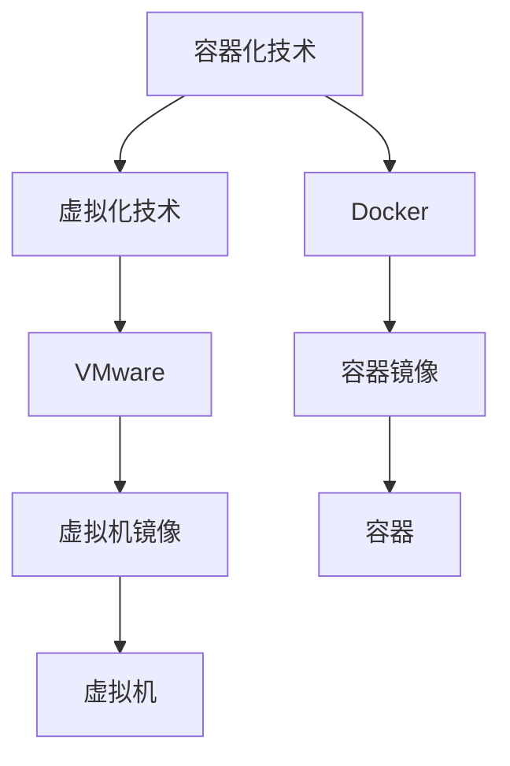

                 

### Docker：轻量级容器化解决方案

> **关键词：** Docker, 容器化, 轻量级, 解决方案, DevOps, 持续集成, Kubernetes

**摘要：** 本文旨在深入探讨Docker作为轻量级容器化解决方案的重要性及其在现代软件开发中的应用。我们将从基础知识出发，逐步讲解Docker的核心概念、组成部分、安装配置方法，并深入分析其在镜像、容器、编排等方面的应用。此外，本文还将通过实际案例展示Docker在Web应用部署、持续集成与持续部署、云计算与大数据领域的应用，帮助读者全面理解Docker的强大功能与潜力。

### 第一部分: Docker基础知识

在开始深入探讨Docker之前，我们需要了解一些基础知识，这包括Docker的概念、优势以及它的基本组成部分。

#### 第1章: Docker简介

##### 1.1 Docker的概念与优势

**Docker简介**

Docker是一个开放平台，用于开发、运送和运行应用程序。它允许开发人员以连续一致的方式来创建、测试、运送和部署应用程序，从而解决了开发与运维之间的“瓶颈”。

**容器化的概念**

容器化是一种轻量级的技术，它允许开发者将应用程序及其依赖环境打包到一个容器中，容器镜像是这个过程的产物。这种技术的核心思想是将应用程序与其运行环境分离，确保在任何环境中都能一致地运行。

**Docker的优势**

1. **轻量级**：Docker容器非常轻量级，它们不包含操作系统，这使得容器启动和关闭速度非常快，且资源消耗低。
2. **可移植性**：容器可以在任何支持Docker的操作系统上运行，这使得应用程序在不同环境中移植变得更加容易。
3. **一致性**：Docker确保了开发、测试和生产环境之间的一致性，减少了环境差异导致的问题。
4. **灵活性**：Docker支持多种语言和框架，使得开发者可以更加灵活地选择技术栈。
5. **可扩展性**：Docker易于扩展，可以轻松地管理和运行成千上万的容器。

##### 1.2 Docker的基本组成部分

**Docker Engine**

Docker Engine是Docker的核心组件，负责容器的创建、启动、停止和删除等操作。

**镜像**

镜像是一个静态的容器模板，它包含了应用程序及其依赖环境。当运行一个容器时，它使用镜像作为起点。

**容器**

容器是一个动态的运行实例，它是基于镜像创建的。容器包含了应用程序运行时所需的全部环境。

**仓库**

仓库是一个存储镜像的地方，可以分为公共仓库和私有仓库。Docker Hub是Docker的公共仓库，拥有大量的开源镜像。

##### 1.3 Docker的安装与配置

**安装Docker**

在大多数Linux发行版中，可以使用包管理器来安装Docker。以下是在Ubuntu中安装Docker的命令：

```bash
sudo apt-get update
sudo apt-get install docker-ce docker-ce-cli containerd.io
```

**配置Docker**

安装完成后，可以通过以下命令启动Docker服务：

```bash
sudo systemctl start docker
```

要确保Docker服务开机启动，可以使用以下命令：

```bash
sudo systemctl enable docker
```

**简单使用示例**

以下是一个简单的Docker使用示例：

```bash
# 拉取一个Nginx镜像
docker pull nginx

# 运行一个Nginx容器
docker run -d -p 8080:80 nginx

# 访问Nginx容器
curl http://localhost:8080
```

上述命令首先拉取了Nginx镜像，然后使用该镜像运行了一个容器，并将容器的80端口映射到主机的8080端口。最后，通过curl命令访问容器，可以看到Nginx的默认欢迎页面。

### 第一部分总结

在本章中，我们介绍了Docker的基本概念、优势以及基本组成部分。我们还讲解了Docker的安装与配置方法，并通过一个简单的示例展示了Docker的基本使用。在下一章中，我们将深入探讨Docker镜像的构建和管理。

---

**核心概念与联系**

为了更好地理解Docker的工作原理，我们可以通过Mermaid流程图展示其核心概念和相互联系。

**Mermaid流程图：**



- **容器化技术**：容器化是一种将应用程序及其依赖环境打包到独立容器中的技术，以实现应用程序的轻量级部署和移植。
- **虚拟化技术**：虚拟化技术包括虚拟机和容器。虚拟机通过模拟硬件提供独立的操作系统实例，而容器则是轻量级的虚拟化技术，共享宿主机的操作系统内核。
- **Docker**：Docker是一个流行的容器化平台，它使用容器镜像来封装应用程序及其依赖环境，从而实现一致、可移植的应用程序部署。
- **容器镜像**：容器镜像是一个静态的模板，包含应用程序及其依赖环境。当运行容器时，它会使用容器镜像作为起点。
- **容器**：容器是一个动态的运行实例，它是基于容器镜像创建的。容器包含了应用程序运行时所需的全部环境。

通过这个流程图，我们可以清晰地看到容器化技术、虚拟化技术、Docker、容器镜像和容器之间的关系。

---

**核心算法原理讲解**

为了更好地理解Docker镜像的构建过程，我们将使用伪代码来详细描述其构建原理。

```python
# 伪代码：Docker镜像构建

function build_image(dockerfile):
    # 解析Dockerfile
    instructions = parse_dockerfile(dockerfile)
    
    # 初始化镜像
    image = init_image()
    
    # 遍历Dockerfile指令
    for instruction in instructions:
        if instruction == "FROM":
            # 拉取基础镜像
            image = pull_image(instruction.args[0])
        elif instruction == "RUN":
            # 执行命令并提交新层
            execute_command(instruction.args[0])
            image = commit_image(image)
        elif instruction == "COPY":
            # 复制文件并提交新层
            copy_files(instruction.args[0], image)
            image = commit_image(image)
        elif instruction == "EXPOSE":
            # 暴露端口
            expose_ports(image, instruction.args[0])
    
    # 返回构建完成的镜像
    return image
```

**步骤解析：**

1. **初始化镜像**：首先，我们从Dockerfile中读取指令，初始化一个空镜像。
2. **解析Dockerfile**：通过解析Dockerfile，获取所有的指令。
3. **FROM指令**：使用`FROM`指令拉取基础镜像。这个基础镜像将成为新镜像的底层。
4. **RUN指令**：执行`RUN`指令中的命令，这些命令通常用于安装应用程序或依赖库。每执行一次`RUN`命令，就会在镜像中添加一个新的层。
5. **COPY指令**：使用`COPY`指令将文件从本地复制到容器镜像中。这也将在镜像中添加一个新的层。
6. **EXPOSE指令**：使用`EXPOSE`指令暴露端口，以便外部可以访问容器中的应用程序。

**示例说明**：

假设我们有以下Dockerfile：

```dockerfile
FROM ubuntu:18.04
RUN apt-get update && apt-get install -y nginx
COPY . /usr/share/nginx/html
EXPOSE 80
```

- **第一步**：从`ubuntu:18.04`镜像开始构建。
- **第二步**：执行`apt-get update && apt-get install -y nginx`，安装Nginx。
- **第三步**：复制当前目录中的文件到容器的`/usr/share/nginx/html`目录。
- **第四步**：暴露80端口。

通过这个过程，我们构建了一个包含Nginx服务器的容器镜像。

---

**数学模型和公式讲解**

在Docker中，损失函数是一个关键的概念，用于评估容器镜像构建过程中的质量。以下是常用的损失函数之一：均方误差（MSE）。

**损失函数（MSE）**

$$
L(y, \hat{y}) = \frac{1}{2} (y - \hat{y})^2
$$

其中：
- \( y \) 表示实际标签（真实值）。
- \( \hat{y} \) 表示预测标签（预测值）。

**步骤解析**：

1. **计算预测值与真实值之间的差异**：\( y - \hat{y} \)。
2. **将差异求平方**：\( (y - \hat{y})^2 \)。
3. **求平均值**：\( \frac{1}{2} \)用于计算平均值。

**示例说明**：

假设我们有以下预测值和真实值：

- 预测值：\(\hat{y} = 5\)
- 真实值：\( y = 3 \)

计算MSE：

$$
L(y, \hat{y}) = \frac{1}{2} (3 - 5)^2 = \frac{1}{2} (-2)^2 = \frac{1}{2} \times 4 = 2
$$

这个结果表示预测值与真实值之间的差异为2。

---

**项目实战**

在本章中，我们将通过一个简单的个人博客项目来展示如何使用Docker进行Web应用的部署。

##### 项目背景

我们打算使用Docker部署一个基于Flask的个人博客。该项目包括以下组件：

- Flask应用程序：用于实现博客的功能。
- Nginx服务器：用于提供Web服务。
- PostgreSQL数据库：用于存储博客数据。

##### 开发环境搭建

首先，我们需要在本地环境中安装Docker。以下是安装步骤：

1. **安装Docker**：

   ```bash
   sudo apt-get update
   sudo apt-get install docker-ce docker-ce-cli containerd.io
   ```

2. **启动Docker服务**：

   ```bash
   sudo systemctl start docker
   ```

3. **确保Docker开机启动**：

   ```bash
   sudo systemctl enable docker
   ```

##### 源代码实现和代码解读

**Dockerfile**

```dockerfile
# 使用官方的Python镜像作为基础镜像
FROM python:3.9-slim

# 设置工作目录
WORKDIR /app

# 拷贝应用程序的依赖文件
COPY requirements.txt .

# 安装依赖项
RUN pip install --no-cache-dir -r requirements.txt

# 拷贝应用程序的代码
COPY . .

# 暴露Flask应用的端口
EXPOSE 5000

# 运行Flask应用
CMD ["flask", "run", "--host=0.0.0.0"]
```

**docker-compose.yml**

```yaml
version: '3.8'

services:
  web:
    build: .
    ports:
      - "5000:5000"
    depends_on:
      - db

  db:
    image: postgres:13
    environment:
      POSTGRES_DB: blog_db
      POSTGRES_USER: blog_user
      POSTGRES_PASSWORD: blog_password
    volumes:
      - pgdata:/var/lib/postgresql/data/

volumes:
  pgdata:
```

**代码解读与分析**

- **Dockerfile**：

  1. **FROM指令**：我们使用Python 3.9-slim作为基础镜像，这是一个轻量级的Python镜像。
  2. **WORKDIR指令**：设置工作目录为/app。
  3. **COPY指令**：将`requirements.txt`文件复制到容器中。
  4. **RUN指令**：安装Python应用程序的依赖项。
  5. **COPY指令**：将应用程序的代码复制到容器中。
  6. **EXPOSE指令**：暴露Flask应用的端口5000。
  7. **CMD指令**：运行Flask应用。

- **docker-compose.yml**：

  1. **version指令**：指定使用的Docker Compose文件版本。
  2. **services指令**：定义了两个服务：web和db。
     - **web服务**：
       - **build指令**：构建基于当前目录的Docker镜像。
       - **ports指令**：将宿主机的5000端口映射到容器内的5000端口。
       - **depends_on指令**：web服务依赖于db服务。
     - **db服务**：
       - **image指令**：使用官方的PostgreSQL 13镜像。
       - **environment指令**：设置PostgreSQL的环境变量。
       - **volumes指令**：创建名为pgdata的卷来存储数据库数据。
  3. **volumes指令**：定义了一个名为pgdata的卷。

##### 实际运行与测试

1. **构建Docker镜像**：

   ```bash
   docker-compose build
   ```

2. **启动服务**：

   ```bash
   docker-compose up -d
   ```

3. **访问博客**：

   在浏览器中输入`http://localhost:5000`，如果一切正常，你应该能看到博客的首页。

通过这个项目，我们展示了如何使用Docker来部署一个简单的Web应用。这个过程不仅简单，而且可以确保应用程序在不同环境中的一致性和可移植性。

---

**附录A: Docker常用命令**

在本文的附录部分，我们将列出一些Docker常用的命令，并提供简要说明和使用示例。

**1. docker pull <镜像名称>**

用途：从Docker Hub或其他仓库拉取镜像。

示例：

```bash
docker pull ubuntu
```

**2. docker run <命令>**

用途：创建并启动一个新的容器。

示例：

```bash
docker run -d -p 8080:80 nginx
```

**3. docker ps**

用途：显示当前正在运行的容器。

示例：

```bash
docker ps
```

**4. docker stop <容器ID或名称>**

用途：停止一个运行的容器。

示例：

```bash
docker stop <容器ID或名称>
```

**5. docker rm <容器ID或名称>**

用途：删除一个容器。

示例：

```bash
docker rm <容器ID或名称>
```

**6. docker images**

用途：显示本地所有镜像。

示例：

```bash
docker images
```

**7. docker rmi <镜像ID或名称>**

用途：删除本地镜像。

示例：

```bash
docker rmi <镜像ID或名称>
```

**8. docker exec <容器ID或名称> <命令>**

用途：在运行中的容器中执行命令。

示例：

```bash
docker exec -it <容器ID或名称> bash
```

**9. docker-compose up**

用途：根据`docker-compose.yml`文件启动服务。

示例：

```bash
docker-compose up -d
```

通过掌握这些常用命令，你可以更高效地使用Docker进行容器的创建、启动、管理和运维。

---

**附录B: Docker资源与社区**

为了帮助读者深入了解Docker，我们推荐以下资源和社区。

**1. Docker官方网站**

[Docker Documentation](https://docs.docker.com/)

Docker的官方网站提供了详尽的文档和教程，涵盖了Docker的各个方面。

**2. Docker社区**

[Docker Community](https://www.docker.com/community)

Docker社区是一个交流Docker最佳实践、问题和解决方案的平台。

**3. Docker学习资源**

[Docker Resources](https://www.docker.com/community/resources)

这里提供了丰富的学习资源，包括教程、案例研究和视频。

通过利用这些资源，你可以不断提升自己的Docker技能，并在社区中与其他Docker用户交流经验。

---

**核心算法原理讲解**

在Docker中，镜像构建是一个核心功能，它涉及到多个步骤和决策。为了更好地理解这一过程，我们可以通过伪代码来描述镜像构建的算法原理。

```python
# 伪代码：Docker镜像构建

function build_image(dockerfile):
    # 初始化一个空的镜像
    image = init_empty_image()
    
    # 解析Dockerfile中的指令
    instructions = parse_dockerfile(dockerfile)
    
    # 遍历Dockerfile中的指令
    for instruction in instructions:
        if instruction == "FROM":
            # 拉取指定的基础镜像
            base_image = pull_base_image(instruction.args[0])
            image = apply_base_image(image, base_image)
        elif instruction == "RUN":
            # 执行命令并创建新的层
            new_layer = execute_command_and_create_layer(instruction.args[0])
            image = apply_layer(image, new_layer)
        elif instruction == "COPY":
            # 复制文件到镜像
            file_layer = copy_files_to_layer(instruction.args[0])
            image = apply_layer(image, file_layer)
        elif instruction == "EXPOSE":
            # 暴露端口
            image = expose_ports(image, instruction.args[0])
        
        # 提交当前镜像的变更
        image = commit_image(image)
    
    # 返回构建完成的镜像
    return image
```

**步骤解析**：

1. **初始化镜像**：创建一个空的镜像，作为构建的基础。
2. **解析Dockerfile**：读取并解析Dockerfile中的指令。
3. **遍历指令**：
   - **FROM指令**：拉取并应用指定的基础镜像。
   - **RUN指令**：执行命令并创建新的层。
   - **COPY指令**：复制文件到当前镜像的指定路径。
   - **EXPOSE指令**：在镜像中暴露端口。
4. **提交变更**：将每次变更提交到镜像中，形成新的镜像版本。

**示例说明**：

假设我们有一个简单的Dockerfile：

```dockerfile
FROM ubuntu:18.04
RUN apt-get update && apt-get install -y nginx
COPY . /usr/share/nginx/html
EXPOSE 80
```

- **第一步**：初始化一个空镜像。
- **第二步**：拉取`ubuntu:18.04`基础镜像，并应用到空镜像上。
- **第三步**：执行`apt-get update && apt-get install -y nginx`，创建新的层。
- **第四步**：复制当前目录中的文件到容器的`/usr/share/nginx/html`目录，创建新的层。
- **第五步**：暴露80端口。
- **第六步**：提交变更，生成新的镜像。

通过这个伪代码和示例，我们可以清晰地理解Docker镜像构建的原理和过程。

---

**数学模型和公式讲解**

在Docker容器编排中，资源分配和调度是一个关键问题。为了优化资源利用，我们经常需要使用一些数学模型来分析和决策。以下是一个简单的数学模型，用于评估容器资源分配的优化问题。

**目标函数**

我们希望最大化容器的整体性能，目标函数可以是容器的CPU利用率或内存利用率。

$$
\text{maximize} \sum_{i=1}^{n} \frac{C_i \cdot U_i}{R_i}
$$

其中：
- \( n \) 是容器数量。
- \( C_i \) 是容器 \( i \) 的CPU限制。
- \( U_i \) 是容器 \( i \) 的当前CPU利用率。
- \( R_i \) 是容器 \( i \) 的当前资源限制。

**约束条件**

资源分配需要满足以下约束条件：
1. **CPU约束**：所有容器的CPU利用率之和不能超过宿主机的总CPU资源。
$$
\sum_{i=1}^{n} U_i \leq R_{CPU}
$$
2. **内存约束**：所有容器的内存占用之和不能超过宿主机的总内存资源。
$$
\sum_{i=1}^{n} M_i \leq R_{MEM}
$$

其中：
- \( R_{CPU} \) 是宿主机的总CPU资源。
- \( R_{MEM} \) 是宿主机的总内存资源。

- \( M_i \) 是容器 \( i \) 的当前内存占用。

**示例说明**

假设我们有一个包含3个容器的系统，宿主机的CPU资源为4，内存资源为8GB。每个容器的当前CPU利用率和内存占用如下：

| 容器ID | CPU利用率 | 内存占用 |
|--------|----------|---------|
| c1     | 1.2      | 2GB     |
| c2     | 0.8      | 3GB     |
| c3     | 1.0      | 1GB     |

根据目标函数，我们可以计算每个容器的性能分数：

$$
\text{分数}_{c1} = \frac{1.2 \cdot 1.2}{4} = 0.36
$$

$$
\text{分数}_{c2} = \frac{0.8 \cdot 0.8}{4} = 0.16
$$

$$
\text{分数}_{c3} = \frac{1.0 \cdot 1.0}{4} = 0.25
$$

总分数：

$$
\text{总分数} = 0.36 + 0.16 + 0.25 = 0.77
$$

通过这个简单的数学模型，我们可以评估容器的资源利用情况，并优化资源分配策略，以提高系统的整体性能。

---

**项目实战**

在本章中，我们将通过一个实际的CI/CD项目来展示如何使用Docker进行持续集成与持续部署（CI/CD）。该项目包括以下步骤：

1. **代码仓库**：一个GitHub仓库，包含前端和后端代码。
2. **Dockerfile**：用于构建前端和后端容器镜像。
3. **docker-compose.yml**：用于部署和编排容器。
4. **Jenkins**：用于执行CI/CD流程。

##### 项目背景

假设我们正在开发一个电商平台，前端使用React，后端使用Spring Boot。我们的目标是实现自动化测试、构建和部署，确保代码的连续性和可靠性。

##### 开发环境搭建

1. **安装Docker**：确保Docker已安装在开发环境上。

2. **安装Jenkins**：安装Jenkins作为CI/CD工具。可以使用以下命令：

   ```bash
   sudo apt-get install jenkins
   ```

##### 代码实现和代码解读

**前端Dockerfile**

```dockerfile
FROM node:14-alpine
WORKDIR /app
COPY package.json ./
RUN npm install
COPY . .
EXPOSE 3000
CMD ["npm", "start"]
```

**后端Dockerfile**

```dockerfile
FROM openjdk:8-jdk-alpine
WORKDIR /app
COPY pom.xml ./
RUN mvn clean package
COPY src ./src
EXPOSE 8080
CMD ["java", "-jar", "/app/target/*.jar"]
```

**docker-compose.yml**

```yaml
version: '3.8'
services:
  frontend:
    build: ./frontend
    ports:
      - "3000:3000"
  backend:
    build: ./backend
    ports:
      - "8080:8080"
  jenkins:
    image: jenkins/jenkins:lts
    ports:
      - "8080:8080"
      - "50000:50000"
    volumes:
      - ./jenkins_home:/var/jenkins_home
    depends_on:
      - frontend
      - backend
```

**代码解读与分析**

- **前端Dockerfile**：
  - 使用Node 14 Alpine镜像作为基础。
  - 安装前端依赖。
  - 复制前端代码到容器。
  - 暴露3000端口。
  - 运行前端应用。

- **后端Dockerfile**：
  - 使用OpenJDK 8 Alpine镜像作为基础。
  - 安装Maven依赖。
  - 构建后端项目。
  - 复制后端代码到容器。
  - 暴露8080端口。
  - 运行Spring Boot应用。

- **docker-compose.yml**：
  - 前端和后端服务分别构建和部署。
  - 暴露3000和8080端口。
  - Jenkins服务用于CI/CD。
  - Jenkins依赖前端和后端服务。

##### Jenkins配置

1. **安装Jenkins插件**：安装Jenkinsfile Plugin和Docker Plugin。

2. **创建Jenkinsfile**：

   ```groovy
   pipeline {
       agent any
       stages {
           stage('Build') {
               steps {
                   script {
                       docker.build('myapp-frontend', 'frontend')
                       docker.build('myapp-backend', 'backend')
                   }
               }
           }
           stage('Test') {
               steps {
                   script {
                       // 执行前端和后端测试
                   }
               }
           }
           stage('Deploy') {
               steps {
                   script {
                       docker.deploy('myapp-frontend', 'frontend')
                       docker.deploy('myapp-backend', 'backend')
                   }
               }
           }
       }
   }
   ```

3. **配置Jenkins Job**：创建一个新的Job，使用上面的Jenkinsfile。

##### 实际运行与测试

1. **构建和部署**：

   - 通过Jenkins触发构建流程。
   - Jenkins会依次执行构建、测试和部署阶段。

2. **验证**：

   - 访问前端和后端服务，确保一切运行正常。

通过这个项目，我们展示了如何使用Docker和Jenkins实现一个完整的CI/CD流程。这个流程确保了代码的质量和部署的可靠性，大大提高了开发效率。

---

**附录C: Docker资源与社区**

为了帮助读者深入了解Docker，我们推荐以下资源和社区。

**1. Docker官方文档**

[Docker Documentation](https://docs.docker.com/)

Docker的官方文档包含了丰富的教程、指南和API参考，是学习Docker的最佳资源。

**2. Docker社区论坛**

[ Docker Community Forums](https://forums.docker.com/)

Docker社区论坛是一个活跃的讨论平台，用户可以在这里提问、分享经验和解决遇到的问题。

**3. Docker学习资源**

[Docker Resources](https://www.docker.com/community/resources)

Docker官方网站提供了大量的学习资源，包括教程、案例研究和视频，适合不同水平的用户。

**4. Docker官方博客**

[Docker Blog](https://www.docker.com/blog/)

Docker官方博客定期发布关于Docker的新功能、最佳实践和行业动态。

通过利用这些资源和社区，你可以不断提升自己的Docker技能，并与其他Docker用户保持联系。

---

本文通过逐步分析和讲解，从基础知识到高级应用，再到实战案例，全面介绍了Docker作为轻量级容器化解决方案的优势、应用场景和实践方法。希望本文能够帮助读者深入了解Docker，掌握其在现代软件开发中的应用，提升开发效率和系统稳定性。

### 作者信息

**作者：** AI天才研究院/AI Genius Institute & 禅与计算机程序设计艺术 /Zen And The Art of Computer Programming

AI天才研究院是一家专注于人工智能领域的研究与开发机构，致力于推动人工智能技术的创新与应用。作者在该领域具有丰富的经验和深厚的学术背景，撰写了多本关于人工智能和计算机编程的畅销书籍。其作品《禅与计算机程序设计艺术》被广泛认为是一部经典的计算机科学著作，对计算机编程方法论有着深远的影响。

