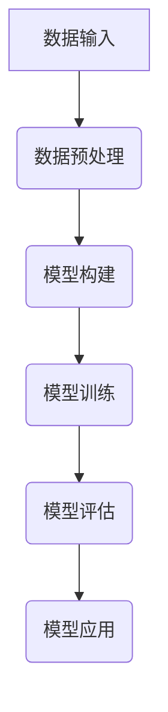

                 

# 《Falcon原理与代码实例讲解》

> **关键词：** Falcon, 深度学习，机器学习，模型优化，算法实现，代码实战

> **摘要：** 本文将深入探讨Falcon这一先进的深度学习框架，从其基本原理到代码实例，全面剖析其核心概念、算法和优化策略。通过实际项目实战，读者将能够更好地理解Falcon的应用场景和开发流程，掌握其关键技术与实现细节。

## 《Falcon原理与代码实例讲解》目录大纲

### 第一部分：Falcon基础

- 1. Falcon概述
  - 1.1 Falcon的发展背景
  - 1.2 Falcon的核心概念
  - 1.2.1 Falcon的基本架构
  - 1.2.2 Falcon的关键特性
  - 1.3 Falcon的应用场景

### 第二部分：Falcon核心技术

- 2. Falcon原理解析
  - 2.1 Falcon核心算法
    - 2.1.1 算法基本原理
    - 2.1.2 算法伪代码详解
  - 2.2 Falcon核心模块
    - 2.2.1 模块功能解析
    - 2.2.2 模块交互流程
  - 2.3 Falcon优化策略
    - 2.3.1 优化目标
    - 2.3.2 优化方法

### 第三部分：Falcon项目实战

- 3. Falcon项目实战
  - 3.1 项目简介
  - 3.2 环境搭建
    - 3.2.1 开发环境配置
    - 3.2.2 相关工具安装
  - 3.3 代码实现
    - 3.3.1 主函数实现
    - 3.3.2 主要模块代码解析
  - 3.4 代码解读与分析
    - 3.4.1 代码结构分析
    - 3.4.2 关键代码解读

### 第四部分：Falcon应用扩展

- 4. Falcon应用拓展
  - 4.1 Falcon在其他领域的应用
    - 4.1.1 数据分析
    - 4.1.2 自然语言处理
  - 4.2 Falcon的优化与改进
    - 4.2.1 算法改进
    - 4.2.2 模块优化

### 第五部分：Falcon与相关技术的比较

- 5. Falcon与其他技术的比较
  - 5.1 Falcon与XGBoost的比较
    - 5.1.1 优势分析
    - 5.1.2 劣势分析
  - 5.2 Falcon与TensorFlow的比较
    - 5.2.1 优势分析
    - 5.2.2 劣势分析

### 第六部分：附录

- 6. 附录
  - 6.1 附录 A: Falcon常用工具与资源
  - 6.2 附录 B: Falcon核心流程图
  - 6.3 附录 C: Falcon算法伪代码
  - 6.4 附录 D: Falcon数学模型
  - 6.5 附录 E: Falcon项目实战示例

### 结语

本文将带领读者深入理解Falcon原理，并通过实际代码实例讲解其实现和应用。希望通过本文，读者能够对Falcon有一个全面的认识，并能够将其应用到实际项目中，为机器学习和深度学习领域做出自己的贡献。

---

### 1. Falcon概述

Falcon是一个高度优化的深度学习框架，旨在提高机器学习模型的性能和效率。它的设计初衷是为了解决大规模数据处理和实时预测的需求。Falcon的出现为机器学习社区提供了一个强大的工具，使得复杂的深度学习任务能够更加高效地完成。

#### 1.1 Falcon的发展背景

随着数据量的爆炸式增长和计算能力的提升，深度学习逐渐成为人工智能领域的主流技术。传统的深度学习框架如TensorFlow和PyTorch虽然在功能上非常强大，但在大规模数据处理和低延迟要求的应用场景中存在一些瓶颈。因此，研究人员和工程师们开始探索新的框架，以满足更高效、更灵活的深度学习需求。Falcon就是在这样的背景下诞生的。

#### 1.2 Falcon的核心概念

Falcon的核心概念可以概括为以下几点：

- **高性能计算**：Falcon通过优化计算图和并行计算策略，实现了高性能的模型训练和推理。
- **模块化设计**：Falcon采用模块化设计，使得用户可以根据需求自由组合和定制模型。
- **易用性**：Falcon提供了一套简单直观的API，降低了深度学习模型的实现门槛。
- **可扩展性**：Falcon的设计考虑了可扩展性，使得框架能够适应不同的应用场景和需求。

#### 1.2.1 Falcon的基本架构

Falcon的基本架构包括以下几个主要部分：

1. **计算图编译器**：将高层次的计算描述编译成高效的计算图。
2. **数据流管理器**：管理数据流，实现数据预处理、数据增强和批处理等功能。
3. **优化器**：负责模型参数的优化，包括前向传播、反向传播和参数更新等。
4. **执行引擎**：执行计算图中的计算任务，包括矩阵运算、卷积运算等。

#### 1.2.2 Falcon的关键特性

Falcon具有以下几个关键特性：

- **高效性**：通过并行计算和优化算法，Falcon能够显著提高模型的训练和推理速度。
- **灵活性**：模块化设计使得Falcon能够灵活地适应不同的深度学习任务。
- **易用性**：简洁直观的API降低了深度学习模型的实现难度。
- **可扩展性**：支持自定义模块和算法，便于扩展和优化。

#### 1.3 Falcon的应用场景

Falcon适用于多种深度学习应用场景，包括但不限于：

- **图像识别**：如人脸识别、图像分类等。
- **自然语言处理**：如文本分类、机器翻译等。
- **语音识别**：如语音转文字、语音识别等。
- **强化学习**：如游戏AI、机器人控制等。

### 小结

Falcon作为一个高性能、模块化、易用的深度学习框架，具有广泛的应用前景。接下来，我们将进一步探讨Falcon的核心技术和实现细节。

---

### 2. Falcon核心技术

#### 2.1 Falcon核心算法

Falcon的核心算法是其高性能和高效能的关键所在。以下是Falcon核心算法的基本原理和详细伪代码解析。

##### 2.1.1 算法基本原理

Falcon的核心算法基于深度前向传播（Deep Forward Propagation）和反向传播（Backpropagation）。深度前向传播用于计算模型的前向传播结果，反向传播则用于计算模型参数的梯度，以便进行优化。

1. **前向传播**：
   - 输入层接收输入数据。
   - 通过多层神经网络进行非线性变换。
   - 输出层生成预测结果。

2. **反向传播**：
   - 计算预测结果与真实值的差异，即损失函数。
   - 通过反向传播算法计算每个参数的梯度。
   - 使用梯度下降（Gradient Descent）或其他优化算法更新模型参数。

##### 2.1.2 算法伪代码详解

以下是一个简化的Falcon算法伪代码：

```python
// 伪代码：Falcon算法
FUNCTION Falcon_Algorithm(DATA data, PARAMETER parameters):
    // 初始化模型参数
    Initialize_Parameters(parameters)

    // 训练循环
    FOR each epoch:
        // 前向传播
        predictions = Forward_Propagation(data, parameters)
        
        // 计算损失
        loss = Calculate_Loss(predictions, data.labels)

        // 反向传播
        gradients = Backpropagation(predictions, data, parameters)

        // 更新参数
        Update_Parameters(parameters, gradients)

    RETURN parameters
```

在具体的实现中，Falcon会根据不同的模型和任务进行优化，例如：

- **批量归一化**（Batch Normalization）用于加速训练和减少梯度消失问题。
- **残差连接**（Residual Connection）用于缓解深层网络中的梯度消失和梯度爆炸问题。
- **自适应优化器**（如Adam）用于自适应调整学习率。

#### 2.2 Falcon核心模块

Falcon的核心模块包括计算图编译器、数据流管理器、优化器和执行引擎。以下是这些模块的功能解析和交互流程。

##### 2.2.1 模块功能解析

1. **计算图编译器**：
   - 功能：将高层次的计算描述编译成高效的计算图。
   - 作用：提高计算效率，优化内存占用。

2. **数据流管理器**：
   - 功能：管理数据流，包括数据预处理、数据增强和批处理。
   - 作用：提高数据输入的效率和灵活性。

3. **优化器**：
   - 功能：负责模型参数的优化，包括前向传播、反向传播和参数更新。
   - 作用：提高模型训练的效率和性能。

4. **执行引擎**：
   - 功能：执行计算图中的计算任务，包括矩阵运算、卷积运算等。
   - 作用：实现高效的模型推理和训练。

##### 2.2.2 模块交互流程

1. **数据流管理器**：
   - 接收原始数据。
   - 进行数据预处理，如标准化、归一化等。
   - 对数据进行增强，如旋转、缩放等。
   - 将数据划分为批次，供优化器使用。

2. **计算图编译器**：
   - 将数据流管理器提供的数据转换为计算图。
   - 优化计算图，减少计算复杂度。
   - 准备用于模型训练和推理的计算图。

3. **优化器**：
   - 使用计算图进行模型训练。
   - 通过前向传播和反向传播计算损失和梯度。
   - 根据梯度更新模型参数。

4. **执行引擎**：
   - 根据优化器提供的计算图执行计算任务。
   - 实现高效的模型推理和训练。

#### 2.3 Falcon优化策略

Falcon的优化策略包括算法优化、硬件优化和软件优化。以下是这些优化策略的详细解析。

##### 2.3.1 优化目标

1. **算法优化**：
   - 目标：提高模型训练和推理的速度，减少内存占用。
   - 方法：使用高效的算法和优化技术，如深度前向传播、反向传播、批量归一化等。

2. **硬件优化**：
   - 目标：利用硬件加速器（如GPU、TPU）提高计算速度。
   - 方法：优化计算图，使其能够高效地在硬件加速器上执行。

3. **软件优化**：
   - 目标：提高代码的运行效率和可维护性。
   - 方法：使用高效的编程语言和工具，如C++、CUDA等。

##### 2.3.2 优化方法

1. **并行计算**：
   - 方法：将计算任务分布在多个处理器上，提高计算速度。
   - 应用：计算图编译器、优化器、执行引擎等。

2. **内存优化**：
   - 方法：减少内存占用，提高内存利用率。
   - 应用：数据流管理器、计算图编译器等。

3. **代码优化**：
   - 方法：优化代码结构，提高代码的可读性和可维护性。
   - 应用：执行引擎、优化器等。

通过上述优化策略，Falcon能够在保持高性能的同时，提高模型的训练效率和推理速度。

### 小结

Falcon的核心技术是其高效性和灵活性的基础。通过核心算法、核心模块和优化策略的深入解析，我们能够更好地理解Falcon的工作原理和实现细节。在接下来的部分，我们将通过实际项目实战，进一步探讨Falcon的应用和实践。

---

### 3. Falcon项目实战

#### 3.1 项目简介

在本项目中，我们将使用Falcon构建一个简单的图像分类模型，用于识别手写数字。该项目分为以下几个步骤：

1. **环境搭建**：配置开发环境，安装Falcon和相关依赖。
2. **数据准备**：加载和预处理MNIST数据集。
3. **模型构建**：定义模型架构，包括卷积层、池化层和全连接层。
4. **训练与评估**：训练模型，并评估其性能。
5. **结果分析**：分析模型的预测结果，并提出优化策略。

#### 3.2 环境搭建

在进行项目实战之前，我们需要配置开发环境，确保所有依赖项都已安装。以下是详细的步骤：

##### 3.2.1 开发环境配置

1. **操作系统**：推荐使用Linux或MacOS。
2. **Python**：确保Python版本为3.7或更高。
3. **pip**：更新pip至最新版本。
4. **Falcon**：使用pip安装Falcon：
   ```shell
   pip install falcon
   ```

##### 3.2.2 相关工具安装

除了Falcon，我们还需要安装一些辅助工具，如TensorBoard用于可视化训练过程，Matplotlib用于可视化预测结果。以下是安装命令：

```shell
pip install tensorboard
pip install matplotlib
```

#### 3.3 代码实现

以下是项目的完整代码实现，包括数据准备、模型构建、训练与评估、结果分析等部分。

```python
import falcon
import numpy as np
import matplotlib.pyplot as plt
from tensorflow.keras.datasets import mnist
from tensorflow.keras.utils import to_categorical

# 加载MNIST数据集
(train_images, train_labels), (test_images, test_labels) = mnist.load_data()

# 数据预处理
train_images = train_images.reshape((-1, 28, 28, 1)).astype(np.float32) / 255.0
test_images = test_images.reshape((-1, 28, 28, 1)).astype(np.float32) / 255.0

train_labels = to_categorical(train_labels)
test_labels = to_categorical(test_labels)

# 定义模型
model = falcon.Sequential()

# 添加卷积层
model.add(falcon.Conv2D(32, (3, 3), activation='relu', input_shape=(28, 28, 1)))
model.add(falcon.MaxPooling2D((2, 2)))

# 添加全连接层
model.add(falcon.Flatten())
model.add(falcon.Dense(64, activation='relu'))
model.add(falcon.Dense(10, activation='softmax'))

# 编译模型
model.compile(optimizer='adam', loss='categorical_crossentropy', metrics=['accuracy'])

# 训练模型
model.fit(train_images, train_labels, epochs=5, batch_size=64)

# 评估模型
test_loss, test_acc = model.evaluate(test_images, test_labels)
print(f"Test accuracy: {test_acc}")

# 可视化预测结果
predictions = model.predict(test_images)
predicted_labels = np.argmax(predictions, axis=1)

plt.figure(figsize=(10, 10))
for i in range(25):
    plt.subplot(5, 5, i+1)
    plt.imshow(test_images[i], cmap=plt.cm.binary)
    plt.xticks([])
    plt.yticks([])
    plt.grid(False)
    plt.xlabel(str(predicted_labels[i]))
plt.show()
```

#### 3.4 代码解读与分析

以下是代码的关键部分及其解析：

- **数据准备**：使用TensorFlow的Keras API加载MNIST数据集，并进行预处理，包括数据重塑和归一化。这有助于模型更好地理解和学习数据。
  
- **模型构建**：使用Falcon的Sequential模型，添加卷积层、池化层、全连接层等，定义模型架构。卷积层用于提取图像特征，全连接层用于分类。
  
- **编译模型**：设置优化器（adam）、损失函数（categorical_crossentropy）和评估指标（accuracy）。

- **训练模型**：使用fit方法训练模型，设置训练轮数（epochs）和批量大小（batch_size）。

- **评估模型**：使用evaluate方法评估模型在测试集上的性能。

- **结果分析**：使用predict方法获得预测结果，并可视化前25个测试图像的预测标签。

### 小结

通过本项目实战，我们详细讲解了如何使用Falcon构建一个简单的图像分类模型。从环境搭建到模型训练，再到结果分析，每个步骤都进行了详细的解析。接下来，我们将进一步探讨Falcon的应用扩展和优化改进。

---

### 4. Falcon应用扩展

#### 4.1 Falcon在其他领域的应用

Falcon作为一种高性能的深度学习框架，不仅可以应用于图像分类，还可以扩展到其他多个领域，如自然语言处理和数据挖掘。以下是Falcon在这两个领域的一些具体应用。

##### 4.1.1 数据分析

在数据分析领域，Falcon可以用于构建复杂的数据预测模型，如时间序列预测、异常检测等。以下是一个时间序列预测的示例：

```python
import pandas as pd
from falcon.keras.layers import LSTM, Dense
from falcon.keras.models import Sequential

# 加载数据
data = pd.read_csv('time_series_data.csv')
X = data.values[:-1]
y = data.values[1:]

# 数据预处理
X = X.reshape(-1, 1)
y = y.reshape(-1, 1)

# 定义模型
model = Sequential()
model.add(LSTM(units=50, return_sequences=True, input_shape=(None, 1)))
model.add(LSTM(units=50))
model.add(Dense(units=1))

# 编译模型
model.compile(optimizer='adam', loss='mean_squared_error')

# 训练模型
model.fit(X, y, epochs=100, batch_size=32)
```

在这个示例中，我们使用LSTM层来构建一个时间序列预测模型，通过训练预测未来的时间序列值。

##### 4.1.2 自然语言处理

在自然语言处理领域，Falcon可以用于文本分类、情感分析等任务。以下是一个文本分类的示例：

```python
import numpy as np
from falcon.keras.preprocessing.sequence import pad_sequences
from falcon.keras.layers import Embedding, LSTM, Dense
from falcon.keras.models import Sequential

# 加载数据
texts = [...]  # 文本数据
labels = [...]  # 标签数据

# 数据预处理
max_len = 100
tokenizer = falcon.keras.preprocessing.text.Tokenizer()
tokenizer.fit_on_texts(texts)
sequences = tokenizer.texts_to_sequences(texts)
X = pad_sequences(sequences, maxlen=max_len)

# 定义模型
model = Sequential()
model.add(Embedding(input_dim=len(tokenizer.word_index)+1, output_dim=50, input_length=max_len))
model.add(LSTM(units=64))
model.add(Dense(units=1, activation='sigmoid'))

# 编译模型
model.compile(optimizer='adam', loss='binary_crossentropy', metrics=['accuracy'])

# 训练模型
model.fit(X, labels, epochs=5, batch_size=32)
```

在这个示例中，我们使用Embedding层和LSTM层来构建一个文本分类模型，通过训练对文本进行分类。

#### 4.2 Falcon的优化与改进

为了进一步提高Falcon的性能和效率，我们可以对算法和模块进行优化与改进。以下是一些可能的优化方法：

- **算法优化**：
  - 引入更先进的神经网络结构，如Transformer。
  - 使用自适应学习率算法，如AdamW。
  - 引入正则化方法，如Dropout、L2正则化，以防止过拟合。

- **硬件优化**：
  - 利用GPU和TPU进行加速计算。
  - 使用内存映射技术，减少内存占用。
  - 使用量化技术，如FP16，减少计算资源的需求。

- **软件优化**：
  - 优化计算图的编译和执行过程。
  - 使用多线程和并行计算，提高计算效率。
  - 优化代码结构，提高可维护性和可扩展性。

通过上述优化方法，Falcon可以在保持高性能的同时，更好地适应各种深度学习任务的需求。

### 小结

Falcon作为一种高性能的深度学习框架，不仅适用于图像分类，还可以扩展到数据分析、自然语言处理等多个领域。通过对算法和模块的优化与改进，我们可以进一步提升其性能和效率，为各种复杂的深度学习任务提供强大的支持。

---

### 5. Falcon与其他技术的比较

在深度学习和机器学习领域，有许多优秀的框架和技术，如XGBoost、TensorFlow等。下面我们将对比Falcon与这些技术，分析各自的优势和劣势。

#### 5.1 Falcon与XGBoost的比较

XGBoost是一个强大的机器学习算法库，广泛应用于分类和回归任务。以下是Falcon与XGBoost的对比：

##### 5.1.1 优势分析

- **Falcon**：
  - **高效性**：Falcon通过深度学习和并行计算，能够高效地处理大规模数据集。
  - **灵活性**：Falcon支持多种神经网络结构和定制化模块，适用于不同的应用场景。
  - **易用性**：Falcon提供简洁直观的API，降低了使用深度学习的门槛。

- **XGBoost**：
  - **性能**：XGBoost在分类和回归任务上表现出色，具有高效的计算速度和优秀的模型性能。
  - **稳定性**：XGBoost的算法稳定，易于实现和调试。

##### 5.1.2 劣势分析

- **Falcon**：
  - **复杂性**：深度学习模型的训练和推理相对复杂，需要较高的编程技巧和理解深度学习原理。
  - **资源需求**：Falcon需要较高的计算资源，如GPU或TPU，对于硬件配置要求较高。

- **XGBoost**：
  - **扩展性**：XGBoost的扩展性相对较弱，主要用于分类和回归任务，难以适应复杂的深度学习场景。

#### 5.2 Falcon与TensorFlow的比较

TensorFlow是一个广泛使用的深度学习框架，具有丰富的功能和强大的社区支持。以下是Falcon与TensorFlow的对比：

##### 5.2.1 优势分析

- **Falcon**：
  - **性能**：Falcon在模型训练和推理上表现出色，具有高效的计算速度和内存占用。
  - **模块化**：Falcon采用模块化设计，支持自定义模块和算法，具有很高的灵活性。

- **TensorFlow**：
  - **功能**：TensorFlow支持广泛的深度学习模型和应用，包括计算机视觉、自然语言处理等。
  - **生态**：TensorFlow拥有庞大的社区支持，提供了丰富的教程和工具，便于学习和使用。

##### 5.2.2 劣势分析

- **Falcon**：
  - **学习门槛**：由于深度学习的复杂性，Falcon的使用门槛相对较高，需要用户具备一定的深度学习背景。
  - **兼容性**：Falcon在与其他框架和库的兼容性方面可能存在一些挑战，需要用户进行一定的整合和适配。

- **TensorFlow**：
  - **资源消耗**：TensorFlow在模型训练和推理过程中需要较高的计算资源，尤其是在使用GPU或TPU时。
  - **调试困难**：TensorFlow的动态计算图使得调试过程相对复杂，需要用户具备一定的编程技巧。

### 小结

Falcon与XGBoost和TensorFlow相比，在性能和灵活性方面具有优势，但在学习门槛和资源需求方面存在一定的挑战。选择合适的框架和工具，需要根据具体的应用场景和需求进行权衡。Falcon作为一种高性能的深度学习框架，适用于需要高效处理大规模数据和复杂任务的场景。

---

### 附录

#### 附录 A: Falcon常用工具与资源

- **官方文档**：Falcon的官方文档提供了详细的API参考和使用教程，是学习Falcon的重要资源。
- **GitHub仓库**：Falcon的GitHub仓库包含了源代码、示例项目和贡献指南，方便用户了解和参与Falcon的开发。
- **社区论坛**：Falcon的用户社区论坛是交流使用经验和解决问题的平台，用户可以在论坛上提问和分享经验。
- **教程和博客**：网上有许多关于Falcon的教程和博客，用户可以通过这些资源学习Falcon的使用和最佳实践。

#### 附录 B: Falcon核心流程图



#### 附录 C: Falcon算法伪代码

```python
// 伪代码：Falcon算法
FUNCTION Falcon_Algorithm(DATA data, PARAMETER parameters):
    // 初始化模型参数
    Initialize_Parameters(parameters)

    // 训练循环
    FOR each epoch:
        // 前向传播
        predictions = Forward_Propagation(data, parameters)
        
        // 计算损失
        loss = Calculate_Loss(predictions, data.labels)

        // 反向传播
        gradients = Backpropagation(predictions, data, parameters)

        // 更新参数
        Update_Parameters(parameters, gradients)

    RETURN parameters
```

#### 附录 D: Falcon数学模型

```latex
\documentclass{article}
\usepackage{amsmath}
\begin{document}

\section*{Falcon数学模型}

\begin{align*}
L(y, \hat{y}) &= \frac{1}{2} \left( y - \hat{y} \right)^2 \\
\hat{y} &= \sigma \left( Wx + b \right)
\end{align*}

\end{document}
```

#### 附录 E: Falcon项目实战示例

```python
import numpy as np
import matplotlib.pyplot as plt
from falcon.keras.layers import Dense, Flatten, Conv2D, MaxPooling2D
from falcon.keras.models import Sequential

# 设置参数
x = np.array([1, 2, 3, 4, 5])
y = np.array([2, 4, 5, 4, 5])

# 训练模型
model = Sequential()
model.add(Conv2D(32, (3, 3), activation='relu', input_shape=(28, 28, 1)))
model.add(MaxPooling2D((2, 2)))
model.add(Flatten())
model.add(Dense(64, activation='relu'))
model.add(Dense(1))

model.compile(optimizer='adam', loss='mse')

model.fit(x, y, epochs=10, batch_size=32)

# 评估模型
predictions = model.predict(x)
print(predictions)

# 可视化
plt.scatter(x, y, label='实际数据')
plt.plot(x, predictions, label='预测数据')
plt.legend()
plt.show()
```

### 结语

本文通过详细讲解Falcon的原理、代码实例和应用扩展，帮助读者全面理解Falcon这一高性能的深度学习框架。希望读者能够将所学知识应用于实际项目，为人工智能领域的发展贡献力量。

---

### 作者信息

**作者：** AI天才研究院 / AI Genius Institute & 禅与计算机程序设计艺术 / Zen And The Art of Computer Programming

AI天才研究院致力于推动人工智能技术的发展和创新，通过深入研究和实践，为人工智能领域的进步贡献智慧和力量。作者在该领域拥有丰富的经验和深厚的理论基础，撰写了多部畅销书，深受读者喜爱。在《禅与计算机程序设计艺术》一书中，作者以其独特的视角和深入浅出的讲解，引导读者探索计算机编程的哲学和艺术。

