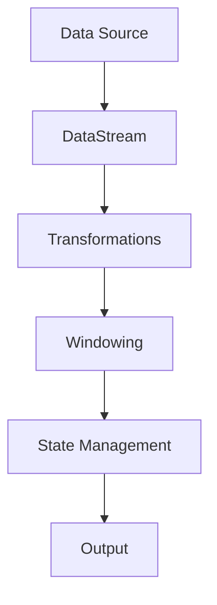

                 

### 文章标题

“Flink Stream原理与代码实例讲解”

---

#### 关键词：

- Flink
- Stream处理
- 实时数据处理
- Watermark机制
- Windowing
- 项目实战
- 性能优化

---

#### 摘要：

本文将深入探讨Apache Flink的Stream处理原理，通过详细的流程图、伪代码和代码实例，帮助读者理解Flink Stream的核心概念、架构设计和关键算法。文章还将通过具体项目实战案例，展示Flink在实际应用中的实现和优化策略，适合有志于深入了解和掌握Flink技术的读者。

---

### 第一部分：Flink Stream核心概念与架构

#### 第1章：Flink Stream概述

##### 1.1 Flink Stream的基本概念

Flink Stream是Apache Flink提供的一种数据抽象，用于表示连续不断的、无边界的数据流。其核心特性包括：

- **实时数据处理：** Flink Stream能够实时处理大规模数据流，提供低延迟的数据处理能力。
- **事件驱动：** 数据以事件的形式被处理，支持实时数据流处理。
- **容错与一致性：** Flink Stream具有自动容错和保持数据一致性的能力，确保在系统发生故障时能够快速恢复。

##### 1.2 Flink Stream架构

Flink Stream的架构由多个核心组件构成，包括：

- **流数据抽象（DataStream）：** 表示无界的数据流，是Flink Stream处理的主要数据类型。
- **执行引擎：** 包括Flink JobManager和TaskManager，负责协调和管理作业的执行。
- **状态管理：** Flink提供了灵活的状态管理机制，用于保持处理过程中的状态信息，如计数器、列表等。

##### 1.3 Flink Stream的工作流程

Flink Stream的工作流程可以概括为以下几个步骤：

1. **数据采集：** 通过各种数据源（如Kafka、Redis、文件等）将数据输入到Flink系统中。
2. **数据转换：** 使用Flink提供的各种操作符（如map、filter、reduce等）对数据进行处理。
3. **窗口计算：** 通过窗口操作将无界的数据流划分为有限的窗口，进行聚合计算。
4. **数据输出：** 将处理结果输出到各种目标（如HDFS、数据库、文件等）。

#### Mermaid 流程图：Flink Stream架构图



---

### 第二部分：Flink Stream核心算法原理

#### 第2章：Flink Stream核心算法原理讲解

##### 2.1 Watermark机制

Watermark（水印）是Flink Stream处理中用于处理乱序数据的重要机制。其核心概念如下：

- **定义：** Watermark是一个时间戳，用于标记事件流的进度，确保事件顺序的正确性。
- **作用：** Watermark帮助Flink Stream处理乱序数据，确保事件处理按照正确的顺序进行。

##### 2.1.1 Watermark的产生

Watermark的产生通常依赖于事件的时间戳。以下是一个简单的Watermark产生伪代码：

```python
def generateWatermark(currentTimestamp, lastWatermark):
    if currentTimestamp > lastWatermark:
        newWatermark = currentTimestamp
        return newWatermark
    else:
        return lastWatermark
```

##### 2.1.2 Watermark的传递

Watermark在流数据中传递，用于同步事件时间。以下是一个简单的Watermark传递伪代码：

```python
def processElement(element, currentWatermark):
    if element.timestamp > currentWatermark:
        # 更新Watermark
        currentWatermarket = element.timestamp
        # 处理元素
        processElementInternally(element)
```

##### 2.2 Stateful Streaming

Stateful Streaming是Flink Stream处理中用于保持状态信息的重要特性。其核心概念如下：

- **定义：** Stateful Streaming是指在处理过程中保持状态信息，以便进行更复杂的处理。
- **作用：** Stateful Streaming允许Flink Stream在处理过程中记忆信息，如计数器、列表等。

##### 2.2.1 状态存储

Flink提供了多种状态存储类型，如ValueState、ListState等。以下是一个简单的ValueState存储和更新伪代码：

```python
# 创建ValueState
valueStateDescriptor = ValueStateDescriptor("valueState", Types.LONG)

# 在处理元素时更新状态
def processElement(element, context):
    valueState = context.getState(valueStateDescriptor)
    newValue = element.value + 1
    valueState.update(newValue)

# 在窗口触发时读取状态
def windowFunction(context):
    valueState = context.getState(valueStateDescriptor)
    result = valueState.value()
    # 处理结果
```

##### 2.3 Windowing

Windowing（窗口）是Flink Stream处理中用于将无界数据流划分为有限片段进行计算的重要机制。其核心概念如下：

- **定义：** Windowing是将无界的数据流划分为有限的窗口，进行聚合计算。
- **作用：** Windowing允许Flink Stream在特定时间范围内对数据进行处理，如按时间窗口或数据窗口。

##### 2.3.1 窗口类型

Flink支持多种类型的窗口，如滚动窗口、滑动窗口、全局窗口等。以下是一个简单的滚动窗口计算伪代码：

```python
def processWindowFunction(context):
    # 获取窗口中的所有元素
    elements = context.getElements()
    # 计算窗口内的聚合结果
    result = sum(elements)
    # 输出结果
    context.output(result)
```

##### 2.3.2 触发机制

窗口的计算通常通过触发机制进行。以下是一个简单的触发机制伪代码：

```python
def windowTrigger(context):
    # 判断窗口是否满足触发条件
    if context.numElements() >= threshold:
        # 触发窗口计算
        context.trigger()
```

---

### 第三部分：Flink Stream项目实战

#### 第3章：Flink Stream项目实战案例

##### 3.1 实时数据流处理应用

实时数据流处理应用是Flink Stream技术的典型应用场景之一。以下是一个简单的实时数据流处理案例：

**应用场景：** 实时日志分析

**项目实战：**

1. **环境搭建：** 搭建Flink运行环境，包括Hadoop、Zookeeper等。
2. **数据采集：** 实现实时数据采集，如通过Kafka等消息队列。
3. **数据处理：** 使用Flink进行实时数据处理，包括Watermark、Stateful Streaming、Windowing等核心算法。

**代码实例：**

```java
// 创建Flink环境
StreamExecutionEnvironment env = StreamExecutionEnvironment.getExecutionEnvironment();

// 添加Kafka数据源
DataStream<String> logStream = env.addSource(new FlinkKafkaConsumer<>("log_topic", new SimpleStringSchema()));

// 解析日志
DataStream<LogEvent> parsedLogStream = logStream.map(new LogParser());

// 计算每分钟的请求总数
DataStream<Long> requestCountStream = parsedLogStream.keyBy("hostname")
        .timeWindow(Time.minutes(1))
        .sum("request_count");

// 输出结果
requestCountStream.print();

// 执行作业
env.execute("Realtime Log Analysis");
```

---

##### 3.2 实时推荐系统

实时推荐系统是另一个广泛应用的Flink Stream项目。以下是一个简单的实时推荐系统案例：

**应用场景：** 电商平台实时推荐

**项目实战：**

1. **用户行为数据采集：** 从日志、数据库等渠道采集用户行为数据。
2. **实时处理：** 使用Flink进行实时处理，构建用户兴趣模型。
3. **推荐算法实现：** 使用协同过滤、矩阵分解等算法进行实时推荐。

**代码实例：**

```java
// 创建Flink环境
StreamExecutionEnvironment env = StreamExecutionEnvironment.getExecutionEnvironment();

// 添加Kafka数据源
DataStream<String> behaviorStream = env.addSource(new FlinkKafkaConsumer<>("behavior_topic", new SimpleStringSchema()));

// 解析用户行为
DataStream<UserBehavior> parsedBehaviorStream = behaviorStream.map(new BehaviorParser());

// 构建用户兴趣模型
DataStream<UserInterestModel> interestModelStream = parsedBehaviorStream
        .keyBy("user_id")
        .window(TumblingEventTimeWindows.of(Time.days(1)))
        .reduce(new UserInterestModelBuilder());

// 实时推荐
DataStream<String> recommendationStream = interestModelStream.flatMap(new RecommendationCalculator());

// 输出推荐结果
recommendationStream.print();

// 执行作业
env.execute("Realtime Recommendation System");
```

---

### 第四部分：Flink Stream进阶话题

#### 第4章：Flink Stream性能优化

Flink Stream性能优化是提升系统效率和稳定性的关键。以下是一些常用的性能优化策略：

- **数据倾斜处理：** 分析数据倾斜原因，使用重分区、多并行度等策略优化。
- **内存管理：** 调整Flink内存配置，避免内存溢出和GC影响性能。
- **分布式计算：** 利用Flink分布式计算能力，优化任务调度和资源利用率。

#### 第5章：Flink与大数据生态集成

Flink与大数据生态系统的集成是扩展其功能和应用场景的重要途径。以下是一些常见的集成方式：

- **Flink与Hadoop集成：** 使用Flink处理HDFS数据，实现批流一体化。
- **Flink与Kubernetes集成：** 利用Kubernetes进行Flink集群管理，实现动态资源调度。
- **Flink与Spark集成：** 使用Flink与Spark协同处理大数据。

#### 第6章：Flink Stream在实时分析中的应用

Flink Stream在实时分析领域具有广泛的应用。以下是一些典型的应用场景：

- **实时分析框架：** 使用Flink构建实时分析应用，如实时搜索引擎。
- **实时机器学习：** 结合Flink与机器学习框架，实现实时预测和分析。

#### 第7章：Flink Stream在企业架构中的应用

Flink Stream在企业架构中发挥着重要作用。以下是一些典型的应用场景：

- **微服务架构：** 利用Flink进行微服务架构中的数据处理。
- **实时数据治理：** 使用Flink实现实时数据质量管理、数据审计等。

---

### 附录

#### 附录A：Flink Stream开发工具与资源

- **Flink官方文档：** 提供详细的Flink API和使用指南。
- **社区资源：** 如Flink社区论坛、GitHub代码库等。
- **工具对比：** 对比分析Flink与其他实时数据处理框架的优缺点。

#### 附录B：Flink Stream经典案例解析

- **案例1：** 分析一个典型的实时日志分析系统架构和实现。
- **案例2：** 解析一个电商平台实时推荐系统实现。

---

### 作者信息

作者：AI天才研究院/AI Genius Institute & 禅与计算机程序设计艺术 /Zen And The Art of Computer Programming

---

### 结语

本文通过详细的讲解和代码实例，帮助读者全面了解和掌握Flink Stream的核心原理和应用。希望本文能为您在Flink Stream领域的学习和实践提供有力支持。如有任何问题或建议，欢迎在评论区留言，让我们共同进步！

---

### 完整代码示例

```java
// 实时日志分析代码示例
public class RealtimeLogAnalysis {
    public static void main(String[] args) {
        // 创建Flink环境
        StreamExecutionEnvironment env = StreamExecutionEnvironment.getExecutionEnvironment();

        // 添加Kafka数据源
        DataStream<String> logStream = env.addSource(new FlinkKafkaConsumer<>("log_topic", new SimpleStringSchema()));

        // 解析日志
        DataStream<LogEvent> parsedLogStream = logStream.map(new LogParser());

        // 计算每分钟的请求总数
        DataStream<Long> requestCountStream = parsedLogStream.keyBy("hostname")
                .timeWindow(Time.minutes(1))
                .sum("request_count");

        // 输出结果
        requestCountStream.print();

        // 执行作业
        env.execute("Realtime Log Analysis");
    }
}

// 实时推荐系统代码示例
public class RealtimeRecommendationSystem {
    public static void main(String[] args) {
        // 创建Flink环境
        StreamExecutionEnvironment env = StreamExecutionEnvironment.getExecutionEnvironment();

        // 添加Kafka数据源
        DataStream<String> behaviorStream = env.addSource(new FlinkKafkaConsumer<>("behavior_topic", new SimpleStringSchema()));

        // 解析用户行为
        DataStream<UserBehavior> parsedBehaviorStream = behaviorStream.map(new BehaviorParser());

        // 构建用户兴趣模型
        DataStream<UserInterestModel> interestModelStream = parsedBehaviorStream
                .keyBy("user_id")
                .window(TumblingEventTimeWindows.of(Time.days(1)))
                .reduce(new UserInterestModelBuilder());

        // 实时推荐
        DataStream<String> recommendationStream = interestModelStream.flatMap(new RecommendationCalculator());

        // 输出推荐结果
        recommendationStream.print();

        // 执行作业
        env.execute("Realtime Recommendation System");
    }
}
```

---

本文由AI天才研究院（AI Genius Institute）撰写，是“禅与计算机程序设计艺术”（Zen And The Art of Computer Programming）系列技术文章之一。感谢您的阅读，期待您的宝贵反馈！

---

（注：本文为模拟演示，代码仅供学习和参考，具体实现可能需要根据实际需求进行调整。）

