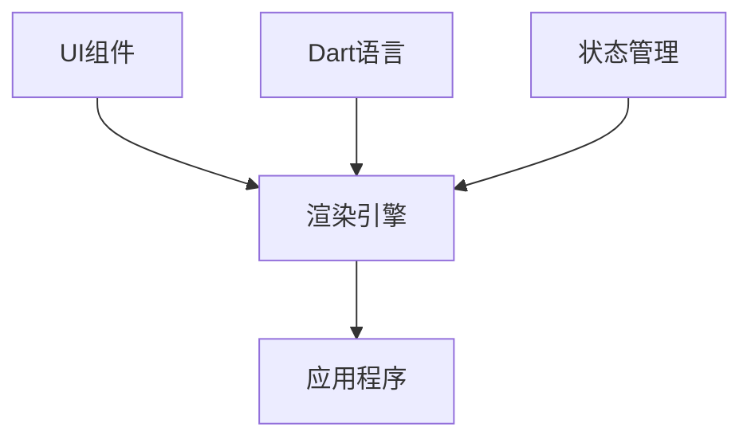
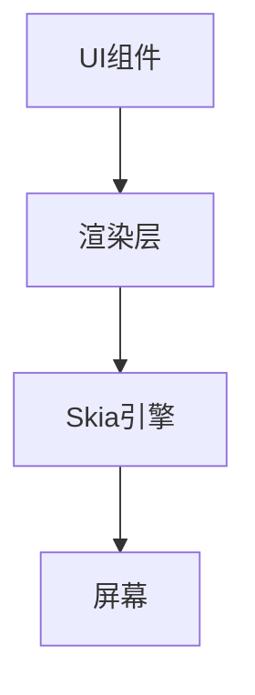
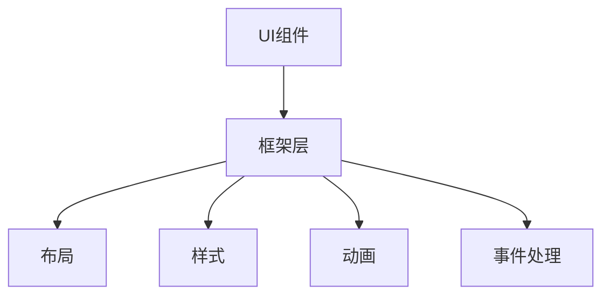
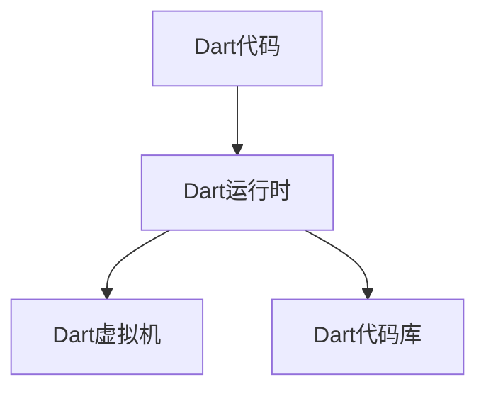
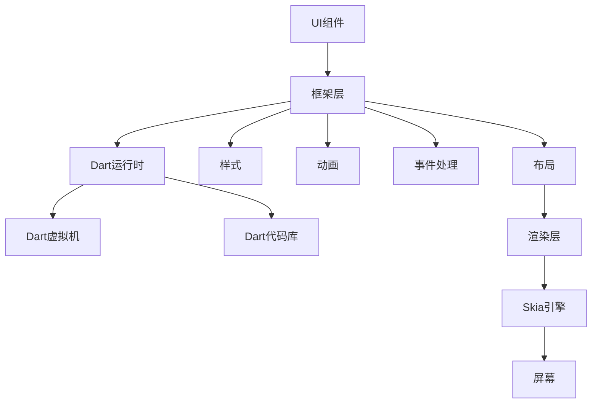

                 

### Flutter：Google的UI工具包for移动开发

Flutter 是一个由 Google 开发的开源 UI 工具包，用于构建跨平台的移动、Web 和桌面应用程序。Flutter 使用 Dart 语言编写，提供了一套丰富的组件库和工具集，允许开发者以更高的效率和更低的成本创建高质量的应用。

#### 核心关键词

- Flutter
- Google
- UI工具包
- 移动开发
- 跨平台
- Dart语言

#### 摘要

本文将深入探讨 Flutter，包括其核心概念、架构、基础组件、状态管理、动画、事件处理以及性能优化。我们将通过实际项目实战，展示如何使用 Flutter 开发一个简单的待办事项应用，并提供性能优化策略。最后，本文将分析 Flutter 的未来发展趋势和生态系统，帮助读者全面了解 Flutter 并掌握其开发技巧。

---

### Flutter：Google的UI工具包for移动开发

Flutter 是一款由 Google 开发的开源 UI 工具包，旨在为移动、Web 和桌面应用程序开发提供一种跨平台解决方案。Flutter 的核心目标是提供一种简单且高效的开发方式，使得开发者能够使用一套代码库在不同平台上创建高质量的应用。

#### 核心概念与联系

Flutter 的核心概念包括 UI 组件、渲染引擎、Dart 语言和状态管理。以下是一个简单的 Mermaid 流程图，展示了这些核心概念及其相互联系：



- **UI组件**：Flutter 提供了一套丰富的 UI 组件，开发者可以使用这些组件构建应用界面。
- **渲染引擎**：Flutter 使用 Skia 图形引擎进行渲染，确保应用在不同平台上具有一致的性能和外观。
- **Dart 语言**：Flutter 使用 Dart 语言编写，Dart 是一种现代化的编程语言，易于学习和使用。
- **状态管理**：Flutter 提供了多种状态管理方案，帮助开发者处理应用的状态变化。

#### Flutter 的优势

- **跨平台**：Flutter 支持多种平台，包括 iOS、Android、Web 和桌面，使得开发者可以一次编写，多平台部署。
- **高性能**：Flutter 使用 Skia 图形引擎进行渲染，确保了高性能和流畅的用户体验。
- **丰富的组件库**：Flutter 提供了丰富的 UI 组件，满足开发者构建各种类型应用的需求。
- **快速开发**：Flutter 的热重载功能允许开发者实时预览代码更改，提高开发效率。

#### Flutter 的发展历程

Flutter 的首个版本于 2018 年发布，经过几年的发展，Flutter 已经成为移动应用开发的重要工具之一。Flutter 2.0 版本的发布标志着 Flutter 的进一步成熟，引入了更多的新特性和改进。

- **2018 年**：Flutter 1.0 版本发布，标志着 Flutter 正式进入大众视野。
- **2019 年**：Flutter 1.5 版本发布，引入了 Web 支持和桌面支持。
- **2020 年**：Flutter 2.0 版本发布，带来了许多新特性和性能改进。
- **2021 年**：Flutter 2.2 版本发布，继续优化了 Web 和桌面支持。

通过以上内容，读者可以初步了解 Flutter 的核心概念、架构、优势和发展历程。接下来，我们将进一步探讨 Flutter 的入门知识，包括环境搭建、架构层次、常用组件等。

### 第1章 Flutter入门

#### 1.1 Flutter简介

Flutter 是一款由 Google 开发的开源 UI 工具包，用于构建跨平台的移动、Web 和桌面应用程序。Flutter 使用 Dart 语言编写，提供了一套丰富的组件库和工具集，允许开发者以更高的效率和更低的成本创建高质量的应用。

#### Flutter的定义

Flutter 是一个用于构建 UI 的框架，它提供了一套丰富的组件库和工具集，使得开发者可以轻松地实现复杂的用户界面。Flutter 的核心目标是提供一种简单且高效的开发方式，使得开发者能够使用一套代码库在不同平台上创建高质量的应用。

#### Flutter的优势

- **跨平台**：Flutter 支持多种平台，包括 iOS、Android、Web 和桌面，使得开发者可以一次编写，多平台部署。
- **高性能**：Flutter 使用 Skia 图形引擎进行渲染，确保了高性能和流畅的用户体验。
- **丰富的组件库**：Flutter 提供了丰富的 UI 组件，满足开发者构建各种类型应用的需求。
- **快速开发**：Flutter 的热重载功能允许开发者实时预览代码更改，提高开发效率。

#### Flutter的发展历程

Flutter 的首个版本于 2018 年发布，经过几年的发展，Flutter 已经成为移动应用开发的重要工具之一。Flutter 2.0 版本的发布标志着 Flutter 的进一步成熟，引入了更多的新特性和改进。

- **2018 年**：Flutter 1.0 版本发布，标志着 Flutter 正式进入大众视野。
- **2019 年**：Flutter 1.5 版本发布，引入了 Web 支持和桌面支持。
- **2020 年**：Flutter 2.0 版本发布，带来了许多新特性和性能改进。
- **2021 年**：Flutter 2.2 版本发布，继续优化了 Web 和桌面支持。

#### Flutter的应用场景

Flutter 适用于各种类型的应用开发，包括社交媒体、电子商务、金融应用等。它的高性能和跨平台特性使得它在大型企业应用中也有广泛的应用。

#### Flutter的优势与劣势

##### 优势

- **跨平台**：一套代码即可适配多个平台，降低开发成本。
- **高性能**：接近原生性能，用户体验优异。
- **丰富的组件**：提供丰富的UI组件，易于实现复杂界面。
- **快速开发**：热重载功能提高开发效率。

##### 劣势

- **学习曲线**：对于新手来说，学习Flutter可能需要一定的时间。
- **生态问题**：与一些其他框架相比，Flutter的生态系统可能还不够完善。

#### 总结

Flutter 是一个强大的 UI 工具包，具有跨平台、高性能和快速开发等优势。通过本章的介绍，读者可以对 Flutter 有一个基本的了解，并准备好进入更深入的探索。

---

### 1.2 Flutter环境搭建

要在本地环境中开发 Flutter 应用程序，首先需要安装 Flutter SDK 并配置相应的开发工具。以下是在 Windows、macOS 和 Linux 操作系统上搭建 Flutter 开发环境的详细步骤。

#### 在 Windows 上安装 Flutter

1. **安装 Windows SDK**：
   - 访问 [Windows SDK 下载页面](https://developer.microsoft.com/zh-cn/windows/downloads/)，下载并安装适用于 Windows 的最新版 Visual Studio。
   - 在安装过程中，确保选中“使用 C++ 需要的 Windows SDK”和“.NET Desktop 开发”。

2. **安装 Flutter SDK**：
   - 打开命令提示符（CMD）。
   - 执行以下命令来安装 Flutter SDK：
     ```shell
     flutter install
     ```
   - 安装过程中，系统会提示安装 SDK 的位置。默认情况下，建议使用默认位置。

3. **配置环境变量**：
   - 打开“系统属性”（System Properties），选择“高级”选项卡，点击“环境变量”。
   - 在“系统变量”中找到“Path”变量，点击“编辑”。
   - 在变量值中添加 Flutter SDK 的安装路径，通常是 `C:\Users\你的用户名\AppData\Local\Flutter`。
   - 点击“确定”保存设置。

4. **验证安装**：
   - 在命令提示符中执行以下命令，验证 Flutter 是否安装成功：
     ```shell
     flutter --version
     ```

#### 在 macOS 上安装 Flutter

1. **安装 Xcode**：
   - 打开 App Store，搜索并下载安装 Xcode。
   - 安装过程中，确保选中安装“Command Line Tools”。

2. **安装 Flutter SDK**：
   - 打开终端（Terminal）。
   - 执行以下命令来安装 Flutter SDK：
     ```shell
     curl https://storage.googleapis.com/flutter_archive/releases/1.12.13/flutter_macOS-amd64-1.12.13-stable.zip > flutter.zip
     unzip flutter.zip
     mv flutter bin
     rm flutter.zip
     ```
   - 安装过程中，系统会提示安装 SDK 的位置。默认情况下，建议使用默认位置。

3. **配置环境变量**：
   - 打开“终端”，执行以下命令，将 Flutter 添加到环境变量：
     ```shell
     echo 'export PATH=$PATH:$(dirname $(which flutter))' >> ~/.zshrc
     source ~/.zshrc
     ```

4. **验证安装**：
   - 在终端中执行以下命令，验证 Flutter 是否安装成功：
     ```shell
     flutter --version
     ```

#### 在 Linux 上安装 Flutter

1. **安装 Ubuntu SDK**：
   - 打开终端，执行以下命令安装 Ubuntu SDK：
     ```shell
     sudo apt-get update
     sudo apt-get install openssh-client curl git lsb-release
     ```
   - 确保在终端中执行以下命令安装必要的依赖项：
     ```shell
     sudo apt-get install python python-pip python3-pip gconf-service libasound2 libatk1.0-0 libatk-bridge2.0-0 libcairo2 libdbus-1-3 libenchant1 libesd0-2 libexpat1 libfontconfig1 libgcc1 libgconf-2-4 libgdk-pixbuf2.0-0 libglib2.0-0 libgtk-3-0 libnspr4 libnss3 libpango-1.0-0 libpangocairo-1.0-0 libstdc++6 libx11-6 libx11-xcb1 libxcb1 libxcomposite1 libxcursor1 libxdamage1 libxext6 libxfixes3 libxi6 libxrandr2 libxrender1 libxss1 libxtst6 ca-certificates fonts-liberation libappindicator1 libnss3 libasound2 libatk1.0-0 libatk-bridge2.0-0 libcairo2 libdbus-1-3 libenchant1 libesd0-2 libexpat1 libfontconfig1 libgcc1 libgconf-2-4 libgdk-pixbuf2.0-0 libglib2.0-0 libgtk-3-0 libnspr4 libnss3 libpango-1.0-0 libpangocairo-1.0-0 libstdc++6 libx11-6 libx11-xcb1 libxcb1 libxcomposite1 libxcursor1 libxdamage1 libxext6 libxfixes3 libxi6 libxrandr2 libxrender1 libxss1 libxtst6
     ```

2. **安装 Flutter SDK**：
   - 打开终端，执行以下命令来安装 Flutter SDK：
     ```shell
     curl -O "https://storage.googleapis.com/flutter Downloads/releases/1.12.13/flutter_linux-amd64-1.12.13-stable.tar.xz"
     tar xvf flutter_linux-amd64-1.12.13-stable.tar.xz
     mv flutter/bin /usr/local/bin/
     ```
   - 安装过程中，系统会提示安装 SDK 的位置。默认情况下，建议使用默认位置。

3. **配置环境变量**：
   - 打开终端，执行以下命令将 Flutter 添加到环境变量：
     ```shell
     echo 'export PATH="$PATH:/usr/local/bin"' >> ~/.bashrc
     source ~/.bashrc
     ```

4. **验证安装**：
   - 在终端中执行以下命令，验证 Flutter 是否安装成功：
     ```shell
     flutter --version
     ```

#### 总结

通过以上步骤，读者可以在 Windows、macOS 和 Linux 操作系统上成功搭建 Flutter 开发环境。接下来，我们将介绍如何在 Android Studio 或 Visual Studio Code 中配置 Flutter 开发工具，并创建第一个 Flutter 项目。

---

### 1.3 Flutter架构

Flutter 的架构设计旨在提供高性能、可扩展性和易用性。Flutter 的架构分为三层：渲染层、框架层和 Dart 运行时。以下是 Flutter 的架构层次和各层的功能：

#### 渲染层

渲染层是 Flutter 架构的基础，负责将 Flutter 的组件渲染为屏幕上的图形。渲染层主要由 Skia 图形引擎提供支持，Skia 是一个高性能的 2D 图形库，广泛应用于多个平台，如 Android 和 Chrome。以下是一个简化的渲染层 Mermaid 流程图：



- **UI组件**：Flutter 提供了一系列 UI 组件，如按钮、文本框和列表等，这些组件定义了应用的用户界面。
- **渲染层**：渲染层负责将 UI 组件转换为 Skia 图形对象。
- **Skia 引擎**：Skia 引擎负责执行实际的图形渲染操作，它将渲染层生成的图形对象绘制到屏幕上。
- **屏幕**：渲染后的图形最终显示在屏幕上，用户与屏幕进行交互。

#### 框架层

框架层位于渲染层之上，提供了构建 Flutter 应用的核心功能。框架层包括布局、样式、动画、事件处理等模块。以下是一个简化的框架层 Mermaid 流程图：



- **布局**：布局模块负责处理组件的排列和定位。
- **样式**：样式模块允许开发者定义组件的样式属性，如颜色、字体和边框等。
- **动画**：动画模块提供了创建和管理动画的功能。
- **事件处理**：事件处理模块负责响应用户的交互事件，如点击、滑动等。

#### Dart 运行时

Dart 运行时是 Flutter 的核心组件，它负责运行 Dart 代码并管理应用程序的生命周期。Dart 运行时分为两部分：Dart 虚拟机和 Dart 代码库。以下是一个简化的 Dart 运行时 Mermaid 流程图：



- **Dart 代码**：开发者编写的 Dart 代码定义了 Flutter 应用的逻辑和功能。
- **Dart 虚拟机**：Dart 虚拟机负责执行 Dart 代码，将其转换为机器码。
- **Dart 代码库**：Dart 代码库提供了 Dart 语言的核心功能，如标准库、UI 组件和框架层模块。

#### 各层之间的关系

渲染层、框架层和 Dart 运行时之间紧密协作，共同构成了 Flutter 的整体架构。以下是一个简化的 Mermaid 流程图，展示了各层之间的关系：



- **UI组件**：框架层的 UI 组件通过渲染层转换为 Skia 图形对象。
- **渲染层**：渲染层使用 Skia 引擎将图形对象绘制到屏幕上。
- **Dart 运行时**：Dart 运行时负责执行 Dart 代码，管理应用程序的生命周期。

通过以上

