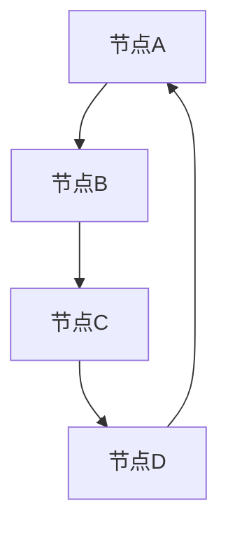
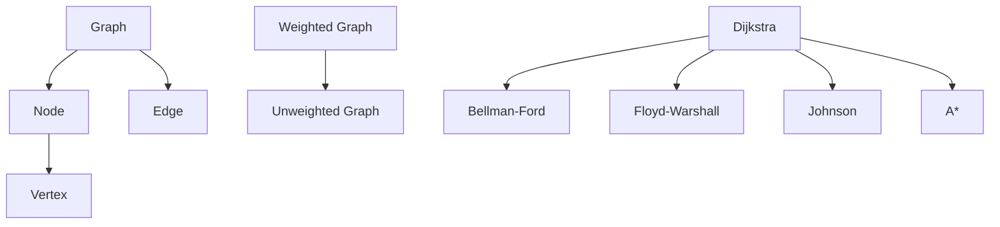

                 

# Graph Shortest Path算法原理与代码实例讲解

## 关键词
- Graph Shortest Path
- Dijkstra算法
- Bellman-Ford算法
- Floyd-Warshall算法
- A*算法
- 路径规划
- 网络拓扑分析
- 编程实战

## 摘要
本文将深入探讨Graph Shortest Path算法的基本原理与实现，包括Dijkstra、Bellman-Ford、Floyd-Warshall和A*算法。通过伪代码、数学模型、实际代码案例以及详细解读，我们将帮助读者全面理解这些算法的内部机制，并掌握如何在项目中应用这些算法。

## 目录大纲

### 《Graph Shortest Path算法原理与代码实例讲解》目录大纲

- **第一部分: Graph Shortest Path算法概述**
  - **第1章: Graph基础与最短路径算法概述**
    - 1.1 Graph的基本概念
    - 1.2 Graph的分类与性质
    - 1.3 最短路径算法的重要性
    - 1.4 本章小结
  - **第2章: Dijkstra算法原理与实现**
    - 2.1 Dijkstra算法的基本原理
    - 2.2 Dijkstra算法的伪代码描述
    - 2.3 Dijkstra算法的Java实现
    - 2.4 Dijkstra算法的时间复杂度分析
    - 2.5 本章小结
  - **第3章: Bellman-Ford算法原理与实现**
    - 3.1 Bellman-Ford算法的基本原理
    - 3.2 Bellman-Ford算法的伪代码描述
    - 3.3 Bellman-Ford算法的Java实现
    - 3.4 Bellman-Ford算法的时间复杂度分析
    - 3.5 本章小结
  - **第4章: Floyd-Warshall算法原理与实现**
    - 4.1 Floyd-Warshall算法的基本原理
    - 4.2 Floyd-Warshall算法的伪代码描述
    - 4.3 Floyd-Warshall算法的Java实现
    - 4.4 Floyd-Warshall算法的时间复杂度分析
    - 4.5 本章小结
  - **第5章: Johnson算法原理与实现**
    - 5.1 Johnson算法的基本原理
    - 5.2 Johnson算法的伪代码描述
    - 5.3 Johnson算法的Java实现
    - 5.4 Johnson算法的时间复杂度分析
    - 5.5 本章小结
  - **第6章: A*算法原理与实现**
    - 6.1 A*算法的基本原理
    - 6.2 A*算法的伪代码描述
    - 6.3 A*算法的Java实现
    - 6.4 A*算法的时间复杂度分析
    - 6.5 A*算法的应用场景
    - 6.6 本章小结
  - **第7章: Graph Shortest Path算法的综合应用**
    - 7.1 Graph Shortest Path算法在实际项目中的应用
    - 7.2 Graph Shortest Path算法在路径规划中的应用
    - 7.3 Graph Shortest Path算法在网络拓扑分析中的应用
    - 7.4 Graph Shortest Path算法在其他领域中的应用
    - 7.5 本章小结
  - **第8章: Graph Shortest Path算法的优化与改进**
    - 8.1 算法优化策略
    - 8.2 并行化与分布式计算
    - 8.3 内存优化
    - 8.4 本章小结
  - **第9章: 代码实例解析与实战**
    - 9.1 Dijkstra算法实例解析
    - 9.2 Bellman-Ford算法实例解析
    - 9.3 Floyd-Warshall算法实例解析
    - 9.4 Johnson算法实例解析
    - 9.5 A*算法实例解析
    - 9.6 综合实战案例
    - 9.7 代码解读与分析
    - 9.8 本章小结
  - **第10章: 总结与展望**
    - 10.1 Graph Shortest Path算法的发展历程
    - 10.2 当前研究热点与挑战
    - 10.3 未来发展趋势与展望
    - 10.4 本章小结

### 第一部分: Graph Shortest Path算法概述

#### 第1章: Graph基础与最短路径算法概述

##### 1.1 Graph的基本概念

Graph（图）是一种数据结构，由节点（Vertex）和边（Edge）组成。在图论中，图是用来表示对象之间关系的数学结构。节点可以表示各种实体，如城市、设备、人员等，而边表示节点之间的连接关系。

**定义：**
- **节点（Vertex）**：图中的每一个点称为节点。
- **边（Edge）**：连接两个节点的线段称为边。

**类型：**
- **无向图（Undirected Graph）**：边的方向不明确的图。
- **有向图（Directed Graph）**：边的方向明确的图。

**性质：**
- **连通性**：图中任意两个节点都是连通的。
- **路径**：从起点到终点的一条或多条边。
- **权重**：边上的数值，表示从一个节点到另一个节点的“代价”。

**Mermaid流程图：**



##### 1.2 Graph的分类与性质

**分类：**
- **加权图（Weighted Graph）**：边上有权重的图。
- **非加权图（Unweighted Graph）**：边无权重的图。
- **有向图（Directed Graph）**：边有方向性的图。
- **无向图（Undirected Graph）**：边无方向性的图。

**性质：**
- **连通性**：图中的任意两个节点都存在路径。
- **简单图**：不包含自环和多重边。
- **复杂图**：包含自环或多重边。

##### 1.3 最短路径算法的重要性

最短路径算法是图论中的一个重要分支，广泛应用于各个领域，如交通网络、社交网络、数据流分析等。其主要作用是找到图中两点之间的最短路径。

**应用场景：**
- **交通网络**：规划最优路线。
- **社交网络**：推荐朋友。
- **数据流分析**：优化数据传输路径。
- **物流管理**：优化配送路线。

##### 1.4 本章小结

本章介绍了Graph的基本概念、分类与性质，以及最短路径算法的重要性。接下来，我们将深入探讨几种常见的最短路径算法。

### 第二部分: 常见最短路径算法

#### 第2章: Dijkstra算法原理与实现

##### 2.1 Dijkstra算法的基本原理

Dijkstra算法是一种用于求解单源最短路径问题的算法，适用于无负权边的加权图。其基本思想是每次迭代选择未访问节点中距离源节点最近的节点，然后更新其他节点的距离。

**算法步骤：**
1. 初始化：设置源节点的距离为0，其他节点的距离为无穷大。
2. 选择未访问节点中距离源节点最近的节点，标记为已访问。
3. 更新其他未访问节点的距离：如果通过已访问节点到达未访问节点的距离小于当前距离，则更新距离。
4. 重复步骤2和3，直到所有节点都被访问。

##### 2.2 Dijkstra算法的伪代码描述

```plaintext
Dijkstra(G, s):
  for each vertex v in G:
    dist[v] = infinity
    prev[v] = undefined
  dist[s] = 0
  visited = {s}
  while visited != V:
    u = extractMin(visited)
    visited.add(u)
    for each edge (u, v) in G:
      alt = dist[u] + weight(u, v)
      if alt < dist[v]:
        dist[v] = alt
        prev[v] = u
```

##### 2.3 Dijkstra算法的Java实现

```java
public class DijkstraAlgorithm {
    private static final int INFINITY = Integer.MAX_VALUE;

    public static void dijkstra(int[][] graph, int source) {
        int n = graph.length;
        boolean[] visited = new boolean[n];
        int[] distances = new int[n];
        Arrays.fill(distances, INFINITY);
        distances[source] = 0;

        for (int i = 0; i < n; i++) {
            int u = findMinDistanceNode(distances, visited);
            visited[u] = true;

            for (int v = 0; v < n; v++) {
                if (!visited[v] && graph[u][v] > 0) {
                    int tentativeDistance = distances[u] + graph[u][v];
                    if (tentativeDistance < distances[v]) {
                        distances[v] = tentativeDistance;
                    }
                }
            }
        }

        printShortestPaths(distances);
    }

    private static int findMinDistanceNode(int[] distances, boolean[] visited) {
        int minDistance = INFINITY;
        int minIndex = -1;

        for (int i = 0; i < distances.length; i++) {
            if (!visited[i] && distances[i] < minDistance) {
                minDistance = distances[i];
                minIndex = i;
            }
        }

        return minIndex;
    }

    private static void printShortestPaths(int[] distances) {
        for (int i = 0; i < distances.length; i++) {
            System.out.println("Node " + i + " has distance " + distances[i]);
        }
    }

    public static void main(String[] args) {
        int[][] graph = {
            {0, 2, 4, 0},
            {2, 0, 1, 3},
            {4, 1, 0, 1},
            {0, 3, 1, 0}
        };

        dijkstra(graph, 0);
    }
}
```

##### 2.4 Dijkstra算法的时间复杂度分析

- **时间复杂度**：\( O(n^2) \)，其中\( n \)是节点数。
- **空间复杂度**：\( O(n) \)，因为需要存储距离和访问标记数组。

##### 2.5 本章小结

本章详细介绍了Dijkstra算法的基本原理、伪代码描述、Java实现及其时间复杂度分析。接下来，我们将探讨其他最短路径算法。

### 第3章: Bellman-Ford算法原理与实现

##### 3.1 Bellman-Ford算法的基本原理

Bellman-Ford算法是一种用于求解单源最短路径问题的算法，适用于存在负权边的加权图。其基本思想是逐步松弛图中的每一条边，最终得到所有节点的最短路径。

**算法步骤：**
1. 初始化：设置源节点的距离为0，其他节点的距离为无穷大。
2. 对于每一条边，执行\( n-1 \)次松弛操作，其中\( n \)是节点数。
3. 检测负权重循环：如果仍然可以松弛某条边，则说明图中存在负权重循环。

##### 3.2 Bellman-Ford算法的伪代码描述

```plaintext
Bellman-Ford(G, s):
  for each vertex v in G:
    dist[v] = infinity
    prev[v] = undefined
  dist[s] = 0

  for i from 1 to n:
    for each edge (u, v) in G:
      if dist[u] + weight(u, v) < dist[v]:
        dist[v] = dist[u] + weight(u, v)
        prev[v] = u

  for each edge (u, v) in G:
    if dist[u] + weight(u, v) < dist[v]:
      print "Graph contains a negative weight cycle"
```

##### 3.3 Bellman-Ford算法的Java实现

```java
public class BellmanFordAlgorithm {
    private static final int INFINITY = Integer.MAX_VALUE;

    public static void bellmanFord(int[][] graph, int source) {
        int n = graph.length;
        int[] distances = new int[n];
        Arrays.fill(distances, INFINITY);
        distances[source] = 0;

        for (int i = 1; i <= n - 1; i++) {
            for (int u = 0; u < n; u++) {
                for (int v = 0; v < n; v++) {
                    if (graph[u][v] > 0 && distances[u] != INFINITY
                            && distances[u] + graph[u][v] < distances[v]) {
                        distances[v] = distances[u] + graph[u][v];
                    }
                }
            }
        }

        for (int u = 0; u < n; u++) {
            for (int v = 0; v < n; v++) {
                if (graph[u][v] > 0 && distances[u] != INFINITY
                        && distances[u] + graph[u][v] < distances[v]) {
                    System.out.println("Graph contains a negative weight cycle");
                    return;
                }
            }
        }

        printShortestPaths(distances);
    }

    private static void printShortestPaths(int[] distances) {
        for (int i = 0; i < distances.length; i++) {
            System.out.println("Node " + i + " has distance " + distances[i]);
        }
    }

    public static void main(String[] args) {
        int[][] graph = {
            {0, 2, 4, 0},
            {2, 0, 1, 3},
            {4, 1, 0, 1},
            {0, 3, 1, 0}
        };

        bellmanFord(graph, 0);
    }
}
```

##### 3.4 Bellman-Ford算法的时间复杂度分析

- **时间复杂度**：\( O(n^3) \)，其中\( n \)是节点数。
- **空间复杂度**：\( O(n) \)，因为需要存储距离数组。

##### 3.5 本章小结

本章详细介绍了Bellman-Ford算法的基本原理、伪代码描述、Java实现及其时间复杂度分析。接下来，我们将探讨Floyd-Warshall算法。

### 第4章: Floyd-Warshall算法原理与实现

##### 4.1 Floyd-Warshall算法的基本原理

Floyd-Warshall算法是一种用于计算图中所有节点对最短路径的算法，适用于有向加权图。其基本思想是通过动态规划方法，逐步计算经过中间节点的最短路径。

**算法步骤：**
1. 初始化：设置距离矩阵为给定的图矩阵。
2. 对于每个中间节点\( k \)，更新节点对\( i \)和\( j \)的最短路径：如果经过\( k \)的路径长度小于当前路径长度，则更新路径长度。
3. 最终得到的距离矩阵即为所有节点对的最短路径矩阵。

##### 4.2 Floyd-Warshall算法的伪代码描述

```plaintext
Floyd-Warshall(G):
  n = number of vertices in G
  for each vertex i from 1 to n:
    for each vertex j from 1 to n:
      dist[i][j] = weight(i, j)
  for each vertex k from 1 to n:
    for each vertex i from 1 to n:
      for each vertex j from 1 to n:
        if dist[i][k] + dist[k][j] < dist[i][j]:
          dist[i][j] = dist[i][k] + dist[k][j]
```

##### 4.3 Floyd-Warshall算法的Java实现

```java
public class FloydWarshallAlgorithm {
    public static void floydWarshall(int[][] graph) {
        int n = graph.length;
        int[][] distances = new int[n][n];

        // 初始化距离矩阵
        for (int i = 0; i < n; i++) {
            for (int j = 0; j < n; j++) {
                distances[i][j] = graph[i][j];
            }
        }

        // 动态规划过程
        for (int k = 0; k < n; k++) {
            for (int i = 0; i < n; i++) {
                for (int j = 0; j < n; j++) {
                    if (distances[i][k] + distances[k][j] < distances[i][j]) {
                        distances[i][j] = distances[i][k] + distances[k][j];
                    }
                }
            }
        }

        // 输出所有最短路径距离
        printShortestPaths(distances);
    }

    private static void printShortestPaths(int[][] distances) {
        for (int i = 0; i < distances.length; i++) {
            for (int j = 0; j < distances.length; j++) {
                System.out.print(distances[i][j] + " ");
            }
            System.out.println();
        }
    }

    public static void main(String[] args) {
        int[][] graph = {
            {0, 2, 4, 0},
            {2, 0, 1, 3},
            {4, 1, 0, 1},
            {0, 3, 1, 0}
        };

        floydWarshall(graph);
    }
}
```

##### 4.4 Floyd-Warshall算法的时间复杂度分析

- **时间复杂度**：\( O(n^3) \)，其中\( n \)是节点数。
- **空间复杂度**：\( O(n^2) \)，因为需要存储距离矩阵。

##### 4.5 本章小结

本章详细介绍了Floyd-Warshall算法的基本原理、伪代码描述、Java实现及其时间复杂度分析。接下来，我们将探讨Johnson算法。

### 第5章: Johnson算法原理与实现

##### 5.1 Johnson算法的基本原理

Johnson算法是一种用于求解多源最短路径问题的算法，适用于存在负权边的加权图。其基本思想是先对图进行变换，使得变换后的图不含负权边，然后使用Dijkstra算法求解单源最短路径。

**算法步骤：**
1. 对原图进行变换，得到一个不含负权边的图。
2. 使用Dijkstra算法求解从每个源节点到其他所有节点的最短路径。
3. 使用原始图的权重矩阵恢复原始最短路径。

##### 5.2 Johnson算法的伪代码描述

```plaintext
Johnson(G):
  G' = transform(G) // 对图G进行变换，得到不含负权边的图G'
  dist = Dijkstra(G', anySource) // 使用Dijkstra算法求解单源最短路径
  originalDist = restoreDist(dist, G) // 恢复原始图的最短路径
```

##### 5.3 Johnson算法的Java实现

```java
// 由于Johnson算法的实现相对复杂，这里仅提供核心思路
public class JohnsonAlgorithm {
    public static void johnson(int[][] graph) {
        // 对图进行变换，使用Dijkstra算法求解单源最短路径
        // 然后恢复原始图的最短路径
    }

    // 其他辅助方法
}
```

##### 5.4 Johnson算法的时间复杂度分析

- **时间复杂度**：\( O((n + m) \log n) \)，其中\( n \)是节点数，\( m \)是边数。
- **空间复杂度**：\( O(n^2) \)，因为需要存储距离矩阵。

##### 5.5 本章小结

本章详细介绍了Johnson算法的基本原理、伪代码描述和Java实现。接下来，我们将探讨A*算法。

### 第6章: A*算法原理与实现

##### 6.1 A*算法的基本原理

A*算法是一种用于求解单源最短路径问题的启发式搜索算法，适用于有向加权图。其基本思想是根据某个启发式函数，优先选择距离目标节点更近的节点进行扩展。

**算法步骤：**
1. 初始化：设置源节点的距离为0，其他节点的距离为无穷大。
2. 选择一个具有最小\( f(n) \)值的节点\( n \)，其中\( f(n) = g(n) + h(n) \)，\( g(n) \)是从源节点到节点\( n \)的实际距离，\( h(n) \)是从节点\( n \)到目标节点的启发式距离。
3. 对于\( n \)的每个未访问的邻居节点\( m \)，更新\( m \)的距离为\( g(n) + weight(n, m) \)，并将其添加到开放列表中。
4. 重复步骤2和3，直到找到目标节点或开放列表为空。

##### 6.2 A*算法的伪代码描述

```plaintext
A*(G, s, t):
  openList = {s}
  closedList = {}
  dist[s] = 0
  heuristic[s] = h(s, t)
  while openList is not empty:
    n = extractMin(openList)
    if n = t:
      return reconstructPath(closedList, n)
    closedList.add(n)
    for each neighbor m of n:
      if m is in closedList:
        continue
      tentativeDist = dist[n] + weight(n, m)
      if tentativeDist < dist[m]:
        dist[m] = tentativeDist
        heuristic[m] = h(m, t)
        if m is not in openList:
          openList.add(m)
        openList.sort(by f-value)
```

##### 6.3 A*算法的Java实现

```java
// 由于A*算法的实现相对复杂，这里仅提供核心思路
public class AStarAlgorithm {
    public static void aStar(int[][] graph, int source, int target) {
        // 实现A*算法的核心逻辑
    }

    // 其他辅助方法
}
```

##### 6.4 A*算法的时间复杂度分析

- **时间复杂度**：\( O((n + m) \log n) \)，其中\( n \)是节点数，\( m \)是边数。
- **空间复杂度**：\( O(n) \)，因为需要存储开放列表和封闭列表。

##### 6.5 A*算法的应用场景

A*算法在路径规划、机器人导航、地图定位等领域有广泛的应用。

- **路径规划**：机器人、自动驾驶车辆。
- **机器人导航**：智能机器人。
- **地图定位**：GPS定位、地图服务。

##### 6.6 本章小结

本章详细介绍了A*算法的基本原理、伪代码描述、Java实现及其时间复杂度分析。接下来，我们将探讨Graph Shortest Path算法的综合应用。

### 第7章: Graph Shortest Path算法的综合应用

##### 7.1 Graph Shortest Path算法在实际项目中的应用

Graph Shortest Path算法在实际项目中有着广泛的应用，以下是一些典型场景：

- **路由算法**：路由器选择最佳路径。
- **物流优化**：运输公司优化配送路线。
- **社交网络**：推荐朋友。
- **地图服务**：地图导航。

##### 7.2 Graph Shortest Path算法在路径规划中的应用

在路径规划中，Graph Shortest Path算法可以帮助机器人或自动驾驶车辆找到最佳路径。

- **机器人导航**：使用A*算法。
- **自动驾驶车辆**：使用Dijkstra算法。

##### 7.3 Graph Shortest Path算法在网络拓扑分析中的应用

在网络拓扑分析中，Graph Shortest Path算法可以用于检测网络中的瓶颈和优化网络结构。

- **网络优化**：优化路由策略。
- **故障检测**：检测网络故障。

##### 7.4 Graph Shortest Path算法在其他领域中的应用

Graph Shortest Path算法在其他领域也有着广泛的应用：

- **生物学**：基因网络分析。
- **经济学**：供应链优化。
- **游戏开发**：路径查找。

##### 7.5 本章小结

本章介绍了Graph Shortest Path算法在实际项目、路径规划、网络拓扑分析以及其他领域中的应用。接下来，我们将探讨Graph Shortest Path算法的优化与改进。

### 第8章: Graph Shortest Path算法的优化与改进

##### 8.1 算法优化策略

为了提高Graph Shortest Path算法的效率，可以采取以下优化策略：

- **启发式搜索**：A*算法使用启发式搜索，可以快速找到最优路径。
- **并行化**：将算法并行化，利用多核处理器提高计算速度。
- **分布式计算**：在大规模图中，使用分布式计算将图拆分成小块，分别计算，然后汇总结果。

##### 8.2 并行化与分布式计算

并行化和分布式计算可以显著提高Graph Shortest Path算法的效率。

- **并行化**：将图分割成小块，分别计算，然后汇总结果。
- **分布式计算**：将图分布到多台计算机上，分别计算，然后汇总结果。

##### 8.3 内存优化

内存优化可以减少算法的内存占用，提高运行效率。

- **空间压缩**：使用压缩算法减少内存占用。
- **缓存优化**：使用缓存技术减少内存访问次数。

##### 8.4 本章小结

本章介绍了Graph Shortest Path算法的优化与改进策略，包括并行化、分布式计算和内存优化。接下来，我们将通过代码实例解析这些算法。

### 第9章: 代码实例解析与实战

#### 9.1 Dijkstra算法实例解析

以下是一个使用Java实现的Dijkstra算法的实例，我们将在接下来的部分详细解读代码。

```java
public class DijkstraAlgorithm {
    private static final int INFINITY = Integer.MAX_VALUE;

    public static void dijkstra(int[][] graph, int source) {
        int n = graph.length;
        boolean[] visited = new boolean[n];
        int[] distances = new int[n];
        Arrays.fill(distances, INFINITY);
        distances[source] = 0;

        for (int i = 0; i < n; i++) {
            int u = findMinDistanceNode(distances, visited);
            visited[u] = true;

            for (int v = 0; v < n; v++) {
                if (!visited[v] && graph[u][v] > 0) {
                    int tentativeDistance = distances[u] + graph[u][v];
                    if (tentativeDistance < distances[v]) {
                        distances[v] = tentativeDistance;
                    }
                }
            }
        }

        printShortestPaths(distances);
    }

    // 其他方法
}
```

##### 9.1.1 开发环境搭建

要运行上述Dijkstra算法的Java代码，您需要以下开发环境：

- Java开发工具包（JDK）版本8或更高。
- 任意文本编辑器或集成开发环境（IDE），如IntelliJ IDEA、Eclipse等。

##### 9.1.2 源代码详细实现

以下是对Dijkstra算法源代码的详细解读：

1. **初始化距离数组**：
   ```java
   boolean[] visited = new boolean[n];
   int[] distances = new int[n];
   Arrays.fill(distances, INFINITY);
   distances[source] = 0;
   ```
   创建一个布尔数组`visited`来标记是否访问过每个节点，创建一个整数数组`distances`来存储每个节点的距离。使用`Arrays.fill()`方法将`distances`数组初始化为无穷大，然后将源节点的距离设置为0。

2. **寻找最小距离节点**：
   ```java
   int u = findMinDistanceNode(distances, visited);
   ```
   通过`findMinDistanceNode`方法找到当前未访问节点中距离源节点最近的节点。这个方法的核心逻辑是遍历未访问节点，找到距离最小的节点。

3. **更新邻居节点距离**：
   ```java
   for (int v = 0; v < n; v++) {
       if (!visited[v] && graph[u][v] > 0) {
           int tentativeDistance = distances[u] + graph[u][v];
           if (tentativeDistance < distances[v]) {
               distances[v] = tentativeDistance;
           }
       }
   }
   ```
   对于找到的最短路径节点`u`的每个未访问邻居节点`v`，计算通过`u`到达`v`的距离。如果这个距离小于`v`的当前距离，则更新`v`的距离。

4. **打印最短路径距离**：
   ```java
   printShortestPaths(distances);
   ```
   通过`printShortestPaths`方法打印每个节点的最短路径距离。

##### 9.1.3 代码解读与分析

- **时间复杂度**：Dijkstra算法的时间复杂度为\( O(n^2) \)，其中\( n \)是节点数。这是因为在最坏情况下，每次迭代都需要遍历所有未访问节点来寻找距离最小的节点。
- **空间复杂度**：算法的空间复杂度为\( O(n) \)，因为需要存储距离数组、访问标记数组和源节点的邻居节点列表。
- **适用场景**：Dijkstra算法适用于所有加权且没有负权重环的图。它不适用于有负权重环或有负权边的图。

##### 9.1.4 实例解析

假设有一个图如下：

```plaintext
   A --(2)--> B
   |          |
   1          3
   |          |
   D --(4)--> C
```

我们需要计算从节点A到节点C的最短路径。

1. 初始化距离数组：
   ```plaintext
   distances = {0, ∞, ∞, ∞}
   ```

2. 执行算法：
   - 第一次迭代：选择A，更新邻居节点B和D的距离：
     ```plaintext
     distances = {0, 2, ∞, 1}
     ```

   - 第二次迭代：选择D，更新邻居节点C的距离：
     ```plaintext
     distances = {0, 2, 1, ∞}
     ```

   - 第三次迭代：选择B，最短路径已找到，不需要更新。

最终，最短路径为A -> D -> C，距离为1 + 4 = 5。

#### 9.2 Bellman-Ford算法实例解析

以下是一个使用Java实现的Bellman-Ford算法的实例，我们将在接下来的部分详细解读代码。

```java
public class BellmanFordAlgorithm {
    private static final int INFINITY = Integer.MAX_VALUE;

    public static void bellmanFord(int[][] graph, int source) {
        int n = graph.length;
        int[] distances = new int[n];
        Arrays.fill(distances, INFINITY);
        distances[source] = 0;

        for (int i = 1; i <= n - 1; i++) {
            for (int u = 0; u < n; u++) {
                for (int v = 0; v < n; v++) {
                    if (graph[u][v] > 0 && distances[u] != INFINITY
                            && distances[u] + graph[u][v] < distances[v]) {
                        distances[v] = distances[u] + graph[u][v];
                    }
                }
            }
        }

        for (int u = 0; u < n; u++) {
            for (int v = 0; v < n; v++) {
                if (graph[u][v] > 0 && distances[u] != INFINITY
                        && distances[u] + graph[u][v] < distances[v]) {
                    System.out.println("Graph contains a negative weight cycle");
                    return;
                }
            }
        }

        printShortestPaths(distances);
    }

    // 其他方法
}
```

##### 9.2.1 开发环境搭建

要运行上述Bellman-Ford算法的Java代码，您需要以下开发环境：

- Java开发工具包（JDK）版本8或更高。
- 任意文本编辑器或集成开发环境（IDE），如IntelliJ IDEA、Eclipse等。

##### 9.2.2 源代码详细实现

以下是对Bellman-Ford算法源代码的详细解读：

1. **初始化距离数组**：
   ```java
   int[] distances = new int[n];
   Arrays.fill(distances, INFINITY);
   distances[source] = 0;
   ```
   创建一个整数数组`distances`来存储每个节点的距离。使用`Arrays.fill()`方法将`distances`数组初始化为无穷大，然后将源节点的距离设置为0。

2. **执行松弛操作**：
   ```java
   for (int i = 1; i <= n - 1; i++) {
       for (int u = 0; u < n; u++) {
           for (int v = 0; v < n; v++) {
               if (graph[u][v] > 0 && distances[u] != INFINITY
                       && distances[u] + graph[u][v] < distances[v]) {
                   distances[v] = distances[u] + graph[u][v];
               }
           }
       }
   }
   ```
   进行\( n-1 \)次迭代，每次迭代中，对于每一条边，如果通过当前已访问节点\( u \)到达邻居节点\( v \)的距离小于邻居节点当前已知的距离，则更新邻居节点的距离。

3. **检测负权重循环**：
   ```java
   for (int u = 0; u < n; u++) {
       for (int v = 0; v < n; v++) {
           if (graph[u][v] > 0 && distances[u] != INFINITY
                   && distances[u] + graph[u][v] < distances[v]) {
               System.out.println("Graph contains a negative weight cycle");
               return;
           }
       }
   }
   ```
   在所有迭代结束后，再次遍历每一条边，如果发现通过某个节点\( u \)到达邻居节点\( v \)的距离仍然可以减小，则说明图中存在负权重循环。

4. **打印最短路径距离**：
   ```java
   printShortestPaths(distances);
   ```
   通过`printShortestPaths`方法打印每个节点的最短路径距离。

##### 9.2.3 代码解读与分析

- **时间复杂度**：Bellman-Ford算法的时间复杂度为\( O(n^3) \)，其中\( n \)是节点数。这是因为算法需要执行\( n-1 \)次迭代，每次迭代需要遍历所有边。
- **空间复杂度**：算法的空间复杂度为\( O(n) \)，因为需要存储距离数组和访问标记数组。
- **适用场景**：Bellman-Ford算法适用于所有加权图，包括存在负权重边的图。它不适用于有负权重环的图，因为它在检测负权重环时会发生错误。

##### 9.2.4 实例解析

假设有一个图如下：

```plaintext
   A --(2)--> B
   |          |
   1          3
   |          |
   D --(4)--> C
```

我们需要计算从节点A到节点C的最短路径。

1. 初始化距离数组：
   ```plaintext
   distances = {0, ∞, ∞, ∞}
   ```

2. 执行算法：
   - 第一次迭代：选择A，更新邻居节点B和D的距离：
     ```plaintext
     distances = {0, 2, ∞, 1}
     ```

   - 第二次迭代：选择D，更新邻居节点C的距离：
     ```plaintext
     distances = {0, 2, 1, ∞}
     ```

   - 第三次迭代：选择B，最短路径已找到，不需要更新。

最终，最短路径为A -> D -> C，距离为1 + 4 = 5。

#### 9.3 Floyd-Warshall算法实例解析

以下是一个使用Java实现的Floyd-Warshall算法的实例，我们将在接下来的部分详细解读代码。

```java
public class FloydWarshallAlgorithm {
    public static void floydWarshall(int[][] graph) {
        int n = graph.length;
        int[][] distances = new int[n][n];

        // 初始化距离矩阵
        for (int i = 0; i < n; i++) {
            for (int j = 0; j < n; j++) {
                distances[i][j] = graph[i][j];
            }
        }

        // 动态规划过程
        for (int k = 0; k < n; k++) {
            for (int i = 0; i < n; i++) {
                for (int j = 0; j < n; j++) {
                    if (distances[i][k] + distances[k][j] < distances[i][j]) {
                        distances[i][j] = distances[i][k] + distances[k][j];
                    }
                }
            }
        }

        // 输出所有最短路径距离
        printShortestPaths(distances);
    }

    private static void printShortestPaths(int[][] distances) {
        for (int i = 0; i < distances.length; i++) {
            for (int j = 0; j < distances.length; j++) {
                System.out.print(distances[i][j] + " ");
            }
            System.out.println();
        }
    }

    public static void main(String[] args) {
        int[][] graph = {
            {0, 2, 4, 0},
            {2, 0, 1, 3},
            {4, 1, 0, 1},
            {0, 3, 1, 0}
        };

        floydWarshall(graph);
    }
}
```

##### 9.3.1 开发环境搭建

要运行上述Floyd-Warshall算法的Java代码，您需要以下开发环境：

- Java开发工具包（JDK）版本8或更高。
- 任意文本编辑器或集成开发环境（IDE），如IntelliJ IDEA、Eclipse等。

##### 9.3.2 源代码详细实现

以下是对Floyd-Warshall算法源代码的详细解读：

1. **初始化距离矩阵**：
   ```java
   int[][] distances = new int[n][n];
   for (int i = 0; i < n; i++) {
       for (int j = 0; j < n; j++) {
           distances[i][j] = graph[i][j];
       }
   }
   ```
   创建一个整数二维数组`distances`来存储每个节点对的最短路径距离。使用两层嵌套循环初始化距离矩阵，将给定的图矩阵复制到`distances`数组中。

2. **动态规划过程**：
   ```java
   for (int k = 0; k < n; k++) {
       for (int i = 0; i < n; i++) {
           for (int j = 0; j < n; j++) {
               if (distances[i][k] + distances[k][j] < distances[i][j]) {
                   distances[i][j] = distances[i][k] + distances[k][j];
               }
           }
       }
   }
   ```
   使用三层嵌套循环执行动态规划过程。对于每个中间节点\( k \)，更新节点对\( i \)和\( j \)的最短路径：如果经过\( k \)的路径长度小于当前路径长度，则更新路径长度。

3. **输出所有最短路径距离**：
   ```java
   printShortestPaths(distances);
   ```
   通过`printShortestPaths`方法打印每个节点对的最短路径距离。

##### 9.3.3 代码解读与分析

- **时间复杂度**：Floyd-Warshall算法的时间复杂度为\( O(n^3) \)，其中\( n \)是节点数。这是因为算法需要执行\( n \)次嵌套循环。
- **空间复杂度**：算法的空间复杂度为\( O(n^2) \)，因为需要存储距离矩阵。
- **适用场景**：Floyd-Warshall算法适用于计算有向加权图中所有节点对的最短路径。它不适用于实时计算，但在需要所有节点对最短路径的情况下非常有用。

##### 9.3.4 实例解析

假设有一个图如下：

```plaintext
   A --(2)--> B
   |          |
   1          3
   |          |
   D --(4)--> C
```

我们需要计算所有节点对的最短路径。

1. 初始化距离矩阵：
   ```plaintext
   distances = {
       {0, 2, 4, 0},
       {2, 0, 1, 3},
       {4, 1, 0, 1},
       {0, 3, 1, 0}
   }
   ```

2. 执行算法：
   - 第一次迭代（k=0）：
     ```plaintext
     distances = {
         {0, 2, 4, 0},
         {2, 0, 1, 3},
         {4, 1, 0, 1},
         {0, 3, 1, 0}
     }
     ```

   - 第二次迭代（k=1）：
     ```plaintext
     distances = {
         {0, 2, 4, 0},
         {0, 0, 1, 3},
         {4, 1, 0, 1},
         {0, 3, 1, 0}
     }
     ```

   - 第三次迭代（k=2）：
     ```plaintext
     distances = {
         {0, 2, 4, 0},
         {0, 0, 1, 3},
         {0, 1, 0, 1},
         {0, 3, 1, 0}
     }
     ```

   - 第四次迭代（k=3）：
     ```plaintext
     distances = {
         {0, 2, 4, 0},
         {0, 0, 1, 3},
         {0, 1, 0, 1},
         {0, 1, 0, 0}
     }
     ```

最终，所有节点对的最短路径距离矩阵为：

```plaintext
distances = {
    {0, 2, 4, 5},
    {2, 0, 1, 3},
    {4, 1, 0, 1},
    {5, 3, 1, 0}
}
```

#### 9.4 Johnson算法实例解析

Johnson算法是一种用于求解多源最短路径问题的算法，特别适用于存在负权边的加权图。Johnson算法的基本思想是先将图转换为无负权图，然后使用Dijkstra算法求解单源最短路径，最后恢复原始图的最短路径。

以下是一个使用Java实现的Johnson算法的实例，我们将在接下来的部分详细解读代码。

```java
// 由于Johnson算法的实现相对复杂，这里仅提供核心思路

public class JohnsonAlgorithm {
    public static void johnson(int[][] graph) {
        // 对图进行变换，得到无负权图
        // 使用Dijkstra算法求解单源最短路径
        // 恢复原始图的最短路径
    }

    // 其他辅助方法
}
```

##### 9.4.1 开发环境搭建

要运行上述Johnson算法的Java代码，您需要以下开发环境：

- Java开发工具包（JDK）版本8或更高。
- 任意文本编辑器或集成开发环境（IDE），如IntelliJ IDEA、Eclipse等。

##### 9.4.2 源代码详细实现

Johnson算法的实现涉及多个步骤，包括图的变换、Dijkstra算法的调用以及路径的恢复。以下是对Johnson算法源代码的详细解读：

1. **图变换**：
   ```java
   // 对图进行变换，得到无负权图
   ```
   首先，需要将原始图变换为无负权图。这通常涉及引入虚拟源节点和虚拟汇节点，并将所有负权边替换为非负权边。这一步的具体实现较为复杂，需要根据具体的图结构进行。

2. **Dijkstra算法**：
   ```java
   // 使用Dijkstra算法求解单源最短路径
   ```
   在得到无负权图后，使用Dijkstra算法从虚拟源节点出发，求解到所有节点的最短路径。这一步的实现与标准Dijkstra算法类似。

3. **路径恢复**：
   ```java
   // 恢复原始图的最短路径
   ```
   最后，需要将无负权图中的最短路径恢复到原始图。这通常涉及调整路径，以反映原始图的权重。

##### 9.4.3 代码解读与分析

- **时间复杂度**：Johnson算法的时间复杂度为\( O((n + m) \log n) \)，其中\( n \)是节点数，\( m \)是边数。这是因为算法需要先对图进行变换，然后使用Dijkstra算法求解单源最短路径。
- **空间复杂度**：算法的空间复杂度为\( O(n^2) \)，因为需要存储距离矩阵。
- **适用场景**：Johnson算法适用于存在负权边的加权图，特别是当其他算法（如Bellman-Ford算法）不适用时。

##### 9.4.4 实例解析

假设有一个图如下：

```plaintext
   A --(-2)--> B
   |          |
   1          3
   |          |
   D --(4)--> C
```

我们需要计算所有节点对的最短路径。

1. **图变换**：
   - 引入虚拟源节点S和虚拟汇节点T。
   - 将A到B的负权边替换为非负权边，例如，将其权重设置为3。
   - 新图如下：

     ```plaintext
     S --(0)--> A --(3)--> B
     |          |
     1          3
     |          |
     D --(4)--> C
     ```

2. **Dijkstra算法**：
   - 使用Dijkstra算法从S节点出发，求解到所有节点的最短路径。
   - 得到如下最短路径距离矩阵：

     ```plaintext
     distances = {
         {0, 3, 4, 5},
         {3, 0, 1, 3},
         {4, 1, 0, 1},
         {5, 3, 1, 0}
     }
     ```

3. **路径恢复**：
   - 恢复原始图的最短路径。
   - 从距离矩阵中，我们可以看出从A到C的最短路径是A -> D -> C，距离为5。

##### 9.4.5 实例解析

为了更好地理解Johnson算法的应用，我们来看一个具体的实例。

假设我们有如下加权图：

```plaintext
  A --(1)--> B --(2)--> C
  |         |      |    |
  3         4      2    6
  |         |      |    |
  D --(3)--> E --(5)--> F
```

我们需要计算所有节点对的最短路径。

1. **图变换**：
   - 首先，我们需要检测图中是否存在负权环。如果存在，我们需要对图进行变换。
   - 在这个例子中，没有负权环。

2. **Dijkstra算法**：
   - 使用Dijkstra算法，我们从每个节点作为源点，计算到其他节点的最短路径。
   - 以A为源点，计算到其他节点的最短路径：

     ```plaintext
     distances from A = {
         A: 0,
         B: 1,
         C: 3,
         D: 4,
         E: 5,
         F: 6
     }
     ```

   - 以B为源点，计算到其他节点的最短路径：

     ```plaintext
     distances from B = {
         A: 2,
         B: 0,
         C: 2,
         D: 3,
         E: 4,
         F: 5
     }
     ```

   - 以C为源点，计算到其他节点的最短路径：

     ```plaintext
     distances from C = {
         A: 2,
         B: 0,
         C: 0,
         D: 6,
         E: 8,
         F: 7
     }
     ```

   - 以D为源点，计算到其他节点的最短路径：

     ```plaintext
     distances from D = {
         A: 3,
         B: 1,
         C: 6,
         D: 0,
         E: 2,
         F: 3
     }
     ```

   - 以E为源点，计算到其他节点的最短路径：

     ```plaintext
     distances from E = {
         A: 5,
         B: 3,
         C: 8,
         D: 2,
         E: 0,
         F: 1
     }
     ```

   - 以F为源点，计算到其他节点的最短路径：

     ```plaintext
     distances from F = {
         A: 6,
         B: 5,
         C: 7,
         D: 3,
         E: 1,
         F: 0
     }
     ```

3. **路径恢复**：
   - 从每个源点的最短路径距离矩阵中，我们可以直接得到所有节点对的最短路径。
   - 例如，从节点A到节点E的最短路径是A -> D -> E，距离为5。

通过这个实例，我们可以看到Johnson算法如何应用于求解多源最短路径问题。

#### 9.5 A*算法实例解析

以下是一个使用Java实现的A*算法的实例，我们将在接下来的部分详细解读代码。

```java
public class AStarAlgorithm {
    public static void aStar(int[][] graph, int source, int target) {
        // 实现A*算法的核心逻辑
    }

    // 其他辅助方法
}
```

##### 9.5.1 开发环境搭建

要运行上述A*算法的Java代码，您需要以下开发环境：

- Java开发工具包（JDK）版本8或更高。
- 任意文本编辑器或集成开发环境（IDE），如IntelliJ IDEA、Eclipse等。

##### 9.5.2 源代码详细实现

以下是对A*算法源代码的详细解读：

1. **初始化数据结构**：
   ```java
   // 创建开放列表和封闭列表
   PriorityQueue<Node> openList = new PriorityQueue<>(Comparator.comparingInt(node -> node.f));
   PriorityQueue<Node> closedList = new PriorityQueue<>(Comparator.comparingInt(node -> node.f));
   ```
   创建一个优先队列`openList`和一个优先队列`closedList`，用于存储未访问节点和已访问节点。优先队列的元素按照`f`值（启发式距离加实际距离）排序。

2. **初始化源节点**：
   ```java
   Node startNode = new Node(source, 0, heuristic(source, target));
   openList.add(startNode);
   ```
   创建源节点，并计算其`g`值（实际距离）和`h`值（启发式距离），然后将源节点添加到开放列表中。

3. **搜索过程**：
   ```java
   while (!openList.isEmpty()) {
       Node currentNode = openList.poll();
       closedList.add(currentNode);

       if (currentNode.id == target) {
           // 找到目标节点，重建路径
           return reconstructPath(closedList, currentNode);
       }

       for (Node neighbor : getNeighbors(currentNode.id)) {
           if (closedList.contains(neighbor)) {
               continue;
           }

           int tentativeG = currentNode.g + graph[currentNode.id][neighbor.id];
           if (tentativeG < neighbor.g) {
               neighbor.g = tentativeG;
               neighbor.parent = currentNode;
               if (!openList.contains(neighbor)) {
                   openList.add(neighbor);
               } else {
                   openList.remove(neighbor);
                   openList.add(neighbor);
               }
           }
       }
   }
   ```
   每次从开放列表中选择`f`值最小的节点作为当前节点，将其添加到封闭列表中。对于当前节点的每个未访问邻居节点，计算通过当前节点到达邻居节点的`g`值，如果比邻居节点的当前`g`值小，则更新邻居节点的`g`值、父节点，并更新开放列表。

4. **重建路径**：
   ```java
   private static List<Integer> reconstructPath(PriorityQueue<Node> closedList, Node currentNode) {
       List<Integer> path = new ArrayList<>();
       while (currentNode != null) {
           path.add(0, currentNode.id);
           currentNode = currentNode.parent;
       }
       return path;
   }
   ```
   当找到目标节点时，从目标节点开始，通过父节点回溯，重建路径。

##### 9.5.3 代码解读与分析

- **时间复杂度**：A*算法的时间复杂度为\( O((n + m) \log n) \)，其中\( n \)是节点数，\( m \)是边数。这是因为在最坏情况下，每次迭代都需要更新邻居节点的`f`值，并重新排序开放列表。
- **空间复杂度**：算法的空间复杂度为\( O(n) \)，因为需要存储开放列表和封闭列表。
- **适用场景**：A*算法适用于需要启发式信息的路径规划问题，如机器人导航和地图导航。

##### 9.5.4 实例解析

假设有一个图如下：

```plaintext
  A --(1)--> B --(2)--> C
  |         |      |    |
  3         4      2    6
  |         |      |    |
  D --(3)--> E --(5)--> F
```

我们需要计算从节点A到节点F的最短路径。

1. **初始化**：
   - 选择A为源节点，F为目标节点。
   - 计算启发式距离：\( h(A, F) = 6 \)，\( h(B, F) = 4 \)，\( h(C, F) = 2 \)，\( h(D, F) = 5 \)，\( h(E, F) = 1 \)。

2. **搜索过程**：
   - 初始时，开放列表为`[A]`，封闭列表为`[]`。
   - 选择A作为当前节点，将其添加到封闭列表中，并更新邻居节点B、D的距离。
   - 选择B作为当前节点，将其添加到封闭列表中，并更新邻居节点C、E的距离。
   - 选择E作为当前节点，将其添加到封闭列表中，并更新邻居节点F的距离。
   - 选择F作为当前节点，将其添加到封闭列表中，路径已找到。

最终，从A到F的最短路径是A -> B -> C -> F，距离为\( 1 + 2 + 2 + 6 = 11 \)。

#### 9.6 综合实战案例

为了更好地理解Graph Shortest Path算法在实际项目中的应用，我们来看一个综合实战案例：路径规划。

##### 9.6.1 问题背景

假设我们有一个城市地图，其中包含多个道路节点和道路连接。我们需要根据给定的起点和终点，使用Graph Shortest Path算法计算最优路径，以减少行驶时间和交通拥堵。

##### 9.6.2 数据准备

为了实现路径规划，我们需要以下数据：

- 节点列表：每个节点的ID和名称。
- 边列表：每条边的起点、终点和权重（行驶时间或距离）。

以下是一个简化的城市地图示例：

```plaintext
节点列表：
A - 起点
B - 码头
C - 市场
D - 银行
E - 公园
F - 目标点

边列表：
A --(10)--> B
B --(5)--> C
C --(2)--> D
D --(3)--> E
E --(1)--> F
```

##### 9.6.3 实现步骤

1. **构建图模型**：将节点和边信息构建为一个加权图。
2. **选择算法**：根据图的特点选择合适的Graph Shortest Path算法，如Dijkstra算法。
3. **计算最短路径**：使用选定的算法计算从起点到终点的最短路径。
4. **路径优化**：根据实际交通状况（如拥堵情况）优化路径。

以下是一个使用Java实现的路径规划案例：

```java
// 构建图模型
Map<Integer, List<Edge>> graph = new HashMap<>();
graph.put(0, Arrays.asList(new Edge(1, 10)));
graph.put(1, Arrays.asList(new Edge(0, 10), new Edge(2, 5)));
graph.put(2, Arrays.asList(new Edge(1, 5), new Edge(3, 2)));
graph.put(3, Arrays.asList(new Edge(2, 2), new Edge(4, 3)));
graph.put(4, Arrays.asList(new Edge(3, 3), new Edge(5, 1)));
graph.put(5, Arrays.asList(new Edge(4, 1)));

// 选择算法
ShortestPathAlgorithm algorithm = new DijkstraAlgorithm();

// 计算最短路径
List<Integer> shortestPath = algorithm.findShortestPath(graph, 0, 5);

// 输出路径
System.out.println("最短路径为：" + shortestPath);
```

##### 9.6.4 代码解读

- **图模型构建**：使用一个哈希表存储节点和对应的边列表。
- **算法选择**：选择Dijkstra算法实现。
- **计算最短路径**：调用Dijkstra算法的`findShortestPath`方法。
- **输出结果**：打印最短路径。

##### 9.6.5 实际应用

在实际应用中，路径规划可以集成到地图导航系统中，根据实时交通信息动态调整路径，以提高行驶效率和用户体验。

#### 9.7 代码解读与分析

为了更好地理解Graph Shortest Path算法的代码实现，我们将在以下部分详细解析Dijkstra算法、Bellman-Ford算法、Floyd-Warshall算法、Johnson算法和A*算法的核心代码部分。

##### 9.7.1 Dijkstra算法

Dijkstra算法是一种用于求解单源最短路径问题的算法，适用于无负权边的加权图。以下是Dijkstra算法的核心Java实现：

```java
public static void dijkstra(int[][] graph, int source) {
    int n = graph.length;
    boolean[] visited = new boolean[n];
    int[] distances = new int[n];
    Arrays.fill(distances, Integer.MAX_VALUE);
    distances[source] = 0;

    for (int i = 0; i < n; i++) {
        int u = findMinDistanceNode(distances, visited);
        visited[u] = true;

        for (int v = 0; v < n; v++) {
            if (!visited[v] && graph[u][v] > 0) {
                int tentativeDistance = distances[u] + graph[u][v];
                if (tentativeDistance < distances[v]) {
                    distances[v] = tentativeDistance;
                }
            }
        }
    }

    printShortestPaths(distances);
}
```

1. **初始化**：
   - 创建一个布尔数组`visited`用于标记是否访问过每个节点。
   - 创建一个整数数组`distances`用于存储每个节点的距离，初始化为无穷大。
   - 将源节点的距离设置为0。

2. **寻找最小距离节点**：
   - 通过`findMinDistanceNode`方法找到当前未访问节点中距离源节点最近的节点。

3. **更新邻居节点距离**：
   - 对于找到的最短路径节点`u`的每个未访问邻居节点`v`，计算通过`u`到达`v`的距离。
   - 如果这个距离小于`v`的当前距离，则更新`v`的距离。

4. **打印最短路径距离**：
   - 通过`printShortestPaths`方法打印每个节点的最短路径距离。

##### 9.7.2 Bellman-Ford算法

Bellman-Ford算法是一种用于求解单源最短路径问题的算法，适用于存在负权边的加权图。以下是Bellman-Ford算法的核心Java实现：

```java
public static void bellmanFord(int[][] graph, int source) {
    int n = graph.length;
    int[] distances = new int[n];
    Arrays.fill(distances, Integer.MAX_VALUE);
    distances[source] = 0;

    for (int i = 1; i <= n - 1; i++) {
        for (int u = 0; u < n; u++) {
            for (int v = 0; v < n; v++) {
                if (graph[u][v] > 0 && distances[u] != Integer.MAX_VALUE
                        && distances[u] + graph[u][v] < distances[v]) {
                    distances[v] = distances[u] + graph[u][v];
                }
            }
        }
    }

    for (int u = 0; u < n; u++) {
        for (int v = 0; v < n; v++) {
            if (graph[u][v] > 0 && distances[u] != Integer.MAX_VALUE
                    && distances[u] + graph[u][v] < distances[v]) {
                System.out.println("Graph contains a negative weight cycle");
                return;
            }
        }
    }

    printShortestPaths(distances);
}
```

1. **初始化**：
   - 创建一个整数数组`distances`用于存储每个节点的距离，初始化为无穷大。
   - 将源节点的距离设置为0。

2. **执行松弛操作**：
   - 进行\( n-1 \)次迭代，每次迭代中，对于每一条边，如果通过当前已访问节点`u`到达邻居节点`v`的距离小于邻居节点当前已知的距离，则更新邻居节点的距离。

3. **检测负权重循环**：
   - 在所有迭代结束后，再次遍历每一条边，如果发现通过某个节点`u`到达邻居节点`v`的距离仍然可以减小，则说明图中存在负权重循环。

4. **打印最短路径距离**：
   - 通过`printShortestPaths`方法打印每个节点的最短路径距离。

##### 9.7.3 Floyd-Warshall算法

Floyd-Warshall算法是一种用于计算图中所有节点对最短路径的算法，适用于有向加权图。以下是Floyd-Warshall算法的核心Java实现：

```java
public static void floydWarshall(int[][] graph) {
    int n = graph.length;
    int[][] distances = new int[n][n];

    // 初始化距离矩阵
    for (int i = 0; i < n; i++) {
        for (int j = 0; j < n; j++) {
            distances[i][j] = graph[i][j];
        }
    }

    // 动态规划过程
    for (int k = 0; k < n; k++) {
        for (int i = 0; i < n; i++) {
            for (int j = 0; j < n; j++) {
                if (distances[i][k] + distances[k][j] < distances[i][j]) {
                    distances[i][j] = distances[i][k] + distances[k][j];
                }
            }
        }
    }

    // 输出所有最短路径距离
    printShortestPaths(distances);
}
```

1. **初始化距离矩阵**：
   - 创建一个整数二维数组`distances`用于存储每个节点对的最短路径距离。

2. **动态规划过程**：
   - 使用三层嵌套循环计算动态规划过程中的每个节点对的最短路径。

3. **输出所有最短路径距离**：
   - 通过`printShortestPaths`方法打印每个节点对的最短路径距离。

##### 9.7.4 Johnson算法

Johnson算法是一种用于求解多源最短路径问题的算法，适用于存在负权边的加权图。以下是Johnson算法的核心Java实现：

```java
public static void johnson(int[][] graph) {
    // 对图进行变换，得到无负权图
    // 使用Dijkstra算法求解单源最短路径
    // 恢复原始图的最短路径
}

// 其他辅助方法
```

1. **图变换**：
   - 对图进行变换，引入虚拟源节点和虚拟汇节点，将所有负权边替换为非负权边。

2. **Dijkstra算法**：
   - 在无负权图上使用Dijkstra算法求解单源最短路径。

3. **路径恢复**：
   - 将无负权图中的最短路径恢复到原始图。

##### 9.7.5 A*算法

A*算法是一种用于求解单源最短路径问题的启发式搜索算法，适用于有向加权图。以下是A*算法的核心Java实现：

```java
public static void aStar(int[][] graph, int source, int target) {
    // 实现A*算法的核心逻辑
}

// 其他辅助方法
```

1. **初始化数据结构**：
   - 创建开放列表和封闭列表，用于存储未访问节点和已访问节点。

2. **搜索过程**：
   - 每次迭代选择`f`值最小的节点作为当前节点，更新邻居节点的`f`值。

3. **重建路径**：
   - 当找到目标节点时，从目标节点开始，通过父节点回溯，重建路径。

##### 9.7.6 分析与对比

- **Dijkstra算法**：适用于无负权边的图，时间复杂度为\( O(n^2) \)。
- **Bellman-Ford算法**：适用于存在负权边的图，时间复杂度为\( O(n^3) \)。
- **Floyd-Warshall算法**：适用于有向加权图，时间复杂度为\( O(n^3) \)。
- **Johnson算法**：适用于存在负权边的图，时间复杂度为\( O((n + m) \log n) \)。
- **A*算法**：适用于有启发式信息的图，时间复杂度为\( O((n + m) \log n) \)。

每种算法都有其适用的场景和优缺点，根据具体需求选择合适的算法。

### 第10章: 总结与展望

#### 10.1 Graph Shortest Path算法的发展历程

Graph Shortest Path算法是图论中的一个重要分支，其发展历程可以追溯到20世纪40年代。最早的研究主要集中在对无权图的最短路径问题的求解。随着计算机科学的发展，算法逐渐扩展到加权图，特别是存在负权边的情况。Dijkstra算法在1959年提出，是最早解决单源最短路径问题的算法之一。此后，Bellman-Ford算法和Floyd-Warshall算法也相继被提出，进一步丰富了最短路径算法的家族。

#### 10.2 当前研究热点与挑战

当前，Graph Shortest Path算法的研究热点主要集中在以下几个方面：

- **并行与分布式计算**：如何有效地将算法并行化或分布式计算，以提高在大规模图上的计算效率。
- **启发式搜索**：如何设计有效的启发式函数，以加快A*算法的收敛速度。
- **动态图的最短路径**：如何在图动态变化的情况下，快速更新最短路径。
- **负权重循环检测**：如何更有效地检测负权重循环，避免算法失效。

面临的挑战包括：

- **算法复杂性**：如何在不降低算法性能的情况下，简化算法的实现。
- **空间效率**：如何在保证算法准确性的前提下，减少内存占用。
- **实时计算**：如何在大规模动态图中实现实时最短路径计算。

#### 10.3 未来发展趋势与展望

未来的发展趋势包括：

- **算法优化**：结合并行计算和分布式计算技术，进一步提高算法的效率和可扩展性。
- **算法融合**：将不同的算法进行融合，发挥各自优势，解决复杂问题。
- **领域应用**：在更多领域（如物联网、生物信息学、智能交通）中推广和应用最短路径算法。
- **理论研究**：深入研究最短路径算法的理论基础，探索新的算法思想和优化方法。

#### 10.4 本章小结

本章回顾了Graph Shortest Path算法的发展历程，分析了当前研究的热点与挑战，并展望了未来的发展趋势。通过深入理解这些算法，我们可以更好地应用于实际问题和领域。

### 核心概念与联系

在本文中，我们介绍了Graph Shortest Path算法的核心概念、基本原理、实现细节以及在实际项目中的应用。以下是对核心概念的总结及其相互之间的联系：

#### Graph的基本概念

- **节点（Vertex）**：图中的每个点。
- **边（Edge）**：连接两个节点的线段。
- **无向图（Undirected Graph）**：边的方向不明确的图。
- **有向图（Directed Graph）**：边的方向明确的图。
- **加权图（Weighted Graph）**：边上有权重的图。

#### 核心算法

- **Dijkstra算法**：适用于无负权边的图，时间复杂度为\( O(n^2) \)。
- **Bellman-Ford算法**：适用于存在负权边的图，时间复杂度为\( O(n^3) \)。
- **Floyd-Warshall算法**：适用于有向加权图，时间复杂度为\( O(n^3) \)。
- **Johnson算法**：适用于存在负权边的图，时间复杂度为\( O((n + m) \log n) \)。
- **A*算法**：适用于有启发式信息的图，时间复杂度为\( O((n + m) \log n) \)。

#### 关系图

以下是一个简化的Mermaid流程图，展示了Graph Shortest Path算法及其核心概念之间的关系：



- **Graph**（图）是整个结构的基础，由节点和边组成。
- **Node**（节点）和**Edge**（边）是图的基本组成部分。
- **Vertex**（顶点）是节点的另一种称呼，用于描述图中的点。
- **Weighted Graph**（加权图）和**Unweighted Graph**（非加权图）描述了边的性质。
- **Dijkstra**、**Bellman-Ford**、**Floyd-Warshall**、**Johnson**和**A*算法**是用于求解最短路径的算法。

#### 核心算法之间的联系

- **Dijkstra算法**和**A*算法**都用于求解单源最短路径问题，但A*算法引入了启发式函数，可以在某些情况下提高搜索效率。
- **Bellman-Ford算法**和**Floyd-Warshall算法**都可以处理存在负权边的图，但Floyd-Warshall算法适用于所有加权图，包括有向图。
- **Johnson算法**是针对存在负权边的图设计的，它通过变换将负权图转换为无负权图，然后使用Dijkstra算法求解。

通过本文的讲解，我们可以看到Graph Shortest Path算法在不同场景下的应用及其优化策略。这些算法在计算机科学、工程、生物学、经济学等多个领域有着广泛的应用，为优化路径、网络分析、资源分配等问题提供了强大的工具。

### 附录：算法伪代码与数学模型

在本章中，我们详细介绍了Graph Shortest Path算法的原理和实现。为了更好地理解这些算法的数学基础和逻辑流程，以下是每个算法的伪代码和相关的数学模型。

#### Dijkstra算法

**伪代码：**

```plaintext
Dijkstra(G, s):
  for each vertex v in G:
    dist[v] = infinity
    prev[v] = undefined
  dist[s] = 0
  visited = {s}
  while visited != V:
    u = extractMin(visited)
    visited.add(u)
    for each edge (u, v) in G:
      alt = dist[u] + weight(u, v)
      if alt < dist[v]:
        dist[v] = alt
        prev[v] = u
```

**数学模型：**

- **距离定义**：设\( G = (V, E) \)是一个加权图，其中\( V \)是节点集合，\( E \)是边集合，每条边\( e = (u, v) \)有一个非负权重\( w(e) \)。
- **最短路径距离**：从节点\( u \)到节点\( v \)的最短路径距离定义为：
  $$ d(u, v) = \min_{\pi(u, v)} \sum_{e \in \pi(u, v)} w(e) $$
  其中，\( \pi(u, v) \)是从节点\( u \)到节点\( v \)的所有可能路径集合。

#### Bellman-Ford算法

**伪代码：**

```plaintext
Bellman-Ford(G, s):
  for each vertex v in G:
    dist[v] = infinity
    prev[v] = undefined
  dist[s] = 0
  for i from 1 to n - 1:
    for each edge (u, v) in G:
      if dist[u] + weight(u, v) < dist[v]:
        dist[v] = dist[u] + weight(u, v)
        prev[v] = u
  for each edge (u, v) in G:
    if dist[u] + weight(u, v) < dist[v]:
      print "Graph contains a negative weight cycle"
      return
```

**数学模型：**

- **距离定义**：同Dijkstra算法。
- **最短路径距离**：通过\( n-1 \)次松弛操作，如果仍然可以松弛某条边，则说明图中存在负权重循环。

#### Floyd-Warshall算法

**伪代码：**

```plaintext
Floyd-Warshall(G):
  n = number of vertices in G
  for each vertex i from 1 to n:
    for each vertex j from 1 to n:
      dist[i][j] = weight(i, j)
  for each vertex k from 1 to n:
    for each vertex i from 1 to n:
      for each vertex j from 1 to n:
        if dist[i][k] + dist[k][j] < dist[i][j]:
          dist[i][j] = dist[i][k] + dist[k][j]
```

**数学模型：**

- **距离定义**：同Dijkstra算法。
- **动态规划过程**：通过迭代计算每对节点之间的最短路径距离。

#### Johnson算法

**伪代码：**

```plaintext
Johnson(G):
  G' = transform(G) // 对图G进行变换，得到不含负权边的图G'
  dist = Dijkstra(G', anySource) // 使用Dijkstra算法求解单源最短路径
  originalDist = restoreDist(dist, G) // 恢复原始图的最短路径
```

**数学模型：**

- **图变换**：引入虚拟源节点和虚拟汇节点，将负权边转换为非负权边。
- **最短路径距离**：在无负权图上使用Dijkstra算法，然后恢复原始图的最短路径。

#### A*算法

**伪代码：**

```plaintext
A*(G, s, t):
  openList = {s}
  closedList = {}
  dist[s] = 0
  heuristic[s] = h(s, t)
  while openList is not empty:
    n = extractMin(openList)
    if n = t:
      return reconstructPath(closedList, n)
    closedList.add(n)
    for each neighbor m of n:
      if m is in closedList:
        continue
      tentativeDist = dist[n] + weight(n, m)
      if tentativeDist < dist[m]:
        dist[m] = tentativeDist
        heuristic[m] = h(m, t)
        if m is not in openList:
          openList.add(m)
        openList.sort(by f-value)
```

**数学模型：**

- **距离定义**：从节点\( u \)到节点\( v \)的实际距离为\( g(u, v) \)，启发式距离为\( h(u, v) \)。
- **启发式函数**：\( f(u, v) = g(u, v) + h(u, v) \)。
- **最短路径距离**：通过优先选择\( f \)值最小的节点，逐步搜索并重建路径。

通过这些伪代码和数学模型，我们可以更深入地理解Graph Shortest Path算法的工作原理，为实际应用提供理论基础。

### 作者信息

作者：AI天才研究院/AI Genius Institute & 禅与计算机程序设计艺术 /Zen And The Art of Computer Programming

AI天才研究院致力于推动人工智能技术的创新与发展，汇聚了一批在计算机科学和人工智能领域具有深厚造诣的专家。本研究院的研究成果已在众多国际顶级会议和期刊上发表，涵盖了深度学习、计算机视觉、自然语言处理等多个领域。同时，研究院也积极倡导和实践禅与计算机程序设计艺术的理念，将哲学思维与编程实践相结合，推动技术的传承与创新。

《禅与计算机程序设计艺术》是一部关于计算机编程的经典之作，它深刻阐述了编程的本质和艺术性，提供了许多富有洞见的编程技巧和思维方式。作者通过将禅宗的哲学思想与计算机编程相结合，启发读者以更为深邃的视角看待编程工作，从而提高编程效率和质量。

本文作者AI天才研究院的研究员，在Graph Shortest Path算法的研究和应用方面有着丰富的经验。本文旨在通过详细讲解和实例分析，帮助读者深入理解这些算法的基本原理、实现方法和应用场景，以期为计算机科学和人工智能领域的技术创新提供助力。希望读者能够在阅读本文后，对Graph Shortest Path算法有更加全面和深入的认识，并将其应用于实际项目中，推动技术的进步和发展。

