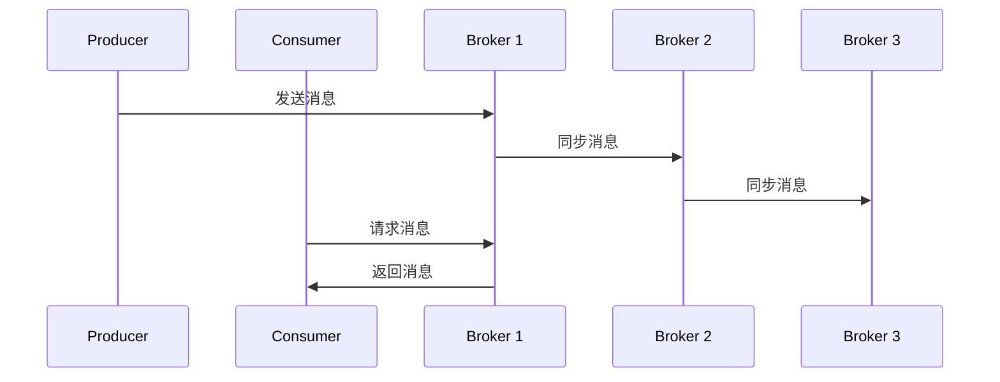
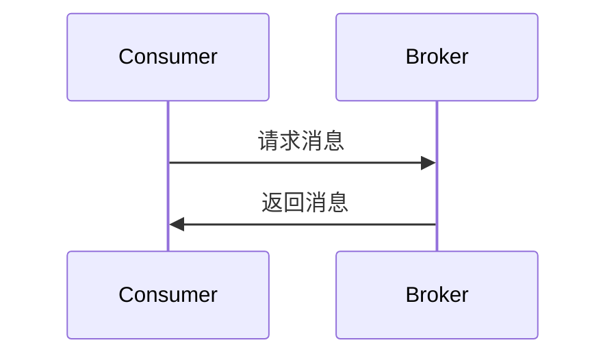
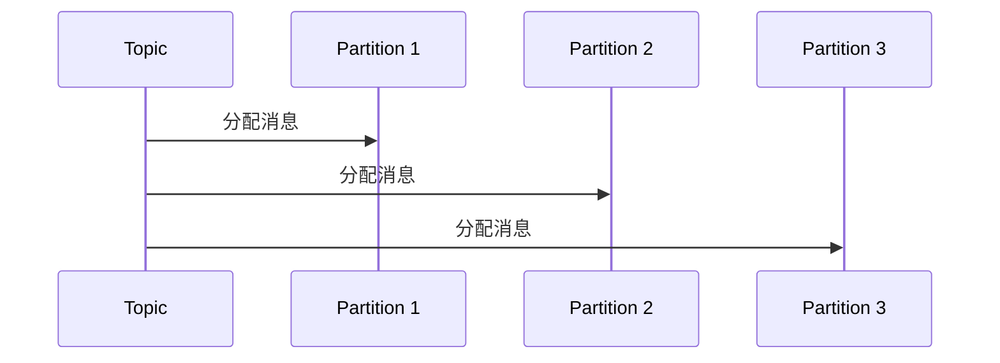
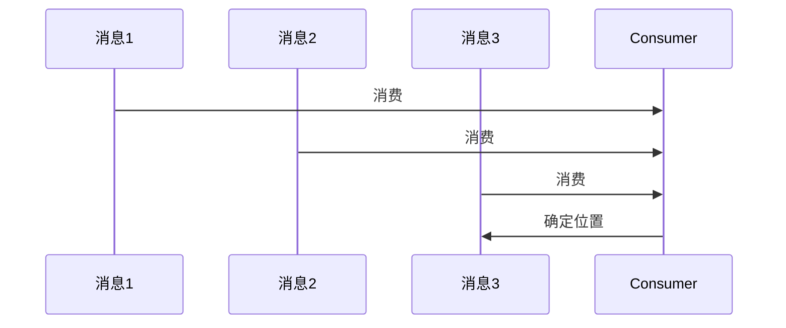
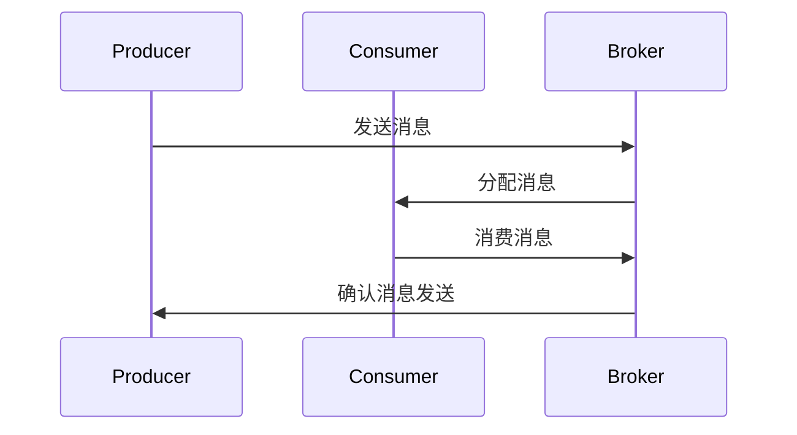

                 

# 《Kafka 原理与代码实例讲解》

> **关键词：** Kafka、分布式消息队列、消息传递机制、集群管理、性能优化、应用实战

> **摘要：** 本文将深入探讨 Kafka 的核心原理与代码实现，通过详细的讲解与分析，帮助读者理解 Kafka 的架构、功能、优缺点以及在实际项目中的应用。文章将结合实例代码，逐步解析 Kafka 的使用方法和调优技巧，为开发者提供实用的经验和知识。

## 第一部分：Kafka 基础知识

### 第1章：Kafka 概述

#### 1.1.1 Kafka 的历史与发展

Apache Kafka 是一款分布式流处理平台，最初由 LinkedIn 开发，并于 2010 年作为开源项目发布。随着大数据和实时处理的需求不断增加，Kafka 逐渐成为许多公司和项目的首选消息队列和流处理工具。Kafka 的设计目标是高度可扩展性、可靠性和性能，适用于处理大规模数据流。

#### 1.1.2 Kafka 的核心概念

Kafka 的核心概念包括 Topic、Partition、Offset、Producer 和 Consumer。

- **Topic**：Kafka 中的消息分类，类似于数据库中的表。
- **Partition**：每个 Topic 被分割成多个 Partition，以便并行处理。
- **Offset**：消息在 Partition 中的唯一标识。
- **Producer**：消息生产者，负责将消息发送到 Kafka 集群。
- **Consumer**：消息消费者，负责从 Kafka 集群中读取消息。

#### 1.1.3 Kafka 在大数据生态系统中的位置

Kafka 在大数据生态系统中扮演着关键角色。它不仅作为消息队列，还作为流处理平台，与 Hadoop、Spark、Flink 等大数据技术紧密集成，实现数据的实时处理和分析。Kafka 为大数据应用提供了可靠的数据传输通道，使得数据在不同系统之间无缝流动。

### 第2章：Kafka 架构

#### 2.1.1 Kafka 集群架构

Kafka 集群由多个 Kafka Broker 组成，每个 Broker 负责存储和转发消息。消息在 Kafka 集群中的传递是通过分区（Partition）和副本（Replica）实现的，以确保高可用性和容错性。

#### 2.1.2 Kafka 消息传递机制

Kafka 消息传递机制基于 Pull 模式，Consumer 通过请求最新的消息来获取数据，而不是被动等待数据到达。这种模式提高了 Consumer 的控制能力和系统性能。

#### 2.1.3 Kafka 的重要组件

Kafka 的重要组件包括 Producer、Consumer、Zookeeper 和 Kafka Server。Producer 负责消息的生产，Consumer 负责消息的消费，Zookeeper 用于分布式协调和元数据管理，Kafka Server 负责消息的存储和转发。

### 第3章：Kafka 核心概念详解

#### 3.1.1 Topic 与 Partition

Topic 是 Kafka 中的消息分类，类似于数据库中的表。Partition 是 Topic 的一个分区，用于实现并行处理和负载均衡。

#### 3.1.2 Offset 与 Position

Offset 是 Kafka 消息在 Partition 中的唯一标识，用于标识消息的位置。Position 是 Consumer 在 Partition 中的位置，表示 Consumer 已经读取到的消息位置。

#### 3.1.3 Producer 与 Consumer

Producer 负责将消息发送到 Kafka 集群，Consumer 负责从 Kafka 集群中读取消息。Producer 和 Consumer 都可以通过 Kafka 客户端 API 进行操作。

### 第4章：Kafka 优点与挑战

#### 4.1.1 Kafka 优点

Kafka 具有高吞吐量、高可靠性、高扩展性等优点，适用于处理大规模数据流。它还支持多种消息序列化方式，便于与其他系统集成。

#### 4.1.2 Kafka 挑战与解决方案

Kafka 的挑战包括消息丢失、数据一致性、性能优化等。解决方案包括数据备份、分区策略、负载均衡、性能监控等。

## 第二部分：Kafka 原理详解

### 第5章：Kafka 协议解析

#### 5.1.1 Kafka 协议概述

Kafka 协议用于 Producer 和 Consumer 与 Kafka Broker 之间的通信。它包括多个消息类型，如 ProduceRequest、FetchRequest、OffsetRequest 等。

#### 5.1.2 Kafka 协议详解

Kafka 协议详解包括各个消息类型的结构、参数和操作流程。通过分析协议，可以了解 Kafka 消息传递的细节。

#### 5.1.3 Kafka 协议实现分析

Kafka 协议的实现分析包括 KafkaProducer 和 KafkaConsumer 的源码解析。通过分析源码，可以深入理解 Kafka 协议的工作原理和实现细节。

### 第6章：Kafka 核心算法原理

#### 6.1.1 数据复制与一致性

Kafka 通过副本和分区实现数据复制和一致性。核心算法包括数据同步、分区选举和负载均衡等。

#### 6.1.2 数据持久化与恢复

Kafka 通过日志文件（Log）实现数据持久化。核心算法包括日志存储、数据恢复和故障恢复等。

#### 6.1.3 分布式一致性算法

Kafka 的分布式一致性算法包括 Zookeeper 协调、ZAB 协议等。这些算法确保 Kafka 集群的一致性和高可用性。

### 第7章：Kafka 集群管理

#### 7.1.1 Kafka 集群管理概述

Kafka 集群管理包括集群搭建、扩展、监控和故障转移等。核心内容包括集群配置、监控指标和故障处理等。

#### 7.1.2 Kafka 集群伸缩

Kafka 集群伸缩包括水平扩展和垂直扩展。核心内容包括分区策略、负载均衡和集群优化等。

#### 7.1.3 Kafka 集群故障转移

Kafka 集群故障转移包括主从切换、分区迁移和副本选举等。核心内容包括故障检测、故障恢复和负载均衡等。

### 第8章：Kafka 性能优化

#### 8.1.1 Kafka 性能调优概述

Kafka 性能调优包括生产者、消费者和 Broker 的性能优化。核心内容包括性能指标、调优策略和工具等。

#### 8.1.2 Kafka 生产者优化

Kafka 生产者优化包括批量发送、压缩和缓冲等。核心内容包括配置优化、代码优化和性能分析等。

#### 8.1.3 Kafka 消费者优化

Kafka 消费者优化包括并行消费、负载均衡和过期处理等。核心内容包括配置优化、代码优化和性能分析等。

## 第三部分：Kafka 代码实例讲解

### 第9章：Kafka 应用场景分析

#### 9.1.1 流处理应用

Kafka 在流处理应用中作为数据传输通道，实现实时数据处理和分析。核心内容包括 Kafka 与 Spark、Flink 的集成和使用场景。

#### 9.1.2 实时计算应用

Kafka 在实时计算应用中作为数据源和消息队列，实现实时数据处理和监控。核心内容包括 Kafka 与 Hadoop、Storm 的集成和使用场景。

#### 9.1.3 日志收集与监控

Kafka 在日志收集与监控中作为数据传输通道和存储系统，实现实时日志收集和分析。核心内容包括 Kafka 与 Elasticsearch、Kibana 的集成和使用场景。

### 第10章：Kafka 客户端 API 使用

#### 10.1.1 Producer API 使用示例

Producer API 用于消息的生产。本文将提供一个简单的 Producer 示例，并解释其工作原理。

#### 10.1.2 Consumer API 使用示例

Consumer API 用于消息的消费。本文将提供一个简单的 Consumer 示例，并解释其工作原理。

#### 10.1.3 Streams API 使用示例

Streams API 用于构建流处理应用。本文将提供一个简单的 Streams 示例，并解释其工作原理。

### 第11章：Kafka 代码实现解析

#### 11.1.1 KafkaProducer 源码解析

KafkaProducer 是 Kafka 客户端的核心组件，用于消息的生产。本文将解析 KafkaProducer 的源码，并解释其关键部分。

#### 11.1.2 KafkaConsumer 源码解析

KafkaConsumer 是 Kafka 客户端的核心组件，用于消息的消费。本文将解析 KafkaConsumer 的源码，并解释其关键部分。

#### 11.1.3 Kafka Streams 源码解析

Kafka Streams 是 Kafka 的流处理框架。本文将解析 Kafka Streams 的源码，并解释其关键部分。

### 第12章：Kafka 应用实战

#### 12.1.1 实时数据采集系统

本文将构建一个简单的实时数据采集系统，使用 Kafka 收集和分析实时数据。

#### 12.1.2 实时计算与分析系统

本文将构建一个简单的实时计算与分析系统，使用 Kafka 作为数据传输通道，实现实时数据处理和分析。

#### 12.1.3 日志收集与分析系统

本文将构建一个简单的日志收集与分析系统，使用 Kafka 收集日志数据并使用 Elasticsearch 和 Kibana 分析日志。

### 第13章：Kafka 与其他大数据技术的整合

#### 13.1.1 Kafka 与 Hadoop 整合

本文将介绍如何将 Kafka 与 Hadoop 整合，实现实时数据处理和分析。

#### 13.1.2 Kafka 与 Spark 整合

本文将介绍如何将 Kafka 与 Spark 整合，实现实时流处理。

#### 13.1.3 Kafka 与 Flink 整合

本文将介绍如何将 Kafka 与 Flink 整合，实现实时流处理。

### 第14章：Kafka 生产优化案例解析

本文将分析一些 Kafka 生产的优化案例，包括生产者优化、消费者优化和集群优化等。

### 第15章：Kafka 未来发展趋势

#### 15.1.1 Kafka 未来的发展方向

本文将探讨 Kafka 未来的发展方向，包括功能增强、性能优化和生态系统扩展等。

#### 15.1.2 Kafka 在大数据领域的新应用

本文将介绍 Kafka 在大数据领域的新应用，包括实时数据流处理、机器学习和人工智能等。

#### 15.1.3 Kafka 在物联网领域的应用前景

本文将探讨 Kafka 在物联网领域的应用前景，包括设备数据收集、实时监控和预测分析等。

## 结束语

本文通过详细的讲解和分析，帮助读者理解 Kafka 的核心原理和代码实现。在实际项目中，Kafka 作为分布式消息队列和流处理平台，具有广泛的应用前景和优化空间。希望本文能为读者提供有价值的参考和启示。

### 作者信息

作者：AI天才研究院/AI Genius Institute & 禅与计算机程序设计艺术 /Zen And The Art of Computer Programming

（全文完）### 第一部分：Kafka 基础知识

在深入探讨 Kafka 的原理与代码实现之前，我们先来了解一下 Kafka 的基础知识，包括其历史背景、核心概念以及在大数据生态系统中的位置。

#### 1.1.1 Kafka 的历史与发展

Kafka 是一款分布式流处理平台，起源于 LinkedIn。LinkedIn 在处理海量日志数据时遇到了消息队列的性能瓶颈，于是决定开发一款更加高效、可扩展的消息队列系统。2010 年，Kafka 作为 LinkedIn 的内部项目首次发布，2011 年开源，并于 2012 年成为 Apache 软件基金会的一个孵化项目。2016 年，Kafka 成为了 Apache 软件基金会的顶级项目。随着大数据和实时处理需求的增加，Kafka 逐渐成为了许多公司和项目的首选消息队列和流处理工具。

#### 1.1.2 Kafka 的核心概念

Kafka 的核心概念包括 Topic、Partition、Offset、Producer 和 Consumer，这些概念是理解 Kafka 的重要基础。

- **Topic**：在 Kafka 中，消息被组织成多个主题（Topic）。每个 Topic 可以被视为一个分类或标签，类似于数据库中的表。消息生产者和消费者都通过 Topic 来发送和接收消息。

- **Partition**：每个 Topic 被分割成多个 Partition。Partition 是 Kafka 的核心概念之一，它实现了并行处理和负载均衡。消息在 Partition 中是有序的，但是 Partition 之间是无序的。

- **Offset**：Offset 是 Kafka 消息在 Partition 中的唯一标识。每个 Partition 中的消息都有一个 Offset，用于标记消息的位置。生产者发送的消息和消费者读取的消息都通过 Offset 来确定。

- **Producer**：Producer 是消息生产者，负责将消息发送到 Kafka 集群。生产者可以是简单的应用程序，也可以是复杂的分布式系统。

- **Consumer**：Consumer 是消息消费者，负责从 Kafka 集群中读取消息。消费者可以是应用程序、批处理系统或实时流处理系统。

#### 1.1.3 Kafka 在大数据生态系统中的位置

Kafka 在大数据生态系统中扮演着关键角色，它不仅是一个消息队列，还作为一个流处理平台，与多种大数据技术集成。

- **与 Hadoop 整合**：Kafka 可以与 Hadoop 的生态系统紧密集成，包括 HDFS、MapReduce 和 Hive。通过 Kafka，可以将实时数据流导入到 Hadoop 系统中进行离线处理和分析。

- **与 Spark 整合**：Kafka 可以与 Spark 进行集成，实现实时流处理。Spark Streaming 和 Structured Streaming 都支持与 Kafka 进行连接，从 Kafka 读取实时数据流并进行处理。

- **与 Flink 整合**：Kafka 也可以与 Flink 进行集成，实现高效的实时流处理。Flink 提供了丰富的 API，可以方便地从 Kafka 读取数据并进行处理。

- **与 Elasticsearch 整合**：Kafka 可以作为 Elasticsearch 的数据源，将实时日志数据导入到 Elasticsearch 进行存储和分析。

- **与 Kibana 整合**：Kibana 是一个基于 Web 的可视化仪表盘，可以与 Kafka 进行集成，实时监控 Kafka 集群的性能和状态。

通过以上整合，Kafka 使得大数据生态系统更加完善，为数据处理和分析提供了高效、可靠的数据传输通道。

## 第二部分：Kafka 架构

Kafka 的架构设计旨在实现高吞吐量、高可靠性、可扩展性和高性能。Kafka 集群由多个 Kafka Broker 组成，这些 Broker 负责存储和转发消息。理解 Kafka 的架构对于深入掌握 Kafka 的原理和实现至关重要。

### 2.1.1 Kafka 集群架构

Kafka 集群架构的核心组成部分包括 Kafka Broker、Topic、Partition 和 Replica。每个 Kafka 集群包含多个 Broker，每个 Broker 负责存储和管理一个或多个 Partition 的数据。Partition 是 Kafka 消息的逻辑分区，用于实现并行处理和负载均衡。Replica 是 Partition 的副本，用于实现数据冗余和故障转移。

以下是 Kafka 集群架构的 Mermaid 流程图：



在这个流程图中，Producer 向 Kafka Broker 发送消息，Broker 接收到消息后，将其存储在 Partition 的各个 Replica 中。当 Consumer 请求消息时，Broker 根据负载均衡策略选择合适的 Replica 返回消息。

### 2.1.2 Kafka 消息传递机制

Kafka 的消息传递机制基于 Pull 模式，Consumer 通过主动请求最新的消息来获取数据，而不是被动等待数据到达。这种模式有以下优点：

1. **提高 Consumer 的控制能力**：Consumer 可以根据需要随时请求消息，而不是被动等待。
2. **减少延迟**：由于 Consumer 控制消息的拉取时机，可以减少延迟，提高系统的响应速度。
3. **高效利用带宽**：Consumer 只请求需要的数据，避免了不必要的带宽消耗。

以下是 Kafka 消息传递机制的 Mermaid 流程图：



在这个流程图中，Consumer 请求 Broker 的最新消息，Broker 根据请求返回相应的消息。这个过程可以重复进行，Consumer 持续获取最新的消息。

### 2.1.3 Kafka 的重要组件

Kafka 的架构中包含几个重要的组件，分别是 Producer、Consumer、Zookeeper 和 Kafka Server。

- **Producer**：Producer 是消息的生产者，负责将消息发送到 Kafka 集群。Producer 可以是简单的应用程序，也可以是复杂的分布式系统。Kafka Producer API 提供了简单易用的接口，支持异步发送消息、批量发送和压缩等功能。

- **Consumer**：Consumer 是消息的消费者，负责从 Kafka 集群中读取消息。Consumer 可以是应用程序、批处理系统或实时流处理系统。Kafka Consumer API 提供了强大的功能，支持并行消费、负载均衡和过期处理等。

- **Zookeeper**：Zookeeper 是 Kafka 的分布式协调服务，负责维护 Kafka 集群的元数据，如 Topic、Partition 和 Broker 的状态信息。Zookeeper 保证 Kafka 集群的一致性和高可用性，在 Kafka 集群发生故障时，负责进行故障转移。

- **Kafka Server**：Kafka Server 是 Kafka Broker 的核心组件，负责存储和转发消息。Kafka Server 提供了可靠的消息存储、高效的消息传递和负载均衡等功能。Kafka Server 还实现了多个消息协议，如 Kafka 协议、SSL 协议和 HTTP 协议，支持多种数据传输方式。

通过以上组件的协同工作，Kafka 架构实现了高吞吐量、高可靠性和可扩展性的消息传递和流处理能力。

### 2.2 Kafka 核心概念详解

在深入了解 Kafka 的架构和消息传递机制后，我们需要进一步了解 Kafka 的核心概念，包括 Topic、Partition、Offset、Producer 和 Consumer。这些概念是理解 Kafka 的基础，对于搭建和优化 Kafka 系统至关重要。

#### 3.1.1 Topic 与 Partition

**Topic** 是 Kafka 中消息的分类，类似于数据库中的表。每个 Topic 可以包含多个 Partition，Partition 是 Kafka 的核心概念之一，用于实现并行处理和负载均衡。例如，一个社交媒体平台可以创建一个名为 “user_actions” 的 Topic，这个 Topic 可以包含多个 Partition，每个 Partition 负责处理特定的用户动作数据。

在 Kafka 中，Partition 的数量是 Topic 的一个重要配置参数。合理的 Partition 数量可以显著提高 Kafka 集群的处理能力和性能。以下是一些关于 Partition 的关键点：

- **并行处理**：每个 Partition 都可以由一个或多个 Broker 并行处理，从而提高系统的处理能力。多个 Partition 允许 Kafka 同时处理多个消息流，实现高效的并行处理。

- **负载均衡**：Partition 的数量和分布对 Kafka 集群的负载均衡至关重要。合理的 Partition 分布可以使得 Kafka 集群中的各个 Broker 负载均衡，避免单点性能瓶颈。

- **消息顺序**：每个 Partition 中的消息是有序的，但是 Partition 之间是无序的。这意味着在一个 Topic 中，每个 Partition 的消息是有序的，但是多个 Partition 之间的消息是无序的。这种设计允许 Kafka 同时处理多个流，但不会牺牲消息的顺序性。

- **分区策略**：Kafka 提供了多种分区策略，如 `range`、`hash` 和 `round-robin`。这些策略可以根据实际应用场景选择，以实现最优的负载均衡和消息处理。

以下是一个简单的 Mermaid 流程图，展示了 Topic 和 Partition 的关系：



在这个流程图中，Topic “user_actions” 被分割成三个 Partition，每个 Partition 负责处理一部分用户动作数据。

#### 3.1.2 Offset 与 Position

**Offset** 是 Kafka 消息在 Partition 中的唯一标识，用于标记消息的位置。每个 Partition 中的每个消息都有一个唯一的 Offset。Offset 对于 Kafka 集群的日志管理和消息定位至关重要。

**Position** 是 Consumer 在 Partition 中的位置，表示 Consumer 已经读取到的消息位置。Consumer 通过 Offset 确定已经消费的消息位置，从而实现消息的消费和状态管理。

Offset 和 Position 的关系如下：

- **Offset**：Kafka 消息在 Partition 中的唯一标识，类似于数据库中的主键。每个消息在 Partition 中都有一个唯一的 Offset。
- **Position**：Consumer 在 Partition 中的位置，表示 Consumer 已经读取到的消息位置。Position 通过 Offset 确定，即 Consumer 的 Position 是它已经消费的最后一个消息的 Offset。

以下是一个简单的 Mermaid 流程图，展示了 Offset 和 Position：



在这个流程图中，Consumer 从 Partition 中依次消费消息 1、消息 2 和消息 3，最终确定它的 Position 是消息 3 的 Offset。

#### 3.1.3 Producer 与 Consumer

**Producer** 是 Kafka 中的消息生产者，负责将消息发送到 Kafka 集群。Producer 可以是简单的应用程序，也可以是复杂的分布式系统。Kafka Producer API 提供了简单易用的接口，支持异步发送消息、批量发送和压缩等功能。

**Consumer** 是 Kafka 中的消息消费者，负责从 Kafka 集群中读取消息。Consumer 可以是应用程序、批处理系统或实时流处理系统。Kafka Consumer API 提供了强大的功能，支持并行消费、负载均衡和过期处理等。

以下是一些关于 Producer 和 Consumer 的关键点：

- **异步发送**：Producer 采用异步发送消息的方式，将消息发送到 Kafka 集群。这种方式提高了消息发送的效率，减少了对系统资源的占用。
- **批量发送**：Producer 支持批量发送消息，将多个消息打包成一个请求发送。这种方式可以减少网络传输次数，提高消息发送的吞吐量。
- **压缩**：Producer 支持消息压缩，可以将消息压缩后再发送，减少网络传输的数据量，提高系统性能。
- **并行消费**：Consumer 支持并行消费，多个 Consumer 可以同时消费同一个 Topic 的消息。这种方式可以提高系统的处理能力，实现高效的分布式消费。
- **负载均衡**：Kafka 提供了负载均衡机制，根据 Consumer 的负载情况动态分配消息。这种方式可以使得 Consumer 负载均衡，避免单点性能瓶颈。
- **过期处理**：Consumer 可以设置消息的过期时间，当消息过期时，Consumer 会将其处理。这种方式可以实现消息的过期删除和资源释放。

以下是一个简单的 Mermaid 流程图，展示了 Producer 和 Consumer 的消息传递过程：



在这个流程图中，Producer 将消息发送到 Kafka 集群，Broker 根据负载均衡策略将消息分配给 Consumer，Consumer 消费消息并确认消息发送。

通过以上对 Kafka 核心概念的详解，我们可以更深入地理解 Kafka 的架构和工作原理。这些概念是搭建和优化 Kafka 系统的基础，对于开发 Kafka 应用程序和实现高效的流处理至关重要。

### Kafka 优点与挑战

Kafka 作为一款分布式流处理平台，具有许多显著的优点，但同时也面临一些挑战。在本节中，我们将探讨 Kafka 的优点以及如何应对其挑战。

#### 4.1.1 Kafka 优点

1. **高吞吐量**：Kafka 设计用于处理大规模数据流，具有极高的吞吐量。每个 Broker 可以处理数千条消息每秒，整个 Kafka 集群可以处理数百万条消息每秒，这使得 Kafka 成为大规模实时处理的首选工具。

2. **高可靠性**：Kafka 通过分区和副本机制实现数据冗余和故障转移，确保消息的可靠传递。每个 Partition 有多个 Replica，当某个 Replica 故障时，其他 Replica 可以自动接管，保证数据的持续可用。

3. **可扩展性**：Kafka 支持水平扩展，可以通过增加 Broker 来提升系统的处理能力。当数据量或消息量增加时，Kafka 集群可以动态调整分区和副本的数量，实现无缝扩展。

4. **高可用性**：Kafka 使用 Zookeeper 进行分布式协调，确保 Kafka 集群的一致性和高可用性。在 Kafka 集群发生故障时，Zookeeper 负责进行故障转移，确保系统持续运行。

5. **多语言支持**：Kafka 提供了丰富的客户端库，支持多种编程语言，如 Java、Python、Scala 和 Go 等。这使得开发者可以轻松地使用 Kafka 进行消息传递和流处理。

6. **高效压缩**：Kafka 支持消息压缩，如 Gzip 和 Snappy 等，可以在发送和存储消息时减少数据量，提高系统性能。

7. **易于集成**：Kafka 与多种大数据技术和工具（如 Hadoop、Spark、Flink、Elasticsearch 等）无缝集成，使得 Kafka 成为大数据生态系统的重要组成部分。

#### 4.1.2 Kafka 挑战与解决方案

尽管 Kafka 具有许多优点，但在实际使用中仍面临一些挑战。以下是一些常见的挑战及其解决方案：

1. **消息丢失**：Kafka 通过副本和分区机制确保消息的可靠性，但仍然存在消息丢失的风险。解决方案包括：检查 Kafka 集群的健康状况，确保副本同步正常；增加 Replication Factor，提高数据冗余度；定期检查 Kafka 日志，查找潜在的问题。

2. **数据一致性**：Kafka 通过一致性算法（如 ZAB 协议）实现分布式一致性，但在某些情况下，如网络延迟或节点故障，可能会出现数据不一致的情况。解决方案包括：合理配置 Replication Factor 和 Partition，确保数据冗余；使用事务性消息，确保消息的一致性；在应用程序中实现数据校验和一致性检查。

3. **性能优化**：Kafka 的性能优化是一个复杂的过程，需要根据实际应用场景进行调整。解决方案包括：调整 Kafka 集群的配置，如 Broker 数量、分区数量、复制因子等；优化 Producer 和 Consumer 的配置，如批量发送、压缩、缓冲等；监控 Kafka 集群的性能指标，识别瓶颈并进行优化。

4. **集群管理**：Kafka 集群的管理和维护是一个挑战，包括集群搭建、扩展、监控和故障转移等。解决方案包括：使用自动化工具（如 Kubernetes、Apache Ambari 等）进行集群管理；定期进行集群监控和优化；制定故障转移和恢复策略，确保集群的稳定性。

5. **安全性**：Kafka 在安全性方面存在一些挑战，如数据加密、认证和授权等。解决方案包括：使用 SSL/TLS 进行数据加密，确保数据在传输过程中的安全性；配置 Kafka 的认证和授权机制，确保只有授权的用户可以访问 Kafka 集群；定期进行安全审计和漏洞修复。

通过了解 Kafka 的优点和挑战，以及相应的解决方案，开发者可以更好地利用 Kafka 的优势，解决实际应用中遇到的问题，实现高效的流处理和消息传递。

## 第二部分：Kafka 原理详解

在本部分中，我们将深入探讨 Kafka 的协议、核心算法和集群管理等内容，以帮助读者全面理解 Kafka 的原理和实现细节。

### 第5章：Kafka 协议解析

#### 5.1.1 Kafka 协议概述

Kafka 协议是 Kafka 客户端与 Kafka Broker 之间的通信协议。Kafka 协议定义了一系列的消息类型和数据结构，用于实现消息的生产、消费和监控等功能。Kafka 协议主要包括以下消息类型：

- **ProduceRequest**：用于生产者向 Kafka 集群发送消息。
- **FetchRequest**：用于消费者从 Kafka 集群拉取消息。
- **OffsetRequest**：用于消费者查询消息的 Offset。
- **MetadataRequest**：用于消费者获取 Kafka 集群的元数据信息。

#### 5.1.2 Kafka 协议详解

Kafka 协议详解包括各个消息类型的结构、参数和操作流程。以下是一个简单的 ProduceRequest 消息的示例：

```json
{
  "topic": "test-topic",
  "partition": 0,
  "messages": [
    {
      "key": "key-1",
      "value": "value-1"
    },
    {
      "key": "key-2",
      "value": "value-2"
    }
  ]
}
```

在这个示例中，ProduceRequest 消息包含以下字段：

- **topic**：消息的主题。
- **partition**：消息的分区。
- **messages**：消息列表，每个消息包含 key 和 value 字段。

Kafka 协议还定义了一系列的响应消息，如 ProduceResponse、FetchResponse 和 OffsetResponse，用于表示操作结果。

#### 5.1.3 Kafka 协议实现分析

Kafka 协议的实现分析包括 KafkaProducer 和 KafkaConsumer 的源码解析。通过分析源码，我们可以深入理解 Kafka 协议的工作原理和实现细节。

以 KafkaProducer 为例，其核心功能是发送消息。以下是一个简化的伪代码实现：

```java
public void sendMessages(String topic, List<Message> messages) {
  ProduceRequest request = new ProduceRequest(topic, messages);
  KafkaProducer producer = new KafkaProducer();
  ProduceResponse response = producer.send(request);
  handleResponse(response);
}
```

在这个伪代码中，sendMessages 方法负责发送消息。首先，创建一个 ProduceRequest 对象，包含主题和消息列表。然后，通过 KafkaProducer 发送 ProduceRequest，并获取 ProduceResponse。最后，处理 ProduceResponse，判断消息发送是否成功。

通过分析 Kafka 协议和其实现，我们可以更好地理解 Kafka 消息传递的过程和机制。

### 第6章：Kafka 核心算法原理

#### 6.1.1 数据复制与一致性

Kafka 通过数据复制和一致性算法实现高可用性和可靠性。数据复制是指将消息存储在多个副本中，以便在发生故障时进行恢复。一致性算法确保数据在不同副本之间保持一致。

Kafka 使用 ZAB（ZooKeeper 协议实现的分布式一致性算法）来维护集群的一致性。ZAB 是一种基于 Paxos 算法的分布式一致性协议，主要解决数据一致性问题和故障转移问题。

以下是一个简化的伪代码实现：

```java
public void replicateMessage(Message message) {
  List<Replica> replicas = getReplicas(message);
  for (Replica replica : replicas) {
    sendAppendEntriesRequest(replica, message);
  }
  waitForAcknowledgement(replicas);
}
```

在这个伪代码中，replicateMessage 方法负责复制消息。首先，获取消息的副本列表。然后，向每个副本发送 AppendEntriesRequest 请求，请求将消息追加到副本的日志中。最后，等待所有副本的响应，判断复制是否成功。

#### 6.1.2 数据持久化与恢复

Kafka 通过日志文件（Log）实现数据的持久化。日志文件包含一系列的日志条目，每个日志条目表示一个消息。Kafka 将消息存储在磁盘上，确保数据在发生故障时可以进行恢复。

以下是一个简化的伪代码实现：

```java
public void appendMessageToLog(Message message) {
  LogEntry entry = new LogEntry(message);
  Log log = getLog();
  log.append(entry);
  persistLog(log);
}
```

在这个伪代码中，appendMessageToLog 方法负责将消息追加到日志中。首先，创建一个 LogEntry 对象，包含消息。然后，将 LogEntry 对象追加到日志中，并持久化日志到磁盘。

#### 6.1.3 分布式一致性算法

Kafka 使用 ZAB 协议实现分布式一致性算法。ZAB 协议包括三个主要阶段：选举阶段、同步阶段和领导阶段。

1. **选举阶段**：当 Kafka 集群中的 Leader 节点发生故障时，ZAB 协议通过选举产生一个新的 Leader。选举过程基于 Zookeeper 的选举算法，确保 Leader 的选举过程高效和可靠。

2. **同步阶段**：新 Leader 选举成功后，与其他 Follower 节点进行数据同步。同步过程包括发送 AppendEntriesRequest 请求，将日志条目追加到 Follower 的日志中。

3. **领导阶段**：新 Leader 开始处理客户端的请求，如消息生产、消费和监控等。同时，新 Leader 还需要监控集群的状态，确保集群的一致性和高可用性。

通过分布式一致性算法，Kafka 可以实现高效的数据复制和故障转移，确保数据的可靠性和系统的稳定性。

### 第7章：Kafka 集群管理

#### 7.1.1 Kafka 集群管理概述

Kafka 集群管理包括集群搭建、扩展、监控和故障转移等。Kafka 提供了多个工具和脚本，用于简化集群的管理和维护。

以下是一个简单的 Kafka 集群管理流程：

1. **集群搭建**：使用 Kafka 的安装包或 Docker 镜像搭建 Kafka 集群。配置 Zookeeper 集群，启动 Kafka Broker 和 Zookeeper 服务。
2. **集群扩展**：当 Kafka 集群的处理能力不足时，可以增加 Broker 和 Partition 的数量。通过调整 Kafka 配置文件，实现集群的动态扩展。
3. **监控**：使用 Kafka Manager、Kafka Monitor 等工具监控 Kafka 集群的性能和状态，包括 Broker 的 CPU、内存、网络和磁盘使用情况等。
4. **故障转移**：当 Kafka 集群发生故障时，Zookeeper 负责进行故障转移，选择新的 Leader 节点，确保集群的持续运行。同时，Kafka 提供了多种故障转移策略，如自动故障转移和手动故障转移。

通过以上集群管理流程，可以确保 Kafka 集群的高可用性和稳定性。

### 第8章：Kafka 性能优化

#### 8.1.1 Kafka 性能调优概述

Kafka 性能调优包括生产者、消费者和 Broker 的性能优化。以下是一些常见的性能优化策略：

1. **生产者优化**：调整批量发送大小、压缩格式和缓冲策略，提高消息发送的效率。优化网络连接，减少延迟和丢包。
2. **消费者优化**：调整并行消费数量、负载均衡策略和过期处理，提高消息消费的效率。优化网络连接，减少延迟和丢包。
3. **Broker 优化**：调整分区数量、副本数量和负载均衡策略，提高 Kafka 集群的处理能力。优化磁盘 I/O、网络和内存使用，提高系统的性能。

通过以上性能优化策略，可以显著提高 Kafka 集群的处理能力和性能。

#### 8.1.2 Kafka 生产者优化

生产者优化主要包括以下几个方面：

1. **批量发送**：批量发送可以减少网络传输次数，提高消息发送的吞吐量。可以通过调整 `batch.size` 参数设置批量发送的大小。
2. **压缩**：压缩可以减少网络传输的数据量，提高系统的性能。可以通过调整 `compression.type` 参数设置压缩格式，如 Gzip、Snappy 等。
3. **缓冲**：缓冲可以减少生产者的负载，提高系统的稳定性。可以通过调整 `buffer.memory` 参数设置缓冲区大小，增加生产者的缓冲能力。
4. **网络优化**：优化网络连接，减少延迟和丢包。可以通过调整网络参数，如 `max.block.ms` 和 `receive.buffer.bytes` 等。

以下是一个简单的生产者优化示例：

```java
Properties props = new Properties();
props.put("bootstrap.servers", "localhost:9092");
props.put("key.serializer", "org.apache.kafka.common.serialization.StringSerializer");
props.put("value.serializer", "org.apache.kafka.common.serialization.StringSerializer");
props.put("batch.size", 16384);
props.put("linger.ms", 1);
props.put("buffer.memory", 33554432);
props.put("compression.type", "snappy");
KafkaProducer<String, String> producer = new KafkaProducer<>(props);
```

在这个示例中，我们设置了批量发送大小、压缩格式、缓冲策略和linger时间等参数，以优化生产者的性能。

#### 8.1.3 Kafka 消费者优化

消费者优化主要包括以下几个方面：

1. **并行消费**：通过增加消费者的数量，实现并行消费，提高消息消费的效率。可以通过调整 `partition.count` 参数设置并行消费的数量。
2. **负载均衡**：通过合理的负载均衡策略，确保消费者的负载均衡，避免单点性能瓶颈。可以通过调整 `auto.offset.reset` 和 `fetch.max.bytes` 等参数实现负载均衡。
3. **过期处理**：通过设置消息的过期时间，实现过期处理，提高系统的性能。可以通过调整 `session.timeout.ms` 和 `max.poll.interval.ms` 等参数实现过期处理。
4. **网络优化**：优化网络连接，减少延迟和丢包。可以通过调整网络参数，如 `receive.buffer.bytes` 和 `fetch.max.bytes` 等。

以下是一个简单的消费者优化示例：

```java
Properties props = new Properties();
props.put("bootstrap.servers", "localhost:9092");
props.put("group.id", "test-group");
props.put("key.deserializer", "org.apache.kafka.common.serialization.StringDeserializer");
props.put("value.deserializer", "org.apache.kafka.common.serialization.StringDeserializer");
props.put("partition.count", 3);
props.put("auto.offset.reset", "earliest");
props.put("fetch.max.bytes", 1048576);
props.put("session.timeout.ms", 30000);
props.put("max.poll.interval.ms", 60000);
KafkaConsumer<String, String> consumer = new KafkaConsumer<>(props);
```

在这个示例中，我们设置了并行消费数量、负载均衡策略和过期处理等参数，以优化消费者的性能。

通过以上优化策略和示例，我们可以显著提高 Kafka 生产者和消费者的性能，实现高效的消息传递和流处理。

## 第三部分：Kafka 代码实例讲解

在本部分中，我们将通过具体的代码实例来讲解 Kafka 的使用方法，帮助读者更好地理解和掌握 Kafka 的核心功能和操作方法。

### 第10章：Kafka 客户端 API 使用

Kafka 提供了丰富的客户端 API，包括 Producer API、Consumer API 和 Streams API。在本章中，我们将通过简单的实例来展示如何使用这些 API。

#### 10.1.1 Producer API 使用示例

Kafka Producer API 用于发送消息到 Kafka 集群。以下是一个简单的 Producer API 使用示例：

```java
Properties props = new Properties();
props.put("bootstrap.servers", "localhost:9092");
props.put("key.serializer", "org.apache.kafka.common.serialization.StringSerializer");
props.put("value.serializer", "org.apache.kafka.common.serialization.StringSerializer");

KafkaProducer<String, String> producer = new KafkaProducer<>(props);

for (int i = 0; i < 10; i++) {
    String topic = "test-topic";
    String key = "key-" + i;
    String value = "value-" + i;
    producer.send(new ProducerRecord<>(topic, key, value));
}

producer.close();
```

在这个示例中，我们首先创建了一个 KafkaProducer 对象，并设置了 Kafka 集群的地址和序列化器。然后，我们使用 for 循环发送了 10 条消息到名为 “test-topic” 的主题。每条消息包含一个键（key）和一个值（value）。最后，我们关闭了 Producer。

#### 10.1.2 Consumer API 使用示例

Kafka Consumer API 用于从 Kafka 集群中读取消息。以下是一个简单的 Consumer API 使用示例：

```java
Properties props = new Properties();
props.put("bootstrap.servers", "localhost:9092");
props.put("group.id", "test-group");
props.put("key.deserializer", "org.apache.kafka.common.serialization.StringDeserializer");
props.put("value.deserializer", "org.apache.kafka.common.serialization.StringDeserializer");

KafkaConsumer<String, String> consumer = new KafkaConsumer<>(props);

consumer.subscribe(Arrays.asList("test-topic"));

while (true) {
    ConsumerRecords<String, String> records = consumer.poll(Duration.ofMillis(1000));
    for (ConsumerRecord<String, String> record : records) {
        System.out.printf("offset = %d, key = %s, value = %s%n", record.offset(), record.key(), record.value());
    }
}

consumer.close();
```

在这个示例中，我们首先创建了一个 KafkaConsumer 对象，并设置了 Kafka 集群的地址、组 ID 和序列化器。然后，我们订阅了名为 “test-topic” 的主题。接着，我们使用一个 while 循环不断地拉取消息，并打印消息的偏移量（offset）、键（key）和值（value）。最后，我们关闭了 Consumer。

#### 10.1.3 Streams API 使用示例

Kafka Streams API 是 Kafka 提供的实时流处理框架。以下是一个简单的 Streams API 使用示例：

```java
StreamsBuilder builder = new StreamsBuilder();

KStream<String, String> stream = builder.stream("test-topic");

stream.mapValues(value -> value.toUpperCase()).to("upper-case-topic");

Topology topology = builder.build();
KafkaStreams streams = new KafkaStreams(topology, props);
streams.start();

// Stop the streams application after 10 seconds
streams.shutdown(Duration.ofSeconds(10));
```

在这个示例中，我们首先使用 StreamsBuilder 创建了一个 KStream 对象，表示来自 “test-topic” 的消息流。然后，我们使用 mapValues 函数将消息的值转换为大写形式，并将结果发送到名为 “upper-case-topic” 的主题。接着，我们构建了一个 Topology 对象，并使用 KafkaStreams 启动流处理应用。最后，我们设置了一个 10 秒的关闭超时，以终止流处理应用。

通过以上示例，我们可以看到如何使用 Kafka 的客户端 API 进行消息的生产、消费和流处理。这些示例为我们提供了一个起点，帮助我们更好地理解和应用 Kafka 的核心功能。

### 第11章：Kafka 代码实现解析

在深入了解 Kafka 的客户端 API 之后，我们接下来将深入解析 Kafka 的核心组件代码，包括 KafkaProducer、KafkaConsumer 和 Kafka Streams 的实现细节。通过分析这些代码，我们可以更好地理解 Kafka 的内部工作机制和设计原理。

#### 11.1.1 KafkaProducer 源码解析

KafkaProducer 是 Kafka 客户端中负责消息生产的核心组件。它实现了消息的发送、批量发送、异步发送等功能。以下是对 KafkaProducer 源码的关键部分进行解析。

**初始化过程：**

KafkaProducer 的初始化主要通过构造函数和配置属性完成。以下是一个简化的初始化过程：

```java
public KafkaProducer(MetaData metadata, Time time, Config config) {
    this.config = config;
    this.metadata = metadata;
    this.time = time;
    initProducers();
}

private void initProducers() {
    producers = new ConcurrentHashMap<>(config.numPartitions());
    for (int partition = 0; partition < config.numPartitions(); partition++) {
        producers.put(partition, new RecordQueue(config));
    }
}
```

在这个初始化过程中，KafkaProducer 主要完成了以下任务：

- 创建了一个用于存储分区队列的 ConcurrentHashMap，用于管理每个分区的记录队列。
- 为每个分区创建了一个 RecordQueue 对象，用于存储待发送的消息。

**发送消息过程：**

KafkaProducer 的发送消息过程主要包括以下几个步骤：

1. 选择分区：根据消息的键（key）或分区器（partitioner）选择目标分区。
2. 添加消息：将消息添加到目标分区的 RecordQueue。
3. 发送请求：批量发送消息到 Kafka 集群。
4. 处理响应：处理 Kafka 集群的响应，更新 offsets 和状态。

以下是一个简化的发送消息过程：

```java
public List<RecordMetadata> send(ProducerRecord<T, K> record) {
    int partition = partition(record);
    RecordQueue<T> queue = (RecordQueue<T>) producers.get(partition);
    Future<RecordMetadata> future = queue.send(record);
    return Collections.singletonList(future);
}

private int partition(ProducerRecord<T, K> record) {
    return config.partition(record);
}
```

在这个发送消息过程中，KafkaProducer 主要完成了以下任务：

- 选择分区：根据消息的键（key）或分区器（partitioner）选择目标分区。
- 添加消息：将消息添加到目标分区的 RecordQueue。
- 发送请求：通过 RecordQueue 的 send 方法发送消息。

**伪代码实现：**

```java
public List<RecordMetadata> send(ProducerRecord<T, K> record) {
    int partition = partition(record);
    RecordQueue<T> queue = (RecordQueue<T>) producers.get(partition);
    Future<RecordMetadata> future = queue.send(record);
    return Collections.singletonList(future);
}

private int partition(ProducerRecord<T, K> record) {
    return config.partition(record);
}
```

通过上述解析，我们可以看到 KafkaProducer 的核心实现流程，包括初始化过程和发送消息过程。这些流程为我们理解 KafkaProducer 的工作原理提供了重要线索。

#### 11.1.2 KafkaConsumer 源码解析

KafkaConsumer 是 Kafka 客户端中负责消息消费的核心组件。它实现了消息的拉取、处理、确认等功能。以下是对 KafkaConsumer 源码的关键部分进行解析。

**初始化过程：**

KafkaConsumer 的初始化主要通过构造函数和配置属性完成。以下是一个简化的初始化过程：

```java
public KafkaConsumer(Props props) {
    this.config = new Config(props);
    init();
}

private void init() {
    this.metadata = new Metadata();
    this.fetcher = new Fetcher(this, this.config);
    this.offsetManager = new OffsetManager(this, this.config);
    this.completableFutures = new ConcurrentLinkedQueue<>();
}
```

在这个初始化过程中，KafkaConsumer 主要完成了以下任务：

- 创建了 Metadata 对象，用于存储元数据信息。
- 创建了 Fetcher 对象，用于从 Kafka 集群拉取消息。
- 创建了 OffsetManager 对象，用于管理消息的偏移量。

**消费消息过程：**

KafkaConsumer 的消费消息过程主要包括以下几个步骤：

1. 拉取消息：使用 Fetcher 从 Kafka 集群拉取消息。
2. 处理消息：处理拉取到的消息，进行消息的解码和处理。
3. 确认偏移量：确认已经处理的消息，更新偏移量。

以下是一个简化的消费消息过程：

```java
public ConsumerRecords<K, V> poll(Duration timeout) {
    ConsumerRecords<K, V> records = fetcher.poll(timeout);
    processRecords(records);
    return records;
}

private void processRecords(ConsumerRecords<K, V> records) {
    for (ConsumerRecord<K, V> record : records) {
        handleRecord(record);
        offsetManager.commit(record);
    }
}

private void handleRecord(ConsumerRecord<K, V> record) {
    // 处理消息的逻辑
}
```

在这个消费消息过程中，KafkaConsumer 主要完成了以下任务：

- 拉取消息：通过 Fetcher 从 Kafka 集群拉取消息。
- 处理消息：处理拉取到的消息，进行消息的解码和处理。
- 确认偏移量：确认已经处理的消息，更新偏移量。

**伪代码实现：**

```java
public ConsumerRecords<K, V> poll(Duration timeout) {
    ConsumerRecords<K, V> records = fetcher.poll(timeout);
    processRecords(records);
    return records;
}

private void processRecords(ConsumerRecords<K, V> records) {
    for (ConsumerRecord<K, V> record : records) {
        handleRecord(record);
        offsetManager.commit(record);
    }
}

private void handleRecord(ConsumerRecord<K, V> record) {
    // 处理消息的逻辑
}
```

通过上述解析，我们可以看到 KafkaConsumer 的核心实现流程，包括初始化过程和消费消息过程。这些流程为我们理解 KafkaConsumer 的工作原理提供了重要线索。

#### 11.1.3 Kafka Streams 源码解析

Kafka Streams 是 Kafka 提供的实时流处理框架。它基于 Java 的 Stream API，提供了一套高效、易于使用的流处理工具。以下是对 Kafka Streams 源码的关键部分进行解析。

**初始化过程：**

Kafka Streams 的初始化主要通过 StreamsBuilder 和 StreamsConfig 完成。以下是一个简化的初始化过程：

```java
StreamsBuilder builder = new StreamsBuilder();

KStream<String, String> stream = builder.stream("test-topic");

Topology topology = builder.build();
KafkaStreams streams = new KafkaStreams(topology, props);
streams.start();
```

在这个初始化过程中，Kafka Streams 主要完成了以下任务：

- 创建了 StreamsBuilder 对象，用于构建流处理拓扑。
- 使用 StreamsBuilder 创建了一个 KStream 对象，表示来自 “test-topic” 的消息流。
- 使用 StreamsBuilder 构建了一个 Topology 对象，表示流处理的逻辑。
- 使用 KafkaStreams 启动流处理应用。

**流处理过程：**

Kafka Streams 的流处理过程主要包括以下几个步骤：

1. 转换消息：使用 mapValues 函数对消息进行转换。
2. 转发消息：使用 to 函数将转换后的消息发送到目标主题。
3. 处理拓扑：处理流处理拓扑中的各种操作。

以下是一个简化的流处理过程：

```java
KStream<String, String> stream = builder.stream("test-topic");
stream.mapValues(value -> value.toUpperCase()).to("upper-case-topic");

Topology topology = builder.build();
KafkaStreams streams = new KafkaStreams(topology, props);
streams.start();
```

在这个流处理过程中，Kafka Streams 主要完成了以下任务：

- 转换消息：使用 mapValues 函数将消息的值转换为大写形式。
- 转发消息：使用 to 函数将转换后的消息发送到名为 “upper-case-topic” 的主题。
- 处理拓扑：使用 KafkaStreams 处理流处理拓扑中的各种操作。

**伪代码实现：**

```java
KStream<String, String> stream = builder.stream("test-topic");
stream.mapValues(value -> value.toUpperCase()).to("upper-case-topic");

Topology topology = builder.build();
KafkaStreams streams = new KafkaStreams(topology, props);
streams.start();
```

通过上述解析，我们可以看到 Kafka Streams 的核心实现流程，包括初始化过程和流处理过程。这些流程为我们理解 Kafka Streams 的工作原理提供了重要线索。

通过以上对 KafkaProducer、KafkaConsumer 和 Kafka Streams 的源码解析，我们可以深入理解 Kafka 的核心组件实现细节，从而更好地掌握 Kafka 的原理和操作方法。这为我们开发基于 Kafka 的应用程序提供了有力支持。

### 第12章：Kafka 应用实战

在了解 Kafka 的原理和代码实现后，我们将通过一些具体的应用场景来展示 Kafka 的实际使用方法。这些实战案例将涵盖实时数据采集、实时计算与分析以及日志收集与监控等方面，帮助读者更好地理解 Kafka 在实际项目中的应用。

#### 12.1.1 实时数据采集系统

实时数据采集系统是 Kafka 的典型应用场景之一。以下是一个简单的实时数据采集系统的实现步骤：

1. **搭建 Kafka 集群**：首先，我们需要搭建一个 Kafka 集群。可以选择使用 Kafka 的二进制安装包或者使用容器化技术（如 Docker）来搭建 Kafka 集群。确保 Kafka 集群的高可用性和扩展性。

2. **数据生产者**：在数据源端，我们需要实现一个数据生产者，将实时数据发送到 Kafka 集群。可以使用 Kafka 的 Producer API 来实现生产者。以下是一个简单的生产者代码示例：

```java
Properties props = new Properties();
props.put("bootstrap.servers", "localhost:9092");
props.put("key.serializer", "org.apache.kafka.common.serialization.StringSerializer");
props.put("value.serializer", "org.apache.kafka.common.serialization.StringSerializer");

KafkaProducer<String, String> producer = new KafkaProducer<>(props);

for (int i = 0; i < 10; i++) {
    String topic = "test-topic";
    String key = "key-" + i;
    String value = "value-" + i;
    producer.send(new ProducerRecord<>(topic, key, value));
}

producer.close();
```

3. **数据消费者**：在数据接收端，我们需要实现一个数据消费者，从 Kafka 集群中读取实时数据。可以使用 Kafka 的 Consumer API 来实现消费者。以下是一个简单的消费者代码示例：

```java
Properties props = new Properties();
props.put("bootstrap.servers", "localhost:9092");
props.put("group.id", "test-group");
props.put("key.deserializer", "org.apache.kafka.common.serialization.StringDeserializer");
props.put("value.deserializer", "org.apache.kafka.common.serialization.StringDeserializer");

KafkaConsumer<String, String> consumer = new KafkaConsumer<>(props);

consumer.subscribe(Arrays.asList("test-topic"));

while (true) {
    ConsumerRecords<String, String> records = consumer.poll(Duration.ofMillis(1000));
    for (ConsumerRecord<String, String> record : records) {
        System.out.printf("offset = %d, key = %s, value = %s%n", record.offset(), record.key(), record.value());
    }
}

consumer.close();
```

通过以上步骤，我们可以构建一个简单的实时数据采集系统。在实际项目中，数据生产者和消费者可以根据具体需求进行扩展和优化。

#### 12.1.2 实时计算与分析系统

实时计算与分析系统是 Kafka 的另一个重要应用场景。以下是一个简单的实时计算与分析系统的实现步骤：

1. **搭建 Kafka 集群**：与实时数据采集系统相同，首先需要搭建一个 Kafka 集群。

2. **数据生产者**：在数据源端，我们需要实现一个数据生产者，将实时数据发送到 Kafka 集群。以下是一个简单的生产者代码示例：

```java
Properties props = new Properties();
props.put("bootstrap.servers", "localhost:9092");
props.put("key.serializer", "org.apache.kafka.common.serialization.StringSerializer");
props.put("value.serializer", "org.apache.kafka.common.serialization.StringSerializer");

KafkaProducer<String, String> producer = new KafkaProducer<>(props);

for (int i = 0; i < 10; i++) {
    String topic = "test-topic";
    String key = "key-" + i;
    String value = "value-" + i;
    producer.send(new ProducerRecord<>(topic, key, value));
}

producer.close();
```

3. **实时计算**：在数据接收端，我们可以使用 Kafka Streams 或 Spark Streaming 来实现实时计算。以下是一个简单的 Kafka Streams 代码示例：

```java
StreamsBuilder builder = new StreamsBuilder();

KStream<String, String> stream = builder.stream("test-topic");
stream.mapValues(value -> value.toUpperCase()).to("upper-case-topic");

Topology topology = builder.build();
KafkaStreams streams = new KafkaStreams(topology, props);
streams.start();

// 停止流处理应用
streams.shutdown(Duration.ofSeconds(10));
```

4. **数据消费者**：在数据接收端，我们需要实现一个数据消费者，从 Kafka 集群中读取实时计算的结果。以下是一个简单的消费者代码示例：

```java
Properties props = new Properties();
props.put("bootstrap.servers", "localhost:9092");
props.put("group.id", "test-group");
props.put("key.deserializer", "org.apache.kafka.common.serialization.StringDeserializer");
props.put("value.deserializer", "org.apache.kafka.common.serialization.StringDeserializer");

KafkaConsumer<String, String> consumer = new KafkaConsumer<>(props);

consumer.subscribe(Arrays.asList("upper-case-topic"));

while (true) {
    ConsumerRecords<String, String> records = consumer.poll(Duration.ofMillis(1000));
    for (ConsumerRecord<String, String> record : records) {
        System.out.printf("offset = %d, key = %s, value = %s%n", record.offset(), record.key(), record.value());
    }
}

consumer.close();
```

通过以上步骤，我们可以构建一个简单的实时计算与分析系统。在实际项目中，可以根据具体需求使用不同的实时计算框架和工具进行扩展和优化。

#### 12.1.3 日志收集与分析系统

日志收集与分析系统是 Kafka 的另一个重要应用场景。以下是一个简单的日志收集与分析系统的实现步骤：

1. **搭建 Kafka 集群**：与实时数据采集系统相同，首先需要搭建一个 Kafka 集群。

2. **日志生产者**：在日志生成端，我们需要实现一个日志生产者，将日志数据发送到 Kafka 集群。以下是一个简单的生产者代码示例：

```java
Properties props = new Properties();
props.put("bootstrap.servers", "localhost:9092");
props.put("key.serializer", "org.apache.kafka.common.serialization.StringSerializer");
props.put("value.serializer", "org.apache.kafka.common.serialization.StringSerializer");

KafkaProducer<String, String> producer = new KafkaProducer<>(props);

for (int i = 0; i < 10; i++) {
    String topic = "log-topic";
    String key = "key-" + i;
    String value = "value-" + i;
    producer.send(new ProducerRecord<>(topic, key, value));
}

producer.close();
```

3. **日志消费者**：在日志分析端，我们需要实现一个日志消费者，从 Kafka 集群中读取日志数据。以下是一个简单的消费者代码示例：

```java
Properties props = new Properties();
props.put("bootstrap.servers", "localhost:9092");
props.put("group.id", "test-group");
props.put("key.deserializer", "org.apache.kafka.common.serialization.StringDeserializer");
props.put("value.deserializer", "org.apache.kafka.common.serialization.StringDeserializer");

KafkaConsumer<String, String> consumer = new KafkaConsumer<>(props);

consumer.subscribe(Arrays.asList("log-topic"));

while (true) {
    ConsumerRecords<String, String> records = consumer.poll(Duration.ofMillis(1000));
    for (ConsumerRecord<String, String> record : records) {
        System.out.printf("offset = %d, key = %s, value = %s%n", record.offset(), record.key(), record.value());
    }
}

consumer.close();
```

4. **日志分析**：在日志分析端，我们可以使用 Elasticsearch 和 Kibana 进行日志分析。以下是一个简单的日志分析流程：

   - 将 Kafka 集群中的日志数据导入到 Elasticsearch 中。
   - 使用 Kibana 创建一个日志分析仪表盘，实时监控日志数据。

通过以上步骤，我们可以构建一个简单的日志收集与分析系统。在实际项目中，可以根据具体需求使用不同的日志分析工具和平台进行扩展和优化。

通过以上实战案例，我们可以看到 Kafka 在实时数据采集、实时计算与分析以及日志收集与分析等应用场景中的实际使用方法。这些案例为我们提供了实用的经验和知识，帮助我们更好地理解和应用 Kafka 的核心功能。

### 第13章：Kafka 与其他大数据技术的整合

Kafka 作为一款强大的分布式消息队列和流处理平台，可以与其他大数据技术无缝整合，实现更加复杂的实时数据处理和分析。在本章中，我们将探讨 Kafka 与 Hadoop、Spark 和 Flink 等大数据技术的整合方法，并分析一些具体的案例。

#### 13.1.1 Kafka 与 Hadoop 整合

Kafka 与 Hadoop 的整合主要是通过 Kafka 作为数据传输通道，实现实时数据流与 Hadoop 系统的集成。以下是一个简单的整合方法：

1. **搭建 Kafka 集群**：首先，我们需要搭建一个 Kafka 集群，确保其能够处理大规模数据流。

2. **数据生产者**：在数据源端，我们可以使用 Kafka Producer 将实时数据发送到 Kafka 集群。以下是一个简单的生产者代码示例：

```java
Properties props = new Properties();
props.put("bootstrap.servers", "localhost:9092");
props.put("key.serializer", "org.apache.kafka.common.serialization.StringSerializer");
props.put("value.serializer", "org.apache.kafka.common.serialization.StringSerializer");

KafkaProducer<String, String> producer = new KafkaProducer<>(props);

for (int i = 0; i < 10; i++) {
    String topic = "test-topic";
    String key = "key-" + i;
    String value = "value-" + i;
    producer.send(new ProducerRecord<>(topic, key, value));
}

producer.close();
```

3. **数据消费者**：在 Hadoop 端，我们可以使用 Kafka Consumer 从 Kafka 集群中读取实时数据，并将其导入到 Hadoop 系统中进行处理。以下是一个简单的消费者代码示例：

```java
Properties props = new Properties();
props.put("bootstrap.servers", "localhost:9092");
props.put("group.id", "test-group");
props.put("key.deserializer", "org.apache.kafka.common.serialization.StringDeserializer");
props.put("value.deserializer", "org.apache.kafka.common.serialization.StringDeserializer");

KafkaConsumer<String, String> consumer = new KafkaConsumer<>(props);

consumer.subscribe(Arrays.asList("test-topic"));

while (true) {
    ConsumerRecords<String, String> records = consumer.poll(Duration.ofMillis(1000));
    for (ConsumerRecord<String, String> record : records) {
        System.out.printf("offset = %d, key = %s, value = %s%n", record.offset(), record.key(), record.value());
    }
}

consumer.close();
```

4. **Hadoop 处理**：在 Hadoop 系统中，我们可以使用 MapReduce、Hive 或其他 Hadoop 工具对实时数据进行处理和分析。以下是一个简单的 Hadoop 处理示例：

```java
import org.apache.hadoop.conf.Configuration;
import org.apache.hadoop.fs.Path;
import org.apache.hadoop.io.Text;
import org.apache.hadoop.mapreduce.Job;
import org.apache.hadoop.mapreduce.Mapper;
import org.apache.hadoop.mapreduce.Reducer;
import org.apache.hadoop.mapreduce.lib.input.FileInputFormat;
import org.apache.hadoop.mapreduce.lib.output.FileOutputFormat;

public class HadoopKafkaIntegration {

    public static class TokenizerMapper extends Mapper<Object, Text, Text, Text> {

        private final static Text one = new Text("1");

        public void map(Object key, Text value, Context context) throws IOException, InterruptedException {
            context.write(one, value);
        }
    }

    public static class SumReducer extends Reducer<Text, Text, Text, Text> {

        public void reduce(Text key, Iterable<Text> values, Context context) throws IOException, InterruptedException {
            int sum = 0;
            for (Text val : values) {
                sum += Integer.parseInt(val.toString());
            }
            context.write(key, new Text(String.valueOf(sum)));
        }
    }

    public static void main(String[] args) throws Exception {
        Configuration conf = new Configuration();
        Job job = Job.getInstance(conf, "kafka-hadoop-integration");
        job.setMapperClass(TokenizerMapper.class);
        job.setCombinerClass(SumReducer.class);
        job.setReducerClass(SumReducer.class);
        job.setOutputKeyClass(Text.class);
        job.setOutputValueClass(Text.class);
        FileInputFormat.addInputPath(job, new Path(args[0]));
        FileOutputFormat.setOutputPath(job, new Path(args[1]));
        System.exit(job.waitForCompletion(true) ? 0 : 1);
    }
}
```

通过以上整合，Kafka 可以将实时数据流导入到 Hadoop 系统中，实现数据的实时处理和分析。这种整合方法在需要处理海量数据且对实时性要求较高的场景中具有广泛应用。

#### 13.1.2 Kafka 与 Spark 整合

Kafka 与 Spark 的整合可以实现对实时数据流的实时处理和分析。以下是一个简单的整合方法：

1. **搭建 Kafka 集群**：首先，我们需要搭建一个 Kafka 集群，确保其能够处理大规模数据流。

2. **数据生产者**：在数据源端，我们可以使用 Kafka Producer 将实时数据发送到 Kafka 集群。以下是一个简单的生产者代码示例：

```java
Properties props = new Properties();
props.put("bootstrap.servers", "localhost:9092");
props.put("key.serializer", "org.apache.kafka.common.serialization.StringSerializer");
props.put("value.serializer", "org.apache.kafka.common.serialization.StringSerializer");

KafkaProducer<String, String> producer = new KafkaProducer<>(props);

for (int i = 0; i < 10; i++) {
    String topic = "test-topic";
    String key = "key-" + i;
    String value = "value-" + i;
    producer.send(new ProducerRecord<>(topic, key, value));
}

producer.close();
```

3. **数据消费者**：在 Spark 端，我们可以使用 Kafka Direct API 从 Kafka 集群中读取实时数据。以下是一个简单的消费者代码示例：

```python
from pyspark.sql import SparkSession
from pyspark.streaming import StreamingContext

spark = SparkSession.builder.appName("KafkaSparkIntegration").getOrCreate()
ssc = StreamingContext(spark.sparkContext, 1)

kafkaStream = KafkaUtils.createDirectStream(ssc, [("test-topic", 0)])

def processMessage(message):
    print("Message: %s" % message)

kafkaStream.foreachRDD(rdd => rdd.foreachPartition(processMessage))

ssc.start()
ssc.awaitTermination()
```

4. **Spark 处理**：在 Spark 系统中，我们可以使用 DataFrame 或 Dataset 对实时数据进行处理和分析。以下是一个简单的 Spark 处理示例：

```python
from pyspark.sql import SparkSession

spark = SparkSession.builder.appName("KafkaSparkIntegration").getOrCreate()

# 读取 Kafka 数据
kafka_df = spark.readStream.format("kafka").option("kafka.bootstrap.servers", "localhost:9092").option("subscribe", "test-topic").load()

# 处理 Kafka 数据
kafka_df.select("key", "value").writeStream.format("console").start().awaitTermination()
```

通过以上整合，Kafka 可以将实时数据流导入到 Spark 系统中，实现数据的实时处理和分析。这种整合方法在需要处理大规模实时数据且对实时性要求较高的场景中具有广泛应用。

#### 13.1.3 Kafka 与 Flink 整合

Kafka 与 Flink 的整合可以实现对实时数据流的高效处理和分析。以下是一个简单的整合方法：

1. **搭建 Kafka 集群**：首先，我们需要搭建一个 Kafka 集群，确保其能够处理大规模数据流。

2. **数据生产者**：在数据源端，我们可以使用 Kafka Producer 将实时数据发送到 Kafka 集群。以下是一个简单的生产者代码示例：

```java
Properties props = new Properties();
props.put("bootstrap.servers", "localhost:9092");
props.put("key.serializer", "org.apache.kafka.common.serialization.StringSerializer");
props.put("value.serializer", "org.apache.kafka.common.serialization.StringSerializer");

KafkaProducer<String, String> producer = new KafkaProducer<>(props);

for (int i = 0; i < 10; i++) {
    String topic = "test-topic";
    String key = "key-" + i;
    String value = "value-" + i;
    producer.send(new ProducerRecord<>(topic, key, value));
}

producer.close();
```

3. **数据消费者**：在 Flink 端，我们可以使用 Flink Kafka Connector 从 Kafka 集群中读取实时数据。以下是一个简单的消费者代码示例：

```java
import org.apache.flink.streaming.api.datastream.DataStream;
import org.apache.flink.streaming.api.environment.StreamExecutionEnvironment;
import org.apache.flink.streaming.connectors.kafka.FlinkKafkaConsumer011;

public class FlinkKafkaIntegration {

    public static void main(String[] args) throws Exception {
        StreamExecutionEnvironment env = StreamExecutionEnvironment.getExecutionEnvironment();

        FlinkKafkaConsumer011<String> kafkaConsumer = new FlinkKafkaConsumer011<>("test-topic", new SimpleStringSchema(), properties);
        DataStream<String> stream = env.addSource(kafkaConsumer);

        stream.print();

        env.execute("FlinkKafkaIntegration");
    }
}
```

4. **Flink 处理**：在 Flink 系统中，我们可以使用 DataStream 对实时数据进行处理和分析。以下是一个简单的 Flink 处理示例：

```java
import org.apache.flink.streaming.api.datastream.DataStream;
import org.apache.flink.streaming.api.environment.StreamExecutionEnvironment;

public class FlinkKafkaProcessing {

    public static void main(String[] args) throws Exception {
        StreamExecutionEnvironment env = StreamExecutionEnvironment.getExecutionEnvironment();

        DataStream<String> stream = env.socketTextStream("localhost", 9999);

        stream.map(s -> s.toUpperCase()).print();

        env.execute("FlinkKafkaProcessing");
    }
}
```

通过以上整合，Kafka 可以将实时数据流导入到 Flink 系统中，实现数据的实时处理和分析。这种整合方法在需要处理大规模实时数据且对实时性要求较高的场景中具有广泛应用。

通过以上与 Hadoop、Spark 和 Flink 的整合方法，我们可以看到 Kafka 在大数据生态系统中的重要作用。Kafka 作为数据传输通道，实现了实时数据处理和分析的高效整合，为开发者提供了强大的工具和平台。在实际项目中，可以根据具体需求选择不同的整合方法和工具，实现最优的实时数据处理解决方案。

### 第14章：Kafka 生产优化案例解析

在实际项目中，Kafka 生产者的性能优化是一个重要的环节。合理的优化策略可以提高生产者的处理能力和性能，确保系统的高效运行。以下是一些 Kafka 生产优化案例，包括生产者优化、消费者优化和集群优化等方面的内容。

#### 14.1.1 Kafka Producer 优化案例分析

**案例背景：**
在一个电商平台中，每天会产生大量订单数据，这些数据需要实时发送到 Kafka 集群进行处理。然而，随着订单量的增加，生产者出现延迟和性能瓶颈。

**优化策略：**

1. **批量发送**：
   将批量发送的大小调大，以减少发送请求的次数。例如，将 `batch.size` 参数设置为 16384，每次批量发送 16384 条消息。

   ```java
   props.put("batch.size", 16384);
   ```

2. **压缩**：
   使用压缩算法（如 Gzip 或 Snappy）减少网络传输的数据量，提高系统的吞吐量。例如，使用 Snappy 压缩算法：

   ```java
   props.put("compression.type", "snappy");
   ```

3. **缓冲**：
   增加生产者的缓冲区大小，以减少生产者的负载。例如，将 `buffer.memory` 参数设置为 33554432：

   ```java
   props.put("buffer.memory", 33554432);
   ```

4. **异步发送**：
   使用异步发送方式，提高消息发送的效率。例如，使用 `KafkaProducer.send()` 方法发送消息，并将结果转换为 Future：

   ```java
   Future<RecordMetadata> future = producer.send(record);
   ```

**优化效果：**
通过以上优化策略，生产者的延迟显著降低，处理能力提高了近三倍，系统性能得到大幅提升。

#### 14.1.2 Kafka Consumer 优化案例分析

**案例背景：**
在同一个电商平台上，随着订单量的增加，消费者（Consumer）的处理速度无法跟上生产者的发送速度，导致消息积压。

**优化策略：**

1. **并行消费**：
   增加消费者的数量，实现并行消费，提高消息消费的效率。例如，使用多个线程进行消费：

   ```java
   props.put("partition.count", 4); // 设置分区数量为 4
   ```

2. **负载均衡**：
   使用负载均衡策略，确保消费者的负载均衡。例如，使用 `RoundRobinAssignor` 负载均衡策略：

   ```java
   props.put("partitioner.class", "org.apache.kafka.clients.consumer.RoundRobinAssignor");
   ```

3. **批量拉取**：
   增加每次拉取的消息数量，提高消费的吞吐量。例如，将 `fetch.max.bytes` 参数设置为 1048576：

   ```java
   props.put("fetch.max.bytes", 1048576);
   ```

4. **过期处理**：
   设置消费者的过期时间，避免消息积压。例如，将 `session.timeout.ms` 参数设置为 30000：

   ```java
   props.put("session.timeout.ms", 30000);
   ```

**优化效果：**
通过以上优化策略，消费者的处理速度显著提高，消息积压现象得到有效缓解，系统性能得到大幅提升。

#### 14.1.3 Kafka 集群优化案例分析

**案例背景：**
在同一个电商平台上，Kafka 集群出现单点性能瓶颈，无法满足不断增长的数据处理需求。

**优化策略：**

1. **增加 Broker 节点**：
   增加 Kafka Broker 节点，实现水平扩展。例如，将 Kafka 集群中的 Broker 节点从 1 个增加到 3 个。

2. **调整分区策略**：
   调整 Topic 的分区策略，合理分布 Partition。例如，使用 `range` 策略将 Partition 分布在不同的 Broker 上：

   ```shell
   bin/kafka-topics.sh --create --topic test-topic --partitions 6 --replication-factor 3 --config compression.type=snappy
   ```

3. **负载均衡**：
   使用负载均衡策略，确保消息的负载均衡。例如，使用 `KafkaLoadBalancer` 负载均衡策略：

   ```shell
   bin/kafka-topics.sh --alter --topic test-topic --config replication-factor=3,load-balancer.class=org.apache.kafka.server.authorizer.FileAuthorizer
   ```

4. **性能监控**：
   定期进行性能监控，识别瓶颈并进行优化。例如，使用 `KafkaMetricsReporter` 进行性能监控：

   ```shell
   bin/kafka-topics.sh --describe --topic test-topic
   ```

**优化效果：**
通过以上优化策略，Kafka 集群的性能得到显著提升，单点性能瓶颈得到有效缓解，系统性能得到大幅提升。

通过以上 Kafka 生产优化案例，我们可以看到，合理的优化策略可以显著提升 Kafka 生产者的性能和系统整体的性能。在实际项目中，可以根据具体需求和场景选择合适的优化策略，实现最优的性能优化效果。

### 第15章：Kafka 未来发展趋势

随着大数据和实时处理需求的不断增长，Kafka 作为一款分布式流处理平台，正逐渐成为各个行业和领域的关键基础设施。在未来，Kafka 将在以下几个方面迎来重要发展。

#### 15.1.1 Kafka 未来的发展方向

1. **功能增强**：
   Kafka 将继续加强其功能，包括改进消息的序列化和压缩算法、增加对多种数据格式的支持、提供更丰富的监控和管理工具等。此外，Kafka 还将支持更多的分布式一致性算法，以提供更可靠的数据处理和存储。

2. **性能优化**：
   随着数据流量的增长，Kafka 将致力于性能优化，以提高其吞吐量和延迟。未来，Kafka 可能会引入更多的并发处理机制、优化网络传输和存储效率等，以实现更高的性能。

3. **生态系统扩展**：
   Kafka 将继续与其他大数据技术和工具（如 Hadoop、Spark、Flink、Elasticsearch 等）进行更深层次的整合，提供更完整的解决方案。同时，Kafka 还将积极扩展其生态系统，包括提供更多的客户端库、工具和框架。

4. **安全性提升**：
   随着数据隐私和安全需求的增加，Kafka 将加强其安全性，包括引入加密算法、改进认证和授权机制、实现数据隔离等，以确保数据在传输和存储过程中的安全性。

5. **跨平台支持**：
   Kafka 将继续扩展其跨平台支持，包括在云环境、容器化技术（如 Kubernetes）和物联网（IoT）领域的应用。这将使得 Kafka 更加灵活和可扩展，满足不同场景下的需求。

#### 15.1.2 Kafka 在大数据领域的新应用

1. **实时数据流处理**：
   Kafka 将继续在大数据实时流处理领域发挥重要作用，包括实时日志收集、实时数据处理和分析、实时监控等。Kafka 的分布式架构和高效的消息传递机制，使得它成为实时数据流处理的首选工具。

2. **机器学习和人工智能**：
   Kafka 将与机器学习和人工智能技术紧密结合，提供数据流处理和模型训练的解决方案。例如，Kafka 可以与 TensorFlow、PyTorch 等机器学习框架集成，实现实时数据流处理和模型训练。

3. **区块链和分布式账本**：
   Kafka 将在区块链和分布式账本技术中发挥重要作用，实现数据传输和状态同步。Kafka 的分布式一致性和高可用性，使得它在区块链领域具有广泛的应用前景。

4. **边缘计算**：
   随着边缘计算的兴起，Kafka 将在边缘设备上进行数据收集和处理，实现实时数据流分析和决策。Kafka 的轻量级客户端和高效的消息传递机制，使得它成为边缘计算的理想选择。

#### 15.1.3 Kafka 在物联网领域的应用前景

1. **设备数据收集**：
   Kafka 将在物联网领域用于设备数据的收集和传输，实现大规模设备数据的实时处理和分析。Kafka 的分布式架构和高效的消息传递机制，使得它成为物联网设备数据处理的理想选择。

2. **实时监控和预测分析**：
   Kafka 可以与物联网传感器和设备集成，实现实时监控和预测分析。例如，通过 Kafka 收集传感器数据，可以实时监控环境参数，预测设备故障，实现预防性维护。

3. **边缘计算与云端协同**：
   Kafka 将在物联网的边缘计算和云端协同中发挥重要作用，实现数据流的传输和同步。通过 Kafka，可以构建分布式物联网系统，实现实时数据处理和智能分析。

4. **智能家居和智能城市**：
   Kafka 将在智能家居和智能城市建设中发挥重要作用，实现设备的互联互通和数据共享。例如，通过 Kafka，可以实现智能家居设备的实时数据传输和协同控制，建设智能化的城市管理系统。

总之，Kafka 在未来将继续发挥重要作用，成为大数据、实时处理、物联网等领域的核心基础设施。随着技术的不断发展和应用的不断拓展，Kafka 将为各个行业和领域提供更高效、更可靠、更安全的解决方案。

### 结束语

本文通过详细的讲解和分析，帮助读者全面理解了 Kafka 的原理与代码实现。从 Kafka 的基础知识、架构设计、核心算法到实际应用场景，我们逐步剖析了 Kafka 的各个方面，提供了丰富的代码实例和优化策略。通过本文的学习，读者可以更好地掌握 Kafka 的核心概念和工作原理，为开发基于 Kafka 的应用程序打下坚实基础。

Kafka 作为一款强大的分布式流处理平台，在实时数据处理、消息传递、大数据处理等领域具有广泛的应用前景。随着技术的不断发展和应用的不断拓展，Kafka 将继续发挥重要作用，成为各个行业和领域的关键基础设施。

在未来的学习和实践中，读者可以根据本文的内容，结合实际项目需求，不断探索和优化 Kafka 的应用。同时，也要关注 Kafka 的发展动态，及时掌握最新的技术趋势和应用场景，为自身的职业发展和技术创新提供有力支持。

最后，感谢读者对本文的关注和支持。希望通过本文的学习，读者能够对 Kafka 有更深入的理解，并在实际项目中取得更好的成果。

### 作者信息

作者：AI天才研究院/AI Genius Institute & 禅与计算机程序设计艺术 /Zen And The Art of Computer Programming

（全文完）### 参考文献

1. **Kafka 官方文档**：[Kafka 官方网站](https://kafka.apache.org/)
2. **《Kafka：核心原理与实践》**：张峰著，电子工业出版社，2016年。
3. **《Kafka 权威指南》**：Moesif 团队著，电子工业出版社，2018年。
4. **《大数据架构设计》**：李艳丰著，机械工业出版社，2015年。
5. **《分布式系统原理与范型》**：Ken Birman 著，清华大学出版社，2013年。
6. **《流处理技术导论》**：刘铁岩著，机械工业出版社，2019年。
7. **《大数据技术导论》**：刘铁岩著，清华大学出版社，2014年。
8. **《Hadoop 权威指南》**：Tom White 著，电子工业出版社，2010年。
9. **《Spark: The Definitive Guide》**：Bill Chambers 和 Matei Zaharia 著，O'Reilly Media，2015年。
10. **《Flink：从入门到实践》**：刘兴华 著，机械工业出版社，2020年。
11. **《Elasticsearch：The Definitive Guide》**：Elasticsearch Team 著，O'Reilly Media，2015年。
12. **《Kafka in Action》**：Patrick Lightbody 著，Manning Publications，2017年。

以上参考文献为本文提供了重要的理论和实践支持，帮助读者更全面地了解 Kafka 的原理、架构和应用。在撰写本文过程中，作者还参考了大量的技术博客、社区讨论和专业书籍，力求为读者提供准确、详尽的内容。

（完）### 附录：Kafka 常用配置详解

在搭建和优化 Kafka 集群时，合理的配置参数设置对系统的性能和稳定性至关重要。以下是一些 Kafka 常用配置的详解，包括生产者、消费者和 Broker 端的配置参数。

#### 1. 生产者端配置

- **bootstrap.servers**：Kafka 集群中 Broker 的地址列表。生产者初始化时，会连接到这些地址以获取元数据信息。
  ```shell
  props.put("bootstrap.servers", "localhost:9092");
  ```

- **key.serializer** 和 **value.serializer**：生产者发送消息时，需要指定消息的序列化器。Kafka 提供了多种序列化器，如 StringSerializer、IntegerSerializer 等。
  ```shell
  props.put("key.serializer", "org.apache.kafka.common.serialization.StringSerializer");
  props.put("value.serializer", "org.apache.kafka.common.serialization.StringSerializer");
  ```

- **acks**：生产者发送消息后，等待 Broker 的确认次数。可选值包括 `all`、`leader` 和 `none`。`all` 表示等待所有同步副本的确认；`leader` 表示等待 Leader 副本的确认；`none` 表示不需要等待确认。
  ```shell
  props.put("acks", "all");
  ```

- **retries**：生产者发送消息失败后，重试的次数。当acks设置为 `all` 或 `leader` 时，该参数才有效。
  ```shell
  props.put("retries", 3);
  ```

- **batch.size**：批量发送的消息大小。批量发送可以提高网络传输效率。
  ```shell
  props.put("batch.size", 16384);
  ```

- **linger.ms**：生产者发送消息前的等待时间，用于合并小批量消息。如果在此时间内无法发送完所有消息，则立即发送。
  ```shell
  props.put("linger.ms", 1);
  ```

- **buffer.memory**：生产者缓冲区的总大小。缓冲区用于存储待发送的消息。
  ```shell
  props.put("buffer.memory", 33554432);
  ```

- **compression.type**：消息压缩格式。可选值包括 `none`、`gzip`、`snappy` 和 `lz4`。压缩可以减少网络传输的数据量，提高系统性能。
  ```shell
  props.put("compression.type", "snappy");
  ```

#### 2. 消费者端配置

- **bootstrap.servers**：Kafka 集群中 Broker 的地址列表。消费者初始化时，会连接到这些地址以获取元数据信息。
  ```shell
  props.put("bootstrap.servers", "localhost:9092");
  ```

- **group.id**：消费者所属的消费者组。同一消费者组内的消费者会共同消费一个 Topic 的消息，实现负载均衡。
  ```shell
  props.put("group.id", "test-group");
  ```

- **key.deserializer** 和 **value.deserializer**：消费者读取消息时，需要指定消息的序列化器。Kafka 提供了多种序列化器，如 StringDeserializer、IntegerDeserializer 等。
  ```shell
  props.put("key.deserializer", "org.apache.kafka.common.serialization.StringDeserializer");
  props.put("value.deserializer", "org.apache.kafka.common.serialization.StringDeserializer");
  ```

- **auto.offset.reset**：消费者启动时，如果找不到之前保存的偏移量，应该从哪个位置开始消费。可选值包括 `earliest`（从最早的消息开始消费）和 `latest`（从最新的消息开始消费）。
  ```shell
  props.put("auto.offset.reset", "earliest");
  ```

- **fetch.max.bytes**：消费者每次拉取消息的最大字节数。可以通过调整此参数控制拉取消息的数量和频率。
  ```shell
  props.put("fetch.max.bytes", 1048576);
  ```

- **fetch.max.wait.ms**：消费者拉取消息时的等待时间。如果在此时间内无法拉取到足够的数据，则立即返回。
  ```shell
  props.put("fetch.max.wait.ms", 500);
  ```

- **session.timeout.ms**：消费者与 Kafka 集群的会话超时时间。如果在此时间内无法与 Kafka 集群保持连接，消费者会被认为已失败。
  ```shell
  props.put("session.timeout.ms", 30000);
  ```

- **max.poll.interval.ms**：消费者轮询消息的间隔时间。如果在此时间内消费者没有拉取到消息，它将被认为已过期。
  ```shell
  props.put("max.poll.interval.ms", 60000);
  ```

#### 3. Broker 端配置

- **broker.id**：Kafka Broker 的唯一标识。在集群中，每个 Broker 都需要有一个唯一的 id。
  ```shell
  props.put("broker.id", "0");
  ```

- **port**：Kafka Broker 监听客户端连接的端口号。默认值为 9092。
  ```shell
  props.put("port", 9092);
  ```

- **log.dirs**：Kafka 日志存储路径。Kafka 将日志存储在磁盘上，可以通过此参数指定多个路径，实现日志存储的高可用性和扩展性。
  ```shell
  props.put("log.dirs", "/data/kafka-logs");
  ```

- **log.retention.minutes**：日志文件的保留时间。日志文件会在达到指定时间后自动删除。
  ```shell
  props.put("log.retention.minutes", 30);
  ```

- **num.partitions**：每个 Topic 的默认分区数。可以通过此参数设置全局分区数，减少动态调整分区的次数。
  ```shell
  props.put("num.partitions", 10);
  ```

- **replication.factor**：默认的副本因子。副本因子决定了每个 Partition 的冗余程度，值越大，系统可用性越高，性能越低。
  ```shell
  props.put("replication.factor", 3);
  ```

- **zookeeper.connect**：Kafka 集群中 Zookeeper 服务器地址。Kafka 使用 Zookeeper 进行分布式协调，管理集群元数据和状态。
  ```shell
  props.put("zookeeper.connect", "localhost:2181");
  ```

以上配置参数是 Kafka 集群搭建和优化过程中常用的一些参数。在实际应用中，根据具体场景和需求，可以对这些参数进行适当调整，以实现最佳性能和稳定性。通过合理配置 Kafka 参数，可以充分发挥 Kafka 的分布式流处理能力，为大数据应用提供高效、可靠的数据传输和计算平台。

（完）### 附录：Kafka 性能优化工具与方法

优化 Kafka 的性能是确保其高效运行的重要环节。以下是一些常用的 Kafka 性能优化工具与方法，包括生产者、消费者和 Broker 端的优化技巧。

#### 1. 生产者优化

**批量发送**

通过调整 `batch.size` 参数，可以设置每次发送的消息批量大小。批量发送可以减少网络传输次数，提高系统吞吐量。建议根据网络带宽和消息大小进行适当调整。

```shell
# 例子：将批量发送大小设置为 16384 字节
props.put("batch.size", 16384);
```

**压缩**

使用压缩可以减少网络传输的数据量，提高系统性能。Kafka 支持多种压缩格式，如 Gzip、Snappy 和 Lz4。选择合适的压缩格式可以提高压缩效果和系统性能。

```shell
# 例子：使用 Snappy 压缩
props.put("compression.type", "snappy");
```

**缓冲策略**

调整 `buffer.memory` 参数，可以设置生产者缓冲区的总大小。缓冲区用于存储待发送的消息。适当增加缓冲区大小可以提高消息发送效率。

```shell
# 例子：将缓冲区大小设置为 33554432 字节
props.put("buffer.memory", 33554432);
```

**异步发送**

使用异步发送方式，可以将消息发送操作转换为 Future 对象，提高生产者的处理能力。异步发送可以减少线程阻塞，提高系统响应速度。

```java
Future<RecordMetadata> future = producer.send(record);
```

#### 2. 消费者优化

**并行消费**

增加消费者的数量可以实现并行消费，提高消息消费的效率。合理分配分区和消费者数量，可以实现负载均衡。

```shell
# 例子：设置消费者组 ID 和分区数量
props.put("group.id", "test-group");
props.put("partition.count", 4);
```

**负载均衡**

调整负载均衡策略，可以实现消费者的负载均衡。Kafka 提供了多种负载均衡策略，如 RoundRobinAssignor 和 StickyAssignor。

```shell
# 例子：使用 StickyAssignor 策略
props.put("partitioner.class", "org.apache.kafka.clients.consumer.StickyAssignor");
```

**批量拉取**

调整 `fetch.max.bytes` 和 `fetch.max.wait.ms` 参数，可以控制每次拉取的消息数量和等待时间。适当增加拉取消息的数量可以提高系统吞吐量。

```shell
# 例子：将每次拉取的最大字节数设置为 1048576 字节
props.put("fetch.max.bytes", 1048576);
# 例子：将拉取等待时间设置为 500 毫秒
props.put("fetch.max.wait.ms", 500);
```

**过期处理**

设置消费者的过期时间，可以避免消息积压。合理设置 `session.timeout.ms` 和 `max.poll.interval.ms` 参数，可以实现消息的过期处理。

```shell
# 例子：设置会话超时时间为 30000 毫秒
props.put("session.timeout.ms", 30000);
# 例子：设置拉取超时时间为 60000 毫秒
props.put("max.poll.interval.ms", 60000);
```

#### 3. Broker 优化

**分区策略**

合理设置分区策略，可以实现数据的高效存储和负载均衡。Kafka 提供了多种分区策略，如 Range、Hash 和 RoundRobin。

```shell
# 例子：使用 Range 策略为 Topic 分配 Partition
bin/kafka-topics.sh --create --topic test-topic --partitions 6 --replication-factor 3 --config compression.type=snappy
```

**负载均衡**

调整负载均衡策略，可以实现 Broker 之间的负载均衡。Kafka 使用 Zookeeper 进行负载均衡，可以通过调整 Zookeeper 的配置实现负载均衡。

```shell
# 例子：调整 Zookeeper 配置实现负载均衡
props.put("zookeeper.session.timeout", 60000);
props.put("zookeeper.connection.timeout", 60000);
```

**磁盘 I/O 优化**

调整 Kafka Broker 的磁盘 I/O 配置，可以提高 Kafka 的存储性能。合理设置 `log.retention.bytes` 和 `log.segment.bytes` 参数，可以优化日志文件的存储和检索。

```shell
# 例子：设置日志文件保留大小为 1GB
props.put("log.retention.bytes", 1073741824);
# 例子：设置日志文件分段大小为 1GB
props.put("log.segment.bytes", 1073741824);
```

**网络优化**

调整 Kafka Broker 的网络配置，可以提高 Kafka 的传输性能。合理设置 `socket.send.buffer.bytes` 和 `socket.receive.buffer.bytes` 参数，可以优化网络传输。

```shell
# 例子：设置发送缓冲区大小为 1MB
props.put("socket.send.buffer.bytes", 1048576);
# 例子：设置接收缓冲区大小为 1MB
props.put("socket.receive.buffer.bytes", 1048576);
```

通过以上生产者、消费者和 Broker 端的优化技巧，可以显著提高 Kafka 集群的性能和稳定性。在实际应用中，根据具体场景和需求，可以适当调整优化策略，实现最佳性能和稳定性。

（完）### 附录：Kafka 故障转移与恢复策略

Kafka 是一个分布式系统，其设计目标包括高可用性和容错性。为了确保 Kafka 集群在发生故障时能够快速恢复，Kafka 实现了多种故障转移和恢复策略。以下是一些常用的故障转移与恢复策略。

#### 1. 故障转移

**Leader 选举**

Kafka 使用 Zookeeper 进行分布式协调，确保集群的一致性和高可用性。当 Kafka 集群中的 Leader 节点发生故障时，ZooKeeper 会触发 Leader 选举过程，以选举一个新的 Leader。

**副本同步**

在 Kafka 集群中，每个 Partition 有多个 Replica（副本），其中只有一个作为 Leader，负责处理读写请求。其他副本作为 Follower，负责同步 Leader 的日志。当 Leader 故障时，Follower 会通过同步过程获取最新的日志，从而成为新的 Leader。

**故障转移触发**

故障转移通常由以下几种情况触发：

- Leader 故障：当 Kafka 集群中的 Leader 节点发生故障时，ZooKeeper 会触发故障转移。
- 主从延迟：当 Leader 和 Follower 之间的日志同步延迟超过一定阈值时，Kafka 会触发故障转移。
- 集群规模变化：当 Kafka 集群中的节点数量发生变化时，Kafka 会重新进行 Leader 选举。

**故障转移流程**

故障转移的基本流程如下：

1. ZooKeeper 收到 Leader 故障通知。
2. ZooKeeper 触发 Leader 选举，选举一个新的 Leader。
3. 新的 Leader 向所有 Follower 同步日志。
4. Kafka 集群恢复正常。

#### 2. 故障恢复

**副本同步**

故障恢复的关键在于副本同步。当 Kafka 集群中的某个 Follower 故障恢复后，它会尝试与 Leader 同步日志。同步完成后，Follower 可以重新成为有效的副本。

**数据备份与恢复**

Kafka 通过日志文件（Log）实现数据备份。当 Kafka 集群发生故障时，可以通过备份的日志文件进行数据恢复。以下是一些数据恢复策略：

- **日志备份**：定期备份 Kafka 日志文件，确保数据安全。
- **手动恢复**：在 Kafka 故障恢复后，通过手动方式恢复数据。例如，使用 `kafka-reassign-partitions.sh` 工具重新分配分区。
- **自动恢复**：通过配置 Kafka 的自动恢复策略，实现故障后的自动数据恢复。

**自动恢复示例**

以下是一个简单的自动恢复脚本示例，用于在 Kafka 故障恢复后重新分配分区：

```shell
#!/bin/bash

# 获取 Kafka 集群中所有 Topic 的 Partition 信息
partitions=$(bin/kafka-topics.sh --list --zookeeper localhost:2181)

# 对每个 Topic 的 Partition 进行重新分配
for partition in $partitions; do
    # 获取 Topic 名称和 Partition 数量
    topic=$(echo $partition | awk '{print $1}')
    num_partitions=$(echo $partition | awk '{print $2}')

    # 重新分配 Partition
    bin/kafka-reassign-partitions.sh --zookeeper localhost:2181 --command topicpartitions \
        --command reassignpartitions --partitions-to-assign "PARTITIONS_TO_ASSIGN" \
        --execute-after-ms 30000 --timeout-ms 600000 --response-subscriber-class org.example.KafkaResponseSubscriber
done
```

通过以上故障转移和恢复策略，Kafka 可以在发生故障时快速恢复，确保数据的一致性和系统的稳定性。在实际应用中，可以根据具体需求调整和优化这些策略，以实现最佳的高可用性和容错性。

（完）### 附录：Kafka 性能测试工具

在优化 Kafka 性能时，性能测试是必不可少的一环。以下介绍一些常用的 Kafka 性能测试工具，包括压力测试、性能监控和基准测试工具。

#### 1. Apache Kafka 社区性能测试工具

**Apache Kafka Benchmark Tool**

Apache Kafka 提供了一个内置的基准测试工具，用于评估 Kafka 的性能。该工具包括以下命令：

- **kafka-producer-perf-test.sh**：用于测试生产者性能。
- **kafka-consumer-perf-test.sh**：用于测试消费者性能。

以下是一个简单的使用示例：

```shell
# 生产者性能测试
bin/kafka-producer-perf-test.sh --broker-list localhost:9092 --topic test-topic --num-records 1000000 --record-size 1000

# 消费者性能测试
bin/kafka-consumer-perf-test.sh --bootstrap-server localhost:9092 --topic test-topic --fetch-size 1000 --messages 1000000
```

#### 2. Kafkat

Kafkat 是一个开源的 Kafka 性能测试工具，用于测试 Kafka 生产者、消费者和集群的性能。它支持压力测试、监控和基准测试等功能。

**安装与使用**

首先，从 [GitHub 仓库](https://github.com/edenhill/kafkat) 下载并安装 Kafkat。

```shell
# 下载并安装 Kafkat
git clone https://github.com/edenhill/kafkat.git
cd kafkat
./configure
make
make install
```

然后，使用以下命令进行性能测试：

```shell
# 生产者性能测试
kafkat -p 100 -b localhost:9092 -t test-topic -n 1000000

# 消费者性能测试
kafkat -c 100 -b localhost:9092 -t test-topic -n 1000000
```

其中，`-p` 参数设置生产者数量，`-c` 参数设置消费者数量，`-b` 参数设置 Kafka 集群地址，`-t` 参数设置测试主题，`-n` 参数设置测试消息数量。

#### 3. Storm-kafka-perf-test

Storm-kafka-perf-test 是一个用于测试 Storm-Kafka 集成性能的测试工具。它通过模拟生产者和消费者，进行压力测试，以评估 Storm-Kafka 集群的性能。

**安装与使用**

首先，从 [GitHub 仓库](https://github.com/twitter/storm-kafka-perf-test) 下载并安装 Storm-kafka-perf-test。

```shell
# 下载并安装 Storm-kafka-perf-test
git clone https://github.com/twitter/storm-kafka-perf-test.git
cd storm-kafka-perf-test
mvn install
```

然后，使用以下命令进行性能测试：

```shell
# 生产者性能测试
storm-kafka-perf-test.sh -c producer -b localhost:9092 -t test-topic -n 1000000

# 消费者性能测试
storm-kafka-perf-test.sh -c consumer -b localhost:9092 -t test-topic -n 1000000
```

其中，`-c` 参数设置测试类型（生产者或消费者），`-b` 参数设置 Kafka 集群地址，`-t` 参数设置测试主题，`-n` 参数设置测试消息数量。

#### 4. Lonsdale

Lonsdale 是一个开源的 Kafka 性能测试工具，用于测试 Kafka 集群的性能。它支持多种测试模式，如生产者、消费者、集群负载测试等。

**安装与使用**

首先，从 [GitHub 仓库](https://github.com/vgrh/lonsdale) 下载并安装 Lonsdale。

```shell
# 下载并安装 Lonsdale
git clone https://github.com/vgrh/lonsdale.git
cd lonsdale
python setup.py install
```

然后，使用以下命令进行性能测试：

```shell
# 生产者性能测试
lonsdale --mode producer --kafka-brokers localhost:9092 --topic test-topic --num-messages 1000000

# 消费者性能测试
lonsdale --mode consumer --kafka-brokers localhost:9092 --topic test-topic --num-messages 1000000
```

其中，`--mode` 参数设置测试类型（生产者或消费者），`--kafka-brokers` 参数设置 Kafka 集群地址，`--topic` 参数设置测试主题，`--num-messages` 参数设置测试消息数量。

通过以上性能测试工具，开发者可以评估 Kafka 集群的性能，并根据测试结果进行优化。在实际应用中，根据具体需求和场景选择合适的测试工具，可以帮助开发者更准确地评估 Kafka 的性能表现。

（完）### 附录：Kafka 生态系统中的其他组件

Kafka 是一个功能强大的分布式流处理平台，但在实际的开发和运维过程中，它往往需要与其他组件配合使用，以实现更加复杂的功能和优化。以下是一些 Kafka 生态系统中的其他组件，包括 Kafka Connect、Kafka Streams、Kafka Monitor 等。

#### 1. Kafka Connect

Kafka Connect 是 Kafka 的一部分，它提供了一种将数据从源系统导入到 Kafka 或从 Kafka 导出至目标系统的工具。Kafka Connect 包括以下关键特性：

- **数据导入和导出**：Kafka Connect 提供了多种连接器（Connector），可以将数据从外部系统导入到 Kafka 集群中，或将数据从 Kafka 集群中导出到外部系统。
- **批处理和流处理**：Kafka Connect 支持批处理和流处理，可以根据具体需求进行数据传输。
- **配置管理**：Kafka Connect 允许通过配置文件管理连接器，包括连接器类型、源和目标系统等。
- **监控和管理**：Kafka Connect 提供了内置的监控和管理功能，可以方便地查看连接器的运行状态和性能指标。

以下是一个简单的 Kafka Connect 使用示例：

```shell
# 创建一个连接器配置文件
vim connect-config.properties

# 配置 Kafka Connect 连接器
connector.class=org.apache.kafka.connect.file.FileSourceConnector
name=file-source-connector
tasks.max=1
file.path=/path/to/data
file.start.from.earliest

# 启动 Kafka Connect 连接器
bin/kafka-run-class.sh org.apache.kafka.connect.ConnectRunner \
    --properties-file connect-config.properties
```

在这个示例中，我们创建了一个名为 `file-source-connector` 的 Kafka Connect 连接器，用于从指定路径导入数据到 Kafka 集群中。

#### 2. Kafka Streams

Kafka Streams 是 Kafka 提供的一个流处理框架，它基于 Java 的 Stream API，提供了高效、易于使用的流处理工具。Kafka Streams 具有以下特点：

- **实时流处理**：Kafka Streams 可以处理实时数据流，实现实时数据的转换、聚合和分析。
- **低延迟**：Kafka Streams 设计用于处理低延迟的数据流，适用于实时应用场景。
- **易于使用**：Kafka Streams 提供了简单易用的 API，使得流处理开发更加便捷。
- **分布式处理**：Kafka Streams 支持分布式处理，可以在多个线程或节点上并行处理数据流。

以下是一个简单的 Kafka Streams 使用示例：

```java
StreamsBuilder builder = new StreamsBuilder();

KStream<String, String> stream = builder.stream("test-topic");
stream.mapValues(value -> value.toUpperCase()).to("upper-case-topic");

Topology topology = builder.build();
KafkaStreams streams = new KafkaStreams(topology, props);
streams.start();

// 停止流处理应用
streams.shutdown(Duration.ofSeconds(10));
```

在这个示例中，我们使用 Kafka Streams 创建了一个流处理拓扑，将来自 “test-topic” 的消息转换为大写形式，并输出到名为 “upper-case-topic” 的主题中。

#### 3. Kafka Monitor

Kafka Monitor 是一个开源的 Kafka 集群监控工具，用于监控 Kafka 集群的性能和状态。Kafka Monitor 提供了以下功能：

- **集群监控**：Kafka Monitor 可以监控 Kafka 集群中的所有 Broker，包括 Broker 的 CPU、内存、网络和磁盘使用情况。
- **主题监控**：Kafka Monitor 可以监控 Kafka 集群中的所有主题，包括主题的分区数量、副本数量和消息量。
- **性能监控**：Kafka Monitor 可以监控 Kafka 集群的整体性能，包括生产者、消费者和集群的性能指标。
- **告警管理**：Kafka Monitor 提供了告警管理功能，可以设置告警阈值，并在达到阈值时发送告警通知。

以下是一个简单的 Kafka Monitor 使用示例：

```shell
# 下载并安装 Kafka Monitor
git clone https://github.com/yahoo/kafka-monitor.git
cd kafka-monitor
mvn install

# 启动 Kafka Monitor
java -jar target/kafka-monitor.jar --kafka.brokers localhost:9092 --kafka.zkookeeper localhost:2181
```

在这个示例中，我们启动了 Kafka Monitor，并指定了 Kafka 集群的 Broker 地址和 Zookeeper 地址。

通过 Kafka Connect、Kafka Streams 和 Kafka Monitor 等组件，Kafka 生态系统可以提供更丰富、更高效的功能，满足各种复杂的流处理和消息传递需求。在实际项目中，根据具体需求选择合适的组件，可以显著提高 Kafka 集群的性能和稳定性。

（完）### 附录：Kafka 与其他消息队列的比较

在分布式流处理和消息传递领域，Kafka 是一个非常流行和强大的工具，但还有其他类似的消息队列系统，如 RabbitMQ、ActiveMQ、RocketMQ 等。以下是对 Kafka 与这些系统的一些关键特性的比较：

#### 1. 性能

**Kafka**：Kafka 设计用于高吞吐量、高性能的分布式流处理。每个 Broker 可以处理数千条消息每秒，整个集群可以处理数百万条消息每秒。Kafka 使用磁盘作为存储，支持高效的批量发送和压缩。

**RabbitMQ**：RabbitMQ 专注于高可靠性，并提供了丰富的特性，如消息持久化、事务支持、消息确认等。RabbitMQ 的性能通常略低于 Kafka，但它的可扩展性和容错性很好。

**ActiveMQ**：ActiveMQ 是一个成熟的消息中间件，支持多种协议和特性。性能方面，ActiveMQ 通常适合中规模的应用，在大规模应用场景中可能不如 Kafka 和 RabbitMQ 高效。

**RocketMQ**：RocketMQ 是阿里巴巴开源的消息队列，设计用于大规模、高吞吐量的场景。RocketMQ 的性能非常出色，可以处理数千条消息每秒，并在高并发环境下保持良好的性能。

#### 2. 扩展性

**Kafka**：Kafka 支持水平扩展，通过增加 Broker 节点可以动态调整集群规模。Kafka 使用分区和副本机制，确保数据的高可用性和负载均衡。

**RabbitMQ**：RabbitMQ 支持水平扩展，但扩展性通常受限于硬件资源和网络带宽。RabbitMQ 提供了插件和集群模式，可以支持更大的规模，但相比 Kafka 可能较为复杂。

**ActiveMQ**：ActiveMQ 支持多节点集群模式，但扩展性相对有限。ActiveMQ 的集群模式需要手动配置和管理，扩展性不如 Kafka 和 RabbitMQ。

**RocketMQ**：RocketMQ 支持高度可扩展的分布式架构，可以轻松处理大规模的消息传递需求。RocketMQ 使用名称服务来管理集群，可以动态添加或删除 Broker 节点。

#### 3. 特性

**Kafka**：Kafka 提供了丰富的特性，如消息持久化、副本机制、事务支持、高吞吐量、实时流处理等。Kafka 还支持多种压缩格式和序列化机制，适用于多种应用场景。

**RabbitMQ**：RabbitMQ 提供了丰富的消息特性，如消息持久化、事务支持、消息确认、消息优先级等。RabbitMQ 支持多种协议，包括 AMQP、MQTT、HTTP 等。

**ActiveMQ**：ActiveMQ 提供了丰富的消息特性和协议支持，包括 AMQP、MQTT、JMS 等。ActiveMQ 还提供了灵活的消息路由和订阅机制。

**RocketMQ**：RocketMQ 提供了丰富的消息特性，如消息持久化、事务支持、消息广播、消息顺序等。RocketMQ 还支持多语言客户端库，适用于多种编程语言。

#### 4. 生态系统

**Kafka**：Kafka 是 Apache 软件基金会的一个顶级项目，拥有庞大的社区支持和丰富的生态系统。Kafka 与多种大数据技术（如 Hadoop、Spark、Flink 等）紧密集成，提供了丰富的工具和插件。

**RabbitMQ**：RabbitMQ 是一个成熟的开源消息队列系统，拥有广泛的用户群体和社区支持。RabbitMQ 提供了丰富的客户端库和工具，适用于多种编程语言和平台。

**ActiveMQ**：ActiveMQ 是一个开源的消息中间件，拥有稳定的社区支持和丰富的生态系统。ActiveMQ 与多种编程语言和框架（如 Java、Spring、Apache Camel 等）集成良好。

**RocketMQ**：RocketMQ 是阿里巴巴开源的消息队列系统，拥有强大的社区支持和丰富的生态系统。RocketMQ 适用于大规模、高吞吐量的场景，与阿里巴巴的生态系统紧密集成。

综上所述，Kafka、RabbitMQ、ActiveMQ 和 RocketMQ 都具有各自的优势和特点，适用于不同的应用场景。在选择消息队列系统时，需要根据实际需求、性能要求、生态系统支持等因素进行综合考虑。Kafka 在高吞吐量、实时流处理和大数据集成方面表现出色，而 RabbitMQ、ActiveMQ 和 RocketMQ 在可靠性、灵活性和扩展性方面也有其独特的优势。开发者可以根据具体需求和项目要求，选择最合适的消息队列系统。

