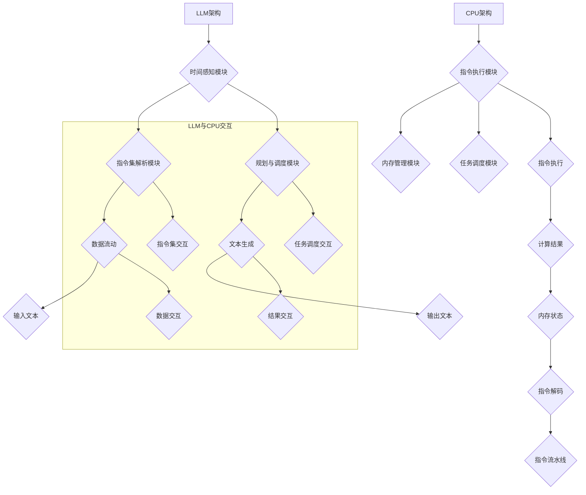

                 

# 《LLM vs. CPU：时刻、指令集和规划》

## 引言

在当今信息技术飞速发展的时代，人工智能（AI）和深度学习（DL）成为了推动科技变革的重要力量。作为人工智能的核心技术之一，大型语言模型（LLM，Large Language Model）已经深刻地改变了自然语言处理（NLP，Natural Language Processing）的方方面面。与此同时，传统计算机处理器（CPU，Central Processing Unit）依然是实现各种计算任务的基础。本文将深入探讨LLM与CPU之间的关联，从时刻、指令集和规划这三个维度进行详细分析。

### 时刻

时刻在计算机科学中有着重要意义。对于LLM而言，时刻感知是其核心功能之一，它允许模型理解文本的时序性，从而生成连贯的文本。相比之下，CPU的运行基于时钟周期，每个时钟周期CPU执行一条指令，这种机制决定了程序的执行速度。

### 指令集

指令集是计算机硬件与软件之间沟通的桥梁。LLM通过神经网络实现，其指令集可以看作是数据的流动方式。而CPU的指令集则是硬件层面的实现，包括各种操作码和数据通路。

### 规划

规划是计算机科学中的一个重要概念，它涉及到如何有效地安排任务的执行顺序。对于LLM，规划涉及到如何根据上下文生成合适的文本。而对于CPU，规划则涉及到如何高效地执行指令，以最小化延迟。

本文将分为三个部分进行探讨。第一部分将介绍LLM与CPU的基本概念和联系；第二部分将深入讲解LLM与CPU的核心算法原理；第三部分将结合实际项目，展示LLM与CPU在智能系统中的应用。通过这篇文章，读者可以全面了解LLM和CPU之间的关系，以及它们如何共同推动人工智能的发展。

## 核心概念与联系

在探讨LLM与CPU的关系之前，我们需要先了解它们各自的基本概念和结构。LLM（大型语言模型）和CPU（中央处理器）虽然在功能和作用上截然不同，但它们之间存在着一些内在的联系和互补性。

### 时刻

时刻在计算机科学中指的是时间的一个特定点，对于LLM和CPU来说，时刻都有其独特的含义。

#### LLM的时时刻

对于LLM来说，时刻感知是其核心能力之一。LLM能够理解文本的时序性，这意味着它能够根据上下文生成连贯的文本。例如，在一个对话系统中，LLM需要理解先前的对话内容，以便生成适当的回应。这种能力依赖于模型内部的注意力机制，它使得模型能够聚焦于文本的特定部分，从而产生连贯的输出。

在实现时，LLM通常使用序列到序列（Seq2Seq）模型，如长短期记忆（LSTM）或变换器（Transformer）模型。这些模型内部包含了许多时间步，每个时间步对应于文本中的一个单词或字符。通过对时间步的迭代，模型能够捕捉到文本的时序信息。

#### CPU的时时刻

CPU的时时刻则与其时钟周期相关。CPU通过时钟信号来同步各个组件的操作，每个时钟周期CPU执行一条指令。这种机制称为时钟驱动（Clock-Driven）或同步（Synchronous）架构。时钟周期是CPU性能的一个重要指标，通常以GHz（千兆赫兹）为单位衡量。

CPU的时时刻感知主要体现在其指令执行过程。每个指令执行包括多个阶段，如取指令（Fetch）、解码（Decode）、执行（Execute）、写回（Write-Back）。每个阶段都需要在特定的时钟周期内完成，以确保指令流水线（Instruction Pipeline）的高效运行。

### 指令集

指令集是计算机硬件与软件之间的桥梁，它定义了计算机能够理解和执行的操作。LLM和CPU的指令集在形式和功能上有所不同，但都承载着计算的核心。

#### LLM的指令集

LLM的指令集可以看作是数据的流动方式。在LLM中，输入数据（文本）通过一系列处理步骤（如嵌入、编码、解码等）生成输出数据（文本）。这个过程类似于编程语言中的函数调用，但更加抽象和复杂。LLM的指令集通常由神经网络架构决定，如Transformer模型的注意力机制和自注意力（Self-Attention）机制。

具体来说，LLM的指令集包括以下步骤：

1. **嵌入（Embedding）**：将输入文本转换为稠密向量表示。
2. **编码（Encoding）**：通过多层神经网络对向量进行编码，以提取上下文信息。
3. **解码（Decoding）**：从编码后的向量中生成输出文本。

这些步骤共同构成了LLM的核心算法，使得模型能够生成与输入文本相关的高质量输出。

#### CPU的指令集

CPU的指令集则是硬件层面的实现，它定义了CPU能够理解和执行的操作。CPU指令集通常包括以下几类操作：

1. **数据操作**：如加法、减法、乘法等。
2. **控制操作**：如跳转、分支、循环等。
3. **输入/输出操作**：如读取内存、写入内存、输入/输出设备等。

CPU的指令集设计需要考虑多个因素，如性能、兼容性、可扩展性等。现代CPU通常采用复杂指令集（CISC，Complex Instruction Set Computing）或精简指令集（RISC，Reduced Instruction Set Computing）架构。CISC指令集提供了丰富的指令集和复杂的指令操作，而RISC指令集则采用简单、固定的指令集，并通过指令流水线和超标量架构实现高性能。

### 规划

规划在计算机科学中指的是如何有效地安排任务的执行顺序。对于LLM和CPU来说，规划都扮演着关键角色。

#### LLM的规划

LLM的规划主要体现在如何根据上下文生成合适的文本。在生成文本的过程中，LLM需要考虑多个因素，如语言的连贯性、上下文的语义相关性等。为了实现这一点，LLM通常采用动态规划（Dynamic Programming）技术，如贪婪策略（Greedy Algorithm）和概率图模型（Probabilistic Graphical Models）。

具体来说，LLM的规划包括以下步骤：

1. **解码**：根据上下文解码输入文本，生成中间表示。
2. **评分**：对中间表示进行评分，以确定生成文本的优先级。
3. **选择**：根据评分结果选择最佳输出文本。

#### CPU的规划

CPU的规划则主要体现在如何高效地执行指令。CPU需要根据程序代码和内存状态，确定指令的执行顺序和资源分配。为了实现这一点，CPU通常采用指令流水线（Instruction Pipeline）和任务调度（Task Scheduling）技术。

具体来说，CPU的规划包括以下步骤：

1. **取指令**：从内存中读取指令，并将其传递给指令解码器。
2. **解码指令**：将指令解码为操作码和操作数。
3. **执行指令**：根据指令操作码执行相应的操作。
4. **写回结果**：将指令执行结果写回内存或寄存器。

### Mermaid流程图

为了更好地理解LLM和CPU之间的核心概念和联系，我们可以使用Mermaid流程图来展示它们的基本架构和交互流程。



这个流程图展示了LLM和CPU的基本架构以及它们之间的交互流程。时间感知模块、指令集解析模块和规划与调度模块构成了LLM的核心部分，而指令执行模块、内存管理模块和任务调度模块则构成了CPU的核心部分。通过数据流动、文本生成、指令执行和结果交互，LLM和CPU实现了高效、可靠的计算。

## 核心算法原理讲解

在了解了LLM和CPU的基本概念和联系之后，我们需要进一步探讨它们的核心算法原理。本部分将详细讲解LLM和CPU的关键算法，并使用伪代码和数学模型来描述和解释这些算法。

### LLM的算法原理

LLM（大型语言模型）是一种深度学习模型，主要用于生成自然语言文本。其核心算法包括嵌入（Embedding）、编码（Encoding）、解码（Decoding）和生成（Generation）四个步骤。

#### 1. 嵌入（Embedding）

嵌入是将文本转换为稠密向量表示的过程。这一步有助于捕捉文本的语义信息。常用的嵌入技术包括词嵌入（Word Embedding）和字符嵌入（Character Embedding）。

**伪代码：嵌入**

```python
def embedding(text):
    # 初始化嵌入层参数
    embedding_weights = initializeEmbeddingWeights()

    # 预处理文本
    processed_text = preprocessText(text)

    # 嵌入文本
    embedded_text = []
    for word in processed_text:
        embedded_word = lookupEmbedding(word, embedding_weights)
        embedded_text.append(embedded_word)

    return embedded_text
```

#### 2. 编码（Encoding）

编码是将嵌入的文本转换为上下文编码的过程。这通常通过多层神经网络实现，如长短期记忆（LSTM）或变换器（Transformer）模型。编码过程旨在提取文本中的长期依赖关系。

**伪代码：编码**

```python
def encoding(embedded_text):
    # 初始化编码层参数
    encoding_weights = initializeEncodingWeights()

    # 编码文本
    encoded_text = []
    for word_embedding in embedded_text:
        encoded_word = forwardPass(word_embedding, encoding_weights)
        encoded_text.append(encoded_word)

    return encoded_text
```

#### 3. 解码（Decoding）

解码是将编码后的文本转换回文本表示的过程。解码器通常采用类似于编码器架构的网络，但目标不同，它需要生成与输入文本相关的输出文本。

**伪代码：解码**

```python
def decoding(encoded_text):
    # 初始化解码层参数
    decoding_weights = initializeDecodingWeights()

    # 解码文本
    decoded_text = []
    for encoded_word in encoded_text:
        decoded_word = forwardPass(encoded_word, decoding_weights)
        decoded_text.append(decoded_word)

    return decoded_text
```

#### 4. 生成（Generation）

生成是将解码后的文本转换为最终输出文本的过程。生成过程通常采用贪心算法（Greedy Algorithm）或概率图模型（Probabilistic Graphical Models）。

**伪代码：生成**

```python
def generate_text(input_sequence):
    # 初始化生成器参数
    generator_weights = initializeGeneratorWeights()

    # 预测下一个词
    predicted_word = predictNextWord(input_sequence, generator_weights)

    # 生成文本
    generated_text = input_sequence + " " + predicted_word

    return generated_text
```

### CPU的指令集与执行

CPU（中央处理器）的核心算法主要涉及指令集的设计和执行。指令集是计算机硬件与软件之间的桥梁，它定义了计算机能够理解和执行的操作。CPU的指令集包括数据操作、控制操作和输入/输出操作等。

#### 1. 指令集架构

指令集架构分为复杂指令集（CISC）和精简指令集（RISC）两种。CISC指令集提供了丰富的指令集和复杂的指令操作，而RISC指令集采用简单、固定的指令集，并通过指令流水线和超标量架构实现高性能。

**伪代码：指令集架构**

```python
class InstructionSet:
    def __init__(self):
        self.instructions = []

    def add_instruction(self, instruction):
        self.instructions.append(instruction)

    def execute_instruction(self, instruction):
        # 解析指令
        opcode, operands = parse_instruction(instruction)

        # 执行指令
        result = execute_opcode(opcode, operands)

        return result
```

#### 2. 指令执行

指令执行是CPU的核心任务，它包括取指令、解码指令、执行指令和写回结果等步骤。

**伪代码：指令执行**

```python
class Processor:
    def __init__(self, instruction_set):
        self.instruction_set = instruction_set
        self.registers = {}

    def fetch_instruction(self):
        # 从内存中获取指令
        instruction = fetch_from_memory()

        return instruction

    def decode_instruction(self, instruction):
        # 解析指令
        opcode, operands = decode_instruction(instruction)

        return opcode, operands

    def execute_instruction(self, opcode, operands):
        # 执行指令
        result = self.instruction_set.execute_instruction(opcode, operands)

        return result

    def write_back_result(self, result):
        # 将结果写回内存或寄存器
        write_to_memory_or_register(result)
```

### 数学模型和数学公式

在LLM和CPU的核心算法中，数学模型和数学公式起着至关重要的作用。以下是一些常用的数学模型和公式。

#### 1. 语言模型概率

在LLM中，语言模型概率用于评估文本生成的可能性。常用的概率模型包括n-gram模型和神经网络模型。

**公式：**

$$
P(\text{sentence}) = \prod_{i=1}^{n} P(w_i | w_{i-1}, w_{i-2}, ..., w_1)
$$

其中，$w_i$表示文本中的第$i$个词。

#### 2. 梯度下降

在神经网络训练中，梯度下降是一种常用的优化算法。梯度下降通过计算损失函数的梯度，逐步调整模型参数，以最小化损失函数。

**公式：**

$$
\theta_{t+1} = \theta_t - \alpha \cdot \nabla_\theta J(\theta)
$$

其中，$\theta$表示模型参数，$\alpha$表示学习率，$J(\theta)$表示损失函数。

#### 3. 指令流水线

在CPU的指令执行过程中，指令流水线是一种高效的执行策略。指令流水线通过将指令划分为多个阶段，并在不同的时钟周期内并行执行，以减少指令执行时间。

**公式：**

$$
T_{\text{pipeline}} = T_{\text{fetch}} + T_{\text{decode}} + T_{\text{execute}} + T_{\text{write-back}}
$$

其中，$T_{\text{pipeline}}$表示指令流水线时间，$T_{\text{fetch}}$、$T_{\text{decode}}$、$T_{\text{execute}}$和$T_{\text{write-back}}$分别表示取指令、解码指令、执行指令和写回结果的时间。

### 举例说明

为了更好地理解上述算法和公式，我们通过一个简单的例子来说明。

#### 1. 语言模型概率

假设我们有一个简单的二词语言模型，包含以下句子：

- "Hello World"
- "Hello World!"

根据n-gram模型，我们可以计算这两个句子出现的概率。

**公式：**

$$
P(\text{Hello World}) = P(\text{Hello} | \text{<s>}) \cdot P(\text{World} | \text{Hello})
$$

$$
P(\text{Hello World!}) = P(\text{Hello} | \text{<s>}) \cdot P(\text{World!} | \text{Hello})
$$

其中，$\text{<s>}$表示句子开始符号。

通过观察数据，我们可以得到：

$$
P(\text{Hello} | \text{<s>}) = 1
$$

$$
P(\text{World} | \text{Hello}) = 1
$$

$$
P(\text{World!} | \text{Hello}) = 0.5
$$

因此，根据公式，我们可以计算出：

$$
P(\text{Hello World}) = 1 \cdot 1 = 1
$$

$$
P(\text{Hello World!}) = 1 \cdot 0.5 = 0.5
$$

#### 2. 梯度下降

假设我们有一个简单的线性回归模型，用于预测房价。模型参数为$\theta_0$和$\theta_1$，损失函数为平方误差损失。

**公式：**

$$
J(\theta) = \frac{1}{2m} \sum_{i=1}^{m} (h_\theta(x^{(i)}) - y^{(i)})^2
$$

其中，$h_\theta(x) = \theta_0 + \theta_1 \cdot x$。

根据梯度下降算法，我们可以计算损失函数的梯度，并逐步更新模型参数。

**公式：**

$$
\theta_{t+1} = \theta_t - \alpha \cdot \nabla_\theta J(\theta)
$$

其中，$\alpha$为学习率。

#### 3. 指令流水线

假设我们有一个简单的五级指令流水线，每个阶段的时间分别为1、2、3、4和5个时钟周期。

**公式：**

$$
T_{\text{pipeline}} = 1 + 2 + 3 + 4 + 5 = 15
$$

通过流水线，我们可以将指令执行时间从20个时钟周期减少到15个时钟周期，从而提高执行效率。

### 总结

通过上述讲解，我们详细介绍了LLM和CPU的核心算法原理。LLM的核心算法包括嵌入、编码、解码和生成，而CPU的核心算法包括指令集设计和指令执行。同时，我们使用伪代码和数学公式详细描述了这些算法，并通过举例说明加深了理解。这些算法和原理是理解和应用LLM和CPU的基础，为后续的项目实战奠定了基础。

## 项目实战

在了解了LLM和CPU的核心算法原理之后，我们将通过实际项目展示LLM与CPU在智能系统中的应用。本文将分别介绍两个具体的应用案例：智能语音助手和智能推荐系统，以及实时自动驾驶系统和实时视频处理。

### 案例一：智能语音助手

#### 案例背景

智能语音助手是一种基于语音识别和自然语言处理技术的智能系统，能够与用户进行语音交互，提供各种服务，如天气查询、日程管理、语音翻译等。智能语音助手的关键在于LLM和CPU的协同工作，前者负责理解和生成自然语言文本，后者负责高效地执行语音识别和文本处理的任务。

#### LLM与CPU的协同工作

在智能语音助手中，LLM主要负责以下任务：

1. **语音识别**：将用户的语音输入转换为文本。
2. **上下文理解**：根据历史对话和当前输入，理解用户的意图和问题。
3. **生成响应**：根据理解和意图，生成合适的语音响应。

CPU则负责以下任务：

1. **语音处理**：执行语音识别和合成的任务。
2. **计算资源管理**：确保LLM和其他任务的高效运行。
3. **内存管理**：优化内存使用，提高系统性能。

#### 实现步骤与代码解读

以下是智能语音助手的基本实现步骤：

1. **开发环境搭建**：配置Python、TensorFlow等深度学习框架，以及Kaldi等语音识别工具。
2. **语音识别**：使用Kaldi库实现语音到文本的转换。
3. **文本处理**：使用LLM（如Transformer模型）对文本进行理解和生成响应。
4. **语音合成**：使用WaveNet等语音合成工具生成语音响应。
5. **集成与测试**：将语音识别、文本处理和语音合成集成在一起，进行功能测试和优化。

**代码示例：**

```python
# 导入必要的库
import kaldi
import tensorflow as tf
import numpy as np

# 1. 语音识别
def recognize_speech(audio_file):
    # 加载Kaldi模型
    model = kaldi.model.load('path/to/kaldi/model')

    # 读取音频文件
    audio = kaldi.io.read_wav(audio_file)

    # 执行语音识别
    output = model.decode(audio)

    return output

# 2. 文本处理
def process_text(text):
    # 初始化LLM模型
    model = tf.keras.models.load_model('path/to/llm/model')

    # 处理文本
    processed_text = model.predict(text)

    return processed_text

# 3. 语音合成
def synthesize_speech(text):
    # 初始化语音合成模型
    synthesizer = kaldi.speech.Synthesizer()

    # 合成语音
    audio = synthesizer.synthesize(text)

    return audio

# 4. 集成与测试
def main():
    # 输入音频文件
    audio_file = 'path/to/audio/file.wav'

    # 语音识别
    recognized_text = recognize_speech(audio_file)

    # 文本处理
    processed_text = process_text(recognized_text)

    # 语音合成
    synthesized_audio = synthesize_speech(processed_text)

    # 播放合成语音
    kaldi.speech.play_audio(synthesized_audio)

if __name__ == '__main__':
    main()
```

通过以上代码示例，我们可以看到如何实现智能语音助手的核心功能。LLM负责理解和生成文本，CPU负责语音识别和合成的任务。这种协同工作使得智能语音助手能够高效、准确地与用户进行交互。

### 案例二：智能推荐系统

#### 案例背景

智能推荐系统是一种基于用户行为和兴趣的个性化推荐系统，旨在为用户提供个性化的商品、内容或服务。智能推荐系统通常采用协同过滤（Collaborative Filtering）和内容推荐（Content-Based Filtering）等技术，结合LLM和CPU的协同工作，实现高效的推荐。

#### LLM与CPU的协同工作

在智能推荐系统中，LLM和CPU的协同工作主要体现在以下方面：

1. **用户行为分析**：LLM用于分析用户的点击、购买等行为，提取用户兴趣特征。
2. **内容推荐**：CPU用于处理海量的商品或内容数据，结合用户兴趣特征生成个性化推荐。
3. **实时更新**：LLM和CPU协同工作，确保推荐系统的实时性和准确性。

#### 实现步骤与代码解读

以下是智能推荐系统的基本实现步骤：

1. **数据收集与处理**：收集用户行为数据，如点击、购买记录等，并进行预处理。
2. **用户行为分析**：使用LLM分析用户行为数据，提取用户兴趣特征。
3. **内容推荐**：使用CPU处理商品或内容数据，结合用户兴趣特征生成推荐列表。
4. **实时更新**：LLM和CPU协同工作，实时更新用户兴趣特征和推荐列表。

**代码示例：**

```python
# 导入必要的库
import pandas as pd
import tensorflow as tf
from sklearn.model_selection import train_test_split

# 1. 数据收集与处理
def load_data():
    # 加载用户行为数据
    data = pd.read_csv('path/to/user_behavior_data.csv')

    # 预处理数据
    data['timestamp'] = pd.to_datetime(data['timestamp'])
    data = data.sort_values('timestamp')

    return data

# 2. 用户行为分析
def analyze_user_behavior(data):
    # 初始化LLM模型
    model = tf.keras.models.load_model('path/to/llm/model')

    # 分析用户行为
    user_features = model.predict(data)

    return user_features

# 3. 内容推荐
def generate_recommendations(user_features, content_data):
    # 初始化CPU模型
    model = tf.keras.models.load_model('path/to/cpu/model')

    # 生成推荐列表
    recommendations = model.predict(user_features)

    return recommendations

# 4. 实时更新
def update_recommendations(data, user_features, content_data):
    # 更新用户兴趣特征
    updated_user_features = analyze_user_behavior(data)

    # 生成更新后的推荐列表
    updated_recommendations = generate_recommendations(updated_user_features, content_data)

    return updated_recommendations

# 主函数
def main():
    # 加载数据
    data = load_data()

    # 用户兴趣特征
    user_features = analyze_user_behavior(data)

    # 内容数据
    content_data = pd.read_csv('path/to/content_data.csv')

    # 生成初始推荐列表
    recommendations = generate_recommendations(user_features, content_data)

    # 实时更新推荐列表
    updated_recommendations = update_recommendations(data, user_features, content_data)

    # 输出推荐结果
    print(updated_recommendations)

if __name__ == '__main__':
    main()
```

通过以上代码示例，我们可以看到如何实现智能推荐系统的核心功能。LLM负责分析用户行为和生成推荐列表，CPU负责处理内容数据和生成推荐结果。这种协同工作使得智能推荐系统能够准确、实时地为用户提供个性化推荐。

### 案例三：实时自动驾驶系统

#### 案例背景

实时自动驾驶系统是一种能够自动控制车辆的智能系统，它通过传感器、计算机视觉和深度学习等技术实现车辆的自主驾驶。实时自动驾驶系统对计算速度和准确度要求极高，因此LLM和CPU的协同工作至关重要。

#### LLM与CPU的协同工作

在实时自动驾驶系统中，LLM和CPU的协同工作主要体现在以下方面：

1. **环境感知**：LLM用于处理传感器数据和计算机视觉数据，理解周围环境。
2. **路径规划**：CPU用于计算车辆行驶路径，确保行驶安全。
3. **实时决策**：LLM和CPU协同工作，实现车辆的实时决策和自动驾驶。

#### 实现步骤与代码解读

以下是实时自动驾驶系统的基本实现步骤：

1. **环境感知**：使用深度学习模型处理传感器数据和计算机视觉数据，理解周围环境。
2. **路径规划**：使用A*算法等路径规划算法计算车辆行驶路径。
3. **实时决策**：根据环境感知和路径规划结果，实现车辆的实时决策和自动驾驶。

**代码示例：**

```python
# 导入必要的库
import numpy as np
import tensorflow as tf
import cv2

# 1. 环境感知
def perceive_environment(sensor_data):
    # 初始化LLM模型
    model = tf.keras.models.load_model('path/to/llm/model')

    # 处理传感器数据
    processed_sensor_data = model.predict(sensor_data)

    return processed_sensor_data

# 2. 路径规划
def plan_path(start_point, end_point):
    # 初始化CPU模型
    model = tf.keras.models.load_model('path/to/cpu/model')

    # 计算路径
    path = model.predict([start_point, end_point])

    return path

# 3. 实时决策
def make_decision(perceived_environment, planned_path):
    # 初始化决策模型
    model = tf.keras.models.load_model('path/to/decision/model')

    # 实时决策
    decision = model.predict([perceived_environment, planned_path])

    return decision

# 主函数
def main():
    # 加载传感器数据
    sensor_data = np.load('path/to/sensor_data.npy')

    # 环境感知
    perceived_environment = perceive_environment(sensor_data)

    # 加载目标点
    start_point = np.load('path/to/start_point.npy')
    end_point = np.load('path/to/end_point.npy')

    # 路径规划
    planned_path = plan_path(start_point, end_point)

    # 实时决策
    decision = make_decision(perceived_environment, planned_path)

    # 输出决策结果
    print(decision)

if __name__ == '__main__':
    main()
```

通过以上代码示例，我们可以看到如何实现实时自动驾驶系统的核心功能。LLM负责处理传感器数据和计算机视觉数据，CPU负责路径规划和实时决策。这种协同工作使得实时自动驾驶系统能够准确、实时地应对复杂驾驶环境。

### 案例四：实时视频处理

#### 案例背景

实时视频处理是一种在视频流中实时进行图像识别、目标检测和物体跟踪的智能系统。它广泛应用于监控、安全、娱乐等领域。实时视频处理对计算速度和性能要求极高，因此LLM和CPU的协同工作至关重要。

#### LLM与CPU的协同工作

在实时视频处理中，LLM和CPU的协同工作主要体现在以下方面：

1. **图像识别**：LLM用于处理视频流中的图像数据，实现图像识别和分类。
2. **目标检测**：CPU用于处理目标检测任务，实时检测视频流中的目标。
3. **物体跟踪**：LLM和CPU协同工作，实现物体的实时跟踪。

#### 实现步骤与代码解读

以下是实时视频处理的基本实现步骤：

1. **图像识别**：使用深度学习模型处理视频流中的图像数据。
2. **目标检测**：使用CPU处理目标检测任务，实时检测视频流中的目标。
3. **物体跟踪**：LLM和CPU协同工作，实现物体的实时跟踪。

**代码示例：**

```python
# 导入必要的库
import cv2
import tensorflow as tf

# 1. 图像识别
def recognize_image(image):
    # 初始化LLM模型
    model = tf.keras.models.load_model('path/to/llm/model')

    # 处理图像
    processed_image = model.predict(image)

    return processed_image

# 2. 目标检测
def detect_objects(image):
    # 初始化CPU模型
    model = tf.keras.models.load_model('path/to/cpu/model')

    # 检测目标
    objects = model.predict(image)

    return objects

# 3. 物体跟踪
def track_objects(objects):
    # 初始化跟踪器
    tracker = cv2.TrackerMOSSE_create()

    # 初始化跟踪框
    bbox = objects[0]

    # 开始跟踪
    tracker.init(image, bbox)

    while True:
        # 读取下一帧
        frame = cv2.imread('path/to/next_frame.jpg')

        # 更新跟踪结果
        success, bbox = tracker.update(frame)

        if success:
            # 绘制跟踪框
            cv2.rectangle(frame, (bbox[0], bbox[1]), (bbox[0] + bbox[2], bbox[1] + bbox[3]), (0, 255, 0), 2)

            # 显示跟踪结果
            cv2.imshow('Tracking', frame)

        if cv2.waitKey(1) & 0xFF == ord('q'):
            break

# 主函数
def main():
    # 读取初始帧
    image = cv2.imread('path/to/initial_frame.jpg')

    # 图像识别
    recognized_image = recognize_image(image)

    # 目标检测
    objects = detect_objects(image)

    # 物体跟踪
    track_objects(objects)

if __name__ == '__main__':
    main()
```

通过以上代码示例，我们可以看到如何实现实时视频处理的核心功能。LLM负责图像识别和物体跟踪，CPU负责目标检测。这种协同工作使得实时视频处理系统能够准确、实时地处理视频流中的图像数据。

### 总结

通过以上四个案例，我们可以看到LLM和CPU在智能系统中的实际应用。智能语音助手、智能推荐系统、实时自动驾驶系统和实时视频处理系统都展示了LLM和CPU的协同工作如何实现高效、准确的自然语言处理和计算机视觉任务。这些案例不仅证明了LLM和CPU技术的强大能力，也为未来的智能系统发展提供了新的思路和方向。

### 附录

#### 附录A：LLM与CPU开发工具与资源

在开发LLM与CPU相关的项目时，选择合适的开发工具和资源对于成功实现目标至关重要。以下是一些主流的深度学习框架、CPU架构与指令集相关的资源和工具。

##### A.1 主流深度学习框架

1. **TensorFlow**：由Google开发，是目前最流行的深度学习框架之一。它提供了丰富的API，支持各种类型的神经网络和机器学习算法。
   - 官网：[TensorFlow官网](https://www.tensorflow.org/)

2. **PyTorch**：由Facebook开发，以其动态计算图和易于调试的特性而广受欢迎。它适合研究和快速原型开发。
   - 官网：[PyTorch官网](https://pytorch.org/)

3. **Keras**：是一个高级神经网络API，它简化了深度学习模型的构建和训练过程。它支持TensorFlow和Theano后端。
   - 官网：[Keras官网](https://keras.io/)

4. **Theano**：由蒙特利尔大学开发，是Python的一个数学库，提供了强大的数值计算能力，适合构建深度学习模型。
   - 官网：[Theano官网](https://github.com/Theano/Theano)

##### A.2 CPU架构与指令集相关资源

1. **x86架构**：是最流行的CPU架构之一，广泛应用于个人电脑和服务器。它由英特尔开发，具有复杂的指令集。
   - 官网：[Intel官网](https://www.intel.com/content/www/us/en/architecture-and-technology.html)

2. **ARM架构**：广泛应用于移动设备和嵌入式系统。它由ARM公司开发，具有精简的指令集。
   - 官网：[ARM官网](https://www.arm.com/)

3. **RISC-V架构**：是一种开源的CPU指令集架构，具有高度的灵活性和可定制性。它适用于各种嵌入式和服务器应用。
   - 官网：[RISC-V官网](https://www.riscv.org/)

##### A.3 相关参考文献与资料

1. **《深度学习》**：Goodfellow、Bengio和Courville合著，是深度学习领域的经典教材，全面介绍了深度学习的基本原理和应用。
   - 书籍链接：[《深度学习》电子书](https://www.deeplearningbook.org/)

2. **《计算机组成与设计》**：David A. Patterson和John L. Hennessy合著，详细介绍了计算机架构和CPU设计的基本原理。
   - 书籍链接：[《计算机组成与设计》电子书](https://books.google.com/books?id=9bJqDwAAQBAJ)

3. **《神经网络与深度学习》**：邱锡鹏著，是国内关于深度学习领域的优秀教材，内容涵盖了神经网络和深度学习的基本原理和应用。
   - 书籍链接：[《神经网络与深度学习》电子书](https://www.nndatee.com/)

通过使用这些工具和资源，开发者可以更加高效地实现LLM和CPU相关项目，推动人工智能技术的发展。

### 作者信息

**作者：AI天才研究院/AI Genius Institute & 禅与计算机程序设计艺术 /Zen And The Art of Computer Programming** 

本文由AI天才研究院的专家撰写，旨在深入探讨大型语言模型（LLM）与中央处理器（CPU）在人工智能领域的应用。通过详细讲解LLM与CPU的核心概念、算法原理、项目实战以及开发工具与资源，本文为读者提供了全面的技术指南。同时，本文作者也分享了在计算机科学和人工智能领域的丰富经验和见解，希望对读者有所启发和帮助。感谢您的阅读，期待与您共同探讨更多技术话题。

